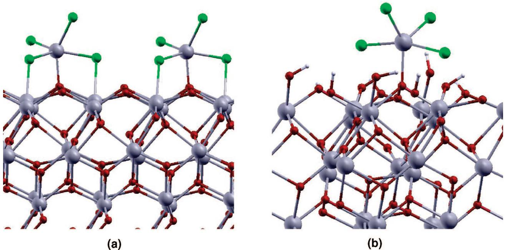
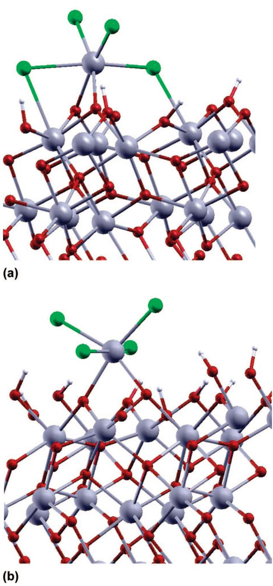
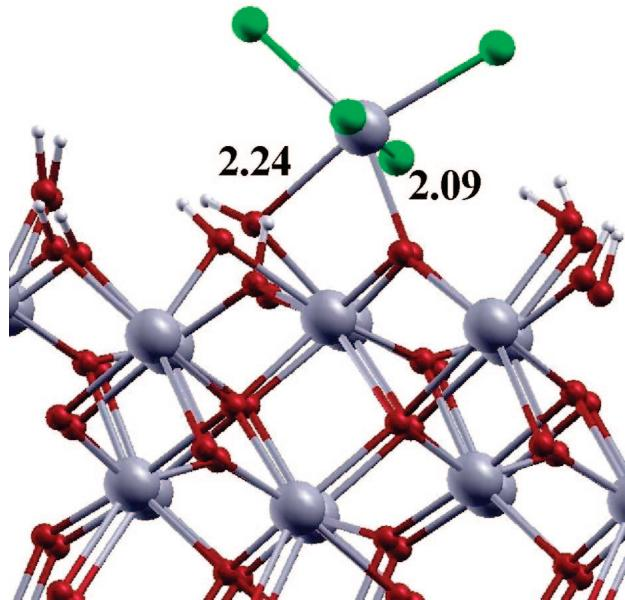
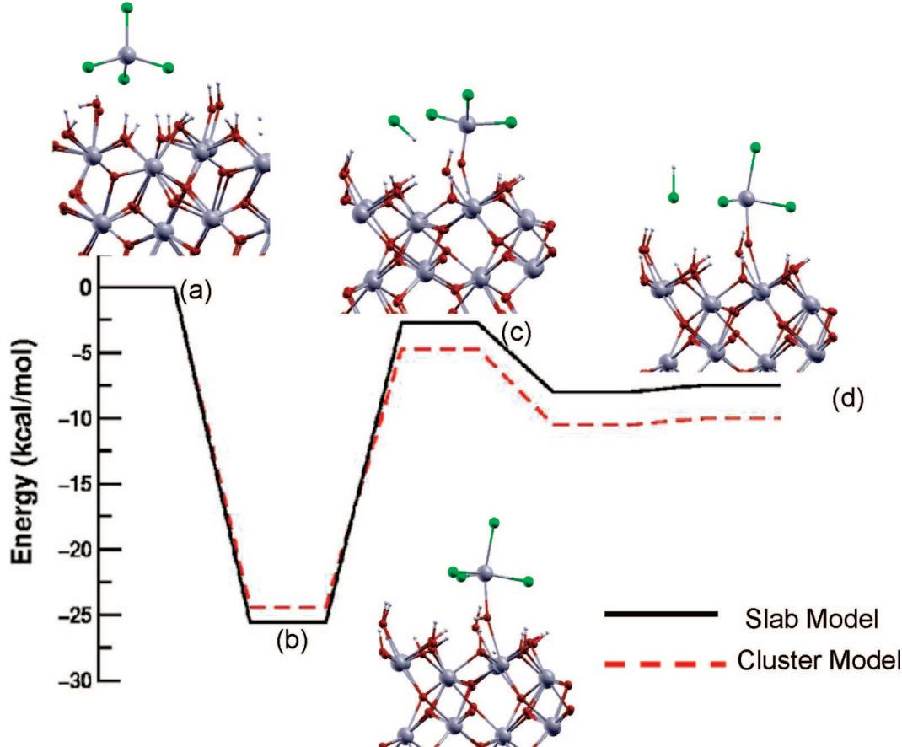
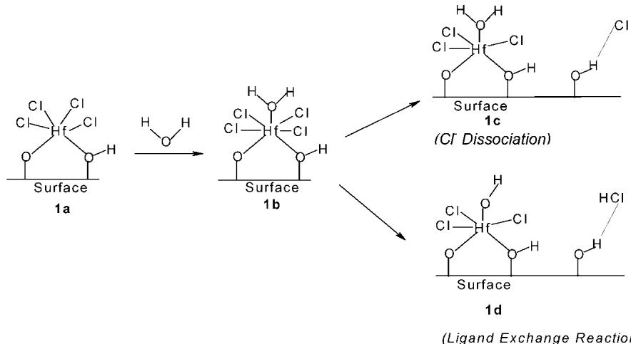
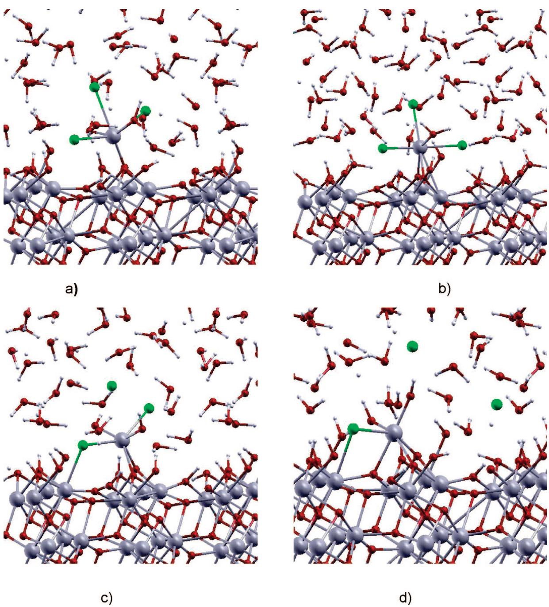
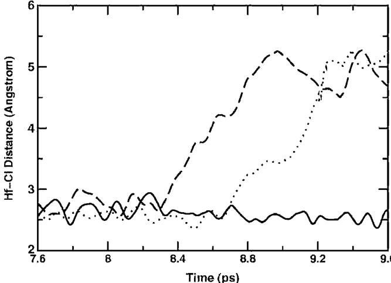

# JACS A R T I C L E S

Published on Web 08/13/2008

# Atomic Layer Deposition of Hafnium Oxide from Hafnium Chloride and Water

Atash B. Mukhopadhyay,† Charles B. Musgrave,† and Javier Fdez. Sanz*†

Department of Chemical Engineering, Stanford University, 380 Roth Way, Stanford, California 94305, and Departamento de Quimica Fisica, Universidad de Sevilla, E- 41012 Sevilla, Spain

Received March 6, 2008; E- mail: sanz@us.es

Abstract: Hafnium oxide  $(\mathrm{HfO_2})$  is a leading candidate to replace silicon oxide as the gate dielectric for future generation metal- oxide- semiconductor based nanoelectronic devices. Atomic layer deposition (ALD) has recently gained interest because of its suitability for fabrication of conformal films with thicknesses in the nanometer range. This study uses periodic density functional theory (DFT) to investigate the mechanisms of both half- reactions occurring on the growing surface during the ALD of  $\mathrm{HfO_2}$  using  $\mathrm{HfCl_4}$  and water as precursors. We find that the adsorption energy and the preferred site of adsorption of the metal precursor are strong functions of the water coverage. As water coverage increases, the metal precursor preferentially interacts with multiple surface adsorption sites. During the water pulse the removal of Cl can be facilitated by either a ligand exchange reaction or the dissociation of Cl upon increase in coordination of the Hf atom of the precursor. Our predicted potential energy surface indicates that a more likely mechanism is hydration of the adsorbed Hf complex up to a coordination number of 7, followed by the dissociation of a chloride ion that is stabilized by solvation. Born- Oppenheimer molecular dynamics (BOMD) simulations of an adsorbed metal precursor in the presence of a multilayer of water shows that Cl dissociation is facile in sufficient water molecules are present to solvate the  $\mathrm{Cl^- }$  anions. Hence, solvation plays a crucial role during the water pulse and provides an alternative explanation for why ALD growth rates for this system decrease at high temperatures.

# Introduction

IntroductionMoore's law, which states that the number of electronic devices in integrated circuits increases exponentially over time, has driven the microelectronic industry for the past several decades. However, continued scaling of semiconductor devices requires the integration of novel fabrication processes and new materials into future semiconductor technology. For example, as the thickness of the  $\mathrm{SiO_2}$  gate dielectric in silicon metal oxide- semiconductor field effect transistor devices approaches atomic dimensions, the tunneling current through the gate dielectric increases exponentially and serious performance and reliability issues arise. Hence, there is a need for an alternative higher permittivity gate dielectric (high-  $k$ ) to replace  $\mathrm{SiO_2}$ . In addition, the deposition process must result in uniform, conformal and pinhole- free thin films of the high-  $k$  dielectric material with atomic level control over large areas.  $\mathrm{HfO_2}$  has become a leading candidate to replace  $\mathrm{SiO_2}$  due to its relatively high dielectric constant, sufficient band offset from Si, low electrical conductivity, and good thermodynamic stability against silicide formation. Among other possibilities, atomic layer deposition (ALD) has been proposed for the deposition of high-  $k$  gate dielectrics, including  $\mathrm{HfO_2}$  because of its ability to deposit uniform and conformal thin films. ALD can be viewed as a chemical vapor deposition process based on sequential, self- terminating reactions between the surface and precursors. Because the precursors are introduced into the reactor separately, ALD does not involve gas phase reactions, meaning that it is ideally a completely surface- reaction- limited process. To achieve the desirable characteristics of ALD deposited films, the precursors must possess several key chemical and physical properties. They must be volatile and thermally stable and must either chemisorb on the substrate or react rapidly with the surface groups resulting from the previous pulse in order to reach the saturation stage rapidly and thereby ensure a reasonable deposition rate.

ALD of  $\mathrm{HfO_2}$  using  $\mathrm{HfCl_4}$  as the metal precursor and water as the oxygen source has been studied extensively. It is widely believed that in the ALD of metal oxides using water

Table 1. Adsorption Energies of  $\mathsf{HfCl}_4$  in kcal/mol) on Different Adsorption Sites on the (001) Surface of  $\mathsf{HfO}_2$  as a Function of Water Coverage  

<table><tr><td>coverage 
(H2O molecule.nm-2)a</td><td>bridge-O site</td><td>hydroxyl site</td><td>dibridge sites</td><td>bridge-hydroxyl sites</td><td>di-hydroxyl sites</td></tr><tr><td>0 (0%)</td><td>40.7</td><td>-</td><td>-</td><td>-</td><td>-</td></tr><tr><td>1.9 (25%)</td><td>26.9</td><td>4.7</td><td>35.2</td><td>33.4</td><td>16.9</td></tr><tr><td>3.8 (50%)</td><td>23.5</td><td>14.7</td><td>33.8</td><td>35.6</td><td>16.1</td></tr><tr><td>5.7 (75%)</td><td>25.5</td><td>15.8</td><td>25.6</td><td>32.4</td><td>20.1</td></tr><tr><td>7.6 (100%)</td><td>-</td><td>25.5</td><td>-</td><td>-</td><td>22.3</td></tr></table>

The percentage of water coverage is shown in parentheses.

as the oxygen source that surface hydroxyls play an important role as the reactive species that remain on the surface of the growing film after the water pulse.13- 15 During the metal precursor  $\mathrm{(HfCl_4)}$  pulse hydroxyl groups are thought to react with the incoming precursor producing a surface bound complex that consists of the precursor with a reduced number of chlorine ligands. In the subsequent water pulse, this intermediate reacts with water and the surface is converted from chlorine termination to hydroxyl termination. These reactions of gaseous  $\mathrm{HfCl_4}$  and  $\mathrm{H}_2\mathrm{O}$  with the surface during the precursor and water pulses, respectively, can be summarized by the two half- reactions:

$$
\begin{array}{r}\mathrm{HfO}_2(\mathrm{OH})_m + n\mathrm{HfCl}_4(\mathrm{g})\longrightarrow \mathrm{HfO}_2(\mathrm{OH})_{m - n}(\mathrm{O} - \mathrm{HfCl}_3)_n + \\ n\mathrm{HCl}(\mathrm{g})\\ \mathrm{HfO}_2(\mathrm{OH})_{m - n}(\mathrm{O} - \mathrm{HfCl}_3)_n + \\ 3n\mathrm{H}_2\mathrm{O}(\mathrm{g})\longrightarrow \mathrm{HfO}_2(\mathrm{OH})_{m - n}(\mathrm{O} - \mathrm{Hf}(\mathrm{OH})_3)_n + 3n\mathrm{HCl}(\mathrm{g}) \end{array} \tag{2}
$$

where  $\mathrm{HfO}_2(\mathrm{OH})_m$  stands for a hydroxylated  $\mathrm{HfO_2}$  surface.

Due to the high technological relevance of ALD processes, much experimental work has been devoted to understanding of the details of the mechanism. However, although the usefulness of computational techniques is widely recognized, the number of theoretical studies on this subject appears to be relatively low. In the case of the ALD of  $\mathrm{HfO_2}$  this dearth is not surprising due to the well- known hurdle involved in the realistic modeling of both transition metal surfaces and surface reactions. Thus, most of the previous mechanistic work has addressed the ALD of  $\mathrm{HfO_2}$  on silicon and silicon oxide substrates.11,12,16- 19 Yet, the number of mechanistic studies investigating the ALD of  $\mathrm{HfO_2}$  on as- grown  $\mathrm{HfO_2}$  is even more scarce. Furthermore, in order to make the simulations tractable, the few theoretical studies that have been done describe the surface using cluster models of limited size which neglect the effect of both the environment relaxation and the electrostatic field of the extended surface. Similarly, the ALD of related transition metal oxides, such as  $\mathrm{TiO_2}$  and  $\mathrm{ZrO_2}$  on  $\mathrm{SiO_2}$  using their corresponding halides as precursors has also been theoretically studied using either naked cluster models20 or introducing environment effects through a QM/MM approach.21 Moreover, a common aspect of the simulations of metal oxide ALD that use  $\mathrm{SiO_2}$  surfaces as a substrate are intended to model the initial substrate conditions that take place in the first few ALD cycles, which most likely differs significantly from the mechanisms on the as- grown oxide.

ALD under steady state conditions, i.e., conditions subsequent to initiation and the point at which the thickness of the deposited  $\mathrm{HfO_2}$  film has increased so that each ALD cycle is identical to the previous cycle, involves ALD on as- grown  $\mathrm{HfO_2}$  surfaces. However, modeling of these surfaces brings additional challenges commonly found in the simulation of transition metal oxides, which are better described using periodic slab models. Also, different ALD growth conditions can lead to changes in the  $\mathrm{HfO_2}$  growth surface because different crystal faces of  $\mathrm{HfO_2}$  are stabilized differently by the nature of the water/hydroxyl film on the growing surface, which depends on the temperature and water partial pressure. We previously reported first principles studies of the structure and stability of various dehydrated and hydrated monoclinic  $\mathrm{HfO_2}$  surfaces22,23 that predicted that the monoclinic  $\mathrm{HfO_2}$  (11) face is the most stable under strictly anhydrous conditions, but the presence of water decreases the surface energy of the  $\mathrm{m - HfO_2}$  (001) face, making it thermodynamically more stable under ALD process conditions. The hydroxylated (001)  $\mathrm{HfO_2}$  surface consists of different adsorption sites, including bridging oxygen sites and hydroxyl groups. An additional challenge to take into account is the variability of the coordination number of Hf atoms, as it is a transition metal element, and exhibits coordination numbers ranging from 4 to 8. Although this feature has not been considered in any of the previous studies, the activation barriers of the elementary ALD reactions may be highly sensitive to the Hf coordination number.

Here, we present a theoretical study of the ALD of  $\mathrm{HfO_2}$  on as- grown  $\mathrm{HfO_2}$  using state- of- the- art periodic DFT simulations and for this purpose have performed a detailed analysis of the chemical mechanisms of both half- reactions occurring on the growing surface during the ALD of  $\mathrm{HfO_2}$  using  $\mathrm{HfCl_4}$  and water. This contribution does not report a comprehensive study of all active pathways subsequent to the reactions of the precursor and water with the growing surface. For example, reactions leading to densification, such as condensation reactions between neighboring hydroxyl groups, are not reported here. To the best of our knowledge, this is the first theoretical simulation to consider the effect of different coordination numbers of Hf as well as the effect of various adsorption sites on the reaction energetics of the ALD process. The first phase of this study involves an approach based on a series of static structural optimizations and calculated energies at low water coverage. However, during the water pulse, i.e., in the high water coverage regime, there is a large number of possible configurations that makes a comprehensive investigation of the chemistry during the water pulse from a static point of view extremely complex (and likely incomplete). Therefore, we also carried out first principles molecular dynamics simulations on the Born- Oppenheimer potential energy hypersurface. These simulations showed that under the water pulse conditions, a more efficient mechanism for the removal of chlorine is viable that involves

  
Figure 1. Structure of adsorbed  $\mathrm{HfCl_4}$  at bridge oxygen sites of the monoclinic  $\mathrm{HfO_2}$  (001) surface with coverages of (a) 0 and (b)  $5.7\mathrm{H}_2\mathrm{O}$  molecule.  $\mathrm{nm}^{-2}$ . The white, red, green, and gray spheres represent hydrogen, oxygen, chlorine, and hafnium atoms, respectively.

subsequent ligand elimination reactions from the adsorbed metal precursor driven by solvation of chloride ions.

# Surface Models and Computational Approach

The first step in the modeling of the  $\mathrm{m - HfO_2}$  surface concerns the choice of the exposed face and degree of hydroxylation. Under growth conditions both the monoclinic (111) and (001) faces of  $\mathrm{HfO_2}$  have been observed with the ratio of the two depending on the experimental variables. As stated above, we showed that although the anhydrous (111) surface is more stable, the (001) termination is preferred after surface hydroxylation. Therefore, given that the reaction involves water as an oxygen source, we chose the  $\mathrm{m - HfO_2}$  (001) face for further modeling. Also, with the aim of modeling the extended nature of the surface we adopted the well- known supercell approach with periodic three- dimensional spanning. The supercell consisted of a  $2\times 2$  array of unit cells four- layers thick and vacuum with the thickness of the slab chosen so that both surface energies and surface atom displacements were converged. Every layer of  $\mathrm{HfO_2}$  is composed of three atomic sublayers with a central plane containing HFO and two planes of bridging oxygen atoms above and below the central plane. We found that a vacuum width of  $15\mathrm{\AA}$  was wide enough to prevent slab- to- slab interactions. Further replication of this supercell along the three lattice vectors resulted in a final model consisting of an arrangement of parallel  $\mathrm{HfO_2}$  slabs exhibiting the (001) surface separated by vacuum. Additional computational details are provided in reference 22.

Density functional theory (DFT) based calculations were carried out under periodic conditions using the Vienna ab initio simulation package (VASP).24,25 In these calculations the energy was calculated using the PW91 generalized gradient approximation (GGA) implementation of DFT proposed by Perdew et al.26,27 The electronic states were expanded in a plane wave basis set with an energy cutoff of  $450\mathrm{eV}$ . The calculations were performed using the projected augmented wave (PAW) approach as implemented in the VASP code.28 For Hf atoms, the semicore 5p electrons have been included in addition to the  $5\mathrm{d}^2$  and  $6\mathrm{s}^2$  valence electrons because we previously found that explicitly including the 5p electrons is required in order to obtain correct lattice parameters for bulk  $\mathrm{HfO_2}$ .22 The 2s and 2p electrons of O atoms and the 3s and 3p electrons of Cl atoms were explicitly described. Preliminary test calculations with k- point sampling meshes of varying size revealed that computations at the 1 point were reasonable while allowing a noticeable speed up of the extensive calculations here reported. Thus, comparing energies calculated using a  $2\times 2\times 1$  mesh to those calculated using just the 1s point we found the energy converged to within  $0.01\%$  and nearly identical optimized structures, while the speedup was about  $450\%$ . Such an improvement was especially desirable for the calculations of transitions states as well as for the intensive molecular dynamics simulations. This approximation also seems reasonable bearing in mind the size of the cell and the number of atoms of our model: 120- 130 atoms in the static calculations and more than 240 atoms in the MD simulations.

Forces on the ions were calculated using the Hellmann- Feynman theorem and adjusted using the Harris- Foulkes correction to the forces.29 This approach for calculating the forces allows a geometry optimization using the conjugate- gradient scheme. Iterative relaxation of atomic positions was stopped when the change in total energy between successive steps was less than  $0.001\mathrm{eV}$ . The transition states were located using the climbing image nudged elastic band method as implemented in VASP.30,31

# Results and Discussion

First Half- Reaction or Metal Precursor Pulse. To investigate the reactions of  $\mathrm{HfCl_4}$  with the growing surface we must first determine the surface sites present under the growth conditions and then how the precursor interacts with these sites. The anhydrous  $\mathrm{m - HfO_2}$  (001) surface is terminated by oxygen atoms that are coordinated to two hafnium atoms. Relative to the usual bulk coordination it exhibits a large number of broken Hf- O

  
Figure 2. Structure of adsorbed  $\mathrm{HfCl_4}$  at dibridge oxygen sites on the  $\mathrm{m - HfO_2}$  (001) surface with coverages of (a) 1.9 and (b)  $5.7\mathrm{H}_2\mathrm{O}$  molecule.  $\mathrm{nm}^{-2}$ .

bonds  $(22.8~\mathrm{nm}^{- 2})$ .23 Water molecules readily adsorb on this surface leading to a hydrated surface whose structure strongly depends on the experimental conditions. The water on  $\mathrm{m - HfO_2}$  (001) phase diagram theoretically estimated from DFT periodic calculations23 shows that water dissociatively chemisorbs on the  $\mathrm{m - HfO_2}$  (001) face and gives rise to a surface with a wide range of hydroxyl coverages. Therefore, because the experimental conditions for  $\mathrm{HfO_2}$  ALD vary during the process, for example, during transients, it seems reasonable to begin by first considering the possible scenarios that correspond to the different degrees of water coverage. For instance, at a typical ALD water partial pressure of  $10.1\mathrm{Pa}$ , the  $\mathrm{m - HfO_2}$  (001) surface retains a coverage greater than  $9.5\mathrm{H}_2\mathrm{O}$  molecules.  $\mathrm{nm}^{- 2}$  at temperatures below  $400\mathrm{K}$ . Upon increasing the temperature water coverage decreases due to desorption of water. Above $400\mathrm{K}$  the coverage reduces to  $5.7\mathrm{H}_2\mathrm{O}$  molecules.  $\mathrm{nm}^{- 2}$  and further decreases to  $1.9\mathrm{H}_2\mathrm{O}$  molecules.  $\mathrm{nm}^{- 2}$  when the temperature increases to  $600\mathrm{K}$ . The  $\mathrm{m - HfO_2}$  (001) surface only becomes completely dehydroxylated above  $860\mathrm{K}$ . Hence, during the metal precursor pulse the adsorption of  $\mathrm{HfCl_4}$  on the  $\mathrm{HfO_2}$  surface can occur on various types of reactive sites depending upon the water coverage of the surface. Furthermore,  $\mathrm{HfCl_4}$  can adsorb on either single or multiple sites. In the case of adsorption to a single adsorption site the precursor can bind to the surface through either oxygen atoms bound to two Hf atoms (bridge oxygens) or to hydroxyl groups. In the case of adsorbing to multiple surface sites the interaction can be with two bridge oxygen atoms, (dibridge sites), with two hydroxyl groups (dihydroxyl sites) or a mixed bridge oxygen and hydroxyl group (bridge- hydroxyl sites).

  
Figure 3. Structure of the  $\mathrm{HfCl_4}$  precursor adsorbed at a bridge-hydroxyl multiple site of the  $\mathrm{m - HfO_2}$  (001) surface with a water coverage of 5.7  $\mathrm{H}_2\mathrm{O}$  molecule.  $\mathrm{nm}^{-2}$  (75%).

The adsorption energies of  $\mathrm{HfCl_4}$  on the various adsorption sites of the  $\mathrm{m - HfO_2}$  (001) surface as a function of coverage of water are reported in Table 1. Notice that because we are adding a given number of water molecules per unit cell, the water coverage is not a continuous function. As can be seen in Table 1 both the adsorption energy and the preferred site are strong functions of the water coverage. Starting with the bare (completely dehydroxylated) surface, in which only bridge oxygen sites are available, we found a strong  $\mathrm{HfCl_4}$ - surface interaction with an adsorption energy of  $40.7\mathrm{kcal / mol}$ , which is the largest value of adsorption energy of the adsorbed states we have calculated. Increasing the water coverage noticeably lowers the adsorption energy, converging to an interaction energy of about  $25\mathrm{kcal / mol}$ . The largest adsorption energy for  $\mathrm{HfCl_4}$  adsorbing on the completely dehydroxylated surface can be understood by comparing the structures of the adsorbed  $\mathrm{HfCl_4}$  molecule at this site for coverages of 0 and  $75\%$  as reported in Figure 1a and b. On the completely dehydroxylated surface (Figure 1a) additional interactions exist from relative bonding between two chlorine atoms of the precursor and under- coordinated neighboring surface hafnium atoms. As water coverage increases these additional interactions are precluded as intervening hydroxyl groups saturate the under- coordinated Hf atoms. Table 1 also shows that adsorption at the dibridge sites on the completely

  
Figure 4. Potential energy profile for the ligand exchange reaction between gaseous  $\mathrm{HfCl_4}$  and  $\mathrm{Hf - OH}$  (s) where the metal precursor is adsorbed at a bridge-hydroxyl mixed site. The stationary points correspond to (a) initial reactant:  $\mathrm{Hf - (OH)}$ $\mathrm{(s) + HfCl_4}$  g), (b) adsorbed complex:  $\mathrm{Hf - (OH).HfCl_4(s)}$  (c) transition state, (d) adsorbed HCl on the  $\mathrm{HfO_2}$  surface, and (e) products:  $\mathrm{Hf - OHCl_3 + HCl}$

dehydroxylated surface was found to be unstable, likely due to the strain of the rigid four- membered cycles involved.

As the water coverage increases, the metal precursor preferentially interacts with multiple adsorption sites. In general, it is observed that the largest adsorption energies at any water coverage involve sites with bridge oxygen atoms combined with either each other or with hydroxyl groups. Thus, at  $25\%$  coverage the dibridge sites are preferred while at 50 and  $75\%$  coverage adsorption on the mixed bridge- hydroxyl sites is found to be more stable. The relative stability of the dibridge adsorption sites at low water coverage results from the constraints imposed by a relatively small unit cell and the uniform distribution of water imposed by the periodic boundary conditions. Thus, at low water coverages the supercell slab model presents the adsorbing precursor with bridge and dibridge sites, mixed bridge- hydroxyl sites and hydroxyl sites, but with hydroxyls spaced too far apart to allow coordination to two hydroxyls on precursor adsorption. However, on the actual surface at the same water coverage fluctuations in coverage will present some dihydroxyl sites for adsorption. At  $100\%$  water coverage bridge oxygen atom sites are no longer available so that dibridge and mixed adsorption sites are precluded. However, for lower coverages it is worth noting that like the precursor- bridge oxygen interaction, the adsorption energies on dibridge sites are also a function of coverage. Indeed, on increasing the water coverage from 25 to  $75\%$  the adsorption energy of  $\mathrm{HfCl_4}$  on dibridge sites decreases from 35.2 to  $25.6\mathrm{kcal / mol}$ . This behavior can again be understood by analyzing the effect of water coverage on the interactions between the chlorine atoms of the precursor and the undercoordinated hafnium atoms of the substrate. At both 25 and  $50\%$  water coverage undercoordinated hafnium atoms still persist, but by  $75\%$  coverage all surface Hf atoms are fully coordinated, either bound to surface oxygens or to adsorbed water. These interactions are illustrated in Figure 2a and b, which depict the structures of adsorbed  $\mathrm{HfCl_4}$  on dibridge oxygen sites at coverages of 25 and  $75\%$  respectively.

Experimentally, it is found that the growth per cycle decreases with increasing temperature. Increasing the temperature causes desorption of water and dehydroxylation, thereby decreasing the coverage of hydroxyl groups on the surface. The ALD literature often describes the role of surface hydroxyl groups as the only anchoring group for metal precursors. In contrast, our adsorption energies indicate that bridge oxygen atoms present on the  $\mathrm{HfO_2}$  surface have the largest adsorption energy. Hence, the relationship between the amount of metal precursor anchored to the surface and the hydroxyl group density and thereby its relation to the ALD growth rate does not seem to be straightforward.13

At moderate water coverages (50 and  $75\%$  ) bridge- hydroxyl sites are the preferred precursor adsorption sites with the adsorption energies of  $\mathrm{HfCl_4}$  on these sites being 35.6 and 32.4 kcal/mol, respectively. At  $100\%$  coverage the metal precursor primarily interacts with surface OH groups and the adsorption energy decreases to  $22 - 25\mathrm{kcal / mol}$ . It is worth noting that at high coverages the adsorbed precursor also interacts with neighboring surface hydroxyl groups through hydrogen bonding. Our previous study which reported the ab initio phase diagram

  
Figure 5. Comparison of the potential energy profiles for the reaction of gaseous  $\mathrm{HfCl_4}$  and  $\mathrm{Hf - OH(s)}$  calculated using a cluster model (dashed line) and a periodic model (full line) with  $100\%$  coverage. The data for the cluster model have been taken from Reference 33. The stationary points correspond to (a) initial reactant:  $\mathrm{Hf - (OH)}$  (s) +  $\mathrm{HfCl_4}$  (g), (b) adsorbed complex:  $\mathrm{Hf - (OH)}$ $\mathrm{HfCl_4}$  (s), (c) transition state, and (d) products:  $\mathrm{Hf - OHfCl_3 + HCl}$ .

Scheme 1. Reaction of Water with the Pre- Adsorbed Metal Precursor Complex during the Water Pulse Followed by Either Dissociation of a  $\mathrm{Cl^- }$  Ion or a Ligand Exchange Reaction

relating the water on  $\mathrm{HfO_2}$  surface energy to the partial pressure of water and temperature predicts that coverages approaching  $100\%$  can only occur at temperatures below  $450~\mathrm{K}$ . However, at the optimum ALD conditions for  $\mathrm{HfO_2}$  deposition using  $\mathrm{HfCl_4}$  and  $\mathrm{H}_2\mathrm{O}$  (commonly  $575\mathrm{K}$  and  $10.1\mathrm{Pa}$ ), the surface water coverage is approximately  $5.7\mathrm{H}_2\mathrm{O}$  molecule.  $\mathrm{nm}^{- 2}$ $(75\%)$ . Therefore, according to Table 1, under the optimal ALD conditions the bridge- hydroxyl sites are the preferred ones for metal precursor adsorption. The optimized structure of  $\mathrm{HfCl_4}$  adsorbed on this site (see Figure 3) shows the Hf atom of the adsorbed precursor 2.24 and  $2.09\mathrm{\AA}$  away from hydroxyl oxygen atom and bridge oxygen atoms, respectively and additional hydrogen bonding interactions between the Cl of  $\mathrm{HfCl_4}$  and the surface. Because of the larger stability of this structure we will adopt it as a model for further analysis of the reaction mechanism during the water pulse. A further comment here concerns the adequacy of the DFT functional used in these calculations as it has been pointed out that pure PWGGA functionals tend to moderately overestimate the strength of

  
Scheme 2. Cascade of Reactions Occurring from the Aquo-trichloro-hafnium Complexa

hydrogen bonds.32 Although it has not been quantified for hydrogen bonding to chloride ions, we do not expect this to significantly change the energetics of the processes investigated in this work.

Once the precursor is adsorbed on the surface, various possible reaction mechanisms are feasible. One path that has been proposed involves ligand exchange in which Cl is abstracted from the precursor to produce HCl, which desorbs as outlined in reaction 1 above. In Figure 4, we show the potential energy surface, PES, for the ligand exchange reaction between  $\mathrm{HfCl_4}$  and a surface hydroxyl group, where the metal precursor is adsorbed on a bridge- hydroxyl site. Note that this PES is schematic in the sense that only stationary points are calculated and the lines drawn connecting these states are only indicative of the reaction path. According to Table 1, the adsorbed precursor is  $32.4\mathrm{kcal / mol}$  more stable than the entrance channel. This intermediate undergoes an exchange reaction through a transition state with a barrier of  $30.0\mathrm{kcal / mol}$  relative to the adsorbed precursor and energy  $2.4\mathrm{kcal / mol}$  below the entrance channel. The product HCl is initially weakly physisorbed and then desorbs to leave an  $\mathrm{HfCl_3}$  group on the surface.

Comparing these results with those calculated using the cluster model of the surface can give an indication of how well the cluster model represents the reacting surface for the conditions of high coverage. We previously reported cluster DFT simulations of ligand exchange reactions associated with the first and second ALD half- reactions on the as- grown  $\mathrm{HfO_2}$  surface.11,33 The clusters used to model the surface hydroxyl sites were Hf-  $[\mathrm{O - Hf(OH)_3}]_3\mathrm{- OH}$  and  $\mathrm{Hf_8O_{22}H_{13} - OH}$ , which correspond to the limit of  $100\%$  water coverage. The adsorption energy estimated from the cluster calculations of  $24.1\mathrm{kcal / mol}$  is in quite good agreement with the  $25.5\mathrm{kcal / mol}$  obtained using the periodic model at  $100\%$  water coverage. Figure 5 shows the potential energy profiles for the ligand exchange reaction between  $\mathrm{HfCl_4}$  and a single surface hydroxyl group calculated using both cluster and periodic model calculations ( $100\%$  coverage). As can be seen the overall reaction profiles are quite similar. The activation barrier heights with respect to the energy of the intermediate complex for the ligand exchange reaction from the cluster and periodic models are  $20.2$  and  $23.1\mathrm{kcal / mol}$ , respectively. These results show that the cluster models used in previous studies were a reasonable approach to model the surface in the regime of high water coverage.

Second Half- Reaction or Water pulse. After the metal precursor pulse the ALD reactor is usually purged with an inert gas, such as nitrogen, to remove any undesirable excess reactant from the reaction chamber. This purge is followed by a pulse of water vapor injected into the reactor with the goal of replacing chlorine atoms of the  $\mathrm{Hf - Cl}$  terminated surface with OH groups to regenerate the  $\mathrm{Hf - OH}$  terminated surface. We first consider the addition of a water molecule to the preadsorbed  $\mathrm{HfCl_4}$  precursor (1a) as shown in Scheme 1.

  
Figure 6. Potential energy profile for the ligand exchange reaction between gaseous water and the preadsorbed metal precursor. Notice that the precursor Hf atom of the adsorption complex is 5-fold coordinated. The stationary points correspond to (a) initial reactants:  $-\mathrm{HfCl}_3(\mathrm{s}) + \mathrm{H}_2\mathrm{O}$  (g), (b) adsorbed complex:  $-\mathrm{HfCl}_3\cdot \mathrm{H}_2\mathrm{O}$  (s), (c) transition state, (d) adsorbed HCl on  $\mathrm{HfO_2}$  surface, and (e) products:  $-\mathrm{HfCl}_2\cdot \mathrm{OH} + \mathrm{HCl}$ .

Our calculations show that water adsorption proceeds over a  $0.2\mathrm{kcal / mol}$  barrier and is exothermic by  $8.8\mathrm{kcal / mol}$ . During this almost barrierless process the coordination number of Hf atom of the adsorbed complex increases from 6 to 7 (see Scheme 1, structure 1b). However, addition of another water molecule to this complex is endothermic by  $2\mathrm{kcal / mol}$ , suggesting that a coordination number of 7 is preferred here. This aquo- tetra- chloro complex (1b) is characterized by having one of the  $\mathrm{Hf - Cl}$  bonds significantly stretched  $(2.6\mathrm{\AA})$ . This structure easily dissociates to give a chloride ion, which remains bound to the surface through interactions with hydroxyl groups (1c), with a barrier height of  $3.0\mathrm{kcal / mol}$  and reaction energy  $0.9\mathrm{kcal / mol}$  exothermic. Although the dissociation reduces the coordination number of Hf from 7 to 6, the increase in stability is likely due to the interaction of the chloride ion with the surface. Alternatively, the aquo- tetra- chloro complex 1b may undergo a ligand exchange reaction, as indicated by structure 1d, Scheme 1. Our calculations show that this reaction is endothermic by  $2.1\mathrm{kcal / mol}$  and involves a significant activation barrier of  $8.1\mathrm{kcal / mol}$ , indicating that the  $\mathrm{Cl^- }$  ion dissociation pathway is preferred.

The aquo- trichloro- hafnium complex (1c) resulting from  $\mathrm{Cl^- }$  ion dissociation may now undergo a cascade of reactions either of ligand exchange type or with water followed by ligand exchange. Also, additional dissociation of chloride ions is possible resulting in a reaction scenario that might be quite involved. Some of the possible reactions for this complex are depicted in Scheme 2.

Let us start with the ligand exchange reaction represented in Scheme 2 which transforms structure 1c, hereafter labeled as

2a, into structure 2b. The initial step involves a barrier height of  $24.0\mathrm{kcal / mol}$  and as shown in Figure 6 produces an HCl molecule weakly bound to the surface that subsequently desorbs. The whole process is endothermic by  $10.0\mathrm{kcal / mol}$ . The second possibility is dissociation of a  $\mathrm{Cl^- }$  ion from 2a leading to structure 2c. The barrier for this dissociation is similar to that of Scheme 1 although now the reaction is exothermic by  $2.9\mathrm{kcal / mol}$ . Notice that in this case the adduct is 3- fold anchored to the surface, increasing the Hf coordination number and therefore the stability of the adduct. We were not able to isolate an Hf complex 2- fold bound to the surface during the structural optimization.

The reaction steps  $(2\mathbf{a}\rightarrow 2\mathbf{b}$  and  $2\mathbf{a}\rightarrow 2\mathbf{c})$  represented in Scheme 2 could now be repeated for the successive removal of the remaining chlorine atoms from the surface Hf adduct. Yet, bearing in mind the results obtained so far, it seems reasonable to conclude that in the presence of even small amounts of water, either the ligand- exchange reaction or  $\mathrm{Cl^- }$  dissociation have little chance to occur. Instead, the more likely mechanism is hydration of the surface Hf complex 2a until reaching a Hf coordination number of 7, species 2d, which subsequently transforms to either 2e or 2f. As shown in the PES of Figure 7, water addition to the aquo- trichloro hafnium complex is clearly favored. From this structure, the ligand- exchange reaction involves a barrier of  $10.0\mathrm{kcal / mol}$  and is exothermic by  $1.5\mathrm{kcal / mol}$  (step  $2\mathbf{d}\rightarrow 2\mathbf{e}$  in Scheme 2). Alternatively,  $\mathrm{Cl^- }$  dissociation from 2d to give species 2f is expected again to involve only a small barrier. Of course, eventually a proton must be transferred from the water ligands to the surface in order to equilibrate the global charge of both adduct and surface.

  
Figure 7. Potential energy profile for the ligand exchange reaction between gaseous water and the preadsorbed metal precursor complex. Notice that here the Hf atom of the adsorbed precursor is 6-fold coordinated. The stationary points correspond to (a) initial reactant:  $-\mathrm{HfCl}_3\cdot \mathrm{H}_2\mathrm{O}$ $(\mathrm{s}) + \mathrm{H}_2\mathrm{O}$  (g), (b) adsorbed complex:  $-\mathrm{HfCl}_3\cdot (\mathrm{H}_2\mathrm{O})_2$  (s), (c) transition state, (d) adsorbed HCl on the  $\mathrm{HfO_2}$  surface, and (e) products:  $-\mathrm{HfCl}_2\cdot \mathrm{H}_2\mathrm{O}\cdot \mathrm{OH} + \mathrm{HCl}$ .

  
Figure 8. BOMD simulations performed on adsorbed precursors in the presence of five layers of water.

The dissociation of hydrated- supported  $\mathrm{HfCl}_x$  adducts involves the heterolytic cleavage of an  $\mathrm{Hf - Cl}$  bond whose energetic cost is nearly balanced by the interaction of the surface with the  $\mathrm{Cl^- }$  ion resulting in an essentially thermal neutral reaction. Furthermore, the relatively small  $3\mathrm{kcal / mol}$  barrier to this process indicates that it can easily be done at ALD process temperatures. However, because the elementary step itself appears to be only slightly exothermic it is far from being a fast and complete reaction as expected for an ALD process. In other words, the produced  $\mathrm{Cl^- }$  ions must be removed or further stabilized on the surface for this reaction to have a reasonable net rate. Of course, because ALD is conducted under flowing conditions, removal of volatile reaction products increases the net rate of reaction.

We now consider how realistic these models are in the context that under realistic ALD conditions such a "dry ambient" is far from what actually occurs. In fact, it is well- known that water molecules may be adsorbed from the gas phase forming multilayers on the surfaces of various oxides, such as  $\mathrm{Al}_2\mathrm{O}_3$ ,  $\mathrm{TiO}_2$ ,  $\mathrm{SiO}_2$ ,  $\mathrm{SnO}_2$ ,  $\mathrm{ZrO}_2$ ,  $\mathrm{SrO}_2$ ,  $\mathrm{HfO}_2$ . It is found that the first adsorbed layer is strongly bonded to the surface by chemisorption and that the second layer is strongly bonded to the first chemisorbed layer by physisorption. Additional layers are all physisorbed with slowly diminishing bonding strength that approaches the bonding strength of liquid water.  $\mathrm{ZrO}_2$  and  $\mathrm{HfO}_2$  show especially high adsorption loading due to their higher polarity and higher site density. Hence, under high water partial pressures, such as occurs during the water pulse of  $\mathrm{HfO}_2$  ALD, it is quite likely that several layers of water molecules will be accommodated on the  $\mathrm{HfO}_2$  surface.

  
Figure 9. Snapshots of MD runs: (a) 4.6 ps (300 K), (b) 6.6 ps (575 K), (c) 8.4 ps (575 K), and (d) 9.6 ps (575 K). The  $C^2$  ions of the adsorbed metal precursors get solvated with water molecules associated with the water multilayer at  $575~\mathrm{K}$ . Note that concomitant with dissociation of  $\mathrm{Hf - Cl}$  bonds facilitated by solvation, the water adsorbed on the metal precursor loses its proton to the surface. Generally, one also sees the densification process, where the precursor forms a third bond with the  $\mathrm{HfO_2}$  surface.

To model these conditions we have performed BornOppenheimer molecular dynamics (BOMD) simulations for a metal precursor adsorbed on the surface, the initial configuration being that corresponding to structure 2d of Scheme 2, in the presence of a multilayer of water. The model consisted of four layers of water placed upon the  $75\%$  water covered  $\mathrm{HfO_2}$  surface resulting in roughly 5 layers of water. Under these conditions, the average density of water was  $0.7\mathrm{g / cc}$ . We initiated the simulations with a random velocity Boltzmann distribution followed by an equilibration run of 1.4 ps at  $100\mathrm{K}$ . These structures were further heated to  $300\mathrm{K}$  in 1000 time steps using a velocity rescaling technique. The rate of heating was maintained at  $0.1\mathrm{K / }$  femtosecond to produce structures which were further equilibrated for 2.0 ps at  $300\mathrm{K}$ . After equilibration, the structures were further heated from 300 to  $575~\mathrm{K}$  in 1000 time steps. After heating, the structures were again equilibrated for 3.0 ps. Equilibration was performed under canonical ensemble conditions performed using the Nose algorithm. In total 9.6 ps of BOMD simulations were performed for four different structures. In Figure 8 we summarize the scheme used for the BOMD simulations on these structures. The time- step in the numerical integration was 2 fs for all MD runs.

Before reporting the results of these simulations we should mention the limited character of such calculations. For example, both the size of the system and the restrictions on computational time limit these simulations to short simulation times. Consequently, the equilibration steps are most likely too short and the heating ramps too fast. Therefore, the results may be

  
Figure 10. Time-dependent distances of all three  $\mathrm{Hf - Cl}$  bonds of the adsorbed metal precursor complex for the last 2 ps of the simulation at 575 K. The first Cl atom dissociates from the complex at 8.4 ps, followed by the second Cl atom at 8.8 ps.

interpreted only in a qualitative way. However, even with these restrictions, meaningful conclusions can be drawn about the role played by the solvent during the water pulse. First, we found that the preadsorbed metal precursor was stable on the surface up to  $300\mathrm{K}$  at least for the time we simulated. During equilibration at  $300~\mathrm{K}$  water molecules present in the vacuum region undergo a reorientation and solvates Cl atoms. We also observed some unusual processes. For instance, the water molecule adsorbed on the metal precursor complex exchanges protons with neighboring surface hydroxyl groups and water molecules. Also, at 3.3 ps one of the water molecules adsorbed on the metal precursor donates a proton to surface bridge oxygen atom. Here, the time reported is more of a labeling system with little physical significance. After heating to  $575~\mathrm{K}$  we noticed that  $\mathrm{Hf - Cl}$  bonds exhibited large elongations along the stretching vibrations, especially the  $\mathrm{Hf - Cl}$  bond quasi- perpendicular to the surface. This Cl atom was surrounded by water molecules that were clearly pulling it. After a few picoseconds, this  $\mathrm{Hf - Cl}$  bond was broken resulting in a dichloro- complex on the surface. These structures can be observed in the snapshots reported in Figure 9, where the structures of a few relevant Hf adducts with different numbers of Cl atoms are shown. In any case, even bearing in mind the qualitative nature of this approach we can see that Cl dissociation easily takes place at this typical ALD temperature once there are water molecules nearby to solvate the  $\mathrm{Cl^- }$  anions.

Additional insight may be obtained from Figure 10 where we monitor the distance between all three Cl atoms attached to the Hf atom belonging to metal precursor during the last 2.0 ps of the MD simulation at  $575~\mathrm{K}$  As can be seen, at  $\sim 8.4$  ps, the  $\mathrm{Hf - Cl}$  bond length of one of the Cl atoms (represented as dashed line in Figure 10) increases to  $3.3\mathrm{\AA}$  from an equilibrium bond distance of  $2.5\mathrm{\AA}$  As this  $\mathrm{Cl^- }$  ion dissociates from the metal precursor, it gets stabilized by solvation by neighboring water molecules throughout the remaining simulation period. Further simulation of the adsorbed precursor leads to dissociation of another  $\mathrm{Cl^- }$  ion (represented as a dotted line in Figure 10) at around 8.8 ps.

# Conclusions

In summary, we have performed periodic density functional theory and BOMD simulations to investigate the mechanisms of both half- reactions occurring during the earliest steps of the ALD of  $\mathrm{HfO_2}$  using  $\mathrm{HfCl_4}$  and water as precursors. We find that the adsorption energy and the preferred adsorption site for the metal precursor are strong functions of the water coverage. Experimentally, it is found that the growth per cycle decreases when the temperature rises. Increasing the temperature causes dehydroxylation, thereby decreasing the coverage of hydroxyl groups on the surface. There is often some misconception in the literature associated with the role of hydroxyl groups in ALD where water is used as an oxygen source. They are usually considered to be the only anchoring groups for metal precursors. In contrast, our adsorption energies indicate that bridge oxygen atoms present on  $\mathrm{HfO_2}$  surface have the largest adsorption energy. Hence, the relationship between the amount of metal precursor anchored to the surface and the hydroxyl group density and consequently the effect of hydroxyl group density on the ALD growth rate does not seem to be straightforward.

As the water coverage increases, the metal precursor preferentially interacts with multiple surface adsorption sites with the distribution of these sites changing as a function of water coverage. During the water pulse the removal of Cl can be facilitated by either a ligand exchange reaction or the dissociation of Cl upon increase in coordination of the Hf of the adsorbed precursor. Our calculated potential energy surface indicates that a more likely mechanism is hydration of the surface Hf complex until the Hf atom reaches a coordination number of 7, followed by the dissociation of a chloride ion. Furthermore, Born- Oppenheimer molecular dynamics (BOMD) simulations of the adsorbed  $\mathrm{HfCl_4}$  precursor in the presence of a multilayer of water show that Cl dissociation easily takes place when sufficient water molecules are nearby to solvate the  $\mathrm{Cl^- }$  anions. Hence, solvation plays a central role during the water precursor pulse.

Acknowledgment. We are grateful for the support of the Stanford Initiative for Nanoscale Materials and Processing and the Materials Structures and Devices SRC/DARPA MARCO Center. This work was partially supported by the Spanish Ministerio de Educacion y Ciencia, and the European FEDER, project MAT2008- 04918. J.F.S. thanks the Ministerio de Educacion y Ciencia, the Universidad de Sevilla and Stanford University for supporting his sabbatical stay at Stanford. We also thank the computer resources provided by the Barcelona Supercomputing Center- Centro Nacional de Supercomputacion.

JA801616U