# Continuous and ultrathin platinum films on graphene using atomic layer deposition: a combined computational and experimental study†

Bora Karasulu,* René H. J. Vervuurt, Wilhelmus M. M. Kessels and Ageeth A. Bol*

Integrating metals and metal oxides with graphene is key in utilizing its extraordinary material properties that are ideal for nanoelectronic and catalyst applications. Atomic layer deposition (ALD) has become a key technique for depositing ultrathin, conformal metal(oxide) films. ALD of metal(oxide) films on graphene, however, remains a genuine challenge due to the chemical inertness of graphene. In this study we address this issue by combining first- principles density functional theory (DFT) simulations with ALD experiments. The focus is on the Pt ALD on graphene, as this hybrid system is very promising for solar and fuel cells, hydrogen technologies, microreactors, and sensors. Here we elucidate the surface reactions underpinning the nucleation stage of Pt ALD on pristine, defective and functionalized graphenes. The employed reaction mechanism clearly depends on (a) the available surface groups on graphene, and (b) the ligands accompanying the metal centre in the precursor. DFT calculations also indicate that graphene oxide (GO) can afford a stronger adsorption of  $\mathrm{MeCpPtMe}_3$ , unlike  $\mathrm{Pt(acac)}_2$ , as compared to bare (nonfunctionalized) graphene, suggesting that GO monolayers are effective Pt ALD seed layers. Confirming the latter, we evince that wafer- scale, continuous Pt films can indeed be grown on GO monolayers using a thermal ALD process with  $\mathrm{MeCpPtMe}_3$  and  $\mathrm{O}_2$  gas. Besides, the current in- depth atomistic insights are of practical use for understanding similar ALD processes of other metals and metal oxides on graphene.

# 1. Introduction

Atomic layer deposition (ALD) has become a key technique for depositing ultrathin films of a broad range of materials, e.g. metals, metal oxides, etc. on diverse substrates. ALD outshines its counterparts, e.g. physical vapour deposition (PVD) and chemical vapour deposition (CVD), by providing atomic level control over the metal film thickness, and excellent uniformity and conformity at low operational temperatures. In light of these advantages, ALD is also very suitable for integrating graphene with noble metals and metal oxides. This integration can maximize the utilization of graphene's extraordinary material properties towards nanoelectronic and nanocatalyst applications. Specifically, platinum (Pt) on graphene has recently emerged as a very promising hybrid system for solar and fuel cells, microreactors, and sensors. In addition, Pt could serve as an ideal contact to graphene due to its high work function, but contacts deposited by PVD on graphene typically suffer from poor adhesion, resulting in high contact resistance and contact delamination. ALD, being a chemical technique, would provide a way to form more intimate contacts to graphene, leading to reduced delamination and improved contact resistance.10

Pt deposition on various oxide substrates  $\mathrm{(Al_2O_3}$ $\mathrm{SiO_2}$ $\mathrm{TiO_2}$  etc.) has been achieved primarily using  $\mathrm{MeCpPtMe}_3$  and  $\mathrm{O}_2$  in thermal or plasma- enhanced ALD processes, whereas ozone  $(\mathrm{O}_3)$  can also be used as a co- reactant. Alternatively platinum oxide  $(\mathrm{PtO}_3)$  can be deposited by employing  $\mathrm{MeCpPtMe}_3$  along with  $\mathrm{O}_2$  plasma or using  $\mathrm{Pt(acac)}_2$  and  $\mathrm{O}_3$ . In contrast, ALD of Pt (and other metals/oxides) on graphene remains a genuine challenge due to the chemical inertness and hydrophobic nature of graphene. Widely- used ALD precursors for Pt deposition, e.g.  $\mathrm{MeCpPtMe}_3$ , and also others for  $\mathrm{Al}_2\mathrm{O}_3$  and  $\mathrm{HfO}_2$  have failed to initiate ALD reactions on graphene, leading to island growth and slow film closure. In particular, Pt ALD was achieved exclusively on structural line defects of graphene due to the enhanced chemical reactivity of these sites. While area- selective ALD is practical for creating Pt mazes on graphene to facilitate certain sensor applications,

uniform and conformal ALD would be necessary for depositing catalysts, electrodes in flexible electronics and solar cells,15 and fabricating three- dimensional storage nodes.11

Chemically- functionalized graphenes (FGs) can be used as seed layers to initiate conformal ALD growth. For this purpose, functionalities (adatoms) can be attached on the graphene surface either covalently or non- covalently or they can be integrated into the graphene lattice structure, i.e. doping.2 Among the several FG derivatives hitherto identified,2' graphene oxide (GO) is specifically analogous to the common oxide substrates (e.g.  $\mathrm{SiO_2}$ $\mathrm{Al}_2\mathrm{O}_3$  etc.) by accommodating chemisorbed surface oxygens that could assist the oxide- catalysed redox decomposition of precursors. Accordingly, GO has been demonstrated as a potent ALD seeding layer towards conformal, uniform and closed high-  $\kappa \mathrm{Al}_2\mathrm{O}_3$  films.22,23 Similarly, oxygenated step edges of graphene sheets have been evidenced to enhance Pt nucleation compared to the non- oxygenated counterparts.24 These findings show the clear need for in- depth investigations of the performance of GO in enabling closed, uniform and largescale Pt film deposition. Although experiments have shown that oxygenated surface groups can improve the nucleation of ALD precursors,22- 24 the insights into the involved surface chemistry are currently very limited.

First principles (ab initio) methods could be very useful to investigate novel chemical processes, as they require no empirical fitting parameters. So far, first principles studies have been performed for investigating many different properties of graphene, like structural, mechanical, electronic, reactivity, and so on. However, their use for studying ALD chemistry on graphene has been limited,7,19 whereas numerous modelling studies have been reported for the ALD of metals and oxides on other substrates (e.g.  $\mathrm{Si / SiO_2}$  metal oxides, etc.)25- 27 Only a single study is available to date,7 providing only limited atomistic insights into the Pt ALD on bare/ non- functionalized graphene, most likely with defects. This calls for elaborate first- principles studies on ALD of platinum on graphene and its functionalized derivatives.

On account of the great potential and relevance of  $\mathrm{Pt / gra}$  phene hybrid systems, we present here a comprehensive survey on the effect of topological defects and functionalization on graphene's chemical activity towards two types of commonlyused Pt ALD precursors  $\mathrm{(MeCpPtMe_3}$  and  $\mathrm{Pt(acac)}_2$  Fig.1. Employing DFT calculations using a plane- wave pseudopotential approach, we shed light on the surface chemistry of  $\mathrm{Pt}/$

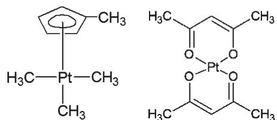  
Fig.1 Chemical structure of the two Pt precursors considered in this study: methylcyclopentadienyltrimethyl-platinum  $(\mathrm{MeCpPtMe}_3)$  and platinum(II)-acetylacetonate  $(\mathrm{Pt(acac)}_2)$

$\mathrm{PtO}_x$  ALD on various graphene surfaces at a molecular level. They provide valuable insights into the ALD of Pt on graphene that could shorten the in- lab process development procedures. In liaison with computational findings, we also present the results of platinum ALD endeavours on graphene oxide. In light of the comprehensive analysis presented here, we propose that graphene oxide is a high potential ALD seed layer for achieving high- quality, uniform and closed/continuous Pt films that could be used in numerous practical applications.

# 2. Methods

# A. Computational details

All electronic structure calculations were done using the projector augmented wavefunction (PAw)28,29 as implemented in the Vienna Ab Initio Simulation Package (VASP v.5.3.5).30- 33 We used the generalized gradient approximation (GGA) to density functional theory (DFT)34,35 jointly with a plane- wave basis having a kinetic energy cut- off of  $400\mathrm{eV}$  We employed the Perdew- Burke- Ernzerhof (PBE) exchange correlation functional36,37 along with the Grimme's DFT(PBE)- D3 method including the Becke- Jonson damping38 to account for van der Waals interactions on an empirical basis. We note that a nonlocal density functional that explicitly treats the pairwise nonbonded interactions (e.g. optB88- vdW, vdW- DF/2, etc.) is expected to predict more accurate binding energies for aromatic systems like graphene.39 However, detailed benchmarks show that the empirical method (e.g. DFT- D3) can successfully reproduce the qualitative picture predicted by vdW- DF for a lower computational cost.40,41 Besides, we used the default accuracy parameters for the FFT grid and real space projectors alongside a Gaussian smearing of  $0.01\mathrm{eV}$

Structural relaxations were carried out using the conjugate gradient algorithm, where they were considered converged once all forces deviate less than  $0.01\mathrm{eV}\mathring{\mathrm{A}}^{- 1}$  in two consecutive ionic steps. Minimum energy paths (MEPs) along the predefined reaction pathways connecting a reactant- product pair were computed by optimizing several geometries collectively with the climbing- image nudge elastic band (CI- NEB) method.42 CI- NEB optimizations were done with a looser convergence criterion on forces  $(0.1\mathrm{eV}\mathring{\mathrm{A}}^{- 1})$  utilizing the Hessianbased (G)- LBFGs43 and  $\mathrm{FIRE^{44}}$  algorithms as implemented in the YTST tool set.45 The Rader charge partition scheme46 was employed for the analysis of partial charges on individual atoms.

In order to accommodate bulky Pt precursors and minimize the resulting self- interactions due to periodic boundary conditions, supercells were kept rather largely in the xy plane (on which graphene is placed), containing  $8\times 8$  or larger graphene flakes (see below for the exact systems). Likewise, for avoiding the image interactions, the slabs in each prepared model system were separated along the  $\mathcal{Z}$  - axis by a vacuum thickness of  $15\mathrm{\AA}$  or more. Due to their large size, supercells could be integrated in reciprocal- space considering only the  $\Gamma$  - point.

For investigating the thermal stability of the simulation models considered here, we used a simulated annealing procedure based on ab initio DFT molecular dynamics (MD) simulations. In this approach, we simulated a temperature ramp (i.e. gradual heating) from  $10\mathrm{K}$  to a high final temperature,  $6000\mathrm{K}$ . To this end, we ran a series of microcanonical (NVE) ensembles of 50 fs (total of 10 ps) with an initial temperature that is determined based on the interval temperature at a given gradual heating step. It is important to note that this approach is likely to predict thermal processes occurring at higher temperatures than in reality. This is essentially due to fact that the simulated system is heated more rapidly (in the picoseconds domain), thus is not given enough time to equilibrate as opposed to the experiments, where heating takes place in the seconds domain. However, such rapid heating is unavoidable due to computational limitations, and it is sufficiently suitable for quick qualitative comparisons of thermal phenomena under investigation.

Adsorption (or, equivalently, binding) energy (  $\Delta E_{\mathrm{p}}$  or  $\Delta E_{\mathrm{c}}$  for physisorption and chemisorption, respectively) of a given ALD precursor on a given graphene surface is defined as

$$
\Delta E_{\mathrm{p / c}} = E_{\mathrm{PG}} - E_{\mathrm{P}} - E_{\mathrm{G}} \tag{1}
$$

where  $E_{\mathrm{PG}}$  is the total energy of the complex of the physi- . sorbed/chemisorbed precursor with graphene, and  $E_{\mathrm{P}}$  and  $E_{\mathrm{G}}$  are the total energies of the isolated precursor and the gra- . phene surface under consideration. Relevant, eqn (2) is used for computing the reaction energy  $(\Delta E_{\mathrm{r}})$  that is required for converting the corresponding physisorbed species into chemisorbed ones, e.g. via dissociation of the given precursor on the given surface.

$$
\Delta E_{\mathrm{r}} = \Delta E_{\mathrm{c}} - \Delta E_{\mathrm{p}} \tag{2}
$$

Considering the different orientations a precursor might assume while binding on any given graphene surface, we carried out a conformational analysis for each system under consideration. Consequently, we present here - to our knowledge - the lowest possible binding energies, where all reported energies correspond to  $0\mathrm{K}$

# B. Experimental procedures

To validate the DFT calculations, Pt was deposited by ALD on graphene using  $\mathrm{MeCpPtMe}_3$  as the Pt precursor and  $\mathrm{O}_2$  gas as the co- reactant at a temperature of  $300^{\circ}\mathrm{C}$  for 500 cycles. Further information on the ALD process and the experimental setup used can be found elsewhere. The graphene samples were synthesized by chemical vapor deposition (CVD) on a Cu foil (Alfa Aesar  $99.8\%$  no. 13382) and transferred to  $90\mathrm{nm}$ $\mathrm{SiO}_2 / \mathrm{Si}(100)$  wafers using the standard poly(methyl- methacrylate) (PMMA) transfer process. To create oxygen- containing surface groups on the graphene, pristine graphene (PG) samples were exposed to an  $\mathrm{O}_2$  plasma. The  $\mathrm{O}_2$  plasma treatment was performed in an Oxford Instruments FlexAl using  $100\mathrm{W}$ , 50 mTorr plasma at  $50^{\circ}\mathrm{C}$ . To vary the coverage of the created functional groups the plasma exposure times were varied from 1 to  $5\mathrm{min}$ . The configuration of the functional groups was determined by a Thermo Scientific K- Alpha KA 1066 X- ray photon spectroscope (XPS). After Pt ALD the surface coverage of the Pt on the pristine and oxygenated graphene was determined by using a JEOL 7500 FA scanning electron microscope (SEM). Growth per cycle (GPC) during the Pt ALD process was monitored on a Pt seed layer using in situ spectroscopic ellipsometry (SE). The GPC was determined to be  $0.55\mathrm{\AA}$  per cycle, which is in agreement with that reported previously. The growth rate on the  $\mathrm{O}_2$  treated sample was not measured, but is expected to be comparable, since the two surfaces are identical after the film closure.

# 3. Results and discussion

# A. Surface chemistry underlying the binding of Pt precursors

A typical ALD process relies on two separate, self- saturating half- cycles for introducing the organometallic precursor that carries the desired metal to be deposited, and consecutively the co- reactant, e.g. oxygen, that also eliminates the organic parts of the precursor prevailing on the surface. The involvement of multiple precursor ligands and surface groups diversifies the ALD surface reactions, thus engenders the complexity of a complete ALD cycle. Particularly, Pt ALD was shown to utilize intricate mechanisms that involve combustion, hydrogenation/dehydrogenation reactions and alike, as revealed by experimental probing techniques, such as quadrupole mass spectrometry (QMS), Fourier transform infrared (FTIR), photoemission spectroscopy (PE), X- ray absorption fine/near- edge structure (XAFS/XANES), and others. Most of these studies probe the Pt ALD mechanisms (using  $\mathrm{MeCpPtMe}_3$ ) on the substrates with oxides (e.g.  $\mathrm{SiO}_2$ ,  $\mathrm{Al}_2\mathrm{O}_3$ , etc.) or those with a Pt- based seed layer (Pt or  $\mathrm{PtO}_x$ ). In contrast, only one of them addresses the Pt ALD on graphene, whereas another study focuses on two carbon supports that resemble graphene and graphene oxide. In this connection, molecular level insights into the mechanism of Pt ALD nucleation on graphene, which are not visible to experimental techniques, would be valuable for having a complete understanding.

Regardless of the complexity of the related ALD chemistry, however, strong precursor binding on the intact deposition surface is essential for proper ALD nucleation. This, in turn, determines the efficiency of the subsequent ALD reactions. Bearing this in mind, we limited our simulations to address only the adsorption of a single Pt- precursor molecule on each graphene- like surface under investigation. This represents a subpart of the precursor half- cycle of the very first ALD cycle. This simplified approach has often been employed for examining assorted ALD processes on graphene and other substrates (see ref. 25 and references therein).

Unlike physisorption forming a single type of species with different conformations, dissociative precursor binding might yield distinct chemisorbed species due to various types of reactions between surface groups and ligands. In an attempt to cover (part of) these possibilities for binding  $\mathrm{MeCpPtMe}_3$  and

$\mathrm{Pt(acac)}_2$  on a given graphene derivative, we considered a list of chemisorbed species resulting from the following mechanisms (eqn (3)- (5)).

Bifunctional  $\mathrm{MeCpPtMe}_3$  chemisorbed species:

$$
2\mathrm{X}^{*} + \mathrm{MeCpPtMe}_{3(\mathrm{g})}\rightarrow \mathrm{X}_{2}\text{-PtMe - CpMe}^{*} + \mathrm{Me}_{2(\mathrm{g})} \tag{3a}
$$

$$
4\mathrm{X}^{*} + \mathrm{MeCpPtMe}_{3(\mathrm{g})}\longrightarrow \mathrm{X}_{2}\text{-PtMe - CpMe}^{*} + 2\mathrm{X}\text{-Me}_{(\mathrm{g})} \tag{3b}
$$

$$
2(\mathrm{X - H})^{*} + \mathrm{MeCpPtMe}_{3(\mathrm{g})}\longrightarrow \mathrm{X}_{2}\text{-PtMe - CpMe}^{*} + \mathrm{Me}_{2(\mathrm{g})} + \mathrm{H}_{2(\mathrm{g})} \tag{3c}
$$

$$
2(\mathrm{X - H})^{*} + \mathrm{MeCpPtMe}_{3(\mathrm{g})}\longrightarrow \mathrm{X}_{2}\text{-PtMe - CpMe}^{*} + 2\mathrm{CH}_{4(\mathrm{g})} \tag{3d}
$$

$$
2(\mathrm{X - H})^{*} + \mathrm{MeCpPtMe}_{3(\mathrm{g})}\longrightarrow \mathrm{X}_{2}\text{-PtMe - CpMe}^{*} + 2\mathrm{CH}_{4(\mathrm{g})} \tag{3d}
$$

Monofunctional  $\mathrm{MeCpPtMe}_3$  chemisorbed species:

$$
2\mathrm{X}^{*} + \mathrm{MeCpPtMe}_{3(\mathrm{g})}\longrightarrow \mathrm{X}\text{-MeCpPtMe}_{2}^{*} + \mathrm{X}\text{-Me}^{*} \tag{4a}
$$

$$
2\mathrm{X}^{*} + \mathrm{MeCpPtMe}_{3(\mathrm{g})}\longrightarrow \mathrm{X}\text{-PtMe}_{3}^{*} + \mathrm{X}\text{-CpMe}^{*} \tag{4b}
$$

$$
2\mathrm{X}^{*} + \mathrm{MeCpPtMe}_{3(\mathrm{g})}\longrightarrow \mathrm{X}\text{-MeCpPtCH}_{3}\mathrm{CH}_{2}^{*} + \mathrm{CH}_{4(\mathrm{g})} \tag{4c}
$$

$$
(\mathrm{X - H})^{*} + \mathrm{MeCpPtMe}_{3(\mathrm{g})}\longrightarrow \mathrm{X}\text{-MeCpPtMe}_{2}^{*} + \mathrm{CH}_{4(\mathrm{g})} \tag{4d}
$$

$$
2(\mathrm{X - H})^{*} + \mathrm{MeCpPtMe}_{3(\mathrm{g})}\longrightarrow \mathrm{X}\text{-MeCpPtMe}_{2}^{*} + \mathrm{X}\text{-Me}^{*} + \mathrm{H}_{2(\mathrm{g})}
$$

Only bifunctional  $\mathrm{Pt(acac)}_2$  chemisorbed species:

$$
2\mathrm{X}^{*} + \mathrm{Pt(acac)}_{2(\mathrm{g})}\longrightarrow \mathrm{X}_{2}\text{-Pt - acac}^{+*} + \mathrm{acac}^{-} \tag{5a}
$$

$$
2(\mathrm{X - H})^{*} + \mathrm{Pt(acac)}_{2(\mathrm{g})}\longrightarrow \mathrm{X}_{2}\text{-Pt - acac}^{*} + \mathrm{acac - H}_{(\mathrm{g})} \tag{5b}
$$

$$
2(\mathrm{X - H})^{*} + \mathrm{Pt(acac)}_{2(\mathrm{g})}\longrightarrow \mathrm{X}_{2}\text{-Pt - acac}^{+*} + \mathrm{acac}^{-} + \mathrm{H}_{2(\mathrm{g})} \tag{5c}
$$

$$
2(\mathrm{X - H})^{*} + \mathrm{Pt(acac)}_{2(\mathrm{g})}\longrightarrow \mathrm{X}_{2}\text{-Pt - acac - H}^{*} + \mathrm{acac - H}_{(\mathrm{g})} \tag{5d}
$$

where  $\textrm{X}$  represents the surface binding site that can be either C or O depending on the functionalization type, whereas  $\mathrm{X - H}$  denotes that the surface site is H- terminated. Besides, the asterisk refers to a surface species and Me and  $\mathrm{Cp}$  stand for a methyl  $(- \mathrm{CH}_3)$  and a cyclopentadienyl  $\left[\left[- \mathrm{C}_5\mathrm{H}_5\right]^{- }\right]$  group, respectively.

While compiling the plausible pathways (eqn (3)- (5)), we were also inspired by those reported elsewhere.7,12,48- 55 We note that this list comprises - in our view - the most likely pathways, however, there might very well be other conceivable pathways depending on the ALD temperature, e.g. via decomposition of the MeCp moiety of  $\mathrm{MeCpPtMe}_3$  to form carbonaceous species (see ref. 48, 50 and 51 for in- depth discussions). Those possibilities can be explored in an elaborate mechanistic analysis, integrating sophisticated computational methods at different scales, e.g. ab initio DFT and kinetic Monte- Carlo (as done for  $\mathrm{HfO_2}$  ),56,57 alongside experimental approaches. However, such a detailed analysis lies beyond the scope of this study, as we are mainly interested in comparing the precursor binding affinities of different graphene surfaces rather than a comprehensive probing of the complete Pt ALD mechanism. To this end, we are confident that comparisons based on these representative mechanisms suffice to draw conclusions.

# B. Binding of Pt precursors on pristine graphene (PG)

We have computed the binding energies of  $\mathrm{MeCpPtMe}_3$  and  $\mathrm{Pt(acac)}_2$  on PG using the model shown in Fig. 2a. Our DFT calculations predict that  $\mathrm{MeCpPtMe}_3$  tends to physisorb in a conformation where two methyl groups are located at an equidistance above the graphene surface (with ca.  $2.8\mathrm{\AA}$  separation, Fig. S1, Ori 1). This leads to a mild physisorption of  $\mathrm{MeCpPtMe}_3$  that is driven by an exothermic process  $\Delta E_{\mathrm{p}} =$ $- 0.56\mathrm{eV})$  . Stacking of the methyl cyclopentadienyl  $(\mathrm{MeCp})$  group parallel to the graphene plane would lead to a minute destabilization of  $0.04\mathrm{eV}$  (Fig. S1, Ori 2), whereas other orientations result in notably weaker binding. As for  $\mathrm{Pt(acac)}_2$  on the other hand, physisorption is markedly stronger  $\Delta E_{\mathrm{p}} =$ $- 1.15\mathrm{eV})$  , likely due to the enhanced non- bonded  $\pi$  stacking interactions of the aromatic acetylacetonate (acac) ligands and the  $\pi$  - conjugated ring system of graphene. This could increase the sticking probability of  $\mathrm{Pt(acac)}_2$  on the surface in comparison with  $\mathrm{MeCpPtMe}_3$  giving more chance for ALD nucleation. For the latter, however, the dissociative binding of a given precursor is the determining factor. In light of this, we considered several pathways for the dissociation of two types of  $\mathrm{Pt}$  precursors on PG as outlined in eqn 3a)3b)4a)- 4c and 5a)where  $\mathrm{X} = \mathrm{C})$  . In Table 1, we list the computed energies of each chemisorbed species  $(\Delta E_{\mathrm{c}})$  created via these pathways along with the corresponding reaction energies  $(\Delta E_{\mathrm{r}}$  see eqn (2)) needed for the dissociation of the physisorbed species into the chemisorbed species. Most relevant chemisorbed species are visualized in Fig. 3.

For dissociative binding of  $\mathrm{MeCpPtMe}_3$  Setthapun et al. proposed that the monofunctional  $\mathrm{MeCpPtMe}_2$  is the dominant adsorbed species during the very first precursor dosing step of the thermal Pt ALD on various oxygen- terminated substrates (e.g.  $\gamma - \mathrm{Al}_2\mathrm{O}_3$ $\mathrm{TiO_2}$  and  $\mathrm{SrTiO_3}$  ).53 This falls in line with the infrared spectroscopy results by Kessels et al.49 showing that on average one methyl group was liberated per  $\mathrm{MeCpPtMe}_3$  molecule during the Pt precursor exposures. Our DFT calculations, however, suggest that the pathway (eqn (4a)) employing  $\mathrm{MeCpPtMe}_2$  on graphene requires large (positive) chemisorption and reaction energies (1.45 eV and 2.01 eV). This finding weights against the utilization of  $\mathrm{MeCpPtMe}_2$  species for Pt ALD on PG that lacks oxygen as opposed to the oxides considered in ref. 49 and 53.

In contrast, the bifunctional  $\mathrm{MeCpPtMe}$  and the monofunctional  $\mathrm{MeCpPtCH}_3\mathrm{CH}_2$  products are significantly more stable compared to  $\mathrm{MeCpPtMe}_2$ $\Delta E_{\mathrm{r}} = - 0.30\mathrm{eV}$  and  $0.98\mathrm{eV}$  vs. 1.45 eV), being the two lowest- energy binding modes (among our tries). Formation of these products would require the release of gaseous methane and ethane by- products. Relevantly, the formation of both by- products was detected using in- line mass spectrometry during Pt ALD on a plain carbon support with high resemblance to pristine graphene.55 However, the DFT results suggest that the conversion of the starting physisorbed precursors into the final chemisorbed products of MeCpPtMe and  $\mathrm{MeCpPtCH}_3\mathrm{CH}_2$  would only be possible through thermodynamically unfavourable processes  $\Delta E_{\mathrm{r}} = 0.36$  and  $0.63\mathrm{eV}$  respectively). Likewise, the CI- NEB profiles computed along the

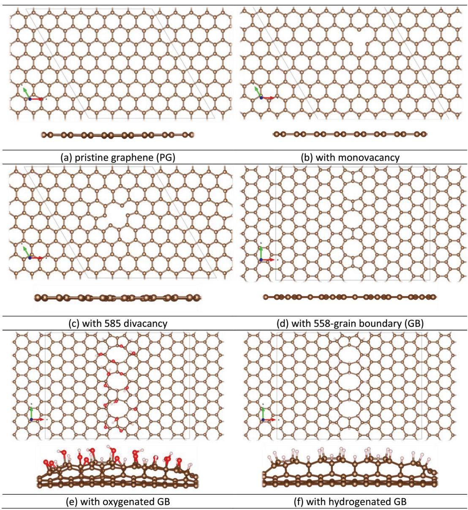  
Fig.2 Top and side views of the model systems for pristine and defective graphenes. Respective unit cell are represented by solid, pale black lines. Colour code, C: brown; O: red; H: pink-white; Pt: grey.

Table 1 Chemisorption  $(\Delta E_{c})$  and reaction  $(\Delta E_{r})$  energies [in eV] corresponding to the different pathways for the dissociative binding of  $\mathrm{MeCpPtMe_3}$  and Pt(acac) on pristine graphene, as identified by Type" (see eqn (3)-(5) for definitions). Physisorbed species  $(\Delta E_{\mathrm{p}})$  are  $-0.56\in V$  and  $-1.15\in V$  with respect to the separated species (i.e. precursor and graphene)  

<table><tr><td>Pathway</td><td>ΔEc</td><td>ΔEr</td><td>Type</td></tr><tr><td>2C* + MeCpPtMe3(g) → C-MeCpPtMe2* + C-Me*</td><td>1.45</td><td>2.01</td><td>4a</td></tr><tr><td>2C* + MeCpPtMe3(g) → C2-PtMe-CpMe* + Me2(g)</td><td>-0.20</td><td>0.36</td><td>3a</td></tr><tr><td>2C* + MeCpPtMe3(g) → C-MeCpPtCH3CH2* + CH4(g)</td><td>0.08</td><td>0.63</td><td>4c</td></tr><tr><td>2C* + MeCpPtMe3(g) → C2-PtMe-CpMe* + 2 C-Me(g)</td><td>3.51</td><td>4.07</td><td>3b</td></tr><tr><td>2C* + MeCpPtMe3(g) → C-PtMe3* + C-CpMe*</td><td>2.48</td><td>3.04</td><td>4b</td></tr><tr><td>2C* + MeCpPtMe3(g) → C-PtMe3* + CpMe(g)</td><td>2.20</td><td>2.76</td><td>4b</td></tr><tr><td>2C* + Pt(acac)2(g) → C2-Pt-acac** + acac*</td><td>2.65</td><td>3.80</td><td>5a</td></tr></table>

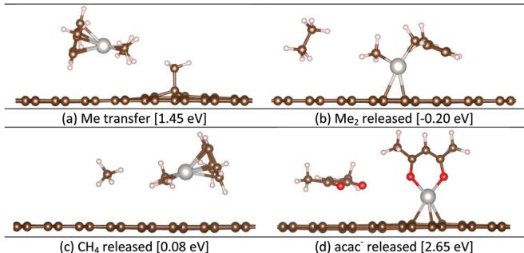  
Fig.3 Various (a-c)  $\mathrm{MeCpPtMe_3}$  and (d)  $\mathrm{Pt(acac)_2}$  species chemisorbed on pristine graphene [and the associated chemisorption energies] as predicted at the PBE-D3 level of theory. See Table 1 for the pathways yielding these species. Colour code, C: brown; O: red; H: pink-white; Pt: grey. Me stands for a methyl  $(-CH_3)$  group.

designated pathways (see Fig. 4a and b) suggest that the generation of  $\mathrm{MeCpPtMe}$  and  $\mathrm{MeCpPtCH_3CH_2}$  is kinetically limited due to the high activation barriers associated with them

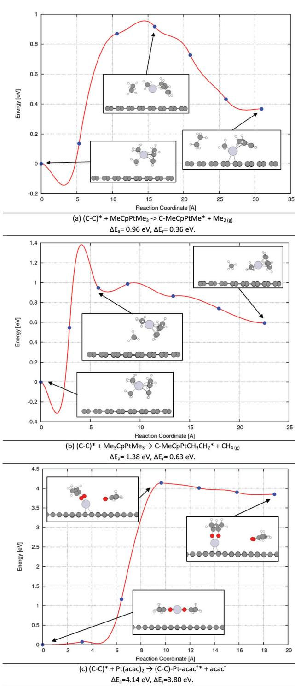  
Fig.4 PBE-D3 level minimum energy paths corresponding to the different reaction pathways (a, b) for  $\mathrm{MeCpPtMe}_3$  and (c)  $\mathrm{Pt(acac)_2}$  binding on pristine graphene. First and last points on the reaction coordinate correspond to the physisorbed and chemisorbed species, respectively. Physisorbed species of (a, b) and (c) are  $-0.56$  and  $-1.15\mathrm{eV}$  with respect to the separated species (pristine graphene and  $\mathrm{MeCpPtMe}_3$  or  $\mathrm{Pt(acac)_2}$

$\Delta E_{\mathrm{a}} = 0.96\mathrm{eV}$  and  $1.38\mathrm{eV}$  ). Therefore, the slow conversion rates resulting from these high barriers are a likely explanation for the poor ALD nucleation on the pristine sites of graphene.7

Predicted minimum- energy structures reveal that platinum atoms in  $\mathrm{MeCpPtMe}_2$  (Fig. 3a) and  $\mathrm{MeCpPtCH_3CH_2}$  (Fig. 3c) tend to stay at a non- covalent bonding distance  $(>3.9 - 4.1\mathrm{\AA})$  on the graphene surface. In contrast, in the MeCpPtMe product (Fig. 3b) Pt is covalently bonded to the two neighbouring carbons of graphene  $(2.28 - 2.44\mathrm{\AA})$  which would be required for Pt deposition on the surface. This diverse binding character can be ascribed to the availability of d- orbital electrons on the metal centre (due to the removal of ligands) and the level of saturation of the valence orbitals on graphene. In light of these results, the need for a bifunctional chemisorbed species becomes evident for proper Pt binding on pristine graphene.

Utilization of  $\mathrm{Pt(acac)_2}$  for Pt deposition has been limited so far due to its lower thermal stability, limiting the ALD temperature window.16,54,58 To best of our knowledge no experimental study has addressed the reaction mechanism concerning the  $\mathrm{Pt(acac)_2}$  chemisorption on graphene. Only Utriainen et al.54 have shown that  $\mathrm{M(acac)_2}$  where  $\mathrm{M} = \mathrm{Pt}$ , Ni and Cu, reacts with gaseous  $\mathrm{H}_2$  or water to give  $\mathrm{M}$  or  $\mathrm{MO}$  products alongside the common volatile by- product, Hacac. This provides a good hint on how the dissociative binding of  $\mathrm{Pt(acac)_2}$  would proceed on H- terminated surfaces, e.g. standard substrates like  $\mathrm{SiO}_2$ ,  $\mathrm{Al}_2\mathrm{O}_3$ , etc., but it does not provide direct information on other surfaces like pristine graphene or some graphene oxide types (see below). Nevertheless, unlike heteroleptic  $\mathrm{MeCpPtMe}_3$ , homoleptic  $\mathrm{Pt(acac)_2}$  contains two acetylacetonate ligands with low reactivity towards each other, limiting the possible ligand- exchange reactions. Therefore, we only studied the most conceivable pathway for  $\mathrm{Pt(acac)_2}$  binding on  $\mathrm{PG}$ , in which one of the acac groups is released (eqn (5a)). A similar pathway was also considered for  $\mathrm{Cu}$  ALD on the Ta (110) surface using  $\mathrm{Cu(acac)_2}$  as the precursor, in which two acac moieties are liberated in two consecutive steps.41,59

Current DFT calculations show that the  $\mathrm{Pt(acac)_2}$  chemisorption through the release of an acac anion yields highly unstable product species  $\Delta E_{\mathrm{c}} = 2.65\mathrm{eV}$ . In addition, the higher stability of the physisorbed species  $\Delta E_{\mathrm{p}} = - 1.15\mathrm{eV}$  increases the reaction energy even further, leading to a strong endothermic process  $\Delta E_{\mathrm{r}} = 3.80\mathrm{eV}$  (Fig. 4c.). As is evident from the predicted energy profile, unlike the forward reaction (i.e. chemisorption,  $\Delta E_{\mathrm{a}} = 4.14\mathrm{eV}$ ), the backward reaction (i.e. reformation of  $\mathrm{Pt(acac)_2}$ ,  $\Delta E_{\mathrm{a}} = 0.39\mathrm{eV}$ ) requires a significantly lower energy barrier to proceed. Taken together, these findings suggest that the physisorbed  $\mathrm{Pt(acac)_2}$  is the dominant species accumulated during the precursor dose. Consequently, the trace amount of chemisorbed products at the end of the precursor dose is likely to cause weaker ALD nucleation with  $\mathrm{Pt(acac)_2}$ .

Comparing the previous findings41 of  $\mathrm{Cu(acac)_2}$  binding on  $\mathrm{Ta}(110)$  to the current ones, we note the strong physisorption of both precursors on respective surfaces as predicted by both GGA/PBE- D3 and vdW- DF methods. This indicates that ligands have more influence in physisorption than the metal centre

due to more pronounced non- bonded interactions rather than bonded (covalent) interactions. Therefore, the main difference in the binding of two precursors of different metals arises in the chemisorption part, viz. precursor dissociation on the surface.  $\mathrm{Cu(acac)}_2$  chemisorption on  $\mathrm{Ta}(110)$  proceeds via a very low activation barrier  $\Delta E_{\mathrm{a}} = 0.21 \mathrm{eV}$  with respect to the physisorbed species) and leads to a highly exothermic product  $\Delta E_{\mathrm{a}} = - 6.05 \mathrm{eV}$ , making the process kinetically and thermodynamically accessible. The large stabilization of the chemisorbed product can be attributed to the covalent attachment of one (or both) acac ligands on the  $\mathrm{Ta}(110)$  surface, which neutralizes the charge on the ligand(s). In sharp contrast, our DFT- level optimizations predict that the PG does not tend to bind the liberated acac and the charge separated species,  $\mathrm{C - Ptacac}^{+*}$  and  $\mathrm{acac}^{- }(\mathrm{g})$  prevail (see e.g. Fig. 3d). This point underlines the key role of ligands also in the precursor chemisorption on account of their chemical compatibility with the deposition surface.

# C. Pt ALD on graphene with topological defects

Owing to its  $\mathfrak{sp}^2$  - type carbon constituents, pristine graphene has no dangling bonds or native oxides, rendering it inactive towards ALD nucleation. In contrast, topological defects can break the  $\pi$  - conjugation network on graphene, and thus enhance the ALD activity locally through dangling bonds. Accordingly, previous attempts for Pt ALD using the  $\mathrm{MeCpPtMe}_3$  precursor and air as the co- reactant (i.e. oxygen provider) resulted in partial deposition exclusively at the graphene line defects. To check if this area- selective Pt deposition could simply be envisioned by the stronger adsorption of a single precursor molecule, we computed the  $\mathrm{MeCpPtMe}_3$  physisorption and chemisorption energies using the models of pristine and defective graphene (see Fig. 2) and the lowest- energy varieties are listed in Table 2. In particular, we considered the point defects (i.e. mono- and di- vacancies that were predicted to display the highest reactivity among others), as well as line defects (i.e. grain boundaries, GBs). From the plethora of structural models used for describing GBs (see for instance ref. 61 and 62), for our simulations we used the one constructed from STM images, viz. the 558- type. Relevantly, this 558- type GB was shown to have the highest affinity for H adatoms among several others.

Table 2. Computed physisorption  $(\Delta E_{\mathrm{p}})$  chemisorption  $(\Delta E_{\mathrm{c}})$  and reac tion  $(\Delta E_{\mathrm{r}})$  energies [in eV] of  $\mathrm{MeCpPtMe}_3$  on pristine and defective gra- . phenes.  $\Delta E_{\mathrm{c}}$  values are only reported for the lowest-energy chemisorbed species, as identified by Type" (see eqn (3) and (4) for definitions)  

<table><tr><td>System</td><td>ΔEp</td><td>ΔEc</td><td>ΔEr</td><td>Type</td></tr><tr><td>Pristine Graphene (PG)</td><td>-0.56</td><td>-0.20</td><td>0.36</td><td>3a</td></tr><tr><td>Graphene with monovacancy (MV)</td><td>-0.83</td><td>-3.16</td><td>-2.33</td><td>3a</td></tr><tr><td>Graphene with 585 divacancy (DV)</td><td>-0.59</td><td>-0.91</td><td>-0.32</td><td>3a</td></tr><tr><td>Graphene with Grain Boundary (GB)</td><td>-0.51</td><td>-1.12</td><td>-0.61</td><td>3a</td></tr><tr><td>GB - oxygenated Epoxy</td><td>-0.40</td><td>-3.13</td><td>-2.73</td><td>4a</td></tr><tr><td>GB - oxygenated hydroxyl</td><td>-0.49</td><td>-3.91</td><td>-3.42</td><td>4d</td></tr><tr><td>GB - Hydrogenated</td><td>-0.48</td><td>0.38</td><td>0.86</td><td>4d</td></tr></table>

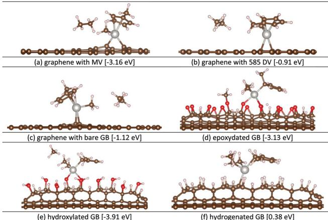  
Fig. 5 Ball-and-stick representation of the lowest-energy chemisorbed  $\mathrm{MeCpPtMe}_3$  species on various graphene surfaces. Relative energies with respect to the separated species are given in brackets. Colour code, C: brown; O: red; H: pink-white; Pt: grey.

By means of their enhanced chemical reactivity, grain boundaries (GBs) in polycrystalline graphene are more susceptible to adatom additions upon contact with air, or water and via specialized procedures, e.g. nitridation. With this in mind, we also prepared oxygenated and hydrogenated GB models, decorated with epoxy, hydroxyl or hydrogen groups, as also observed experimentally. Optimized DFT geometries (see Fig. 5) demonstrate that oxygenation or hydrogenation of GBs leads to the buckling of the graphene basal plane due to  $\mathfrak{sp}^3$  - hybridization of the carbon bonds. This is in line with the formation of folds and cracks at functionalized line defects as detected experimentally.

In terms of physical adsorption, all defective graphenes (except the one with MV) can only afford somewhat weaker binding of  $\mathrm{MeCpPtMe}_3$  compared to pristine graphene (Table 2). This might be related to the distorted  $\pi$  - cation interactions between the Pt centre and the graphene basal plane, following from the interrupted  $\pi$  - conjugation network on graphene. In contrast, graphene with MV shows an augmented  $\mathrm{MeCpPtMe}_3$  physisorption  $(- 0.83 \mathrm{u.s.} - 0.56 \mathrm{eV})$ . This is possibly due to the enhanced Coulomb interactions following from the charge transfer (of ca.  $0.30e^{- }$  as predicted by Bader analysis) from the closest precursor methyl group to the graphene defect site, triggered by the missing carbon atom. Besides, simultaneous binding of multiple precursor molecules leads to stronger physisorption, as is evident from the computed energies  $\Delta E_{\mathrm{p}}$  per precursor are  $- 0.51, - 0.62$  and  $- 0.75 \mathrm{eV}$  for 1- 3 precursors being adsorbed simultaneously on graphene with bare GB, see Fig. S2†). Therefore, as opposed to the simplified model used here (comprising a single precursor), a real- life ALD process will be further facilitated by the surplus of precursor molecules simultaneously adsorbed on the surface.

As demonstrated earlier, dissociative binding of  $\mathrm{MeCpPtMe}_3$  on PG is not energetically feasible due to the endothermic character of the pertinent reactions and the high kinetic barriers associated with them. Conversely, the point

(MV and DV) and line defects (GB) bring about an improved chemisorption of  $\mathrm{MeCpPtMe}_3$  with the energies of  $- 3.16$ ,  $- 0.91$  and  $- 1.12 \mathrm{eV}$ , respectively, congruent to their profound higher reactivity compared to PG. In line with the latter, the conversion of the physisorbed species into chemisorbed products is associated with highly exothermic reactions (Table 2). On the other hand, functionalization of the defects (considered here only for GB) has a noticeable effect on the chemical precursor adsorption. Specifically, oxygenation boosts the chemisorption on GBs even further regardless of which form is present, epoxy  $(- 3.13 \mathrm{eV})$  or hydroxyl  $(- 3.91 \mathrm{eV})$ , in comparison with the bare GB  $(- 1.12 \mathrm{eV})$ . Congruently, these processes are predicted to proceed via very low barriers (ca.  $0.15 \mathrm{eV}$  and  $0.05 \mathrm{eV}$ , see Fig. S3†). In contrast, the addition of H adatoms results in the passivation of GB as is evident from higher (and positive) chemisorption energy  $(0.38 \mathrm{eV})$ , rendering the relevant reaction thermodynamically unfavourable. Current DFT energetics suggest that the oxygenation of GBs leads to better chemical reactivity and thus enhanced ALD initiation, whereas hydrogenation might be used to passivate the grain boundaries towards ALD nucleation. In this framework, the tandem use of oxygenation and hydrogenation can offer a good pathway for area selective deposition of Pt through activating/deactivating topological defects. Relevantly, oxygenation naturally occurs upon exposure of GBs to air or water, whereas UV/ozone treatments $^{3,74}$  are also used towards this end. As for hydrogenation, mild  $\mathrm{H}_2$  plasma treatments are performed $^{75}$  alongside other techniques (see ref. 76 and references therein).

Analysing the minimum- energy pathways, we note the diversity in the chemisorbed  $\mathrm{MeCpPtMe}_3$  species depending on the surface composition (see Fig. 5 for product geometries). Particularly, the ethane  $(\mathrm{Me}_2)$  release mechanism (viz. eqn (3a)) yielding bifunctional MeCpPtMe products is commonly employed for binding on native graphene surfaces without any chemical functionalization, e.g. pristine as well as defective graphene (MV, DV, and GB). As for epoxydated GB,  $\mathrm{MeCpPtMe}_3$  is predicted to transfer one of its three methyl groups, leading to a monofunctional  $\mathrm{MeCpPtMe}_2$  product (viz. eqn (4a)). Unlike epoxydated GB, the H- terminated surfaces (e.g. hydroxylated and hydrogenated GB) employ the pathway (viz. eqn (4d)) in which a hydrogen atom is abstracted from the surface to liberate gaseous methane  $(\mathrm{CH}_4)$ .

# D. Deposition on graphene with chemical functionalization - graphene oxide

As previously discussed, specific functionalization types (e.g. oxygenation) can boost the binding affinity of graphene topological defects for ALD precursors. Rather than relying on randomly distributed defects, the whole graphene surface can in principal be functionalized to facilitate non- localized ALD nucleation. The latter is expected to lead to Frank- van der Merwe type (non- localized) growth, with concomitant formation of conformal and closed films on graphene. Among several functionalization types, graphene oxide (GO) has great potential for facilitating uniform and closed Pt film deposition in consideration of the ALD seeding performance of GO reported for  $\mathrm{Al}_2\mathrm{O}_3$ , $^{22,23}$  along with its tuneable, finite bandgap. $^{22,77}$

D1. Various structural models of graphene oxide and their thermal stabilities. GO can be prepared by covalently attaching epoxy and hydroxyl groups on the graphene basal plane or by adding carbonyl and carboxyl groups to the graphene edges. $^{78}$

However, there is a long- lasting controversy over the composition and distribution of these groups. Several approaches involving wet- chemistry, UV- ozone and plasma- treatments have been employed in the literature to create oxygenated graphenes with a highly diverse surface morphology. $^{20,22,23,70,73,74,78 - 81}$  In particular, wet chemical methods, such as Hummer's method, yield GO flakes with random distributions of epoxy and hydroxyl groups. $^{82}$  Concomitant  $\mathfrak{sp}^2$  to  $\mathfrak{sp}^3$  conversion of C- C bonds triggers the out- of- plane distortion of the basal plane even at low oxygen loads  $(\mathrm{C} / \mathrm{O} = 5:1)$ . $^{83}$  In contrast, mild  $\mathrm{O}_2$  plasma treatments can be used to decorate the entire graphene surface more homogeneously that would be practical for depositing uniform, wafer- scale films. $^{22,23}$  Particularly,  $\mathrm{O}_2$  plasma was shown to create epoxy groups more predominantly than hydroxyl groups (as endorsed by synchrotron- radiation photoemission spectroscopy (SRPES) analysis). $^{22}$  On account of the diversity in the models to represent the GO surface, we have utilized here a comprehensive collection of GO models for studying the ALD nucleation of two Pt precursors (Fig. 6), covering both cases in which one or both sides of a given graphene is functionalized. Considering that graphene is commonly placed on a support, e.g. graphite, copper or  $\mathrm{SiO}_2$ , during the functionalization process (as also done in ref. 22 and 23 and here, see below), it is likely that the functionalities will be attached to the accessible side rather than both sides.

A previous DFT study showed that epoxy groups prefer to agglomerate with a linear alignment either by binding directly next to a pre- existing epoxy group on the surface or by relocating themselves on the graphene platelet. $^{84}$  Epoxy clusters were proposed to enforce the unzipping of the C- C bonds on the graphene lattice by exerting a collective tension, resulting in the doping of oxygens into the basal plane. $^{84}$  Relevantly, our DFT- level optimizations (of both the supercells and the ionic positions) of the epoxydated graphene model with the linear arrangement of epoxy groups (see Fig. 6a and b) endorse the lengthening of C- C bonds upon attachment of a bridging oxygen (from PG:  $1.425 \mathrm{\AA}$  to GO:  $1.502 \mathrm{\AA}$ ). Yet, these bonds do not readily rupture, preventing the unzipping and concomitant oxygen doping. To scrutinize this further, we performed a DFT- level temperature ramp simulation (see section 2) using the same epoxydated model. The latter reveals that the release of gaseous  $\mathrm{O}_2$  from the surface would occur more readily at relatively lower temperatures (around  $2400 \mathrm{K}$ ) rather than the unzipping/oxygen- doping of graphene oxide (around  $3100 \mathrm{K}$ ) that is coupled with multiple local defect formation. This dispute in the findings of the current study and ref. 84 can be ascribed to the different simulation models adopted in two studies (i.e. the current periodic model vs. the small cluster model in ref. 84).

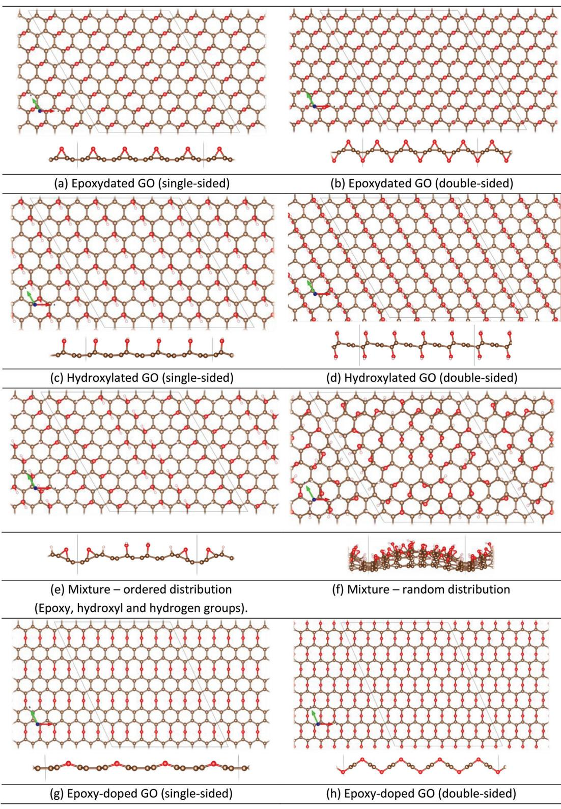  
Fig. 6 Ball-and-stick representation of the models (supercells) used for simulating graphene oxide in the current DFT calculations. Colour code, C: brown; O: red; H: pink-white; Pt: grey.

Hydroxyl groups can coexist with epoxy groups on the GO surface, a relative amount of which depends on the method used for preparing the GO (e.g. very low following an  $\mathrm{O}_2$  plasma treatment). Another DFT investigation has shown that it is energetically favourable for the hydroxyl groups to form strips as for the epoxide groups. Conversely, the epoxide and hydroxyl strips tend to coalesce with non- functionalized  $\mathfrak{sp}^2$ - carbon strips separating them. Considering these findings,

we have employed linearly decorated models of epoxydated and hydroxylated graphenes and their mixture (see Fig. 6a- f) in our DFT calculations. Despite their low likelihood to form, we also study the epoxy- doped models (Fig. 6g and h) for investigating the effect of oxygen doping on ALD reactivity (see below). One should note that the hydroxyl- doped model is not stable following from the excessive amount of cationic oxygens and thus not reported here.

Current DFT calculations point out that the distribution and amount of the oxygen- containing groups on the surface determines the planarity of the resulting graphene oxide layer. As is evident from the optimized structures (Fig. 6a- e), ideally homogeneous (ordered) decorations of epoxy or hydroxyl groups (or their mixtures) lead to rather planar GO layers by preserving a balanced composition of  $\mathfrak{sp}^2$  and  $\mathfrak{sp}^3$  carbon bonds. In contrast, random distributions of these functionalities will likely result in more  $\mathfrak{sp}^3$  carbon bonds and in turn a graphene basal plane will be more buckled (see Fig. 6f), as is observed for GOs created by wet- chemical techniques. A buckled, semi- amorphous GO layer, however, would be inconvenient for ALD seeding layer applications, as it would hamper the control over the uniformity/thickness of the resulting deposited films. On the other hand, the functionalization of either one side or both sides of graphene has a less prominent effect on the planarity, provided that the homogeneous decorations of the surface groups are achieved.

In order to compare the relative thermal stability of the GO models under investigation (Fig. 6), we have to run a series of ab initio temperature ramp simulations using these models. From these, we primarily note that the release of gaseous water via combination of the neighbouring hydroxyl groups starts to occur at lower temperatures compared to the release of epoxy groups as  $\mathrm{O_2}$  gas (ca. 400 K vs. 2400 K). This points to the relatively higher stability of the epoxy groups compared to hydroxyl groups in accordance with the previous theoretical and experimental reports. In particular, two adjacent hydroxyl groups are predicted to combine readily to form water and epoxy (an exothermic process with a predicted barrier of  $0.45\mathrm{eV}$ ), whereas the reverse process of converting epoxy groups to hydroxyl groups upon contact with water would not be feasible as it involves high barriers (as predicted to be ca.  $0.90\mathrm{eV}$ ).

Another important remark considering the temperature ramping simulations is the increased stability of the double- sided functionalized models with respect to the single- sided ones. Functionalization of both graphene facets augments the stability of hydroxyl groups significantly at an increasing rate with higher oxygen loading rates, e.g. first water release is at ca.  $1700\mathrm{K}$  for  $25\%$  oxygen loading and  $2000\mathrm{K}$  for  $50\%$  coverage. In contrast, being already stable constructions, the epoxy groups do not benefit as much as in the case of hydroxyls from the saturation of the dangling bonds on graphene (first  $\mathrm{O_2}$  release at ca.  $2400\mathrm{K}$  vs.  $3000\mathrm{K}$  for single- and double- sided epoxydated graphene, with  $25\%$  and  $50\%$  loadings). In this connection, we anticipate that a graphene support/substrate will provide similar stabilization on the chemisorbed function alities by capping the dangling bonds on the other (non- functionalized) facet of graphene.

On the other hand, we note that doping of epoxy groups into the graphene lattice creates more stable structures compared to those wherein functionalities are attached to the surface. In detail, the "single- sided" doped graphene (Fig. 6g) with  $25\%$  oxygen- loading starts to decompose at notably higher temperatures (ca. 4000 K), as opposed to the epoxy- doped graphene (ca. 2400 K). Yet, this doping reduces the availability of electron density on oxygen functionalities and drastically changes the electronic and mechanical structures of graphene. Besides, we also notice a remarkable drop in stability with increasing oxygen loads, i.e. "double- sided" doping (50% loading) would cause decomposition to begin at lower temperatures, around  $2700\mathrm{K}$ .

All in all, current thermal stability analysis reveals that the GO model with ordered epoxy groups (see Fig. 6a and b for single- and double- sided versions) is the most stable one in view of the self- dissociation temperature at which the first surface groups are liberated. In this connection, this model is expected to endure the typical ALD temperatures. Considering also the previous SRPES measurements and the fact that graphene functionalization was performed on a Cu substrate, the single- sided epoxy model (Fig. 6a) would be the most representative one for investigating the surface reactions during the ALD of  $\mathrm{Pt / PtO_x}$  on GO.

D2.  $\mathrm{MeCpPtMe}_3$  and  $\mathrm{Pt(acac)}_2$  binding on graphene oxide. In order to inspect the reactivity of GO towards Pt precursors, we computed the adsorption energies of  $\mathrm{MeCpPtMe}_3$  and  $\mathrm{Pt(acac)}_2$  on the most representative GO model (Fig. 6a) along with several others (Fig. 6b- h). The corresponding physisorption and chemisorption energies are listed in Table 3 alongside the chemical pathways (from eqn (3)- (5)) that lead to these chemisorbed species. Most relevant lowest- energy physisorbed and chemisorbed species are visualized in Fig. 7, whereas the visuals of all other relevant species can be found in Fig. S4. †

Analysing the physisorption energies ( $\Delta E_{\mathrm{p}}$  values, Table 3), we primarily take note of the stronger physisorption of both Pt precursors on epoxy groups (except the epoxy- doped case) than on bare graphene. The latter effect is somewhat more prominent for  $\mathrm{MeCpPtMe}_3$  than for  $\mathrm{Pt(acac)}_2$ . In contrast, the hydroxyl groups cause a weaker physical binding for both precursors, which can be attributed to the unfavourable van der Waals interactions between the hydrogen atoms on the surface and the given precursor. Accordingly, the mixture of both surface group types (epoxy and hydroxyl) gives an intermediate physisorption strength for both precursor types. Moreover, the doping of the epoxy groups into the graphene lattice remarkably reduces the physisorption efficiency for both precursor types.

In contrast, the functionalization of both graphene sides rather than only one side has a less systematic influence on the physisorption energies, determined by the precursor and surface group types. In detail, for epoxydated GO, a double- sided model leads to remarkably stabilized physisorbed species in comparison with their single- sided counterparts

Table 3Computed physisorption  $(\Delta E_{\mathrm{p}})$  chemisorption  $(\Delta E_{c})$  and reaction  $(\Delta E_{c})$  energies [in eV] of  $\mathrm{MeCPPtMe_3}$  and  $\mathsf{Pt(acac)}_2$  on various functiona- lized graphenes.  $\Delta E_{c}$  values are only reported for the lowest-energy chemisorbed species, as identified by Type" (see eqn (3)-5) for definitions) Coverage is defined as the ratio of the number of oxygen adatoms to the carbon atoms on graphene  

<table><tr><td rowspan="2">System</td><td rowspan="2">Coverage</td><td colspan="4">MeCpPtMe3</td><td colspan="4">Pt(acac)2</td></tr><tr><td>ΔEp</td><td>ΔEc</td><td>ΔEr</td><td>Type</td><td>ΔEp</td><td>ΔEc</td><td>ΔEr</td><td>Type</td></tr><tr><td>Pristine graphene (PG)</td><td>0%</td><td>-0.56</td><td>-0.20</td><td>0.36</td><td>3a</td><td>-1.15</td><td>2.65</td><td>3.80</td><td>5a</td></tr><tr><td>Graphene oxide (GO)</td><td></td><td></td><td></td><td></td><td></td><td></td><td></td><td></td><td></td></tr><tr><td>GO - epoxy (single-sided)</td><td>25%</td><td>-1.55</td><td>-4.24</td><td>-2.69</td><td>4a</td><td>-1.96</td><td>-0.48</td><td>1.48</td><td>5a</td></tr><tr><td>GO - epoxy (doped, single-sided)</td><td>25%</td><td>-0.45</td><td>0.16a</td><td>0.61</td><td>4a</td><td>-1.10</td><td>1.61</td><td>2.71</td><td>5a</td></tr><tr><td>GO - epoxy (double-sided)</td><td>50%</td><td>-3.81</td><td>-3.42</td><td>0.39</td><td>3a</td><td>-4.18</td><td>-2.00</td><td>2.18</td><td>5a</td></tr><tr><td>GO - hydroxyl</td><td>25%</td><td>-0.46</td><td>-3.50</td><td>-3.04</td><td>4d</td><td>-0.86</td><td>-4.38</td><td>-3.52</td><td>5b</td></tr><tr><td>GO - hydroxyl (double sided)</td><td>50%</td><td>-0.41</td><td>0.10</td><td>0.51</td><td>4d</td><td>-0.96</td><td>-0.23</td><td>0.73</td><td>5b</td></tr><tr><td>GO - random mixture (epoxy - hydroxyl + hydrogen groups)</td><td>23%</td><td>-0.59</td><td>-4.15</td><td>-3.65</td><td>4e</td><td>-1.24</td><td>-1.48</td><td>0.24</td><td>5b</td></tr></table>

No suitable product, i.e. Pt is not bound to graphene.

$(- 3.81\mathrm{eV}$  vs.  $- 1.55\mathrm{eV}$  for  $\mathrm{MeCPPtMe_3}$  and  $- 4.18\mathrm{eV}$  vs.  $- 1.96$  eV for  $\mathrm{Pt(acac)}_2$  ). This enhancement might be attributed to the increased flexibility of the graphene backbone (see Fig. S4a and  $\mathsf{b}\dagger$  ), as a consequence of the higher ratio of  $\mathfrak{sp}^3$  - type carbons to  $\mathfrak{sp}^2$  ones (when moving from  $25\%$  to  $50\%$  oxygen coverage). As opposed to the epoxy case, for hydroxylated GO, double- sided functionalization does not have a notable effect on the physisorption energies. The latter is in line with the less buckled graphene basal plane following the physisorption (see Fig. S4c and  $\mathrm{d}\dagger$  ). The more rigid backbone of hydroxylated graphene can simply be explained by the preservation of the  $\mathfrak{sp}^3$  to  $\mathfrak{sp}^2$  carbon ratio, as each hydroxyl  $(- \mathrm{OH})$  group can only convert a single carbon atom as opposed to two carbons being converted by each epoxy  $(- \mathrm{C - O - C - })$  group.

In terms of dissociative precursor binding, we note the overall stronger adsorption for both precursors on graphene with epoxy or hydroxyl functionalities (and their mixtures) than on pristine graphene (see Table 3). Specifically for the more likely case of single- sided functionalization, we take notice of the soared chemisorption energies for  $\mathrm{MeCPPtMe_3}$  on both functionality types and their mixtures, while epoxy groups show higher affinity than hydroxyl  $(- 4.24\mathrm{vs.} - 3.50\mathrm{eV})$  The predicted total reaction energies associated with converting the physisorbed species into chemisorbed ones reveal the energetically downhill pathways  $\Delta E_{\mathrm{r}} = - 2.69$  and  $- 3.04\mathrm{eV}$  respectively). Likewise, the computed minimum- energy paths (Fig. 8) reveal that either pathway requires a rather low barrier to proceed  $(0.24\mathrm{eV}$  and  $0.43\mathrm{eV}$  respectively). In addition, adsorption on a mixed GO surface is expected to result in also good chemisorption of  $\mathrm{MeCPPtMe_3}$  like its only- epoxy and only- hydroxyl counterparts, identified by a highly exothermic reaction  $\Delta E_{\mathrm{c}} = - 4.15\mathrm{eV}$  and  $\Delta E_{\mathrm{r}} = - 3.65\mathrm{eV}$  with a low barrier  $(0.15\mathrm{eV}$  Fig. S5). Taken together, these findings suggest that similar to graphene with oxygenated GB, the dissociative binding of  $\mathrm{MeCPPtMe_3}$  on graphene oxide is thermodynamically as well as kinetically favoured, regardless of the surface composition, e.g. epoxydated, hydroxylated or a mixture. The latter point endorses the potential of GO for nucleating Pt ALD utilizing the  $\mathrm{MeCPPtMe_3}$  precursor. It should also be noted here that a method that enables uniform distribution of oxygen functionalities on graphene, like  $\mathrm{O_2}$  plasma treatment, would be the key for continuous Pt loading on graphene rather than the type of the predominant surface oxide groups.

Binding on two different GO surfaces employs two distinct pathways (eqn (4a) and (4d) and Fig. 7a and b), which involve either a methyl transfer or release of a gaseous methane byproduct. A mixture model combining both functionality types could employ either one of these pathways, depending on the actual composition/decoration of the surface. Pertinently, we have already shown earlier that these specific mechanisms are also employed for the similar surfaces of graphene with epoxydated or hydroxylated grain boundaries (see section 3, B). This highlights the role of surface functionalities in determining the operative reaction pathways. On the other hand, oxygenated graphenes (GBs or GOs) resemble the standard oxide substrates commonly used for ALD of metals/oxides, e.g.  $\mathrm{Al}_2\mathrm{O}_3$ ,  $\mathrm{SiO}_2$ , etc. Accordingly, the experimental mechanistic studies concerning them are also to a certain extent relevant for graphene. In more detail, IR spectroscopy and X- Ray absorption measurements evinced the release of one methyl group on average per precursor molecule during the Pt precursor dose. This renders  $\mathrm{MeCPPtMe_2}$  a dominant chemisorbed species that is thermally stable as was observed to decompose only after long  $\mathrm{N}_2$  purging at  $300^{\circ}\mathrm{C}$ . Besides, it was shown by mass spectroscopy that methane  $(\mathrm{CH}_4)$  is produced during the  $\mathrm{MeCPPtMe_3}$  pulse, concurrent with the combustion products  $(\mathrm{H}_2\mathrm{O}$  and  $\mathrm{CO}_2)$  due to the oxygens residing on the surface. Similarly, methane production was also measured during the precursor exposure on the oxidized carbon support, where the hydrogen source is the surface hydroxyl groups. Taken together, these experimental findings endorse both methyl transfer and methane formation mechanisms on oxide surfaces as also predicted by DFT calculations, without clear distinction between the two (unlike the DFT calculations).

Concerning the dissociative binding of  $\mathrm{Pt(acac)}_2$ , our DFT calculations show a clear preference for the hydroxylated

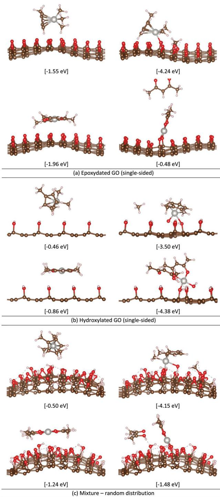  
Fig. 7 Ball-and-stick representation of the lowest-energy (left) physi-sorbed and (right) chemisorbed species of (top)  $\mathrm{MeCpPtMe}_3$  and (bottom)  $\mathsf{Pt(acac)}_2$  on selected graphene oxide models investigated in the current DFT calculations. Relative energies with respect to the separated species are given in brackets. Colour code, C: brown; O: red; H: pink-white; Pt: grey. Hydrogen bonds are represented by black dashed lines.

surface over the epoxydated one  $(\Delta E_{\mathrm{c}} = - 4.38$  vs.  $- 0.48\mathrm{eV})$  The latter finding is a result of the composition of the pertinent chemisorbed products (Fig. 7a and b). In more detail, on the epoxydated surface, one of the acac ligands leaves the pre cursor as an anionic by- product  $(\mathrm{acac}^{- })$  with no tendency to stay bonded to the graphene surface (as predicted for the case of bare graphene). Due to the resulting unstable charge- separated subunits, the chemisorbed species is notably higher in energy with respect to the strongly stabilized physisorbed species  $(\Delta E_{\mathrm{p}} = - 1.96\mathrm{eV}$  vs.  $\Delta E_{\mathrm{c}} = - 0.48\mathrm{eV})$  if not as high as in the case of bare graphene  $(2.65\mathrm{eV})$  .Alongside its high endothermicity  $(\Delta E_{\mathrm{r}} = 1.48\mathrm{eV})$  , the very high accompanying barriers  $(4.46\mathrm{eV})$  render  $\mathsf{Pt(acac)}_2$  chemisorption on epoxydated GO highly unfeasible. In contrast, the hydroxylated surface can provide the precursor with excess hydrogens to yield the gaseous Hacac by- products, stabilizing the resulting chemisorbed products. In addition to the latter, platinum can take with ease a neighbouring, weakly- chemisorbed - OH

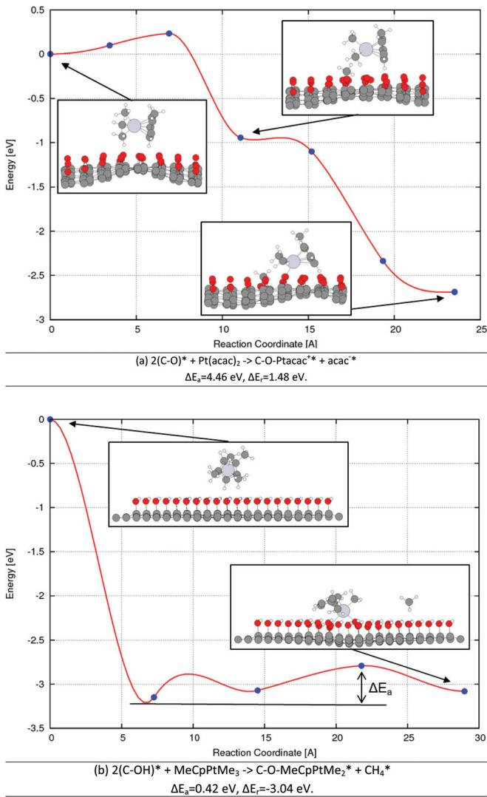  
Fig.8 PBE-D3 level minimum energy paths corresponding to the different reaction pathways for  $\mathrm{MeCpPtMe}_3$  binding on (a) epoxydated and (b) hydroxylated graphene oxide. First and last points on the reaction coordinate correspond to the physisorbed and chemisorbed species, respectively. Physisorbed species of (a) and (b) are  $-1.55\mathrm{eV}$  and  $-0.46\mathrm{eV}$  with respect to the separated species  $(\mathrm{MeCpPtMe}_3$  and GO-epoxy or GO-hydroxy). Activation energy for (b) is computed with respect to the lowest-energy minimum along the pathway (around  $7\dot{A}$  -

group away from the surface, which further reduces the energy of the chemisorbed species (see Fig. 7b). Yet more interestingly, the computed MEP (Fig. 9) reveals that a very stable intermediate species is formed  $\Delta E = - 7.21 \mathrm{eV}$  through abstraction of two adjacent - OH groups by platinum. This finding suggests that chemisorption of  $\mathrm{Pt(acac)}_2$  on hydroxylated GO is notably hindered by this stable intermediate in which Pt does not remain bonded to the graphene surface, rendering it unsuitable for proper Pt nucleation. The latter also applies to the mixture model that comprises hydroxyl groups along with epoxys and hydrogens. All in all, current DFT energetics evidence against the practical use of  $\mathrm{Pt(acac)}_2$  for Pt deposition on any type of graphene oxide.

Another point to note here is the detrimental effect of doping on binding energies. As can be seen in Table 3, doping of the epoxy groups into the graphene lattice impedes the chemisorption efficiency of both precursor types, due to their physisorption. This adverse effect can be attributed to the reduced availability of free electrons on a doped oxygen as opposed to its epoxy counterpart, wherein the epoxy- bridge can readily open up to provide additional charge density. This, in turn, impairs doped oxygen's ability to bind platinum efficiently. Similarly to the doping case, the unlikely case, where both sides of graphene are functionalized, brings about an overall destabilization of the chemisorbed species (as opposed to the physisorbed species) and concurrent increase in the reaction energies needed for the dissociative binding of both precursor types on both surface types.

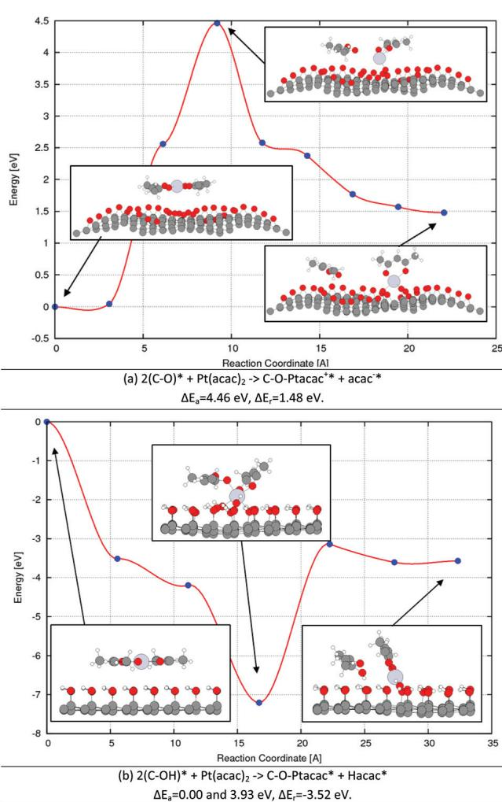  
Fig.9 PBE-D3 level minimum energy paths corresponding to the different reaction pathways for  $\mathsf{Pt(acac)}_2$  binding on (a) epoxydated and (b) hydroxylated graphene oxide. First and last points on the reaction coordinate correspond to the physisorbed and chemisorbed species, respectively. Physisorbed species of (a) and (b) are  $-1.96\in V$  and  $-0.86$  eV with respect to the separated species  $(\mathsf{Pt}(\mathsf{acac})_2$  and GO-epoxy or GO-hydroxyl).

# E. Experimental results - Pt ALD on pristine graphene and graphene oxide

To validate the theoretical findings, Pt ALD was performed on pristine graphene and graphene treated with an  $\mathrm{O_2}$  plasma. Since  $\mathrm{MeCpPtMe}_3$  shows the most promise for uniform Pt ALD on graphene in the calculations presented above, this precursor was selected to test the nucleation of Pt ALD on graphene and graphene oxide. Graphene oxide was created by exposing pristine graphene samples on  $90\mathrm{nmSiO_2 / Si}$  (100) to  $\mathrm{O_2}$  plasma. The created surface groups were studied by XPS. Fig. 10a shows the C 1s spectra of a pristine graphene sample and a sample exposed to  $5\mathrm{minO_2}$  plasma. For pristine graphene the main contribution comes from the  $\mathfrak{sp}^2$  bonding of the carbon atoms at  $284.4\mathrm{eV}$  Besides, a small amount of C- O bonding is present  $(286.4\mathrm{eV})$  indicating the presence of epoxide (C- O- C) or hydroxide (C- OH) groups on the graphene surface, most likely present at the grain boundaries of the graphene.21,78 The two plasmon features observed at  $290.4\mathrm{eV}$  and  $293.2\mathrm{eV}$  are the result of interactions of the photoelectron with free electrons present in the graphene.90 After the  $\mathrm{O_2}$  plasma treatment, part of the  $\mathfrak{sp}^2$  bonds is converted to  $\mathfrak{sp}^3$  bonds  $(284.6\mathrm{eV})$  , indicating that the creation of C- O and  $\mathrm{C} = \mathrm{O}$  bonds on the graphene indeed leads to the buckling of the graphene. The created surface groups contain both C- O (286.4 eV) and  $\mathrm{C} = \mathrm{O}$ $(289.0\mathrm{eV})$  showing that a mixture of epoxide, hydroxide and carbonyl groups is created on the graphene during the  $\mathrm{O_2}$  plasma exposure. The observed  $\mathrm{C} = \mathrm{O}$  to C- O ratio is higher than that reported by others who have also used an  $\mathrm{O_2}$  plasma to functionalize graphene.22 The difference might be caused by a difference in the plasma parameters and plasma exposure time, where a longer exposure results in a higher amount of  $\mathrm{C} = \mathrm{O}$  bonds being created. Nevertheless, GO is predicted to show high binding affinities for  $\mathrm{MeCpPtMe}_3$  regardless of which surface group is more dominantly present (see section D), rendering such differences irrelevant for ALD nucleation efficiency.

After functionalization, 500 cycles of Pt ALD were performed on oxygenated graphene samples, and a pristine graphene sample was added as a reference. The results are shown in Fig. 10b- f. On the pristine graphene hardly any Pt deposition occurs. Lines of Pt are visible, located on the grain boundaries of the graphene, confirming the enhanced reactivity of grain boundaries and defect sites towards  $\mathrm{MeCpPtMe}_3$  adsorption.7 Exposing the graphene to an  $\mathrm{O_2}$  plasma increases

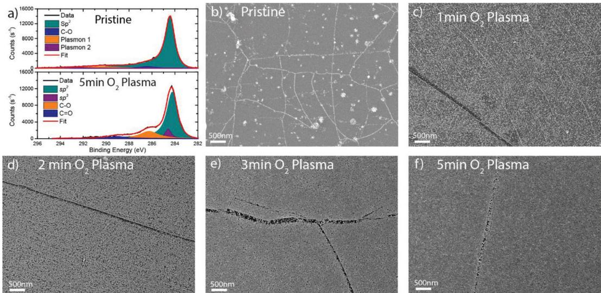  
Fig.10 (a) XPS C 1s spectrum of pristine and graphene treated with 5 min  $\Omega_2$  plasma; (b-f) SEM images showing the Pt coverage after 500 ALD cycles using  $\mathrm{MeCpPtMe}_3$  as the Pt precursor on (b) pristine graphene and graphene treated with (c) 1 min, (d) 2 min, (e) 3 min and (f) 5 min  $\Omega_2$  plasma.

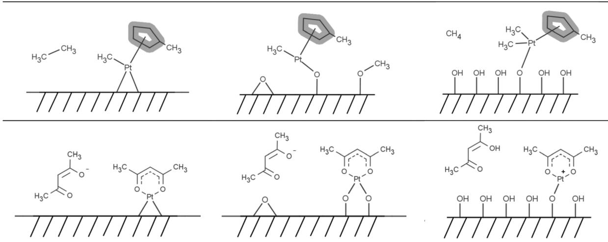  
Fig. 11 Schematic overview of the most feasible chemisorption mechanisms for (top)  $\mathrm{MeCpPtMe}_3$  and (bottom)  $\mathrm{Pt(acac)}_2$  on various bare and functionalized graphene surfaces based on the PBE-D3 level calculations.

the amount of Pt deposited on the graphene. After 1 min  $\mathrm{O}_2$  plasma, small Pt particles are visible all over the graphene surface. Increasing the plasma exposure time results in more functional groups on the graphene surface and increases the coverage further after 500 Pt ALD cycles. A highly closed layer is obtained for the sample treated with 5 min  $\mathrm{O}_2$  plasma, showing that it is indeed the creation of epoxide, hydroxide and carbonyl groups that enhances the nucleation. Only graphene wrinkles (folds in the graphene) are more difficult to cover with Pt (darker lines in the SEM images), and remain partially uncovered even after a 5 min  $\mathrm{O}_2$  plasma treatment. It could be noted that with  $\mathrm{O}_2$  plasma it is more difficult to create functional groups on the graphene wrinkles; therefore the nucleation on these wrinkles is reduced. This could be related to the masking effect of the PMMA lingering from the graphene transfer, gathered on the wrinkles (and ripples) due to their enhanced reactivity. As is evident from Fig. 10, with longer  $\mathrm{O}_2$  plasma treatments, PMMA can be completely replaced with surface oxygens and these wrinkles become finally covered with platinum. Likewise, a longer Pt deposition (i.e. 1000 ALD cycles) yields a complete film closure on the 5 min  $\mathrm{O}_2$  plasma treated sample, as evinced by the SEM images (Fig. S7†).

# 4. Conclusions

We present here a detailed molecular- level analysis of the surface reactions that possibly take place during the dissociative binding of the ALD precursors,  $\mathrm{MeCpPtMe}_3$  and  $\mathrm{Pt(acac)}_2$ , for  $\mathrm{Pt / PtO}_x$  deposition on different graphene

surfaces, i.e. bare, epoxylated and hydroxylated. On the grounds of our ab initio DFT calculations regarding the initial precursor binding step (i.e. ALD nucleation), we give a schematic overview of the primary and side products yielded by the most viable chemisorption pathways in Fig. 11. As also evident from this schematic, the employed reaction mechanism clearly depends on (a) the available surface groups on graphene, and (b) the ligands accompanying the metal centre. Current DFT results also demonstrate the enhanced reactivity of graphene oxide towards  $\mathrm{MeCpPtMe}_3$  as opposed to  $\mathrm{Pt(acac)}_2$ , irrespective of the surface decoration and composition. This is expected to facilitate uniform ALD nucleation on a wafer- scale. Endorsing the computational findings, we have experimentally evinced that large- area, continuous, uniform and high quality ultra- thin films of  $\mathrm{Pt / PtO}_x$  can be grown on graphene oxide that acts as a potent ALD seeding layer. For attaining the latter, we performed a mild  $\mathrm{O}_2$  plasma treatment to obtain single- layer graphene oxide on which Pt was deposited with high coverage using  $\mathrm{MeCpPtMe}_3$  and  $\mathrm{O}_2$  gas. The method presented here is key in enabling the integration of continuous and conformal ultrathin Pt films with graphene that is becoming ever more important in view of the relevant industrial nanocatalyst applications, e.g. in fuel cells, hydrogen technologies and microreactors. Likewise, the atomistic insights presented here form a knowledge basis that will aid the mechanistic understanding of the surface reactions underlying a variety of analogous ALD processes on diverse graphene surfaces.

# Acknowledgements

The authors would like to thank C. O. van Bommel, J. J. L. M. Meulendijks & J. J. A. Zeebregts for technical assistance. This work is part of the research program (Projektruimte: 12PR3101) of the Foundation for Fundamental Research on Matter (FOM), which is part of the Netherlands Organization for Scientific Research (NWO).

# Notes and references

1 R. W. Johnson, A. Hultqvist and S. F. Bent, Mater. Today, 2014, 17, 236- 246. 2 H. C. M. Knoops, S. E. Potts, A. A. Bol and W. M. M. Kessels, in Handbook of Crystal Growth: Thin Films and Epitaxy, ed. T. F. Kuech, Elsevier B.V., Oxford, U.K., 2014, vol. 3, pp. 1101- 1134. 3 A. C. Ferrari, F. Bonaccorso, V. Falko, K. S. Novoselov, S. Roche, P. Boggild, S. Borini, F. Koppens, V. Palermo, N. Pugno, J. A. Garrido, R. Sordan, A. Bianco, L. Ballerini, M. Prato, E. Lidorikis, J. Kivioja, C. Marinelli, T. Ryhnen, A. Morpurgo, J. N. Coleman, V. Nicolosi, L. Colombo, A. Fert, M. Garcia- Hernandez, A. Bachtold, G. F. Schneider, F. Guinea, C. Dekker, M. Barbone, C. Galiotis,

A. Grigorenko, 
G. Konstantatos, 
A. Kis, 
M. Katsnelson, 
C. 
W. 
J. Beenakker, 
L. Vandersypen, 
A. Loiseau, 
V. Morandi, 
D. Neumaier, 
E. Treossi, 
V. Pellegrini, 
M. Polini, 
A. Tredicucci, 
G. 
M. Williams, 
B. 
H. Hong, 
J. 
H. Ahn, 
J. 
M. Kim, 
H. Zirath, 
B. 
J. van Wees, 
H. van der Zant, 
L. Occhipinti, 
A. Di Matteo, 
I. 
A. Kinloch, 
T. Seyller, 
E. Quesnel, 
X. Feng, 
K. Teo, 
N. Rupesinghe, 
P. Hakonen, 
S. 
R. 
T. Neil, 
Q. Tannock, 
T. Lofwander and 
J. Kinaret, Nanoscale, 2014, 7, 4598-4810.  
4 
M. Liu, 
R. Zhang and 
W. Chen, Chem. Rev., 2014, 114, 5117-5160.  
5 
K. Cheng, 
D. He, 
T. Peng, 
H. Lv, 
M. Pan and 
S. Mu, Electrochim. Acta, 2014, 132, 356-363.  
6 
C. Wang, 
L. Ma, 
L. Liao, 
S. Bai, 
R. Long, 
M. Zuo and 
Y. Xiong, Sci. Rep., 2013, 3, 2580.  
7 
K. Kim, 
H.-B.-R. Lee, 
R. 
W. Johnson, 
J. 
T. Tanskanen, 
N. Liu, 
M.-G. Kim, 
C. Pang, 
C. Ahn, 
S. 
F. Bent and 
Z. Bao, Nat. Commun., 2014, 5, 1-9.  
8 
G. 
D. Wilk, 
R. 
M. Wallace and 
J. 
M. Anthony, 
J. Appl. Phys., 2001, 89, 5243.  
9 
J. 
A. Robinson, 
M. Labella, 
M. Zhu, 
M. Hollander, 
R. Kasarda, 
Z. Hughes, 
K. Trumbull, 
R. Cavaleo and 
D. Snyder, Appl. Phys. Lett., 2011, 98, 053103.  
10 
F. Xia, 
V. Perebeinos, 
Y. Lin, 
Y. Wu and 
P. Avouris, Nat. Nanotechnol., 2011, 6, 179-184.  
11 
T. Aaltonen, 
M. Ritala, 
T. Sajavaara, 
J. Keinonen and 
M. Leskelä, Chem. Mater., 2003, 15, 1924-1928.  
12 
H. 
C. 
M. Knoops, 
A. 
J. 
M. Mackus, 
M. 
E. Donders, 
M. 
C. 
M. van de Sanden, 
P. 
H. 
L. Notten and 
W. 
M. 
M. Kessels, Electrochem. Solid-State Lett., 2009, 12, G34.  
13 
H. 
B. 
R. Lee, 
K. 
L. Pickrahn and 
S. 
F. Bent, 
J. Phys. Chem. C, 2014, 118, 12325-12332.  
14 
I. 
J. 
M. Erkens, 
M. 
A. Verheijen, 
H. 
C. 
M. Knoops, 
T. 
F. Landaluce, 
F. Roozeboom and 
W. 
M. 
M. Kessels, Chem. Vap. Deposition, 2014, 20, 258-268.  
15 
A. 
J. 
M. Mackus, 
D. Garcia-Alonso, 
H. 
C. 
M. Knoops, 
A. 
A. Bol and 
W. 
M. 
M. Kessels, Chem. Mater., 2013, 25, 1769-1774.  
16 
J. Hamalainen, 
F. Munnik, 
M. Ritala and 
M. Leskelä, Chem. Mater., 2008, 20, 6840-6846.  
17 
L. Liao and 
X. Duan, Mater. Sci. Eng., R, 2010, 70, 354-370.  
18 
X. Wang, 
S. Tabakman and 
H. Dai, 
J. Am. Chem. Soc., 2008, 130, 8152-8153.  
19 
I.-K. Oh, 
J. Tanskanen, 
H. Jung, 
K. Kim, 
M. 
J. Lee, 
Z. Lee, 
S.-K. Lee, 
J.-H. Ahn, 
C. 
W. Lee, 
K. Kim, 
H. Kim and 
H.-R. 
R. Lee, Chem. Mater., 2015, 27, 5868-5877.  
20 
V. Georgakilas, 
M. Otyepka, 
A. 
B. Bourlinos, 
V. Chandra, 
N. Kim, 
K. 
C. Kemp, 
P. Hobza, 
R. Zboril and 
K. 
S. Kim, Chem. Rev., 2012, 112, 6156-6214.  
21 
A. Criado, 
M. Melchionna, 
S. Marchesan and 
M. Prato, Angew. Chem., Int. Ed., 2015, 54, 10734-10750.  
22 
A. Nourbakhsh, 
C. Adelmann, 
Y. Song, 
C. 
S. Lee, 
I. Asselberghs, 
C. Huyghebaert, 
S. Brizzi, 
M. Tallarida, 
D. Schmeißer, 
S. Van Elshocht, 
M. Heyns, 
J. Kong, 
T. Palacios and 
S. De Gendt, Nanoscale, 2015, 7, 10781-10789.

23 W. C. Shin, J. H. Bong, S.- Y. Choi and B. J. Cho, ACS Appl. Mater. Interfaces, 2013, 5, 11515- 11519.  24 C. Hsieh, W. Y. Te Chen, D. Y. Tzou, A. K. Roy and H. T. Hsiao, Int. J. Hydrogen Energy, 2012, 37, 17837- 17843.  25 S. D. Elliott, Semicond. Sci. Technol., 2012, 27, 074008.  26 L. Huang and B. Han, Phys. Chem. Chem. Phys., 2014, 16, 18501- 18512.  27 A. S. Sandupatla, K. Alexopoulos, M.- F. Reyniers and G. B. Marin, J. Phys. Chem. C, 2015, 119, 18380- 18388.  28 P. E. Blochl, Phys. Rev. B: Condens. Matter, 1994, 50, 17953- 17979.  29 G. Kresse, Phys. Rev. B: Condens. Matter, 1999, 59, 1758- 1775.  30 G. Kresse and J. Hafner, Phys. Rev. B: Condens. Matter, 1993, 47, 558- 561.  31 G. Kresse and J. Hafner, Phys. Rev. B: Condens. Matter, 1994, 49, 14251- 14269.  32 G. Kresse and J. Furthmüller, Comput. Mater. Sci., 1996, 6, 15- 50.  33 G. Kresse, Phys. Rev. B: Condens. Matter, 1996, 54, 11169- 11186.  34 P. Hohenberg, Phys. Rev., 1964, 136, B864- B871.  35 W. Kohn and L. J. Sham, Phys. Rev., 1965, 140, A1133- A1138.  36 J. P. Perdew, K. Burke and M. Ernzerhof, Phys. Rev. Lett., 1996, 77, 3865- 3868.  37 J. P. Perdew, K. Burke and M. Ernzerhof, Phys. Rev. Lett., 1997, 78, 1396- 1396.  38 S. Grimme, J. Antony, S. Ehrlich and H. Krieg, J. Chem. Phys., 2010, 132, 154104.  39 J. Björk, F. Hanke, C.- A. Palma, P. Samori, M. Cecchini and M. Persson, J. Phys. Chem. Lett., 2010, 1, 3407- 3412.  40 S. Grimme, Wiley Interdiscip. Rev.: Comput. Mol. Sci., 2011, 1, 211- 228.  41 X. Hu, J. Schuster, S. E. Schulz and T. Gessner, Microelectron. Eng., 2015, 137, 23- 31.  42 G. Henkelman, B. P. Uberuaga and H. Jonsson, J. Chem. Phys., 2000, 113, 9901.  43 J. Nocedal, Math. Comput., 1980, 35, 773- 773.  44 E. Bitzek, P. Koskinen, F. Gähler, M. Moseler and P. Gumbsch, Phys. Rev. Lett., 2006, 97, 1- 4.  45 VTST tool set for VASP http://theory.cm.utexas.edu/vasp/ (accessed Oct 16, 2015).  46 W. Tang, E. Sanville and G. Henkelman, J. Phys.: Condens. Matter, 2009, 21, 084204.  47 H. Yan, F. Xia, W. Zhu, M. Freitag, C. Dimitrakopoulos, A. A. Bol, G. Tulevski and P. Avouris, ACS Nano, 2011, 5, 9854- 9860.  48 S. M. Geyer, R. Methaapanon, B. Shong, P. A. Pianetta and S. F. Bent, J. Phys. Chem. Lett., 2012, 4, 176- 179.  49 W. M. M. Kessels, H. C. M. Knoops, S. A. F. Dielissen, A. J. M. MacKus and M. C. M. van De Sanden, Appl. Phys. Lett., 2009, 95, 13- 16.  50 I. J. M. Erkens, A. J. M. Mackus, H. C. M. Knoops, P. Smits, T. H. M. van de Ven, F. Roozeboom and

W. 
M. 
M. Kessels, ECS 
J. Solid State Sci. Technol., 2012, 1, P255-P262.  51 
A. 
J. 
M. Mackus, 
N. Leick, 
L. Baker and 
W. 
M. 
M. Kessels, Chem. Mater., 2012, 24, 1752-1761.  52 
T. Aaltonen, 
A. Rahtu, 
M. Ritala and 
M. Leskelä, Electrochem. Solid-State Lett., 2003, 6, C130.  53 
W. Setthapun, 
W. 
D. Williams, 
S. 
M. Kim, 
H. Feng, 
J. 
W. Elam, 
F. 
A. Rabuffetti, 
K. 
R. Poeppelmeier, 
P. 
C. Stair, 
E. 
A. Stach, 
F. 
H. Ribeiro, 
J. 
T. Miller and 
C. 
L. Marshall, 
J. Phys. Chem. C, 2010, 114, 9758-9771.  54 
M. Utriainen, 
M. Kröger-Laukkanen, 
L. 
S. Johansson and 
L. Niinistö, Appl. Surf. Sci., 2000, 157, 151-158.  55 
A. 
M. Lubers, 
C. 
L. Muhich, 
K. 
M. Anderson and 
A. 
W. Weimer, 
J. Nanopart. Res., 2015, 17, 179.  56 
M. Shirazi and 
S. 
D. Elliott, 
J. Comput. Chem., 2014, 35, 244-259.  57 
M. Shirazi and 
S. 
D. Elliott, Chem. Mater., 2013, 25, 878-889.  58 
J. Hämäläinen, 
E. Puukilainen, 
T. Sajavaara, 
M. Ritala and 
M. Leskelä, Thin Solid Films, 2013, 531, 243-250.  59 
Q. Ma and 
F. Zaera, 
J. Vac. Sci. Technol., A, 2013, 31, 01A112.  60 
P. 
a. Denis and 
F. Iribarne, 
J. Phys. Chem. C, 2013, 117, 19048-19055.  61 
L. 
P. Biró and 
P. Lambin, New J. Phys., 2013, 15, 035024.  62 
O. 
V. Yazyev and 
S. 
G. Louie, Phys. Rev. B: Condens. Matter, 2010, 81, 1-7.  63 
J. Lahiri, 
Y. Lin, 
P. Bozkurt, 
I. 
I. Oleynik and 
M. Batzill, Nat. Nanotechnol., 2010, 5, 326-329.  64 
W. 
H. Brito, 
R. Kagimura and 
R. 
H. Miwa, Appl. Phys. Lett., 2011, 98, 213107.  65 
B. Wang, 
Y. 
S. Puzyrev and 
S. 
T. Pantelides, Polyhedron, 2013, 64, 158-162.  66 
P. Nemes-Incze, 
K. 
J. Yoo, 
L. Tapasztó, 
G. Dobrik, 
J. Lábár, 
Z. 
E. Horvth, 
C. Hwang and 
L. 
P. Biró, Appl. Phys. Lett., 2011, 99, 23104.  67 
X. Feng, 
S. Maier and 
M. Salmeron, 
J. Am. Chem. Soc., 2012, 134, 5662-5668.  68 
L. Zhang, 
D. 
A. Pejaković, 
B. Geng and 
J. Marschall, Appl. Surf. Sci., 2011, 257, 5647-5656.  69 
A. 
M. van der Zande, 
P. 
Y. Huang, 
D. 
A. Chenet, 
T. 
C. Berkelbach, 
Y. You, 
G.-H. Lee, 
T. 
F. Heinz, 
D. 
R. Reichman, 
D. 
a. Muller and 
J. 
C. Hone, Nat. Mater., 2013, 12, 554-561.  70 
D. 
L. Duong, 
G. 
H. Han, 
S. 
M. Lee, 
F. Gunes, 
E. 
S. Kim, 
S. 
T. Kim, 
H. Kim, 
Q. 
H. Ta, 
K. 
P. So, 
S. 
J. Yoon, 
S. 
H. 
S. 
J. 
S. 
H. 
S. 
J. Chae, 
Y. 
W. Jo, 
M. 
H. Park, 
S. 
H. 
S. 
J. 
S. 
H. 
S. 
J. Chae, 
S. 
C. Lim, 
J. 
Y. Choi and 
Y. 
H. Lee, Nature, 2012, 490, 235-239.  71 
R. Yang, 
L. Zhang, 
Y. Wang, 
Z. Shi, 
D. Shi, 
H. Gao, 
E. Wang and 
G. Zhang, Adv. Mater., 2010, 22, 4014-4019.  72 
J. 
I. Paredes, 
A. Martinez-Alonso and 
J. 
M. 
D. Tascon, 
J. Mater. Chem., 2000, 10, 1585-1591.  73 
S. Huh, 
J. Park, 
Y. 
S. Kim, 
K. 
S. Kim, 
B. 
H. Hong and 
J. 
M. Nam, ACS Nano, 2011, 5, 9799-9806.

74 F. Güneş, G. H. Han, H.- J. Shin, S. Y. Lee, M. Jin, D. L. Duong, S. J. Chae, E. S. Kim, F. Yao, A. Benayad, J.- Y. Choi and Y. H. Lee, Nano, 2011, 6, 409- 418.  75 D. C. Elias, R. R. Nair, T. M. G. Mohiuddin, S. V. Morozov, P. Blake, M. P. Halsall, A. C. Ferrari, D. W. Boukhvalov, M. I. Katsnelson, A. K. Geim and K. S. Novoselov, Science, 2009, 323, 610- 613.  76 H. Sahin, O. Leenaerts, S. K. Singh and F. M. Peeters, Wiley Interdiscip. Rev.: Comput. Mol. Sci., 2015, 5, 255- 272.  77 J.- A. Yan, L. Xian and M. Y. Chou, Phys. Rev. Lett., 2009, 103, 086802.  78 D. R. Dreyer, S. Park, C. W. Bielawski and R. S. Ruoff, Chem. Soc. Rev., 2010, 39, 228- 240.  79 A. M. Dimiev, L. B. Alemany and J. M. Tour, ACS Nano, 2013, 7, 576- 588.  80 S. Stankovich, D. A. Dikin, R. D. Piner, K. A. Kohlhaas, A. Kleinhammes, Y. Jia, Y. Wu, S. T. Nguyen and R. S. Ruoff, Carbon, 2007, 45, 1558- 1565.  81 G. Lee, J. Kim, K. Kim and J. W. Han, J. Vac. Sci. Technol., A, 2015, 33, 060602.  82 M. Hirata, T. Gotou, S. Horiuchi, M. Fujiwara and M. Ohba, Carbon, 2004, 42, 2929- 2937.  83 K. A. Mkhoyan, A. W. Contryman, J. Silcox, D. A. Stewart, G. Eda, C. Mattevi, S. Miller and M. Chhowalla, Nano Lett., 2009, 9, 1058- 1063.

84 J.- L. Li, K. N. Kudin, M. J. McAllister, R. K. Prud'homme, I. A. Aksay and R. Car, Phys. Rev. Lett., 2006, 96, 176101.  85 A. Bagri, C. Mattevi, M. Acik, Y. J. Chabal, M. Chhowalla and V. B. Shenoy, Nat. Chem., 2010, 2, 581- 587.  86 I. Jung, D. A. Field, N. J. Clark, Y. W. Zhu, D. X. Yang, R. D. Piner, S. Stankovich, D. a. Dikin, H. Geisler, C. a. Ventrice and R. S. Ruoff, J. Phys. Chem. C, 2009, 113, 18480- 18486.  87 N. Ghaderi and M. Peressi, J. Phys. Chem. C, 2010, 114, 21625- 21630.  88 N. Leconte, J. Moser, P. Ordejon, H. Tao, A. Lherbier, A. Bachtold, F. Alsina, C. M. Sotomayor Torres, J.- C. Charlier and S. Roche, ACS Nano, 2010, 4, 4033- 4038.  89 S. T. Christensen and J. W. Elam, Chem. Mater., 2010, 22, 2517- 2525.  90 C 1s XPS http://xpssimplified.com/elements/carbon.php (accessed Jul 7, 2016).  91 E. Färm, M. Kemell, M. Ritala and M. Leskela, J. Phys. Chem., 2008, 112, 15791- 15795.  92 G. Fisichella, S. DiFranco, F. Roccaforte, S. Ravesi and F. Giannazzo, Appl. Phys. Lett., 2014, 104, 233105.  93 W. J. Zhu, T. Low, V. Perebeinos, A. A. Bol, Y. Zhu, H. G. Yan, J. Tersoff and P. Avouris, Nano Lett., 2012, 12, 3431- 3436.