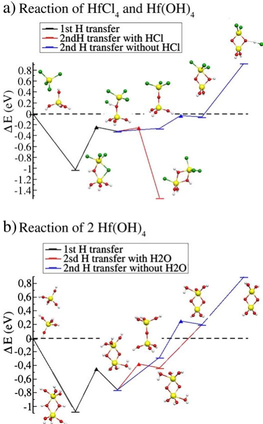
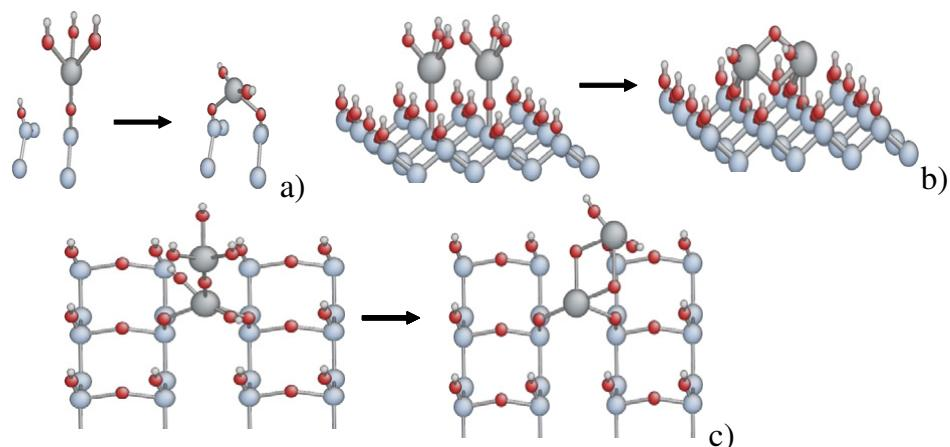
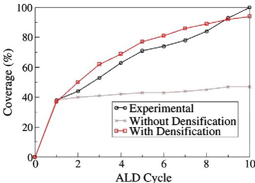

# Introducing densification mechanisms into the modelling of  $\mathrm{HfO_2}$  atomic layer deposition

C. Mastail a,b,c,\*, 
C. Lanthony a,b, 
S. Olivier a,b, 
J.-M. Ducere a,b, 
G. Landa a,b, 
A. Esteve a,b, 
M. Djafari Rouhani a,b, 
N. Richard c, 
A. Dkhissi a,b,d

a CNRS, LAAS, 7 avenue du Colonel Roche, F- 31077 Toulouse, France  b Universite de Toulouse, UPS, INSA, INP, ISAE, LAAS; F- 31077 Toulouse, France  c CEA, DAM, DIF, F- 91680 Arpajon, France  d LCT, Gent University Faculty of Engineering, Krijgslaan 281 S5- 9000 Gent, Belgium

# ARTICLE INFO

# ABSTRACT

Available online 29 October 2011

# Keywords:

Kinetic Monte Carlo simulation  DFT  Densification  High- k   $\mathrm{HfO_2}$   ALD

Multi- scale simulation  Process simulation

Density functional theory calculations are used to highlight some basics of the densification mechanisms arising during atomic layer deposition of  $\mathrm{HfO_2}$  onto silicon dioxide. The obtained results are discussed at the light of a multi- model approach that enables process simulation at the atomic scale via Kinetic Monte Carlo simulations. The impact of the proposed densification mechanisms on the growth is demonstrated. We show that a complete coverage is possible thanks to these mechanisms at a slow rate after that all surface reactive sites (OH sites) have been consumed by precursor molecules.

$\mathfrak{G}$  2011 Elsevier B.V. All rights reserved.

# 1. Introduction

Nowadays, chemical vapor deposition processes are well- established techniques in which Atomic Layer Deposition (ALD) is found to be suitable for the slow and controlled growth of ultrathin, conformal films for the microelectronics industry [1,2]. Leaving the detailed processing conditions aside, a general but fundamental question that arises during growth is the necessary phase transition of the interesting materials from their molecular structure in the gas phase to their solid state structure in the deposited film. This is particularly true for metallic compounds such as metallic oxides. Indeed, in these cases, the metal has a covalent bonding structure, with a small coordination number when considered as a precursor in the gas phase, while at in its end deposited ionic structure, it exhibits a large coordination number. The origin of these findings, which has been referred to as densification in the study by Dkhissi et al. [3] lies in the above structural phase transition. The case of  $\mathrm{HfO_2}$  layers, intended to be used in the first generation of high- k- based gate oxides in the future generation of MOS (Metal Oxide Semiconductor) transistors, constitutes a relevant example. It is worth noting that while an abundant literature is dedicated to precursor/surface physico- chemistry, particularly in the frame of ALD deposition techniques [4- 12], the detailed understanding of the densification mechanisms remains elusive and poorly treated [13]. The present paper aims at giving insight into the densification processes based on gas phase DFT calculations. The ALD process consists in trying to atomically control the growth by separating each of its steps. The film growth proceeds through self- terminating reactions on surfaces. The ALD process can be separated into two half- reactions; the first half- cycle reaction concerns the precursor gas exposure and the second half cycle is the oxidant precursor exposure. In the case of the ALD of  $\mathrm{HfO_2}$ , the precursor molecules considered in the present study are  $\mathrm{HfCl_4}$  and water molecules respectively for the metallic and oxidant precursors. As compared to DVD, this technique prevents from gas phase reaction/densification since there is no contact between water and precursor molecules. So the densification is expected only in the specific context of each ALD cycle. Each exposure phase is separated by a purge phase using an inert gas to remove the remaining unreacted precursor molecules and unwanted reaction products. Actually, it has been experimentally observed that under usual ALD growth conditions, approximately ten cycles are needed to obtain the complete coverage of the initial substrate, suggesting a partial monolayer growth per cycle. Moreover, the density and the coordination number of the deposited oxide near the substrate surface are much lower than those in the bulk oxide, but increase with increasing the film thickness. In more general terms, growth of such an oxide on silicon is still not well understood for two main reasons: ALD growth is associated with complex physicochemical mechanisms and it is strongly dependent on the deposition procedure, temperature conditions or preparation conditions of the substrate. In principle, a multiscale modelling strategy can provide

the necessary link for answering questions associating local physico- chemical investigations and the deposition process. In this spirit, we have recently developed an approach combining DFT calculations for depicting local physico- chemical mechanisms, with a kinetic Monte- Carlo algorithm to simulate at the mesoscale the ALD experimental process of the growth of  $\mathrm{HfO_2}$  on silicon. To date, DFT investigations have been limited to simple precursor decomposition onto surfaces without any specific consideration of densification mechanisms. An empirical attempt to introduce such mechanisms have been proposed leading to some bottlenecks [14], notably in predicting the coordination increase during growth and the coverage versus ALD deposition cycles (resulting in a saturation of the coverage limited to  $73\%$  and the crystallinity limited to  $62\%$  after 10 ALD cycles). In the following, we perform gas phase DFT calculations to open a preliminary window into densification mechanisms. From these results, densification mechanisms are implemented, discussed at the KMC level and their impact is evaluated on the coverage versus ALD cycles results. We demonstrate that densification mechanisms allow to predict basic experimental observations.

# 2. Computational details

All the calculations are performed using the Gaussian03 package [15] within the frame of the density functional theory, using the gradient corrected PBE functional [16]. Oxygen, hydrogen and silicon are described with the triple zeta augmented with a polarization function, respectively d and p, TZVP basis set [17]. Hafnium [Kr], 4d10,4f14 core is replaced with a pseudo- potential [18] and valence electrons were described with a (8s, 7p, 6d) [6s, 5p, 3d] basis set [19]. All the stationary points are checked to be real minima thanks to the determination of the vibration frequencies; this allows us to correct the binding energies of the zero point vibrational energy. Finally, the Basis Set Superposition Error (BSSE) is corrected by the Boys and Bernardi counterpoise scheme [20]. All Kinetic Monte Carlo calculations are performed with the HIKAD code developed in our team [3,21]. Basic KMC simulations here presented are performed on  $20\times 20$  atoms for the substrate modelling with periodic boundary conditions in order to mimic an infinite substrate.

# 3. Results and discussion

# 3.1. DFT investigation

In order to get further insights into the densification mechanisms, we propose a preliminary approach in which surface densification mechanisms are extrapolated from gas phase reactions. The idea is to extract the local chemical part of these mechanisms from their intrinsic collective behavior. Such an approximation has already been proposed and validated for more conventional mechanisms of the ALD. Hydroxylated metal  $\mathrm{M(OH)_x}$  has been used to study the chemical reactions within deposition of metal oxide and the energetic oscillations induced by the size effect. For the deposition of  $\mathrm{Al(Cl_3)_3}$  on  $\mathrm{Al(OH)}$  site, an oscillation of around  $\sim 0.1\mathrm{eV}$  with the cluster size has been observed by Widjaja [23] and Heyman [24]. In addition, many studies for the deposition of molecules on silicon oxide have examined the size effect of the cluster and showed that oscillations are negligible [25- 28].

In this frame,  $\mathrm{M(OH)_3 - OH}$  cluster is seen as a surface model after hydrolysis. Two reacting species are considered on this model surface:  $\mathrm{HfCl_4}$  and  $\mathrm{Hf(OH)_4}$ . These two systems allow us to address densification in each ALD cycle, respectively during precursor and oxidant exposures. The energy diagrams along the reaction path are presented in Fig. 1. Nevertheless, once validated through the complete multi- scale methodology, a more precise view of these mechanisms will be reassessed using more advanced DFT calculations. In this spirit, we have studied for a future publication, the adsorption mechanism of  $\mathrm{HfCl_4}$  on  $\mathrm{HfOH}$  substrate by using a bigger cluster  $(\mathrm{Si_9O_6H_{12}Hf(OH)_2})$ . These initial calculations confirm an oscillation for the adsorption energy of  $0.1\mathrm{eV}$  (calculations not shown). We can then, consider  $\mathrm{M(OH)_3 - OH}$  acceptable in a first approximation.

  
Fig. 1. Precursor dimerization, including H transfer from OH bridges. Black curve is 1st H transfer, blue curve is 2nd H transfer with HCl, physisorbed and red curve is 2nd H transfer without HCl physisorbed. Hf is yellow balls, Chlorine green balls, oxygen red balls and hydrogen white balls.

First of all, we consider a typical precursor surface interaction through  $\mathrm{HfCl_4 / Hf(OH)_4}$  as pictured in Fig. 1a. The initial deposition step is endothermic and leads to the formation of a strand or tree like complex on the surface (see black curve) as already known from the literature. Then, densifying this complex can be operated in two different ways. The red curve indicates an exothermic path in which a Cl atom is exchanged between the precursor molecule and the model surface. This almost barrierless exothermic path can be seen as a source for Chlorine contamination of the substrate. However, the endothermic path indicated in blue where a hydroxyl group of the surface can be bonded to the precursor leading to a double bridging oxygen of the deposited Hafnium atom. This process is characterized by two activation barriers (0.24 and  $0.99\mathrm{eV}$ ) to arrive at the de- hydrogenation of the bridging oxygen.

Along the same line, we now investigate the interaction of  $\mathrm{Hf(OH)_4}$  (Fig. 1b). Our calculation that demonstrates a barrierless pathways is responsible for a spontaneous dimerization ( $< 0.05\mathrm{eV}$  activation) giving rise to two bridging oxygen atoms having both one hydrogen atom. This process is exothermic ( $- 1.07\mathrm{eV}$ ), similarly to the case of the dimerisation reaction of  $\mathrm{HfCl_4}$  and  $\mathrm{Hf(OH)_4}$  ( $- 1.01\mathrm{eV}$ ). In these two dimerization cases, we observe 2 ligands bridging the 2Hf atoms leading to pentacoordinated metal centers. This can be viewed as a first step toward the cubic  $\mathrm{HfO_2}$  crystalline structure since the same symmetries can be found in crystalline oxide as previously defined as a densification process [22]. This observation is of technological

Table 1 Energy difference and activation barrier of first and second H transfers from a bridge forming HCl and  $\mathrm{H}_2\mathrm{O}$  ligand.  

<table><tr><td></td><td>ΔE (eV)</td><td>Barrier (eV)</td></tr><tr><td>Hf(OH)4 Hf Cl4 dimerization</td><td>-1.01</td><td>/</td></tr><tr><td>1st H transfer</td><td>+0.70</td><td>+0.78</td></tr><tr><td>2nd Chlorine transfer with HCl</td><td>-1.22</td><td>+0.06</td></tr><tr><td>2nd H transfer without HCl</td><td>+0.21/+0.99</td><td>+0.24/+0.99</td></tr><tr><td>2 Hf(OH)4 dimerization</td><td>-1.07</td><td>/</td></tr><tr><td>1st H transfer</td><td>+0.31</td><td>+0.62</td></tr><tr><td>2nd H transfer with H2O</td><td>+0.32</td><td>+0.38</td></tr><tr><td>2nd H transfer without H2O</td><td>+0.48</td><td>+0.53</td></tr></table>

importance as it demonstrates that a proper ALD process can severely be altered by CVD like reactions in case of a hydroxylated precursors (emanating from gas traces of impure precursors, or through exchange processes of pure precursors in contact to the surface); the deposition of clusters will then compete with precursor deposition.

A second step to go towards a more crystal- like structure and to complete densification is to take out H from the bridges of the dimers. Fig. 1 shows its chemical pathway and Table 1 resumes energy gain and barriers. For both dimerization reactions, the first H transfer is followed by two mechanisms in competition. The first is desorption of the hydrogenate molecule formed. The second is the direct 2nd deprotonation whereas the hydrogenate molecule formed is still physisorbed. We see that deprotonation reactions are endothermic, subject to backreactions, in the limit of the hydrogenated product desorption. But the overall energy of this two molecule formation is in the same order as intermolecular reactions. Therefore, at the processing temperature, H migrations will occur and appear to move freely at the cluster surfaces, jumping from O bridging sites, to OH groups, and vice versa.

# 3.2.KMC investigation

In order to investigate the ALD process, two densification reactions suggested by the previous DFT study have been implemented into the KMC simulation in addition to the mechanisms resulting from the simple decomposition of the precursors on the surface. A third densification mechanism is also considered that is extrapolated from the literature. These densification mechanisms are shown to impact drastically the growth evolution.

The first densification mechanism considered in our KMC study occurs when one strand  $\mathrm{Hf(OH)_3}$  makes a 2nd oxygen bridge with a neighboring Si- OH leading to a Hf in a crystalline position doubly bonded to the substrate with two oxygen atoms. These two oxygen atoms and the two ligands form a tetrahedral structure. This reaction is called nucleation and expressed in Eq. (1).

$$
||\mathrm{Si} - \mathrm{O} - \mathrm{HfL}_3 + ||\mathrm{Si} - \mathrm{O} - \mathrm{H}\rightarrow \mathrm{Si} - \mathrm{O} - \mathrm{HfL}_2 - \mathrm{O} - \mathrm{Si} + \mathrm{H}_2\mathrm{O}. \tag{1}
$$

Even if this mechanism is predicted by Willis et al. [8] a complete ab initio investigation of this mechanism, including activation energy determination, is still lacking. For the closely related  $\mathrm{ZrCl_4(g)}$  chemistry on a  $\mathrm{SiO_2}$  substrate, the activation energies of the nucleation mechanism for Zr calculated by Han [9] will be taken as first approximation for Hf nucleation mechanism. From the above DFT investigation, we define a second densification mechanism which we named "inter- site" reaction. It expresses the possibility of having two dissociated precursor molecules on two SiOH neighboring sites dimerized. For this reaction, we consider one of the four hydroxyl functions as a sufficient approximation of the substrate. We then obtain two vicinal strands  $\mathrm{Hf(OH)_3}$  linked to the substrate via one oxygen atom. The activation barrier considered to drive the kinetics of this reaction is the addition of the two activations calculated at the DFT level (see Fig. 1b and Table 1, first and second H transfer, respectively 0.62 and  $0.38\mathrm{eV}$  : 1 eV). The resulting densification is expressed here Eq. (2).

$$
2||\mathrm{SiO}_2 - \mathrm{O} - \mathrm{HfL}_2\mathrm{OH}\rightarrow ||\mathrm{SiO}_2 - \mathrm{O} - \mathrm{HfL} - \mathrm{O}_2 - \mathrm{HfL} - \mathrm{O} - \mathrm{O}_2\mathrm{Si}|| + 2\mathrm{HL}.
$$

The third densification reaction, called "on site" reaction, comes if we consider one  $\mathrm{Hf(OH)_3}$  as a first Hf deposited layer and the second as an on top dissociated precursor (i.e. in the second layer). The silicon substrate is in this case reduced to two hydroxyl functions.

$$
||\mathrm{SiO}_2 - \mathrm{O} - \mathrm{HfOHL} - \mathrm{O} - \mathrm{HfL}_3\rightarrow ||\mathrm{SiO}_2 - \mathrm{O} - \mathrm{HfL} - \mathrm{O}_2 - \mathrm{HfL}_2 + 2\mathrm{HL} \tag{3}
$$

where L represents Cl or OH terminal ligands. The relative activation of this process corresponds to the addition of the two activations calculated at the DFT level,  $0.24 + 0.99\mathrm{eV} = 1.23\mathrm{eV}$  (see Fig. 1a and Table 1). The KMC configuration of these three densification reactions is shown in Fig. 2.

Concerning the Kinetic Monte Carlo, the basic ingredients needed to develop a lattice- based KMC model are as follows: (i) we first define a lattice framework able to operate the desired transition between the silicon crystal and the oxide structure, (ii) we then characterize each configuration by associating to each lattice site, the chemical nature of the species occupying this site, (iii) we introduce the concept of events that must describe correctly the chemistry of the basic mechanisms (see Table 2), (iv) we finally indicate how to deal with the time

  
Fig. 2. The KMC configuration of the three densification reactions implemented in the KMC simulator. a) Nucleation, b) inter-site, and c) on-site mechanisms.

Table 2 list of mechanisms implemented in the KMC software HIKAD. The new mechanisms implemented are in bold and those already implemented in the first version of the software are in italics. \* indicates activation energy extrapolated from Zr calculations.  

<table><tr><td rowspan="2">Elementary mechanisms</td><td colspan="2">Activation energy</td></tr><tr><td>On SiOH</td><td>On HfOH</td></tr><tr><td>HfCl4 chemisorption: 1st H transfer</td><td>0.88 eV</td><td>0.78 eV</td></tr><tr><td>Chemisorption back reaction of HCl in HfCl3</td><td>0.62 eV</td><td>0.08 eV</td></tr><tr><td>HfCl4 desorption</td><td>0.48 eV</td><td>1 eV</td></tr><tr><td>HCl desorption</td><td>0.12 eV</td><td>0.05 eV</td></tr><tr><td>Cl ligand hydrolysis</td><td>0.916 eV</td><td></td></tr><tr><td>H2O desorption</td><td>0.619 eV</td><td></td></tr><tr><td>*Nucleation</td><td>0.7 eV</td><td></td></tr><tr><td>Inter-site densification mechanism</td><td>1 eV</td><td></td></tr><tr><td>On-site densification mechanism</td><td>1.2 eV</td><td></td></tr></table>

evolution, namely, the temporal dynamics of the KMC. By implementing all previous gas surface mechanisms obtained in our DFT calculations, literature and these two densification reactions, we performed film growth simulations on  $(20\times 20)$  atoms substrates. All KMC details, gas surface mechanisms, and hydrolysis mechanisms, are published in our papers [3]. The list of all the implemented mechanisms is summarized in the following table. We simulate the growth during 10 ALD cycles, under standard conditions: at  $300^{\circ}C$  and 1.33 mbar pressure for the two precursors. The small size of the substrate does not constitute a limitation in these simulations, where atomic migrations in the growing layer are not taken into account. The injection phases last  $50~\mathrm{ms}$  for metal precursor molecules, and  $100~\mathrm{ms}$  for water, as in experiments, and are each followed by  $3.5s$  of purge.

Fig. 3 represents the coverage of the substrate surface during the first ten deposition cycles. Results of simulations with and without densification mechanisms are compared with experimental observations take in same conditions. Fig. 1 clearly shows the role of densification during the growth of  $\mathrm{HfO_2}$  It is the only condition that allows an agreement with experiments. The importance of this result is related to the experimental observation that ten ALD cycles are necessary in order to reach the full coverage of the silicon substrate (LEIS measurements). After the first ten ALD cycles, growth proceeds via homoepitaxial  $\mathrm{HfO_2 / HfO_2}$  deposition only.

Besides, several modes of growth are successively observed experimentally. After a first cycle, consuming a great number of metal precursors, a slow transient state is established to complete the coverage of the substrate. The first cycle behavior is well reproduced with our simulations, whether densification mechanisms are taken into account or not. Indeed, after the first cycle, without and with densification, our simulations predict the same coverage because in the end of this cycle the growth is essentially governed by precursor adsorption and decomposition reactions as resumed in Table 2. At the end of this first cycle, only  $35\%$  of the substrate is covered by  $\mathrm{HfO_2}$ . According to our simulations, the deposited layer mainly consists in a grid of nuclei consuming all the initial reactive SiOH groups. The first cycle coverage is then directly related to the hydroxyl function of the silicon surface and then the substrate preparation method. After this first cycle, the growth continues on top of the first deposited layer, filling up the successive layers. But this mode of growth does not contribute to the coverage of the initial substrate due to the lack of reactive sites on the silicon substrate. The coverage will though continue to increase slowly thanks to the first deposited layer as a result of on- site densifications. The experimental observation of a slowing down of the coverage rate is explained, by our simulations, as a transition from the nucleation to the densification mechanism. The inter- site densification mechanisms, little by little, authorize bridging of the non reactive surface zones. This is clearly seen in Fig. 3 where the simulation taking densification mechanisms into account follows perfectly the experimental results. On the other hand, the coverage remains constant in simulations which do not take densification mechanisms into account and where tree lie structures are observed.

  
Fig. 3. Coverage of the substrate surface during the first 10 ALD cycles. Simulations with and without densification mechanisms are compared to experimental results. The starting surface used was a chemical  $\mathrm{SiO_2}$  oxide surface prepared with DDC3 method of SMS machine (representing an experimental OH surface density of  $50\%$ ). The ALD reactor used was PulsarTM 2000.

# 4.Conclusion

4. ConclusionWe present a multi-scale study making it possible to simulate the ALD of Hafnia onto  $\mathrm{SiO_2}$  substrates. An attempt to calculate densification mechanisms is established and preliminary gas phase calculations allow determining densification activation barriers. The introduction of these densification mechanisms and associated calculated barriers is shown to reproduce well experimental results on the coverage versus ALD deposition cycles. The first two regimes of growth are observed: the initial regime at the first cycle, driven by the reactions of precursor adsorption and further decomposition on the silicon substrate and the transitional regime, which thanks to the action of densification mechanisms leads to full coverage of the substrate once all adhesion sites of the silicon surface are consumed.

# Acknowledgments

AcknowledgmentsWe thank A.N.R.- 05- CIGC- 0003- 02 LN3M for the funding and Groupement Scientifique CALMIP and IDRIS for the computational resources. We thank the Conseil Regional de Martinique for their help.

# References

References[1] M. Leskela, M. Ritala, Thin Solid Films 409 (2002) 138. [2] G.D. Wilk, R.M. Wallace, J.M. Anthony, J. Appl. Phys. 89 (2001) 5243. [3] A. Dkhissi, A. Esteve, C. Mastail, S. Olivier, G. Mazaleyrat, L. Jeloaica, M. Djafari Rouhani, J. Chem. Theory Comput. 4 (2008) 1915. [4] Y. Widjaja, C.B. Musgrave, J. Chem. Phys. 117 (2002) 1931. [5] J. Aarik, A. Aidla, V. Sammelselg, H. Simon, T. Uustare, J. Cryst. Growth 169 (1996) 496. [6] R.L. Puurunen, Chem. Vap. Deposition 11 (2005) 79. [7] A.B. Mukhopadhyay, C.B. Musgrave, Chem. Phys. Lett. 421 (2006) 215. [8] B.G. Willis, A. Mathew, L.S. Wielunski, R.L. Opila, J. Phys. Chem. C 112 (2008) 1994. [9] J.H. Han, G. Gao, Y. Widjaja, E. Garfunkel, C.B. Musgrave, Surf. Sci. 550 (2004) 199. [10] L. Jeloaica, A. Esteve, M. Djafari Rouhani, D. Esteve, Appl. Phys. Lett. 83 (2003) 542. [11] A. Esteve, M. Djafari Rouhani, L. Jeloaica, D. Esteve, E- MRS 2002 Spring Meeting, Strasbourg, France, Jun 18 21, Comp Mat Sci., 27, 2003, p. 75. [12] G. Mazaleyrat, A. Esteve, L. Jeloaica, M. Djafari Rouhani, Comput. Mater. Sci. 33 (2005) 74. [13] A. Esteve, L. Jeloaica, G. Mazaleyrat, A. Dkhissi, M. Djafari Rouhani, A. Ali Messaoud, N. Fazouan, in: C.R. Albernathy, E.P. Gusev, D. Schlom, S. Stemmer (Eds.), December 01 04, 2003 Boston MA USA, Fundamentals of Novel Oxide/Semiconductor Interfaces Proceedings 786, 2004, p. 35. [14] A. Dkhissi, G. Mazaleyrat, A. Esteve, M. Djafari Rouhani, Phys. Chem. Chem. Phys. 11 (2009) 3701. [15] Gausson 03, Revision B.05, Gaussian, Inc, Pittsburgh PA, 2003.

[16] J.P. Perdew, K. Burke, M. Ernzerhof, Phys. Rev. Lett. 77 (1996) 3865.  [17] A. Schäfer, C. Huber, R. Ahlrichs, J. Chem. Phys. 100 (1994) 5829.  [18] D. Andrae, U. Haeussermann, M. Dolg, H. Stoll, H. Preuss, Theor. Chim. Acta 77 (1990) 123.  [19] F. Weigend, R. Ahlrichs, Phys. Chem. Chem. Phys. 7 (2005) 3297.  [20] S.F. Boys, F. Bernardi, Mol. Phys. 19 (1970) 553.  [21] L. Jeloaica, A. Estève, A. Dkhissi, D. Estève, M. Djafari Rouhani, Comput. Mater. Sci. 33 (2005) 59.  [22] S. Olivier, J.M. Ducéré, C. Mastail, G. Landa, A. Estève, M. Djafari Rouhani, Chem. Mat. 20 (2008) 1555.

[23] Y. Widjaja, C.B. Musgrave, Appl. Phys. Lett. 80 (2002) 18.  [24] A. Heyman, C.B. Musgrave, J. Phys. Chem. B 108 (2004) 18.  [25] A.B. Mukhopadhyay, C.B. Musgrave, Chem. Phys. Lett. 421 (2006) 215.  [26] Z. Hu, C. Heath Turner, J. Phys. Chem. B 110 (2006) 16.  [27] J.H. Han, G. Gao, Y. Widjaja, E. Garfunkel, C.B. Musgrave, Surf Sci. 550 (2004) 199.  [28] A. Dkhissi, A. Esteve, L. Jeloaica, M. Djafari Rouhani, G. Landa, Chem. Phys. 323 (2006) 179.