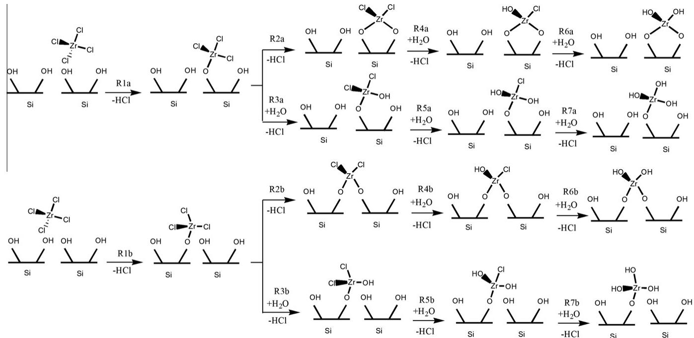
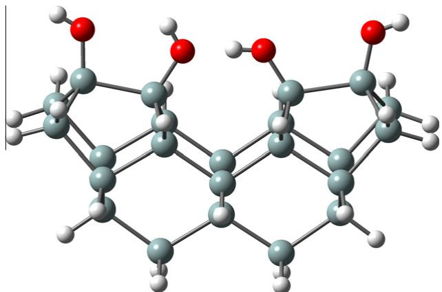
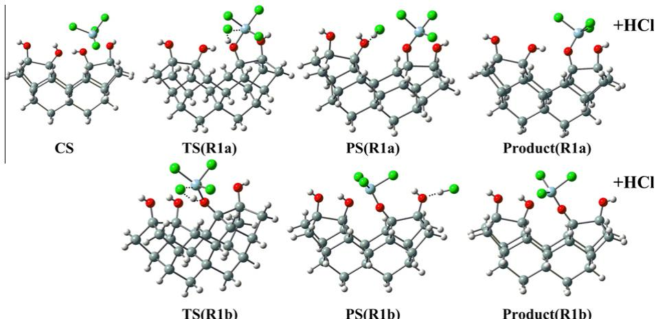
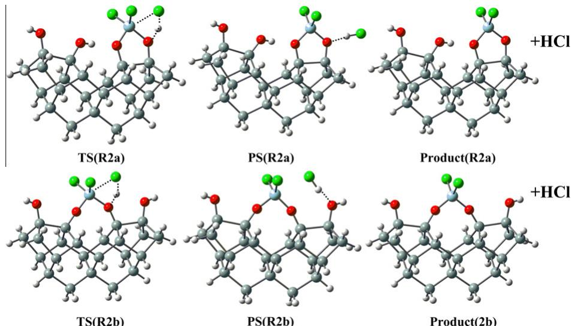
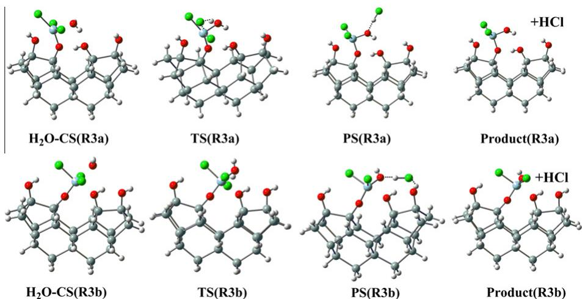
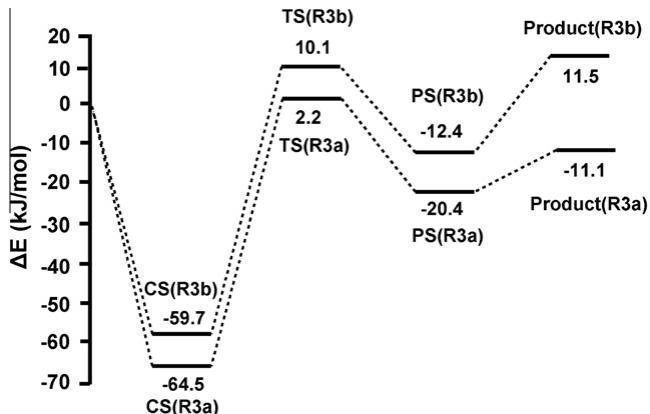
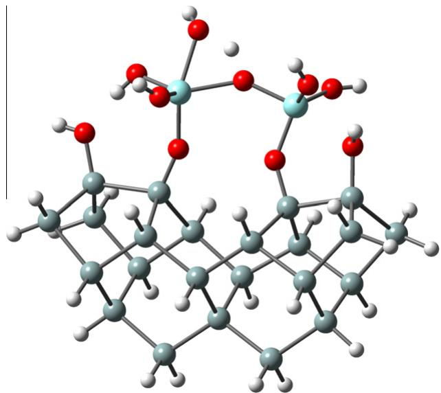

# A density functional theory study on the reactions of chlorine loss in  $\mathrm{ZrO_2}$  thin films by atomic-layer deposition

Chengxing Cui a, Jie Ren b,\*

a School of Chemistry and Chemical Engineering, Henan Institute of Science and Technology, Xinxiang 453003, China b College of Science, Hebei University of Science and Technology, Shijiazhuang 050018, China

# ARTICLE INFO

# ABSTRACT

Article history:  Received 17 September 2011  Received in revised form 13 October 2011  Accepted 13 October 2011  Available online 20 October 2011

Keywords:  Density functional theory   $\mathrm{ZrO_2}$   Thin film  Atomic layer deposition

The chlorine loss reactions of  $\mathrm{ZrO_2}$  thin films of atomic layer deposition on the hydroxylated silicon surface have been studied by the density functional theory. Fourteen possible pathways are designed to investigate the detailed chlorine loss reaction mechanism based on the two- dimer trench silicon cluster model. Experiment shows that HCl self- elimination is the dominant reaction pathway at the low temperatures, and that hydrolysis is the dominant pathway at elevated temperatures for the second chlorine loss reaction. However, our calculations show that raising temperature would not result in HCl self- elimination reaction to be unfavorable. Therefore, the decrease of the number of hydroxyls is the possible reason. In addition, for the four chlorines loss, the reactions on the two- dimer cluster across the trench are compared with those on the same dimer cluster from the viewpoint of energy.

$\widehat{\Xi}$  2011 Published by Elsevier B.V.

# 1. Introduction

$\mathrm{ZrO_2}$  has emerged as the promising candidate for high-  $\kappa$  gate dielectrics in the microelectronics field to replace  $\mathrm{SiO_2}$  owing to its high permittivity (high-  $\kappa$ ,  $\kappa = 17 - 22$ ), large band gap and thermal stability on silicon substrates [1]. Among various fabrication methods for growing high-  $\kappa$  thin films, atomic layer deposition (ALD) shows its unique advantages in depositing ultra thin films with highly conformal and uniform growth over large areas. In ALD, each precursor is pulsed onto the substrate surface in the reaction chamber alternately, and the reaction between the incoming precursors and surface species is self- terminating. As a result, atomic level control of film growth can be achieved [2].

Knowledge of the reaction mechanisms as well as the kinetic and thermodynamic data could be used to optimize the ALD process conditions. Therefore, it is important to explore the reaction mechanism of high-  $\kappa$  oxides grown by ALD. In recent years, ALD growth mechanisms of high-  $\kappa$  oxides (e.g.,  $\mathrm{HfO_2}$  [1,3- 6],  $\mathrm{ZrO_2}$  [3,7- 9] and  $\mathrm{Al_2O_3}$  [7,10]) on silicon surfaces have been extensively studied both experimentally and theoretically.

$\mathrm{ZrO_2}$  thin films have been grown by ALD most commonly using  $\mathrm{ZrCl_4}$  [6,7,11,12] and  $\mathrm{ZrI_4}$  [8,13] as metal precursors. The oxygen sources are usually  $\mathrm{H}_2\mathrm{O}$  [14], hydrogen peroxide  $(\mathrm{H_2O_2})$  [13] and ozone [8]. However,  $\mathrm{ZrCl_4}$  has some distinct drawbacks such as the contamination of chlorine and the release of corrosive HCl by- product when it is used as the metal precursor. Thus it is important to obtain the mechanism of chlorine loss in ALD- grown  $\mathrm{ZrO_2}$  in order to deposit high quality  $\mathrm{ZrO_2}$  thin film. Experiment [15] has found that at low temperature (e.g.,  $180^{\circ}\mathrm{C}$ ) two chlorine ligands are released during the  $\mathrm{ZrCl_4}$  pulse. The remaining two chlorine groups on the surface are released during the  $\mathrm{H}_2\mathrm{O}$  pulse. However, with increasing substrate temperature, the number of chlorine loss decrease gradually during the  $\mathrm{ZrCl_4}$  pulse. At  $400^{\circ}\mathrm{C}$ , only one chlorine ligand is released, and the other three are lost during the  $\mathrm{H}_2\mathrm{O}$  pulse.

Based on two different reactive sites, for the  $\mathrm{ZrO_2}$  deposition using  $\mathrm{ZrCl_4}$  as the metal precursor and  $\mathrm{H}_2\mathrm{O}$  as the oxygen source, the four chlorine loss reactions can be totally divided into fourteen pathways (R1a- R7a and R1b- R7b) depicted in Scheme 1. R1a- R7a belong to the surface reactions on the same dimer, and R1b- R7b belong to the surface reactions on the two dimers adjacent. R1a and R1b are the first chlorine loss reactions on the same dimer and on the adjacent dimers, respectively. R2a and R2b denote the two possible pathways of the second chlorine loss reaction, where the products of R1a and R1b react with their neighboring hydroxyls. The second chlorine loss of  $\mathrm{ZrCl_4}$  can also be completed by the reactions between water precursor and the products of R1a and R1b, that is, R3a and R3b. The products of R2a, R2b, R3a and R3b can continue to react with water to lose the third chlorine of  $\mathrm{ZrCl_4}$ , which are denoted by R4a, R4b, R5a and R5b, respectively. R6a, R6b, R7a and R7b are similarly used to denote the pathways of the fourth chlorine loss reaction between water precursor and the products of R4a, R4b, R5a and R5b, respectively.

  
Scheme 1. The fourteen pathways of the four chlorine loss reactions. The first chlorine loss reactions (R1a and R2b), the second chlorine loss reactions (R2a, R2b, R3a, R3b), the third chlorine loss reactions (R4a, R4b, R5a, R5b) and the fourth chlorine loss reactions (R6a, R6b, R7a, R7b).

# 2. Computational method and models

$\mathrm{Si_9H_{12}}$  one- dimer cluster in previous studies [16- 20] was usually used to simulate  $\mathrm{Si}(100) - 2\times 1$  surface based on its predominantly localized bonding characteristics. In the current work, a larger  $\mathrm{Si_{23}H_{24}}$  two- dimer trench cluster (shown in Fig. 1) is employed to diminish the cluster size effect. The  $\mathrm{Si_{23}H_{24}}$  two- dimer cluster is composed of four layer silicon atoms where the top four silicon atoms compose the surface dimers. The remaining silicon atoms compose three subsurface layers, which are terminated by hydrogen atoms to prevent from unrealistic charge transferring. The four surface hydroxyls of  $\mathrm{Si_{23}H_{24} - (OH)_4}$  are used as surface reactive sites. The structure of the cluster will be fully optimized in all calculations.

All calculations are performed at B3LYP [21- 23] level using the GAUSSIAN 03 software package [24]. A mixed basis set scheme is used to save the computational source because the cluster models used are relatively large in this study. A diffuse double- zeta plus polarization  $6 - 31 + G(d)$  basis set for O,O and H atoms and the LANL2DZ basis set and an effective core potential for  $\mathbb{Z}\mathbb{r}$  and Si atoms are used in every calculation. The geometries of stationary points on the potential energy surfaces are optimized followed by frequency calculations to verify the nature of the stationary points, which include energy minima (all positive frequencies) and transition states (TSs, one imaginary frequency), and to obtain the thermodynamic properties at finite temperatures. All energies reported here include zero- point energy corrections.

  
Fig. 1.  $\mathrm{Si_{23}H_{24}(OH)_4}$  two-dimer cluster used here to simulate the silicon surface. The red, gray and white small balls represent oxygen, silicon and hydrogen atoms, respectively. (For interpretation of the references to color in this figure legend, the reader is referred to the web version of this article.)

# 3. Results and discussion

# 3.1. The first chlorine loss reaction during the  $\mathrm{ZrCl_4}$  pulse

Two chlorine ligands loss during  $\mathrm{ZrCl_4}$  pulse at the low temperatures is reported by experiment [15]. From the reaction mechanism point of view, the second chlorine can react with the neighboring surface hydroxyl. Thus we select one of the two middle surface hydroxyls as the starting reactive site because the  $\mathrm{ZrCl_3}$  fragment formed in the first chlorine loss reaction can react with the neighboring hydroxyl either on the same dimer or on the adjacent dimers across the trench.

The predicted energies of every stationary point at  $0. K,$  and the optimized geometries along the reaction pathways (R1a and R1b) are shown in Figs. 2 and 3. At the beginning of two pathways, a gaseous  $\mathrm{ZrCl_4}$  molecule exposes on the surface sites and forms a chemisorbed state (CS) exothermically by  $132.0\mathrm{kJ / mol}$  .The adsorbed complex is formed owing to the donation of the oxygen lone- pair electrons of hydroxyl into an empty  $d$  - orbital of the  $\mathbb{Z}\mathbb{r}$  atom [25]. After the adsorption, both pathways proceed through a four- center TS composed of  $\mathrm{H - O - Zr - Cl}$  TS in Figs.2 and 3 and then one Cl atom of the adsorbed  $\mathrm{ZrCl_4}$  recombines with the H atom of the surface hydroxyl to form HCl. Finally, both reactions finish along with the release of a gaseous by- product HCl. Calculations show that the activation barrier for HCl formation of R1a is  $91.0\mathrm{kJ / mol}$  relative to its CS, higher than that  $(60.9\mathrm{kJ / mol})$  of R1b. The reaction heats of R2a and R2b are 50.1 and  $93.4\mathrm{kJ / mol}$  respectively. R1a is obviously a less exothermic reaction as

  
Fig.2. e  t  t  t  t  t  t t t t t t t t t t t t t t t t t t t t t t t t t t t t t t t t t t t t t t t t t t t t t t t t t t t t t t t t t t t t t t t t t t t t t t t t t t t t t t t t t t t t t t t t t t t t t t t t t t t t h t t t t t t t t t t t t t t t t t t t t t t t t t t t t t t t t t t t t t t t t t t t t t t t t t t t t t t t t t t t t t t t t t t t t t t t t t t t t t t t t t t t t t t t t t t t t t t t t t t t

  
Fig.3.  t t t t t t t t t t t t t t t t t t t t t t t t t t t t t t t t t t t t t t t t t t t t t t t t t t t t t t t t t t t t t t t t t t t t t t t t t t t t t t t t t t t t t t t t t t t t t t t t t t h e t t t t t t t t t t t t t t t t t t t t t t t t t t t t t t t t t t t t t t t t t t t t t t t t t t t t t t t t t t t t t t t t t t t t t t t t t t t t t t t t t t t t t t t t t t t t t t t t t t t a t t t t t t t t t t t t t t t t t t t t t t t t t t t t t t t t t t t t t t t t t t t t t t t t t t t t t t t t t t t t t t t t t t t t t t t t t t t t t t t t t t t t t t t t t t t t t t t t t t t o t t t t t t t t t t t t t t t t t t t t t t t t t t t t t t t t t t t t t t t t t t t t t t t t t t t t t t t t t t t t t t t t t t t t t t t t t t t t t t t t t t t t t t t t t t t t t t t t t t t e t t t t t t t t t t t t t t t t t t t t t t t t t t t t t t t t t t t t t t t t t t t t t t t t t t t t t t t t t t t t t t t t t t t t t t t t t t t t t t t t t t t t t t t t t t t t t t t t t t h

compared to R1b. Thus we suggest that R1b is energetically more favorable than R1a.

Stable physisorbed HCl molecules are found in both pathways because of the hydrogen bonding interaction between the H atom of HCl and the O atom of the surface hydroxyl. The schematic diagrams are depicted in PS(R1a) and PS(R1b) of Fig. 3 using dashed line, where PS is the acronym for "physisorbed state". For R1a and R1b, the distances of O- H are 1.76 and  $1.75\mathrm{\AA}$  respectively, which are within the effective distance of hydrogen bonding interaction, and the bond lengths of H- Cl are both  $1.32\mathrm{\AA}$  which are slightly longer than the normal HCl molecule  $(1.29\mathrm{\AA})$ . In addition, the desorption energies are 20.4 and  $17.7\mathrm{kJ / mol}$  uphill relative to their own PSs for R1a and R1b, respectively. This indicates that a long HCl purging time is needed to eliminate contamination of chlorine in the ALD process.

# 3.2. The second chlorine loss reaction

Theoretically, the  $\mathrm{ZrCl_3}$  groups formed in R1a and R1b can either react with the neighboring surface hydroxyl (i.e., HCl self- elimination reaction) or react with  $\mathrm{H_2O}$  precursor (i.e., HCl- elimination reaction via hydrolysis). Both types of reactions are followed by the elimination of one HCl molecule as shown in Scheme 1. In the two pathways of HCl self- elimination reaction,  $\mathrm{ZrCl_3}$  group can react with the neighboring hydroxyl either on the same dimer (R2a) or on the adjacent dimer across the trench (R2b), respectively, forming a bridged  $\mathrm{ZrCl_2}$  group and liberating one by- product HCl molecule (Fig. 4). Two HCl- elimination reactions via hydrolysis (R3a and R3b), where  $\mathrm{ZrCl_3}$  reacts with  $\mathrm{H_2O}$  precursor to form one  $\mathrm{ZrCl_2OH}$  group and one HCl molecule are shown in Fig. 5. Therefore, total four pathways have been designed for the second chlorine loss, where R2a and R2b are HCl self- elimination reactions and R3a and R3b are HCl- elimination reactions via hydrolysis.

# 3.2.1. HCl self-elimination reaction for the second chlorine loss

R2a and R2b similarly proceed through a four- member TS which is composed of H- O- Zr- Cl (TS in Fig. 4). The predicted energies and the corresponding geometries along the reaction pathways are shown in Table 1 and Figs. 2 and 4. We find that the energy barrier for R2a is  $69.8\mathrm{kJ / mol}$  relative to the product of R1a, which is  $2.8\mathrm{kJ / mol}$  slightly lower than that of R2b. Furthermore, the reaction heat of R2a is  $68.1\mathrm{kJ / mol}$  which is  $14.6\mathrm{kJ / mol}$  higher than that of R2b. Considering the negligible differences in activation energies, we think that R2b is a more energetically favorable pathway than R2a.

It should be noted that R2a and R2b are the following reactions of R1a and R1b, respectively. As a result, both the activation barriers and the products of R2b are below the initial reactants of R1b. In other words, the chlorine loss reactions (R1b and R2b) are exothermic (Fig. 2). In addition, comparing with the reaction pathways on the same dimer (R1a and R2a), we find that the reaction pathways on the adjacent dimers (R1b and R2b) are energetically more favorable. Similar to R1a and R1b, stable physisorbed HCl molecules have also been found in R2a and R2b. From Fig. 2, we can see that the desorption energy of R2b is  $20.0\mathrm{kJ / mol}$ , higher than that  $(5.1\mathrm{kJ / mol})$  of R2a.

  
Fig.4. t  t  t the web version of this article.)

  
Fig.5. t  t t the web version of this article.)

Table 1 Reaction energies at 0 K  $(\Delta E_0)$  and Gibbs free energy change (AG) at 298, 400, 500,  $600~\mathrm{K},$  and  $700~\mathrm{K}$  for R2a, R2b, R3a and R3b. Energies are shown in kJ/mol. The zero of energy is the sum of the reactant energies.  

<table><tr><td rowspan="2"></td><td colspan="3">R2a</td><td colspan="3">R2b</td><td colspan="3">R3a</td><td colspan="3">R3b</td><td></td><td></td></tr><tr><td>TS</td><td>PS</td><td>Product</td><td>TS</td><td>PS</td><td>Product</td><td>CS</td><td>TS</td><td>PS</td><td>Product</td><td>CS</td><td>TS</td><td>PS</td><td>Product</td></tr><tr><td>ΔE0</td><td>69.8</td><td>63.0</td><td>168.1</td><td>72.6</td><td>33.5</td><td>53.6</td><td>-64.5</td><td>2.2</td><td>-20.4</td><td>-11.1</td><td>-59.7</td><td>10.1</td><td>-12.4</td><td>11.5</td></tr><tr><td>ΔG298</td><td>73.3</td><td>57.1</td><td>32.3</td><td>71.3</td><td>30.8</td><td>10.1</td><td>-16.0</td><td>49.2</td><td>14.7</td><td>-7.9</td><td>-21.0</td><td>51.1</td><td>26.7</td><td>9.8</td></tr><tr><td>ΔG400</td><td>75.5</td><td>54.9</td><td>19.8</td><td>70.8</td><td>29.3</td><td>-6.3</td><td>2.9</td><td>67.9</td><td>27.9</td><td>-6.2</td><td>-7.0</td><td>66.9</td><td>41.6</td><td>9.2</td></tr><tr><td>ΔG500</td><td>77.9</td><td>52.7</td><td>7.7</td><td>70.4</td><td>27.6</td><td>-22.4</td><td>21.5</td><td>86.4</td><td>40.7</td><td>-4.6</td><td>6.4</td><td>82.2</td><td>56.2</td><td>8.4</td></tr><tr><td>ΔG600</td><td>80.4</td><td>50.5</td><td>-4.3</td><td>70.0</td><td>25.9</td><td>-38.4</td><td>39.9</td><td>104.7</td><td>53.2</td><td>-3.1</td><td>19.5</td><td>97.5</td><td>70.5</td><td>7.5</td></tr><tr><td>ΔG700</td><td>82.9</td><td>48.3</td><td>-16.0</td><td>69.6</td><td>24.1</td><td>-54.3</td><td>58.1</td><td>123.0</td><td>65.5</td><td>-1.6</td><td>32.4</td><td>112.5</td><td>84.5</td><td>6.3</td></tr></table>

# 3.2.2. HCl-elimination reaction via hydrolysis for the second chlorine loss

For HCl- elimination reaction via hydrolysis, the potential energy surfaces of two pathways (R3a and R3b) are shown in Fig. 6. Gaseous  $\mathrm{H}_2\mathrm{O}$  precursor and the surface  $\mathrm{ZrCl_3}$  form stable chemisorbed complexes with the release energies of 64.5 and  $59.7\mathrm{kJ / mol}$  for R3a and R3b, respectively. The chemisorptions are similarly owing to the donation of the oxygen lone- pair electrons of  $\mathrm{H}_2\mathrm{O}$  into an empty  $d$ - orbital of the  $\mathrm{Zr}$  atom. Then, both the pathways proceed through a four- member TS (H- O-  $\mathrm{Zr - Cl}$ ) as shown in Fig. 5. The energy barrier of R3b is  $69.8\mathrm{kJ / mol}$ , which is  $3.1\mathrm{kJ / mol}$  higher than R3a. Finally, the reactions go through PSs and form the products. It can be seen from Fig. 6 that R3a is an exothermic reaction; however, R3b is an endothermic reaction. So we can argue that R3a is more energetically favorable than R3b.

  
Fig. 6. Predicted energies for the second chlorine loss pathways via hydrolysis (R3a and R3b). The zero is the sum energy of the products of R1a/R1b and water.

Physisorbed HCl molecules have also been found in R3a and R3b. We can see in Fig. 5 that the hydrogen bonding interaction (dashed line) resulting in the physisorption comes from different types of surface hydroxyls. The main difference from R3a is that besides the new formed  $\mathrm{Zr - OH}$ , the  $\mathrm{Si - OH}$  also plays a role in the hydrogen bonding interaction for R3b. Therefore, the adsorbed energy of R3b is higher than that of R3a.

# 3.2.3. Temperature effects on the second chlorine loss

Temperature can affect almost all the chemical reactions as we all know. Experiment [15] shows that half of the chlorine atoms are released during the  $\mathrm{ZrCl_4}$  pulse while the remained chlorine atoms are released during the  $\mathrm{H}_2\mathrm{O}$  pulse at low temperature, and only one chlorine is released per molecule during the  $\mathrm{ZrCl_4}$  pulse, the other three being liberated during the  $\mathrm{H}_2\mathrm{O}$  pulse at elevated temperatures. To investigate the temperature effects on the second chlorine loss, the reaction energies at  $0\mathrm{K}(\Delta E_0)$  and Gibbs free energy change  $(\Delta G)$  at 298, 400, 500, 600,  $700\mathrm{K}$  for  $\mathrm{R2a / R2b}$  and  $\mathrm{R3a / R3b}$  are calculated and shown in Table 1.

We can see in Table 1, R2a and R2b have lower activation barriers and more heat release with temperature rising when comparing with R3a and R3b, respectively. Thus, we can suggest that R2a and R2b are more energetically favorable than R3a and R3b, i.e. HCl self- elimination reaction is more thermodynamically favorable than HCl- elimination reaction via hydrolysis at elevated temperatures. However, experiments [15] have shown that R3a and R3b rather than R2a and R2b will be the main reaction pathways at elevated temperatures. Theoretical studies [26] have shown the number of surface hydroxyls will affect the chlorine loss at elevated temperatures, because surface hydroxyls will form water with each other, and this trend can be strengthened at elevated temperatures. In order to look for the water loss reaction pathway, the final product of the four chlorine loss reaction is employed as the model. This allows us to simulate the water loss mechanism on the growing  $\mathrm{ZrO_2}$  films. Calculation shows that the neighboring  $\mathrm{Zr - OH}$  can easily form the bridged  $\mathrm{Zr - O - Zr}$  group with an activation energy of  $36.2\mathrm{kJ / mol}$  (TS is shown in Fig. 7). The replacement of surface hydroxyl by bridged oxygen would result in the decrease of HCl self- elimination reactions R2a and R2b. As a result, HCl- elimination reaction via hydrolysis, i.e., R3a and R3b, will become the dominating chlorine loss pathways at elevated temperatures.

# 3.3. The third chlorine loss reaction during the  $\mathrm{H}_2\mathrm{O}$  pulse

There are two types of products, i.e.,  $- \mathrm{O - ZrCl_2 - O - }$  and  $- \mathrm{O - ZrCl_2OH}$ , formed in the reactions of the second chlorine loss (R2a/R2b and R3a/R3b). The formed  $\mathrm{ZrCl_2}$  groups can react with water precursor, i.e. R4a, R4b, R5a and R5b, which are shown in Scheme 1. Theoretically, the  $- \mathrm{O - ZrCl_2OH}$  can react with its neighboring hydroxyl and release one HCl molecule. As mentioned above the number of neighboring hydroxyls would decrease greatly as the temperature is raised. Thus the reactions between  $- \mathrm{O - ZrCl_2OH}$  and its neighboring hydroxyl have not been discussed in this study.

  
Fig. 7. Transition state structure for the water loss reaction of adjacent  $\mathrm{Zr - OH}$  groups.

R4a and R4b are the reactions of the products of R2a and R2b with water, respectively. The corresponding energies of these pathways are shown in Table 2. Table 2 shows that the activation barrier for HCl formation of R4b is  $75.5\mathrm{kJ / mol}$  relative to its adsorption state, which is  $39.1\mathrm{kJ / mol}$  lower than R4a. R4a and R4b are both the endothermic reactions whose reaction heats are 11.3 and  $14.5\mathrm{kJ / mol}$ , respectively.

Similarly, R5a and R5b are the following hydrolysis reactions of the products of R3a and R3b, respectively. It can be found that R5b has lower activation barrier and less positive reaction heat than R5a. As a result, we think R5b is the favorable pathway for the third chlorine loss reaction at elevated temperatures.

# 3.4. The fourth chlorine elimination reaction during the  $\mathrm{H}_2\mathrm{O}$  pulse

There is only one chlorine on  $\mathrm{Zr}$  atom in forms of  $- \mathrm{O - ZrClOH - O - }$  and  $- \mathrm{O - ZrCl(OH)_2}$  after the loss of the third chlorine atom, and the two intermediate products can react with  $\mathrm{H}_2\mathrm{O}$  to form HCl and the final products  $- \mathrm{O - Zr(OH)_2 - O - }$  and  $- \mathrm{O - Zr(OH)_3}$ , which are respectively denoted by the pathways of R6a, R6b, R7a and R7b. The product of R4a reacts with water to lose the last chlorine denoted by R6a, and R7a is the reaction of the product of R5a reacting

Table 2 The zero corrected energy of every stationary point on the selected reaction pathways. The zero of energy is the sum of the reactant energies. Energies are shown in kJ/mol.  

<table><tr><td>Reactions</td><td>CS</td><td>TS</td><td>PS</td><td>Product</td></tr><tr><td>R4a</td><td>-90.2</td><td>24.4</td><td>6.8</td><td>11.3</td></tr><tr><td>R4b</td><td>-51.8</td><td>23.7</td><td>7.2</td><td>14.5</td></tr><tr><td>R5a</td><td>-23.5</td><td>57.2</td><td>40.1</td><td>52.0</td></tr><tr><td>R5b</td><td>-30.1</td><td>18.5</td><td>6.2</td><td>14.1</td></tr><tr><td>R6a</td><td>-83.8</td><td>22.6</td><td>7.9</td><td>17.7</td></tr><tr><td>R6b</td><td>-46.6</td><td>22.8</td><td>8.8</td><td>22.4</td></tr><tr><td>R7a</td><td>-69.0</td><td>-20.9</td><td>-20.7</td><td>-3.6</td></tr><tr><td>R7b</td><td>-43.2</td><td>32.7</td><td>14.3</td><td>32.8</td></tr></table>

with water. In the same way, R6b and R7b are the following reactions of R4b and R5b, respectively.

The energies of each stationary point on the potential energy surfaces of the above mentioned reaction pathways are also listed in Table 2. The activation barrier of R6a is  $106.4\mathrm{kJ / mol}$  which is  $37.0\mathrm{kJ / mol}$  higher than R6b. This shows that R6a is the energetically less favorable pathway. In contrast, R7a is the energetically more favorable pathway because it has lower activation barrier and more heat release as compare to R7b.

Combined the experiment findings with our calculations, R2b and R3a should be the favorable pathway for the second chlorine loss at the low and elevated temperatures, respectively. By the energy comparison of the corresponding reactions for the third and fourth chlorines loss, we suggest that the reactions on the two- dimer trench cluster (R4b and R6b) should be the following reactions of R2b at the low temperatures. In addition, R5b and R7a may occur subsequently after R3a at elevated temperatures.

# 4\. Conclusion

The reactions of chlorine loss of ALD- grown  $\mathrm{ZrO_2}$  thin films using  $\mathrm{ZrCl_4 / H_2O}$  as a precursor combination has been studied by the DFT in detail. Fourteen possible pathways for the chlorine loss are proposed according to surface reactions occurring either on the same dimer or on the adjacent dimers across the trench. We find that the precursor  $\mathrm{ZrCl_4}$  can be adsorbed directly on the hydroxylated silicon surface to form a stable adsorbed complex, and that the by- product HCl prefers to stay at the reactive surface in all the fourteen pathways. These results indicate that the elimination of chlorine contamination is needed in the process of manufacturing  $\mathrm{ZrO_2}$  thin films. The temperature effects on the second chlorine loss reaction are also studied theoretically based on the experiments. Experiment shows that HCl self- elimination is the dominant reaction pathway at the low temperatures, and hydrolysis is the dominant pathway at elevated temperatures. However, our calculation shows that raising temperature would not lead to HCl self- elimination reaction to be unfavorable. Thus, the decrease of the number of hydroxyls is the possible reason. For the third and fourth chlorine loss, we find that the reactions on the two- dimer trench cluster are energetically more favorable than those on the same dimer cluster at the low temperatures. In addition, we find that the third chlorine loss occurs on the adjacent dimers, and the fourth chlorine loss occurs on the same dimer more easily at elevated temperatures.

# Acknowledgements

This work was supported by the National Natural Science Foundation of China (No.20973052), the Natural Science Foundations of Hebei Province (No. B2010000845), and the Science Foundation for Distinguished Young Scholars of Hebei University of Science and Technology.

# References

[1] G.D. Wilk, R.M. Wallace, J.M. Anthony, High-  $\kappa$  gate dielectrics: current status and materials properties considerations, J. Appl. Phys. 89 (2001) 5243- 5275. [2] M. Ritala, M. Leskelä, Atomic layer deposition, in: H.S. Nalwa (Ed.), Handbook of Thin Film Materials, vol. 1, Academic Press, San Diego, 2002, pp. 103- 159. [3] M. Gutowski, J.E. Jaffe, C.L. Liu, M. Stoker, R.I. Hedge, R.S. Rai, P.J. Tobin, Thermodynamic stability of high-  $\kappa$  dielectric metal oxides  $\mathrm{ZrO_2}$  and  $\mathrm{HfO_2}$  in contact with Si and  $\mathrm{SiO_2}$ . Appl. Phys. Lett. 80 (2002) 1897- 1899.

[4] M.- H. Cho, Y.S. Roh, C.N. Whang, K. Jeong, S.W. Nahm, D.- H. Ko, J.H. Lee, N.I. Lee, K. Fujihara, Thermo stability and structural characteristics of  $\mathrm{HfO_2}$  films on Si (100) grown by atomic- layer deposition, Appl. Phys. Lett. 81 (2002) 472- 474. [5] B.H. Lee, L. Kang, R. Nieh, W.J. Qi, J.C. Lee, Thermal stability and electrical characteristics of ultrathin hafnium oxide gate dielectric reoxidized with rapid thermal annealing, Appl. Phys. Lett. 76 (2000) 1926- 1928. [6] D. Han, J. Kang, C. Lin, R. Han, Reliability characteristics of high-  $\kappa$  gate dielectrics  $\mathrm{HfO_2}$  in metal- oxide semiconductor capacitors, Microelectron. Eng. 66 (2003) 643- 647. [7] E.P. Gusev, E. Cartier, D.A. Buchanan, M. Gribelyuk, M. Copel, H. Okorn- Schmidt, C. D'Emic, Ultrathin high-  $\kappa$  metal oxides on silicon: processing, characterization and integration issues, Microelectron. Eng. 59 (2001) 341- 349. [8] R.M. Wallace, G.D. Wilk, High-  $\kappa$  dielectric materials for microelectronics, Crit. Rev. Solid State Mater. Sci. 28 (2003) 231- 285. [9] J. Robertson, High dielectric constant gate oxides for metal oxide Si transistors, Rep. Prog. Phys. 69 (2006) 327- 396. [10] E.P. Gusev, M. Copel, E. Cartier, I.J.R. Baumvol, C. Krug, M.A. Gribelyuk, High- resolution depth profiling in ultrathin  $\mathrm{Al_2O_3}$  films on Si, Appl. Phys. Lett. 76 (2000) 176- 178. [11] L. Niinisto, M. Nieminen, J. Paivasaari, J. Niinisto, M. Putkonen, M. Nieminen, Advanced electronic and optoelectronic materials by Atomic Layer Deposition: an overview with special emphasis on recent progress in processing of high-  $\kappa$  dielectrics and other oxide materials, Phys. Status Solidi A 201 (2004) 1443- 1452. [12] M. Ritala, M. Leskelä, Zirconium dioxide thin films deposited by ALE using zirconium tetrachloride as precursor, Appl. Surf. Sci. 75 (1994) 333- 340. [13] K. Kukli, K. Forsgren, J. Aarik, T. Uustare, A. Aidla, A. Niskanen, M. Ritala, M. Leskelä, A. Hårsta, Atomic layer deposition of zirconium oxide from zirconium tetraiodide, water and hydrogen peroxide, J. Cryst. Growth 231 (2001) 262- 272. [14] J. Niinisto, A. Rahtu, M. Putkonen, M. Ritala, M. Leskelä, L. Niinisto, In situ quadrupole mass spectrometry study of atomic- layer deposition of  $\mathrm{ZrO_2}$  using  $\mathrm{Cp_2Zr(CH_3)_2}$  and water, Langmuir 21 (2005) 7321- 7325. [15] A. Rahtu, M. Ritala, Reaction mechanism studies on the zirconium chloride- water atomic layer deposition process, J. Mater. Chem. 12 (2002) 1484- 1489. [16] A. Esteve, M. Djafari Rouhani, L. Jeloaida, D. Esteve, DFT investigation of  $\mathrm{HfCl_4}$  decomposition on hydroxylated  $\mathrm{SiO_2}$ : first stage of  $\mathrm{HfO_2}$  atomic layer deposition, Comput. Mater. Sci. 27 (2003) 75- 80. [17] L. Jeloaida, A. Esteve, M. Djafari Rouhani, D. Esteve, Density functional theory study of  $\mathrm{HfCl_4}$ ,  $\mathrm{ZrCl_4}$  and  $\mathrm{Al(CH_3)_3}$  decomposition on hydroxylated  $\mathrm{SiO_2}$ : Initial stage of high-  $\kappa$  atomic layer deposition, Appl. Phys. Lett. 83 (2003) 542- 544. [18] Y. Widjaja, J.H. Han, C.B. Musgrave, Quantum chemical study of zirconium oxide deposition on the  $\mathrm{Si(OO)}$  -  $(2\times 1)$  surface, J. Phys. Chem. B 107 (2003) 9319- 9324. [19] J.K. Kang, C.B. Musgrave, Mechanism of atomic layer deposition of  $\mathrm{SiO_2}$  on the silicon (100) - 2  $\times$  14 surface using  $\mathrm{SiO_4}$  and  $\mathrm{H_2O}$  as precursors, J. Appl. Phys. 91 (2002) 3408- 3414. [20] M.D. Halls, K. Raghavachari, Atomic layer deposition growth reactions of  $\mathrm{Al_2O_3}$  on  $\mathrm{Si(100)}$  - 2  $\times$  1, J. Phys. Chem. B 108 (2004) 4058- 4062. [21] C. Lee, W. Yang, R.G. Parr, Development of the Colle- Salvetti conelation energy formula into a functional of the electron density, Phys. Rev. B 37 (1988) 785- 789. [22] A.D. Becke, Density- functional exchange- energy approximation with correct asymptotic behavior, Phys. Rev. A 38 (1988) 3098- 3100. [23] A.D. Becke, Density- functional thermochemistry. III. The role of exact exchange, J. Chem. Phys. 98 (1993) 5648- 5652. [24] M.J. Frisch, G.W. Trucks, H.B. Schlegel, C.R. Scuseria, M.A. Robb, J.R. Cheeseman, J.A. Montgomery Jr., T. Vreven, K.N. Kucin, N.C. Burant, J.M. Millam, S.S. Iyengar, J. Tomasi, V. Barone, B. Mennucci, M. Cossi, G. Scalmani, N. Rega, G.A. Peterson, H. Nakatsuji, M. Hada, M. Ekura, K. Toyota, M. Kune, J. Li, J. Hasegawa, M. Ishida, T. Nakajima, Y. Honda, O. Kitao, H. Nakai, R. Fluku, X. Li, A. Knox, H.P. Hratchian, J.B. Cross, C. Adamo, J. Jaramillo, R. Gomperts, R.E. Stratmann, O. Yazyev, A.J. Austin, R. Cammi, C. Pomelli, J.W. Ochterski, P.Y. Ayala, K. Morokuma, G.A. Voth, P. Salvador, J.J. Dannenberg, V.G. Zakrzewski, S. Dapprich, A.D. Daniels, M.C. Strain, O. Farkas, D.K. Malick, A.D. Rabuck, K. Raghavachari, J.B. Foresman, J.V. Ortiz, Q. Cui, A.G. Baboul, S. Clifford, J. Cioslowski, B.B. Stefanov, G. Liu, A. Lashenko, P. Piskorz, I. Komaromi, R.L. Martin, D.J. Fox, T. Keith, M.A. Al- Laham, C.Y. Peng, A. Nanayakkara, M. Challacombe, P.M.W. Gill, B. Johnson, L.W. Chen, M.W. Wong, C. Gonzalez, J.A. Pople, Gaussian 03, Gaussian Inc., Pittsburgh, PA, 2003. [25] Y. Widjaja, C.B. Musgrave, Atomic layer deposition of hafnium oxide: a detailed reaction mechanism from first principles, J. Chem. Phys. 117 (2002) 1931- 1934. [26] M. Deminsky, A. Knizhnik, I. Belov, S. Umanskii, E. Rykova, A. Bagatur'yants, B. Potapkin, M. Stoker, A. Korkin, Mechanism and kinetics of thin zirconium and hafnium oxide film growth in an ALD reactor, Surf. Sci. 549 (2004) 67- 86.