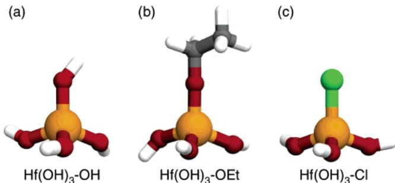
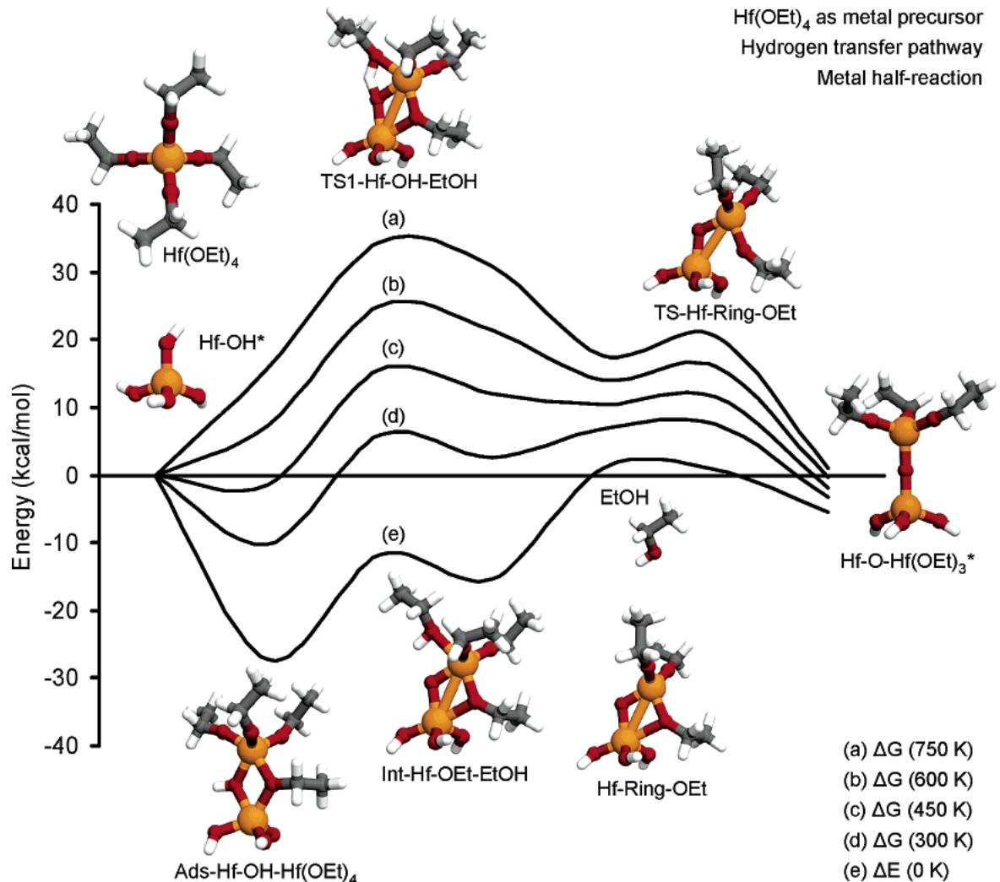
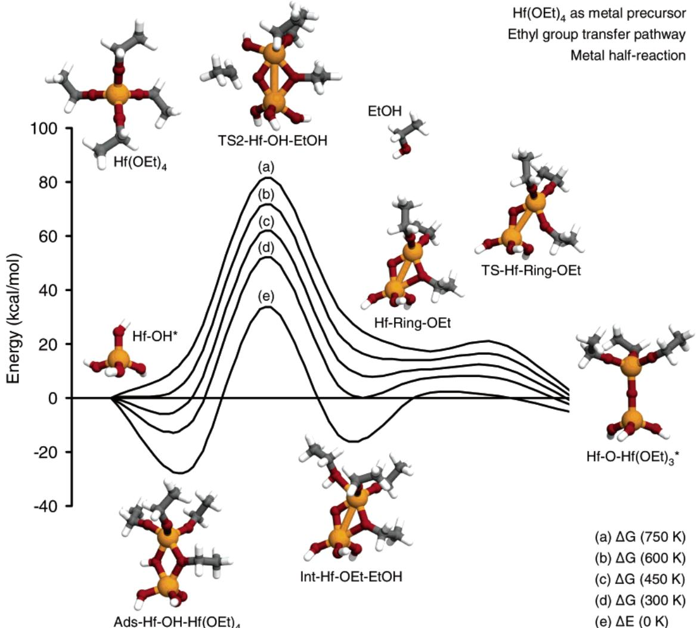
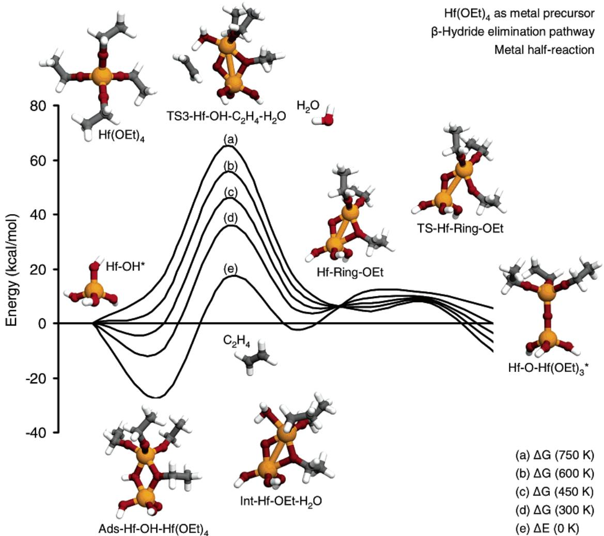
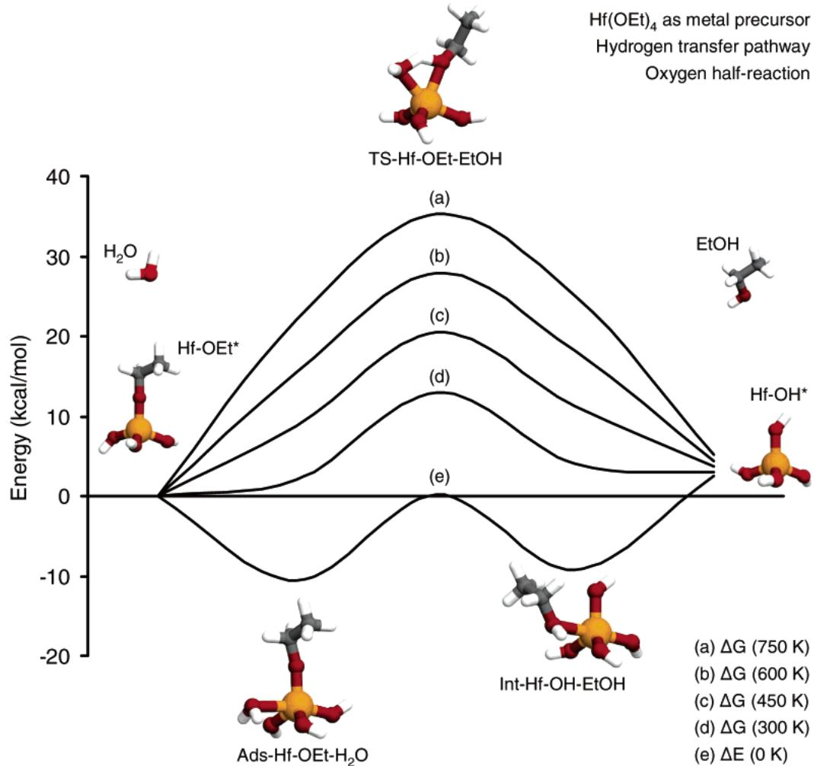
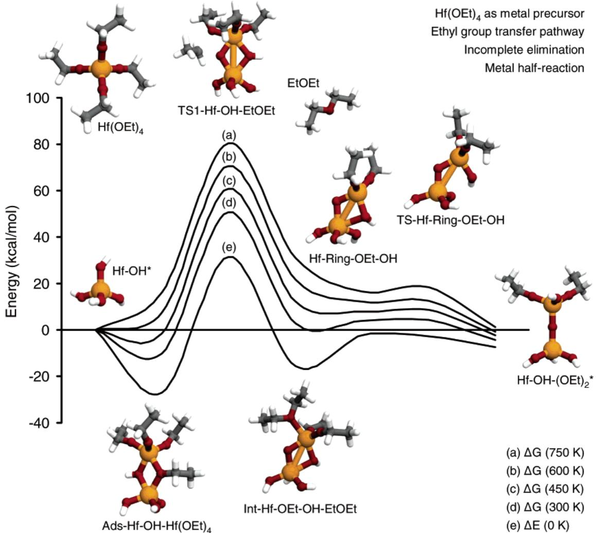
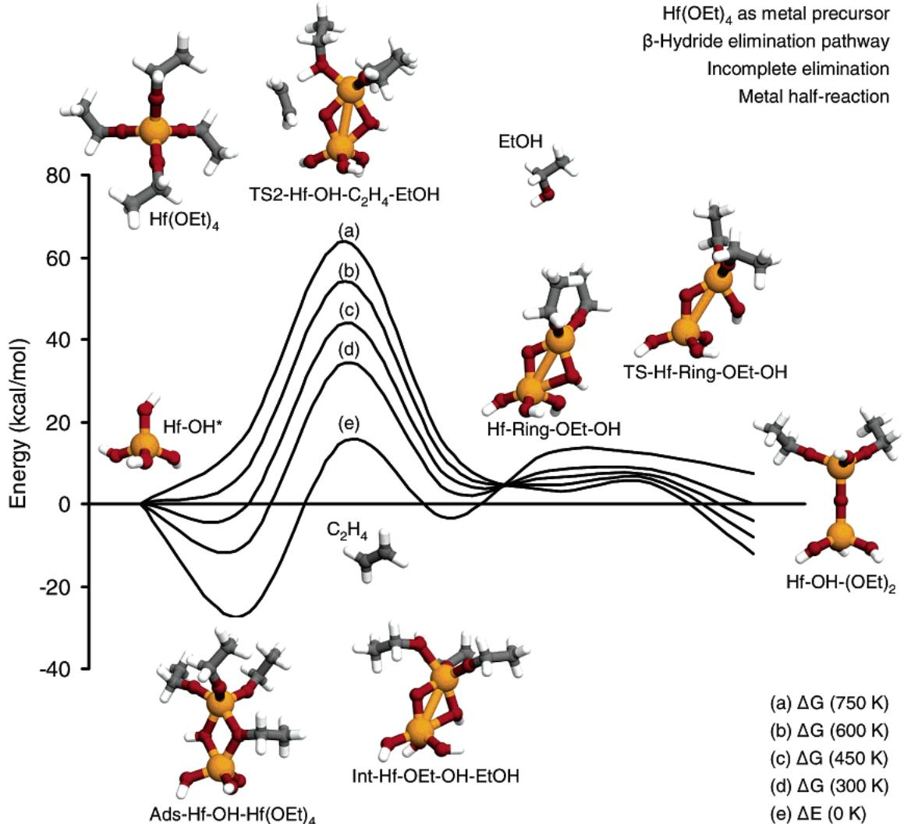
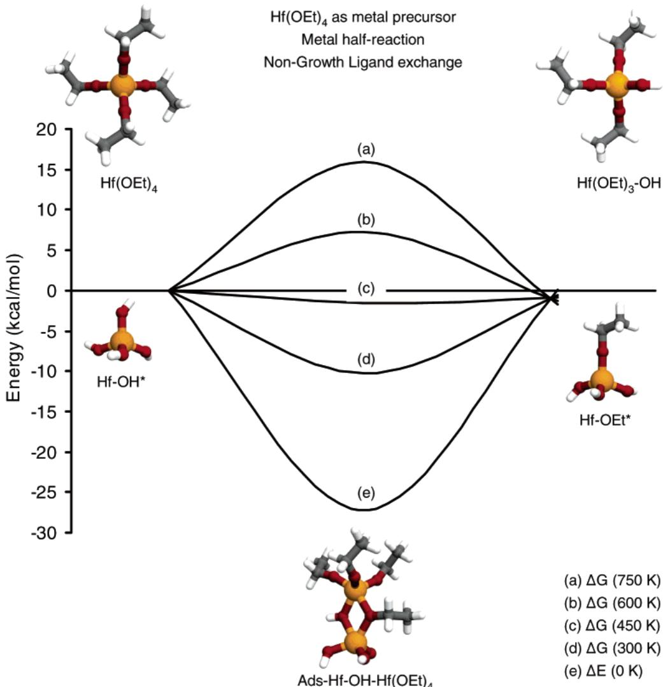
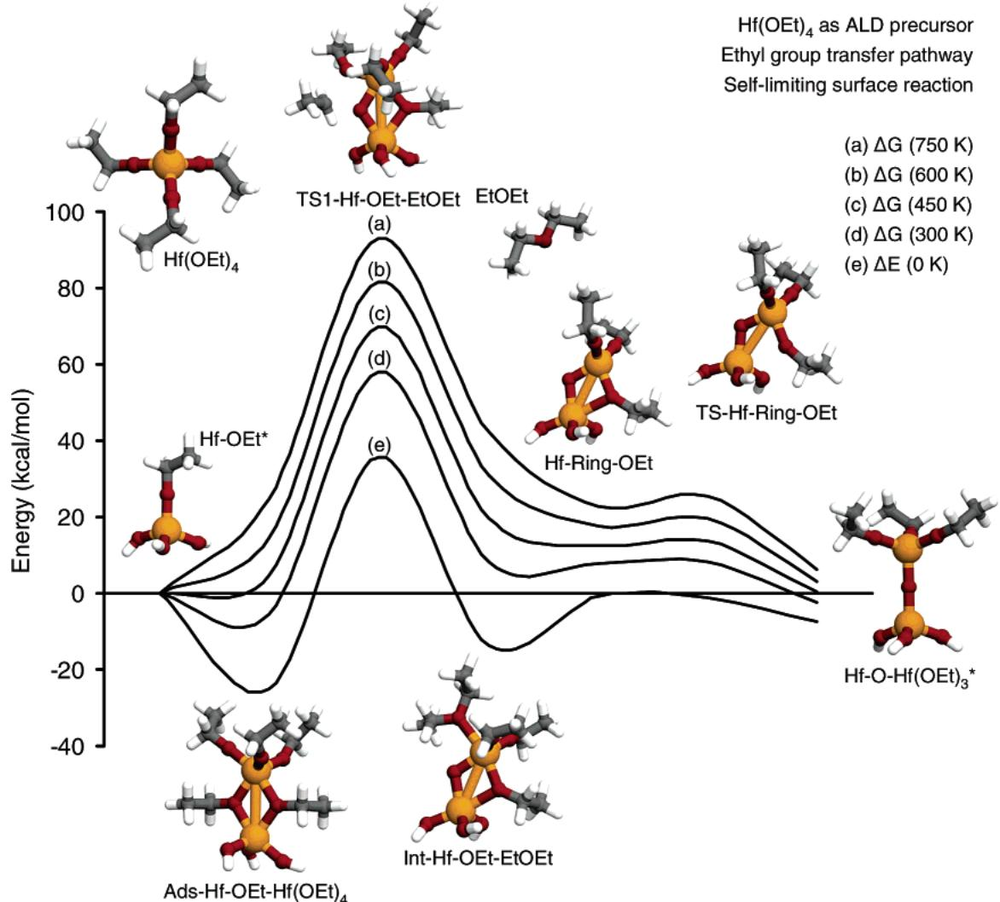
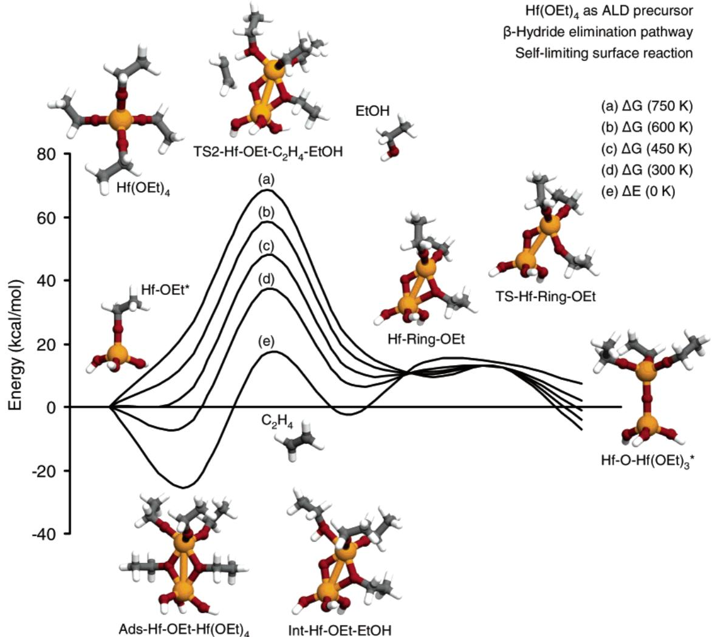

# Atomic Layer Deposition of  $\mathbf{HfO}_2$  Using Alkoxides as Precursors

Collin Muit Department of Chemical Engineering, Stanford University, Stanford, California 94305

Charles B. Musgrave\*

Departments of Chemical Engineering and Materials Science and Engineering, Stanford University, Stanford, California 94305

Received: November 17, 2003; In Final Form: March 2, 2004

We have used density functional theory to investigate the atomic layer deposition (ALD) of hafnium oxide  $\mathrm{(HfO_2)}$  thin films using metal alkoxides as both metal and oxygen precursors. In particular, we have predicted chemical mechanisms for the ALD of  $\mathrm{HfO_2}$  using tetraethoxyl hafnium  $\mathrm{[Hf(OEt)_4]}$  and water. We find that the ALD half- reactions involve the formation of stable adsorbed complexes and precursor- mediated ligand- exchange mechanisms. When  $\mathrm{Hf(OEt)_4}$  is used as the metal precursor and water is used as the oxygen source, both the metal and oxygen ligand- exchange reactions are unactivated with respect to the reactants. However, the reactions have moderate barriers relative to the adsorbed complexes, and the removal of the ethanol byproducts requires substantial desorption energies. However, when  $\mathrm{HfCl_4}$  is used as the metal precursor and  $\mathrm{Hf(OEt)_4}$  is used as the oxygen source, both the metal and oxygen half- reactions possess high activation barriers  $(\sim 30 - 40\mathrm{kcal / mol})$ . Our results imply that although  $\mathrm{Hf(OEt)_4}$  may be a suitable metal precursor it has relatively slow kinetics when used as an ALD oxygen source. We have also investigated several alternative reaction pathways that may affect the overall growth rate, including incomplete elimination surface reactions and nongrowth ligand exchange reactions. Finally, we discuss the self- limiting nature of the half- reactions and chemical strategies for adjusting the reactivity of alkoxide ALD precursors.

# Introduction

Moore's law, which states that the number of electronic devices in integrated circuits increases exponentially over time, has driven the microelectronics industry for the past several decades. However, continued scaling of semiconductor devices requires the integration of novel fabrication processes and new materials into future semiconductor technology. For example, as the thickness of the  $\mathrm{SiO_2}$  gate dielectric in silicon- metal oxide- semiconductor field effect transistor (MOSFET) devices approaches atomic dimensions, the tunneling current through the gate dielectric increases exponentially, and serious performance and reliability issues arise. Hence, there is an urgent need for an alternative higher- permittivity gate dielectric to replace  $\mathrm{SiO_2}$ . In addition, the deposition process must result in uniform and conformal thin films of the high-  $\kappa$  dielectric material with atomic- level control over large areas.

Although many materials have been proposed to replace  $\mathrm{SiO_2}$  in MOSFET devices, oxides of zirconium and hafnium, which possess good dielectric properties, are currently the leading candidates for future generation semiconductor devices.1- 6 The deposition of zirconium oxide and hafnium oxide ultrathin films can be achieved by a process called atomic- layer deposition (ALD), which is a vapor deposition process based on sequential self- terminating surface reactions.7,8 Because the precursors are introduced into the reactor separately, ALD does not involve gas- phase reactions, ideally meaning that it is a completely surface- reaction- limited process. Not only can ALD be used for a variety of different materials, but it is also capable of depositing highly conformal and uniform thin films with atomiclevel thickness control. Thus, ALD is particularly suitable for the deposition of high-  $\kappa \mathrm{ZrO_2}$  and  $\mathrm{HfO_2}$  gate dielectrics for future MOSFET devices.

ALD of  $\mathrm{ZrO_2}$  and  $\mathrm{HfO_2}$  is commonly performed using the respective metal chloride and water as precursors.5,6,9- 12 However, the metal chloride- water ALD process suffers from several disadvantages, such as chlorine contamination and slow growth rates due to submonolayer growth per cycle. As a result, high deposition temperatures are required to minimize Cl contamination. Unfortunately, for ALD of  $\mathrm{ZrO_2}$  and  $\mathrm{HfO_2}$ , the film quality degrades at high temperatures. To deposit very pure and uniform thin films at lower temperatures by ALD efficiently, alternative precursors that are reactive on the growing film surface but thermally stable in the liquid phase are preferred. Organometallic compounds, such as metal amides and metal alkoxides, have been proposed as ALD precursors for  $\mathrm{ZrO_2}$  and  $\mathrm{HfO_2}$ , and high- quality thin films have been obtained at temperatures as low as  $150^{\circ}\mathrm{C}$ .3,4,13- 17

Metal alkoxides possess many desirable advantages as ALD precursors compared to metal chlorides. First, the high reactivity of metal alkoxides may result in lower deposition temperatures. Also, the use of metal alkoxides in  $\mathrm{ZrO_2}$  and  $\mathrm{HfO_2}$  ALD eliminates the possibility of chlorine contamination in the thin film, which is detrimental to device reliability. Moreover, because metal alkoxides contain both metal and oxygen, not only can they be used as both metal and oxygen precursors, but it is also possible to use them to deposit mixed metal thin films by ALD.3,15 Finally, the chemical properties of metal

  
Figure 1. Cluster models to mimic the active sites on the  $\mathrm{HfO_2}$  surface during  $\mathrm{HfO_2}$  ALD. (a)  $\mathrm{Hf(OH)_3 - OH}$  b  $\mathrm{Hf(OH)_3 - OEt}$  and (c)  $\mathrm{Hf(OH)_3 - Cl}$

alkoxide precursors can be changed using principles of organic and organometallic chemistry. For example, because tert- butyl groups donate electrons more readily than methyl groups as a result of inductive effects, the reactivities of tetra- tert- butoxyl hafnium and tetramethoxyl hafnium are expected to be influenced by the ligands.

In this paper, we present a DFT study of the surface reactions of a proposed  $\mathrm{HfO_2}$  ALD mechanism using hafnium alkoxides as precursors. On the basis of our previous work, we expect the chemistry of  $\mathrm{ZrO_2}$  deposition to be similar to that of  $\mathrm{HfO_2}$  deposition;5,6 therefore, we focus on the surface reactions of tetraethoxyl hafnium  $\mathrm{(Hf(OEt)_4]}$  during ALD of  $\mathrm{HfO_2}$ . In particular, we have determined atomistic mechanisms of two chemical systems for  $\mathrm{HfO_2}$  ALD involving  $\mathrm{Hf(OEt)_4}$ . First, we have calculated the surface reactions of  $\mathrm{HfO_2}$  ALD with  $\mathrm{Hf(OEt)_4}$  as the metal precursor and water as the oxygen source. Second, we have investigated ALD of  $\mathrm{HfO_2}$  with  $\mathrm{HfCl_4}$  as the metal precursor and  $\mathrm{Hf(OEt)_4}$  as the oxygen source. We focus on the chemical mechanisms of the ALD ligand- exchange half- reactions and alternative pathways for competing reactions. Although there is currently no experimental data for  $\mathrm{HfO_2}$  ALD using  $\mathrm{Hf(OEt)_4}$ , our calculations on this relatively simple model system explain the surface chemistry and reactivity trends of  $\mathrm{HfO_2}$  ALD using alkoxide precursors. In particular, we expect more complicated alkoxide precursors to behave similarly to  $\mathrm{Hf(OEt)_4}$ , and we will discuss precursor design using principles of organic chemistry to adjust the reactivity of the metallorganic precursor.

# Computational Details

Our approach involves the application of quantum chemistry to the calculation of energies and other properties of reacting chemical systems from first principles. In particular, density functional theory (DFT) employing the B3LYP hybrid functional was used to determine the energies of the reactants, products, intermediates, and transition states of the surface reactions possibly involved in  $\mathrm{HfO_2}$  ALD.18 To model the active surface sites on the  $\mathrm{HfO_2}$  surface during ALD, we employed a cluster approximation. Specifically, the  $\mathrm{Hf(OH)_3 - OH}$ ,  $\mathrm{Hf(OH)_3 - OEt}$ , and  $\mathrm{Hf(OH)_3 - Cl}$  clusters were used to model the hydroxyl, ethoxyl, and chloride sites, respectively, on the as- grown  $\mathrm{HfO_2}$  thin- film surface (Figure 1). It has been shown that ALD surface reactions on  $\mathrm{ZrO_2}$  and  $\mathrm{HfO_2}$  are localized in nature.5,6 However, the reaction energies are affected by the surrounding material if the precursor interacts directly with neighboring surface atoms, such as when the precursor adsorbs to two reactive sites or when the ligand bonds to neighboring surface atoms. In the cases that we have investigated, the additional interactions shift the PES by an amount equal to the energy of the additional interaction but generally do not affect the energetics of the elementary steps.19 In this paper, we have not included reactions involving multiple surface ligands.

The electronic structure was expanded using atomic basis functions. Energy minima and transition states on the potential energy surface (PES) for the reactions are obtained by performing unconstrained geometry optimization calculations. In the geometry optimization calculations, Hf atoms are described by the LANL2DZ effective core potential (ECP) basis set,20- 22 whereas the 6- 31G(d) basis set23- 27 is used to describe nonmetal atoms such as C, Cl, H, and O. To improve the accuracy of the calculated reaction energies, we performed single- point energy calculations on the optimized structures with an enhanced mixed basis set scheme in which Hf and nonmetal atoms are described by the LANL2DZ and  $6 - 31 + + G(d,p)$  basis sets, respectively. We have also performed full geometry optimizations with the enhanced mixed basis set for the reaction between water and the ethoxyl surface group and find that the relative energies from single- point calculations are accurate to within  $1.2\mathrm{kcal}/$  mol compared to those calculated using full geometry optimizations. All energy minima and transition states are verified by frequency calculations to have zero and one imaginary frequency, respectively. The energies reported are zero- point corrected. All calculations were performed using the Gaussian 98 program.28

# Results

Tetraethoxyl Hafnium as a Metal Precursor. The ligand- exchange half- reactions of  $\mathrm{HfO_2}$  ALD using  $\mathrm{Hf(OEt)_4}$  and water as precursors involve ethanol  $\mathrm{(EtOH)}$  elimination. In the metal- ligand exchange reaction,  $\mathrm{Hf(OEt)_4}$  reacts with a surface hydroxyl group  $\mathrm{[Hf - OH^*]}$  to form a new  $\mathrm{Hf - O}$  bond on the surface and three surface ethoxyl groups  $\mathrm{[Hf - O - Hf(OEt)_3]^+}$  (reaction 1). We have calculated three pathways for the metal- ligand exchange reaction. Ethanol  $\mathrm{(EtOH)}$  is eliminated in the hydrogen- transfer and ethyl group- transfer pathways (reaction 1a), whereas the  $\beta$ - hydride- elimination pathway results in ethylene  $(\mathrm{C_2H_4})$  and water  $(\mathrm{H}_2\mathrm{O})$  as byproducts (reaction 1b).

$$
\begin{array}{r}\mathrm{Hf - OH^* + Hf(OEt)_4\longrightarrow}\\ \mathrm{Hf - O - Hf(OEt)_3^* + EtOH\quad (reaction~1a)}\\ \mathrm{Hf - OH^* + Hf(OEt)_4\longrightarrow}\\ \mathrm{Hf - O - Hf(OEt)_3^* + C_2H_4 + H_2O\quad (reaction~1b)} \end{array}
$$

The oxygen- ligand exchange reaction (reaction 2) involves the reaction of water with a surface ethoxyl group produced by the metal- ligand exchange reaction. Although the oxygen- ligand exchange reaction also results in ethanol elimination, it does not lead to the formation of new  $\mathrm{Hf - O}$  bonds. Instead, the reaction converts the surface ethoxyl groups to surface hydroxyl groups to prepare the surface for the subsequent metal half- reaction. This reaction is isodesmic (the reaction conserves the number of each type of bond) and should thus be approximately thermoneutral.

$$
\mathrm{Hf - OEt^* + H_2O\longrightarrow Hf - OH^* + EtOH\quad (reaction~2)}
$$

Metal- Ligand Exchange Half- Reactions. We have calculated several pathways that may occur during the  $\mathrm{Hf(OEt)_4}$  metal- ligand exchange cycle. Optimized structures of the hydrogen- transfer pathway and the ethyl- transfer pathway (reaction 1a) are shown in Figures 2 and 3, respectively. The calculated energies of the products, transition states, and intermediates at different temperatures are shown in Table 1 for both pathways.

  
Figure 2. Energetics of the hydrogen-transfer pathway for the metal half-reaction with  $\mathrm{Hf(OEt)_4}$  as the metal precursor. (a)  $\Delta G$  (750 K), (b)  $\Delta G$  (600 K), (c)  $\Delta G$  (450 K), (d)  $\Delta G$  (300 K), and (e)  $\Delta E$  (0 K).

The hydrogen- transfer pathway begins with the adsorption of  $\mathrm{Hf(OEt)_4}$  onto the surface hydroxyl group to form a four- membered- ring complex in which each Hf atom of the complex is 5- fold coordinated  $\mathrm{[Ads - Hf - OH - Hf(OEt)_4]}$ . We find that the adsorbed  $\mathrm{Hf(OEt)_4}$  surface complex is very stable because it involves the formation of two dative bonds. The binding energy of the adsorbed complex is  $- 27.2\mathrm{kcal / mol}$  with respect to the energy of the reactants. The hydroxyl group in the complex then transfers its hydrogen atom to one of the ethoxyl ligands of  $\mathrm{Ads - Hf - OH - Hf(OEt)_4}$  through a hydrogen- transfer transition state  $\mathrm{[TS1 - Hf - OH - EtOH]}$  to form a bound ethanol molecule. We find that the transition state is located at 15.5 kcal/mol with respect to the adsorbed complex. The hydrogen- transfer process results in an ethanol molecule bound to a four- membered- ring intermediate through a dative bond  $\mathrm{[Int - Hf - OEt - EtOH]}$ , which has an overall energy of  $- 15.3\mathrm{kcal / mol}$  with respect to the reactants. The bound ethanol molecule then desorbs directly from the four- membered- ring intermediate without a transition state, and the resulting four- membered- ring intermediate is located  $16.3\mathrm{kcal / mol}$  above the bound ethanol state  $\mathrm{[Hf - Ring - OEt]}$ . Finally, the four- membered- ring intermediate undergoes a ring- opening transition state  $\mathrm{[TS - Hf - Ring - OEt]}$ , which is located  $16.0\mathrm{kcal / mol}$  above the four- membered- ring intermediate, to form the ethoxyl- terminated surface  $\mathrm{[Hf - O - Hf(OEt)_3*]}$ . The hydrogen- transfer pathway for the metal- ligand exchange cycle of  $\mathrm{HfO_2}$  ALD is  $5.6\mathrm{kcal / mol}$  exothermic relative to the gas- phase  $\mathrm{Hf(OEt)_4}$  and surface hydroxyl group reactants.

In addition to the hydrogen- transfer pathway, we have calculated two additional reaction pathways, namely, ethyl group transfer and  $\beta$ - hydride elimination, for the reaction of  $\mathrm{Hf(OEt)_4}$  with a surface hydroxyl group. Optimized structures for the ethyl group- transfer pathway (reaction 1a) are shown in Figure 3. Similar to the hydrogen- transfer pathway, the ethyl group- transfer pathway involves the formation of a dative- bonded complex upon the adsorption of  $\mathrm{Hf(OEt)_4}$  onto a surface hydroxyl group  $\mathrm{[Ads - Hf - OH - Hf(OEt)_4]}$ . Next, the pathway proceeds through an ethyl group- transfer transition state  $\mathrm{[TS2 - Hf - OH - EtOH]}$  and an ethanol- bound four- membered- ring intermediate  $\mathrm{[Int - Hf - OEt - EtOH]}$ . Following ethanol desorption, the resulting four- membered- ring intermediate  $\mathrm{[Hf - Ring - OEt]}$  is transformed to the ethoxyl- terminated surface  $\mathrm{[Hf - O - Hf(OEt)_3*]}$  through a ring- opening transition state  $\mathrm{[TS - Hf - Ring - OEt]}$ . The rate- limiting step of the ethyl group- transfer pathway is the ethyl group- transfer step, which involves an overall activation barrier of  $60.8\mathrm{kcal / mol}$  relative to the adsorbed complex at  $0\mathrm{K}$ . The products, which include  $\mathrm{EtOH}$  and  $\mathrm{Hf - O - Hf(OEt)_3*}$ , are located at  $- 5.6\mathrm{kcal / mol}$  with respect to the reactants (Table 1).

Optimized structures of the  $\beta$ - hydride- elimination pathway (reaction 1b) are shown in Figure 4. The pathway proceeds via

  
Figure 3. Energetics of the ethyl group-transfer pathway for the metal half-reaction with  $\mathrm{Hf(OEt)_4}$  as the metal precursor. (a)  $\Delta G$  (750 K), (b)  $\Delta G$  (600 K), (c)  $\Delta G$  (450 K), (d)  $\Delta G$  (300 K), and (e)  $\Delta E$  (0 K).

TABLE 1: Temperature-Dependent Energetics for the Metal Half-Reaction of  $\mathbf{HfO}_2$  ALD with  $\mathbf{Hf(OCH}_2\mathbf{CH}_3)_4$  and  $\mathbf{H}_2\mathbf{O}$  as Precursors  

<table><tr><td>metal half-reaction</td><td>ΔE (0 K)</td><td>ΔG (300 K)</td><td>ΔG (450 K)</td><td>ΔG (600 K)</td><td>ΔG (750 K)</td></tr><tr><td>Ads-Hf-OH-Hf(OEt)4</td><td>-27.2</td><td>-10.3</td><td>-1.5</td><td>7.3</td><td>15.9</td></tr><tr><td>TS1-Hf-OH-EtOH</td><td>-11.7</td><td>6.0</td><td>15.5</td><td>25.0</td><td>34.5</td></tr><tr><td>TS2-Hf-OH-EtOH</td><td>33.6</td><td>52.2</td><td>62.1</td><td>71.8</td><td>81.5</td></tr><tr><td>Int-Hf-OEt-EtOH</td><td>-15.3</td><td>2.6</td><td>12.1</td><td>21.5</td><td>30.9</td></tr><tr><td>Hf-Ring-OEt + EtOH</td><td>1.0</td><td>6.9</td><td>10.4</td><td>14.0</td><td>17.7</td></tr><tr><td>TS-Hf-Ring-OEt + EtOH</td><td>0.7</td><td>7.4</td><td>11.6</td><td>16.0</td><td>20.5</td></tr><tr><td>Hf-O-Hf(OEt)3* + EtOH</td><td>-5.6</td><td>-3.2</td><td>-1.8</td><td>-0.4</td><td>1.1</td></tr><tr><td>Ads-Hf-OH-Hf(OEt)4</td><td>-27.2</td><td>-10.3</td><td>-1.5</td><td>7.3</td><td>15.9</td></tr><tr><td>TS3-Hf-OH-C2H4-H2O</td><td>17.5</td><td>35.9</td><td>45.9</td><td>55.7</td><td>65.3</td></tr><tr><td>Int-Hf-OEt-H2O + C2H4</td><td>-2.2</td><td>5.0</td><td>8.7</td><td>12.4</td><td>16.0</td></tr><tr><td>Hf-Ring-OEt + C2H4 + H2O</td><td>11.5</td><td>9.0</td><td>7.5</td><td>6.0</td><td>4.6</td></tr><tr><td>TS-Hf-Ring-OEt + C2H4 + H2O</td><td>11.2</td><td>9.5</td><td>8.7</td><td>8.0</td><td>7.4</td></tr><tr><td>Hf-O-Hf(OEt)3* + C2H4 + H2O</td><td>4.9</td><td>-1.0</td><td>-4.7</td><td>-8.4</td><td>-12.0</td></tr></table>

Energies are relative to the reactants in kcal/mol and are zero-point corrected.

an adsorbed surface complex  $\mathrm{[Ads - Hf - OH - Hf(OEt)_4]}$  a  $\beta$  - hydride- elimination transition state  $\mathrm{[TS3 - Hf - OH - C_2H_4 - }$ $\mathrm{H}_2\mathrm{O}]$  , a water- bound intermediate  $\mathrm{[Int - Hf - OEt - H_2O]}$  , a fourmembered- ring intermediate  $\mathrm{[Hf - Ring - OEt]}$  and a ringopening transition state  $\mathrm{[TS - Hf - Ring - OEt]}$  to form the ethoxyl- terminated surface  $\mathrm{[Hf - O - Hf(OEt)_3^*]}$  . The rate- limiting step of the  $\beta$  - hydride- elimination pathway is the elimination of a  $\beta$  hydrogen from the ethoxyl group of the adsorbed complex to form water bound to the four- membered- ring intermediate. The overall activation barrier of the  $\beta$  - hydride- elimination pathway is calculated to be  $44.5\mathrm{kcal / mol}$  with respect to the reactants, and the products of the reaction, which consist of  $\mathrm{C_2H_4}$ $\mathrm{H}_2\mathrm{O}$  and  $\mathrm{Hf - O - Hf(OEt)_3^*}$  are located  $4.9\mathrm{kcal / mol}$  above the energy of the reactants (Table 1).

Our calculations show that the hydrogen- transfer pathway is kinetically the most favorable for the conversion of surface

  
Figure 4. Energetics of the  $\beta$  -hydride-elimination pathway for the metal half-reaction with  $\mathrm{Hf(OEt)_4}$  as the metal precursor. (a)  $\Delta G$  750 K), (b)  $\Delta G$  600 K),c  $\Delta G$  450 K)d  $\Delta G$  300 Kand e  $\Delta E$  0K.

hydroxyl termination on the  $\mathrm{HfO_2}$  surface to an ethoxyl- terminated surface. In particular, the rate- limiting step of the hydrogen- transfer pathway is ethanol desorption, and the activation barrier for the elementary process is  $16.3\mathrm{kcal / mol}$ . Although the same adsorbed complex  $\mathrm{[ads - Hf - OH - Hf - (OEt)_4]}$  is involved in the three pathways, the activation barriers for the ethyl group- transfer and the  $\beta$ - hydride- elimination elementary steps are 60.8 and  $44.5\mathrm{kcal / mol}$ , respectively. In addition, the  $\beta$ - hydride- elimination pathway is thermodynamically unfavorable. Therefore, the ethyl group- transfer and the  $\beta$ - hydride- elimination pathways are not likely to compete with the hydrogen- transfer mechanism of the metal- ligand exchange cycle of  $\mathrm{HfO_2}$  ALD using  $\mathrm{Hf(OEt)_4}$  as the metal precursor.

A major difference between the ethyl group- transfer and the  $\beta$ - hydride- elimination pathways is that whereas the ethyl group- transfer pathway involves ethanol as the only gas phase byproduct the  $\beta$ - hydride- elimination pathway results in two gas- phase products, ethylene and water. Therefore, for the  $\beta$ - hydride- elimination pathway, the free energy of the products has a larger entropic contribution from the two gas- phase products at high temperature. As a result, the reaction free energy of the  $\beta$ - hydride- elimination pathway decreases more quickly than the reaction free energy of the ethyl group- transfer pathway as the temperature is raised, leading to the intersecting Gibbs free energy curves seen in Figure 4.

Oxygen- Ligand Exchange Half- Reaction. The reaction pathway for the oxygen- ligand exchange half- reaction (reaction 2), which involves the reaction of water with surface ethoxyl groups, is shown in Figure 5. In addition, the energetics for this half- reaction at different temperatures are summarized in Table 2. The first step of the oxygen- ligand exchange half- reaction involves the adsorption of water onto the Hf atom of the ethoxyl- terminated surface site  $\mathrm{(Hf - OEt^*)}$  to form a dative- bonded water complex  $\mathrm{(Ads - Hf - OEt - H_2O)}$ . Our calculations show that the adsorption energy is  $10.6\mathrm{kcal / mol}$ . A hydrogen atom then transfers from the adsorbed water complex to the surface ethoxyl group to form an adsorbed ethanol complex via a transition state  $\mathrm{(TS - Hf - OEt - EtOH)}$  located at  $10.8\mathrm{kcal / mol}$  with respect to the adsorbed complex. The energy of the dative- bonded ethanol complex is  $- 9.3\mathrm{kcal / mol}$  with respect to the reactants  $\mathrm{(Int - Hf - OH - EtOH)}$ . Finally, ethanol desorbs to complete the conversion of the surface ethoxyl group to a surface hydroxyl group  $\mathrm{(Hf - OH^*)}$ . The overall reaction is endothermic by  $2.5\mathrm{kcal / mol}$ . These results show that the activation barrier of the oxygen- ligand exchange reaction is lower than that of the metal- ligand exchange reaction.

Tetraethoxyl Hafnium as an Oxygen Precursor. Tetraethoxyl hafnium can also be used as the oxygen precursor for ALD of  $\mathrm{HfO_2}$ . In particular, we have investigated surface reactions that are likely involved in ALD of  $\mathrm{HfO_2}$  with  $\mathrm{HfCl_4}$  as the metal precursor and  $\mathrm{Hf(OEt)_4}$  as the oxygen precursor. The metal half- reaction involves the surface reaction of  $\mathrm{HfCl_4}$  with surface ethoxyl sites, which results in the formation of a chlorine- terminated surface (reaction 3). We have studied two

  
Figure 5. Energetics of the hydrogen-transfer pathway for the oxygen half-reaction with  $\mathrm{Hf(OEt)_4}$  as the metal precursor. (a)  $\Delta G$  (750 K), (b)  $\Delta G$  (600 K), (c)  $\Delta G$  (450 K), (d)  $\Delta G$  (300 K), and (e)  $\Delta E$  (0 K).

TABLE 2: Temperature-Dependent Energetics for the Oxygen Half-Reaction of  $\mathbf{HfO}_2$  ALD with  $\mathrm{Hf(OCH_2CH_3)_4}$  and  $\mathbf{H}_2\mathbf{O}$  as Precursors  

<table><tr><td>oxygen half-reaction</td><td>ΔE (0 K)</td><td>ΔG (300 K)</td><td>ΔG (450 K)</td><td>ΔG (600 K)</td><td>ΔG (750 K)</td></tr><tr><td>Ads-Hf-OEt-H2O</td><td>-10.6</td><td>2.1</td><td>8.8</td><td>15.5</td><td>22.1</td></tr><tr><td>TS-Hf-OEt-EtOH</td><td>0.2</td><td>13.0</td><td>20.5</td><td>27.9</td><td>35.3</td></tr><tr><td>Int-Hf-OH-EtOH</td><td>-9.3</td><td>4.1</td><td>11.2</td><td>18.2</td><td>25.1</td></tr><tr><td>Hf-OH* + EtOH</td><td>2.5</td><td>3.0</td><td>3.7</td><td>4.4</td><td>5.2</td></tr></table>

Energies are relative to the reactants in kcal/mol and are zeropoint corrected.

different reaction pathways for the reaction of  $\mathrm{HfCl_4}$  on the ethoxyl surface site, namely, the ethyl group transfer (reaction 3a) and the  $\beta$  - hydride elimination (reaction 3b).

$$
\begin{array}{r}\mathrm{Hf - OEt^* + HfCl_4\longrightarrow Hf - O - HfCl_3^* + EtCl}\\ \mathrm{(reaction~3a)}\\ \mathrm{Hf - OEt^* + HfCl_4\longrightarrow Hf - O - HfCl_3^* + C_2H_4 + HCl}\\ \mathrm{(reaction~3b)} \end{array}
$$

The reaction of  $\mathrm{Hf(OEt)_4}$  with surface chloride groups constitutes the oxygen half- reaction, which leads to the restoration of the surface ethoxyl termination layer and the elimination of gas- phase products (reaction 4). Similar to the metal- ligand exchange reaction, the ethyl group- transfer (reaction 4a) and the  $\beta$  - hydride- elimination (reaction 4a) pathways are investigated.

$$
\begin{array}{r}\mathrm{Hf - Cl^{*} + Hf(OEt)_{4}\longrightarrow Hf - O - Hf(OEt)_{3}^{*} + EtCl}\\ \mathrm{(reaction~4a)}\\ \mathrm{Hf - Cl^{*} + Hf(OEt)_{4}\longrightarrow Hf - O - Hf(OEt)_{3}^{*} + C_{2}H_{4} + HCl}\\ \mathrm{(reaction~4b)} \end{array}
$$

Metal Half- Reaction. The metal half- reaction involves the reaction of  $\mathrm{HfCl_4}$  with the ethoxyl surface site. We have calculated two pathways for the reaction, with their energies summarized in Table 3. The ethyl group- transfer pathway (reaction 3a) involves an initial adsorption of  $\mathrm{HfCl_4}$  onto the ethoxyl surface site to form a dative- bonded complex with an adsorption energy of  $20.9\mathrm{kcal / mol}$ $\mathrm{(Ads - Hf - OEt - HfCl_4)}$  . The complex then undergoes ethyl group transfer via a transition state  $\mathrm{(TS1 - Hf - Cl - EtCl)}$  to form the chlorine- terminated surface site  $\mathrm{(Hf - O - HfCl_3^*)}$  via elimination of ethyl chloride. We find that the activation barrier for this ethyl group- transfer process is  $21.4\mathrm{kcal / mol}$  with respect to the reactants and 42.3 kcal/mol relative to the adsorbed complex. The products are located at  $- 13.4\mathrm{kcal / mol}$  with respect to the reactants. Although the overall reaction is thermodynamically favorable, the calculated activation barrier for the ethyl group- transfer pathway of the metal half- reaction is relatively high.

The  $\beta$  - hydride- elimination pathway (reaction 3b) begins with the adsorption of  $\mathrm{HfCl_4}$  to form an adsorbed complex dative

TABLE 3: Temperature-Dependent Energetics for the Metal Half-Reaction of  $\mathbf{HfO}_2$  ALD with  $\mathbf{HfCl}_4$  and  $\mathbf{Hf(OCH_2CH_3)_4}$  as Precursorsa  

<table><tr><td>metal half-reaction</td><td>ΔE
(0 K)</td><td>ΔG
(300 K)</td><td>ΔG
(450 K)</td><td>ΔG
(600 K)</td><td>ΔG
(750 K)</td></tr><tr><td>Ads-Hf-OEt-HfCl4</td><td>-20.9</td><td>-5.8</td><td>1.8</td><td>9.2</td><td>16.5</td></tr><tr><td>TS1-Hf-Cl-EtCl</td><td>21.4</td><td>35.4</td><td>42.3</td><td>49.0</td><td>55.5</td></tr><tr><td>Hf-O-HfCl3* + EtCl</td><td>-13.4</td><td>-13.3</td><td>-13.2</td><td>-13.1</td><td>-13.0</td></tr><tr><td>Ads-Hf-OEt-HfCl4</td><td>-20.9</td><td>-5.8</td><td>1.8</td><td>9.2</td><td>16.5</td></tr><tr><td>TS2-Hf-OEt-C2H4-HCl</td><td>15.6</td><td>30.4</td><td>37.8</td><td>45.1</td><td>52.2</td></tr><tr><td>Int-Hf-Cl-HCl + C2H4</td><td>2.1</td><td>2.2</td><td>1.4</td><td>0.5</td><td>-0.2</td></tr><tr><td>Hf-O-HfCl3* + C2H4 + HCl</td><td>2.3</td><td>-5.5</td><td>-10.1</td><td>-14.9</td><td>-19.6</td></tr></table>

Energies are relative to the reactants in kcal/mol and are zeropoint corrected.

bonded to the surface ethoxyl group  $\mathrm{(Ads - Hf - OEt - HfCl_4)}$  This pathway then proceeds via a  $\beta$  - hydride- elimination transition state  $\mathrm{(TS2 - Hf - OEt - C_2H_4 - HCl)}$  to form a weakly bound hydrogen chloride complex  $\mathrm{(Int - Hf - Cl - HCl)}$  releasing an ethylene molecule to the gas phase. Finally, HCl desorbs to form the ethoxyl- terminated surface site  $\mathrm{(Hf - O - HfCl_3^*)}$  . The  $\beta$  hydride- elimination transition state is located at  $15.6\mathrm{kcal / mol}$  with respect to the reactants and  $36.5\mathrm{kcal / mol}$  above the adsorbed state. The final products are  $2.3\mathrm{kcal / mol}$  less stable than the reactants at  $0\mathrm{K}$  Table 3.

Oxygen Half- Reaction. The oxygen half- reaction for ALD of  $\mathrm{HfO_2}$  with  $\mathrm{HfCl_4}$  and  $\mathrm{Hf(OEt)_4}$  as precursors involves the reaction of  $\mathrm{Hf(OEt)_4}$  on a chlorine- terminated surface site  $\mathrm{(Hf - }$ $\mathrm{Cl^*}$  . Similar to the metal half- reaction, we find two reaction pathways for the oxygen half- reaction with the calculated energies summarized in Table 4. The reaction path for the ethyl group- transfer pathway involves an initial adsorption of Hf $\mathrm{(OEt)_4}$  onto the chloride surface site to form a dative- bonded complex  $\mathrm{[Ads - Hf - Cl - Hf(OEt)_4]}$  . The complex then reacts to form the final ethoxyl- terminated surface site  $\mathrm{[Hf - O - Hf - }$ $\mathrm{(OEt)_3^*]}$  via an ethyl group transition state  $\mathrm{[TS1 - Hf - OEt - }$  EtCl]. The adsorbed complex, transition state, and final products are located at  $- 17.0$  27.9,and  $- 4.5\mathrm{kcal / mol}$  with respect to the reactants, respectively (Table 4). Therefore, the activation barrier of the reaction is  $44.9\mathrm{kcal / mol}$  with respect to the adsorbed complex. We find that the mechanisms for the ethyl group- transfer pathways of the metal and oxygen half- reactions are similar; both involve an initial adsorption and ethyl group transfer to form the products in a single step.

The  $\beta$  - hydride- elimination mechanism for the oxygen halfreaction involves the adsorption of  $\mathrm{Hf(OEt)_4}$  onto the chlorineterminated surface site to form a dative- bonded complex [AdsHf- Cl- Hf(OEt)4]. The complex then undergoes  $\beta$  - hydride elimination  $\mathrm{[TS2 - Hf - Cl - C_2H_4 - HCl]}$  to form an HCl molecule bound to the ethoxyl- terminated surface site [Int- HfOEt- HCl]. Finally, the desorption of HCl occurs to regenerate the ethoxyl- terminated surface site  $\mathrm{[Hf - O - Hf(OEt)_3^*]}$  for the next metal half- reaction. We find that the adsorbed complex, $\beta$  - hydride transition state, bound HCl, and final products have energies of  $- 17.0$  19.8,7.5,and  $11.3\mathrm{kcal / mol}$  relative to the reactants, respectively (Table 4). Thus, the activation barrier of the oxygen half- reaction is  $36.8\mathrm{kcal / mol}$  with respect to the adsorbed complex.

When the energies of the ethyl group- transfer and the  $\beta$  - hydride- elimination pathways for both the metal and oxygen half- reactions are compared, the calculations show that whereas the ethyl group- transfer pathway involves a higher activation barrier the products are thermodynamically more stable at  $0\mathrm{K}$  However, the reaction free energy for the ethyl group- transfer pathway increases as the temperature is increased. On the other hand, the  $\beta$  - hydride- elimination pathway results in two gasphase products, and the reaction free energy decreases when the temperature is increased because entropic driving forces dominate at high temperatures. In particular, the products of the  $\beta$  - hydride- elimination pathway have lower free energy than those of the ethyl group- transfer pathway at  $750~\mathrm{K}$

Incomplete Elimination Surface Reactions. Tetraethoxyl Hafnium as a Metal Precursor. Competing reactions may lead to the incomplete removal of surface termination groups or submonolayer growth; therefore, we have investigated the possibility of alternative reactions that may compete kinetically with the ligand- exchange half- reactions described above. In particular, we have studied two reaction pathways leading to the incomplete elimination of surface ethoxyl terminating groups during ALD of  $\mathrm{HfO_2}$  with  $\mathrm{Hf(OEt)_4}$  as the metal precursor.

Figure 6 shows the ethyl group- transfer pathway for a competing reaction to the metal half- reaction of  $\mathrm{HfO_2}$  ALD with  $\mathrm{Hf(OEt)_4}$  as the metal precursor. Temperature- dependent energetics for the incomplete- elimination pathway are summarized in Table 5. The pathway involves an initial adsorption of  $\mathrm{Hf - }$ $\mathrm{(OEt)_4}$  onto a hydroxyl surface site  $\mathrm{[Ads - Hf - OH - Hf(OEt)_4]}$  followed by an ethyl group- transfer transition state  $\mathrm{[TS1 - Hf - }$ $\mathrm{OH - EtOEt]}$  to form a four- membered- ring intermediate with a bound diethyl ether molecule  $\mathrm{[Int - Hf - OEt - OH - EtOEt]}$  Then, diethyl ether desorption occurs, and a four- memberedring intermediate is formed  $\mathrm{[Hf - Ring - OEt - OH]}$  .Finally, the four- membered- ring intermediate undergoes ring opening [TS-  $\mathrm{Hf - Ring - OEt - OH]}$  to form an ethoxyl- hydroxyl termination layer  $\mathrm{[Hf - OH - (OEt)_2^*]}$  .Whereas the metal half- reaction between  $\mathrm{Hf(OEt)_4}$  and the hydroxyl surface site (Figure 3) results in the formation of three ethoxyl groups, the alternative reaction pathway in Figure 6 results in two ethoxyl groups and one residual hydroxyl group on the surface Hf. Therefore, although this alternative surface- reaction pathway leads to  $\mathrm{HfO_2}$  deposition, it results in the incomplete elimination of surface hydroxyl groups; therefore, the reaction is not self- limiting. However, the activation barrier of this incomplete- elimination surface reaction is  $31.5\mathrm{kcal / mol}$  relative to the entrance channel and  $58.7\mathrm{kcal / mol}$  relative to the adsorbed complex (Table 5) and is therefore not expected to compete with the hydrogen

TABLE 4: Temperature-Dependent Energetics for the Oxygen Half-Reaction of  $\mathbf{HfO}_2$  ALD with  $\mathbf{HfCl}_4$  and  $\mathbf{Hf(OCH_2CH_3)_4}$  as Precursorsa  

<table><tr><td>metal half-reaction</td><td>ΔE (0 K)</td><td>ΔG (300 K)</td><td>ΔG (450 K)</td><td>ΔG (600 K)</td><td>ΔG (750 K)</td></tr><tr><td>Ads-Hf-Cl-Hf(OEt)4</td><td>-17.0</td><td>-0.5</td><td>7.9</td><td>16.2</td><td>24.3</td></tr><tr><td>TS1-Hf-OEt-EtCl</td><td>27.9</td><td>44.5</td><td>52.9</td><td>61.2</td><td>69.3</td></tr><tr><td>Hf-O-Hf(OEt)3* + EtCl</td><td>-4.5</td><td>-3.5</td><td>-3.2</td><td>-2.9</td><td>-2.6</td></tr><tr><td>Ads-Hf-Cl-Hf(OEt)4</td><td>-17.0</td><td>-0.5</td><td>7.9</td><td>16.2</td><td>24.3</td></tr><tr><td>TS2-Hf-Cl-C2H4-HCl</td><td>19.8</td><td>36.1</td><td>44.2</td><td>52.1</td><td>59.8</td></tr><tr><td>Int-Hf-OEt-HCl + C2H4</td><td>7.5</td><td>9.5</td><td>9.9</td><td>10.1</td><td>10.2</td></tr><tr><td>Hf-O-Hf(OEt)3* + C2H4 + HCl</td><td>11.3</td><td>4.3</td><td>-0.2</td><td>-4.7</td><td>-9.2</td></tr></table>

Energies are relative to the reactants in kcal/mol and are zero-point corrected.

  
Figure 6. Energetics of the ethyl group-transfer pathway for the incomplete metal half-reaction with  $\mathrm{Hf(OEt)_4}$  as the metal precursor. (a)  $\Delta G$  (750 K), (b)  $\Delta G$  (600 K), (c)  $\Delta G$  (450 K), (d)  $\Delta G$  (300 K), and (e)  $\Delta E$  (0 K).

TABLE 5: Temperature-Dependent Energetics for Incomplete Elimination Reactions of  $\mathbf{Hf(OCH_2CH_3)_4}$  with Surface  $\mathbf{Hf - OH^{*}}$  Groups  

<table><tr><td>incomplete elimination</td><td>ΔE (0 K)</td><td>ΔG (300 K)</td><td>ΔG (450 K)</td><td>ΔG (600 K)</td><td>ΔG (750 K)</td></tr><tr><td>Ads-Hf-OH-Hf(OEt)4</td><td>-27.2</td><td>-10.3</td><td>-1.5</td><td>7.3</td><td>15.9</td></tr><tr><td>TS1-Hf-OH-EtOEt</td><td>31.5</td><td>50.5</td><td>60.6</td><td>70.6</td><td>80.4</td></tr><tr><td>Int-Hf-OEt-OH-EtOEt</td><td>-15.5</td><td>2.6</td><td>12.2</td><td>21.7</td><td>31.1</td></tr><tr><td>Hf-Ring-OEt-OH + EtOEt</td><td>-2.4</td><td>4.0</td><td>8.0</td><td>12.1</td><td>16.3</td></tr><tr><td>TS-Hf-Ring-OEt-OH + EtOEt</td><td>-2.6</td><td>4.3</td><td>8.8</td><td>13.5</td><td>18.3</td></tr><tr><td>Hf-OH-(OEt)2* + EtOEt</td><td>-7.6</td><td>-3.3</td><td>-2.5</td><td>-0.7</td><td>1.1</td></tr><tr><td>Ads-Hf-OH-Hf(OEt)4</td><td>-27.2</td><td>-10.3</td><td>-1.5</td><td>7.3</td><td>15.9</td></tr><tr><td>TS2-Hf-OH-C2H4-EtOH</td><td>15.6</td><td>34.2</td><td>44.2</td><td>54.1</td><td>63.8</td></tr><tr><td>Int-Hf-OEt-OH-EtOH + C2H4</td><td>-3.2</td><td>3.4</td><td>6.8</td><td>10.2</td><td>13.5</td></tr><tr><td>Hf-Ring-OEt-OH + C2H4 + EtOH</td><td>12.5</td><td>8.2</td><td>6.5</td><td>4.8</td><td>3.3</td></tr><tr><td>TS-Hf-Ring-OEt-OH + C2H4 + EtOH</td><td>12.2</td><td>8.5</td><td>7.2</td><td>6.2</td><td>5.2</td></tr><tr><td>Hf-OH-(OEt)2* + C2H4 + EtOH</td><td>7.3</td><td>0.0</td><td>-4.1</td><td>-8.0</td><td>-12.0</td></tr></table>

Energies are relative to the reactants in kcal/mol and are zero-point corrected.

transfer pathway, the rate- limiting step of which involves an activation barrier of  $16.3\mathrm{kcal / mol}$  Figure 2.

Figure 7 shows another reaction pathway that leads to the incomplete elimination of surface ethoxyl groups of the metal half- reaction of  $\mathrm{HfO_2}$  ALD with  $\mathrm{Hf(OEt)_4}$  as the metal precursor. The species of the incomplete- elimination surface reaction pathway are the initial adsorbed complex [Ads- Hf- OH- Hf-  $(\mathrm{OEt})_4]$ $\beta$  - hydride- elimination transition state  $\mathrm{[TS2 - Hf - OH - }$ $\mathrm{C_2H_4 - EtOH]}$  ethanol- bound complex  $\mathrm{[Int - Hf - OEt - OH - }$  EtOH], four- membered- ring intermediate [Hf- Ring- OEt- OH], ring- opening transition state  $\mathrm{[TS - Hf - Ring - OEt - OH]}$  and residual hydroxyl group  $\mathrm{[Hf - OH - (OEt)_2]^*}$  .The activation barrier for the  $\beta$  - hydride- elimination pathway is calculated to be  $15.6\mathrm{kcal / mol}$  relative to the reactants and  $42.8\mathrm{kcal / mol}$  relative to the adsorbed complex (Table 5), which is significantly higher than the hydrogen- transfer barrier of the metal halfreaction. Therefore, we do not expect incomplete elimination via either ethyl group transfer or  $\beta$  - hydride elimination to compete with the hydrogen- transfer pathway of the metal halfreaction for  $\mathrm{HfO_2}$  ALD. In other words, the incomplete

  
Figure 7. Energetics of the  $\beta$  -hydride-elimination pathway for the incomplete metal half-reaction with  $\mathrm{Hf(OEt)_4}$  as the metal precursor. (a)  $\Delta G$ $(750~\mathrm{K})$  b  $\Delta G$ $(600~\mathrm{K})$  c  $\Delta G$ $(450~\mathrm{K})$  d  $\Delta G$ $(300~\mathrm{K})$  and (e)  $\Delta E$ $(0\mathrm{K})$

TABLE 6: Temperature-Dependent Energetics for Incomplete Elimination Reactions of  $\mathbf{Hf(OCH_2CH_3)_4}$  with Surface  $\mathbf{H}\mathbf{f} - \mathbf{Cl}^*$  Groups  

<table><tr><td>Incomplete elimination</td><td>ΔE (0 K)</td><td>ΔG (300 K)</td><td>ΔG (450 K)</td><td>ΔG (600 K)</td><td>ΔG (750 K)</td></tr><tr><td>Ads-Hf-Cl-Hf(OEt)4</td><td>-17.0</td><td>-0.5</td><td>7.9</td><td>16.2</td><td>24.3</td></tr><tr><td>TS1-Hf-Cl-EtOEt</td><td>30.6</td><td>50.1</td><td>60.3</td><td>70.3</td><td>80.2</td></tr><tr><td>Int-Hf-OEt-Cl-EtOEt</td><td>-15.4</td><td>3.2</td><td>12.9</td><td>22.5</td><td>31.9</td></tr><tr><td>Hf-Cl-(OEt)2+EtOEt</td><td>-8.8</td><td>-5.9</td><td>-4.3</td><td>-2.7</td><td>-1.1</td></tr><tr><td>Ads-Hf-Cl-Hf(OEt)4</td><td>-17.0</td><td>-0.5</td><td>7.9</td><td>16.2</td><td>24.3</td></tr><tr><td>TS2-Hf-Cl-C2H4-EtOH</td><td>14.3</td><td>33.5</td><td>43.7</td><td>53.7</td><td>63.5</td></tr><tr><td>Int-Hf-OEt-EtOH + C2H4</td><td>-5.4</td><td>1.3</td><td>5.4</td><td>8.9</td><td>12.2</td></tr><tr><td>Hf-Cl-(OEt)2+C2H4+EtOH</td><td>6.0</td><td>-1.6</td><td>-5.8</td><td>-10.0</td><td>-14.1</td></tr></table>

Energies are relative to the reactants in kcal/mol and are zero-point corrected.

elimination of surface hydroxyl groups is not likely to occur during  $\mathrm{HfO_2}$  ALD via these two pathways when  $\mathrm{Hf(OEt)_4}$  is used as the metal precursor.

Tetraethoxyl Hafnium as an Oxygen Precursor. When  $\mathrm{Hf(OEt)_4}$  is used as the oxygen precursor, we find two incomplete- elimination reaction pathways that may compete kinetically with the oxygen half- reaction. Free energies at several temperatures for the incomplete- elimination reactions are summarized in Table 6. The ethyl group- transfer reaction proceeds by the adsorption of  $\mathrm{Hf(OEt)_4}$  onto the chlorine- terminated surface site  $\mathrm{[Ads - Hf - Cl - Hf(OEt)_4]}$ , followed by ethyl group transfer  $\mathrm{[TS1 - Hf - Cl - EtOEt]}$  to form a bound diethyl ether  $\mathrm{[Int - Hf - OEt - Cl - EtOEt]}$ . Finally, diethyl ether desorbs from the complex to form a Hf surface site terminated with two ethoxyl ligands and one chlorine atom  $\mathrm{[Hf - Cl - (OEt)_2]}$ . The ethyl group- transfer pathway for incomplete elimination has an activation barrier of  $47.6\mathrm{kcal / mol}$  with respect to the adsorbed complex, and the overall reaction is exothermic by  $8.8\mathrm{kcal / mol}$  (Table 6).

An alternative reaction pathway for the incomplete elimination of surface chlorines involves the  $\beta$  - hydride elimination of an ethoxyl group. Similar to the ethyl group- transfer pathway, the  $\beta$  - hydride- elimination pathway proceeds by an initial adsorption of  $\mathrm{Hf(OEt)_4}$  onto the chlorine- terminated surface site  $\mathrm{[Ads - Hf - Cl - Hf(OEt)_4]}$ . Then,  $\beta$  - hydride elimination  $\mathrm{[TS2 - Hf - Cl - C_2H_4 - EtOH]}$  results in the removal of ethylene and the formation of a bound ethanol species  $\mathrm{[Int - Hf - OEt - EtOH]}$ . Finally, ethanol desorbs from the complex to form a Hf surface

  
Figure 8. Energetics of the nongrowth ligand-exchange surface reaction between  $\mathrm{Hf(OEt)_4}$  and the  $\mathrm{Hf - OEt^{*}}$  surface site. (a)  $\Delta G$  (750 K), (b)  $\Delta G$  (600 K), (c)  $\Delta G$  (450 K), (d)  $\Delta G$  (300 K), and (e)  $\Delta E$  (0 K).

site terminated with two ethoxyl groups and one chlorine atom  $\mathrm{[Hf - Cl - (OEt)_2]}$ . This  $\beta$ - hydride- elimination pathway for incomplete elimination has an activation barrier of  $31.3\mathrm{kcal / mol}$  and an enthalpy change of  $6.0\mathrm{kcal / mol}$  at  $0\mathrm{K}$  (Table 6).

When the energetics of incomplete elimination and the oxygen half- reaction of  $\mathrm{HfO_2}$  ALD with  $\mathrm{Hf(OEt)_4}$  as the oxygen source are compared, our calculations show that incomplete elimination through  $\beta$ - hydride elimination is likely to compete kinetically with the oxygen half- reaction. This is because incomplete elimination through  $\beta$ - hydride elimination involves an activation barrier of  $31.3\mathrm{kcal / mol}$  (Table 6), which is lower than the activation barriers of either the ethyl group- transfer pathway  $(44.9\mathrm{kcal / mol})$  or the  $\beta$ - hydride- elimination pathway  $(36.8\mathrm{kcal / mol})$  of the oxygen half- reaction (Table 4). Furthermore, the incomplete- elimination reaction results in a residual chlorine atom on the surface. Consequently, chlorine incorporation into the  $\mathrm{HfO_2}$  film is facilitated by the incomplete- elimination pathway, and because this reaction competes kinetically with the ligand- exchange half- reactions, it is a likely mechanism for Cl contamination of ALD- grown  $\mathrm{HfO_2}$  using  $\mathrm{HfCl_4}$  as the metal source and  $\mathrm{Hf(OEt)_4}$  as the oxygen source.

Nongrowth Ligand- Exchange Reactions. Although incomplete- elimination reactions result in residual surface termination groups, they deposit a metal atom as do the ligand- exchange half- reactions. However, nongrowth ligand- exchange reactions do not result in material deposition and therefore may affect the overall ALD growth rate. Figure 8 shows a nongrowth ligand- exchange reaction between  $\mathrm{Hf(OEt)_4}$  and a surface hydroxyl group, the energies of which are summarized in Table 7. The nongrowth ligand- exchange reaction involves the adsorption of  $\mathrm{Hf(OEt)_4}$  onto the surface hydroxyl group  $\mathrm{[Hf - OH^{*}]}$  to form a dative- bonded complex  $\mathrm{[Ads - Hf - OH - Hf(OEt)_4]}$ , followed by the desorption of triethoxylhydroxyl hafnium  $\mathrm{[HfOH(OEt)_3]}$  to form an ethoxyl- terminated surface site  $\mathrm{[Hf - OEt^{*}]}$ . In this reaction, the hydroxyl ligand is converted to the ethoxyl ligand through a ligand- exchange process with gas- phase

TABLE 7: Temperature-Dependent Energetics for Nongrowth Exchange Reactions  

<table><tr><td>nongrowth ligand exchange</td><td>ΔE (0 K)</td><td>ΔG (300 K)</td><td>ΔG (450 K)</td><td>ΔG (600 K)</td><td>ΔG (750 K)</td></tr><tr><td>Hf(OEt)4 + Hf-OH*</td><td>0.0</td><td>0.0</td><td>0.0</td><td>0.0</td><td>0.0</td></tr><tr><td>Ads-Hf-OH-Hf(OEt)4</td><td>-27.2</td><td>-10.3</td><td>-1.5</td><td>7.3</td><td>15.9</td></tr><tr><td>Hf-OEt* + Hf(OEt)3-OH</td><td>0.1</td><td>-0.6</td><td>-0.9</td><td>-1.3</td><td>-1.6</td></tr><tr><td>HfCl4 + Hf-OEt*</td><td>0.0</td><td>0.0</td><td>0.0</td><td>0.0</td><td>0.0</td></tr><tr><td>Ads-Hf-OEt-HfCl4</td><td>-20.9</td><td>-5.8</td><td>1.8</td><td>9.2</td><td>16.5</td></tr><tr><td>Hf-Cl* + HfCl3-OEt</td><td>-9.6</td><td>-8.4</td><td>-7.6</td><td>-6.8</td><td>-6.0</td></tr><tr><td>Hf(OEt)4 + Hf-Cl*</td><td>0.0</td><td>0.0</td><td>0.0</td><td>0.0</td><td>0.0</td></tr><tr><td>Ads-Hf-Cl-Hf(OEt)4</td><td>-17.0</td><td>-0.5</td><td>7.9</td><td>16.2</td><td>24.3</td></tr><tr><td>Hf-OEt* + Hf(OEt)3-Cl</td><td>-1.7</td><td>-2.6</td><td>-3.2</td><td>-3.8</td><td>-4.3</td></tr></table>

Energies are relative to the reactants in kcal/mol and are zeropoint corrected.

$\mathrm{Hf(OEt)_4}$ . This reaction has no transition state, and the products are located  $0.1\mathrm{kcal / mol}$  above the reactants at  $0\mathrm{K}$  (Table 7).

Nongrowth ligand- exchange reactions can also compete with the ALD half- reactions when  $\mathrm{Hf(OEt)_4}$  is used as the oxygen precursor. For example, nongrowth ligand exchange between  $\mathrm{HfCl_4}$  and an ethoxyl surface site involves the adsorption of  $\mathrm{HfCl_4}$  onto the ethoxyl surface termination group  $\mathrm{(Hf - OEt^*)}$  to form an adsorbed complex  $\mathrm{(Ads - Hf - OEt - HfCl_4)}$ , followed by the desorption of gas- phase trichloroethoxyl hafnium  $\mathrm{(HfCl_3 - OEt)}$  to form an  $\mathrm{Hf - Cl^*}$  site on the surface. This reaction has no overall activation barrier at  $0\mathrm{K}$  and is exothermic by  $9.6\mathrm{kcal / mol}$  at  $0\mathrm{K}$  (Table 7).

We have also calculated the reaction path for a nongrowth ligand- exchange reaction between  $\mathrm{Hf(OEt)_4}$  and a chloreneterminated surface site. Similar to the nongrowth ligandexchange reactions described above, the pathway proceeds by the initial adsorption of  $\mathrm{Hf(OEt)_4}$  onto the surface, in this case, the chlorine- terminated surface site  $\mathrm{[Hf - Cl^*]}$  to form a dativebonded complex  $\mathrm{[Ads - Hf - Cl - Hf(OEt)_4]}$ . This step is followed by the desorption of chlorotriethoxyl hafnium  $\mathrm{[HfCl - (OEt)_3]}$  which results in an ethoxyl ligand on the surface  $\mathrm{[Hf - OEt^*]}$ . The reaction is exothermic by  $1.7\mathrm{kcal / mol}$  and has no transition state (Table 7).

Unlike incomplete- elimination reactions, which possess relatively high activation barriers, nongrowth exchange reactions have no transition states, and thus their activation energies relative to the reactants are equal to their reaction energy. Therefore, whereas the incomplete- elimination reactions are unlikely to compete with the ligand- exchange half- reactions for  $\mathrm{HfO_2}$  ALD using  $\mathrm{Hf(OEt)_4}$ , nongrowth ligand- exchange reactions can compete kinetically with the half- reactions. For example, when  $\mathrm{Hf(OEt)_4}$  is used as the oxygen source, the  $\beta$ - hydride- elimination pathway of the oxygen half- reaction and incomplete elimination have calculated activation barriers of  $36.8$  and  $31.3\mathrm{kcal / mol}$ , respectively, whereas nongrowth ligand exchange between  $\mathrm{Hf(OEt)_4}$  and  $\mathrm{Hf - Cl^*}$  has an effective activation barrier of  $15.3\mathrm{kcal / mol}$ . In addition to kinetic competition, nongrowth ligand- exchange reactions merely involve the exchange of surface termination groups and do not deposit material. Therefore, they decrease the overall ALD growth rate to the degree that these pathways are active. This is especially true when  $\mathrm{Hf(OEt)_4}$  is used as the oxygen precursor because the ligand- exchange half- reactions leading to growth possess relatively high activation barriers.

Self- Terminating Nature of the Half- Reactions. Whereas nongrowth ligand- exchange reactions decrease the overall growth rates, the reaction of gas phase precursors with the surface termination layer beyond the self- terminating limit increases the overall deposition rate. However, these reactions are undesirable in ALD because its self- limiting nature and associated desirable properties are negatively affected. To investigate the self- limiting nature of  $\mathrm{HfO_2}$  ALD using  $\mathrm{Hf(OEt)_4}$  we have calculated two pathways for the reaction of  $\mathrm{Hf(OEt)_4}$  with surface ethoxyl termination groups.

Figure 9 shows the ethyl group- transfer pathway for the nonself- limiting reaction of  $\mathrm{Hf(OEt)_4}$  with a surface ethoxyl termination group. The energetics of the self- limiting surface reactions are summarized in Table 8. The reaction proceeds by an initial  $\mathrm{Hf(OEt)_4}$  adsorption, which results in the formation of a dative- bonded adsorbed complex consisting of five ethoxyl groups  $\mathrm{[Ads - Hf - OEt - Hf(OEt)_4]}$ . The complex then undergoes an ethyl group- transfer transition state  $\mathrm{[TS - Hf - OEt - EtOEt]}$  to form a bound diethyl ether intermediate  $\mathrm{[Int - Hf - OEt - EtOEt]}$ . Diethyl ether then desorbs to form a second complex with three ethoxyl groups attached to it  $\mathrm{[Hf - Ring - OEt]}$ . The final product of the surface reaction, which is a surface Hf with three ethoxyl ligands  $\mathrm{[Hf - O - Hf(OEt)_3^*]}$ , is formed via a ring- opening transition state  $\mathrm{[TS - Hf - Ring - OEt]}$ . The activation barrier for this pathway is  $60.8\mathrm{kcal / mol}$  with respect to the adsorbed complex, and the products are located  $7.5\mathrm{kcal / mol}$  below the reactants at  $0\mathrm{K}$  (Table 8).

The nonself- limiting  $\beta$ - hydride- elimination pathway for the reaction of  $\mathrm{Hf(OEt)_4}$  with a surface ethoxyl termination group (Figure 10) proceeds by the initial adsorption of  $\mathrm{Hf(OEt)_4}$  onto the ethoxyl surface site to form an adsorbed complex  $\mathrm{[Ads - Hf - OEt - Hf(OEt)_4]}$ , similar to the ethyl group- transfer reaction. One of the ethoxyl groups in the complex then undergoes  $\beta$ - hydride elimination  $\mathrm{[TS2 - Hf - OEt - C_2H_4 - EtOH]}$  to eliminate ethylene, which results in an ethanol molecule bound to the complex  $\mathrm{[Int - Hf - OEt - EtOH]}$ . Finally, the four- membered ring complex  $\mathrm{[Hf - ring - OEt]}$  is transformed into the ethoxyl- terminated surface product  $\mathrm{[Hf - O - Hf(OEt)_3^*]}$  via a ring- opening transition state  $\mathrm{[TS - Hf - ring - OEt]}$ . The activation barrier of this surface reaction is  $42.3\mathrm{kcal / mol}$  with respect to the adsorbed complex, and the products are  $7.4\mathrm{kcal / mol}$  less stable than the reactants at  $0\mathrm{K}$  (Table 8).

In addition to the nonself- limiting reaction of gas- phase  $\mathrm{Hf(OEt)_4}$  with surface ethoxyl groups, the continuous growth of  $\mathrm{HfO_2}$  can occur through the self- elimination of surface ethoxyl groups. In particular, Table 9 shows the free energies for the  $\beta$ - hydride elimination of an ethoxyl termination group. Here, the surface ethoxyl group  $\mathrm{(Hf - OEt^*)}$  undergoes  $\beta$ - hydride elimination  $\mathrm{(TS - Hf - C_2H_4 - OH)}$  to eliminate ethylene and form a surface hydroxyl group  $\mathrm{(Hf - OH^*)}$ . Subsequent reaction of the surface hydroxyl group with gas- phase  $\mathrm{Hf(OEt)_4}$  can lead to multilayer growth. The activation barrier of the self- elimination process is  $62.7\mathrm{kcal / mol}$ , and the products are  $12.9\mathrm{kcal / mol}$  less stable than the reactants. Because the activation barrier for this reaction is much higher than those of the ligand- exchange half- reactions, it is not likely to compete kinetically with the ALD half- reactions.

Alkoxides can be used as a single source precursor for the metal- organic chemical deposition (MOCVD) of  $\mathrm{ZrO_2}$  and  $\mathrm{HfO_2}$  thin films. The difference between MOCVD and ALD is that whereas ALD surface reactions are self- limiting MOCVD results in continuous film growth. Therefore, MOCVD surface reactions are undesirable in an ALD process. Although MOCVD of  $\mathrm{HfO_2}$  can occur via either the surface reaction of  $\mathrm{Hf(OEt)_4}$  with ethoxyl surface sites or the self- elimination of ethoxyl groups on the surface, our results show that the surface reaction of  $\mathrm{Hf(OEt)_4}$  with ethoxyl groups is kinetically and thermodynamically more favorable. When  $\mathrm{Hf(OEt)_4}$  is used as the metal precursor, MOCVD surface reactions are not likely to affect the self- limiting nature of  $\mathrm{HfO_2}$  ALD. This is because the lowest- energy pathway for the metal half- reaction of  $\mathrm{HfO_2}$  ALD is hydrogen transfer, which has an activation barrier of  $16.3\mathrm{kcal / mol}$  with respect to the adsorbed complex, whereas the  $\beta$ - hydride- elimination pathway that is active in MOCVD for the reaction between  $\mathrm{Hf(OEt)_4}$  and the surface ethoxyl termination group has an activation barrier of  $42.3\mathrm{kcal / mol}$ . However, when  $\mathrm{Hf(OEt)_4}$  is used as the oxygen precursor, the  $\beta$ - hydride- elimination pathway for the oxygen half- reaction has an activation barrier of  $36.8\mathrm{kcal / mol}$  relative to the adsorbed state, which is close to that of the reaction of  $\mathrm{Hf(OEt)_4}$  with surface ethoxyl groups. Because a high deposition temperature is required to overcome the high activation barriers of the half- reactions for ALD with the alkoxide used as an oxygen source,

  
Figure 9. Energetics of the ethyl group-transfer pathway of the self-limiting surface reaction between  $\mathrm{Hf(OEt)_4}$  and the  $\mathrm{Hf - OEt^*}$  surface termination group. (a)  $\Delta G$ $(750~\mathrm{K})$  b  $\Delta G$ $(600~\mathrm{K})$  c  $\Delta G$ $(450~\mathrm{K})$  d  $\Delta G$ $(300~\mathrm{K})$  and (e)  $\Delta E$ $(0\mathrm{K})$

TABLE 8: Temperature-Dependent Energetics for the Reaction of  $\mathbf{Hf(OCH_2CH_3)_4}$  with Hf-OLE\* Surface Termination Group  

<table><tr><td>self-limiting nature of ALD</td><td>ΔE (0 K)</td><td>ΔG (300 K)</td><td>ΔG (450 K)</td><td>ΔG (600 K)</td><td>ΔG (750 K)</td></tr><tr><td>Ads-Hf-OEt-Hf(OEt)4</td><td>-25.2</td><td>-5.5</td><td>4.7</td><td>14.7</td><td>24.6</td></tr><tr><td>TS1-Hf-OEt-EtOEt</td><td>35.6</td><td>57.9</td><td>69.7</td><td>81.4</td><td>93.0</td></tr><tr><td>Int-Hf-OEt-EtOEt</td><td>-13.6</td><td>8.2</td><td>19.7</td><td>31.0</td><td>42.2</td></tr><tr><td>Hf-Ring-OEt + EtOEt</td><td>-0.9</td><td>7.7</td><td>12.7</td><td>17.8</td><td>22.8</td></tr><tr><td>TS-Hf-Ring-OEt + EtOEt</td><td>-1.2</td><td>8.3</td><td>13.9</td><td>19.7</td><td>25.6</td></tr><tr><td>Hf-(OEt)3* + EtOEt</td><td>-7.5</td><td>-2.3</td><td>0.5</td><td>3.3</td><td>6.2</td></tr><tr><td>Ads-Hf-OEt-Hf(OEt)4</td><td>-25.2</td><td>-5.5</td><td>4.7</td><td>14.7</td><td>24.6</td></tr><tr><td>TS2-Hf-OEt-C2H4-EtOH</td><td>17.1</td><td>17.3</td><td>48.0</td><td>58.4</td><td>68.7</td></tr><tr><td>Int-Hf-OEt-EtOH + C2H4</td><td>-2.3</td><td>7.7</td><td>12.9</td><td>18.0</td><td>23.0</td></tr><tr><td>Hf-Ring-OEt + C2H4 + EtOH</td><td>14.0</td><td>11.9</td><td>11.2</td><td>10.4</td><td>9.8</td></tr><tr><td>TS-Hf-Ring-OEt + C2H4 + EtOH</td><td>13.7</td><td>12.5</td><td>12.4</td><td>12.4</td><td>12.6</td></tr><tr><td>Hf-(OEt)3* + C2H4 + EtOH</td><td>7.4</td><td>1.9</td><td>-1.0</td><td>-4.0</td><td>-6.9</td></tr></table>

Energies are relative to the reactants in kcal/mol and are zero-point corrected.

the rate of MOCVD surface reactions may be substantial at ALD temperatures, and self- termination ALD may not occur.

ALD Precursor Design. Our results indicate that when combined with  $\mathrm{HfCl_4}$ $\mathrm{Hf(OEt)_4}$  is not a good oxygen precursor for  $\mathrm{HfO_2}$  ALD because the half- reactions have high activation barriers. However, because alkoxide precursors are organometallic compounds, it is possible to "tune" the reactivity of alkoxide precursor using principles of organic chemistry. We use a simple example to demonstrate the design of alkoxide precursors.

Here, we consider the self-  $\beta$ - hydride elimination of different surface alkoxide groups. Elimination reactions are classical organic reactions, and it is well known that the activation barrier of elimination decreases with electron- donating substituent groups. To demonstrate the application of this classic organic chemistry principle to the molecular engineering of alkoxide precursors, we have calculated the reaction energies and activation barriers for the  $\beta$ - hydride elimination of different alkoxide ligands. We find that the activation barrier for self- elimination decreases with methyl substitution in the alkoxide

  
Figure 10. Energetics of the  $\beta$  -hydride-elimination pathway of the self-limiting surface reaction between  $\mathrm{Hf(OEt)_4}$  and the Hf-OEt surface termination group.a  $\Delta G$  750 Kb  $\Delta G$  600 Kc  $\Delta G$  450 Kd  $\Delta G$  300 Kand e  $\Delta E$  0 K

TABLE 9: Temperature-Dependent Energetics for the Self-Elimination of Alkoxide Surface Groups  

<table><tr><td>nongrowth ligand exchange</td><td>ΔE (0 K)</td><td>ΔG (300 K)</td><td>ΔG (450 K)</td><td>ΔG (600 K)</td><td>ΔG (750 K)</td></tr><tr><td>Hf-OEt*</td><td>0.0</td><td>0.0</td><td>0.0</td><td>0.0</td><td>0.0</td></tr><tr><td>TS-Hf-C2H4-OH</td><td>62.7</td><td>65.0</td><td>66.3</td><td>67.5</td><td>68.7</td></tr><tr><td>Hf-OH* + C2H4</td><td>12.9</td><td>5.1</td><td>0.8</td><td>-3.6</td><td>-7.9</td></tr><tr><td>Hf-OPr*</td><td>0.0</td><td>0.0</td><td>0.0</td><td>0.0</td><td>0.0</td></tr><tr><td>TS-Hf-C3H6-OH</td><td>58.6</td><td>60.2</td><td>61.1</td><td>62.0</td><td>62.9</td></tr><tr><td>Hf-OH* + C3H6</td><td>13.1</td><td>2.9</td><td>-2.5</td><td>-7.9</td><td>-13.2</td></tr><tr><td>Hf-OBu*</td><td>0.0</td><td>0.0</td><td>0.0</td><td>0.0</td><td>0.0</td></tr><tr><td>TS-Hf-C4H8-OH</td><td>55.2</td><td>57.1</td><td>58.3</td><td>59.5</td><td>60.8</td></tr><tr><td>Hf-OH* + C4H8</td><td>12.9</td><td>3.0</td><td>-2.1</td><td>-7.2</td><td>-12.2</td></tr></table>

Energies are relative to the reactants in kcal/mol and are zeropoint corrected.

termination group. In particular, the calculated activation barriers for the self- elimination of ethoxyl, isopropoxyl, and tert- butoxyl termination groups are 62.7, 58.6, and  $55.2\mathrm{kcal / mol}$  respectively (Table 9). Because methyl groups are electron donating, our results show that modifying the metal precursor ligands to increase their basicity can be used to adjust the kinetics of the self- elimination of surface alkoxide groups. In other words, the surface reaction kinetics can be tuned through precursor ligand selection using simple organic chemistry principles.

# Discussion

Our results predict that when  $\mathrm{Hf(OEt)_4}$  is used as a metal precursor the activation barriers of the half- reactions are relatively low. In particular, the rate- limiting step of the hydrogen- transfer pathway of the metal half- reaction has an activation barrier of  $16.3\mathrm{kcal / mol}$  and the transition state of the oxygen half- reaction is located  $10.8\mathrm{kcal / mol}$  above the adsorbed complex. In addition, alkoxides are organic and do not contain halogens. Therefore, the use of alkoxides as ALD precursors eliminates the issue of Cl contamination, which is detrimental to device performance.

However, when  $\mathrm{Hf(OEt)_4}$  is used as an oxygen precursor, the calculated activation barriers for the half- reactions are relatively high. Specifically, the activation barriers for the  $\beta$ - hydride pathway of the metal and oxygen half- reactions are 36.5 and  $36.8\mathrm{kcal / mol}$ , respectively. However, we also find that incomplete- elimination surface reactions are likely to compete kinetically with the ALD ligand- exchange half- reactions, possibly leading to carbon contamination of the film. In addition, the reaction of gas- phase  $\mathrm{Hf(OEt)_4}$  with surface ethoxyl groups can also compete with the oxygen half- reaction, violating the self- limiting characteristic of ALD. Therefore, our results suggest that using  $\mathrm{Hf(OEt)_4}$  as an oxygen source combined with  $\mathrm{HfCl_4}$  as the metal precursor has several disadvantages.

Most of the calculated reaction pathways involve one or more adsorbed complexes. Moreover, because of the stability of the  $\mathrm{Hf} - \mathrm{O}$  dative bond, the adsorbed complexes are often more stable than the final products of the half- reactions. For example, in the hydrogen- transfer pathway for the surface reaction of

$\mathrm{Hf(OEt)_4}$  with surface hydroxyl groups (Figure 2), the initial adsorbed complex and the ethanol- bound complex are located at  $- 27.2\mathrm{kcal / mol}$  (two dative bonds) and  $- 15.3\mathrm{kcal / mol}$  (one dative bond), respectively, relative to the reactants, whereas the overall energy of the reaction is only  $- 5.6\mathrm{kcal / mol}$  (Table 1). In the oxygen half- reaction (Figure 5), the initial adsorbed complex, the ethanol- bound complex, and the final products are located at  $- 10.6$ ,  $- 9.9$ , and  $2.5\mathrm{kcal / mol}$ , respectively, relative to the energy of the reactants (Table 2). This means that both the metal and oxygen half- reactions are likely to be trapped in one of the adsorbed states, and the net rate of product formation is determined by the barriers relative to these intermediates and is thus slow, even under the nonequilibrium conditions at which ALD processes operate unless rather high temperatures are used. This effect increases the exposure pulse time required to complete each half- cycle.

According to the calculated free energies, the stability of the adsorbed complexes decreases relative to the reactants as the temperature is increased. Furthermore, temperature only slightly affects the free energy of the products relative to the reactants, except when two gas- phase byproduct molecules are produced. At high temperatures, the free energies of the products become lower than the free energies of the adsorbed complexes. However, the activation free energies relative to the reactants increase with temperature. Therefore, although raising the temperature decreases the population of the trapped intermediates, the net reaction rates are reduced, and higher exposures are required in each half- cycle to saturate the surface.

There are three pathways for the reaction of  $\mathrm{Hf(OEt)_4}$  with surface hydroxyl sites. We find that the hydrogen- transfer pathway (Figure 2) is kinetically the most favorable because its rate- limiting step has the lowest activation barrier. In particular, although the hydrogen- transfer and the ethyl group- transfer pathways result in exactly the same products, the activation barrier of the hydrogen- transfer pathway is much lower. The difference in activation barriers can be explained by classic organic chemistry principles. The hydrogen- transfer reaction can be considered to be a proton- transfer reaction between two ethoxyl groups, and the ethyl group- transfer reaction is analogous to a nucleophilic substitution reaction. In both cases, the ethoxyl group of the complex acts as a nucleophile. In the transition state for hydrogen transfer, the ethoxyl group attacks the proton of the hydroxyl group from its back side, and the interaction is symmetry- allowed. Therefore, the hydrogen- transfer pathway has a low activation barrier. However, back- side attack is not favorable in the ethyl group- transfer process because of the close proximity of the two ethoxyl groups in the adsorbed complex. As a result, the transition state for ethyl group transfer involves a front- side attack of the ethyl group by the ethoxyl nucleophile, which is symmetry- forbidden; consequently, the ethyl group- transfer pathway involves a high activation barrier. This orbital symmetry argument has been used to explain the difference between proton transfer and nucleophilic substitution reactions of methylamines on the  $\mathrm{Si(100) - 2\times 1}$  surface.

# Conclusions

We have performed a quantum chemical study of the surface chemistry of  $\mathrm{HfO_2}$  ALD with  $\mathrm{Hf(OEt)_4}$  as the metal and oxygen precursors. Specifically, we have calculated the energetics of the half- reactions for  $\mathrm{HfO_2}$  ALD. Our results show that when  $\mathrm{Hf(OEt)_4}$  is used as the metal precursor the ligand- exchange half- reactions are unactivated relative to the reactants but possess activation barriers of 15.5 and  $10.8\mathrm{kcal / mol}$  relative to the adsorbed complexes for the metal and oxygen half- reactions, respectively. However, when  $\mathrm{Hf(OEt)_4}$  is used as the oxygen precursor, the ligand- exchange barriers are generally high, 36.5 and  $36.8\mathrm{kcal / mol}$  for metal and oxygen half- reactions, respectively. In addition, we find that undesirable surface reactions, such as incomplete elimination, reaction of  $\mathrm{Hf(OEt)_4}$  on the ethoxyl- terminated surface, and nongrowth ligand- exchange reactions, can compete kinetically with the ALD half- reactions. Therefore, our results indicate that  $\mathrm{Hf(OEt)_4}$  has several disadvantages as an oxygen precursor. Finally, we have discussed the relationship between general chemical principles and the surface reaction energetics, as well as the use of organic chemistry principles to select ALD precursors with different reactivities.

Acknowledgment. We thank Joseph Han, Yuniarro Widjaja, and Ye Xu for their help and insightful discussions. Support of this work by an Office of Naval Research MURI, the MARCO Materials Structures and Devices Center, the Stanford Initiative for Nanoscale Materials Processing, and the Stanford Center for Integrated Systems is gratefully acknowledged. This research is also supported through computing resources provided by the National Center for Supercomputing Applications (NCSA).

# References and Notes

(1) Wilk, G. D.; Wallace, R. M.; Anthony, J. M. J. Appl. Phys. 2001, 89, 5243. 
(2) Leskela, M.; Ritala, M. Thin Solid Films 2002, 409, 138. 
(3) Gordon, R. G.; Becker, J.; Hausmann, D.; Suh, S. Chem. Mater. 2001, 13, 2463. 
(4) Hausmann, D. M.; Kim, E.; Becker, J.; Gordon, R. G. Chem. Mater. 2002, 14, 4350. 
(5) Widjaja, Y.; Musgrave, C. B. Appl. Phys. Lett. 2002, 81, 304. 
(6) Widjaja, Y.; Musgrave, C. B. J. Chem. Phys. 2002, 117, 1931. 
(7) George, S. M.; Ott, A. W.; Klaus, J. W. J. Phys. Chem. 1996, 100, 13128. 
(8) Ritala, M.; Leskela, H. Atomic Layer Deposition. In Handbook of Thin Film Materials; Nalwa, H. S., Ed.; Academic Press: San Diego, CA, 2002; Vol. 1. 
(9) Ritala, M.; Leskela, M. Appl. Surf. Sci. 1994, 75, 333. 
(10) Rahtu, A.; Ritala, M. J. Mater. Chem. 2002, 12, 1484. 
(11) Kukli, K.; Ritala, M.; Sajavaara, T.; Keinonen, J.; Leskela, M. Thin Solid Films 2002, 416, 72. 
(12) Kukli, K.; Ritala, M.; Uustare, T.; Akir, J.; Forsgren, K.; Sajavaara, T.; Leskela, M.; Harsta, A. Thin Solid Films 2002, 410, 53. 
(13) Kukli, K.; Ritala, M.; Sajavaara, T.; Keinonen, J.; Leskela, M. Chem. Vap. Deposition 2002, 8, 199. 
(14) Ruhela, D.; Ritala, M.; Matero, R.; Leskela, M.; Jokinen, J.; Haussalo, P. Chem. Vap. Deposition 1996, 2, 277. 
(15) Ritala, M.; Kukli, K.; Rahtu, A.; Raisanen, P. I.; Leskela, M.; Sajavaara, T.; Keinonen, J. Science 2000, 288, 319. 
(16) Matero, R.; Ritala, M.; Leskela, M.; Jones, A. C.; Williams, P. A.; Bickley, J. F.; Steiner, A.; Leedham, T. J.; Davies, H. J. Non-Cryst. Solids 2002, 303, 24. 
(17) Kukli, K.; Ritala, M.; Leskela, M.; Sajavaara, T.; Keinonen, J.; Jones, A. C.; Roberts, J. L. Chem. Mater. 2003, 15, 1722. 
(18) Kohn, W.; Becke, A. D.; Parr, R. G. J. Phys. Chem. 1996, 100, 12974. 
(19) Han, J. H.; Gao, G.; Widjaja, Y.; Garfunkel, E. L.; Musgrave, C. B. Surf. Sci. 2004, 550, 199. 
(20) Hay, P. J.; Wadt, W. R. J. Chem. Phys. 1985, 82, 270. 
(21) Wadt, W. R.; Hay, P. J. J. Chem. Phys. 1985, 82, 284. 
(22) Hay, P. J.; Wadt, W. R. J. Chem. Phys. 1985, 82, 299. 
(23) Binkley, J. S.; Pople, J. A.; Hehre, W. J. J. Am. Chem. Soc. 1980, 102, 939. 
(24) Gordon, M. S.; Binkley, J. S.; Pople, J. A.; Pietro, W. J.; Hehre, W. J. J. Am. Chem. Soc. 1982, 104, 2797. 
(25) Francl, M. M.; Pietro, W. J.; Hehre, W. J.; Binkley, J. S.; Gordon, M. S.; Defrees, D. J.; Pople, J. A. J. Chem. Phys. 1982, 77, 3654. 
(26) Pietro, W. J.; Francl, M. M.; Hehre, W. J.; Defrees, D. J.; Pople, J. A.; Binkley, J. S. J. Am. Chem. Soc. 1982, 104, 5039. 
(27) Frisch, M. J.; Pople, J. A.; Binkley, J. S. J. Chem. Phys. 1984, 80, 3265. 
(28) Frisch, M. J.; Trucks, G. W.; Schlegel, H. B.; Scuseria, G. E.; Robb, M. A.; Cheeseman, J. R.; Zakrzewski, V. G.; Montgomery, J. A.; Jr.; Stratmann, R. E.; Burant, J. C.; Dapprich, S.; Millam, J. M.; Daniels, A. M.; Kudin, K. N.; Strain, M. C.; Farkas, O.; Toniasi, J.; Barone, V.; Cossi, M.; Cammi, R.; Mennucci, B.; Pomelli, C.; Adamo, C.; Clifford, S.;

Ochterski, J.; Petersson, G. A.; Ayala, P. Y.; Cui, Q.; Morokuma, K.; Malick, D. K.; Rabuck, A. D.; Raghavachari, K.; Foresman, J. B.; Cioslowski, J.; Ortiz, J. V.; Stefanov, B. B.; Lu, G.; Liashenko, A.; Piskorz, P.; Komaromi, I.; Gomperts, R.; Martin, R. L.; Fox, D. J.; Keith, T.; Al- Laham, M. A.; Peng, C. Y.; Nanayakkara, A.; Gonzalez, C.; Challacombe, M.; Gill, P. M. W.; Johnson, B. G.; Chen, W.; Wong, M. W.; Andres, J. L.; Head- Gordon, M.; Replogle, E. S.; Pople, J. A. Gaussian 98, revision A.11.2; Gaussian, Inc.: Pittsburgh, PA, 1998.

(29) Cameron, M. A.; George, S. M. Thin Solid Films 1999, 348, 90. 
(30) Sayan, S.; Aravamudhan, S.; Busch, B. W.; Schulte, W. H.; Cosandey, F.; Wilk, G. D.; Gustafsson, T.; Garfunkel, E. J. Vac. Sci. Technol., A 2002, 20, 507. 
(31) Lowry, T. H.; Richardson, K. S. Mechanism and Theory in Organic Chemistry, 3rd ed.; Harper Collins: New York, 1987. 
(32) Mui, C.; Wang, G. T.; Bent, S. F.; Musgrave, C. B. J. Chem. Phys. 2001, 114, 10170.