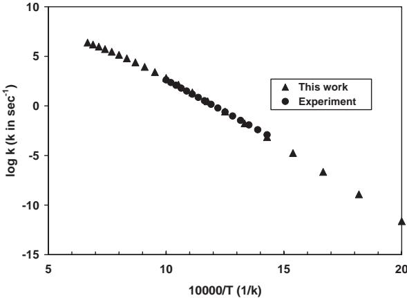
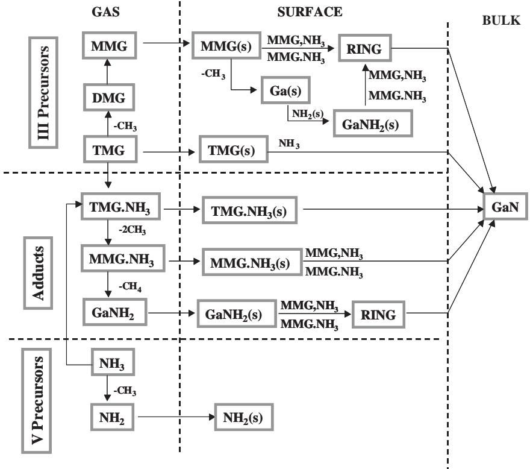
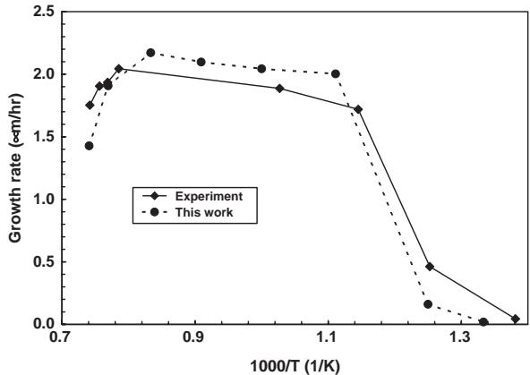
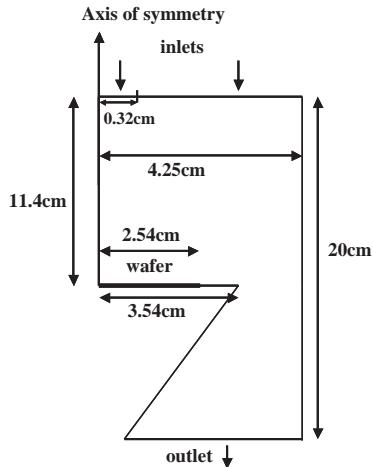
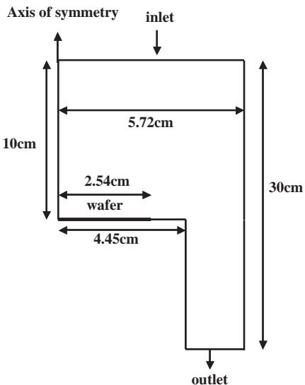
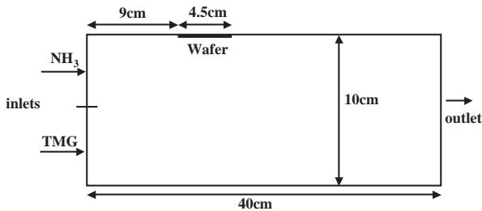
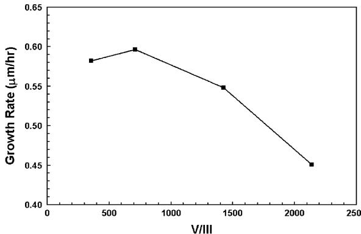
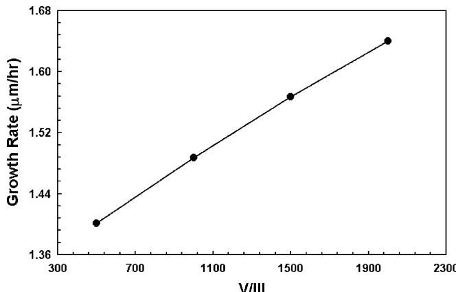
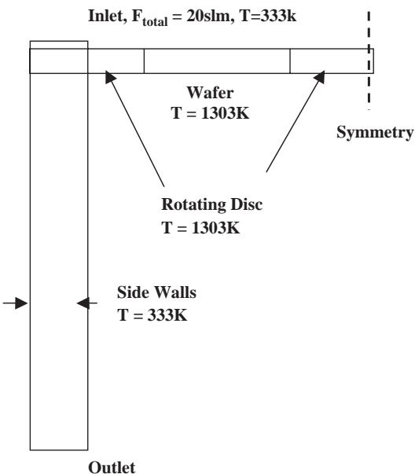
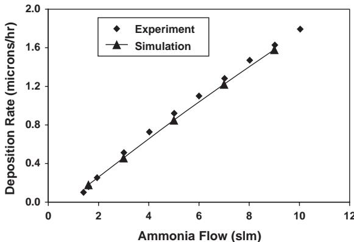

# Combined ab initio quantum chemistry and computational fluid dynamics calculations for prediction of gallium nitride growth

Debasis Sengupta $^{a}$ , Sandip Mazumder $^{b,\ast}$ , William Kuykendall $^{c}$ , Samuel A. Lowry $^{a}$

$^{a}$ CFD Research Corporation, Huntsville, AL 35805, USA   $^{b}$ Department of Mechanical Engineering, The Ohio State University, Ackerman Road, Columbus, OH 43202, USA   $^{c}$ EST CFD Inc, 215 Wynn Drive, Huntsville, AL 35805, USA

Received 1 October 2004; accepted 15 February 2005  Available online 31 March 2005  Communicated by J.J. Derby

# Abstract

Computational fluid dynamics (CFD) is used in the semiconductor industry for the analysis and design of chemical vapor deposition reactors. One critical input needed for prediction of epitaxial thin film growth rates and uniformity is the chemistry occurring in the gas phase and at the surface. Traditionally, simplified chemistry derived from experimental observations has been used for this purpose. With the advent of modern high- speed computational techniques, it is now possible to formulate detailed reaction mechanisms using ab initio methods. Such detailed reaction mechanisms, comprising mostly of elementary reactions, have the advantage that they require little or no calibration. This paper presents a methodology in which the density functional theory, in combination with rate theories, was used to determine the reaction pathways and rates in the gas phase as well as at the surface for gallium nitride growth from tri- methyl gallium and ammonia. The reaction mechanisms were then used as input to a multi- dimensional CFD code enabling accurate prediction of growth rates. Validation studies were performed for four different laboratory- scale reactors, and one commercial reactor. In each case, the predictions agreed reasonably well with the experimental data indicating the universality of the reaction mechanisms.

$(\overline{\mathbf{C}})$  2005 Elsevier B.V. All rights reserved.

Keywords: A1. Computer simulation; A1. Growth models; A3. Metalorganic vapor phase epitaxy; B1. Gallium compounds; B1. Nitrides; B2. Semiconducting gallium compounds

# 1.Introduction

Wide band- gap III- V semiconductors, such as gallium nitride (GaN) and aluminum gallium nitride (AlGaN), have drawn much attention due to their unique ability to produce blue- green light [1]. This property is currently being used to develop light emitting diodes (LED) and lasers. In order to make such devices, a thin film of the materials must be deposited on a wafer. At present, the technique of choice for depositing thin films of III- V semiconductor materials is metal organic vapor phase epitaxy (MOVPE).

Modeling and simulation, based on computational fluid dynamics (CFD), is now used routinely within the semiconductor industry for design, optimization and troubleshooting of epitaxial growth processes that occur on the substrate. The efficacy of such modeling is currently limited by the availability of chemical reaction mechanisms that describe the growth process. In the past, reaction rates have been obtained primarily by calibrating a reduced set of reactions against available experimental data, which in most cases, is somewhat limited. With the advent of highspeed computers it is now possible to explore larger reaction sets comprising of mostly elementary reactions using first- principle methods, such as density function theory (DFT). Such detailed reaction mechanisms can provide more generality and requires less calibration.

In the specific case of GaN, a handful of past studies have reported reaction mechanisms [2,3]. All of these mechanisms are based on the one proposed originally by Mihopoulos [4]. In their study, the activation barriers of some of the gasphase reaction steps were calculated using ab initio methods. Pre- exponential factors of the formation and dissociation of adducts were adjusted to reproduce the time versus concentration profiles obtained through experiments. While the ab initio methods were used to determine the activation energies of some of the gas- phase reactions, most of the surface reactions were considered to be collision- limited, and the activation barriers were calibrated. The salient feature of this mechanism is the formation of a "ring compound (or a trimeric species) with molecular formula  $\mathrm{(Ga(CH_3)_2\cdot NH_2]_3}$  through the gas phase reaction between trimethyl gallium (TMG) and ammonia  $(\mathrm{NH}_3)$  according to the following reaction:

$$
\begin{array}{rl} & {\mathrm{TMG} + \mathrm{NH}_3\rightarrow \mathrm{TMG}\cdot \mathrm{NH}_3}\\ & {\rightarrow \mathrm{Ga}(\mathrm{CH}_3)_2\cdot \mathrm{NH}_2 + \mathrm{CH}_4,} \end{array}
$$

$$
3\mathrm{Ga}(\mathrm{CH}_3)_2\cdot \mathrm{NH}_2\rightarrow [\mathrm{Ga}(\mathrm{CH}_3)_2\cdot \mathrm{NH}_2]_3.
$$

This compound reacts at the surface and constitutes the major pathway for GaN growth [4]. Although there is no direct evidence of such a proposition, this mechanism has been frequently used by others for GaN growth modeling and reactor design [2,3,5].

In a recent paper [6], it has been shown that the possibility of "ring" compound formation is extremely low under typical growth conditions due to very low concentration of  $\mathrm{Ga(CH_3)_2\cdot NH_2}$  These results are further supported by a recent experimental report of Bergman et al. [7], who pointed out that the contribution of growth due to the trimeric species has been overestimated in the past. Based on these experimental and theoretical findings, a new mechanism for GaN growth is proposed that does not support the formation of the "ring" compound in the gas phase. The proposed mechanism is based on first- principle calculations in combination with reaction rate theories, such as absolute rate theory (ART) and quantum Rice- Rapmsperger- Kassel (QRRK) [8]. The present mechanism is tested for several different reactors, and is able to reproduce experimental data consistently.

# 2. Calculation procedure

2. Calculation procedureIn order to obtain activation barrier and vibrational frequencies of the stable and intermediate molecules, we used density functional theory (DFT). All quantum chemistry calculations were performed using GAUSSIAN98™ [9] program package. For the calculation of the activation barrier, the DFT with Lee-Yang-Parr gradient corrected correlation functional in conjunction with Becke's three-parameter exchange functional (B3LYP) was used [10,11]. The

geometries of the equilibrium molecular structures and transition states were optimized using  $6 - 31G^{**}$  basis sets for carbon, hydrogen, nitrogen. For gallium, effective core potential (ECP) of HayWadt, which is known as LANL2DZ ECP [12], was used. In order to obtain more accurate energies, calculations using cc- pVTZ [13] basis set on previously optimized geometries were performed. Normal mode analyses for all equilibrium and transition structures were performed. All equilibrium structures were found to have real vibrational frequencies while the transition structures have only one imaginary vibrational frequency corresponding to the reaction coordinate.

# 2.1. Gas phase reactions

The gas phase reactions primarily involve the decomposition of TMG to dimethyl gallium (DMG) and monomethyl gallium (MMG) and their reactions with  $\mathrm{NH}_3$ :

$$
\mathrm{Ga}(\mathrm{CH}_3)_x\rightarrow \mathrm{Ga}(\mathrm{CH}_3)_{x - 1} + \mathrm{CH}_3(x = 1 - 3),
$$

$$
\begin{array}{rl} & {\mathrm{Ga}(\mathrm{CH}_3)_{y + 1} + \mathrm{NH}_3\rightarrow \mathrm{Ga}(\mathrm{CH}_3)_{y + 1}\cdot \mathrm{NH}_3\mathrm{(adduct)}}\\ & {\rightarrow (\mathrm{CH}_3)_y.\mathrm{GaNH}_2 + \mathrm{CH}_4(y = 0 - 2).} \end{array}
$$

Details, pertaining to the gas- phase reactions and their calculation methods may be obtained from the recent paper by Sengupta [6]. The activation barrier and vibrational frequencies for the decomposition of TMG and its intermediate products have been calculated using DFT method. These are subsequently used to calculate the rate constants as a function of temperature and pressure using QRRK theory. These reactions are pressure dependent, and the rate constants have been evaluated at a typical reactor pressure in which GaN is grown (approximately 76torr). In Fig. 1, the calculated rate constants for TMG decomposition have been compared with the experimental data of Jacko and Price [14], and shows excellent agreement. Our calculations show that TMG, DMG and MMG form strong adducts with  $\mathrm{NH}_3$ . The adducts subsequently eliminate  $\mathrm{CH}_4$ . The adduct formation reaction and elimination of  $\mathrm{CH}_4$  are not two independent reactions since the energy released by the formation of adducts is stored in quantized vibrational level of the adducts, and can be utilized to cross the activation barrier for  $\mathrm{CH}_4$  elimination reaction. Therefore, these reactions have been treated via chemical activation [15,16] and the rate constants have been calculated using QRRK theory. In the earlier mechanism by Milopoulos [4] these reactions have been assumed to be independent to each other. These reactions are also pressure dependent because the adduct is initially at the energized state, and molecular collisions are needed to deactivate them. Following calculation of the gas- phase reaction rate constants, they were fitted to the modified Arrhenius expression [i.e.  $k(T) = AT^n \exp (- E_a / RT)$ ]. The fitted rate constants for these reactions are shown in Table 1.

  
Fig. 1. Comparison of calculated rate constant with experiment [14] for the reaction  $\mathrm{TMG} \rightarrow \mathrm{DMG} + \mathrm{CH}_3$ .

# 2.2. Surface reactions

Since the bulk is a continuous repetition of the unit cell, the most appropriate method would be to apply DFT with periodic boundary conditions [17]. However, considering the large number of surface reactions that one needs to examine, calculation with periodic boundary condition is still not practical. A popular simplifying alternative is to use the so- called cluster model, where only a small cluster of atoms on the surface is modeled [18- 20]. These cluster models have been successfully used by others [18- 20] to model surface reactions for silicon nitride, and atomic

Table 1 Gas phase reactions considered for GaN MOVPE  

<table><tr><td></td><td>Reactions</td><td>A</td><td>n</td><td>E/R</td></tr><tr><td>G1</td><td>TMG↔DMG+CH3</td><td>1.0 × 1047</td><td>-9.18</td><td>38,750</td></tr><tr><td>G2</td><td>DMG↔MMG+CH3</td><td>7.67 × 1043</td><td>-9.8</td><td>17,120</td></tr><tr><td>G3</td><td>MMG↔Ga+CH3</td><td>1.68 × 1030</td><td>-5.07</td><td>42,290</td></tr><tr><td>G4</td><td>TMG+NH3→TMG·NH3</td><td>2.28 × 1034</td><td>-8.31</td><td>1568</td></tr><tr><td>G5</td><td>TMG+NH3→(CH3)2GaNH2+CH4</td><td>1.7 × 104</td><td>2.0</td><td>10,050</td></tr><tr><td>G7</td><td>DMG+NH3→DMG.NH3</td><td>4.08 × 1031</td><td>-7.03</td><td>1628</td></tr><tr><td>G8</td><td>DMG+NH3→CH3GaNH2+CH4</td><td>5.30 × 105</td><td>1.56</td><td>10,440</td></tr><tr><td>G9</td><td>MMG+NH3→MMG·NH3</td><td>7.95 × 1024</td><td>-5.21</td><td>1054</td></tr><tr><td>G10</td><td>MMG+NH3→GaNH2+CH4</td><td>8.10 × 105</td><td>1.3</td><td>8919</td></tr><tr><td>G11</td><td>NH3+CH3↔NH4+CH4</td><td>3.31 × 103</td><td>2.51</td><td>4962</td></tr><tr><td>G12</td><td>CH3+H2↔CH4+H</td><td>1.2 × 1012</td><td>0</td><td>6300</td></tr><tr><td>G13</td><td>TMG+H↔DMG+CH4</td><td>5.0 × 1013</td><td>0</td><td>5051</td></tr><tr><td>G14</td><td>DMG+H↔MMG+CH4</td><td>5.0 × 1013</td><td>0</td><td>5051</td></tr><tr><td>G15</td><td>TMG.NH3↔MMG+2CH3+NH3</td><td>1.33 × 1044</td><td>-8.24</td><td>39,150</td></tr><tr><td>G16</td><td>CH3+H+M↔CH4+M</td><td>2.40 × 1022</td><td>-1</td><td>0</td></tr><tr><td>G17</td><td>2CH3↔C2H6</td><td>2.0 × 1013</td><td>0</td><td>0</td></tr><tr><td>G18</td><td>2H+M↔H2+M</td><td>2.0 × 1016</td><td>0</td><td>0</td></tr></table>

Rate constants for unimolecular and bimolecular reactions are expressed as  $\mathrm{s}^{-1}$  and  $\mathrm{cm}^3 /(\mathrm{mol}\cdot \mathrm{s})$  , respectively. Backward rates are calculated from equilibrium by minimizing the Gibb's free energy.

layer deposition of aluminum, zirconium and hafnium oxides.

In bulk GaN, every Ga and N are tetrahedrally coordinated. However, each surface atom has at least one dangling bond, and the surface atoms can accommodate adsorbates. In the present calculations, the reduced cluster model shown in Fig. 2 has been used for surface gallium and nitrogen atoms. The surface gallium atom is bonded to [3] nitrogen atoms, and the nitrogen atoms are terminated by three hydrogen atoms. Similarly, surface nitrogen is bonded to [3] gallium atoms, and they are terminated by three hydrogen atoms. The structures of the chemisorbed species were optimized using the method described in the previous section. The geometries of the clusters were fixed at their bulk values, and no geometry optimization was performed for the bare cluster. For adsorbed structures, the geometry of the adsorbate and the bond connecting the cluster and the adsorbate were optimized. For example, in structure of adsorbed MMG on nitrogen surface, all geometrical parameters in MMG and the Ga- N bond length were optimized while the N- Ga distance in the cluster remained fixed. In the crystal structure of GaN, the hydrogen atoms in the small cluster models (Fig. 2, top) are actually N (surface N) or Ga (surface Ga). Since termination of Ga or N by hydrogen atoms can lead to

  
Fig. 2. Reduced cluster models of surface Ga and surface N (top figures), and larger cluster model used for surface Ga to examine the validity of the reduced cluster model.

enhanced charge transfer, the calculated adsorption energies may be inaccurate. In order to examine the reliability of our cluster model, we performed test calculations using a larger cluster model for surface Ga (Fig. 2, bottom). In this model, the hydrogen atoms in  $\mathrm{NH}_3$  were replaced by Ga, and the terminal Ga atoms are tetrahedrally coordinated to two nitrogen atoms and two hydrogen atoms. Since such calculations require extreme computational times, the test was performed only for adsorption energy calculation for the  $\mathrm{NH}_2$  radical. First, all geometrical parameters in  $\mathrm{NH}_2$  were optimized keeping the cluster parameters fixed. The adsorption energy of  $\mathrm{NH}_2$  thus obtained, was found to be  $50\mathrm{kcal / mol}$ , which is approximately  $12\mathrm{kcal / mol}$  smaller than that obtained using the reduced cluster model. We then performed another calculation where bond lengths around the surface Ga in the adsorbed state were optimized. This essentially means that the surface of GaN reconstruct upon adsorption of  $\mathrm{NH}_2$  which is a more realistic phenomenon. The adsorption energy, thus obtained, was found to be only  $2.5\mathrm{kcal / mol}$  lower than that with the reduced cluster model. The findings of these investigations point to the fact the error introduced by using a reduced cluster model is small, and that reduced cluster models may still be used to make reasonable engineering predictions.

The adsorption enthalpy on  $\mathrm{N}$  surface, was calculated by

$$
\begin{array}{rl} & {\Delta H_{\mathrm{ad}} = E(\mathrm{N\_sur}) + E(\mathrm{adsorbate})}\\ & {\qquad -E(\mathrm{adsorbate}) + \mathrm{thermal~correction},} \end{array} \tag{1}
$$

where  $\Delta H_{\mathrm{ad}}$  is the enthalpy of adsorption,  $E(\mathrm{N\_sur})$ ,  $E(\mathrm{adsorbate})$  and  $E(\mathrm{adsorbate})$  are the energies of the surface nitrogen (cluster model), gas phase adsorbate and the adsorbed molecule. The thermal correction is a term that accounts for the temperature dependence of the enthalpy of adsorption, and calculated using the complete partition functions of the adsorbate before and after adsorption. The pre- exponential factor for a surface reaction is calculated using the expression [21]:

$$
A_{\mathrm{F}} = (\epsilon k_{\mathrm{b}}T / h)c_{\mathrm{ts}}\exp (\Delta S^{\#} / R), \tag{2}
$$

where  $c_{\mathrm{ts}}$  is maximum concentration of the transition state when the surface is bare. Using the DFT calculated vibrational, rotational, translational and electronic partition functions of the adsorbed species and transition state for desorption, the entropy of activation for desorption is calculated. The entropy of the adsorbed species and transition state is calculated using the following expression:

$$
S = R\ln Q + RT\left(\frac{\partial Q}{\partial\ln T}\right)_V, \tag{3}
$$

where  $Q$  is the complete partition function. Finally, the pre- exponential factors are fitted to the expression  $AT$ .

# 2.3. Reactor scale model

The prediction of growth rate and uniformity at the surface requires coupled solution of the equations of conservation of mass, momentum, energy and species. In addition, multi- step finite- rate homogeneous and heterogeneous chemical reactions must be considered. The underlying equations necessary to perform such calculations and their numerical solution is presented elsewhere [3,5,22], and is omitted here for the sake of brevity. For the purposes of the current study, the commercial CFD code, CFD- ACE  $+\mathrm{TM}$  was used [23].

# 3. Results and discussion

# 3.1. Mechanism for GaN growth

While TMG and MMG decompose slowly (G1 and G2 in Table 1) due to their large activation barriers, decomposition of DMG to MMG (G3) is very fast. Therefore, TMG to MMG conversion is fast at high temperatures, and concentration of MMG is expected to be large at higher temperatures. Thus, MMG and  $\mathrm{MMG.NH}_3$  are expected to be the dominant gallium- containing precursor at high temperatures, while TMG and  $\mathrm{TMG.NH}_3$  are expected to contribute to the deposition at low temperature. Also at higher temperature, the formation of atomic Ga is expected to be

appreciable, and will probably influence the deposition process. The dissociation energy of an  $\mathrm{N - H}$  bond is  $\mathrm{NH}_3$  is  $108\mathrm{kcal / mol}$  [24]. Thus, it may be postulated that direct dissociation of  $\mathrm{NH}_3$  is not important even at temperatures much higher than conventional growth temperatures. However,  $\mathrm{CH}_3$  can abstract one hydrogen atom from  $\mathrm{NH}_3$  to produce  $\mathrm{NH}_3$  with a low barrier (G11). Therefore, this reaction is included, in view of the fact that Ga and  $\mathrm{NH}_2$  could combine to contribute to the deposition. Reactions G12 is active when  $\mathrm{H}_2$  is the carrier gas, and produces active  $\mathrm{H}$  atoms. The  $\mathrm{H}$  atoms can enhance decomposition of TMG and DMG. Rate constants of G12, G13 and G14 were taken from literature [25].

As mentioned earlier, the proposed gas phase mechanism does not include "ring" formation, since it has been found recently that the concentration of  $\mathrm{Ga(CH_3)_2NH_2}$ , the precursor to "ring" formation, is negligible under typical growth conditions [6]. The mass spectrometric studies of Bergman et al. [7] suggest that the concentration of the "ring" is negligible at all temperatures. Mazzarese et al. [26] performed FTIR and surface analysis for the TMG and  $\mathrm{NH}_3$  reaction below  $573\mathrm{K}$ . They concluded that the final step for growth of  $\mathrm{GaN}$  is the reaction between  $\mathrm{Ga(CH_3)_x}$ $(x = 1 - 3)$  and  $\mathrm{NH}_3$  at the surface which produces  $\mathrm{CH}_4$ . This work indicates that the methane eliminated product from  $\mathrm{Ga(CH_3)_x\cdot NH_3}$  can be formed at the surface rather than in the gas phase. These results suggest that the "ring" formation is more likely to occur at the surface via successive addition of  $\mathrm{Ga(CH_3)_x}$  and  $\mathrm{NH}_3$  followed by methane elimination. Therefore, the proposed surface mechanism includes "ring" formation at the surface.

The surface reactions that are considered for the study are listed in Table 2. The first pathway is one where the chemisorption of MMG on surface nitrogen site  $(S_{\mathrm{N}})$  and its desorption are considered. Ammonia then forms a complex with MMG, namely  $\mathrm{MMG\cdot NH_3(s)}$  (analogous to that in the gas phase adduct,  $\mathrm{MMG\cdot NH_3}$ ). The direct adsorption of gas phase  $\mathrm{MMG\cdot NH_3}$  is also considered. The binding energy of the complex is assumed to be same as that of the gas phase counterpart. The  $\mathrm{MMG\cdot NH_3(s)}$  then successively reacts with gas phase MMG and  $\mathrm{NH}_3$  eliminating  $\mathrm{CH}_4$  to form a "ring" at the surface as shown in Fig. 3. The activation barrier for  $\mathrm{CH}_4$  elimination was estimated as follows. First, it was assumed that the ratio of the activation barrier for  $\mathrm{TMG\cdot NH_3 + TMG\to TMG\cdot NH_2\cdot DMG + }$ $\mathrm{CH}_4$  and  $\mathrm{TMG\cdot NH_3\to(CH_3)_2GaNH_2 + CH_4}$  is the same that of  $\mathrm{MMG\cdot NH_3 + MMG\to MMG\cdot NH_2Ga + CH_4}$  and  $\mathrm{MMG\cdot NH_3\to GaNH_2 + CH_4}$ . The ratio of the former two reactions was estimated from DFT calculations of Nakamura et al. [27] while the activation barrier for the  $\mathrm{MMG\cdot NH_3 + MMG\to MMG\cdot NH_2Ga + CH_4}$  was evaluated using the methods described an earlier section. The ring is then attached to a nearby surface Ga  $(S_{\mathrm{G}})$ . Finally, the hydrogen atoms are eliminated as  $\mathrm{H}_2$  resulting in the formation of  $\mathrm{GaN(b)}$ .

The second path for GaN formation initiates from adsorbed  $\mathrm{GaNH}_2$ $[\mathrm{GaNH}_2(\mathrm{s})]$ . This species can directly be formed from the gas phase reaction G15 and also via the reaction of adsorbed Ga  $[\mathrm{Ga(s)}]$  and adsorbed  $\mathrm{NH}_2$ $[\mathrm{NH}_2(\mathrm{s})]$ . Successive adsorption of MMG and  $\mathrm{NH}_3$  and elimination of  $\mathrm{CH}_4$  produce a "ring" (Fig. 3). The adsorption of two  $\mathrm{CH}_3$  radicals at each Ga atom of the ring followed by elimination of  $\mathrm{CH}_4$  produces GaN. The activation barriers for successive adsorption of MMG and  $\mathrm{NH}_3$  were assumed to be the same as their adduct formation energy in the gas phase while the adsorption of  $\mathrm{CH}_3$  was calculated using the cluster model. Activation barrier for  $\mathrm{CH}_4$  elimination step was calculated using DFT. To calculate this barrier, a ring structure of formula  $[\mathrm{Ga(CH_3)_2NH_2}]_3$ , was considered. The activation barrier for the  $\mathrm{CH}_4$  elimination from the ring was found to be substantially higher than the similar reaction between TMG and  $\mathrm{NH}_3$ . This is probably due to the constrained structure of the above ring compared to the TMG.  $\mathrm{NH}_3$  complex.

In the third pathway, TMG adsorbs on  $\mathrm{S_N}$  to form TMG(s). Ammonia is then adsorbed on TMG to form  $\mathrm{TMG\cdot NH_3(s)}$ . The adsorption energy is assumed to be the same as the adduct formation energy in the gas phase. This complex first eliminates one molecule of  $\mathrm{CH}_4$  and consequently the  $\mathrm{N}$  atom forms a strong bond with the Ga atom. The activation barrier of this step is

Table 2 Surface reactions considered for GaN deposition. The units are expressed in terms of cm, mol and s  

<table><tr><td></td><td>Reaction</td><td>A</td><td>n</td><td>E/R</td></tr><tr><td>S1</td><td>MMG + S_N → MMG(s)</td><td>1.160 × 105</td><td>2.98</td><td>0</td></tr><tr><td>S2</td><td>MMG(s) → MMG + S_N</td><td>1.115 × 104</td><td>0.55</td><td>5.4189 × 104</td></tr><tr><td>S3</td><td>NH3+MMG(s) → COMPM1(s)</td><td>3.354 × 107</td><td>3.33</td><td>0</td></tr><tr><td>S4</td><td>COMPM1(s) → NH3+MMG(s)</td><td>5.700 × 104</td><td>-0.16</td><td>4.1000 × 103</td></tr><tr><td>S5</td><td>MMG + COMPM1(s) → CH4 + COMPM2(s)</td><td>1.220 × 104</td><td>3.22</td><td>1.1800 × 104</td></tr><tr><td>S6</td><td>NH3+COMPM2(s) → COMPM3(s)</td><td>3.354 × 107</td><td>3.33</td><td>0</td></tr><tr><td>S7</td><td>COMPM3(s) → NH3+COMPM2(s)</td><td>5.700 × 104</td><td>-0.161</td><td>4.1000 × 103</td></tr><tr><td>S8</td><td>MMG + COMPM3(s) → CH4 + COMPM4(s)</td><td>1.230 × 109</td><td>3.22</td><td>1.1800 × 104</td></tr><tr><td>S9</td><td>NH3+COMPM4(s) → COMPM5(s)</td><td>3.354 × 107</td><td>3.33</td><td>0</td></tr><tr><td>S10</td><td>COMPM5(s) → NH3+COMPM4(s)</td><td>5.700 × 104</td><td>-0.161</td><td>4.1000 × 103</td></tr><tr><td>S11</td><td>COMPM5(s) → CH4 + RINGM1(s)</td><td>1.230 × 107</td><td>3.22</td><td>1.1800 × 104</td></tr><tr><td>S12</td><td>S_G+RINGM1(s) → RINGM2(s)</td><td>3.354 × 107</td><td>3.33</td><td>0</td></tr><tr><td>S13</td><td>RINGM2(s) → CH2+3GaN + S_G + S_N</td><td>3.680 × 109</td><td>2.05</td><td>3.0000 × 104</td></tr><tr><td>S14</td><td>CH3+Ga(s) → MMG(s)</td><td>1.760 × 109</td><td>1.39</td><td>0</td></tr><tr><td>S15</td><td>MMG(s) → CH3+Ga(s)</td><td>4.540 × 108</td><td>0.0346</td><td>4.0000 × 104</td></tr><tr><td>S16</td><td>NH2 + S_G → NH2(s)</td><td>3.168 × 108</td><td>1.83</td><td>0</td></tr><tr><td>S17</td><td>GaNH2 + S_N → GaNH2(s)</td><td>2.273 × 109</td><td>2.247</td><td>0</td></tr><tr><td>S18</td><td>GaNH2(s) → GaNH2 + S_N</td><td>4.826 × 108</td><td>0.614</td><td>4.2215 × 104</td></tr><tr><td>S19</td><td>COMPM1(s) → CH4 + GaNH2(s)</td><td>1.490 × 1011</td><td>0.609</td><td>1.3060 × 104</td></tr><tr><td>S20</td><td>MMG + GaNH2(s) → COMPMM1(s)</td><td>1.160 × 105</td><td>2.98</td><td>0</td></tr><tr><td>S21</td><td>NH3+COMPMM1(s) → COMPMM2(s)</td><td>3.354 × 107</td><td>3.33</td><td>0</td></tr><tr><td>S22</td><td>COMPMM2(s) → CH4 + COMPMM3(s)</td><td>1.490 × 1011</td><td>0.609</td><td>1.3060 × 104</td></tr><tr><td>S23</td><td>MMG + COMPMM3(s) → COMPMM4(s)</td><td>1.160 × 105</td><td>2.98</td><td>0</td></tr><tr><td>S24</td><td>NH3+COMPMM4(s) → COMPMM5(s)</td><td>3.345 × 107</td><td>3.33</td><td>0</td></tr><tr><td>S25</td><td>COMPMM5(s) → CH4 + RINGM1(s)</td><td>1.490 × 1011</td><td>0.609</td><td>1.3060 × 104</td></tr><tr><td>S26</td><td>NH2(s) → NH2 + S_G</td><td>1.450 × 1014</td><td>0.09</td><td>3.0089 × 104</td></tr><tr><td>S27</td><td>COMPMM1(s) → MMG + GaNH2(s)</td><td>1.000 × 1014</td><td>0.55</td><td>2.1550 × 104</td></tr><tr><td>S28</td><td>COMPMM2(s) → NH3+COMPMM1(s)</td><td>5.700 × 1014</td><td>-0.1</td><td>4.1000 × 103</td></tr><tr><td>S29</td><td>COMPMM4(s) → MMG + COMPMM3(s)</td><td>1.000 × 1014</td><td>0.55</td><td>2.1550 × 104</td></tr><tr><td>S30</td><td>COMPMM5(s) → NH3+COMPMM4(s)</td><td>5.700 × 1014</td><td>-0.1</td><td>4.1000 × 103</td></tr><tr><td>S31</td><td>Ga + S_N → Ga(s)</td><td>1.000 × 1011</td><td>1.50</td><td>0</td></tr><tr><td>S32</td><td>Ga(s) + NH2(s) → GaNH2(s) + S_G</td><td>1.000 × 1015</td><td>0.0</td><td>0</td></tr><tr><td>S33</td><td>Ga(s) → Ga + S_N</td><td>1.000 × 1013</td><td>0.0</td><td>2.2732 × 104</td></tr><tr><td>S34a</td><td>6CH3+RINGM2(s) → COM1(s)</td><td>7.550 × 107</td><td>2.31</td><td>0</td></tr><tr><td>S35</td><td>COM1(s) → 6CH3+RINGM2(s)</td><td>1.000 × 1013</td><td>0.71</td><td>2.2902 × 104</td></tr><tr><td>S36</td><td>COM1(s) → 6CH4+3GaN + S_G + S_N</td><td>4.000 × 1012</td><td>0.0</td><td>2.5000 × 104</td></tr><tr><td>S37</td><td>TMG + S_N → TMG(s)</td><td>1.160 × 105</td><td>2.98</td><td>0</td></tr><tr><td>S38</td><td>NH3+TMG(s) → TCOM1(s)</td><td>3.354 × 107</td><td>3.33</td><td>0</td></tr><tr><td>S39</td><td>TCOM1(s) → CH4+TCOM2(s)</td><td>1.490 × 1011</td><td>0.609</td><td>1.6500 × 104</td></tr><tr><td>S40</td><td>S_G+TCOM2(s) → TCOM3(s)</td><td>3.354 × 107</td><td>3.33</td><td>0</td></tr><tr><td>S41</td><td>TCOM3(s) → 2CH4+GaN + S_G + S_N</td><td>1.490 × 1011</td><td>0.609</td><td>2.5000 × 104</td></tr><tr><td>S42</td><td>TMG(s) → TMG + S_N</td><td>1.115 × 1013</td><td>0.55</td><td>2.5000 × 104</td></tr><tr><td>S43</td><td>TCOM1(s) → NH3+TMG(s)</td><td>5.700 × 1013</td><td>-0.161</td><td>6.0000 × 103</td></tr><tr><td>S44</td><td>TMG·NH3+S_N → TCOM1(s)</td><td>1.160 × 105</td><td>2.98</td><td>0</td></tr><tr><td>S45</td><td>TCOM1(s) → TMG·NH3+S_N</td><td>1.115 × 1013</td><td>0.55</td><td>2.5000 × 104</td></tr><tr><td>S46</td><td>TCOM1(s) → 2CH3+MMG + NH3+S_N</td><td>1.115 × 1013</td><td>0.55</td><td>5.4189 × 104</td></tr><tr><td>S47</td><td>MMG·NH3+S_N → COMPMM1(s)</td><td>1.160 × 105</td><td>2.98</td><td>0</td></tr><tr><td>S48</td><td>COMPMM1(s) → MMG·NH3+S_N</td><td>1.115 × 1013</td><td>0.55</td><td>5.4189 × 104</td></tr><tr><td>S49</td><td>MMG·NH3+COMPMM1(s) → CH4+COMPMM3(s)</td><td>1.230 × 1010</td><td>3.22</td><td>1.1800 × 104</td></tr><tr><td>S50</td><td>MMG·NH3+COMPMM3(s) → CH4+COMPMM5(s)</td><td>1.230 × 1010</td><td>3.22</td><td>1.1800 × 104</td></tr><tr><td>S51</td><td>MMG·NH3+GaNH2(s) → COMPMM2(s)</td><td>1.160 × 105</td><td>2.98</td><td>0</td></tr><tr><td>S52</td><td>MMG·NH3+COMPMM3(s) → COMPMM5(s)</td><td>1.160 × 105</td><td>2.98</td><td>0</td></tr></table>

aConcentration exponent of 1 has been used for  $\mathrm{CH}_3$  

<table><tr><td>Compounds names</td><td>Chemical formula</td></tr><tr><td>COMPM1</td><td>NH3·MMG(s)</td></tr><tr><td>COMPM2</td><td>Ga·NH2·MMG(s)</td></tr><tr><td>COMPM3</td><td>NH3·Ga·NH2·MMG(s)</td></tr><tr><td>COMPM4</td><td>Ga·NH2·Ga·NH2·MMG(s)</td></tr><tr><td>COMPM5</td><td>NH3·Ga·NH2·Ga·NH2·MMG(s)</td></tr><tr><td>RINGM1</td><td>NH2·Ga·NH2·Ga·NH2·Ga(s)</td></tr><tr><td>RINGM2</td><td>(s)NH2·Ga·NH2·Ga·NH2·Ga(s)</td></tr><tr><td>COMPMM1</td><td>MMG·GaNH2(s)</td></tr><tr><td>COMPMM2</td><td>NH3·MMG·NH2·Ga(s)</td></tr><tr><td>COMPMM3</td><td>NH2·Ga·NH2·Ga(s)</td></tr><tr><td>COMPMM4</td><td>MMG·NH2·Ga·NH2·Ga(s)</td></tr><tr><td>COMPMM5</td><td>NH3·MMG·NH2·Ga·NH2·Ga(s)</td></tr><tr><td>TCOM1</td><td>NH3·TMG(s)</td></tr><tr><td>TCOM2</td><td>NH2·DMG(s)</td></tr><tr><td>TCOM3</td><td>(s)NH2·DMG(s)</td></tr><tr><td>COM1</td><td>RINGM2·CH3complex</td></tr></table>

assumed to be the same as that of its gas phase counterpart. Finally, the complex eliminates two molecules of  $\mathrm{CH_4}$  to produce GaN(b) (Fig. 3). The activation barrier of this final step was assumed to be the same as the  $\mathrm{CH_4}$  elimination barrier from the ring  $(50\mathrm{kcal / mol})$  .We have also considered the direct adsorption of  $\mathrm{TMG.NH_3}$  adduct. Fig.4 schematically shows the various pathways leading to GaN deposition.

# 3.2. Validation studies

The proposed mechanisms for GaN growth were used in a series of simulations of several different reactors. The same set of reaction rates (without any calibration, whatsoever) were used in all of the simulations.

The first set of simulations was performed for a simple horizontal reactor, for which experimental data are available from Chen et al. [28]. The reactor geometry, and boundary conditions are shown in Fig. 5. The average deposition rate is shown for the temperature range  $700–1300\mathrm{K}$  in Fig. 6. It is clear that the predicted growth rates agree well with experimental data. Between 700 and  $850\mathrm{K}$  the growth rate varies drastically. This is the rate- limited regime where diffusion of precursors to the surface dominates over the rate at which they react. The activation barriers for most reactions are not crossed, and the reaction rates are low, leading to low deposition rates. At about  $850\mathrm{K}$  the  $\mathrm{TMG}\cdot \mathrm{NH}_3(\mathrm{s})$  complex starts eliminating  $\mathrm{CH_4}$  since sufficient energy is available to cross the activation barrier for  $\mathrm{CH_4}$  elimination. The formation of MMG in the gas phase steadily increases as the temperature is increased further. This results in deposition through both MMG pathways as well as through the TMG pathway. Beyond about  $1100\mathrm{K}$  there is hardly any TMG available at the surface, and almost all of the deposition occurs via the two MMG pathways. At temperatures above  $1350\mathrm{K}$  MMG(s) starts desorbing from the surface, leading to decrease in growth.

The second set of simulations was performed for the reactor geometry reported by Safvi et al. [5]. The reactor geometry and operating conditions are illustrated in Fig. 7. The growth rate profiles at two different operating conditions are shown in Figs. 8 and 9. For the higher TMG flow case, the match is not very good near the center of the wafer, where the TMG jet directly impinges. This may be attributed to our lack of knowledge of the geometric details pertaining to both the position and shape of the TMG nozzle, and due to the fact that we did not model the actual showerhead. For

  
Fig. 3. Molecular representation of the surface reactions that have been considered for GaN deposition. The structures are views along the (100) surface similar to that shown in Ref. [25] for GaAs.

the lower flow- rate case, where diffusion dominates the transport, the exact placement of the nozzle is insignificant, and a much better agreement with experimental data is observed.

The third set of simulations was performed for the reactor geometry reported by Theodoropoulos et al. [3]. The reactor geometry and operating conditions are illustrated in Fig. 10. The average growth rates at various temperatures are shown in Fig. 11. Although this data is only for the diffusion- limited regime, the excellent match between predicted and experimental results does highlight the universality of the proposed mechanism. It is worth noting that Theodoropoulos et al.

  
Fig. 4. Schematic representation of the pathways (gas phase and surface) for GaN deposition.

  
Fig. 5. Reactor geometry and boundary conditions [28] used for calculation of growth rate at different temperatures using CFD-ACE+™.

[3] also performed modeling studies for the same data, and underpredicted the experimental data consistently using a reduced mechanism.

One critical issue for MOVPE of an III- V material is the effect of V- III ratio on growth rate. While it has been generally observed that GaN growth rate increases with increasing V- III ratio (more ammonia), there are instances, where a reverse trend has been reported. Notably, Niebuhr et al. [29] reported that during their experimental studies, they found that the growth rate actually decreased with increasing V- III ratio. A schematic

  
Fig. 6. Comparison of numerically calculated growth rate with experimental data of Chen et al. [28].

  
Fig. 7. Reactor geometry and boundary conditions [5] used for growth calculations.

  
Fig. 8. Comparison of numerically calculated growth rates with experiment [5] along the radius of the wafer for the reactor shown in Fig. 7. Case I: pressure 100torr,  $T = 1273\mathrm{K}$ ,  $\mathrm{NH}_3 = 2\mathrm{slpm}$ ,  $\mathrm{H}_2 = 10\mathrm{slpm}$ ,  $\mathrm{TMG} = 0.248\mathrm{scm}$ .

of the reactor used for their studies is shown in Fig. 12. When simulations were performed for this reactor geometry with various V- III ratio, it was indeed observed that the growth rate decreased with increasing V- III ratio (Fig. 13). A plausible explanation for this type of behavior is that as the V- III ratio is increased, the ammonia concentration near the substrate increases and the hydrogen concentration decreases. Since ammonia is much heavier than hydrogen, the diffusion of TMG in ammonia is much weaker than the diffusion of TMG in hydrogen. Consequently, although more ammonia is available to react at the surface, very little TMG actually diffuses in through the ammonia stream to the substrate. As the V- III ratio is decreased, hydrogen replaces ammonia,

  
Fig. 9. Comparison of numerically calculated growth rates with experiment [5] along the radius of the wafer for the reactor shown in Fig. 7. Case II: pressure 100torr,  $T = 1273\mathrm{K}$ ,  $\mathrm{NH}_3 = 2\mathrm{slpm}$ ,  $\mathrm{H}_2 = 0.2\mathrm{slpm}$ ,  $\mathrm{TMG} = 0.248\mathrm{scm}$ .

  
Fig. 10. Reactor geometry [3] used for numerical calculation of growth rate at the diffusion-limited regime.

  
Fig. 11. Comparison of numerically calculated growth rate with experiment [3] at the diffusion-limited regime using the reactor geometry shown in Fig. 10.

  
Fig. 12. Reactor geometry and boundary conditions [29] used for calculation growth rate as a function of V/III ratio.

  
Fig. 13. Growth rate as a function of V/III ratio at  $1273\mathrm{K}$ . Note that growth rate decreases as the amount of V-precursor for the reactor shown in Fig. 12.

and the diffusion of TMG becomes more pronounced leading to higher growth rates. This continues until the V- III ratio is so low that not enough ammonia is available at the surface. Beyond this point, the growth rate decreases again. In contrast, such behavior does not occur in stagnation- flow type reactors, such as the one employed by Safvi et al. [5], and the growth rate increases with increasing V- III ratio. This is shown in Fig. 14.

Finally, we test our mechanism versus measured values from the paper by Thrush et al. [30] for a Thomas Swan Scientific Ltd reactor. The axisymmetric model geometry used for the simulation is shown in Fig. 15. It should be noted that the exact geometry of this reactor is proprietary and our geometry is based on the visual inspection of the published reactor's picture. The ratio of TMG and  $\mathrm{NH}_3$  was kept at a constant V/III mole ratio of 2200. The flow rate of the carrier gas, hydrogen, was adjusted accordingly to maintain a total flow rate of  $20\mathrm{slm}$  as set by the experiment. The pressure of the reactor is 100 Torr. The wafer rotates and is assumed to have a uniform temperature of  $1303\mathrm{K}$ . The outside walls of the reactor are water- cooled and are assumed to be  $333\mathrm{K}$ . The boundary conditions corresponding to the showerhead was modeled as multiple inlets to increase the penetration of the inlet flow. Fig. 16 shows that the simulated deposition rate in excellent agreement with the experiment as a function of  $\mathrm{NH}_3$  flow.

# 4. Summary and conclusions

The effectiveness of combining ab initio quantum chemistry calculations with CFD in the modeling of growth of GaN has been demonstrated. Reaction pathways have been calculated using the first- principles quantum chemistry techniques. The activation barriers and the vibrational frequencies have been used to calculate rate constants using QRRK and transition state theory. The rate constant for the surface reactions have been calculated using transition state theory after taking into account the various degrees of freedom of the molecules in the gas phase, adsorbed state and transition state. The new mechanism has been used to calculate deposition rate for five different reactors using CFD. CFD

  
Fig. 14. Growth rate as a function of V/III ratio at  $1273\mathrm{K}$ . Note that growth rate increases as the amount of V-precursor for the reactor shown in Fig. 7.

  
Fig. 15. Schematic drawing of the reactor geometry used to simulate Thomas Swan Ltd. reactor [30].

calculation using the proposed mechanism is able to reproduce the correct temperature dependence of the growth rate for both laboratory- scale and commercial reactors. Also, the present mechanism is able to reproduce two opposing trends of growth rate as a function of V- III ratio. All of these observations lead to the conclusion that the proposed mechanism for GaN growth is fairly universal and accounts for most of the important pathways leading to epitaxial growth of GaN.

  
Fig. 16. Comparison of simulated deposition rate with experiment [30] as a function of  $\mathrm{NH_3}$  flow rate using the reactor shown in Fig. 15.

# Acknowledgments

This work was funded by the National Science Foundation through a Phase II SBIR (DMI 9983415) grant. Mr. William Kuykendall was supported through the NSF REU program. The authors thank Dr. R. Pollard (DoW Chemicals), Professor R. Masel (University of Illinois, Urbana- Champaign), James B. Adams (Arizona State

University) and Dr. R. Sumathi (MIT) for helpful discussion.

# References

[1] G.B. Stringfellow, Organometallic Vapor- Phase Epitaxy: Theory and Practice, Academic Press, New York, 1999. [2] J. Sun, J.M. Redwing, T.F. Kuech, Phys. Stat. Sol. (a) 176 (1999) 693. [3] C. Theodoropoulos, T.J. Mountziaris, H.K. Moffat, J. Han, J. Crystal Growth 217 (2000) 65. [4] T. Mihopoulos, Ph.D. Thesis, Dept. Chem. Eng., MIT, Cambridge, 1999. [5] S.A. Safvi, J.M. Redwing, M.A. Tischler, T.F. Kuech, J. Electrochem. Soc. 144 (1997) 1789. [6] D. Sengupta, J. Phys. Chem. B 107 (2003) 291. [7] U. Bergman, V. Reimer, B. Atakan, Phys. Chem. Chem. Phys. 1 (1999) 5593. [8] P.J. Robinson, K.A. Holbrook, Unimolecular Reactions, Wiley- Interscience, New York, 1972. [9] M.J. Frisch, G.W. Trucks, H.B. Schlegel, G.E. Scuseria, M.A. Robb, J.R. Cheeseman, V.G. Zakrzewski, J.A.S.R.E. Montgomery, J.C. Burant, S. Dapprich, J.M. Millam, A.D. Daniels, K.N. Kudin, M.C. Strain, O. Farkas, J. Tomasi, V. Barone, M. Cossi, R. Cammi, B. Mennucci, C. Pomelli, C. Adamo, S. Clifford, J. Ochterski, G.A.P. Petersson, Y. Ayala, Q. Cui, K. Morokuma, D.K. Malick, A.D. Rabuck, K. Raghavachari, J.B. Foresman, J. Cioslowski, J.V. Ortiz, A.G. Baboul, B.B. Stefanov, G. Liu, A. Liashenko, P. Piskorz, I. Komaromi, R. Gomperts, A.L. Martin, D.J.K.T. Fox, M.A. Al- Laham, C.Y. Peng, A. Nanayakkara, M. Challacombe, P.M.W. Gill, B. Johnson, W. Chen, M.W. Wong, J.L. Andres, C. Gonzalez, M. Head- Gordon, E.S. Replogle, J.A. Pople, Gaussian Inc., Pittsburg, PA., 1998. [10] C. Lee, W. Yang, R.G. Parr, Phys. Rev. B 37 (1988) 785. [11] A.D. Becke, J. Chem. Phys. 98 (1993) 5658.

[12] P.J. Hay, W.R. Wadt, J. Chem. Phys. 82 (1985) 299. [13] T.H. Dunning Jr., J. Chem. Phys. 90 (1989) 1007. [14] M.G. Jacko, S.J.W. Price, Can. J. Chem. 41 (1963) 1560. [15] K.A. Holbrook, M.J. Pilling, S.H. Robertson, Unimolecular Reactions, Wiley, New York, 1996. [16] A.M. Dean, J. Phys. Chem. 89 (1985) 4600. [17] M.C. Payne, M.P. Teter, D.C. Allan, Mod. Phys. 64 (1992) 1045. [18] Y. Widjaja, C.B. Musgrave, Appl. Phys. Lett. 81 (2002) 304. [19] Y. Widjaja, C.B. Musgrave, Appl. Phys. Lett. 80 (2002) 3304. [20] J.K. Kang, C.B. Musgrave, J. Chem. Phys. 117 (2002) 1931. [21] Y.- F. Wang, R. Pollard, J. Electrochem. Soc. 142 (1995) 1712. [22] S. Mazumder, S.A. Lowry, J. Crystal Growth 224 (2001) 165. [23] CFD- ACE+TM, A multi- physics CFD code developed by CFD Research Corporation, Hunsville, AL 35805, currently marketed by ESI Group. [24] NIST, Chemistry webbook. (http://www.webbook.nist.gov/chemistry). [25] T.J. Mountziaris, K.F. Jensen, J. Electrochem. Soc. 138 (1991) 2426. [26] D. Mazzarese, A. Tripathi, W.C. Conner, K.A. Jones, L. Calderon, D.W. Eckart, J. Electron. Mater. 18 (1989) 369. [27] K. Nakamura, O. Makino, A. Tachibana, K. Matsumoto, J. Organomet. Chem. 611 (2000) 514. [28] C.H. Chen, H. Liu, D. Steigerwald, W. Imler, C.P. Kuo, M.G. Craford, M. Ludowise, S. Lester, J. Amano, J. Electron. Mater. 25 (1996) 1004. [29] R. Niebuhr, K. Bachem, K. Dombroski, M. Maier, W. Pletschen, U. Kaufmann, J. Electron. Mater. 24 (1995) 1531. [30] E.J. Thrush, M. Kappers, L. Considine, J.T. Mullins, V. Saywell, F.C. Bentham, N. Sharma, C.J. Humphreys, in: Nitride Workshop, Chin. J. Lumin. 22 (z1)(2001).