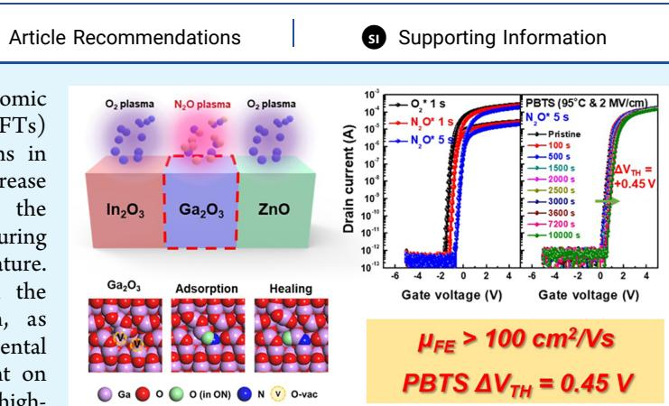
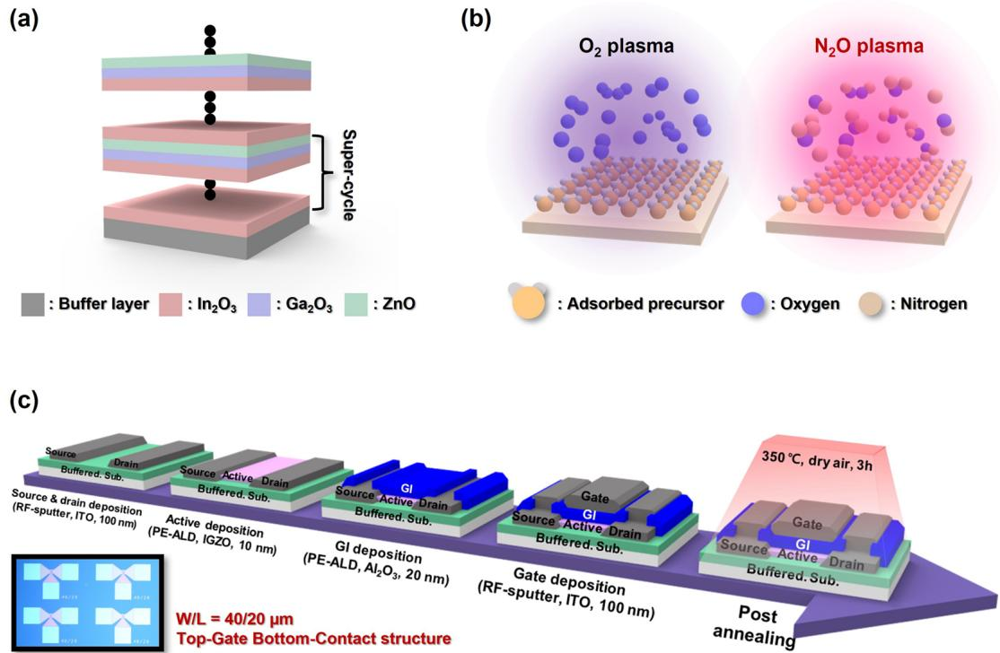
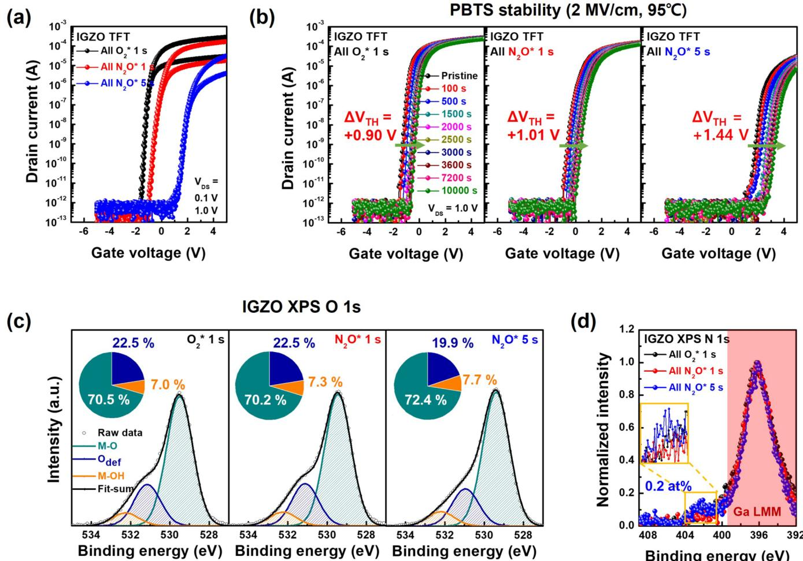
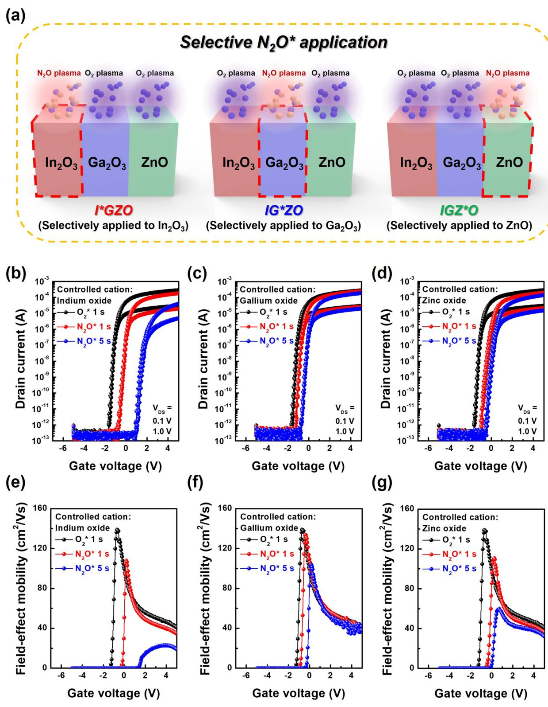
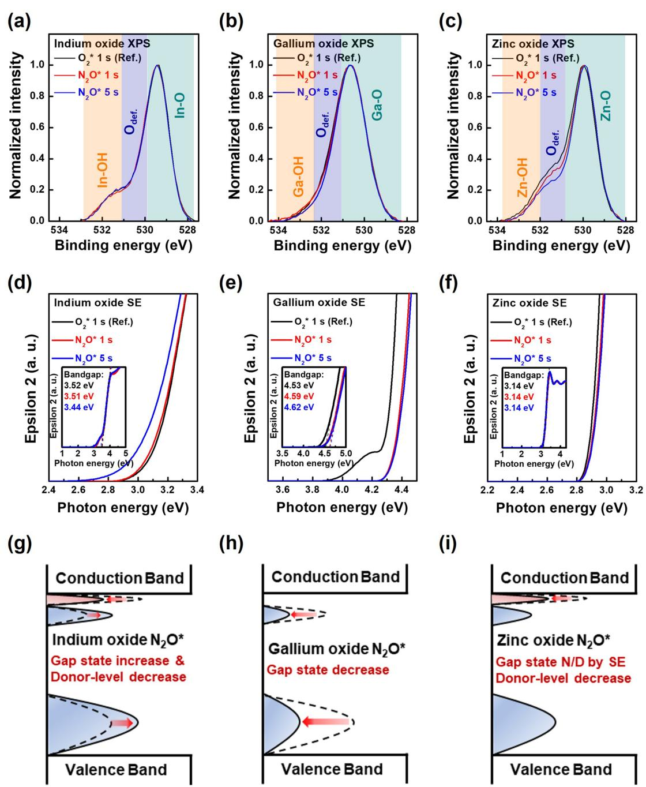
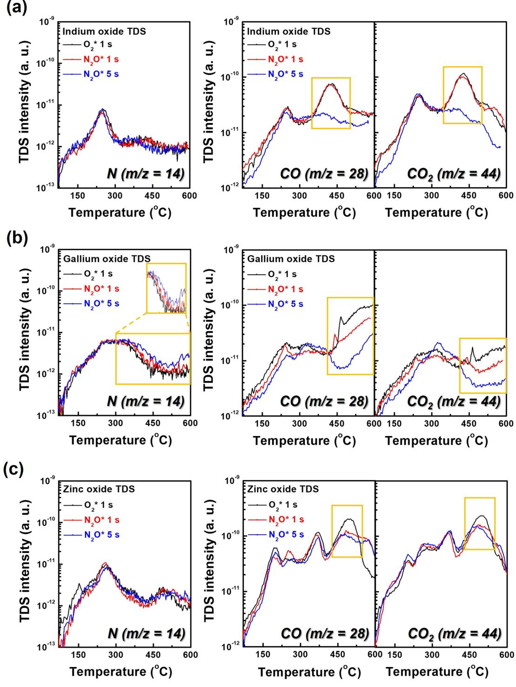
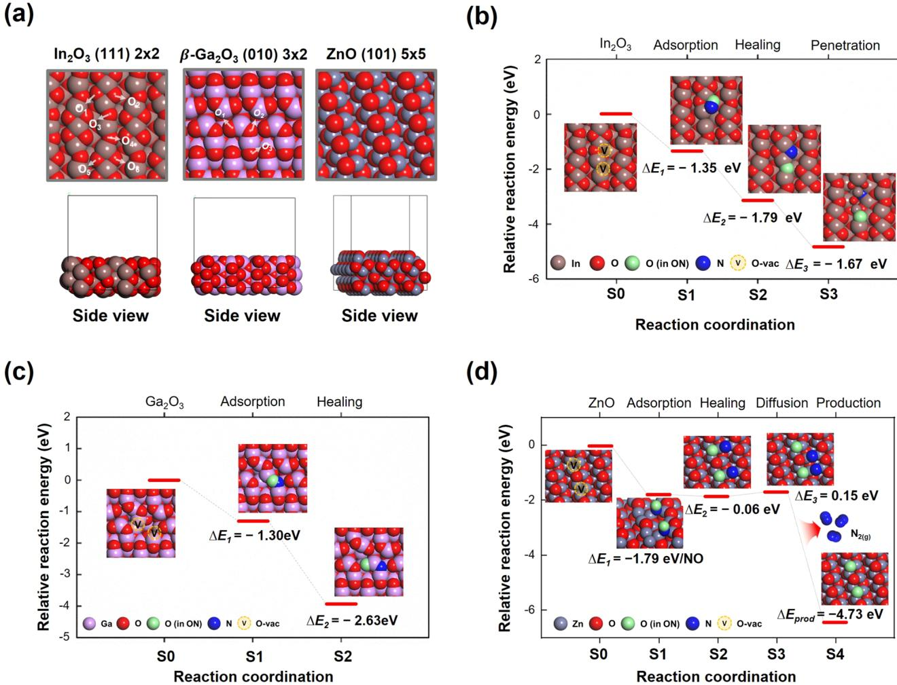
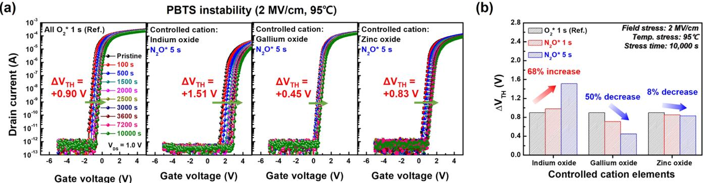

# Selectively Nitrogen Doped ALD-IGZO TFTs with Extremely High Mobility and Reliability

Dong-Gyu Kim, Hyuk Choi, Yoon-Seo Kim, Dong-Hyeon Lee, Hye-Jin Oh, Ju Hyeok Lee, Junghwan Kim, Seunghee Lee, Bongjin Kuh, Taewon Kim, Hyun You Kim,\* and Jin-Seong Park\*

xite This: ACS Appl. Mater. Interfaces 2023, 15, 31652–31663

# ACCESSI

Lilil Metrics & More

ABSTRACT: Achieving high mobility and reliability in atomic layer deposition (ALD)-based IGZO thin-film transistors (TFTs) with an amorphous phase is vital for practical applications in relevant fields. Here, we suggest a method to effectively increase stability while maintaining high mobility by employing the selective application of nitrous oxide plasma reactant during plasma-enhanced ALD (PEALD) at $2 0 0 ~ ^ { \circ } \mathrm { C }$ process temperature. The nitrogen-doping mechanism is highly dependent on the intrinsic carbon impurities or nature 'of each cation, as demonstrated by a combination of theoretical and experimental research. The ${ \mathrm { G a } } _ { 2 } { \mathrm { O } } _ { 3 }$ subgap states are especially dependent on plasma reactants. Based on these insights, we can obtain highperformance indium-rich PEALD-IGZO TFTs (threshold voltage:

$- 0 . 4 7 \mathrm { V } $ feld-effect mobility: $1 0 6 . 5 ~ \mathrm { c m } ^ { 2 } / ( \mathrm { V } ~ \mathrm { s } ) ;$ subthreshold swing: $1 1 3 . 5 ~ \mathrm { m V } ,$ /decade; hysteresis: 0.05 V). In addition, the device hows minimal threshold voltage shifts of $+ 0 . 4 5$ and $- 0 . 1 0 \mathrm { ~ V ~ }$ under harsh positive/negative bias temperature stress environments field stress: $\pm 2 \ \mathrm { M V / c m }$ ; temperature stress: $9 5 ~ ^ { \circ } \mathrm { C }$ ) after $1 0 0 0 0 \ s$

KEYWORDS: atomic layer deposition (ALD), $N _ { 2 } O$ plasma reactant, nitrogen $( N )$ doping IGZO, oxide TFT

# INTRODUCTION

The semiconductor industry is expanding toward artificial intelligence (AI), cloud data centers, and high-bandwidth memory processing in memory (HBM-PIM).1,2 The design of high-performance field-effect transistors (FETs) with lowvoltage operation, high feld-effect mobility $\left( \mu _ { \mathrm { F E } } \right)$ , and low leakage current has propelled the development of relevant fields. Oxide-based thin-flm transistors (TFTs) are garnering increased attention owing to their steep subthreshold swing (Ss) and extremely low leakage current.3,4 Although oxidebased TFTs are known to restrict $\mu _ { \mathrm { F E } }$ $( \sim 3 0 ~ \mathrm { { c m } ^ { \breve { 2 } } / ( V ~ \ s ) ) }$ , numerous research groups have demonstrated exceptional $\mu _ { \mathrm { F E } }$ values exceeding $1 0 \mathsf { \breve { 0 } \ c m ^ { 2 } / ( V s ) . }$ 5,6

The high stability of oxide-based TFTs is another prerequisite for their widespread application. Many groups have reported that the gate insulator (GI) plays a crucial role in determining the device stability. One crucial factor to consider is the band offset between the GI and oxide semiconductor, as it determines the energy barrier for charge carriers to move across the interface. Moreover, because the GI is deposited on the active layer in the top gate structure, the stability of oxide semiconductors is highly dependent on the GI process and optimizing the process parameters of the GI deposition are necessary to ensure high stability. However, achieving high mobility and stability is challenging, as the overall properties of oxide-based TFTs are compromised. Typically, the electron mobility of oxide semiconductors (e.g, IGZO) is an apparent function of the indium cation content. The spherical Ss orbitals of indium ions generate an overlapped orbital string, increasing the IGZO band dispersion34,12,13 However, the oxen vacancy $\mathrm { ( V _ { O } ) }$ concentration increases proportionally with indium content because the dissociation energy of the indium-oxygen $\left( 3 . 6 \pm 0 . 3 ~ \mathrm { e V } \right)$ is lower than gallium—oxygen $( 3 . 9 \pm 0 . 2 \ \mathrm { e V } )$ 14 Despite the high mobility of indium-rich IGZO TFTs, the increased $\mathrm { v _ { o } }$ eventually destabilizes IGZO TFTs.

Crystalline IGZO TFTs, such as $c$ -axis alignment crystalline (CAAC) and spinel phases, have been proposed for trade-off relaxation between the mobility and stability of oxide-based conductor with large-area uniformity is technically challenging. Doping amorphous oxide semiconductors with anions may resolve the issue of uniformity. Previous studies have confirmed that nitrogen $( \Nu )$ doping is promising for regulating $\mathrm { v _ { o } }$ defect concentration.1,í9–2f Because the atomic radius of N is comparable to that of oxygen (O), doped N is a suitable replacement for $\mathrm { v _ { o } }$ defect sites. Moreover, conventional physical vapor deposition (PvD) is already employed for high-volume manufacturing (HVM). However, limited cation controllability and an unstable chemical bonding status with anions make it challenging to achieve the device performance requirements in emerging applications. In contrast, atomic layer deposition (ALD) is an indispensable alternative capable of independently adjusting cation and anion concentrations based on repeated' deposition cycles with various reactants. s.22-24 In other words, the ALD can easily determine an anion doping concentration for each element in the multicomponent oxide semiconductors by changing a reactant species.

We fabricated high-mobility IGZO TFTs capable of lowvoltage operation using plasma-enhanced ALD (PEALD), and the properties of previously reported ALD-IGZO TFTs with high-mobility $( < \bar { 5 0 } \mathrm { c m } ^ { 2 } / ( \mathrm { \dot { V } } \mathrm { \Delta } \bar { s } ) )$ are summarized in Table S1.25-30 Though the PEALD-synthesized IGZO channel layer is amorphous, an appropriate N-doping strategy coupled with PEALD can alleviate stability and uniformity issues. In this study, a nitrous oxide $( \mathrm { N } _ { 2 } \mathrm { O } )$ plasma reactant was applied selectively during each ALD cation cycle. Our strategy here, the ${ \bf N } _ { 2 } { \bf O }$ plasma reactant, is completely different from plasma treatment in that it participates in chemical reactions during the ALD process. There have been several reports on the application of ${ \bf N } _ { 2 } { \bf O }$ plasma reactant for insulation materials $( \mathrm { { S i O } } _ { 2 } ,$ $\mathrm { A l } _ { 2 } \mathrm { O } _ { 3 } ,$ $\mathrm { H f O } _ { 2 } ,$ and $\mathrm { Z r O } _ { 2 } ,$ )or $_ { \mathrm { Z n O } }$ during PEALD, whereas IGZO multicomponent oxide semiconductor has yet to be reprtedearly,334 Usinga cobinatoril stud of experimental analysis and theoretical interpretation, we investigated the N-doping mechanism, and the associated enhancements in performance and stability of PEALDsynthesized IGZO TFTs were investigated. Our results provide insights into the atomic precision optimization of the performance and stability of IGZO TFTs.

# EXPERIMENTAL SECTION

$\ln _ { 2 } 0 _ { 3 } , { \sf G a } _ { 2 } 0 _ { 3 } ,$ and ${ \tt z n o }$ Deposition by PEALD Using $\mathbf { O } _ { 2 }$ and ${ \sf N } _ { 2 } { \sf O }$ Plasma Reactants. $\mathrm { I n } _ { 2 } \mathrm { O } _ { 3 } ,$ ${ \bf G a } _ { 2 } { \bf O } _ { 3 } ,$ and $_ \mathrm { Z n O }$ thin films were deposited on a low-boron-doped polished silicon (Si) wafer in a 6 in. $\times 6$ in. scale utilizing a lateral-flow-type PEALD system with a radio frequency $\left( 1 3 . 5 6 ~ \mathrm { M H z } \right)$ direct capacitance coupled plasma source (ISAC Research Inc.). The substrate temperature, working pressure, and plasma power were fixed at $2 0 0 \ ^ { \circ } \mathrm { C } ,$ 1.2 Torr, and $1 0 0 \ W _ { i }$ respectively. During deposition, argon (Ar) $( 9 9 . 9 9 9 \%$ gas was employed as the carrier gas. For $\mathrm { I n } _ { 2 } \mathrm { O } _ { 3 } ,$ ${ \mathrm { G a } } _ { 2 } { \mathrm { O } } _ { 3 } ,$ and $\mathrm { Z n O }$ deposition, (3-(dimethylamino)propyl)dimethylindium (DADI), trimethylgallium (TMGa), and diethylzinc (DEZ) precursors were utilized. For appropriate vapor pressure, the DADI canister temperature was increased to $45 \ ^ { \circ } \mathrm { C } ,$ whereas the TMGa was cooled to $1 5 ~ ^ { \circ } \mathrm { C }$ Additionally, the DADI precursor was delivered to a reaction chamber assisted by Ar carrier gas. To oxidize the above precursors, we utilized an aqueous $\mathrm { O } _ { 2 }$ or $\Nu _ { 2 } \mathrm { O }$ plasma diluted in Ar at a 1:1 ratio as the reactant. The $\mathrm { O } _ { 2 }$ and ${ \bf N } _ { 2 } { \bf O }$ gas lines are designed to be spatially separate to minimize intermixing of the plasma species. The PEALD process steps and cycle time for these thin films are as follows: precursor dose (DADI: $1 . 5 \ s _ { \mathrm { { j } } }$ TMGa: $0 . 1 \ s$ DEZ: $0 . 3 { \mathrm { ~ s } } { \dot { } }$ )−purge (Ar: $\bar { 2 } 5 s \mathrm { ; }$ $\mathrm { \Delta O } _ { 2 }$ and $\mathrm { N } _ { 2 } \mathrm { O }$ : 10 s)−plasma exposu( $\mathrm { \tilde { O } } _ { 2 }$ 1 s; $\mathrm { N } _ { 2 } \mathrm { O }$ : 1, 5 s)−purge (Ar: 10 s).

PEALD-IGZO Deposition via Selective ${ \Nu } _ { 2 } 0$ Plasma Reactant. The supercycle consisting of $\mathrm { I n } _ { 2 } \mathrm { O } _ { 3 } ,$ ${ \mathrm { G a } } _ { 2 } { \mathrm { O } } _ { 3 } ,$ and $_ \mathrm { Z n O }$ for IGZO deposition was processed as $\mathrm { [ I n } _ { 2 } \mathrm { O } _ { 3 } \times 1 8$ cycles $- \mathrm { G a } _ { 2 } \mathrm { O } _ { 3 } \times 1$ cycle$\mathrm { Z n O } \times 1$ cycle]. The reference IGZO was deposited utilizing an $\mathrm { O } _ { 2 }$ plasma reactant, whereas selectively controlled IGZO films were deposited utilizing an $\mathrm { N } _ { 2 } \mathrm { O }$ plasma reactant for the individual elements $\mathrm { I n } _ { 2 } \mathrm { O } _ { 3 } ,$ ${ \bf G a } _ { 2 } { \bf O } _ { 3 } ,$ and $_ \mathrm { Z n O }$ with a fixed number of subcycles. The supercycle process of the three splits of the controlled IGZO films is as follows: (i) $\left[ \mathrm { I n } _ { 2 } \mathrm { O } _ { 3 } \right.$ $\mathrm { N } _ { 2 } \mathrm { O }$ ${ \bf \Pi } ^ { - } \mathrm { G a } _ { 2 } \mathrm { O } _ { 3 }$ $\mathrm { \tilde { O } } _ { 2 }$ $- Z \mathrm { n O }$ - $\mathrm { \Delta } _ {  } \mathrm { \simeq } \frac { \ d } { \ d t { 2 } } \mathrm { \Lambda } _ { 2 }$ plasma)], (ii) $[ \mathrm { I n } _ { 2 } \mathrm { O } _ { 3 } \ : ( \mathrm { O } _ { 2 } \mathrm { \ p l a s m a } ) { - } \mathrm { G a } _ { 2 } \mathrm { O } _ { 3 }$ $\mathrm { N } _ { 2 } \mathrm { O }$ $- \mathrm { Z n O }$ - $\mathrm { \Delta } _ {  } \mathrm { \simeq } \frac { \ d } { \ d t { 2 } } \mathrm { \Lambda } _ { 2 }$ plasma)], and (ii) $[ \mathrm { I n } _ { 2 } \mathrm { O } _ { 3 }$ $\mathrm { \Delta O } _ { 2 }$ plasma) $- \mathrm { G a } _ { 2 } \mathrm { O } _ { 3 }$ $\mathrm { \tilde { O } } _ { 2 }$ plasma $- \mathrm { Z n O }$ $\mathrm { N } _ { 2 } \mathrm { O }$ plasma)].

PEALD-IGZO TFTs Fabrication. Top-gate bottom-contact (TGBC) PEALD-IGZO TFTs were fabricated on a thermally grown 100 nm thick $\mathrm { S i O } _ { 2 }$ buffer layer. For the source and drain electrodes, a 100 nm thick ITO layer was deposited using RF sputtering and patterned employing a conventional photolithography process. Next, a $1 0 \ \mathrm { n m }$ thick reference and controlled IGZO layer deposited using PEALD was utilized as the active layer and defined by photolithography, followed by a wet etching process. As a GI, a $2 0 ~ \mathrm { { n m } }$ thick ${ \mathrm { A l } } _ { 2 } { \mathrm { O } } _ { 3 }$ layer was deposited using PEALD, and the contact holes for the source/ drain were opened. Based on the dielectric constant of PEALD. ${ \bf A l } _ { 2 } { \bf O } _ { 3 }$ (8.05), the equivalent oxide thickness $( E _ { \mathrm { O T } } )$ of the $2 0 ~ \mathrm { { n m } }$ thick ${ \mathrm { A l } } _ { 2 } { \mathrm { O } } _ { 3 }$ layer was calculated as ${ \sim } 1 0 ~ \mathrm { n m }$ . To fabricate the gate electrode, a 100 nm thick ITO layer was deposited and patterned employing a conventional photolithography process. The width and length of the IGZO TFTs were 40 and $2 0 \ \mu \mathrm { m } ,$ respectively. Finally, the fabricated devices were processed postannealing at $3 5 0 ~ ^ { \circ } \mathrm { C }$ for $3 \mathrm { ~ h ~ }$ under dry air $( \mathrm { O } _ { 2 } 2 1 \% / \mathrm { N } _ { 2 } 7 9 \%$ ; purity: $9 9 . 9 9 9 \%$ ) in ambient conditions.

Characterization. The electrical characteristics of the devices were measured in a dark vacuum environment at 350 mTorr by using a Keithley 4200-SCS semiconductor parameter analyzer. In addition, the electrical properties of thin flms, such as the carrier concentration and resistivity, were characterized by using Hall measurements (HMS-3000, Ecopia). The cation atomic composition of the IGZO films was obtained using energy-dispersive X-ray fluorescence spectrometry (ED-XRF, ARL QUANT'X, Thermo Scientifc). The chemical bond states were analyzed using X-ray photoelectron spectroscopy (XPS, K-alpha $^ +$ , Thermo Scientific) employing a monochromatic Al $\mathrm { K } \alpha$ - $\mathrm { 1 4 8 6 . 6 ~ e V } ,$ source with a pass energy of 50 eV. Crystallinity was evaluated by employing grazing incidence X-ray diffraction (GI-XRD, SmartLab, Rigaku) with a Cu $_ \mathrm { K } \alpha$ (1.5405 Å) target. The surface morphology images and surface roughness of the IGZO flms were analyzed by atomic force microscopy (AFM, XE-80, Park Systems). The amounts of quantitative N, CO, and $\mathrm { C O } _ { 2 }$ species were observed using thermal desorption spectroscopy (TDS, TDS1200, ESCO) from 36 to $6 0 0 ~ ^ { \circ } \mathrm { C }$ at a rate of $6 0 \mathrm { ~  ~ { ~ \circ ~ } ~ } _ { \mathrm { C / m i n } }$ under a high vacuum of $1 \times 1 0 ^ { - 8 }$ Pa. The thickness, subgap states near the conduction band minimum (CBM), and optical bandgap of the thin flms were measured by employing spectroscopic ellpsometry (SE, M-2000, WizOptics).

First-Principles Calculations. Spin-polarized density functional theory (DFT) calculations were performed by employing the Vienna ab initio simulation package (VASP) code.35,36 The Perdew-BurkeErnzerh (PBE) functional was applied to estimate the exchangecorrelation energy of the Kohn—Sham equation.37 The DFT-D3 method using the Becke—Johnson damping model was employed to appropriately include the van der Wals interaction.38 The interaction between the ionic core and valence electrons was described utilizing the projector-augmented wave method.39 The valence electron wave functions were expanded on a plane-wave basis up to an energy cutoff of $4 0 0 \ \mathrm { e V } .$ The Hubbard. $U$ correction method with a $U _ { \mathrm { e f f } }$ of $7 ~ \mathrm { e V }$ was applied to effectively treat the localized d-orbitals of In and Ga.40–43 The Brillouin zone was sampled at the $\Gamma$ -point for all calculations. The convergence criteria for the electronic structure and atomic geometries are $1 0 ^ { - 4 }$ $0 . 0 5 ~ \mathrm { e V } / \mathring { \mathrm { A } }$ , respectively. To improve the state convergence near the Fermi level, a Gaussian smearing function with a fi nite temperature width of $0 . 0 5 \ \mathrm { e V }$ was utilized. To describe the atomic structure of the ALD-synthesized films, $2 \times 2 \times 4 \ : \mathrm { I n } _ { 2 } \mathrm { O } _ { 3 }$ (111), $3 \times 2 \times 5 \beta { \mathrm { - } } \mathrm { G a } _ { 2 } \mathrm { O } _ { 3 }$ (010), and $5 \times 5 \times 4 \ : \mathrm { Z n O }$ (101) slab models were employed (Figure 6a). A 15 A vacuum layer was applied to avoid interactions between the periodic supercells.

  
Figure 1. Deposition method of PEALD-IGZO films and device fabrication process Schematic of(a) IGZO deposited with supercyle (b) $\mathrm { O } _ { 2 }$ and $\mathrm { N } _ { 2 } \mathrm { O }$ image.

# RESULTS AND DISCUSSION

Impact of ${ \mathsf N } _ { 2 } { \mathsf O }$ Plasma Reactant on the Electrical Characteristics of PEALD-IGZO TFTs. PEALD-IGZO active layers were deposited on the buffer layer utilizing a supercycle method consisting of $\mathrm { I n } _ { 2 } \mathrm { O } _ { 3 } ,$ $\mathrm { G a } _ { 2 } \mathrm { O } _ { 3 } ,$ and ${ \mathrm { Z n O } }$ , as depicted in Figure la. To clarify the effect of the plasma reactant species on the TFT characteristics, IGZO active layers were deposited using $\mathrm { O } _ { 2 }$ and ${ \bf N } _ { 2 } { \bf O }$ plasma reactants, as shown in Figure 1b. Here, the plasma reactants are completely different from plasma treatment in that they participate in chemical reactions during the ALD process. As shown in Figure 1c, we fabricated TG-BC PEALD-IGZO TFTs using a conventional photolithography process, and it was also confirmed that the TFT arrays were well separated. Figure 2 shows the transfer characteristics of the PEALD-IGZO TFTs using the $\mathrm { O } _ { 2 }$ and ${ \bf N } _ { 2 } { \bf O }$ plasma reactants, and the device key parameters are summarized in Table S2. The IGZO TFT with an $\mathrm { O } _ { 2 }$ plasma reactant exhibits an outstanding $\mu _ { \mathrm { F E } }$ of $1 3 5 . 8 \pm 4 . 1 ~ \mathrm { c m } ^ { 2 } / \mathrm { ( V } ~ s )$ , whereas it significantly deteriorates from $8 5 . 0 \pm 4 . 4$ to $2 3 . 6 \pm$ $0 . 2 ~ \mathrm { c m } ^ { 2 } / ( \mathrm { V } ~ \mathrm { \check { s } } )$ when the ${ \bf N } _ { 2 } { \bf O }$ plasma reactant time increases from 1 to 5 s. Furthermore, the ${ \bf N } _ { 2 } { \bf O }$ plasma time results in increased ss and hysteresis with a positive threshold voltage $( V _ { \mathrm { T H } } )$ shift. Figure 2b illustrates the positive bias temperature stress (PBTS) stability results at $9 5 ~ ^ { \circ } \mathrm { C }$ for $1 0 0 0 0 s$ with a gate field stress of $2 \ \mathrm { M V / c m }$ . The IGZO TFTs with the ${ \bf N } _ { 2 } { \bf O }$ plasma reactant demonstrated poorer stability than those with the $\mathrm { O } _ { 2 }$ plasma reactant. These inferior electrical characteristics of the ${ \bf N } _ { 2 } { \bf O }$ plasma reactant were investigated by using XPS. Figure 2 depicts the XPs O 1s and $_ \mathrm { N }$ ls peaks of the IGZO thin flms. Compared with the $\mathrm { O } _ { 2 }$ plasma reactant, the oxygen deficiency $\mathrm { ( O _ { d e f } ) }$ peak decreased from 22.5 to $1 9 . 9 \%$ with increasing ${ \bf N } _ { 2 } { \bf O }$ plasma time. Considering the increase in N content up to 0.2 at. $\%$ within the $\mathrm { N } _ { 2 } \mathrm { O }$ plasma time of $5 \ \mathbf { s } _ { i }$ the decrease in $\mathrm { O _ { d e f } }$ could be ascribed to the N-doping effect, as described in the literature.1119–21 Typically, N doping in IGZO can contribute to decreasing oxygen-related defects because its atomic radius is comparable to that of $\mathrm { o }$ and N. Therefore, many research groups have demonstrated promising device stability using $_ \mathrm { N }$ doping in sputtering-derived IGZO, which generally possesses an atomic composition of $\mathrm { { I n } } { \mathrm { { : G a } } } { \mathrm { { : Z n } } } = { \mathrm { { 1 : 1 } } } { \mathrm { { : 1 } } }$ at. $\%$ . Because indium-rich IGZO (Table S3) was deposited using the PEALD process herein, the puzzling poor stability of the ${ \bf N } _ { 2 } { \bf O }$ plasma reactant implies the dependency of N doping effects on the IGZO cation composition. Considering these results, indium, gallium, and zinc cations were hypothesized to exhibit different tendencies in the ${ \bf N } _ { 2 } { \bf O }$ plasma reactant eff ects.

Selective ${ \mathsf N } _ { 2 } { \mathsf O }$ Plasma Reactant Application for Each Cation Element of PEALD-IGZO. To gain insight into the ${ \bf N } _ { 2 } { \bf O }$ plasma reactant effects for each cation in IGZO, we fabricated three splits of IGZO films for the active channel layer. As depicted in Figure 3a, the IGZO films were deposited considering the $\mathrm { O } _ { 2 }$ plasma reactant, whereas indium, gallium, and zinc subcycles were selectively applied to the ${ \bf N } _ { 2 } { \bf O }$ plasma $^ { \ast }$ means ${ \bf N } _ { 2 } { \bf O }$ plasma reactant, denoted by $\mathrm { I ^ { * } G Z O }$ $\mathrm { I G } ^ { \ast } \mathrm { Z O }$ ,and $\mathrm { I G Z ^ { * } O }$ , hereafter). The difference in cation atomic composition of the three splits of IGZO films is negligible, as shown in Figure S1 and Table S4. Figure 3 illustrates the transfer characteristics of the $\mathrm { I ^ { * } G Z O }$ , $\mathrm { I G ^ { * } Z O _ { \it 2 } }$ and $\mathrm { I G Z ^ { * } O }$ TFTs. The black dots indicate the reference IGZO TFT deposited using an $\mathrm { O } _ { 2 }$ plasma time of $^ { 1 s , }$ whereas the red and blue dots represent IGZO TFT's with selective ${ \bf N } _ { 2 } { \bf O }$ plasma times of 1 and $_ { \textsf { S s } }$ for each cation, respectively. The electrical parameters, such as $\mathrm { V } _ { \mathrm { T H } } , ~ \mu _ { \mathrm { F E } } ,$ SS, and hysteresis, extracted from the transfer characteristics are presented in Table 1. To more clearly identify the effect of ${ \bf N } _ { 2 } { \bf O }$ plasma reactant on electrical characteristics, the $\mu _ { \mathrm { F E } }$ values of $\mathrm { I ^ { * } G Z O }$ $\mathrm { I G } ^ { \ast } \mathrm { Z O }$ ,and $\mathrm { I G Z ^ { * } O }$ TFTs as a function of gate voltages are compared in Figures 3e, 3f, and ${ 3 } \mathbf { g } ,$ respectively. The $\mu _ { \mathrm { F E } }$ and SS values degraded with a positive $V _ { \mathrm { T H } }$ shift with an increasing ${ \bf N } _ { 2 } { \bf O }$ plasma time for each cation material. However, the variations in the electrical parameters were slightly different depending on the cation type. In particular, the $\mathrm { I ^ { * } G Z O }$ TFTs exhibited a signifi cant decrease in $\mu _ { \mathrm { F E } }$ $\mathrm { ^ { ' } } 1 3 5 . 8 \to 2 3 . 2 \ \mathrm { c m } ^ { 2 } / ( \mathrm { V }$ s)) with an increasing ${ \bf N } _ { 2 } { \bf O }$ plasma time. However, the ${ \bf N } _ { 2 } { \bf O }$ plasma eff ects on ${ \mathrm { G a } } _ { 2 } { \mathrm { O } } _ { 3 }$ in $\mathrm { I G } ^ { \ast } \mathrm { Z O }$ TFTs were insignificant compared with those of $\mathrm { I n } _ { 2 } \mathrm { O } _ { 3 }$ . Among the electrical parameters, the ${ \bf N } _ { 2 } { \bf O }$ plasma for ${ \bf G } { \bf a } _ { 2 } { \bf O } _ { 3 }$ produces $\mathrm { I G ^ { * } Z O }$ TFTs with a positive $V _ { \mathrm { T H } }$ shift $( - 1 . 4 1 \ \to \ - 0 . 4 7 \ \mathrm { ~ V } )$ Furthermore, a large increment of SS $\mathrm { 7 2 . 3 ~  ~ 1 4 5 . 1 ~ \ m V / }$ decade) in the $\mathrm { I G Z ^ { * } O }$ TFTs was observed. Based on these experimental results, the ${ \bf N } _ { 2 } { \bf O }$ plasma reactants for $\mathrm { I n } _ { 2 } \mathrm { O } _ { 3 } ,$ $\mathrm { G a } _ { 2 } \mathrm { O } _ { 3 } ,$ and $\mathrm { Z n O }$ in the IGZO system could possibly serve as mobility suppressors, $V _ { \mathrm { T H } }$ stabilizers, and slope destroyers, respectively. To identify the unique characteristics of the ${ \bf N } _ { 2 } { \bf O }$ plasma reactant for each cation in the IGZO TFTs, GI-XRD was performed, as depicted in Figure S2. Because the selective ${ \bf N } _ { 2 } { \bf O }$ plasma IGZO active layers exhibited an amorphous phase, the relationship between the electrical characteristics and crystallinity was not considered. During device fabrication, the only difference between the reference and selective ${ \bf N } _ { 2 } { \bf O }$ plasma IGZO TFTs was the plasma reactant species for each cation material. Therefore, focusing on each cationic material could reasonably explain these results with precision.

  
Figure 2. Comparison of electrical characteristics of the PEALD-IGZO TFTs deposited using $\mathrm { O } _ { 2 }$ and $\mathrm { N } _ { 2 } \mathrm { O }$ plasma reactants. (a) Transfer curves and (b) PBTS results of the IGZO TFTs. XPS (c) O 1s and (d) N 1s peaks of the IGZO films.

Gap States and Light Element Analysis of Each Cation Material Deposited Using ${ \mathsf N } _ { 2 } { \mathsf O }$ Plasma Reactant. The electrical characteristics of $\mathrm { I n } _ { 2 } \mathrm { O } _ { 3 } ,$ ${ \bf G a } _ { 2 } { \bf O } _ { 3 } ,$ and $\mathrm { Z n O }$ prepared by using the $\mathrm { O } _ { 2 }$ or $\mathrm { N } _ { 2 } \mathrm { O }$ plasma reactants were investigated via Hall measurements. However, because of the low ${ \mathrm { G a } } _ { 2 } { \mathrm { O } } _ { 3 }$ carrier concentration, only the electrical characteristics of the $\mathrm { I n } _ { 2 } \mathrm { O } _ { 3 }$ and ${ \mathrm { Z n O } }$ thin films could be obtained, as depicted in Figures S3a and S3b, respectively. The $\mathrm { I n } _ { 2 } \mathrm { O } _ { 3 }$ and $\mathrm { Z n O }$ films exhibited a decrease in carrier concentration and increased resistivity with the $\mathrm { N } _ { 2 } \mathrm { O }$ plasma time. The $\mathrm { v _ { o } }$ is an important factor in determining carrier concentration and resistivity in oxide semiconductors.3444,45 Therefore, XPs analysis of each cation material was performed to evaluate the eff ects of the $\mathbf { N } _ { 2 } \mathbf { O }$ plasma reactant on the electrical characteristics. Figure 4 illustrates a comparison of the XPS ls peaks for the $\mathrm { I n } _ { 2 } \mathrm { O } _ { 3 } ,$ $\mathrm { G a } _ { 2 } \mathrm { O } _ { 3 } ,$ and $\mathrm { Z n O }$ films prepared using $\mathrm { O } _ { 2 }$ or ${ \bf N } _ { 2 } { \bf O }$ plasma reactants. The O ls peaks were deconvoluted by utilizing a Gaussian fit with three different binding energy-centered peaks, as depicted in Figure S4. It is found that negligible changes in the $\mathrm { O _ { d e f } }$ peak are observed regardless of plasma species in the $\mathrm { I n } _ { 2 } \mathrm { O } _ { 3 }$ fi lms. In contrast, the intensity of the $\mathrm { O _ { d e f } }$ peak decreased in the ${ \mathrm { G a } } _ { 2 } { \mathrm { O } } _ { 3 }$ and $\mathrm { Z n O }$ films with increasing ${ \bf N } _ { 2 } { \bf O }$ plasma time( ${ \mathrm { G a } } _ { 2 } { \mathrm { O } } _ { 3 }$ $1 4 . 8  8 . 0 \%$ $\mathrm { Z n O }$ $2 2 . 5 \to 1 7 . 5 \%$ ). The correlation between the $\mathrm { O _ { d e f } }$ and subgap states was measured via SE analysis. Figure 4 ilustrates the SE spectra of $\mathrm { I n } _ { 2 } \mathrm { O } _ { 3 } ,$ ${ \bf G a } _ { 2 } { \bf O } _ { 3 } ,$ and ${ \mathrm { Z n O } } _ { \cdot }$ , and the inset shows the bandgap variations for each material. The band edge states were deconvoluted with two Gaussian fits located at $E _ { \mathrm { C } ^ { - 0 . 0 2 } }$ (D1 state, donor-like state) and $E _ { \mathrm { C } ^ { - 0 . 2 7 } }$ (D2 state, acceptorlike state), as depicted in Figure S5. Based on the estimated number of subgap states, the energy structures of $\mathrm { I n } _ { 2 } \mathrm { O } _ { 3 } ,$ ${ \bf G a } _ { 2 } { \bf O } _ { 3 } ,$ and $_ { \mathrm { Z n O } }$ are presented in Figures $^ { 4 } \mathrm { g } , ~ 4 \mathrm { h } ,$ and 4i, respectively. Compared to the values for the $\mathrm { O } _ { 2 }$ plasma reactant, the donor level for carrier-generating $\mathrm { I n } _ { 2 } \mathrm { O } _ { 3 }$ and ${ \mathrm { Z n O } }$ films decreased with the $\mathrm { N } _ { 2 } \mathrm { O }$ plasma time. Contrary to the trends for donor-level changes, the variations in the subgap states are fairly different for each cation element. The subgap states increased in the $\mathrm { I n } _ { 2 } \mathrm { O } _ { 3 }$ flm with ${ \bf N } _ { 2 } { \bf O }$ plasma time, whereas they decreased in the ${ \bf G } { \bf a } _ { 2 } { \bf O } _ { 3 }$ film utilizing the ${ \bf N } _ { 2 } { \bf O }$ plasma reactant. However, the subgap states are undetected in the ${ \mathrm { Z n O } }$ film regardless of the reactant species, which is presumed to result from acceptor-like ${ \mathrm { V } _ { 0 } } ^ { 2 + }$ states located at a relatively deep energy level $( \sim 1 \ \mathrm { e V }$ far from the CBM) or exhibited high formation energy $( \sim 3 . 5 \ \mathrm { e V } )$ .46–48 These results imply that the $\mathrm { N } _ { 2 } \mathrm { O }$ plasma reactant to $\mathrm { I n } _ { 2 } \mathrm { O } _ { 3 }$ reduces the donor level, resulting in mobility suppression in the $\mathrm { I ^ { * } G Z O }$ TFT. However, because ${ \bf G } { \bf a } _ { 2 } { \bf O } _ { 3 }$ has a low electron concentration, the subgap states are more sensitive to the $\mathrm { N } _ { 2 } \mathrm { O }$ plasma reactant than the donor level, eventually contributing to $\mathrm { V } _ { \mathrm { T H } }$ stabilization in the $\mathrm { I G } ^ { \ast } \mathrm { Z O }$ TFT. Meanwhile, the surface roughness of the $\mathrm { I G Z ^ { * } O }$ slightly increased to other films,

  
Figure 3. Electrical characteristics of the selective $\mathrm { N } _ { 2 } \mathrm { O }$ applied IGZO TFTs. (a) Schematic of selective ${ \bf N } _ { 2 } { \bf O }$ plasma reactant applications in IGZO active layers. Transfer curves and extracted $\mu _ { \mathrm { F E } }$ as a function of gate voltages of the IGZO TFTs with selective $\Nu _ { 2 } \mathrm { O }$ plasma applied for $\left( \boldsymbol { \mathbf { b } } , \boldsymbol { \mathbf { e } } \right)$ indium oxide, $( \mathbf { c } , \mathbf { f } )$ gallium oxide, and $( \mathbf { d } , \mathbf { g } )$ zinc oxide.

Table 1. List of Key Electrical Parameters of IGZO TFTs with Selective ${ \bf N } _ { 2 } { \bf O }$ Plasma Reactant   

<html><body><table><tr><td>IGZO type</td><td>plasma condition</td><td>VTH (V)</td><td>FE(cm2/(V s))</td><td>SS (mV/dec)</td><td>hysteresis (V)</td></tr><tr><td>I*GZO</td><td>02*1$</td><td>−1.41 ± 0.01</td><td>135.8 ± 4.1</td><td>72.3 ± 18.5</td><td>0.04 ± 0.02</td></tr><tr><td rowspan="4">IG*ZO</td><td>N2O*1 s</td><td>−0.34 ± 0.07</td><td>97.0 ± 6.4</td><td>93.7 ± 23.5</td><td>0.05 ± 0.01</td></tr><tr><td>N₂O*5s</td><td>1.22 ± 0.04</td><td>23.2 ± 0.5</td><td>117.2 ± 20.5</td><td>0.15 ± 0.03</td></tr><tr><td>02*1s</td><td>−1.41 ± 0.01</td><td>135.8 ± 4.1</td><td>72.3 ± 18.5</td><td>0.04 ± 0.02</td></tr><tr><td>N₂O*1s</td><td>−0.96 ± 0.08</td><td>132.6 ± 8.6</td><td>75.8 ± 11.7</td><td>0.05 ± 0.00</td></tr><tr><td rowspan="4">IGZ*O</td><td>N₂O*5s</td><td>−0.47 ± 0.02</td><td>106.5 ± 2.7</td><td>113.5 ± 29.8</td><td>0.05 ± 0.01</td></tr><tr><td>02*1s</td><td>−1.41 ± 0.01</td><td>135.8 ± 4.1</td><td>72.3 ± 18.5</td><td>0.04 ± 0.02</td></tr><tr><td>N₂O*1s</td><td>−0.68 ± 0.12</td><td>110.1 ± 8.3</td><td>145.1 ± 6.0</td><td>0.08 ± 0.02</td></tr><tr><td>N2O*5 s</td><td>−0.27 ± 0.04</td><td>62.9 ± 1.6</td><td>135.7 ± 4.9</td><td>0.11 ± 0.01</td></tr></table></body></html>

  
Figure 4. Differences in oxygen-related gap states by ${ \bf N } _ { 2 } { \bf O }$ plasma reactant. Xps O 1s peaks of the (a) $\mathrm { I n } _ { 2 } \mathrm { O } _ { 3 } ,$ (b) $\mathrm { G a } _ { 2 } \mathrm { O } _ { 3 } ,$ and (c) $_ { \mathrm { Z n O } }$ films.SE $\left( \varepsilon 2 \right)$ and bandgap (inset) of the (d) $\mathrm { I n } _ { 2 } \mathrm { O } _ { 3 } ,$ (e) ${ \mathrm { G a } } _ { 2 } { \mathrm { O } } _ { 3 } ,$ and (f) ${ \mathrm { Z n O } }$ fl ms. Schematic of the band structure of $( \mathbf { g } )$ $\mathrm { I n } _ { 2 } \mathrm { O } _ { 3 } ,$ (h) ${ \bf G a } _ { 2 } { \bf O } _ { 3 } ,$ and (i) $\mathrm { Z n O }$ extracted from SE analysis.

  
Figure 5. Desorption behaviors of the nitrogen and carbon species in the $\mathrm { I n } _ { 2 } \mathrm { O } _ { 3 } ,$ ${ \mathrm { G a } } _ { 2 } { \mathrm { O } } _ { 3 } ,$ and $\mathrm { Z n O }$ fil ms fabricated with $\mathrm { O } _ { 2 }$ or $\mathrm { N } _ { 2 } \mathrm { O }$ plasma reactant. TDS spectra of the (a) $\mathrm { I n } _ { 2 } \mathrm { O } _ { 3 } ,$ (b) ${ \mathrm { G a } } _ { 2 } { \mathrm { O } } _ { 3 } ,$ and(c) $_ \mathrm { Z n O }$ flms fabricated by using an $\mathrm { O } _ { 2 }$ plasma exposure time of 1 s and $\mathrm { N } _ { 2 } \mathrm { O }$ plasma times of 1 and 5s.

which probably resulted from the $\mathrm { N } _ { 2 } \mathrm { O }$ plasma treatment on top of $\mathrm { Z n O }$   
$\mathrm { Z n O }$ is directly in contact with the GI, signifi cant degradation of SS in the $\mathrm { I G Z ^ { * } O }$ TFTs is presumed to increase in surface roughness. In addition to the consequences of the ${ \bf N } _ { 2 } { \bf O }$ plasma reactant effect, determining the causes for the varied ${ \bf N } _ { 2 } { \bf O }$ plasma reactant effect in $\mathrm { I n } _ { 2 } \mathrm { O } _ { 3 } ,$ ${ \bf G a } _ { 2 } { \bf O } _ { 3 } ,$ and $\mathrm { Z n O }$ films is crucial.

In our experiments, IGZO flms were grown by using the PEALD process, which is entirely distinct from the conventional sputtering process. The PEALD process is based on the following four steps: precursor dose, precursor purge, plasma reactant dose, and plasma reactant purge. Specifically, the plasma reactant dose step plays a key role in film growth because chemical reactions occur between the $\mathrm { O } _ { 2 } / \mathrm { N } _ { 2 } \mathrm { O }$ plasma reactant and the adsorbed precursors. During $\mathrm { O } _ { 2 }$ and/or ${ \bf N } _ { 2 } { \bf O }$ plasma ignition, the precursor ligands are oxidized by abundant O and/or ON radicals and are eventually purged out as CO and/or $\mathrm { C O } _ { 2 }$ ${ \bf N } _ { 2 } { \bf O }$ plasma ignition, the adsorbedON radicals possibly retain the $_ \mathrm { N }$ content in the deposited film, leading to oxygen-related defect passivation or N-related defect creation. In addition, the limited plasma exposure time during PEALD cycles results in an incomplete chemical reaction between the precursor and oxidant, leading to residual carbon (C) impurities in the deposited films. These C impurities have been reported to act as shallow donors in oxide semiconductors.1,2Therefore, examining whether ${ \bf N } _ { 2 } { \bf O }$ plasma can affect changes in the N content and C-related impurities is valuable, which could lead to subgap states and donor-level differences. Figure 5 depicts the TDS spectra of $\mathrm { I n } _ { 2 } \mathrm { O } _ { 3 } ,$ $\mathrm { G a } _ { 2 } \mathrm { O } _ { 3 } ,$ and ${ \mathrm { Z n O } }$ . The black, red, and blue dots represent the $\mathrm { O } _ { 2 }$ plasma for 1 s, ${ \bf N } _ { 2 } { \bf O }$ plasma for $^ { 1 \ s , }$ and ${ \bf N } _ { 2 } { \bf O }$ plasma for ${ \boldsymbol { 5 \ s } } ,$ respectively. To observe the variations in the N content and Crelated impurities, the mass/charge $\left( m / z \right)$ ratios of 14 (N), 28 (CO), and 44 $\left( \mathrm { C O } _ { 2 } \right)$ were examined. Notably, the N content was detected only in ${ \bf G } { \bf a } _ { 2 } { \bf O } _ { 3 }$ films with increasing the ${ \bf N } _ { 2 } { \bf O }$ plasma time. Furthermore, considering that the $_ \mathrm { N }$ content is desorbed above $5 0 0 ~ ^ { \circ } \mathrm { C } ,$ N might form a strong bond with gallium ions, thereby contributing to decreasing subgap states in the ${ \mathrm { G a } } _ { 2 } { \mathrm { O } } _ { 3 }$ film utilizing the ${ \bf N } _ { 2 } { \bf O }$ plasma reactant. Additionally, $\mathrm { I n } _ { 2 } \mathrm { O } _ { 3 }$ not only has any $_ \mathrm { N }$ content but also exhibits negligible changes in the content of $\mathrm { O } _ { \mathrm { d e f } }$ regardless of the plasma ignition conditions. Therefore, an increase in the $\mathrm { I n } _ { 2 } \mathrm { O } _ { 3 }$ film subgap states with $\mathrm { N } _ { 2 } \mathrm { O }$ plasma treatment time could possibly result from the creation of oxygen-related defects (oxygen interstitial or peroxide) caused by excess ${ \bf N } _ { 2 } { \bf O }$ plasma treatment. In contrast, C-related impurities (CO and $\mathrm { C O } _ { 2 } ,$ decreased slightly with the ${ \bf N } _ { 2 } { \bf O }$ plasma time compared to those of the $\mathrm { O } _ { 2 }$ plasma reactant. Recently, Shiah et al. reported that CO-related impurities are regarded as donors in oxide semiconductors and have a greater effect on highmobility oxide semiconductors with deep energy levels of the CBM.S Based on this result, a decrease in the $\mathrm { I n } _ { 2 } \mathrm { O } _ { 3 }$ donor level would reduce donor-like C impurities with increasing ${ \bf N } _ { 2 } { \bf O }$ plasma time. However, the decrease in the ${ \mathrm { Z n O } }$ donor level with ${ \bf N } _ { 2 } { \bf O }$ plasma time is thought to predominantly originate from the decrease in $\mathrm { O _ { d e f } }$ than that of the CO-related impurities because $\mathrm { Z n O }$ mobility is generally much lower than that of $\mathrm { I n } _ { 2 } \mathrm { O } _ { 3 }$ . Additionally, for an in-depth study of the behavior of N- and C-related species in the ${ \bf N } _ { 2 } { \bf O }$ plasma reactant, the TDS spectra for $\mathrm { I n } _ { 2 } \mathrm { O } _ { 3 }$ $\mathbf { G a } _ { 2 } \mathbf { O } _ { 3 } ,$ and ${ \mathrm { Z n O } }$ films were analyzed for deliberate enhancements of ON radical adsorption( $\mathrm { N } _ { 2 } \mathrm { O }$ plasma time of $1 0 \mathrm { ~ s ~ }$ ), as illustrated in Figure S7. Compared to the ${ \bf N } _ { 2 } { \bf O }$ plasma times of 1 and $5 \ \mathbf { s } _ { i }$ the $_ \mathrm { N }$ content evidently increased with a significant decrease in $C \cdot$ related impurities in the $\mathrm { I n } _ { 2 } \mathrm { O } _ { 3 }$ film prepared using a ${ \bf N } _ { 2 } { \bf O }$ plasma time of $1 0 \ s .$ This result implies that the $_ \mathrm { N }$ content in the $\mathrm { I n } _ { 2 } \mathrm { O } _ { 3 }$ film is closely related to the C-related impurities. For the ${ \mathrm { G a } } _ { 2 } { \mathrm { O } } _ { 3 }$ film, the $_ \mathrm { N }$ content increased for the ${ \bf N } _ { 2 } { \bf O }$ plasma time of $1 0 \ \mathsf { s } ,$ whereas the C species were comparable to those for the $\mathrm { N } _ { 2 } \mathrm { O }$ plasma for 5 s. Because the lowest limit of the Crelated impurities was observed for the ${ \bf N } _ { 2 } { \bf O }$ plasma time of $5 \ : s ,$ the increased N content for the ${ \bf N } _ { 2 } { \bf O }$ plasma for $_ { 1 0 \ s }$ could be attributed to the increased frequency of the ON radical adsorption. However, any $_ \mathrm { N }$ content in the $_ { \mathrm { Z n O } }$ film was undetected even when fabricated using a ${ \bf N } _ { 2 } { \bf O }$ plasma time of $1 0 \ s ,$ whereas the C-related species evidently decreased with a ${ \bf N } _ { 2 } { \bf O }$ plasma time. The $_ { \mathrm { Z n O } }$ film was devoid of N, regardless of C impurities. Despite the changes in the C and N contents in the TDS analysis, considering that XPS depth-profile analysis indicates similar signals in the $_ \mathrm { N }$ 1s and C 1s peaks (Figures S8—S10), a small amount of N and C impurities keep evidently changing in the $\mathrm { N } _ { 2 } \mathrm { O }$ plasma reactant.

  
ON adsorption and dissociation on (b) $\mathrm { I n } _ { 2 } \mathrm { O } _ { 3 } ,$ (c) ${ \mathrm { G a } } _ { 2 } { \mathrm { O } } _ { 3 } ,$ and (d) ${ \mathrm { Z n O } }$ The reaction energy of a single step, $\Delta E _ { n } ,$ was calculated by $\Delta E _ { n } = E _ { S n } -$ Esn-1.

  
Figure 7. PBTS stability of the selective $\mathrm { N } _ { 2 } \mathrm { O }$ applied IGZO TFTs. (a) Transfer curves as a function of PBTS time of the reference and selectivel $\mathrm { N } _ { 2 } \mathrm { O }$ plasma applied IGZO TFTs. (b) Degree of $\mathrm { V } _ { \mathrm { T H } }$ shift after 10000 s of PBTS time for IGZO TFTs.

Understanding the Relationship between N and C Species Deposited Using ${ \sf N } _ { 2 } { \sf O }$ Plasma Reactants via Theoretical Interpretation. To understand the relationship between the C and $_ \mathrm { N }$ species in the $\mathrm { I n } _ { 2 } \mathrm { O } _ { 3 } ,$ $\mathbf { G a } _ { 2 } \mathbf { O } _ { 3 } ,$ and ${ \mathrm { Z n O } }$ films fabricated using the ${ \bf N } _ { 2 } { \bf O }$ plasma reactant, DFT calculations were performed, as shown in Figure 6. Thermodynamical predictions suggest that CO or $\mathrm { C O } _ { 2 }$ present on the surface of reducible oxides desorbs quickly. As indicated by the TDS spectra, the DFT-calculated $\mathrm { C O } _ { 2 }$ desorption energies $\left( E _ { \mathrm { d e s } } \right)$ from the $\mathrm { I n } _ { 2 } \mathrm { O } _ { 3 } ,$ ${ \bf G a } _ { 2 } { \bf O } _ { 3 } ,$ and $_ { \mathrm { Z n O } }$ matrixes are all compensated by the entropic contribution to the Gibbs free energy of $\mathrm { C O } _ { 2 }$ desorption from the oxide surfaces at room temperature. Because the $E _ { \mathrm { d e s } }$ values indicate that oxygen ions at the surfaces oxidize the residual C in the flms during PEALD, $\mathrm { C O } _ { 2 }$ naturally desorbs, leaving $\mathrm { v _ { o } }$ behind, which becomes a gateway for ON adsorption and dissociation (Figure S11). The $\mathrm { v _ { o } }$ generated upon the release of C from the oxide films strengthens the ON radical binding on the $\mathrm { I n } _ { 2 } \mathrm { O } _ { 3 } ,$ ${ \bf G a } _ { 2 } { \bf O } _ { 3 } ,$ and ${ \mathrm { Z n O } }$ surfaces. The surface-adsorbed ON molecules on $\mathrm { I n } _ { 2 } \mathrm { O } _ { 3 }$ and ${ \bf G } { \bf a } _ { 2 } { \bf O } _ { 3 }$ behave in a similar manner. The ON radical spontaneously dissociated into $_ \mathrm { N }$ and O ions on the $\mathrm { I n } _ { 2 } \mathrm { O } _ { 3 }$ and ${ \mathrm { G a } } _ { 2 } { \mathrm { O } } _ { 3 }$ surfaces, staying over $\mathrm { v _ { o } }$ and healing them. The strong negative $\Delta E$ values presented in Figure $^ { \mathrm { 6 b , c } }$ confirm that ON dissociation is highly thermodynamically driven. Consequently, the dissociated $_ \mathrm { N }$ ions are well embedded in the lattices of the $\mathrm { I n } _ { 2 } \mathrm { O } _ { 3 }$ and ${ \mathrm { G a } } _ { 2 } { \mathrm { O } } _ { 3 }$ films, suggesting that $_ \mathrm { N }$ ions are possibly included within these film matrices during the PEALD process. In contrast to the DFT calculation results, $_ \mathrm { N }$ was undetected in the $\mathrm { I n } _ { 2 } \mathrm { O } _ { 3 }$ film fabricated utilizing a ${ \bf N } _ { 2 } { \bf O }$ plasma time of 5 s because of the insufficient driving force of the ON adsorption during the short plasma time owing to the residual C-related impurities. However, the significant decrease in C-related impurities in the $\mathrm { I n } _ { 2 } \mathrm { O } _ { 3 }$ film prepared utilizing a ${ \bf N } _ { 2 } { \bf O }$ plasma time of $_ { 1 0 \textit { s } }$ can trigger the gateway for ON adsorption; therefore $_ \mathrm { N }$ can form strong bonds with indium ions. In contrast, the $\Delta E$ values of ON dissociation and $\mathrm { v _ { o } }$ healing were primarily neutral on $\mathrm { Z n O }$ as shown in Figure 6d. Therefore, the decrease in the level of $\mathrm { O _ { d e f } }$ of ${ \mathrm { Z n O } }$ with increasing ${ \bf N } _ { 2 } { \bf O }$ plasma time is attributed to $\mathrm { v _ { o } }$ healing through the presence of $\mathrm { o }$ atoms formed by ON dissociation. Instead, the $\Delta E$ of $\Nu _ { 2 }$ production from a dissociated ON pair was highly negative, corroborating that the $_ \mathrm { N }$ ions were released from the ${ \mathrm { Z n O } }$ film rather than penetrating the $_ { \mathrm { Z n O } }$ matrix. This result indicates that the experimental detection of $_ \mathrm { N }$ within ${ \mathrm { Z n O } }$ films synthesized utilizing a ${ \bf N } _ { 2 } { \bf O }$ plasma reactant is a rare event. Our DFT-based theoretical interpretation confirms that the energetics of the serial C impurity release, ON adsorption and dissociation, N embedment, and $\Nu _ { 2 }$ release combined and concurrently predicted whether the IGZO component diminished the intrinsic C impurities and accepted the N within the matrix.

PBTS Stability for PEALD-IGZO TFTs with Selective ${ \sf N } _ { 2 } { \sf O }$ Plasma Reactants. To examine the relationship between the selective ${ \bf N } _ { 2 } { \bf O }$ plasma reactant and reliability, we evaluate the negative bias temperature stress (NBTS)' and PBTS stability of the IGZO TFTs fabricated by using ${ \bf N } _ { 2 } { \bf O }$ plasma for each cation material. During the stability tests, the devices were stressed under a gate bias stress of $\pm 2 \ : \mathrm { M V } / \mathrm { c m }$ for $1 0 0 0 0 \ s$ at $9 5 ~ ^ { \circ } \mathrm { C } .$ As shown in Figure S12, the devices show fairly good NBTS stability because of the low hole concentration in the oxide semiconductors. Figure 7a presents the transfer characteristics of the reference and selectively ${ \bf N } _ { 2 } { \bf O }$ plasma-applied IGZO TFTs as a function of the PBTS time, and the extent of the $\mathrm { V } _ { \mathrm { T H } }$ shift after $1 0 0 0 0 \textbf { \em s }$ is compared in Figure 7b. The transfer curves of the devices under the PBTS conditions are shown in Figure S13. The extent of the $\mathrm { V } _ { \mathrm { T H } }$ shift was degraded by $6 8 \%$ in the $\mathrm { I ^ { * } G Z O }$ TFT compared with the reference IGZO TFT. Interestingly, the $\mathrm { I G } ^ { \ast } \mathrm { Z O }$ TFTs demonstrated enhanced PBTS results of up to $5 0 \%$ with increasing ${ \bf N } _ { 2 } { \bf O }$ plasma time, while negligible changes were observed in the $\mathrm { I G Z ^ { * } O }$ TFTs. $\mathrm { v _ { o } }$ is popularly regarded as an important factor in determining the instability of oxide-based TFTs. In general, $\mathrm { v _ { o } }$ exhibits two types of charge states: a neutral charge state $( \mathrm { \bar { V } _ { o } } ^ { 0 } )$ and a $^ { 2 + }$ charge state $( \mathbf { \breve { V } } _ { 0 } ^ { 2 + } )$ state. The formation energy for these states relies on the Fermi energy level $\left( E _ { \mathrm { F } } \right)$ . During PBTS, the thermal energy accelerates the $\mathrm { v _ { o } }$ state transitions involving electron traps as follows: $\mathrm { V _ { O } } ^ { 2 + } \ + \ 2 \mathrm { e ^ { - } } \  \ \mathrm { V _ { O } } ^ { 3 , 4 5 - 4 8 }$ For the $\mathrm { I ^ { * } G Z O }$ TFTs, degraded PBTS stability is assumed to originate from the generation of oxygen-related defects (interstitial oxygen or peroxide) with increasing the ${ \bf N } _ { 2 } { \bf O }$ plasma time. However, the $_ \mathrm { N }$ content in ${ \bf G } { \bf a } _ { 2 } { \bf O } _ { 3 }$ prepared by using the ${ \bf N } _ { 2 } { \bf O }$ plasma reactant can trigger diminishing $\mathrm { v _ { o } }$ defects, leading to a significantly improved PBTS stability in $\mathrm { I G ^ { * } Z O }$ TFTs. Further, because of the negligible changes in the acceptor-like state in the ZnO film, the $\mathrm { I G Z ^ { * } O }$ TFTs exhibited similar PBTS reliability. Consequently, a PEALD-IGZO TFT with an improved mobility and stability trade-off could be obtained by the N doping process in the $\mathrm { G a } _ { 2 } \mathrm { O } _ { 3 }$ layers utilizing ${ \bf N } _ { 2 } { \bf O }$ plasma reactant in its subcycles.

# CONCLUSIONS

We successfully designed high-performance PEALD-IGZO TFTs via selective $_ \mathrm { N }$ doping. The electrical characteristics of selectively controlled IGZO TFTs primarily rely on the ${ \bf N } _ { 2 } { \bf O }$ plasma reactant for each cationic material. We discovered that the variations in oxygen-related defects and C impurities in ${ \bf N } _ { 2 } { \bf O }$ plasma reactants greatly influence the electrical properties. In addition, the subgap states are significantly diminished only in ${ \bf G a } _ { 2 } { \bf O } _ { 3 } ,$ which is attributed to N doping via the ${ \bf N } _ { 2 } { \bf O }$ plasma reactant. Through a combined theoretical and experimental study, the surface defects derived from intrinsic C-related impurities were determined to behave as a gateway for $_ \mathrm { N }$ penetration into ${ \mathrm { G a } } _ { 2 } { \mathrm { O } } _ { 3 }$ . Owing to these beneficial effects, IGZO TFTs containing ${ \mathrm { G a } } _ { 2 } { \mathrm { O } } _ { 3 }$ components grown with $\mathrm { N } _ { 2 } \mathrm { O }$ plasma reactant exhibit high stability and reliability under harsh PBTS environments, even after possessing extremely high mobility $\left( 1 0 6 . 5 \pm 2 . 7 \ \mathrm { c m } ^ { 2 } / \mathrm { ( V \  s ) } \right)$ . Our study provides insight into the proper application of ${ \bf N } _ { 2 } { \bf O }$ plasma reactants, and this process may help advance the highperformance semiconductor fi eld.

# ASSOCIATED CONTENT

# $\bullet$ Supporting Information

The Supporting Information is available free of charge at https://pubs.acs.org/doi/10.1021/acsami.3c05678.

Comparison of device key parameters of IGZO TFT deposited using $\mathrm { O } _ { 2 }$ and ${ \bf N } _ { 2 } { \bf O }$ plasma reactants, XRFderived cation atomic composition of the IGZO films deposited using $\mathrm { O } _ { 2 }$ and ${ \bf N } _ { 2 } { \bf O }$ plasma reactants, XRFderived cation atomic composition of the three splits of IGZO films deposited using selective ${ \bf N } _ { 2 } { \bf O }$ plasma reactant, cation atomic composition of the IGZO films, crystallinity of the IGZO deposited using selective ${ \bf N } _ { 2 } { \bf O }$ plasma reactant, effect of ${ \bf N } _ { 2 } { \bf O }$ plasma reactant on electrical characteristics in the $\mathrm { I n } _ { 2 } \mathrm { O } _ { 3 }$ and $_ { \mathrm { Z n O } }$ flms, chemical bonding status with the oxygen of the $\mathrm { I n } _ { 2 } \mathrm { O } _ { 3 } ,$ $\mathrm { G a } _ { 2 } \mathrm { O } _ { 3 } ,$ and ${ \mathrm { Z n O } }$ films fabricated with $\mathrm { O } _ { 2 }$ or ${ \bf N } _ { 2 } { \bf O }$ plasma reactant, subgap states of the $\mathrm { I n } _ { 2 } \mathrm { O } _ { 3 } ,$ $\mathrm { G a } _ { 2 } \mathrm { O } _ { 3 } ,$ and ${ \mathrm { Z n O } }$ films deposited using $\mathrm { O } _ { 2 }$ or ${ \bf N } _ { 2 } { \bf O }$ plasma reactant, surface roughness of the IGZO deposited using selective ${ \bf N } _ { 2 } { \bf O }$ plasma reactant, desorption behaviors of the nitrogen and carbon species in the $\mathrm { I n } _ { 2 } \mathrm { O } _ { 3 } ,$ $\mathrm { G a } _ { 2 } \mathrm { O } _ { 3 } ,$ and ${ \mathrm { Z n O } }$ films, nitrogen and carbon distributions in the depth profiles of the $\mathrm { I n } _ { 2 } \mathrm { O } _ { 3 } ,$ $\mathbf { G a } _ { 2 } \mathbf { O } _ { 3 } ,$ and ${ \mathrm { Z n O } }$ films, DFT-calculated energetics of carbon release, evaluation of the NBTS and PBTS stability for reference and controlled IGZO TFTs (PDF)

# AUTHOR INFORMATION

Corresponding Authors Hyun You Kim — Department of Materials Science and Engineering, Chungnam National University, Daejeon 34134, Republic of Korea; $\textcircled { 1 0 }$ orcid.org/0000-0001-8105-1640; Email: kimhy@cnu.ac.kr Jin-Seong Park — Division of Materials Science and Engineering, Hanyang University, Seoul 04763, Republic of Korea; $\circledcirc$ orcid.org/0000-0002-9070-5666; Email: jsparkime@hanyang.ac.kr

# Authors

Dong-Gyu Kim — Division of Materials Science and Engineering, Hanyang University, Seoul 04763, Republic of Korea   
Hyuk Choi — Department of Materials Science and Engineering, Chungnam National University, Daejeon 34134, Republic of Korea; $\textcircled { 1 }$ orcid.0rg/0000-0002-7899-2631   
Yoon-Seo Kim — Division of Materials Science and Engineering, Hanyang University, Seoul 04763, Republic of Korea   
Dong-Hyeon Lee — Division of Materials Science and Engineering, Hanyang University, Seoul 04763, Republic of Korea   
Hye-Jin Oh – Division of Materials Science and Engineering, Hanyang University, Seoul 04763, Republic of Korea   
Ju Hyeok Lee — Department of Materials Science and Engineering, Chungnam National University, Daejeon 34134, Republic of Korea   
Junghwan Kim — Graduate School of Semiconductor Materials and Devices Engineering, Ulsan National Institute of Science and Technology, Ulsan 44919, Republic of Korea; $\circledcirc$ orcid.org/0000-0001-9168-6260   
Seunghee Lee — Semiconductor R&D Center, Samsung Electronics, Hwaseong-si, Gyeonggi-do 18448, Republic of Korea   
Bongjin Kuh — Semiconductor R&D Center, Samsung Electronics, Hwaseong-si, Gyeonggi-do 18448, Republic of Korea   
Taewon Kim — Semiconductor R&D Center, Samsung Electronics, Hwaseong-si, Gyeonggi-do 18448, Republic of Korea

Complete contact information is available at: https://pubs.acs.org/10.1021/acsami.3c05678

# Author Contributions

D.-G.K. and H.C. contributed equally to this work. D.-G.K.: concept and device fabrication, writing an original draft. H.C.: theoretical research, writing of theory section of the original draft. Y.-S.K: device fabrication, analysis. D.-H.L: measuring device characteristics. H.-J.O.: measuring device characteristics. J.H.L.: theoretical research. J.K.: analysis. S.L.: measuring device stability. B.K.: measuring device stability. T.K.: measuring device stability. H.Y.K: theoretical research, editing of the original draft. J.-S.P.: concept and supervision, editing of the original draft.

# Notes

The authors declare no competing financial interest.

# ACKNOWLEDGMENTS

This work was supported by Samsung Electronics Co., Ltd.   
(IO220405-09482-01).

# REFERENCES

(1) Kim, J. H,; Kang, S.; Lee, S.; Kim, H,; Ro, Y,; Lee, S.; Wang, D.; Choi, J.; So, J; Cho, Y.; Song, J; Cho, J; Sohn, K; Kim, N. S. Aquabolt-XL HBM2-PIM, LPDDR5-PIM With In-Memory Processing, and AXDIMM With Acceleration Buffer. IEEE Micro 2022, 42 (3), 20−30.   
(2) Li, C, Hu, M; Li, Y, Jing, H Ge, N,; Montgomery, E.; Zhng J; Song, W; Dávila, N; Graves, C. E.; Li, Z.; Strachan, J. P.; Lin, P Wang, Z.;, Barnell, M; Wu, $\mathrm { Q . } ;$ Williams, R. S.; Yang, J. J; Xia, Q. Analogue Signal and Image Processing with Large Memristor Crossbars. Nat. Electron. 2018, 1 (1), 52–59.   
(3) Kamiya, T.; Nomura, K,; Hosono, H. Present Status of Amorphous In-Ga-Zn-O Thin-Film Transistors. Sci. Technol. Adv. Mater. 2010, 11 (4), 044305.   
(4) Kamiya, T.; Hosono, H. Material Characteristics and Applications of Transparent Amorphous Oxide Semiconductors. NPG Asia Mater. 2010, 2 (1), 15–22.   
(5) Magari, Y,; Kataoka, T.; Yeh, W,; Furuta, M. High-Mobility Hydrogenated Polycrystaline In2O3 (In2O3:H) Thin-Film Transistors. Nat. Commun. 2022, 13 (1), 1–8.   
(6) Si, M,; Lin, Z.; Chen, Z.; Sun, X.; Wang, H; Ye, P. D. Scaled Indium Oxide Transistors Fabricated Using Atomic Layer Deposition. Nat. Electron. 2022, 5 (3), 164–170.   
(7) Barquinha, P.; Pereira, L.; Gongalves, G.; Kuscer, D.; Kosec, M.; Vila, A; Olziersky, A; Morante, J R; Martins, R; Fortunato, E. LowTemperature Sputered Mixture of High $\mathbf { \nabla } \cdot \kappa$ and High Bandgap Dielectrics for GIZO TFTs. J. Soc. Inf. Dispersion 2010, 18 (10), 762– 772.   
(8) Kim, H,; Im, K,; Park, J; Khim, T.; Hwang, H.; Kim, S.; Lee, S.; Song, M; Choi, P.; Song, J,; Choi, B. The Effects of Valence Band Off et on Threshold Voltage Shift in A-InGaZnO TFTs under Negative Bias Illumination Stress. IEEE Electron Device Lett. 2020, 41 (5), 737–740.   
(9) Choi, C. H,; Kim, T.; Ueda, S.; Shiah, Y.S., Hosono, H.; Kim, J; Jeong, J. K. High-Performance Indium Gallium Tin Oxide Transistors with an Al2O3Gate Insulator Deposited by Atomic Layer Deposition at a Low Temperature of $1 5 0 ^ { \circ } { \mathrm { c } }$ :Roles of Hydrogen and Excess Oxygen in the Al2O3Dielectric Film. ACS Appl. Mater. Interfaces 2021, 13 (24), 28451–28461.   
(10) Cho, S.-I; Ko, J. B.; Lee, S. H,; Kim, J.; Park, S.H. K. Remarkably Stable High Mobility Self-Aligned Oxide TFT by Investigating the Effect of Oxygen Plasma Time during PEALD of $\mathrm { S i O } _ { 2 }$ Gate Insulator. J. Alloys Compd. 2022, 893, 162308.   
(11) Kim, D.G,; Yoo, K. S.; Kim, H.-M,; Park, J-S. Impact of N2O Plasma Reactant on PEALD. $S \mathrm { i O } _ { 2 }$ Insulator for Remarkably Reliable ALD-Oxide Semiconductor TFTs. IEEE Trans. Electron Devices 2022, 69 (6), 3199–3205.   
(12) Nomura, K; Kamiya, T.; Ohta, H; Uruga, T.; Hirano, M; Hosono, H. Local Coordination Structure and Electronic Structure of the Large Electron Mobility Amorphous Oxide Semiconductor In-GaZn-O: Experiment and Ab Initio Calculations. Phys. Rev. B - Condens. Matter Mater. Phys. 2007, 75 (3), 2–6.   
(13) Park, J. S.; Maeng, W-J,; Kim, H-S.,; Park, J.-S. Review of Recent Developments in Amorphous Oxide Semiconductor ThinFilm Transistor Devices. Thin Solid Films 2012, 520 (6), 1679–1693. (14) Luo, Y.-R. Bond Dissociation Energies. CRC Handb. Chem. Phys. 2012, 89, 89.   
(15) Yamazaki, S. Crystalline Oxide Semiconductor Using CAACIGZO and Its Application. ECS Met. Abstr. 2014, 64(10), 155. (16) Shin, Y,; Kim,S. T.; Kim, K; Kim, M. Y; Oh, S.; Jeong, J. K. The Mobility Enhancement of Indium Gallum Zinc Oxide (17) Jeong, S.; Jang, S.; Han, H,; Kim, H; Choi, C. C-Axis Aligned Crystalline Indium-Gallium-Zinc Oxide (CAAC-IGZO) and High-k Charge Trapping Film for Flash Memory Application. J. Alloys Compd. 2021, 888, 161440.   
(18) Glushkova, A. V.; Dekkers, H. F. W.; Nag, M; Del Agua Bormiquel, J. I; Ramalingam, J.; Genoe, J; Heremans, P.; Rolin, C. Systematic Study on the Amorphous, C-Axis-Aligned Crystalline, and Protocrystaline Phases in In-Ga-Zn Oxide Thin-Film Transistors. ACS Appl. Electron. Mater. 2021, 3 (3), 1268–1278.   
(19) Raja, J; Jang, K; Balaji, N,; Choi, W; Thuy Trinh, T.; Yi, J. Negative Gate-Bias Temperature Stability of N-Doped InGaZnO Active-Layer Thin-Film Transistors. Appl. Phys. Lett. 2013, 102 (8), 083505.   
(20) Park, K, Kim, J. H.; Sung, T.; Park, H. W; Baeck, J. H; Bae, J Park, K. S.; Yoon, S.; Kang L; Chung, K-B.; Kim, H-S.; Kwon, J-Y. Highly Reliable Amorphous In-Ga-Zn-O Thin-Film Transistors Through the Addition of Nitrogen Doping. IEEE Trans. Electron Devices 2019, 66 (1), 457–463.   
(21) Raja, J; Jang, K; Balai N; Yi, J. Suppresion ofTeperatue Doping. Semicond. Sci Technol. 2013, 28 (11), 115010.   
(22) Richey, N. E.; de Paula, C.; Bent, S. F. Understanding Chemical and Physical Mechanisms in Atomic Layer Deposition. J. Chem. Phys. 2020, 152 (4), 040902.   
(23) Johnson, R. W.; Hultqvist, A; Bent, S. F. A Brief Review of Atomic Layer Deposition: From Fundamentals to Applications. Mater. Today 2014, 17 (5), 236–246.   
(24) George, S. M. Atomic Layer Deposition: An Overview. Chem. Rev. 2010, 110 (1), 111–131.   
(25) Cho, M. H; Choi, C. H; Jeong, J. K. Comparative Study of Atomic Layer Deposited Indium-Based Oxide Transistors with a Fermi Energy Level-Engineered Heterojunction Structure Channel through a Cation Combinatorial Approach. ACS Appl. Mater. Interfaces 2022, 14 (16), 18646–18661.   
(26) Sheng, J,; Hong, T. H; Lee, H-M; Kim, K. R; Sasase, M; Kim, J; Hosono, H; Park, J.-S. Amorphous IGZO TFT with High Mobility of $7 0 ~ \mathrm { C m } 2 / ( \mathrm { V } ~ \mathrm { s } )$ via Vertical Dimension Control Usig PEALD. ACS Appl. Mater. Interfaces 2019, 11 (43), 40300–40309. (27) Cho, M. H; Choi, C. H,; Seul, H. J,; Cho, H. C.; Jeong, J. K. Achieving a Low-Voltage, High-Mobility IGZO Transistor through an ALD-Derived Bilayer Channel and a Hafnia-Based Gate Dielectric Stack. ACS Appl. Mater. Interfaces 2021, 13 (14), 16628–16640. (28) Yoo, K. S.; Kim, D.G; Lee, S.; Lee, W-B.; Park, J-S. Atmospheric Pressure Spatial ALD of Al2O3 Thin Films for Flexible PEALD IGZO TFT Application. Ceram. Int. 2022, 48 (13), 18803– 18810.   
(29) Moon, S-H,; Bae, S.H; Kwon, Y.H; Seong, N.J; Choi, KJ Yoon, S.-M. Combination of InZnO/InGaZnO Bi-Layered Channels Prepared by Atomic Layer Deposition and Ozone-Based Gate-Stack Term Stability of Thin Film Transistors. Ceram. Int. 2022, 48 (14), 20905–20913.   
(30) Seul, H.J; Cho, J. H; Hur, J. S; Cho, M. H; Cho, M. H; Ru, M. T; Jeong, J. K. Improvement in Carrier Mobility through BandGap Engineering in Atomic-Layer-Deposited In-Ga-Zn-O Stacks. J. Alloys Compd. 2022, 903, 163876.   
(31) Lee, S.; Jeon, H. Characteristics of an Al2O3 Thin Film Deposited by a Plasma Enhanced Atomic Layer Deposition Method Using N20 Plasma. Electron. Mater. Lett. 2007, 3 (1), 17–21. (32) Kim, S.; Kim, J; Choi, J; Kang, H; Jeon, H; Bae, C. Characteristics of HfO2 Thin Films Deposited by Plasma-Enhanced Atomic Layer Deposition Using O2 Plasma and N2O Plasma. J. Vac. Sci. Technol. B Microelectron. Nanom. Struct. 2006, 24 (3), 1088–1093. (33) Won, S.J,; Kim,J-Y,; Choi, G.J,; Heo, J; Hwang, C. S.; Kim, H.J. The Formation of an Almost FullAtomic Monolayer via Surfa Modification by N 2 O-Plasma in Atomic Layer Deposition of ZrO 2 Thin Films. Chem. Mater. 2009. 21 (19). 4374–4379. (34) Mourey, D. A; Lnao, D. A; Sun, J.; Jackson, 1. N. Hast PEALD ZnO Thin-Film Transistor Circuits. IEEE Trans. Electron Devices 2010, 57 (2), 530–534.   
(35) Kresse, G.; Furthmüller, J. Eficient Iterative Schemes for Ab Initio Total-Energy Calculations Using a Plane-Wave Basis Set. Phys. Rev. B 1996, 54 (16), 11169.   
(36) Kresse, G.; Joubert, D. From Ultrasoft Pseudopotentials to the Projector Augmented-Wave Method. Phys. Rev. B 1999, 59 (3), 1758. (37) Perdew, J. P,; Burke, $\mathrm { K } . \mathrm { \Omega }$ Wang, Y. Generalized Gradient Approximation for the Exchange-Correlation Hole of a ManyElectron System. Phys. Rev. B - Condens. Matter Mater. Phys. 1996, 54 (23),16533.   
(38) KlimeS, J; Michaelides, A. Perspective: Advances and Functional Theory. J. Chem. Phys. 2012, 137 (12), 120901.   
(39) Blöchl, P. E. Projector Augmented-Wave Method. Phys. Rev. B 1994, 50 (24), 17953.   
(40) Dudarev, S. L.; Botton, G. A; Savrasov, S. Y.; Humphreys, C.J; Sutton, A. P. Electron-Energy-Loss Spectra and the Structural Stability of Nickel Oxide: An LSDA $+ \mathrm { U }$ Study. Phys. Rev. B 1998, 57 (3), 1505. (41) Dudarev, S. L; Botton, G. A; Savrasov, S. Y.; Szotek, Z.; Temmerman, W. M,; Sutton, A. P. Electronic Structure and Elastic Properties of Strongly Correlated Metal Oxides from First Principles: LSDA $^ +$ U, SIC-LSDA and EELS Study of UO2 and NiO. Phys. status solidi 1998, 166 (1), 429–443.   
(42) Dong, L.; Jia, R; Xin, B.,; Peng, B.; Zhang, Y. Effects of Oxygen Vacancies on the Structural and Optical Properties of $\beta$ Ga203. Sci. Rep. 2017, 7 (1), 1–12.   
(43) Lee, J.H; Sheng, J; An, H; Hong, T.; Kim, H. Y; Lee, H; Seok, J. H.; Park, J. W.; Lim, J. H.; Park, J.S. Metastable Rhombohedral Phase Transition of Semiconducting Indium Oxide Controlled by Thermal Atomic Layer Deposition. Chem. Mater. 2020, 32 (17), 7397–7403.   
(44) Kamiya, T.; Nomura, K,; Hosono, H. Origins of High Mobility and Low Operation Voltage of Amorphous Oxide TFTs: Electronic Structure, Electron Transport, Defects and Doping. J. Dispersion Technol. 2009, 5 (7), 273–288.   
(45) Ide, K; Nomura, K; Hosono, H.; Kamiya, T. Electronic Defects in Amorphous Oxide Semiconductors: A Review. Phys. status solidi 2019, 216 (5), 1800372.   
(46) Janotti, A.; Van de Walle, C. G. Oxygen Vacancies in ZnO. Appl. Phys. Lett. 2005, 87 (12), 122102.   
(47) Janotti, A; Van de Walle, C. G. Native Point Defects in ZnO. Phys. Rev. B 2007, 76 (16), 165202.   
(48) Gallino, F.; Pacchioni, G.; Di Valentin, C. Transition Levels of Defect Centers in ZnO by Hybrid Functionals and Localized Basis Set Approach. J. Chem. Phys. 2010, 133 (14), 144512.   
(49) Kim, J.-S.; Joo, M.-K.; Xing Piao, M; Ahn, S.-E.; Choi, Y.-H; Jang, H-K; Kim, G.T. Plasma Treatment Effect on Charge Carrier Concentrations and Surface Traps in A-InGaZnO Thin-Film Transistors. J. Appl. Phys. 2014, 115 (11), 114503.   
(50) Sheng, J.; Park, J.; Choi, D,; Lim, J.; Park, J. S. A Study on the Electrical Properties of Atomic Layer Deposition Grown InOx on Flexible Substrates with Respect to N2O Plasma Treatment and the Associated Thin-Film Transistor Behavior under Repetitive Mechanical Stress. ACS Appl. Mater. Interfaces 2016, 8 (45), 31136–31143. (51) Shiah, Y.S.; Sim, K; Shi, Y.; Abe, K; Ueda, S.; Sasase, M,; Kim, J.; Hosono, H. Mobility-Stability Trade-off in Oxide Thin-Film Transistors. Nat. Electron. 2021, 4 (11), 800–807.   
(52) Shiah, Y.S.; Sim, K; Ueda, S.; Kim, J; Hosono, H. Unintended Carbon-Related Impurity an Negative Bias Instability in HighMobility Oxide TFT's. IEEE Electron Device Lett. 2021, 42 (9), 1319– 1322.