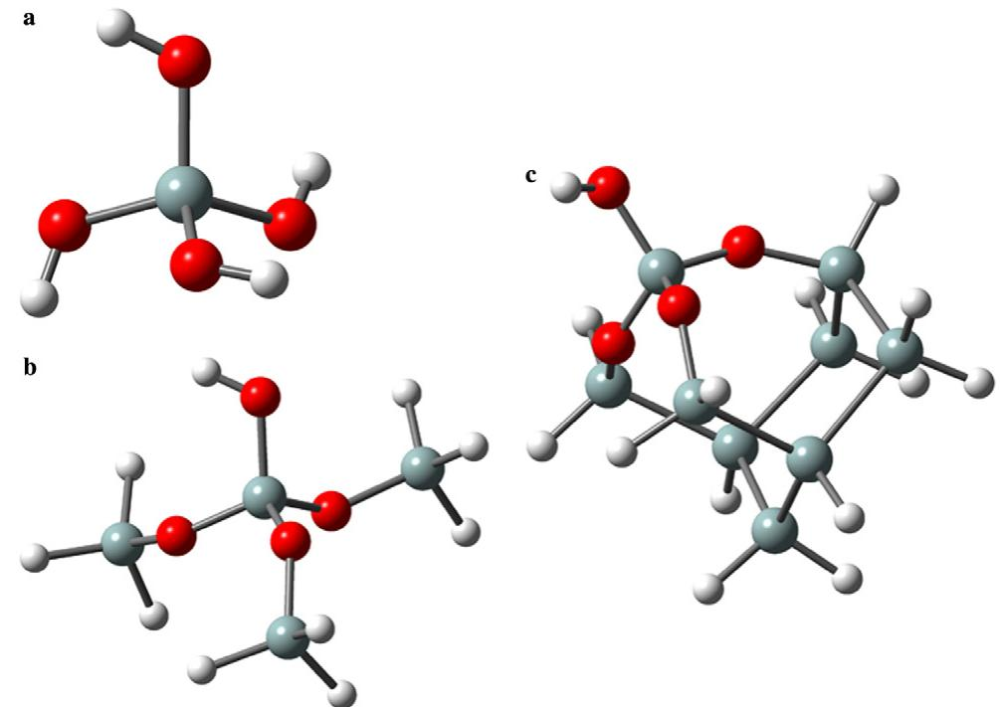
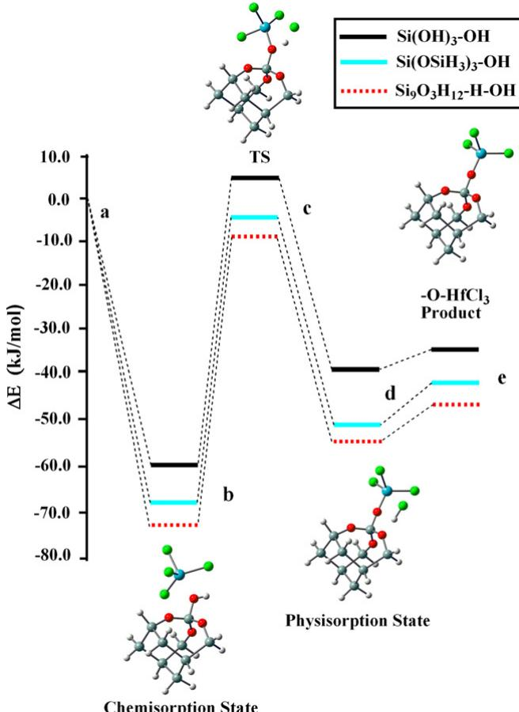
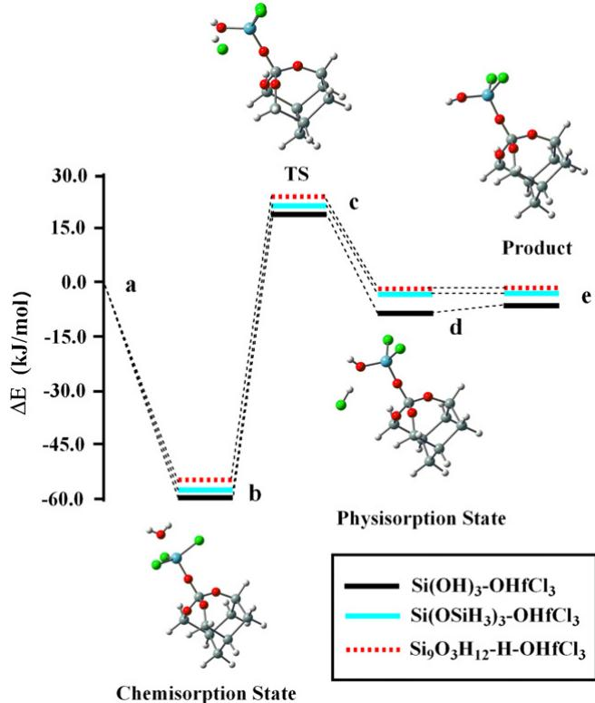
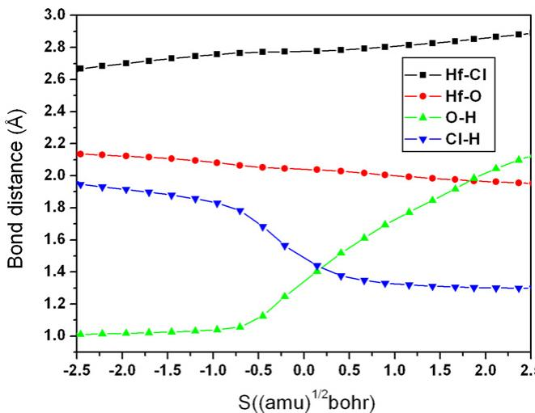

# Density functional theory study of initial stage of  $\mathrm{HfO_2}$  atomic layer deposition on hydroxylated  $\mathrm{SiO_2}$  surface

Jie Ren a,\*, Ya- Tong Zhang a, David Wei Zhang b,\*

a College of Science, Hebei University of Science and Technology, Shijiazhuang 050018, China b State Key Laboratory of ASIC and System, Department of Microelectronics, Fudan University, Shanghai 200433, China

Received 17 May 2006; received in revised form 19 September 2006; accepted 19 September 2006 Available online 29 September 2006

# Abstract

Density functional theory is employed to investigate atomic layer deposition (ALD) mechanism of  $\mathrm{HfO_2}$  on hydroxylated  $\mathrm{SiO_2}$  surface using  $\mathrm{HfCl_4}$  and  $\mathrm{H}_2\mathrm{O}$  as precursors. The ALD process involves two alternate deposition half- reactions: (1)  $\mathrm{HfCl_4}$  with the  $\mathrm{SiO_2 - OH^*}$  surface site, and (2)  $\mathrm{H}_2\mathrm{O}$  with the  $\mathrm{SiO_2 - O - HfCl^*}$  surface site. Combined potential energy surface and intrinsic reaction coordinate studies show that both the half- reactions proceed through an analogous trapping- mediated mechanism and a similar transition state. By comparison of the reaction energies of precursors on different size model surfaces, we find that the cluster size has a major effect on the  $\mathrm{HfCl_4}$  half- reaction, especially on the formation of  $\mathrm{HfCl_4}$  chemisorbed complex, as compared to the  $\mathrm{H}_2\mathrm{O}$  half- reaction. We also find that the intermediate stability is lowered as the surface temperature is raised, which in turn results in desorption increasing of adsorbed precursors.

$(\widehat{\Xi})$  2006 Elsevier B.V. All rights reserved.

Keywords: Density functional theory; Hafnium oxide; Atomic layer deposition; Dielectrics

# 1. Introduction

With the continued scaling of silicon complementary metal oxide semiconductor (CMOS), the traditional gate dielectric  $\mathrm{SiO_2}$  will reach its physical limitations where the leakage current through the insulator is a serious problem [1,2]. As a result, the replacement of  $\mathrm{SiO_2}$  by high-  $k$  oxide as gate dielectric is inevitable to increase capacitance density and suppress electron tunneling [3,4]. In particular,  $\mathrm{HfO_2}$  has recently emerged as one of the most promising alternative dielectric materials due to its relatively high permittivity and good thermal stability [3,5- 7].

Atomic layer deposition (ALD) technique shows its unique ability in depositing ultra thin films with excellent conformity and uniformity over large areas. Especially it is becoming a dominating deposition method for high-  $k$  gate dielectrics nowadays [8,9]. In ALD, each precursor is pulsed to the reaction chamber alternately, and the reaction between the incoming precursors and surface species is self- terminating. Thus atomic level control of film growth is achieved. ALD has been actively investigated for deposition of  $\mathrm{HfO_2}$  using  $\mathrm{HfCl_4}$  and  $\mathrm{H}_2\mathrm{O}$  as precursors [10,11].

Experimental results have shown that the starting silicon surface is critical in initiating growth and assuring uniformity for ALD grown high-  $k$  films. Also, the properties of the film strongly depended on the composition of the film in the interfacial region between the high-  $k$  oxide and the silicon substrate. For instance, an interfacial layer of  $\mathrm{SiO_2}$  only one or two molecular layers thick can benefit to channel mobility although the total capacitance is lowered compared to the pure  $\mathrm{HfO_2}$  [12- 14]. It is thus critical to understand the initial reactivity of each precursor on  $\mathrm{SiO_2}$  surface. Recently, certain first principle studies have started to focus on the initial growth mechanism of ALD of  $\mathrm{HfO_2}$  on  $\mathrm{SiO_2}$  surface. In particular, Esteve et al. [15]

and Jeloaica et al. [16] have studied the  $\mathrm{HfCl_4}$  initial reactions on  $\mathrm{SiO_2}$  surface using the transition state (TS) search algorithm of bond constraint relaxation (BCR). However, Han et al. [12] have referred that the BCR method is limited in nature due to its unable to fully explore the whole potential energy surface (PES) of the system to locate the TS. Although Han's studies [12] are on the reaction mechanism of ALD of  $\mathrm{ZrO_2}$ , the results can still be compared in our current work due to the similarity of  $\mathrm{HfO_2}$  and  $\mathrm{ZrO_2}$ . Although some first principle studies of ALD of  $\mathrm{HfO_2}$  on  $\mathrm{SiO_2}$  surface have been reported, to our knowledge, the thermochemistry and kinetics of  $\mathrm{SiO_2}$  surface reactions still need to be explored in detail, such as temperature and cluster size effects based on different basis sets and calculated methods. In addition, the PESs of the reactions of  $\mathrm{HfCl_4}$  and  $\mathrm{H_2O}$  on  $\mathrm{SiO_2}$  surface mentioned above have been explored only in stationary points. In our current study, the continued PES of the  $\mathrm{Si(OH)_3 - OH}$  surface reaction will be described using the intrinsic reaction coordinate (IRC) method [17], which can confirm the correct TS connecting reactants to products. In addition, to ensure that the TS of the larger clusters  $\mathrm{Si(OSiH_3)_3 - OH}$  and  $\mathrm{Si_9O_3H_{12} - H - OH}$  are not artificial, the vibrational mode corresponding to the only imaginary frequency and the selected bond lengths closely related to the TS will be compared with those obtained using the small cluster  $\mathrm{Si(OH)_3 - OH}$ .

In this study, the detailed initial reaction mechanism of  $\mathrm{HfO_2}$  on hydroxylated  $\mathrm{SiO_2}$  surface by ALD using  $\mathrm{HfCl_4}$  and  $\mathrm{H_2O}$  precursors will be intensively studied. The ALD of  $\mathrm{HfO_2}$  cycle is achieved through two sequential half- reac tions, i.e.  $\mathrm{HfCl_4}$  and  $\mathrm{H}_2\mathrm{O}$  half- reactions. The reaction sequence explored in this study is described as:

$$
\mathrm{SiO}_2\mathrm{-OH}^* +\mathrm{HfCl}_4\longrightarrow \mathrm{SiO}_2\mathrm{-OHfCl}_3^* +\mathrm{HCl} \tag{R1}
$$

$$
\mathrm{SiO}_2\mathrm{-OHfCl}_3^* +\mathrm{H}_2\mathrm{O}\longrightarrow \mathrm{SiO}_2\mathrm{-O - HfCl}_2\mathrm{-OH}^* +\mathrm{HCl}
$$

where the asterisks denote the surface species. Reaction 1 belongs to the  $\mathrm{HfCl_4}$  half- reaction, representing the reaction of surface hydroxyl with the precursor  $\mathrm{HfCl_4}$  molecule, and reaction 2 belongs to the  $\mathrm{H}_2\mathrm{O}$  half- reaction, in which  $\mathrm{H}_2\mathrm{O}$  reacts with the surface hafnium species.

# 2. Computational models and methods

To investigate the ALD of  $\mathrm{HfO_2}$  on  $\mathrm{SiO_2}$  surface, three different size model clusters, i.e.  $\mathrm{Si(OH)_3 - OH}$ ,  $\mathrm{Si(OSiH_3)_3 - OH}$  and  $\mathrm{Si_9O_3H_{12} - H - OH}$  clusters (Figs. 1a and c), are employed, in which the central silicon atom has one OH surface active site and bonds with three oxygen atoms. The smallest cluster  $\mathrm{Si(OH)_3 - OH}$  is used to explore the reaction mechanism of  $\mathrm{HfCl_4}$  and  $\mathrm{H}_2\mathrm{O}$  adsorption and decomposition on  $\mathrm{SiO_2}$  surface in order to minimize the expensive time- consuming for IRC method. The largest cluster  $\mathrm{Si_9O_3H_{12} - H - OH}$  is modeled by a  $\mathrm{Si_9H_{12}}$  one- dimer cluster authorizing the presence of a single surface dimer unit to account for the  $\mathrm{Si(100) - 2\times 1}$  reconstruction. The  $\mathrm{Si_9H_{12}}$  one- dimer cluster consists of four layer silicon atoms where the top two silicon atoms compose the surface dimer. The remaining seven silicon atoms compose three subsur

  
Fig. 1. The models (a)  $\mathrm{Si(OH)_3 - OH}$ , (b)  $\mathrm{Si(OSiH_3)_3 - OH}$  and (c)  $\mathrm{Si_9O_3H_{12} - H - OH}$ , representing  $\mathrm{SiO_2}$  surface. Oxygen atoms are red, silicon atoms are grey and hydrogen atoms are light grey. (For interpretation of the references to color in this figure legend, the reader is referred to the web version of this paper.)

face layers that are hydrogen terminated to prevent unrealistic charge transfer. Three oxygen atoms are systematically introduced within Si- Si bonds at the surface and upper subsurface in  $\mathrm{Si_9O_3H_{12} - H - OH}$  cluster. The structures of these model clusters will be fully optimized in all calculations.

The hybrid B3LYP method, as implemented in GAUSSIAN 03 [18], has been employed in all calculations, incorporating Becke's three parameter exchange functional [19,20] and the Lee- Yang- Parr gradient- corrected functional [21]. A mixed basis set scheme is used to minimizing the computational time. The LANL2DZ basis set and effective core potential for hafnium atom and a diffuse double- zeta plus polarization  $6 - 31 + \mathrm{G(d)}$  basis set for the chemically active atoms, i.e. the central surface silicon and oxygen atoms as well as all the atoms of the precursors  $\mathrm{HfCl_4}$  and  $\mathrm{H}_2\mathrm{O}$  and 6- 31G basis set for the other silicon and terminated  $\mathrm{H}$  atoms are used in every calculation. The geometry is optimized by finding stationary points followed by frequency calculations needed to verify the nature of the stationary points on the PES, including energy minima (all positive frequencies) and transition states (one imaginary frequency).

# 3. Results and discussion

# 3.1. Reaction path for the adsorption and decomposition of  $HfCl_4$  on  $SiO_2 - OH$  surface (R1)

The PES of the reaction of  $\mathrm{HfCl_4}$  with  $\mathrm{Si_9O_3H_{12} - H - }$ $\mathrm{OH^{*}}$  surface site is shown in Fig. 2 and the corresponding energy values are given in Table 1. As can be seen in Fig. 2.  $\mathrm{HfCl_4}$  first adsorbs molecularly onto the  $\mathrm{Si - OH^{*}}$  surface site to form a stable chemisorbed complex with an adsorbed energy of  $73.1\mathrm{kJ / mol}$  .Widjaja et al. [22] have suggested that a similar complex  $\mathrm{HfCl_4(a)}$  is formed through the interaction between the oxygen lone- pair electrons coming from the surface hydroxyl group and an empty d- orbital of the hafnium atom. Next, the reaction proceeds through a four- center TS, then one chlorine atom of the adsorbed  $\mathrm{HfCl_4}$  recombines with the hydrogen atom of the surface OH group to form HCl, and then the gaseous HCl desorbs. The activation barrier for the HCl formation is  $64.2\mathrm{kJ / mol}$  relative to the chemisorbed complex  $\mathrm{HfCl_4(a)}$  . A stable physisorbed HCl with a desorption energy of  $10.5\mathrm{kJ / mol}$  uphill relative to the physisorbed state has been found due to the hydrogen bonding interaction between hydrogen atom of HCl and the neighboring bridged oxygen atom of the  $- \mathrm{Si - O - Si - }$  species, denoted by  $\mathrm{O}\dots \mathrm{H - Cl}$  R1).The distance of  $\mathrm{O}\dots \mathrm{H}$  is  $1.68\mathrm{\AA}$  ,which is within effective hydrogen bonding interaction distance, and the bond length of  $\mathrm{H - Cl}$  is  $1.34\mathrm{\AA}$  , which is slightly lengthened as compared to the isolated HCl molecule  $(1.29\mathrm{\AA})$  . This suggests that in the actual experiments the bridged oxygen atoms can effectively adsorb the by- product HCl and make the remove of HCl more difficult. In addition, calculations show that the initial  $\mathrm{HfCl_4}$  half- reaction is energetically favorable, having a lower activation barrier for dissociation than that for desorption. Thus the reaction tends to move toward the product rather than to be trapped in  $\mathrm{HfCl_4(a)}$  adsorbed state.

  
Fig. 2. Reaction path and predicted energetics for reactions of  $\mathrm{HfCl_4}$  on the  $\mathrm{Si(OH)_3 - OH}$ $\mathrm{Si(OSiH_3)_3 - OH}$  and  $\mathrm{Si_9O_3H_{12} - H - OH}$  surface sites. The corresponding energy values are also listed in Table 1.

Table 1 Comparison of energetics (in  $\mathrm{kJ / mol}$  calculated at  $0\mathrm{K}$  using clusters of different sizes for the  $\mathrm{HfCl_4}$  and  $\mathrm{H}_2\mathrm{O}$  absorption and decomposition reactions  

<table><tr><td>Surface sites</td><td>Chemisorption state</td><td>TS</td><td>Physisorption state</td><td>Product</td></tr><tr><td>SiO2-OH* + HfCl4→ SiO2-OHfCl3* + HCl</td><td></td><td></td><td></td><td></td></tr><tr><td>Si(OH)3-OH*</td><td>-59.8</td><td>4.4</td><td>-38.5</td><td>-34.2</td></tr><tr><td>Si(OSiH3)3-OH*</td><td>-68.9</td><td>-8.4</td><td>-51.6</td><td>-42.3</td></tr><tr><td>SiO3H12-H-OH*</td><td>-73.1</td><td>-8.9</td><td>-56.0</td><td>-45.5</td></tr><tr><td>SiO2-OHfCl3* + H2O→ SiO2-OHfCl2-OH* + HCl</td><td></td><td></td><td></td><td></td></tr><tr><td>Si(OH)3-OHfCl3*</td><td>-58.8</td><td>19.9</td><td>-9.7</td><td>-4.9</td></tr><tr><td>Si(OSiH3)3-OHfCl3*</td><td>-56.9</td><td>22.3</td><td>-1.2</td><td>-1.0</td></tr><tr><td>SiO3H12-H-OHfCl3*</td><td>-54.6</td><td>24.3</td><td>-1.9</td><td>-0.7</td></tr></table>

All the energies are relative to the sum of the reactants energies.

# 3.2. Reaction paths for the adsorption and decomposition of  $H_{2}O$  on  $SiO_2 - OHfCl_3$  surface (R2)

The PES of the reaction of  $\mathrm{H}_2\mathrm{O}$  with  $\mathrm{Si_9O_3H_{12} - }$ $\mathrm{H - OHfCl_3^*}$  surface site is illustrated in Fig. 3.  $\mathrm{Si_9O_3H_{12} - }$ $\mathrm{H - OHfCl_3^*}$  denotes the product of  $\mathrm{HfCl_4}$  adsorption and

  
Fig. 3. Reaction path and predicted energetics for reactions of  $\mathrm{H}_2\mathrm{O}$  on the  $\mathrm{Si(OH)_3 - OHfCl_3}$ ,  $\mathrm{Si(OSiH_3)_3 - OHfCl_3}$  and  $\mathrm{Si_9O_3H_{12} - H - OHfCl_3}$  surface sites. The corresponding energy values are also listed in Table 1.

decomposition on the  $\mathrm{Si_9O_3H_{12} - H - OH^*}$  surface. The  $\mathrm{H}_2\mathrm{O}$  half- reaction follows a similar trapping- mediated pathway as the reaction of  $\mathrm{HfCl_4}$  on  $\mathrm{Si_9O_3H_{12} - H - OH^*}$  surface site. Gaseous  $\mathrm{H}_2\mathrm{O}$  exposes on the surface sites and forms a stable chemisorbed complex exothermically by  $54.6\mathrm{kJ / mol}$  (Table 1). Similar to the  $\mathrm{HfCl_4(a)}$  chemisorbed complex in the  $\mathrm{HfCl_4}$  half- reaction, the  $\mathrm{H}_2\mathrm{O(a)}$  chemisorbed complex is also formed owing to the donation of the oxygen lone- pair electrons of  $\mathrm{H}_2\mathrm{O}$  into an empty d- orbital of the hafnium atom. It should be noted that for the  $\mathrm{HfCl_4}$  and  $\mathrm{H}_2\mathrm{O}$  half- reactions, the lone- pair electrons come from the oxygen atoms of the  $\mathrm{Si - OH^*}$  surface site and  $\mathrm{H}_2\mathrm{O}$  precursor molecule, and the hafnium empty d- orbitals come from the  $\mathrm{HfCl_4}$  precursor molecule and  $\mathrm{Si - OHfCl_3^*}$  surface site, respectively.  $\mathrm{HCl}$  is then formed through the recombination of the hydrogen atom of  $\mathrm{H}_2\mathrm{O}$  and the neighboring chlorine atom of  $\mathrm{Si - OHfCl_3}$  group. Relative to  $\mathrm{H}_2\mathrm{O(a)}$  chemisorbed complex, the activation barrier for  $\mathrm{HCl}$  formation is  $78.9\mathrm{kJ / mol}$ . Similarly, a weak physisorbed complex  $\mathrm{HCl(a)}$  with a desorption energy of  $1.2\mathrm{kJ / mol}$  uphill relative to the physisorbed state has also been found in the  $\mathrm{H}_2\mathrm{O}$  half- reaction. The physisorbed complex  $\mathrm{HCl(a)}$  is also due to the hydrogen bonding interaction, denoted by  $\mathrm{O\cdot\cdot H - Cl}$  (R2). The distance of  $\mathrm{O\cdot\cdot H}$ $(1.87\mathrm{\AA})$  is longer and the bond length of  $\mathrm{H - Cl}$ $(1.31\mathrm{\AA})$  is shorter than those in  $\mathrm{O\cdot\cdot H - Cl}$  (R1), which suggests that the physisorption of  $\mathrm{HCl}$  molecule in  $\mathrm{H}_2\mathrm{O}$  half- reaction (R2) is weaker than that in  $\mathrm{HfCl_4}$  half- reaction (R1). Finally, the reaction is overall weakly exothermic by  $0.7\mathrm{kJ / mol}$ .

# 3.3. Cluster size effects

Compared with the reaction of  $\mathrm{HfCl_4}$  with  $\mathrm{Si_9O_3H_{12} - H - OH^*}$  surface site in  $\mathrm{HfCl_4}$  half- reaction, the reactions of  $\mathrm{HfCl_4}$  with  $\mathrm{Si(OH)_3 - OH^*}$  and  $\mathrm{Si(OSiH_3)_3 - OH^*}$  surface sites resulted in a 4.2 and  $15.1\mathrm{kJ / mol}$  lower formation energy for the  $\mathrm{HfCl_4(a)}$  chemisorbed complex, a 0.3 and  $- 1.8\mathrm{kJ / mol}$  higher activation barrier relative to  $\mathrm{HfCl_4(a)}$  chemisorbed state for the TS, and a 3.2 and  $13.2\mathrm{kJ / mol}$  lower overall reaction energies, respectively (Table 1). The three initial  $\mathrm{HfCl_4}$  half- reaction are all energetically favorable, having lower activation barrier for dissociation on hydroxylated  $\mathrm{SiO_2}$  surface. And compared to the reaction of  $\mathrm{H}_2\mathrm{O}$  with  $\mathrm{Si_9O_3H_{12} - H - OHfCl_3^*}$  site in  $\mathrm{H}_2\mathrm{O}$  half- reaction, the reactions of  $\mathrm{H}_2\mathrm{O}$  with  $\mathrm{Si(OH)_3 - OHfCl_3^*}$  and  $\mathrm{Si(OSiH_3)_3 - OHfCl_3^*}$  sites resulted in a 2.3 and  $4.2\mathrm{kJ / mol}$  higher formation energy for the  $\mathrm{H}_2\mathrm{O(a)}$  absorbed complex, a 0.3 and  $- 0.3\mathrm{kJ / mol}$  higher activation barrier relative to  $\mathrm{H}_2\mathrm{O(a)}$  chemisorbed state for the TS, and a 0.3 and  $4.2\mathrm{kJ / mol}$  higher overall reaction energies, respectively. We find that both  $\mathrm{HfCl_4}$  and  $\mathrm{H}_2\mathrm{O}$  half- reactions based on the middle size cluster  $\mathrm{Si(OSiH_3)_3 - OH}$  and the large size cluster  $\mathrm{Si_9O_3H_{12} - H - OH}$  show small difference in energies, which is not enough to alter the growth rate. And for the small size cluster  $\mathrm{Si(OH)_3 - OH}$ , it shows obvious difference for  $\mathrm{HfCl_4}$  half- reaction and small difference for  $\mathrm{H}_2\mathrm{O}$  half- reaction in energies. In other words, the cluster size effects are slightly stronger for the  $\mathrm{HfCl_4}$  half- reaction than those for the  $\mathrm{H}_2\mathrm{O}$  half- reaction, especially for the formation of the chemisorbed intermediate complex. The weak cluster size effects in the  $\mathrm{H}_2\mathrm{O}$  half- reaction can be explained: the first hafnium monolayer resulting from the deposited  $\mathrm{HfCl_4}$  prevents the incoming  $\mathrm{H}_2\mathrm{O}$  from interacting with the  $\mathrm{SiO_2}$  surface. Despite the obvious cluster size effects for the half- reaction of  $\mathrm{HfCl_4}$  with  $\mathrm{Si(OH)_3 - OH^*}$  site, the shape of PES of the  $\mathrm{Si(OH)_3 - OH}$  surface reaction is qualitatively similar to those of the  $\mathrm{Si(OSiH_3)_3 - OH}$  and  $\mathrm{Si_9O_3H_{12} - H - OH}$  surface reactions (Fig. 2), which indicates that all the three surface reactions proceed through an analogous trapping- mediated mechanism. Therefore, the small cluster model  $\mathrm{Si(OH)_3 - OH}$  is employed to investigate qualitatively the selected bond lengths variation along IRC in order to minimize the computational time.

# 3.4. Selected bond lengths variation along IRC

It is well known that the IRC, the steepest descent path from the TS, is generally used to assess which TS connects reactants to products. However, IRC is very computationally demanding, so the small cluster model  $\mathrm{Si(OH)_3 - OH}$  is employed to describe the  $\mathrm{HCl}$  elimination path of  $\mathrm{HfCl_4(a)}$  and  $\mathrm{H}_2\mathrm{O(a)}$  chemisorbed complexes in detail. Because the small size may affect the quality of the results, the calculated

results are compared to those obtained using the middle- size  $\mathrm{Si(OSiH_3)_3 - OH}$  cluster and the large- size  $\mathrm{Si_9O_3H_{12} - }$ $\mathrm{H - OH}$  cluster. For the three TSs, i.e.  $\mathrm{Si(OH)_3 - OH - HfCl_4}$  (S),  $\mathrm{Si(OSiH_3)_3 - OH - HfCl_4(M)}$  and  $\mathrm{Si_9O_3H_{12} - OH - }$ $\mathrm{HfCl_4(L)}$  , the optimized structural parameters closely related to the four center TS show so much similarity, which has been compared as followed: Hf- O, Hf- Cl, Cl- H, O- H bond distances  $(\mathring{\mathrm{A}})$  :2.04(S)/2.02(M)/2.03(L),2.78(S)/  $2.84(\mathrm{M}) / 2.82(\mathrm{L})$  1.48(S)/1.48(M)/1.48(L) and 1.35(S)/  $1.34(\mathrm{M}) / 1.34(\mathrm{L})$ $\angle \mathrm{Hf - O - H}$ $\angle \mathrm{O - Hf - Cl}$ $\angle \mathrm{Hf - Cl - H}$ $\angle \mathrm{Cl - H - O}$  bond angles  $(^{\circ})$  :89.6(S)/90.3(M)/90.7(L),  $65.7(\mathrm{S}) / 64.8(\mathrm{M}) / 64.9(\mathrm{L})$  61.3(S)/58.7(M)/60.3(L) and  $143.4(\mathrm{S}) / 146.1(\mathrm{M}) / 144.1(\mathrm{L})$  . In addition, the imaginary frequencies related to three TSs all correspond to the  $\mathrm{O - H}$  stretch vibration. Therefore, the  $\mathrm{Si(OH)_3 - OH}$  can qualitatively be used to simulate  $\mathrm{SiO_2}$  surface and study the reaction pathway using IRC method. It should be noted that recently Han [12] have obtained the reasonable calculated results of ALD of  $\mathrm{ZrO_2}$  on  $\mathrm{SiO_2}$  surface based on  $\mathrm{Si(OH_3) - OH}$  small model.

Along the IRC for the elimination of HCl from  $\mathrm{Si(OH)_3 - OH - HfCl_4}$  complex, a plot of the changes in selected bond lengths close related to TS structure is shown in Fig. 4. In this work, the minimum energy paths were calculated using IRC method in mass- weighted cartesian coordinates with a step size of 0.05 (amu) $^{1 / 2}$  bohr. The mass weighted distance along the reaction coordinate is denoted  $S$ , in which the TS located at  $S = 0$  (amu) $^{1 / 2}$  bohr. In the course of the reaction, the breaking Hf- Cl and O- H bond lengths gradually increase, while the Hf- O and Cl- H bond distances of  $\mathrm{Si(OH)_3 - OH - HfCl_4}$  complex slowly shorten. Obviously, the Hf- Cl and Hf- O bond lengths are changed slightly compared with the O- H and Cl- H bond distances during the reaction process. As can be seen in Fig. 4, after  $S = - 1.0$  (amu) $^{1 / 2}$  bohr, the O- H bond, which up to this point is stretched little from the $\mathrm{Si(OH)_3 - OH - HfCl_4}$  complex, begins to lengthen considerably, while the Cl- H distance, shows an equally steep decrease until the HCl molecule is fully formed. In addition, the similar selected bond lengths variations along IRC of the decomposition of  $\mathrm{SiH_3 - OHfCl_3 - H_2O}$  complex have also been achieved for the  $\mathrm{H}_2\mathrm{O}$  half- reaction. The plot is qualitatively similar to that of the  $\mathrm{HfCl_4}$  half- reaction, which indicates that both the  $\mathrm{HfCl_4}$  and the  $\mathrm{H}_2\mathrm{O}$  half- reactions proceed through a similar four- center TS and an analogous reaction mechanism. It should be emphasized that the oxygen and hydrogen atoms composed of the four center TS come from the surface hydroxyl and  $\mathrm{H}_2\mathrm{O}$  precursor molecule for the  $\mathrm{HfCl_4}$  and  $\mathrm{H}_2\mathrm{O}$  half- reactions, respectively.

  
Fig. 4. Plot of the changes in selected bond lengths and distances (Hf-Cl, Hf-O, O-H and Cl-H) along the calculated IRC for the elimination of HCl from  $\mathrm{Si(OH)_3 - OH - HfCl_4}$  complex. The adsorbed complex is on the left, products are on the right, and the TS is set to  $S = 0$  amu $^{1 / 2}$  bohr.

# 3.5. Temperature effects

The thermal energies  $(\Delta E)$  of the stationary points relative to the sum of the energies of the reactants for  $\mathrm{HfCl_4}$  and  $\mathrm{H}_2\mathrm{O}$  half- reaction on the  $\mathrm{Si_9O_3H_{12} - H - OH}$  surface at 298, 400 and  $600~\mathrm{K}$  are given in Table 2. As can be seen in Table 2, the thermal energies of the  $\mathrm{HfCl_4(a)}$  and  $\mathrm{H}_2\mathrm{O(a)}$  chemisorbed complexes and the TS for dissociation increase with temperature being raised, which results in the instability of the  $\mathrm{HfCl_4(a)}$  and  $\mathrm{H}_2\mathrm{O(a)}$  intermediate complexes. As a result, the residual reactants and by- products HCl will possibly be removed at a higher temperature, which has been confirmed in the related experiments [23- 25]. For example, the experiment [25] has showed that the content of residual hydrogen and chlorine monotonously decreased with increasing growth temperature.

The chemisorption energies at these temperatures are negative with respect to the initial reactants. The activation barriers for the dissociation of chemisorbed  $\mathrm{HfCl_4(a)}$  are always below the entrance channel from 298 to  $600~\mathrm{K}$ . Hence, with raising the growth temperature it will be more kinetically favorable for the  $\mathrm{HfCl_4(a)}$  adsorbed complexes to dissociate rather than to desorb. On the contrary, the activation barriers for the dissociation of chemisorbed  $\mathrm{H}_2\mathrm{O(a)}$  are always above the entrance channel from 298

Table 2 Predicted thermal energies (in  $\mathrm{kJ / mol}$  for the adsorption and decomposition of  $\mathrm{HfCl_4}$  and  $\mathrm{H}_2\mathrm{O}$  on  $\mathrm{Si_9O_3H_{12} - H - OH^*}$  surface site, representing  $\mathrm{SiO_2}$  surfaces, calculated at different temperatures (in Kelvin)  

<table><tr><td></td><td>Chemisorption state</td><td>TS</td><td>Physisorption state</td><td>Product</td></tr><tr><td>SiO2-OH* + HfCl4→ SiO2-OHfCl4* + HCl</td><td></td><td></td><td></td><td></td></tr><tr><td>ΔE298</td><td>-69.1</td><td>-5.7</td><td>-51.8</td><td>-41.1</td></tr><tr><td>ΔE400</td><td>-66.8</td><td>-4.2</td><td>-49.6</td><td>-40.2</td></tr><tr><td>ΔE600</td><td>-62.2</td><td>-0.6</td><td>-45.0</td><td>-38.9</td></tr><tr><td>SiO2-OHfCl4* + H2O→ SiO2-O-HfCl4-OH* + HCl</td><td></td><td></td><td></td><td></td></tr><tr><td>ΔE298</td><td>-54.5</td><td>22.6</td><td>-0.9</td><td>-0.2</td></tr><tr><td>ΔE400</td><td>-52.6</td><td>23.8</td><td>1.2</td><td>0.7</td></tr><tr><td>ΔE600</td><td>-48.3</td><td>27.2</td><td>6.3</td><td>2.4</td></tr></table>

Energies are relative to the sum of the reactants energies and include zeropoint energy corrections.

to  $600~\mathrm{K}$ . This indicates that the  $\mathrm{H}_2\mathrm{O}(\mathrm{a})$  chemisorbed complexes tends to be desorb molecularly rather than to dissociated to the corresponding products. However, lower temperatures will lead to the process rates kinetically limited and is unfavorable for removal of by- product  $\mathrm{HCl}$ . Therefore, a suitable surface reaction temperature should be found to drive the adsorbed complex towards dissociation and reach a maximum film growth rate.

# 4. Conclusion

We have investigated theoretically the initial step of ALD of  $\mathrm{HfO}_2$  on the hydroxylated  $\mathrm{SiO}_2$  surfaces by using  $\mathrm{HfCl}_4$  and  $\mathrm{H}_2\mathrm{O}$  as precursors. Both  $\mathrm{HfCl}_4$  and  $\mathrm{H}_2\mathrm{O}$  half- reactions proceed through an analogous trapping- mediated mechanism, where the precursors  $\mathrm{HfCl}_4$  and  $\mathrm{H}_2\mathrm{O}$  are adsorbed directly on the  $\mathrm{SiO}_2$  surface sites to form a stable chemisorbed complex. The IRC studies also show that both  $\mathrm{HfCl}_4$  and  $\mathrm{H}_2\mathrm{O}$  half- reactions follow a similar TS and reaction pathway. By comparison of the reaction energies of precursors on different size model surfaces, we find that the cluster size has a major effect on the  $\mathrm{HfCl}_4$  half- reaction, especially on the formation of  $\mathrm{HfCl}_4$  complex as compared to the  $\mathrm{H}_2\mathrm{O}$  half- reaction. In addition, we find that the adsorbed intermediate stability is lowered as the surface temperature is raised, which in turn results in increased desorption of adsorbed precursors.

# Acknowledgements

This work is supported by the Science Foundation of Hebei University of Science and Technology (No. XL2005042), the China Postdoctoral Science Foundation (No. 2004035450), and Science and Technology Committee of Shanghai under Grant No. 04JC14013.

# References

[1] D.A. Muller, T. Sorsch, S. Moccio, F.H. Baumann, K. Evans- Lutterodt, G. Timp, Nature (London) 399 (1999) 758. [2] P.A. Packan, Science 285 (1999) 2079. [3] G.D. Wilk, R.M. Wallace, J.M. Anthony, J. Appl. Phys. 89 (2001) 5243. [4] E.P. Gusev, C. Cabral, M. Copel, C. D'Emic, M. Gribelyuk, Microelectron. Eng. 69 (2003) 145.

[5] M. Gutowski, J.E. Jaffe, C.L. Liu, M. Stoker, R.I. Hedge, R.S. Rai, P.J. Tobin, Appl. Phys. Lett. 80 (2002) 1897. [6] M.- H. Cho, Y.S. Roh, C.N. Whang, K. Jeong, S.W. Nahm, D.- H. Ko, J.H. Lee, N.I. Lee, K. Fujihara, Appl. Phys. Lett. 81 (2002) 472. [7] B.H. Lee, L. Kang, R. Nieh, W.J. Qi, J.C. Lee, Appl. Phys. Lett. 76 (2000) 1926. [8] M. Ritala, M. Leskelä, in: H.S. Nalwa (Ed.), Handbook of Thin Film Materials, vol. 1, Academic Press, San Diego, 2002, p. 103. [9] M. Leskelä, M. Ritala, Angew. Chem. Int. Ed. 42 (2003) 5548. [10] K. Kukli, J. Ihanus, M. Ritala, M. Leskelä, Appl. Phys. Lett. 68 (1996) 3737. [11] J. Aarik, A. Aidla, A.A. Kisler, T. Uustare, V. Sammelselg, Thin Solid Films 340 (1999) 110. [12] J.H. Han, G. Gao, Y. Widjaja, E. Garfunkel, C.B. Musgrave, Surf. Sci. 550 (2004) 199. [13] M. Ritala, K. Kukli, A. Rahtu, P.I. Raisanen, M. Leskelä, T. Sajavaara, J. Keinonen, Science 288 (2000) 319. [14] H.B. Park, M.J. Cho, J. Park, S.W. Lee, C.S. Hwang, J.P. Kim, J.H. Lee, N.I. Lee, H.K. Kang, J.C. Lee, S.J. Oh, J. Appl. Phys. 94 (2003) 3641. [15] A. Estève, M. Djafari Rouhani, L. Jeloaica, D. Estève, Comput. Mater. Sci. 27 (2003) 75. [16] L. Jeloaica, A. Estève, M. Djafari Rouhani, D. Estève, Appl. Phys. Lett. 83 (2003) 542. [17] C. Gonzalez, H.B. Schlegel, J. Chem. Phys. 90 (1989) 2154. [18] M.J. Frisch, G.W. Trucks, H.B. Schlegel, G.E. Scuseria, M.A. Robb, J.R. Cheeseman, J.A. Montgomery Jr., T. Vreven, K.N. Kudin, J.C. Burant, J.M. Millam, S.S. Iyengar, J. Tomasi, V. Barone, B. Mennucci, M. Cossi, G. Scalmani, N. Rega, G.A. Petersson, H. Nakatsuji, M. Hada, M. Ehara, K. Toyotai, R. Fukuda, J. Hasegawa, M. Ishida, T. Nakajima, Y. Honda, O. Kitao, H. Nakai, M. Klene, X. Li, J.E. Knox, H.P. Hratchian, J.B. Cross, C. Adamo, J. Jaramillo, R. Gomperts, R.E. Stratmann, O. Yazyev, A.J. Austin, R. Cammi, C. Pomelli, J.W. Ochterski, P.Y. Ayala, K. Morokuma, G.A. Voth, P. Salvador, J.J. Dannenberg, V.G. Zakrzewski, S. Dapprich, A.D. Daniels, M.C. Strain, O. Farkas, D.K. Malick, A.D. Rabuck, K. Raghavachari, J.B. Foresman, J.V. Ortiz, Q. Cui, A.G. Baboul, S. Clifford, J. Cioslowski, B.B. Stefanov, G. Liu, A. Liashenko, P. Piskorz, I. Komaromi, R.L. Martin, D.J. Fox, T. Kith, M.A. Al- Laham, C.Y. Peng, A. Nanayakkara, M. Challacombe, P.M.W. Gill, B. Johnson, W. Chen, M.W. Wong, C. Gonzalez, J.A. Pople, Gaussian 03; Gaussian, Inc., Pittsburgh, PA, 2003. [19] A.D. Becke, Phys. Rev. A 38 (1988) 3098. [20] A.D. Becke, J. Chem. Phys. 98 (1993) 5648. [21] C. Lee, W. Yang, R.G. Parr, Phys. Rev. B 37 (1988) 785. [22] Y. Widjaja, C.B. Musgrave, J. Chem. Phys. 117 (2002) 1931. [23] K. Kukli, M. Ritala, J. Aarik, T. Uustare, M. Leskelä, J. Appl. Phys. 92 (2002) 1833. [24] M. Ritala, M. Leskelä, L. Niinisto, T. Pohaska, G. Friedbacher, M. Grasserbauer, Thin Solid Films 250 (1994) 72. [25] K. Kukli, J. Aarik, M. Ritala, T. Uustare, J. Lu, J. Sundqvist, A. Aidla, L. Pung, A. Harsta, M. Leskelä, J. Appl. Phys. 96 (2004) 5298.