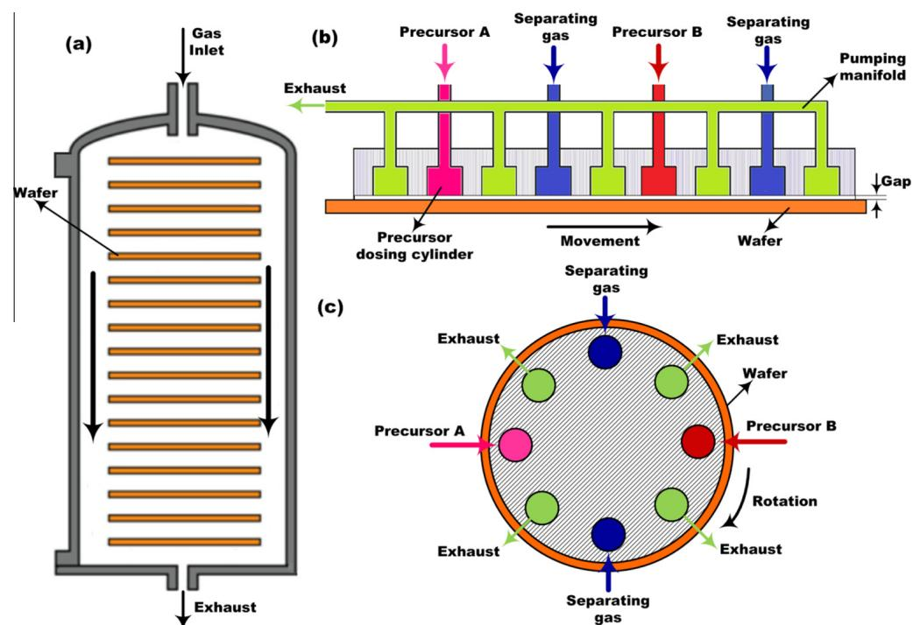
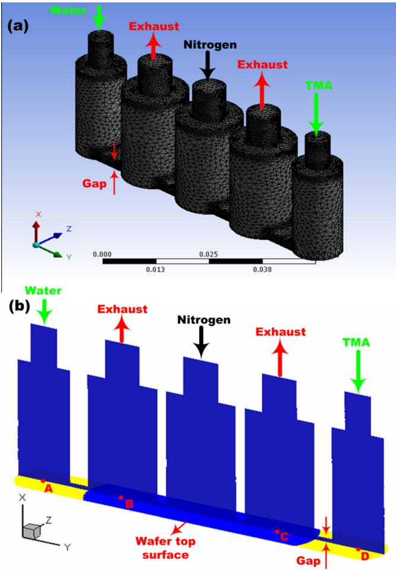
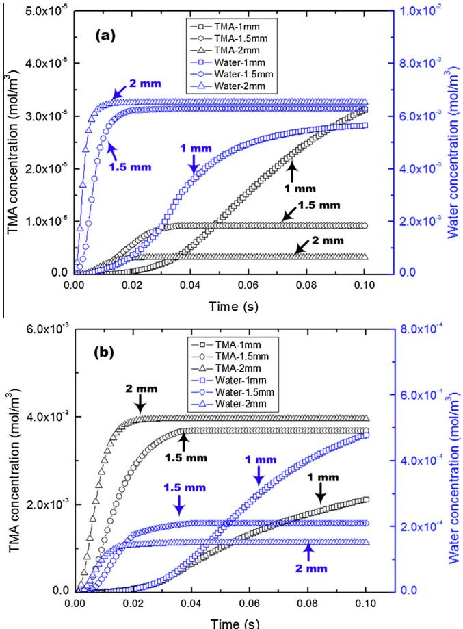
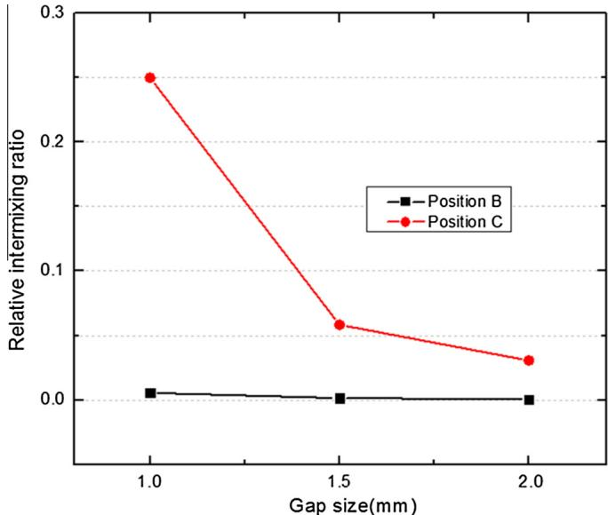
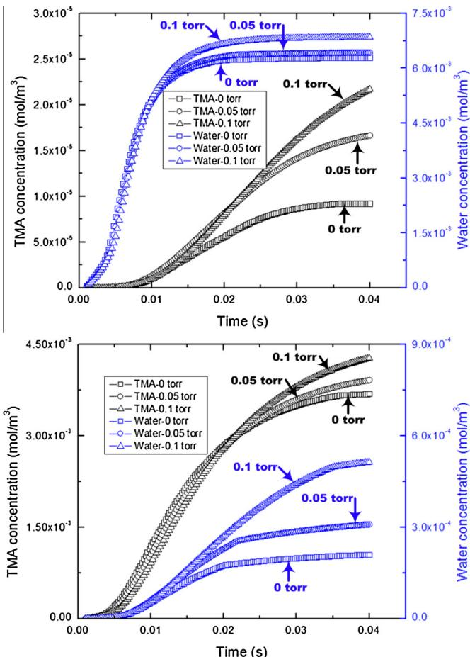
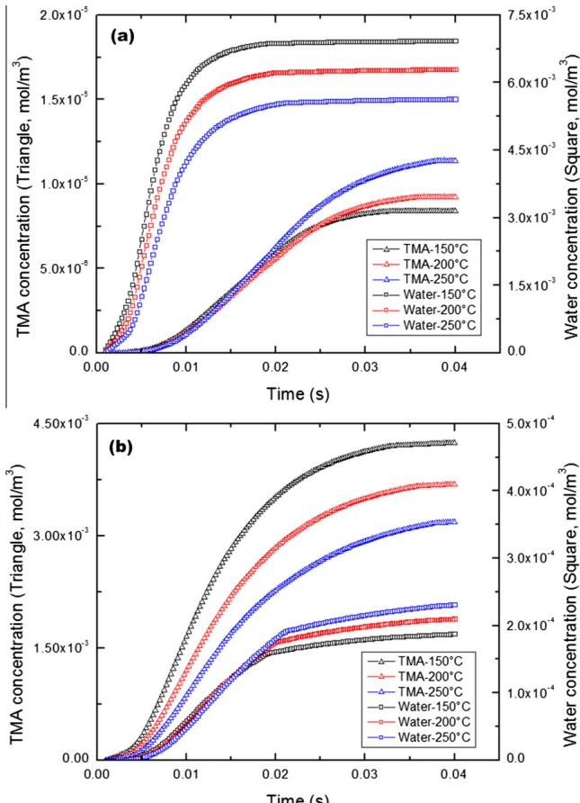
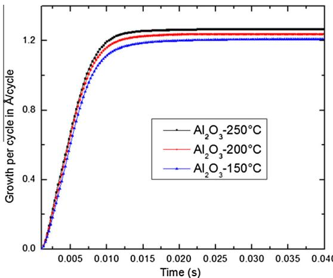
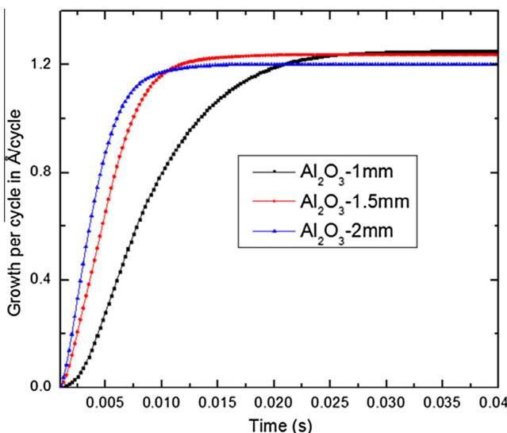
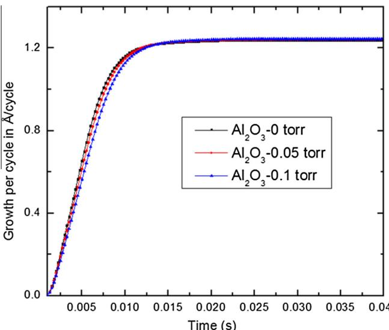
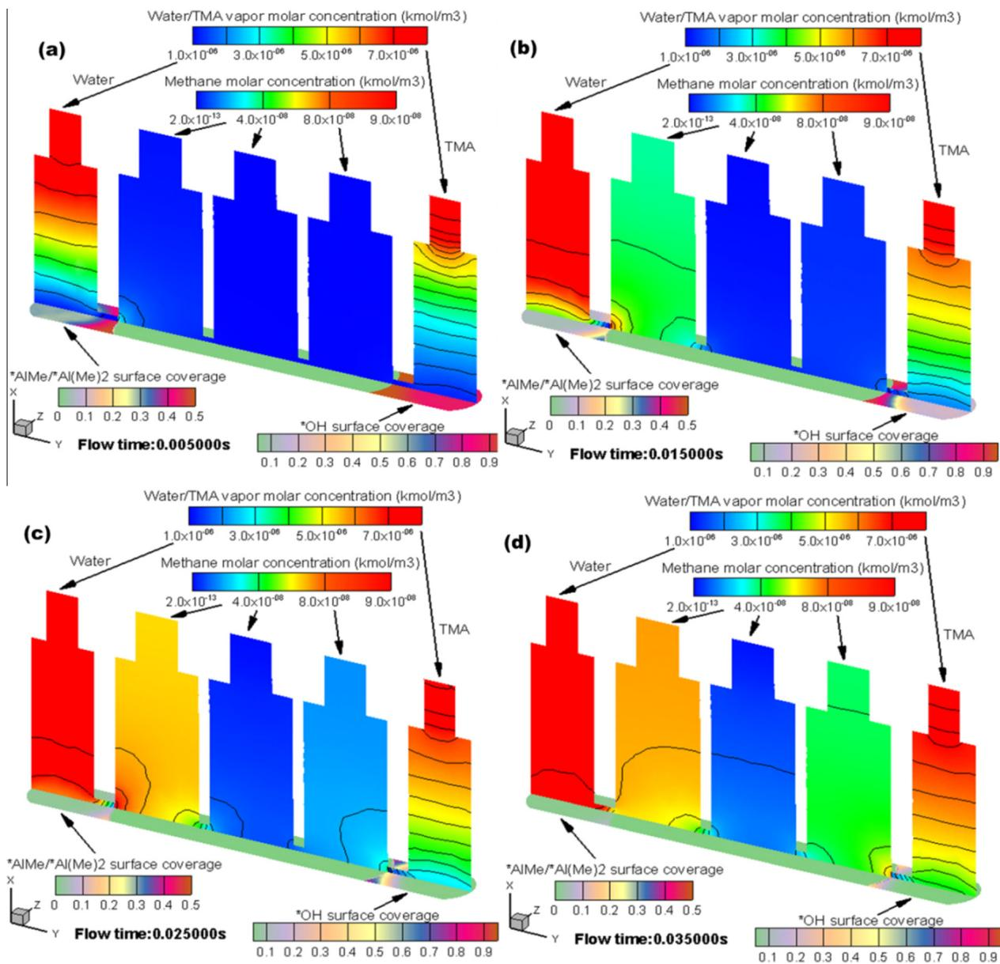

# Effects of gap size, temperature and pumping pressure on the fluid dynamics and chemical kinetics of in-line spatial atomic layer deposition of  $\mathrm{Al}_2\mathrm{O}_3$

Dongqing Pan $^{a}$ , Tien- Chien Jen $^{b}$ , Chris Yuan $^{a,*}$

$^{a}$  Department of Mechanical Engineering, University of Wisconsin- Milwaukee, Milwaukee, WI 53201, USA   $^{b}$  Department of Mechanical Engineering Science, University of Johannesburg, Auckland Park 2006, South Africa

# ARTICLE INFO

# ABSTRACT

Article history:  Received 30 July 2015  Received in revised form 29 November 2015  Accepted 11 January 2016  Available online 25 January 2016

Keywords:  In- line spatial ALD  Gap size  Temperature  Pumping pressure  Fluid dynamics  Chemical kinetics

Low throughput is a major limitation for industrial level atomic layer deposition (ALD) applications. Spatial ALD is regarded as a promising solution to this issue. With numerical simulations, this paper studies an in- line spatial ALD reactor by investigating the effects of gap size, temperature, and pumping pressure on the flow and surface chemical deposition processes in  $\mathrm{Al}_2\mathrm{O}_3$  ALD. The precursor intermixing is a critical issue in spatial ALD system design, and it is highly dependent on the flow and material distributions. By numerical studies, it's found that bigger gap, e.g.,  $2\mathrm{mm}$ , results in less precursor intermixing, but generates slightly lower saturated deposition rate. Wafer temperature is shown as a significant factor in both flow and surface deposition processes. Higher temperature accelerates the diffusive mass transport, which largely contributes to the precursor intermixing. On the other hand, higher temperature increases film deposition rate. Well- maintained pumping pressure is beneficial to decrease the precursor intermixing level, while its effect on the chemical process is shown very weak. It is revealed that the time scale of in- line spatial ALD cycle is in tens of milliseconds, i.e.,  $\sim 15\mathrm{ms}$ . Considering that the in- line spatial ALD is a continuous process without purging step, the ALD cycle time is greatly shortened, and the overall throughput is shown as high as  $\sim 4\mathrm{nm / s}$ , compared to several  $\mathrm{nm / min}$  in traditional ALD.

$\widehat{\Xi}$  2016 Elsevier Ltd. All rights reserved.

# 1. Introduction

Atomic layer deposition (ALD) is an approved nano- scale thin film fabrication technique with remarkable uniformity and conformity in surface geometry. Since the materials are deposited layer by layer in atomic level, ALD is an excellent technology to precisely control the thickness of deposited thin films [1,2]. However, this intrinsic superiority comes along with a serious limitation: low throughput, especially in the industrial level ALD applications [3,4]. The conventional single wafer ALD, for instance, can only achieve  $1.1 - 1.3\mathrm{\AA}$  cycle growth rate, that is a few nm per min for deposition of  $\mathrm{Al}_2\mathrm{O}_3$  [5]. This growth rate is considered too low [6].

Various solutions have been proposed to resolve this issue. It's widely accepted that scaling up to batch ALD with novel reactor design can improve the throughput dramatically [6]. As early as 1970s, for instance, flat panel displays were already fabricated through batch ALD reactors [3]. Fig. 1(a) shows a typical stack- type batch ALD reactor. Unlike single wafer ALD, batch ALD reactors allow multiple substrates to be processed simultaneously [7]. However, the scaling- up to batch ALD is not always straightforward. Because of the increased reactor chamber volume and the presence of multiple wafers, the gas flow field in batch ALD is altered by the stacks of wafers inside the chamber. As a result, mass transport process is decelerated, and consequently, precursor exposure and purging processes are much longer than single wafer ALD reactors [6]. This weakens the benefits of increased throughput brought by the batch configuration.

The multi- wafer batch ALD still adopts the original conventional ALD philosophy of separating the two half ALD reactions in time. Spatial ALD, however, as illustrated in Fig. 1(b), is totally based on a brand new concept [8]. In conventional ALD, the precursors are dosed one by one, and separated in time by a purging step, but with the spatial idea, the ALD surface reactions are separated in space other than in time, and precursors are dosed simultaneously and continuously with the relative movement of wafer belt [5]. Particularly, as shown in Fig. 1(b), the precursors are introduced at different positions on the wafer surface to enable the corresponding half ALD surface reactions. By introducing a pumping system and an inert separating gas, e.g., nitrogen or argon, the

# Nomenclature

$A$  pre- exponential factor in the Arrhenius equation  $b^{\prime}$  stoichiometric coefficient for reactant bulk species  $b^{\prime \prime}$  stoichiometric coefficient for product bulk species  $B$  bulk (solid) species  $C$  local molar fraction  $E$  total energy (J)  $E_{a}$  reaction activation energy  $(\mathbf{J}\mathbf{mol}^{- 1})$ $F$  external body forces (N)  $g^{\prime}$  stoichiometric coefficient for reactant gaseous species  $g^{\prime \prime}$  stoichiometric coefficient for product gaseous species  $G$  gaseous species  $h$  enthalpy  $(\mathrm{Jkg}^{- 1})$ $J_{m}$  mass diffusive flux  $(\mathrm{kg}\mathrm{m}^{- 2}\mathrm{s}^{- 1})$ $J_{h}$  energy diffusive flux  $(\mathrm{Wm}^{- 2})$ $k$  material thermal conductivity  $(\mathrm{Wm}^{- 1}\mathrm{K}^{- 1})$ $k_{f}$  rate constant of reaction  $r$ $M$  molecular weight  $(\mathrm{kgmol}^{- 1})$ $N_{b}$  total number of bulk species  $N_{g}$  total number of gaseous species  $N_{R}$  total number of surface reactions  $N_{s}$  total number of surface species  $P$  static pressure  $(\mathrm{Pa})$ $p$  boundary partial pressure  $(\mathrm{Pa})$ $p_0$  base pressure  $(\mathrm{Pa})$ $R$  the gas constant  $(\mathrm{Jmol}^{- 1}\mathrm{K}^{- 1})$ $R_{i}$  Arrhenius molar rate of production of the ith species  $(\mathrm{mol}\mathrm{m}^{- 3}\mathrm{s}^{- 1})$ $\hat{R}$  net rate of production of species by chemical reaction  $(\mathrm{mol}\mathrm{m}^{- 3}\mathrm{s}^{- 1})$

mass reaction rate  $(\mathrm{kg}\mathrm{m}^{- 3}\mathrm{s}^{- 1})$ $s^{\prime}$  stoichiometric coefficient for reactant surface species  $s^{\prime \prime}$  stoichiometric coefficient for product surface species  $s$  surface species  $t$  time (s)  $T$  temperature (K)  $V$  velocity  $(\mathrm{ms}^{- 1})$ $X$ $X$  direction in Cartesian coordinate  $Y$ $Y$  direction in Cartesian coordinate  $Z$ $Z$  direction in Cartesian coordinate

# Greek symbols

$\rho$  mixture density  $(\mathrm{kg}\mathrm{m}^{- 3})$ $\bar{\tau}$  stress tensor  $(\mathrm{Nm}^{- 2})$ $\beta$  temperature exponent in the Arrhenius equation

# Subscripts

$b$  bulk species  $g$  gaseous species  $i$  the ith species  $r$  the rth reaction  $s$  surface species  $W$  wall surfaces

Superscript surface site species

precursors and the reactions are separated in space. A complete full cycle of ALD is achieved by the relative movement of wafer belt. This continuous dosing process makes the spatial ALD system highly superior in film grow rate. It is demonstrated the spatial

ALD can achieve as high as a few nm/s deposition rate, compared to a few nm/min in the conventional ALD system [5,9].

Following the same idea, spatial ALD reactors have two variations in structure: in- line spatial ALD as illustrated in Fig. 1(b),

  
Fig. 1. (a) stack-type multi-wafer batch ALD reactor [7]; (b) in-line spatial ALD reactor [8,10]; and (c) rotary spatial ALD reactor.

and rotary spatial ALD in Fig. 1(c). A typical thermal spatial ALD system (in- line or rotary) includes a wafer belt driving system, a heating unit, an exhaust pumping system, and a gas delivery system, which consists of precursors and separating gas injecting pipelines, the precursor dosing cylinders, and separating gas injecting cylinders. The pumping system is to maintain a relatively low pressure  $(\sim 10^{- 1}$  torr) in the system, and to purge the residual gases. A gap must be kept between the gas cylinders and the wafer belt to allow gas flow development and the wafer- cylinder relative movement.

Choice of gap size is an critical issue in designing spatial ALD reactors, because inappropriate gap size may result in intermixture of precursor gases, and hence intermixing reactions [4]. To investigate the influence of the gap on the flow fields, Suh et al. performed gas flow simulations and  $\mathrm{Al}_2\mathrm{O}_3$  deposition experiments for a rotary spatial ALD reactor with a gap of  $5\mathrm{mm}$  [4]. Generally, too big gaps  $(>5\mathrm{mm})$  will inevitably cause precursor gases intermixing, whereas too smaller gaps  $(< 1\mathrm{mm})$  will hinder the gas flow, and thus the deposition process. Smaller gaps also pose a practical problem of wafer movement in massive production when the large wafer size and uneven wafer surfaces are considered [4].

Besides, the deposition process in a thermal spatial ALD system is also highly dependent on a variety of process factors, such as temperature, precursor surface concentration, system pressure, and the precursor exposure time [5]. Since the chemical kinetic information involved in the ALD deposition process is highly temperature- dependent, the deposition rate is largely affected by the deposition temperature [11]. Precursor concentration on the wafer surface is determined by the mass flow field, which is influenced by the precursor and pumping pressures, and the gap size as well. The exposure time is determined by the configuration of spatial ALD reactors (e.g., size of dosing cylinders, gap size, etc.) and the relative movement speed of the wafer belt.

Due to the above complexity, studying these influential factors is crucial in designing spatial ALD systems, not only avoiding unnecessary long cycle time but also the non- uniform depositions due to the fluctuations in deposition temperature, gas flows and exposure times [5]. Poodt et al. carried an experimental study on the chemical kinetics of depositing  $\mathrm{Al}_2\mathrm{O}_3$  in a rotary spatial ALD system at atmospheric pressure [5]. The effects of deposition temperature, precursor pressures, and precursor exposure times were investigated and discussed for a rotary spatial ALD system in this cited work. As an important factor in gas flow development and deposition process, the gap size, however, is not included in their studies. Furthermore, the results obtained from the rotary spatial reactor may not apply to the in- line ALD system.

To better serve the purpose of investigating the effects of the geometric and process parameters on the in- line spatial ALD process, in this paper we have implemented a systematic study using an experimentally- verified fluid dynamic and chemical kinetic model for an in- line spatial ALD system. To be specific, the transient spatial ALD process of depositing  $\mathrm{Al}_2\mathrm{O}_3$  films on a silicon wafer belt using trimethylaluminum (TMA) and water is studied numerically. Three geometric and process factors (gap size, deposition temperature, and pumping pressures) are considered in two essential aspects of flow field and surface chemical deposition kinetics. Their influences on the fluid dynamics and surface chemical kinetics are explored and discussed in the following sections.

# 2. In-line spatial ALD process modeling

ALD is a strongly coupled process, but mathematical modeling is more feasible for the weakly- coupled or uncoupled process. Therefore, modeling spatial ALD firstly involves decoupling of the ALD processes. In a word, the mathematical modeling requires separating or decoupling the actual processes, but seeking solutions to the targeted system from mathematical models requires integrating and coupling each specific process.

Particularly, in the concerned in- line spatial system, ALD can be dissociated into several physical and chemical processes. ALD is a dry film fabrication technique, and the materials interact with solid surfaces in gaseous states, so the process is firstly decoupled into gas dynamics (momentum transport). ALD process involves two or more precursor species, e.g., TMA and water in  $\mathrm{Al}_2\mathrm{O}_3$  ALD, and hence it is also a multi- species transport process. To activate the surface chemistry in ALD process, the system is heated to certain temperature, and thus heat transfer is also considered. The knowledge in these fields is well established, and the individual mathematical model is readily available.

The precursor materials in ALD react with the ligand- terminated surface sites, and thus, the surface chemical kinetics is considered for the deposition process. Owing to the complexity of ALD actual reaction mechanisms, detailed chemical modeling of ALD still remains a big challenge [1]. The main reason is that few experimental studies can be found on the detailed information of the ALD chemical kinetics and side reactions. Theoretical studies regarding ALD surface reaction mechanisms and chemical reaction pathways are mainly based on the first principle methods, such as density functional theory (DFT) method [12- 15]. Therefore, adopting simplified theoretical reaction mechanisms and kinetic information is the feasible and practical way to model the deposition process.

With above decoupling, each process is modeled by corresponding partial differential equations (PDEs) as given in Eqs. (1)- (8). Analytical solutions to these PDEs would be extremely difficult and even impossible, mainly because of their nonlinearities. Numerical solutions, however, can be readily obtained on defined discrete nodes in the fluid domain through iterative numerical approximations. Obtaining the overall numerical solutions requires coupling the system of PDEs by taking interactions between each physical and chemical process into account. The detailed modeling process is described in our previous paper [1]. The numerical model adopted surface reaction kinetics and mechanisms based on the atomic- level calculations [13,15], and the numerical model has been validated through experiments [1]. In this paper we focus on using the numerical model to investigate the transient gas flow and chemical deposition processes in the in- line spatial ALD of  $\mathrm{Al}_2\mathrm{O}_3$ .

The modeling equations for the physical processes, including momentum transport, species transport and heat transfer, are briefly summarized as follows,

$$
\frac{\partial\rho}{\partial t} +\nabla \cdot (\rho \vec{V}) = 0 \tag{1}
$$

$$
\frac{\partial}{\partial t} (\rho \vec{V}) + \nabla \cdot (\rho \vec{V}\vec{V}) = -\nabla P + \nabla \cdot \tilde{\tau} +\rho \vec{g} +\vec{F} \tag{2}
$$

$$
\frac{\partial}{\partial t} (\rho c_i) + \nabla \cdot (\rho c_i\nabla) = -\nabla \cdot \vec{J}_{m,i} + R_i \tag{3}
$$

$$
\frac{\partial}{\partial t} (\rho E) + \nabla \cdot \left[\vec{V} (\rho E + P)\right] = \nabla \cdot \left[k\nabla T - \sum_{i}h_{i}\vec{J}_{h,i} + (\tilde{\tau}\cdot \vec{V})\right] \tag{4}
$$

where  $\rho$  is the density,  $\vec{V}$  is the velocity vector,  $P$  is the static pressure,  $\rho \vec{g}$  and  $\vec{F}$  are the gravitational body force and external body forces, respectively;  $\tilde{\tau}$  is the stress tensor,  $c_{i}$  is the local molar fraction of species  $i$ ,  $R_{i}$  is the net rate of production of species  $i$  by chemical reaction,  $\vec{J}_{m,i}$  is the mass diffusive flux of mixture species  $i$ ,  $k$  is the material thermal conductivity,  $h$  is the enthalpy of mixture species  $i$ , and  $\vec{J}_{h,i}$  is the energy diffusive flux of mixture species  $i$ .

In our study, we adopted a continuum- based method, which treats the concerned domain as a continuum. The continuity Eq. (1) conserves mass. The Navier- Stokes Eq. (2) are adopted to model the process of momentum transport in the laminar flow of spatial ALD reactor [16,17]. The species transport process is governed by the convection- diffusion Eq. (3) in the spatial ALD system [18]. The energy Eq. (4) is modeling the overall heat transfer in spatial ALD reactor.

For the surface chemical kinetics, the laminar finite- rate (LFR) method is adopted. Due to the instabilities of flow caused by turbulent fluctuations even in an identified laminar flow, numerical imitations have huge difficulties in terms of computational convergence and stability. In the LFR method, a laminar approximation is used with the effect of turbulence ignored, considering the verified laminar flow in our ALD system [2]. To couple the surface reactions, the chemistry contributions in species transport must be taken into account, and the finite species generation rates by reactions are determined by the Arrhenius expression.

Consider the general form of an irreversible surface reaction in spatial ALD reactor, and assume there are  $N_{g}$  gaseous species,  $N_{b}$  bulk species and  $N_{s}$  surface species involved,

$$
\sum_{i = 1}^{N_g}g_i^{\prime}G_i + \sum_{i = 1}^{N_b}b_i^{\prime}B_i + \sum_{i = 1}^{N_s}s_i^{\prime}S_i\xrightarrow{k_f}\sum_{i = 1}^{N_g}g_i^{\prime\prime}G_i + \sum_{i = 1}^{N_b}b_i^{\prime\prime}B_i + \sum_{i = 1}^{N_s}s_i^{\prime\prime}S_i \tag{5}
$$

where  $G,B,$  and  $S$  are gaseous, bulk and surface species,  $g_i^{\prime},b_i^{\prime}$  and  $s_i^{\prime}$  are the stoichiometric coefficients for the ith species as a reactant,  $g_i^{\prime \prime}b_i^{\prime \prime}$  and  $s_i^{\prime \prime}$  are the stoichiometric coefficients for the ith species as a product. The reaction rate constant  $k_{f}$  is determined through the Arrhenius expression,

$$
k_{f} = A\tau^{\beta}\exp \left(\frac{-E_{a}}{RT}\right) \tag{6}
$$

where  $A$  is the pre- exponential factor,  $\beta$  is the temperature exponent,  $E_{a}$  is the activation energy,  $T$  is temperature in  $\mathsf{K},$  and  $R$  is the universal gas constant.

By the chemical kinetics rate law [19], the reaction rate  $(\mathrm{in~mol} / \mathrm{m}^{3}\cdot \mathrm{s})$ $\Re$  is obtained for the above surface reaction,

$$
\mathfrak{R} = k_{f}\prod_{i = 1}^{N_{g}}[G_{i}]_{w}^{g_{i}^{\prime}}\prod_{j = 1}^{N_{s}}[S_{j}]_{w}^{s_{j}^{\prime}} \tag{7}
$$

where,  $[ ]_{w}$  represents surface coverage and molar concentrations  $(\mathrm{mol} / \mathrm{m}^{3})$  on the wafer surfaces for surface and gaseous species, respectively. The net molar production rate of each species  $i$  is determined by considering the species both as a reactant and a product,

$$
\left\{ \begin{array}{ll}\hat{R}_{G,i} = (g_i^{\prime \prime} - g_i^{\prime})\Re , & i = 1,2,\ldots ,N_g\\ \hat{R}_{B,i} = (b_i^{\prime \prime} - b_i^{\prime})\Re , & i = 1,2,\ldots ,N_b\\ R_{S,i} = (s_i^{\prime \prime} - s_i^{\prime})\Re , & i = 1,2,\ldots ,N_s \end{array} \right. \tag{8}
$$

It has been shown by DFT calculations, the chemisorption reaction mechanism is more kinetically favorable than ligand exchange mechanism [13]. In  $A1_{2}O_{3}$  then film deposition process, surface chemisorption reactions in the spatial ALD reactor are modeled by the following two half reactions as:

by hydroxyl group.The deposition reaction is initialized with TMA dosing process as modeled by Eq. (9). This leaves the wafer surface with O- Al bonds and methyl- terminated surface sites, which are prepared for the second half reaction in water dosing process as given by Eq. (10). After water dosing, the surface is built with Al- O bonds and hydroxyl- terminated sites. At this point, the surface is coated with one layer of aluminum and oxygen atoms foming the  $\mathrm{Al_2O_3}$  film materials. Multilayer depositions are achieved by repeating the two half reactions.

The mass production rate of species  $i$  (in  $\mathrm{kg} / \mathrm{m}^3\cdot \mathrm{s}$ $R_{i}$  referred in Eq. (3) is readily determined from the surface reactions,

$$
R_{i} = M_{w,i}\sum_{r = 1}^{N_{R}}\hat{R}_{i,r} \tag{11}
$$

where  $N_{R}$  is the total number of surface reactions in ALD chamber, e.g., for  $A1_{2}O_{3}$  ALD process, there are two half reactions (9) and (10), and  $M_{w,i}$  is the molecular weight of species  $i$

In summary, the precursor distributions (mass transfer) in the spatial ALD system are obtained by solving the species transport Eq. (3), which is coupled with the mass conservation Eq. (1), momentum conservation Eq. (2) and energy Eq. (4). To take the reaction contributions into account, the species production rate  $R_{i}$  in Eq. (3) is achieved by solving the chemical kinetics rate Eq. (7) for both TMA and water dosing processes represented by Eqs. (9) and (10), respectively.

  
Fig. 2. 3D computational domain of in-line spatial ALD reactor: (a) fluid domain in the two precursor dosing cylinders, one separating gas injecting cylinder, two exhaust cylinders, and the gap spaces between each arrangement, dimension scale in meters, and (b) center slice of the 3D domain. A, B, C and D are the probing points for the flow or chemical deposition analysis.

$$
\begin{array}{r l} & {2\mathsf{A l}(\mathsf{C H}_{3})_{3}(\mathsf{g}) + 3^{*}\mathsf{O H}(\mathsf{s})\Rightarrow^{*}\mathsf{A l} - \mathsf{C H}_{3}(\mathsf{s}) + ^{*}\mathsf{A l} - (\mathsf{C H}_{3})_{2}(\mathsf{s})}\\ & {\qquad +30(\mathsf{b}) + 3\mathsf{C H}_{4}(\mathsf{g})\uparrow \qquad (9)} \end{array} \tag{9}
$$

$$
\begin{array}{rl} & 3\mathrm{H}_2\mathrm{O}(\mathrm{g}) + ^*\mathrm{Al} - \mathrm{CH}_3(\mathrm{s}) + ^*\mathrm{Al} - (\mathrm{CH}_3)_2(\mathrm{s})\\ & \quad \Rightarrow 3^*\mathrm{OH}(\mathrm{s}) + 2\mathrm{Al}(\mathrm{b}) + 3\mathrm{CH}_4(\mathrm{g})\uparrow \end{array}
$$

where \* and (s) represent surface site species, b for bulk (solid) species, and  $\mathrm{g}$  for gas. At the initial state, the wafer surface is covered

# 3. Numerical implementations

# 3.1. System boundary definition

3.1. System boundary definitionThe system boundary is firstly defined to model the spatial ALD process. The spatial ALD cycle is defined in space, and therefore the system boundary is determined by relevant components. Fig. 2 illustrates the 3D computational domain of in- line spatial ALD reactor. A complete inline spatial ALD cycle of  $\mathrm{Al}_2\mathrm{O}_3$  goes through half reactions. Since a specific position on wafer can only complete a half reaction at one time experiencing one precursor material flow under the dosing cylinder, a complete cycle requires the position move to the second precursor dosing cylinder. Consequently, the system includes two precursor cylinders in order to model a complete spatial ALD cycle. Additionally, between water and TMA dosing cylinders, separating gas (nitrogen) is introduced to separate the two precursors. Besides, two exhaust cylinders are connected to a vacuum pump as shown in Fig. 2(a). The system boundary is presented as the three- dimensional domain in Fig. 2.

# 3.2. Boundary conditions

Boundary conditions are the physical (fluid, thermal, etc.) and chemical constraints (concentration, surface coverage, etc.) defined on each boundary of the fluid domain, such as inlets, outlets, walls, and reactive surfaces in the spatial ALD domain [20,21]. Water/ TMA inlets are defined as the vapor partial pressure entering the system with room temperature  $(25^{\circ}C)$  . The actual partial pressure is determined by the saturated precursor vapor pressure and the background pressure in the ALD system. Separating gas is fed at a certain flow rate to ensure proper separation of the precursor gases.

The spatial ALD reactor is driven by a vacuum pump with base pressure as low as 0.22 torr. The high vacuum environment is desirable for better surface reactions and gas separation. The exhaust outlet is the pumping pressure which can be adjusted from 0.22 to 0.32 torr. When assigning a pressure boundary condition, for an incompressible flow, it implies the flow velocity can be computed via Bernoulli's equation as following [16,17],

$$
p = p_0 + \frac{1}{2}\rho V^2 \tag{12}
$$

where  $p$  is the boundary partial pressure,  $p_0$  is the base pressure,  $V$  is the gas flow velocity. With the equation, the boundary mass flow rate and fluxes of momentum, energy, and species can then be computed from the velocity information.

The system wall (cylinder and pipe wall) is treated as stationary wall boundary conditions with no mass transfer but only heat transfer across the boundary. Thermal constraint for the wall is a certain maintained temperature condition. To prevent precursor vapors from condensing,  $150^{\circ}C$  is maintained on these walls. The moving wafer belt usually has relative higher temperature, e.g.,  $200^{\circ}C,$  to activate the surface reaction. The wafer top surface is defined as reactive sites, where there are both heat and mass transfers.

# 3.3. Initial conditions

For a transient system, numerical methods are approaching to the analytical solutions iteratively starting from the initial values, and hence the fluid, thermal and chemical initial numerical values need be assigned before calculations [20,21]. Specifically, in actual spatial ALD applications, the separating gas is firstly injected into the system for a few minutes to purge the air out and stabilize the system to the prescribed base pressure. The system domain is fully taken by the separating gas, nitrogen before depositions.

Therefore, in our simulations, the pressure, velocity, concentration values of nitrogen are adopted as the initial conditions.

For chemical initial values, full coverages of hydroxyl and methanl group are assumed on the wafer surfaces under TMA and water dosing cylinder, respectively. Three levels of gap size 1,1.5,and  $2\mathrm{mm}$  temperature  $150^{\circ}C$ $200^{\circ}C$  and  $250^{\circ}C)$  and pumping pressure (0.22, 0.27 and 0.32 torr) are simulated to study their effects on the flow and suface deposition process.

# 3.4. Numerical calculations

Numerical calculations of the model equations are carried out within the framework of ANSYS Fluent using the Finite Volume Method (FVM). The 3D domain is firstly divided into numerous finite volumes with a non- structural tetrahedron meshing scheme as shown in Fig. 2(a). The actual meshing size is finally decided by a compromise between calculation accuracy and computational cost.

The model equations are then discretized in space by the second- order upwind method and the values at each domain node are calculated by FVM with a pressure- velocity coupled scheme as given in Eq. (12). The second- order implicit method is used for the discretization of the model equations in time domain. The implicit method is to ensure computational stability, and the second- order method is for a sufficient computational accuracy. As shown in Fig. 2(b), during the calculations, transient values at the four points on the wafer top surface are probed for species concentrations (position B and C) and surface depositions (position A and D). With species concentration information, flow and intermixing of precursor materials are investigated, and with surface reactions, the film deposition process is studied.

# 4.Results and discussion

# 4.1. Effects on the in-line spatial ALD flow field

In this section, effects of the three factors on the spatial ALD flow field are characterized numerically, including gap size, temperature and pumping pressure. The main concern of precursor intermixture in in- line spatial ALD is paid special attention in this part, because the intermixture would deteriorate the film deposition quality by enabling the chemical vapor deposition (CVD)- type reactions in the system. Fig. 3 shows the transient process during the dosing steps for different gap sizes.

The precursor concentrations at point B and C are shown in Fig. 3(a) and (b), respectively. It's seen that TMA material is indeed present at the water side for all the gap sizes, and water is detected at the TMA side. Both precursor concentrations are increasing until the steady states are achieved during the 0.1 s dosing process. TMA concentration level (in  $10^{- 5}\mathrm{mol} / \mathrm{m}^3)$  , however, is much lower than water concentration (in  $10^{- 3}\mathrm{mol} / \mathrm{m}^3)$  as shown in Fig. 3(a).

Comparing the steady concentration levels, it is found that gap size influences the precursor distributions significantly. In Fig. 3 a),  $1.5\mathrm{mm}$  and  $2\mathrm{mm}$  gap sizes both result in lower TMA concentration levels  $(< 10^{- 5}\mathrm{mol} / \mathrm{m}^3)$  ,and  $1\mathrm{mm}$  gap yields the highest level  $(>3\times 10^{- 5}\mathrm{mol} / \mathrm{m}^3)$  . Together with Fig. 3(b), it is found that intermixing is reversely related to the gap size from  $1\mathrm{mm}$  to  $2\mathrm{mm}$  .Bigger gap spatial ALD reactor has less intermixing, and smaller gap makes the dosing process much longer. As indicated by both figures, it takes much longer time for the spatial ALD process with  $1\mathrm{mm}$  gap to reach the steady state.

The observations are mainly due to the weaker convective mass transfer in smaller gap spatial ALD reactor. With  $1\mathrm{mm}$  gap, for instance, the gas flow is largely hindered by the narrow gap. Considering the fact that in- line spatial ALD is a high vacuum system (0.22 torr), the material transport in such cases is mainly

  
Fig. 3. The effects of gap size on precursor intermixing with ideal pumping condition (0.22 torr) and  $200^{\circ}$ C deposition temperature: (a) TMA and water concentration in  $\mathrm{mol} / \mathrm{m}^3$  at water side (position B) with gap size 1, 1.5, and  $2 \mathrm{mm}$ , and (b) at TMA side (position C) with gap size 1, 1.5, and  $2 \mathrm{mm}$ .

driven by mass and thermal diffusions other than convection. Because mass diffusive effect is much weaker compared to convection, the mass transfer process is much prolonged. These diffused molecules are accumulated in the exhaust cylinder due to lack of convective forces, and consequently a relative higher concentration is resulted in  $1 \mathrm{mm}$  gap in- line spatial ALD reactor as shown in Fig. 3. However, in the case of large gas size, e.g.,  $5 \mathrm{mm}$ , stronger convective mass transport also increases the intermixing.

At TMA side (position C) as shown in Fig. 3(b), a relatively higher intermixing is observed, especially for  $1 \mathrm{mm}$  gap size compared to the water side. Water concentration is  $\sim 5 \times 10^{- 4} \mathrm{mol} / \mathrm{m}^3$  at position C. As a comparison, TMA concentration is  $\sim 2 \times 10^{- 3} \mathrm{mol} / \mathrm{m}^3$  with a relative intermixing ratio (defined as the concentration ratio of the foreign gas to the home gas) 1:4 for  $1 \mathrm{mm}$  gap size. This is owing to the fact that water has a relative higher inlet vapor pressure resulting stronger water diffusive process. This is further confirmed by Fig. 4, which compares the relative intermixing ratio at both sides. As revealed in both Figs. 3 and 4, intermixing is weaker at water side. At both sides, increasing gap size from  $1 \mathrm{mm}$  to  $2 \mathrm{mm}$  decreases the intermixing.

The effect of pumping pressure on material transport is examined by changing the relative pressure (to the base pressure) from 0, 0.05, to 0.1 torr, while the gap size and wafer temperature are fixed at  $0.15 \mathrm{mm}$  and  $200^{\circ}$ C. The values are consider no less than the base pressure because in actual in- line spatial ALD system the pumping pressure is usually a little higher than the stable base vacuum pressure due to the imperfection of vacuum pump.

Fig. 5 presents the effects of pumping pressure on precursor distribution and intermixing for position B and C. It is found that higher pumping pressure (e.g., 0.1 torr) results in higher TMA concentration at water side (position B) and higher water concentration at TMA side (position C). For instance, water steady

  
Fig. 4. Comparison of relative intermixing ratios for position B (water side) and C (TMA side) with different gap sizes, and the relative intermixing ratios is defined as the concentration ratio of the foreign gas to the home gas.

  
Fig. 5. The effects of relative pumping pressure (0, 0.05, to 0.1 torr) on the precursor intermixing with gap size and wafer temperature fixed at  $1.5 \mathrm{mm}$  and  $200^{\circ}$ C: (a) TMA and water concentration in  $\mathrm{mol} / \mathrm{m}^3$  at water side (position B), and (b) at TMA side (position C). The simulation time is  $0.04 \mathrm{s}$  with  $1.5 \mathrm{mm}$  gap size.

concentration level is  $\sim 2 \times 10^{- 4}$ ,  $3 \times 10^{- 4}$ , and  $5 \times 10^{- 4} \mathrm{~mol} / \mathrm{m}^3$  for 0, 0.05 and 0.1 torr pumping pressure at position C (TMA side), respectively. Hence, properly maintained pumping and base pressure in ALD reactor is crucial to avoid precursor intermixing.

Wafer temperature effects on the flow field and precursor intermixing in in- line spatial ALD reactor are investigated numerically with  $1.5 \mathrm{~mm}$  gap and 0.22 torr pumping pressure. The results presented in Fig. 6 show that at both sides higher wafer temperature yields higher precursor concentration level from the other side. With the wafer temperature as high as  $250^{\circ} \mathrm{C}$ , the mass diffusive process is accelerated, and hence higher TMA concentration level is seen at water side (position B) as Fig. 6(a), and higher water concentration level at TMA side (position C) as Fig. 6(b).

From the above flow and species transport simulations, it's concluded that in the high vacuum in- line spatial ALD system, diffusive mass transfer is the major reason for precursor intermixing, especially in scenarios of very small gap size. As demonstrated by the numerical studies,  $1 \mathrm{~mm}$  gap size yields highest intermixing level because of the dominant mass diffusive effect. Higher pumping pressure decreases the pressure difference from inlets to outlets, and thus weakens the flow convective effect. The intermixing concentration level is seen lower if the low pumping pressure is well maintained. Because higher temperature increases the mass diffusion process, it results in higher intermixing concentration level.

In summary, bigger gap  $(\sim 2 \mathrm{~mm})$ , lower pump pressure, and lower wafer temperature are desirable to minimize the intermixing level in the concerned in- line spatial ALD system. However, the optimal choices of these factors must also be reconsidered in terms of chemical deposition process. For example, lower wafer temperature

  
Fig. 7. Growth per cycle of bulk  $\mathrm{Al}_2\mathrm{O}_3$  thin films with different deposition temperatures,  $150^{\circ} \mathrm{C}$ ,  $200^{\circ} \mathrm{C}$  and  $250^{\circ} \mathrm{C}$  with  $1.5 \mathrm{~mm}$  gap size and the ideal pumping condition (0.22 torr).

  
Fig. 8. Growth per cycle of bulk  $\mathrm{Al}_2\mathrm{O}_3$  thin films with different gap sizes 1, 1.5 and  $2 \mathrm{~mm}$  with ideal pumping condition (0.22 torr) and  $200^{\circ} \mathrm{C}$  wafer temperature.

  
Fig. 6. The effects of wafer temperature  $150^{\circ} \mathrm{C}$ ,  $200^{\circ} \mathrm{C}$  and  $250^{\circ} \mathrm{C}$  on the precursor intermixing with gap size and pumping pressure fixed at  $1.5 \mathrm{~mm}$  and 0.22 torr: (a) TMA and water concentration in  $\mathrm{mol} / \mathrm{m}^3$  at position B (water side), and (b) at position C (TMA side). The simulation time is  $0.04 \mathrm{~s}$  with  $1.5 \mathrm{~mm}$  gap size.  
Fig. 9. Growth per cycle of bulk  $\mathrm{Al}_2\mathrm{O}_3$  thin films with different relative pumping pressure (to the base pressure, 0.22 torr) 0, 0.05 and 0.1 torr with  $1.5 \mathrm{~mm}$  gap size and  $200^{\circ} \mathrm{C}$  wafer temperature.

is beneficial for avoiding intermixing, but it is not favorable for material deposition process, because lower temperature may decrease the film deposition rate. Further numerical investigations on material deposition process are presented in the following section.

# 4.2. Effects on the in-line spatial ALD chemical depositions

The effects of the three factors on the chemical depositions of bulk  $\mathrm{Al}_2\mathrm{O}_3$  in the in- line spatial ALD reactor is studied numerically in terms of growth per cycle (GPC) of thin films on the silicon wafer belt. From simulations, the transient mass deposition rate of bulk species O(b) and Al(b) in the two half reactions as presented in Eqs. (9) and (10) is achieved by probing the material deposition values at position A and D, respectively. Bulk  $\mathrm{Al}_2\mathrm{O}_3$  mass growth rate is obtained from integral of the resulted bulk species O(b) and Al(b). Thickness growth per cycle in A/cycle is then determined by introducing alumina thin film density [22].

Fig. 7 presents  $\mathrm{Al}_2\mathrm{O}_3$  deposition GPCs under different deposition temperature conditions from 150, 200 to  $250^{\circ}C$  The gap size and pumping pressure are set as  $1.5\mathrm{mm}$  and 0.22 torr. From the GPC curves, material depositions are saturated at about  $0.015s$  dosing

time, or the critical dosing time. This critical dosing time is shown sufficient to complete the surface reactions, which completely consume all the reactive surface sites. In this case beyond the critical dosing time, the GPC remains unchanged even if the precursor is still being dosed. This is the very desirable self- limiting feature of ALD process. However, if dosing is shorter than the critical time, the deposition rate increases rapidly with the precursor dosing time. This is called the unsaturated growth period.

With the critical dosing time, the wafer belt moving speed is readily to be defined. For a specific point on the wafer belt, it takes  $0.015s$  to complete the half surface reactions contacting with the precursor molecules under the dosing cylinders. The diameter of precursor dosing cylinder in our in- line spatial ALD reactor is  $1\mathrm{cm}$  and hence the wafer belt movement speed is promptly calculated as  $\sim 0.67 \mathrm{m / s}$

The overall throughput of the in- line spatial ALD system can also be achieved from the critical dosing time. For example, as shown in Fig. 7, GPC at  $200^{\circ}C$  is  $\sim 1.2\mathrm{\AA / cycle}$  and the critical dosing time is  $\sim 0.015s$  Since an ALD cycle takes two half reactions, the growth thickness per second is calculated using the total cycle time, which is  $0.03s$

  
Fig. 10. Slice contours of transient flow and deposition process in the in-line spatial ALD reactor at 0.005, 0.015, 0.025, and 0.035 s for  $1\mathrm{mm}$  gap size, 0.22 torr pumping pressure, and  $250^{\circ}C$  wafer temperature.

$$
\mathsf{GPC} = 1.2\mathring{\mathrm{A}} / \mathsf{cycle} = 1.2\mathring{\mathrm{A}} / 0.03\mathsf{s} = 4\mathsf{nm} / \mathsf{s}
$$

The overall throughput is significantly improved compared to a few nanometers per minute of growth rate in the conventional ALD system [5,9].

By Fig. 7, it is seen higher temperature does increase the saturated GPC, but the increment is much smaller and even negligible during the unsaturated growth period, i.e.,  $0 - 0.015s$  . The numerical simulation results have an excellent agreement with the experimental results of cited work as presented in Ref. [5]. The temperature effects reveal the chemical kinetic information on the surface reactions. During the surface reactions, the introduced thermal energy has to overcome the reaction barrier (activation energy) to enable the reactions. Higher temperature increases the reactivity of surface species as well as the species molecule kinetic energy, and hence increases the collision probabilities, which finally results in a higher reaction rate.

The effects of gap size on the chemical deposition process are presented in Fig. 8. It takes much longer dosing time for GPC to get saturated for smaller gap size spatial ALD process. For instance, with  $1\mathrm{mm}$  gap size,  $\sim 0.025s$  dosing is required for GPC to get saturated, compared to  $\sim 0.01$  s for  $2\mathrm{mm}$  gap. This is mainly attributed to the slower mass transportation process caused by the narrower gap as illustrated in Fig. 3. From the GPC curves in Fig. 8, however,  $1\mathrm{mm}$  gap size has a relatively higher saturated GPC level. Spatial ALD process with  $1.5\mathrm{mm}$  gap size has a saturated GPC level as high as  $1\mathrm{mm}$  gap size, and requires shorter dosing time  $(\sim 0.012s)$  to get saturated. This shows that the depositions process is highly affected by the flow and mass transfer process.

The effect of pumping pressure on the surface deposition process is shown relatively weaker in Fig. 9. During the unsaturated growth period before 0.015 s, smaller pumping pressure increases the film deposition rate slightly. Once saturated, they have the same level of GPC. With different pumping conditions on the outlet boundaries, as given by Fig. 5 the precursor intermixing is altered, but the dominant precursor concentrations are comparable for all the pumping cases. For instance, water concentration difference as shown in Fig. 5(a) is within  $1\times 10^{- 3}\mathrm{mol} / \mathrm{m}^3$  from 0 to 0.1 torr relative pumping pressure. This is well correlated with the similar thin film deposition rate as illustrated in Fig. 9.

To depict the overall transient flow and reaction process, Fig. 10 presents the slice contours of transient flow and deposition process in the in- line spatial ALD reactor at 0.005, 0.015, 0.025 and  $0.035s$  respectively for  $1\mathrm{mm}$  gap size, 0.22 torr pumping pressure, and  $250^{\circ}C$  deposition temperature. The most left cylinder is for water dosing, and the right one for TMA. The left wafer surface under water dosing cylinder shows the half reaction of water dosing, and the right for TMA dosing. At the initial state, the system is full of the separating gas, nitrogen. With dosing proceeds, precursor molecules gradually fill the dosing cylinders. The middle three slice contours show methane generation and distribution in the system. Methane is generated from the both half reactions on the wafer surfaces, and is purged out through the two pumping cylinders. Very few methane can be detected in the middle separating cylinder during the whole process as shown in Fig. 10(c) and (d).

To summarize the information on the in- line spatial ALD growth process, the deposition is a strictly self- limiting process depending on the reactive surface site status. The film growth is saturated to certain levels within different critical dosing times under different deposition conditions. Demonstrated by the simulation results, the saturated GPC level is heavily dependent on the wafer temperature, gap size, but rarely on pumping pressure. To be specific, higher wafer temperature (e.g.,  $250^{\circ}C)$  , a slightly smaller gap size (e.g.,  $1.5\mathrm{mm}$  and better maintained pumping condition (e.g., 0.22 torr) are desirable to achieve higher film growth rate. It is also revealed that the chemical deposition process is highly affected by the flow and concentration conditions of precursors. Surface chemical kinetics of the in- line spatial ALD is a function of deposition temperature, flow conditions, reactive surface sites, and precursor distributions.

# 5.Conclusions

This paper systematically studied an in- line spatial ALD system by numerical investigations of the gap flow and surface chemical deposition processes in ALD of  $\mathrm{Al}_2\mathrm{O}_3$  . The effects of three geometric and process parameters, namely, gap size, temperature, and pumping pressure, were considered with three levels, respectively. The information on the fluid dynamics in spatial ALD system is crucial to avoid the precursor intermixing. By simulations, it's found that bigger gap (e.g.,  $2\mathrm{mm}$  ) results in less precursor intermixing. However, when it comes to the surface chemistry, larger gap size generates slightly lower saturated deposition GPC level, despite the critical dosing time is shorter. The optimal gap size is heavily dependent on the geometrical and process parameter setup, as well the trade- off between precursor intermixing and deposition rate.

Wafer temperature is a significant factor in both flow and surface deposition processes. Higher temperature,  $250^{\circ}C$  for example, accelerates the diffusive mass transport which largely contributes to the precursor intermixing. However, high temperature also increases the film deposition rate and results in a higher saturated GPC level. Well- maintained pumping pressure is beneficial to decrease the concentration of precursor from the other side, but its effect on the deposition process is seen very weak.

It is also concluded that the time scale of in- line spatial ALD process is only in tens of milliseconds. As demonstrated in our study, the typical critical dosing time of a half cycle in in- line spatial ALD system is  $\sim 0.015s$  and it only takes  $30~\mathrm{ms}$  for a specific point on the moving wafer belt to complete a full deposition cycle. With this critical dosing time, it is possible to define the wafer belt moving speed as  $\sim 0.67~\mathrm{m / s}$  . Considering the in- line spatial ALD is a continuous process without purging step, the ALD cycle time is greatly shortened, and the overall throughput is shown as high as  $\sim 4\mathrm{nm / s}$  which is much higher compared to the conventional sing- wafer ALD with several nanometers growth in a minute.

# Acknowledgement

Financial support by National Science Foundation (CMMI- 1200940) is gratefully acknowledged.

# References

[1] D. Pan, L. Ma, Y. Xie, T.C. Jen, C. Yuan, On the physical and chemical details of alumina atomic layer deposition: a combined experimental and numerical approach, J. Vac. Sci. Technol., A 33 (2) (2015). [2] D.Q. Pan, T. Li, T.C. Jen, C. Yuan, Numerical modeling of carrier gas flow in atomic layer deposition vacuum reactor: a comparative study of lattice Boltzmann models, J. Vac. Sci. Technol., A 32 (1) (2014). [3] S. Haukka, ALD technology - present and future challenges, ECS Trans. 3 (15) (2007) 15- 26. [4] S. Suh, S. Park, H. Lim, Y.J. Choi, C.S. Hwang, H.J. Kim, S.J. Won, Investigation on spatially separated atomic layer deposition by gas flow simulation and depositing Al2O3 films, J. Vac. Sci. Technol., A 30 (5) (2012). [5] P. Poodt, J. van Lieshout, A. Illiberi, R. Kraapen, F. Roozeboom, A. van Asten, On the kinetics of spatial atomic layer deposition, J. Vac. Sci. Technol., A 31 (1) (2013). [6] J.A.v. Delft, D. Garcia- Alonso, W.M.M. Kessels, Atomic layer deposition for photovoltaics: applications and prospects for solar cell manufacturing, Semicond. Sci. Technol. 27 (7) (2012). 074002. [7] E. Granneman, P. Fischer, D. Pierreux, H. Terhorst, P. Zagwijn, Batch ALD: characteristics, comparison with single wafer ALD, and examples, Surf. Coat. Technol. 201 (22- 23) (2007) 8899- 8907. [8] P. Johansson, K. Lahtinen, J. Kuusipalo, T. Kääriäinen, P. Maydannik, D. Cameron, Atomic layer deposition process for barrier applications of flexible packaging, in: Tappi 2010 PLACE Conference, T. TAPPI, 2010.

[9] P. Poodt, A. Lankhorst, F. Roozeboom, K. Spee, D. Maas, A. Vermeer, High- speed spatial atomic- layer deposition of aluminum oxide layers for solar cell passivation, Adv. Mater. 22 (32) (2010) 3564- 3567. [10] P. Poodt, D.C. Cameron, E. Dickey, S.M. George, V. Kuznetsov, G.N. Parsons, F. Roozeboom, G. Sundaram, A. Vermeer, Spatial atomic layer deposition: a route towards further industrialization of atomic layer deposition, J. Vac. Sci. Technol., A 30 (1) (2012). [11] S.M. George, Atomic layer deposition: an overview, Chem. Rev. 110 (1) (2010) 1111- 131. [12] A. Afshar, K.C. Cadien, Growth mechanism of atomic layer deposition of zinc oxide: a density functional theory approach, Appl. Phys. Lett. 103 (25) (2013). [13] A. Delabie, S. Sioncke, J. Rip, S. Van Elshocht, G. Pourtois, M. Mueller, B. Beckhoff, K. Pierloot, Reaction mechanisms for atomic layer deposition of aluminum oxide on semiconductor substrates, J. Vac. Sci. Technol., A 30 (1) (2012). [14] S.D. Elliott, J.C. Greer, Simulating the atomic layer deposition of alumina from first principles, J. Mater. Chem. 14 (21) (2004) 3248- 3256.

[15] R.L. Puurunen, Growth per cycle in atomic layer deposition: a theoretical model, Chem. Vap. Deposition 9 (5) (2003) 249- 257. [16] B.R. Munson, Fundamentals of Fluid Mechanics sixth ed. with WileyPlus fifth ed. Set, John Wiley and Sons Canada, Limited, 2008. [17] R.W. Fox, A.T. McDonald, P.J. Pritchard, Introduction to Fluid Mechanics, John Wiley & Sons Canada, Limited, 2009. [18] A.F. Mills, Basic Heat and Mass Transfer: Pearson New International Edition, Pearson Education Limited, 2013. [19] J.I. Steinfeld, J.S. Francisco, W.L. Hase, Chemical Kinetics and Dynamics, Prentice Hall, 1999. [20] I.D. Hoffman, S. Frankel, Numerical Methods for Engineers and Scientists, Second ed., Taylor & Francis, 2001. [21] S. Chapra, S.C. Chapra, R.P. Canale, Numerical Methods for Engineers, McGraw- Hill Higher Education, 2010. [22] M.D. Groner, F.H. Fabreguette, J.W. Elam, S.M. George, Low- temperature Al2O3 atomic layer deposition, Chem. Mater. 16 (4) (2004) 639- 645.