# A quantum chemical study of  $\mathrm{ZrO_2}$  atomic layer deposition growth reactions on the  $\mathrm{SiO_2}$  surface

Joseph H. Han a, Guilian Gao b, Yuniarto Widjaja a, Eric Garfunkel c, Charles B. Musgrave d,\*

a Department of Chemical Engineering, Stanford University, Stanford, CA 94305- 5025, USA  b Materials Science Department, Ford Research Laboratory, Ford Motor Company, Dearborn, MI 48121, USA  c Department of Chemistry, Rutgers University, Piscataway, NJ 08854, USA  d Departments of Chemical Engineering and Materials Science and Engineering, Stanford University, 381 North- South Mall, Stanford, CA 94305- 5025, USA

Received 25 February 2003; accepted for publication 10 December 2003

# Abstract

Zirconium oxide  $(\mathrm{ZrO_2})$  is one of the leading candidates to replace silicon oxide  $(\mathrm{SiO_2})$  as the gate dielectric for future generation metal- oxide- semiconductor (MOS) based nanoelectronic devices. Experimental studies have shown that a 1- 3 monolayer  $\mathrm{SiO_2}$  film between the high permittivity metal oxide and the substrate silicon is needed to minimize electrical degradation. This study uses density functional theory (DFT) to investigate the initial growth reactions of  $\mathrm{ZrO_2}$  on hydroxylated  $\mathrm{SiO_2}$  by atomic layer deposition (ALD). The reactants investigated in this study are zirconium tetrachloride  $(\mathrm{ZrCl_4})$  and water  $(\mathrm{H}_2\mathrm{O})$ . Exchange reaction mechanisms for the two reaction half- cycles were investigated. For the first half- reaction, reaction of gaseous  $\mathrm{ZrCl_4}$  with the hydroxylated  $\mathrm{SiO_2}$  surface was studied. Upon adsorption,  $\mathrm{ZrCl_4}$  forms a stable intermediate complex with the surface  $\mathrm{SiO_2 - OH^*}$  site, followed by formation of  $\mathrm{SiO_2 - O - Zr - Cl^*}$  surface sites and  $\mathrm{HCl}$ . For the second half- reaction, reaction of  $\mathrm{H}_2\mathrm{O}$  on  $\mathrm{SiO_2 - O - Zr - Cl^*}$  surface sites was investigated. The reaction pathway is analogous to that of the first half- reaction; water first forms a stable intermediate complex followed by evolution of  $\mathrm{HCl}$  through combination of a  $\mathrm{Cl}$  atom from the surface site and an  $\mathrm{H}$  atom from  $\mathrm{H}_2\mathrm{O}$ . The results reveal that the stable intermediate complexes formed in both half- reactions can lead to a slow film growth rate unless process parameters are adjusted to lower the stability of the complex. The energetics of the two half- reactions are similar to those of  $\mathrm{ZrO_2}$  ALD on  $\mathrm{ZrO_2}$  and as well as the energetics of  $\mathrm{ZrO_2}$  ALD on hydroxylated silicon. The energetics of the growth reactions with two surface hydroxyl sites are also described.

$(\widehat{\Xi})$  2003 Elsevier B.V. All rights reserved.

Keywords: Density functional calculations; Growth; Surface chemical reaction; Zirconium; Silicon; Halides; Silicon oxides

# 1. Introduction

$\mathrm{SiO_2}$  has been the gate dielectric of choice for MOS devices for decades because it is easy to grow, is thermally stable, and has a low defect density interface with excellent device electrical

properties; however, the scaling of MOS devices will soon require sub- nanometer  $\mathrm{SiO}_2$  effective oxide thickness (EOT) gate dielectrics.  $\mathrm{SiO}_2$  dielectrics will no longer be viable as the gate insulator because current leakage via direct tunneling through the dielectric will become too large. Oxynitrides  $(\mathrm{SiO}_x\mathrm{N}_y)$  offer some improvements over pure  $\mathrm{SiO}_2$  and are now used commercially, but they too are rapidly reaching fundamental limits. Therefore, there is an urgent need to develop alternative high permittivity (high-  $\kappa$  ) gate dielectrics to replace  $\mathrm{SiO}_2$  [1]. Using a high-  $\kappa$  material in place of  $\mathrm{SiO}_2$  allows one to structure a dielectric film whose EOT is, for example, less than  $1\mathrm{nm}$  yielding a high capacitance, yet has a physical thickness where tunneling is insignificant. Candidate materials that have high permittivity and are thought to be thermally stable on Si include  $\mathrm{Al}_2\mathrm{O}_3$ $\mathrm{ZrO_2}$ $\mathrm{HfO_2}$ $\mathrm{Y}_2\mathrm{O}_3$ $\mathrm{La}_2\mathrm{O}_3$  and a few other materials.  $\mathrm{ZrO_2}$  is attractive as it has a bulk permittivity of approximately 25 and has been well studied for other applications. In addition to its high dielectric constant,  $\mathrm{ZrO_2}$  films have been shown to be stable with respect to reaction with substrate (or overlayer) silicon to temperatures as high as  $900^{\circ}\mathrm{C}$  [2]. This is an important property because some processing steps after gate dielectric deposition can reach temperatures as high as  $1000^{\circ}\mathrm{C}$

Atomic layer deposition (ALD) is a deposition method for growing thin films of various semiconducting, insulating, and metallic materials with very high conformality and precise thickness control [3]. The deposition technique is based on alternating exposure of a surface to two or more gas phase precursors. The precursors are chosen such that, at an appropriate temperature, they react with the other precursor adsorbed on the surface but not with themselves. Atomic level control is achieved because the reaction of each precursor with the surface in each reaction half- cycle is self- terminating, hence yielding at most one monolayer of added species for each half- cycle. The inherent precise control of the deposition rate makes ALD an ideal choice for deposition of gate dielectrics. ALD has been actively investigated for deposition of  $\mathrm{ZrO_2}$  and  $\mathrm{HfO_2}$  [2,4- 10] for which  $\mathrm{ZrCl_4}$  and  $\mathrm{HfCl_4}$ , respectively, and  $\mathrm{H}_2\mathrm{O}$  are often used as precursors.

Experimental results over the past three years have shown that the starting surface is critical in initiating growth and assuring uniformity for both ALD and CVD- grown high-  $\kappa$  films. The final properties of the film are strongly regulated by the composition of the film in the interfacial region between the high-  $\kappa$  oxide and the silicon substrate. The best films to date have had at least a few monolayers of  $\mathrm{SiO}_2$  present between the high-  $\kappa$  and the substrate silicon. Although this lowers the total capacitance of the stack, interface electrical properties that affect channel mobility seem much better with  $\mathrm{SiO}_2$  at the interface. On the other hand, ALD and CVD growth are often accompanied by an initiation period. The problem is that the two halves of the ALD cycle are often much more reactive with each other than with the substrate. What is found for many starting surfaces is non- uniform nucleation, followed by rapid growth of the initial nuclei leading to clusters, rather than the desired case of a full flat homogeneous monolayer with each reaction half- cycle. It is thus critical to understand the reactivity of each species (actually each precursor) on all possible surface species (including defects) that may present themselves to the incident precursor molecule. One must understand the full chemistry, not just the atomic composition: a hydrogen species present at  $\mathrm{Si - H}$  on the surface is many orders of magnitude less reactive than one present as  $\mathrm{Si - OH}$ , as we now know.

In one study (typical of many)  $\mathrm{ZrO_2}$  deposited on a thin native  $\mathrm{SiO}_2$  film was shown to have approximately five orders of magnitude improvement in the leakage current at an equivalent oxide thickness (EOT) of  $1.4\mathrm{- }1.5\mathrm{nm}$  [5] compared to a film grown on the oxide- free H- terminated surface. Even when  $\mathrm{SiO}_2$  is removed by HF cleaning before initiating the ALD process, a thin  $\mathrm{SiO}_2$  film is still often observed between the Si surface and the high-  $\kappa$  dielectric, possibly from oxidation of the Si surface due to the presence of water during the early stages of the ALD process.

In previously reported work, we have studied mechanisms of initiation of  $\mathrm{ZrO_2}$  deposition on the clean Si surface using the B3LYP DFT method [11] and ALD of  $\mathrm{ZrO_2}$  on  $\mathrm{ZrO_2}$ , which represents growth of  $\mathrm{ZrO_2}$  beyond the first monolayer using

the B3LYP DFT method [12]. Minor energetic differences are found between reactions of  $\mathrm{ZrCl_4}$  and  $\mathrm{H}_2\mathrm{O}$  on hydroxylated Si and  $\mathrm{ZrO_2}$  surfaces. The activation barrier for the  $\mathrm{ZrCl_4}$  reaction on the hydroxylated Si surface is 1.4 kcal/mol lower than on  $\mathrm{ZrO_2}$ , and the activation barrier of the  $\mathrm{H}_2\mathrm{O}$  reaction is 1.1 kcal/mol higher on Si than on  $\mathrm{ZrO_2}$ . Since  $\mathrm{SiO_2}$  is present below the deposited  $\mathrm{ZrO_2}$  film even after removal of the native oxide by HF cleaning, the deposition of the first monolayer of  $\mathrm{ZrO_2}$  may take place on  $\mathrm{SiO_2}$ . Since the predicted  $\mathrm{ZrO_2}$  ALD kinetics of the growing film [12] are not significantly different from the predicted initial ALD rates on hydroxylated Si [11], ALD of  $\mathrm{ZrO_2}$  on  $\mathrm{SiO_2}$  will most likely not differ significantly from  $\mathrm{ZrO_2}$  deposition on either hydroxylated Si or hydroxylated  $\mathrm{ZrO_2}$ . However, since energetic differences would affect the optimum process conditions for the initial deposition versus ALD of the growing film, verifying the actual reaction kinetics of  $\mathrm{ZrO_2}$  on  $\mathrm{SiO_2}$  can guide development of ALD processes to produce high quality  $\mathrm{ZrO_2}$  films. Consequently, exploring the growth mechanism and associated energetics of the major  $\mathrm{ZrO_2}$  ALD growth reactions on  $\mathrm{SiO_2}$  is the subject of this investigation. We note that the general behavior of  $\mathrm{ZrO_2}$  and  $\mathrm{HClO_2}$  deposition are remarkably similar; the subtle differences that do exist will be discussed elsewhere.

# 2. Calculational details

The reactions between the gaseous precursors  $\mathrm{ZrCl_4}$  and  $\mathrm{H}_2\mathrm{O}$  with the hydroxylated  $\mathrm{SiO_2}$  surface are predicted to proceed via an exchange mechanism [3,9] and can be separated into the two half- reactions:

$$
\mathrm{SiO}_2\mathrm{-OH}^* +\mathrm{ZrCl}_4\rightarrow \mathrm{SiO}_2\mathrm{-O - ZrCl}_3^* +\mathrm{HCl} \tag{1}
$$

$$
\begin{array}{rl} & {\mathrm{SiO}_2\mathrm{-O - Zr(OH)}_{3 - x}\mathrm{-Cl}_x^* +\mathrm{H}_2\mathrm{O}}\\ & {\quad \rightarrow \mathrm{SiO}_2\mathrm{-O - Zr(OH)}_{4 - x}\mathrm{-Cl}_{x - 1}^* +\mathrm{HCl}} \end{array} \tag{2}
$$

where \* denotes the active surface species and  $\mathcal{X}$  has values of 1- 3. It should be noted that after the second half- reaction, it is possible for hydroxyl groups on neighboring zirconium atoms to un dergo a dehydration reaction thereby decreasing the hydroxyl density on the  $\mathrm{ZrO_2}$  surface; this effect will be described in a future publication [13].

To study the surface reactions, we performed DFT quantum chemical simulations of reactions on cluster models of the surface. The B3LYP gradient- corrected hybrid method was used for all calculations. The effectiveness and accuracy of this method for studying transition metals have been investigated by Eriksson et al. [14]. Zirconium, silicon, and chlorine were described using the Los Alamos LANL2DZ basis set (effective core potential, or ECP, and a double-  $\zeta$  valence shell) [15- 17]. We found through preliminary studies that the addition of polarization functions on light atoms can significantly improve the description of bond energies. As such, hydrogen and oxygen were described using the Dunning D95(d,p) basis set [18]. The geometry is optimized by finding stationary points followed by frequency calculations needed to verify the nature of the stationary points on the potential energy surface (PES), to calculate the zero- point energy corrections, and to obtain the thermochemical properties at finite temperatures. The clusters were not constrained during the final transition state (TS) searches. All the calculations were performed using Gaussian 98 [19].

For the first stage of this study, we used the  $\mathrm{Si(OH)_3 - OH}$  and  $\mathrm{Si(OH)_3OZr(OH)_{3 - x} - Cl_x}$  clusters, where  $x$  has values of 1- 3, to represent the  $\mathrm{SiO_2 - OH^*}$  and  $\mathrm{SiO_2 - O - Zr - Cl^*}$  surface sites, respectively. The relatively small sizes of these clusters greatly speed up the calculations so that mechanisms can be investigated practically. However, the small size may adversely affect the quality of the results. To determine the reliability of the results predicted by the smaller clusters and evaluate the cluster size effect, we also used the larger clusters  $\mathrm{SiH_3OSi(OH)_2 - OH}$ ,  $(\mathrm{SiH_3O})_3\mathrm{Si - OH}$ ,  $\mathrm{SiH_3OSi(OH)_2OZr(OH)_{3 - x} - Cl_x}$  and  $(\mathrm{SiH_3O})_3\mathrm{SiO - Zr(OH)_{3 - x} - Cl_x}$ . These larger clusters allowed us to investigate the effect of nearby atoms on the energetics of reactions at active  $\mathrm{SiO_2 - OH^*}$  and  $\mathrm{SiO_2 - Zr - Cl^*}$  sites, mimicking the electronic and mechanical effects of the surrounding material of a model hydroxylated  $\mathrm{SiO_2}$  surface. All of the clusters used are shown in Fig. 1. Results are

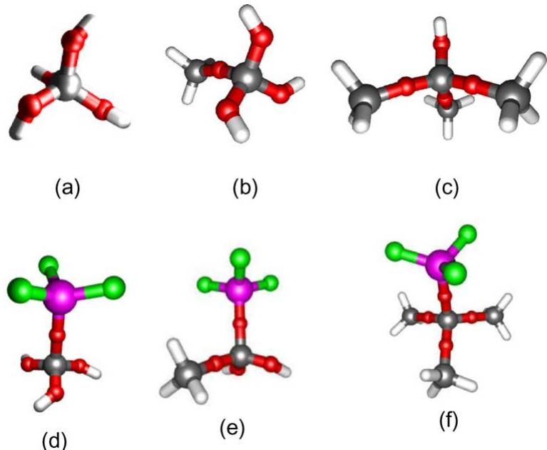  
Fig. 1. The (a)  $\mathrm{Si(OH)_3 - OH}$  b  $\mathrm{SiH_3OS(OH)_2 - OH}$  c  $\mathrm{(SiH_3O)_3Si - OH}$  d  $\mathrm{Si(OH)_3OZrCl_3}$  e  $\mathrm{SiH_3OS(OH)_2OZrCl_3}$  and (f)  $\mathrm{(SiH_3O)_3SiOZrCl_3}$  clusters used in this study.

compared to the energetics of analogous reactions of  $\mathrm{ZrO_2}$  deposition on hydroxylated Si and  $\mathrm{ZrO_2}$ .

To investigate the reaction of  $\mathrm{ZrCl_4}$  with multiple surface hydroxyl groups, a  $\mathrm{Si(OH)_2 - OH^* - O - Si(OH)_2 - OH^*}$  cluster is used to represent two surface hydroxyl groups separated by a siloxane bridge. Based on results from the previous calculations in this work, the termination of the Si atoms with  $- \mathrm{OH}$  groups is sufficient to capture the chemistry of the extended surface. Finally, calculations are also performed on clusters similar to those used by Jeloaica et al. [10] in order to compare their results of  $\mathrm{ZrO_2}$  deposition with those of this work.

# 3. Results and discussion

# 3.1. Reaction of  $\mathrm{ZrCl_4}$  with  $\mathrm{SiO_2 - OH^*}$  surface sites

The PES of the reaction of  $\mathrm{Si(OH)_3 - OH + ZrCl_4}$ , representing reactions of gaseous  $\mathrm{ZrCl_4}$  on  $\mathrm{SiO_2 - OH^*}$  surface sites, is shown in Fig. 2. Note that this PES is schematic in the sense that only stationary points are calculated and the curve drawn connecting these states is only indicative of the reaction path.  $\mathrm{ZrCl_4}$  first adsorbs molecularly onto the hydroxylated  $\mathrm{SiO_2}$  surface and forms a stable complex with the  $\mathrm{SiO_2 - OH^*}$  surface group. Widjaja and Musgrave [11,12] have shown that a similar complex is formed between  $\mathrm{ZrCl_4}$  and hydroxyl groups on Si and  $\mathrm{ZrO_2}$  through the interaction between the oxygen lone- pair electrons and an empty d- orbital of the  $\mathrm{Zr}$  atom. This results in a stable intermediate with a formation energy of  $- 16.9\mathrm{kcal / mol}$ . The complex formation energies are  $- 21.4\mathrm{kcal / mol}$  on Si and  $- 28.1\mathrm{kcal / mol}$  on  $\mathrm{ZrO_2}$ . Following the formation of this intermediate complex, one Cl atom of the adsorbed  $\mathrm{ZrCl_4}$  combines with the H atom of the surface OH group, forming HCl. The activation barrier for the HCl formation is  $16.4\mathrm{kcal / mol}$  with respect to the energy of the  $\mathrm{SiO_2 - OH - ZrCl_4}$  adsorbed complex, and the formation of the HCl is endothermic by  $11.9\mathrm{kcal / mol}$  relative to the adsorbed complex. The activation barrier for HCl formation is  $20.0\mathrm{kcal / mol}$  on Si and  $21.3\mathrm{kcal / mol}$  on  $\mathrm{ZrO_2}$  with respect to the adsorbed complex, while HCl formation is endothermic by  $13.9\mathrm{kcal / mol}$  on Si and  $16.7\mathrm{kcal / mol}$  on  $\mathrm{ZrO_2}$ , both with respect to the

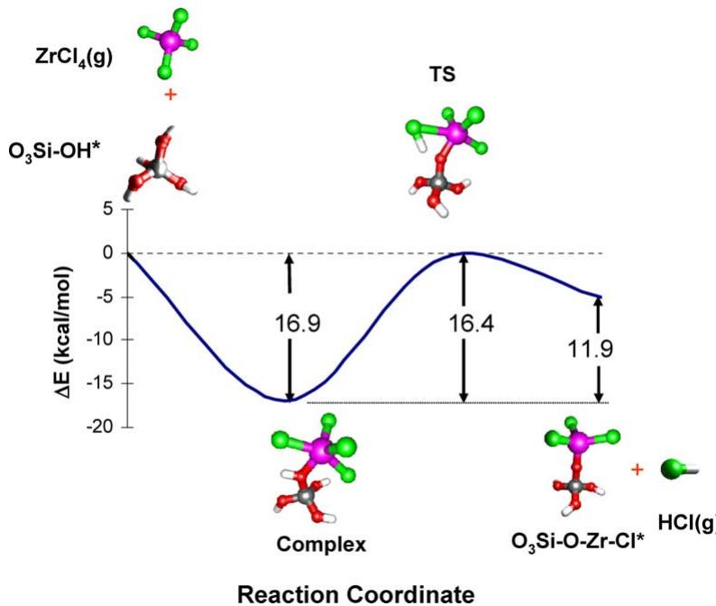  
Fig. 2. Reaction path and predicted energetics for the reaction of gaseous  $\mathrm{ZrCl_4}$  on  $\mathrm{SiO}_2\mathrm{-OH}^*$  sites. The purple, gray, red, green, and white atoms denote the zirconium, silicon, oxygen, chlorine and hydrogen atoms, respectively. (For interpretation of the references in colour in this figure legend, the reader is referred to the web version of this article.)

adsorbed complex. The HCl may go through a weakly bound physisorbed state, and then desorb into the gas phase as it does on Si and  $\mathrm{ZrO_2}$ . The physisorbed state has not been found for reactions on  $\mathrm{SiO}_2\mathrm{- OH}^*$  sites. The end result of the  $\mathrm{ZrCl_4}$  reaction with the  $\mathrm{SiO}_2\mathrm{- OH}^*$  site, represented by  $\mathrm{Si(OH)_3\mathrm{- O - ZrCl_3}}$ , is the replacement of the OH group of the  $\mathrm{SiO}_2\mathrm{- OH}^*$  surface site with three  $\mathrm{Zr - Cl^*}$  bonds.

# 3.2. Reaction of  $H_{2}O$  with  $\mathrm{SiO}_2\mathrm{-O - Zr(OH)_3\mathrm{-x}Cl_x^*}$  surface sites

The atomistic mechanism of the reaction of  $\mathrm{H}_2\mathrm{O} + \mathrm{Si(OH)}_3\mathrm{- O - ZrCl}_3$ , representing the reaction of  $\mathrm{H}_2\mathrm{O}$  on  $\mathrm{SiO}_2\mathrm{- O - Zr - Cl^*}$  sites and removal of the first of the three Cl atoms bonded to  $\mathrm{Zr}$ , is illustrated in Fig. 3. The reaction also proceeds through a trapping- mediated mechanism. Water first forms a stable complex with the  $\mathrm{Zr}$  atom of  $\mathrm{SiO}_2\mathrm{- O - Zr - Cl^*}$  through donation of the lone- pair electrons of the oxygen atom of water into an empty d- orbital of the  $\mathrm{Zr}$  atom. The adsorbed state is again stable; the  $\mathrm{H}_2\mathrm{O}$  adsorption reaction is exothermic by  $18.0\mathrm{kcal / mol}$ . The physisorbed  $\mathrm{HCl(a)}$  state is then formed through the reaction of one  $\mathrm{H}$  atom from the incoming  $\mathrm{H}_2\mathrm{O}$  and a  $\mathrm{Cl}$  atom from the  $\mathrm{SiO}_2\mathrm{- O - ZrCl}_3$  surface site. The energy of the transition state leading to the formation of  $\mathrm{HCl(a)}$  is  $20.3\mathrm{kcal / mol}$  relative to the adsorbed state and the reaction is endothermic by  $17.3\mathrm{kcal / mol}$  relative to the complex. Physisorbed  $\mathrm{HCl(a)}$  then desorbs with a desorption energy of  $1.2\mathrm{kcal / mol}$  uphill relative to the physisorbed state. Reaction of  $\mathrm{H}_2\mathrm{O}$  on  $\mathrm{Si}$  and  $\mathrm{ZrO_2}$  follows a similar pathway with an  $\mathrm{HCl}$  desorption energy of  $3.1\mathrm{kcal / mol}$  on  $\mathrm{Si}$  and  $4.5\mathrm{kcal / mol}$  on  $\mathrm{ZrO_2}$ .

Removal of the second and third  $\mathrm{Cl}$  atoms from the active  $\mathrm{SiO}_2\mathrm{- O - Zr - (OH)_3\mathrm{- x}Cl_x^*}$  sites proceeds through an analogous trapping- mediated mechanism. Formation of an absorbed  $\mathrm{H}_2\mathrm{O}$  complex is followed by reaction of one  $\mathrm{Cl}$  atom with one  $\mathrm{H}$  atom from water to form physisorbed  $\mathrm{HCl}$ . The final results of the reactions are replacements of  $\mathrm{Cl}$

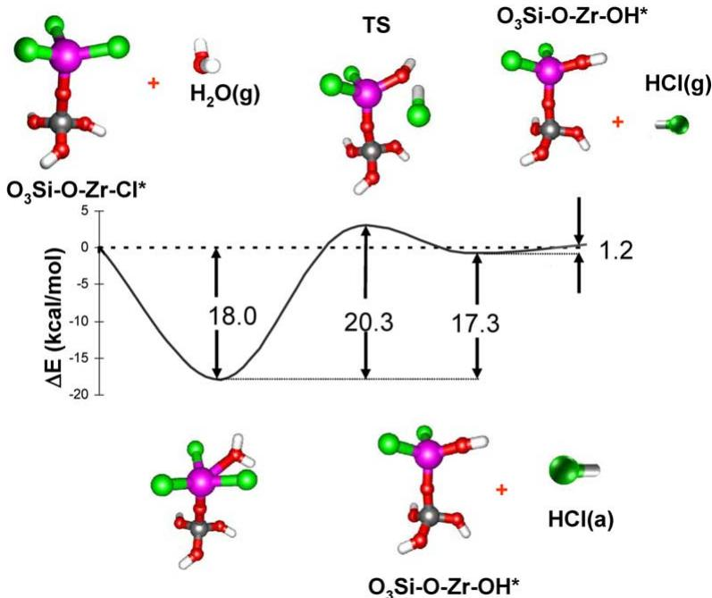  
Fig. 3. Reaction path and predicted energetics for the reaction of  $\mathrm{H}_2\mathrm{O}$  on  $\mathrm{SiO}_2\mathrm{-O - ZrCl}_3^*$  sites. The purple, gray, red, green, and white atoms denote the zirconium, silicon, oxygen, chlorine and hydrogen atoms, respectively. (For interpretation of the references in colour in this figure legend, the reader is referred to the web version of this article.)

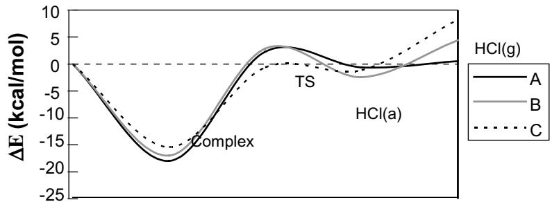  
Fig. 4. PESs of  $\mathrm{H}_2\mathrm{O}$  reaction with all three Cl atoms on  $\mathrm{Zr}$ , calculated using the  $\mathrm{Si(OH)_3SiOZrCl_3}$  cluster for (A) removal of the first Cl atom, (B) removal of the second Cl atom, and (C) removal of the third Cl atom.

atoms by OH groups and evolution of HCl. The second and third Cl removal reactions are presented respectively as follows:

$$
\begin{array}{rl} & {\mathrm{Si(OH)_3 - O - Zr(OH)Cl_2^* + H_2O}}\\ & {\quad \rightarrow \mathrm{Si(OH)_3 - O - Zr(OH)_2Cl^* + HCl}} \end{array}
$$

$$
\begin{array}{rl} & {\mathrm{Si(OH)_3 - O - Zr(OH)_2Cl^* + H_2O}}\\ & {\quad \rightarrow \mathrm{Si(OH)_3 - O - Zr(OH)_3^* + HCl}} \end{array}
$$

The PESs for removal of all the three Cl atoms are shown in Fig. 4. Geometric parameters of interest illustrated in Fig. 5, such as the  $\mathrm{Zr - Cl}$  bond length of the water complexes, the distance between  $\mathrm{HCl(a)}$  and the  $\mathrm{O}$  of the  $\mathrm{Zr - OH^*}$  sites, and the minimum distance between the  $\mathrm{HCl(a)}$  and the  $\mathrm{H}$  atoms used to terminate the  $\mathrm{Si - O}$  bonds are summarized in Table 1. Formation of the absorbed complex is exothermic by  $18.0\mathrm{kcal / mol}$  for  $\mathrm{SiO}_2\mathrm{- O - ZrCl}_3\mathrm{- H}_2\mathrm{O(a)}$ ,  $17.0\mathrm{kcal / mol}$  for  $\mathrm{SiO}_2\mathrm{- }$

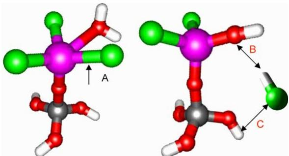  
Fig. 5. Illustration of parameters shown in Table 1: (A)  $\mathrm{Zr - Cl}$  bond of the adsorbed water complex, (B) the distance between  $\mathrm{HCl(a)}$  and the O atom of the  $\mathrm{Zr - OH^{*}}$  site, and (C) the minimum distance between  $\mathrm{HCl(a)}$  and  $\mathrm{H}$  atoms used to terminate the  $\mathrm{Si - O}$  bond.

$\mathrm{O - Zr(OH)Cl_2 - H_2O(a)}$  and  $15.4\mathrm{kcal / mol}$  for  $\mathrm{SiO_2 - }$ $\mathrm{O - Zr(OH)_2Cl - H_2O(a)}$  .Relative to the water complex, the activation barriers for HCl formation are 20.3, 19.8, and  $14.8\mathrm{kcal / mol}$  for the first, second, and third Cl removal, respectively.

The lower activation barriers for the removal of the second and third Cl atoms are the result of successive weakening of the  $\mathrm{Zr - Cl}$  bond by the increasing number of OH groups bonded to the  $\mathrm{Zr}$  atom. As shown in Table 1, the  $\mathrm{Zr - Cl}$  bond length of the water complex increases from  $2.48\mathrm{\AA}$  for the first Cl to 2.52 and  $2.53\mathrm{\AA}$  for the second and third Cl atoms, respectively. One possible explanation of this effect is that donation of the O lone pair into an empty d- orbital of the  $\mathrm{Zr}$  atom in addition to the covalent bonds between the  $\mathrm{Zr}$  atom and the O atoms weakens the  $\mathrm{Zr - Cl}$  bonds. This electron donation effect can also explain the weakening of the  $\mathrm{H}_2\mathrm{O}$  absorbed complex with the increasing number of OH groups bonded to the  $\mathrm{Zr}$  atom, manifested by the change in the water complex formation energy, as mentioned above.

The desorption energy of physisorbed HCl is  $1.2\mathrm{kcal / mol}$  for removal of the first Cl,  $6.8\mathrm{kcal / mol}$  for removal of the second Cl and  $9.4\mathrm{kcal / mol}$  for removal of the third Cl. The progressive increase in the HCl desorption energy for removal of the second and third Cl atoms can be partially explained by the increased stability of the physisorbed HCl that results because the OH group that replaces the Cl atom occupies less space than the Cl atom and thus results in less steric interactions. This in turn allows closer bonding of the  $\mathrm{HCl(a)}$  to the surface  $\mathrm{Zr - OH^{*}}$  sites, as evident from the decrease in the distance between  $\mathrm{HCl(a)}$  and the O atom of the  $\mathrm{Zr - OH^{*}}$  site that replaces the  $\mathrm{Zr - Cl^{*}}$  site. Another cause for the increase in desorption energy is the error introduced by using a small cluster for the calculation. As shown in Table 1, the distance between the Cl atom of  $\mathrm{HCl(a)}$  and the nearest H atom used to terminate the  $\mathrm{Si - O}$  bonds changed from  $2.46\mathrm{\AA}$  for removal of the first Cl atom, to  $2.44\mathrm{\AA}$  for removal of the second Cl atom, to  $2.42\mathrm{\AA}$  for removal of the third Cl atom. This error can be corrected by using a larger cluster for the calculation, as shown below.

Table 1 Comparison of  $\mathrm{Zr - Cl}$  bond length of the water complex, distance between the  $\mathrm{HCl(a)}$  and O of the  $\mathrm{Zr - OH^{*}}$  sites and the minimum distance between  $\mathrm{HCl(a)}$  and  $\mathrm{H}$  atoms used to terminate the Si-O bond for removal of the three Cl atoms bonded to  $\mathrm{Zr - Cl^{*}}$  surface sites  

<table><tr><td>Complex</td><td>Zr-Cl bond length (Å)</td><td>Distance between HCl (a) and O of Zr-OH* site (Å)</td><td>Minimum distance between HCl (a) and H atoms used to terminate the Si-O bond (Å)</td></tr><tr><td>Si(OH)3OZrCl3cluster</td><td></td><td></td><td></td></tr><tr><td>Si(OH)3OZrCl3-H2O</td><td>2.48</td><td>1.78</td><td>2.46</td></tr><tr><td>Si(OH)3OZr(OH)Cl2H2O</td><td>2.52</td><td>1.69</td><td>2.44</td></tr><tr><td>Si(OH)3OZr(OH)2Cl-H2O</td><td>2.53</td><td>1.58</td><td>2.42</td></tr><tr><td>(SiH3O)3SiOZrCl3cluster</td><td></td><td></td><td></td></tr><tr><td>(SiH3O)3SiOZrCl3-H2O</td><td>2.45</td><td>1.84</td><td>3.56</td></tr><tr><td>(SiH3O)3SiOZr(OH)Cl2-H2O</td><td>2.48</td><td>1.81</td><td>7.24</td></tr><tr><td>(SiH3O)3SiOZr(OH)2Cl-H2O</td><td>2.50</td><td>1.68</td><td>3.76</td></tr></table>

# 3.3. The effect of cluster truncation

3.3. The effect of cluster truncationTo investigate the cluster size effect on the reaction energetics, calculations were performed to compare the stationary points on the PESs for the reaction of gaseous  $\mathrm{ZrCl_4}$  on  $\mathrm{SiO_2 - OH^*}$  surface sites using the  $\mathrm{Si(OH)_3 - OH}$ ,  $\mathrm{SiH_3OSi(OH)_2 - OH}$  and  $(\mathrm{SiH}_3\mathrm{O})_3\mathrm{Si - OH}$  clusters. Results are shown in Fig. 6. The reaction mechanism is found to be the same for all three clusters. The energy for the formation of the adsorbed complex is  $- 16.9\mathrm{kcal / mol}$  with the  $\mathrm{Si(OH)_3 - OH}$  cluster,  $- 17.8\mathrm{kcal / mol}$  with the  $\mathrm{SiH_3OSi(OH)_2 - OH}$  cluster and  $- 17.8\mathrm{kcal / mol}$  with the  $(\mathrm{SiH}_3\mathrm{O})_3\mathrm{Si - OH}$  cluster. The energy of the overall reaction calculated using the three clusters also varied by a maximum of  $0.9\mathrm{kcal / mol}$ . The largest difference in energy is observed between values calculated using the  $\mathrm{Si(OH)_3 - OH}$  and the  $\mathrm{SiH_3OSi(OH)_2 - OH}$  clusters. Energies calculated using an even larger cluster,  $(\mathrm{SiH}_3\mathrm{O})_3\mathrm{Si - OH}$ , only showed a  $0.8\mathrm{kcal / mol}$  deviation from the results calculated with  $\mathrm{Si(OH)_3 - OH}$ , which is the smallest cluster. Cluster size had no effect on the calculated activation barrier for HCl formation. Consequently, the reaction of  $\mathrm{ZrCl_4}$  on the  $\mathrm{SiO_2}$  surface does not exhibit significant non- local effects and the smaller $\mathrm{Si(OH)_3 - OH}$  cluster is a good model of the surface active sites since it is sufficient to describe the surface reaction at single hydroxyl sites.

We also calculated the reaction energetics for the reaction of  $\mathrm{H}_2\mathrm{O}$  on the  $\mathrm{SiO}_2\mathrm{- O - ZrCl}_3^*$  surface site using three different clusters. Since the active bond is even more removed from the surface than in the case of the  $\mathrm{SiO}_2\mathrm{- OH^*}$  active site, even less of a cluster size effect is expected. Results are given in Fig. 7.  $\mathrm{Si(OH)_3OzrCl_3}$ $\mathrm{SiH}_3\mathrm{OSi(OH)}_2\mathrm{OzrCl}_3$  and  $(\mathrm{SiH}_3\mathrm{O})_3\mathrm{SiOzrCl}_3$  clusters, representing products of the first half- reaction using the  $\mathrm{Si(OH)_3 - OH}$ $\mathrm{SiH}_3\mathrm{OSi(OH)}_2\mathrm{- OH}$  and  $(\mathrm{SiH}_3\mathrm{O})_3\mathrm{Si - OH}$  clusters, were used in the calculation. The results showed negligible differences. The insensitivity of the reaction energetics to the size of the  $\mathrm{SiO_2}$  cluster demonstrates that the reaction of water on the  $\mathrm{SiO}_2\mathrm{- O - ZrCl}_3^*$  site does not exhibit significant non- local effects, as one would expect.

Fig. 8 shows the PES for removal of all the three Cl atoms bonded to  $\mathrm{Zr}$  calculated using the  $(\mathrm{SiH}_3\mathrm{O})_3\mathrm{SiOzrCl}_3$  cluster. The patterns are similar to that calculated using the smaller  $\mathrm{Si(OH)_3OzrCl_3}$  cluster shown in Fig. 4. Table 2 compares the energetics calculated using the two different clusters. The smaller cluster gives rise to a varying activation barrier for the formation of

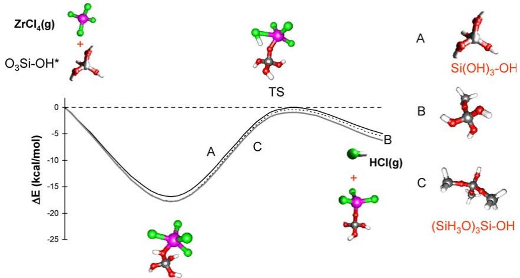  
Fig. 6. Comparison of reaction paths and predicted energetics for the reaction of gaseous  $\mathrm{ZrCl_4}$  on the  $\mathrm{SiO_2 - OH^*}$  sites calculated using (A)  $\mathrm{Si(OH)_3 - OH}$  cluster, (B)  $\mathrm{SiH_3OSi(OH)_2 - OH}$  cluster, and (C)  $(\mathrm{SiH}_3\mathrm{O})_3\mathrm{Si - OH}$  cluster, showing cluster size effect on the results. The purple, gray, red, green, and white atoms denote the zirconium, silicon, oxygen, chlorine and hydrogen atoms, respectively. (For interpretation of the references in colour in this figure legend, the reader is referred to the web version of this article.)

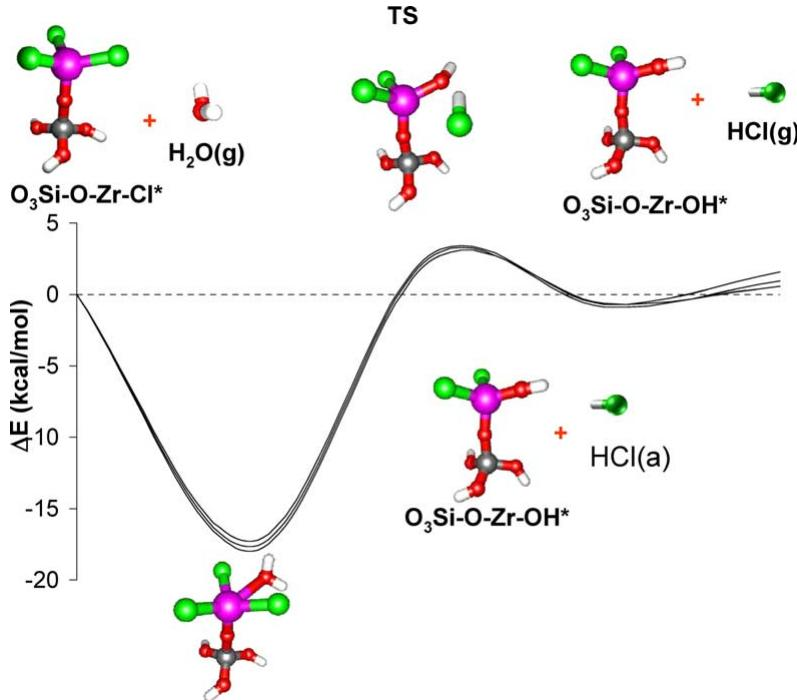  
Fig. 7. Comparison of reaction path and predicted energetics for the reaction of  $\mathrm{H}_2\mathrm{O}$  on the  $\mathrm{SiO}_2\mathrm{-O - Zr - Cl}_3^*$  sites calculated using (a)  $\mathrm{Si(OH)_3OZrCl_3}$  cluster, (b)  $\mathrm{SiH_3OSi(OH)_3OZrCl_3}$  cluster, and (c)  $\mathrm{(SiH_3O)_3SiOZrCl_3}$  cluster, showing the cluster effect on the results. The purple, gray, red, green, and white atoms denote the zirconium, silicon, oxygen, chlorine and hydrogen atoms, respectively. (For interpretation of the references in colour in this figure legend, the reader is referred to the web version of this article.)

physisorbed HCl and a higher HCl desorption energy. As mentioned in Section 2, the error from using the smaller cluster is due to interference of H atoms used to terminate the subsurface Si- O bonds. The close proximity between these H atoms and the physisorbed HCl alters the transition state barrier and increases the desorption energy. However, the maximum difference calculated is only  $2.7\mathrm{kcal / mol}$  which is not large enough to alter the nature of the reaction mechanism.

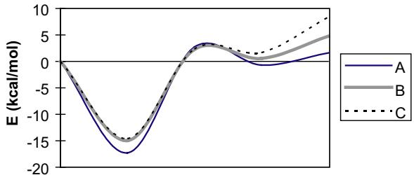  
Fig. 8. PESs calculated using the  $\mathrm{(SiH_3O)_3SiOZrCl_3}$  cluster for reaction of (A) removal of the first Cl atom, (B) removal of the second Cl atom, and (C) removal of the third Cl atom.

With the  $\mathrm{(SiH_3O)_3SiOZrCl_3}$  cluster, the interaction between the H atoms used to terminate the subsurface Si- O bonds and the gaseous precursors is negligible. As shown in Table 1, the distance between the Cl atom of the physisorbed HCl and nearest H atom used to terminate the Si is increased to  $3.56\mathrm{\AA}$

As we have shown in Section 2, when a small cluster is used for the calculation, the H atoms used to terminate the subsurface Si- O bonds may interfere with the calculation and induce a small error in the calculated energetics. To more realistically simulate the reaction on a rigid surface, constraints on the subsurface can be added during the transition state searches for both half- reactions. Unless stated otherwise, the  $\mathrm{Si(OH)_3}$  group, which represents the surface and is not directly involved in the reaction was fixed during the first step of transition state calculation. The constraints

Table 2 Comparison of energetics (in kcal/mol) calculated using different size clusters for the  $\mathrm{Si - O - Zr(OH)_3 - x - Cl_x^* + H_2O}$  reactions  

<table><tr><td></td><td>Zr-Cl*–H2O complex</td><td>TS</td><td>Zr-OH*–HCl complex</td><td>HCl desorption</td></tr><tr><td>SiO2-O-ZrCl3+H2O→SiO2-O-Zr(OH)Cl2+HCl</td><td></td><td></td><td></td><td></td></tr><tr><td>Si(OH)3OZrCl3cluster</td><td>-17.9</td><td>20.3</td><td>17.3</td><td>1.2</td></tr><tr><td>(SiH3O)3SiOZrCl3cluster</td><td>-17.3</td><td>20.0</td><td>16.6</td><td>2.3</td></tr><tr><td>SiO2-O-Zr(OH)Cl2+H2O→SiO2-O-Zr(OH)3Cl+HCl</td><td></td><td></td><td></td><td></td></tr><tr><td>Si(OH)3OZr(OH)Cl2cluster</td><td>-17.0</td><td>19.8</td><td>14.6</td><td>6.8</td></tr><tr><td>(SiH3O)3SiOZr(OH)Cl2cluster</td><td>-15.0</td><td>17.2</td><td>15.5</td><td>4.2</td></tr><tr><td>SiO2-O-Zr(OH)2Cl+H2O→SiO2-O-Zr(OH)3+HCl</td><td></td><td></td><td></td><td></td></tr><tr><td>Si(OH)3OZr(OH)2Clcluster</td><td>-15.4</td><td>14.8</td><td>14.3</td><td>9.4</td></tr><tr><td>(SiH3O)3SiOZr(OH)2Clcluster</td><td>-14.6</td><td>16.9</td><td>16.2</td><td>6.7</td></tr></table>

Energies of the  $\mathrm{Zr - Cl^* - H_2O}$  are relative to the entrance channel. Energies of TS,  $\mathrm{Zr - OH^* - HCl}$  complex are relative to the  $\mathrm{Zr - Cl^* - H_2O}$  complex. Energies of HCl desorption are relative to the  $\mathrm{Zr - OH^* - HCl}$  complex.

limited movement of the  $\mathrm{H}$  atoms used to terminate the  $\mathrm{Si - O}$  bonds and guided the transition state calculation to the right saddle points. This resulted in a structure with multiple negative frequencies due to rotation of the constrained  $\mathrm{O - H}$  bonds. Once the transition state was found, the constraints on the  $\mathrm{Si(OH)_3}$  group were removed. Repeating the transition state calculation with the cluster fully relaxed allowed relaxation of the  $\mathrm{H}$  atoms and eliminated the negative frequencies mentioned above associated with the constrained  $\mathrm{H}$  atoms. The result was a structure with only one negative frequency.

# 3.4. Comparison of  $ZrO_2$  growth on  $SiO_2$ ,  $ZrO_2$  and the  $OH$  terminated  $Si$  surface

Figs. 9 and 10 show the comparison of PESs for the deposition of  $ZrO_2$  on the  $OH$  terminated  $Si$  surface,  $Z\mathrm{rO}_2$  and  $\mathrm{SiO}_2$  .We use  $\mathrm{Zr - OH^*}$  and  $\mathrm{Si - }$ $\mathrm{OH^{*}}$  to denote hydroxylated  $\mathrm{ZrO_2}$  and Si surfaces, respectively. Similarly,  $\mathrm{Zr - O - ZrCl^*}$  and  $\mathrm{Si - O - }$ $\mathrm{ZrCl^{*}}$  denote the products of  $\mathrm{ZrCl_4}$  adsorption on the respective  $\mathrm{Zr - OH^*}$  and  $\mathrm{Si - OH^{*}}$  surfaces. The PESs representing surface reactions of  $\mathrm{ZrCl_4}$  and  $\mathrm{H}_2\mathrm{O}$  on  $\mathrm{SiO}_2$  and  $\mathrm{ZrO_2}$  surface sites show little difference. Clearly, very little qualitative energetic difference exists for the initiation of the first monolayer of  $\mathrm{ZrO_2}$  on  $\mathrm{SiO}_2$  and subsequent thickening of  $\mathrm{ZrO_2}$  because the reactions do not show significant non- local effects, as previously discussed.

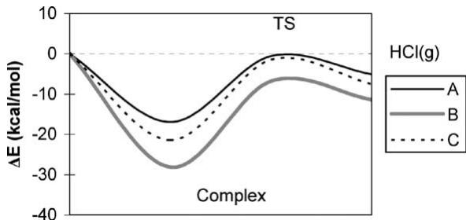  
Fig. 9. Comparison of reaction energetics for  $\mathrm{ZrCl_4}$  reaction on the (A)  $\mathrm{SiO_2 - OH^*}$  surface site, (B)  $\mathrm{Zr - OH^*}$  surface site, and (C)  $\mathrm{Si - OH^*}$  surface site.

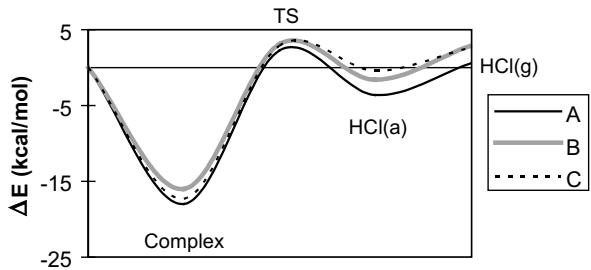  
Fig. 10. Comparison of reaction energetics for  $\mathrm{H}_2\mathrm{O}$  reaction on the (A)  $\mathrm{SiO}_2\mathrm{-O - ZrCl}_3$  surface site, (B)  $\mathrm{Zr - O - ZrCl}_3^*$  surface site, and (C)  $\mathrm{Si - O - ZrCl}_3$  surface site.

However, even though the shape of the PESs are similar for the different surfaces, differences in the relative energies are present. Compared with the reaction of  $\mathrm{ZrCl_4}$  on hydroxylated  $\mathrm{SiO}_2$ , reaction of  $\mathrm{ZrCl_4}$  on hydroxylated  $\mathrm{Si}$  resulted in a 4.5 kcal/mol lower formation energy for the absorbed

complex, a  $3.6\mathrm{kcal / mol}$  higher energy for the transition state activation barrier and a  $2.1\mathrm{kcal / }$  mol higher energy for the HCl desorption. For the second half- reaction, the energy for the intermediate complex formation is  $0.7\mathrm{kcal / mol}$  higher, the activation barrier is  $0.1\mathrm{kcal / mol}$  lower, and the HCl desorption energy is  $1.4\mathrm{kcal / mol}$  higher for the reaction on the Si surface. The energetics of  $\mathrm{ZrO_2}$  deposition on hydroxylated  $\mathrm{SiO_2}$  do not deviate qualitatively from  $\mathrm{ZrO_2}$  deposition on the  $- \mathrm{OH}$  terminated Si surface; however, depending upon the reactor temperature, differences on the order of  $5\mathrm{kcal / mol}$  could be sufficient to change the growth rate.

One distinctive characteristic of both halfreactions involves the formation of a stable intermediate complex, regardless of the initial surface condition. Widjaja and Musgrave [11,12] have shown that the complexes are formed through the interaction between an oxygen lone- pair and an empty d- orbital of  $\mathrm{Zr}$ . For the first half- cycle, the lone- pair electrons come from the oxygen of the hydroxylated Si,  $\mathrm{ZrO_2}$  and  $\mathrm{SiO_2}$  surfaces  $\mathrm{(Si - OH^*}$ $\mathrm{Zr - OH^*}$  and  $\mathrm{SiO_2 - OH^*}$  sites), respectively, and the  $\mathrm{Zr}$  atom comes from the  $\mathrm{ZrCl_4}$  precursor molecule. For the second half- cycle, the lone- pair electrons come from the oxygen of  $\mathrm{H}_2\mathrm{O}$  and the  $\mathrm{Zr}$  atom comes from the  $\mathrm{Si - O - ZrCl^*}$  the  $\mathrm{Zr - O - ZrCl^*}$  or the  $\mathrm{SiO_2 - O - ZrCl^*}$  surface sites. The electron donation from an oxygen lone- pair to the empty d- orbital of the  $\mathrm{Zr}$  atom is relatively exothermic, resulting in adsorption energies of  $- 21.4\mathrm{kcal / mol}$  for  $\mathrm{ZrCl_4}$  adsorption on  $\mathrm{Si - OH^*}$ $- 28.1\mathrm{kcal / }$  mol for  $\mathrm{ZrCl_4}$  adsorption on  $\mathrm{Zr - OH^*}$ $- 16.9\mathrm{kcal / }$  mol for  $\mathrm{ZrCl_4}$  adsorption on  $\mathrm{SiO_2 - OH^*}$ $- 17.3\mathrm{kcal / mol}$  for  $\mathrm{H}_2\mathrm{O}$  adsorption on  $\mathrm{Si - O - ZrCl_3^*}$ $- 16.0\mathrm{kcal / mol}$  for  $\mathrm{H}_2\mathrm{O}$  adsorption on  $\mathrm{Zr - O - }$ $\mathrm{ZrCl_3^*}$  and  $- 18.0\mathrm{kcal / mol}$  for  $\mathrm{H}_2\mathrm{O}$  adsorption on  $\mathrm{SiO_2 - O - ZrCl_3^*}$  surface sites, respectively.

As reported previously [12], the free energies of the complex shift up with respect to the initial precursor state and the final state with increasing temperature. This results in reduced stability of the complex intermediates. Around  $600\mathrm{K}$  the associated product free energies become lower than the adsorbed intermediate free energies. This shows that raising the temperature shifts the equilibrium concentration from the complex towards the products. However, at high temperatures, the activation free energy for the desorption of the adsorbed precursor molecule becomes smaller than the activation free energy for the formation of HCl. As a result, the rate of desorption may increase faster than the rate of HCl elimination as the temperature is increased. High reactant pressures can be used to increase the time- averaged concentration of adsorbed precursors to shift equilibrium towards the products. However, under actual growth conditions, it is likely that gas- surface equilibrium is not attained, and that with a high flow rate of gases over the substrate, reaction by- products such as HCl are removed from the chamber without substantial readsorption helping drive the reaction forward while moving the system away from equilibrium. Although equilibrium is most likely not achieved under actual flow conditions, the shifts in equilibrium caused by changes in temperature, pressures, and flow rates can be determined based on the potential energy surfaces we have reported herein.

# 3.5. Reaction of  $\mathrm{ZrCl_4}$  with multiple  $\mathrm{SiO_2 - OH^*}$  surface sites

The PES of the reaction of  $\mathrm{ZrCl_4}$  with multiple surface sites is more complex because of the branching of reaction pathways. Fig. 11 shows the reactions of  $\mathrm{ZrCl_4}$  with two surface  $\mathrm{Si - OH^*}$  groups. Initially, the  $\mathrm{ZrCl_4}$  molecule has two oxygen lone- pair interactions with the two surface hydroxyl groups (black line). The intermediate is  $30.8\mathrm{kcal / mol}$  below the entrance channel, which is nearly double the  $16.9\mathrm{kcal / mol}$  seen with a single surface hydroxyl site. The activation barrier to the formation of HCl is  $25.8\mathrm{kcal / mol}$  relative to the energy of the adsorbed intermediate. The HCl product can be weakly physisorbed with an energy that is  $13.3\mathrm{kcal / mol}$  above the adsorbed complex, and the desorption energy for HCl is endothermic by  $3.5\mathrm{kcal / mol}$ .

After the elimination of the first HCl, the reaction network can branch. One alternative would be for the zirconium atom to remain 5- fold coordinated (three bonds to Cl atoms and two dative bonds from the surface hydroxyl groups)

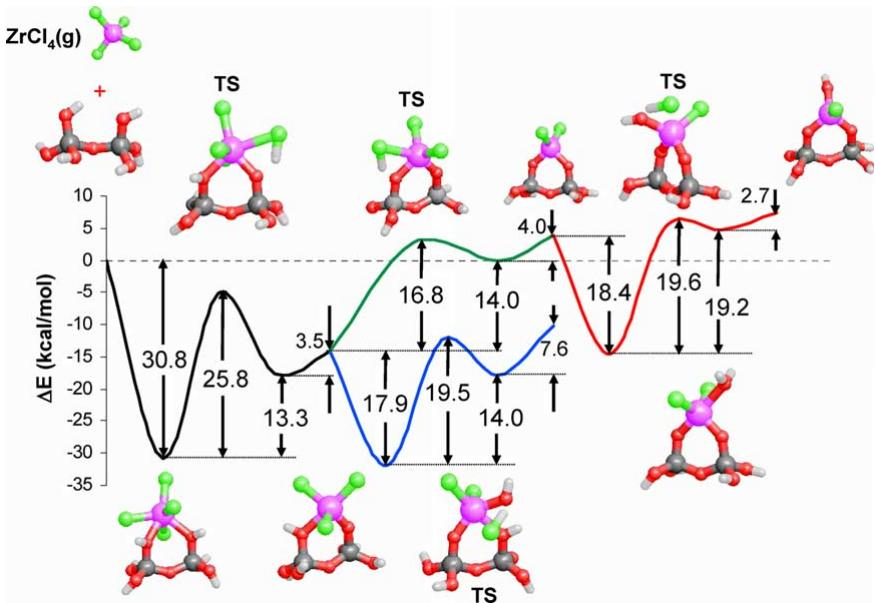  
Fig. 11. Reaction path and predicted energetics for the reaction of  $\mathrm{ZrCl_4}$  on multiple surface hydroxyl sites using a  $\mathrm{Si(OH)_2 - OH^* - O - }$ $\mathrm{Si(OH)_2 - OH^*}$  cluster. The green pathway represents the elimination of a second HCl from the adsorbed  $\mathrm{ZrCl_4}$ . The blue and red pathways represent the second ALD half-reaction with water. The purple, gray, red, green, and white atoms denote the zirconium, silicon, oxygen, chlorine and hydrogen atoms, respectively. (For interpretation of the references in colour in this figure legend, the reader is referred to the web version of this article.)

for the second ALD half- reaction with water (Fig. 11, blue line). As in the previous calculations with only one surface hydroxyl group, water can adsorb via a lone- pair donation to the zirconium atom. Formation of this stable complex is exothermic by  $17.9\mathrm{kcal / mol}$ . The transition state to the formation of HCl has an energy  $19.5\mathrm{kcal / mol}$  relative to the adsorbed state, and the reaction is endothermic by  $14.0\mathrm{kcal / mol}$  relative to the complex. The HCl desorption energy is  $7.6\mathrm{kcal / mol}$  uphill relative to the physisorbed state. Compared to the cluster model with only one surface hydroxyl group, the adsorbed complex and transition state energies are nearly identical. The physisorbed HCl, however, is approximately  $3\mathrm{kcal / mol}$  more stable due to an additional interaction with the second surface hydroxyl group. This leads to a slightly more stable HCl physisorbed state and a higher HCl desorption energy.

An alternative to the 5- fold coordinated water half- reaction pathway would be for the surface zirconium atom to eliminate a second HCl through reaction with a surface hydroxyl group (Fig. 11, green line). From the product of the first HCl elimination, there is a  $16.8\mathrm{kcal / mol}$  barrier to the formation of the second HCl product. The HCl can remain physisorbed in a state that is  $14.0\mathrm{kcal / mol}$  above the product of the first HCl elimination; the desorption of the second HCl is endothermic by  $4.0\mathrm{kcal / mol}$ . Again, the energies of the critical points of this pathway are nearly identical to those described previously where the model only allowed for a single surface hydroxyl group interaction.

From the product of the second HCl elimination, water can react with the  $\mathrm{ZrCl_2}$  surface species by the second half- reaction of the ALD process (Fig. 11, red line). The adsorption energy of water on this surface is  $18.4\mathrm{kcal / mol}$ . The energy of the transition state for the formation of HCl is  $19.6\mathrm{kcal / mol}$  above the adsorbed complex. The physisorbed HCl state is  $19.2\mathrm{kcal / mol}$  above the lone- pair donation complex. The desorption energy of HCl is  $2.7\mathrm{kcal / mol}$ .

For the most part, the kinetics, which are related to the energy differences between the transition states and the adsorbed complexes, of the

ALD growth reactions are not affected significantly by the interaction of the incoming  $\mathrm{ZrCl_4}$  with multiple surface hydroxyl groups. The major differences are that for the first half- reaction where the first HCl is eliminated the second  $\mathrm{Zr - O}$  dative bond shifts the exchange reaction PES down approximately  $14\mathrm{kcal / mol}$  which decreases the probability of precursor desorption, and increases the barrier for the exchange reaction by  $9.4\mathrm{kcal / mol}$  relative to the adsorbed complex. However, the stabilities of the intermediates and transition states for two half- reactions is increased when the coordination number of the zirconium atom of the reacting precursor is increased by additional interactions with surface sites, ligands, and other adsorbing gas phase molecules. For example, for the second half- reaction where  $- \mathrm{Cl}$  is exchanged with a  $- \mathrm{OH}$  the additional  $- \mathrm{Cl}$  ligand shifts the ligand- exchange reaction PES down approximately  $18\mathrm{kcal / mol}$  while the barrier relative to the complex is nearly constant at  $19.5\mathrm{kcal / mol}$

# 3.6. Reaction of  $\mathrm{ZrCl_4}$  with  $\mathrm{SiO_2 - OH^*}$  surface sites on a 1-dimer cluster

The PES of the reaction of  $\mathrm{ZrCl_4}$  as shown above is not sensitive to the cluster model. However, our results differ from those published previously [10]. In that work, a similar pathway is explored; however, the relative energies are different. To reconcile the differences, calculations using our methodology were performed on the silicon 1- dimer clusters where the top layer has been oxidized.

For the initial adsorbed complex, we find the adsorption energy to be  $15.0\mathrm{kcal / mol}$ . This is weaker than we found previously using a pure hydroxylated  $\mathrm{SiO_2}$  surface  $(16.9 - 17.8\mathrm{kcal / mol})$ . The difference likely arises from the geometric constraints used in the 1- dimer model compared to the unconstrained  $\mathrm{SiO - OH^*}$  clusters. Jeloacia found the adsorption energy to be only  $10.0\mathrm{kcal / mol}$ . This difference of  $5\mathrm{kcal / mol}$  is likely due to differences in cluster geometry and basis set.

For the transition state energy, we find the barrier to be  $15.1\mathrm{kcal / mol}$  above the adsorbed state. The transition state is less than  $0.5\mathrm{kcal / mol}$  away from the entrance channel as observed for the unstrained clusters. Our barrier is lower than the  $20.1\mathrm{kcal / mol}$  barrier obtained by Jeloacia. If the choices of cluster geometry and basis set led to systematic differences in relative energies, one would expect a similar barrier; however, the differences appear to be increasing. Jeloacia used an iterative transition state search approach called bond constraint relaxation (BCR) where the reaction coordinate and non- reaction coordinate degrees of freedom are alternately optimized. This limits the ability to fully explore the potential energy surface of the system to locate the transition state. The transition state search algorithm in Gaussian simultaneously minimizes the energy of the system while searching for a mathematical first- order saddle point with the negative frequency corresponding to the reaction coordinate. The BCR technique obtains a reaction barrier that is an upper bound to the true value while the technique employed in Gaussian leads to a barrier that is most likely closer to the true value.

# 4. Conclusions

The atomistic mechanism of growth of first monolayer of  $\mathrm{ZrO_2}$  on hydroxylated  $\mathrm{SiO_2}$  by ALD using  $\mathrm{ZrCl_4}$  and  $\mathrm{H}_2\mathrm{O}$  precursors has been investigated. The reaction pathways consist of two half- cycle reactions: (1)  $\mathrm{ZrCl_4}$  reacts with the  $\mathrm{SiO_2 - OH^*}$  surface sites, which results in  $\mathrm{SiO_2 - O - ZrCl^*}$  sites, and (2)  $\mathrm{H}_2\mathrm{O}$  reactions with  $\mathrm{SiO_2 - O - ZrCl^*}$  surface sites, resulting in  $\mathrm{SiO_2 - O - Zr - OH^*}$  sites.

The reaction energetics of  $\mathrm{ZrO_2}$  deposition on hydroxylated  $\mathrm{SiO_2}$  are qualitatively similar to the energetics of  $\mathrm{ZrO_2}$  deposition on the growing  $\mathrm{ZrO_2}$  film and the energetics of  $\mathrm{ZrO_2}$  deposition on hydroxylated Si. The intermediate complex formed by absorption of the gaseous precursor,  $\mathrm{ZrCl_4}$  and  $\mathrm{H}_2\mathrm{O}$ , are more stable than the final state. This will result in trapping both half- reactions in the intermediate state. Increasing the reaction temperature and pressure of the gaseous precursors shifts the overall equilibrium from the stable absorbed precursor state to the final state. However, as in the case of the homogeneous ALD of  $\mathrm{ZrO_2}$ , increasing the temperature leads to desorption of precursor and submonolayer growth. The reaction pathways for  $\mathrm{ZrCl_4}$  reaction with multiple surface hydroxyl

sites exhibit similar reaction mechanisms as those on a single site; however, the additional dative bond to the Zr atom stabilizes the adsorbed complex and products while increasing the barrier for the first exchange reaction.

# Acknowledgements

AcknowledgementsThe authors thank Professor Jeung Ku Kang, Dr. Collin Mui, and Dr. Juan Senosiain for their help. Support of this work by the Ford Motor Company, National Science Foundation Graduate Research Fellowship, the Stanford Center for Integrated Systems, Semiconductor Research Corporation, MSD Marco Center, the Office of Naval Research, and the Powell Foundation are gratefully acknowledged. This research was also supported through computing resources provided by the National Center for Supercomputing Applications (NCSA).

# References

[1] P.A.Packan,Science 285 1999)2079. [2] M. Copel, M. Gribelyuk, E. Gusev, Appl. Phys. Lett. 76 (2000)436.

[1] P.A. Packan, Science 285 (1999) 2079. [2] M. Copel, M. Gribelyuk, E. Gusev, Appl. Phys. Lett. 76 (2000) 436. [3] M. Ritala, N. Leskela, in: H.S. Nalwa (Ed.), Handbook of Thin Film Materials, vol. 1, Academic Press, New York, 2001 (Chapter 2). [4] H. Zhang, R. Solanki, B. Roberds, G. Bai, I. Banerjee, J. Appl. Phys. 87 (2000) 1921. [5] C.M. Perkins, B.B. Triplett, P.C. McIntyre, K.C. Saraswat, S. Haukka, M. Tuominen, Appl. Phys. Lett. 78 (2001) 2357. [6] J. Aarik, A. Aidla, H. Mandar, T. Uustare, V. Sammelselg, Thin Solid Films 408 (2002) 97. [7] K. Kukli, M. Ritala, J. Aarik, T. Uustare, M. Leskela, J. Appl. Phys. 92 (2002) 1833. [8] A. Esteve, M. Rouhani, L. Jeloaica, D. Esteve, Comput. Mater. Sci. 27 (2003) 75. [9] A. Rahtu, M. Ritala, J. Mater. Chem. 12 (2002) 1484. [10] L. Jeloaica, A. Esteve, M. Rouhani, D. Esteve, Appl. Phys. Lett. 83 (2003) 542. [11] Y. Widjaja, C.B. Musgrave, J. Phys. Chem. B 107 (2003) 9319. [12] Y. Widjaja, C.B. Musgrave, Appl. Phys. Lett. 81 (2002) 304. [13] J.H. Han, C.B. Musgrave, in preparation. [14] L.A. Eriksson, L.G.M. Pettersson, P.E.M. Siegbahn, U. Wahlgren, J. Chem. Phys. 102 (1995) 872. [15] P.J. Hay, W.R. Wadt, J. Chem. Phys. 82 (1985) 270. [16] P.J. Hay, W.R. Wadt, J. Chem. Phys. 82 (1985) 299. [17] W.R. Wadt, P.J. Hay, J. Chem. Phys. 82 (1985) 284. [18] T.H. Dunning Jr., P.J. Hay, in: H.F. HSchaefer III (Ed.), Modern Theoretical Chemistry, Plenum, New York, 1976. [19] M.J. Frisch et al., Gaussian 98, Revision A.11.2, Pittsburgh, PA, 2001.