# An Atomistic Picture of Buildup and Degradation Reactions in Area-Selective Atomic Layer Deposition with a Small Molecule Inhibitor

Paul Philipp Wellmann, Fabian Pieck, and Ralf Tonner- Zech*

ABSTRACT: We investigate the blocking layer formation of the trimethoxypropylsilane small molecule inhibitor (SMI), its blocking mechanisms, and all relevant blocking layer disintegration reactions on  $\mathrm{SiO}_2$  in the area- selective atomic layer deposition of  $\mathrm{Al}_2\mathrm{O}_3$  with density functional theory- based methods. The choice of amorphous silica  $\left(\mathrm{a} - \mathrm{SiO}_2\right)$  surface models proves to be essential for obtaining the correct SMI chemistry. We demonstrate that complete blocking of reactive sites is possible here and deduce an upper SMI density limit of the resulting blocking layer that is limited by Pauli repulsion. The SMI adsorption process can nevertheless leave unreacted silanol groups, which could be remedied by using a second monodentate SMI. The SMI layer is inert against neither common aluminum precursors nor the co- reactant water as our comprehensive analysis of the various blocking layer disintegration reactions for different SMI layer densities shows. We report a new blocking mechanism of the SMI layer and propose to differentiate what is discussed as the "steric blocking" effect into the known "adsorption prevention" effect and the newly found "reactivity reduction" effect. For trimethylaluminum (TMA), an additional favorable SMI layer decomposition mechanism is found compared to that of the bulkier triethylaluminum (TEA), which could explain the lower selectivity of TMA found experimentally. Our computational work offers some principles and ideas for future experiments to improve selectivity in area- selective atomic layer deposition processes.

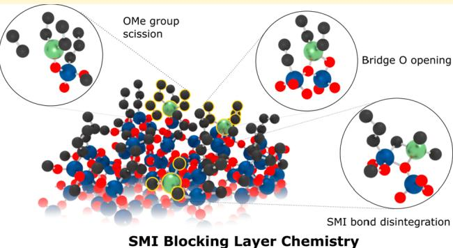

# 1. INTRODUCTION

With many dependent industries and the ubiquity of modern electronic commodities, semiconductor manufacturing has long been a key technology of the 21st century with applications ranging from integrated circuits to solar cells. In view of the climate crisis, the steadily growing demand poses challenges that can partly be addressed by the downsizing of features toward novel nanowatterned devices to reduce the energy required for manufacturing and use. Despite its transition to ever shorter wavelengths, photolithography technology today represents a bottleneck in terms of manufacturing capacity and feature size reduction down to a few nanometers. Therefore, the development of alternative bottom- up fabrication techniques yielding patterned ultrathin films while qualifying for high- volume manufacturing has sparked greater interest in the scientific community and industry.

Atomic layer deposition (ALD) has potential in the field, as it allows for the fabrication of conformal layers of a variety of materials on diverse substrates with angstrom- level thickness control. This is achieved by applying the cyclic processing of precursor and co- reactant molecules using self- limiting surface reactions. In addition, the method has long been extended to achieve surface- selective material deposition, termed area- selective ALD (AS- ALD). AS- ALD processes might allow for the application of ALD in the manufacturing of complex three- dimensional devices of the future, where several types of materials are present at the same time and surface- selective material deposition must be achieved.

The idea of AS- ALD (Scheme 1) is to deposit material on the growth surface (GS) while sparing the non- growth surface (NGS). To achieve this, the chemical properties of the respective substrate surfaces need to be exploited. The most versatile strategy at the moment uses inhibitor molecules selectively binding to the NGS. Thereby, the NGS is shielded against precursors and co- reactants, which allows for broad implementation in various AS- ALD systems. The first class of inhibitors used belongs to the class of self- assembling monolayers (SAMs) that consist of a reactive head group tuned to selectively bind to the NGS and a large tail group to achieve a dense blocking layer on the NGS. Although SAMs have been shown to ensure high selectivity over many cycles

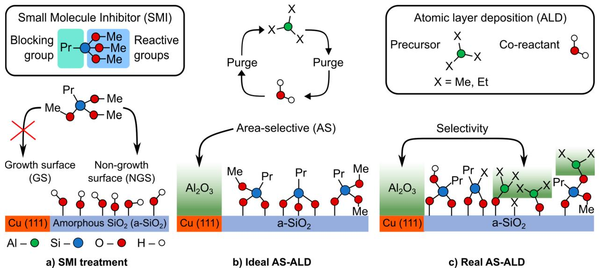  
Scheme 1. An Overview of the AS-ALD Process Studied in This Work

$^a$  (a) The tridentate SMI binds to the  $\mathrm{Si - OH}$  groups on the NGS but does not block the GS. (b) The ideal outcome of the AS- ALD experiment is illustrated.  $\mathrm{Al}_2\mathrm{O}_3$  is deposited on the GS in a cyclic process of the aluminum precursor and the co- reactant water. The SMI layer on the NGS is inert against both the Al precursors and the co- reactant. (c) A more realistic picture of the AS- ALD is illustrated. The SMI blocking layer is progressively disintegrated by the reactants. Growth nucleation starts from within the SMI blocking layer, and the actual process selectivity is determined from the ratio of  $\mathrm{Al}_2\mathrm{O}_3$  nucleation between the NGS and the GS.

for various ALD processes, the disadvantages comprise their low volatility, often impeding gas phase application, and imprecise feature alignment at the GS/NGS interface.11,12

Accordingly, the level of interest in small molecule inhibitors (SMIs) has increased over the past few years. Essentially, the structure of SMIs is similar to that of SAMs, except for significantly shorter tail groups, which means that volatility is increased and the level of unintentional GS blocking is reduced.13 The successful application of SMIs to ensure high selectivity over many ALD cycles necessitates fine- tuning of both the SMI and the precursor molecules to the respective GS/NGS combinations.8,14,15 Several classes of SMIs have been proposed in the past, including methoxysilanes,14 methanesulfonic acid,16 acetylacetone,17 aminosilanes,18 aniline,19 and ethanethiols.12

Implementing SMI- based AS- ALD technologies in electronics manufacturing offers the promise of processing a wide variety of materials. Among the candidates for dielectric materials,  $\mathrm{Al}_2\mathrm{O}_3$  is a promising option for its excellent combination of a high dielectric constant, high permittivity, and high stability.20 A recent joint experimental and theoretical study14 investigated AS- ALD of  $\mathrm{Al}_2\mathrm{O}_3$  on copper as the GS and silicon oxide as the NGS. Therein, the selectivity of the process was analyzed in terms of its dependence on the head and tail groups of alkoxysilane SMIs and the bulkiness of the Al precursors. Among the studied SMIs, trimethoxy(propyl)silane (TMPS) was performing best. It was shown that the number  $(n)$  of reactive methoxy groups in the set of investigated SMIs  $\mathrm{Si(OMe)}_n\mathrm{R}_{n - 1}$  was decisive, with  $n = 3$  in TMPS showing the best performance, while variation of the alkyl group  $\mathbf{R} =$  methyl, ethyl, or propyl) only marginally influenced the blocking capability. This finding highlights the difference between SAMs and SMIs. Both families of inhibitors show "steric blocking" of the incoming precursor as well as "chemical passivation" of the reactive groups at the surface as blocking mechanisms.21 For SAMs, steric blocking is the major mechanism, while for SMIs, the chemical passivation plays the most important role.17

Some questions in the theoretical investigation of TMPS as the SMI remained unanswered: the significantly better blocking capacity of trifunctional over bifunctional alkoxysilanes and the reason for the improved selectivity of triethylaluminum (TEA) over trimethylaluminum (TMA). We will show that answering these questions reveals significantly new insights into blocking and decomposition mechanisms for AS- ALD with SMIs, which has implications far beyond the one system studied here in detail.

One main difference in our previous modeling approach compared to experiment, and most other studies in the literature, was in the surface model. While the experiment uses amorphous  $\mathrm{SiO}_2$ , a vast majority of computational studies, including ours, use crystalline surface models, mostly  $\alpha$ - quartz (Figure 1c) for the simplicity of modeling.22 The amorphous nature of the silicon oxide substrate complicates theoretical studies because it does not show a strictly periodic arrange

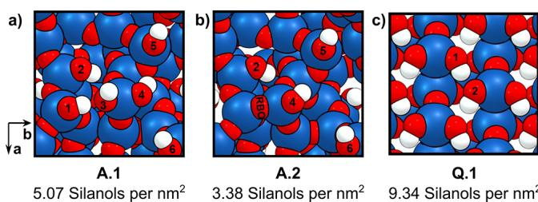  
Figure 1. Top view of the unit cell of  $\mathrm{a - SiO}_2$  models (a) A.1 and (b) A.2 used in this study and (c) idealized  $\alpha$ -quartz model Q.1 used previously and most often. The numbers 1-6 denote the oxygen atoms of the surface silanol groups.  $\mathrm{Si - OH}$  groups with the same numbers on both A.1 and A.2 are bound to the same silicon atoms of the underlying  $\mathrm{SiO}_2$  framework. An RBO species is present on A.2. Color code: Si - blue, O - red, H - white. See Figure S1 for a side view of the surface models.

ment, yet key structural aspects of the  $\alpha$  - quartz surface deviate strongly from those of amorphous silica  $\left(\mathrm{a - SiO}_2\right)$  .Most obvious is the difference in  $\mathrm{Si - OH}$  groups at the surface, the reactive silanol groups that are the major site for ALD growth on  $\mathrm{SiO}_2$  . The value of  $9.34\mathrm{Si - OH}$  groups per  $\mathrm{nm}^2$  for  $\alpha$  - quartz is more than twice the experimentally determined averaged maximum of  $4.9\mathrm{Si - OH}$  groups per  $\mathrm{nm}^2$  for a-  $\mathrm{SiO}_2$  23

Moreover, the  $\alpha$  - quartz model contains only two distinguishable surface silanol species (Figure 1c), which are both geminal silanols. In contrast,  $\mathrm{a - SiO}_2$  features several individual silanols (Figure 1a,b) with unique chemical environments, which has a strong influence on reactivity.24,25 Thus, using the  $\alpha$  - quartz model for  $\mathrm{a - SiO}_2$  could lead to the absence of essential features of the surface reactivity as we will show in this study.

Recently, there has been more evidence that simplified models deviating from the reality of amorphous surfaces used experimentally hinder the microscopic understanding of ASALD processes. For example, Sandupatla et al. showed that the absence of reactive bridge oxygen (RBO) species, whose frequent occurrence must be assumed in the case of sintered silica surfaces, prevents the understanding of relevant side reactions during the deposition of  $\mathrm{Al}_2\mathrm{O}_3$  26 Furthermore, an amorphous silicon oxide model was used in a combined theoretical and experimental work by Suh et al., studying the area- selective deposition of  $\mathrm{ZrO}_2$  by competitive adsorption.27

Another important experimental observation in AS- ALD that has not been tackled from a theoretical perspective is the diminishing selectivity in SMI- based approaches with the number of ALD cycles. Usually, the blocking of the NGS is found for only 10- 50 cycles.1,13 It is currently not clear what the key mechanisms for this selectivity loss are. Several chemical reactions could be responsible, like interactions of the SMI with a precursor molecule and a co- reactant or thermal decomposition of the SMI layer. This information currently cannot be accessed by experimental methods and warrants a first- principles computational treatment.

Herein, we present the first comprehensive study of AS- ALD on  $\mathrm{a - SiO}_2$  investigating the SMI layer buildup process and various mechanisms driving the progressive disintegration of the blocking layer (Scheme 1). We reevaluate the chemistry of TMPS on a set of  $\mathrm{a - SiO}_2$  slab models in contrast to the crystalline slabs. A nonheuristic approach is derived to infer the best stabilized blocking layer configurations for different  $\mathrm{Si - OH}$  densities, resulting in several SMI layer models at full  $\mathrm{Si - OH}$  coverage. From these considerations, a theoretical upper SMI layer density limit is determined and understood by energy decomposition analysis for extended systems. The full coverage models are used in a comprehensive mechanistic study determining the most plausible blocking layer decomposition reactions. Herein, we compare the reactivity of TMA and TEA, incorporating the effect of the blocking layer density on the observed activation barriers. In addition, the relevant chemistry of the blocking layer with the co- reactant water is studied.

The results of this study highlight that the blocking layer is not a chemically inert phase and provide hints about how modification of the SMIs before or during the AS- ALD experiment could enhance the selectivity of SMI- based processes.

# 2.COMPUTATIONAL METHODS

2.1. Computational Details. The Perdew- Burke- Ernzerhof (PBE) functional with the  $\mathrm{D3(B)}^{28,29}$  dispersion correction was used for density functional theory (DFT) calculations involving periodic boundary conditions. All calculations were carried out without spin polarization. Calculations of surface reactivity were conducted with the Vienna Ab initio Simulation Package (VASP, version 5.4.4).30- 32

A plane wave cutoff of  $550\mathrm{eV}$  was chosen within the projector- augmented wave (PAw) approach,33 and a Gaussian smearing of 0.05 eV was used.34 The plain wave cutoff, the vacuum gap thickness, and the  $\mathrm{k}$  - point grid have been converged up to an individual inaccuracy of  $< 1.5\mathrm{kJ}\mathrm{mol}^{- 1}$  for the adsorption energies of several TMPS configurations on  $\mathrm{a - SiO}_2$  . The reciprocal space was sampled by a  $\Gamma$  centered  $(2\times 2\times 1)$  grid generated via the Monkhorst- Pack division scheme.35 The wave function and the forces were converged up to  $10^{- 7}$  eV and  $10^{- 2}$  eV  $\mathring{\mathrm{A}}^{- 1}$  in single- point (SP) and geometry optimization (GO) calculations, respectively. Initial guesses of the minimum energy paths (MEP) of the investigated reactions were obtained by the image- dependent pair potential (IDPP) method,36 and a nudged- elastic- band with climbing- image (CI- NEB) method,37,38 was used to converge the MEP to a force criterion of  $2\times 10^{- 2}$ $\mathrm{eV}\mathring{\mathrm{A}}^{- 1}$  . The transition states (TS) were then refined with the Dimer method39 by converging the wave function and forces up to  $10^{- 9}\mathrm{eV}$  and  $5\times 10^{- 3}\mathrm{eV}\mathring{\mathrm{A}}^{- 1}$  respectively. To examine the imaginary modes of the TS and for the calculation of Gibbs energies at typical ALD conditions  $(T = 180^{\circ}\mathrm{C};p = 133.3\times 10^{- 6}\mathrm{bar})$  , numeric frequencies were calculated by finite differences with a displacement of  $0.01\mathrm{\AA}$  and a self- consistent field (SCF) criterion of  $10^{- 7}$  eV. The TS was reoptimized until only one imaginary mode remained, which was ignored in the calculation of Gibbs energies. A conjugate gradient force optimization engine was used throughout this work, except for the CI- NEB runs, in which the FIRE algorithm40 was used.

Two pseudoamorphous slab models were adopted from a previous study.26 In this study, the models had been created by truncating a  $\mathrm{SiO}_2$  glass model. A vacuum layer was introduced, and the cell parameters were chosen to fit the density of  $\mathrm{a - SiO}_2$  . The resulting slab was reacted with  $\mathrm{H}_2\mathrm{O}$  to form terminal  $\mathrm{Si - OH}$  groups, resulting in two models with distinct  $\mathrm{Si - OH}$  densities. Lastly, the models were annealed in a molecular dynamics (MD) experiment and further subjected to GO. Thus, both slabs share the same basic framework and unit cell parameters:  $a = 1.072 \mathrm{nm}$ $b = 1.104 \mathrm{nm}$  and  $\alpha = \beta =$ $90^{\circ}$  . They differ in their silanol densities (Figure 1). The silanol- rich amorphous silica model (A.1) contains six surface silanols, and the silanol- reduced amorphous silica model (A.2) possesses four surface  $\mathrm{Si - OH}$  groups and an RBO species. A vacuum layer of  $10\mathrm{\AA}$  was introduced in the  $\mathcal{Z}$  - direction corresponding to the topmost atom in each calculation to prevent interactions due to the periodic boundary conditions. Although this model shows periodicity, we will refer to it as an amorphous surface model as it represents the major features of an amorphous  $\mathrm{SiO}_2$  surface.

The energy decomposition analysis method using periodic boundary conditions  $(\mathrm{pEDA})^{41,42}$  was carried out using the BAND program shipped with the Amsterdam Molking Suite.43  $\Gamma$  point only calculations were conducted with  $10^{- 7}\times \mathrm{V}$  (number of atoms)  $\times E_{\mathrm{h}}$  as the wave function convergence criterion. A TZ2P basis set was chosen. Except for the electrons from the outermost shell, all electrons were subjected to the frozen- core approximation. Moreover, relativistic effects were considered through the scalar relativistic ZORA approach.44,45

The employed methodology of combining ab initio DFT with the semiempirical DFT- D3 dispersion correction method allows for convenient decomposition of any calculated energy into the electronic  $(\Delta E_{\mathrm{elec}})$  and dispersion  $(\Delta E_{\mathrm{disp}})$  contributions as exemplified for the total energy  $(\Delta E)$  in

$$
\Delta E = \Delta E_{\mathrm{elec}} + \Delta E_{\mathrm{disp}} \tag{1}
$$

A more detailed view is given by pEDA. Here, interaction energy  $\Delta E_{\mathrm{int}}$  between fragments A and B is given as the energy difference of the compound  $(E_{\mathrm{AB}})$  minus single- fragment energies  $E_{\mathrm{A}}$  and  $E_{\mathrm{B}}$

$$
\Delta E_{\mathrm{int}} = E_{\mathrm{AB}} - (E_{\mathrm{A}} + E_{\mathrm{B}}) \tag{2}
$$

As shown in eq 1,  $\Delta E_{\mathrm{int}}$  itself is composed of an electronic  $\left[\Delta E_{\mathrm{int}}(\mathrm{elec})\right]$  and a dispersion  $\left[\Delta E_{\mathrm{int}}(\mathrm{disp})\right]$  term:

$$
\Delta E_{\mathrm{int}} = \Delta E_{\mathrm{int}}(\mathrm{elec}) + \Delta E_{\mathrm{int}}(\mathrm{disp}) \tag{3}
$$

In the pEDA,  $\Delta E_{\mathrm{int}}(\mathrm{elec})$  is decomposed into three well- defined terms

$$
\Delta E_{\mathrm{int}}(\mathrm{elec}) = \Delta E_{\mathrm{elstat}} + \Delta E_{\mathrm{Pauli}} + \Delta E_{\mathrm{orb}} \tag{4}
$$

where  $\Delta E_{\mathrm{elstat}}$  represents the quasiclassical electrostatic energy of the fragments, Pauli term  $\Delta E_{\mathrm{Pauli}}$  accounts for the destabilization due to the Pauli exclusion principle, and  $\Delta E_{\mathrm{orb}}$  signifies the energy gain through charge transfer and polarization due to relaxation of the wave function in the final step of the analysis. For a detailed derivation and discussion of the terms, see ref 46.

If not stated otherwise, the calculation formula of the total energy  $(\Delta E)$  employs the gas phase energies of all non- covalently bound species, reactants, and products alike. Exemplified for the reaction of a TMPS molecule with the A.1 slab, the reaction formula to derive  $\Delta E$  is

$$
\mathrm{A.1 + TMPS_{gas}\rightarrow(A.1 + TMPS) + n\mathrm{methanol_{gas}}} \tag{5}
$$

where  $n$  is 1- 3 depending on the number of condensation reactions undergone and bonds formed.

Coherently,  $\Delta E$  is calculated as

$$
\Delta E = E(\mathrm{A.1 + TMPS}) + nE(\mathrm{methanol})_{\mathrm{gas}} - E(\mathrm{A.1}) - E(\mathrm{TMPS})_{\mathrm{gas}}
$$

Throughout the paper, we discuss  $\Delta E$  in the same terms used for discussing enthalpies of reaction. The term "endothermic" applies to a positive  $\Delta E_{\mathrm{r}}$  and "exothermic" to a negative change in total energy. Furthermore, we use an indexed "R" to mark the reaction energy

$$
\Delta E_{\mathrm{B}} = \Delta E_{\mathrm{P}} - \Delta E_{\mathrm{I}} \tag{7}
$$

where an intermediate state "T" reacted to a product "P"

$$
\mathrm{I}\rightarrow \mathrm{P} \tag{8}
$$

2.2. Strain Energy Penalty for Multiply Bonded SMI Species. There is a stress induced in the silica surface when bonding to the same SMI in a bidentate or tridentate fashion. As an additional tool to quantify the reactivity of two or three individual silanol groups to bind to one TMPS yielding a doubly bonded (DB) or triply bonded SMI (TB) motif, we estimate the introduced strain to the surface as an energy penalty to the reaction energy following Scheme 2. According to Scheme 2b, the TB bonding penalty  $\left(\Delta E_{\mathrm{TB - pen}}\right)$  is calculated as

$$
\Delta E_{\mathrm{TB - pen}} = E(\mathrm{TBresidue}) - E(\mathrm{relaxedmodel}) \tag{9}
$$

Scheme 2. Lewis Structures Illustrating the Calculation of the Energy Penalty Invoked by the Formation of Multiply Bonded SMI Species, Shown for the TB SMI Configuration

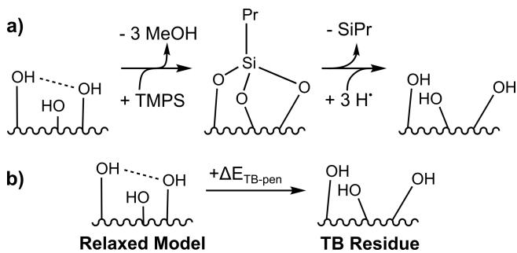

$^a$  (a) Formation of the TB SMI and then removal of the SMI and saturation with hydrogen, whose positions are subject to GO. (b)  $\Delta E_{\mathrm{TB - pen}}$  is obtained as the difference in the relaxed surface model against the residue of the TB configuration shown in panel a.

Although not explicitly determined in this work, calculation of the DB bonding penalty  $\left(\Delta E_{\mathrm{DB - pen}}\right)$  would be analogous to that of  $\Delta E_{\mathrm{TB - pen}}$

2.3. Nomenclature. The prefixes A.1 and A.2 denote the amorphous slab models according to Figure 1. Free surface  $\mathrm{Si - OH}$  groups are addressed by O and a number sign (#); e.g., A.1- O1 indicates the  $\mathrm{Si - OH}$  group at O1 position on A.1 (Figure 1a). Surface- bonded SMI configurations are identified by O, followed by the number of bonding positions, e.g., A.2- O:245 (Figure 2a,c). In case sets of surface- bound SMIs are addressed, the respective bonding positions are separated by a slash, e.g., A.1- O:123/56/4 (Figure 2b,d).

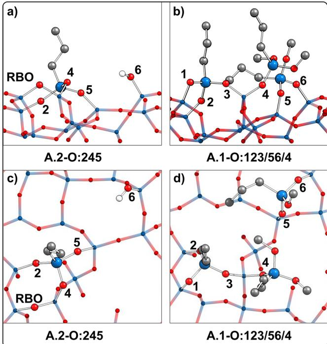  
Figure 2. Specific adsorption configurations for TMPS on  $\mathrm{a - SiO_2}$ . Panels a and c depict the side and top views, respectively, of the A.2- O:245 configuration. The positions of the bonding silanols are marked, as well as the free  $\mathrm{Si - OH}$  (O6) and the RBO species. Panels b and d depict the side and top views, respectively, of A.1-O:123/56/4. C-bonded H atoms have been omitted for the sake of clarity.

The following colors apply to the elements throughout the publication: green for aluminum, black for carbon, white for hydrogen, red for oxygen, and blue for silicon.

# 3. RESULTS AND DISCUSSION

The discussion is organized in three sections. In section 3.1, the reactivity of a single SMI is discussed. On the basis of the thereby gained knowledge, models for SMI blocking layers are derived in section 3.2. In section 3.3, the possible decomposition mechanisms of these blocking layers through aluminum precursors and water are discussed.

3.1. Reactivity of a Single SMI Molecule. Initially, the chemistry of a single TMPS molecule on  $\mathrm{a - SiO_2}$  is evaluated because the knowledge of the likely SMI configurations is fundamental to understanding the SMI layer buildup process. In the previous study conducted on the  $\alpha$ - quartz slab, TMPS has been found to form a precursor state (PS) by chemisorption, whereupon the singly bonded (SB) and DB configurations may arise in two subsequent condensation reactions (Figure 3c). This chapter now shows the SMI chemistry for the amorphous models.

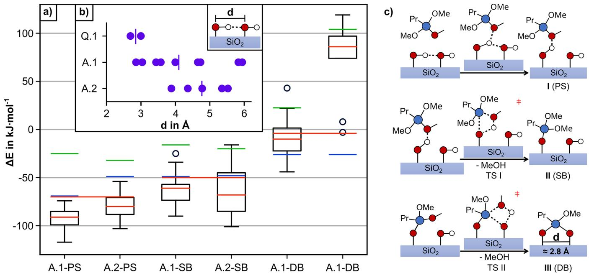  
Figure 3. (a) Adsorption and reaction energies of the bonding steps of TMPS as illustrated in panel c are given as box plots for both  $\mathrm{a - SiO_2}$  surface slabs. The red line gives the median reaction energy  $(\Delta E)$  together with its mean electronic (  $\Delta E_{\mathrm{elec}}$  green) and dispersion (  $\Delta E_{\mathrm{disp}}$  blue) contributions. The dashed red line marks the total reaction energy on the  $\alpha$  -quartz model.14 (b) Plot showing the inter-silanol distances of the different surface models (I, vertical lines mark the average  $\mathrm{Si - OH}$  distance of the respective slabs. (c) Reaction schemes illustrating the chemisorption process (I, first row), the first condensation reaction to the SB (II, second row), and the second condensation reaction to the DB bonding configuration (III, third row).

Figure 3a provides an overview of the energetics. Starting with reaction I ending in PS, the chemisorption is on average slightly stronger on A.1 than on A.2. The adsorption energy (eq 1) shows that this stems from an increased dispersion contribution  $(\Delta E_{\mathrm{disp}})$ , while the electronic energy contribution  $(\Delta E_{\mathrm{elec}})$  is slightly less stabilizing on A.1 than on A.2. The less negative  $\Delta E_{\mathrm{elec}}$  value is a direct effect of the higher  $\mathrm{Si - OH}$  density on A.1, leading to a shorter distance between the surface  $\mathrm{Si - OH}$  groups (Figure 3b). Consequently, the hydrogen bond (H- bond) network in which most surface silanols are involved is also stronger. As the PS is formed by establishing an H- bond to one methoxy group of TMPS, an inter- silanol H- bond needs to be broken. Thus, the energy necessary to break the stronger H- bonds on A.1 to form the PS results in a positive shift of the  $\Delta E_{\mathrm{elec}}$  values.

This is also reflected in the comparably weaker bonding for the chemisorbed configuration found on the previously investigated Q.1 surface  $\left[\Delta E\left(\Delta E_{\mathrm{elec}} / \Delta E_{\mathrm{disp}}\right) = - 73\left(- 20 / - 53\right)\mathrm{kJ}\mathrm{mol}^{- 1}\right]$ . Here, the H- bond network is composed of two kinds of very strong H- bonds (Figure 3b). Hence, the penalty on  $\Delta E_{\mathrm{elec}}$  to the chemisorption is much higher compared to that of the amorphous slabs, leading to an overall less stabilized PS.

Next, we discuss the SB configurations of TMPS on  $\mathrm{a - SiO_2}$  (reaction II in Figure 3c). This condensation reaction is mainly endothermic, presupposing the removal of methanol as shown for Q.1 previously. The median reaction energy is more positive than the respective chemisorption energy on both A.1 and A.2 and slightly lower on A.2 than on A.1. For this reaction, the mean dispersion contribution to the SB TMPS configurations is equal on both amorphous slabs. The slightly lower mean electronic contribution to the reaction energy of A.2- SB can again be attributed to changes within the H- bond network at different silanol densities. To wit, the condensation reaction of TMPS with the surface converts one  $\mathrm{Si - OH}$ , which can be an H- bond donor and acceptor at the same time, to an oxygen species that is neither a donor nor a good acceptor of H- bonds. Consequently, the H- bond network is more disrupted by the condensation reaction when the  $\mathrm{Si - OH}$  density is higher (A.1). The on average less favorable reaction energy observed for Q.1  $\left(\Delta E = 50\mathrm{kJ}\mathrm{mol}^{- 1}\right)$  fits this observation. Note, however, how the spread of the A.2- SB reaction energies is larger than the values for A.1- SB. The reason is that the smaller the amount of  $\mathrm{Si - OH}$ , the more the characteristics of the specific bonding site and its embeddedness in the H- bond network show in the data. The more surface  $\mathrm{Si - OH}$  groups remain after the condensation reaction, the more flexible the H- bond network is to adjust to the changes invoked by the bonding of the SMI. In contrast, if the  $\mathrm{Si - OH}$  density is lower, it is more likely to be irrecoverably disrupted if an especially good H- bond acceptor and donor are replaced by an oxygen linker during the reaction. This is a good example for the strong influence of the  $\mathrm{Si - OH}$  density in the computational model on the reactions observed.

Now, we examine the second condensation reaction (reaction III in Figure 3c) leading to a DB SMI configuration. This reaction is only slightly exothermic on A.1 and strongly endothermic on A.2. On the one hand, this is a consequence of the moderate decrease in  $\Delta E_{\mathrm{disp}}$  to more positive values by the removal of one methanol from the system, which reduces the atom count and thereby the  $\Delta E_{\mathrm{disp}}$  term, necessarily. On the other hand, the contribution of  $\Delta E_{\mathrm{elec}}$  to the DB SMI configuration is strongly shifted to positive values. Whereas  $\Delta E_{\mathrm{disp}}$  is equal in both systems regardless of the remaining silanol density of the slabs,  $\Delta E_{\mathrm{elec}}$  differs strongly between both surfaces and thus determines the trend in reaction energies. On A.1- DB, the median reaction energy is still mostly lower than that on the  $\alpha$ - quartz (Q.1) reference surface, which could be

explained by the H- bond network effects discussed above. However, the decrease in the mean electronic contribution from A.2- SB to A.2- DB of  $>100\mathrm{kJ mol^{- 1}}$  cannot be explained by the elimination of some H- bonds from the system. Rather, the reason is in the structure of the DB configuration (Figure 3c) and the distribution of distances of the  $\mathrm{Si - OH}$  groups on the surface (Figure 3b). Inside a DB configuration, the former  $\mathrm{Si - OH}$  oxygen atoms now involved in the bonding to TMPS show a distance of  $\sim 2.8\mathrm{\AA}$ . Other than A.1 and Q.1, the  $\mathrm{Si - OH}$  oxygen distances at A.2 are at least  $1\mathrm{\AA}$  greater than that mark. To accomplish the bonding of the SMI, the underlying silicon oxide framework needs to deform strongly in A.2 for the oxygen atoms to enable bonding in DB. These adjustments within the slab framework impose an energetic penalty on the obtained DB configuration that show up in the strongly endothermic  $\Delta E_{\mathrm{elec}}$  of A.2- DB. Still, two outliers in A.2- DB are energetically similar to most A.1- DB configurations. They belong to the closest pair of  $\mathrm{Si - OH}$  groups on A.2 at positions O5 and O6. The dependency of the energetic penalty of DB bonding motifs on the distance of the silanols is continued below.

In conclusion, we have explored how the PS chemisorption energies and the SB reaction energies differ from the  $\alpha$ - quartz reference. Mainly, we find that  $\Delta E_{\mathrm{elec}}$  follows the same trend as the  $\mathrm{Si - OH}$  density and thereby the strength of the H- bond network:  $\mathrm{Q.1 > A.1 > A.2}$ . Likewise, the energetics of the DB motif depend on the  $\mathrm{Si - OH}$  density, as well, only that it is not the strength of the H- bond network, but the distances between the  $\mathrm{Si - OH}$  groups that control whether a stable DB configuration can be formed. All in all, it was shown that the trends between the surface models can be understood from simple structural arguments considering the density and distribution of the  $\mathrm{Si - OH}$  groups.

3.1.1. TB Bonding Motif. In addition to the variability in the reaction energies and the occurrence of energy penalties in the DB bonding motif, the crucial difference in the description of the SMI chemistry is the absence of the TB bonding motif on the Q.1 model. In contrast, a third condensation reaction step consuming the remaining SMI methoxy group can be achieved on a-  $\mathrm{SiO}_2$  slabs (Figure 2).

The generation of TB SMI configurations is unexpected on the  $\mathrm{a - SiO}_2$  models, because the distances between  $\mathrm{Si - OH}$  groups are on average longer than on Q.1 (Figure 3b). However, three other significant structural motifs entail the altered chemistry of the amorphous system: (a) the surface roughness, i.e., the presence of surface  $\mathrm{Si - OH}$  groups from different silica layers, (b) the non- uniform alignment of the functional groups, and (c) the lack of crystallinity and the reduced volumetric mass density implying a higher flexibility of the uppermost silica layers.

Still, the overview of the total reaction energies of the obtained TB SMI configurations in Table 1 comprises only endothermic reaction energies that vary widely from  $26\mathrm{kJ}$ $\mathrm{mol}^{- 1}$  (A.1- O:123) to an enormous value of  $529\mathrm{kJ}\mathrm{mol}^{- 1}$  (A.1- O:245). Calculation of the TB formation penalty energies  $\Delta E_{\mathrm{TB - pen}}$  in Table 1; see Scheme 2b for the formula reveals that structural distortions in the amorphous slabs dictate the energetic disparity of the TB configurations. Exemplified for A.1- O:245, a large fraction of  $459\mathrm{kJ}\mathrm{mol}^{- 1}$  of the  $\Delta E_{\mathrm{elec}}$  value  $(546\mathrm{kJ}\mathrm{mol}^{- 1})$  can be attributed to such distortions. Correspondingly, another portion of the high electronic energies likely results from strain within the SMI- surface bonds. All in all, these results, and the visualization of specific

Table 1. Comparison of the Total, Electronic, Dispersion, and TB Energy Penalty Terms of TB-SMI Configurations  

<table><tr><td></td><td>ΔE</td><td>ΔEelec</td><td>ΔEdisp</td><td>ΔETB-pen</td></tr><tr><td>A.1-O:123</td><td>26</td><td>20</td><td>6</td><td>45</td></tr><tr><td>A.1-O:146</td><td>173</td><td>180</td><td>-7</td><td>162</td></tr><tr><td>A.1-O:245</td><td>529</td><td>546</td><td>-17</td><td>459</td></tr><tr><td>A.2-O:245</td><td>432</td><td>430</td><td>2</td><td>330</td></tr></table>

TB structures (Figure S2), substantiate that  $\Delta E_{\mathrm{TB - pen}}$  and the accompanying high  $\Delta E_{\mathrm{elec}}$  values are due to comparably short range lattice deformations.

To further explore the emergence of triply bonded TMPS, the reaction pathway of three consecutive condensation reactions with  $\mathrm{Si - OH}$  groups at O1, O3, and O2 (see Figure 1) to form the most stable A.1- O:123 TB configuration was determined and thermodynamic correction terms to derive Gibbs energies were calculated (Figure 4a). The energetic profiles to form SB, DB, and TB proceed endothermically with regard to the change in internal energy assuming the desorption of methanol  $\Delta E_{\mathrm{R}}$  values of 37, 40, and  $51\mathrm{kJ}$ $\mathrm{mol}^{- 1}$ . With regard to the reaction barriers, the initial condensation step to yield SB TMPS requires the highest activation energy  $\left(\mathrm{TSI};\Delta E_{\mathrm{A}} = 142\mathrm{kJ}\mathrm{mol}^{- 1}\right)$ , the formation of the DB SMI has a comparably low- lying TS  $\left(\mathrm{TSII};\Delta E_{\mathrm{A}} = 101\mathrm{kJ}\mathrm{mol}^{- 1}\right)$ , and the barrier height of the last reaction step lies between the first two  $\left(\mathrm{TSII};\Delta E_{\mathrm{A}} = 127\mathrm{kJ}\mathrm{mol}^{- 1}\right)$ .

The structural changes accompanying the bonding of TMPS are shown in Figure 4b- h. The PS is formed by H- bond donation of the  $\mathrm{Si - O1 - H}$  group to one of the SMI methoxy groups (Figure 4b). TS I of the first condensation reaction (Figure 4f) is characterized by a considerable shortening of the  $\mathrm{Si - O_{surf}}$  distance between the reacting surface  $\mathrm{Si - OH}$  group and the SMI  $\left[\Delta d(\mathrm{Si - O_{surf}}) = - 1.721\mathrm{\AA}\right]$ .

Concomitantly, a proton transfer from the surface  $\mathrm{Si - OH}$  to the methoxy moiety occurs, preforming the methanol leaving group  $\left[\Delta d(\mathrm{O - H}) = 0.205\mathrm{\AA}\right]$ , which is accompanied by elongation of the  $\mathrm{Si - O}$  bond within TMPS  $\left[\Delta d(\mathrm{Si - O}) = 0.185\mathrm{\AA}\right]$ . Consequently, the SMI silicon atom forms a pentavalent state. These findings accurately resemble those for the Q.1 surface. Moreover, the same structural changes accompany the formation of DB (Figure 4d) over TS II (Figure 4f;  $\Delta d(\mathrm{Si - O_{surf}}) = - 1.693\mathrm{\AA};\Delta d(\mathrm{O - H}) = 0.461\mathrm{\AA};\Delta d(\mathrm{Si - O}) = 0.148\mathrm{\AA}$  and TS III (Figure 4h;  $\Delta d(\mathrm{Si - O_{surf}}) = - 1.302\mathrm{\AA};\Delta d(\mathrm{O - H}) = 0.274\mathrm{\AA};\Delta d(\mathrm{Si - O}) = 0.194\mathrm{\AA}$  of the second and third condensation reactions, respectively.

The similarity to the reaction of TMPS with the Q.1 surface given in ref 14 extends to the thermodynamic considerations. From the large entropic contribution due to the creation of a free methanol molecule, the overall Gibbs energy change is exergonic, reversing the reaction energy trend  $\left(\Delta G_{\mathrm{R}} = - 45\right.$ ,  $- 45$ , and  $- 15\mathrm{kJ}\mathrm{mol}^{- 1}$ . This suggests the possibility of the formation of TB TMPS in the experiment. An influence on the reaction barriers can also be observed. The activation energy decreases significantly for TS I  $\left(\Delta G_{\mathrm{A}} = 132\mathrm{kJ}\mathrm{mol}^{- 1};\Delta G_{\mathrm{A}} - \Delta E_{\mathrm{A}} = - 10\mathrm{kJ}\mathrm{mol}^{- 1}\right)$ , decreases slightly for TS II  $\left(\Delta G_{\mathrm{A}} = 96\mathrm{kJ}\mathrm{mol}^{- 1};\Delta G_{\mathrm{A}} - \Delta E_{\mathrm{A}} = - 6\mathrm{kJ}\mathrm{mol}^{- 1}\right)$ , and increases slightly for TS III  $\left(\Delta G_{\mathrm{A}} = 135\mathrm{kJ}\mathrm{mol}^{- 1};\Delta G_{\mathrm{A}} - \Delta E_{\mathrm{A}} = 7\mathrm{kJ}\mathrm{mol}^{- 1}\right)$ . Notably, this trend is different compared to findings in the  $\alpha$ - quartz surface, which could be due to the difference in surface entropy changes for the less rigid amorphous surface. Hence,

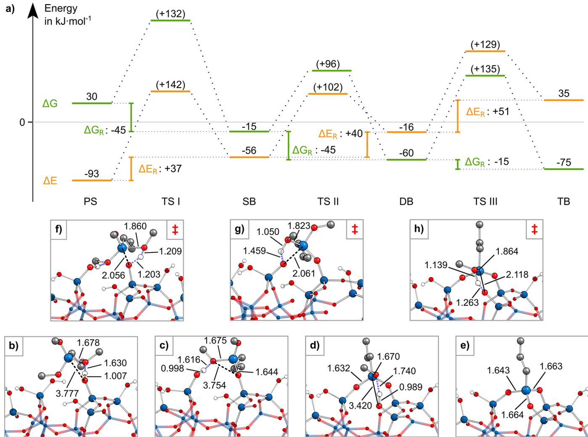  
Figure 4. (a) Energetic profile of the reaction of TMPS with the  $\mathrm{Si - OH}$  groups at O1, O3, and O2 of A.1. The total, activation, and reaction energies  $(\Delta E,\Delta E_{\mathrm{A}},$  and  $\Delta E_{\mathrm{R}},$  respectively) are colored orange, and the respective Gibbs energies  $(\Delta G,\Delta G_{\mathrm{A}},$  and  $\Delta G_{\mathrm{R}},$  respectively;  $180^{\circ}\mathrm{C},$  133.3  $\times 10^{-6}$  bar) are colored green. Activation energies are stated relative to the previous minimum in brackets, while reaction energies include an already desorbed methanol.  $(\mathrm{b - h})$  Adsorption and reaction structures of TMPS in side view. The configurations of (b) PS, (c) SB, (d) DB, and (e) TB and the corresponding structures of (f) TS I, (g) TS II, and (h) TS III are shown. Selected bond lengths in angstroms.

the reaction barriers of SB and TB formation roughly equal each other, whereas the DB SMI formation is energetically less demanding.

The feasibility of the TMPS molecule accomplishing three consecutive condensation reactions on  $\mathrm{a - SiO_2}$  to form the TB configuration can be assessed on the basis of the following thermochemical considerations. As a rough estimate, assuming a typical ALD reaction temperature of  $180^{\circ}\mathrm{C},$  first- order kinetics, and a preexponential factor of the Eyring equation (e) of 1, the conversion rates of certain energy barriers can be estimated for a typical combined dose and soak time of  $5\mathrm{min}$  (an example calculation is provided in the Supporting Information). For a barrier of  $135\mathrm{kJ}\mathrm{mol}^{- 1}$  the expected conversion rate is  $>50\%$ $\sim 20\%$  for a  $140\mathrm{kJ}\mathrm{mol}^{- 1}$  barrier, and still  $\sim 5\%$  at  $145\mathrm{kJ}\mathrm{mol}^{- 1}$  . In the case of A.1- O:123, we can expect conversion rates of  $\geq 50\%$  for all three reaction steps, implying that the formation of TB TMPS species is feasible during the actual ALD process. However, the formation energy penalty of the TB SMI configuration data (Table 1) suggests that the formation is strongly dependent on the actual bonding location. To wit, the  $\Delta E_{\mathrm{TB - pen}}$  energy of the next most plausible A.1- O:146 TB configuration is  $117\mathrm{kJ}\mathrm{mol}^{- 1}$  higher than that of A.1- O:123, and some portion of that energy penalty will enter and increase the activation barrier of both TS II and TS III. Because the activation barrier of A.1- O:123  $\left[\Delta G_{\mathrm{A}}(\mathrm{TS~III})\right.$ $= 136\mathrm{kJ}\mathrm{mol}^{- 1}]$  is already close to the feasible activation barrier maximum derived above, it is very likely to find the activation barrier of A.1- O:146 exceeding that limit [i.e.,  $\Delta G_{\mathrm{A}}(\mathrm{TS~III}) > 150\mathrm{kJ}\mathrm{mol}^{- 1}]$  . Thus, the A.1- O:146 TB configuration is unlikely to emerge under the typical ALD conditions. The same holds true for the other remaining TB configurations in Table 1, inducing even higher  $\Delta E_{\mathrm{TB - pen}}$  energies. Hence, A.1- O:123 is the most plausible and under typical ALD conditions only possible TB configuration on A.1. All in all, the discovery of the TB TMPS configuration signifies that the replacement of idealized by the more realistic  $\mathrm{a - SiO_2}$  models can involve qualitative changes in the observed surface chemistry and lead to new reactions being found.

3.1.2. Reactive Bridge Oxygen Opening Reaction of TMPS. In addition to the intended condensation reactions with the  $\mathrm{Si - OH}$  groups of  $\mathrm{a - SiO_2}$ , the occurrence of side reactions with the RBO surface motif was tested (Figure 1b). TMPS readily reacts with the RBO  $\left(\Delta E_{\mathrm{A}} = 26\mathrm{kJ}\mathrm{mol}^{- 1}\right)$  in an exothermic substitution reaction  $\left(\Delta E_{\mathrm{R}} = - 127\mathrm{kJ}\mathrm{mol}^{- 1}\right)$ , yielding both an

SB SMI and a methoxy group bonded directly to a Si surface atom (Figure 5). Initially, this reaction path seems to be beneficial from a conceptual point of view, because the RBO, which is known to instantaneously react with Al precursors, is removed from the surface and an SB SMI emerges.26 However, the additionally formed methoxy group could lead to further side reactions with the co- reactant during the first water pulse, in which the hydrolysis of that methoxy group is likely to occur (Figure S3). This sequence of events yields a new free, unblocked  $\mathrm{Si - OH}$  species within the SMI blocking layer after the inhibitor pulse. If there are no adjacent SB or DB SMIs with correctly positioned substituents present within the blocking layer, the newly created free  $\mathrm{Si - OH}$  group would become an easy target for Al precursors during the second Al precursor pulse, initiating the growth nucleation of  $\mathrm{Al}_2\mathrm{O}_3$ . All in all, the RBO opening side reaction is a potential cause of selectivity loss in AS- ALD experiment.

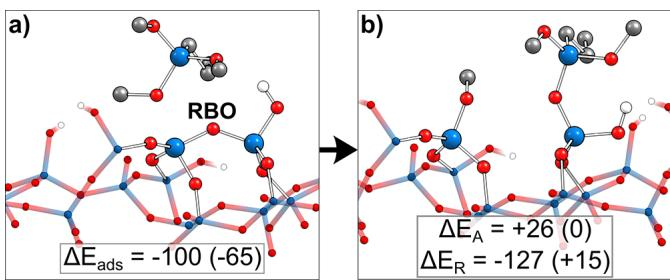  
Figure 5. TMPS reacting with the RBO species on A.2. (a) The initial (PS) and (b) final (SB SMI and methoxy group) state of the reaction are shown. Adsorption, activation, and reaction energies  $\left(\Delta E_{\mathrm{ads}}, \Delta E_{\mathrm{A}},\right.$  and  $\left.\Delta E_{\mathrm{R}},\right.$  respectively) in  $\mathrm{kJ} \mathrm{mol}^{-1}$ .

Although the RBOs are more reactive to TMPS than the surface silanols, it is not certain, however, whether TMPS will get close enough to the surface for the reaction to occur. Because the surface  $\mathrm{Si - OH}$  groups protrude from the surface into the vacuum and can form a PS by H- bonding to the SMIs, it is possible that the blocking layer is built without the occurrence of the RBO opening reaction. From this point of view, the presence of unreacted RBOs beneath the blocking layer is likely.

Going one step further, we find there is yet another set of side reactions to consider for analyzing the bonding of TMPS. This concerns the release of free methanol molecules in its condensation reactions with the  $\mathrm{Si - OH}$  groups. Because these newly formed methanol molecules are also present on the surface during the inhibitor pulse, they could undergo side reactions both with the remaining free  $\mathrm{Si - OH}$  groups and with RBOs, the latter resulting again in the Si surface atom- bonded methoxy group and a free surface silanol.

It is not within the scope of this work to establish the likeliness of these processes, but the arguments given above show that the presence of RBOs at the silica surface will have a deteriorating effect on the selectivity of the process. The discussion of the role of the RBO is extended below.

3.2. SMI Layer Buildup. 3.2.1. Toward Full SMI Coverage. Now that the chemistry of a single SMI molecule has been established, the next objective is the derivation of a reasonably arranged TMPS blocking layer, which is crucial for the inhibitory properties of the SMI- based AS- ALD approach. To wit, full  $\mathrm{Si - OH}$  coverage (chemical passivation) and optimal energetic stability of the SMI blocking layer are targeted. Through this approach, the absolute inhibitory capacity of TMPS on silica can be disclosed.

The most important step in achieving this goal is to derive a guideline whether, presupposing an SB SMI with a random surface  $\mathrm{Si - OH}$ , the formation of a DB SMI with a neighboring  $\mathrm{Si - OH}$  or the addition of a second SMI to the neighboring  $\mathrm{Si - OH}$  groups is energetically favored. Instead of directly calculating reaction barriers for a variety of cases, we argue that the barrier heights can be assessed from structural arguments concerning the  $\mathrm{Si - OH}$  distribution. This is in line with the principle of least motion47- 49 stating that the smallest reaction barrier is observed for a reaction showing the smallest structural changes. In detail, we estimate that the blocking layer assembly kinetics is made under the assumption that the dispersion energy term  $\left(\Delta E_{\mathrm{disp}}\right)$  is not decisive and can be neglected in the discussion. Instead, the focus is solely on the electronic part  $\left(\Delta E_{\mathrm{elec}}\right)$  of the total reaction energy (eq 1). The reason is that the reaction barrier height mainly depends on the formation of the pentavalent TS at the SMI silicon atom, whereas the dispersion interaction with the surface remains nearly constant during the reaction. The other major influence on the TS energy is the energy penalty invoked for the neighboring surface oxygen atoms to come into the proximity. Here the assumption is that the energy penalty to form the TS approximately equals that of the products according to the Hammond postulate.

In conclusion, the energetically most favorable full coverage models are derived by minimizing  $\Delta E_{\mathrm{elec}}$  by stepwise addition of TMPS molecules.

3.2.2. Comparison of the SB/SB and DB SMI Configurations. Once the first SMI has reacted to afford an SB configuration, the next step can be the formation of DB by the same SMI or adsorption of a second SMI into another SB configuration, leading to an SB/SB arrangement. The comparison of DB with SB/SB SMI configurations involving the same two  $\mathrm{Si - OH}$  groups can be perceived as a question of the best inter- silanol distances  $\left[d_{\mathrm{init}}\right.$  (Figure 6a)] for the respective configurations to form (Figure 6). Table S2 provides an overview of the structural and energetic signatures for possible DB configurations.

First, we discuss how  $\Delta E_{\mathrm{elec}}$  depends on the change in distance  $(\Delta d)$ . This metric represents the difference between the inter- silanol distance of the free surface  $\left(d_{\mathrm{init}}\right)$  and the distance after the adsorption of the SMI to the DB configuration  $\left(d_{\mathrm{bond}}\right)$  illustrated in Figure 6a. At low  $\Delta d$  values  $(0.7 - 1.2 \AA)$ $\Delta E_{\mathrm{elec}}$  quickly increases to reach a plateau at  $\Delta E_{\mathrm{elec}}$  of  $\approx 50 \mathrm{kJ} \mathrm{mol}^{- 1}$  (Figure 6b). Beyond the  $1.2 \AA$  mark (dashed line),  $\Delta E_{\mathrm{elec}}$  varies greatly, with values usually exceeding  $100 \mathrm{kJ} \mathrm{mol}^{- 1}$  relative to that of the best stabilized DB configuration [A.1- O:13 (Figure 4c)], a trend that is independent of the silanol densities of the two models. The cause is in the  $\Delta E_{\mathrm{DB - pen}}$  energy necessary to bring  $\mathrm{Si - OH}$  oxygens into bonding distance and due to the strain introduced into the DB configuration. When assuming that the energy penalty is mostly incorporated into the TS energy and hence the activation barrier and by knowing the activation energy of A.1- O:13  $\left[E_{\mathrm{A}} = 101 \mathrm{kJ} \mathrm{mol}^{- 1}\right.$  (TS II in Figure 4a)], we can give a rough estimate for the reaction barriers of the other DB configurations. At the plateau around a  $\Delta d$  of  $\approx 1.0 \AA$ , where  $\Delta E_{\mathrm{elec}} = 50 \mathrm{kJ} \mathrm{mol}^{- 1}$ , an activation barrier  $\left(\Delta E_{\mathrm{A}}\right)$  of  $\approx 101 + 50 \mathrm{kJ} \mathrm{mol}^{- 1}$  results, which approaches the upper boundary of barriers we deem viable under ALD conditions. As a consequence, as  $\Delta E_{\mathrm{elec}}$  drastically increases for most config-

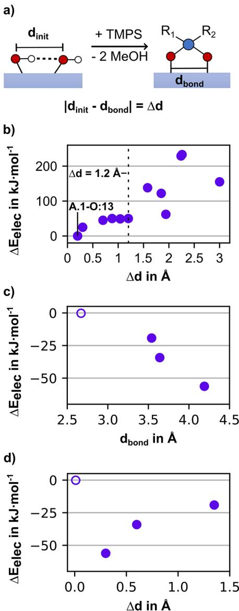  
Figure 6. Dependency of the reaction energies of DB and SB/SB SMI configurations on the  $\mathrm{Si - OH}$  distance. (a) Scheme visualizing the initial inter-silanol distance  $(d_{\mathrm{init}})$ , the DB  $\mathrm{O_{surf}}$  bonding distance  $(d_{\mathrm{bond}})$ , and their difference  $(\Delta d)$ . (b) Plot showing the dependence of  $E_{\mathrm{elec}}$  on the  $\Delta d$  for DB SMI configurations, with A.1-O:13 as the reference. (c and d) Dependence of  $E_{\mathrm{elec}}$  of the SB/SB configurations on  $d_{\mathrm{bond}}$  and  $\Delta d$ , respectively, with the geminal A.1-O:34 configuration being the reference (empty circle).

urations beyond a  $\Delta d$  of  $>1.2\mathrm{\AA}$ , the formation of DB SMIs can be considered unlikely beyond that mark, which corresponds to inter- silanol distances  $(d_{\mathrm{init}})$  of  $\geq 4.0\mathrm{\AA}$ .

Next, we discuss the alternative bonding scenario, the SB/SB SMI configurations. Figure 6c illustrates the correlation of  $\Delta E_{\mathrm{elec}}$  with  $d_{\mathrm{init}}$  (data in Table S3). Here, the electronic stability of the SB/SB configurations increases with  $d_{\mathrm{init}}$ . The reversed trend is found for the dependency of  $\Delta E_{\mathrm{elec}}$  on  $\Delta d$  illustrated by Figure 6d. The larger the  $\Delta d$ , the less negative  $\Delta E_{\mathrm{elec}}$ , except for the geminal SB/SB configuration. These trends originate in the steric repulsion of the SMIs in adjacent bonding sites. The data show that SMIs in the proximity are pushed apart, and the larger the separation, the smaller  $d_{\mathrm{init}}$ . However, the stabilization through increasing the inter- SMI distance is mitigated by the energy penalty necessary to move the  $\mathrm{Si - OH}$  oxygen atoms upon reaction. In other words, the farther the  $\mathrm{Si - OH}$  groups of an SB/SB configuration are apart initially, the weaker the repulsion and the smaller the energy penalty invoked to weaken the repulsion. This explains the comparatively low level of electronic stabilization of the SB/SB configuration formed by a pair of geminal  $\mathrm{Si - OH}$  groups (Figure 6c,d). The repulsion between the two inhibitor molecules is strong, but the distance of the geminal  $\mathrm{Si - OH}$  groups is fixed; therefore, shifts within the slabs cannot balance the repulsion. The repulsion and consecutive changes in the surface are still present in the SB/SB configuration for which  $d_{\mathrm{bond}} = 4.2\mathrm{\AA}$ , which is larger than the  $d_{\mathrm{init}}$  at which DB configurations are still plausible (4 Å).

In conclusion, we have found clear indications that, in line with what chemical intuition tells us, short inter- silanol distances favor the formation of DB configurations, whereby two SB SMIs prefer configurations with large inter- silanol distances.

3.2.3. Derivation of the Best Stabilized Full Coverage Models. We will now demonstrate how the findings presented above can be used to derive the most stable full coverage configurations without explicit computation of all permutations. In a stepwise manner, we will increase the amount of SMIs within the unit cell up to five SMIs and discuss the most stable configurations.

First, the possibility of fully blocking the slab by covering all of the  $\mathrm{Si - OH}$  groups with just two SMIs is explored on A.2. Full coverage means that all four  $\mathrm{Si - OH}$  groups at the surface are bonded to an SMI. This can be accomplished by either forming a TB with O2, O4, and O5, and an SB with O6, or choosing two DB configurations. However, we have already shown that all DB and TB configurations are hindered by energy penalties, with A.2- O:56  $[d_{\mathrm{init}}< 4\mathrm{\AA};\Delta E_{\mathrm{elec}}(\mathrm{A.2 - O:}56) - \Delta E_{\mathrm{elec}}(\mathrm{A.1 - O:}13) = 50\mathrm{kJ mol^{- 1}}]$  being the sole exception. Therefore, it is unrealistic to cover A.2 with only two SMIs. With three SMIs, the problem comes down to finding the best DB/SB/SB combination. Indeed, picking A.2- O:56 as the only well- stabilized DB configuration and forming two SB SMIs with the remaining O2 and O4 positions feasibly saturate all of the  $\mathrm{Si - OH}$  groups. This configuration nets an exothermic total reaction energy  $\Delta E$  of  $- 68\mathrm{kJ mol^{- 1}}$  (A.2- O:56/2/4 in Table 2). For four SMI molecules, the only viable configuration consists of four SBs (A.2- O:2/4/5/6) and nets a negative  $\Delta E$

Table 2. Energies of Blocking Layer Models at Full Silanol Coverage  

<table><tr><td>configuration</td><td>SMI density</td><td>ΔE</td><td>ΔEelec</td><td>ΔEdisp</td></tr><tr><td>A.2-O:56/2/4</td><td>2.5</td><td>-68</td><td>119</td><td>-187</td></tr><tr><td>A.2-O:2/4/5/6</td><td>3.4</td><td>-192</td><td>137</td><td>-349</td></tr><tr><td>A.1-O:123/56/4</td><td>2.5</td><td>-55</td><td>42</td><td>-97</td></tr><tr><td>A.1-O:13/56/2/4</td><td>3.4</td><td>-115</td><td>149</td><td>-264</td></tr><tr><td>A.1-O:56/1/2/3/4</td><td>4.2</td><td>214</td><td>680</td><td>-466</td></tr><tr><td>A.1-O:123/45/6</td><td>2.5</td><td>-8</td><td>85</td><td>-93</td></tr><tr><td>A.2-O:24/56</td><td>1.7</td><td>82</td><td>134</td><td>-52</td></tr><tr><td>A.1-O:16/23/45</td><td>2.5</td><td>8</td><td>119</td><td>-111</td></tr><tr><td>A.1-O:13/24/56</td><td>2.5</td><td>128</td><td>252</td><td>-124</td></tr><tr><td>A.1-O:14/23/56</td><td>2.5</td><td>121</td><td>242</td><td>-121</td></tr><tr><td>A.1-O:123/4/5/6</td><td>2.5</td><td>93</td><td>359</td><td>-266</td></tr></table>

The top four rows represent the best stabilized models at the respective SMI density per surface model. All energies in  $\mathrm{kJ mol^{- 1}}$ .  $\Delta E$  is given by eq 5.  $\Delta E = \Delta E_{\mathrm{elec}} + \Delta E_{\mathrm{disp}}$  (see eq 1). SMI density in the number of SMIs per  $\mathrm{nm}^2$ .

$(- 192\mathrm{kJ mol^{- 1}})$  .Trivially, finding a solution for five SMIs is not possible for the lack of further Si- OH groups on this slab model.

Considering next the A.1 model, having six surface silanols adds to the complexity of the problem overview in Scheme S2). First, reacting all of the Si- OH groups with just two SMIs, i.e., a stable TB/TB configuration, is not possible, as it cannot be accomplished by any combination of the known TB configurations in Table 1. For combinations comprised of three SMIs, the choice is between the best DB/DB/DB and TB/DB/SB combinations. Instead of pursuing a heuristic approach, we make choices on the basis of our knowledge of the bonding configurations that depend of the silanol distances. Considering first the DB/DB/DB configuration, it is convenient to start with O3 and O4. The pair of geminal  $\mathrm{Si - }$  OH groups cannot bind to the same SMI, as this would form a two- membered  $\mathrm{Si - O}$  ring (labeled by the number of Si atoms in the ring), which implies a severe energy penalty in its formation. Thus, we exclude the A.1- O:34 DB configuration. Hence, both  $\mathrm{Si - OH}$  groups at positions O3 and O4 need to form DBs of their own, yielding A.1- O:3#/4#/## (here # is used as a place holder for a yet unassigned  $\mathrm{Si - OH}$  position). Looking for good DB options containing O3, we find both O1 and O2 as rather close pairing partners. Forming the energetically best combination (i.e., O:13) would leave O2 without a neighbor to form an energetically acceptable DB configuration. Hence, we choose O:23, resulting in A.1- O:23/ 4#/##. Among the remaining choices for O1, O6 is the nearest neighbor, which leaves OS as a good pairing partner for O4. Thus, A.1- O:16/23/45 represents the best DB/DB/DB configuration. Although it is slightly endothermic in energy  $(\Delta E = 8\mathrm{kJ mol^{- 1}})$  the comparison to the next best choices (A.1- O:13/24/56 with a  $\Delta E$  of  $128\mathrm{kJ mol^{- 1}}$  and A.1- O:14/ 23/56 with a  $\Delta E$  of  $121\mathrm{kJ mol^{- 1}}$  confirms the plausibility of the approach, as the  $\Delta E_{\mathrm{elec}}$  term is more positive by  $>100\mathrm{kJ}$ $\mathrm{mol}^{- 1}$  in these cases  $\Delta E_{\mathrm{elec}} = 119$  252, and  $242\mathrm{kJ mol^{- 1}}$  for A.1- O:16/23/45,A.1- O:13/24/56, and A.1- O:14/23/56, respectively).

The TB/DB/SB solution to saturate all of the  $\mathrm{Si - OH}$  groups is rather straightforward. Because O:123 is the only viable TB configuration and O:56 is the energetically preferred DB among the remaining surface silanols, the result is A.1- O:123/56/4. Upon addition of a fourth SMI, A.1- O:13/56/2/ 4 is the best choice conforming to the viable DB/DB/SB/SB combination. It features the two best stabilized DB configurations, with regard to the  $\Delta E_{\mathrm{elec}}$  term  $\Delta E_{\mathrm{elec}}(\mathrm{A.1 - }$  O:13, A.1- O:56)  $= - 23$  and  $3\mathrm{kJ mol^{- 1}}$  Table S2)].Another plausible choice, TB/SB/SB/SB, results in A.1- O:123/4/5/6 for the same reasoning as above. However, the  $\mathrm{Si - OH}$  groups at O5 and O6 are separated by merely  $3.04\mathrm{\AA}$ $(d_{\mathrm{init}})$  . Thus, forming SB SMIs on both positions leads to smaller electronic contributions due to steric repulsion and the energy penalty invoked to mitigate it  $\left[\Delta E_{\mathrm{elec}}(\mathrm{A.1 - O:123 / 4 / 5 / 6}) = 359\mathrm{kJ}\right.$ $\mathrm{mol}^{- 1}]$  .For similar steric reasons, the higher- coverage configuration A.1- O:56/1/2/3/4 (five SMIs) is energetically unfavorable as discussed in detail in the next section.

3.2.4. Quantifying Inter- SMI Forces with pEDA. As shown in the previous section, adding a fifth SMI molecule to the system, increasing the SMI density to  $4.2\mathrm{SMIs} / \mathrm{nm}^2$  results in a high total endothermic reaction energy of  $214\mathrm{kJ mol^{- 1}}$  A.1-  $\mathrm{O:56 / 1 / 2 / 3 / 4)}$  . The reason is a vast increase in  $\Delta E_{\mathrm{elec}}$  from A.1- O:13/56/2/4 to A.1- O:56/1/2/3/4 of  $531\mathrm{kJ mol^{- 1}}$  which cannot be offset by the corresponding stabilization through dispersion by  $- 202\mathrm{kJ mol^{- 1}}$  . As the progression from A.1- O:13/56/2/4 toward A.1- O:56/1/2/3/4 involves the replacement of the O:13 DB by two SBs, an energy penalty is expected to occur through adjustments within the surface. However, the effect is too pronounced to be explained by slight conformational adjustments of the surface. Furthermore, the strongly increased dispersion term  $\Delta E_{\mathrm{disp}}$  indicates intense inter- SMI interactions within the blocking layer.

Thus, to understand the electronic effects involved in our different blocking layer models, we investigate the source of destabilization by decomposing the inter- SMI interactions. This is important because the driving forces for achieving maximum SMI coverage are not yet well understood. To this end, pEDA calculations were conducted on SMI layer models [SLMs (Figure 7)], which were derived from fully covered blocking layer models as explained in Figure S4.

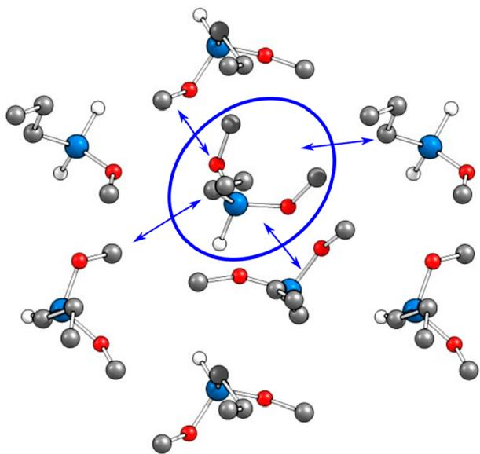  
Figure 7. Top view of the SLM. The blue ellipsoid marks the SMI at position O2 chosen as fragment in the pEDA. Double-pointed arrows indicate the SMI's interactions with the surrounding SMIs within the SLM.

Table 3 comprises the results for the SMI at position O2, whose interactions with the surrounding SMI layer are determined. Position O2 was chosen as the SMI is in the SB configuration in all of the SLMs. It hence shares the same amount of unreacted methoxy groups in all full coverage models. Interaction energy  $\Delta E_{\mathrm{int}}$  which shows the overall interactions between the central SMI and the surrounding layer, becomes more attractive with an increase in SMI density from A.2- O:56/2/4  $(- 29\mathrm{kJ mol^{- 1}})$  to A.2- O:2/4/5/6 and A.1- O:13/56/2/4  $(- 36\mathrm{kJ mol^{- 1}})$  but becomes repulsive for the densest model, A.1- O:56/1/2/3/4  $(27\mathrm{kJ mol^{- 1}})$  . Therefore, the SMI interlayer interaction is most favorable at  $3.4\mathrm{SMIs} / \mathrm{nm}^2$  . The positive value of  $\mathrm{E}_{\mathrm{int}}$  of  $27\mathrm{kJ mol^{- 1}}$  A.1- O:56/1/2/3/4) implies that the SLM would gain energy if the fifth SMI is removed. A decomposition of the overall interaction energy discloses the opposing trends for the electronic  $\Delta E_{\mathrm{int}}(\mathrm{elec})$  and dispersion interaction energies  $\Delta E_{\mathrm{int}}(\mathrm{disp})$  . With an increase in SMI density from 3.4 to 4.2  $\mathrm{SMIs} / \mathrm{nm}^2$  the attractive  $\Delta E_{\mathrm{int}}(\mathrm{disp})$  approximately doubles from  $- 77$  to  $- 132\mathrm{kJ mol^{- 1}}$  ,while  $\Delta E_{\mathrm{int}}(\mathrm{elec})$  is nearly 4 times more repulsive (40 vs  $159\mathrm{kJ mol^{- 1}}$  .To understand this

Table 3. pEDA Results of the SLMs with the SB SMI at Position O2 Chosen for the Fragmenta  

<table><tr><td>SLM</td><td>A.2-O:56/2/4</td><td>A.2-O:2/4/5/6</td><td>A.1-O:13/56/2/4</td><td>A.1-O:56/1/2/3/4</td></tr><tr><td>ΔEint</td><td>-29</td><td>-36</td><td>-36</td><td>27</td></tr><tr><td>ΔEint(elec)</td><td>17</td><td>41</td><td>41</td><td>159</td></tr><tr><td>ΔEint(disp)</td><td>-46</td><td>-77</td><td>-77</td><td>-132</td></tr><tr><td>ΔEpauli</td><td>78</td><td>139</td><td>148</td><td>474</td></tr><tr><td>ΔEelstat</td><td>-35 (57%)</td><td>-55 (56%)</td><td>-63 (59%)</td><td>-194 (62%)</td></tr><tr><td>ΔEorb</td><td>-26 (43%)</td><td>-43 (44%)</td><td>-44 (41%)</td><td>-121 (38%)</td></tr><tr><td>SMI densityc</td><td>2.5</td><td>3.4</td><td>3.4</td><td>4.2</td></tr></table>

All values in  $\mathrm{kJ}\mathrm{mol}^{-1}$  , calculated using PBE-D3/TZ2P. Fragments: single SMI and surrounding SMI layer as shown in Figure 7b. Fragmentation: closed shell. Percentage values give the relative contributions to attractive pEDA terms  $\Delta E_{\mathrm{elstat}}$  and  $\Delta E_{\mathrm{orb}}$  SMI density in number of SMIs per  $\mathrm{nm}^2$

sudden overcompensation,  $\Delta E_{\mathrm{int}}(\mathrm{elec})$  is further decomposed (see eq 3). Both electrostatic interaction  $\Delta E_{\mathrm{elstat}}$  and orbital relaxation term  $\Delta E_{\mathrm{orb}}$  stabilize the SLM with an increase in SMI density to  $- 194$  and  $- 121\mathrm{kJ}\mathrm{mol}^{- 1}$  respectively. In contrast, the destabilization based on Pauli repulsion  $\Delta E_{\mathrm{pauli}}$  is dramatically increasing with the SMI density reaching a value of  $326\mathrm{kJ}\mathrm{mol}^{- 1}$  for a density of  $4.2\mathrm{SMIs} / \mathrm{nm}^2$  .This observation implies that the SMIs are too densely packed for the electrons to facilely avoid each other. Consequently, a substantial destabilization of the interaction energy is observed, which cannot be offset by the increased dispersion attraction.

In conclusion, the pEDA results corroborate that the TMPS SMI has a theoretical upper SMI density limit of  $< 4.2$  SMIs/  $\mathrm{nm}^2$  with Pauli repulsion being the decisive force at this limit.

3.2.5. Increasing SMl Density: Combining Mono- and Trifunctional SMIs. During the last subsections, viable SMI configurations and densities toward full coverage of the  $\mathrm{a - SiO_2}$  surface have been established. For a change of perspective, this chapter shows an example, how the conformational freedom of the inhibitor in its bonding configurations can lead to incomplete silanol coverage. Subsequently, a remedy is briefly discussed. Panels a and b of Figure 8 show two DB- O:13 conformers on A.1 that differ in the placement of the remaining methoxy group. In Figure 8a, the methoxy groups points toward O2, where it can form the well- stabilized TBO:123 configuration by another condensation reaction. However, the methoxy group in Figure 8b points away from O2, so that O2 remains unblocked. Adding two additional SMIs in the energetically most favorable way to this structural motif results in A.1- O:13/56/4. Here, DB- O:56 and SB- O:4 were selected, because TB- O:256 cannot be formed and O:24 is hindered by a strong energy penalty. Hence, O2 remains unblocked in this surface model. Furthermore, computational experiments to acquire either a PS or a TS with a fourth TMPS molecule at the remaining Si- OH group at position O2 failed, because O2 is the least accessible  $\mathrm{Si - OH}$  of the ensemble.

Accordingly, it is not certain that the O2 group is covered by TMPS during the blocking layer buildup process. The comparison of the total reaction energies of both A.1- O:13 DB configurations shows that the DB configuration leading to A.1- O:123 is more stable by  $15\mathrm{kJ}\mathrm{mol}^{- 1}$  which hints that its occurrence could be more likely. However, even a minor presence of configurations as in Figure 8b could facilitate growth nucleation, because free silanol groups are probably the main source of selectivity loss during ALD experiments.21 The accessibility of the free O2 Si- OH group by Al precursors TMA and TEA was checked in the A.1- O:13/56/4 bonding scenario. Both TMA and the sterically more demanding TEA were found to form well- stabilized precursor states with the unblocked silanol (Figure S5).

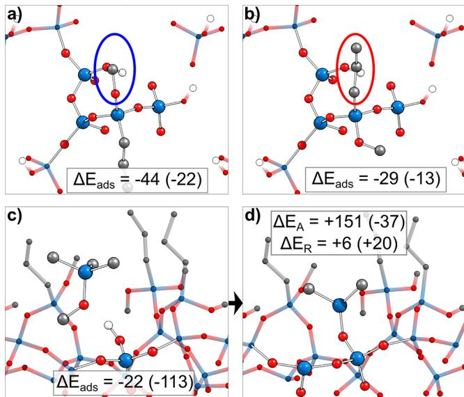  
Figure 8. Two possible configurations of DB-O:13 on A.1 that differ in the orientation of the unreacted groups of TMPS. (a) The conformer can form TB-O:123, because the methoxy group is directly above the O2 silanol (blue circle). (b) The conformer cannot react with O2, and the SMI propyl group screens the Si-OH group from reacting with an additional TMPS molecule (red circle). (c) PS of MTMS with the free O2 silanol of the A.1-O:13/56/4 configuration. (d) Product of MTMS with the Si-OH at O2 of the A.1-O:13/56/4 configuration. The  $\Delta E_{\mathrm{A}}$  and  $\Delta E_{\mathrm{R}}$  values are given with respect to the energy of the adsorbate structure  $(\Delta E_{\mathrm{ads}})$ . Values in parentheses state the dispersion contribution to that respective energy. All energies in kJ  $\mathrm{mol}^{-1}$ .

One strategy shown by Mackus et al. in the past was to add a second, smaller SMI to increase the  $\mathrm{Si - OH}$  coverage and SMI density.19,50,51 As TMPS is itself too bulky to block O2, whether the pulsing of another, smaller SMI could be advantageous was tested. Panels c and d of Figure 8 show the PS and SB state of O2 on A.1- O:13/56/4 for the monofunctional methoxytrimethylsilane (MTMS) inhibitor. The adsorption is exothermic  $(\Delta E_{\mathrm{ads}} = - 22\mathrm{kJ}\mathrm{mol}^{- 1})$ . The slightly endothermic condensation reaction  $(\Delta E_{\mathrm{R}} = 6\mathrm{kJ}\mathrm{mol}^{- 1})$  is hindered by a barrier of  $151\mathrm{kJ}\mathrm{mol}^{- 1}$ . Thus, the resulting activation energy is slightly higher than that of TMPS with the pristine A.1 surface model  $[\Delta E_{\mathrm{A}}(\mathrm{TSI}) = 142\mathrm{kJ}\mathrm{mol}^{- 1}$  (Figure 3a)]. Therefore, an extended soak time could be necessary for optimal silanol coverage of the second SMI.

These results show that full coverage of all  $\mathrm{Si - OH}$  groups is virtually impossible for one SMI. However, the combination of

different SMIs could improve the achievable silanol coverage and thereby the selectivity of the AS- ALD process. Thus, we propose a combination of TMPS and MTMS in AS- ALD experiments to achieve increased  $\mathrm{Si - OH}$  coverage and thus enhanced selectivity.

3.3. SMI Layer Decomposition: Interaction with TMA, TEA, and  $\mathbf{H}_2\mathbf{O}$ . We now have a clear picture of how the SMI blocking layer can build up. The chemical stability of these layers is very important for the application of AS- ALD. We thus investigated the possible decomposition reactions during the ALD of  $\mathrm{Al}_2\mathrm{O}_3$  on the SMI- covered NGS silicon oxide (Scheme 3). We focus on precursors TMA and TEA that were

# Scheme 3. Overview of the Potentially Reactive Bonds (thick blue bonds) That May Lead to Side Reactions on the NGS Silicon Oxide during ALD of  $\mathrm{Al}_2\mathrm{O}_3$

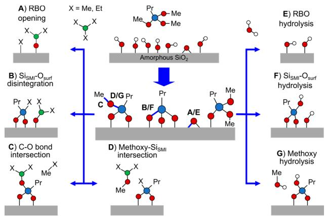

used experimentally for this system.14 Because blocking layers of differing SMI densities were derived, the influence of the SMI density on the reactions can be assessed. The predominant chemistry of Al precursors is the breaking of polar bonds in a ligand exchange reaction (LER). Therein, Al binds to the nucleophilic bonding partner while the alkyl ligand is transferred to the electrophilic bonding partner. In the RBO opening reaction (Scheme 3A), the Al precursor binds to the oxygen, and a ligand of the precursor molecule is transferred to the now undersaturated surface Si atom. In Scheme 3B, the  $\mathrm{Si_{SMI} - O_{surf}}$  bond is broken. Al binds to oxygen, and a precursor ligand transferred to the otherwise unsaturated  $\mathrm{Si_{SMI}}$  atom. Scheme 3C shows the  $\mathrm{C - O}$  bond intersection mechanism, in which the Al precursor binds to the methoxy group oxygen atom, while the ligand is transferred to the carbon atom. Thereby, an alkane is formed, which leaves the surface. The reaction shown in Scheme 3D is similar to the previous reaction, only that the Al ligand is transferred to the  $\mathrm{Si_{SMI}}$  atom instead of the oxygen atom. Hereby, a new Al precursor molecule, di(m)ethylaluminum(m)ethoxide, is formed and a second alkyl moiety remains at the  $\mathrm{Si_{SMI}}$  atom.

In addition to the Al precursor reactions, the bespoke oxygen- silicon bonds can undergo hydrolysis with the coreactant water. Reaction E shows the hydrolysis of the RBO yielding two surface silanols. Hydrolysis S of the  $\mathrm{Si_{SMI} - O_{surf}}$  bond is shown in mechanism F, and the  $\mathrm{Si_{SMI} - O_{meth}}$  bond can be split by hydrolysis as shown in reaction G.

3.3.1. Role of the RBO Motif: Reactions A and E. The LER of TMA with the RBO species of an  $\mathrm{a - SiO_2}$  slab was demonstrated by Sanduputla et al. for the bare A.2 surface.26 The reaction has been shown to exhibit a very low activation barrier of  $< 10\mathrm{kJ}\mathrm{mol}^{- 1}$  making it a major candidate for growth nucleation sites during the ALD of  $\mathrm{Al}_2\mathrm{O}_3$  26 Moreover, in their work, Xu et al. indicated that the mechanism of selectivity loss in different ALD experiments on silicon oxide might be attributed to the breaking of strained  $\mathrm{Si - O - Si}$  bonds by the precursor molecules.52,53 Two questions are essential for assessing the role of the RBO: (1) whether the precursors can breach the blocking layer to adsorb at the RBO and (2) whether the SMI layer can hamper the reactivity of the RBO toward the Al precursors.

Figure 9a presents the energy diagram showing the adsorption of TEA on the RBO and the subsequent LER

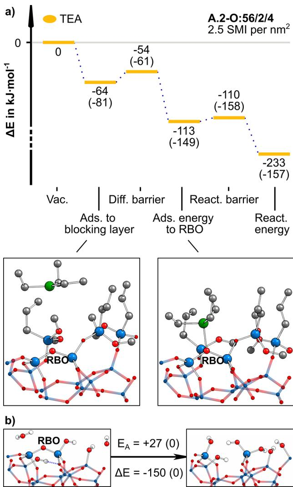  
Figure 9. RBO opening reactions with TEA and  $\mathrm{H}_2\mathrm{O}$ . (a) Reaction path of TEA from left to right: vacuum state, physisorption to the top of the blocking layer, intralayer diffusion barrier, adsorbed state at RBO, reaction barrier, and RBO reaction product. The reaction energies  $(\Delta E)$  are given with the contribution to the dispersion in parentheses  $(\Delta E_{\mathrm{disp}})$ . (b) Reaction of a water molecule with the RBO of the A.2 model and the respective energy barrier. All energies in kJ  $\mathrm{mol}^{-1}$ .

using an A.2- O:56/2/4 model (TMA is found in Figure S6). Initially, TEA adsorbs to the top of the blocking layer  $(\Delta E_{\mathrm{ads,top}} = - 64\mathrm{kJ}\mathrm{mol}^{- 1})$  before penetrating the blocking layer with a low intralayer diffusion barrier  $(\Delta E_{\mathrm{ads,A}} = 11\mathrm{kJ}\mathrm{mol}^{- 1})$  and reaching the RBO in an overall exothermic process  $(\Delta E_{\mathrm{ads,RBO}} = - 113\mathrm{kJ}\mathrm{mol}^{- 1})$ . The main stabilization up to this step stems

from dispersion attraction. However, once it has arrived, the RBO is opened instantaneously in a strongly exothermic LER with a negligible reaction barrier  $\left(\Delta E_{\mathrm{ads,A}} = 3 \mathrm{kJ} \mathrm{mol}^{- 1}\right)$ , leading to a very stable product  $\left(\Delta E_{\mathrm{R}} = - 232 \mathrm{kJ} \mathrm{mol}^{- 1}\right)$ . Thus, the adsorption is not effectively blocked and the reaction is not prevented by the SMI layer. Essentially, the low intralayer diffusion barrier is itself an effect of the RBO. As the RBO is the result of a loss of two adjacent  $\mathrm{Si} - \mathrm{OH}$  groups, the local  $\mathrm{Si} - \mathrm{OH}$  density around the RBO is reduced.

The computational experiment was repeated for the A.2- O:2/4/5/6 configuration featuring a denser blocking layer of  $3.4 \mathrm{SMIs} / \mathrm{nm}^2$ . Surprisingly, neither TMA nor TEA showed a stable adsorption state at the RBO beneath the denser SMI layer. Furthermore, the reaction energies for the LER of the RBO are endothermic by 116 and  $88 \mathrm{kJ} \mathrm{mol}^{- 1}$  for TMA and TEA, respectively (Figure S7). This means that with an increase in the blocking layer density from 2.5 to  $3.4 \mathrm{SMIs} / \mathrm{nm}^2$ , a strong exothermic reaction was converted into an endothermic one. Moreover, because the reaction proceeds without leaving groups and the TMA fragments stay in the proximity on the surface, the reaction is reversible. Thus, even if the activation barrier could be overcome under ALD conditions to yield the product state, the equilibrium is clearly shifted to the side of the reactants. Hence, although the Al precursors might temporarily exist in the described product form, the thermodynamically expectable outcome is the restoration of the reactant state. Ultimately, because the adsorption at the RBO itself is endothermic, the desorption and purging of the Al precursors are highly likely during the purge phase. Therefore, even if a reaction of an Al precursor with the RBO takes place, it does not affect the selectivity of the process observed after a whole AS- ALD cycle at a sufficiently high blocking layer density. In other words, even if the chemical passivation of the initially present surface groups is not complete by the end of the inhibitor pulse, the thereby achieved SMI blocking layer density might still suffice to prevent side reactions through steric blocking.

All in all, this finding is consistent with the conclusions drawn from the pEDA on the SLM. Increasing the SMI layer density from 2.5 to  $3.4 \mathrm{SMIs} / \mathrm{nm}^2$  decreases the interaction energy of the SMIs, but with a further increase in the SMI layer density to  $4.2 \mathrm{SMIs} / \mathrm{nm}^2$ , a positive, destabilizing contribution is found. Likewise, adding TMA or TEA to a blocking layer already containing four SMIs per unit cell evokes strong repulsive forces, eventually preventing the intrusion of the Al precursors into the blocking layer (Table S4 and Figure S8). Thus, we draw the conclusion that the loss of selectivity through the RBO opening reaction can be prevented if the SMI layer density is maximized, yet as the existence of the RBO decreases the local silanol density, all TMPS molecules need to form SB configurations in our example to achieve the maximum SMI layer density of  $3.4 \mathrm{SMIs} / \mathrm{nm}^2$  on the A.2 model, which is quite improbable.

To circumvent the side reaction through LER at RBO altogether, an approach for removing the RBO before the application of TMPS in the inhibitor pulse was computationally explored. To determine whether the co- reactant water could be utilized to replace the RBO by two  $\mathrm{Si} - \mathrm{OH}$  groups, the reaction of A.2 with water to form A.1 was modeled (Figure 9b). With a low reaction barrier  $\left(E_{\mathrm{A}}\right)$  of  $27 \mathrm{kJ} \mathrm{mol}^{- 1}$ , the approach is feasible, as the RBO is nearly as reactive to the water co- reactant as to the Al precursors. Moreover, considering the strongly exothermic reaction energy  $\Delta E =$

$- 150 \mathrm{kJ} \mathrm{mol}^{- 1}$ , the inverse reaction has a high activation barrier  $\left(E_{\mathrm{A}} + \Delta E = 177 \mathrm{kJ} \mathrm{mol}^{- 1}\right)$ . As a side effect, the newly generated  $\mathrm{Si} - \mathrm{OH}$  groups can help in the bonding of the SMIs during the subsequent inhibitor pulse. This finding conforms with the results of recent experiments that corroborate the importance of appropriate surface hydroxylation through the pulsing of water to ensure the desired surface reactivity toward the precursor molecules. In summary, pulsing water before the inhibitor should be considered to enhance the selectivity of the AS- ALD process.

3.3.2. Degradation of the  $S_{\mathrm{SMI}} - O_{\mathrm{surf}}$  Bond: Reaction B. Whereas the RBO can be considered a surface artifact, whose occurrence might be circumvented by process optimization, the next reactive bond to be investigated is the fundamental  $\mathrm{Si}_{\mathrm{SMI}} - \mathrm{O}_{\mathrm{surf}}$  bond constituting the SMI blocking layer (Scheme 3B). Decomposition of the  $\mathrm{Si}_{\mathrm{SMI}} - \mathrm{O}_{\mathrm{surf}}$  bond by LER results in a surface- bound Al species that has a direct impact on selectivity as it constitutes an ALD nucleation site. Moreover, the Al species might undergo secondary reactions to adjacent  $\mathrm{Si}_{\mathrm{SMI}} - \mathrm{O}_{\mathrm{surf}}$  bonds, further undermining the blocking layer and possibly detaching SMIs from the surface. A gap would form within the blocking layer, allowing other Al precursors to penetrate, facilitating the growth of  $\mathrm{Al}_2\mathrm{O}_3$ , yet the occurrence of this decomposition pathway is necessarily preceded by the adsorption of the Al precursor through the blocking layer to the silicon oxide surface. The adsorption energies of TMA and TEA at the  $\mathrm{Si}_{\mathrm{SMI}} - \mathrm{O}_{\mathrm{surf}}$  bonds of a single SMI and within a blocking layer with  $2.5 \mathrm{SMIs} / \mathrm{nm}^2$  (A.1- O:123/45/6) are shown in Figure 10. TEA is slightly more strongly bonded than TMA (on O1) in both cases, and the bond becomes stronger for the higher SMI density (Figure 10b). This counterintuitive result stems from an increase in the level of dispersion interaction for TEA, while for TMA, covalent bonding contributions as well as dispersion interaction increase. For higher SMI densities, no stable adsorption structure of either Al precursor is found due to a strong increase in Pauli repulsion.

Next, we examine the reaction barriers for LER. We find moderate barrier heights on the isolated SMI  $\left(\Delta E_{\mathrm{A}}\right)$  of 93 (TMA) and  $105 \mathrm{kJ} \mathrm{mol}^{- 1}$  (TEA) (Figure 10a). Thus, the LER of the  $\mathrm{Si}_{\mathrm{SMI}} - \mathrm{O}_{\mathrm{surf}}$  bond represents a major threat to the selectivity of the AS- ALD process at low SMI densities, yet upon comparison of these results with the LER at the same O1 position at a higher blocking layer density of  $2.5 \mathrm{SMIs} / \mathrm{nm}^2$  (Figure 10b), the activation barriers are more than twice as high for both precursors  $\left[\Delta E_{\mathrm{A}}\right.$  values of 190 (TMA) and 217  $\mathrm{kJ} \mathrm{mol}^{- 1}$  (TEA)]. This hints at a previously unknown third inhibition mechanism of the blocking layer. It can enhance the activation energies of specific reaction mechanisms for the ALD precursors.

The rationale for this finding is in the spatial demand of the pentavalent TS at the  $\mathrm{Si}_{\mathrm{SMI}}$  atom (Figure 11b). As the precursor ligand approaches the Si atom, its propyl group and any remaining methoxy groups need to make room for the new bonding partner. They are displaced in the process, which can invoke repulsive forces within the blocking layer. In a general sense, the denser the blocking layer and the larger the ligands of the Al precursors, the stronger the forces acting against the displacement of the SMI's substituents. However, due to the amorphous nature of the underlying silicon oxide substrate and the resulting irregularity of the blocking layer configuration, the intensity of this effect will vary among the different adsorption sites and the various SMI layer configurations. Nevertheless, it

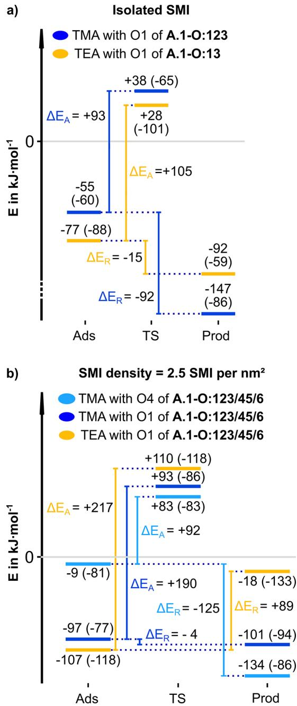  
Figure 10. Energetic overview of the disintegration of the  $\mathrm{Si}_{\mathrm{SMI}} - \mathrm{O}_{\mathrm{surf}}$  bond with the Al precursors for (a) a single SMI and (b) a blocking layer density of  $2.5 \mathrm{SMIs} / \mathrm{nm}^2$  within the A.1-O:123/45/6 SMI configuration. A depiction of several adsorbate structures is given in Figure S9. Total energy (dispersion contribution) with respect to the free reactants. All energies in kiloicules per mole.

should be a general mechanism also for other SMIs and ALD precursors.

In addition to the O1 physisorption site at A.1- O:123/45/6, TMA was found to possess another, just barely exothermic adsorption site at O4 of A.1- O:123/45/6  $\left(\Delta E_{\mathrm{ads}} = - 9 \mathrm{kJ} \mathrm{mol}^{- 1}\right)$ , where TEA would not adsorb (Figure 10b). Evidently, the lower bulkiness of TMA entails a larger number of possible adsorption sites beneath the SMI layer. Because of the very weak adsorbate stabilization at O4 and because the TS energy for the LER of TMA with O4 is less endothermic than for the reactions at O1  $(83 \mathrm{kJ} \mathrm{mol}^{- 1}$  vs  $93 \mathrm{kJ} \mathrm{mol}^{- 1})$ , a moderate activation barrier  $\left(E_{\mathrm{A}}\right)$  of  $92 \mathrm{kJ} \mathrm{mol}^{- 1}$  results. Thereby, TMA possesses an additional reaction channel that can be active even at a rather high blocking layer density of  $2.5 \mathrm{SMIs} / \mathrm{nm}^2$ . A comparison of the respective reaction energies further substantiates this observation. Considering the LER at O1, the reaction energy with TMA is slightly exothermic  $\left(\Delta E_{\mathrm{R}} = - 4 \mathrm{kJ} \mathrm{mol}^{- 1}\right)$ , whereas the same reaction is strongly endothermic with TEA  $\left(\Delta E_{\mathrm{R}} = 89 \mathrm{kJ} \mathrm{mol}^{- 1}\right)$ . This finding can be attributed to the different amount of repulsion invoked within the blocking layer by both Al precursors.

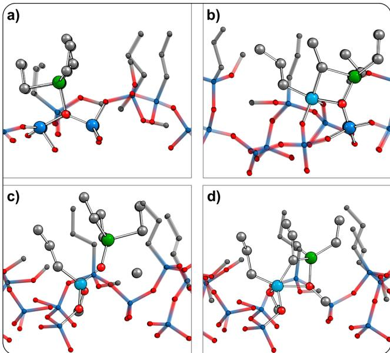  
Figure 11. Overview of the TS geometries of the LER of TEA with the bonds shown in Scheme 3: (a) RBO opening, (b)  $\mathrm{Si}_{\mathrm{SMI}} - \mathrm{O}_{\mathrm{surf}}$  bond disintegration, (c) C-O bond intersection, and (d) methoxy-  $\mathrm{Si}_{\mathrm{SMI}}$  intersection. The relevant  $\mathrm{Si}_{\mathrm{SMI}}$  atoms are colored lighter blue.

As a final remark, note that the especially low reaction energy of TMA at the O4 position  $\left(\Delta E_{\mathrm{R}} = - 125 \mathrm{kJ} \mathrm{mol}^{- 1}\right)$  is not caused by altered repulsion interactions within the blocking layer. Instead, it is rather affected by the stability of the specific SMI- surface bond configuration, i.e., the energy penalty released by the LER of multiply bonded SMIs. For example, upon comparison of the bonding positions O1 and O4 of A.1- O:123/45/6, the LER at O1 reduces the TB- O:123 to the still moderately strained DB- O:23 configuration, whereas the full amount of  $\Delta E_{\mathrm{DB - open}}$  is released when DB- O:45 is reduced to SB- O:5 by LER at O4 (Table S2). These general trends apply irrespective of the immense variance in the results caused by the amorphous nature of the silica substrate.

All in all, our findings corroborate the notion that the low- growth inhibition seen with TMA is partly due to its lower steric hindrance when adsorbing to  $\mathrm{O}_{\mathrm{surf}}$  atoms. Additionally, the product configurations of reaction type B are more likely to be favored over the adsorbate structures when the reaction is conducted with TMA, whereas the trend is reversed with TEA. Thus, our results reveal yet another novel aspect of the dependency of the reactivity of Al precursors on their ligands in AS- ALD experiments. Moreover, these results have several implications for not only the choice of the precursor but also our understanding of fundamental processes during AS- ALD experiments. The capacity of the blocking layer is not solely defined by its ability to hinder the penetration of precursor molecules or by covering of the Si- OH groups. Instead, it has

become clear that the blocking layer reduces the reactivity of the Al precursors with the  $\mathrm{Si_{SMI} - O_{surf}}$  bond as compared to the isolated SMI (1) by stabilizing the precursor, (2) by enhancing the TS energy, and (3) by moving to more endothermic  $\Delta E_{\mathrm{R}}$  values.

This is fundamentally a steric effect as it depends on the size of the precursor ligand, but it is different from what is known in the literature as "steric blocking", which means that the SMI layer prevents the precursor from reaching the surface at all. In our case, the precursor reaches the surface, but the SMI layer limits further reactivity. Depending on the SMI coverage and ALD precursor, one of the two effects dominates. We thus propose to split up the term "steric blocking" in the context of AS- ALD with SMIs into an "adsorption preventing" effect (the previously discussed effect) and the new "reactivity reduction" effect.

Furthermore, the determination of the  $\mathrm{Si_{SMI} - O_{surf}}$  disintegration mechanism provides one explanation for the accelerated loss of selectivity experimentally observed for TMA. The LER of the SMI- surface bond potentially separates SMIs from the surface, undermining the blocking layer in the process, whereby more Al precursors may breach the blocking layer over time.

3.3.3. Reactivity of Unreacted Methoxy Substituents: Reactions C, D, and G. In addition to the occasional RBO and the fundamental  $\mathrm{Si_{SMI} - O_{surf}}$  bond, another oxygen species that could lead to side reactions during AS- ALD is prevalent in the blocking layer in the form of unreacted SMI methoxy groups. As these groups cover most of the inter- SMI space (Figure S4c), exothermic chemisorption of the Al precursors and the co- reactant to the SMI- methoxy groups is found to be independent of the SMI layer density (Figure S10). From these adsorption sites, two reaction pathways are conceivable with diametrical outcomes with regard to the selectivity of AS- ALD.

In the first mechanism, an LER of the  $\mathrm{C} - \mathrm{O}$  bond splits the methoxy group (Scheme 3C). This results in an SMI- oxygen- connected precursor fragment, while ethane (TMA) or propane (TEA) is formed. Because the mechanism yields an SMI layer- bonded aluminum fragment, this could diminish the selectivity of the ALD process. In the second mechanism, the methoxy groups are substituted for the Al precursor ligand (methyl or ethyl), and a di(m)ethylaluminum(m)ethanoxide molecule is formed as the leaving group (Scheme 3D). In contrast to the former reaction pathway, this mechanism could be highly beneficial for the selectivity of the AS- ALD process, because it replaces the reactive methoxy groups with inert alkyl groups and ejects the Al species from the surface.

Figure 12 shows the activation barriers calculated for both mechanisms and Al precursors. Different SMI layer densities ranging from a single isolated SMI to full coverage models with SMI layer densities of 2.5 and  $3.4\mathrm{SMIs} / \mathrm{nm}^2$  were considered. Illustrations of the TS structures of both reaction pathways are provided in panels c and d of Figure 11 for the A.1- O:13/56/  $2 / 4$  blocking layer configuration  $(3.4\mathrm{SMIs} / \mathrm{nm}^2)$

Considering reaction C,  $\Delta E_{\mathrm{A}}$  increases with SMI layer density for both TMA  $\Delta E_{\mathrm{A}}$  values of 179, 206, and  $207\mathrm{kJ}$ $\mathrm{mol}^{- 1}$  and TEA  $\Delta E_{\mathrm{A}}$  values of 160, 193, and  $197\mathrm{kJ}\mathrm{mol}^{- 1}$  Overall,  $\Delta E_{\mathrm{A}}$  varies more strongly for the sterically more demanding TEA than for TMA, yet because its activation barrier is smaller at the isolated SMI and at both SMI layer densities, TEA can be considered the more reactive Al precursor in reaction C. However, all activation barriers exceed $150\mathrm{kJ}\mathrm{mol}^{- 1}$  , wherefore the reaction mechanism is unlikely to occur under ALD conditions.

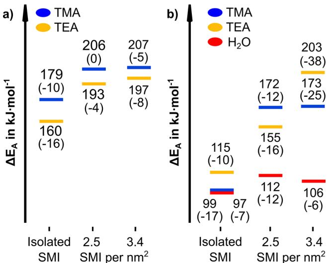  
Figure 12. Overview of the activation energies  $(\Delta E_{\mathrm{A}})$  of a the  $\mathrm{C} - \mathrm{O}$  bond intersection and (b) the methoxy-SMI intersection reaction at an unreacted methoxy group for an isolated SMI at two full coverage SMI layer densities of 2.5 and  $3.4\mathrm{SMIs} / \mathrm{nm}^2$

For reaction D, we observe the same stepwise increase in  $\Delta E_{\mathrm{A}}$  from the isolated SMI to a density of  $3.4\mathrm{SMIs} / \mathrm{nm}^2$  for both TMA  $\Delta E_{\mathrm{A}}$  values of 99, 172, and  $173\mathrm{kJ}\mathrm{mol}^{- 1}$  and TEA  $\Delta E_{\mathrm{A}}$  values of 115, 155, and  $203\mathrm{kJ}\mathrm{mol}^{- 1}$  .Again, the variance of  $\Delta E_{\mathrm{A}}$  is more pronounced for TEA than for TMA. Moreover, the SMI layer density has an overall stronger influence on reaction D than on reaction C. The trend of reactivity is not as clear. At the isolated SMI, the  $\Delta E_{\mathrm{A}}$  value of TMA is  $16\mathrm{kJ}\mathrm{mol}^{- 1}$  lower than that of TEA. Note how the trend is reversed at  $2.5\mathrm{SMIs} / \mathrm{nm}^2$  .Here the TS of TEA is better stabilized by  $- 17\mathrm{kJ}\mathrm{mol}^{- 1}$  . Considering finally the  $\Delta E_{\mathrm{A}}$  values at  $3.4\mathrm{SMIs} / \mathrm{nm}^2$  the TS of TMA is better stabilized by  $- 30\mathrm{kJ}\mathrm{mol}^{- 1}$  .All in all, reaction D is more likely to occur under ALD conditions than reaction C. With (more or fewer) isolated SMIs on the surface and with  $\Delta E_{\mathrm{A}}$  values of  $< 130\mathrm{kJ}$ $\mathrm{mol}^{- 1}$  reaction D is likely to occur for both TMA and TEA under the given ALD conditions. However, at an SMI layer density of  $2.5\mathrm{SMIs} / \mathrm{nm}^2$  the reaction barriers of TMA and TEA are already too high to exist under the given ALD conditions. Hence, neither reaction C nor reaction D is likely to influence the outcome of the AS- ALD experiment, if a dense SMI blocking layer has been acquired during the inhibitor pulse.

As we have pointed out in our discussion of disintegration reaction B and as one can see from our previous analysis of reactions C and D, the SMI layer increases  $\Delta E_{\mathrm{A}}$  with an increase in density. Upon comparison of reactions C and D in this regard, the influence of the SMI layer density on the  $\Delta E_{\mathrm{A}}$  value of bulkier TEA is larger than that of the smaller TMA precursor. Moreover, the SMI layer density more strongly influences reaction D  $(88\mathrm{kJ}\mathrm{mol}^{- 1}$  for TEA) than reaction C  $(37\mathrm{kJ}\mathrm{mol}^{- 1}$  for TEA). These trends can be understood when comparing the structure of the TS of both reactions (Figure 11c,d). In the case of the  $\mathrm{C} - \mathrm{O}$  bond intersection (reaction C), the TS shows the small  $\mathrm{CH}_3$  group being transferred from the methoxy oxygen to the Al precursor alkyl ligand. On the contrary, the  $\mathrm{Si_{SMI} - O_{meth}}$  intersection mechanism (reaction D) entails the approach of the Al precursor to form a pentavalent

TS at the  $\mathrm{Si}_{\mathrm{SMI}}$  center. Thereby, the groups present at the  $\mathrm{Si}_{\mathrm{SMI}}$  atom are displaced, and this displacement invokes repulsive forces within the surrounding SMI layer depending on the local SMI layer density. The same rationale applies to the comparison of the Al precursors. The approach of the larger ethyl ligand of TEA to form the pentavalent TS necessitates a larger displacement of the SMI- bonded groups than what is required for the smaller methyl ligands of TMA. The smaller the displacement necessary, the smaller the SMI layer effect on  $\Delta E_{\mathrm{A}}$ . Hence, the SMI layer effect is less pronounced for TMA than for TEA. Thus, the presented data corroborate our previous conclusions about the effect of the SMI layer on reactions happening within it. The higher the spatial requirements of a TS, the more pronounced its destabilization by the SMI layer. This could be used as a design strategy.

In addition to the precursor chemistry, the reaction of the co- reactant  $\mathrm{H}_2\mathrm{O}$  with the SMI methoxy group (Scheme 3G) was studied. The TS barrier heights are compiled in Figure 12b. With  $\Delta E_{\mathrm{A}}$  values of 97, 112, and  $106\mathrm{kJ}\mathrm{mol}^{- 1}$  from the lowest to highest SMI layer density, the activation barriers are roughly equal and show no clear trend regarding the SMI layer effect. This finding is well within the scope of our explanation given above. Because the water molecule is very small, the spatial requirement of the TS is also comparably small. Therefore, the repulsive forces induced within the SMI blocking layer that could destabilize the TS will be very small.

All in all, the results from the analysis of the SMI methoxy group chemistry could have several implications for the ASALD process. As the  $\Delta E_{\mathrm{A}}$  values of reaction G are well below  $130\mathrm{kJ}\mathrm{mol}^{- 1}$ , unreacted methoxy groups will be converted to hydroxyl groups during the first water pulse. Hence, as the methoxy groups have been removed, OH groups are present during the following precursor pulse. The gas phase reaction data presented in ref 14 suggest that these OH groups are very reactive to the Al precursors. Thus, the hydroxyl groups will react with the Al precursor molecules during the following precursor pulse, which leads to SMI- bound Al precursor fragments [as in reaction C (Table S5)]. Although this feature is not yet fully understood, we expect a negative impact on selectivity. As a solution to this problem, understanding the role of the precursor fragments and investigating possibilities to replace methoxy groups after the SMI deposition by more inert groups are expected to be valuable future research questions for alkoxysilane SMIs. Another promising modification to investigate, which could prevent the emergence of  $\mathrm{Si}_{\mathrm{SMI}} - \mathrm{OH}$  groups altogether, might entail the replacement of water as the co- reactant by alcohols as a provider of oxygen atoms. In conclusion, the methoxy groups of the SMI layer were found to be mostly inert to the Al precursors due to the SMI layer effect. Instead, the data suggest that the methoxy groups might be converted into more reactive hydroxyl groups during the first water pulse.

3.3.4. Cross- Linking of SMIs. In ref 14, it was hypothesized that another benefit of the TMPS SMI over the mono- and bifunctional inhibitors could be in the cross- linking reaction of surface- bound SMIs with unreacted methoxy groups remaining within the blocking layer (Figure S4b). In the following, the feasibility and blocking capacity of the cross- linking bonding motif are evaluated for the amorphous surface.

In ref 14, it was shown that the direct cross- linking reaction of two SMIs each bearing a methoxy group is hindered by a very high activation barrier  $\left(\Delta E_{\mathrm{A}} = 255\mathrm{kJ}\mathrm{mol}^{- 1}\right)$ . Hence, the cross- linking of SMIs is dependent on the presence of hydroxyl groups at the surface- bound SMIs under ALD conditions. Therefore, the reaction is only viable during or after the first water pulse. Panels a and b of Figure 13 show a potential

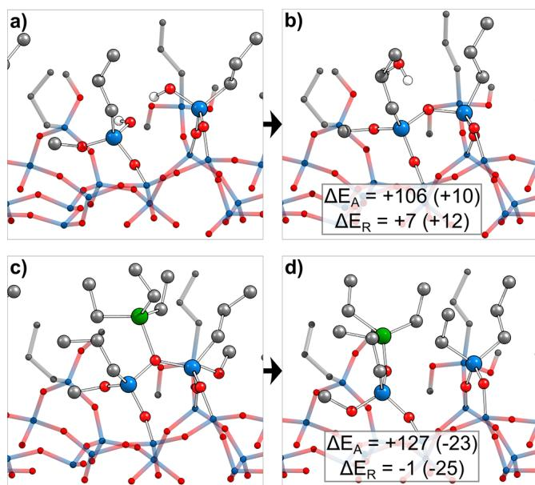  
Figure 13. Reactions within the SMI blocking layer. (a and b) Crosslinking reaction of two adjacent SMIs within the A.1-O:13/56/2/4 configuration in side view for the initial and final states, respectively, of the reaction. (c and d) LER at the cross-linking oxygen with TEA with the initial and final states, respectively. Activation and reaction energies in  $\mathrm{kJ}\mathrm{mol}^{-1}$ . Dispersion in parenthesis.

cross- linking reaction between DB- O:13 and SB- O:2 in the A.1- O:13/56/2/4 configuration, where two of the remaining methoxy groups have been replaced by hydroxyls. The reaction is slightly endothermic by  $7\mathrm{kJ}\mathrm{mol}^{- 1}$ , with a moderate reaction barrier of  $106\mathrm{kJ}\mathrm{mol}^{- 1}$ . Thus, the cross- linking of SMIs is an equilibrium reaction. Whether the reactants or products are favored depends on the presence of water in the system. To wit, during a water pulse, the cross- linking of SMIs is likely to be reversed (i.e., shifted toward the reactants, if the concentration of water is high). On the contrary, the link is likely to be reestablished during the subsequent vacuum phase considering the entropic contribution from the resulting water molecule.

Following that reasoning, the cross- linked SMI layer is more likely during the precursor pulse. To examine whether the cross- linked structure can enhance the blocking capacity, its reactivity toward the bulkier TEA precursor has been calculated (Figure 13c,d) at an SMI layer density of 3.4  $\mathrm{SMIs / nm^2}$ . With an activation barrier of  $127\mathrm{kJ}\mathrm{mol}^{- 1}$ , the cross- linking bond is not stable against the Al precursors. However, with a reaction energy of just  $- 1\mathrm{kJ}\mathrm{mol}^{- 1}$  and with the products staying in the proximity, the reaction is reversible. Therefore, the reaction is likely to be shifted to the side of the reactants reestablishing the cross- linking bond during a vacuum phase, because the Al precursors are subtracted from the surface.

All in all, we can conclude that although the cross- linking of SMIs is a realistic bonding motif between the surface bound SMIs, there is no impact on the selectivity of the AS- ALD process.

# 4.CONCLUSIONS

We investigated computationally the SMI blocking layer buildup process with TMPS on an amorphous silica substrate and analyzed its blocking behavior against the Al precursors TMA and TEA with water as the co- reactant. TMPS can undergo three subsequent condensation reactions with the amorphous surface model, which explains its improved inhibition against ALD growth compared to mono- and bifunctional alkoxysilanes. The existence of the TB TMPS configuration signifies that the replacement of the idealized form by the more realistic  $\mathbf{a}\text{- }\mathbf{SiO}_2$  models can involve qualitative changes in the observed surface chemistry. From these findings, optimized SMI configurations at full Si- OTI coverage were designed and a theoretical upper SMI density limit of  $4.2\mathrm{SMIs} / \mathrm{nm}^2$  given by Pauli repulsion was derived. We illustrated that the pulsing of TMPS alone does not necessarily lead to full  $\mathrm{Si - OH}$  coverage and demonstrated that subsequent pulsing of a second, monofunctional alkoxysilane inhibitor could further optimize the silanol coverage.

Furthermore, a comprehensive overview of the possible reactions of the Al precursors within the SMI blocking layer was given. Thereby, a reaction path disintegrating the SMI surface bond was found that can explain the loss of selectivity over time. It has become clear that the SMI blocking layer is not inert but subject to many modifications by both the Al precursors and the co- reactant water during the ALD process. We found the reactive bridge oxygen to be very reactive to the Al precursor and the co- reactant. It could thus lead to free, unblocked  $\mathrm{Si - OH}$  groups by an undesirable side reaction with the SMI, and we propose the pulsing of water prior to the inhibitor pulse to remove that source of side reactions from the surface.

The detailed computational analysis of this exemplary combination of an SMI, a non- growth surface, a precursor, and a co- reactant provides a plethora of general mechanisms and insights that will be transferred and generalized to other systems relevant for area- selective atomic layer deposition in the future. Most notably, we show that the SMI layer blocking ability is not solely through the chemical passivation of OH groups and steric blocking of diffusion paths to the surface. Beyond that, the SMI layer influences the reactant, product, and transition state energies by the "reactivity reduction" effect of the reactions happening within it. We thus propose to talk about "adsorption prevention" and "reactivity reduction" as steric blocking effects in AS- ALD with SMIs. The higher the spatial requirements of a transition or product state and the denser the SMI layer density, the higher the resulting energy penalty. Hence, achieving the highest obtainable SMI layer density in combination with spatially demanding precursors and co- reactants is the key to ensuring area selectivity over many cycles in SMI- based AS- ALD experiments.

# ASSOCIATED CONTENT

# Data Availability Statement

All computational data are available at DOI 10.17172/ NOMAD/2024.06.26- 1.

# $=$  Supporting Information

The Supporting Information is available free of charge at https://pubs.acs.org/doi/10.1021/acs.chemmater.4c01269.

Additional images of several surface structures together with energetic data, rate constant calculation formulas, tables comprising additional energetic and structural data, a flowchart of the SMI coverage procedure, and pEDA data of unstable TMA within the blocking layer (PDF)

# AUTHOR INFORMATION

# Corresponding Author

Ralf Tonner- Zech - Wilhelm- Ostwald- Institut fur Physikalische und Theoretische Chemie, Universitat Leipzig, 04103 Leipzig, Germany;  $\oplus$  orcid.org/0000- 0002- 6759- 8559; Email: ralf.tonner@uni- leipzig.de

# Authors

Paul Philipp Weilmann - Wilhelm- Ostwald- Institut fur Physikalische und Theoretische Chemie, Universitat Leipzig, 04103 Leipzig, Germany;  $\oplus$  orcid.org/0009- 0008- 7117- 3562 Fabian Pieck - Wilhelm- Ostwald- Institut fur Physikalische und Theoretische Chemie, Universitat Leipzig, 04103 Leipzig, Germany;  $\oplus$  orcid.org/0000- 0001- 6912- 2725

Complete contact information is available at: https://pubs.acs.org/10.1021/acs.chemmater.4c01269

# Notes

The authors declare no competing financial interest.

# ACKNOWLEDGMENTS

This work was supported by Merck KGaA via the 350th Anniversary Grant. Computational resources were provided by ZIH Dresden, CSC- GOETHE Frankfurt, HLR Stuttgart, and  $\mathrm{PC}^2$  Paderborn. The authors thank Prof. Stacey Bent (Stanford University, Palo Alto, CA) for discussions.

# REFERENCES

1) ParsonsG.N. Clark, R.D. Area-Selective Deposition: Fundamentals, Applications, and Future Outlook. Chem. Mater. 2020,3212)4920-4953. 2ClarkR.TapilyK.YuK.H.HakamataT.ConsiglioS. O'MearaD.WajdaC.SmithJ.LeusinkG.Perspective:New Process Technologies Required for Future Devices and Scaling. APL Mater.2018,65)058203. 3 Levinson, H. J. High-NA EUV Lithography: Current Status and Outlook for the Future. Jpn. J. Appl. Phys. 2022, 61 (SD), SD0803. 4Lee, H.-B.-R. The Era of Atomic Crafting. Chem. Mater. 2019, 31 5)1471-1472. 5LeeH.-B.-R.BentS.F.A Selective Toolbox for Nanofabrication.Chem.Mater.2020,32 8)3323-3324. 6Samavedam, S. B.; Ryckaert, J.; Beyne, E.; Ronse, K.; Horiguchi, N.TokeiZ.RadulI.BardonM.G.NaM.H.SpessotA. Biesemans, S. Future Logic Scaling: Towards Atomic Channels and Deconstructed Chips. In 2020 IEEE International Electron Devices Meeting (IEDM); IEEE: San Francisco, 2020; pp 1.1.1-1.1.10. DOI: 10.1109/IEDM13553.2020.9372023 7)Richey, N. E.; de Paula, C.; Bent, S. F. Understanding Chemical and Physical Mechanisms in Atomic Layer Deposition. J. Chem. Phys. 2020,152 4)040902. 8MackusA.J.M.MerkxM.J.M.KesselsW.M.M. From the Bottom-Up: Toward Area-Selective Atomic Layer Deposition with High Selectivity.Chem.Mater.2019,31 1)2-12. 9ChenR KimH.McIntyreP.C.BentS.F. Investigation of Self-Assembled Monolayer Resists for Hafnium Dioxide Atomic Layer Deposition.Chem.Mater.2005,17 3)536-544. 10McLellanJ.M.GeisslerM.XiaY. Self-Assembly of Hexadecanethiol Molecules on Gold from the Vapour Phase as Directed by a Two-Dimensional Array of Silica Beads. Chem. Phys. Lett.2005,408 1)80-83.

(11) Liu, T.-L.; Nardi, K. L.; Draeger, N.; Hausmann, D. M.; Bent, S. F. Effect of Multilayer versus Monolayer Dodecanethiol on Selectivity and Pattern Integrity in Area-Selective Atomic Layer Deposition. ACS Appl. Mater. Interfaces 2020, 12 (37), 42226-42235.  
(12) Kim, H. G.; Kim, M.; Gu, B.; Khan, M. R.; Ko, B. G.; Yasmeen, S.; Kim, C. S.; Kwon, S.-H.; Kim, J.; Kwon, J.; Jin, K.; Cho, B.; Chun, J.-S.; Shong, B.; Lee, H.-B.-R. Effects of Al Precursors on Deposition Selectivity of Atomic Layer Deposition of  $\mathrm{Al}_2\mathrm{O}_3$  Using Ethanethiol Inhibitor. Chem. Mater. 2020, 32 (20), 8921-8929.  
(13) Yarbrough, J.; Shearer, N. B.; Bent, S. F. Next Generation Nanopatterning Using Small Molecule Inhibitors for Area-Selective Atomic Layer Deposition. J. Vac. Sci. Technol. 2021, 39 (2), 021002.  
(14) Yarbrough, J.; Pieck, F.; Grigjanis, D.; Oh, I.-K.; Maue, P.; Tonner-Zech, R.; Bent, S. F. Tuning Molecular Inhibitors and Aluminum Precursors for the Area-Selective Atomic Layer Deposition of  $\mathrm{Al}_2\mathrm{O}_3$ . Chem. Mater. 2022, 34 (10), 4646-4659.  
(15) Oh, I.-K.; Sandoval, T. E.; Liu, T.-L.; Richey, N. E.; Bent, S. F. Role of Precursor Choice on Area-Selective Atomic Layer Deposition. Chem. Mater. 2021, 33 (11), 3926-3935.  
(16) Yarbrough, J.; Pieck, F.; Shearer, A. B.; Maue, P.; Tonner-Zech, R.; Bent, S. F. Area-Selective Atomic Layer Deposition of  $\mathrm{Al}_2\mathrm{O}_3$  with a Methanesulfonic Acid Inhibitor. Chem. Mater. 2023, 35 (15), 5963-5974.  
(17) Mameli, A.; Merkx, M. J. M.; Karasulu, B.; Roozeboom, F.; Kessels, W. M. M.; Mackus, A. J. M. Area-Selective Atomic Layer Deposition of  $\mathrm{SiO}_2$  Using Acetylacetone as a Chemoselective Inhibitor in an ABC-Type Cycle. ACS Nano 2017, 11 (9), 9303-9311.  
(18) Khan, R.; Shong, B.; Ko, B. G.; Lee, J. K.; Lee, H.; Park, J. Y.; Oh, I.-K.; Raya, S. S.; Hong, H.-M.; Chung, K.-B.; Luber, E. J.; Kim, Y.-S.; Lee, C.-H.; Kim, W.-H.; Lee, H.-B.-R. Area-Selective Atomic Layer Deposition Using Si Precursors as Inhibitors. Chem. Mater. 2018, 30 (21), 7603-7610.  
(19) Merkx, M. J. M.; Sandoval, T. E.; Hausmann, D. M.; Kessels, W. M. M.; Mackus, A. J. M. Mechanism of Precursor Blocking by Acetylacetone Inhibitor Molecules during Area-Selective Atomic Layer Deposition of  $\mathrm{SiO}_2$ . Chem. Mater. 2020, 32 (8), 3335-3345.  
(20) Manchanda, L.; Busch, B.; Green, M. L.; Morris, M.; Van Dover, R. B.; Kwo, R.; Aravamudhan, S. High K Gate Dielectrics for the Silicon Industry. In Extended Abstracts of International Workshop on Gate Insulator. IWGI 2001 (IEEE Cat. No. 01EX537); Japan Society of Applied Physics: Tokyo, 2001; pp 56-60.  
(21) Chen, R.; Kim, H.; McIntyre, P. C.; Bent, S. F. Controlling Area-Selective Atomic Layer Deposition of  $\mathrm{HfO}_2$  Dielectric by Self-Assembled Monolayers. MRS Proc. 2004, 811, D3.3.  
(22) Rimola, A.; Costa, D.; Sodupe, M.; Lambert, J.-F.; Ugliengo, P. Silica Surface Features and Their Role in the Adsorption of Biomolecules: Computational Modeling and Experiments. Chem. Rev. 2013, 113 (6), 4216-4313.  
(23) Zhuravlev, L. T. The Surface Chemistry of Amorphous Silica. Zhuravlev Model. Colloids Surf. Physicochem. Eng. Asp. 2000, 173 (1-3), 1-38.  
(24) Wimalasiri, P. N.; Nguyen, N. P.; Senanayake, H. S.; Laird, B. R.; Thompson, W. H. Amorphous Silica Slab Models with Variable Surface Roughness and Silanol Density for Use in Simulations of Dynamics and Catalysis. J. Phys. Chem. C 2021, 125 (42), 23418-23434.  
(25) Gierada, M.; De Proft, F.; Sulpizi, M.; Tielens, F. Understanding the Acidic Properties of the Amorphous Hydroxylated Silica Surface. J. Phys. Chem. C 2019, 123 (28), 17343-17352.  
(26) Sandupatla, A. S.; Alexopoulos, K.; Reyniers, M.-F.; Marin, G. B. DFT Investigation into Alumina ALD Growth Inhibition on Hydroxylated Amorphous Silica Surface. J. Phys. Chem. C 2015, 119 (32), 18380-18388.  
(27) Suh, T.; Yang, Y.; Sohn, H. W.; DiStasio, R. A.; Engstrom, J. R. Area-Selective Atomic Layer Deposition Enabled by Competitive Adsorption. J. Vac. Sci. Technol. Vac. Surf. Films 2020, 38 (6), 062411.  
(28) Grimme, S.; Antony, J.; Ehrlich, S.; Krieg, H. A Consistent and Accurate Ab Initio Parametrization of Density Functional Dispersion Correction (DFT-D) for the 94 Elements H-Pu. J. Chem. Phys. 2010, 132 (15), 154104.  
(29) Grimme, S.; Ehrlich, S.; Goerigk, L. Effect of the Damping Function in Dispersion Corrected Density Functional Theory. J. Comput. Chem. 2011, 32 (7), 1456-1465.  
(30) Kresse, G.; Hafner, J. Ab Initio Molecular Dynamics for Open-Shell Transition Metals. Phys. Rev. B 1993, 48 (17), 13115-13118.  
(31) Blochl, P. E. Projector Augmented-Wave Method. Phys. Rev. B 1994, 50 (24), 17953-17979.  
(32) Kresse, G.; Furthmüller, J. Efficiency of Ab-Initio Total Energy Calculations for Metals and Semiconductors Using a Plane-Wave Basis Set. Comput. Mater. Sci. 1996, 6 (1), 15-50.  
(33) Kresse, G.; Joubert, D. From Ultrasoft Pseudopotentials to the Projector Augmented-Wave Method. Phys. Rev. B 1999, 59 (3), 1758-1775.  
(34) Methfessel, M.; Paxton, A. T. High-Precision Sampling for Brillouin-Zone Integration in Metals. Phys. Rev. B 1989, 40 (6), 3616-3621.  
(35) Monkhorst, H. J.; Pack, J. D. Special Points for Brillouin-Zone Integrations. Phys. Rev. B 1976, 13 (12), 5188-5192.  
(36) Smidstrup, S.; Pedersen, A.; Stokkro, K.; Jónsson, H. Improved Initial Guess for Minimum Energy Path Calculations. J. Chem. Phys. 2014, 140 (21), 214106.  
(37) Henkelman, G.; Uberuaga, B. P.; Jónsson, H. A Climbing Image Nudged Elastic Band Method for Finding Saddle Points and Minimum Energy Paths. J. Chem. Phys. 2000, 113 (22), 9901-9904.  
(38) Henkelman, G.; Jónsson, H. Improved Tangent Estimate in the Nudged Elastic Band Method for Finding Minimum Energy Paths and Saddle Points. J. Chem. Phys. 2000, 113 (22), 9978-9985.  
(39) Henkelman, G.; Jónsson, H. A Dolder Method for Finding Saddle Points on High Dimensional Potential Surfaces Using Only First Derivatives. J. Chem. Phys. 1999, 111 (15), 7010-7022.  
(40) Sheppard, D.; Terrell, R.; Henkelman, G. Optimization Methods for Finding Minimum Energy Paths. J. Chem. Phys. 2008, 128 (13), 134106.  
(41) Raupach, M.; Tonner, R. A Periodic Energy Decomposition Analysis Method for the Investigation of Chemical Bonding in Extended Systems. J. Chem. Phys. 2015, 142 (19), 194105.  
(42) Pecher, L.; Tonner, R. Deriving Bonding Concepts for Molecules, Surfaces, and Solids with Energy Decomposition Analysis for Extended Systems. WIREs Comput. Mol. Sci. 2019, 9 (4), e1401.  
(43) BAND, 2021. http://www.scm.com (last accessed June 2024).  
(44) Philipsen, P. H. T.; van Lenthe, E.; Snijders, J. G.; Baerends, E. J. Relativistic Calculations on the Adsorption of CO on the (111) Surfaces of Ni, Pd, and Pt within the Zeroth-Order Regular Approximation. Phys. Rev. B 1997, 56 (20), 13556-13562.  
(45) Philipsen, P. H. T.; Baerends, E. J. Relativistic Calculations to Assess the Ability of the Generalized Gradient Approximation to Reproduce Trends in Cohesive Properties of Solids. Phys. Rev. B 2000, 61 (3), 1773-1778.  
(46) Pieck, F.; Tonner-Zech, R. Alkynie-Functionalized Cyclooctyne on Si(001): Reactivity Studies and Surface Bonding from an Energy Decomposition Analysis Perspective. Molecules 2021, 26 (21), 6653.  
(47) Rice, F. O.; Toller, E. The Role of Free Radicals in Elementary Organic Reactions. J. Chem. Phys. 1938, 6 (8), 489-496.  
(48) Miller, S. I. Stereoselection in the Elementary Steps of Organic Reactions. Adv. Phys. Org. Chem. 1968, 6, 185-332.  
(49) Hine, J. The Principle of Least Nuclear Motion. Adv. Phys. Org. Chem. 1977, 15, 1-61.  
(50) Li, J.; Tezsevin, I.; Merkx, M. J. M.; Maas, J. F. W.; Kessels, W. M. M.; Sandoval, T. E.; Mackus, A. J. M. Packing of Inhibitor Molecules during Area-Selective Atomic Layer Deposition Studied Using Random Sequential Adsorption Simulations. J. Vac. Sci. Technol. A 2022, 40 (6), 062409.  
(51) Yu, P.; Merkx, M. M.; Tezsevin, I.; Lemaire, P.; Hausmann, D. M.; Sandoval, T. E.; Kessels, W. M.; Mackus, A. M. Blocking Mechanisms in Area-Selective Ald by Small Molecule Inhibitors Of Different Sizes: Steric Shielding Versus Chemical Passivation. Appl. Surf. Sci. 2024, 665, 160141.

Correction (DFT- D) for the 94 Elements H- Pu. J. Chem. Phys. 2010, 132 (15), 154104.  (29) Grimme, S.; Ehrlich, S.; Goerigk, L. Effect of the Damping Function in Dispersion Corrected Density Functional Theory. J. Comput. Chem. 2011, 32 (7), 1456- 1465.  (30) Kresse, G.; Hafner, J. Ab Initio Molecular Dynamics for Open- Shell Transition Metals. Phys. Rev. B 1993, 48 (17), 13115- 13118.  (31) Blochl, P. E. Projector Augmented- Wave Method. Phys. Rev. B 1994, 50 (24), 17953- 17979.  (32) Kresse, G.; Furthmüller, J. Efficiency of Ab- Initio Total Energy Calculations for Metals and Semiconductors Using a Plane- Wave Basis Set. Comput. Mater. Sci. 1996, 6 (1), 15- 50.  (33) Kresse, G.; Joubert, D. From Ultrasoft Pseudopotentials to the Projector Augmented- Wave Method. Phys. Rev. B 1999, 59 (3), 1758- 1775.  (34) Methfessel, M.; Paxton, A. T. High- Precision Sampling for Brillouin- Zone Integration in Metals. Phys. Rev. B 1989, 40 (6), 3616- 3621.  (35) Monkhorst, H. J.; Pack, J. D. Special Points for Brillouin- Zone Integrations. Phys. Rev. B 1976, 13 (12), 5188- 5192.  (36) Smidstrup, S.; Pedersen, A.; Stokkro, K.; Jónsson, H. Improved Initial Guess for Minimum Energy Path Calculations. J. Chem. Phys. 2014, 140 (21), 214106.  (37) Henkelman, G.; Uberuaga, B. P.; Jónsson, H. A Climbing Image Nudged Elastic Band Method for Finding Saddle Points and Minimum Energy Paths. J. Chem. Phys. 2000, 113 (22), 9901- 9904.  (38) Henkelman, G.; Jónsson, H. Improving Tangent Estimate in the Nudged Elastic Band Method for Finding Minimum Energy Paths and Saddle Points. J. Chem. Phys. 2000, 113 (22), 9978- 9985.  (39) Henkelman, G.; Jónsson, H. A Dolder Method for Finding Saddle Points on High Dimensional Potential Surfaces Using Only First Derivatives. J. Chem. Phys. 1999, 111 (15), 7010- 7022.  (40) Sheppard, D.; Terrell, R.; Henkelman, G. Optimization Methods for Finding Minimum Energy Paths. J. Chem. Phys. 2008, 128 (13), 134106.  (41) Raupach, M.; Tonner, R. A Periodic Energy Decomposition Analysis Method for the Investigation of Chemical Bonding in Extended Systems. J. Chem. Phys. 2015, 142 (19), 194105.  (42) Pecher, L.; Tonner, R. Deriving Bonding Concepts for Molecules, Surfaces, and Solids with Energy Decomposition Analysis for Extended Systems. WIREs Comput. Mol. Sci. 2019, 9 (4), e1401.  (43) BAND, 2021. http://www.scm.com (last accessed June 2024).  (44) Philipsen, P. H. T.; van Lenthe, E.; Snijders, J. G.; Baerends, E. J. Relativistic Calculations on the Adsorption of CO on the (111) Surfaces of Ni, Pd, and Pt within the Zeroth- Order Regular Approximation. Phys. Rev. B 1997, 56 (20), 13556- 13562.  (45) Philipsen, P. H. T.; Baerends, E. J. Relativistic Calculations to Assess the Ability of the Generalized Gradient Approximation to Reproduce Trends in Cohesive Properties of Solids. Phys. Rev. B 2000, 61 (3), 1773- 1778.  (46) Pieck, F.; Tonner- Zech, R. Alkynie- Functionalized Cyclooctyne on Si(001): Reactivity Studies and Surface Bonding from an Energy Decomposition Analysis Perspective. Molecules 2021, 26 (21), 6653.  (47) Rice, F. O.; Toller, E. The Role of Free Radicals in Elementary Organic Reactions. J. Chem. Phys. 1938, 6 (8), 489- 496.  (48) Miller, S. I. Stereoselection in the Elementary Steps of Organic Reactions. Adv. Phys. Org. Chem. 1968, 6, 185- 332.  (49) Hine, J. The Principle of Least Nuclear Motion. Adv. Phys. Org. Chem. 1977, 15, 1- 61.  (50) Li, J.; Tezsevin, I.; Merkx, M. J. M.; Maas, J. F. W.; Kessels, W. M. M.; Sandoval, T. E.; Mackus, A. J. M. Packing of Inhibitor Molecules during Area- Selective Atomic Layer Deposition Studied Using Random Sequential Adsorption Simulations. J. Vac. Sci. Technol. A 2022, 40 (6), 062409.  (51) Yu, P.; Merkx, M. M.; Tezsevin, I.; Lemaire, P.; Hausmann, D. M.; Sandoval, T. E.; Kessels, W. M.; Mackus, A. M. Blocking Mechanisms in Area- Selective Ald by Small Molecule Inhibitors Of Different Sizes: Steric Shielding Versus Chemical Passivation. Appl. Surf. Sci. 2024, 665, 160141.

(52) Xu, W.; Haeve, M. G. N.; Lemaire, P. C.; Sharma, K.; Hausmann, D. M.; Agarwal, S. Functionalization of the  $\mathrm{SiO}_2$  Surface with Aminosilanes to Enable Area-Selective Atomic Layer Deposition of  $\mathrm{Al}_2\mathrm{O}_3$ . Langmuir 2022, 38 (2), 652-660.(53) Xu, W.; Lemaire, P. C.; Sharma, K.; Gasvoda, R. J.; Hausmann, D. M.; Agarwal, S. Mechanism for Growth Initiation on Aminosilane-Functionalized  $\mathrm{SiO}_2$  during Area-Selective Atomic Layer Deposition of  $\mathrm{ZrO}_2$ . J. Vac. Sci. Technol. A 2021, 39 (3), 032402.(54) Jones, R.; D'Acunto, G.; Shayesteh, P.; Pinsard, L.; Rochet, F.; Bournel, F.; Gallet, J.-J.; Head, A.; Schnadt, J. Operando Study of  $\mathrm{HfO}_2$  Atomic Layer Deposition on Partially Hydroxylated Si(111). J. Vac. Sci. Technol. A 2024, 42 (2), 022404.(55) Ritala, M.; Kukli, K.; Rahtu, A.; Raisänen, P. I.; Leskelä, M.; Sajavaara, T.; Keinonen, J. Atomic Layer Deposition of Oxide Thin Films with Metal Alkoxides as Oxygen Sources. Science 2000, 288 (5464), 319-321.(56) Seo, S.; Woo, W. J.; Lee, Y.; Yoon, H.; Kim, M.; Oh, I.-K.; Chung, S.-M.; Kim, H.; Shong, B. Reaction Mechanisms of Non-Hydrolytic Atomic Layer Deposition of  $\mathrm{Al}_2\mathrm{O}_3$  with a Series of Alcohol Oxidants. J. Phys. Chem. C 2021, 125 (33), 18151-18160.