# Numerical study on the fluid dynamical aspects of atomic layer deposition process  $\mathfrak{S}$

Petteri Peltonen; Ville Vuorinen; Giovanni Marin; Antti J. Karttunen; Maari Kartpinen

Check for updates

J. Vac. Sci. Technol. A 36, 021816 (2018) https://doi.org/10.1116/1.5018475

# Articles You May Be Interested In

Numerical modeling of carrier gas flow in atomic layer deposition vacuum reactor: A comparative study of lattice Boltzmann models

J. Vac. Sci. Technol. A (November 2013)

A numerical approach on the selection of the purge flow rate in an atomic layer deposition (ALD) process Physics of Fluids (May 2022)

Simple model for atomic layer deposition precursor reaction and transport in a viscous- flow tubular reactor J.Vac.Sci.Technol.A (December 2011)

# Numerical study on the fluid dynamical aspects of atomic layer deposition process

Petteri Peltonena) and Ville Vuorinen  Department of Mechanical Engineering, Aalto University, FI- 00076 Aalto, Finland

Giovanni Marin, Antti J. Karttunen, and Maarit Karppinen  Department of Chemistry and Materials Science, Aalto University, FI- 00076 Aalto, Finland

(Received 7 December 2017; accepted 6 February 2018; published 21 February 2018)

Computational fluid dynamics investigations on the mixing process of gases inside an atomic layer deposition (ALD) reactor are carried out. A test case involving a real ALD reactor geometry is investigated under nonreacting, incompressible flow assumption. The relatively low Reynolds number (Re) of the test reactor, often being in the laminar regime, advocates the usage of scale- resolving simulations. The authors investigate mixing of two precursors in two different injection configurations for  $40 < \mathrm{Re} < 2400$ . The feasibility of the approach is shown and discussed. The results illustrate how both Reynolds number and injection configurations influence the precursor distribution in the ALD reactor. The authors also carry out a set of experiments in the same ALD reactor and discuss them in light of the simulations. Published by the AVS. https://doi.org/10.1116/1.5018475

# I. INTRODUCTION

Atomic layer deposition (ALD) enables the fabrication of various thin- film materials in a highly controllable manner.1 The early developments of the ALD technique by Puurunen et al. were driven by applications in the field of electroluminescent displays,2 and nowadays, the rapidly increasing interest in ALD is mainly driven by applications in the microelectronics and semiconductor industry in general.3 The ALD thin- film growth process is based on sequential, self- limiting gas- surface reactions as illustrated in Fig. 1. The growth rate is typically described in terms of growth per cycle (GPC, units  $\mathring{\mathrm{A}}$  or nm). As an example, we discuss the deposition of an aluminum oxide  $(\mathrm{Al}_2\mathrm{O}_3)$  thin film on a silicon substrate. First, a pulse of trimethylaluminum (TMA) is introduced to the nitrogen carrier gas that is constantly flowing into the ALD reactor (the pressure in the reactor is typically as low as  $10 - 20\mathrm{kPa}$ ). The pulse lengths are highly dependent on the ALD reactor type and the nature of the substrate. For flat, nonporous substrates, pulse lengths between 0.1 and 1 s are rather typical, while for high- aspect ratio substrates and porous substrates, the pulse lengths can be several seconds.4 The TMA molecules absorb on the silicon substrate and react with the OH groups on the substrate surface in a self- limiting fashion. When all possible surface sites have reacted, the TMA molecules in the gas phase can no longer react with the surface and are purged out of the reactor by the nitrogen carrier gas. After the purging, a pulse of water vapor  $(\mathrm{H}_2\mathrm{O})$  is introduced into the reactor. The water molecules react with the surface in a self- limiting fashion, and the water molecules remaining in the gas phase are purged out by the carrier gas. These four steps (TMA pulse- purge- water pulse- purge) constitute one ALD cycle and repeating the cycles produces an  $\mathrm{Al}_2\mathrm{O}_3$  thin film.

In comparison to other thin- film techniques, ALD offers exceptional conformality on high aspect ratio structures. This is a key advantage in the fabrication of semiconductor devices, where continuous and pinhole- free films need to be deposited on more and more complex substrates. The thickness of the ALD- fabricated thin films can typically be controlled at the level of  $10^{- 10}\mathrm{m}$ $(\mathring{\mathrm{A}})$ . The technique is relatively slow in comparison to techniques such as chemical vapor deposition and therefore the ALD- grown thin films are usually from a few nanometers to about  $100\mathrm{nm}$  thick. The inherent features and scalability of ALD make it also a very attractive technique for coating of nanostructured, nanoporous, or even fibrous substrates such as textiles.4

The flow rates, pulse and purge times, as well as the temperature in an ALD process are empirical parameters optimized for each application specifically. Usually, the main criterion is the quality of the deposited film, which can easily lead to precursor waste, long cycle times, and high setup costs without the gain of information on why the process behaves as it does. While previous experimental studies have demonstrated that the efficiency of the ALD process is heavily influenced by the precursor concentrations and thus the carrier gas flow,1,5 the number of both numerical and experimental studies focusing on the fluid dynamical aspects is rather limited. A possible explanation for such a research gap could originate from the wide range of time and spatial scales involved in the process making both measurements and numerical studies difficult to conduct.

Since the ALD growth process is a multiscale phenomenon encompassing time and spatial scales from atomistic surface reactions to reactor- level fluid dynamics, many different modeling approaches have been applied to the various parts of the process. In their study on modeling of continuous flow ALD reactors, Holmqvist et al. reviewed previous mathematical models for ALD processes.6 Since we focus on fluid dynamical aspects of the ALD growth here, we shortly discuss recent studies in this direction.

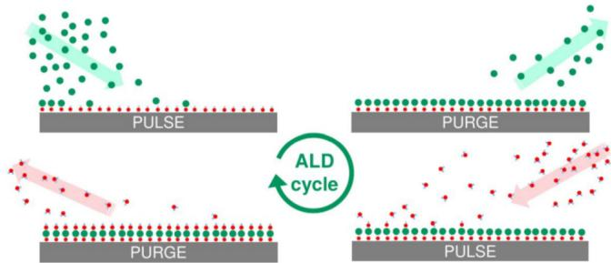  
FIG. 1. (Color online) Illustration of the ALD growth process.

Lankhorst et al.7 used a transient and three- dimensional finite volume model to study the precursor transport and deposition reactions in a multiwafer vertical batch ALD reactor filled with high aspect ratio trenched wafers. They noticed that for trenched wafers, the timescales are much longer than for flat wafers. Moreover, Shaeri et al.8 used a three- dimensional and transient finite volume model to optimize the flow patterns and deposition rates in two different precursor injection configurations. They noticed that GPC increases as the temperature of the substrate is increased and stated that the larger GPC is caused by higher reaction rates and concentrations of the oxygen atoms on the substrate. In a very similar study by Deng et al., the authors noticed that while higher temperature increases GPC, it has a little impact on the precursor distribution.

In a series of publications, Pan et al. first carried out a comparative study of lattice Boltzmann (LBM) models for steady and two- dimensional ALD reactor flow.10 They noticed that the results of the LBM models were in an agreement with a traditional continuum- based finite volume model. Later on, Pan et al. used a transient and threedimensional finite volume model along with a surface reaction model based on laminar flow assumption and tworeaction mechanism to study the film growth in a real reactor geometry.11 Based on the numerical and experimental results, the authors observed that the GPC varies based on the location where the sample is placed inside the reactor. The experimental GPC was also noticed to be correlated with the numerically obtained precursor concentration, the highest GPC being in the regions where the precursor concentrations were highest. In the latest work by Pan et al.,12 the authors extend the chemical kinetics mechanism to account for more reactions and investigated the ALD process emission and waste. They noticed that the ALD process has a very high material waste rate with about  $60\%$  of the precursors being wasted.

A summary of the previous numerical work on ALD is presented in Table I. The focus of many of the previous studies has been on model development and comparison or optimizing the film growth. In the present paper, the aim is to study the fluid dynamical aspects inside the reactor chamber by a Reynolds number and injection configuration sweep. It is of particular interest to better understand the precursor mixing characteristics and surface coverage. Thus, we assume that the precursors are transported (convected and diffused) without surface reactions. We then construct spatial maps of the GPC, which depend purely on the precursor concentrations under different conditions. To do this, we solve the carrier gas motion with an unprecedented accuracy. Further, we link the numerical results to experiments and discuss the film growth rate and the fluid dynamical aspects related to it. The objectives of the present work are listed below. First, we investigate the feasibility of scale- resolving computational fluid dynamics (CFD) simulations in ALD studies. Second, we investigate the sensitivity of the sample surface coverage on the Reynolds number under turbulent and laminar conditions. Third, by using the numerical model, we investigate two injection configurations and discuss the results in light of the experiments.

The paper is structured as follows. In Sec. II, we present the numerical and experimental methods used in the study. In Sec. III, we present the results of the simulations starting from visualizations of instantaneous flow features in the reactor and then moving onto time- averaged quantities. At the end of Sec. III, we compare the numerically predicted film growth to experimental film thickness. We conclude the results and observations in Sec. IV.

# II. METHODS

# A. Reaction chamber geometry and operation

II. METHODSA. Reaction chamber geometry and operationThe reaction chamber studied in this paper is from the Picosun model R-100 ALD reactor (Fig. 2). In the chamber, carrier gas is flowing constantly in from four lines (lines 1-4) and out of the chamber from a single outlet at the bottom. During the precursor pulses, the precursor is injected into one of the carrier gas lines well before the chamber. The carrier gas line, to which the precursors are injected, can be

TABLE I. Positioning the present study in the context of previous CFD-ALD studies.  

<table><tr><td>Author</td><td>2D/3D</td><td>Mesh</td><td>Transient</td><td>Surf. chem.</td><td>Main focus</td></tr><tr><td>Holmqvist et al. (Ref. 6)</td><td>2D</td><td>1.5 × 103</td><td>Yes</td><td>Yes</td><td>Mechanistic model development</td></tr><tr><td>Lankhorst et al. (Ref. 7)</td><td>3D</td><td>Unspecified</td><td>Yes</td><td>No</td><td>Trench model development</td></tr><tr><td>Shaeri et al. (Ref. 8)</td><td>3D</td><td>32 × 103</td><td>Yes</td><td>Yes</td><td>Injection configuration and thermal effects</td></tr><tr><td>Pan et al. (Ref. 10)</td><td>2D</td><td>Unspecified</td><td>No</td><td>No</td><td>Comparison of LBM models</td></tr><tr><td>Pan et al. (Ref. 11)</td><td>3D</td><td>Unspecified</td><td>Yes</td><td>Yes</td><td>Physical and chemical details</td></tr><tr><td>Pan et al. (Ref. 12)</td><td>3D</td><td>Unspecified</td><td>Yes</td><td>Yes</td><td>Emission and waste</td></tr><tr><td>Xie et al. (Ref. 13)</td><td>2D</td><td>Unspecified</td><td>Yes</td><td>Yes</td><td>Mechanistic model development</td></tr><tr><td>Xie et al. (Ref. 14)</td><td>2D</td><td>Unspecified</td><td>Yes</td><td>Yes</td><td>Emission and waste</td></tr><tr><td>Present</td><td>3D</td><td>3.4/6 × 106</td><td>Yes</td><td>No</td><td>Fluid dynamical aspects and Re sweep</td></tr></table>

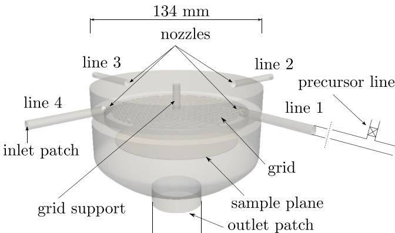  
FIG. 2. (Color online) Reaction chamber geometry and the naming used throughout the work. The gray area indicates the modeled region and the sketches representing the precursor line and outlet extension are only for illustration and not modeled.

altered in the reactor, and in the present paper, we study two configurations of the injection: opposing injection and perpendicular injection. In the opposing injection configuration, first precursor is injected to one of the carrier gas lines (line 1, for example) and the second one to the opposite carrier gas line (line 3). In the perpendicular injection configuration, the precursors enter the chamber from lines axially perpendicular to each other (line 1 and line 2, for example).

Approximately  $20\mathrm{mm}$  below the roof of the chamber there is a grid structure to enhance the spreading of the precursors, and the grid is supported by a circular beam attached to the roof of the chamber. The grid consists of symmetrically drilled circular holes with a diameter of  $4\mathrm{mm}$ . The wafer is placed in the chamber on top of a circular plate, which in reality, is held in place by support beams attached to the grid part. These supports are not modeled in the simulations and they are not visible in Fig. 2. During the deposition, the reactor is heated to the specified temperature by an oven surrounding the gray geometry presented in Fig. 2 and a substantial length of the gas lines. In addition, the boundary conditions in the simulations are assigned to the inlet and outlet patches.

Figure 3 shows a sequence of volumetric renderings of the precursors to illustrate how the reactor is operated. In the example, first precursor is injected from line 1 and starts to slowly fill up the chamber volume at time instances  $t_1$  to  $t_3$ . The purging of the first precursor with the carrier gas, which is not visible in Fig. 3, begins at approximately  $t_4$ . Since purging is a very slow process, typical purge times are in the order of 5- 10 times the respective pulse time. The snapshot at  $t_6$  is taken approximately at the halfway of the purge phase of precursor 1. The injection of precursor 2 begins just before the snapshot  $t_7$  and the injection comes from line 2.

# B. Simulations

The ALD- process involves not only chemical but also strong fluid dynamical phenomena which can be approached via CFD simulations as is done herein. In such simulations, the macroscopic flow domain is divided into a mesh of small elements. The governing conservation equations are the

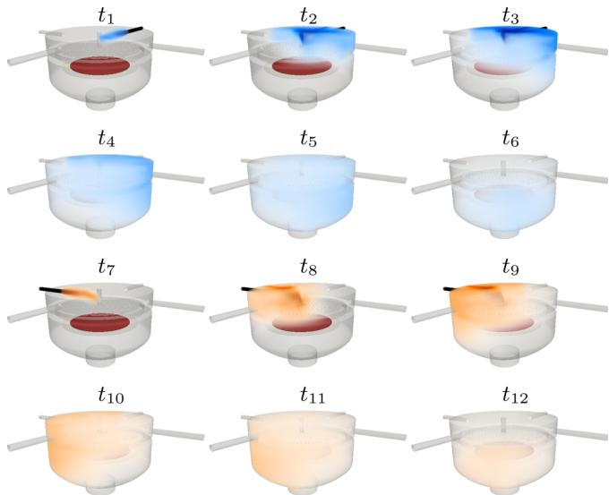  
FIG. 3. (Color online) Precursor behavior during a single cycle at  $\mathrm{Re} = 80$  The region where the sample lies is highlighted in the figure.

Navier- Stokes equations which can be discretized locally in the finite- volume framework by formulating the flux- balance between the adjacent elements. The discretization leads eventually to a global system of equations the solution of which offers the time- space dependent velocity and pressure fields. For low- Reynolds number laminar flows, the flow equations can be directly solved while for turbulent, high- Reynolds number flows a turbulence model can be applied to account for the dissipation occurring in the unresolved smallest flow scales below the spatial resolution. In the present work, the relatively low Reynolds number of the flows advocates usage of a scale- resolving approach with minimal amount of modeled numerical dissipation.

It is known that the gas exchange involves low speed flow which is injected through a complex inlet valve configuration. However, various unknowns about the exact inlet boundary conditions further motivate to simplify the problem. Hence, as justified by the low Mach number of the flow, the gas is modeled as being incompressible. Additionally, we assume that the gas is isothermal with constant fluid properties in the modeled region. Such assumption is considered to be reasonable since the gases entering the reactor are heated well before the reactor by a large oven surrounding both the reactor and the gas lines. Thereby, the governing equation is the incompressible Navier- Stokes (N- S) equation

$$
\frac{\partial\mathbf{u}}{\partial t} +\nabla \cdot (\mathbf{u}\mathbf{u}) = -\frac{1}{\rho}\nabla p + \nu \Delta \mathbf{u}, \tag{1}
$$

where  $\mathbf{u}$  is the velocity,  $p$  the pressure, and  $\nu$  the kinematic viscosity of the fluid. Conservation of mass is guaranteed by the continuity equation

$$
\nabla \cdot \mathbf{u} = 0. \tag{2}
$$

In addition to the N- S and continuity equations, additional scalar transport equations are solved to describe the precursor transport. We assume that the precursors appear in small

quantities behaving as passive scalars which do not alter the properties of the carrier gas. The scalar transport equations read

$$
\frac{\partial c}{\partial t} +\nabla \cdot (\mathbf{u}c) - \nu_{\mathrm{c}}\Delta c = 0, \tag{3}
$$

where  $c$  is the scalar and  $\nu_{\mathrm{c}}$  is the diffusivity of the scalar. By modeling the precursors as passive scalars, the following assumptions are made:

(1) The fluid properties of the carrier gas do not change when mixed with the precursor. 
(2) The precursors do not affect the fluid momentum. 
(3) The precursors do not interact with each other. 
(4) The surface reactions are not taken into account.

Thereby, in the present work, the precursors can be considered to act similar to small, passive tracers following the fluid flow. Since the overall motivation is to understand the fluid dynamical mixing within the reaction chamber, we resort to unity Schmidt number  $Sc = \nu /\nu_{\mathrm{c}}$  assumption for all the scalars. In the paper, altogether four passive scalars are injected from the four nozzles so that the opposing and adjacent injection configurations can be simultaneously studied.

The discrete form of the governing equations is solved using the unstructured, second order accurate finite volume method based on the open source  $\mathrm{c + + }$  library OpenFOAM.15 The velocity and pressure fields are solved sequentially using a predictor- corrector type PISO algorithm16 as implemented in pisoFoam solver in OpenFOAM. For time discretization, an implicit, second order accurate, three time- level scheme is adopted. In the convection term, the convective flux is interpolated linearly while the convecting quantities are interpolated by a limited, second order accurate scheme. The diffusion terms are discretized by centered schemes. As discussed in the previous paper by Vuorinen et al.,17 the PISO method includes a diffusive correction term which is removed here as motivated by the previous study. The solver used in the present study has been successfully used by the authors in a sequence of papers.17- 19

A section of the 6M cell mesh used in the simulations is presented in Fig. 4. The mesh is unstructured and consists of mostly hexahedral cells. The highest resolution is at the upper- most part of the domain and the mesh is allowed to significantly coarsen toward the outlet of the chamber. Further, the simulations are run with a fixed Courant number of 0.8.

The flow Reynolds number based on the inlet pipe diameter  $(D)$  is defined as  $\mathrm{Re} = \rho UD / \mu = UD / \nu$ . As the definition shows, under incompressible and isothermal assumption, the flow is essentially characterized by a single nondimensional number, i.e., the Reynolds number alone. By studying a wide range of Reynolds numbers, we are able to investigate the flow behavior as a function of one compact parameter under various operating conditions. For example, the carrier gas flow rates can range from 150 to  $250\mathrm{scm}$ , pressure between 10 and  $20\mathrm{hPa}$ , and temperature between 150 and  $250^{\circ}\mathrm{C}$ , depending on the application. In the present work, we study Reynolds numbers  $\mathrm{Re} = 40$  80,200,800and 2400. The lower bound of the Reynolds numbers is chosen assuming a constant flow rate of  $200\mathrm{scm}$  temperature of  $220^{\circ}\mathrm{C}$  and pressure of  $15\mathrm{hPa}$  for nitrogen,20 resulting in  $\mathrm{Re} = 38$  . The upper bound (2400), on the other hand, is chosen such that the flow in the inlet pipes is already turbulent. The other studied Reynolds numbers are more biased to the expected laminar regime and chosen based on small test runs indicating representative examples of the system characteristics.

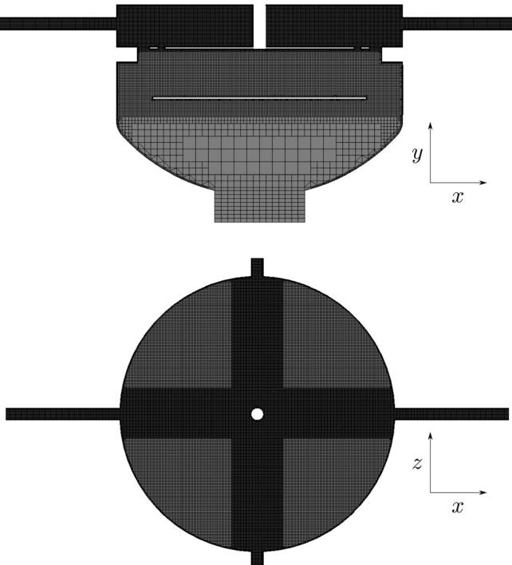  
FIG.4. Sections of the 6M cell mesh.

The simulated test cases as well as the elapsed processing time CPU time) are tabulated in Table II. For the low Reynolds number cases (A- C) a mesh containing  $3.4\mathrm{M}$  cells is used and two full cycles are simulated. For the highReynolds number cases (D and E) a denser mesh is used and a single cycle is simulated. In cases A- E the inlet flow rates are set to correspond to the carrier gas flow rate (200 sccm) and kept constant throughout the simulation. In addition to cases A- E, we simulate a half- cycle case (F) in which the flow rate at one of the inlets is increased by  $50\%$  to  $300\mathrm{scm}$  for the duration of the pulse and then set back to  $200\mathrm{scm}$  for the purge. The purpose of case F is thereby to study the

TABLE II. Simulated test cases. The  $\Delta_{\mathrm{min}}$  value describes the smallest cell width excluding the boundary layer cells.  

<table><tr><td>Case</td><td>Re</td><td>No. cycles</td><td>No. cells</td><td>Δmin</td><td>y+</td><td>CPU time (h)</td></tr><tr><td>A</td><td>40</td><td>2</td><td>3.4M</td><td>D/30</td><td>0.14</td><td>21384</td></tr><tr><td>B</td><td>80</td><td>2</td><td>3.4M</td><td>D/30</td><td>0.21</td><td>24960</td></tr><tr><td>C</td><td>200</td><td>2</td><td>3.4M</td><td>D/30</td><td>0.4</td><td>41976</td></tr><tr><td>D</td><td>800</td><td>1</td><td>6M</td><td>D/40</td><td>0.7</td><td>61920</td></tr><tr><td>E</td><td>2400</td><td>1</td><td>6M</td><td>D/40</td><td>1.9</td><td>100224</td></tr><tr><td>F</td><td>40</td><td>1/2</td><td>3.4M</td><td>D/30</td><td>0.18</td><td>5459</td></tr></table>

sensitivity of the precursor behavior to the increased flow rate, and the results are discussed in Sec. III D. In cases D and E, the pipe flow at each inlet line is recycled from  $6D$  downstream of each inlet patch to ensure a realistic boundary condition in the high- Reynolds number cases. In the laminar cases, the well- known parabolic pipe flow velocity profile is fully developed at the nozzle exit, although a top- hat profile is assigned to the inlet patch.21

Since the precursors are modeled as passive scalars, the boundary conditions for the precursors at the inlet patches are set to unity for both precursors during the pulses and zero during the purges. At the outlet, Neumann (zero gradient) condition is applied for both velocity and the precursors. For pressure, Dirichlet condition (fixed zero) is applied at the outlet. It should be noted that, due to the incompressibility assumption, the pressure at the outlet can be fixed to an arbitrary constant.

# C. Experiment details

In the experiments, TMA and water are used for deposition with pulse and purge times of 0.2 and  $1\mathrm{s}$ , respectively, for both precursors. During the deposition, the temperature in the chamber is controlled by an oven surrounding the chamber which is heated to  $220^{\circ}\mathrm{C}$ . The temperature sensors inside the reactor chamber indicated  $\pm 5^{\circ}\mathrm{C}$  fluctuation in the temperature. The pressure in the chamber varies between 10 and  $20\mathrm{hPa}$  during the deposition, the highest pressure values are obtained during the precursor pulses. Nitrogen is used as a carrier gas and the flow rate of nitrogen is set to  $200\mathrm{scm}$  for all the four inlets. The films are deposited on standard test grade  $100\mathrm{mm}$  silicon wafers. The inlet of TMA is kept constant while the water source is altered to obtain the opposing and perpendicular injection configurations. The thickness measurements are carried out with a SEMILAB SE- 2000 spectroscopic ellipsometer. Thickness is measured in 25 evenly spaced locations around the circular wafer. The reactor operating conditions are listed in Table III. It should be noted that the experimental conditions are not optimized for the deposition but the injection time scales are set short enough to enable feasible computational runtime.

# III. RESULTS

# A. Flow visualization

Instantaneous time snapshots of the velocity fields for all the Reynolds numbers are presented in Fig. 5. As can be seen, the flow above the grid is governed by four jets entering the reactor from lines 1 to 4. At  $\mathrm{Re} = 40$  and 80, the flow appears laminar and the jet spreading is highly diffusive (I) before the impingement to the support. Consistently, at  $\mathrm{Re} = 200$  and 800, the jet mixing appears less diffusive resulting in a stronger impingement effect and increased vortex shedding with increased Reynolds number (II). Finally, at  $\mathrm{Re} = 2400$ , the incoming pipe flow is turbulent (III) and further turbulence is produced by the jet shear layers. At  $\mathrm{Re} = 2400$ , the jet- support interaction is also harder to distinguish by visual analysis.

TABLE III. Summary of the reactor operating conditions.  

<table><tr><td>Pressure</td><td>10–20 hPa</td></tr><tr><td>Temperature</td><td>220℃</td></tr><tr><td>Pulse length (both precursors)</td><td>1 s</td></tr><tr><td>Purge length (both precursors)</td><td>0.2 s</td></tr><tr><td>Residence time (V/Qtotal)</td><td>1.125 s</td></tr><tr><td>N2flow rate Q</td><td>4 × 200 sccm</td></tr><tr><td>N2Reynolds number</td><td>38</td></tr><tr><td>Precursors</td><td>TMA/Water</td></tr></table>

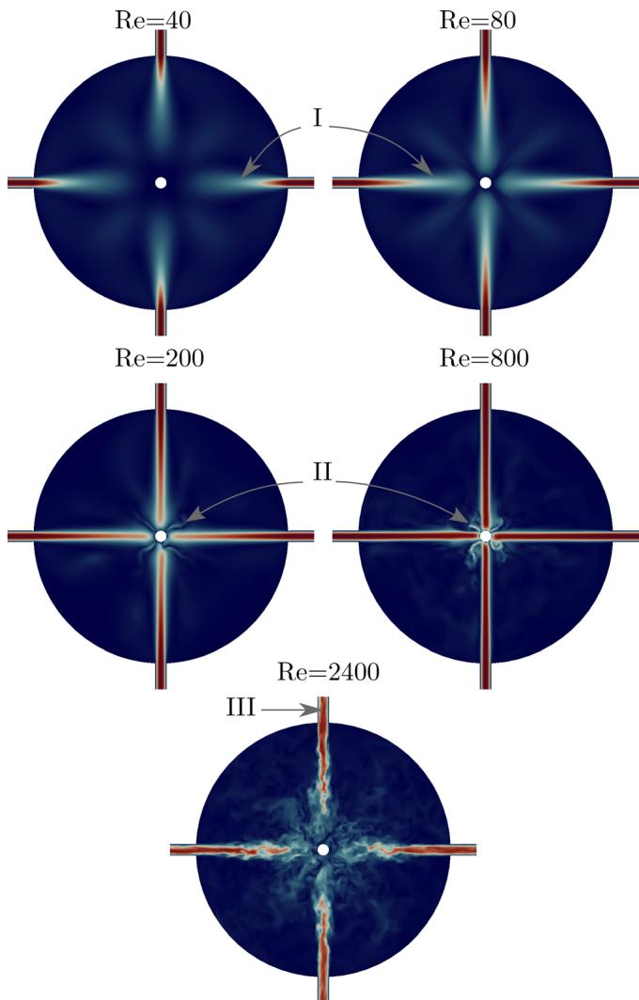  
FIG. 5. (Color online) Instantaneous velocity fields on the midsection of the inlet pipes.

In the ALD- process, the precursor concentration distribution on the sample plate is of primary interest. As Fig. 5 implies, the flow velocity field is strongly dependent on the Reynolds number. Instantaneous concentration snapshots for precursor 1 are shown in Fig. 6, indicating clear Reynolds number dependence as well. As the unity Schmidt number assumption implies, diffusion of the scalars follows consistently the Reynolds number: low- Re indicates higher diffusion while high- Re indicates increased turbulent mixing resulting in a qualitatively different mixing pattern. Figure 6 implies that while the laminar cases do not exhibit shear layer instabilities, at  $\mathrm{Re} = 2400$ , the well- known Kelvin- Helmholtz type wave instability growth close to the nozzle exit is observed.

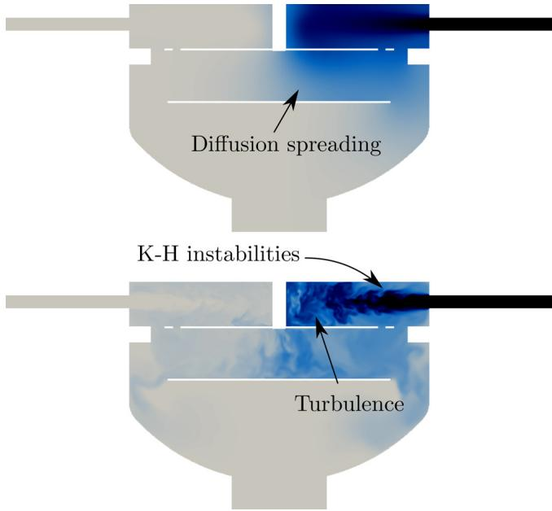  
FIG. 6. (Color online) Section of the instantaneous precursor fields at approximately midway through the injection for  $\mathrm{Re} = 40$  (top) and  $\mathrm{Re} = 2400$  (bottom). Only the precursor field is colored in the figures.

Figure 6 also implies that after fluid dynamical interactions above the grid, the flow falls eventually through the grid impinging on the sample plate.

# B. Time-averaged velocity distribution

During the jet injection, the incoming streamwise momentum becomes distributed to the transverse directions by three main mechanisms: momentum diffusion (all cases), jet shear layer Kelvin- Helmholtz instability growth and turbulence (primarily at  $\mathrm{Re} = 2400$ ), and jet- support impingement. Considering the flow streamlines based on the time- averaged velocity fields, Fig. 7 indicates the jet momentum transfer into multiple recirculation zones spanning the entire volume above the grid. For example, at  $\mathrm{Re} = 40$ , altogether eight such low speed zones are formed in the  $(x,z)$ - plane and the zones are enveloped by the jet shear layer, support, and the reactor walls. At a higher Reynolds number, the recirculation patterns become more complex due to the stronger impingement on the support.

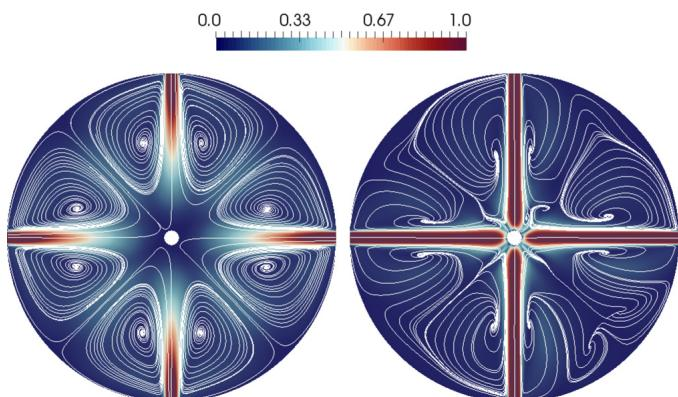  
FIG. 7. (Color online) Streamlines of the average velocity field at the midsection of the inlet pipes. The planes are colored by the mean velocity magnitude  $U / U_{\mathrm{in}}$

We observe that for all the cases not only do large recirculation zones appear in the vessel but the flow also turns down toward the sample plate passing through the grid holes. The grid induces small individual jets that eventually impinge on the sample plate. An essential observation is that different grid passage modes can be identified for the different cases. Figure 8 shows the time averaged velocity magnitude right below the reactor grid. At  $\mathrm{Re} \leq 200$ , the momentum distribution is rather smooth and spreads to a broad region spanning multiple grid holes due to the enhanced diffusion effects. In contrast, at  $\mathrm{Re} = 800$ , there is primary flow through an area spanning only 4- 8 grid holes. For the moderate value  $\mathrm{Re} = 800$ , the jet- support impingement causes not only coherent vortex shedding but also a relatively dominant and confined jet through the grid due to the relatively low diffusion and absence of turbulence. Finally, for the highest value  $\mathrm{Re} = 2400$ , the turbulence leads to high mixing above the grid which broadens the momentum distribution below the grid to span a region of about  $6 \times 6$  grid holes.

Above, it was noted that the Reynolds number related fluid dynamical mixing mode (diffusive, dynamic, and turbulent) above the grid has a strong link to the flow momentum distribution below the grid. Further insight to the flow structures below the grid is seen in Fig. 9(a) where the isosurface of time- averaged velocity magnitude is shown for  $\mathrm{Re} = 80$  and 800. The jet formed below the grid via the diffusive mixing mode at  $\mathrm{Re} = 80$  is observed as a single jet structure, while at  $\mathrm{Re} = 800$ , the dynamic mixing mode is seen to create four separate jets. The turbulence intensity close to the sample plane is shown in Fig. 9(b) which indicates expectedly vanishing flow fluctuation for laminar flow. In contrast, a strong link between fluctuating flow close to the wall and the four separate jets are observed at  $\mathrm{Re} = 800$

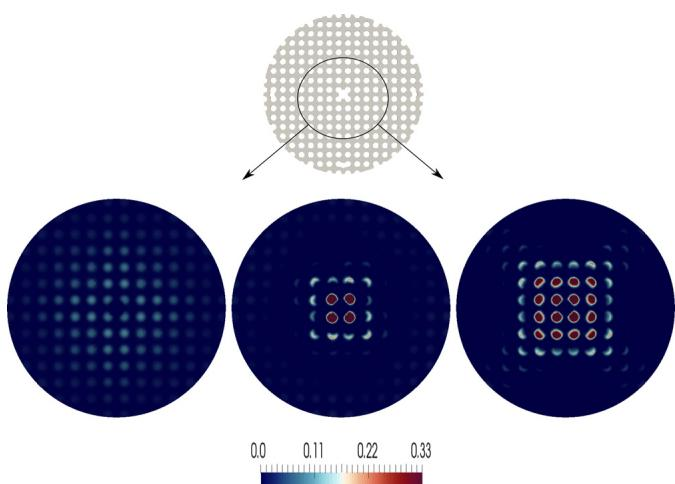  
FIG. 8. (Color online) Time-averaged velocity fields  $U / U_{\mathrm{in}}$  just below the grid part of the reactor for  $\mathrm{Re} = 40$ , 800 and 2400 from left to right, respectively. (a) The time averaged value of parallel to the grid velocity component isocontour at  $\bar{u} = U_{\mathrm{in}} / 36$  for  $\mathrm{Re} = 80$  (left) and  $\mathrm{Re} = 800$  (right). (b) Turbulence intensity  $I = u_{\mathrm{rms}}^{\prime} / U_{\mathrm{in}}$  in percentages for  $\mathrm{Re} = 80$  (left) and  $\mathrm{Re} = 800$  (right) slightly above the plane where the sample lies. Note the two different color scales.

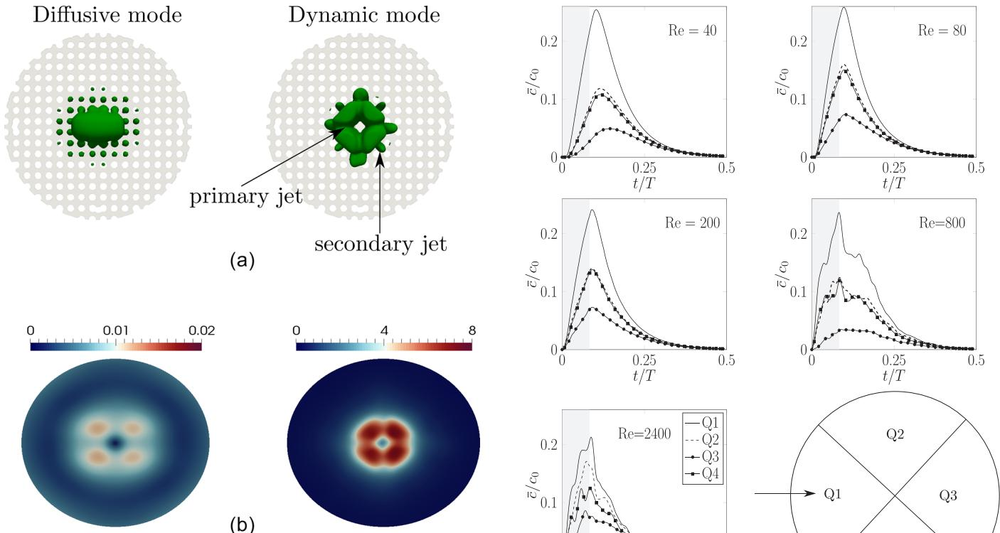  
FIG. 9. (Color online) Illustrations of the grid passage modes and increase of turbulence intensity at higher Reynolds number.  
Fig. 10. Spatial average of a precursor on the sample as a function of time during a half-cycle. The averages are presented in four equal sized sector sectors (Q1-Q4) for all Reynolds numbers. The gray region indicates the time of the pulse and the arrow the injection direction.

# C. Averaged scalar distributions on the sample plane

The time development of the spatial average of a precursor on the sample plane is illustrated in Fig. 10 for all Reynolds numbers. Note that the spatial averaging is carried out separately on four equal- sized sectors. At  $\mathrm{Re}\geq 200$  the peak value of the concentration on Q1 (on the injection side) occurs immediately after the end of the pulse, but with  $\mathrm{Re} = 40$  and 80, there is a delay between the end of the pulse and the maximum value. This delay is caused by the flow characteristics at low Reynolds number. As explained earlier, at low Reynolds numbers, the spreading of the precursor is strongly diffusion driven, which is a slow process compared to convection at higher Reynolds numbers. For the same reason, at  $\mathrm{Re} = 40$  the maximum value of the concentration on the opposite side of the injection (Q3) occurs clearly after the maximum value at the injection side (Q1). Already at  $\mathrm{Re} = 80$  the maximum values at all sectors occur almost simultaneously.

For  $\mathrm{Re}\leq 200$  the time development of the concentrations at sectors Q2 and Q4 follow each other quite closely. This is caused by the symmetry of the geometry and absence of turbulence. For  $\mathrm{Re} = 800$  and 2400, turbulence causes unsteady flow structures appearing as oscillations in the curves of Fig. 10. It should be noted that if more cycles were simulated for  $\mathrm{Re} = 800$  and 2400, the concentrations at sectors Q2 and Q4 should overlap in a manner similar to the cases  $\mathrm{A - C}$ $\mathrm{Re}\leq 200$  .Moreover, at  $\mathrm{Re} = 800$  the concentration at the opposite sector (Q3) has clearly smaller values compared to other Reynolds numbers. This is caused by the flow characteristics through the grid at  $\mathrm{Re} = 800$  as discussed earlier.

From surface coverage point of view, the pulse time could possibly be reduced by increasing the Reynolds number. However, the effect this would have on the film growth is difficult to assess without detailed model of the surface chemistry. Moreover, it is interesting to notice that the purging of the precursor is not heavily dependent on the Reynolds number and remains a slow process. The last traces of the precursor are purged away from the sample during very last stages of the purge phase at all Reynolds numbers.

To illustrate the surface coverage dependence on the Reynolds number, Fig. 11 shows the pulse- averaged precursor concentrations on the sample plane. Here, the pulse- average denotes a time- average carried over a half ALD- cycle (pulse + purge) for which the precursor is expected to remain in the chamber. The distributions are seen to pose a strong directional coupling: for a given precursor, higher concentrations are observed on the same side from where the given precursor was injected for all the studied Reynolds numbers. Moreover, the low Reynolds number cases  $(\mathrm{Re}< 800)$  indicate a rotational symmetry due to the symmetry of the geometry. This symmetry is broken for the two highest Reynolds numbers due to turbulence and insufficient total number of simulated cycles for the averages to completely converge. Further, the  $\mathrm{Re} = 800$  case appears qualitatively different from the other cases as the dynamic mixing mode seems to cause a less homogeneous surface distribution focused very strongly on the injection side of the

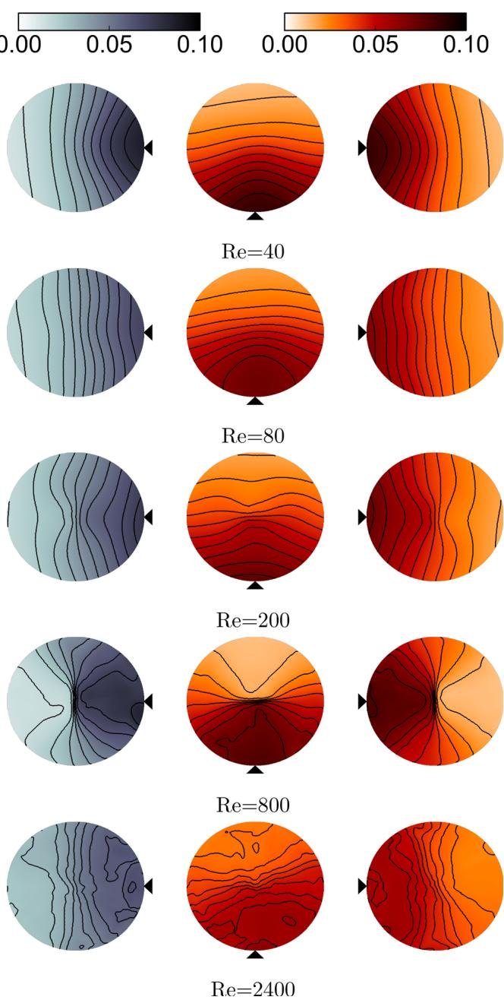  
FIG. 11. (Color online) Pulse-averaged scalar concentrations  $(c / c_0)$  on the sample. The injection directions are presented by the triangle in the figure.

support. Moreover, a strong negative spatial correlation can be seen between the precursors in opposing injection configuration and a mild positive one in the perpendicular injection configuration.

In order to quantitatively compare the film growth rate between measurements and simulations we introduce a growth rate factor  $\lambda = (c_1c_2) / (c_1 + c_2)$  for the probability of film growth based purely on the concentrations of the precursors (see the Appendix). It should be noted that, in reality, although full surface coverage is reached, the film growth is not guaranteed since the precursors may not react with the surface. The reaction rate at the surface also depends on parameters such as temperature, adsorption kinetics, steric hindrance, and the surface roughness. A thorough discussion of these factors related to the surface chemistry can be found from the review of Puurunen22 (see Sec. III). We emphasize that these are not taken into account in  $\lambda$

Figures 12 and 13 show the distributions of  $\lambda$  for perpendicular and opposing injection configurations, respectively. In the measurements, the Reynolds number of the carrier gas is approximately 38. The simulated growth rate factor for the perpendicular injection configuration (Fig. 12) at all Reynolds numbers shows certain similarities with the measured surface thickness. Both indicate a higher growth on the quarter closest to the injection of the precursors. However, for the opposite injection configuration, the observed patterns differ substantially, in particular, for the  $\mathrm{Re} = 800$  case. There may be multiple reasons for the discrepancy between the simulations and the experiments; however, the most likely one is the absence of surface reactions from the numerical model. Moreover, due to the passive nature of the precursors, the increase of flow rate during the precursor pulses was not taken into account in the results of Figs. 12 and 13.

When comparing the measured surface thickness between the two injection configurations, a clear difference can be seen. While both injection configurations show a bias in the thickness on the TMA injection side, in the opposing injection configuration also shows a formation of islands of higher thickness. After 50 ALD cycles, there are two islands on the TMA side, and after 600 cycles, three separate islands can be distinguished. As all other operation parameters were kept the same and only the injection configuration changed, the injection configuration and thus the flow characteristics seem to have a clear impact on the ALD process.

# D. Sensitivity to flow rate increase

Within the scope of this paper, a simulation F was carried out only to assess the mixing sensitivity to potentially increased flow rate by precursor injection. In simulation F, the flow rate from the precursor line was increased by  $50\%$  during the pulse and set back to 200 sccm during the purge. The flow rate from the other lines was kept the same as in cases A- E, and the Reynolds number in simulation F is  $\mathrm{Re} = 40$

Figure 14(a) illustrates how the sample surface concentration averages change between simulation cases A and F. When the flow rate is increased, the highest precursor concentration is shifted more toward the center of the sample and the average concentration is overall more uniform. In addition, two separate islands of high concentration form on the opposite side of the injection. Such islands can be explained by the changed flow pattern in the upper part of the reactor as depicted in Fig. 14(b). As Fig. 14(b) shows, the higher momentum in the injection line causes the jet stream to impinge on the support beam dividing the stream to two recirculation zones on the opposite side of the chamber. Such recirculation zones enhance the transport of precursor concentration to those regions. Eventually, the flow falls down the grid to the sample plane and, in fact, the recirculation pattern explains the island formation process.

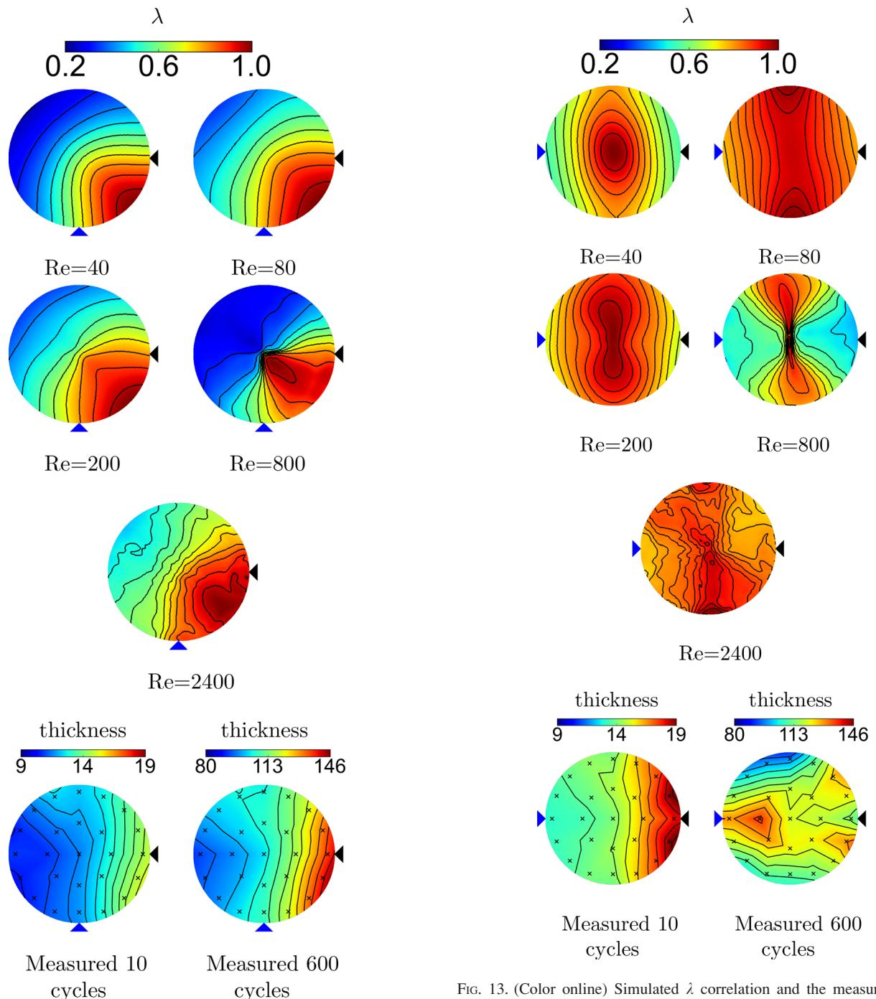  
FIG. 12. (Color online) Simulated  $\lambda$  correlation for all Reynolds numbers and the measured surface thickness in the perpendicular injection configuration. The small dots in the thickness maps indicate the locations of the measurement probes while the triangles indicate the directions of the precursor sources with respect to the sample. The lower triangle indicates the TMA injection and the right triangle the injection of water.  
FIG. 13. (Color online) Simulated  $\lambda$  correlation and the measured surface thickness after 50 and 600 cycles in the opposing injection configuration. (a) The pulse-averaged scalar concentration for constant flow rate during the pulse (left) and  $50\%$  increased flow rate (right). (b) Streamlines on the midsection of the inlet lines during the pulse. The arrow indicates the line with increased flow rate.

It is interesting to note the similarity of the average concentration contours for the increased flow rate to the measured surface thickness after 600 cycles for the opposing injection configuration (Fig. 13). Based on the fact that, in the measurements, the highest growth rate tends to be biased to the TMA side of the sample, one possible explanation for the similarity could be that the water pulse is injected to the reactor with higher flow rate than TMA. However, taking into account the lack of surface chemistry and the exact knowledge of the flow characteristics at the inlet boundary, the similarity is challenging to explain thoroughly by the present simulations alone. Nonetheless, the increased flow rate seems to have a clear impact on the precursor distribution and could be one explanation for the minute agreement in the previous results.

# IV. CONCLUSIONS

A numerical study on the carrier gas and precursor flow inside an ALD reactor chamber was conducted. Since the

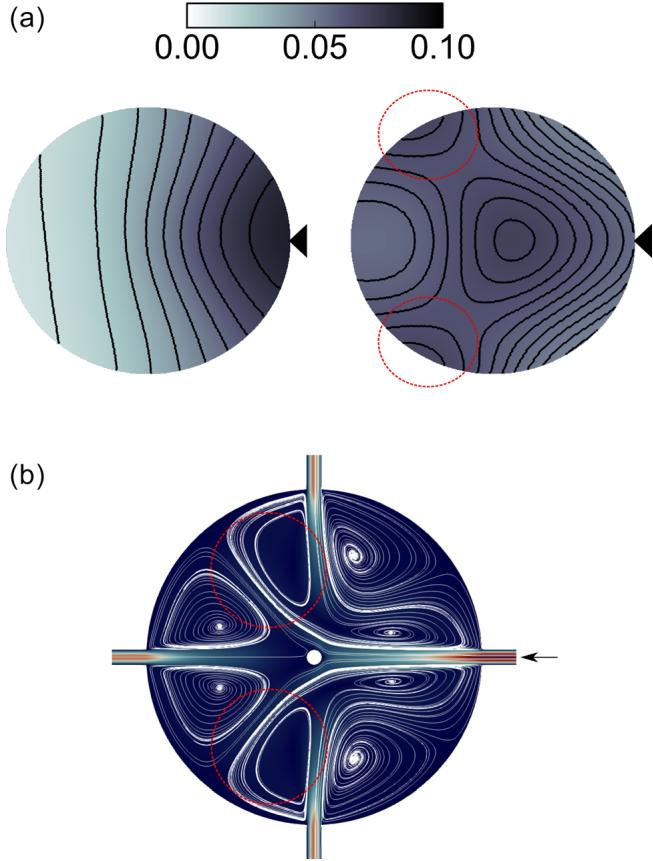  
FIG. 14. (Color Online) Effect of increased flow rate during the pulse at  $\mathrm{Re} = 40$

chemical reactions in the ALD process were neglected, only a qualitative agreement with the measurements was obtained. However, a scale- resolving simulation was found feasible, although, at high Reynolds numbers, the computational cost becomes high. The largest challenge for accurately resolving the flow in ALD applications originates from the long time scales involved in the process and geometrical complexity of a typical reactor restricting the maximum time step.

The simulations indicated relatively strong changes in the flow characteristics between the lowest and the highest Reynolds numbers. While the required pulse time could be reduced by increasing Reynolds number, no significant gain was found in the total length of the ALD- cycle as purging remains a slow process due to increased turbulence. Moreover, time- dependent flow structures could be observed already at  $\mathrm{Re} = 200$  At  $\mathrm{Re} = 800$  the strong jet- support impingement caused low precursor mixing in the upper part of the reactor resulting in less homogeneous  $\lambda$  distribution on the sample plane. Ideally, the precursors should be homogeneously distributed in the reactor chamber already during the precursor pulse to allow for shorter pulse times and more homogeneous film growth. Further, the different flow patterns observed at different Reynolds numbers indicate that various reactor specific geometric details and operating conditions may have an important role on the gas flow. Thus, successful modeling of the complete ALD process requires quite likely a scale- resolving CFD approach which has the detailed information on the inflow mass flow rates. Additionally, it may be required to combine the CFD model with a microscopic description of the surface chemistry, e.g., by kinetic Monte Carlo studies derived from density functional theory.23

Based on this study, we have found primarily computational evidence on the relevance of the mixing configuration on the surface coverage. Moreover, since in the measurements the only change was the injection configuration, we can conclude that the precursor concentration on the surface of the sample has an impact on the film uniformity. In the perpendicular injection configuration, the agreement between the simulated film growth rate (measured here in the simplified parameter  $\lambda$ ) and the measurements was reasonable, but in the opposing injection configuration, the agreement was minute. At least one explanation for the minute agreement was found to be the treatment of the precursors as passive scalars. The precursors not only affect the properties of the carrier gas- precursor mixture, but also increase the mass flow rate during the pulses, which was noticed to substantially change the precursor concentration on the sample. Moreover, for better predictions of the film growth, the surface reactions or at least the consumption of the precursors on the sample should be taken into account.

# ACKNOWLEDGMENTS

The computational resources for this study were provided by CSC—Finnish IT Center for Science. The authors thank Picosun for providing them the 3D model of the Picosun R- 100 ALD reactor chamber and for the ellipsometry. G.M., A.J.K., and M.K. gratefully acknowledge funding from the Strategic Research Council at the Academy of Finland (CloseLoop Consortium, Grant No. 303452).

# APPENDIX: DERIVATION OF  $\lambda$

In order to assess the surface growth rate, we next aim at forming a numerical metric indicating the joint correlation between the two precursor concentrations ( $c_{1}$  and  $c_{2}$ ). The aim is to form a metric for improved qualitative evaluation of local growth rate and qualitative comparison between the simulations and the experiments. We consider a simplified, stochastic model process for the mean growth rate of a macroscopic surface element on the resolved CFD- scale  $\Delta x$  to which precursors 1 and 2 attach and react with a probability proportional to concentrations  $c_{1}$  and  $c_{2}$ . It is clear that this assumption neglects various aspects of surface chemistry and thermodynamical conditions (e.g., reaction does not necessarily follow from attachment). However, we consider that a formalism similar to the one shown below could be equally well formulated for more detailed surface chemistry by proper modification of the reaction probabilities.

We assume that a sample surface element can be in two states: state (1) precursor 1 has attached on the surface, awaiting for precursor 2, or state (2) precursor 2 has attached on the surface, awaiting for precursor 1. A layer of thickness  $\Delta h$  is completed once the precursor 2 has attached, i.e., the

system is in state 2. Observing the system in state  $i$  at discrete time  $n$  occurs at probabilities  $\pi_{i}^{n}$  which satisfy the following recursion equations:

$$
\begin{array}{r}\pi_1^{n + 1} = \pi_1^n (1 - c_2) + \pi_2^n c_1,\\ \pi_2^{n + 1} = \pi_2^n (1 - c_1) + \pi_1^n c_2. \end{array} \tag{A2}
$$

Assuming a steady state  $\pi_i^{n + 1} = \pi_i^n$  and noting that  $\pi_1 + \pi_2$ $= 1$  gives

$$
\begin{array}{l}\pi_1 = \frac{1}{1 + \frac{c_2}{c_1}},\\ \pi_2 = \frac{\frac{c_2}{c_1}}{1 + \frac{c_2}{c_1}}. \end{array} \tag{A3}
$$

The expectation value of the film thickness  $h_n$  is defined to increase by the layer thickness  $\Delta h$  in case precursor 2 attaches and reacts on the surface. There are only a few elementary cases which can take place. The expectation value of the thickness  $h_n$  obeys the following recursion equation:

$$
h_{n + 1} = \pi_1(1 - c_2)h_n + \pi_2h_n + \pi_1c_2(h_n + \Delta h). \tag{A5}
$$

For example, the thickness of the system is unchanged  $(h_{n + 1} = h_n)$  in case the system is in state 1 (probability  $\pi_1$  and precursor 2 does not attach on the surface (probability 1  $c_{2}$  ) yielding the first term in the equation. Rearranging the terms leads to

$$
h_{n + 1} - h_n = \frac{c_1c_2}{c_1 + c_2}\Delta h, \tag{A6}
$$

from which we identify the growth factor  $\lambda$

$$
\lambda = \frac{c_1c_2}{c_1 + c_2}. \tag{A7}
$$

If precise knowledge on the attachment and reaction probabilities (instead of  $c_{1}$  and  $c_{2}$  ) in different thermochemical conditions were known, the definition of  $\lambda$  could be changed accordingly. For example,  $c_{1}$  could be replaced with a more complex dependency.

$^1$ S. M. George, Chem. Rev 110, 111 (2010).  $^2$ R. L. Puurunen, Chem. Vap. Deposition 20, 332 (2014).  $^3$ R. W. Johnson, A. Hultqvist, and S. F. Bent, Mater. Today 17, 236 (2014).  $^4$ G. N. Parsons, Atomic Layer Deposition of Nanostructured Materials (Wiley, Weinheim, Germany, 2012), pp. 271- 300.  $^5$ R. Kuse, M. Kundu, T. Yasuda, N. Miyata, and A. Toriumi, J. Appl. Phys. 94, 6411 (2003).  $^6$ A. Holmqvist, T. Toridaldi, and S. Stenström, Chem. Eng. Sci. 81, 260 (2012).  $^7$ A. Lankhorst, B. Paarhuis, H. Terhorst, P. Simons, and C. Kleijn, Surf. Coat. Technol. 201, 8842 (2007).  $^8$ M. R. Shaeri, T. C. Jen, and C. Y. Yuan, Int. J. Heat Mass Transfer 78, 1243 (2014).  $^9$ Z. Deng, W. He, C. Duan, B. Shan, and R. Chen, Vacuum 123, 103 (2016).  $^{10}$ D. Pan, T. Li, T. C. Jen, and C. Yuan, J. Vac. Sci. Technol., A 32, 01A110 (2014).  $^{11}$ D. Pan, L. Ma, Y. Xie, T. C. Jen, and C. Yuan, J. Vac. Sci. Technol., A 33, 021511 (2015).  $^{12}$ D. Pan, D. Guan, T. C. Jen, and C. Yuan, J. Manuf. Sci. Eng. 138, 101010 (2016).  $^{13}$ Y. Xie, L. Ma, D. Pan, and C. Yuan, Chem. Eng. J. 259, 213 (2015).  $^{14}$ Y. Xie, D. Pan, L. Ma, and C. Yuan, J. Cleaner Prod. 133, 338 (2016).  $^{15}$ H. G. Weller, G. Tabor, H. Jasak, and C. Furiahy, Comput. Phys. 12, 620 (1998).  $^{16}$ R. Issa, J. Comput. Phys. 62, 40 (1986).  $^{17}$ V. Vuorinen, J.- P. Keskinen, C. Duwig, and B. Boersma, Comput. Fluids 93, 153 (2014).  $^{18}$ P. J. Keskinen, V. Vuorinen, O. Kaario, and M. Larmi, Comput. Fluids 122, 123 (2015).  $^{19}$ J.- P. Keskinen, V. Vuorinen, O. Kaario, and M. Larmi, Int. J. Numer. Methods Fluids 82, 171 (2016).  $^{20}$ P. J. Linstrom and W. G. Mallard, NIST Chemistry WebBook, NIST Standard Reference Database Number 69 (National Institute of Standards and Technology, Gaithersburg, 2001).  $^{21}$ F. M. White, Viscous Fluid Flow (McGraw- Hill Mechanical Engineering) (McGraw- Hill, New York, 2005), Vol. 3.  $^{22}$ R. L. Puurunen, J. Appl. Phys 97, 121301 (2005).  $^{23}$ M. Shirazi and S. D. Elliott, J. Comput. Chem. 35, 244 (2014).