# Computational Fluid Dynamics simulation of the ALD of alumina from TMA and  $\mathbf{H}_2\mathbf{O}$  in a commercial reactor

G.P. Gakis $^{a,b}$ , 
H. Vergnes $^{b}$ , 
E. Scheid $^{c}$ , 
C. Vahlas $^{d}$ , 
B. Caussat $^{b,*}$ , 
A.G. Boudouvis $^{a}$

$^{a}$  National Technical University of Athens, School of Chemical Engineering, Athens, Greece   $^{b}$  Laboratoire de Génie Chimique, Université de Toulouse, CNRS, INPT, UPS, Toulouse, France   $^{c}$  LAAS, Université de Toulouse, CNRS, Toulouse, France   $^{d}$  CIRIMAT, Université de Toulouse, CNRS, INPT, UPS, Toulouse, France

# ARTICLE INFO

# ABSTRACT

Article history:  Received 6 November 2017  Received in revised form 14 February 2018  Accepted 20 February 2018  Available online 2 March 2018

# Keywords:

ALD  CFD  Alumina  TMA  Water  Film uniformity

A three- dimensional Computational Fluid Dynamics model is built for a commercial Atomic Layer Deposition (ALD) reactor, designed to treat large area  $20cm$  substrates. The model aims to investigate the effect of the reactor geometry and process parameters on the gas flow and temperature fields, and on the species distribution on the heated substrate surface, for the deposition of  $\mathrm{Al}_2\mathrm{O}_3$  films from trimethyl aluminum and  $\mathrm{H}_2\mathrm{O}$ . The investigation is performed in transient conditions, without considering any surface reaction. A second CFD model is developed for the feeding system of the reactor, in order to calculate the unknown reactant inlet flow rates. The two models are coupled via a computational strategy dictated by the available experimental measurements. Results show that a purging flow entering the reactor through its loading door affects the flow field above the substrate surface and causes non- uniformity in the temperature and reactants concentration on the substrate surface. During the TMA pulse, a recirculation sets in above the substrate surface, leading to a non- uniform distribution of species on the surface.

$^{\mathrm{\textregistered}}$  2018 Institution of Chemical Engineers. Published by Elsevier B.V. All rights reserved.

# 1. Introduction

Atomic Layer Deposition (ALD) is a deposition technique, derived from Chemical Vapor Deposition (Johnson et al., 2014), able to deposit highly conformal and uniform material films on a substrate. ALD is based on the sequential exposure of a surface to two reactants, with which the surface reacts through self- terminating reactions (Johnson et al., 2014; Puurunen, 2005; George, 2010), inside a reactor chamber. The self- limiting nature of the surface reactions in the Atomic Layer Deposition (ALD) process ensures a high control over the deposited material film thickness down to the monolayer level (George, 2010). High uniformity and conformity of the deposited film can thus be achieved under optimized conditions (George, 2010). These characteristics make ALD a favorable tool to produce ultra- thin films for a variety of applications in microelectronics, optoelectronics, catalysis, renewable energy and more (Johnson et al., 2014). However, ALD is a complex technique since it depends on the nature of the reactants and on the process conditions, and for this reason, research regarding the surface reactions and growth mechanisms is still ongoing.

One of the most studied ALD processes is the deposition of  $\mathrm{Al}_2\mathrm{O}_3$  films from tri- methyl aluminum  $(\mathrm{Al(CH_3)_3}$ , TMA) and  $\mathrm{H}_2\mathrm{O}$  vapor (Puurunen, 2005; Higashi and Fleming, 1989; Wind and George, 2010; Groner et al., 2004; Dillson et al., 1995; Ferguson et al., 2000; Ott et al., 1997; Elam et al., 2002; Salami et al., 2017; Henn- Lecordier et al., 2011a,b; Mousa et al., 2012; Li et al., 2007; Elliott and Greer, 2004; Widjaja and Musgrave, 2002; Weckman and Laasonen, 2015; Delabie et al., 2012; Travis and Adomaitis, 2014, 2013; Gobbert et al., 2002; Mazaleyrat et al., 2005; Pan et al., 2015a,b, 2016; Xie et al., 2015, 2016; Deng et al., 2016;

Shaeri et al., 2015, 2004). Both reactants satisfy the chemical and thermodynamic criteria for an ALD precursor, as they are volatile and thermally stable for a range of temperatures (Puurunen, 2005) and can involve self- limiting surface reactions (Higashi and Fleming, 1989). A great number of experimental works has been published on this chemical system (Higashi and Fleming, 1989; Wind and George, 2010; Groner et al., 2004; Dillon et al., 1995; Ferguson et al., 2000; Ott et al., 1997; Elam et al., 2002; Salami et al., 2017; Henn- Lecordier et al., 2011a; Mousa et al., 2012; Li et al., 2007; Henn- Lecordier et al., 2011b). In numerous reactor configurations and a wide range of process conditions and substrates. The robustness of the process and the wealth of literature reports demonstrate that ALD of  $\mathrm{Al_2O_3}$  offers a convenient model system to get insight to the fundamentals of the ALD processes in general.

ALD is an inherently multi- scale process. From the interaction of molecules at the atomic scale and the film growth evolution at the nano- scale, to the deposition inside surface features at the micro- scale or the thickness control on the substrate at the dm scale, and vice versa, the physical and chemical phenomena taking place are coupled. The difference in the time scales of the involved mechanisms, such as diffusion and adsorption of gaseous reactants and surface reactions, is another factor contributing to the complexity of the process. As experimental investigations are tedious at such different time and length scales, physical based modelling has emerged as a way to study the fundamentals of those mechanisms. A wide number of density functional theory (DFT) calculations (Elliott and Greer, 2004; Widjaja and Musgrave, 2002; Weckman and Laasonen, 2015; Delabie et al., 2012) has been published to study the surface reaction energetics during the reactant exposure steps of the ALD process of alumina from TMA and  $\mathrm{H_2O}$ . These investigations consider the nature of the surface phenomena, and the different reaction states that the reaction molecules undergo during the process. Using the above energetics, Travis and Adomaitis (2014, 2013) investigated the surface reaction kinetics, and the process dynamics during the ALD cycle. Gobbert et al. (2002) studied the step coverage inside surface trenches using a feature scale model, while Mazaleyrat et al. (2005) used kinetic Monte Carlo simulations to study the growth evolution of alumina on silicon substrates.

However, as the process takes place into an ALD reactor, the process parameters affect the transport phenomena inside the reactor chamber (Higashi and Fleming, 1989; Wind and George, 2010; Groner et al., 2004; Dillon et al., 1995; Ferguson et al., 2000; Ott et al., 1997; Elam et al., 2002; Salami et al., 2017), and hence the pressure and temperature fields, as well as the reactant concentrations, on which the surface reactions are dependent. As these phenomena are difficult to study experimentally, numerical simulations in the reactor have emerged as a powerful tool for the process analysis of ALD reactors, complementary to the surface reactions analysis by DFT (Pan et al., 2015a, b, 2016; Xie et al., 2015, 2016; Deng et al., 2016; Shaeri et al., 2015, 2004). Indeed, reactor scale modelling via Computational Fluid Dynamics (CFD) (Xenidou et al., 2010; Zahi et al., 2010) can provide useful insight regarding transport phenomena inside an ALD reactor, such as the temperature field along the chamber, the local gas velocity, and the reactant distribution on the substrate during the reactant exposure steps. This can help determining the optimal conditions for the process, in terms of minimization of pulse and purging times, leading to less reactant consumption and process time required. CFD simulations can also be used to study the effect of a given geometry on the process, especially in the case of reactors treating large area substrates  $(>10cm)$ . Uniform temperatures and reactant concentrations on the whole surface of the substrate are required to obtain uniform ALD films. This means that the study of transport phenomena inside the reactor is crucial for the quality of the deposited film, in terms of uniformity and conformity. CFD simulations have been performed to investigate the effect of numerous process parameters on the film deposition (Pan et al., 2015a; Xie et al., 2015), and to determine the optimal dose and purge times for certain process conditions (Deng et al., 2016). Xie et al. (2016) studied the reactant dosing efficiency during the ALD process, in order to optimize reactant usage. Pan et al. (2015b) analyzed the process in order to find the optimal arrangement for a multi- wafer reactor setup. Shaeri et al. (2015, 2004) studied different reactor designs to optimize the deposition large area substrates. A spatial ALD reactor, separating the reactants and the substrate posi tion instead of time, was also studied via CFD simulations by Pan et al. (2016).

In this work, a three- dimensional CFD model is built for a commercial ALD reactor with a complex geometry, depositing  $\mathrm{Al_2O_3}$  films via the TMA/H2O process, on large area  $20cm$  substrates. The aim of this work is to investigate the transport phenomena occurring inside the reaction chamber during the ALD process in transient conditions during the exposure and purge steps. This is the first step towards an integrated investigation of the ALD process, including, at a later stage, surface reactions. The CFD model of the ALD reactor itself is coupled with a second CFD model of the feeding system to account for the reactants inlet flow rates, due to the absence of corresponding experimental data during the ALD exposure steps. The impact of the complex reactor geometry on the temperature, gas flow fields and reactant distribution on the substrate is studied.

# 2. Process description

# 2.1. ALD setup

The model is developed for the geometry of a commercial Ultratech Fiji F200 ALD set- up. It consists of the ALD reactor and the reactant feeding system as detailed in Fig. 1.

The reactor has three gas inlets, hereafter called top inlet, side inlet, and loading door inlet, as shown in Fig. 1a. A steady flow of argon (Ar) is permanently fed to the reactor via its top inlet, from which the majority of purging gas is entering the reactor chamber. Another Ar flow is permanently fed through the load lock inlet in order to purge the loading door, and reduce the amount of alumina deposited on the loading door walls. The side inlet is connected to the reactant feeding system (Fig. 1b). Through the side inlet, a third Ar flow is permanently fed, which serves as a carrier gas for the reactants during the ALD exposure steps, and as a purge gas for the ALD purging period. The Ar flow is regulated by mass flow controllers (MFC), while the reactant pulses are controlled by the opening time of ALD valves. The reactor outlet is connected to a turbo- molecular vacuum pump. The pumping speed and base pressure are regulated with an automatic pressure controller (APC) unit. The APC unit consists of a heated throttling and sealing butterfly valve, installed upstream of the turbo pump. The base pressure is regulated in advance using a capacitance manometer at the reactor outlet, while during deposition, the outlet pressure is monitored by a Pirani gauge. Indeed, the capacitance manometer isolation valve is automatically closed during an ALD recipe, to prevent deposition on the measuring device. Hence, the only data provided during deposition is the pressure variation at the reactor outlet measured by the Pirani gauge. The reactor walls and the precursor feeding system are heated via a jacket, while the substrate is heated via a chuck. The loading door walls are not heated.

The feeding system consists of two stainless steel bottles, in which the TMA and  $\mathrm{H_2O}$  are stored, and a heated tube circuit. The Ar flow enters the feeding system at  $20^{\circ}C$  through its inlet shown in Fig. 1b. The feeding system outlet is connected to the reactor side inlet. The tube circuit is heated to  $150^{\circ}C$ , while the reactant bottles are heated through conduction to a measured temperature of  $28^{\circ}C$ . The ALD valves are closed during the ALD purging times to ensure that no reactant is injected into the reactor chamber. During the exposure times, the valve of the respective reactant bottle opens for a given time, releasing the vapor pressure of the reactant gas above the surface of the liquid, which is injected into the reactor simply by pressure difference between the bottle and the reactor.

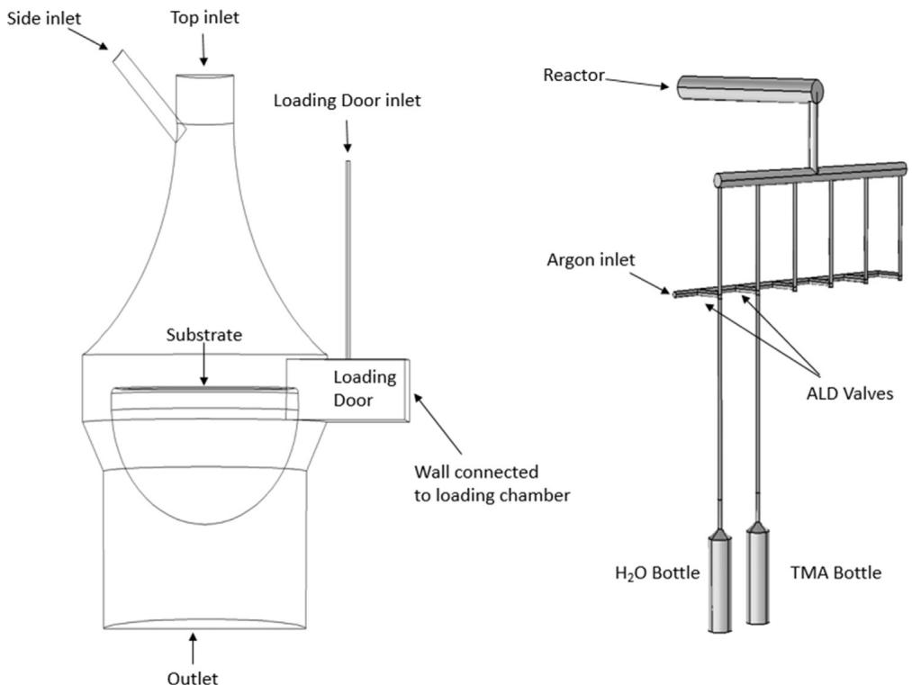  
Fig. 1 - Schematics of the ALD system (Ultratech® Fiji F200): a) the ALD reactor chamber, b) the reactant feeding system.

# 2.2. Process conditions

The  $\mathrm{TMA / H_2O}$  chemical system is considered in the model as ideal, i.e. the reactions occurring between the reactants and the surface fulfill the self- limiting criterion. Methane  $(\mathrm{CH}_4)$  the reaction by- product, is assumed inert (Johnson et al., 2014) and thermodynamically ideal; it is volatile and thermally stable at the prevailing temperature (Purunen, 2005).

Although not considered in the present modeling, the overall reactions taking place on a previously hydroxylated surface during the reactant exposures are shown hereafter (Pan et al., 2016), for the understanding of the process and the analysis of the results:

TMA pulse:

$$
2\mathrm{Al(CH_3)_{3(g)} + 3OH_{(s)}\rightarrow(O_2)AlCH_3_{(s)} + O\cdot Al(CH_3)_{2(s)} + 3CH_4(g)}
$$

$\mathrm{H}_2\mathrm{O}$  pulse:

$$
2\mathrm{H}_2\mathrm{O}_{(\mathrm{g})} + *\mathrm{Al}(\mathrm{CH}_3)_{2(\mathrm{g})}\rightarrow \mathrm{Al}(\mathrm{OH})_{2(\mathrm{g})} + 2\mathrm{CH}_{4(\mathrm{g})} \tag{2}
$$

$$
\mathrm{H}_2\mathrm{O}_{(\mathrm{g})} + *\mathrm{Al}(\mathrm{CH}_3)_{(\mathrm{s})}\rightarrow \mathrm{AlOH}_{(\mathrm{s})} + \mathrm{CH}_{4(\mathrm{g})} \tag{3}
$$

The overall reaction for the whole ALD cycle is (Johnson et al., 2014):

$$
2\mathrm{Al(CH_3)_{3(g)} + 3H_2O_{(g)}\rightarrow Al_2O_3 + 6CH_4} \tag{4}
$$

The study of the transport phenomena inside the reactor was performed with a preset deposition process recipe: the Ar purging gas was set to an uninterrupted total flow of 180 sccm total (MFC standard conditions are  $24^{\circ}C$  and 1 bar), consisting of 100 sccm fed through the reactor top inlet as the main reactor purge, 50 sccm fed through the load lock inlet as the loading door purge, and 30 sccm fed through the side inlet of the reactor, to serve as carrier gas for the reactants.

The side inlet tube and feeding system were heated to  $150^{\circ}C$ . The substrate was heated to  $300^{\circ}C$ , while the side walls of the reactor were heated to  $270^{\circ}C$ . This temperature is lower than the substrate temperature, since the TMA molecule starts to slowly decompose at temperature above  $300^{\circ}C$  in the gas phase. The temperature of the loading door wall connected to the loading chamber system was measured at  $36^{\circ}C$ . The top and load lock Ar purging gas enters the reactor at  $20^{\circ}C$ .

The opening times of the TMA and  $\mathrm{H}_2\mathrm{O}$  vessels valves were set to  $25\mathrm{ms}$  and  $60\mathrm{ms}$ , respectively, for the pulsing steps of the process. The two pulsing times were separated by a 5 s Ar purge time period. The base pressure of the process was set to  $50\mathrm{mTorr}$ , as measured by the Pirani gauge at the reactor outlet. The base pressure measurement via the Pirani gauge will be discussed in detail in Section 4.1 and Appendix B. The operating conditions are summarized in Table 1.

# 3. Computational model formulation

# 3.1. Governing equations and model assumptions

The governing equations are the conservation of mass, momentum, energy and chemical species, without any chemical reaction. The equations of conservation of chemical species include the Soret effect. They are all shown in Appendix A. The gas is assumed ideal and the thermal conductivity, dynamic viscosity, and diffusion coefficients for the chemical species are computed using the kinetic gas theory. The Lennard- Jones parameters for the species are obtained from the CHEMKIN- PRO database (CHEMKIN- PRO, 2013). The equations were discretized and solved using Comsol Multiphysics, which uses the finite element method. A quadratic basis function set was selected for the velocity and the species mass fractions, while a linear basis function set was used for temperature and pressure. Comsol Multiphysics

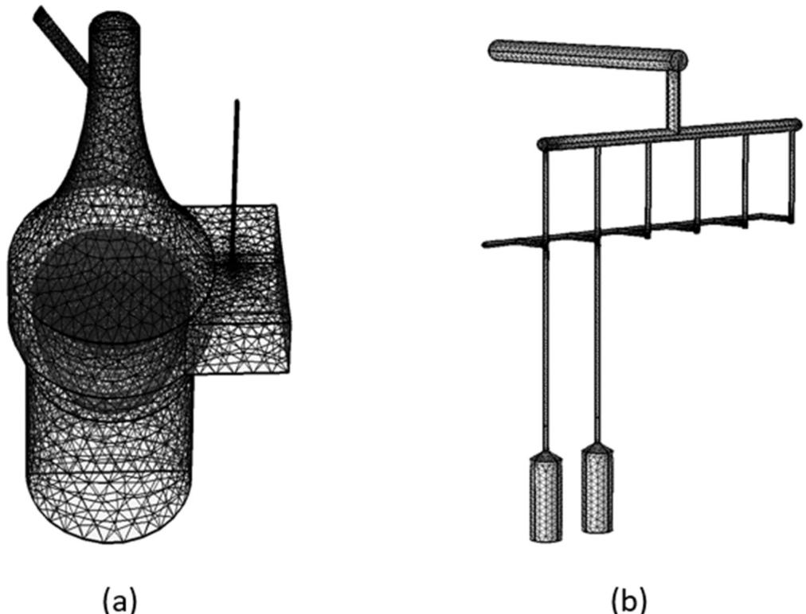  
Fig. 2 - Computational mesh generated for: a) the ALD reactor model, b) the reactant feeding system.

Table 1-Process conditions used for the ALD reactor.  

<table><tr><td>Flow conditions</td><td></td></tr><tr><td>Carrier gas Ar flow (through the feeding system and side inlet of the reactor) (sccm)</td><td>30</td></tr><tr><td>Top inlet Ar flow (sccm)</td><td>100</td></tr><tr><td>Load lock inlet Ar flow (sccm)</td><td>50</td></tr><tr><td>Base pressure (as measured by Pirani gauge at the outlet) (mTorr)</td><td>50</td></tr><tr><td>Thermal conditions</td><td></td></tr><tr><td>Top inlet temperature (°C)</td><td>20</td></tr><tr><td>Side inlet tube—feeding system tubes temperature (°C)</td><td>150</td></tr><tr><td>Load lock inlet temperature (°C)</td><td>20</td></tr><tr><td>Reactor side walls temperature (°C)</td><td>270</td></tr><tr><td>Substrate temperature (°C)</td><td>300</td></tr><tr><td>Temperature measured at the loading door and loading chamber connection (°C)</td><td>36</td></tr><tr><td>Reactant bottles measured temperature (°C)</td><td>28</td></tr><tr><td>ALD cycle conditions</td><td></td></tr><tr><td>TMA valve opening time (s)</td><td>0.025</td></tr><tr><td>TMA purge time (s)</td><td>5</td></tr><tr><td>H2O valve opening time (s)</td><td>0.060</td></tr><tr><td>H2O purge time (s)</td><td>5</td></tr></table>

was also used to generate the computational mesh for both domains (reactor and feeding system). The mesh used for the feeding system model consists of 35,246 tetrahedral elements and the mesh used for the ALD reactor model consists of 149,226 tetrahedral elements. The computational mesh for the two models is presented below, in Fig. 2.

# 3.2. Computational strategy and boundary conditions

A major difficulty in modelling the process under study is the absence of data regarding the reactant pulses that are injected into the ALD reactor during the exposure steps of the cycle, as no measuring device is installed. As a consequence, the reactant flows were calculated using the feeding system model and a strategy was developed to connect the models which describe the feeding and the deposition parts of the ALD system. This strategy is summarized in Fig. 3. At the first step, the steady flow of Ar is simulated in the reactor. This is done by using the flow rates and temperatures of Table 1 as inlet boundary conditions. The heating chuck on which the substrate is placed, is accounted for via a heating flux on the substrate surface. This heating flux is adjusted, so that the center of the substrate (where the temperature controller is situated) is set to the desired temperature i.e.  $300^{\circ}C$ . An outlet pressure boundary condition is set at the reactor outlet. This pressure is taken equal to the base pressure of the ALD process, measured by the capacitance manometer at the outlet, controlled by the APC unit. The resulting pressure distribution is used to simulate the feeding system.

The feeding system was first simulated with the two valves of the reactants vessels closed. This was done by using the 30 sccm of Ar (Table 1), serving as a carrier gas, as an inlet boundary condition. An impermeable interface is used to account for the closed ALD valves. The feeding system outlet, connected to the side inlet of the reactor, was set to the pressure computed for the side inlet in the previous step (constant flow of Ar inside the reactor). The gas volume in each vessel above the liquid reactants is assumed to be half that of the bottle, at a pressure equal to the vapor pressure of the respective reactant at  $28^{\circ}C$ ; i.e. 1940 Pa (14.55 Torr) for TMA and 3820 Pa (28.65 Torr) for  $\mathrm{H_2O}$  (NIST Chemistry WebBook, 2005).

The solution for the steady Ar flow in the feeding system is then used as an initial condition to simulate the reactant exposure steps. This is done by removing the impermeable interface corresponding to each reactant exposure and simulating the process for the valve opening time indicated in Table 1. After the valve opening, the interface is set again and the process is simulated until no more reactant is present in the feeding system. This leads to the calculation of the reac

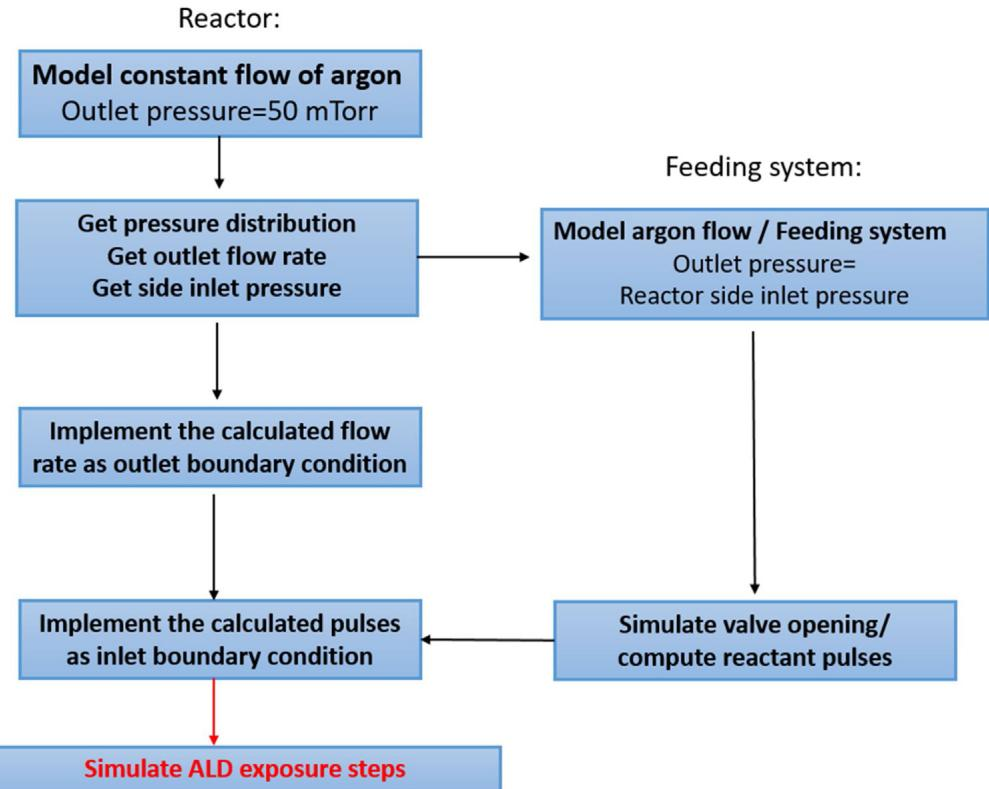  
Fig. 3 - Schematic representation of the implemented computational strategy.

tant pulses during the ALD exposure steps. The computed pulses are then implemented as a transient inlet condition to the side inlet of the reactor model. The turbo- molecular vacuum pump sets the reactor outlet pressure. Since the pump works under a constant volumetric flow rate for a wide range of pressures, the volumetric rate of the pumped reactants remains constant during deposition. Consequently, a steady volumetric flow rate is set at the reactor outlet and coincides with that of the steady Ar flow in the reactor. Using the computed pulses as inlet conditions and the computed constant outlet flow rate as an outlet condition, the ALD exposure steps inside the reactor chamber are simulated.

# 4. Results and discussion

# 4.1. Model predictions: steady flow of Ar

# 4.1.1. Vacuum pump and Pirani gauge simulation

As presented in the previous section, the starting point for the computations is the base pressure of the ALD process. As detailed in Section 2.1, it is measured by the Pirani gauge, a gas dependent gauge that measures the pressure of a gas through its thermal conductivity. In this case, the Pirani gauge used is calibrated for nitrogen. Typically, the pressure reading by a Pirani gauge is multiplied by a correction factor, different for each gas, in order to calibrate the measurements to the real pressure value. In our case, these correction factors are unknown. So, in order to compare the predicted values,  $\mathbb{P}_{\mathrm{calc}}$  with the Pirani measurements,  $\mathbb{P}_{\mathrm{exp}}$  , we convert the former following Eq. (5), which accounts for the dependence, assumed linear, of the pressure reading on the ratio of the thermal conductivities of the gas mixture and nitrogen. This conversion is then based on the principles of the Pirani gauge (indirect measurement of pressure via the gas thermal conductivity), with the assumption that the pressure measurement is linearly dependent on the thermal conductivity of the gas. The converted value, denoted by  $\mathbb{P}_{\mathrm{conv}}$  is used for the comparison with the experimental measurements  $(\mathbb{P}_{\mathrm{exp}})$  . Although the particular assumption is not validated for  $\mathrm{H}_2\mathrm{O}$  or TMA,experiments showed (see Appendix B) that it can be used for the pure Ar flow.

$$
P_{conv} = P_{calc}\cdot \frac{k_{mixture}}{k_{Nitrogen}} \tag{5}
$$

where  $\mathbf{k}_{\mathrm{mixture}}$  is the thermal conductivity of the gas mixture,  $\mathbf{k}_{\mathrm{Nitrogen}}$  is the thermal conductivity of nitrogen,  $\mathbb{P}_{\mathrm{calc}}$  is the calculated pressure. Using the kinetic gas theory, the thermal conductivity of pure nitrogen at the outlet temperature, i.e  $270^{\circ}C$  is estimated  $0.041106\mathrm{W / mK}$

Eq. (5) is also used to transform the experimental pressure measurements of the Pirani gauge to the real pressure value, to be used as a model input for the base pressure of the ALD process.

During the purging step of the reactor, the base pressure is measured by the Pirani gauge at  $\mathrm{P} = 50\mathrm{mTorr}$  outlet pressure measurements are shown in Appendix B. This value corresponds to  $\mathrm{P_{calc} = 72mTorr}$  (from Eq. (5)), imposed as outlet boundary condition. The computed outlet volumetric flow rate is  $\mathrm{Q_{out} = 57}$ $1255~\mathrm{L / s}$  at the outlet temperature and pressure. This value is set as outlet boundary condition when the turbomolecular vacuum pump operates with a constant butterfly valve opening. Using the previous solution as an initial estimate for the next one, the total Ar flow through the reactor inlet is varied. Experiments were performed for the same conditions, and the outlet pressure was measured by the Pirani gauge. The comparison between the experimental measurements and the model predictions, i.e. the converted values  $(\mathbb{P}_{\mathrm{conv}})$  obtained using Eq. (5), is shown in Fig. 4.

The good agreement between measurements and model predictions with the conversion of Eq. (5) validates the treatment of the vacuum pump operation by the model. The

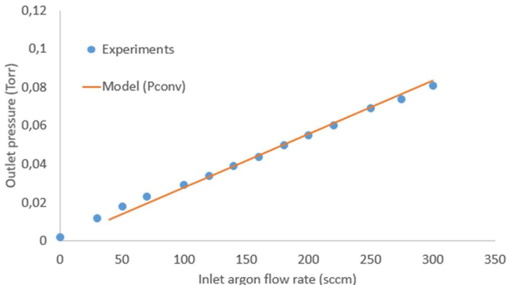  
Fig. 4 - Outlet pressure vs inlet Ar flow rate: model predictions (line) and experimental measurements (dots).

resulting linear relation between the inlet Ar flow and the outlet pressure is as expected, considering that the volumetric flow rate of the pump remains constant within a pressure range. From the results of Fig. 4, the gauge pressure conversion by Eq. (5) is also validated for the case of pure Ar flow.

# 4.1.2. Flow field results

For the operating conditions of Table 1, the flow field inside the reactor is shown in Fig. 5a. For comparison, in Fig. 5b is shown the flow field at 30 sccm top inlet flow. The velocity vectors are plotted in a xy plane of the reactor, in  $\mathbf{z} = 0$  where symmetry exists in our geometry in the  $\mathbf{z}+$  and  $\mathbf{z}-$  coordinate.

A plug flow develops inside the reactor chamber and close to the substrate. An interesting result is the effect of the Ar flow entering from the loading door inlet. As Fig. 5a shows, the loading door flow is suppressed by the top inlet Ar flow, near the right edge of the substrate surface. If the top inlet flow rate of Ar is not high enough, the loading door Ar flow will affect the flow and hence the species distribution on the substrate surface, that could lead to non- uniform deposition. This is shown in Fig. 5b, where the loading door inlet flow affects the flow above the substrate surface, due to the lower top inlet flow rate. The side of the substrate exposed to the loading door flow will be purged more efficiently than the rest of the substrate surface, leading to non- uniform species distribution on the substrate surface. The top and side inlet flow must be adjusted so that the loading door flow does not affect the flow above the substrate surface.

# 4.2. Model predictions: substrate temperature

The predicted temperature field in the reactor chamber and the temperature profile on the substrate are shown in Fig. 6, using the conditions in Table 1.

Fig. 6a shows that the gas is quite isothermal into the reactor with a temperature close to that of the walls  $(270^{\circ}C)$ , except near the inlet zones where it is colder and near the substrate where it is hotter  $(300^{\circ}C)$ . The substrate is not isothermal (Fig. 6b), due to the cooling provided by the gas coming from the vicinity of the reactor walls. The calculated temperature on the substrate perimeter is equal to  $289^{\circ}C$ . Results also show the effect of the loading door purge. The Ar flow entering the reactor chamber at  $20^{\circ}C$  lowers the temperature in the area close the loading door (Fig. 6a) and at the nearby substrate side (at  $279^{\circ}C$ ). The temperature difference between the substrate center and the loading door side reads  $21^{\circ}C$ .

This temperature difference can impact the deposition process in various ways. For example, it may affect the adsorption of the species on the substrate. Lower temperature favors adsorption of reactants on the loading door side of the substrate. Reaction will also be slower on the colder side of the substrate. Moreover, the minimum purging times required to effectively purge the reactor depend on the temperature. Lowering the temperature reduces the  $\mathrm{H}_2\mathrm{O}$  adsorption rate from the surfaces of the reactor and thus purging should last longer (Groner et al., 2004). If the purging time is not long enough, the subsequent TMA pulse will lead to non- ideal, CVD- like reactions on the loading door side of the substrate, as TMA will react with adsorbed  $\mathrm{H}_2\mathrm{O}$  molecules on the substrate surface. An experimental study (Henn- Lecordier et al., 2011b) has shown the effect of an excess  $\mathrm{H}_2\mathrm{O}$  pulse on the thickness uniformity in a cross- flow reactor, with increased purging times needed to desorb the remaining adsorbed  $\mathrm{H}_2\mathrm{O}$ . This situation is enhanced at low process temperature, where the surface reactions are slower and highly dependent on the surface temperature. The surface temperature gradient can also affect the number of hydroxyl active sites present on the substrate (Puurunen, 2005). Ultimately, it may lead non- uniform film thickness. In addition, the deposition temperature affects the composition and density of the film (Groner et al., 2004).

# 4.3. Model predictions: feeding system

As described in Section 3.2 the pure Ar flow simulation in the ALD reactor, is followed by the simulation of the feeding system. It uses the pressure computed at the reactor side inlet as an outlet pressure condition. This pressure, computed to be 142 mTorr, is set as the outlet pressure, and the Ar flow is simulated inside the feeding system, with both of the ALD valves closed. In Fig. 7, we present the pressure and the TMA mole fraction distribution inside the feeding system, with the valves closed.

Once the result has been obtained for the flow inside the feeding system with the valves closed, it is used as an initial condition for the pulsing stress simulations. The impermeable

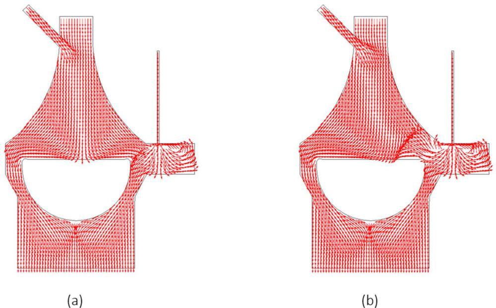  
Fig. 5 - a) Flow field predictions for the process parameters of Table 1, b) flow field predictions at 30 sccm top inlet flow.

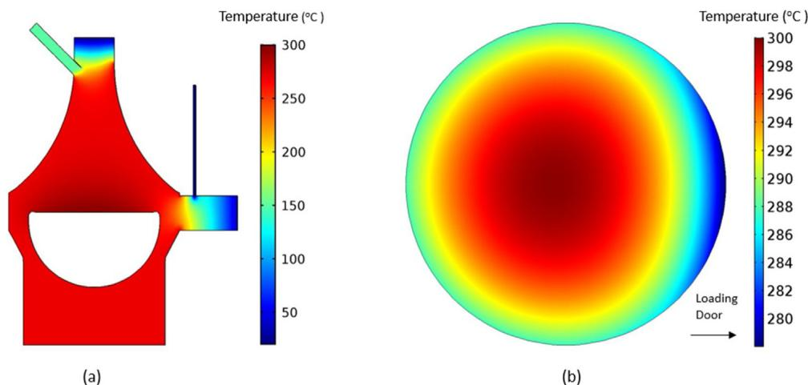  
Fig. 6 - a) Temperature field inside the reactor chamber, b) temperature profile on the substrate surface for the substrate center at  $300^{\circ}$ C.

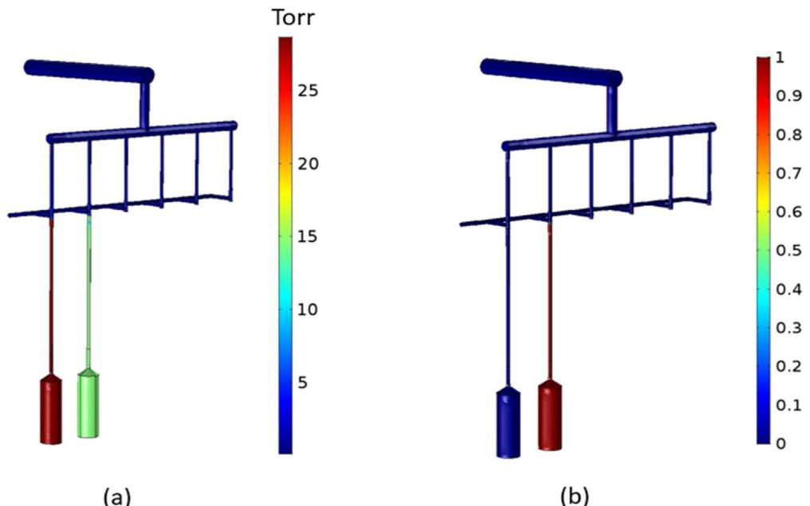  
Fig. 7 - Feeding system simulation results for the pure Ar flow, with the ALD valves closed: a) pressure distribution, b) TMA mole fraction distribution.

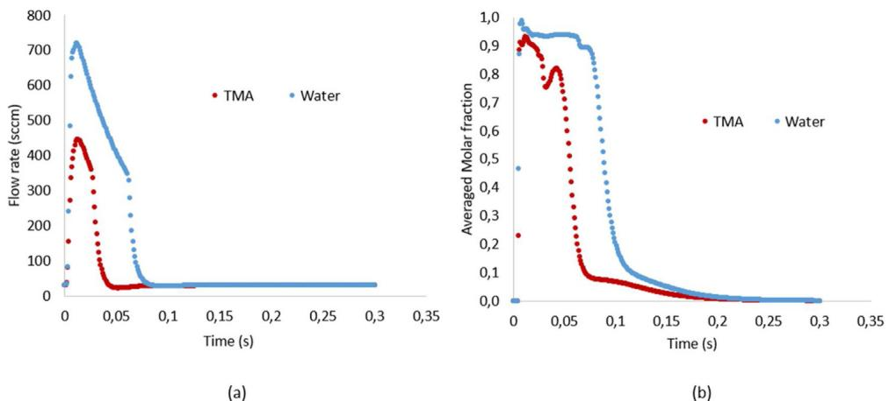  
Fig. 8 - Feeding system model results for the TMA and  $\mathbf{H}_2\mathbf{O}$  reactant pulses: a) flow rate, b) molar fraction averaged at the feeding system outlet.

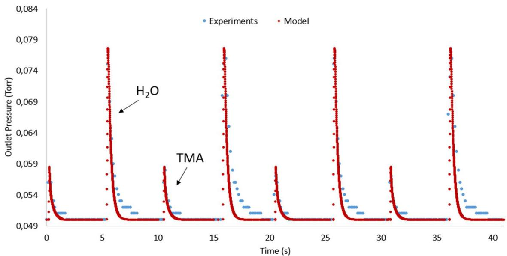  
Fig. 9 - Outlet pressure variation vs time: model predictions vs Pirani gauge measurements.

interface that approximates the ALD valve for each reactant is removed for each pulsing step respectively. When the valve closes, the impermeable interface is re- set, until all remaining reactant species are removed from the feeding system. The total flow rate and the average mole fraction are obtained at the feeding system outlet. As the outlet of the feeding system is connected to the side inlet of the ALD reactor, these values will serve as time- dependent inlet conditions for the reactor side inlet, thus simulating the ALD reactant exposure steps. The flow rates calculated by the feeding system will be used as an inlet condition for the Navier- Stokes and continuity equations in the reactor model, whereas the mole fractions will be used as an input to the chemical species conservation equation.

Fig. 8 presents the calculated TMA and  $\mathrm{H}_2\mathrm{O}$  pulses as a function of time, in terms of flow rate (Fig. 8a) and averaged molar fraction (Fig. 8b) at the feeding system outlet.

Results of Fig. 8a show a higher flow rate for  $\mathrm{H}_2\mathrm{O}$  than for TMA for the whole duration of the pulse, leading to an overall higher quantity of the delivered  $\mathrm{H}_2\mathrm{O}$ . This is attributed to the higher vapor pressure of  $\mathrm{H}_2\mathrm{O}$  inside the reactant bottles and to the longer opening time of the ALD valve above the  $\mathrm{H}_2\mathrm{O}$  bottle (60 ms and 25 ms for  $\mathrm{H}_2\mathrm{O}$  and TMA, respectively). It is noted that the initial and final values of the outlet flow rate of the feeding system after the reactant pulses are 30 sccm, equal to the Ar carrier gas flow.

As shown in Fig. 8b, the reactant molar fraction is substantial during both pulses, whereas Ar represents only roughly  $10\mathrm{wt\%}$  of the gas mixture. Notably, it is predicted that although the  $\mathrm{H}_2\mathrm{O}$  valve opening time is longer and the quantity of  $\mathrm{H}_2\mathrm{O}$  entering the feeding system is higher, the TMA molecules evacuate the feeding system slower, i.e the feeding system takes more time to purge. This is attributed to the slower diffusion rate in  $\mathrm{N}_2$  of TMA compared to  $\mathrm{H}_2\mathrm{O}$ , since the molecules of the former are bigger and heavier than the latter. However, the feeding system is purged from both reactants in  $0.3\mathrm{s}$ . The total calculated amounts entering the reactor are  $0.63\mathrm{mg}$  for TMA and  $0.408\mathrm{mg}$  for  $\mathrm{H}_2\mathrm{O}$ .

# 4.4. Model predictions: ALD exposure steps

# 4.4.1. Outlet pressure variation

The predicted outlet pressure with the Pirani conversion  $(\mathrm{P_{conv}})$  variation during three ALD cycles is shown in Fig. 9 and is compared with the experimental measurements.

As shown in Fig. 9, the model predictions for the pressure variation at the reactor outlet are in good agreement with measurements. In particular, the outlet peak heights are captured

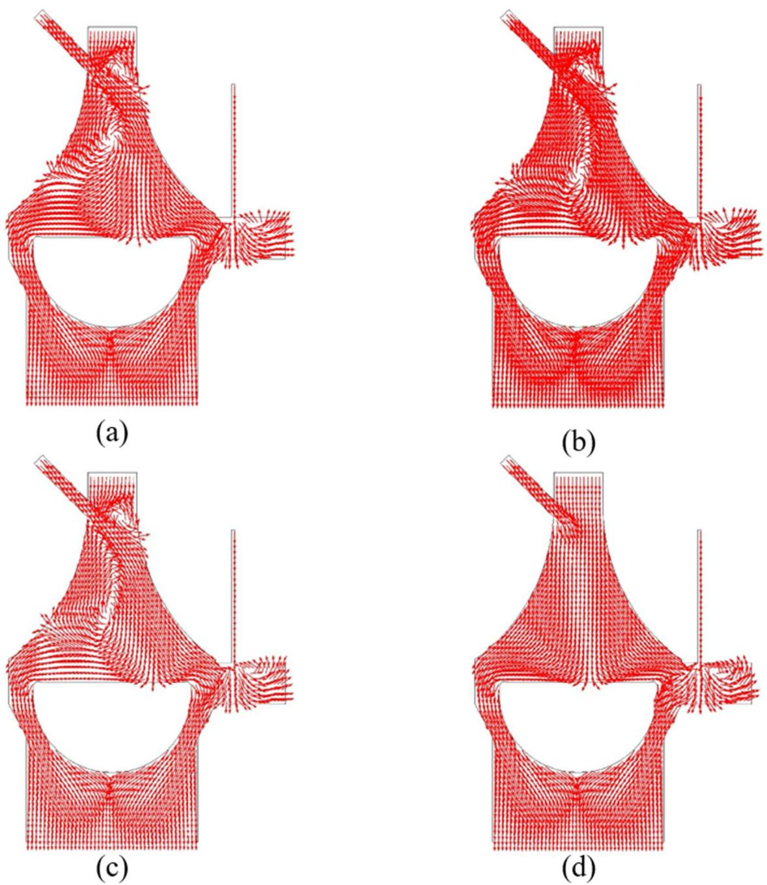  
Fig. 10 - Snapshots of the flow field developed during the TMA exposure, inside the reactor chamber: a) 10 ms, b) 20 ms, c) 30 ms, d) 60 ms, after the start of the TMA exposure.

and thus the dynamic response to the reactant pulses. This validates the coupling of the two CFD models.

Regarding the peak widths, it is noticed that the predictions slightly underestimate the time needed to restore the system to its base pressure for the  $\mathrm{H_2O}$  pulse. As the pressure reading given by the Pirani gauge is gas dependent, it will vary with the gas composition. The pressure reading is performed via the measurement of the gas thermal conductivity, which is inversely proportional to the molecular mass of the gas. As the gauge is calibrated for nitrogen, a gas with a higher molecular mass than  $\mathrm{N}_2$ $(28\mathrm{g / mol})$  will lead to a lower pressure reading, while a gas with a lower molecular mass will have the opposite effect. During the  $\mathrm{H_2O}$  exposure, the surface kinetics plays a role on the pressure reading.  $\mathrm{H_2O}$  molecules, despite chemisorbing on the substrate surface, can also adsorb on the reactor walls. Due to their polar nature, they stick strongly on the reactor walls, and take time to desorb. Therefore, the time needed for their desorption is significant and the corre sponding purging time will be higher than for TMA. This is evident from the measured pressure peaks for the  $\mathrm{H_2O}$  exposure. The pressure at the outlet takes more time to restore to its initial value. Thus, the larger width of the  $\mathrm{H_2O}$  measured pressure peak at the reactor outlet is attributed to the adsorption/desorption of  $\mathrm{H_2O}$  molecules on the reactor walls.

# 4.4.2. TMA exposure

As shown in Fig. 8, the TMA pulse entering the reactor reaches a peak above 400 sccm. Due to the high molecular mass of TMA, a high momentum pulse will enter the reactor chamber through the side inlet, leading to a disturbance of the flow field. As the flow rate entering the reactor is time dependent, the resulting flow field inside the reactor main volume will be affected during the exposure steps of the process. Snapshots of the flow field at different time instants, during the TMA exposure are shown in Fig. 10.

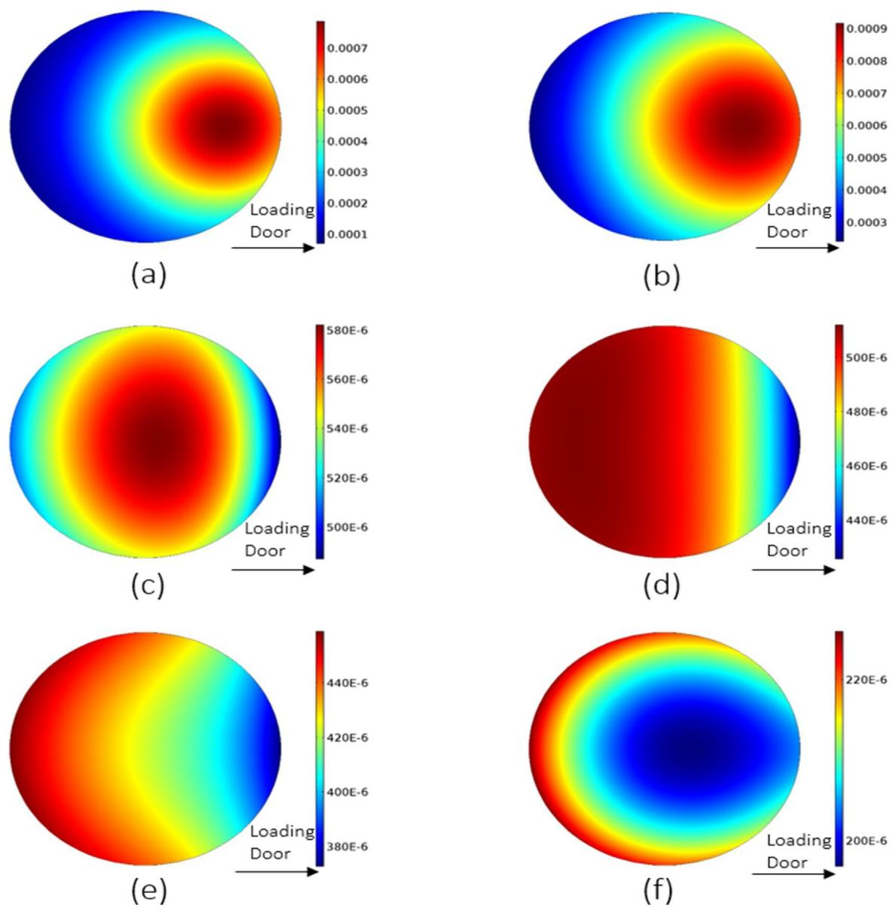  
Fig. 11 - Snapshots of TMA concentration profiles on the substrate surface, scales in  $\mathrm{mol} / \mathrm{m}^3$ : a)  $20\mathrm{ms}$ , b)  $30\mathrm{ms}$ , c)  $60\mathrm{ms}$ , d)  $80\mathrm{ms}$ , e)  $100\mathrm{ms}$ , f)  $200\mathrm{ms}$ , after the start of the TMA pulse.

Results show a recirculation inside the reactor, during the first ms of the TMA exposure step. Notably, one recirculation area is located in the gas phase above the substrate, while a second one near the reactor top inlet. After  $60\mathrm{ms}$ , the TMA pulse stops (Fig. 10d), and the recirculation disappears. The predicted flow field and, in particular, the recirculation above the substrate, can have a significant effect on the gaseous species distribution inside the reactor chamber and then on the distribution on the substrates.

In Fig. 11, snapshots of the TMA concentration profiles on the substrate surface are plotted. The scale for each snapshot is different for the sake of clarity.

A non- uniform TMA concentration profile appears on the substrate, during the TMA exposure. The TMA concentration profile on the substrate evolves along with the gas flow field inside the reactor chamber. While a recirculation exists in the gas phase  $(0 - 40\mathrm{ms}$ , snapshots a- c, Fig. 10), the TMA concentration reaches a maximum between the substrate center and the loading door side of the substrate, as shown in Fig. 11a and b. Notably,  $20\mathrm{ms}$  after the start of the TMA pulse, the maximum concentration computed on the substrate exceeds  $7\times 10^{- 4}\mathrm{mol} / \mathrm{m}^3$ , while the minimum value is seven times smaller, i.e  $1\times 10^{- 4}\mathrm{mol} / \mathrm{m}^3$  (Fig. 9a), leading to a concentration difference of  $93\%$ . The maximum and minimum values are  $9\times 10^{- 4}$  and  $3\times 10^{- 4}\mathrm{mol} / \mathrm{m}^3$  respectively, after  $30\mathrm{ms}$ . As the side inlet flow rate establishes to its initial value of  $30\mathrm{scm}$ , the maximum moves to the center of the substrate, as shown in Fig. 11c. At that point the concentrations are lower by two orders of magnitude, compared to the previous time snapshots. The maximum value is  $5.8\times 10^{- 6}\mathrm{mol} / \mathrm{m}^3$  and the minimum is below  $5\times 10^{- 6}\mathrm{mol} / \mathrm{m}^3$  a difference of  $16.3\%$ . It is noted that while the side inlet flow rate is higher, the loading door purging flow is suppressed to an area beneath the substrate surface. However, once the flow rate establishes to its initial value, the loading door purge starts gaining influence on the species distribution on the substrate surface, as seen in Fig. 11c.

For the time period between  $60\mathrm{ms}$  to  $200\mathrm{ms}$  after the start of the TMA pulse, snapshots 9d to 9f show that while the flow field is established, the gas mixture entering the reactor through the side inlet still contains TMA, which will flow inside the reactor chamber. During this period, the loading door purge affects the concentration of TMA above the substrate surface. As shown in Fig. 11d and e, the loading door Ar flow purges the side of the substrate exposed to it. The loading door side of the substrate is exposed to a lower TMA con

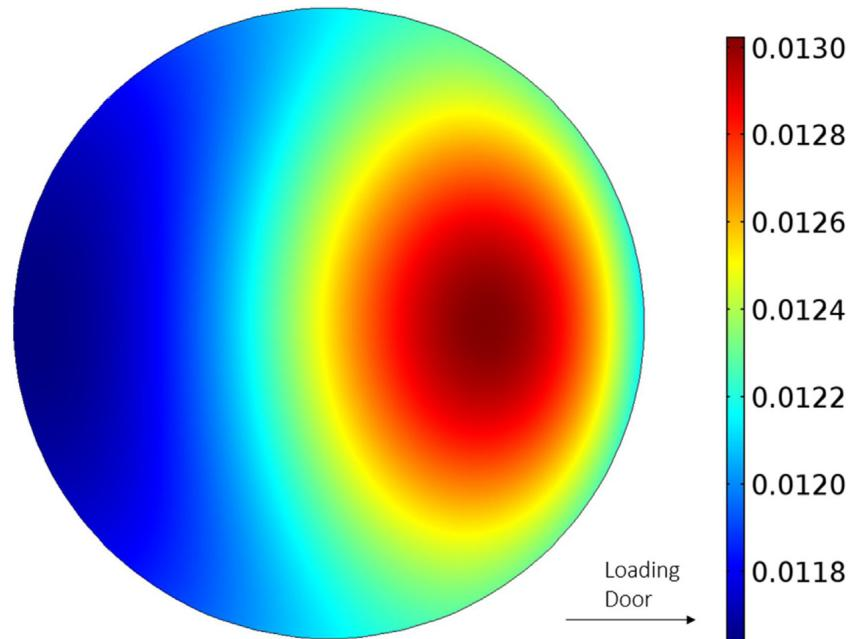  
Fig. 12 - Integral over time of the TMA flux on the substrate surface, scale in  $\mathrm{mol} / \mathrm{m}^2$ , during the whole TMA exposure.

centration during the whole TMA exposure step after  $60\mathrm{ms}$  from the start of the TMA pulse. The concentrations remain in the same order of magnitude as in Fig. 11c. The maximum concentration difference is  $15.3\%$  for Fig. 11d and  $15.6\%$  for Fig. 11e.

After  $200\mathrm{ms}$ , the side inlet flow consists of Ar only. During the remaining purging time, the reactor chamber is purged from the remaining TMA molecules. The flow field is established and the resulting concentration profile on the substrate is shown in Fig. 11f. This species distribution profile remains constant during the remaining purging time of the process.

As Fig. 11 shows, the TMA concentrations on the substrate during the first ms of the TMA exposure (Fig. 11a, b) are significantly higher than the concentrations at the next time snapshots (Fig. 11c- f). In order to analyze the exposure of the substrate to TMA molecules, we have calculated the species flux on the substrate surface, using the Hertz- Knudsen equation, in terms of  $\mathrm{mol} / \mathrm{m}^2\mathrm{s}$ :

$$
Flux_{\mathrm{i}} = \frac{p_{\mathrm{i}}}{\sqrt{2\pi MRT}} \tag{6}
$$

The above species flux is integrated over the whole TMA exposure and purging time of the ALD cycle. The resulting exposure of the substrate to TMA molecules is plotted in Fig. 12.

The TMA flux integral over time is not uniform; it has a maximum between the substrate center and the loading door side. This corresponds to the concentration profiles on the substrate during the TMA pulse, when the recirculation in the gas phase exists, as shown in Fig. 11a and b. This means that the majority of the substrate exposure to TMA occurs during the first ms of the TMA pulse. The computed maximum exposure difference on the substrate surface during the TMA exposure is  $10.7\%$ . The predicted exposure difference across the substrate surface can lead to deposited film nonuniformity, especially if the rate limiting step of the process is mass transfer toward the substrate, i.e at high temperatures. However, if the species flux is higher than the flux required to cover all available reactive sites, the substrate surface will be saturated and the deposited film will be uniform.

4.4.3.  $H_{2}O$  exposure Snapshots of the gas flow field inside the reactor during the  $H_{2}O$  exposure are shown in Fig. 13.

During the  $H_{2}O$  pulse, as a high flow rate enters the reactor chamber, a recirculation is again predicted near the reactor inlet. Another recirculation is located below the side inlet tube connection to the main volume of the reactor (Fig. 13a, b). The recirculation is less significant for  $H_{2}O$  than for TMA, and no recirculation appears above the substrate, contrary to the TMA pulse, despite the fact that the flow rate entering the reactor is higher than during the TMA pulse (Fig. 8a). After  $60\mathrm{ms}$  (Fig. 13c), the recirculation disappears, while a high flow rate is still entering the reactor. The side inlet flow rate returns to its initial value (Fig. 8a) after  $120\mathrm{ms}$ , and the flow field inside the chamber establishes its initial condition.

The effect of the flow on the species distribution on the substrate is shown in Fig. 14, where snapshots of the  $H_{2}O$  concentration profile are presented. The scale for each snapshot is different, as before.

During the first ms of the  $H_{2}O$  pulse, the high flow rate coming from the side inlet of the reactor suppresses the loading door purging flow, thus leading to a concentration profile with a maximum at the substrate center (Fig. 14a). At this snapshot, the maximum concentration is  $4.7\times 10^{- 4}\mathrm{mol} / \mathrm{m}^3$  and the minimum  $3.03\times 10^{- 4}\mathrm{mol} / \mathrm{m}^3$ , leading to a maximum concentration difference of  $35.5\%$ . As the flow rate from the side inlet decreases, the loading door purge influences the species distribution, thus leading to a constantly lower  $H_{2}O$  concentration on the loading door side of the substrate, which is exposed to the purging gas. This gradual effect is shown in Fig. 14b- e. Fig. 14b and c corresponds to results obtained for a high side inlet flow rate due to the  $H_{2}O$  pulse. However, the momentum of this flow is not high enough to suppress the loading door Ar flow effect. The maximum concentration differences at these snapshots are  $26.6\%$  and  $17.65\%$  for Fig. 14b and c, respectively. Fig. 14d and e correspond to results obtained while the side inlet flow rate has established to its initial value, however the gas entering the side inlet still has an amount of water. The maximum concentration difference is  $8.7\%$  and  $4.5\%$ , respectively; the concentration minimum is located at the loading door side of the substrate. The  $H_{2}O$  concentration

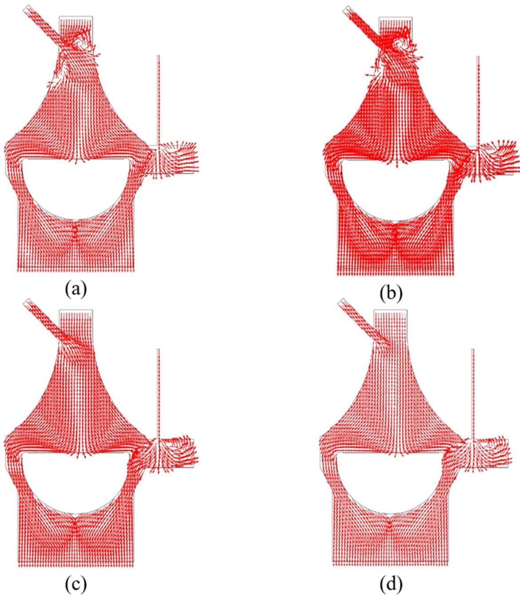  
Fig. 13 - Snapshots of the flow field inside the reactor chamber: a)  $10\mathrm{ms}$ , b)  $20\mathrm{ms}$ , c)  $60\mathrm{ms}$ , d)  $200\mathrm{ms}$  after the start of the  $\mathrm{H}_2\mathrm{O}$  pulse.

profile on the substrate during the purging step of the reactor is shown in Fig. 14f; the remaining water is removed from the chamber.

From the predictions in Fig. 14 is concluded that during the first ms of the  $\mathrm{H}_2\mathrm{O}$  pulse, the values of the  $\mathrm{H}_2\mathrm{O}$  concentrations on the substrate surface are of the same order of magnitude, unlike the TMA pulse, where it took  $30\mathrm{ms}$  for an almost full substrate surface exposure to TMA. It is also noted that the overall  $\mathrm{H}_2\mathrm{O}$  concentrations are higher than in the TMA case. As done before, Eq. (6) is integrated over the whole duration of the  $\mathrm{H}_2\mathrm{O}$  exposure and purge, to yield the total exposure presented in Fig. 15.

The computed time integral of the species flux shows a non- uniform exposure of the substrate surface to  $\mathrm{H}_2\mathrm{O}$ . A lower exposure is observed on the loading door side of the substrate, while a maximum is calculated on the opposite side.

The maximum total exposure difference is  $6.7\%$ . This value is lower than the corresponding value for the TMA exposure. The above result shows a significant effect of the loading door purge on the gaseous  $\mathrm{H}_2\mathrm{O}$  species distribution near the substrate. The loading door side of the substrate is exposed to  $6.7\%$  less  $\mathrm{H}_2\mathrm{O}$  molecules than the opposite side. Under ALD conditions, if the  $\mathrm{H}_2\mathrm{O}$  exposure is not high enough to saturate the surface, a non- uniform film will be deposited, with a lower film thickness being deposited on the loading door side. With the mechanism presented in Section 2.2, two TMA molecules would need three  $\mathrm{H}_2\mathrm{O}$  molecules to fully remove the methyl ligands. This means that the ratio between the  $\mathrm{H}_2\mathrm{O}$  and TMA exposure should be at least 1.5. The ratio between the  $\mathrm{H}_2\mathrm{O}$  and TMA exposures exceeds this value. However, this is only a first approach, since the kinetics of the reactants chemisorption are not considered.

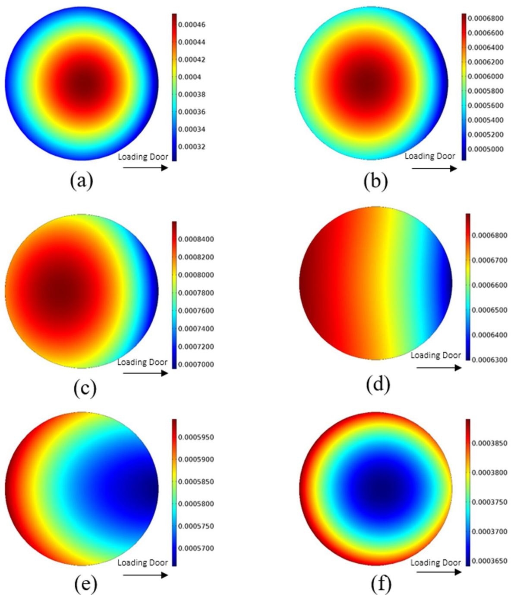  
Fig. 14 - Snapshots of the  $\mathbb{H}_2\mathbb{O}$  concentration profile on the substrate surface, scales in  $\mathrm{mol} / \mathrm{m}^3$ : a)  $20\mathrm{ms}$ , b)  $30\mathrm{ms}$ , c)  $60\mathrm{ms}$ , d)  $100\mathrm{ms}$ , e)  $120\mathrm{ms}$ , f)  $200\mathrm{ms}$  after the start of the  $\mathrm{H}_2\mathrm{O}$  pulse.

# 4.5. Model predictions: purging time

The whole ALD exposures and purging steps were simulated for one complete cycle. As Ar flows constantly into the chamber, the substrate is exposed to reactant molecules even during the purging steps. In order to study the purging efficiency of the reactor, the maximum reactant mole fraction inside the whole chamber was traced during the ALD pulses and purging steps of the ALD cycle, as detailed in Fig. 16, for both reactants.

As expected, the maximum mole fraction inside the chamber during the first stages of the exposure time is close to 1, as the computed reactant pulses have a high reactant composition (Fig. 8b). After the reactant pulses, the maximum mole fraction quickly drops, as the reactor purging step begins.

In order to calculate a minimum purging time, we assumed that when the maximum reactant mole fraction inside the ALD reactor drops below a threshold, here taken  $10^{- 6}$ , the reactor is purged. The obtained results are  $2.7\mathrm{s}$  for TMA and  $3.1\mathrm{s}$  for  $\mathrm{H}_2\mathrm{O}$ . Let us recall that these results are obtained by simulating only the transport of chemical species inside the reactor. In order to get a more reliable value for the purging time, chemical reaction kinetics and adsorption/desorption of species on the reactor walls must be taken into account. The reactions must be given enough time to saturate the surface, while the by- products must desorb and diffuse away from the substrate surface, and be removed from the ALD chamber via convection and diffusion. The species also adsorb on the reactor walls and the time needed for their desorption contributes to the total purging time. Especially for the  $\mathrm{H}_2\mathrm{O}$  molecules, the slow desorption from the reactor walls can significantly

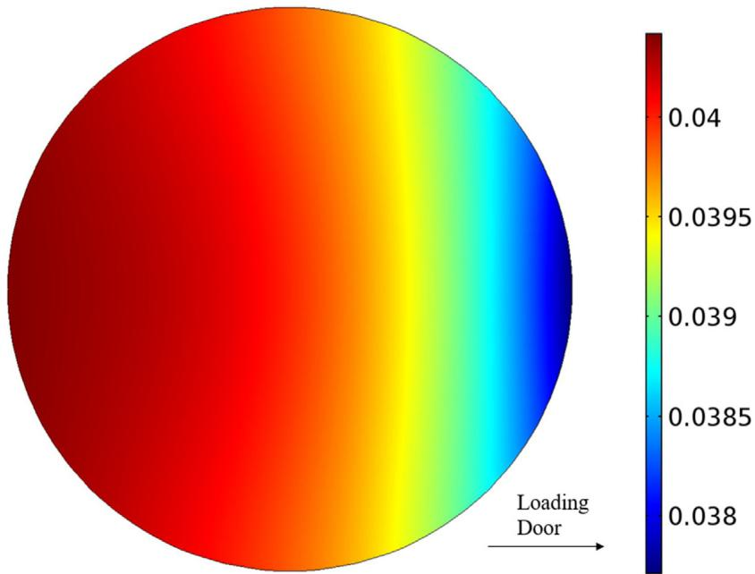  
Fig. 15 - Integral over time of the  $\mathbf{H}_2\mathbf{O}$  flux on the substrate surface, during the whole  $\mathbf{H}_2\mathbf{O}$  exposure and purge, scale in  $\mathrm{mol} / \mathrm{m}^2$ .

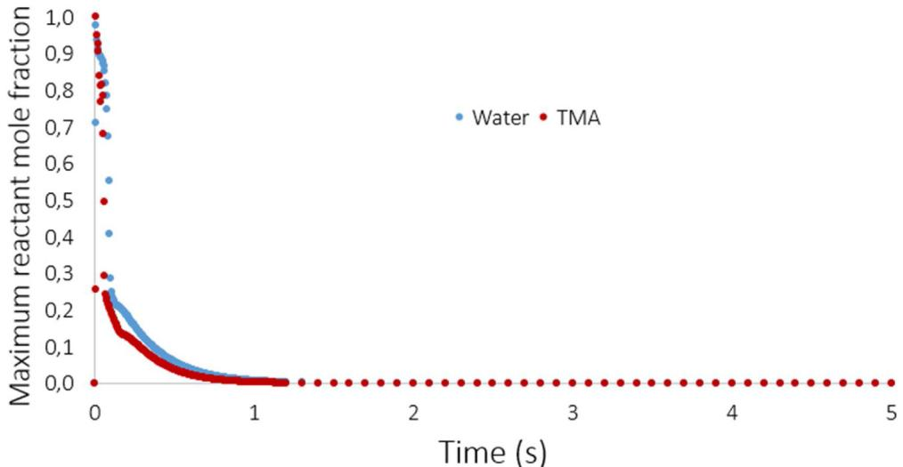  
Fig. 16 - Time evolution of the maximum reactant mole fraction inside the reactor chamber.

affect the purging time, especially under low temperature conditions. Hence, the present model results can provide valuable information regarding the purging efficiency of the reactor in terms of gas species transport inside the chamber. However, an efficient minimum purge time will only be predicted when the above described physicochemical phenomena will be incorporated in the model.

# 5. Conclusion

A three- dimensional Computational Fluid Dynamics model for a commercial ALD reactor, depositing aluminum oxide  $(\mathrm{Al}_2\mathrm{O}_3)$  from TMA and  $\mathrm{H}_2\mathrm{O}$  on  $20cm$  substrates was constructed. As a first step towards the understanding of the ALD process, a model aiming to investigate the transport phenomena inside the reactor chamber was developed in transient conditions without considering any surface reaction.

As the reactant pulses entering the reactor are unknown, a second CFD model was developed for the reactant feeding system. The two models were coupled via a computational scheme tailored to the limited availability of experimental measurements, and the ALD process was simulated by implementing the experimental conditions as boundary and initial conditions to the respective partial differential equations. The coupling between the two CFD models was validated by comparison with the experimentally measured outlet pressure.

The present work shows that the design of an ALD reactor should integrate the detailed study of the transport phenomena, including the effect of the reactor geometry, in order to optimize the design of its various parts. In our case, the reactor geometry strongly affects the temperature distribution via the existence of the loading door. A low temperature zone is present at the loading door that modifies the temperature on the substrate surface. This zone also affects the species distribution on the surface, as it was revealed for the case of  $\mathrm{H}_2\mathrm{O}$ . The side inlet of the reactor, due to its smaller diameter, leads to high velocity flows during the TMA pulse causing a recirculation in the gas phase above the substrate, which seriously affects the TMA species distribution on the surface. These non- ideal behaviors are all associated with the reactor geometry. The need for CFD analysis to optimize the geometrical setup of the reactor is therefore crucial.

The process conditions can also be optimized. It was shown that a higher top inlet Ar flow reduces the effect of the loading door Ar flow. The 100 sccm top inlet flow indicated by the recipe was not strong enough to suppress the loading door effect. Furthermore, heating of the loading door walls to a temperature equal to the reactor walls would lead to a more uniform temperature profile on the substrate and in the reactor chamber, even this would enhance the deposition on the loading door walls. Regarding the reactant distribution on the substrate, the pulse times for each reactant should be long enough to saturate the whole surface, to ensure that no more reactants can be chemisorbed, given the self- terminating nature of the reactions. This would lead to highly uniform films, not dependent on the gas phase reactant species distribution. However, as this optimal reactant dose depends on reaction kinetics, and hence on temperature, the temperature distribution on the substrate will affect again the uniformity of deposition.

More precise conclusions and quantitative results about the effect of process parameters on the quality and uniformity of the film can be drawn by including the surface chemistry, which is the subject of an ongoing research work.

# Acknowledgements

AcknowledgementsThis work was partly funded by a Toulouse Tech Inter Lab 2016 grant. GPG acknowledges the financial support provided by the NTUA Research Committee.

# Appendix A.

a) Continuity equation:

$$
\frac{\partial\rho}{\partial t} +\nabla \cdot (\rho \mathbf{u}) = 0 \tag{A1}
$$

where  $\mathbb{P}$  is the mass density of the gas mixture, and  $\mathbf{u}$  the velocity.

b) Momentum equation:

$$
\frac{\partial(\rho\mathbf{u})}{\partial t} +\nabla \cdot (\rho \mathbf{u}\mathbf{u}) = -\nabla \mathbb{P} + \nabla \cdot [\mu (\nabla \mathbf{u} + \nabla \mathbf{u}^{\mathrm{T}}) - \mu \frac{2}{3} (\nabla \cdot \mathbf{u})\mathbb{I}] + \rho \mathbf{g}
$$

where  $\mathbb{P}$  is the pressure,  $\mu$  the viscosity,  $\mathbb{I}$  the unit tensor and  $\mathbf{g}$  the gravity acceleration.

c) Energy equation:

$$
C_{p}\frac{\partial(\rho T)}{\partial t} +C_{p}\nabla \cdot (\rho \mathbf{u}T) = \nabla \cdot (\mathbf{k}\nabla T) - \sum_{i = 1}^{n}j_{i}\cdot \frac{\nabla H_{i}}{M_{i}} \tag{A3}
$$

where  $\mathbb{C}\mathbb{P}$  is the specific heat of the gas mixture, T the temperature and  $\mathbf{k}$  the thermal conductivity, in the number of species,  $\mathbf{j}_{\mathrm{i}}$  is the diffusion flux,  $\mathbf{H}_{\mathrm{i}}$  is the enthalpy of formation, and M is the molecular weight of species i.

d) Species transport equation

$$
\frac{\partial(\rho\pi_{\mathrm{i}})}{\partial t} +\nabla \cdot (\rho \mathbf{u}\pi_{\mathrm{i}}) = -\nabla \cdot \mathbf{j}_{\mathrm{i}} \tag{A4}
$$

where  $\pi_{\mathrm{i}}$  is the mass fraction of the i species in the gas phase.

The diffusion flux is calculated:

$$
\mathbf{j}_{\mathrm{i}} = -\rho \pi_{\mathrm{i}}\sum_{\mathbf{k} = 1}^{n - 1}D_{\mathrm{ik}}\left[\nabla x_{\mathbf{k}} + (x_{\mathbf{k}} - \pi_{\mathbf{k}})\frac{\nabla p}{p}\right] - D_{\mathrm{T,i}}\frac{\nabla T}{T} \tag{A5}
$$

where  $\mathbb{D}_{\mathrm{ik}}$  is the Maxwell Stefan Diffusion coefficient. Eq. (A5) is an expression of Fick's law, including the Soret effect, for constant mixture composition. The thermal diffusion coefficients are calculated using the following equation:

$$
D_{T,i} = -2.59\cdot 10^{-7}\tau^{0.659}\left[\frac{M_{i}^{0.511}x_{i}}{\sum_{i = 1}^{n}M_{i}^{0.511}x_{i}} -\pi_{i}\right]\cdot \left[\frac{\sum_{i = 1}^{n}M_{i}^{0.511}x_{i}}{\sum_{i = 1}^{n}M_{i}^{0.489}x_{i}}\right] \tag{A6}
$$

The set of equations is then completed with the ideal gas law,

$$
p_{\mathrm{i}} = c_{\mathrm{i}}RT \tag{A7}
$$

where  $c_{\mathrm{i}}$  is the species concentration, and R the ideal gas constant.

# Appendix B.

The experimental reactor outlet pressure was monitored via the Pirani gauge during various ALD cycles, as deposition took place. The resulting pressure peaks are depicted in Fig. B1. It shows that the base pressure of the process i.e the system pressure during the purge step of the ALD cycle, is set at 50 mTorr, measured via the Pirani gauge.

Appendix B.The experimental reactor outlet pressure was monitored via the Pirani gauge during various ALD cycles, as deposition took place. The resulting pressure peaks are depicted in Fig. B1. It shows that the base pressure of the process i.e the system pressure during the purge step of the ALD cycle, is set at 50 mTorr, measured via the Pirani gauge.As presented in Section 3.2, the starting point for the calculations is the base pressure of the ALD process, measured via the Pirani gauge, which is a gas dependent gauge that measures the pressure of a gas through its thermal conductivity. The thermal conductivity is in turn an inverse function of the molecular mass of the gas species. In our system, the Pirani gauge is calibrated for nitrogen  $(\mathbb{N}_2)$ , while the inert gas used for the ALD process is Ar. Typically, the pressure reading by a Pirani gauge is multiplied by a correction factor, different for each gas, in order to calibrate the measurements to the real pressure value. In our case, these correction factors are unknown. In order to have a value for the correction factor of Ar, the reactor outlet pressure was measured, for a varying Ar inlet, using a constant butterfly valve opening at the outlet. Both the Pirani gauge and the capacitance manometer were active during these measurements, and the relation between their readings is linear as shown in Fig. B2. The capacitance manometer shows the true pressure inside the chamber, while the Pirani gauge reading needs to be multiplied by a correction factor, equal to the slope of the line that connects the measured points. The slope of the line is equal to 1.4203, a value very close to the ratio of the thermal conductivities of nitrogen and Ar (1.4401), as computed using the kinetic gas theory at the outlet temperature, i.e.  $270^{\circ}C$ .As during deposition the reactants can deposit on all the surfaces inside the reactor chamber, the isolation valve for the capacitance manometer is kept closed during the ALD cycles, and the pressure is monitored via the Pirani gauge.

As during deposition the reactants can deposit on all the surfaces inside the reactor chamber, the isolation valve for the capacitance manometer is kept closed during the ALD cycles, and the pressure is monitored via the Pirani gauge.

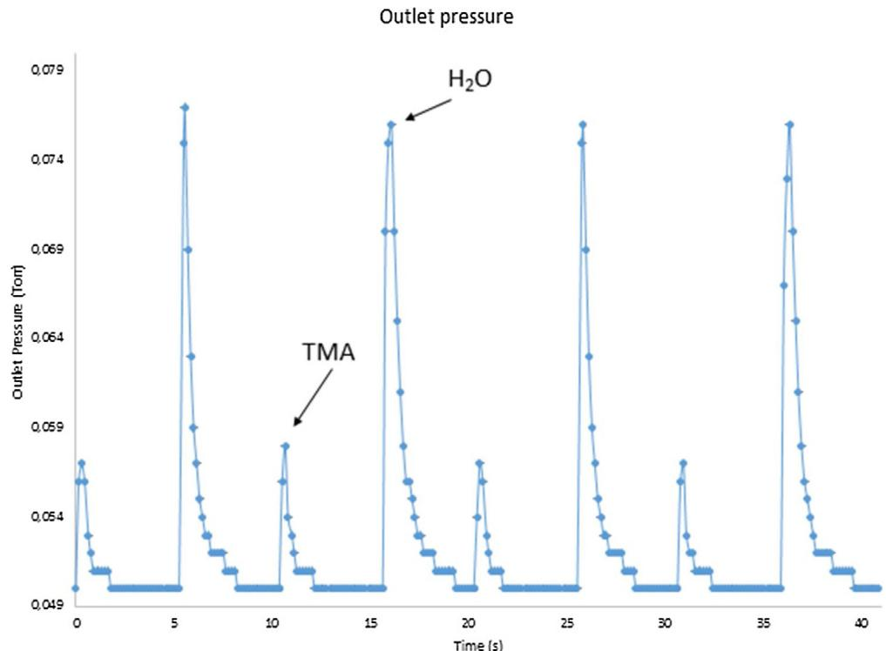  
Fig. B1 - Experimental outlet pressure monitoring during various ALD cycles, as measured by the Pirani gauge.

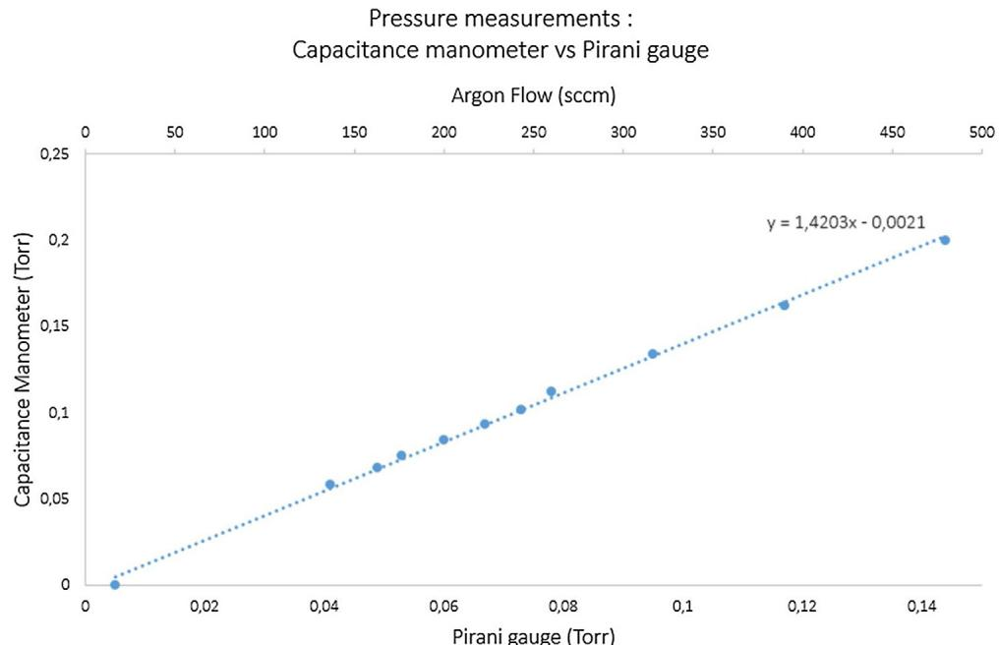  
Fig. B2 - Comparison between pressure readings by capacitance manometer and Pirani gauge.

As the outlet pressure is the only available measurement to compare with the CFD model predictions, the latter must be corrected so that the results can be compared to the Pirani gauge measurements. We assume that as the gauge is calibrated for nitrogen, the pressure indicated by the Pirani gauge will depend on the ratio of the thermal conductivities of the gas mixture and nitrogen. Hence, the calculated pressure  $\mathrm{P_{calc}}$  is converted by Eq. (5), presented in Section 4.1. Eq. (5) is used to transform the model predictions for the pressure to a value  $(\mathrm{P_{conv}})$  to be compared with the Pirani gauge measurements. Although the above assumption is not validated for  $\mathrm{H}_2\mathrm{O}$  or TMA, experimental measurements of Fig. B2 show that it can be used for the Ar flow. However, we use the same assumption for the reactants, as it is the only way to compare the outlet measurements with the model predictions.

# References

CHEMKIN- PRO 15131, Reaction Design: San Diego, 2013. Delabie, A., Sioncke, S., Rip, J., Van Elshocht, S., Pourtois, G., Mueller, M., Beckhoff, B., Pierloot, K., 2012. Reaction mechanisms for atomic layer deposition of aluminum oxide on semiconductor substrates. J. Vac. Sci. Technol. A: Vac. Surf. Films 30 (1), 01A127. Deng, Z., He, W., Duan, C., Shan, B., Chen, R., 2016. Atomic layer deposition process optimization by computational fluid dynamics. Vacuum 123, 103- 110. Dillon, A.C., Ott, A.W., Way, J.D., George, S.M., 1995. Surface chemistry of  $\mathrm{Al}_2\mathrm{O}_3$  deposition using  $\mathrm{Al(CH}_3\mathrm{)}_3$  and  $\mathrm{H}_2\mathrm{O}$  in a binary reaction sequence. Surf. Sci. 322 (1- 3), 230- 242. Elam, J.W., Groner, M.D., George, S.M., 2002. Viscous flow reactor with quartz crystal microbalance for thin film growth by atomic layer deposition. Rev. Sci. Instrum. 73 (8), 2981.

Elliott, S., Greer, J., 2004. Simulating the atomic layer deposition of alumina from first principles. J. Mater. Chem. 14 (21), 3246- 3250. Ferguson, J.D., Weimer, A.W., George, S.M., 2000. Atomic layer deposition of ultrathin and conformal  $\mathrm{Al}_2\mathrm{O}_3$  films on BN particles. Thin Solid Films 371 (1), 95- 104. George, S.M., 2010. Atomic layer deposition: an overview. Chem. Rev. 110 (1), 111- 131. Gobbert, M.K., Prasad, V., Cale, T.S., 2002. Predictive modeling of atomic layer deposition on the feature scale. Thin Solid Films 410 (1- 2), 129- 141. Groner, M.D., Fabreguette, F.H., Elam, J.W., George, S.M., 2004. Low- temperature  $\mathrm{Al}_2\mathrm{O}_3$  atomic layer deposition. Chem. Mater. 16 (4), 639- 645. Henn- Lecordier, L., Anderle, M., Robertson, E., Rubloff, G.W., 2011a. Impact of parasitic reactions on wafer- scale uniformity in water- based and ozone- based atomic layer deposition. J. Vac. Sci. Technol. A: Vac. Surf. Films 29 (5), 051509. Henn- Lecordier, L., Anderle, M., Robertson, E., Rubloff, G.W., 2011b. Impact of parasitic reactions on wafer- scale uniformity in water- based and ozone- based atomic layer deposition. J. Vac. Sci. Technol. A: Vac. Surf. Films 29 (5), 051509. Higashi, G.S., Fleming, C.G., 1989. Sequential surface chemical reaction limited growth of high quality  $\mathrm{Al}_2\mathrm{O}_3$  dielectrics. Appl. Phys. Lett. 55 (19), 1963- 1965. Johnson, R.W., Hultqvist, A., Bent, S.F., 2014. A brief review of atomic layer deposition: from fundamentals to applications. Mater. Today 17 (5), 236- 246. Li, M.Y., Chang, Y.Y., Wu, H.C., Huang, C.S., Chen, J.C., Lue, J.L., Chang, S.M., 2007. Effect of process pressure on atomic layer deposition of  $\mathrm{Al}_2\mathrm{O}_3$ . J. Electrochem. Soc. 114 (11), H967- H972. Mazaleyrat, G., Esteve, A., Jeloaica, L., Djafari- Rouhani, M., 2005. A methodology for the kinetic Monte Carlo simulation of alumina atomic layer deposition onto silicon. Comput. Mater. Sci. 33 (1- 3), 74- 82. Mouab, M.B.M., Oldham, C.J., Jai, J.S., Parsons, G.N., 2012. Effect of temperature and gas velocity on growth per cycle during  $\mathrm{Al}_2\mathrm{O}_3$  and  $\mathrm{ZnO}$  atomic layer deposition at atmospheric pressure. J. Vac. Sci. Technol. A: Vac. Surf. Films 30 (1), 01A155. NIST Chemistry WebBook, 2005. NIST Standard Reference Database Number 69. National Institute of Standards and Technology, Gaithersburg, MD, USA, Available online: http://webbook.nist.gov.Ott, A.W., Klaus, J.W., Johnson, J.M., George, S.M., 1997.  $\mathrm{Al}_3\mathrm{O}_3$  thin film growth on Si(100) using binary reaction sequence chemistry. Thin Solid Films 292 (1- 2), 135- 144. Pan, D., Ma, L., Xie, Y., Jen, T.C., Yuan, C., 2015a. On the physical and chemical details of alumina atomic layer deposition: a combined experimental and numerical approach. J. Vac. Sci. Technol. A: Vac. Surf. Films 33 (2), 021511. Pan, D., Ma, L., Xie, Y., Wang, F., Jen, T.- C., Yuan, C., 2015b. Experimental and numerical investigations into the transient multi- wafer batch atomic layer deposition process with vertical and horizontal wafer arrangements. Int. J. Heat Mass Transf. 91, 416- 427.

Pan, D., Jen, T.- C., Yuan, C., 2016. Effects of gap size, temperature and pumping pressure on the fluid dynamics and chemical kinetics of in- line spatial atomic layer deposition of  $\mathrm{Al}_2\mathrm{O}_3$ . Int. J. Heat Mass Transf. 96, 189- 198. Puurunen, R.L., 2005. Surface chemistry of atomic layer deposition: a case study for the trimethylaluminum/water process. J. Appl. Phys. 97 (12), 121301. Salami, H., Poissant, A., Adomaitis, R.A., 2017. Anomalously high alumina atomic layer deposition growth per cycle during trimethylaluminum under- dosing conditions. J. Vac. Sci. Technol. A: Vac. Surf. Films 35 (1), 01B101. Shaeri, M.R., Jen, T.- C., Yuan, C.Y., 2004. Improving atomic layer deposition process through reactor scale simulation. Int. J. Heat Mass Transf. 78, 1243- 1253. Shaeri, M.R., Jen, T.- C., Yuan, C.Y., Behnia, M., 2015. Investigating atomic layer deposition characteristics in multi- outlet viscous flow reactors through reactor scale simulations. Int. J. Heat Mass Transf. 89, 480- 481. Travis, C.D., Adomaitis, R.A., 2013. Modeling ALD surface reaction and process dynamics using absolute reaction rate theory. Chem. Vap. Depos. 19 (1- 3), 4- 14. Travis, C.D., Adomaitis, R.A., 2014. Modeling alumina atomic layer deposition reaction kinetics during the trimethylaluminum exposure. Theor. Chem. Acc. 133 (1), 3- 11. Weckman, T., Laasonen, K., 2015. First principles study of the atomic layer deposition of alumina by TMA-  $\mathrm{H}_2\mathrm{O}$ - process. Phys. Chem. Chem. Phys. 17 (26), 17322- 17334. Widjaja, Y., Musgrave, G.B., 2002. Quantum chemical study of the mechanism of aluminum oxide atomic layer deposition. Appl. Phys. Lett. 80 (18), 3304- 3306. Wind, R.A., George, S.M., 2010. Quartz crystal microbalance studies of  $\mathrm{Al}_2\mathrm{O}_3$  atomic layer deposition using trimethylaluminum and water at  $125^{\circ}\mathrm{C}$ . J. Phys. Chem. A 114 (8), 1281- 1289. Xenidou, T.C., Prud'Homme, N., Vahlas, C., Markatos, N.C., Boudouvis, A.G., 2010. Reaction and transport interplay in Al MOCVD investigated through experiments and computational fluid dynamic analysis. J. Electrochem. Soc. 157 (12), D633- D641. Xie, Y., Ma, L., Pan, D., Yuan, C., 2015. Mechanistic modeling of atomic layer deposition of alumina process with detailed surface chemical kinetics. Chem. Eng. J. 259, 213- 220. Xie, Y., Pan, D., Ma, L., Yuan, C., 2016. Optimizing the process efficiency of atomic layer deposition of alumina for its sustainability improvement: a combined experimental and modeling study. J. Clean. Prod. 133, 338- 347. Zahi, I., Mur, P., Blaise, P., Esteve, A., Rouhani, M.D., Vergnes, H., Caussat, B., 2010. Multi- scale modelling of silicon nanocrystal synthesis by low pressure chemical vapor deposition. Thin Solid Films 519 (22), 7650- 7658.