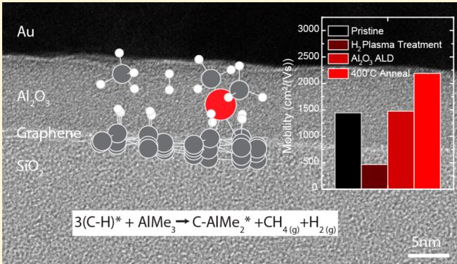
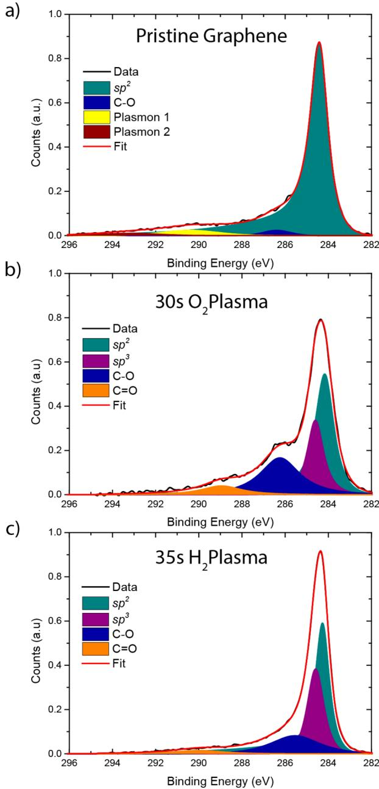
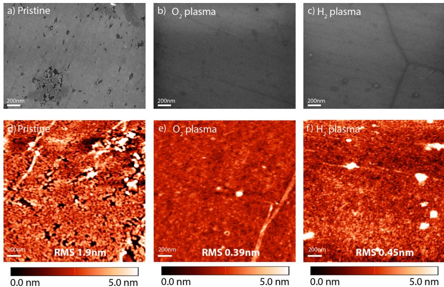
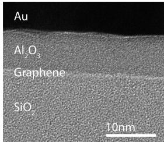
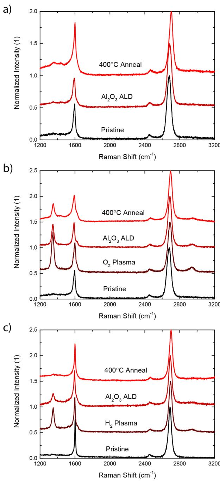
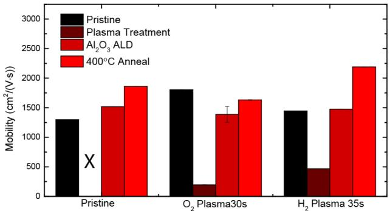
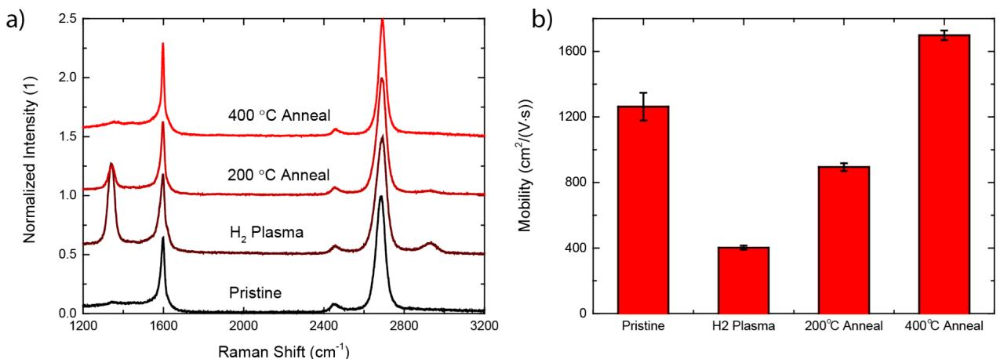
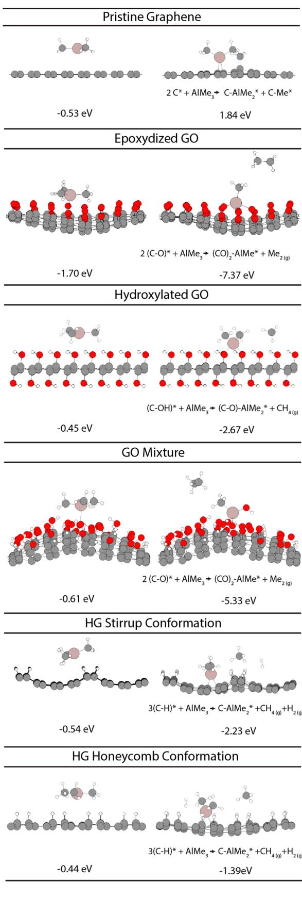
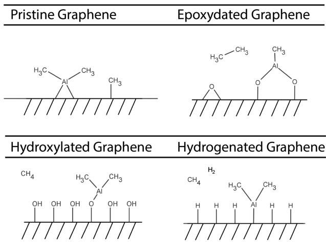

# Uniform Atomic Layer Deposition of  $\mathrm{Al}_2\mathrm{O}_3$  on Graphene by Reversible Hydrogen Plasma Functionalization

René H. J. Vervuurt, $^{†}$  Bora Karasulu, $^{\dagger}$  Marcel A. Verheijen, $^{\dagger ,\ddagger}$  Wilhelmus (Erwin) M. M. Kessels, $^{\dagger}$  and Ageeth A. Bol $^{*,\dagger}$

$^{\dagger}$ Department of Applied Physics, Eindhoven University of Technology, P.O. Box 513, 5690 MB Eindhoven, The Netherlands  $^{\ddagger}$ Philips Innovation Labs, High Tech Campus 11, 5656 AE Eindhoven, The Netherlands

Supporting Information

ABSTRACT: A novel method to form ultrathin, uniform  $\mathrm{Al}_2\mathrm{O}_3$  layers on graphene using reversible hydrogen plasma function-alization followed by atomic layer deposition (ALD) is presented. ALD on pristine graphene is known to be a challenge due to the absence of dangling bonds, leading to nonuniform film coverage. We show that hydrogen plasma functionalization of graphene leads to uniform ALD of closed  $\mathrm{Al}_2\mathrm{O}_3$  films down to  $8\mathrm{nm}$  in thickness. Hall measurements and Raman spectroscopy reveal that the hydrogen plasma functionalization is reversible upon  $\mathrm{Al}_2\mathrm{O}_3$  ALD and subsequent annealing at  $400^{\circ}\mathrm{C}$  and in this way does not deteriorate the graphene's charge carrier mobility. This is in contrast with oxygen plasma functionalization, which can lead to a uniform  $5\mathrm{nm}$  thick closed film, but which is not reversible and leads to a reduction of the charge carrier mobility. Density functional theory (DFT) calculations attribute the uniform growth on both  $\mathrm{H}_2$  and  $\mathrm{O}_2$  plasma functionalized graphene to the enhanced adsorption of trimethylaluminum (TMA) on these surfaces. A DFT analysis of the possible reaction pathways for TMA precursor adsorption on hydrogenated graphene predicts a binding mechanism that cleans off the hydrogen functionalities from the surface, which explains the observed reversibility of the hydrogen plasma functionalization upon  $\mathrm{Al}_2\mathrm{O}_3$  ALD.

# 1. INTRODUCTION

Graphene is a two- dimensional (2D) material that has attracted significant interest in the scientific community due to its interesting electronic, optical, and thermal properties. The high carrier mobility of graphene and large maximum current density make it a promising candidate for postsilicon electronics. The deposition of thin high- k dielectric films on graphene is required for many of these electronic applications. For example, radio frequency transistors require the deposition of dielectric layers on top of the graphene for good electrostatic control of the channel and better device reliability, while lateral spin valves require ultrathin dielectrics on the graphene as a tunnel barrier.

Atomic layer deposition (ALD) is the preferred method to deposit dielectric layers on graphene, due to its ability to deposit high quality and uniform materials with precise control of the layer thickness. However, the initiation of ALD growth on graphene is known to be a challenge due to the lack of out- of- plane bonds and surface hydrophobicity. ALD growth of dielectrics on pristine graphene therefore only occurs on defect sites or grain boundaries where dangling bonds or functional groups are present. To overcome this issue different surface preparation techniques to initialize ALD growth on graphene have been investigated in the literature. In general these techniques can be divided into three categories: 1) the use of seed- layers, such as self- assembled monolayers, polymers, evaporated metals (which are oxidized in air before ALD), and layers deposited by chemical vapor deposition (CVD),5,10,22 2) the creation of functional groups on the graphene surface by for example ozone and plasma treatments, and 3) tuning the underlying substrate to enhance the nucleation.13

The use of polymer seed- layers results in the conformal coverage of ALD oxide without damaging the graphene. However, the polymer interlayer that is used has a low- k value, leading to a higher equivalent oxide thickness for the deposited polymer/oxide stack. Furthermore, the used polymers can dope the graphene, which results in a large Dirac- point shift of the created devices.4 Oxidized metal seed- layers avoid these issues but trap charges at the graphene- dielectric interface. This deteriorates the mobility of graphene layers and reduces device performance. The use of CVD layers to initialize growth does not affect the graphene properties but no longer offers the

advantages of ALD in terms of thickness control, resulting in the deposition of thick layers  $(>10 \mathrm{nm})$ .22

Degradation of the electrical properties of graphene is also observed for most covalent functionalization methods. This is because these methods rely on the conversion of  $sp^2$ - C bonds to  $sp^3$  bonds, disrupting the 2D nature of graphene.11,12,16,17

For example, ozone functionalization at  $200^{\circ}\mathrm{C}$  creates epoxy surface groups that enhance the nucleation of  $\mathrm{Al}_2\mathrm{O}_3$  on graphene, yielding uniform  $\mathrm{Al}_2\mathrm{O}_3$  growth on the graphene.11 At the same time, however, these groups enhance the scattering of charge carriers in graphene, resulting in decreased carrier mobilities. To avoid this problem the ozone functionalization can be performed at lower temperatures. At temperatures below  $50^{\circ}\mathrm{C}$ , ozone is physisorbed on graphene leaving the  $sp^2$  bonding intact. This prevents damaging the graphene and can even provide an improvement in the electrical properties of graphene following  $\mathrm{Al}_2\mathrm{O}_3$  ALD.18,19 The limited stability of physisorbed ozone on the graphene surface, however, also requires  $\mathrm{Al}_2\mathrm{O}_3$  deposition at these low temperatures, decreasing the quality of the deposited films.23

The use of  $\mathrm{O}_2$  and  $\mathrm{N}_2$  plasmas to functionalize the graphene causes severe damage to the graphene, degrading its electrical properties.12,16 To avoid this Shin et al. and Nourbakhsh et al. performed an  $\mathrm{O}_2$  plasma treatment on a sacrificial graphene layer.20,21 This layer served as a nucleation layer for  $\mathrm{Al}_2\mathrm{O}_3$  ALD that was either transferred onto a pristine graphene layer after the plasma exposure20 or protected the underlying graphene during the plasma exposure.10 With this method uniform  $\mathrm{Al}_2\mathrm{O}_3$  layers down to  $4 \mathrm{nm}$  in thickness could be deposited without damaging the graphene. The requirement of an additional graphene transfer step, however, makes the process time- consuming and could trap polymer residues left over from the transfer procedure in between the layers.

To date  $\mathrm{H}_2$  plasmas have not been studied for the uniform growth of dielectric layers by ALD on graphene. The use of  $\mathrm{H}_2$  plasmas to initialize growth on graphene might be of interest because the  $\mathrm{H}_2$  plasma treatment (hydrogenation) has shown to be reversible.24,25 The pristine graphene properties can be recovered after annealing the hydrogenated graphene in an Ar atmosphere at  $400^{\circ}\mathrm{C}$ . This might make it possible to directly grow ALD layers on hydrogen functionalized graphene, without the need for sacrificial layers or damaging the graphene, since the pristine graphene properties might be recovered after processing by an annealing step.

To this extent  $\mathrm{H}_2$  plasma pretreatments are investigated in this work to initialize  $\mathrm{Al}_2\mathrm{O}_3$  ALD growth directly on graphene, without the use of a sacrificial layer. The ability of the  $\mathrm{H}_2$  plasma pretreatment to obtain uniform ALD growth on graphene is compared to  $\mathrm{O}_2$  plasma pretreatments and pristine graphene. The type of functional group created by the  $\mathrm{H}_2$  and  $\mathrm{O}_2$  plasma treatments is studied by X- ray photoelectron spectroscopy (XPS). The effects of the plasma treatments on the structural and electrical properties of the functionalized graphene is investigated by Raman and Hall measurements, before and after plasma treatment, after  $\mathrm{Al}_2\mathrm{O}_3$  ALD, and after an anneal at  $400^{\circ}\mathrm{C}$ . Furthermore, the underlying reaction mechanism of the  $\mathrm{Al}_2\mathrm{O}_3$  precursor adsorption on the functionalized graphene is investigated using ab initio calculations.

# 2. METHODOLOGY

2.1. Experimental Methods. Graphene samples  $(1 \times 1 \mathrm{cm})$  were synthesized by CVD on Cu foil (Alfa Aesar 99.8%, No. 13382) of 25

$\mu \mathrm{m}$ . Before growth the Cu foil was cleaned using acetone, methanol, and a  $30 \mathrm{s} 1.0 \mathrm{M}$  nitric acid  $\left(\mathrm{HNO}_3\right)$  etch to remove the surface oxide. After rinsing in deionized water the Cu foil was dried and loaded into a tube furnace. The Cu foil was heated to  $1050^{\circ}\mathrm{C}$  under an  $\mathrm{Ar} / \mathrm{H}_2$ $(500 / 10 \mathrm{scm})$  flow at a pressure of 0.4 Torr. After annealing the sample for  $30 \mathrm{min}$ , the  $\mathrm{H}_2$  flow was reduced to 6, and  $100 \mathrm{scm} \mathrm{CH}_4$  was added to the gas flow for  $20 \mathrm{min}$ , resulting in a monolayer coverage of graphene on the Cu foil. The sample was cooled down to room temperature in  $15 \mathrm{min}$  while leaving the gas flows on.

The graphene on Cu was transferred to  $90 \mathrm{nm} \mathrm{SiO}_2 / \mathrm{Si}$  (100) wafers by wet chemistry using poly(methyl methacrylate) (PMMA) A4 950k (Micro Chem.) as a support layer. Ferric chloride  $\left(\mathrm{FeCl}_3 0.1 \mathrm{M}\right)$  was used to etch the Cu. After transfer the PMMA was removed using acetone with a final rinse in methanol. The samples were subsequently annealed at  $400^{\circ}\mathrm{C}$  in an  $\mathrm{Ar} / \mathrm{H}_2$  atmosphere for  $2 \mathrm{h}$ , to minimize any PMMA residue remaining after PMMA lift- off.

The  $\mathrm{O}_2$  and  $\mathrm{H}_2$  plasma functionalization of the graphene was performed in an Oxford Instruments FlexAI reactor using a  $100 \mathrm{W} 50$  mTorr plasma at  $50^{\circ}\mathrm{C}$  and a gas flow of  $50 \mathrm{scm} \mathrm{O}_2$  or  $\mathrm{H}_2$  respectively. ALD was performed in the same reactor at  $100^{\circ}\mathrm{C}$  using trimethylaluminum (TMA) and  $\mathrm{H}_2\mathrm{O}$ . The timing sequence was as follows:  $(0.03 \mathrm{s}, 4 \mathrm{s}, 0.2 \mathrm{s}, 10 \mathrm{s})$  (TMA purge,  $\mathrm{H}_2\mathrm{O}$  purge). After ALD one set of samples was annealed at  $400^{\circ}\mathrm{C}$  in an  $\mathrm{Ar} / \mathrm{H}_2$  atmosphere for  $2 \mathrm{h}$  in a tube furnace.

The quality and electrical properties of the graphene samples were characterized before and after plasma treatment following ALD and after annealing with a Renishaw Invia Raman microscope  $(514.5 \mathrm{nm})$  and an Ecopia HMS- 5300 Hall Effect Measurement System. The graphene samples used for the Hall measurements were approximately  $1 \times 1 \mathrm{cm}^2$  in size. Ohmic contact to the graphene was obtained by applying conductive silver paste at the corners of the graphene samples. The silver paint was applied before annealing the pristine graphene samples at  $400^{\circ}\mathrm{C}$  to exclude the influence of the annealing process on the contact formation. The formation of an Ohmic contact was confirmed by  $1 - \mathrm{V}$  measurements, which showed Ohmic behavior over the full measured range  $(- 100 - 100 \mu \mathrm{A})$ . The Hall measurements were performed at  $25^{\circ}\mathrm{C}$  under  $\mathrm{N}_2$  ambient. Prior to the measurements the samples were annealed at  $150^{\circ}\mathrm{C}$  for  $10 \mathrm{min}$  to remove any adsorbed  $\mathrm{H}_2\mathrm{O}$  from the graphene. Information on the surface groups created after plasma treatment was determined by a Thermo Scientific K- Alpha KA 1066 X- ray photon spectroscope (XPS). The uniformity of the deposited  $\mathrm{Al}_2\mathrm{O}_3$  films was determined with a JEOL 7500 FA scanning electron microscope (SEM), a NTMDT Solver P47 atomic force microscope (AFM), and a JEOL ARM 200 probe corrected transmission electron microscope (TEM), operated at  $200 \mathrm{kV}$ . A cross- sectional TEM sample from a  $\mathrm{Al}_2\mathrm{O}_3/$  graphene stack on a  $90 \mathrm{nm} \mathrm{SiO}_2 / \mathrm{Si}$  wafer was prepared using the FIB lift- out method using a FEI Helios 630 DualBeam system. The thickness of the  $\mathrm{Al}_2\mathrm{O}_3$  layer was determined by a J.A. Woollam M- 2000D variable angle spectroscopic ellipsometer (SE).

2.2. Computational Methods. The binding energies of TMA on pristine,  $\mathrm{O}_2$  and  $\mathrm{H}_2$  plasma functionalized graphene were calculated by ab initio density functional theory (DFT). The calculations were performed using the projector augmented wave function  $\left(\mathrm{PAW}\right)^{26,27}$  as implemented in Vienna Ab Initio Simulation Package (VASP v.5.3.5).28- 31 The generalized gradient approximation (GGA) to  $\mathrm{DFT}^{32,33}$  was used with a plane- wave basis. The Perdew- Burke- Ernzerhof (PBE) exchange correlation functional34,35 was used along with the DFT(PBE)- D3 method including the Becke- Jonson damping36 to account for van der Waals interactions on an empirical basis. Eq 1 was used for computing the TMA adsorption (or, equivalently, binding) energies through physisorption  $\left(\Delta E_{\mathrm{p}}\right)$  or chemisorption  $\left(\Delta E_{\mathrm{c}}\right)$  on a given graphene surface

$$
\Delta E_{\mathrm{p / c}} = E_{\mathrm{PG}} - E_{\mathrm{p}} - E_{\mathrm{G}} \tag{1}
$$

where  $E_{\mathrm{PG}}$  is the total energy of the physisorbed/chemisorbed complex of the TMA precursor with graphene, and  $E_{\mathrm{p}}$  and  $E_{\mathrm{G}}$  are the (gas phase) total energies of the isolated precursor and the graphene surface under consideration. Relevantly, the (reaction) energies  $\left(\Delta E_{\mathrm{r}} = \Delta E_{\mathrm{c}} - \Delta E_{\mathrm{p}}\right)$  required for converting the corresponding physisorbed

species into chemisorbed zones, e.g. via dissociation of the given precursor on the given surface, are also presented. Gibbs free energy changes  $(\Delta G = \Delta (E_{\mathrm{elec}} - E_{\mathrm{ZPE}}) - T\Delta S)$  associated with TMA adsorption were estimated in the ideal gas limit at the typical ALD conditions  $(T = 100^{\circ}\mathrm{C}$  and  $P = 100\mathrm{mTorr})$ , accounting for the translational, rotational, and vibrational contributions to the enthalpy and entropy terms. All- atom vibrational analyses were performed using the finite differences method implemented in VASP. Further details about the computational calculations can be found in the Supporting Information and elsewhere. $^{37}$

# 3. RESULTS AND DISCUSSION

3.1. Surface Species Analysis by XPS. First the effect of the  $\mathrm{O}_2$  and  $\mathrm{H}_2$  plasma functionalization on graphene was studied by XPS to analyze the surface groups created during the plasma exposure. Before plasma exposure, the pristine graphene samples were annealed at  $400^{\circ}\mathrm{C}$  for  $2\mathrm{h}$  in  $\mathrm{Ar / H}_2$ $(5\%)$  atmosphere for  $2\mathrm{h}$ . This was done to minimize any polymer residues left on the surface after transfer and ensure the cleanest graphene possible. In the case of the  $\mathrm{O}_2$  plasma treatment an exposure time of  $30\mathrm{s}$  was chosen, while for the  $\mathrm{H}_2$  plasma  $35\mathrm{s}$  was used, both at a pressure of  $50\mathrm{mTorr}$  and plasma power of  $100\mathrm{W}$ . These are the optimal exposure times; longer exposures resulted in irreversibly damaging the graphene as confirmed by Raman spectroscopy, whereas shorter exposures did not result in a closed  $\mathrm{Al}_2\mathrm{O}_3$  layer (see discussion in the Supporting Information and Figure S1).

The XPS measurements of the C 1s spectra of graphene after a  $30\mathrm{s}\mathrm{O}_2$  plasma treatment and a  $35\mathrm{s}\mathrm{H}_2$  plasma treatment are shown in Figure 1. As a reference the spectrum of pristine graphene after transfer to  $90\mathrm{nm}\mathrm{SiO}_2$  and  $400^{\circ}\mathrm{C}$  anneal is also shown in Figure 1. The main peak contributing to the C 1s spectrum of pristine graphene (Figure 1a) is located at  $284.4\mathrm{eV}$  and originates from the  $sp^2$  bonding of the carbon atoms. The weak peak at  $286.4\mathrm{eV}$  corresponds to  $\mathrm{C} - \mathrm{O}$  bonding. These  $\mathrm{C} - \mathrm{O}$  bonds are commonly seen on the graphene basal plane and originate from grain boundaries or defects sites $^{38,39}$  or are the result of polymer residues remaining on the graphene after its transfer to  $\mathrm{SiO}_2$  and annealing. $^{40}$  In addition, two plasmon loss features observed at  $290.4$  and  $293.2\mathrm{eV}$  are caused by the interaction of the photoelectron with free electrons present in the graphene. $^{41}$

After a  $30\mathrm{s}\mathrm{O}_2$  plasma treatment (Figure 1b) the amount of  $\mathrm{C} - \mathrm{O}$  bonds increases, indicating the creation of epoxide groups  $(\mathrm{C} - \mathrm{O} - \mathrm{C})$  or hydroxide  $(\mathrm{C} - \mathrm{OH})$  containing surface groups on the graphene. Two additional peaks appear in the spectrum compared to that of pristine graphene. The peak at  $284.6\mathrm{eV}$  is related to  $sp^3$  bonding of the carbon atoms. This is combined with a decrease in  $sp^2$  bonding, which indicates that the  $\mathrm{O}_2$  plasma treatment indeed disrupts the  $sp^2$  structure of the graphene. $^{42}$  The second peak appears at  $289.0\mathrm{eV}$  and is related to the creation of  $\mathrm{C} = \mathrm{O}$  bonds, possibly in the form of carbonyl groups. Since carbonyl groups can only be formed in- plane due to their  $sp^2$  carbon constituent, these are most likely located at defects or edge sites of the graphene basal plane. The plasmon loss features can no longer be observed after the  $\mathrm{O}_2$  plasma treatment. This is likely due to the deterioration of the electrical properties of the graphene after the plasma exposure. The O 1s spectra of the graphene samples did not provide any additional information on the  $\mathrm{C} - \mathrm{O}$  and  $\mathrm{C} = \mathrm{O}$  bonding due to the dominating contribution from the  $\mathrm{SiO}_2$  substrate to the O 1s signal.

After a  $35\mathrm{s}\mathrm{H}_2$  plasma treatment (Figure 1c) the graphene shows a strong increase in the  $sp^3$  bonding, combined with a decrease in the  $sp^3$  bonding. This is most likely related to the formation of  $\mathrm{C} - \mathrm{H}$  bonds (hydrogenated graphene), $^{24}$  which cannot be observed by XPS. A distinct hallmark of hydrogenated graphene is the reversibility of hydrogenation upon annealing at  $400^{\circ}\mathrm{C}$ . $^{25}$  This reversibility can be confirmed by Raman spectroscopy. $^{24,25}$  After hydrogenation the Raman D- band at  $1350\mathrm{cm}^{- 1}$ , which is related to defects or  $sp^3$  bonding of the carbon atoms, can be observed. This band disappears after annealing at  $400^{\circ}\mathrm{C}$  in Ar atmosphere, indicating that hydrogen atoms desorb from the graphene surface at this temperature and the original graphene  $sp^2$  configuration is restored. This reversibility of the D- band is also observed for the  $35\mathrm{s}\mathrm{H}_2$  plasma treated sample in this work (see below), indicating that the graphene is indeed hydrogenated upon  $\mathrm{H}_2$  plasma exposure.

  
Figure 1. XPS spectra of the core level C 1s of a) pristine graphene (after transfer to  $\mathrm{SiO}_2$ ), b) graphene after a  $30\mathrm{s}\mathrm{O}_2$  plasma treatment, and c) graphene after a  $35\mathrm{s}\mathrm{H}_2$  plasma treatment at a pressure of  $50\mathrm{mTorr}$  and a plasma power of  $100\mathrm{W}$ .

  
Figure 2. SEM and AFM images showing the  $\mathrm{Al}_2\mathrm{O}_3$  coverage on graphene after 100 cycles of  $\mathrm{Al}_2\mathrm{O}_3$  ALD at  $100^{\circ}\mathrm{C}$  for  $\mathbf{a},\mathbf{d}$  pristine,  $\mathbf{b},\mathbf{e}$ $30~\mathrm{s}~\mathrm{O}_2$  plasma, and  $\mathbb{C},\mathbb{f})$ $35~\mathrm{s}~\mathrm{H}_2$  plasma treated graphene. The root-mean-square (RMS) roughness determined from the AFM measurements is indicated as well.

Apart from a change from  $sp^2$  to  $sp^3$  bonding the XPS also shows an increase in the  $\mathrm{C} - \mathrm{O}$  bonding after the  $\mathrm{H}_{2}$  plasma treatment. This could be due to the formation of hydroxyl groups upon  $\mathrm{H}_{2}$  plasma exposure or adventitious carbon. The hydroxyl groups could be formed by residual water desorbing from the reactor walls and dissociating in the plasma, whereas the adventitious carbon could be formed due to carbon containing molecules present in the air adsorbing on the sample during transfer to the XPS system. Summarizing, the XPS results indicate that an  $\mathrm{O}_2$  plasma creates a combination of epoxide, hydroxide, and carbonyl groups on the graphene surface. A hydrogen plasma most likely results in the creation of  $\mathrm{C} - \mathrm{H}$  groups with some hydroxyl impurities.

3.2.  $\mathrm{Al}_2\mathrm{O}_3$  ALD Growth on Functionalized Graphene. To investigate the effect of the created functional groups on the uniformity of the  $\mathrm{Al}_2\mathrm{O}_3$  nucleation, 100 ALD cycles were performed on the plasma treated samples. A pristine graphene sample was added to the deposition as a reference. The uniformity of the  $\mathrm{Al}_2\mathrm{O}_3$  after deposition, determined by SEM and AFM, is shown in Figure 2. On the pristine graphene reference sample no uniform growth is obtained (Figure 2a,d). Small holes and a granular  $\mathrm{Al}_2\mathrm{O}_3$  structure are visible in both the AFM and SEM images. The roughness, determined from an average of three AFM scans  $(2\times 2\mu \mathrm{m}^2)$  is  $1.9\pm 0.1 \mathrm{nm}$  for the pristine graphene sample after  $\mathrm{Al}_2\mathrm{O}_3$  ALD. Both the  $30~\mathrm{s}~\mathrm{O}_2$  plasma (Figure 2b,e) and the  $35\mathrm{~s~H}_2$  plasma (Figure 2c,f) treated graphene show uniform deposition of  $\mathrm{Al}_2\mathrm{O}_3$  No pinholes are visible, and the roughness is considerably lower,  $0.39\pm 0.05 \mathrm{nm}$  and  $0.45\pm 0.05 \mathrm{nm}$  for the  $\mathrm{O}_2$  and  $\mathrm{H}_{2}$  plasma, respectively, indicating that a closed  $\mathrm{Al}_2\mathrm{O}_3$  layer is obtained. The surface groups created on the graphene with the  $\mathrm{O}_2$  and  $\mathrm{H}_{2}$  plasma pretreatments thus sufficiently increase the ALD precursor adsorption on graphene, enhancing the nucleation of  $\mathrm{Al}_2\mathrm{O}_3$  ALD and enabling uniform  $\mathrm{Al}_2\mathrm{O}_3$  growth on graphene.

The thicknesses of the  $\mathrm{Al}_2\mathrm{O}_3$  layers deposited on the  $\mathrm{O}_2$  and  $\mathrm{H}_{2}$  plasma treated graphene have been determined with spectroscopic ellipsometry (SE) to be  $11\pm 1 \mathrm{nm}$  and  $9\pm 1$  nm, respectively. The higher thickness of the  $\mathrm{Al}_2\mathrm{O}_3$  on the  $\mathrm{O}_2$  plasma treated sample indicates a shorter nucleation delay of the  $\mathrm{Al}_2\mathrm{O}_3$  when an  $\mathrm{O}_2$  plasma treatment is used. This is most likely caused by a more favored adsorption of TMA precursor molecules on epoxide  $(\mathrm{C} - \mathrm{O} - \mathrm{C})$  and hydroxyl  $(\mathrm{C} - \mathrm{OH})$  groups compared to hydrogen groups  $(\mathrm{C} - \mathrm{H})$ . This will be discussed in more detail in the DFT section of this paper. The shorter nucleation delay on  $\mathrm{O}_2$  plasma treated graphene also makes it possible to deposit thinner uniform  $\mathrm{Al}_2\mathrm{O}_3$  layers on the  $\mathrm{O}_2$  treated samples (see Figure S2). In the case of the  $\mathrm{O}_2$  plasma treated graphene, the  $\mathrm{Al}_2\mathrm{O}_3$  layer was already closed after 50 cycles, corresponding to a layer thickness of approximately  $5 \mathrm{nm}$ . Considering the  $\mathrm{H}_2$  plasma treated samples, pinholes were still present in the layer after 75 ALD cycles (see Figure S2). This indicates that 100 ALD cycles is the minimum required for a closed  $\mathrm{Al}_2\mathrm{O}_3$  layer using  $\mathrm{H}_2$  plasma functionalization with the current plasma settings and exposure time. Increasing the  $\mathrm{H}_2$  plasma exposure time could help to increase the coverage at lower ALD cycles numbers but can also irreversibly damage the graphene (see discussion in the Supporting Information).

To confirm that the  $\mathrm{Al}_2\mathrm{O}_3$  layer after a  $\mathrm{H}_2$  plasma treatment and 100 cycles  $\mathrm{Al}_2\mathrm{O}_3$  ALD is indeed closed, a TEM cross- section was made (Figure 3). The cross- section shows a uniform  $\mathrm{Al}_2\mathrm{O}_3$  layer with a thickness of  $7.8\pm 0.4 \mathrm{nm}$ , which is in agreement with the  $\mathrm{Al}_2\mathrm{O}_3$  thickness obtained from the SE measurements.

3.3. Quality of the Graphene: Raman Characterization. The above results show that uniform  $\mathrm{Al}_2\mathrm{O}_3$  deposition

  
Figure 3. Cross-sectional TEM image of 100 cycles of  $\mathrm{Al}_2\mathrm{O}_3$  deposited on graphene treated with  $35~\mathrm{s}$ $\mathrm{H}_{2}$  plasma. The  $\mathrm{Al}_2\mathrm{O}_3$  layer is  $7.8\pm 0.4$  nm thick and pinhole-free.

on graphene can be obtained by using an  $\mathrm{O}_2$  and  $\mathrm{H}_2$  plasma pretreatment. However, it is generally observed that graphene is damaged by such treatments. $^{12,16,20,21}$  This is also indicated by the XPS data in Figure 1, which show the conversion of  $sp^2$  bonds to  $sp^3$  bonds. In this regard, the quality of the graphene was studied before the plasma treatment, after the plasma treatment, after ALD, and after annealing at  $400^{\circ}\mathrm{C}$  using Raman spectroscopy and Hall measurements (next section). The Raman measurements performed after each processing step for the different graphene samples are shown in Figure 4. The Raman D- band  $(\sim 1350~\mathrm{cm^{- 1}})$  is related to defects in the graphene or to the functionalization of graphene by covalent bonding. $^{42}$  Pristine graphene (Figure 4a) shows no D- band indicating that the graphene is of high quality. Subsequent  $\mathrm{Al}_2\mathrm{O}_3$  ALD on the pristine graphene does not create any defects in the graphene but also does not result in the formation of a closed  $\mathrm{Al}_2\mathrm{O}_3$  layer. Annealing the pristine graphene with  $\mathrm{Al}_2\mathrm{O}_3$  at  $400^{\circ}\mathrm{C}$  for  $2\mathrm{~h}$  in a  $50:1\mathrm{~Ar / H}_2$  mixture results in the formation of a small D- band and an  $\alpha$ - carbon background  $(\sim 1200 - 1500~\mathrm{cm^{- 1}})$ , which could be due to the dehydrogenation of the polymer residues present at the graphene surface. These residues are a result of the graphene transfer process. $^{40}$  Even though the graphene was annealed before ALD to minimize the residues, it has appeared impossible to remove them completely. $^{40}$

  
Figure 4. Raman spectra of the different graphene samples after each processing step: transfer, plasma treatment, 100 cycles  $\mathrm{Al}_2\mathrm{O}_3$  ALD, and  $400^{\circ}\mathrm{C}$  anneal for a) untreated graphene, b)  $30\mathrm{~s~O_2}$  plasma treated graphene, and c)  $35\mathrm{~s~H_2}$  plasma treated graphene. The spectra are normalized to the 2D band and are offset for clarity.

Treating the graphene with a  $30\mathrm{~s~O_2}$  plasma creates a significant D- band (Figure 4b) as a result of the conversion of  $sp^2$  to  $sp^3$  carbon (also shown by XPS) and possibly by the creation of defects due to ion bombardment. After  $\mathrm{Al}_2\mathrm{O}_3$  ALD the magnitude of the D- band decreases considerably, indicating that the ALD process is able to partially heal the defects introduced by the plasma pretreatment or remove functional groups present on the graphene. This could be due to a reaction of the ALD precursor molecules with the functional groups or the passivation of defects by  $\mathrm{Al}_2\mathrm{O}_3$ . $^{43}$  In an attempt to further reduce the D- band, the sample was annealed at  $400^{\circ}\mathrm{C}$  under the same conditions as the pristine graphene. Although this reduced the D- band further, it could not be completely removed. Possibly, the species in the  $\mathrm{O}_2$  plasma irreversibly damaged the graphene, or part of the functional groups remains on the graphene.

In the case of a  $35\mathrm{~s~H_2}$  plasma treatment, a similar trend as for the  $\mathrm{O}_2$  plasma treated sample can be observed by Raman spectroscopy (Figure 4c). Similar to the  $\mathrm{O}_2$  plasma the  $\mathrm{H}_2$  plasma results in the appearance of a D- band in the Raman spectrum. The D- band after  $\mathrm{H}_2$  plasma treatment is lower compared to the D- band created after  $\mathrm{O}_2$  plasma treatment. Subsequent  $\mathrm{Al}_2\mathrm{O}_3$  ALD leads to a reduction of these defects or removal of the  $\mathrm{C - H}$  functional groups from the surface. Annealing the  $\mathrm{H}_2$  plasma treated sample with  $\mathrm{Al}_2\mathrm{O}_3$  at  $400^{\circ}\mathrm{C}$  results in the complete annihilation of the D- band. The Raman spectrum obtained after annealing is similar to the pristine graphene spectrum obtained after transfer to the  $\mathrm{SiO}_2$  substrate. This points in the direction that the D- band is indeed related to  $\mathrm{C - H}$  bonds, which can be removed after annealing at  $400^{\circ}\mathrm{C}$ , as defects are not likely to be annealed at this temperature. $^{24}$  It should be noted that for hydrogenated graphene also a weak  $\mathrm{D}^{\prime}$ - band  $(\sim 1620~\mathrm{cm^{- 1}})$  should be present. $^{42}$  This peak is however not distinguishable in Figure 4c, because the G- band  $(\sim 1600~\mathrm{cm^{- 1}})$  is significantly broadened upon annealing the pristine graphene to remove the PMMA residue, thus introducing overlap with the  $\mathrm{D}^{\prime}$  band. This broadening is related to the formation of small amounts of amorphous carbon during the anneal on top of the graphene. $^{44}$  Direct  $\mathrm{H}_2$  plasma exposure of pristine graphene (without annealing) does result in the formation of a distinguishable  $\mathrm{D}^{\prime}$ - band (data not shown).

3.4. Quality of the Graphene: Hall Mobility Characterization. Hall mobility measurements were performed to investigate the effect of the  $\mathrm{O}_2$  and  $\mathrm{H}_2$  plasma treatments on the electrical properties of graphene (Figure 5). The mobility values of the pristine graphene samples used in this study range between 1300 and  $1800~\mathrm{cm^2 / (V~s)}$  (indicated by the black bars in Figure 5) which is typical for large area  $(1\times 1\mathrm{~cm^2})$  CVD graphene. $^{3,45,46}$  The deposition of  $\mathrm{Al}_2\mathrm{O}_3$  on pristine graphene results in a mobility increase to  $117\%$  of its initial value (1520

  
Figure 5. Mobility of graphene determined by Hall measurements, after transfer, after plasma treatment, after 100 cycles  $\mathrm{Al}_2\mathrm{O}_3$  ALD, and after  $400^{\circ}\mathrm{C}$  anneal for pristine,  $\mathrm{O}_2$ , and  $\mathrm{H}_2$  plasma treated graphene.

$\mathrm{cm}^2 /(\mathrm{V}\mathrm{s}))$  . This increase could be caused by several effects: (1)  $\mathrm{Al}_2\mathrm{O}_3$  can passivate defects present in the graphene;47 (2)  $\mathrm{Al}_2\mathrm{O}_3$  can act as a barrier preventing  $\mathrm{H}_2\mathrm{O}$  and  $\mathrm{O}_2$  reaching the graphene surface which would otherwise degrade the carrier mobility of graphene;48 (3) The  $\mathrm{Al}_2\mathrm{O}_3$  layer can also help to screen charged impurities, present in the  $\mathrm{SiO}_2$  substrate, which would normally act as scattering centers for the electrons and holes in the graphene.49 Charge screening could also explain why the mobility is further increased to  $140\%$  of its initial value  $(1860~\mathrm{cm}^2 /(\mathrm{V~s}))$  after the sample is annealed at  $400^{\circ}\mathrm{C}$ . This is because annealing  $\mathrm{Al}_2\mathrm{O}_3$  at  $400^{\circ}\mathrm{C}$  generally gives the highest  $\mathrm{Al}_2\mathrm{O}_3$  built- in charge,50 resulting in maximum passivation and an increased mobility of the graphene after annealing. It should be noted though that the  $\mathrm{Al}_2\mathrm{O}_3$  layer on pristine graphene is not closed and therefore not suited for applications, for example as a gate dielectric.

Figure 5 also shows that both the  $\mathrm{O}_2$  and  $\mathrm{H}_2$  plasma treatments reduce the charge carrier mobility of graphene, as expected. After  $\mathrm{O}_2$  plasma the mobility is reduced to  $195~\mathrm{cm}^2 /$  (V s) (11% of its initial value), whereas after a  $\mathrm{H}_2$  plasma the mobility is decreased to  $467~\mathrm{cm}^2 /(\mathrm{V~s})$  (32% of its initial value). This is in line with the XPS and Raman data which show the conversion of  $sp^2$  to  $sp^3$  carbon. The out- of- plane bonds act as scattering centers for the electrons and holes in the graphene and therefore lower the mobility.

$\mathrm{Al}_2\mathrm{O}_3$  ALD on the  $\mathrm{O}_2$  plasma treated sample causes a partial recovery of the mobility to  $78\%$  of its initial value  $(1390~\mathrm{cm}^2 /$

(V s)), most likely due to passivation and barrier properties of  $\mathrm{Al}_2\mathrm{O}_3$ , as was discussed for ALD on pristine graphene above. Additionally, part of the functional groups or defects might be removed from the surface by the precursor molecules during  $\mathrm{Al}_2\mathrm{O}_3$  ALD. This hypothesis is further strengthened by the observed decrease of the D- band in the Raman spectrum after  $\mathrm{Al}_2\mathrm{O}_3$  ALD (Figure 4b). The DFT section of this paper will elaborate further on this hypothesis. The charge carrier mobility of the  $\mathrm{O}_2$  plasma treated graphene sample with  $\mathrm{Al}_2\mathrm{O}_3$  can be recovered to  $91\%$  of its original value  $(1630~\mathrm{cm}^2 /(\mathrm{V~s}))$  by annealing at  $400^{\circ}\mathrm{C}$ . The recovery is most likely a result of the improved passivation properties of the  $\mathrm{Al}_2\mathrm{O}_3$  as observed for the pristine sample. Additionally, some functional groups on the graphene desorb during the annealing, indicated by a further decrease in the Raman D- band (Figure 4b). The functional groups removed could be primarily hydroxyl groups, which have limited stability on graphene (see discussion in the DFT section). The incomplete recovery of the mobility after annealing indicates that some defects or functional groups remain on the  $\mathrm{O}_2$  plasma treated sample, which is confirmed by the still observable D- band in the Raman spectra.

$\mathrm{Al}_2\mathrm{O}_3$  ALD on the  $\mathrm{H}_2$  plasma treated graphene results in a large mobility improvement from  $32\%$ $(467~\mathrm{cm}^2 /(\mathrm{V~s})$ , after the  $\mathrm{H}_2$  plasma treatment) to  $102\%$  of its initial value  $(1470~\mathrm{cm}^2 /(\mathrm{V~s})$ , after 100 ALD cycles). As for the  $\mathrm{O}_2$  plasma treatment, this recovery is most likely caused by a combination of the passivation and barrier properties of  $\mathrm{Al}_2\mathrm{O}_3$  and a partial removal of the surface groups. Likewise, the removal of surface groups is supported by the decrease of the D- band in the Raman spectrum after  $\mathrm{Al}_2\mathrm{O}_3$  ALD (Figure 4c). Compared to the  $\mathrm{O}_2$  plasma treatment, the D- band is considerably weaker for the  $\mathrm{H}_2$  plasma treatment after ALD, indicating that the groups created by the  $\mathrm{H}_2$  plasma treatment can be more easily removed, which explains the higher mobility recovery. Annealing the sample at  $400^{\circ}\mathrm{C}$  further improves the mobility to  $152\%$  of its original value  $(2190~\mathrm{cm}^2 /(\mathrm{V~s}))$ . The absence of a D- band in the Raman spectrum after annealing the  $\mathrm{H}_2$  plasma treated samples explains the larger increase of the mobility compared to the  $\mathrm{O}_2$  treatment. This also shows that the  $\mathrm{H}_2$  plasma treatment is fully reversible and that the functional groups created by the plasma treatment can be removed by a  $400^{\circ}\mathrm{C}$  anneal.

  
Figure 6. Hydrogen plasma reversibility for a graphene sample exposed for  $35~\mathrm{s}$  to  $\mathrm{H}_2$  plasma and annealed at 200 and  $400^{\circ}\mathrm{C}$ . a) Raman spectra and b) mobility determined from Hall measurements after the different processing steps. The pristine graphene sample was annealed at  $400^{\circ}\mathrm{C}$  before the Hall measurement to exclude the influence of annealing effects on the mobility.

Table 1. Computed (PBE-D3 Level) Physisorption  $(\Delta E_{\mathrm{p}})$  , Chemisorption  $(\Delta E_{\mathrm{c}})$  , and Reaction  $(\Delta E_{\mathrm{r}} = \Delta E_{\mathrm{c}} - \Delta E_{\mathrm{p}})$  Energies (in eV) of TMA on Bare and Functionalized Graphenes  

<table><tr><td>system</td><td>coverage</td><td>ΔEp</td><td>ΔEc</td><td>ΔEp</td><td>type</td></tr><tr><td>Pristine Graphene (PG)</td><td>0%</td><td>-0.53 [-0.23]</td><td>1.84 [2.29]</td><td>2.37 [2.52]</td><td>Me transfer (1a)</td></tr><tr><td>Graphene Oxide (GO)</td><td></td><td></td><td></td><td></td><td></td></tr><tr><td rowspan="2">GO – epoxidized (single-sided)</td><td rowspan="2">25%</td><td rowspan="2">-1.70 [-1.04]</td><td>-7.37 [-6.82]</td><td>-5.67 [-5.78]</td><td>Me2 release (1b)</td></tr><tr><td>-5.69 [-5.15]</td><td>-3.99 [-4.11]</td><td>Me transfer (1a)</td></tr><tr><td>GO – hydroxylated (double-sided)a</td><td>50%</td><td>-0.45 [-0.34]</td><td>-2.67 [-2.56]</td><td>-2.22 [-2.46]</td><td>CH4 release (2a)</td></tr><tr><td rowspan="2">GO – random mixture (single-sided) (epoxy + hydroxyl + hydrogen groups)</td><td rowspan="2">33%</td><td rowspan="2">-0.61 [-0.16]</td><td>-5.33 [-4.76]</td><td>-4.72 [-4.60]</td><td>Me2 release (1b)</td></tr><tr><td>-3.52 [-3.21]</td><td>-2.91 [-3.05]</td><td>CH4 release (2a)</td></tr><tr><td>Hydrogenated graphene (HG)</td><td></td><td></td><td></td><td></td><td></td></tr><tr><td rowspan="4">HG – stirrup (single-sided)</td><td rowspan="4">25%</td><td rowspan="4">-0.54 [-0.11]</td><td>-0.54 [0.01]</td><td>0.00 [0.12]</td><td>CH4 release (2a)</td></tr><tr><td>-1.29 [-1.20]</td><td>-0.75 [-1.09]</td><td>H2 release (2b)</td></tr><tr><td>-2.23 [-2.20]</td><td>-1.69 [-2.09]</td><td>H2 + CH4 release (2c)</td></tr><tr><td>-0.38 [-0.19]</td><td>0.16 [-0.08]</td><td>H2 + Me2 release (2d)</td></tr><tr><td rowspan="4">HG – honeycomb (single-sided)</td><td rowspan="4">25%</td><td rowspan="4">-0.44 [-0.07]</td><td>0.12 [0.42]</td><td>0.56 [0.49]</td><td>CH4 release (2a)</td></tr><tr><td>-1.00 [-0.93]</td><td>-0.56 [-0.86]</td><td>H2 release (2b)</td></tr><tr><td>-1.39 [-1.48]</td><td>-0.95 [-1.41]</td><td>H2 + CH4 release (2c)</td></tr><tr><td>0.25 [0.13]</td><td>0.69 [0.20]</td><td>H2 + Me2 release (2d)</td></tr></table>

"Corresponding Gibbs free energy changes  $(\Delta G)$  are given in brackets.  $\Delta E_{\mathrm{c}}$  values are only reported for the lowest-energy chemisorbed species, as identified by Type (see ces 2-3 for definitions). The coverage is defined as the relative ratio of the number of H and/or O adatoms to the carbon atoms on graphene. bThe single-sided hydroxylated graphene oxide is not stable upon TMA binding (i.e., the  $-\mathrm{OH}$  groups leave the surface) and thus not included in this table.

The additional improvement of the mobility observed after  $\mathrm{Al}_2\mathrm{O}_3$  ALD and annealing for the  $\mathrm{H}_{2}$  treated sample compared to the pristine graphene sample  $152\%$  vs  $140\%$  could be caused by the removal of polymer residues from the graphene surface during the plasma exposure. To investigate this possible cleaning effect, a graphene sample, which was first annealed at  $400^{\circ}\mathrm{C}$ , was hydrogenated and subsequently annealed at  $200^{\circ}\mathrm{C}$  for  $2\mathrm{h}$  and  $400^{\circ}\mathrm{C}$  for  $2\mathrm{h}$  without performing  $\mathrm{Al}_2\mathrm{O}_3$  ALD (Figure 6). Raman spectroscopy (Figure 6a) shows that after annealing at  $400^{\circ}\mathrm{C}$  the graphene is recovered to its original state without functionalization. Figure 6b shows that this is accompanied by an increase in the mobility to  $134\%$  of its original value. This indicates that the  $\mathrm{H}_{2}$  plasma indeed removes polymer residuals from the surface and explains the additional improvement observed compared to pristine graphene.

The removal of polymer residues possibly also occurs during the  $\mathrm{O}_2$  plasma treatment. However, no mobility improvement is observed for the  $\mathrm{O}_2$  plasma sample. Most likely, the mobility decrease due to the remaining functional groups is larger than the mobility increase due to polymer residue removal.

3.5. DFT Simulations. To further understand the enhanced  $\mathrm{Al}_2\mathrm{O}_3$  nucleation on  $\mathrm{O}_2$  and  $\mathrm{H}_2$  plasma treated graphene first principles (ab initio) DFT simulations were performed. To this end, models of pristine, oxygenated graphene (graphene oxide), and hydrogenated graphene were created (Figure S3). In principle functional groups can be attached to one or both facets of graphene, leading to single- sided or double- sided functionalization. However, one should note that graphene is placed on a  $\mathrm{Si / SiO}_2$  substrate during the  $\mathrm{O}_2 / \mathrm{H}_2$  plasma pretreatments, and the functionalities will therefore be predominantly attached to the accessible side rather than both sides. In view of this, the current DFT analysis is limited to the single- sided varieties (unless stated otherwise). Besides, the  $\mathrm{SiO}_2$  substrate is shown to only have a very limited effect on the TMA precursor adsorption (see the SI, Section 5).

Considering this and the concomitant computational efforts, the  $\mathrm{SiO}_2$  substrate was not included in the simulation models used for the further analysis.

Pristine graphene (PG) was modeled by an  $8\times 8$  graphene supercell. For graphene oxide (GO) several models were considered accounting for the different oxygen- containing surface groups observed by XPS (Figure 1). Unlike epoxidized graphene, it turned out that single- sided hydroxylated graphene was not stable upon TMA binding due to the detaching  $- \mathrm{OH}$  groups, as evident from the molecular dynamics simulations at finite temperature (data not shown). Therefore, double- sided hydroxylated graphene was used to simulate the TMA binding on hydroxylated graphene. In contrast, the hydroxyl groups were stable on the single- sided GO mixture, containing nonordered decoration of epoxy, hydroxyl, and hydrogen. For hydrogenated graphene (HG), the two most- likely configurations of the single- sided HG were modeled. A detailed discussion regarding the choice of these models can be found in the Supporting Information (HG) and elsewhere (PG and GO).

The TMA precursor physisorption  $(\Delta E_{\mathrm{p}})$ , chemisorption  $(\Delta E_{\mathrm{c}})$ , and reaction energies  $(\Delta E_{\mathrm{r}} = \Delta E_{\mathrm{c}} - \Delta E_{\mathrm{p}})$  were calculated for each of the model systems. For computing the chemisorption energies, several reaction pathways were considered

$$
2\mathrm{X}^{*} + \mathrm{AlMe}_{3(\mathrm{g})}\rightarrow \mathrm{X - AlMe}_{2}^{*} + \mathrm{X - Me}^{*} \tag{2a}
$$

$$
2\mathrm{X}^{*} + \mathrm{AlMe}_{3(\mathrm{g})}\rightarrow \mathrm{X}_{2} - \mathrm{AlMe}^{*} + \mathrm{Me}_{2(\mathrm{g})} \tag{2b}
$$

$$
2\mathrm{X}^{*} + \mathrm{AlMe}_{3(\mathrm{g})}\rightarrow \mathrm{X}_{2} - \mathrm{AlMe} - \mathrm{CH}_{2}^{*} + \mathrm{CH}_{4(\mathrm{g})} \tag{2c}
$$

$$
(\mathrm{X - H})^{*} + \mathrm{AlMe}_{3(\mathrm{g})}\rightarrow \mathrm{X - AlMe}_{2}^{*} + \mathrm{CH}_{4(\mathrm{g})} \tag{3a}
$$

$$
2(\mathrm{C - H})^{*}\rightarrow (\mathrm{C - C})^{*} + \mathrm{H}_{2(\mathrm{g})} \tag{3b}
$$

$$
\begin{array}{r}3(\mathrm{X - H})^* +\mathrm{AlMe}_{3(\mathrm{g})}\rightarrow \mathrm{X - AlMe}_2^* +2\mathrm{X}^* +\mathrm{CH}_{4(\mathrm{g})} + \mathrm{H}_{2(\mathrm{g})}\\ (3\mathrm{c}) \end{array} \tag{3c}
$$

$$
2(\mathrm{X - H})^* +\mathrm{AlMe}_{3(\mathrm{g})}\rightarrow \mathrm{X}_2\mathrm{-AlMe}^* +\mathrm{Me}_{2(\mathrm{g})} + \mathrm{H}_{2(\mathrm{g})}
$$

where  $\textrm{X}$  represents either  $\mathbb{C}$  or  $\mathrm{O}_i$  depending on the functionalization type (pristine or oxygenated). In addition,  $\mathrm{X - H}$  denotes that the surface site is H- terminated and an asterisk refers to a surface group, whereas Me stands for a methyl  $(- \mathrm{CH}_3)$  group. Other reaction pathways are possible depending on the ALD temperature, simultaneous binding of multiple precursors, and lingering coreactants/contaminants, etc. However, the approach used here provides sufficient information for a qualitative comparison of the binding energies and is commonly used for studying ALD processes on graphene37,51,52 and other substrates.53,54

The results of TMA physisorption and chemisorption on the different graphene model systems are compiled in Table 1, whereas the corresponding minimum- energy structures of the physisorbed and chemisorbed species for the most relevant pathways are shown in Figure 7. A complete overview of all considered reaction pathways can be found in the Supporting Information (Figure S4).

Pristine graphene has a high chemical stability due to the  $sp^2$  carbon configuration. This results in a rather weak TMA physisorption  $(\Delta E_{\mathrm{p}} = - 0.53\mathrm{eV})$  accompanied by an unfavorable (endothermic) chemical binding of TMA  $\Delta E_{\mathrm{c}} =$ $1.84~\mathrm{eV})$  . The dissociative TMA binding preferably proceeds via a methyl transfer mechanism (eq 2a), which involves a high activation energy  $(\Delta E_{\mathrm{a}} = 3.60\mathrm{eV},$  see Figure S5 for the minimum- energy path). The other investigated reaction pathways do not lead to Al bonding on the graphene (Figure S4) which is required for proper  $\mathrm{Al}_2\mathrm{O}_3$  nucleation. This indicates that TMA adsorption on PG is kinetically and thermodynamically unfavorable, which is in agreement with the SEM and AFM results (Figure 2a,d), showing nonuniform coverage of  $\mathrm{Al}_2\mathrm{O}_3$  on pristine graphene. Nucleation probably starts at defect sites and grain boundaries with enhanced chemical reactivity, while no growth occurs on the pristine graphene. This results in the observed island- like growth instead of a uniform smooth  $\mathrm{Al}_2\mathrm{O}_3$  layer due to the unfavorable TMA adsorption on the graphene plane.

Graphene oxide, however, can facilitate uniform nucleation and growth for  $\mathrm{Al}_2\mathrm{O}_3$  ALD (Figure 2b,e and also elsewhere20,21). In line with this, the DFT calculations indicate a stronger TMA adsorption on all considered GO surfaces, compared to PG Table 1, Figure S3). Stronger TMA adsorption on GO can be attributed to the availability of porbitals of the surface oxygen that interact with those of TMA aluminum. Among the different models, GO with ordered epoxy groups provides the strongest adsorption of TMA, due to having the highest free- electron density. High binding affinities are obtained for epoxidized GO, as evident from the physisorption and chemisorption energies  $(\Delta E_{\mathrm{p}} = - 1.70\mathrm{eV}$  and  $\Delta E_{\mathrm{c}} = - 7.37\mathrm{eV})$  .Compared to epoxidized GO, hydroxylated GO provides a weaker TMA adsorption  $\Delta E_{\mathrm{p}} =$ $- 0.45\mathrm{eV}$  and  $\Delta E_{\mathrm{c}} = - 2.67\mathrm{eV})$  , likely due to the H- passivation effect (i.e., reduced availability of free- electrons) of the oxygen. Likewise, a mixture of these two oxygen- containing functionalities provides an intermediate TMA binding strength  $\Delta E_{\mathrm{p}} =$ $- 0.61\mathrm{eV}$  and  $\Delta E_{\mathrm{c}} = - 5.33\mathrm{eV})$  .Considering the DFT calculations, it becomes clear that  $\mathrm{O}_2$  plasma pretreatments

  
Figure 7. DFT-predicted structures of the lowest-energy (left) physisorbed and (right) chemisorbed species and their relative energies from the TMA adsorption on pristine graphene, oxygenated graphene (i.e., graphene oxide, GO), and hydrogenated graphene (HG).

enable an improved ALD nucleation by predominantly attaching epoxy groups which have a strong binding affinity toward TMA.

From the analysis of the energetically most plausible pathways predicted for the TMA chemisorption on the GO surfaces (Table 1 and Figure 7), a variation depending on the surface functionalization can be observed. On single- sided epoxidized GO, TMA preferably chemisorbs trifunctionally (through three surface epoxy) while releasing a volatile ethane  $\mathrm{Me}_2$  or  $\mathrm{C}_2\mathrm{H}_6$  product (eq 2b, Figure 7). The latter proceeds with a negligible barrier  $\Delta E_{\mathrm{a}} = 0.04 \mathrm{eV}$ , Figure S6), while gaining substantial energy in return  $\Delta E_{\mathrm{c}} = - 7.37 \mathrm{eV}$ . The methyl transfer mechanism (eq 2a, Figure S3) for binding TMA on epoxidized GO is energetically less favorable  $\Delta E_{\mathrm{c}} = - 5.67 \mathrm{eV}$ , making it less probable than the ethane release mechanism. TMA chemisorption on hydroxylated GO is predicted to proceed via the methane  $\mathrm{(CH_4)}$  release pathway (eq 3a), in agreement with other  $- \mathrm{OH}$  terminated substrates such as  $\mathrm{SiO}_2$ ,  $\mathrm{Al}_2\mathrm{O}_3$ , and  $\mathrm{TiO}_2$ . This reaction proceeds via a low barrier as well  $\Delta E_{\mathrm{a}} = 0.09 \mathrm{eV}$ , Figure S6) and produces a sizable energy gain  $\Delta E_{\mathrm{r}} = - 2.22 \mathrm{eV}$ , rendering it accessible from both the kinetic and thermodynamic aspect. Dissociative TMA adsorption on the GO surface with a mixture of epoxy and hydroxyl groups will undergo either the methane- and ethane- release mechanism, depending on the actual surface composition. For the mixture model considered here (with  $33\%$  coverage) the ethane release mechanism is more likely to occur  $\Delta E_{\mathrm{r}} = - 4.72 \mathrm{eV}$

DFT calculations indicate a weaker TMA binding for the hydrogenated graphene (HG), compared to GO, but the binding is still stronger than for PG (Table 1). TMA physisorption on honeycomb and stirrup HG is of average strength  $\Delta E_{\mathrm{p}} = - 0.54 \mathrm{eV}$  vs  $- 0.44 \mathrm{eV}$ . The dissociative binding of TMA is energetically favorable on both surfaces, whereas the stirrup configuration affords a somewhat stronger binding  $\Delta E_{\mathrm{c}} = - 2.23 \mathrm{eV}$  vs  $- 1.39 \mathrm{eV}$ . The DFT results indicate that chemisorption proceeds most likely via the  $\mathrm{CH}_4$ - release mechanism, as for the hydroxylated GO surface. However, different from the hydroxylated GO, dissociative binding of TMA (i.e.,  $\mathrm{CH}_4$  formation) is preceded by a release of gaseous  $\mathrm{H}_2$  in order to facilitate the binding (eqs 3c- 3d). This two- step chemisorption scheme is thermodynamically and kinetically accessible on both single- sided HG surfaces by being energetically downhill  $\Delta E_{\mathrm{r}} = - 1.69 \mathrm{eV}$  and  $- 0.95 \mathrm{eV}$  and having low activation barriers  $\Delta E_{\mathrm{a}} = 0.18$  and  $0.17 \mathrm{eV}$ , on stirrup and honeycomb respectively, see Figure S7a,b). However, compared to the various GO (see above), TMA chemisorption on HG surfaces is kinetically and thermodynamically less favorable, slowing down the TMA adsorption. This finding fails in line with the longer nucleation delay on HG in comparison to GO observed experimentally (Figure S2).

All the discussions are so far based on the zero- temperature gas- phase energies. To check the temperature and pressure effects on the reaction pathways, Gibbs free energy changes are also computed (Table 1), mimicking the typical ALD conditions during the precursor pulse  $\mathrm{~T~} = 100^{\circ}\mathrm{C}$  and  $\mathrm{P} =$ $13.3\mathrm{Pa})$  . As evident from the free energies, higher temperatures are expected to cause an overall weaker TMA physisorption (on all studied surfaces), most likely due to the decrease in the translational and rotational entropies of gaseous precursor molecules. This in turn would enhance the TMA desorption rate with increasing temperatures; however, this can be compensated by the simultaneous adsorption of multiple precursor molecules (as previously shown for TMA binding on  $\mathrm{Al}_2\mathrm{O}_3^{56}$ ). Besides, with more destabilized physisorbed species, the reaction energies are in general more negative at elevated temperatures (Table 1), rendering these reactions thermodynamically even more favored. It should also be noted that the energetically most feasible pathway for each considered surface remains the same as in the zero- temperature case, when temperature and pressure effects are also considered.

Considering the variety in the reaction mechanisms employed for the dissociative binding of TMA on diverse graphene surfaces, an overview is given in Figure 8. The most plausible pathway for hydrogenated graphene that combines  $\mathrm{H}_2$  and  $\mathrm{CH}_4$  release mechanisms is predicted to clean the hydrogen functionalities off the surface (typically three hydrogens per bound TMA molecule). In contrast, on the GO surfaces, the oxygen adatoms are predicted to stay on the graphene surface on all feasible pathways. This is the likely reason for the observed reversibility of the  $\mathrm{H}_2$  plasma treatment after  $\mathrm{Al}_2\mathrm{O}_3$  ALD as opposed to  $\mathrm{O}_2$  plasma treaded graphene (see Figure 4).

  
Figure 8. Schematic overview of the energetically most favorable TMA chemisorption mechanisms on pristine and functionalized graphene based on the PBE-D3-level calculations.

# 4. CONCLUSIONS

In conclusion, uniform  $\mathrm{Al}_2\mathrm{O}_3$  ALD growth on graphene was obtained by functionalizing graphene with a reversible  $\mathrm{H}_2$  plasma treatment, without deteriorating the graphene's electrical properties. The creation of  $\mathrm{C} - \mathrm{H}$  groups on the graphene surface during plasma treatment improved the adsorption of the ALD precursor TMA on graphene. This led to the formation of a closed uniform  $\mathrm{Al}_2\mathrm{O}_3$  layer. On pristine graphene a closed film was not obtained due to the absence of dangling bonds and the resulting high activation barrier for TMA adsorption. DFT calculations confirmed the improved precursor adsorption on hydrogenated graphene. As for oxygen plasma treatments, the hydrogen plasma treatment led to the partial deterioration of the  $\mathrm{sp}^2$  hybridization of the graphene, which resulted in a drastic reduction in charge carrier mobility. Contrary to oxygen plasma functionalized graphene, for hydrogen plasma functionalized graphene this reduction in charge carrier mobility was fully recovered upon  $\mathrm{Al}_2\mathrm{O}_3$  ALD. Subsequent annealing at  $400^{\circ}\mathrm{C}$  further improved the mobility to  $152\%$  of its initial value. DFT calculations showed that the recovery of charge carrier mobility can be explained by a

reaction pathway, in which TMA adsorption on hydrogenated graphene proceeds via a  $\mathrm{CH_4}$  release mechanism preceded by the abstraction of  $\mathrm{H}_{2}$  from the surface, which recovers the  $\mathfrak{sp}^2$  hybridization of graphene. The DFT predictions were confirmed by Raman spectroscopy. Factors that could explain the improvement of the charge carrier mobility of the graphene beyond its initial value are (1) the excellent barrier properties of the ALD  $\mathrm{Al}_2\mathrm{O}_3$  after annealing, (2) screening of charged impurity by  $\mathrm{Al}_2\mathrm{O}_3$  and (3) the removal of resist residues by the  $\mathrm{H}_{2}$  plasma treatment. Functionalization of graphene by  $\mathrm{H}_{2}$  plasma treatments is therefore an excellent way to enable direct ALD growth of thin uniform dielectric layers on graphene without deteriorating graphene's electrical properties.

# ASSOCIATED CONTENT

# $\circledcirc$  Supporting Information

The Supporting Information is available free of charge on the ACS Publications website at DOI: 10.1021/acs.chemma- ter.6b04368.

Reversibility of plasma treatments, coverage of  $\mathrm{Al}_2\mathrm{O}_3$  as a function of the ALD cycle number, motivation on choice of hydrogenated graphene models for DFT calculations, supporting figures, DFT calculations (structure, reaction pathways, etc.), and the influence of the  $\mathrm{SiO}_2$  substrate on the physisorption and chemisorption energies (PDF)

# AUTHOR INFORMATION

Corresponding Author \*E- mail: a.a.bol@tue.nl.

# ORCID

René H. J. Vervuurt: 0000- 0002- 6835- 2323

# Author Contributions

The manuscript was written through contributions of all authors. All authors have given approval to the final version of the manuscript.

# Notes

The authors declare no competing financial interest.

# ACKNOWLEDGMENTS

The authors would like to thank C. O. van Bommel, C. A. A. van Helvoirt, J. J. L. M. Meulendijks, and J. J. A. Zeebregts for technical assistance. Dr. H. Friedrich is acknowledged for providing access to the hall measurement system. This work is part of the research program of the Foundation for Fundamental Research on Matter (FOM), which is part of The Netherlands Organization for Scientific Research (NWO).

# REFERENCES

(1) Morozov, S. V.; Novoselov, K. S.; Katsnelson, M. I.; Schedin, F.; Elias, D. C.; Jaszczak, J. A.; Geim, A. K. Giant Intrinsic Carrier Mobilities in Graphene and Its Bilayer. Phys. Rev. Lett. 2008, 100, 16602. 
(2) Schwierz, F. Graphene Transistors. Nat. Nanotechnol. 2010, 5, 487-496. 
(3) Wu, Y.; Jenkins, K. A.; Valdes-Garcia, A.; Farmer, D. B.; Zhu, Y.; Bol, A. A.; Dimitrakopoulos, C.; Zhu, W.; Xia, F.; Avouris, P.; Lin, Y. M. State-of-the-Art Graphene High-Frequency Electronics. Nano Lett. 2012, 12, 3062-3067. 
(4) Popinciuc, M.; Józsa, C.; Zomer, P. J.; Tombros, N.; Veligura, A.; Jonkman, H. T.; van Woes, B. J. Electronic Spin Transport in Graphene Field-Effect Transistors. Phys. Rev. B: Condens. Matter Mater. Phys. 2009, 80, 214427.

(5) Wang, X.; Tabakman, S. M.; Dai, H. Atomic Layer Deposition of Metal Oxides on Pristine and Functionalized Graphene. J. Am. Chem. Soc. 2008, 130, 8152-8153. 
(6) Park, K. S.; Kim, S.; Kim, H.; Kwon, D.; Koo Lee, Y.-E.; Min, S.-W.; Im, S.; Choi, H. J.; Lim, S.; Shin, H.; Koo, S. M.; Sung, M. M. Wafer-Scale Single-Domain-like Graphene by Defect-Selective Atomic Layer Deposition of Hexagonal ZnO. Nanoscale 2015, 7, 17702-17709. 
(7) Garces, N. Y.; Wheeler, V. D.; Gaskill, D. K. Graphene Functionalization and Seeding for Dielectric Deposition and Device Integration. J. Vac. Sci. Technol., B: Nanotechnol. Microelectron.: Mater., Process., Meas., Phenom. 2012, 30, 030801. 
(8) Marichy, C.; Pinna, N. Carbon-Nanostructures Coated/decorated by Atomic Layer Deposition: Growth and Applications. Coord. Chem. Rev. 2013, 257, 3232-3253. 
(9) Kim, J.; Jandhyala, S. Atomic Layer Deposition of Dielectrics for Carbon-Based Electronics. Thin Solid Films 2013, 546, 85-93. 
(10) Fallahazad, B.; Kim, S.; Colombo, L.; Tutuc, E. Dielectric Thickness Dependence of Carrier Mobility in Graphene with HfO2 Top Dielectric. Appl. Phys. Lett. 2010, 97, 123105. 
(11) Lee, B.; Park, S.; Kim, H.-C.; Cho, K.; Vogel, E. M.; Kim, M. J.; Wallace, R. M.; Kim, J. Conformal Al2O3 Dielectric Layer Deposited by Atomic Layer Deposition for Graphene-Based Nanoelectronics. Appl. Phys. Lett. 2008, 92, 203102. 
(12) Lim, T.; Kim, D.; Ju, S. Direct Deposition of Aluminum Oxide Gate Dielectric on Graphene Channel Using Nitrogen Plasma Treatment. Appl. Phys. Lett. 2013, 103, 013107. 
(13) Dlubak, B.; Kidambi, P. R.; Weatherup, R. S.; Hofmann, S.; Robertson, J. Substrate-Assisted Nucleation of Ultra-Thin Dielectric Layers on Graphene by Atomic Layer Deposition. Appl. Phys. Lett. 2012, 100, 173113. 
(14) Farmer, D. B.; Chiu, H.-Y.; Lin, Y.-M.; Jenkins, K. A.; Xia, F.; Avouris, P. Utilization of a Buffered Dielectric to Achieve High Field-Effect Carrier Mobility in Graphene Transistors. Nano Lett. 2009, 9, 4474-4478. 
(15) Alaboson, J. M. P.; Wang, Q. H.; Emery, J. D.; Lipson, A. L.; Bedzyk, M. J.; Elam, J. W.; Pellin, M. J.; Hersam, M. C. Seeding Atomic Layer Deposition of High- K Dielectrics on Epitaxial Graphene with Organic Self-Assembled Monolayers. ACS Nano 2011, 5, 5223-5232. 
(16) Nayfeh, O. M.; Marr, T.; Dubey, M. Impact of Plasma-Assisted Atomic-Layer-Deposited Gate Dielectric on Graphene Transistors. IEEE Electron Device Lett. 2011, 32, 473-475. 
(17) Young, M. J.; Musgrave, C. B.; George, S. M. Growth and Characterization of Al2O3 Atomic Layer Deposition Films on sp2-Graphitic Carbon Substrates Using NO2 /Trimethylaluminum Pretreatment. ACS Appl. Mater. Interfaces 2015, 7, 12030-12037. 
(18) Lee, B.; Mordi, G.; Kim, M. J.; Chabal, Y. J.; Vogel, E. M.; Wallace, R. M.; Cho, K. J.; Colombo, L.; Kim, J. Characteristics of High-K Al2O3 Dielectric Using Ozone-Based Atomic Layer Deposition for Dual-Gated Graphene Devices. Appl. Phys. Lett. 2010, 97, 043107. 
(19) Jandhyala, S.; Mordi, G.; Lee, B.; Lee, G.; Floresca, C.; Cha, P.-R.; Ahn, J.; Wallace, R. M.; Chabal, Y. J.; Kim, M. J.; Colombo, L.; Cho, K.; Kim, J. Atomic Layer Deposition of Dielectrics on Graphene Using Reversibly Physisorbed Ozone. ACS Nano 2012, 6, 2722-2730. 
(20) Shin, W. C.; Bong, J. H.; Choi, S.-Y.; Cho, B. J. Functionalized Graphene as an Ultrathin Seed Layer for the Atomic Layer Deposition of Conformal High-K Dielectrics on Graphene. ACS Appl. Mater. Interfaces 2013, 5, 11515-11519. 
(21) Nourbakhsh, A.; Adelmann, C.; Song, Y.; Lee, C. S.; Asselberghs, I.; Huyghebaert, C.; Brizzi, S.; Tallarida, M.; Schneißer, D.; Van Elshocht, S.; Heyns, M.; Kong, J.; Palacios, T.; De Gendt, S. Graphene Oxide Monolayers as Atomically Thin Seeding Layers for Atomic Layer Deposition of Metal Oxides. Nanoscale 2015, 7, 10781-10789. 
(22) Park, Y. H.; Kim, M. H.; Kim, S. B.; Jung, H. J.; Chae, K.; Ahn, Y. H.; Park, J.-Y.; Rotermund, F.; Lee, S. W. Enhanced Nucleation of

High- K Dielectrics on Graphene by Atomic Layer Deposition. Chem. Mater. 2016, 28, 7268- 7275. (23) Dingemans, G.; van de Sanden, M. C. M.; Kessels, W. M. M. Influence of the Deposition Temperature on the c- Si Surface Passivation by Al2O3 Films Synthesized by ALD and PECVD. Electrochem. Solid- State Lett. 2010, 13, H76. (24) Elias, D. C.; Nair, R. R.; Mohiuddin, T. M. G.; Morozov, S. V.; Blake, P.; Halsall, M. P.; Ferrari, A. C.; Boukhvalov, D. W.; Katsnelson, M. I.; Geim, A. K.; Novoselov, K. S. Control of Graphene's Properties by Reversible Hydrogenation: Evidence for Graphene. Science 2009, 323, 610- 613. (25) Luo, Z.; Yu, T.; Kim, K.; Ni, Z.; You, Y.; Lim, S.; Shen, Z.; Wang, S.; Lin, J. Thickness- Dependent Reversible Hydrogenation of Graphene Layers. ACS Nano 2009, 3, 1781- 1788. (26) Blöchl, P. E. Projector Augmented- Wave Method. Phys. Rev. B: Condens. Matter Mater. Phys. 1994, 50, 17953- 17979. (27) Kresse, G.; Joubert, D. From Ultrasoft Pseudopotentials to the Projector Augmented- Wave Method. Phys. Rev. B: Condens. Matter Mater. Phys. 1999, 59, 1758- 1775. (28) Kresse, G.; Hafner, J. Ab Initio Molecular Dynamics for Liquid Metals. Phys. Rev. B: Condens. Matter Mater. Phys. 1993, 47, 558- 561. (29) Kresse, G.; Hafner, J. Ab Initio Molecular- Dynamics Simulation of the Liquid- Metal- amorphous- Semiconductor Transition in Germanium. Phys. Rev. B: Condens. Matter Mater. Phys. 1994, 49, 14251- 14269. (30) Kresse, G.; Furthmuller, J. Efficiency of Ab- Initio Total Energy Calculations for Metals and Semiconductors Using a Plane- Wave Basis Set. Comput. Mater. Sci. 1996, 6, 15- 50. (31) Kresse, G.; Furthmuller, J. Efficient Iterative Schemes for Ab Initio Total- Energy Calculations Using a Plane- Wave Basis Set. Phys. Rev. B: Condens. Matter Mater. Phys. 1996, 54, 11169- 11186. (32) Hohenberg, P.; Kohn, W. Inhomogeneous Electron Gas. Phys. Rev. 1964, 136, B864- B871. (33) Kohn, W.; Sham, L. J. Self- Consistent Equations Including Exchange and Correlation Effects. Phys. Rev. 1965, 140, A1133- A1138. (34) Perdew, J. P.; Burke, K.; Ernzerhof, M. Generalized Gradient Approximation Made Simple. Phys. Rev. Lett. 1996, 77, 3865- 3868. (35) Perdew, J. P.; Burke, K.; Ernzerhof, M. Generalized Gradient Approximation Made Simple [Phys. Rev. Lett. 77, 3865 (1996)]. Phys. Rev. Lett. 1997, 78, 1396- 1396. (36) Grimme, S.; Antony, J.; Ehrlich, S.; Krieg, H. A Consistent and Accurate Ab Initio Parameterization of Density Functional Dispersion Correction (DFT- D) for the 94 Elements H- Pu. J. Chem. Phys. 2010, 132, 154104. (37) Karasulu, B.; Vervuurt, R.; Kessels, E.; Bol, A. A. Continuous and Ultrathin Platinum Films on Graphene Using Atomic Layer Deposition: A Combined Computational and Experimental Study. Nanoscale 2016, 8, 19829- 19845. (38) Gao, W. The Chemistry of Graphene Oxide. In Graphene Oxide; Springer International Publishing: Cham, 2015; pp 61- 95. (39) Criado, A.; Melchicenna, M.; Marchesan, S.; Prato, M. The Covalent Functionalization of Graphene on Substrates. Angew. Chem., Int. Ed. 2015, 54, 10734- 10750. (40) Lin, Y.- C.; Lu, C.- C.; Yeh, C.- H.; Jin, C.; Suenaga, K.; Chiu, P.- W. Graphene Annealing: How Clean Can It Be? Nano Lett. 2012, 12, 414- 419. (41) C1s. http://xpssimplied.com/elements/carbon.php (accessed Jul 7, 2016). (42) Eckmann, A.; Felten, A.; Mishchenko, A.; Britnell, L.; Krupke, R.; Novoselov, K. S.; Casinaghi, C. Probing the Nature of Defects in Graphene by Raman Spectroscopy. Nano Lett. 2012, 12, 3925- 3930. (43) Van Lam, D.; Kim, S.- M.; Cho, Y.; Kim, J.- H.; Lee, H.- J.; Yang, J.- M.; Lee, S.- M. Healing Defective CVD- Graphene through Vapor Phase Treatment. Nanoscale 2014, 6, 5639. (44) Schwan, J.; Ulrich, S.; Batori, V.; Ehrhardt, H.; Silva, S. R. P. Raman Spectroscopy on Amorphous Carbon Films. J. Appl. Phys. 1996, 80, 440.

(45) Franklin, A. D.; Han, S.-J.; Bol, A. A.; Haensch, W. Effects of Nanoscale Contacts to Graphene. IEEE Electron Device Lett. 2011, 32, 1035-1037. (46) Meric, I.; Dean, C. R.; Young, A. F.; Baklitskaya, N.; Tremblay, N. J.; Nuckolls, C.; Kim, P.; Shepard, K. D. Channel Length Scaling in Graphene Field-Effect Transistors Studied with Pulsed Current-Voltage Measurements. Nano Lett. 2011, 11, 1093-1097. (47) Horiuchi, K.; Nakada, K.; Uchino, S.; Hashii, S.; Hashimoto, A.; Aoki, N.; Ochiai, Y.; Shimizu, M. Passivation Effects of Alumina Insulating Layer on C60 Thin-Film Field-Effect Transistors. Appl. Phys. Lett. 2002, 81, 1911. (48) Ryu, S.; Liu, L.; Berciaud, S.; Yu, Y.-J.; Liu, H.; Kim, P.; Flynn, G. W.; Brus, L. E. Atmospheric Oxygen Binding and Hole Doping in Deformed Graphene on a SiO2 Substrate. Nano Lett. 2010, 10, 4044-4051. (49) Chen, F.; Xia, J.; Ferry, D. K.; Tao, N. Dielectric Screening Enhanced Performance in Graphene FET. Nano Lett. 2009, 9, 2571-2574. (50) Hoex, B.; Schmidt, J.; Pohl, P.; van de Sanden, M. C. M.; Kessels, W. M. M. Silicon Surface Passivation by Atomic Layer Deposited Al2O3. J. Appl. Phys. 2008, 104, 044903. (51) Oh, I.-K.; Tanskanen, J.; Jung, H.; Kim, K.; Lee, M. J.; Lee, Z.; Lee, S.-K.; Ahn, J.-H.; Lee, C. W.; Kim, K.; Kim, H.; Lee, H.-B.-R. Nucleation and Growth of the HfO 2 Dielectric Layer for Graphene-Based Devices. Chem. Mater. 2015, 27, 5868-5877. (52) Kim, K.; Lee, H.-B.-R.; Johnson, R. W.; Tanskanen, J. T.; Liu, N.; Kim, M.-G.; Pang, C.; Ahn, C.; Bent, S. F.; Bao, Z. Selective Metal Deposition at Graphene Line Defects by Atomic Layer Deposition. Nat. Commun. 2014, 5, 4781. (53) Elliott, S. D. Atomic-Scale Simulation of ALD Chemistry. Semicond. Sci. Technol. 2012, 27, 074008. (54) Elliott, S. D.; Dey, G.; Maimaiti, Y.; Ablat, H.; Filatova, E. A.; Fomengia, G. N. Modeling Mechanism and Growth Reactions for New Nanofabrication Processes by Atomic Layer Deposition. Adv. Mater. 2016, 28, 5367-5380. (55) Potts, S. E.; Kessels, W. M. M. Energy-Enhanced Atomic Layer Deposition for More Process and Precursor Versatility. Coord. Chem. Rev. 2013, 257, 3254-3270. (56) Weckman, T.; Laasonen, K. First Principles Study of the Atomic Layer Deposition of Alumina by TMA-H2O-Process. Phys. Chem. Chem. Phys. 2015, 17, 17322-17334.