# Pt-Graphene Contacts Fabricated by Plasma Functionalization and Atomic Layer Deposition

René H. J. Vervuurt, B. Karasulu, Nick F. W. Thissen, Yuqing Jiao, Jan- Willem Weber, Wilhelmus (Erwin) M. M. Kessels, and Ageeth A. Bol*

Pt- graphene contacts are fabricated by atomic layer deposition (ALD) on  $\mathsf{H}_2$  and  $\mathbf{O}_2$  plasma functionalized graphene. The plasma functionalization of graphene enables the growth of uniform Pt layers on graphene by ALD and improves the Pt- graphene interaction, which results in a reduced Pt- graphene contact resistance. Devices created using a  $\mathsf{H}_2$  plasma treatment before Pt ALD perform considerably better than the ones created using  $\mathbf{O}_2$  plasma treatments  $(R_{\mathrm{c}} = 0.4\pm 0.2\mathrm{k}\Omega \mu \mathrm{m}$  and  $R_{\mathrm{c}} = 1.2\pm 0.1\mathrm{k}\Omega \mu \mathrm{m}$ , respectively). The lower performance of the  $\mathbf{O}_2$  plasma treatments is attributed to a less favorable Pt- graphene oxide interaction and the amorphization of graphene due to the  $\mathbf{O}_2$  plasma interaction. Supporting the latter, density functional theory calculations indicate that the  $\mathbb{C} - \mathbb{H}$  groups created by a  $\mathsf{H}_2$  plasma treatment leave the  $a$ conjugation (by  $\mathbb{C} - \mathbb{p}_2$  orbitals) of graphene largely intact, resulting in good in- plane and out- of- plane conductivity. The  $\mathbb{C} - \mathbb{O}$  groups formed by an  $\mathbf{O}_2$  plasma treatment however disturb the  $\mathbb{C} - \mathbb{p}_2$  character, deteriorating the in- plane conduction of graphene, despite the good out- of- plane conduction. The results indicate that the treatment of graphene by  $\mathsf{H}_2$  plasma is a straightforward approach to improve the ALD growth on graphene and reduce the Pt- graphene contact resistance.

# 1. Introduction

Graphene is a promising candidate for postsilicon optical and electronic applications, due to its outstanding electronic, optical, and thermal properties. The high intrinsic charge carrier mobility and large maximum current density make it a favorable channel material to be used in, for example, radio frequency electronic devices,[1,2] while its broadband absorption makes it suitable for use in high speed photodetectors.[3] To further improve graphene device performance and make optimum use of graphene's properties, the ability to deposit high quality metal contacts on graphene is required.[4,5] Above all, the resistance between the contact metal and the graphene has to be low, typically less than  $10\%$  of the total device resistance. Despite significant advances over the past few years, the contact resistances typically obtained are often still several times higher than required and therefore this remains a bottleneck for future device applications.

The metal- graphene contact resistance is influenced by a number of material and device parameters including the work function of the contact metal,[6- 9] the interaction strength between the contact metal and the graphene,[7,8] the type of contact (top or edge),[5,10- 12] and the possible presence of resist residue (from the graphene transfer or patterning processes) between the metal and the graphene.[13- 15] Different contact metals have been tested in the literature (Ni, Cu, Pd, Ti, Au, Ag, etc.) to minimize the contact resistance. Each metal offers certain advantages and disadvantages in terms of interaction strength with the graphene and shift of the Fermi level (contact doping).[6- 9] In general, the stronger interacting metals (Pd, Ni, and Ti) have been shown to lead to a lower contact resistance. Theoretical work has shown that Pt might also give a high- quality metal graphene contact, due to its high work function.[9] However, compared to Pd, Pt generally has difficulty wetting carbon surfaces, resulting in nonuniform films and a high contact resistance.[16]

It has been suggested in the literature that using alternative metallization schemes such as atomic layer deposition (ALD) might further lower the contact resistance.[5,17] The chemical nature of ALD could lead to an improved metal- graphene interaction strength compared to physical vapor deposition (PVD) techniques. Furthermore, ALD has been shown to enhance the wetting of Pt on carbon nanotubes.[18] However, the lack of dangling bonds and the hydrophobicity of the graphene makes it difficult to initialize ALD growth on graphene.[19] For example, Pt ALD on graphene leads to the preferential deposition of Pt on the graphene grain boundaries and defect sites.[20] Though

this offers opportunities for catalytic applications, this growth characteristic makes Pt ALD currently unsuitable for the deposition of metal- graphene contacts.

The difficulty of ALD to nucleate on graphene has also been observed for the deposition of metal- oxides on graphene.[21,22] In the literature, different surface modification techniques have been shown to enable uniform metal- oxide ALD through the creation of nucleation sites on the graphene that enable ALD precursor adsorption.[23- 26] These nucleation sites can be functional groups that are either chemisorbed or physisorbed on the graphene surface or they can be seed- layers deposited by, for example, e- beam evaporation. Among the various modification techniques, surface functionalization techniques, such as ozone[27,28] or plasma treatments,[29- 31] are of particular interest for the fabrication of contacts to graphene. This is because these surface functionalization techniques often change the graphene basal plane by converting the  $\mathrm{sp}^2 - \mathrm{C}$  bonds to  $\mathrm{sp}^3$  bonds upon plasma exposure through the creation of chemisorbed functional groups.[30] While this conversion to  $\mathrm{sp}^3$  carbon is unwanted if the graphene is used as a channel material, it has been shown in the literature that plasma treatments of graphene under the metal contacts can aid in the injection and extraction of carriers into the graphene. This can lower the contact resistance, a result of the improved metal- graphene interaction.[12,32- 34] Furthermore, the plasma treatment removes polymer residues remaining on the graphene from the graphene transfer process that would normally prevent a good contact between the graphene and the contact metal.[32] The use of plasma functionalization in combination with Pt ALD therefore might make it possible to deposit Pt uniformly on graphene, while simultaneously improving the Pt- graphene contact resistance. Apart from an improved contact resistance, the increased Pt- graphene interaction might also be beneficial for catalytic applications.[35,36]

In this work, Pt- graphene contacts have been fabricated by ALD on  $\mathrm{H}_{2}$  and  $\mathrm{O}_{2}$  plasma functionalized graphene. The influence of  $\mathrm{H}_{2}$  and  $\mathrm{O}_{2}$  plasma treatments on the Pt- graphene interaction, and the resulting contact resistance, is investigated. First, the effect of  $\mathrm{H}_{2}$  and  $\mathrm{O}_{2}$  plasma treatment on the structural properties of graphene is examined by Raman spectroscopy and X- ray photoelectron spectroscopy (XPS). The functional groups created by the  $\mathrm{H}_{2}$  and  $\mathrm{O}_{2}$  plasma pretreatments make it possible to uniformly grow Pt on graphene by ALD. Area- selectivity of the Pt ALD process is achieved using photosensitive polyimide as the blocking layer. Polyimide is used to accommodate the relatively high processing temperature of thermal Pt ALD  $(300^{\circ}\mathrm{C})$ .[37] This makes it possible to fabricate circular transfer length method (CTLM) structures to determine the quality of the Pt ALD- graphene contacts, and investigate the effect of the plasma treatment time on the contact resistance. The Pt ALD devices are compared to reference Pt- graphene devices fabricated by electron beam lithography (EBL) and e- beam evaporation. Furthermore, ab initio calculations are used to gain insight into the influence of the  $\mathrm{H}_{2}$  and  $\mathrm{O}_{2}$  plasma treatments on the Pt- graphene interaction at a molecular level. Specifically, changes in the in- plane and out- of- plane conductivities as a consequence of the attachment of hydrogen and oxygen containing functional groups and their influence on the contact resistances are investigated.

# 2. Results and Discussion

# 2.1. Influence of Plasma Functionalization on the Properties of Graphene

To study the functional groups created by the  $\mathrm{H}_{2}$  and  $\mathrm{O}_{2}$  plasma, and how the plasma treatments affect the structure of the graphene, XPS and Raman spectroscopy were used to analyze the plasma treated graphene samples. XPS provides information on the various surface groups created during the plasma exposure, while Raman spectroscopy can be used to monitor the structure of the graphene.[39- 41] Before plasma functionalization, the graphene samples were annealed at  $400^{\circ}\mathrm{C}$  in a  $5\% \mathrm{Ar} / \mathrm{H}_{2}$  mixture for  $2\mathrm{~h}$ , to minimize the polymer residues on the graphene as a result of the transfer process to  $\mathrm{SiO}_{2} / \mathrm{Si}$  substrates.[41] XPS measurements were performed on a graphene sample treated with a  $5\mathrm{~min}\mathrm{H}_{2}$  or  $5\mathrm{~min}\mathrm{O}_{2}$  plasma, and compared with a pristine graphene sample. The XPS measurements of the C 1s spectrum are shown in Figure 1. The main contribution for pristine graphene is related to  $\mathrm{sp}^2 - \mathrm{C}$ $(97.5\%)$ . In addition, a small amount  $(2.5\%)$  of  $\mathrm{C} - \mathrm{O}$  bonding can be observed, possibly related to polymer residues remaining on the graphene or surface groups present at defect sites and grain boundaries.[41] A  $5\mathrm{~min}\mathrm{H}_{2}$  plasma treatment results in the partial conversion of  $\mathrm{sp}^2 - \mathrm{C}$  to  $\mathrm{sp}^3$  bonds  $(33\%)$ . Although  $\mathrm{C} - \mathrm{H}$  bonds cannot be observed directly by XPS, the conversion of  $\mathrm{sp}^2$  to  $\mathrm{sp}^3$  is a good indication for the formation of these bonds.[31] The treatment of the graphene by a  $5\mathrm{~min}\mathrm{O}_{2}$  plasma results in an increase in the amount of  $\mathrm{C} - \mathrm{O}$  bonding  $(17.3\%)$ , indicating the creation of epoxy  $(\mathrm{C} - \mathrm{O} - \mathrm{C})$  or hydroxyl  $(\mathrm{C} - \mathrm{OH})$  groups on the graphene. Furthermore  $\mathrm{C} = \mathrm{O}$  bonds  $(4.9\%)$  are formed, most likely in the form of carbonyl groups. Carbonyl groups do not distort the  $\mathrm{sp}^2 - \mathrm{C}$  configuration, therefore they are most likely formed at the edges of the graphene or incorporated in the graphene lattice as defects.

To confirm the change in hybridization and the formation of functional groups observed by XPS, Raman spectroscopy measurements were performed on graphene samples exposed to  $\mathrm{H}_{2}$  and  $\mathrm{O}_{2}$  plasmas for different durations. Figure 2a shows the Raman spectra obtained for graphene exposed to  $\mathrm{H}_{2}$  plasmas for  $2 - 8\mathrm{~min}$ . Figure 2b shows graphene treated with an  $\mathrm{O}_{2}$  plasma, for  $1 - 5\mathrm{~min}$  together with a reference spectrum of pristine graphene. The  $\mathrm{H}_{2}$  and  $\mathrm{O}_{2}$  plasma functionalization both lead to the formation of a D- band  $(\approx 1350\mathrm{~cm}^{- 1})$  and  $\mathrm{D}^{\prime}$ - band  $(\approx 1650\mathrm{~cm}^{- 1})$ , which are related to the functionalization of graphene or the formation of defects.[39] The D to  $\mathrm{D}^{\prime}$  ratio can be used to distinguish between the formation of defects and functionalization.[40] A ratio of  $\approx 13$  is indicative for the conversion from  $\mathrm{sp}^2$  to  $\mathrm{sp}^3$  carbon bonds as a result of the formation of functional groups, while a ratio of  $\approx 7$  indicates the formation of lattice defects.[40]

The  $\mathrm{D} / \mathrm{D}^{\prime}$  ratio for the  $\mathrm{H}_{2}$  and  $\mathrm{O}_{2}$  plasma treatments is plotted in Figure 3a.  $\mathrm{H}_{2}$  plasma functionalization predominantly functionalizes the graphene  $(\mathrm{D} / \mathrm{D}^{\prime} \approx 10^{\circ})$ . The ratio also remains more or less constant as a function for plasma treatment times,  $\geq 3\mathrm{~min}$ . This indicates that the relative amount of functionalization compared to defects stays constant even though the graphene is slowly being etched by the  $\mathrm{H}_{2}$  plasma. After  $\mathrm{H}_{2}$  plasma of  $10\mathrm{~min}$ , the graphene was completely etched and no peaks related to carbon were observed by Raman Spectroscopy (data not shown). Similar to a  $\mathrm{H}_{2}$  plasma treatment, an

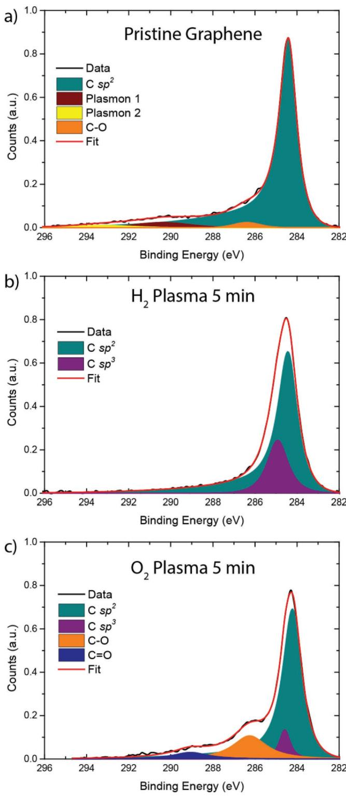  
Figure 2. Raman spectra obtained after different plasma treatments for a)  $\mathsf{H}_{2}$  plasma treatments ranging from 2 to 8 min and b)  $\Omega_2$  plasma treatments from 1 to 5 min. The Raman spectrum of pristine graphene is also added as reference. The Raman spectra are normalized to the highest peak (D band at  $1350cm^{-1}$  or 2D band at  $2690cm^{-1}$  and are vertically offset for clarity.

$\mathrm{O_2}$  plasma treatment predominantly functionalizes the graphene  $(\mathrm{D} / \mathrm{D}^{\prime}\approx 10)$  for plasma treatment times below  $3\mathrm{min}$  .Longer plasma treatments however result in the formation of defects in the graphene  $(\mathrm{D} / \mathrm{D}^{\prime}< 7)$  .Compared to the  $\mathrm{H}_{2}$  plasma, the peaks present in the Raman spectra for the  $\mathrm{O_2}$  plasma treatment also significantly broaden with increasing plasma treatment time. This is illustrated in Figure 3b, where the widths of the G- band  $(\approx 1600cm^{- 1})$  and 2D- band  $(\approx 2690cm^{- 1})$  are plotted as a function of the plasma treatment time. For  $\mathrm{H}_{2}$  plasma treatment, the G and 2D bands broaden by  $10~\mathrm{cm^{- 1}}$  after  $8\mathrm{min}$  of plasma exposure, while for an  $\mathrm{O_2}$  plasma treatment the G- band broadens by  $37~\mathrm{cm^{- 1}}$  and the 2D- band by  $70~\mathrm{cm^{- 1}}$  after  $5\mathrm{min}$  This broadening is most likely due to the amorphization of the graphene[38] as a result of the  $\mathrm{O_2}$  plasma treatment.

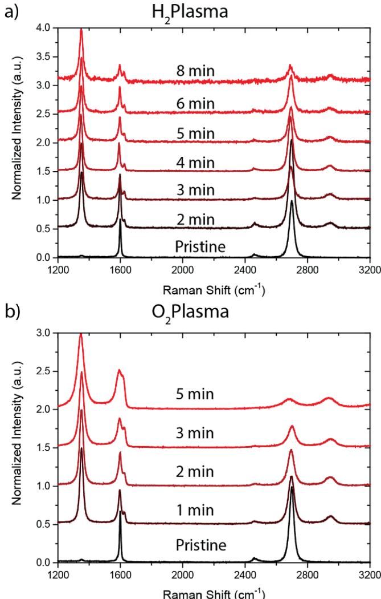  
Figure 1. XPS spectra of the core level C 1s of a) pristine graphene, b) graphene after 5 min of  $\mathsf{H}_{2}$  plasma treatment, and c) graphene after 5 min  $\Omega_2$  plasma treatment. Both plasma treatments were performed at a pressure of  $50~\mathrm{mTorr}$  and power of  $100W$

Summarizing, the  $\mathrm{H}_{2}$  plasma treatment results in the creation of  $\mathrm{C - H}$  groups on the graphene and leaves the structure of the graphene mostly intact, although some defects are created. The  $\mathrm{O_2}$  plasma treatment results in the formation of epoxide, hydroxide, and carbonyl groups. The formation of these groups significantly alters the graphene structure, evident by the amorphization of the graphene after 2 min of  $\mathrm{O_2}$  plasma exposure.

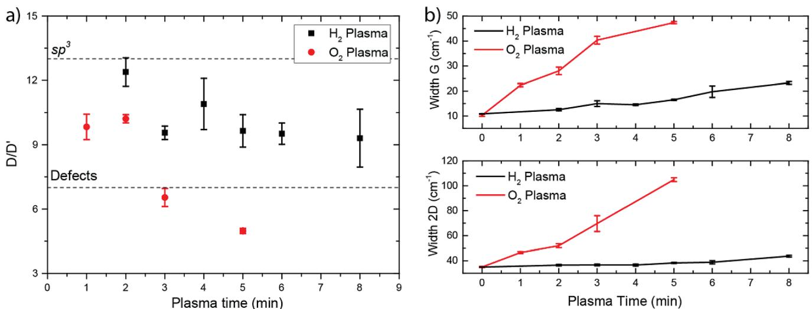  
Figure 3. a)  $\mathbb{D} / \mathbb{D}^{\prime}$  peak ratio of the graphene spectra for the different  $\mathsf{H}_{2}$  and  $\Omega_2$  plasma treatment times and b) broadening of the Raman G and 2D band as a function of the plasma treatment time, determined from the data in Figure 2.

# 2.2. Pt ALD on Pristine Graphene and Plasma Functionalized Graphene

For the fabrication of Pt- graphene contacts, uniform growth of Pt on graphene is required. Pt ALD on pristine graphene however generally leads to preferential Pt growth on wrinkles, grain boundaries, and defects, due to the lack of reactive surface sites and the hydrophobic nature of the graphene surface. This has been shown previously by Karasulu et al. and Kim et al.,[19,20] and is reiterated here for comparison (see Figure 4). Figure 4a shows the pristine graphene before ALD, imaged using scanning electron microscopy (SEM). The wrinkles and bilayer spots present in the graphene are indicated in the figure. After 500 cycles of Pt ALD (Figure 4b), no uniform growth of Pt is observed on the graphene. Instead Pt growth is observed only on wrinkles, grain boundaries, and defect sites while no growth occurs on the graphene basal plane, due to the lack of reactive surface sites. This confirms the results reported previously.[19,20]

The effect of  $\mathrm{H}_{2}$  and  $\mathrm{O}_{2}$  plasma treatments on the nucleation of Pt ALD is shown in Figure 5. The SEM images show an increase of the Pt coverage as a function of both the  $\mathrm{H}_{2}$  and  $\mathrm{O}_{2}$  plasma treatment time. The functional groups created by both the  $\mathrm{H}_{2}$  plasma and the  $\mathrm{O}_{2}$  plasma enhance the ALD precursor adsorption on graphene. Small Pt particles are present all over the graphene for a  $\mathrm{H}_{2}$  plasma treatment time of  $2\mathrm{min}$ . The nucleation density of the particles increases, combined with a decrease in the nucleation delay as a function of the plasma treatment time until a closed Pt layer is obtained for a plasma treatment time of  $5\mathrm{min}$ . The growth per cycle (GPC) of the individual particles is expected remain constant in saturation and with a preferential (111) crystal orientation.[42] The thickness of the Pt layer on graphene after closure was determined to be  $16\pm 2\mathrm{nm}$ , obtained by energy dispersive X- ray (EDX) spectroscopy analysis using Pt samples with a known thickness for calibration.[37] Increasing the plasma exposure resulted in a gradual increase of the thickness after 500 cycles of Pt ALD to  $19\pm 2\mathrm{nm}$  for the  $8\mathrm{min}$

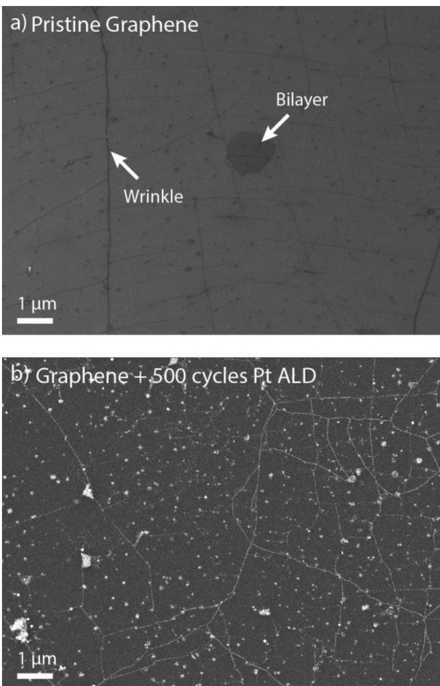  
Figure 4. a) SEM image of pristine graphene after transfer to  $\mathrm{SiO}_{2}$  and anneal at  $400^{\circ}\mathrm{C}$ . Wrinkles and bilayer graphene are visible in the image. b) SEM image of pristine graphene after 500 cycles of Pt ALD at  $300^{\circ}\mathrm{C}$ . Preferential Pt growth occurs on the graphene wrinkles, grain boundaries, and defects sites.

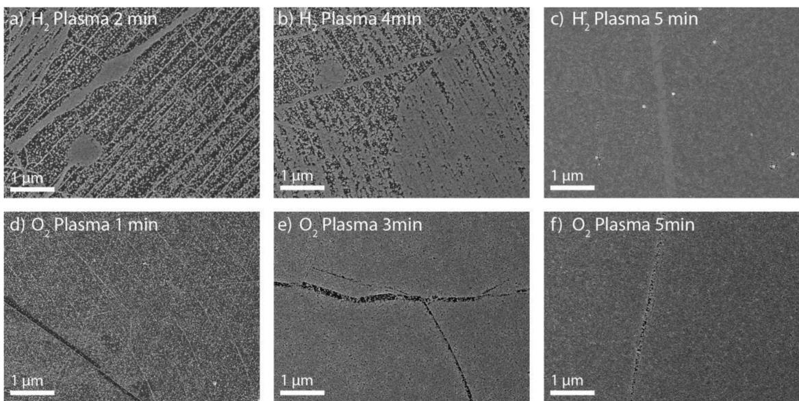  
Figure 5. SEM image of graphene exposed to different plasma treatments followed by 500 cycles of Pt ALD: a)  $\mathsf{H}_{2}$  plasma 2 min, b)  $\mathsf{H}_{2}$  Plasma 4 min, c)  $\mathsf{H}_{2}$  Plasma 5 min, d)  $\Omega_{2}$  plasma 1 min, e)  $\Omega_{2}$  plasma 3 min, and f)  $\Omega_{2}$  plasma 5 min. The Pt surface coverage increases as a function of the plasma exposure time for both  $\mathsf{H}_{2}$  and  $\Omega_{2}$  plasma treatments. d-f) Adapted with permission.[19] Copyright 2016, Royal Society of Chemistry.

$\mathrm{H}_{2}$  plasma exposure, indicating a reduction in the nucleation delay. The  $\Omega_{2}$  plasma treatments show a similar trend; for short plasma treatment times  $\mathrm{Pt}$  particles start to appear over the entire graphene surface and the  $\mathrm{Pt}$  coverage increases for longer plasma times.  $5\mathrm{min}$  of  $\Omega_{2}$  plasma treatment leads to an almost closed layer of  $\mathrm{Pt}$ . The thickness of the areas covered with  $\mathrm{Pt}$  is  $18\pm 2\mathrm{nm}$

The basal plane of the graphene is more quickly covered with  $\mathrm{Pt}$  when treated with an  $\Omega_{2}$  plasma  $(3\mathrm{min})$  compared to a  $\mathrm{H}_{2}$  plasma treatment. This could indicate a stronger adsorption of the  $\mathrm{Pt}$  precursor on the epoxide, hydroxide, and carbonyl groups created by the  $\Omega_{2}$  plasma compared to the  $\mathrm{C - H}$  groups created by the  $\mathrm{H}_{2}$  plasma treatment. The enhanced adsorption of ALD precursor molecules on  $\Omega_{2}$  plasma treated graphene compared to  $\mathrm{H}_{2}$  plasma treated graphene has also been observed experimentally for the adsorption of trimethylaluminum and was confirmed by density functional theory (DFT) calculations.[31] On the contrary, large wrinkles present in the graphene are more difficult to cover by using  $\Omega_{2}$  plasma functionalization compared to a  $\mathrm{H}_{2}$  plasma (the black lines present in Figure 5d- f). The reduced growth observed on the large wrinkles for the  $\Omega_{2}$  plasma treatment could indicate that it is more difficult for an  $\Omega_{2}$  plasma to create functional groups on or in these wrinkles. This could be caused by polymer residues (poly(methyl methacrylate), PMMA) remaining on the graphene after the graphene transfer process. The polymer residue remaining after the graphene transfer tends to gather at the wrinkles due to their enhanced reactivity.[43] The ALD of  $\mathrm{Pt}$  is blocked by this residue.[20,44] Therefore, depending on how quickly the plasma is able to remove or functionalize the residue, it can take longer for growth to occur on these wrinkles. The  $\mathrm{H}_{2}$  plasma is likely able to remove these residues and functionalize the graphene wrinkles more efficiently compared to an  $\Omega_{2}$  plasma.

# 2.3. Pt ALD Graphene Device Fabrication and the Influence of Functionalization on the Contact Resistance

CTLM structures were made to investigate whether the combination of plasma treatment and Pt ALD provides a good quality metal- graphene contact. The CTLM structures on graphene were created using area- selective ALD (AS- ALD) of platinum, using photosensitive polyimide.[37] The polyimide can be patterned using photolithography and acts as a blocking layer, preventing the adsorption of the  $\mathrm{MeCpPtMe}_3$  precursor in places where polyimide is present. This makes it possible to selectively deposit  $\mathrm{Pt}$  in the opened up regions. Compared to other polymers that can be used for the blocking of ALD growth polyimide has a relatively high temperature stability  $(>350^{\circ}C)$ . This prevents reflowing of the resist during the Pt ALD process (performed at  $300^{\circ}C$ ), allowing for better pattern definition and improved uniformity of the  $\mathrm{Pt}$  features.[37]

Figure 6a,c shows graphene patterned with CTLM structures. The diameter of the rings ranges between 5 and  $48\mu \mathrm{m}$ . To initialize ALD growth on graphene, the graphene was exposed to varying  $\mathrm{H}_{2}$  plasma treatments ranging from 5 to  $20\mathrm{min}$  and  $\Omega_{2}$  plasma treatments ranging from 5 to  $15\mathrm{min}$ . The plasma times chosen were extended compared to those shown in Figure 2. This is because the additional polyimide lithography step introduces additional polymer residues on the graphene, requiring a longer plasma exposure to obtain a similar degree of functionalization when compared to the Raman spectra in Figure 2. Without the additional polyimide lithography step, all graphene was removed after  $10\mathrm{min}$  of  $\mathrm{H}_{2}$  plasma exposure. After the additional polyimide lithography step, a plasma exposure of  $20\mathrm{min}$  is required to fully etch the graphene. This indicates that the plasma needs to etch through the polyimide residue before the graphene is functionalized. Figure S1 in the Supporting information shows the Raman spectra of the CTLM devices.

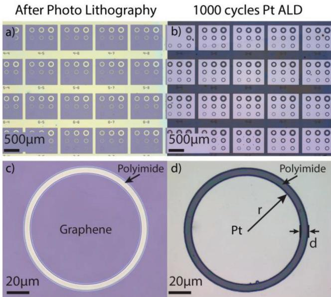  
Figure 6. Optical micrograph of a), c) graphene patterned with CTLM structures by photolithography using photosensitive polyimide as the resist and the same structures b), d) after  $5\min$  of  $\mathsf{H}_{2}$  plasma functionalization and 1000 cycles of Pt ALD. No Pt growth occurs on the polyimide allowing for the AS-ALD of Pt. The parameters of Equation (1) are indicated in d) as well.

As an example, the CTLM structures after  $5\min \mathrm{H}_{2}$  plasma functionalization and 1000 cycles of Pt ALD are shown in Figure 6b,d. No Pt growth is observed on the polyimide, while on the graphene a closed Pt layer of  $\approx 36\pm 3\mathrm{nm}$  thickness is obtained. The thicknesses obtained were comparable for all different plasma treatment times (see Figure S2 in the Supporting Information) indicating that the differences in nucleation delay due to the extended plasma treatment times are small. Furthermore, it should be noted that despite the long plasma treatment times, the Pt ALD process remains selective. This shows that  $\mathrm{H}_{2}$  and  $\mathrm{O_2}$  plasma are unable to etch or modify the polyimide surface to make it susceptible for ALD, as was previously concluded from spectroscopic ellipsometry and XPS data.[37] Less than a monolayer of Pt is deposited on the polyimide during the Pt ALD process.

As demonstrated in our earlier work, the catalytic activity of these trace amounts of Pt present on the polyimide after ALD make it possible to remove the polyimide by a  $\mathrm{H}_{2}$  plasma exposure.[37] However, to prevent possible damage to the graphene channel during the polyimide removal, the polyimide was not etched here.[45,46]

To determine the contact resistance, the resistance of the CTLM structures was measured in a vacuum probe station using a two- point probe configuration. The samples were annealed at  $200^{\circ}C$  for  $12\mathrm{h}$  before measuring to remove any adsorbed species from the ambient and to improve device reproducibility. The voltage was varied from  $- 10$  to  $10\mathrm{mV}$  while measuring the current. The measurements were performed at room temperature under vacuum  $(< 10^{- 4}$  mbar). By plotting the resistance determined from the two probe measurements as a function of the gap size  $d$  (channel length), the contact resistance can be determined from[47- 49]

$$
R_{\mathrm{tot}} = \frac{1}{2\pi}\bigg[R_{\mathrm{s}}L_{\mathrm{t}}\bigg(\frac{1}{r} +\frac{1}{r + d}\bigg) + R_{\mathrm{ss}}\ln \frac{r + d}{r}\bigg] \tag{1}
$$

where  $R_{s}$  is the sheet resistance of the graphene under the Pt contacts,  $L_{\mathrm{t}}$  is the transfer length,  $R_{ss}$  is the sheet resistance of the graphene in the channel, and  $r$  the inner radius of the circular contact. The contact resistance  $R_{c}$  is defined as

$$
R_{\mathrm{c}} = R_{\mathrm{s}}L_{\mathrm{t}} \tag{2}
$$

For  $r\gg d$  Equation (1) can be simplified to

$$
R_{\mathrm{tot}} = \frac{1}{2\pi r}\big(R_{\mathrm{ss}}d + 2R_{\mathrm{c}}\big)C \tag{3}
$$

where  $C$  is a correction factor[50]

$$
C = \frac{r}{d}\ln \left(\frac{r + d}{r}\right) \tag{4}
$$

The correction factor takes into account the difference between the CTLM and TLM methods and makes it possible to use a linear fit to extract the contact resistance. In the literature, it is often assumed that the sheet resistance of the graphene in the channel  $R_{ss}$  is equal to the sheet resistance of the graphene under the contacts  $R_{s}$ , which makes it possible to determine the transfer length and specific contact resistivity  $\rho_{c}$ $(R_{s}L_{t}^{2})$ .[49] However, because a plasma treatment is used to initialize the Pt ALD growth, the sheet resistance of the graphene under the contacts is considerably higher compared to the graphene channel. Therefore, this assumption does not hold for the work presented here.

Figure 7 shows an example of a fit of Equation (3) to data obtained from Pt- graphene contacts created using a  $7\mathrm{min}$

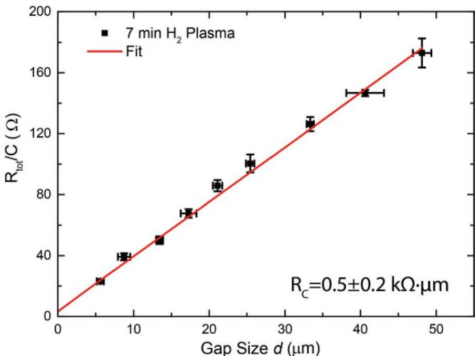  
Figure 7. Two-point probe resistance measurement of Pt ALD-graphene contacts, Pt ALD growth was initiated by a  $7\min \mathrm{H}_{2}$  plasma treatment. The resistance is averaged over six devices and divided by a correction factor  $C$ , which takes into account the increase in the contact area with increasing ring size. Fitting Equation (3), the contact resistance is determined to be  $0.5\pm 0.2\mathrm{k}\Omega$ .

$\mathrm{H}_{2}$  plasma exposure of graphene followed by Pt ALD. The resistance for each channel length was determined from an average of at least six different devices. From the intercept with the vertical axis, the contact resistance can be determined to be  $0.5 \pm 0.2 \mathrm{k}\Omega \mu \mathrm{m}$ , while the sheet resistance of the channel can be determined from the slope  $(1.01 \pm 0.02 \mathrm{k}\Omega \square^{- 1})$ . The fits for all other plasma treated samples can be found in the supporting information (Figures S3 and S4 in the Supporting Information for the  $\mathrm{H}_{2}$  and  $\mathrm{O}_{2}$  plasma treatments, respectively). For reference purposes, also a sample was fabricated using EBL and e- beam evaporated Pt (PVD reference devices, Figure S5 in the Supporting Information). In this case,  $35 \mathrm{nm} \mathrm{Pt}$  using a  $1 \mathrm{nm} \mathrm{Ti}$  adhesion layer served as the metal- graphene contact. Polyimide is not used to pattern the reference devices, because e- beam evaporation also results in the deposition of Pt on polyimide, requiring a lift- off step to prevent shorting the channel. The lift- off of polyimide however is not straightforward. Therefore, PMMA was used for the patterning of the reference devices instead. One reference sample was exposed to a  $5 \mathrm{min} \mathrm{H}_{2}$  plasma before  $\mathrm{Ti} / \mathrm{Pt}$  evaporation to investigate the effect of the  $\mathrm{H}_{2}$  plasma treatment on the contact resistance, and compare the difference between ALD and evaporated Pt- graphene contacts. An overview of the contact resistances and sheet resistances, determined as a function of the plasma treatment time, is displayed in Table 1. The development of the contact resistance as a function of the plasma treatment time is shown in Figure 8.

Figure 8 shows that the contact resistance can be decreased when metallization is preceded by an  $\mathrm{H}_{2}$  or  $\mathrm{O}_{2}$  plasma treatment on graphene, irrespective of whether ALD or e- beam evaporation is used for the deposition of Pt. The PVD devices that received a  $5 \mathrm{min} \mathrm{H}_{2}$  plasma treatment have a contact resistance about a factor of three lower compared to the reference PVD devices which received no plasma treatment  $(11.5 \pm 0.4 \mathrm{vs} 5.7 \pm 0.5 \mathrm{k}\Omega \mu \mathrm{m})$ . The improvement of the contact resistance is most likely due to the better Pt- graphene interaction as a result of the plasma treatment. The surface groups created by the plasma treatment enhance the transport of charge carriers from the metal to the graphene through an increase of the number of chemical bonds between the metal and the graphene.[33] Compared to the PVD deposited contacts, the ALD contacts show an even larger improvement. After a  $5 \mathrm{min} \mathrm{H}_{2}$  plasma, the contact resistance is reduced to  $0.9 \pm 0.2 \mathrm{k}\Omega \mu \mathrm{m}$ . The additional improvement observed for the ALD created contacts could be due to the improved wetting interaction of the deposited Pt with the underlying graphene or an improved Pt morphology due to the use of ALD.[5,18] Additionally, as opposed to Pt PVD, for the creation of the Pt ALD contacts, a Ti adhesion layer is no longer required. This could also have a positive effect on the metal- graphene interaction, due to the different work function and interaction strength of Ti compared to Pt.[8,9]

Table 1. The sheet resistance of the graphene channel  $(R_{ss})$  and contact resistance  $(R_{c})$  determined from the CTLM measurements of the  $\mathsf{Pt}$  graphene contacts. The different  $\mathsf{H}_{2}$  and  $\Omega_2$  plasma exposure times indicate the duration of the plasma used to initiate the Pt ALD growth. For comparison also, the contact resistance of the PVD reference devices and several literature values are also indicated.  

<table><tr><td>Plasma treatment time</td><td>Rss[ksΩ-1]</td><td>Rc[ksΩμm]</td></tr><tr><td>PVD reference</td><td>1.33 ± 0.03</td><td>11.5 ± 0.4</td></tr><tr><td>PVD H2plasma treatment</td><td></td><td></td></tr><tr><td>5 min</td><td>1.18 ± 0.05</td><td>3.7 ± 0.5</td></tr><tr><td>PVD O2plasma treatment</td><td></td><td></td></tr><tr><td>Au/graphene[33]</td><td>0.148</td><td>5.56</td></tr><tr><td>Pd/Cr/graphene[12]</td><td>-</td><td>1.10</td></tr><tr><td>ALD H2plasma treatment</td><td></td><td></td></tr><tr><td>5 min</td><td>0.83 ± 0.04</td><td>0.9 ± 0.2</td></tr><tr><td>7 min</td><td>1.00 ± 0.01</td><td>0.5 ± 0.2</td></tr><tr><td>10 min</td><td>0.76 ± 0.03</td><td>1.2 ± 0.2</td></tr><tr><td>15 min</td><td>1.10 ± 0.02</td><td>0.5 ± 0.1</td></tr><tr><td>20 min</td><td>1.11 ± 0.03</td><td>0.4 ± 0.2</td></tr><tr><td>ALD O2plasma treatment</td><td></td><td></td></tr><tr><td>5 min</td><td>0.70 ± 0.02</td><td>4.2 ± 0.2</td></tr><tr><td>10 min</td><td>0.96 ± 0.03</td><td>1.2 ± 0.1</td></tr><tr><td>15 min</td><td>1.01 ± 0.03</td><td>1.3 ± 0.2</td></tr></table>

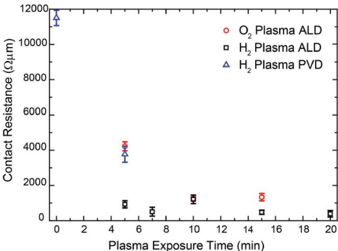  
Figure 8. Contact resistance determined from the CTLM measurements as a function of the  $\mathrm{H}_{2}$  or  $\mathrm{O}_{2}$  plasma treatment time. A comparison is made between the devices synthesized by AS-ALD and plasma functionalization and EBL and e-beam evaporation (PVD).

The lowest contact resistance  $(0.4 \pm 0.2 \mathrm{k}\Omega \mu \mathrm{m})$  is obtained after a  $\mathrm{H}_{2}$  plasma treatment of  $20 \mathrm{min}$ , where almost no graphene remains under the contacts. For an  $\mathrm{O}_{2}$  plasma treatment, the contact resistance also decreases as a function of the plasma treatment time from  $4.2 \pm 0.2 \mathrm{k}\Omega \mu \mathrm{m}$  for a  $5 \mathrm{min}$  pretreatment to  $1.3 \pm 0.2 \mathrm{k}\Omega \mu \mathrm{m}$  after  $15 \mathrm{min}$ . The improvement however is less than observed for a  $\mathrm{H}_{2}$  plasma treatment. The improved performance of the  $\mathrm{H}_{2}$  plasma functionalized Pt- graphene contacts compared to the  $\mathrm{O}_{2}$  functionalized Pt- graphene contacts could be related to the different surface groups being present at the interface of the Pt- graphene contacts, as observed by XPS (C- H vs C- O). Furthermore, as revealed by the Raman measurements, in Figure 3b, the  $\mathrm{O}_{2}$  plasma treatment causes amorphization of the graphene. The amorphization of graphene with increasing oxygen- containing functionalities has previously been related to the buckling of the graphene basal plane and oxygen- doping of the graphene lattice.[19,51] The graphene

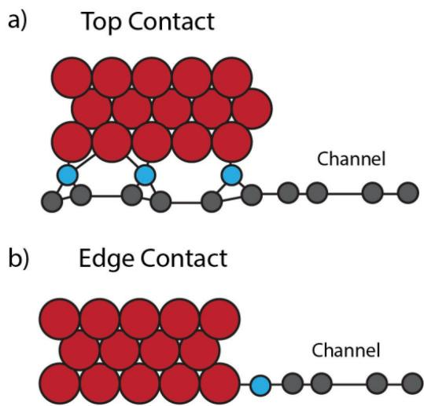  
Figure 9. Schematic representation of the contact formation. a) For short plasma treatment times, the graphene is likely still present under the contact and a top contact configuration is obtained. b) Longer plasma treatment times likely remove most of the graphene under the metal contact resulting in an edge type contact. The graphene (grey) is contacted to the platinum (red) via functional groups created by the plasma treatment (blue).

that remains under the contacts after a  $\mathrm{O}_2$  plasma treatment is therefore of lower quality compared to the graphene after a  $\mathrm{H}_{2}$  plasma treatment. Irrespective of the plasma treatment, however, the lowest contact resistance is obtained for the maximum plasma treatment time. A possible explanation could be the formation of an edge- like contact, where most of the graphene under the contacts is removed and only the edge of the channel is contacted. This is schematically illustrated in Figure 9.

To get a better understanding of the performance of our Pt- ALD graphene contacts, compared to the more standard evaporated metal- graphene contacts, we compared our work with refs. [12,32,33], which used similar device structures in combination with plasma treatments. Yue et al. fabricated  $\mathrm{Cr / Pd - }$  graphene contacts, with similar device dimensions as the ones reported here. The graphene under the contacts was exposed to an  $\mathrm{O}_2$  plasma treatment before contact formation.[12] Short plasma treatment times resulted in the formation of a functionalized top contact that showed a small improvement of the contact resistance. The use of a longer plasma treatment time on the other hand resulted in the formation of an edge- contact, where only the edge of the contact metal was in contact with the graphene. The edge- contact gave the lowest contact resistance  $(1.1\mathrm{k}\Omega \mu \mathrm{m})$ . This low contact resistance was attributed to the shorter binding distances, and improved orbital overlap of the electrons compared to the metal- graphene top contacts.[5,10,12] The contact resistance values reported by Yue et al. are comparable to the Pt- ALD contacts prepared by an  $\mathrm{O}_2$  plasma as reported here  $(1.2\mathrm{k}\Omega \mu \mathrm{m})$ . Although a direct comparison is hampered by the different contact metal being used, this indicates that ALD contacts of similar quality compared to evaporated contacts can be created using an  $\mathrm{O}_2$  plasma treatment. Our Pt- ALD contacts fabricated using  $\mathrm{H}_{2}$  plasma functionalization showed a lower contact resistance than reported  $(0.4\mathrm{k}\Omega \mu \mathrm{m})$  indicating that  $\mathrm{H}_{2}$  plasma functionalization might be a viable approach to further reduce the contact resistance of evaporated contacts as well.

The decreasing contact resistance as a function of the  $\mathrm{O}_2$  plasma treatment time, observed in Figure 8, is opposite to the trend observed by Foley et al. who used  $\mathrm{O}_2$  plasma functionalization in combination with evaporation to synthesize Au- graphene contacts, obtaining a minimum contact resistance of  $5.4\mathrm{k}\Omega \mu \mathrm{m}$ .[33] Since both Au and Pt interact only weakly with graphene, (both Au and Pt are expected to benefit from functional groups and defects present on the graphene surface),[34] a decrease of the contact resistance as a function of the  $\mathrm{O}_2$  plasma treatment time is expected for both metals. The observed increase in contact resistance as a function of the  $\mathrm{O}_2$  plasma treatment time for Au- graphene contacts could be explained by the fact that the Au- graphene contacts were not annealed after fabrication. Smith et al. have shown that annealing at  $350^{\circ}\mathrm{C}$  required to activate the functionalization and improve the contact resistance for evaporated metal- graphene contacts.[52] For Pt ALD fabricated contacts, an anneal is most likely not required since the temperature during the ALD process is  $300^{\circ}\mathrm{C}$ , which is likely sufficient to achieve an optimal metal- graphene contact. To confirm this, the samples functionalized with  $7\mathrm{min}\mathrm{H}_2$  plasma and  $5\mathrm{min}\mathrm{O}_2$  plasma were annealed at  $400^{\circ}\mathrm{C}$  in a  $5\% \mathrm{Ar / H}_2$  mixture for  $2\mathrm{h}$ . This did not change the contact resistance of the  $\mathrm{H}_2$  plasma treated sample  $(0.2\pm 0.5$  vs  $0.5\pm 0.2\mathrm{k}\Omega \mu \mathrm{m})$  and slightly increased it for the  $\mathrm{O}_2$  plasma  $(5.4\pm 0.7$  vs  $4.2\pm 0.2\mathrm{k}\Omega \mu \mathrm{m})$ . The increase in contact resistance could be due to the dewetting of Pt at  $400^{\circ}\mathrm{C}$ , which would also explain the larger measurement error after annealing.

# 2.4. Contact Resistance Dependency on the Functionalization of the Graphene Using Ab Initio Calculations

To better understand the effect of the  $\mathrm{H}_2$  and  $\mathrm{O}_2$  plasma functionalization on the contact resistance, ab initio DFT calculations were performed. The orbital- projected density of states (DOS) and band diagrams along the high- symmetry  $K$ - points (MTKM path) were computed using the model systems, as depicted in Figure 10 (insets). The resulting partial and total DOS and band diagrams of the free- standing and Pt- (top)- contacted pristine graphene (PG), graphene oxide (GO), and hydrogenated graphene (SSHG) are shown in Figures 10 and 11. Complete DOS and band structure plots of these systems are given in Figures S7- S11 in the Supporting Information, which cover different energy regions and/or also include the Pt contributions (these are excluded here for clarity, as the Pt- d orbital contributions overshadow others).

The DOS and band structure plots of PG (Figures 10a and 11a) show that the calculations reproduce the signature electronic features of graphene: specifically, the zero bandgap (i.e., vanishing DOS at the Fermi level,  $E_{\mathrm{f}}$ ) and the metallic character due to the topological singularities at the  $K$ - point (i.e., the Dirac cone of the touching valence and conductance bands). Moreover, the Fermi region  $(E_{\mathrm{f}}\pm 3\mathrm{eV})$  is dominated by the carbon-  $\mathrm{p}_z$  contributions, a result of the extended  $\pi$ - conjugation that contributes to the extraordinary in- plane electronic conductivity of graphene.

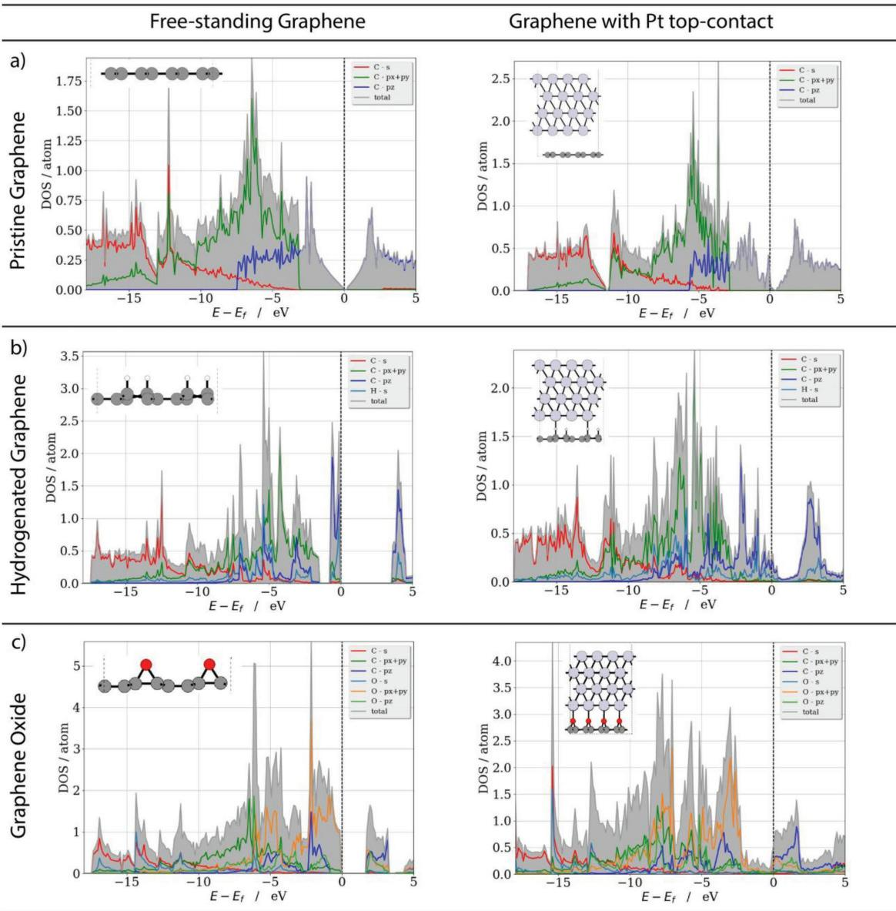  
Figure 10. DFT/vdW-DF2 level orbital-projected density of states (DOS) per atom of free-standing and Pt(111)-contacted a) pristine graphene (PG), b) graphene oxide (GO), and c) hydrogenated graphene (SSHG). The model systems used are depicted in the inset of each graph (Pt: light gray, C: dark gray, H: white, O: red). The Fermi level of each system is set to zero (dashed vertical line). Each of the DOS curves is averaged over all atoms contributing to the individual DOS plot (e.g., C, O, and/or H, see legends for actual compositions). The gray shaded areas show the sum of contributions from the individual atomic orbital types.

The placement of a Pt- contact on top of pristine graphene (Figure 11a) does not distort the properties of the PG. The zero- bandgap is maintained as well as the conical shape of the carbon bands around the K- point, following from the weak (physical) and long- range coupling between Pt and graphene.[7,53] The presence of the Pt contact, however, does result in a shift of the Dirac point above  $E_{\mathrm{f}}$  by about  $0.30\mathrm{eV}$ . This is in good agreement with previous DFT and micro- angle- resolved photoemission spectroscopy (ARPES) studies.[7,53] The upshift of the Dirac point can be attributed to the p- type doping of graphene, where  $\approx 0.07e$  (based on Bader charges) are transferred from the graphene to the Pt contact. A more evident observation of these features is provided by the unfolded band diagrams (Figure S8a in the Supporting Information). The findings highlight that, despite the good in- plane conductivity of PG, the conductivity between the Pt and PG is limited due to the weak Pt- graphene interaction and large coupling length. This is in agreement with the large contact resistance obtained for the evaporated Pt PVD reference sample (no  $\mathrm{H}_{2}$  treatment), shown in Figure 8.

The functionalization of graphene by hydrogen and oxygen (Figure 10b,c) significantly alters the electronic structure of graphene, indicated by the opening of a bandgap for both adsorbate types. At the surface coverage ratio used in the models  $(\mathrm{C:}[\mathrm{O / H}] = 4:1)$ , a direct bandgap is induced for both SHHG and GO. The bandgap is located at the  $\Gamma$ - point, amounting to 3.61 and  $1.69\mathrm{eV}$  for free- standing hydrogenated and oxygenated graphenes, respectively. The predicted bandgaps for SSGH and GO are in good agreement with previous reports.[71,72,54]

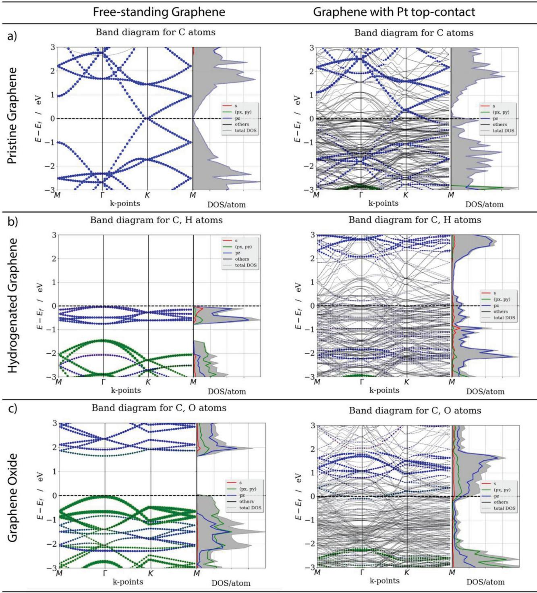  
Figure 11. DFT/vdW-DF2 level orbital-projected band structures along the M-Γ-K-M high-symmetry path of (left) free-standing and (right) Pt(111)-top-contacted a) pristine graphene (PG), b) graphene oxide (GO), and c) hydrogenated graphene (SSHG). The corresponding partial DOS per atom are also plotted. The energy levels (eV) are shifted by the Fermi energy  $(E_{\mathrm{f}}$  dashed horizontal lines) and only energies within  $3\mathrm{eV}$  of  $E_{\mathrm{f}}$  are depicted. The DOS and band diagrams are LM-decomposed to show individual orbital contributions from selected atom types. Specific orbital contributions are depicted by colored beads (s: red;  $\mathbb{P}_{\mathrm{xy}}$ : green;  $\mathbb{P}_{\mathrm{z}}$ : blue; others: gray). The size of the beads indicates the weight of corresponding Bloch eigenstate of a given orbital. For the Pt-contacted graphene samples, contributions from Pt atoms are given by pale solid lines (for clarity) and labeled as “others.” The model systems used for band diagrams can be found in the insets of Figure 10.

A comparison of the DOS plots of SSHG and GO with PG also reveals notable changes in the overall orbital composition and structure. In the case of isolated GO, the oxygen  $\mathrm{p_{xy}}$  orbitals dominate the energy levels encompassing the Fermi level  $(E_{\mathrm{f}}\pm 3\mathrm{eV})$  , suppressing the carbon  $\mathrm{p_{xy}}$  and, more importantly, the carbon  $\mathrm{p_z}$  contributions. In contrast to GO, the carbon

$\mathbb{P}_{\Xi}$  character is more pronounced in electronic structure of SSHG, like its PG counterpart. Yet, unlike PG, the carbon  $\mathbb{P}_{\mathrm{xy}}$  orbitals also play a key role in the DOS of SSHG in this energy regime, likely due to the  $\mathfrak{sp}^3$  hybridization of carbon atoms. Similarly, the band structure of SSHG in the Fermi region (Figure 11b) shows that the valence and conduction bands have more C  $\mathbb{P}_{\Xi}$  character than  $\mathrm{Cp_{xy}}$  The top of the valence band of GO on the other hand is mainly of  $\mathbb{P}_{\mathrm{xy}}$  character, contributed by both carbon and oxygen atoms (see Figure S8b in the Supporting Information for the atomic projections). The mitigated C  $\mathbb{P}_{\Xi}$  character (and resulting distorted  $\pi$  - conjugation) predicted in the Fermi region of isolated GO and SSHG is the likely reason for their reduced (in- plane) charge carrier mobilities compared to PG, a common feature for functionalized graphenes.[31,33]

Top/surface contacting of functionalized graphene (GO and SSHG) with Pt gives rise to a more prominent change in the electronic structure, as compared to contacting PG (Figure 10). The large bandgaps of the free- standing GO and SSHG both vanish when contacted with Pt, while at the same time the band features are distorted (Figure 11). From the DOS and band structures, one can determine that n- type doping is induced (i.e.,  $E_{\mathrm{f}}$  is upshifted) for both GO and SSHG upon contacting with Pt. This in contrast to the p- type doping observed for PG. Even though the Pt- d orbitals now dominate the Fermi region (Figure 11; Figure S9 in the Supporting Information), the overall composition of the main atomic orbital contributions from the graphene C and  $\mathrm{O / H}$  atoms remains qualitatively unaltered, when compared to their isolated graphene counterparts. In detail, GO has primarily a  $\mathbb{P}_{\mathrm{xy}}$  character (contributed mainly by  $\mathrm{O - p_{xy}}$  orbitals and by  $\mathrm{C - p_{xy}}$  orbitals) in the valence band, whereas the C and  $\mathrm{O}_{\mathrm{p_z}}$  orbitals dominate the conduction band. Besides, the C- Pt interactions are chemically shielded by the presence of oxygen. By contrast, SSHG displays an evenstronger  $\mathbb{P}_{\Xi}$  character (from the carbon atoms) when contacted with Pt, whereas its  $\mathbb{P}_{\mathrm{xy}}$  states are suppressed. The H- s orbitals have only a minor contribution to the DOS of SSHG, and a reduced shielding of the C- Pt interactions is expected, compared to GO. The unfolded band diagrams (Figure S11 in the Supporting Information) further confirm these predictions.

The substantial change in electronic properties of functionalized graphene points at the stronger bonded (covalent/ ionic) interactions of graphene with the Pt through the functional groups, unlike the PG case where the weaker nonbonded (vdW) interactions govern the transmission efficiencies. DFT/ local- density approximation (LDA) minimum structures reveal that bonded interactions enable shorter Pt- graphene coupling lengths for GO (with minimum  $\mathrm{O - Pt}$  distances of  $\approx 2.30\mathrm{\AA}$  and SSHG (H- Pt:  $1.86\mathrm{\AA}$  as compared to PG  $(C - \mathrm{Pt}\colon \approx 3.33\mathrm{\AA})$  .The less compact coupling of  $\mathrm{Pt - GO}$  than  $\mathrm{Pt - SSHG}$  can be attributed to the larger vdW radius of oxygen. Besides, Bader analysis of partial charges suggests that Pt contact donates a charge of  $\approx 0.50e$  to GO, whereas only a  $0.17e$  transfer is expected for SSHG. Larger charge transfer for GO hints at a stronger interaction of GO with Pt than SSHG and PG with Pt. This is further supported by the predicted  $\mathrm{GO} / \mathrm{Pt}$  binding energy of  $104\mathrm{meV}$  per atom, whereas that of SSHG is significantly weaker  $\Delta E_{\mathrm{b}} = 77 \mathrm{meV}$  per atom), but still stronger than that of PG  $\Delta E_{\mathrm{b}} = 35 \mathrm{meV}$  per atom). These findings suggest that the Pt wetting efficiency can be ordered as follows:  $\mathrm{GO} > \mathrm{SSHG} > \mathrm{PG}$

This is in line with the quicker  $\mathrm{Pt}$  film closure observed in Figure 5 for the  $\mathrm{O_2}$  plasma treated graphene compared to the  $\mathrm{H}_{2}$  treated and pristine graphene, respectively.

To analyze the effect of contact type (top/surface vs edge/ side, see Figure 9) on the nature of  $\mathrm{Pt}$  graphene interaction, two models comprising PG and SSHG edge- contacted to  $\mathrm{Pt}(111)$  were investigated (Figure S7 in the Supporting Information). GO was not analyzed because a prolonged  $\mathrm{O_2}$  plasma treatment (unlike  $\mathrm{H}_{2}$  renders the graphene amorphous before an edge- contact could be formed. The resulting partial DOS plots (Figure 12) reveal the major changes in charge carrier transport means for both PG and SSHG depending on the junction type. As already discussed, in a conventional top/surface contact the coupling of  $\mathrm{Pt}$  and pristine graphene is achieved through  $\mathrm{C - p_{z}}$  and  $\mathrm{Pt - d}$  orbitals and the coupling length is large due to stable  $\pi$  bonds. Likewise, out- of- plane  $\mathrm{C - p_{z}}$  Pt- d interactions are still the key factor for carrier transmittance in a SSHG- Pt top contact, with additional pathways introduced by the H- s Pt- s interactions. By contrast, for the high transmission efficiencies in edge- contacted junctions, the  $\mathrm{p}\pi$  and  $\mathrm{p}\sigma$  orbitals play an equivalently important role besides the shorter coupling lengths.[55] From Figure 12, it becomes evident that the  $\mathrm{C - p_{xy}}$  orbitals have the highest DOS contributions near  $E_{\mathrm{f}}$  for both edge- contacted PG and SSHG. These orbitals couple well with the  $\mathrm{Pt - p_{xy}}$  (alongside  $\mathrm{Pt - d}$  orbitals to enable in- plane conduction paths. Additionally, C- s and  $\mathrm{Pt - s}$  interactions arise due to the dangling bonds at the graphene edges. The  $\mathrm{H - s}$  orbitals in SSHG augment the  $\mathrm{p}\sigma$  interactions compared to PG, which could further increase the cohesive coupling between  $\mathrm{Pt}$  graphene and decrease the contact resistance.

The observations made above suggest that the Fermi region (valence and conduction bands) of SSHG is dominated by  $\mathrm{C - p_{z}}$  orbitals that are well aligned with  $\mathrm{Pt - d}$  orbitals. Therefore, the in- plane conduction pathways of charge carriers are still accessible for SSHG through extended  $\pi$  conjugation, even when top- contacted with Pt. By contrast, GO has a stronger interaction with the Pt contact mainly through the  $\mathrm{Pt - d}$  and  $\mathrm{O - p_{xy}}$  orbitals and to a smaller extent the  $\mathbb{P}_{\Xi}$  which activates the out- of- plane conduction modes rather than in- plane ones. This enhances the major carrier conduction along the dipole formed across the  $\mathrm{Pt - GO}$  junction, but limits the conduction along the channel. Since a high- quality metal- graphene contact requires both a good in- plane and out- of- plane conductivity SSHG would be a better choice for a top- contact configuration, as it provides a good balance between the two conduction modes. The improved contact resistances observed for  $\mathrm{H}_{2}$  plasma treated graphene compared to  $\mathrm{O_2}$  plasma treated graphene (Figure 8) agree well with this observation.

In case of an edge- type contact configuration, the contactchannel transmission/conduction pathways are governed by  $\pi$  bond  $\mathrm{C - p_{xy}}$  with  $\mathrm{Pt - p_{xy}}$  and  $\mathrm{Pt - d}$  orbitals) as well as  $\sigma$  - bond (C- s with  $\mathrm{Pt - s)}$  interactions. Besides, a good conduction along the graphene channel is provided by the intact  $\pi$  - conjugation system (formed by  $\mathrm{C - p_{z}}$  orbitals). The enhanced interactions at the edge- like  $\mathrm{Pt}/$  graphene interface, compared to a topcontact, increase the transmission efficiencies and decrease the contact resistances (in line with previous reports).[12,55] Besides, the SSHG is predicted to provide even stronger contact- channel interactions (thus lower contact resistances) than

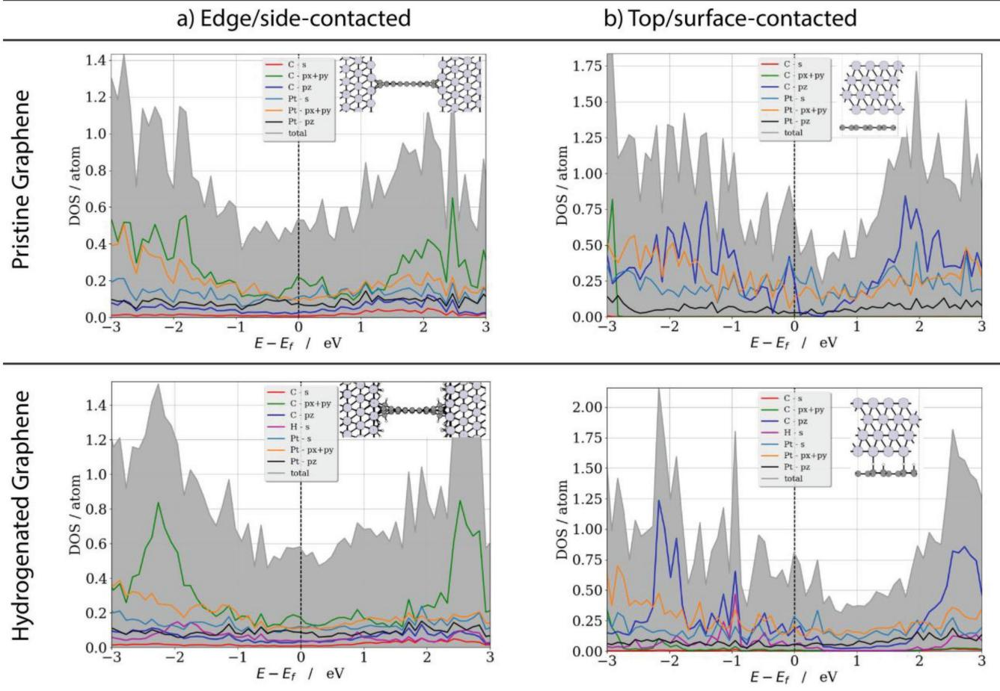  
Figure 12. GGA/vdW-DF2 level atom-projected DOS of PG and SSHG that are a) edge-contacted or b) top-contacted to Pt metal. Insets show the models used for the calculations. Contributions by atomic orbitals of C, H, and Pt are given by diverse colors. Pt–d orbital contributions are not shown for clarity. See Figure 8 caption for other details.

PG, due to the involvement of additional H–s and Pt–s orbital interactions. This is in agreement with the experimental observation in Figure 8 that the lowest contact resistance is obtained when almost all the graphene under the Pt contacts is removed and an edge- like contact is formed after a prolonged plasma exposure.

# 3. Conclusions

To conclude, Pt–graphene contacts were created by a combination of plasma functionalization and ALD. The  $\mathrm{O}_2$  and  $\mathrm{H}_2$  plasma functionalization of graphene served two purposes. First, the formation of functional groups on the graphene during plasma exposure created adsorption sites for the Pt ALD precursor molecules, allowing for uniform ALD of Pt on graphene. Additionally, the created functional groups improved the Pt–graphene interaction, which reduced the contact resistance between the Pt and the graphene.

The devices created using a  $\mathrm{H}_2$  plasma treatment performed considerably better (3× lower contact resistance) than the ones created using an  $\mathrm{O}_2$  plasma treatment. This points in the direction that  $\mathrm{C} - \mathrm{H}$  groups created by the  $\mathrm{H}_2$  plasma contribute to more efficient charge transfer pathways than the  $\mathrm{C} - \mathrm{O}$  groups created by the  $\mathrm{O}_2$  plasma. The improved performance of the  $\mathrm{H}_2$  plasma functionalized devices was expounded on by the DFT calculations, which indicated that the presence of hydrogen containing functionalities on graphene leaves the dominating  $\mathrm{C} - \mathrm{p}_2$  character (π- conjugation) of graphene largely intact. Compared to pristine graphene, the out- of- plane charge transfer improves through the additional Pt–H interactions alongside shorter coupling lengths. This brings about a good balance between the in- plane and out- of- plane conductivity for  $\mathrm{H}_2$  plasma treated graphene. The  $\mathrm{O}_2$  plasma treatment also improved the out- of- plane interactions due to additional Pt–O orbital interactions. However, the in- plane conduction along the channel is interrupted by the oxygen atoms, whose orbitals dominate the valence and conduction bands rather than those of carbon, leading to a good out- of- plane conduction but severely degrades the in- plane conduction. Additionally, the amorphization of graphene as a result of the  $\mathrm{O}_2$  plasma treatment could play an unfavorable role.

The best contact resistance (0.4 ± 0.2 and 1.2 ± 0.1 kΩ μm for the  $\mathrm{H}_2$  and  $\mathrm{O}_2$  plasma treatments, respectively) was obtained when almost all graphene under the contacts was removed and likely an edge- contact was created. Compared to reference devices created by EBL, evaporation, and plasma functionaliza

tion, the ALD created Pt- graphene contacts resulted in a lower contact resistance. The enhanced performance of the ALD created contacts was attributed to the absence of a Ti- adhesion layer, as was required for the reference devices.

The obtained results show that plasma functionalization in combination with ALD is a promising method for the creation of high- quality metal graphene contacts. The use of  $\mathrm{H}_{2}$  plasma treatments to reduce the contact resistance is of particular interest, as they can be readily integrated in contact fabrication processes that use other contact metals and/or contact deposition techniques.

# 4. Experimental Section

Graphene Growth: Large- area graphene was grown on Cu foil (Alfa Aesar 99.8, No 13382) by chemical vapor deposition. The Cu foil was cleaned before growth in acetone and methanol followed by a  $1.0\mathrm{M}$ $\mathrm{HNO_3}$  etch in  $30s$  to remove the surface oxide. After rinsing in DI water, the Cu foil was dried and loaded into a tube furnace. The graphene was grown by a two- step process. First, the Cu foil was heated to  $1050^{\circ}C$  and annealed in an  $\mathrm{Ar / H_2}$  flow  $(500 / 10\mathrm{scm})$  at a pressure of 0.4 Torr. After  $30\min$  the  $\mathsf{H}_{2}$  flow was reduced to 6 sccm, and 100 sccm  $\mathbb{C}\mathbb{H}_4$  was added to the gas flow, resulting in monolayer graphene coverage after  $20\min$  . The sample was cooled down to room temperature in  $15\min$  while leaving the gas flows on.

Graphene Transfer: Following growth, the graphene was transferred to  $90\mathrm{nm}\mathrm{SiO}_2 / \mathrm{Si}$  100) substrates using PMMA A4 950k (Micro Chem.) as a support layer. Ammonium persulfate  $((\mathrm{NH}_4)_2\mathrm{S}_2\mathrm{O}_80.1\mathrm{M})$  was used to etch the Cu. After transfer, the PMMA was removed using acetone followed by a final rinse in methanol. Finally, the samples were annealed at  $400^{\circ}C$  in an  $\mathrm{Ar / H_2}$  atmosphere for  $2h,$  to minimize any PMMA residue remaining on the graphene surface after PMMA lift- off.

Graphene Functionalization: Graphene functionalization was performed by  $\mathsf{H}_{2}$  and  $O_2$  plasma treatments in an Oxford Instruments FlexAL reactor using a  $100W_{i}$ $50mT_{0}r$  plasma at  $50^{\circ}C$  The base pressure of the system was  $< 1\times 10^{- 6}$  Torr. The creation of functional groups was monitored by a Renishaw Invia Raman microscope  $(514.5nm)$  and Thermo Scientific K- Alpha KA 1066 XPS.

Pt Atomic Layer Deposition: To investigate the effect of the functionalization on the Pt coverage after ALD, 500 cycles of Pt ALD were performed on the plasma treated graphene samples. As a reference also, a pristine graphene sample was added. The ALD process consisted of a  $\mathrm{MeCpPtMe}_3$  precursor close and an  $O_2$  reaction step, separated by pump steps, at a temperature of  $300^{\circ}C$  Additional details on the Pt ALD process can be found elsewhere.[37,56] After ALD, the Pt coverage on graphene was analyzed by a JEOL 7500 FA SEM.

Device Fabrication: To evaluate the properties of the Pt- graphene, contacts CTLM structures, consisting of rings with an inner diameter of  $100\mu \mathrm{m}$  and outer diameter ranging between 110 and  $200\mu \mathrm{m}$  were created by photolithography of photosensitive polyimide. Polyimide acts as a blocking layer during Pt ALD, preventing  $\mathrm{MeCpPtMe}_3$  precursor adsorption where polyimide is present. This makes it possible to selectively deposit the Pt on graphene. Further details on the polyimide lithography process can be found elsewhere.[37] For the created CTLM structures,  $\mathsf{H}_{2}$  and  $O_2$  plasma treatments were performed after polyimide lithography, to prevent damage to the graphene channel. No Pt deposition occurred on the polyimide when it was treated with a plasma, indicating that the selectivity of the Pt ALD process was not affected. After plasma functionalization, 1000 cycles of Pt ALD were performed at  $300^{\circ}C$  This resulted in a Pt thickness of  $\approx 36$  nm on the plasma treated at graphene. The thickness was determined by EDX spectroscopy with an EDAX UMSII EDX spectrometer. More details on the AS- ALD process can be found elsewhere.[37]

Reference CTLM structures were created by EBL using PMMA as the resist material. The patterning was done in a Raith EBPG5150 system, with a  $100kV$  e- beam and a beam current of  $100nA$  The required patterning dose ranged between 750 and  $900\mu \mathrm{Ccm}^{- 2}$  depending on the pattern dimensions. For some samples,  $\mathsf{H}_{2}$  plasma treatments were performed after the EBL patterning to functionalize the graphene. For the contacts,  $35~\mathsf{nm}$  of Pt was evaporated by a Temescal FC2000 e- beam evaporator, to prevent contact delamination a 1 nm Ti adhesion layer was used.

Device Characterization: The CTLM structures were analyzed using a Joris micromanipulated vacuum probe station with a Keithley 4200- SCS parameter analyzer. The samples were annealed overnight at  $475k$  in vacuum  $(\approx 10^{- 4}$  mbar) to reduce the ambient doping of the graphene and improve measurement reproducibility. Measurements were carried out in a two- probe configuration at room temperature under vacuum, a minimum of 6 devices (for 9 different channel lengths) were measured per sample.

Computational Methods: The orbital- projected DOS and band diagrams of PG, GO, and SSHG with and without Pt contacts were determined by DFT. The DFT calculations were performed using the projector augmented wavefunction[57,58] method as implemented in Vienna Ab Initio Simulation Package (VASP v.5.4.1).[59- 62] LDA[61] was utilized in view of its capability to predict the graphene electronic and structural properties on different substrates.[7,63,64] To account for the dispersion effects (e.g., van der Waals interactions), the van der Waals density functional (vdW- DF2)[65,66] was used in combination with the generalized gradient approximation (GGA).[67,68] The vdW- DF2 is expected to give a better description of the dispersion effects by considering nonlocal additions to the exchange correlation functional. In view of the detailed comparison of two functionals (see Section 2 in the Supporting Information), LDA was used for structures and vdW- DF2 for DOS and band diagrams. DFT with different functionals was commonly employed for probing the electronic and structural properties of pristine and functionalized graphene, either isolated or on a metal substrate.[69- 75]

The electronic DOS and band diagrams of graphene analogues were predicted using a collection of periodic models consisting of PG, GO with a linear epoxy- group decoration and SSHG with a honeycomb decoration model (see Figure S7 in the Supporting Information). In addition to the free- standing (isolated) graphene derivatives, their interfaces to the top/surface or side/edge Pt- metal contacts were also considered for the DFT calculations. For stimulating the contacts, two Pt models, namely 4- layer Pt(111) and Pt(220)- rocksalt- like, were employed alongside the graphene models. However, only the Pt(111) results are included here for brevity (see Section 2 in the Supporting Information for a detailed discussion). To augment the understanding of the complex band structures of the graphene- Pt junctions/contacts, the BandUP method by Medeiros et al. was used. This approach unfolds the bands of a given supercell onto one of its available primitive cells.[69,70] The Bader charge partition scheme[76] was employed for estimating the charge transfer from the graphene to Pt. A dipole correction scheme was also considered, as implemented in VASP[77] along with the spin- polarization formalism. Further computational details and a discussion on the selection of the model systems can be found in Section 2 in the Supporting Information.

# Supporting Information

Supporting Information is available online from the Wiley Online Library or from the author.

# Acknowledgements

The authors would like to thank C. O. van Bommel, C. A. A. van Helvoirt, J. J. L. M. Meulendijks and J. J. A. Zeebregts for technical assistance. Dr. P. V. C. Medeiros and Dr. J. R. Nelson are acknowledged for their fruitful discussions on the electronic structure calculations. This work

is part of the research program of the Foundation for Fundamental Research on Matter (FOM, Grant No. FOM12PR3101), which is part of the Netherlands Organization for Scientific Research (NWO). The manuscript was written through contributions of all authors. All authors have given approval to the final version of the manuscript.

# Conflict of Interest

The authors declare no conflict of interest.

# Keywords

atomic layer deposition, devices, graphene, Pt

Received: February 15, 2018  Revised: March 20, 2018  Published online: May 2, 2018

[1] F. Schwierz, Nat. Nanotechnol. 2010, 5, 487.  [2] Y. Wu, K. A. Jenkins, A. Valdes- Garcia, D. B. Farmer, Y. Zhu, A. A. Bol, C. Dimitrakopoulos, W. Zhu, F. Xia, P. Avouris, Y.- M. Lin, Nano Lett. 2012, 12, 3062.  [3] F. Xia, T. Mueller, Y. Lin, A. Valdes- Garcia, P. Avouris, Nat. Nanotechnol. 2009, 4, 839.  [4] K. Nagashio, T. Nishimura, K. Rita, A. Toriumi, in 2009 IEEE Int. Electron Devices Meet., IEEE, Piscataway, New Jersey, US 2009, pp. 1- 4.  [5] F. Xia, V. Perebeinos, Y. Lin, Y. Wu, P. Avouris, Nat. Nanotechnol. 2011, 6, 179.  [6] T. Moriyama, K. Nagashio, T. Nishimura, A. Toriumi, J. Appl. Phys. 2013, 114, 24503.  [7] G. Giovannetti, P. A. Khomyakov, G. Brocks, V. M. Karpan, J. van den Brink, P. J. Kelly, Phys. Rev. Lett. 2008, 101, 26803.  [8] P. A. Khomyakov, G. Giovannetti, P. C. Rusu, G. Brocks, J. van den Brink, P. J. Kelly, Phys. Rev. B 2009, 79, 195425.  [9] F. A. Chaves, D. Jimenez, A. W. Cummings, S. Roche, J. Appl. Phys. 2014, 115, 164513.  [10] L. Wang, I. Meric, P. Y. Huang, Q. Gao, Y. Gao, H. Tran, T. Taniguchi, K. Watanabe, L. M. Campos, D. A. Muller, J. Guo, P. Kim, J. Hone, K. L. Shepard, C. R. Dean, Science 2013, 342, 614.  [11] T. Chu, Z. Chen, ACS Nano 2014, 8, 3584.  [12] D. W. Yue, C. H. Ra, X. C. Liu, D. Y. Lee, W. J. Yoo, Nanoscale 2015, 7, 825.  [13] R. Ifuku, K. Nagashio, T. Nishimura, A. Toriumi, Appl. Phys. Lett. 2013, 103, 33514.  [14] A. Nath, A. D. Koehler, G. G. Jernigan, V. D. Wheeler, J. K. Hite, S. C. Hernandez, Z. R. Robinson, N. Y. Garces, R. L. Myers- Ward, C. R. Eddy, D. K. Gaskill, M. V. Rao, Appl. Phys. Lett. 2014, 104, 224102.  [15] C. A. Chavarin, A. A. Sagade, D. Neumaier, G. Bacher, W. Mertin, Appl. Phys. A 2016, 122, 58.  [16] S. M. Song, B. J. Cho, Carbon Lett. 2013, 14, 162.  [17] N. F. W. Thissen, R. H. J. Vervuurt, A. J. M. Mackus, J. L. Mulders, J.- W. Weber, W. M. M. Kessels, A. A. Bol, 2D Mater. 2017, 4, 25046.  [18] A. J. M. Mackus, N. F. W. Thissen, J. J. L. Mulders, P. H. F. Trompenaars, Z. Chen, W. M. M. Kessels, A. A. Bol, Appl. Phys. Lett. 2017, 110, 13101.  [19] B. Karasulu, R. H. J. Vervuurt, W. M. M. Kessels, A. A. Bol, Nanoscale 2016, 8, 19829.  [20] K. Kim, H.- B.- R. Lee, R. W. Johnson, J. T. Tanskanen, N. Liu, M.- G. Kim, C. Pang, C. Ann, S. F. Bent, Z. Bao, Nat. Commun. 2014, 5, 4781.

[21] X. Wang, S. M. Tabakman, H. Dai, J. Am. Chem. Soc. 2008, 130, 8152.  [22] K. S. Park, S. Kim, H. Kim, D. Kwon, Y.- E. Koo Lee, S.- W. Min, S. Im, H. J. Choi, S. Lim, H. Shin, S. M. Koo, M. M. Sung, Nanoscale 2015, 7, 17702.  [23] N. Y. Garces, V. D. Wheeler, D. K. Caskill, J. Vac. Sci. Technol., B: Microelectron. Nanometer Struct.- Process., Meas., Phenom. 2012, 30, 30801.  [24] C. Marichy, N. Pinna, Coord. Chem. Rev. 2013, 257, 3232.  [25] J. Kim, S. Jandhyala, Thin Solid Films 2013, 546, 85.  [26] R. H. J. Vervuurt, W. M. M. E. Kessels, A. A. Bol, Adv. Mater. Interfaces 2017, 1700232, 1700232.  [27] B. Lee, G. Mordi, M. J. Kim, Y. J. Chabal, E. M. Vogel, R. M. Wallace, K. J. Cho, L. Colombo, J. Kim, Appl. Phys. Lett. 2010, 97, 43107.  [28] S. Jandhyala, G. Mordi, B. Lee, G. Lee, C. Floresca, P.- R. Cha, J. Ahn, R. M. Wallace, Y. J. Chabal, M. J. Kim, L. Colombo, K. Cho, J. Kim, ACS Nano 2012, 6, 2722.  [29] O. M. Nayfeh, T. Marr, M. Dubey, IEEE Electron Device Lett. 2011, 32, 473.  [30] T. Lim, D. Kim, S. Ju, Appl. Phys. Lett. 2013, 103, 13107.  [31] R. H. J. Vervuurt, B. Karasulu, M. A. Verheijen, W. (Erwin) M. M. Kessels, A. A. Bol, Chem. Mater. 2017, 29, 2090.  [32] J. A. Robinson, M. LaBella, M. Zhu, M. Hollander, R. Kasarda, Z. Hughes, K. Trumbull, R. Cavalero, D. Snyder, Appl. Phys. Lett. 2011, 98, 53103.  [33] B. M. Foley, S. C. Hernandez, J. C. Duda, J. T. Robinson, S. G. Walton, P. E. Hopkins, Nano Lett. 2015, 15, 4876.  [34] B. Ma, C. Gong, Y. Wen, R. Chen, K. Chen, B. Shan, J. Appl. Phys. 2014, 115, 183708.  [35] N. Cheng, S. Stambula, D. Wang, M. N. Banis, J. Liu, A. Riese, B. Xiao, R. Li, T.- K. Sham, L.- M. Liu, G. A. Botton, X. Sun, Nat. Commun. 2016, 7, 13638.  [36] A. B. Soliman, M. H. Hassan, T. N. Huan, A. A. Abugable, W. A. Elmehalmey, S. G. Karakalos, M. Tsotsalas, M. Heinle, M. Elbahri, M. Fontecave, M. H. Alkordi, ACS Catal. 2017, 7, 7847.  [37] R. H. J. Vervuurt, A. Sharma, Y. Jiao, W. (Erwin) M. M. Kessels, A. A. Bol, Nanotechnology 2016, 27, 405302.  [38] J. Schwan, S. Ulrich, V. Batori, H. Ehrhardt, S. R. P. Silva, J. Appl. Phys. 1996, 80, 440.  [39] A. C. Ferrari, D. M. Basko, Nat. Nanotechnol. 2013, 8, 235.  [40] A. Eckmann, A. Felten, A. Mishchenko, L. Britnell, R. Krupke, K. S. Novoselov, C. Casiraghi, Nano Lett. 2012, 12, 3925.  [41] Y.- C. Lin, C.- C. Lu, C.- H. Yeh, C. Jin, K. Suenaga, P.- W. Chiu, Nano Lett. 2012, 12, 414.  [42] S. M. Geyer, R. Methaapanon, R. Johnson, S. Brennan, M. F. Toney, B. Clemens, S. Bent, J. Appl. Phys. 2014, 116, 064905.  [43] W. Zhu, T. Low, V. Perebeinos, A. a Bol, Y. Zhu, H. Yan, J. Tersoff, P. Avouris, Nano Lett. 2012, 12, 3431.  [44] E. Färm, M. Kemell, M. Ritala, M. Lekslă, J. Phys. Chem. C 2008, 112, 15791.  [45] D. C. Elias, R. R. Nair, T. M. G. Mohiuddin, S. V. Morozov, P. Blake, M. P. Halsall, A. C. Ferrari, D. W. Boukhuzlev, M. I. Katonselom, A. K. Geim, K. S. Novoselov, Science 2009, 323, 610.  [46] Z. Luo, T. Yu, K. Kim, Z. Ni, Y. You, S. Lim, Z. Shen, S. Wang, J. Lin, ACS Nano 2009, 3, 1781.  [47] G. K. Reeves, Solid. State Electron. 1980, 23, 487.  [48] G. S. Marlow, M. B. Das, Solid. State Electron. 1982, 25, 91.  [49] M. Ahmad, B. M. Arora, Solid. State Electron. 1992, 35, 1441.  [50] J. H. Klootwijk, C. E. Timmering, in Proc. 2004 Int. Conf. Microelectron. Test Struct. (IEEE Cat. No.04CH37516), IEEE, 2004, pp. 247- 252.  [51] J.- L. Li, K. N. Kudin, M. J. McAllister, R. K. Prud'homme, I. a. Aksay, R. Car, Phys. Rev. Lett. 2006, 96, 176101.  [52] J. T. Smith, A. D. Franklin, D. B. Farmer, C. D. Dimitrakopoulos, ACS Nano 2013, 7, 3661.

[53] P. Sutter, J. T. Sadowski, E. Sutter, Phys. Rev. B: Condens. Matter Mater. Phys. 2009, 80, 1. [54] D. Haberer, C. E. Giusca, Y. Wang, H. Sachdev, A. V. Fedorov, M. Farjam, S. A. Jafari, D. V. Vyalikh, D. Usachov, X. Liu, U. Treske, M. Grobosch, O. Vilkov, V. K. Adamchuk, S. Irle, S. R. P. Silva, M. Knupfer, B. Buchner, A. Gruneis, Adv. Mater. 2011, 23, 4497. [55] Y. Matsuda, W.- Q. Deng, W. A. Goddard, J. Phys. Chem. C 2010, 114, 17845. [56] H. C. M. Knoops, A. J. M. Mackus, M. E. Donders, M. C. M. van de Sanden, P. H. L. Notten, W. M. M. Kessels, Electrochem. Solid- State Lett. 2009, 12, G34. [57] P. E. Bloch, Phys. Rev. B 1994, 50, 17953. [58] G. Kresse, D. Joubert, Phys. Rev. B 1999, 59, 1758. [59] G. Kresse, J. Hafner, Phys. Rev. B 1993, 47, 558. [60] G. Kresse, J. Hafner, Phys. Rev. B 1994, 49, 14251. [61] G. Kresse, J. Furthmüller, Comput. Mater. Sci. 1996, 6, 15. [62] G. Kresse, J. Furthmüller, Phys. Rev. B 1996, 54, 11169. [63] M. Vanin, J. J. Mortensen, A. K. Kelkkanen, J. M. Garcia- Lastra, K. S. Thygesen, K. W. Jacobsen, Phys. Rev. B 2010, 81, 81408. [64] E. Mostaani, N. D. Drummond, V. I. Fal'Ko, Phys. Rev. Lett. 2015, 115, 1.

[65] J. Klimes, D. R. Bowler, A. Michaelides, J. Phys. Condens. Matter 2010, 22, 22201. [66] K. Lee, E. D. Murray, L. Kong, B. H. Lundqvist, D. C. Langreth, Phys. Rev. B: Condens. Matter Mater. Phys. 2010, 82, 3. [67] P. Hohenberg, W. Kohn, Phys. Rev. 1964, 136, B864. [68] W. Kohn, L. J. Sham, Phys. Rev. 1965, 140, A1133. [69] P. V. C. Medeiros, S. S. Tsirkin, S. Stafstrom, J. Bjork, Phys. Rev. B: Condens. Matter Mater. Phys. 2015, 91, 1. [70] P. V. C. Medeiros, S. Stafstrom, J. Bjork, Phys. Rev. B: Condens. Matter Mater. Phys. 2014, 89, 041407. [71] A. Nourbakhsh, M. Cantoro, A. V. Klekachev, G. Pourtois, T. Vosch, J. Hofkens, M. H. van der Veen, M. M. Heyns, S. De Gendt, B. F. Sels, J. Phys. Chem. C 2011, 115, 16619. [72] A. Nourbakhsh, M. Cantoro, T. Vosch, G. Pourtois, F. Clemente, M. H. van der Veen, J. Hofkens, M. M. Heyns, S. De Gendt, B. F. Sels, Nanotechnology 2010, 21, 435203. [73] Q. Wang, R. Pang, X. Shi, J. Phys. Chem. C 2015, 119, 22534. [74] K.- A. Min, S. Hong, Curr. Appl. Phys. 2015, 15, S103. [75] H. Gao, L. Wang, J. Zhao, F. Ding, J. Lu, J. Phys. Chem. C 2011, 115, 3236. [76] W. Tang, E. Sanville, G. Henkelman, J. Phys. Condens. Matter 2009, 21, 84204. [77] J. Neugebauer, M. Scheffler, Phys. Rev. B 1992, 46, 16067.