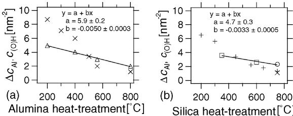
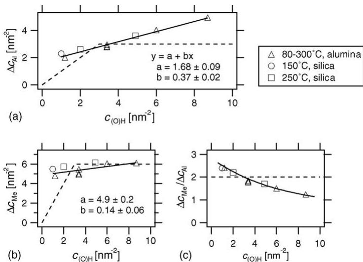
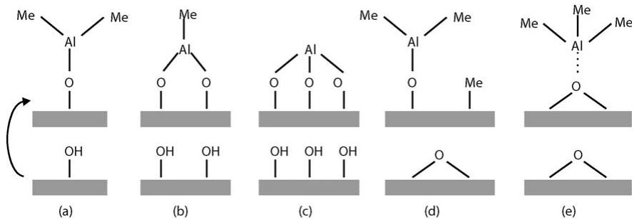

# Short communication

# Correlation between the growth-per-cycle and the surface hydroxyl group concentration in the atomic layer deposition of aluminum oxide from trimethylaluminum and water

Riikka L. Puurunen $^{a,b,*}$

$^{a}$ Interuniversity Microelectronics Center (IMEC), Kapeldreef 75, B- 3001 Leuven, Belgium  $^{b}$ University of Leuven (K.U.Leuven), INSYS, Kasteelpark Arenberg, B- 3001 Leuven, Belgium

Received 1 October 2004; accepted 2 October 2004 Available online 21 November 2004

# Abstract

The growth- per- cycle (GPC) in the trimethylaluminum/water atomic layer deposition (ALD) process is shown to be quantitatively correlated with the surface OH group concentration before the trimethylaluminum reaction. The correlation corresponds to a reaction chemistry, where several types of gas- solid reactions (ligand exchange, dissociation/association) can occur simultaneously, and where steric hindrance by adsorbed methyl groups terminates the trimethylaluminum reaction. The commonly assumed reaction chemistry where one OH group bonds one aluminum atom through ligand exchange does not describe satisfactorily the trimethylaluminum/water process, and should perhaps not be expected to describe other ALD processes either.

$(\widehat{\mathbf{C}})$  2004 Elsevier B.V. All rights reserved.

PACS:81.15. Aa;81.15. Gh;82.33. Ya

Keywords: Atomic layer deposition; Mechanism; Aluminum oxide; High-  $\kappa$  dielectrics

Conformal layers of inorganic materials with thickness down to the nanometer range can be grown by atomic layer deposition (ALD), a technique developed in the 1960s [1,2] that relies on sequential self- terminating gas- solid reactions [1- 5]. Several ALD- grown oxide materials, such as  $\mathrm{Al}_2\mathrm{O}_3$ ,  $\mathrm{ZrO}_2$  and

$\mathrm{HfO}_2$ , find applications in catalysis, electroluminescent displays and microelectronics [3- 5].

Oxide  $(\mathrm{MO}_{n / 2})$  ALD processes often consist of repeating cycles of two reactions: the reaction of a metal- ligand compound  $(\mathrm{ML}_n)$  and the reaction of water  $(\mathrm{H}_2\mathrm{O})$ , denoted here  $\mathrm{ML}_n / \mathrm{H}_2\mathrm{O}$  ALD processes. Typically,  $\mathrm{ML}_n$  is assumed to react through "ligand exchange" with one or more (y) surface hydroxyl (OH) groups, releasing  $\mathrm{HL}$  as a gaseous reaction product, and attaching a  $\mathrm{ML}_{n - y}$  species to the surface

symbol  $||$  denotes the surface and  $(\mathrm{g})$  denotes the gas phase) [3- 5]:

$$
\begin{array}{rl} & {y|| - \mathrm{OH} + \mathrm{ML}_n(\mathrm{g})\rightarrow (|| - \mathrm{O} - )_y\mathrm{ML}_{n - y}}\\ & {\quad +y\mathrm{HL}(\mathrm{g})} \end{array} \tag{1}
$$

Water reacts with the adsorbed ligands, replacing them with OH groups and releasing more HL:

$$
\left|\left| - \mathrm{L} + \mathrm{H}_2\mathrm{O}(\mathrm{g})\right.\right|\left| - \mathrm{OH} + \mathrm{HL}(\mathrm{g})\right| \tag{2}
$$

These OH groups react again with the  $\mathrm{ML}_n$  molecule in the next reaction cycle. According to this scheme, OH groups mediate the ALD growth of oxide materials.

The growth- per- cycle (GPC) [6- 11] in the  $\mathrm{ML}_n / \mathrm{H}_2\mathrm{O}$  ALD processes typically decreases with increasing ALD processing temperature [12- 15]. The decrease in GPC is often explained [13- 15] by dehydroxylation, a process where two OH groups combine to form an oxygen bridge and release water, thereby decreasing the surface OH group concentration [16,17]:

$$
\left|\left| - \mathrm{OH} + \right|\left| - \mathrm{OH}\rightarrow \right|\left| - \mathrm{O} - \right|\right| + \mathrm{H}_2\mathrm{O}(\mathrm{g}) \tag{3}
$$

A quantitative description of the effect of surface OH groups on the surface chemistry and GPC has been lacking, however.

The trimethylaluminum/water  $\mathrm{(AlMe_3 / H_2O)}$  ALD process is known as an almost ideal ALD process: it results in a high GPC  $30 - 40\%$  of a monolayer); it coats surfaces of complex shape with a uniform layer of  $\mathrm{Al}_2\mathrm{O}_3$  and the gaseous reaction product, methane, is inert and does not interfere with the growth [15,18]. This work investigates published quantitative data [15,19- 22] and looks for a correlation between the surface OH group concentration and the surface chemistry in the  $\mathrm{AlMe}_3 / \mathrm{H}_2\mathrm{O}$  ALD process. A linear correlation is found, according to which deposition occurs also on oxide surfaces with no OH groups. The physical significance of the correlation is discussed in terms of the experimental [13,15,19- 21,23- 25] and theoretical [15,26] understanding of the surface chemistry.

The  $\mathrm{AlMe}_3$  reaction has been investigated in detail on high- surface- area alumina and silica substrates. The reaction temperature has been varied [21], because it may affect the reaction mechanisms in ALD [27]. By varying the heat- treatment temperature, in turn, the type and number of bonding sites on the surface, most particularly of the OH groups, have been controlled [19- 22]. The amounts of OH groups, Al atoms and C atoms [with C in methyl  $\mathrm{CH}_3$  Me groups] have been measured as weight percentages by chemical means, which have then been converted to numbers per unit surface area using the specific surface area of the substrate [19- 22]. On alumina substrates, where the amount of added Al atoms is difficult to measure, the amount of Al atoms adsorbed per cycle  $\Delta c_{\mathrm{Al}}[\mathrm{nm}^{- 2}]$  has been calculated from the mass balance [8,21]:

$$
\Delta c_{\mathrm{Al}} = \frac{1}{3} (\Delta c_{\mathrm{Me}} + c_{(\mathrm{O})\mathrm{H}}), \tag{4}
$$

where  $\Delta c_{\mathrm{Me}}[\mathrm{nm}^{- 2}]$  is the surface concentration of Me groups adsorbed in the  $\mathrm{AlMe}_3$  reaction and  $c_{(\mathrm{O})\mathrm{H}}[\mathrm{nm}^{- 2}]$  is the surface concentration of OH groups before the  $\mathrm{AlMe}_3$  reaction [28].

The amount of aluminum adsorbed  $\Delta c_{\mathrm{Al}}$  in the reaction of  $\mathrm{AlMe}_3$  with high- surface area alumina is insensitive to the reaction temperature (Fig. 1). Increasing the substrate heat- treatment temperature, in turn, decreases the  $\Delta c_{\mathrm{Al}}$  on both high- surface- area alumina and silica (Fig. 2) [19- 21]. As expected, the decrease in  $\Delta c_{\mathrm{Al}}$  coincides with the decrease in surface OH group concentration  $c_{(\mathrm{O})\mathrm{H}}$ . However,  $c_{(\mathrm{O})\mathrm{H}}$  decreases faster with increasing temperature than  $\Delta c_{\mathrm{Al}}$ , and at higher heat- treatment temperatures,  $c_{(\mathrm{O})\mathrm{H}}$  is even lower than  $\Delta c_{\mathrm{Al}}$ . The quantitative results obtained for alumina and silica differ.

To investigate the quantitative effect of  $c_{(\mathrm{O})\mathrm{H}}$  on GPC,  $\Delta c_{\mathrm{Al}}$  is plotted as function of  $c_{(\mathrm{O})\mathrm{H}}$  in Fig. 3(a) [19- 22]. For reference, the amount of methyl groups adsorbed  $\Delta c_{\mathrm{Me}}$  and the average  $\mathrm{Me / Al}$  ratio on the surface  $\Delta c_{\mathrm{Me}} / \Delta c_{\mathrm{Al}}$  are also shown [Fig. 3(b) and (c)]

  
Fig. 1. Effect of  $\mathrm{AlMe}_3$  reaction temperature on the amount of aluminum adsorbed,  $\Delta c_{\mathrm{Al}}$ , in the  $\mathrm{AlMe}_3$  reaction with alumina heat-treated at  $560^{\circ}\mathrm{C}$  (adapted from reference [21]). Results up to reaction at  $300^{\circ}\mathrm{C}$  are shown; above  $300^{\circ}\mathrm{C}$ ,  $\mathrm{AlMe}_3$  decomposes [21,29]. A line has been fitted to the experimental data; the confidence limits represent 1 standard deviation.

  
Fig. 2. Effect of substrate heat-treatment temperature on the amount of aluminum adsorbed  $\Delta c_{\mathrm{Al}}$  in the  $\mathrm{AlMe}_3$  reaction (a) with alumina (reaction at  $150^{\circ}\mathrm{C}$ :  $(\Delta \Omega)$  [21]) and (b) with silica (reaction at  $150^{\circ}\mathrm{C}$ :  $(\bigcirc)$  [20], reaction at  $250^{\circ}\mathrm{C}$ :  $(\square)$  [19]). Lines have been fitted to the experimental data; the confidence limits represent one standard deviation. Surface OH group concentrations  $c_{(\mathrm{O})\mathrm{H}}(\times , + )$  are shown for reference [20-22].

[19- 22]. The results obtained for alumina and silica substrates now settle to the same trend. Rather than the chemical composition of the substrate, the  $c_{(\mathrm{O})\mathrm{H}}$  therefore seems to define the  $\Delta c_{\mathrm{Al}}$ . The amount of aluminum adsorbed,  $\Delta c_{\mathrm{Al}}$ , increases linearly with increasing OH surface concentration  $c_{(\mathrm{O})\mathrm{H}}$ .

$$
\begin{array}{rl} & {\Delta c_{\mathrm{Al}} = a + b c_{(\mathrm{O})\mathrm{H}}}\\ & {\qquad = (1.68\pm 0.09) + (0.37\pm 0.02)c_{(\mathrm{O})\mathrm{H}}} \end{array} \tag{5}
$$

Although  $c_{(\mathrm{O})\mathrm{H}}$  is clearly an important parameter in controlling the surface chemistry of the  $\mathrm{AlMe}_3$  reaction, there is no one- to- one correspondence between  $c_{(\mathrm{O})\mathrm{H}}$  and  $\Delta c_{\mathrm{Al}}$ $(b\neq 1)$ . Moreover, deposition is expected also on oxide surfaces with no OH groups  $(a > 0)$ .

The physical significance behind the empirical parameters  $a$  and  $b$  of Eq. (5) is of fundamental interest. Parameter  $a$  describes how many aluminum atoms adsorb in the self- terminating  $\mathrm{AlMe}_3$  reaction on oxide surfaces with no OH groups. In addition to ligand exchange with OH groups,  $\mathrm{AlMe}_3$  can adsorb onto oxygen bridges through dissociation, and perhaps association (Fig. 4) [13,15,21,23- 26]. On oxide surfaces with no OH groups,  $\mathrm{AlMe}_3$  must chemisorb purely through dissociation or association, resulting in a Me/Al ratio of 3 on the surface. As the Me/Al ratio is 3, the number of aluminum atoms adsorbed should be one- third of the number of methyl groups adsorbed at saturation. The number of aluminum atoms adsorbed  $\Delta c_{\mathrm{Al}}$  at  $c_{(\mathrm{O})\mathrm{H}} = 0$  equals  $a$  and is  $(1.68\pm 0.09)$ $\mathrm{nm}^{- 2}$ . Multiplication of  $a$  with 3 gives the expected number of methyl groups adsorbed on oxide surfaces with no OH groups,  $(5.0\pm 0.3)$ $\mathrm{nm}^{- 2}$ . This number agrees with the experimental  $\Delta c_{\mathrm{Me}}$  measured for low OH group concentrations [Fig. 3(b)]. Parameter  $a$  is therefore physically significant: it equals one- third of the number of methyl groups adsorbed in the  $\mathrm{AlMe}_3$  reaction on oxide surfaces with no OH groups.

  
Fig. 3. Effect of the OH group surface concentration  $c_{(\mathrm{O})\mathrm{H}}$  on the reaction of  $\mathrm{AlMe}_3$ : (a) aluminum atoms adsorbed,  $\Delta c_{\mathrm{Al}}$ , (b) methyl groups adsorbed,  $\Delta c_{\mathrm{Me}}$ , and (c) the average  $\mathrm{Me / Al}$  ratio in the adsorbed species  $(\Delta c_{\mathrm{Me}} / \Delta c_{\mathrm{Al}})$  (data for  $\Delta c_{\mathrm{Al}}$  and  $c_{(\mathrm{O})\mathrm{H}}$  from Figs. 1 and 2; data for  $\Delta c_{\mathrm{Me}}$  from references [19-21]). In panels (a) and (b), solid lines show fits to the experimental data; the confidence limits represent 1 standard deviation. The dashed line in panels (a-c) show the results expected for the chemistry of Eq. (6) (with  $\Delta c_{\mathrm{Me}}^{\mathrm{max}} = 6.0 \mathrm{nm}^{-2}$ ).

  
Fig. 4. Schematic illustration of the  $\mathrm{AlMe}_3$  reaction possibilities on oxide surfaces: ligand exchange with one (a), two (c) and three (c) OH groups; dissociation (d); and association (e) [13,15,21,23-26]. (The methane molecules released in reaction with OH groups are omitted.)

Parameter  $b$  describes how many aluminum atoms on average are attached on the surface per added OH group. One additional OH group does not attach one additional aluminum atom  $(b< 1)$  but only about one- third of it  $[b = (0.37\pm 0.02)]$ . In other words, almost three  $(b^{- 1})$  OH groups are needed for attaching one additional aluminum atom. Exactly three  $[(1 / 3)^{- 1}]$  OH groups would be needed for adsorbing one additional aluminum atom, if the number of methyl groups adsorbed  $\Delta c_{\mathrm{Me}}$  was constant (see the mass balance, Eq. (4)). The  $\Delta c_{\mathrm{Me}}$  is indeed almost independent of  $c_{(\mathrm{O})\mathrm{H}}$  [Fig. 3(b)] [30]. The fact that approximately three OH groups are needed for attaching one additional aluminum atom is consistent with the  $\mathrm{Me / Al}$  ratio of 3 in the  $\mathrm{AlMe}_3$  reactant and that steric hindrance of methyl groups causes the reaction to terminate, resulting in approximately constant number of methyl groups adsorbed [19- 21]: three OH groups are needed to release the three methyl groups of one  $\mathrm{AlMe}_3$  molecule as methane, thereby attaching one additional aluminum atom to the surface. Parameter  $b$  is therefore also physically significant.

It is important to know whether the correlation of Eq. (5), derived from results obtained on high- surface- area substrates, can be generalized also for the  $\mathrm{AlMe}_3/$ $\mathrm{H}_2\mathrm{O}$  ALD process on flat substrates. As recently reviewed [15], the GPC  $\Delta c_{\mathrm{Al}}$  in the  $\mathrm{AlMe}_3 / \mathrm{H}_2\mathrm{O}$  ALD process on flat substrates decreases approximately linearly with increasing ALD processing temperature, from about  $(4.7\pm 0.6)\mathrm{nm}^{- 2}$  at  $200^{\circ}\mathrm{C}$  to about  $(3.9\pm 0.6)\mathrm{nm}^{- 2}$  at  $300^{\circ}\mathrm{C}$ . Comparison of these GPC values with those of Fig. 2(a) shows quantitative agreement, within error limits of approximately 1 standard deviation. Therefore, the results on the two types of substrates seem to agree, and Eq. (5) should be valid also for the  $\mathrm{AlMe}_3 / \mathrm{H}_2\mathrm{O}$  ALD process on flat substrates.

The surface chemistry of the  $\mathrm{ML}_n / \mathrm{H}_2\mathrm{O}$  ALD process, including the  $\mathrm{AlMe}_3 / \mathrm{H}_2\mathrm{O}$  process, is commonly treated in a simplified manner, assuming that  $\mathrm{ML}_n$  reacts with one OH group, attaching a  $\mathrm{ML}_{n - 1}$  species on the surface [e.g., Fig. 4(a)] [4,7,9,13,24,26]. The amount of aluminum adsorbed  $\Delta c_{\mathrm{Al}}$ $[\mathrm{nm}^{- 2}]$  should in such reaction scheme increase linearly with the surface OH group concentration  $c_{(\mathrm{O})\mathrm{H}}$ $[\mathrm{nm}^{- 2}]$  until a certain critical value, limited by steric hindrance, is reached:

$$
\Delta c_{\mathrm{Al}} = \left\{ \begin{array}{ll}c_{(\mathrm{O})\mathrm{H}} & \mathrm{for}0\leq \Delta c_{(\mathrm{O})\mathrm{H}}\leq \frac{1}{2}\Delta c_{\mathrm{Me}}^{\mathrm{max}},\\ \displaystyle \frac{1}{2}\Delta c_{\mathrm{Me}}^{\mathrm{max}} & \mathrm{for}\Delta c_{(\mathrm{O})\mathrm{H}}\geq \frac{1}{2}\Delta c_{\mathrm{Me}}^{\mathrm{max}}. \end{array} \right.
$$

In this equation,  $\Delta c_{\mathrm{Me}}^{\mathrm{max}}[\mathrm{nm}^{- 2}]$  denotes [8,15] the methyl group surface concentration when steric hindrance, not a limited number of OH groups, causes the reaction to terminate  $(\Delta c_{\mathrm{Me}}^{\mathrm{max}}\approx 6.0 \mathrm{nm}^{- 2})$  [19,21]. As shown in Fig. 3, Eq. (6) fails to describe the experimental data, indicating that the simple reaction scheme that one OH group would bond one aluminum atom is not valid for the  $\mathrm{AlMe}_3 / \mathrm{H}_2\mathrm{O}$  process. An analogous reaction scheme should perhaps not be expected to be valid for other  $\mathrm{ML}_n / \mathrm{H}_2\mathrm{O}$  ALD processes either.

In conclusion, a quantitative linear correlation has been found between the GPC in the  $\mathrm{AlMe}_3 / \mathrm{H}_2\mathrm{O}$  ALD process and the surface OH group concentration. From this correlation, the GPC can be calculated, if the surface OH group concentration is known. The

parameters of the correlation are physically meaningful and correspond to the reaction chemistry, where several types of reactions can occur simultaneously, and steric hindrance by methyl groups terminates the reaction.

# Acknowledgement

AcknowledgementThis correlation was discussed in a poster at the Americal Vacuum Society topical conference on atomic layer deposition “ALD 2004”. Helsinki, Finland, August 16–18, 2004. A postdoctoral fellowship by IMEC/K.U.Leuven, support from the Academy of Finland (decisions 105364 and 202633) and useful discussions with Dr. R. Ras are gratefully acknowledged.

# References

[1] A.M. Shevjakov, G.N. Kuznetsova, V.B. Aleskovskii, Chemistry of high temperature materials, in: Proceedings of Second USSR Conference on High Temperature Chemistry of Oxides, November 26–29, 1965. Leningrad, USSR, Nauka, Leningrad, USSR, 1967, pp. 149–155 (in Russian). [2] S.I. Kol'tsov, G.N. Kuznetsova, V.B. Aleskovskii, Zh. Prikl. Khim. 40 (1967) 2774–2777; S.I. Kol'tsov, G.N. Kuznetsova, V.B. Aleskovskii, J. Appl. Chem. USSR 40 (1967) 2644–2646. [3] T. Suntola, J. Hyvarinen, Annu. Rev. Mater. Sci. 15 (1985) 177–195. [4] S.M. George, A.W. Ott, J.W. Klaus, J. Phys. Chem. 100 (1996) 13121–13131. [5] M. Ritala, M. Leskelä, in: H.S. Nalwa (Ed.), Handbook of Thin Film Materials, vol. 1, Academic Press, San Diego, 2002 pp. 103–159. [6] GPC can be expressed for an  $\mathrm{M} - n_{n} / \mathrm{H}_{2}\mathrm{O}$  ALD process, for example, as the amount of M atoms deposited per unit surface area  $(\Delta c_{\mathrm{M}})$ , fractions of monolayers of the  $\mathrm{MO}_{n / 2}$  material,  $\mathrm{MO}_{n / 2}$  mass increment per unit surface area, and  $\mathrm{MO}_{n / 2}$  thickness increment. GPC is an alternative term to replace the commonly used (see, e.g., references [4,5,7]) but problematic [8–10] term “growth rate”, and it was proposed already in 1986 by Goodman and Pessa [11] and recently again by Puurunen [8–10].

[7] M.A. Alam, M.L. Green, J. Appl. Phys. 94 (2003) 3403–3414. [8] R.L. Puurunen, Chem. Vap. Deposition 9 (2003) 249–257. [9] R.L. Puurunen, J. Appl. Phys. 95 (2004) 4777–4786. [10] R.L. Puurunen, Chem. Vap. Deposition 10 (2004) 159–170. [11] C.H.L. Goodman, M.V. Pessa, J. Appl. Phys. 60 (1986) R65–R81. [12] V.A. Tolmachev, M.A. Okatov, V.V. Pal'chevskii, Opt. Mekh. Promst. 51 (1984) 57–59; V.A. Tolmachev, M.A. Okatov, V.V. Pal'chevskii, Sov. J. Opt. Technol. 51 (1986) 368–370. [13] A.C. Dillon, A.W. Ott, J.D. Way, S.M. George, Surf. Sci. 322 (1995) 230–242. [14] J. Aarik, A. Aidla, A.- A. Kiisler, T. Uustare, V. Sammelselg, Thin Solid Films 340 (1999) 110–116. [15] R.L. Puurunen, Chem. Vap. Deposition 9 (2003) 327–332. [16] H. Knözinger, P. Ratnasamy, Catal. Rev. —Sci. Eng. 17 (1978) 31–69. [17] L.T. Zhuravlev, Colloids Surf. A 173 (2000) 1–38. [18] T.M. Mayer, J.W. Elam, S.M. George, P.G. Kotula, R.S. Goeke, Appl. Phys. Lett. 82 (2003) 2883–2885. [19] A.M. Uusitalo, T.T. Pakkanen, M. Kröger- Laukkanen, L. Niinistö, K. Hakala, S. Paavola, B. Löfgren, J. Mol. Catal. A 160 (2000) 343–356. [20] R.L. Puurunen, A. Root, S. Haukka, E.I. Iiskola, M. Lindblad, A.O.I. Krause, J. Phys. Chem. B 104 (2000) 6599–6609. [21] R.L. Puurunen, M. Lindblad, A. Root, A.O.I. Krause, Phys. Chem. Chem. Phys. 3 (2001) 1093–1102. [22] S. Haukka, A. Root, J. Phys. Chem. 98 (1994) 1695–1703. [23] M.E. Bartram, T.A. Michalske, J.W. Rogers Jr., J. Phys. Chem. 95 (1991) 4453–4463. [24] C. Soto, W.T. Tysoe, J. Vac. Sci. Technol. A 9 (1991) 2686–2695. [25] M.M. Frank, Y.J. Chabal, G.D. Wilk, Appl. Phys. Lett. 82 (2003) 4758–4760. [26] Y. Widjaja, C.B. Musgrave, Appl. Phys. Lett. 80 (2002) 3304–3306. [27] S. Haukka, E.- L. Lakomaa, A. Root, J. Phys. Chem. 97 (1993) 5085–5094. [28] In the mass balance (Eq. (4)), the change in the number of OH groups  $\Delta c_{(O)H}$  during the reaction should in principle be used instead of the total number of OH groups before the reaction  $c_{(O)H}$  [8]. The use of  $c_{(O)H}$  is justified, however, because practically all OH groups react with  $\mathrm{AlMe}_3$  [20,21]. [29] L.M. Yeddanapalli, C.C. Schubert, J. Chem. Phys. 14 (1946) 1–7. [30] The deviation of  $b^{- 1}$  from three originates from the small increase of  $\Delta c_{\mathrm{Me}}$  with increasing  $c_{(O)H}$ . The increase of  $\Delta c_{\mathrm{Me}}$  is possible in the case when the methyl ligands can be packed closer to each other in the surface layer at lower values of  $z$  in the  $\mathrm{AlMe}_z$  surface species.