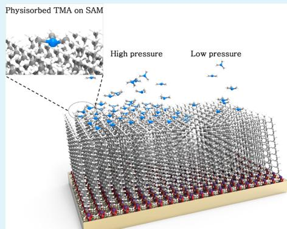
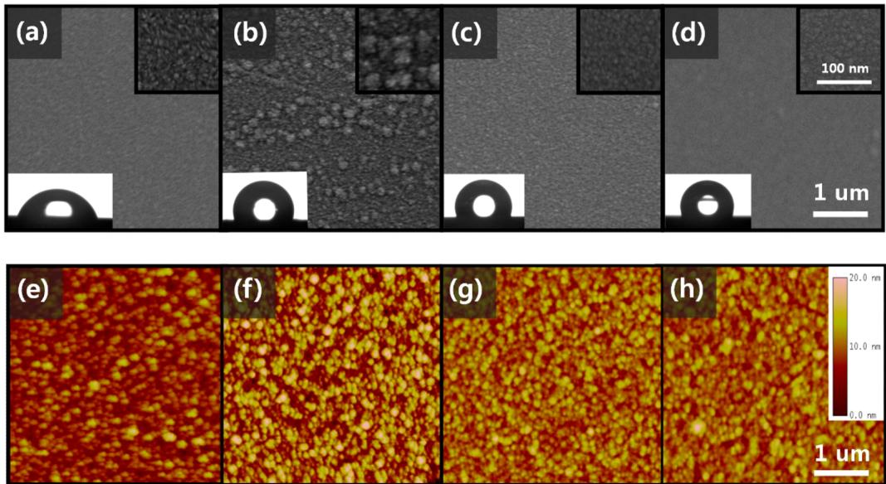
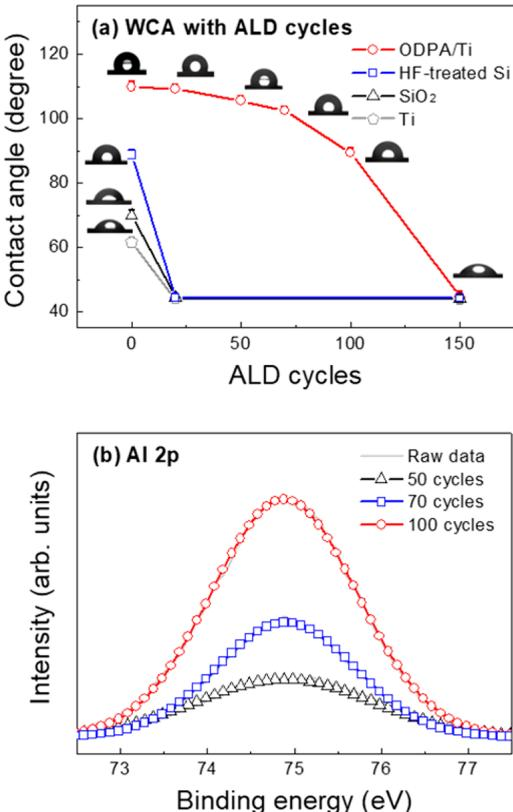
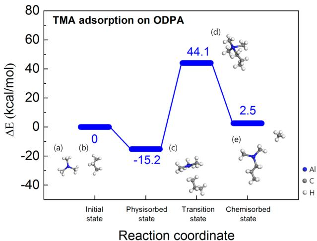
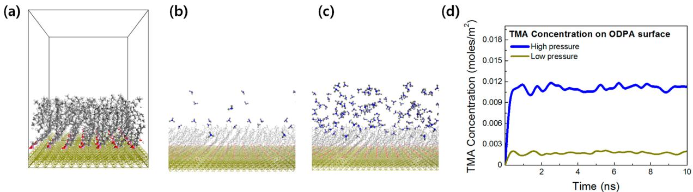
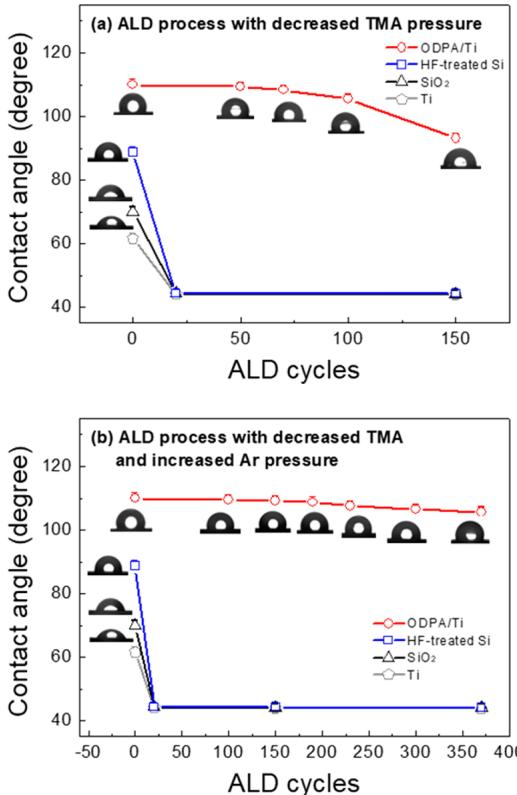
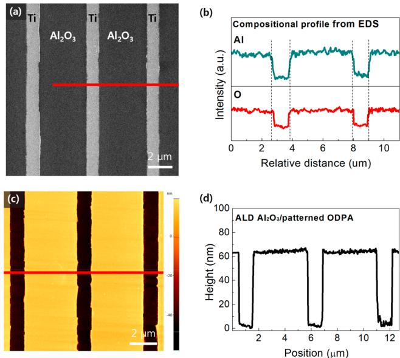

# Reaction Mechanism of Area-Selective Atomic Layer Deposition for  $\mathrm{Al}_2\mathrm{O}_3$  Nanopatterns

Seunggi Seo, Byung Chul Yeo, Sang Soo Han, Chang Mo Yoon, Joon Young Yang, Jonggeun Yoon, Choongkeun Yoo, Ho- jin Kim, Yong- baek Lee, Su Jeong Lee, Jae- Min Myoung, Han- Bo- Ram Lee, Woo- Hee Kim, Il- Kwon Oh, and Hyungjun Kim\*

$^{\dagger}$ School of Electrical and Electronic Engineering and  $^{\parallel}$ Department of Materials Science and Engineering, Yonsei University, 50 Yonsei- ro, Seodaemun- gu, Seoul 03722, Republic of Korea   $^{\ddagger}$ Center of Computational Science, Korea Institute of Science and Technology (KIST), Hwarangno 14- gil 5, Seoul 02792, Republic of Korea   $^{\S}$ LG Display Co., Ltd., 245, LG- ro, Wollong- myeon, Paju- si, Gyeonggi- do 10845, Republic of Korea   $^{\perp}$ Department of Materials Science and Engineering, Incheon National University, 119 Academy- ro, Yeonsu- gu, Incheon 22012, Republic of Korea   $^{\#}$ Division of Advanced Materials Engineering, Chonbuk National University, Jeonbuk 54896, Republic of Korea

# $\circledcirc$  Supporting Information

ABSTRACT: The reaction mechanism of area- selective atomic layer deposition (AS- ALD) of  $\mathrm{Al}_2\mathrm{O}_3$  thin films using self- assembled monolayers (SAMs) was systematically investigated by theoretical and experimental studies. Trimethylaluminum (TMA) and  $\mathrm{H}_2\mathrm{O}$  were used as the precursor and oxidant, respectively, with octadecylphosphonic acid (ODPA) as an SAM to block  $\mathrm{Al}_2\mathrm{O}_3$  film formation. However,  $\mathrm{Al}_2\mathrm{O}_3$  layers began to form on the ODPA SAMs after several cycles, despite reports that  $\mathrm{CH}_3$ - terminated SAMs cannot react with TMA. We showed that TMA does not react chemically with the SAM but is physically adsorbed, acting as a nucleation site for  $\mathrm{Al}_2\mathrm{O}_3$  film growth. Moreover, the amount of physisorbed TMA was affected by the partial pressure. By controlling it, we developed a new AS- ALD  $\mathrm{Al}_2\mathrm{O}_3$  process with high selectivity, which produces films of  $\sim 60 \mathrm{nm}$  thickness over 370 cycles. The successful deposition of  $\mathrm{Al}_2\mathrm{O}_3$  thin film patterns using this process is a breakthrough technique in the field of nanotechnology

KEYWORDS: area- selective ALD,  $\mathrm{Al}_2\mathrm{O}_3$  self- assembled monolayer, nanopattern, atomic layer deposition

# INTRODUCTION

Three- dimensional (3D) nanostructures fabricated using 3D patterning technology play a central role in many fields, including fuel cells, data storage, sensors, photonics, and microfluidics. Several 3D patterning methods have been used, such as photolithography, nanoimprinting, near- field scanning, optical microscopy (NSOM), and Dip- Pen. However, the disadvantages of conventional methods include complicated processes, short- range of materials suitable for patterning, and expensive reagents. Area- selective atomic layer deposition (AS- ALD) has been suggested as a simple one- step patterning process with the various advantages of conventional ALD processes, such as large area uniformity, excellent conformality, and thickness control. As patterned films can be obtained directly during AS- ALD, without any subsequent processes, complicated etching processes are reduced and the use of expensive and poisonous reagents is minimized. Thus, AS- ALD processes have been widely investigated in recent years and applied to various fields, such as microelectronics, microelectromechanical systems (MEMSs), biological and chemical sensors, microfluidics, display units, and optoelectronic devices.

microelectromechanical systems (MEMSs),14 biological and chemical sensors, microfluidics, display units, and optoelectronic devices.17

The AS- ALD technique is based on ALD, which is a thin- film growth technique that employs a sequence of self- limiting- chemisorption reactions. Vapor- phase precursors and reactants are chemically adsorbed onto surface functional groups in alternating steps, separated by an inert gas purge to prevent gas- phase reactions. During ALD, nucleation occurs favorably on hydrophilic substrates that contain OH- terminated groups, which promotes chemical reaction with the precursors. Thus, the ALD reaction can be prevented by passivation of surface OH- terminated groups and termination with unreactive groups, such as  $\mathrm{CH}_3$ .

  
Figure 1. Surface morphologies observed using SEM and AFM: (a, e) bare Ti substrate, (b, f) ODTS-coated Ti, (c, g) ODPA-coated Ti, and (d, h) DDPA-coated Ti. Inset images show the WCA of the samples.

Widely used blocking resists to prevent ALD precursors from nucleating include organic materials such as polymers19- 21 and self- assembled monolayers (SAMs).5,22 Polymers are easily coated by spin coating and easily removed by lift- off processes.20 In addition, the absence of reactive sites on the polymer should block chemical reactions with precursors.23 However, previous studies have shown the growth of ALD films on polymer substrates.24 As polymers are composed of many repeating monomers, there can be a considerable amount of free space among monomers near the surface.25 If the free space is large enough, precursor molecules can be trapped on exposure to the polymer surface.25 Precursor molecules retained inside the polymer could react on subsequent exposure to reactants, resulting in film formation.25 Moreover, polymer patterns require multistep patterning processes using photolithography,21 making their application in mass production difficult. After formation of the film, a lift- off process for the polymer masking layer is required.21 To remove the polymer masking layer, the samples must be immersed in an organic solvent such as acetone.20 However, the conformal dielectric layer blocks the penetration of the solvent, so that manual scratching is required to produce cracks on the dielectric film.20 Thus, AS- ALD using a polymer masking layer is not suitable for nanoscale devices. In contrast, SAMs can be easily coated using several methods, such as dipping,26- 28 microcontact printing  $(\mu \mathrm{CP})$ ,5,28 and vaporization.29 In addition, SAMs are monomers that are attracted to each other by van der Waals (VDW) attraction forces, resulting in dense packing on the surface.5,27 Thus, unlike for polymers, there is ideally no free space in the densely packed SAMs on the substrate. They are thus able to block the diffusion and penetration of the precursor molecules, leading to the selective deposition of films.5 Furthermore, SAMs also have been used as ultrathin resists for microcontact printing at the subnanometer scale.30,31

Thus, we used SAMs as an ALD masking layer in this study.

SAM monomers consist of three components: head, tail, and chain groups. As SAM head groups chemically react with surface reactive groups on the substrates, headgroup selection is dependent on the kind of substrate. For example, alkylphosphonic acid  $\mathrm{[CH_3(CH_2)_nPO_3H_2]}$  SAMs are used for metal surfaces, such as Ti,  $\mathrm{Ag},$  and  $\mathrm{Cu},$  and alkyltrichlorosilane  $\mathrm{[CH_3(CH_2)_nSiCl_3]}$  SAMs are used for  $\mathrm{SiO}_2,$ $\mathrm{Si}_3\mathrm{N}_4,$  and other oxide surfaces.32 The SAM tail groups effectively changes the termination of the substrate surface. For example, OH- ,  $\mathrm{NH_2}$  and COOH- terminated SAMs make surfaces reactive,22,33 whereas  $\mathrm{CH}_3$  or  $\mathrm{CF}_3$  - terminated SAMs make surfaces. 5,22,34,35 To block the deposition of ALD films, tail groups should not react with precursors and reactants; thus, selection of the tail group depends on the kind of molecules to which the surface will be exposed. Chain groups determine the SAM packing density on a substrate. As the SAM chain length increases, the interchain VDW attraction force becomes stronger and SAM packing improves.27,36 In previous studies, alkyl chains are widely used for AS- ALD, with a length of 12 carbon atoms (about  $20\mathrm{\AA}$  found to be sufficient for blocking ALD deposition.27

AS- ALD processes for various systems using SAMs with  $\mathrm{CH}_3$  and  $\mathrm{CF}_3$  termination have been developed based on ALD processes for metal oxides such as  $\mathrm{TiO}_2$ ,  $\mathrm{HfO}_2$ ,  $\mathrm{ZrO}_2$ , and  $\mathrm{ZnO}$  and metals such as  $\mathrm{Ru}$ ,  $\mathrm{Pt}$ ,  $\mathrm{Co}$ ,  $\mathrm{Co}_2$ ,  $\mathrm{Ni}$ .34 However, although the ALD of  $\mathrm{Al}_2\mathrm{O}_3$  has been widely investigated owing to its wide ALD window, high vapor pressure, inexpensive precursor (trimethylaluminum (TMA)), and the wide applicability of  $\mathrm{Al}_2\mathrm{O}_3$ , the selective deposition of  $\mathrm{Al}_2\mathrm{O}_3$  thin films using SAMs has not been experimentally demonstrated using an AS- ALD process with  $\mathrm{CH}_3$ - terminated SAMs. However, there are a few reports of the ALD of  $\mathrm{Al}_2\mathrm{O}_3$  on  $\mathrm{CH}_3$ - terminated SAMs.18,22,30,40 A previous density functional theory (DFT) study showed that  $\mathrm{CH}_3$ - terminated SAMs have no thermodynamic driving force for chemical reaction with TMA, so  $\mathrm{Al}_2\mathrm{O}_3$  films cannot be formed since nucleation is inhibited.22 In contrast, experimental studies on the ALD of  $\mathrm{Al}_2\mathrm{O}_3$  on  $\mathrm{CH}_3$ - terminated SAMs and OH- terminated surfaces showed similar deposition of  $\mathrm{Al}_2\mathrm{O}_3$  on both surfaces.38 Subsequent studies also showed that ALD can deposit  $\mathrm{Al}_2\mathrm{O}_3$  layers on  $\mathrm{CH}_3$ - terminated SAMs.40 Similarly, SAMs could not block  $\mathrm{Al}_2\mathrm{O}_3$  deposition when  $\mathrm{Al}_2\mathrm{O}_3$  was deposited at a thickness of greater than 6 nm on a Si substrate.30 Thus, a fundamental study of the reaction mechanism is necessary to understand the inconsistency between theoretical calculations and experimental observations.

Furthermore, there has been no practical demonstration of selectively deposited  $\mathrm{Al}_2\mathrm{O}_3$  patterns using AS- ALD, despite its technical importance.

In this work, we carried out a systematic investigation of the reaction mechanism of AS- ALD of  $\mathrm{Al}_2\mathrm{O}_3$  on SAMs using theoretical and experimental examinations of three SAMs with different head groups or chain lengths. Based on the reaction mechanism, ALD  $\mathrm{Al}_2\mathrm{O}_3$  process parameters were changed to achieve high selectivity between SAMs and a Ti substrate. Finally, we demonstrated selective deposition of  $\mathrm{Al}_2\mathrm{O}_3$  thin films using newly developed AS- ALD processes for  $\mathrm{Al}_2\mathrm{O}_3$ .

# RESULTS AND DISCUSSION

Densely packed SAM layers are needed to investigate ALD on SAM. We examined Ti substrates coated with three kinds of commercial SAM materials: octadecyltrichlorosilane (ODTS), octadecylphosphonic acid (ODPA), and dodecylphosphonic acid (DDPA). Figure 1 shows the surface morphologies of the four different samples, as observed using field emission scanning electron microscopy (FE- SEM) and atomic force microscopy (AFM): bare Ti, ODTS- coated Ti, ODPA- coated Ti, and DDPA- coated Ti. Parts a and e of Figure 1 show the surface morphologies of the bare Ti substrate, which has a water contact angle (WCA) of  $62^{\circ}$ . Parts b and f of Figure 1 show the surface morphologies of the ODTS- coated Ti substrate, which has a rough surface because the headgroup is incompatible with Ti substrates. The WCA of the ODTS- coated Ti substrate is  $104^{\circ}$ . Parts c and g of Figure 1 show images of the ODPA- coated Ti substrate, which is much smoother than the ODTS- coated Ti substrates because the phosphonic acid headgroup is suitable for Ti substrates. The WCA of the ODPA- coated Ti substrate is  $110^{\circ}$ , which indicates that ODPA is highly packed on the Ti substrate. Parts d and h of Figure 1 show images of the DDPA- coated Ti substrate, which also has a smooth surface. The WCA of the DDPA- coated Ti substrate is  $106^{\circ}$ . This value is smaller than that of the ODPA- coated Ti substrate owing to the shorter chain length of DDPA. These results show that ODPA is the most densely packed SAM on Ti substrates. Thus, we chose ODPA for our study.

Figure 2a shows WCA values as a function of ALD  $\mathrm{Al}_2\mathrm{O}_3$  cycles on ODPA on a Ti substrate using our general ALD  $\mathrm{Al}_2\mathrm{O}_3$  procedure. The conditions used were a TMA injection pressure of 8.9 Torr, injection time of  $100~\mathrm{ms}$ , Ar purging pressure of 1.3 Torr, and Ar purging time of  $12\mathrm{~s}$ . For comparison, the WCA values before and after ALD on Ti,  $\mathrm{SiO}_2$ , and HF- treated  $\mathrm{SiO}_2$  were also measured. At 0 cycles, the WCA values of the Ti-  $\mathrm{SiO}_2$ , and HF- treated Si substrates were  $61.7^{\circ}$ ,  $70.0^{\circ}$ , and  $89.0^{\circ}$ , respectively; after 20 cycles they had decreased to  $44.2^{\circ}$ ,  $44.5^{\circ}$ , and  $44.4^{\circ}$ , respectively. Similar values were observed after 150 cycles, with the decreased WCA caused by the formation of hydrophilic  $\mathrm{Al}_2\mathrm{O}_3$  layers. In addition, we performed XPS analysis to investigate  $\mathrm{Al}_2\mathrm{O}_3$  deposition on Ti. In Figure S3, the atomic concentration of Al on the Ti substrate is about  $33.2\%$  after 370 ALD cycles. This result means that the ALD  $\mathrm{Al}_2\mathrm{O}_3$  film was well deposited on the Ti substrate. Compared to the change in the WCA observed after 20 cycles of  $\mathrm{Al}_2\mathrm{O}_3$  layer formation on Ti- ,  $\mathrm{SiO}_2$ , and HF- treated Si substrates, the WCA values for ALD of  $\mathrm{Al}_2\mathrm{O}_3$  on ODPA on a Ti substrate decreased at a much slower rate, as shown in Figure 2a. At 0 cycles, bare ODPA on the Ti substrate was hydrophobic with a WCA of  $110^{\circ}$ . After 20 cycles, the WCA value decreased to  $109^{\circ}$ , which is a smaller change than those observed during the ALD of  $\mathrm{Al}_2\mathrm{O}_3$  on Ti,  $\mathrm{SiO}_2$ , and HF- treated Si substrates. This finding indicates that SAMs are more effective than Ti- ,  $\mathrm{SiO}_2$ , and HF- treated Si substrates at blocking the formation of  $\mathrm{Al}_2\mathrm{O}_3$  layers. However, the WCA value gradually decreases with repeated ALD cycles, with the WCA value after 150 cycles being similar to those for Ti- ,  $\mathrm{SiO}_2$ , and HF- treated substrates. The decrease of the WCA might be due to defect formation in SAM layer. Previous studies showed that SAM defects can be formed by external energy, such as UV light irradiation, plasma treatment, and heat treatment (above  $350^{\circ}\mathrm{C}$ ). Exposure to such treatments caused the decomposition of the alkyl chains of ODPA. In our study, among them, thermal energy from the chamber could only generate the defect of SAM. We evaluated the thermal stability of the ODPA SAM and measured the WCA change of the ODPA- coated Ti sample in a vacuum chamber at  $150^{\circ}\mathrm{C}$ . Figure S4 shows the WCA change as a function of exposure time. The WCA value remained unchanged within the error throughout the heating time. This indicates that the ODPA SAM was not degraded by thermal energy during the ALD process. Thus, the decrease of the WCA is mainly due to the formation of hydrophilic  $\mathrm{Al}_2\mathrm{O}_3$ . Figure 2b shows XPS spectra of the Al 2p core level for ALD  $\mathrm{Al}_2\mathrm{O}_3$  on ODPA/Ti substrates. Deconvolution of the Al 2p peaks showed one subpeak at  $75.0\mathrm{eV}$ , which was assigned to the bonding of  $\mathrm{Al}_2\mathrm{O}_3$ . As the number of ALD cycles increases, the intensity of this peak gradually increased, indicating increasing amounts of  $\mathrm{Al}_2\mathrm{O}_3$  bonding. Based on the WCA change and XPS results, we concluded that ODPA surfaces did

  
Figure 2. (a) WCA values as a function of ALD  $\mathrm{Al}_2\mathrm{O}_3$  cycles with a general recipe at  $150^{\circ}\mathrm{C}$  for four different substrates: ODPA/Ti, Ti,  $\mathrm{SiO}_2$ , and HF-treated Si. The insets show WCA images captured using a three-times-magnified optical lens in a WCA analyzer. (b) Al 2p XPS spectra of  $\mathrm{Al}_2\mathrm{O}_3$  on ODPA/Ti for 50, 70, and 100 ALD cycles.

not block  $\mathrm{Al}_2\mathrm{O}_3$  deposition, similar to the results of previous experimental studies.18,37- 39

To investigate the reaction mechanism of ALD of  $\mathrm{Al}_2\mathrm{O}_3$  on ODPA, the adsorption energy of a TMA molecule with an ODPA molecule was explored using DFT calculations, as shown in Figure 3. Parts a and b of Figure 3 show the initial states of the TMA and  $\mathrm{CH}_3$ - terminated SAM cluster models used in the calculations, respectively; the models used in this work were similar to those in a previous study.22 Parts c, d, and e of Figure 3 show the molecular configurations for a physisorbed state, transition state, and chemisorbed state, respectively. The energy levels of each reaction pathway are plotted in Figure 3. The physisorption energy of a TMA molecule on an SAM cluster is  $- 15.2\mathrm{kcal / mol}$ . However, the chemisorption process, involving generation of  $\mathrm{CH}_{4}$ , is thermodynamically unfavorable with a high energy barrier of  $59.3\mathrm{kcal / mol}$ . These results are consistent with previous calculations,22 where the reaction energy barrier was also high. In addition, the enthalpy of the chemical reaction was  $2.5\mathrm{kcal / mol}$  more endothermic than that of the reactants, which suggests that the reaction of TMA with the  $\mathrm{CH}_3$ - terminated SAM is energetically unfavorable. In contrast to previous calculations,22 we observed another possible adsorption mechanism, involving a physical interaction between TMA and  $\mathrm{CH}_3$ - terminated SAM molecules. Prior to chemical reaction, TMA and SAM molecules are physisorbed with each other in the transition state, which has an energy level of  $- 15.2\mathrm{kcal / mol}$ . As the reaction energy during ALD is solely derived from thermal energy  $(150^{\circ}\mathrm{C}, 0.8\mathrm{kcal / mol})$ , the energy barrier of  $59.2\mathrm{kcal / mol}$  for the chemical reaction is too high. Thus, rather than the chemical reaction, an exothermic physical reaction is possible, which is energetically favorable with an enthalpy of  $- 15.2\mathrm{kcal / mol}$ . Similar to chemisorbed molecules, physisorbed molecules could act as nucleation sites. Previous studies on ALD of metal oxides such as  $\mathrm{HfO}_2$  and  $\mathrm{Al}_2\mathrm{O}_3$  on graphene, which is chemically inert like  $\mathrm{CH}_3$ - terminated SAMs, showed that metal oxide films grow on graphene.46 Precursor molecules, such as  $\mathrm{HfCl}_4$  and TMA,47 physisorb on graphene and act as nucleation sites for ALD, leading to the formation of metal oxide films, similar to the growth of ALD  $\mathrm{Al}_2\mathrm{O}_3$  films on SAMs in this work. Thus, we conclude that TMA molecules physisorb onto ODPA and the ALD reaction occurs through physisorbed TMA molecules as nucleation sites, leading to film growth and decreased WCA values (Figure 2a).

  
Figure 3. Reaction path for adsorption of TMA on the  $\mathrm{CH}_3$ -terminated surface of ODPA: (a, b) initial states of the TMA and  $\mathrm{CH}_3\mathrm{CH}_2\mathrm{CH}_3$  cluster models, respectively, (c) physisorption state, (d) transition state, and (e) chemisorption state between them.

Surface reactions between gas molecules and substrates are affected by the total number of molecules exposed to the surface,48 The total amount can be calculated using the product of pressure and time as the exposure value in langmuir units.49

To decrease the amount of physisorbed molecules on the surface for high selectivity, we controlled pressure and exposure time. To investigate the effect of TMA exposure value, we conducted single TMA dose tests on ODPA- coated Ti substrates. Table 1 shows WCA changes with controlled partial

Table 1. WCA before and after TMA Injection under Various Partial Pressure and Time Conditions  

<table><tr><td>sample</td><td></td><td>pressure (Torr)</td><td>time (s)</td><td>langmuir (10-6 Torr·s)</td><td>WCA (deg)</td></tr><tr><td>A</td><td>no injection</td><td></td><td></td><td></td><td>110</td></tr><tr><td>B</td><td>TMA</td><td>8.9</td><td>60</td><td>534 × 106</td><td>94</td></tr><tr><td>C</td><td rowspan="2">injection</td><td>8.9</td><td>10</td><td>89 × 106</td><td>99</td></tr><tr><td>D</td><td>1.3</td><td>60</td><td>78 × 106</td><td>109</td></tr></table>

After TMA injection, the sample was removed from the chamber, and the WCA was measured immediately.

pressure and exposure time for TMA. The WCA of the ODPA- coated Ti substrate was  $110^{\circ}$  (sample A). After exposure to TMA molecules at a high pressure for a long time (exposure value of 534 Torr·s  $(8.9\mathrm{Torr}\times 60\mathrm{s})$ ), the WCA decreased by  $16^{\circ}$  (sample B). The decrease in WCA is thought to be due to the formation of  $\mathrm{AlO}_x$  on the surface of ODPA, similar to that shown in Figure 2a. As there are many oxidants in air, such as  $\mathrm{H}_2\mathrm{O}$  and  $\mathrm{O}_2$ , hypergolic ignition of TMA can occur on the surface under ambient air.50 Then, physisorbed TMA on the ODPA surfaces can react with oxidants, resulting in the formation of  $\mathrm{AlO}_y$ , which results in the reduction of the WCA. Similarly, decreasing the exposure time (from 60 to  $10\mathrm{s}$ ) with the same high pressure  $(8.9\mathrm{Torr})$  caused a similar decrease in the WCA (sample C) compared with bare ODPA, indicating that exposure time does not significantly affect TMA physisorption. For the two time- control cases, although the exposure value for the short time case was six times smaller than that for long time case, significant blocking of the formation of  $\mathrm{AlO}_x$  was not observed. In contrast, pressure control affected the formation of  $\mathrm{AlO}_x$  on the ODPA/Ti substrate. When we decreased the partial pressure of TMA molecules almost six times (from 8.9 to 1.3 Torr) with the same exposure time, the WCA value did not decrease (sample D) compared with bare ODPA. Although the exposure value for the low- pressure case is almost the same as that of the short time case, the WCA shows completely different behavior. Thus, the amount of adsorbed TMA molecules is not governed by the exposure value, but is affected dominantly by pressure rather than by time. The observation of this control mechanism is very interesting, as time control is known as a common method for removing physisorbed molecules on the surface in ALD fields.51

To investigate the dependence of the adsorption behavior of TMA molecules on time and pressure, we performed molecular dynamics (MD) simulations. Figure 4a shows a simulated cell with dimensions of  $45.52 \times 45.52 \times 60.00\mathrm{\AA}$ , as the ODPA SAM chain is located on the Ti (100) surface with  $2 \times 2$  coverage. Parts b and c of Figure 4 are snapshots (captured

  
Figure 4. (a) Side view of the initial MD simulation cell without TMA molecules, where ODPA SAMs are aligned through VDW interactions, with coverage of  $2 \times 2$  grid/molecule. MD snapshots to compare TMA movement at different TMA pressures: (b) 1.3 Torr (low pressure), captured from supporting movies 1-4 and (c) 8.9 Torr (high pressure), captured from supporting movies 5-8. (d) TMA concentration at 8.9 and 1.3 Torr over time  $(0 - 10 \mathrm{ns})$ .

from supporting movies 1 and 2, respectively) obtained after MD simulations of  $10 \mathrm{ns}$  for 1.3 Torr (low pressure) and 8.9 Torr (high pressure), respectively, which are the same pressures as used for the experiments shown in Table 1. In Figure 4b,c, a small fraction of the TMA molecules diffused into the ODPA film. The formation of  $\mathrm{Al}_2\mathrm{O}_3$  may be due to reaction between the remaining TMA molecules on the surface of the SAM or those diffused into the SAMs and  $\mathrm{H}_2\mathrm{O}$ . The concentration of molecules physisorbed on the surface of the ODPA SAMs and molecules diffused into the ODPA SAMs is plotted in Figure 4d as a function of injection time up to  $10 \mathrm{ns}$ . It is clearly shown that the amount of physisorbed TMA molecules is much larger under the high- pressure conditions than under the low- pressure conditions, which is consistent with the experimental observations in Table 1. In addition, in both cases, the TMA concentration does not change with time after saturation. In other words, the chemical equilibrium of the reaction between TMA molecule and SAMs is relatively independent of time after saturation. Instead, the saturation values depend on the partial pressure, with the TMA concentration under the high- pressure conditions about 6- 7 times higher than that under the low- pressure conditions  $(11.30 \times 10^{- 3} \mathrm{mol} / \mathrm{m}^2$  and  $1.76 \times 10^{- 3} \mathrm{mol} / \mathrm{m}^2$ , respectively, at  $8 \mathrm{ns}$ .

Based on the Langmuir adsorption isotherm, the partial pressure of the reactant is a central parameter describing the adsorption process. The maximum amount of adsorbed molecules, the so- called monolayer capacity is determined by the thermodynamic conditions and the structure of the molecules and substrates. The fraction of surface coverage  $(Q)$  is defined as the ratio of the amount of adsorbed substance to the monolayer capacity at specific moment. The change of the surface coverage describes the change of the amount of adsorbed molecules on substrates, which is the difference between the adsorption rate and desorption rate. The adsorption rate  $(r_{\mathrm{a}})$  and desorption rate  $(r_{\mathrm{d}})$  are given by the following equations:

$$
\begin{array}{r}r_{\mathrm{a}} = k_{\mathrm{a}}P_{\mathrm{a}}(1 - Q)\\ r_{\mathrm{d}} = k_{\mathrm{d}}Q \end{array} \tag{1}
$$

where  $k_{\mathrm{a}}$  and  $k_{\mathrm{d}}$  are the adsorption and desorption rate constants, respectively, which are functions of temperature, and  $p_{\mathrm{A}}$  is the partial pressure of  $A$  over the surface. Using eqs 1 and 2, the rate of change of the surface coverage,  $\mathrm{d}Q / \mathrm{d}t$ , is given by the following equation:

$$
\frac{\mathrm{d}Q}{\mathrm{d}t} = r_{\mathrm{a}} - r_{\mathrm{d}} = k_{\mathrm{a}}P_{\mathrm{a}}(1 - Q) - k_{\mathrm{d}}Q \tag{3}
$$

At the saturation conditions, the change of surface coverage is zero. Thus, the equilibrium coverage,  $Q^{\mathrm{eq}}$  is given by following equation:

$$
Q^{\mathrm{eq}} = \frac{k_{\mathrm{a}}p}{k_{\mathrm{a}}P + k_{\mathrm{d}}} = \frac{1}{1 + \left(\frac{k_{\mathrm{a}}}{k_{\mathrm{d}}}p\right)^{-1}} \tag{4}
$$

Based on eqs 1 and 4, as the partial pressure decreases, both the adsorption rate and equilibrium coverage decrease. Thus, the amount of physisorbed molecules decreased with decreasing TMA pressure, so that  $\mathrm{Al}_2\mathrm{O}_3$  formation was blocked more at low TMA pressures compared to high pressure, as shown in Table 1. In addition, based on eq 1, increasing the process temperature should decrease the adsorption rate, as the amount of physisorbed molecules on the surface would be desorbed by the increased thermal energy of the substrate. To investigate the effect of process temperature, we used 150 ALD cycles to deposit  $\mathrm{Al}_2\mathrm{O}_3$  on ODPA using the general recipe at various temperatures, 50, 100, 150, and  $200^{\circ}\mathrm{C}$  (see Figure S1 in the Supporting Information). The WCA of all samples decreased to about  $44^{\circ}$  after the deposition. This result is attributed to the low thermal energy at  $50 - 200^{\circ}\mathrm{C}$ $(0.23 - 0.94 \mathrm{kcal} / \mathrm{mol})$ , which is much smaller than the physisorption energy  $(15.2 \mathrm{kcal} / \mathrm{mol})$ . Therefore, desorption of physisorbed molecules from the surface is difficult in the thermal energy range used in this work. Thus, in this work, we believe that the amount of physisorbed TMA molecules is predominately affected by the partial pressure of TMA molecules.

In addition to TMA adsorption, the desorption process was investigated using controlled Ar purging. In contrast to strong chemical bonding, physical interactions are weak and can be affected by a purging gas. Without Ar purging, a single dose of TMA molecules under high- pressure and long- time conditions resulted in a WCA of  $94^{\circ}$  (sample A), as physisorbed TMA on the surface was oxidized after exposure in air, as shown in Table 2. After Ar purging under high- pressure and long- time conditions, the WCA increased (from  $94^{\circ}$  to  $110^{\circ}$ ; sample B), which is same as that of bare ODPA- coated Ti. This result indicates that physisorbed TMA molecules were removed by the Ar- purging process under these conditions. Decreasing the Ar purging time (from 60 to  $10 \mathrm{s}$ ) with the same high pressure  $(8.9 \mathrm{Torr})$  also resulted in a WCA value of  $110^{\circ}$  (sample C). In contrast, when the pressure was decreased (from 8.9 to 1.3

Table 2. WCA after TMA Injection under High Exposure Conditions  $(8.9\mathrm{Torr}\times 60\mathrm{s})$  and after Ar Purging under Various Partial Pressure and Time Conditions  

<table><tr><td>sample</td><td></td><td>pressure (Torr)</td><td>time (s)</td><td>langmuir (10-6Torr·s)</td><td>WCA (deg)</td></tr><tr><td>A</td><td>no Ar purging after TMA injection</td><td></td><td></td><td></td><td>94</td></tr><tr><td>B</td><td rowspan="3">Ar purging after TMA injection</td><td>8.9</td><td>60</td><td>534 × 106</td><td>110</td></tr><tr><td>C</td><td>8.9</td><td>10</td><td>89 × 106</td><td>110</td></tr><tr><td>D</td><td>1.3</td><td>60</td><td>78 × 106</td><td>94</td></tr></table>

After Ar purging, the sample was removed from the chamber, and the WCA was measured immediately.

Torr) with long exposure time  $(60~\mathrm{s})$  the WCA after Ar purging remained the same at  $94^{\circ}$  sample D), indicating that low- pressure Ar did not significantly affect the desorption of physisorbed molecules. In addition, in terms of throughput in the ALD process, it is advantageous that increased pressure rather than increased time is beneficial. These results are in good correspondence with the TMA physisorption case shown in Table 1 and Figure 4. Additionally, we observed that exposure time and pressure of  $\mathrm{H}_2\mathrm{O}$  molecules had no effect on  $\mathrm{Al}_2\mathrm{O}_3$  formation (see Table S1 in the Supporting Information).

On the basis of the experimental and simulation results, ALD processes with varying pressures of TMA and Ar were investigated by examining the WCA change to optimize ALD processes for blocking depletion of  $\mathrm{Al}_2\mathrm{O}_3$  on ODPA (Figure 5). Based on our general ALD  $\mathrm{Al}_2\mathrm{O}_3$  process shown in Figure 2a, we decreased the TMA pressure (from 7.8 to 1.3 Torr) to reduce the amount of physisorbed TMA molecules on ODPA, as shown in Figure 5a. In contrast to the  $\mathrm{SiO}_2$  and HF- treated Si substrates, the WCA value using the decreasing TMA pressure process was  $96^{\circ}$  after 150 ALD cycles. In addition, the WCA change for the low TMA pressure case (from  $110^{\circ}$  to  $96^{\circ}$  after 150 cycles) is much smaller than that for the high TMA pressure case (from  $110^{\circ}$  to  $45^{\circ}$  after 150 cycles), as shown in Figure 2a. This result indicates that decreasing the TMA pressure blocks physisorption between TMA and ODPA molecules, resulting in the formation of less  $\mathrm{Al}_2\mathrm{O}_3$ . In addition, we increased the Ar purging pressure to remove residual physisorbed TMA molecules from the surface, as shown in Figure 5b. After 150 cycles, the WCA value was  $109^{\circ}$ , which is almost same as that of bare ODPA- coated Ti. Further increasing the number of ALD cycles to 370, changed the WCA slightly from  $110^{\circ}$  to  $105^{\circ}$ . In addition, we performed XPS analysis of the Al 2p spectra to investigate the amount of Al after 370 ALD cycles on both ODPA and Ti substrates as shown in Figure S3. The atomic concentration of Al is about  $3.6\%$  for the ODPA substrate after 370 ALD cycles, while it is about  $33.2\%$  for the Ti substrate. A previous study showed that  $3\mathrm{nm}$  thick  $\mathrm{Al}_2\mathrm{O}_3$  film has a low atomic concentration of Al of about  $5\%$ . Thus, after 370 cycles, the thickness of the  $\mathrm{Al}_2\mathrm{O}_3$  film on ODPA was probably less than  $3\mathrm{nm}$ . Compared to the approximately  $60\mathrm{nm}$  thickness of  $\mathrm{Al}_2\mathrm{O}_3$  on Ti substrate, the newly developed AS- ALD process effectively blocked the deposition of the ALD  $\mathrm{Al}_2\mathrm{O}_3$  film on the ODPA surface over 370 cycles of ALD. The reason for the slight decrease of the WCA from  $110^{\circ}$  to  $105^{\circ}$  might be the existence of a small amount of  $\mathrm{AlO}_x$  on the ODPA substrate, corresponding to a  $3.6\%$  atomic concentration of Al, on ODPA, as shown in Figure S3. In addition, the error range of the WCA value is about  $3.2^{\circ}$ , and thus, the measurement error might be included. The thickness of the  $\mathrm{Al}_2\mathrm{O}_3$  layer on the Si substrate after 370 cycles is about  $60\mathrm{nm}$ . The growth per cycle (GPC) in the ALD  $\mathrm{Al}_2\mathrm{O}_3$  process is about  $1.6\mathrm{\AA / }$  cycle. The generally reported growth per cycle values for ALD  $\mathrm{Al}_2\mathrm{O}_3$  using TMA and  $\mathrm{H}_2\mathrm{O}$  are about  $0.9 - 1.7\mathrm{\AA / }$  cycle. The GPC for ALD is affected by various process parameters, such as the growth temperature, pressure of reactants, exposure time of precursors and reactants, and reactor design. For example, varying the working pressure changed the gas flow rate near the surface, which in turn changed the sticking probability on the surface, leading to a change in the GPC. A previous study reporting the ALD  $\mathrm{Al}_2\mathrm{O}_3$  process for working pressures of 2 and 760 Torr, found a wide range in the growth per cycle  $(0.9 - 1.7\mathrm{\AA / }$  cycle). In addition, a previous study from our laboratory showed the ALD  $\mathrm{Al}_2\mathrm{O}_3$  process with a GPC of  $1.5\mathrm{\AA / }$  cycle. In our process, the working pressure was about 9 Torr due to an increase in Ar purging pressure; therefore, the rate of  $1.6\mathrm{\AA / }$  cycle reported here is comparable with the previous work. Furthermore, there is a possibility that the purge process in our developed process might be very slow and nonsaturating due to porosity or sponginess of the SAMs. The SAMs could contain TMA molecules and might release some TMA molecules during the  $\mathrm{H}_2\mathrm{O}$  pulse leading to an increase in the growth per cycle, just above the typically reported growth per cycle. To investigate the SAM effect on the parasitic addition of growth per cycle, we have performed ALD  $\mathrm{Al}_2\mathrm{O}_3$  on a Ti substrate with and without ODPA in the ALD reactor. Figure S8 shows that the growth per cycle for both conditions was identical,  $1.6\mathrm{\AA / }$  cycle. Based

  
Figure 5. WCA values as a function of the number of ALD  $\mathrm{Al}_2\mathrm{O}_3$  cycles for up to 150 cycles (a) using an ALD process with decreased TMA pressure (from 8.9 to 1.3 Torr) and (b) using a decreased TMA pressure process with increased Ar purging (TMA injection pressure decreased from 8.9 to 1.3 Torr) and no purging pressure increased from 1.3 to 8.9 Torr) over 370 cycles at  $150^{\circ}\mathrm{C}$  for three different substrates, ODPA/Ti, Ti, and  $\mathrm{SiO}_2$  and HF-treated Si. The insets show WCA images captured using a  $3\times$  magnified optical lens in a WCA analyzer.

on the results, we hypothesize that the TMA molecules in the SAMs did not significantly release during the  $\mathrm{H}_2\mathrm{O}$  pulse. Therefore, by using the optimized ALD  $\mathrm{Al}_2\mathrm{O}_3$  process developed in this study, selectivity can be achieved between ODPA and Si with  $\mathrm{Al}_2\mathrm{O}_3$  thicknesses of up to  $60~\mathrm{nm}$ . Further decrease in the TMA pressure and increase in the purging time compared to those of the optimized conditions could lead to reduced ALD GPC. In the case of TMA pressure, 1.3 Torr of TMA injection pressure was the minimum required for the ALD reaction, since  $\mathrm{Al}_2\mathrm{O}_3$  was not deposited at TMA injection pressures lower than 1.3 Torr. In the case of purging time, Figure S6 shows the WCA values as a function of the number of ALD  $\mathrm{Al}_2\mathrm{O}_3$  cycles on the ODPA on Ti substrate using different ALD recipes, with two Ar purging times of 12 and 60 s. Similar values of WCA were observed after the deposition, indicating that  $12\mathrm{~s~}$  is sufficient to purge excess gas molecules on the surface. In spite of the optimized ALD process conditions, we observed that the WCA decreased slightly, by about  $5^{\circ}$  after 370 cycles. The reason for the slight decrease in the WCA from  $110^{\circ}$  to  $105^{\circ}$  might be the existence of a small amount of  $\mathrm{AlO}_x$  on the ODPA substrate, corresponding to a  $3.6\%$  atomic concentration of Al, on ODPA as shown in Figure S3. In addition, the error range of the WCA value is about  $3.2^{\circ}$  and thus the measurement error might be included.

On the basis of developed ALD process shown in Figure 5b,  $\mathrm{Al}_2\mathrm{O}_3$  nanopatterns were demonstrated by using AS- ALD on ODPA- patterned Ti substrates, where the widths of the ODPA line pattern were  $1\mu \mathrm{m}$  with  $4\mu \mathrm{m}$  spaces between the lines.  $\mathrm{Al}_2\mathrm{O}_3$  films were deposited for 370 cycles, and after deposition, the ODPA SAMs were etched using  $\mathrm{O}_2$  plasma for  $60~\mathrm{s}$ . Figure 6a shows an SEM image of an  $\mathrm{Al}_2\mathrm{O}_3$  nanopattern, and Figure 6b shows EDS elemental line scans for Al, and O. The EDS analysis revealed that the dark regions in Figure 6a are  $\mathrm{Al}_2\mathrm{O}_3$  deposited areas. The surface morphology was analyzed using AFM (Figure 6c), and the pattern height is shown in Figure 6d. A height of about  $62.5 \mathrm{nm}$  was observed for  $\mathrm{Al}_2\mathrm{O}_3$  on the patterned substrate after 370 AS- ALD cycles, which is similar to that on Si substrates that were placed in the same chamber for the same time. Thus, we think that the suggested reaction mechanism and developed process has the potential to be applied to a variety of systems with 3D nanostructures and could be extended to various surface science fields where control of the molecule adsorption rate is required.

  
Figure 6. (a) SEM image of a patterned sample; the bright part of this image corresponds to the area coated by ODPA and etched, whereas the dark part shows the  $\mathrm{Al}_2\mathrm{O}_3$  deposited area. (b) EDS elemental line scans for Al and O observed along the red line in the SEM image of (a). (c) AFM image of  $\mathrm{Al}_2\mathrm{O}_3$  on patterned ODPA and (d) height profiles of AFM line scans along the red line in (c).

# CONCLUSIONS

In this work, we systemically investigated AS- ALD of  $\mathrm{Al}_2\mathrm{O}_3$  on SAMs by varying SAM species, process temperature, exposure time, and pressure of precursor molecules. We observed that ODPA showed the highest packing density among other SAMs owing to the ability of its headgroup to interact with Ti substrates its long chain length. Theoretical and experimental investigations of the reaction mechanism for ALD of  $\mathrm{Al}_2\mathrm{O}_3$  on SAMs showed that ALD  $\mathrm{Al}_2\mathrm{O}_3$  films could be deposited owing to physisorbed TMA molecules acting as nucleation sites, with the pressure of TMA being the key factor in determining the amount of physisorbed molecules on the surface. In addition, we developed an ALD process by changing the TMA injection pressure and Ar purging pressure conditions, which results in blocking ALD of  $\mathrm{Al}_2\mathrm{O}_3$  on ODPA. Finally, we demonstrated the production of  $60~\mathrm{nm}$  thick patterned  $\mathrm{Al}_2\mathrm{O}_3$  films using the newly developed AS- ALD process. We believe that the determination of the reaction mechanism and the demonstration of nanopatterns in this work are unprecedented, and these novel results in nanotechnology will have a significant impact on various applications requiring nanopatterned ALD films. For example, ALD  $\mathrm{Al}_2\mathrm{O}_3$  films have been highlighted in the organic light emitting diode (OLED) encapsulation area because  $50~\mathrm{nm}$  thick  $\mathrm{Al}_2\mathrm{O}_3$  films showed excellent water vapor transmission rates. However, to use the ALD  $\mathrm{Al}_2\mathrm{O}_3$  film in mass production,  $\mathrm{Al}_2\mathrm{O}_3$  film should not exist on the electrode area of Ti for metal interconnection. Thus, the use of a patterning process after ALD is required, but many patterning processes are difficult to use in mass production due to the lack of etchants for  $\mathrm{Al}_2\mathrm{O}_3$  films. In addition, since polymer blocking materials cannot be used in OLED mass production due to the complicated patterning process, development of an AS- ALD process of  $\mathrm{Al}_2\mathrm{O}_3$  using alternative blocking materials such as SAMs is very important. However, previous reports have shown that the thickness of the AS- ALD  $\mathrm{Al}_2\mathrm{O}_3$  pattern is limited to  $\sim 6$  nm or less. This was the motivation for our study, and we achieved a thickness of up to  $\sim 60 \mathrm{nm}$  based on the newly investigated reaction mechanism. Furthermore, the novel AS- ALD  $\mathrm{Al}_2\mathrm{O}_3$  process, which was developed by investigating the effect of various process parameters on physisorption, represents a starting point for research into AS- ALD based on physisorption mechanisms.

# EXPERIMENTAL SECTION

Substrate and SAM Solution Preparation. In this study, 120 nm thick Ti films deposited on Si substrates were used as the substrate. The Ti films were deposited using DC magnetron sputtering with a plasma power of  $120~\mathrm{W}$ . After sputtering, the Ti substrates were cleaned by sonication in acetone and isopropyl alcohol (IPA), followed by rinsing with deionized (DI) water, and finally dried under a  $\mathrm{N}_2$  flow to remove organic materials. We used three commercial SAMs: octadecyltrichlorosilane (ODTS;  $97\%$ , Aldrich Co.), octadecylphosphonic acid (ODPA;  $97\%$ , Strem Co.), and dodecylphosphonic acid (DDPA;  $95\%$ , Alfa Co.). ODTS and ODPA have the same carbon chain length  $(n = 18)$  but different head groups (silane for ODTS and phosphonic acid for ODPA). ODPA and DDPA have the same

headgroup (phosphonic acid) but different chain lengths  $n = 18$  for ODPA and  $n = 12$  for DDPA). Tetrahydrofuran (THF) was used as the solvent for ODPA and DDPA, and toluene was used for ODTS. The concentrations of the ODPA and DDPA solutions were  $2.4^{61}$  and  $1\mathrm{mM}$  in THF, respectively,2 whereas the concentration of the ODTS solution was  $10~\mathrm{mM}$  in toluene.28 The WCA of the bare Ti substrate was  $60^{\circ}$  which was changed to about  $104^{\circ}$ $110^{\circ}$  and  $106^{\circ}$  after stamping with ODTS, ODPA, and DDPA SAMs, respectively (see Figure 1), indicating that the surface termination was changed from reactive groups to unreactive  $\mathrm{CH}_3$  termination. More densely packed  $\mathrm{CH}_3$  - terminated SAMs show more hydrophobic surface characteristics as the ODPA SAM had the most hydrophobic properties among the examined SAMs. In Figure S2, we also investigated the blocking properties of the SAMs. From the results, we chose the ODPA SAM as a blocking material for AS- ALD of  $\mathrm{Al}_2\mathrm{O}_3$  on Ti substrates.

SAM Coating and Etching Methods. We coated ODPA on a Ti substrates by the dipping and stamping methods, as shown in Figure S7. The WCA values of the dipped and stamped substrates were similar, indicating that the quality of the microcontact printed SAM is comparable to that of the SAM by the dipping method, in accordance with previous reports.5,28,35 SAMs were coated on Ti substrates using a  $\mu \mathrm{CP}$  printing method. As a stamp, poly- (dimethylsiloxane) (PDMS) (Sylgard 184) was prepared from a 10:1 (weight ratio) mixture of Sylgard silicone elastomer 184 and Sylgard silicone elastomer 184 curing agent. The components were mixed and allowed to sit for  $5\mathrm{min}$  Then liquid PDMS was poured into a polystyrene (PS) Petri dish and heated in an  $80^{\circ}C$  oven for  $2\mathrm{h}$  Subsequently, the PDMS stamp was allowed to cool to room temperature, peeled off the Petri dish, and cut to the size of  $4\mathrm{cm}^2$  .To study the ALD of  $\mathrm{Al}_2\mathrm{O}_3$  on SAM, the PDMS stamp was dipped into the SAM solution for  $5\mathrm{min}$  and then gently placed onto the Ti substrates heated on a hot plate at  $80^{\circ}C$  After stamping, the stamp was lifted smoothly from the edge of the stamp. For the AS- ALD  $\mathrm{Al}_2\mathrm{O}_3$  study, we made a Si mold with a pattern and poured the PDMS solution into a PS Petri dish containing the patterned Si mold. All other stamping processes were the same as those used for ALD of  $\mathrm{Al}_2\mathrm{O}_3$  on SAM. After deposition of the ALD  $\mathrm{Al}_2\mathrm{O}_3$  film, the SAMs were etched by  $\mathrm{O}_2$  plasma treatment using a  $\mathrm{O}_2$  gas flow rate of 200 sccm and plasma power of  $300W$

TMA Single Dose Test, Ar- Purging Test, and Actual ALD Process. In this study, we performed three types of tests: TMA single dose, Ar purging, and ordinary ALD  $\mathrm{Al}_2\mathrm{O}_3$  process. The TMA single dose and Ar purging tests were performed to study the reaction between TMA molecules and SAM. Adsorption in the TMA single dose test and desorption in the Ar purging test were investigated depending on the exposure value, which was the product of pressure and time, defined as the Langmuir exposure. Subsequently, the actual ALD process was studied. A homemade ALD system was used with laminar gas flow. Here, TMA was employed as a precursor for ALD of  $\mathrm{Al}_2\mathrm{O}_3,$  and  $\mathrm{H}_2\mathrm{O}$  was used as a reactant. TMA and  $\mathrm{H}_2\mathrm{O}$  in the bubbler and water container, respectively, were maintained at room temperature. TMA and  $\mathrm{H}_2\mathrm{O}$  were directly evaporated, and the vapor was delivered to the main chamber without a carrier gas. The actual ALD  $\mathrm{Al}_2\mathrm{O}_3$  process on the SAM was performed using the general recipe from our laboratory. We performed 150 ALD cycles on ODPA at 50, 100, 150, and  $200^{\circ}C_{i}$  and the results showed similar tendencies (see Figure S1 in the Supporting Information). Therefore, we chose  $150^{\circ}C$  as the growth temperature for AS- ALD of  $\mathrm{Al}_2\mathrm{O}_3$  on ODPA. We varied this general recipe to develop the AS- ALD process. The TMA exposure conditions were changed from 8.9 to 1.3 Torr TMA injection pressure and from 60 to  $10~\mathrm{s}$  TMA injection time. We also changed the Ar exposure conditions from 1.3 to 8.9 Torr Ar injection pressure and from 60 to  $10~\mathrm{s}$  Ar injection time. Three kinds of substrates were used:  $300~\mathrm{nm}$  thick  $\mathrm{SiO}_2$  on Si, hydrogen fluoride (HF)- treated  $\mathrm{Si}(100)$  and SAM- coated Ti. The  $\mathrm{SiO}_2$  substrates were cleaned by sonication in acetone and IPA, followed by rinsing with DI water, and drying under a  $\mathbb{N}_2$  flow to remove organic materials. The Si substrates were cleaned in HF solution (1:10 HF/DI water, weight ratio) at 25  $^\circ \mathrm{C}$  for  $10~\mathrm{s}$  to remove native oxides.

Analysis of Film Properties. The wetting properties of the SAMcoated surfaces were evaluated by the sessile drop technique using a contact angle (CA) analyzer (Phoenix- 300, Plus, SEO) with deionized water. Water CA (WCA) images were acquired using a charge- coupled device video camera and an image analysis system (Image XP ver. 5.9, SEO). The volume of each water droplet was  $6\mu \mathrm{L}$  The WCA value of the droplet was obtained using the ImageJ 1.50i program (Wayne Rasband, National Institutes of Health). The deposition of  $\mathrm{Al}_2\mathrm{O}_3$  on SAMs was observed by WCA changes and X- ray photoelectron spectroscopy (XPS; K- alpha, Thermo UK). For XPS, we used a monochromatic Al Kα source (1486.6 eV beam energy and  $400\mu \mathrm{m}^2$  analysis area). Surface cleaning prior to XPS analysis was performed using Ar sputtering for  $20~\mathrm{s}$  to remove surface contaminants. The surface C- 1 s peak at  $284.5\mathrm{eV}$  was used as a reference to calibrate the spectrum energy. Atomic force microscopy (AFM; Park System, XEBiO) was performed in noncontact mode to evaluate the surface morphology. The  $\alpha$  step surface profiler (DektakXT Stylus Profiler) was used to evaluate the step height in patterned samples. The morphologies of the patterned  $\mathrm{Al}_2\mathrm{O}_3$  films were characterized using field emission scanning electron microscopy (FE- SEM; Hitachi S4800) and chemical analyses were conducted on the samples using an energy dispersive X- ray spectroscopy system (EDS; Bruker QUANTAX 200) attached to the microscope. For EDS analysis, a  $20\mathrm{keV}$  acceleration voltage was used.

Theoretical Calculations. We used DFT calculations to investigate the physisorption and chemisorption behavior of TMA with the SAM, using the potential energy surface of a TMA molecule on the  $\mathrm{CH}_3$  - terminated SAM. The DFT calculations were performed with the  $\mathrm{Q}_2$  Chem software at the calculation level of the hybrid R3LYP functional with the  $6 - 311G^{**}$  basis set. We considered cluster models similar to those used in a previous calculation study. In addition, all of the calculations included a correction for VDW interactions using Grimme's empirical dispersion (DFR- D2). We also performed MD simulations with Universal Force Field to observe the dynamic properties of TMA molecules on the SAM. For the MD simulation, we used the LAMM- S software with a Verlet integration time step of 1 fs. All MD simulations were performed in a canonical NVT ensemble, in which the temperature was maintained at  $423~\mathrm{K}$  using a Nose- Hoover thermostat with a damping parameter of  $0.01\mathrm{fs}^{- 1}$  . We set the simulation cell to have dimensions of  $45.52\times$ $45.52\times 60.00\mathrm{\AA},$  where the vacuum height was assumed to be  $30\mathrm{\AA}$  Figure S5a,b shows the simulation results for the placement of the ODPA SAM on the Ti (100) surface with  $1\times 1$  and  $2\times 2$  coverage, respectively. A previous study showed that the SAM molecules adopt conformations that minimize the free energy and that in order to minimize the free energy, SAM molecules are adsorbed on surface with tilted and twisted structures. In Figure S5a, we observed that with 1  $\times 1$  coverage the ODPA SAM adsorbed on the Ti substrate oriented in the normal direction of the surface. There was no penetration of the TMA molecules into the ODPA film. However, this structure is energetically unstable. Thus, we chose the  $2\times 2$  coverage to represent a structure comparable to the real SAM.

# ASSOCIATED CONTENT

# $=$  Supporting Information

The Supporting Information is available free of charge on the ACS Publications website at DOI: 10.1021/acsami.7b13365.

Coating properties of ODPA with dipping and microcontact printing methods; blocking properties of ODPA with various growth temperature, blocking properties of three kinds of SAMs, and thermal stability of ODPA;  $\mathrm{H}_2\mathrm{O}$  single dose test; chemical analysis for investigation on the formation of ALD  $\mathrm{Al}_2\mathrm{O}_3$  on ODPA before etching; SAM coverage selection for MD simulation; ALD  $\mathrm{Al}_2\mathrm{O}_3$  on ODPA with longer purge time conditions; investigation on parasitic addition of GPC by ODPA. Supporting videos include MD simulations (PDF) TMA movement at different TMA pressures (AVI)

TMA movement at different TMA pressures (AVI)  TMA movement at different TMA pressures (AVI)  TMA movement at different TMA pressures (AVI)  TMA movement at different TMA pressures (AVI)  TMA movement at different TMA pressures (AVI)  TMA movement at different TMA pressures (AVI)

# AUTHOR INFORMATION

Corresponding Authors  *E- mail: ikoh@yonsei.ac.kr  *E- mail: hyungjun@yonsei.ac.kr

# ORCID

Sang Soo Han: 0000- 0002- 7925- 8105  Jae- Min Myoung: 0000- 0002- 9895- 4915  Hyungjun Kim: 0000- 0003- 2256- 8046

# Author Contributions

I.- K.O. and 
H. Kim advised and oversaw the research.

# Notes

The authors declare no competing financial interest.

# ACKNOWLEDGMENTS

This work was funded by LG Display Co. and supported by a National Research Foundation of Korea (NRF) grant funded by the Korean government (MSIP) (No. NRF- 2014R1A2A1A11052588), the Center for Integrated Smart Sensors funded by the Ministry of Science, ICT & Future Planning as Global Frontier Project (CISS- 2016M3A6A69- 30869), the Creative Materials Discovery Program through the National Research Foundation of Korea (NRF- 2016M3D1A1- 021140), and a KIST institutional project (No. 2E26130). And this work was supported (in part) by the Yonsei University Research Fund (Post Doc. Researcher Supporting Program) of 2016 (project no. 2016- 12- 0233).

# REFERENCES

(1) LongJ.W.DunnB.RolisonD.R.WhiteH.S.ThreeDimensional Battery Architectures. Chem. Rev. 2004, 104 (10), 4463- 4492. 
(2) CumpstonB.H. AnanthavelS.P. BarlowS.DyerD.L. EhrlichJ.E. ErskineL.L. HeikalA.A. KueblerS.M. LeeI.-Y.S. McCord-MaughonD.QinJ.RockelH. RumiM.WuX.-L. Marder, S. R.; Perry, J. W. Two-Photon Polymerization Initiators for Three-Dimensional Optical Data Storage and Microfabrication. Nature 1999,3986722),51-54. 
(3) Holtz, J. H.; Asher, S. A. Polymerized Colloidal Crystal Hydrogel Films as Intelligent Chemical Sensing Materials. Nature 1997, 389 6653),829-832. 
(4) BraunP.V. RinneS.A. Garcia-SantamariaF.Introducing Defects in 3D Photonic Crystals: State of the Art. Adv. Mater. 2006, 18 20),2665-2678. 
(5) Jiang, X. Bent, S. F. Area-Selective ALD with Soft Lithographic Methods: Using Self-Assembled Monolayers to Direct Film Deposition.J.Phys.Chem.C 2009,113 41),17613-17625. 
(6) Xia, Y.; Whitesides, G. M. Soft Lithography. Angew. Chem., Int. Ed.1998,375),550-575. 
(7) Tormen, M. Businaro, L. Altissimo, M. Romanato, F. Cabrini, S. Perennes, F. Proietti, R. Sun, H.-B. Kawata, S. Fabrizio, E. Di. 3D Patterning by Means of Nanoimprinting, X-Ray and Two-Photon Lithography. Microelectron. Eng. 2004, 73-74, 535-541. 
(8) LinY. HongM.H. WangW.J. LawY.Z. ChongT.C.Sub30 Nm Lithography with near-Field Scanning Optical Microscope Combined with Femtosecond Laser. Appl. Phys. A: Mater. Sci. Process. 2005,80 3),461-465.

(9) Piner, R. D.; Zhu, J.; Xu, F.; Hong, S.; Mirkin, C. A. Dip-Pen" Nanolithography. Science (Washington, DC, U. S.) 1999, 283 (5402), 661-663.  
(10) Chen, R.; Kim, H.; McIntyre, P. C.; Bent, S. F. Self-Assembled Monolayer Resist for Atomic Layer Deposition of HfO2 and ZrO2 High-κ Gate Dielectrics. Appl. Phys. Lett. 2004, 84 (20), 4017-4019.  
(11) Kim, H.; Lee, H.-B.-R. B. R.; Maeng, W.-J. J. Applications of Atomic Layer Deposition to Nanofabrication and Emerging Nanoveices. Thin Solid Films 2009, 517 (8), 2562-2580.  
(12) Fang, M.; Ho, J. C. Area-Selective Atomic Layer Deposition: Conformal Coating, Subnanometer Thickness Control, and Smart Positioning. ACS Nano 2015, 9 (9), 8651-8654.  
(13) Wallraff, G. M.; Hinsberg, W. D. Lithographic Imaging Techniques for the Formation of Nanoscopic Features. Chem. Rev. 1999, 99 (7), 1801-1822.  
(14) Spearing, S. M. Materials Issues in Microelectromechanical Systems (MEMS). Acta Mater. 2000, 48 (1), 179-196.  
(15) Sirkar, K.; Revzin, A.; Pishko, M. V. Glucose and Lactate Biosensors Based on Redox Polymer/oxidoreductase Nanocomposite Thin Films. Anal. Chem. 2000, 72 (13), 2930-2936.  
(16) Rossier, J.; Reymond, F.; Michel, P. E. Polymer Microfluidic Chips for Electrochemical and Biochemical Analyses. Electrophoresis 2002, 23, 858-867.  
(17) Maes, H. E.; Claeys, C.; Mertens, R.; Campitelli, A.; Van Hoof, C.; De Boeck, J. Trends in Microelectronics, Optical Detectors, and Biosensors. Adv. Eng. Mater. 2001, 3 (10), 781-787.  
(18) Kobayashi, N. P.; Donley, C. L.; Wang, S.-Y.; Williams, R. S. Atomic Layer Deposition of Aluminum Oxide on Hydrophobic and Hydrophilic Surfaces. J. Cryst. Growth 2007, 299 (1), 218-222.  
(19) Sinha, A.; Hess, D. W.; Henderson, C. L. Area Selective Atomic Layer Deposition of Titanium Dioxide: Effect of Precursor Chemistry. J. Vac. Sci. Technol. B Microelectron. Nanom. Struct. 2006, 24 (6), 2523.  
(20) Biercuk, M. J.; Monsma, D. J.; Marcus, C. M.; Becker, J. S.; Gordon, R. G. Low-Temperature Atomic-Layer-Deposition Lift-off Method for Microelectronic and Nanoelectronic Applications. Appl. Phys. Lett. 2003, 83 (12), 2405-2407.  
(21) Färm, E.; Kemell, M.; Ritala, M.; Leskelä, M. Selective-Area Atomic Layer Deposition Using Poly(methyl Methacrylate) Films as Mask Layers. J. Phys. Chem. C 2008, 112 (40), 15791-15795.  
(22) Xu, Y.; Musgrave, C. B. A DFT Study of the Al2O3 Atomic Layer Deposition on SAMs: Effect of SAM Termination. Chem. Mater. 2004, 16, 646-653.  
(23) Ferguson, J. D.; Weimer, A. W.; George, S. M. Atomic Layer Deposition of Al 2 O 3 Films on Polyethylene Particles. Chem. Mater. 2004, 16 (26), 5602-5609.  
(24) Sinha, A.; Hess, D. W.; Henderson, C. L. Transport Behavior of Atomic Layer Deposition Precursors through Polymer Masking Layers: Influence on Area Selective Atomic Layer Deposition. J. Vac. Sci. Technol. B Microelectron. Nanom. Struct. 2007, 25 (5), 1721.  
(25) Wilson, C. A.; Grubbs, R. K.; George, S. M. Nucleation and Growth during Al2O3 Atomic Layer Deposition on Polymers. Chem. Mater. 2005, 17 (23), 5625-5634.  
(26) Lee, H.-B.-R.; Kim, W.-H.; Lee, J. W.; Kim, J.-M.; Heo, K.; Hwang, I. C.; Park, Y.; Hong, S.; Kim, H. High Quality Area-Selective Atomic Layer Deposition Co Using Ammonia Gas as a Reactant. J. Electrochem. Soc. 2010, 157 (1), D10-D15.  
(27) Chen, R.; Kim, H.; McIntyre, P. C.; Bent, S. F. Investigation of Self-Assembled Monolayer Resists for Halium Dioxide Atomic Layer Deposition. Chem. Mater. 2005, 17 (3), 536-544.  
(28) Jiang, X.; Chen, R.; Bent, S. F. Spatial Control over Atomic Layer Deposition Using Microcontact-Printed Resists. Surf. Coat. Technol. 2007, 201 (22-23), 8799-8807.  
(29) Minaye Hashemi, F. S.; Birchansky, B. R.; Bent, S. F. Selective Deposition of Dielectrics: Limits and Advantages of Alkanethiol Blocking Agents on Metal-Dielectric Patterns. ACS Appl. Mater. Interfaces 2016, 8, 33264-33272.  
(30) Minaye Hashemi, F. S.; Prasittichai, C.; Bent, S. F. Self-Correcting Process for High Quality Patterning by Atomic Layer Deposition. ACS Nano 2015, 9 (9), 8710.

(31) Mackus, A. J. M.; Bol, A. A.; Kessels, W. M. M. The Use of Atomic Layer Deposition in Advanced Nanopatterning. Nanoscale 2014, 6, 10941-10960.  
(32) Folkers, J. P.; Gorman, C. B.; Laibinis, P. E.; Buchholz, S.; Whitesides, G. M.; Nuzzo, R. G. Self-Assembled Monolayers of Long-Chain Hydroxamic Acids on the Native Oxide of Metals. Langmuir 1995, 11 (4), 813-824.  
(33) Li, M.; Dai, M.; Chabal, Y. J. Atomic Layer Deposition of Aluminum Oxide on Carboxylic Acid-Terminated Self-Assembled Monolayers. Langmuir 2009, 25 (4), 1911-1914.  
(34) Kim, W.-H.; Lee, H. B.-R.; Heo, K.; Lee, Y. K.; Chung, T.-M.; Kim, C. G.; Hong, S.; Heo, J.; Kim, H. Atomic Layer Deposition of Ni Thin Films and Application to Area-Selective Deposition. J. Electrochem. Soc. 2011, 155 (1), 11-15.  
(35) Park, M. H.; Jang, Y. J.; Sung-Suh, H. M.; Sung, M. M. Selective Atomic Layer Deposition of Titanium Oxide on Patterned Self-Assembled Monolayers Formed by Microcontact Printing. Langmuir 2004, 20 (6), 2257-2260.  
(36) Spori, D. M.; Venkataraman, N. V.; Tosatti, S. G. P.; Durmaz, F.; Spencer, N. D.; Zürcher, S. Influence of Alkyl Chain Length on Phosphate Self-Assembled Monolayers. Langmuir 2007, 23 (15), 8053-8060.  
(37) Yan, M.; Koide, Y.; Babcock, J. R.; Markworth, P. R.; Belot, J. a.; Marks, T. J.; Chang, R. P. H. Selective-Area Atomic Layer Epitaxy Growth of ZnO Features on Soft Lithography-Patterned Substrates. Appl. Phys. Lett. 2001, 79 (11), 1709-1711.  
(38) Park, K. J.; Doub, J. M.; Gougousi, T.; Parsons, G. N. Microcontact Patterning of Ruthenium Gate Electrodes by Selective Area Atomic Layer Deposition. Appl. Phys. Lett. 2005, 86 (5), 051903.  
(39) Chen, R.; Bent, S. P. Chemistry for Positive Pattern Transfer Using Area-Selective Atomic Layer Deposition. Adv. Mater. 2006, 18 (8), 1086-1090.  
(40) Kobayashi, N. P.; Williams, R. S. Two-Stage Atomic Layer Deposition of Aluminum Oxide on Alkanethiolate Self-Assembled Monolayers Using N-Propanol and Water as Oxygen Sources. Chem. Mater. 2008, 20 (5), 5356-5360.  
(41) Drzymala, J. Hydrophobicity and Collectorless Flotation of Inorganic Materials. Adv. Colloid Interface Sci. 1994, 50 (C), 143-185.  
(42) Tian, Y.; Jiang, L. Wetting, Intrinsically Robust Hydrophobicity. Nat. Mater. 2013, 12 (4), 291-292.  
(43) Kanta, a.; Sedev, R.; Ralston, J. The Formation and Stability of Self-Assembled Monolayers of Octadecylphosphonic Acid on Titania. Colloids Surf. A 2006, 291 (1-3), 51-58.  
(44) Hyungjun, K. Degradation of the Deposition Blocking Layer during Area-Selective Plasma-Enhanced Atomic Layer Deposition of Cobalt. J. Korean Phys. Soc. 2010, 56 (1), 104-107.  
(45) Kim, Y.-C.; Park, H. H.; Chun, J. S.; Lee, W.-J. Compositional and Structural Analysis of Aluminum Oxide Films Prepared by Plasma-Enhanced Chemical Vapor Deposition. Thin Solid Films 1994, 237 (1-2), 57-65.  
(46) Oh, I.-K.; Tanskanen, J.; Jung, H.; Kim, K.; Lee, M. J.; Lee, Z.; Lee, S.-K.; Ahn, J.-H.; Lee, C. W.; Kim, K.; Kim, H.; Lee, H.-B.-R. Nucleation and Growth of the HfO 2 Dielectric Layer for Graphene-Based Devices. Chem. Mater. 2015, 27, 5868.  
(47) Jeong, S.-J.; Kim, H. W.; Heo, J.; Lee, M.-H.; Song, H. J.; Ku, J.; Lee, Y.; Cho, Y.; Jeon, W.; Suh, H.; Hwang, S.; Park, S. Physisorbed-Precursor-Assisted Atomic Layer Deposition of Reliable Ultrathin Dielectric Films on Inert Graphene Surfaces for Low-Power Electronics. 2D Mater. 2016, 3 (3), 35027.  
(48) Myers, A. L.; Prausnitz, J. M. Thermodynamics of Mixed-Gas Adsorption. AIChE J. 1965, 11 (1), 121-127.  
(49) Mills, I.; Cvita, T.; Homann, K.; Kallay, N. Quantities, Units and Symbols in Physical Chemistry; Cohen, E. R., Cvitas, T., Frey, J. G., Holstrom, B., Kuchitsu, K., Marquardt, R., Mills, I., Pavese, F., Quack, M., Stohner, J., Strauss, H. L., Takami, M., Thor, A. J., Eds.; Royal Society of Chemistry: Cambridge, 2007.  
(50) Nguyen, H. M. T.; Tang, H. Y.; Huang, W. F.; Lin, M. C. Mechanisms for Reactions of Trimethylaluminum with Molecular Oxygen and Water. Comput. Theor. Chem. 2014, 1035, 39-43.

(51) Park, Y. H.; Kim, M. H.; Kim, S. B.; Jung, H. J.; Chae, K.; Ahn, Y. H.; Park, J.-Y.; Rotermund, F.; Lee, S. W. Enhanced Nucleation of High-K Dielectrics on Graphene by Atomic Layer Deposition. Chem. Mater. 2016, 28 (20), 7268-7275.  
(52) Everett, D. H. Manual of Symbols and Terminology for Physicochemical Quantities and Units, Appendix II: Definitions, Terminology and Symbols in Colloid and Surface Chemistry. Pure Appl. Chem. 1972, 31 (4), 578-638.  
(53) Puurunen, R. L. Surface Chemistry of Atomic Layer Deposition: A Case Study for the Trimethylaluminum/water Process. J. Appl. Phys. 2005, 97, 121301.  
(54) Langmuir, I. The Adsorption of Gases on Plane Surfaces of Glass, Mica and Platinum. J. Am. Chem. Soc. 1918, 40 (9), 1361-1403.  
(55) Dechana, A.; Thamboon, P.; Boonyawat, D. Microwave Remote Plasma Enhanced-Atomic Layer Deposition System with Multicusp Confinement Chamber. Rev. Sci. Instrum. 2014, 85 (10), 103510.  
(56) Mousa, M.; Oldham, C.; Jur, J.; Parsons, G. Effect of Temperature and Gas Velocity on Growth per Cycle during  $\mathrm{Al}_2\mathrm{O}_3$  and  $\mathrm{ZnO}$  Atomic Layer Deposition at Atmospheric Pressure. J. Vac. Sci. Technol., A 2012, 30 (1), 01A155-01A155.  
(57) Kuse, R.; Kundu, M.; Yasuda, T.; Miyata, N.; Toriumi, A. Effect of Precursor Concentration in Atomic Layer Deposition of Al 2O3. J. Appl. Phys. 2003, 94 (10), 6411-6416.  
(58) Larrabee, T. J.; Mallouk, T. E.; Allara, D. L. An Atomic Layer Deposition Reactor with Dose Quantification for Precursor Adsorption and Reactivity Studies. Rev. Sci. Instrum. 2013, 84, 014102.  
(59) Taewook, N.; Jae-Min, K.; Min-Kyu, K.; Hyungjun, K.; Woo-Hee, K. Low-Temperature Atomic Layer Deposition of TiO_2, Al_2O_3, and ZnO Thin Films. J. Korean Phys. Soc. 2011, 59 (21), 652.  
(60) Klumbies, H.; Schmidt, P.; Hähnel, M.; Singh, A.; Schroeder, U.; Richter, C.; Mikolajick, T.; Hofbach, C.; Albert, M.; Bartha, J. W.; Leo, K.; Müller-Meskamp, L. Thickness Dependent Barrier Performance of Permeation Barriers Made from Atomic Layer Deposited Alumina for Organic Devices. Org. Electron. 2015, 17, 138-143.  
(61) Silva-Pinto, E.; Neves, B. R. a. Electro-Mechanical Patterning of Self-Assembled Monolayers on Insulating Substrates. Nanotechnology 2005, 16 (12), 2923-2927.  
(62) Clair, S.; Variola, F.; Kondratenko, M.; Jedrzejowski, P.; Nanci, A.; Rosei, F.; Perepichka, D. F. Self-Assembled Monolayer of Alkanephosphoric Acid on Nanotextured Ti. J. Chem. Phys. 2008, 128 (14), 144705.  
(63) Raiber, K.; Terfort, A.; Benndorf, C.; Krings, N.; Strehblow, H. H. Removal of Self-Assembled Monolayers of Alkanethiolates on Gold by Plasma Cleaning. Surf. Sci. 2005, 595, 56-63.  
(64) Shao, Y.; Molnar, L. F.; Jung, Y.; Kussmann, J.; Ochsenfeld, C.; Brown, S. T.; Gilbert, A. T. B.; Slipchenko, L. V.; Levchenko, S. V.; O'Neill, D. P.; DiStasio, R. A., Jr.; Lochan, R. C.; Wang, T.; Beran, G. J. O.; Besley, N. A.; Herbert, J. M.; Yeh Lin, C.; Van Voorhis, T.; Hung Thien, S.; Sodt, A.; Steele, R. P.; Rassola, V. A.; Maslen, P. E.; Korambath, P. P.; Adamson, R. D.; Austin, B.; Baker, J.; Byrd, E. F. C.; Dachsel, H.; Doerksen, R. J.; Dreuw, A.; Dunietz, B. D.; Dutoi, A. D.; Furlani, T. R.; Gwaltney, S. R.; Heyden, A.; Hirata, S.; Hsu, C.-P.; Kedziora, G.; Khalliulin, R. Z.; Klunzinger, P.; Lee, A. M.; Lee, M. S.; Liang, W.; Lotan, I.; Nair, N.; Peters, B.; Proynov, E. I.; Pieniazek, P. A.; Min Rhee, Y.; Ritchie, J.; Rosta, E.; David Sherrill, C.; Simmonett, A. C.; Subotnik, J. E.; Lee Woodcock, H.; III; Zhang, W.; Bell, A. T.; Chakraborty, A. K.; Chipman, D. M.; Keel, F. J.; Warshel, A.; Hehre, W. J.; Schaefer, H. F.; III; Kong, J.; Krylov, A. I.; Gill, P. M. W.; Head-Gordon, M. Advances in Methods and Algorithms in a Modern Quantum Chemistry Program Package. Phys. Chem. Chem. Phys. 2006, 8 (27), 3172-3191.  
(65) Grimme, S. Semiempirical GGA-Type Density Functional Constructed with a Long-Range Dispersion Correction. J. Comput. Chem. 2006, 27 (15), 1787-1799.  
(66) Rappé, A. K. K.; Casewit, C. J. J.; Colwell, K. S. S.; Goddard, W. A., III; Skiff, W. M. UFF, a Full Periodic Table Force Field for Molecular Mechanics and Molecular Dynamics Simulations. J. Am. Chem. Soc. 1992, 114 (25), 10024-10033.

(67) Plimpton, S. Fast Parallel Algorithms for Short - Range Molecular Dynamics. J. Comput. Phys. 1995, 117 (1), 1-19.  
(68) Verlet, L. Computer "Experiments" on Classical Fluids. I. Thermodynamical Properties of Lennard-Jones Molecules. Phys. Rev. 1967, 159 (1), 98-103.  
(69) Hoover, W. G. Canonical Dynamics: Equilibrium Phase-Space Distributions. Phys. Rev. A: At., Mol., Opt. Phys. 1985, 31 (3), 1695-1697.  
(70) Love, J. C.; Estorf, L. a.; Kriebel, J. K.; Nuzzo, R. G.; Whitesides, G. M. Self-Assembled Monolayers of Thiolates on Methals as a Form of Nanotechnology. Chem. Rev. 2005, 105, 1103-1170.