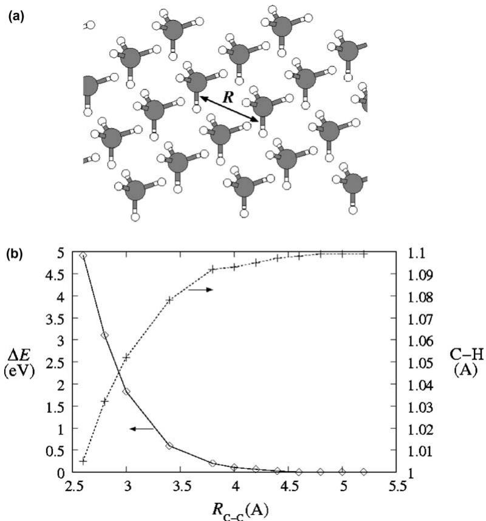
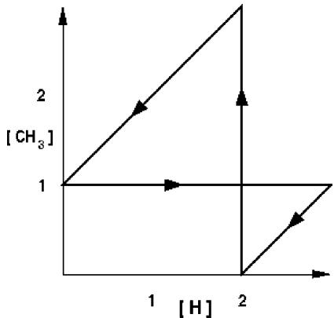
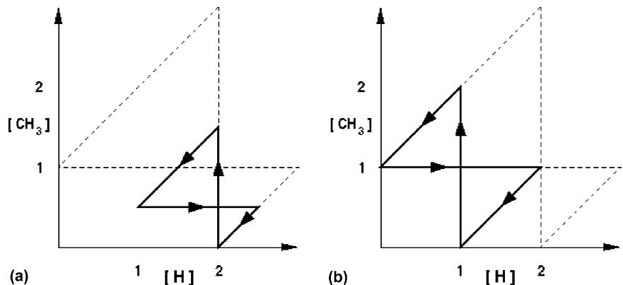
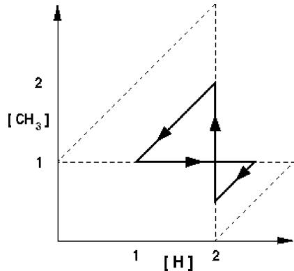

# Predictive process design: a theoretical model of atomic layer deposition

Simon D. Elliott *

NMRC, University College Cork, Lee Maltings, Prospect Row, Cork, Ireland

# Abstract

We present a theoretical framework for the predictive design of atomic layer deposition (ALD). ALD is the leading process for the controlled deposition of thin films in a variety of technologies. For example, insulating alumina layers are fabricated by ALD for electroluminescent flat- screen displays and for node DRAM, and are under investigation as high-  $k$  dielectrics for the MOSFET gate. To develop and optimise an ALD process for a new material requires knowledge of the reaction mechanism. By combining structures computed at the quantum mechanical level and literature data from in situ experiments, we develop a quantitative model of the ALD reaction cycle for alumina deposition. We are thus able to identify the intrinsic limits on ALD growth and explain how the growth rate depends on process conditions. © 2004 Elsevier B.V. All rights reserved.

Keywords: Atomic layer deposition; ab initio calculations; Oxide surface; Alumina; High-  $k$  dielectrics

# 1. Introduction

Atomic Layer Deposition (ALD) is a chemical vapour deposition technique, suitable for the slow and controlled growth of thin, conformal oxide films [1]. Gaseous precursors are admitted separately into the reactor in alternate pulses, chemisorbing individually onto the substrate, rather than reacting in the gas- phase. The reactor is purged with an inert gas between precursor pulses.

Insulating layers of aluminium sesquioxide (alumina,  $\mathrm{Al}_2\mathrm{O}_3$ ) are fabricated by ALD for electroluminescent flat- screen displays [1], for node DRAM and for read/write thin film heads [2]. Despite its modest dielectric constant  $(k \sim 9)$ , the large band gap of alumina and the quality of its interface to silicon has made it a candidate for MOSFET gate dielectrics [3], possibly in combination with higher-  $k$  oxides.

Successful precursors for alumina ALD are trimethylaluminium,  $\mathrm{Al(CH_3)_3}$  or TMA, and water,  $\mathrm{H}_2\mathrm{O}$ , which react to give solid alumina and methane:

$$
\mathrm{AlMe}_{3(\mathrm{g})} + 3 / 2\mathrm{H}_2\mathrm{O}_{(\mathrm{g})}\rightarrow 1 / 2\mathrm{Al}_2\mathrm{O}_{3(\mathrm{s})} + 3\mathrm{CH}_{4(\mathrm{g})}
$$

Various models for the mechanism of alumina ALD have been proposed [4- 6] but definitive evidence for the surface intermediates is lacking. A previous computational study of alumina ALD considered the energetics of TMA hydrolysis, including activation energies, under the uninha- . dered conditions of a cluster model, rather than at a realistic surface [7]. We therefore apply density functional theory (DFT) to models of the growing hydroxylated and methylated alumina surfaces, in order to investigate the atomic- scale structure and reactivity. The resulting mechanism allows us to establish the intrinsic limits to ALD growth.

In this work we develop a quantitative representation of the ALD reaction cycle: a phase portrait in the space of the chemical concentrations of reactive surface intermediates. The prototype reaction portrait is shown in Fig. 1. In each ALD pulse, the surface is saturated by precursor fragments  $\mathrm{CH}_3$  or H) that are reactive during the next pulse. The progress of the ALD process may therefore by plotted against the surface concentration,  $[\mathrm{CH}_3]$  or

  
Fig. 1. Proposed reaction portrait to illustrate ALD growth of alumina from TMA and  $\mathrm{H}_2\mathrm{O}$ . The space is defined by chemical concentrations of surface intermediates: the  $y$  axis is the surface coverage of  $\mathrm{CH}_3$ , adsorbed fragments of the TMA precursor, the  $x$  axis gives the  $\mathrm{H}$  concentration, as  $\mathrm{OH}$  or  $\mathrm{H}_2\mathrm{O}$ , resulting from the  $\mathrm{H}_2\mathrm{O}$  precursor. The units are atoms per unit surface area. The TMA pulse and subsequent purge is indicated as a solid line, the  $\mathrm{H}_2\mathrm{O}$  pulse and purge as a dotted line. The cycle as shown therefore represents the deposition of  $1 / 2\mathrm{Al}_2\mathrm{O}_3$  and the evolution of  $3\mathrm{CH}_4$  (diagonal lines) per cell.

$[\mathrm{H}]$  of each reactive intermediate. The reaction portrait shows the net rate of precursor adsorption (horizontal and vertical lines) and of desorption of the  $\mathrm{CH}_4$  by- product (diagonal lines) during each pulse. The  $\mathrm{Al}_2\mathrm{O}_3$  growth rate is therefore proportional to the size (height or width) of the portrait (only surface species are shown on the portrait, so that there is no explicit representation of the growth of bulk  $\mathrm{Al}_2\mathrm{O}_3$ ). In a successful pulse- purge- pulse- purge cycle leading to stoichiometric growth, there will be no accumulation of either  $\mathrm{CH}_3$  or  $\mathrm{H}$  on the surface, and the cycle will return to its starting point. The coverages are quoted without reference to actual surface structure—for example, it is not specified whether the  $\mathrm{H}$  is present as  $\mathrm{Al} - \mathrm{OH}$  or as  $\mathrm{Al} - \mathrm{OH}_2$ , or whether it penetrates into sub- surface layers.

We will adapt this general representation to the specific case of alumina ALD. First principles calculations are used in Section 2 to establish the coverage limits [Me], [H] and these are compared with literature data. The variation in surface intermediates with process conditions is considered in Section 3, looking in particular at how these change with temperature.

# 2. Coverage limits from first principles computation

# 2.1. Method

The First Principles (FP) method is established as a reliable way to predict materials properties [8]. Self- consistent DFT within 3D- periodic boundary conditions is used to compute the ground state electronic structure. We employ the VASP package [9- 11] and use a standard set of technical parameters, as follows: plane- wave basis  $< 396\mathrm{eV}$ , ultrasoft pseudopotentials [12], gradient- corrected density functional PW91 [13], sparse sampling of reciprocal space [14], self- consistent wavefunction converged to  $10^{- 4}\mathrm{eV}$ , and geometry optimisation to gradients  $< 10^{- 3}\mathrm{eV / \AA}$ .

# 2.2. Methyl coverage

Experimental [5,6,15,16] and theoretical [7,17] studies have shown that, during the TMA pulse,

the precursor reacts with the hydroxylated surface to evolve  $\mathrm{CH_4}$  and to give adsorbed fragments  $\mathrm{Al(CH_3)_2}$  and  $\mathrm{Al(CH_3)}$  (molecularly adsorbed TMA is unstable against desorption, while bare Al reacts with neighbouring  $\mathrm{CH}_3$  [17]). Steric hindrance between adsorbed  $\mathrm{CH}_3$  groups limits further adsorption of TMA, and so limits the deposition rate.

We use a simple model in order to investigate this steric effect: vertically- oriented  $\mathrm{Al - CH}_3$  is represented by  $\mathrm{H}^1\mathrm{- CH}_3$  in a single hexagonal close- packed layer of  $\mathrm{CH_4}$  molecules (Fig. 2a). Fixing the intermolecular  $\mathrm{C} - \mathrm{C}$  distance  $R$  (via the cell size) and constraining  $\mathrm{H}^1$  to lie below C, the geometry was optimised by FP. The resulting energetics are shown in Fig. 2b. Strain is evident at small  $R$  and correlates with contraction of  $\mathrm{C} - \mathrm{H}$  (e.g.

$\Delta E = +1.8$  eV and  $\mathrm{C - H} = 1.05\mathrm{\AA}$  at  $R = 3.0\mathrm{\AA}$  There is little  $\mathrm{CH}_3\mathrm{- CH}_3$  interaction at  $R > 3.8\mathrm{\AA}$ $(\Delta E< +0.2\mathrm{eV}$ $\mathrm{C - H} = 1.10\mathrm{\AA}$  ),corresponding to a  $\mathrm{CH}_3$  coverage of  $13.3\mu \mathrm{mol}\mathrm{m}^{- 2}$  and so this is a reasonable limit for surface packing of  $\mathrm{CH}_3$  during ALD. This is lower than our previous FP estimate for maximum  $\mathrm{CH}_3$  coverage [18]. Experiments on variously- treated silica and alumina surfaces [15] consistently give  $[\mathrm{CH}_3] = 5.6\mathrm{nm}^{- 2} =$ $9.3\mu \mathrm{mol}\mathrm{m}^{- 2}$  , one- third lower than our estimate.

# 2.3. Hydroxyl coverage

Amorphous alumina films are deposited by ALD [1], but the FP method is restricted to simulating periodic systems. We therefore use a slab model of crystalline  $\alpha$ -  $\mathrm{Al}_2\mathrm{O}_3$  terminated by the

  
Fig. 2. Packing of  $\mathrm{CH_4}$  molecules at a  $\mathrm{C} - \mathrm{C}$  distance  $R$ , computed by FP. (a) Model of close-packed  $\mathrm{CH_4}$ , constrained with  $\mathrm{H}^1$ - $\mathrm{C}$  along  $z$ , representing the surface  $\mathrm{Al - CH}_3$  bond. (b) Computed FP energetics (left axis) and optimised  $\mathrm{C} - \mathrm{H}$  distances (right axis), excluding the  $z$ -oriented  $\mathrm{C} - \mathrm{H}^1$ .

0001) plane. Convergence of absolute energies  $(< 1\mathrm{meV / Al}_2\mathrm{O}_3)$  and interferic distances  $(< 0.04\mathrm{\AA})$  was achieved for 6- layer bare slabs  $(13.1\mathrm{\AA})$  separated by at least  $6\mathrm{\AA}$  of vacuum. Each  $\mathrm{Al}_2\mathrm{O}_3$  layer is  $2.1\mathrm{\AA}$  deep and shows a surface density of  $8.7\mu \mathrm{mol}\mathrm{m}^{- 2}\mathrm{Al}_2\mathrm{O}_3$

Dissociative chemisorption of  $\mathrm{H}_2\mathrm{O}$  onto bare alumina surfaces produces a monolayer of OH groups up to the gibbsite- like  $\mathrm{Al(OH)}_3$  termination (Fig. 3,  $[\mathrm{H}] = 26\mu \mathrm{mol}\mathrm{m}^{- 2}$ ) and is computed by FP to release  $\Delta E = - 1.5\pm 0.1\mathrm{eV / H_2O}$ , matching that computed elsewhere for the hydration of bulk anhydrous alumina to gibbsite [19]. This gibbsite- like surface has been proposed before as the saturating step in alumina ALD [4]. We note in passing that our simulations also reveal migration of  $\mathrm{H}$  into sub- surface layers, as calculated in [19], producing a lower- density sub- surface zone of aluminium hydroxide, but such a complex surface model is not investigated further here. Molecular adsorption of additional  $\mathrm{H}_2\mathrm{O}$  in hydrogen- bonded networks  $(\mathrm{O - H} = 1.6 - 2.2\mathrm{\AA})$  on top of the gibbsite- like surface is computed by FP to show  $\Delta E$  of  $- 0.7$  to  $- 0.8\mathrm{eV / H_2O}$  so that these may be a feature of the surface during the  $\mathrm{H}_2\mathrm{O}$  pulse.

Using the Sackur- Tetrode equation [20], we estimate that the gas- phase translational entropy during the subsequent purge is  $T\Delta S = 1.5\mathrm{eV} / \mathrm{H}_2\mathrm{O}$  ( $T = 450\mathrm{K}$ ,  $p = 0.5\mathrm{mPa}$  [5]). By comparison with the  $\Delta E$  above, it is clear that all molecular  $\mathrm{H}_2\mathrm{O}$  will desorb during the purge and that some OH will recombine and desorb as  $\mathrm{H}_2\mathrm{O}$  to leave a partially- hydroxylated surface with  $[\mathrm{H}]< 26$ $\mu \mathrm{mol}\mathrm{m}^{- 2}$

  
Fig. 3. Fully-hydroxylated gibbsite-like termination of  $\alpha -\mathrm{Al}_2\mathrm{O}_3$  computed by FP (light grey = Al, dark grey = C, white = H).

# 3. Effect of process conditions on mechanism

# 3.1. Optimum conditions

Bringing together the mechanistic data from Sections 2.2 and 2.3, a reaction portrait for optimum alumina ALD is proposed in Fig. 4. In this scheme, starting from the gibbsite- like hydroxylated substrate, one TMA molecule adsorbs per surface cell, two  $\mathrm{CH}_4$  desorb and a surface covered with capping  $\mathrm{Al}(\mathrm{CH}_3)$  is generated. The coverage of  $[\mathrm{Me}] = 1$  per cell corresponds to a coverage of  $13\mu \mathrm{mol}\mathrm{m}^{- 2}$ . During the  $\mathrm{H}_2\mathrm{O}$  pulse and purge, 1.5 molecules per cell are needed to adsorb and react, one  $\mathrm{CH}_4$  is desorbed and the hydroxylated substrate is restored (2 OH per cell,  $26\mu \mathrm{mol}\mathrm{m}^{- 2}$ ). From this cycle we predict that, under optimum conditions, the maximum growth rate is  $1 / 2\mathrm{Al}_2\mathrm{O}_3$  per cycle per cell, which corresponds to 0.75 monolayer/cycle or  $1.6\mathrm{\AA}$  cycle of  $\alpha - \mathrm{Al}_2\mathrm{O}_3$ . (A slight correction may be needed for as- deposited films, since these are  $\sim 10\%$  less dense than  $\alpha - \mathrm{Al}_2\mathrm{O}_3$  [5].) This shows that deposition of a complete monolayer of  $\mathrm{Al}_2\mathrm{O}_3$  is impossible, primarily because of steric hindrance at the surface.

According to this mechanism, about  $66\%$  of the  $\mathrm{CH}_4$  is lost during the TMA pulse. Support for this

  
Fig. 4. ALD reaction portrait for optimum growth of alumina from TMA and  $\mathrm{H}_2\mathrm{O}$ , subject to the constraints of  $[\mathrm{Me}] = 1 / \mathrm{cell}$  and  $[\mathrm{H}] = 2 / \mathrm{cell}$ .

comes from in situ experiments: the proportion of  $\mathrm{CH_4}$  evolved during this pulse is measured as  $50\%$  (measured by quadrupolar mass spectrometry) or  $60 - 70\%$  (by quartz crystal microbalance) [6]. However, experimental growth rates for alumina ALD under optimal conditions  $(\mathrm{a}\pm 50\mathrm{K}$  window centred on  $450–500\mathrm{K})$  are  $1.0 - 1.1\mathrm{\AA}$  cycle [5,6,16], one third lower than our estimate above. This reflects the measured  $\mathrm{CH}_3$  coverage, one- third lower than that computed (Section 2), because of the linear relationship between  $[\mathrm{Me}]$  and growth rate (Section 3.2).

# 3.2. Effect of coverage on growth rate

Maximum coverages of ordered  $\mathrm{CH}_3$  and OH groups at  $T = 0\mathrm{K}$  are computed in Sections 2.2 and 2.3 respectively. However at elevated temperatures, disordered packing and desorption of intermediates  $\mathrm{H}_2\mathrm{O}$ $\mathrm{CH}_3$  - containing fragments) will ensure that these coverages are not achieved. Two possible  $T > 0\mathrm{K}$  scenarios are illustrated as reaction portraits in Fig. 5. Changes in the  $\mathrm{CH}_3$  coverage have straightforward consequences: the less TMA that can be adsorbed, the lower the growth rate. For instance, the reaction portrait in Fig. 5a shows  $[\mathrm{CH}_3]$  at half of the  $T = 0\mathrm{K}$  value and the resultant rate is half of the maximum (i.e.  $0.8\mathrm{\AA}$  cycle).

As discussed above (Section 2.3), there is gradual dehydroxylation of the alumina surface with increasing temperature, even in a  $\mathrm{H}_2\mathrm{O}$  ambient. However, in contrast to the  $[\mathrm{Me}]$  case,  $[\mathrm{H}]$  does not have a linear effect on growth rate. Fig. 5b is the reaction portrait for  $[\mathrm{H}] = 1 / \mathrm{cell}$  (i.e. half of the optimum gibbsite- like termination) at the end of the  $\mathrm{H}_2\mathrm{O}$  pulse + purge, providing sufficient  $\mathrm{H}$  to give a surface saturated by an equal mixture of  $\mathrm{Al}(\mathrm{CH}_3)$  and  $\mathrm{Al}(\mathrm{CH}_3)_2$  at the end of the TMA pulse + purge. The reaction portrait shows that the overall rate is two- thirds of the optimum, i.e.  $1.1\mathrm{\AA}$  cycle. In this way, the model predicts a decrease in rate with decreasing  $[\mathrm{H}]$ , i.e. with increasing temperature, in agreement with experiment [6]. However, it should be noted that this is not related to a decrease in OH as adsorption sites for TMA, as some authors suggest.

# 3.3. Effect of mobility on growth rate

Given that there is an energetic barrier to the H- transfer reaction that leads to  $\mathrm{CH}_4$  desorption, alumina ALD may be limited by kinetics. In general, we predict that the growth rate drops in proportion to the reduction in  $\mathrm{H}$  mobility. For instance, the reaction portrait in Fig. 6 shows half of the available  $\mathrm{H}$  reacting to give  $\mathrm{CH}_4$  during the  $\mathrm{H}_2\mathrm{O}$  pulse + purge, and the resultant rate is half of the optimum (i.e.  $0.8\mathrm{\AA}$  cycle). It is also evident that some unreacted  $\mathrm{C}$  and  $\mathrm{H}$  remains on the surface throughout the process  $([\mathrm{CH}_3] > 6.6\mu \mathrm{mol}\mathrm{m}^{- 2}$ ,  $[\mathrm{OH}] > 13\mathrm{mol}\mathrm{m}^{- 2})$ , and this may result in contamination of the growing film. Such

  
Fig. 5. ALD reaction portraits showing the effect of lower coverage: (a)  $\mathrm{CH}_3$  coverage at half the optimum level; (b)  $\mathrm{H}$  (or  $\mathrm{OH}$ ) coverage at half the optimum level.

  
Fig. 6. ALD reaction portrait showing the effect of incomplete H-transfer (e.g. at low temperature) so that not all Me or H is consumed each cycle. In the example shown here, only half of the available H is allowed to react to yield  $\mathrm{CH_4}$ , compared to the optimum case (Fig. 4).

kinetically- limited ALD may occur at low temperatures, so that C and H impurity levels are highest at deposition temperatures  $< 450\mathrm{K}$ .

# 4. Conclusion

A theoretical model is presented for the atomicscale mechanism of alumina growth by atomic layer deposition from TMA and  $\mathrm{H}_2\mathrm{O}$  precursors. First Principles density functional calculations are combined with literature data to determine the likely intermediates during the reaction cycle and their surface concentrations. This mechanistic information allows a quantitative portrait of the reaction to be sketched in the space of the coverage of intermediates. As well as giving an estimate of the maximum theoretical rate, the reaction portrait illustrates the effect of lower  $\mathrm{CH}_3$  or OH coverage (high temperature) and of lower H mobility (low temperature), both consistent with experiment. As a general rule, the highest growth rate is achieved when as much  $\mathrm{CH}_4$  is evolved during the TMA pulse as possible. The use of reaction portraits will simplify the analysis and design of deposition processes.

# Acknowledgement

We are grateful for funding by the European Community under the "Information Society Technologies" Programme through the HIKE project, available from: <http://www.nmrc.ie/hike>.

# References

[1] M. Leskelä, M. Ritala, Thin Solid Films 409 (2002) 138. [2] A. Paranjpe, S. Gopinath, T. Omstead, R. Dubber, J. Electrochem. Soc. 148 (2001) G465. [3] E.P. Gusev, M. Copel, E. Cartier, I.J.R. Baumvol, C. Krug, M.A. Gribenyuk, Appl. Phys. Lett. 76 (2000) 176. [4] R. Di Felice, J.E. Northrup, Phys. Rev. B 60 (1999) R16287. [5] A.W. Ott, J.W. Klaus, J.M. Johnson, S.M. George, Thin Solid Films 292 (1997) 135. [6] A. Rahtu, T. Alaranta, M. Ritala, Langmuir 17 (2001) 6506. [7] Y. Widjaja, C.B. Musgrave, Appl. Phys. Lett. 80 (2002) 3304. [8] M.J. Gillan, J. Phys.: Condens. Matter 1 (1989) 689. [9] G. Kresse, J. Hafner, Phys. Rev. B 49 (1994) 14251. [10] G. Kresse, J. Furtmuller, Phys. Rev. B 54 (1996) 11169. [11] G. Kresse, J. Furtmuller, Comput. Mater. Sci. 6 (1996) 15. [12] G. Kresse, J. Hafner, J. Phys.: Condens. Matter 6 (1994) 8245. [13] J.P. Perdew et al., Phys. Rev. B 46 (1992) 6671. [14] H.J. Monkhorst, J.D. Pack, Phys. Rev. B 13 (1976) 5188. [15] R.L. Puurunen, A. Root, P. Sarv, M.M. Viitanen, H.H. Brongersma, M. Lindblad, A.O.I. Krause, Chem. Mater. 14 (2002) 720. [16] R. Matero, A. Rahtu, M. Ritala, M. Leskelä, T. Sajavaara, Thin Solid Films 368 (2000) 1. [17] S. Elliott, J.C. Greer, J. Mater. Chem. 14 (2004) 3246. [18] S.D. Elliott, First Principles modelling of the deposition process for high-  $k$  dielectric films, Electrochem. Soc. Proc. 2003- 14 (2003) 231. [19] C. Wolverton, K.C. Hass, Phys. Rev. B 63 (2001) 024102. [20] P.W. Atkins, Physical Chemistry, fourth ed., Oxford University Press, Oxford, 1990.