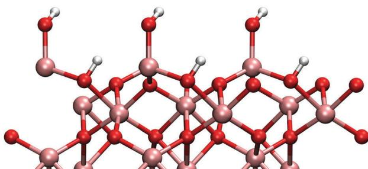
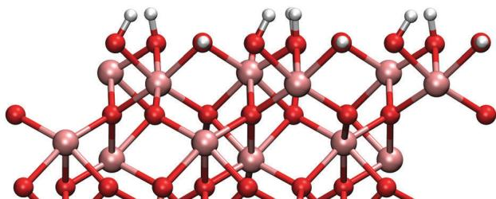
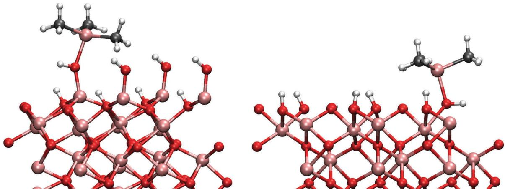
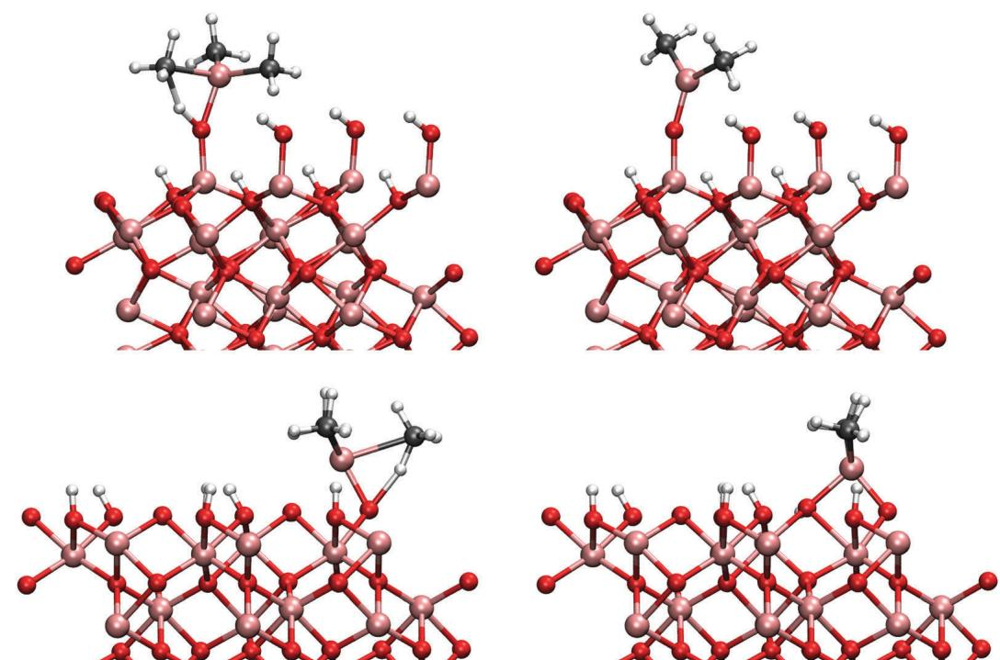
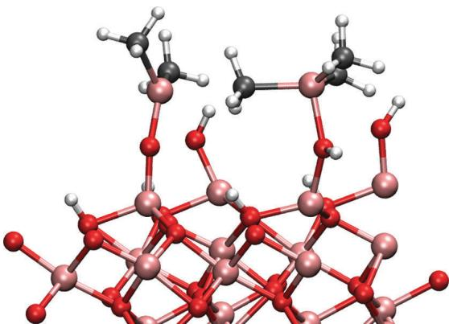
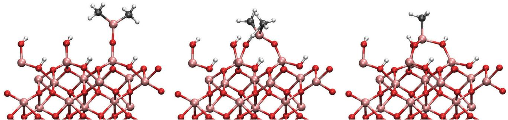
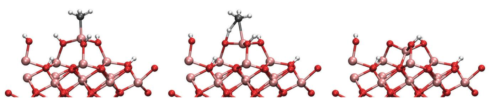
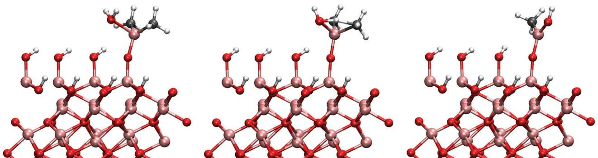
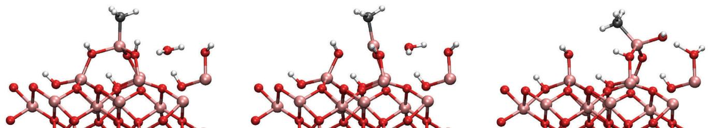
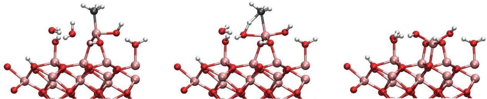

# First principles study of the atomic layer deposition of alumina by TMA- $\mathsf{H}_2\mathsf{O}$ -process

Cite this: Phys. Chem. Chem. Phys., 2015, 17, 17322

Timo Weckman* and Kari Laasonen

Received 1st April 2015, Accepted 2nd June 2015

DOI: 10.1039/c5cp01912e

www.rsc.org/pccp

Atomic layer deposition (ALD) is a coating technology used to produce highly uniform thin films. Aluminiumoxide,  $\mathrm{Al}_2\mathrm{O}_3$ , is mainly deposited using trimethylaluminium (TMA) and water as precursors and is the most studied ALD- process to date. However, only few theoretical studies have been reported in the literature. The surface reaction mechanisms and energetics previously reported focus on a gibbsite- like surface model but a more realistic description of the surface can be achieved when the hydroxylation of the surface is taken into account using dissociatively adsorbed water molecules. The adsorbed water changes the structure of the surface and reaction energetics change considerably when compared to previously studied surface model. Here we have studied the TMA-  $\mathrm{H}_2\mathrm{O}$  process using density functional theory on a hydroxylated alumina surface and reproduced the previous results for comparison. Mechanisms and energetics during both the TMA and the subsequent water pulse are presented. TMA is found to adsorb exothermically onto the surface. The reaction barriers for the ligand- exchange reactions between the TMA and the surface hydroxyl groups were found to be much lower compared to previously presented results. TMA dissociation on the surface is predicted to saturate at monomethylaluminium. Barriers for proton diffusion between surface sites are observed to be low. TMA adsorption was also found to be cooperative with the formation of methyl bridges between the adsorbants. The water pulse was studied using single water molecules reacting with the DMA and MMA surface species. Barriers for these reactions were found to reasonable in the process conditions. However, stabilizing interactions amongst water molecules were found to lower the reaction barriers and the dynamical nature of water is predicted to be of importance. It is expected that these calculations can only set an upper limit for the barriers during the water pulse.

# 1 Introduction

Atomic layer deposition is a coating technology used for the construction of various thin films. ALD is based on sequential, self- terminating gas- solid reactions. A prototype process is based on two precursors that react rapidly and violently with each other. The reaction between the precursors is forced onto the surface by alternating gas pulses while the gas- phase reactions are avoided by purging the reactor with inert gas between the pulses. Ideally each precursor pulse forms a new monolayer onto the surface. A vast majority of the ALD- processes are run at temperatures higher than  $400~\mathrm{K}$ . The choice for the precursors is therefore crucial for the process as there should be no reactions amongst the precursors themselves in order for the adsorption process to be self- terminating. The self- limiting nature of the adsorption in ALD enables a highly uniform and conformal deposition of a material with thickness control at the atomic level. $^{1 - 3}$

The trimethylaluminium- water- process is perhaps the most studied ALD- process. Because of the ideally self- terminating nature of the adsorption process and inertness of the reaction by- product methane, the TMA-  $\mathrm{H}_2\mathrm{O}$ - system is considered as a model process for  $\mathrm{ALD}^{3,4}$  and is worth a careful study. However, only few theoretical studies have been published hitherto and most of the research concerning the process has been experimental work. Here we try to bridge this gap by revisiting some of the results previously published in the literature and also present reaction pathways for the initial reactions in the process.

The produced thin film, aluminum oxide  $(\mathrm{Al}_2\mathrm{O}_3)$ , is an important dielectric material with a large band gap of  $9\mathrm{eV}$  and moderate permittivity. Its various commercial applications include flat- screen electroluminescent displays, protective coating, read/write heads, DRAM and it has been considered as a gate dielectric in complementary metal- oxide- semiconductors, CMOS. $^{5 - 8}$  The total reaction of the process is

$$
\mathrm{Al(CH_3)_3 + \frac{3}{2}H_2O\longrightarrow\frac{1}{2}Al_2O_3 + 3CH_4}
$$

This overall reaction is often divided into two parts, one "half- reaction" for the TMA- pulse and another one for the water- pulse (surface is described here with a  $\parallel$

$$
\| \mathrm{-OH} + \mathrm{Al}(\mathrm{CH}_3)_3\rightarrow \| \mathrm{-O - Al}(\mathrm{CH}_3)_2 + \mathrm{CH}_4 \tag{R1}
$$

$$
\| \mathrm{-O - Al}(\mathrm{CH}_3)_2 + \mathrm{H}_2\mathrm{O}\rightarrow \| \mathrm{-O - Al}(\mathrm{CH}_3)\mathrm{OH} + \mathrm{CH}_4
$$

In addition to the straight- forward ligand- exchange reaction in eqn (R1), a reaction simultaneously with two hydroxyl groups has also been proposed

$$
2\| -\mathrm{OH} + \mathrm{Al}(\mathrm{CH}_3)_3\rightarrow \| (-\mathrm{O})_2 - \mathrm{Al}(\mathrm{CH}_3) + 2\mathrm{CH}_4 \tag{R3}
$$

TMA has also been observed to adsorb dissociatively onto the oxygen bridges on the surface.4

Previously only few computational studies considering the TMA-  $\mathrm{H}_2\mathrm{O}$  system has been presented, focusing mainly on mechanisms (R1) and (R2). The first publications on the growth of  $\mathrm{Al}_2\mathrm{O}_3$  thin films was done using cluster models10,11 consisting of only about a dozen atoms. Few papers12- 14 using the periodic slab model with gibbsite- like  $\mathrm{Al(OH)_3}$  - surface describing the hydroxylated alumina have been published.

As alumina is almost always covered with either dissociated or molecularly adsorbed water, hydroxylation is of great importance for alumina's surface chemistry. For example the growthper- cycle (GPC) of the TMA-  $\mathrm{H}_2\mathrm{O}$  - process has been observed to be linearly dependent on the hydroxylation of the surface.4 This hydroxylation of the alumina surface has been taken into account in the computational studies using a gibbsite- like  $\mathrm{Al(OH)_3}$  surface structure. However, this proposed model by Elliott et al.15 neglects the finite temperature effects of the hydroxylation. A more comprehensive study of the surface composition by Lodziana et al.16 shows that the gibbsite- like surface exists only under large water partial pressures and low temperatures  $(< 400\mathrm{K})$  and is not thermodynamically stable in the process conditions (typical pulse conditions:  $P = 2\mathrm{Pa}$ $T =$ $450~\mathrm{K}$  . In low pressures the surface structure is not planar as is the case with gibbsite- like surface, but dissociated water introduces two kinds of hydroxyl groups, one being higher than the other. This has large effects on the previously reported reaction mechanisms and energetics. The surface structure presented by Lodziana et al. is from here on called the hydroxylated surface model in contrast to the previously used gibbsite surface model.

Here we present detailed energetics of the initial reaction pathways on the hydroxylated surface during the TMA pulse and compare the results to the previously used gibbsite- like surface model. The dimethylaluminium and monomethylaluminium end- products from the TMA molecule calculations are used to approximate surface sites at the end of the TMA pulse in order to study the energetics during the water pulse. From these results the energetics at a finite temperature and pressure are constructed and kinetic parameters for the reactions are computed, allowing the course of the surface process to be extrapolated.

# 2 Computational methods

# 2.1 Technical details

The reaction pathways were studied using self- consistent density functional theory as implemented in GPAw.17 The exchange and correlation part of the total energy was treated with gradient corrected Perdew- Burke- Ernzerhof functional18 using grid spacing of  $0.2\mathrm{\AA}$  The TS09 van der Waals correction on top of the PBE functional was used as proposed by Tkatchenko and Scheffler.19 The  $k$  - points sampling of the reciprocal space was done using  $2\times 2\times 2$  Monkhorst- Pack grid for bulk calculations and  $2\times 2\times 1$  for the surface calculations. All geometry optimizations were carried out to gradients smaller than  $0.05\mathrm{eV}\mathrm{\AA}^{- 1}$  . Partial charge analysis was conducted from the electron density with a Bader analysis.20

Free energies of the reaction pathways were estimated in the ideal gas limit. The Gibbs free energy difference between two states was calculated as

$$
\Delta G = \Delta (E_{\mathrm{elec}} + E_{\mathrm{ZPE}}) - T\Delta S \tag{1}
$$

where the  $E_{\mathrm{elec}}$  is the electronic and  $E_{\mathrm{ZPE}}$  the zero- point energy of a state.  $\Delta S$  is the change in entropy between two states. Rotational and translational energy contributions were also included for the gaseous molecules.

The translational entropy of the gaseous molecules was estimated using the Sackur- Tetrode equation

$$
S_{\mathrm{rot}} = R\left[\ln \left[\left(\frac{2\pi Mk_{\mathrm{B}}T}{h^{2}}\right)^{3 / 2}\frac{k_{\mathrm{B}}T}{P}\right] + \frac{5}{2}\right] \tag{2}
$$

where  $P$  is the pressure of the gaseous component and  $M$  is the mass of the molecule. The rotational entropy was approximated with the rigid rotor- model

$$
S_{\mathrm{rot}} = R\left[\ln \left[\left(\frac{8\pi^{2}k_{\mathrm{B}}T}{h^{2}}\right)^{3 / 2}\frac{\sqrt{\pi}I_{\mathrm{A}}I_{\mathrm{B}}I_{\mathrm{C}}}{\sigma}\right] + \frac{3}{2}\right] \tag{3}
$$

where  $\sigma$  is the symmetry number corresponding to the molecule (6 for TMA, 12 for  $\mathrm{CH_4}$  and 2 for  $\mathrm{H}_2\mathrm{O}$  and  $I_{\mathrm{A}},I_{\mathrm{B}}$  and  $I_{\mathrm{C}}$  are the principal moments of inertia. Bond vibrations were treated as harmonic oscillations:21

$$
S_{\mathrm{sub}} = R\sum_{i}\left[\frac{h\omega_{i}}{k_{\mathrm{B}}T(\mathrm{e}^{h\omega_{i} / k_{\mathrm{B}}T} - 1)} -\ln \left(1 - \mathrm{e}^{-h\omega_{i} / k_{\mathrm{B}}T}\right)\right] \tag{4}
$$

To reduce the computational burden associated with vibrational calculations on the solid surface the vibrations on the surface were restricted only to the top layer and bulk modes were assumed to remain unchanged. To avoid erroneous contributions from low frequency modes, modes corresponding to wavenumber less than  $209~\mathrm{cm}^{- 1}$  (equal to  $300~\mathrm{K}$  were omitted from the partition function.

In order to study the surface reactions, the kinetic rates were quantified. Reaction rate coefficients for the surface reactions

were calculated using the Eyring equation22 in the harmonic approximation:

$$
k_{i} = \frac{k_{\mathrm{B}}T}{h}\mathrm{e}^{-\frac{\Delta G_{i}^{\dagger}}{k_{\mathrm{B}}T}} \tag{5}
$$

where  $h$  is the Planck constant and  $\Delta G_i^\dagger$  is the Gibbs activation free energy for the reaction pathway  $i$  For the adsorption process the rate was approximated using the particle flux from the kinetic gas theory:22

$$
k_{\mathrm{ads},i} = \frac{P\sigma(T,\theta)}{\sqrt{2\pi m k_{\mathrm{B}}T}} A_{i} \tag{6}
$$

where the  $P$  is the pressure of the adsorbant,  $m$  is mass of the precursor molecule and  $A_{i}$  is the area of the adsorption site  $i$  In our calculations the area of adsorption site is taken as the reciprocal of the surface concentration.  $\sigma (T,\theta)$  is the sticking probability of the adsorbant, which is unity at low surface coverage.

The minimum energy paths (MEP) for transition states were found using the nudged elastic band method23 where the potential energy surfaces first- order saddle point for transition from initial to final state is found by setting consecutive images of the system along the reaction path. These replicas are connected to each other by a harmonic force and relaxed along the MEP. The initial gases of the path was created by interpolating the configurations between the initial and final geometries. Transition state was found using the so- called climbing image method with alternating force constants.

# 2.2 Substrate models

During ALD growth amorphous alumina is deposited onto the substrate. However, amorphous structure is difficult to simulate ab initio, so a  $\alpha - \mathrm{Al}_2\mathrm{O}_3$  crystalline structure was chosen as in previous studies.12,13,15,24 The  $\alpha - \mathrm{Al}_2\mathrm{O}_3$  (0001) surface has been studied both experimentally and theoretically25- 29 and the Al- terminated surface has been shown to be the most stable surface of  $\alpha - \mathrm{Al}_2\mathrm{O}_3$

The surface was modelled using the slab model with periodic boundary conditions imposed. Thickness of the slab was six  $\mathrm{Al}_2\mathrm{O}_3$  layers as in previous calculations.12,16 The convergence of the surface relaxation energy with different slab thicknesses was tested and was found to be in good agreement with those presented in the literature.30 The bottom layers of the slab were constrained for the calculations. The surface cells consisted of  $2\times 2$  unit cells (in total 120 atoms) with surface area of  $0.82\mathrm{nm}^2$

The surface hydroxylation was taken into account using dissociatively adsorbed water surface presented by Lodziana et al.16 The resulting hydroxylated surface has a hydroxyl group coverage of about  $16\mu \mathrm{mol}\mathrm{m}^{- 2}$  that is very close to the experimental value of  $15\mu \mathrm{mol}\mathrm{m}^{- 2}$  31 The gibbsite- like surface is constructed by replacing the top- most aluminium atoms with three hydrogen atoms. Hydroxyl concentration on the gibbsite- like surface is about  $25\mu \mathrm{mol}\mathrm{m}^{- 2}$  . The previous study by Elliott and Greer12 using gibbsite- like surface was also repeated for comparison.

The adsorption energy for the dissociatively adsorbed water molecules was calculated as an average over all the adsorbed water molecules in the monolayer,

$$
E_{\mathrm{ads}} = \frac{E_{\mathrm{slab}} - E_{\mathrm{Al_2O_3}} - NE_{\mathrm{H_2O}}}{N} \tag{7}
$$

where  $E_{\mathrm{Al_2O_3}}$  is bare aluminium slab or the previously filled monolayer and  $E_{\mathrm{H_2O}}$  is a single water molecule in a vacuum.32

# 3 Results

Both the TMA and water pulses were studied. The TMA adsorption and subsequent ligand- exchange reactions were studied on the hydroxylated and on the gibbsite- like surface. The water pulse was studied with few water molecules using the DMA and MMA surface species as the initial configuration.

The main mechanisms studied can be summed up by the following reaction equations:

$$
\| -\mathrm{OH} + \mathrm{Al}(\mathrm{CH}_3)_3\rightarrow \| -\mathrm{O - Al}(\mathrm{CH}_3)_2 + \mathrm{CH}_4 \tag{1a}
$$

$$
\| -\mathrm{OH} + \| -\mathrm{O - Al}(\mathrm{CH}_3)_2\rightarrow (\| -\mathrm{O})_2 - \mathrm{Al}(\mathrm{CH}_3) + \mathrm{CH}_4
$$

$$
\| -\mathrm{OH} + (\| -\mathrm{O})_2 - \mathrm{Al}(\mathrm{CH}_3)\rightarrow (\| -\mathrm{O})_3 - \mathrm{Al} + \mathrm{CH}_4 \tag{1c}
$$

$$
\| -\mathrm{O - Al}(\mathrm{CH}_3)_2 + \mathrm{H}_2\mathrm{O}\rightarrow \| -\mathrm{O - Al}(\mathrm{CH}_3)\mathrm{OH} + \mathrm{CH}_4
$$

$$
\| -\mathrm{O - Al}(\mathrm{CH}_3)\mathrm{OH} + \mathrm{H}_2\mathrm{O}\rightarrow \| -\mathrm{O - Al}(\mathrm{OH})_2 + \mathrm{CH}_4 \tag{2b}
$$

$$
(\| -\mathrm{O})_2 - \mathrm{Al}(\mathrm{CH}_3) + \mathrm{H}_2\mathrm{O}\rightarrow (\| -\mathrm{O})_2 - \mathrm{Al}(\mathrm{OH}) + \mathrm{CH}_4 \tag{2c}
$$

Eqn (1a)- (1c) represent reactions during the TMA pulse and (2a)- (2c) reactions during the water pulse. Some additional calculations were also done, e.g. the effect of several adsorbants during the TMA pulse, and will be discussed in the text. The main reaction mechanisms were treated with a vibrational analysis and the free energies for these reactions were calculated.

In the reaction (1a) the TMA is decomposed into dimethylaluminium (DMA) surface species and in the second reaction reacts with the surface even further to produce a monomethylaluminium (MMA). These two products are taken as the starting points for the water pulse. Water pulse reactions were studied with only a single TMA molecule in a  $2\times 2$  unit cell representing low TMA coverage.

# 3.1 Alumina - bulk and surface

The bulk oxide model was optimized using DFT by scanning the potential energy surface by changing the lattice vectors and keeping the lattice angles constant. The optimized cell parameters were found to be  $a = b = 4.762\mathrm{\AA}$  and  $c / a = 2.760$  in close agreement with both experiment33 and other theoretical studies.12,16

In the original paper by Lodziana et al. no van der Waalscorrection was used, so we present our results with and without the vdW- correction for clearer comparison. The calculated heat of adsorption for water with different surface coverages is given in Table 1. The general trend in the results is in good

Table1 The adsorption energies for water with different surface coverages given in eV per water molecule. The asterisk denotes dissociative adsorption The monolayer is defined as a water molecule per a  $1\times 1$  unit cell which gives a surface hydroxide concentration of  $16\mu \mathrm{mol}\mathrm{m}^{-2}$  for 1 ML coverage  

<table><tr><td></td><td>1/4 ML</td><td>1/2 ML</td><td>1 ML</td><td>2 ML</td><td>3 ML</td></tr><tr><td>Lodziana et al.,16 PW91-functional</td><td>-1.379*</td><td>-1.517*</td><td>-1.516*</td><td>-0.780</td><td>-0.494</td></tr><tr><td>This work, PBE</td><td>-1.202*</td><td>-1.256*</td><td>-1.383*</td><td>-0.607</td><td>-0.378</td></tr><tr><td>This work, PBE+vdW</td><td>-1.336*</td><td>-1.563*</td><td>-1.487*</td><td>-0.956</td><td>-0.409</td></tr></table>

agreement with the previous results. The bonding energies using only the PBE- functional are slightly smaller than the obtained using the similar PW91- functional.

As can be expected, the inclusion of the van der Waalscorrection increases the adsorption energy overall when compared to the pure functional. The difference is in the order of  $- 0.3$  to  $- 0.1\mathrm{eV}$  per water molecule. Especially the adhesion of the second monolayer is increased when compared to the pure functionals PW91 and PBE. With the addition of the third monolayer, the van der Waals correction has little difference to the energies obtained using the pure functional.

Adsorbed water produces surface structure that has two distinct hydroxyl groups (see Fig. 1). The higher hydroxyl groups are formed from the water molecule and the lower is formed from the dissociated hydrogen that bonds to a surface oxygen. TMA adsorption is possible only onto to higher hydroxyl group due to steric effects.

The gibbsite- like surface was constructed by replacing the top Al- atoms with three hydrogen atoms. Two of these hydrogens orient vertically and one horizontally with respect to the surface (Fig. 2). Adsorption to the horizontal group is preferred due to the possible Lewis acid- base reaction between the TMA and the oxygens lone pair of electrons, but adsorption to the vertical group was also found to be possible.

The differences in the surface geometries cause a difference in the electronic structures between the two models. There is however only small difference in the bond lengths and partial charges between the two surfaces. All the Al- O bonds in the bulk phase are  $1.9 - 2.0\mathrm{\AA}$  and partial charges 2.5 and  $- 1.6$  for aluminium and oxygen, respectively. On the gibbsite- like surface Al- O bonds are close to the bulk values but on the hydroxylated surface they are slightly shorter  $(1.7\mathrm{\AA})$  .Partial charges on the surface atoms are slightly smaller than in the bulk on both surfaces.

  
Fig. 1 Side-view of the hydroxylated surfaces formed from dissociatively adsorbed water. Two kinds of hydroxyl groups are present, the higher group formed from the water molecule and the lower one formed with the dissociated hydrogen and surface oxygen. A monolayer coverage is achieved when four water molecules adsorb onto a  $2\times 2$  cell which corresponds to a surface concentration of  $16\mu \mathrm{mol}\mathrm{m}^{-2}$ . Only three molecules are visible from this view due to overlap.

  
Fig. 2 Side-view of the gibbsite-like surface. Stoichiometric gibbsite-layer is formed when the top aluminium atoms are replaced with three hydrogen atoms. Gibbsite-like surface gives two vertical and one horizontal hydroxyl groups per unit cell. Gibbsite-like surface corresponds to a hydroxyl surface concentration of  $25\mu \mathrm{mol}\mathrm{m}^{-2}$ .

# 3.2 Reactions during the TMA pulse

3.2.1 TMA adsorption and first dissociation. On the hydroxyl- ated surface the TMA adsorption takes place on one of the higher hydroxyl groups. Adsorption to the lower hydroxyl groups if blocked by steric interaction. The adsorption was found to be exothermic with adsorption energy of  $- 1.13\mathrm{eV}$ . Any translational motion between adsorption sites on the surface is blocked by a diffusion barrier of  $0.88\mathrm{eV}$ .

A straight- forward ligand- exchange reaction with the adsorbent hydroxyl groups was assumed to take place as in mechanism (1a). The TMAs methyl group forms a methane molecule with the proton of the hydroxyl group and desorbs into the gas phase. Barrier for this ligand- exchange reaction was found to be only  $0.35\mathrm{eV}$  with reaction energy of  $- 0.70\mathrm{eV}$ .

The same mechanism was also studied on the gibbsite- like surface. Just as previously shown by Elliott and Greer, the TMA most favourably adsorbs onto the horizontal hydroxyl group. The adsorption energy to the horizontal group was  $- 1.60\mathrm{eV}$ , considerably more exothermic than on the hydroxyl- ated surface. However, we found that for the ligand- exchange reaction TMA preferably bonds to a vertical hydroxyl group where the proton is more accessible. Adsorption energy directly to the vertical hydroxyl group would be  $- 1.52\mathrm{eV}$ . The reaction barrier for the reaction is  $0.69\mathrm{eV}$  in agreement with the previously reported result of  $0.9\mathrm{eV}$  by Elliott and Pinto. At the end of the reaction DMA is coordinated to two oxygens which makes the configuration very stable. The overall reaction energy after the desorption of methane was  $- 0.88\mathrm{eV}$ . The adsorbed TMA on the two different surfaces is illustrated in Fig. 3.

  
Fig. 3 Adsorbed TMA on the hydroxylated surface (left) and on the gibbsite surface (right). Brown, red, black and white spheres represent aluminium, oxygen, carbon and hydrogen, respectively. The TMA is more distorted from its planar structure on the gibbsite surface than on the hydroxylated surface. However, the adsorption energy on the gibbsite-surface is  $0.5\text{eV}$  more exothermic than on the hydroxylated surface. There is no differences in the adsorption bond lengths between the two surface models.

The transition and final states on both surface models are illustrated in Fig. 4.

While TMA adsorbs exothermically on both surfaces, the adsorption energy on the gibbsite- surface is  $0.5\text{eV}$  more negative than on the hydroxylated surface. Yet, there is very little difference between the adsorption bonds lengths (Al- O bond  $2.04\text{\AA}$  and  $2.02\text{\AA}$  on the hydroxylated and gibbsite surface, respectively). The TMA is more distorted from its gaseous planar structure on the gibbsite- like surface probably because of the stronger Al- O adsorption bond. The C- Al- C- C- dihedral changes from the planar  $180^{\circ}$  to about  $240^{\circ}$  on the adsorption to the gibbsite surface, which is considerably more than the distortion on the hydroxylated surface where the dihedral is only about  $218^{\circ}$ . The distortion can also be partially due to steric interactions between the methyl- ligands and the neighbouring hydroxyl groups. The distance between the methyl and hydroxyl groups is  $0.5\text{\AA}$  shorter on the gibbsite- surface than on the hydroxylated surface.

  
Fig.4h t t t t t t t t t t t t t t t t t t t t t t t t t t t t t t t t t t t t t t t t t t t t t t t t t t t t t t t t t t t t t t t t t t t t t t t t t t t t t t t t t t t t t t t t t t t t t t t t t t t t h

While there is little difference in the initial structures between the two surface models, the final states are very different. On the hydroxylated surface the aluminium is bonded only to one oxygen and hence the Al- O bond is shorter  $(1.71\mathrm{\AA})$  than on the gibbsite surface (1.92 and  $1.81\mathrm{\AA}$ ) where aluminium is twice coordinated. The larger coordination on the gibbsite surface leads to a surprisingly small difference in the overall reaction energy. Just as in the adsorption of the TMA, the DMA resulting from the reaction is also more distorted on the gibbsite than on the hydroxylated surface. C- Al- C angle is closer to the triangular geometry on the hydroxylated surface  $(121.6^{\circ})$  than on the gibbsite surface  $(100.8^{\circ})$  where the angle deviates severely from the planar configuration.

Considering the difference in the activation energies, the difference in the bond lengths during the reaction is surprisingly small. The Al- O and Al- C bonds are slightly  $(0.03 - 0.04\mathrm{\AA})$  longer in the transition state on the gibbsite surface. From the partial charges it can be seen that the reaction takes place between the negative methyl group (ca.  $- 0.8$  charge on the carbon atom) and a positively charged proton of the hydroxyl group.

The effect of the surface coverage to the initial reaction on the hydroxylated surface was also studied. Adsorption of another TMA next to the DMA was found to lead to an increase in the adsorption energy. The adsorption energy of the second TMA is  $- 1.32\mathrm{eV}$ , slightly more exothermic than the for a single TMA. The second TMA can undergo a similar ligand- exchange reaction with the adsorbent hydroxyl group similar to the first reaction. Higher surface coverage leads to a slight increase in the activation energy. Activation energy for the second TMA was  $0.45\mathrm{eV}$  with reaction energy of  $- 0.48\mathrm{eV}$ .

Interestingly the adsorption energy for a third TMA is even more exothermic,  $- 1.90\mathrm{eV}$ . However, with two DMAs and one TMA per  $2\times 2$  unit cell (which corresponds to methyl concentration of  $8.6\mathrm{Me~nm}^{- 2}$ ), the high surface coverage leads to steric interaction with the neighbouring adsorbants and raises the activation energy for the reaction to  $0.72\mathrm{eV}$ . The ligand- exchange reaction becomes considerably less exothermic with reaction energy of only  $- 0.15\mathrm{eV}$  with large surface coverage.

The cause of this cooperative adsorption is the formation of methyl- bridges between the adsorbants, illustrated schematically in Fig. 5. This cooperative adsorption might be of importance during the adsorption process and may possible lead to an island- like growth of the adsorption layer. Also, the formation of methyl- bridges between the aluminium atoms can have great stabilizing effect when considering the structure of the surface at the end of the TMA pulse.

3.2.2 Second dissociation. Experiments show that the amount of adsorbed aluminium is linearly dependent on the surface hydroxylation and that the methyl concentration of the surface remains approximately constant after a TMA pulse, ca. 5- 6 methyl groups per  $\mathrm{nm}^2$ . Thus, the Al:Me- ratio also decreases at high hydroxyl concentrations and at OH- concentration of about  $15\mu \mathrm{mol}\mathrm{m}^{- 2}$  the ratio is 1.5. This suggests that the surface is mainly composed of dimethylaluminium and monomethylaluminium.4,9

  
Fig. 5 An example of a bridged structure. The bridged structure stabilizes the adsorbed structure and increases the adsorption energy of the TMA.

Therefore it is to be expected that DMA undergoes further ligand- exchange reactions on the surface, i.e. mechanisms (1b) and (1c). Several possible pathways for the second reaction were studied and the lowest reaction barrier was found for direct reaction with a neighbouring hydroxyl group (see Fig. 6). The activation energy for the reaction is  $0.51\mathrm{eV}$ , slightly higher than for the reaction (1a). The change in the activation energy is relatively small considering that the proton on the neighbouring hydroxyl group is expected to be less acidic than the proton in the reaction (1a) and that the DMA has to react with a proton several angstroms away. This requires almost linear Al- O- Al bond to bend down to  $140^{\circ}$ . In the final state the monomethylaluminium is bonded to three oxygens of three hydroxyl groups which makes the reaction extremely exothermic with respect to previous reactions with reaction energy of  $- 1.38\mathrm{eV}$ . As the MMA bonds with three hydroxyl groups, proton- transfer between a lower hydroxyl group and a protonless higher hydroxyl group is observed. As the ligand- exchange reactions consume protons from the surface to produce methane, the resulting bare oxygen sites make the surface even more basic. The adsorption of a TMA to the bare oxygen around the MMA is exothermic with  $- 1.65\mathrm{eV}$  which is  $0.5\mathrm{eV}$  more exothermic than adsorption onto a hydroxyl group. Addition of another TMA next to the same MMA causes steric interaction between the adsorbants leading to a weak adsorption bond for the second TMA.

Adsorption to the hydroxyl group next to the MMA is also possible. Adsorption of a TMA to the hydroxyl group that is bonded to the MMA is exothermic with  $- 1.15\mathrm{eV}$ , same as for an isolated hydroxyl group. The activation energy for the ligand- exchange reaction with this hydroxyl group is however considerably higher than for the initial reaction, over  $1\mathrm{eV}$  with reaction energy of  $- 1.11\mathrm{eV}$ , making the hydroxyl group practically inert. Adsorption of a TMA was observed not to considerably affect the energetics of the MMAs reaction with a hydroxyl group i.e. the third dissociation.

The DMA on the gibbsite- like surface is coordinated to two oxygens and is hence constrained to its location. Only a reaction with the neighbouring hydroxyl group is possible. The activation energy for a reaction with the closest neighbour was

  
Fig. 6 The initial, transition and final states in the second ligand-exchange reaction. The initially linear Al-O-Al bond needs to bend from  $180^{\circ}$  angle down to  $140^{\circ}$  in order to reach the transition state. Notice that a proton in transferred to the adsorbent oxygen after the transition state.

calculated to be  $0.72\mathrm{eV}$  which is slightly higher than in the first reaction. This results in a stable monomethylaluminium coordinated to three oxygens. The reaction is exothermic with reaction energy of  $- 1.15\mathrm{eV}$ .

3.2.3 Third dissociation. The monomethylaluminium is coordinated to three oxygens on the surface and is therefore extremely rigid. The only plausible pathway for the MMA to react is to receive a proton from one of the hydroxyl groups (see Fig. 7). However, due to the rigid structure of the MMA the activation energy for the ligand- exchange reaction becomes high. The activation energy for the reaction is  $1.05\mathrm{eV}$  with reaction energy of  $- 0.44\mathrm{eV}$ .

As a thin film grows thicker, the structure of the film goes through a phase transition called densification $^{34}$  where the density of the film increases. This is not observed in the previous mechanisms (1a) or (1b) as the structures represent the initial stage of the ALD process. However, as the aluminium loses its final ligand it forms a new bond with the underlying surface oxygen. This leads to densification of the forming film, i.e. the density of the forming thin film is increased. The mechanism is however blocked by a high barrier and probably does not occur at low TMA coverages but a similar reaction might be of importance as the process progresses.

Various different mechanisms were studied for reactions (1b) and (1c). Some of these mechanisms involved proton transfer from one hydroxyl group to another. The barriers for proton diffusion on the surface amongst the lower and higher hydroxyl groups can be estimated to be around  $0.5 - 0.6\mathrm{eV}$  with negligible reaction energies.

# 3.3 Reactions during water pulse

After the TMA has saturated the surface, the gas- phase is cleansed with inert gas and a water pulse is introduced to the system. The water reacts with the saturated surface, removes the remaining methyl groups and hydroxylates the surface for the following TMA pulse. Here we have studied the mechanisms during the water pulse using the end- products from the TMA molecule calculations similar to other previous studies. $^{10,35}$  The final states of reactions (1a) (DMA) and (1b) (MMA) were taken as the initial configurations for the water pulse mechanisms.

An accurate estimation of the surface structure after the TMA pulse is beyond the scope of the present work due to the complex nature of the surface saturation. Extensive simulations would be required to determine the composition of the saturated surface due to the fact that the TMA has several different dissociation- stages. The water pulse reactions studied are schematically represented by the eqn (2a)- (2c).

3.3.1 Dimethylaluminium and water. Just like the TMA, the DMA is a Lewis- acid and is therefore an ideal adsorption site for Lewis- basic water molecules. The ligand- exchange mechanism between the DMA and water is straight- forward, the water adsorbs to the DMA and donates a proton to the methyl- ligand. The water molecule has an adsorption energy and reaction barrier of  $- 0.64\mathrm{eV}$  and  $0.44\mathrm{eV}$ , respectively. This ligand- exchange reaction is exothermic with reaction energy of  $- 0.61\mathrm{eV}$ . The reaction mechanism is depicted in Fig. 8.

The resulting monomethylaluminium hydroxide can further react with water into a aluminium dihydroxide. An adsorption

  
Fig. 7 The initial, transition and final states for the proposed third ligand-exchange reaction. The final dissociation of the TMA leads to densification of the surface which is not observed in the other reaction pathways. However, the ligand-exchange reactions are predicted to stop at the second dissociation due to the high barrier for the third reaction.

  
Fig. 8 The initial reaction for between DMA and water. From left to right, the initial, transition and final stage of the reaction. Single DMA in a  $2 \times 2$  unit self corresponds to a methyl-surface concentration of  $4 \mu \mathrm{mol} \mathrm{m}^{-2}$ .

energy for a single water molecule onto the MMA- OH is significantly increased to  $- 1.13 \mathrm{eV}$  from the previous mechanism. Reaction barrier and energy for the mechanism is  $0.67 \mathrm{eV}$ ,  $- 0.28 \mathrm{eV}$ , respectively. The mechanism for the reaction is very similar to the first DMA +  $\mathrm{H}_2\mathrm{O}$ - reaction.

3.3.2 Monomethylaluminium and water. The structure of the monomethylaluminium is very different from the DMA. The aluminium is "shielded" by the surrounding oxygens and it was found that the closed structure made it impossible for a single water molecule to remove the methyl- ligand from the MMA. A short ab initio molecular dynamics simulation with several water molecules suggested that a water molecule might first break the MMA structure from three oxygen coordinated to a two coordinated one. This structure could then react with another water molecule. We have here studied the mechanism (2c) with several water molecules and labelled them as  $2\mathrm{c}_{\mathrm{w1}}$ ,  $2\mathrm{c}_{\mathrm{w2}}$  and  $2\mathrm{c}_{\mathrm{w3}}$  depending on the amount of water molecules within the mechanism.

The attack by a water molecule to the MMA aluminium is illustrated in Fig. 9. The adsorption energy of the water molecule to the surface is  $- 0.64 \mathrm{eV}$  which is quite small when compared to the adsorption energies on the DMA. In the reaction path studied (mechanism  $2\mathrm{c}_{\mathrm{w1}}$ ), the water molecule was observed to donate one of its protons to a neighbouring hydroxyl group and bonding to the MMA as a hydroxyl group. This proton transfer is an artifact resulting from the fact that hydroxylated surface has only partially reacted with the TMA pulse. The barrier for this dissociative adsorption process is small, only  $0.26 \mathrm{eV}$  with exothermic reaction energy of  $- 0.62 \mathrm{eV}$ . After the reaction the MMA is no longer blocked and there is enough space for another water molecule to attack.

When the MMAs structure is opened, an attack by a water molecule from the opposite side is possible. This mechanism is denoted  $2\mathrm{c}_{\mathrm{w2}}$  since it now involves two water molecules. The reaction was found to have a barrier of  $0.63 \mathrm{eV}$  and reaction energy of  $- 1.07 \mathrm{eV}$ . However, also a mechanism containing an additional water molecule was tested. This was found to considerably lower the reaction barrier (mechanism  $2\mathrm{c}_{\mathrm{w3}}$ ), illustrated in Fig. 10. The barrier was brought down to  $0.39 \mathrm{eV}$  with increased reaction energy of  $- 1.61 \mathrm{eV}$ . The adsorption energy of a water molecule was calculated to be  $- 0.72 \mathrm{eV}$  for both mechanisms  $2\mathrm{c}_{\mathrm{w2}}$  and  $2\mathrm{c}_{\mathrm{w3}}$ .

# 3.4 Free energy surface of reaction pathways

In order to investigate the results at the process conditions, finite temperature was included in our calculations. Entropic contributions were estimated using eqn (2)- (4). For gaseous species translational, rotational and vibrational contributions were considered. For surface species only vibrational contributions were included. Free energies on the pathways were calculated in temperatures  $298.15 \mathrm{K}$  and  $450 \mathrm{K}$  with TMA-  $\mathrm{H}_2\mathrm{O}$  pressure of  $2 \mathrm{Pa}$ . Using the rate eqn (5) and (6) the reaction rates were computed at temperatures  $298.15 \mathrm{K}$  and  $450 \mathrm{K}$ .

Gibbs free energies for the reaction pathways are presented in Tables 4 and 5 and corresponding reaction rates are given in Tables 6 and 7.

# 4 Discussion

# 4.1 Reaction energetics of the TMA pulse

We have studied TMA adsorption and subsequent surface reactions on a realistic hydroxylated surface model and compared

  
Fig. 9 The MMA is not able to react with a water molecule. However, it is possible for a water molecule to break down the inert and closed structure of the MMA. Barrier for this adsorption process is  $0.26 \mathrm{eV}$ .

  
Fig.10The inil, tion and final stes in the ction btwe the MRA and two water molules. The second water molule stalizes the transition and final states lower the activation energy by  $0.24\in V$

Table 2  e  t t t t t t t t t t t t t t t t t t t t t t t t t t t t t t t t t t t t t t t t t t t t t t t t t t t t t t t t t t t t t t t t t t t t t t t t t t t t t t t t t t t t t t t t t t t t t t t t t t t t h e o e   t t t t t t t t t t t t t t t t t t t t t t t t t t t t t t t t t t t t t t t t t t t t t t t t t t t t t t t t t t t t t t t t t t t t t t t t t t t t t t t t t t t t t t t t t t t t t t t t t t t  

<table><tr><td>Mechanism</td><td></td><td>Eads</td><td>Ea</td><td>ΔE</td></tr><tr><td rowspan="6">Reaction (1a)</td><td>First TMA</td><td>-1.13 (-0.99)</td><td>0.35 (0.32)</td><td>-0.70 (-0.73)</td></tr><tr><td>Second TMA</td><td>-1.32 (-1.14)</td><td>0.45 (0.50)</td><td>-0.48 (-0.56)</td></tr><tr><td>Third TMA</td><td>-1.90 (-1.70)</td><td>0.71 (0.70)</td><td>-0.15 (-0.24)</td></tr><tr><td>Gibbsite-surface</td><td>-1.52 (-1.22)</td><td>0.69 (0.51)</td><td>-0.88 (-0.99)</td></tr><tr><td>Elliot &amp;amp; Pinto, PW9113</td><td>-0.9</td><td>0.9</td><td>-1.2</td></tr><tr><td>Widjaja &amp;amp; Musgrave, B3LYP10</td><td>-0.61</td><td>0.52</td><td>-1.09</td></tr><tr><td rowspan="2">Reaction (1b)</td><td rowspan="3">Gibbsite-surface</td><td>—</td><td>0.51 (0.38)</td><td>-1.38 (-1.49)</td></tr><tr><td>—</td><td>0.72 (0.59)</td><td>-0.88 (-1.01)</td></tr><tr><td>Reaction (1c)</td><td>—</td><td>1.05 (0.88)</td><td>-0.44 (-0.59)</td></tr></table>

our results with previously reported study on a gibbsite- like surface model. The reaction energetics and the zero- point energy corrected values for the TMA pulse are presented in Table 2. Previously presented results were also replicated due to differences in computational methods.

Our reaction energetics on the gibbsite- surface are similar to previously reported results with the exception of the adsorption energy which was estimated to be  $0.6\mathrm{eV}$  more exothermic than previously stated in the literature. This is mainly caused by the implemented van der Waals correction that was not included in the previous simulations. The barrier for the reaction (1a) obtained from the cluster model by Widjaja and Musgrave1o is quite similar when compared to the hydroxylated model considering that the hybrid functional used by Widjaja and Musgrave usually gives somewhat higher energies for reaction barriers. We consider however this agreement to be somewhat accidental.

Our results show that TMA adsorbs to the hydroxylated alumina surface exothermically with adsorption energy of  $- 1.13\mathrm{eV}$  Adsorption energy on the hydroxylated surface is  $0.5\mathrm{eV}$  less exothermic than on the gibbsite- like surface. Addition of another TMA was found to increase the adsorption and activation energies slightly. This effect was further increased with the inclusion of a third TMA indicating a cooperative effect among the adsorbants. The additional TMA is able to form methyl- bridges with the neighbouring DMAs which considerably increases the adsorption energy. However, the activation energy for the ligand- exchange reaction also increases due to steric effects as the surface becomes crowded.

A cooperative effect between neighbouring adsorbants has previously been reported during the growth of  $\mathrm{HfO_2}$  thin films by Shirazi and Elliott36 and by the same authors for the growth of  $\mathrm{Al}_2\mathrm{O}_3$  14 Shirazi and Elliott found that the adsorption of  $\mathrm{H}_2\mathrm{O}$  occurs only onto a low coordinated hafnium atom provided there is a another low coordinated hafnium- precursor as its neighbour. For the  $\mathrm{Al}_2\mathrm{O}_3$  process Shirazi and Elliott found that the proton transfer from surface hydroxyl groups depend strongly on the coordination of the hydroxyl groups oxygen. Using a gibbsite- like surface model, they found that a DMA on the surface is relatively inert. However, the methyl groups dissociates with relatively low barrier if an additional DMA is introduced close to the reacting hydroxyl group. When the hydroxyl groups oxygens coordination is increased, the proton becomes more acidic resulting in a lower barrier. This effect is less clear on the hydroxylated surface. In our calculations we did not find the same effect, as the reaction barriers were raised due to steric interactions when adsorbants were brought to close proximity (see Section 3.2.2).

On the surface the TMA can go through three ligandexchange reactions with intermediate products dimethylaluminium (DMA) and monomethylaluminium (MMA). Reaction barriers for these ligand- exchange reactions were found to be considerably lower than previously reported. For the removal of the first methyl- ligand on the hydroxylated surface the reaction barrier was only  $0.35\mathrm{eV}$  As the surface reactions progress the methyl- group removal was found to become less favourable. For the second ligand activation energy was found to be  $0.51\mathrm{eV}$  and for the final methyl the barrier rose to  $1.05\mathrm{eV}$  All the reactions were exothermic. For the first two ligand- exchange reactions the reaction energies are  $- 0.70\mathrm{eV}$  and  $- 1.38\mathrm{eV},$  respectively. The reaction energy increases considerably as the

reacted MMA becomes three times coordinated with oxygen. The MMA is however very rigid, resulting in high reaction barrier and low reaction energy of  $- 0.44\mathrm{eV}$  Due to the high reaction barrier of the last reaction step, it is probable that at the end of the TMA pulse the surface consists mainly of MMA species.

The production of MMA consumes protons from the surface creating bare oxygen sites to which the TMA adsorption is stronger than on a hydroxyl group. For example, adsorption energy to a bare oxygen next to an MMA was  $- 1.65\mathrm{eV}$  Here the TMA can react with the protons from the lower hydroxyl groups. We estimate the barrier for the proton transfer between an already reacted higher hydroxyl group and a lower hydroxyl group to be of the order of  $0.5 - 0.6\mathrm{eV}$  . However, preliminary results show that barriers for the ligand- exchange between the surface and a TMA adsorbed next to an MMA are high.

As an extreme case, adsorption of a TMA to a bare alumina surface is extremely exothermic. This has been previously noted by Elliott and Greer.12 TMA dissociates readily on the bare surface with adsorption energy of  $- 2.56\mathrm{eV}$  It could be possible that the adsorbed TMA dissociates on the surface if there are no protons left on surface to react with.

The barriers of the surface reactions on the hydroxylated surface are considerably lower than on the gibbsite- like surface previously used in the literature. The difference in the activation energies for the first two ligand- exchange reactions are  $0.36\mathrm{eV}$  and  $0.27\mathrm{eV}$  .However, this difference is lowered to  $0.19\mathrm{eV}$  and  $0.09\mathrm{eV}$  respectively, when the zero- point energies are included.

One of the main differences between the hydroxylated surface model and the previously studied gibbsite model is the structure of the surface. The hydroxylated surface has hydroxyl groups in two different planes while the gibbsite- surface is entirely planar. The adsorbed TMA is less hindered by the neighbouring hydroxyl groups and can more easily reach the transition state on hydroxylated surface. On the gibbsite- like surface the planar structure leads to interactions with the neighbouring hydroxyl groups and makes the TMA more rigid. However, the resulting DMA is twice coordinated to oxygen on the gibbsite- like surface leading to a larger reaction energy.

# 4.2 Reaction energetics of the water pulse

Reactions during the water pulse were studied using one to three water molecules. The final states of DMA and MMA obtained from the TMA pulse calculations were used as the initial configurations for the water pulse corresponding to surface methyl concentrations of 1.2 and  $2.4\mathrm{Me}\mathrm{nm}^{- 2}$  ,respectively. Results of these reaction energetics are presented in Table 3.

The water adsorbs to the DMA with relatively low adsorption energy of  $- 0.64\mathrm{eV}$  .When compared to the water adsorption energies onto bare alumina, the adsorption energies onto DMA is between the two and three monolayer coverages. The adsorption energy to the MMA- OH is significantly increased to  $- 1.13\mathrm{eV}$  The mechanisms in the reactions (2a) and (2b) are similar and the larger adsorption energy leads to larger activation energy for the ligand- exchange reaction as the barrier increases from  $0.44\mathrm{eV}$  to  $0.67\mathrm{eV}$

The MMA acquired from the TMA pulse calculations was found to be inert to a direct attack by a water molecule. A possible reaction pathway was found by sampling different configurations by ab initio molecular dynamics involving several water molecules. A water molecule was found to be able to form a bond with the MMA aluminium and opening up the MMAs closed structure. Another water molecule can then attack the MMA and undergo a ligand- exchange reaction similar to the one with the DMA and MMA- hydroxide in reactions (2a) and (2b).

The interactions between water molecules were found to play an important role. A barrier for the adsorption of the water onto the MMA was  $0.26\mathrm{eV}$  . However, the adsorption happened spontaneously during a dynamical simulation with ten or so water molecules so water- water- interactions can lower this barrier even further. Also, an addition of another water molecule next to the attacking water molecule in reaction pathway (2c) was able to lower the reaction barrier  $0.2\mathrm{eV}$  . The importance of the dynamic nature of water during the surface reactions in an ALD- process has previously been pointed out by Mukhopadhyay et al.35 and Shirazi et al.14

# 4.3 Energetics at a finite temperature

The free energy profiles of the reaction pathways were calculated in order to include finite temperature and pressure effects. All the calculations were done in temperatures  $298.15\mathrm{K}$  and  $450\mathrm{K}$  at TMA-  $\mathrm{H}_2\mathrm{O}$  pressure of  $2\mathrm{Pa}$  . Free energies along different reaction pathways are given in Tables 4 and 5.

The free energies of the reaction barriers are overall quite temperature neutral showing only small deviations as a function of temperature. However, the adsorption energies are dominated by the translational and rotational entropies of the gaseous

Table 3 Energies on the potential energy surface for the water pulse. Energy differences are taken with respect to the initial stage of the surface reaction. The overall reaction energy  $\Delta E$  includes the desorption of the byc-product methane. Adsorption energies are for a single adsorbed molecule. ZPE-corrected values are given in parenthesis. The Widjaja and Musgrave model is a finite size cluster model. All values are given in eV  

<table><tr><td>Mechanism</td><td></td><td>Eads</td><td>Ea</td><td>ΔE</td></tr><tr><td rowspan="2">Reaction (2a)</td><td rowspan="2">Widjaja &amp;amp; Musgrave, B3LYP10</td><td>-0.64 (-0.47)</td><td>0.44 (0.31)</td><td>-0.61 (-0.81)</td></tr><tr><td>-0.57</td><td>0.70</td><td>-1.30</td></tr><tr><td rowspan="2">Reaction (2b)</td><td rowspan="2">Widjaja &amp;amp; Musgrave, B3LYP10</td><td>-1.13 (-1.05)</td><td>0.67 (0.71)</td><td>-0.28 (-0.35)</td></tr><tr><td>-0.74</td><td>0.91</td><td>-0.56</td></tr><tr><td rowspan="3">Reaction (2c)</td><td>w1</td><td>-0.64 (-0.52)</td><td>0.26 (0.26)</td><td>-0.62 (-0.65)</td></tr><tr><td>w2</td><td>-0.72 (-0.63)</td><td>0.63 (0.62)</td><td>-1.07 (-1.24)</td></tr><tr><td>w3</td><td>-0.72 (-0.56)</td><td>0.39 (0.25)</td><td>-1.61 (-1.65)</td></tr></table>

Table 4 Free energy differences for adsorption, transition and final states during the TMA pulse. The activation  $(\Delta G^{\ddagger})$  and reaction (AG) free energies are taken as the difference to the adsorbed TMA (the reaction free energy includes the desorption of the methane). Adsorption energies are for a single adsorbed molecule. The differences are given in two temperatures,  $450~\mathrm{K}$  and  $298~\mathrm{K}$  (in parenthesis). Values are given in eV  

<table><tr><td>Mechanism</td><td></td><td>ΔGads</td><td>ΔG‡</td><td>ΔG</td></tr><tr><td rowspan="4">Reaction (1a)</td><td>First TMA</td><td>0.53 (-0.05)</td><td>0.30 (0.32)</td><td>-1.64 (-1.33)</td></tr><tr><td>Second TMA</td><td>0.14 (-0.23)</td><td>0.49 (0.50)</td><td>-1.51 (-1.17)</td></tr><tr><td>Third TMA</td><td>-0.19 (-0.77)</td><td>0.71 (0.71)</td><td>-1.27 (-0.89)</td></tr><tr><td>Gibbsite-surface</td><td>0.84 (-0.26)</td><td>0.49 (0.50)</td><td>-1.95 (-1.61)</td></tr><tr><td rowspan="2">Reaction (1b)</td><td></td><td>—</td><td>0.39 (0.38)</td><td>-2.43 (-2.09)</td></tr><tr><td>Gibbsite-surface</td><td>—</td><td>0.56 (0.58)</td><td>-2.00 (-1.64)</td></tr><tr><td>Reaction (1c)</td><td></td><td>—</td><td>0.92 (0.90)</td><td>-1.56 (-1.21)</td></tr></table>

Table 5 Free energy differences for adsorption, transition and final states during the water pulse. The activation  $(\Delta G^{\ddagger})$  and reaction  $(\Delta G)$  free energies are taken as the difference to the adsorbed water (the reaction free energy includes the desorption of the methane). Adsorption energies are for a single adsorbed molecule. The differences are given in two temperatures,  $450~\mathrm{K}$  and  $298~\mathrm{K}$  (in parenthesis). Values are given in eV  

<table><tr><td>Mechanism</td><td></td><td>ΔGads</td><td>ΔG‡</td><td>ΔG</td></tr><tr><td>Reaction (2a)</td><td></td><td>0.51 (0.15)</td><td>0.28 (0.29)</td><td>-2.05 (-1.44)</td></tr><tr><td>Reaction (2b)</td><td></td><td>0.18 (-0.42)</td><td>0.74 (0.72)</td><td>-1.61 (-0.98)</td></tr><tr><td rowspan="3">Reaction (2c)</td><td>w1</td><td>0.72 (0.10)</td><td>0.30 (0.28)</td><td>-0.58 (-0.62)</td></tr><tr><td>w2</td><td>0.62 (0.00)</td><td>0.64 (0.63)</td><td>-2.48 (-1.86)</td></tr><tr><td>w3</td><td>0.81 (0.12)</td><td>0.23 (0.24)</td><td>-2.94 (-2.29)</td></tr></table>

molecules due to high temperature and especially low pressure. The entropy change in the adsorption of TMA at  $298.15\mathrm{K}$  is  $1.21~\mathrm{eV}$  and at  $450~\mathrm{K}$  is  $1.94~\mathrm{eV}$  which leads to positive free energies for adsorption above room temperature. While this entropic effect makes the adsorption free energy more positive, it also increases reaction energies as the methane desorption produces entropy and the free energy of the reaction steps become more negative at higher temperatures.

The overall process can be studied by comparing the reaction rates and reaction rate coefficients of different mechanisms. While the adsorption rates are not directly comparable to the reaction rate coefficients as the surface reactions depend on the surface coverage, a qualitative inspection of the rates and rate coefficients give an insight to the advancement of the surface processes. The reaction rate coefficients for different reactions can be calculated from the Gibbs free energy using eqn (5).

For example, the high temperature and low pressure of the process make the adsorption the rate limiting step. Adsorption of the TMA was found to be cooperative with the formation of methyl bridges between adsorbants. On the surface the first ligand- exchange reactions are considerably faster than the adsorption rate. The adsorption rate,  $k_{\mathrm{ads}}$  can be approximated as the collision flux in kinetic theory of gases (eqn (6)). We have approximated the area of the adsorption site as a reciprocal of the surface concentration of the top- most hydroxyl groups i.e.  $4.89\mathrm{OHnm}^{- 2}$  . The sticking probability is unity at low surface coverage. The initial adsorption rate is then  $k_{\mathrm{ads}} = 4.2\times 10^{3}\mathrm{s}^{- 1}$  per a hydroxyl group at the process conditions  $(P = 2\mathrm{Pa}$ $T = 450\mathrm{K}$  The adsorption rate onto the surface is several orders of magnitude smaller than the reaction rate coefficients for the first two surface reactions: for the reactions (1a)- (1c) the rates at  $450~\mathrm{K}$  are  $k_{1\mathrm{a}} = 3.6\times 10^{9}\mathrm{s}^{- 1}$ $k_{1\mathrm{b}} = 4.6\times 10^{8}\mathrm{s}^{- 1}$  and  $k_{1\mathrm{c}} =$ $4.4\times 10^{2}\mathrm{s}^{- 1}$  , respectively.

The desorption rate can be calculated from the equilibrium constant:

$$
k_{\mathrm{des}} = \frac{k_{\mathrm{ads}}}{K} = k_{\mathrm{ads}}\mathrm{e}^{\Delta G_{\mathrm{ads}}}
$$

For a single TMA the desorption rate is of the order of  $5.6\times$ $10^{9}\mathrm{s}^{- 1}$  which is of the same order of magnitude as the initial surface reaction (1a). The initial reaction step and desorption are two competing processes and of the same magnitude at the process conditions. The desorption rate is considerably lowered at lower temperatures and at with the formation of methylbridges between the adsorbants. The cooperative effect between the adsorbants may lead to an island like growth of the adsorbed layer. The reaction rate coefficients for the TMAand water- pulse reactions are presented in Tables 6 and 7.

The rate of the final ligand- exchange reaction (mechanism (1c)) is several magnitudes slower than the first two ligandexchange reactions which indicates that the main product from the TMA pulse is MMA. The production of MMA and methane consumes protons from the surface and turns hydroxyl groups into bare oxygen sites. These sites are very basic and can also adsorb TMA. As pointed out earlier in the text, the reaction barrier for the proton transfer between the lower and upper

Table 6 Adsorption and desorption rates as well as reaction rate coefficients for different reaction pathways during the TMA pulse. The estimated rate for proton diffusion is included for comparison and corresponds to a barrier of  $0.5\in V$  Rate coefficients are given in temperatures  $298~\mathrm{K}$  and  $450~\mathrm{K}$  

<table><tr><td>Mechanism</td><td></td><td>k298/s-1</td><td>k450/s-1</td></tr><tr><td>Adsorption</td><td></td><td>5.2 × 103</td><td>4.2 × 103</td></tr><tr><td rowspan="3">Desorption</td><td>First TMA</td><td>7.4 × 102</td><td>5.6 × 109</td></tr><tr><td>Second TMA</td><td>6.7 × 10-1</td><td>1.6 × 105</td></tr><tr><td>Third TMA</td><td>5.0 × 10-10</td><td>3.2 × 101</td></tr><tr><td rowspan="4">Reaction (1a)</td><td>First TMA</td><td>1.8 × 107</td><td>3.6 × 109</td></tr><tr><td>Second TMA</td><td>2.1 × 104</td><td>2.7 × 107</td></tr><tr><td>Third TMA</td><td>7.3</td><td>1.0 × 105</td></tr><tr><td>Gibbsite-surface</td><td>1.9 × 104</td><td>3.1 × 107</td></tr><tr><td rowspan="2">Reaction (1b)</td><td></td><td>1.9 × 106</td><td>4.6 × 108</td></tr><tr><td>Gibbsite-surface</td><td>9.4 × 102</td><td>4.9 × 106</td></tr><tr><td>Reaction (1c)</td><td></td><td>0.4 × 10-2</td><td>4.4 × 102</td></tr><tr><td>Proton diffusion</td><td></td><td>2.2 × 104</td><td>2.4 × 107</td></tr></table>

Table 7 Adsorption and desorption rates as well as reaction rate coefficients for different reaction pathways during the water pulse. Rate coefficients are given in temperatures 298 K and 450 K  

<table><tr><td>Mechanism</td><td></td><td>k298/S-1</td><td>k450/S-1</td></tr><tr><td>Adsorption</td><td></td><td>1.4 × 104</td><td>1.2 × 104</td></tr><tr><td>Reaction (2a)</td><td></td><td>7.1 × 107</td><td>7.2 × 109</td></tr><tr><td>Desorption (2a)</td><td></td><td>5.0 × 106</td><td>6.0 × 109</td></tr><tr><td>Reaction (2b)</td><td></td><td>4.2</td><td>5.3 × 104</td></tr><tr><td>Desorption (2b)</td><td></td><td>1.1 × 10-3</td><td>1.2 × 106</td></tr><tr><td rowspan="3">Reaction (2c)</td><td>w1</td><td>1.2 × 108</td><td>4.0 × 109</td></tr><tr><td>w2</td><td>1.3 × 102</td><td>6.5 × 105</td></tr><tr><td>w3</td><td>4.8 × 108</td><td>2.4 × 1010</td></tr><tr><td rowspan="3">Desorption (2c)</td><td>w1</td><td>7.1 × 105</td><td>1.4 × 1012</td></tr><tr><td>w2</td><td>1.4 × 105</td><td>1.0 × 1011</td></tr><tr><td>w3</td><td>1.5 × 10-4</td><td>1.4 × 10-5</td></tr></table>

hydroxyl groups is only ca.  $0.5 - 0.6\mathrm{eV}$  Additional methane can be released when protons are transported from the lower hydroxyl groups to the previously reacted upper group oxygens. When all the protons on the surface have been consumed, the possible free oxygen sites are covered with new TMA. The formation of methyl- bridges between TMA and DMA/MMA can help stabilize the adsorbed molecules.

Similar kinetic parameters can be estimated also for the water pulse. The adsorption rate of water to the surface is  $k_{\mathrm{ads}} =$ $1.2\times 10^{4}\mathrm{s}^{- 1}$  at the process conditions  $(P = 2\mathrm{Pa}$ $T = 450\mathrm{K}$  with the empirical surface methyl- concentration of  $5\mathrm{Me}\mathrm{nm}^{- 2}$  .The adsorption rate is larger for the water pulse than for the TMA pulse due to the smaller mass of the molecule. Unlike in the TMA pulse, during the water pulse every mechanism starts with the adsorption of another water molecule. Because of the low adsorption energies for water, the desorption rates from the surface are some orders of magnitude larger than the surface reaction rates. Only for the reaction between DMA and water (2a) the rates are of the same magnitude. Reaction rates for the calculated pathways are presented in Table 7.

Possible interactions between the water molecules on the surface are likely to stabilize the transition states, so the estimations done using only one water molecule give an upper bound for the reaction barriers. Overall the process is shown to be thermodynamically stable with negative free energy and to have reaction barriers that are accessible in the process conditions.

# 5 Conclusion

Density functional calculations for the initial surface reactions of the trimethylaluminium- water ALD- process are presented using a more realistic surface model than previously used in the literature. Several reaction pathways were searched and calculations include finite temperature effects.

TMA is found to adsorb exothermically. The overall reactions have very negative Gibbs free energy. The reaction barriers for the initial ligand- exchange reactions between the upper hydroxyl groups and the TMA were found to be small. TMA dissociation is predicted to terminate at monomethylaluminium. After the higher hydroxyl groups have reacted into MMA, the surface is left with bare oxygen sites and some remaining hydroxyl sites that are still susceptible to TMA adsorption and dissociation. This will lead to some DMA surface species. We predict that a methylbridge network is formed during the adsorption of TMA and is used to stabilize the adsorbed aluminium atoms at the end of the pulse.

Water pulse was studied using few water molecules. Water molecules were found to adsorb exothermically to DMA but adsorption to MMA has a small barrier. Reaction barriers with the products from the TMA pulse, the DMA and the MMA, are accessible in the process conditions. However, calculations with few water molecules were shown to be sensitive to waterwater- interactions.

The  $\mathrm{TMA - H_2O}$  system is one of the most studied ALDprocesses, mainly experimentally. The surface processes are complex and difficult to measure but with computational research it is possible to obtain insight on the possible surface mechanisms and energetics. Understanding the surface processes and kinetics is essential in the design and optimization of ALD processes.

# References

1 N. Pinna and M. Knez, Atomic Layer Deposition of Nanostructured Materials, Wiley- VCH, 2012. 2 M. Leskelä and M. Ritala, Thin Solid Films, 2002, 409, 138- 146. 3 S. M. George, Chem. Rev., 2009, 110, 111- 131. 4 R. Puurunen, J. Appl. Phys., 2005, 97, 121301. 5 M. Ritala and J. Niinisto, ECS Trans., 2009, 25, 641- 652. 6 E. Gusev, M. Copel, E. Cartier, I. Baumvol, C. Krug and M. Gribelyuk, Appl. Phys. Lett., 2000, 76, 176- 178. 7 D. Ha, D. Shin, G.- H. Koh, J. Lee, S. Lee, Y.- S. Ahn, H. Jeong, T.- Y. Chung and K. Kim, IEEE Trans. Electron Devices, 2000, 47, 1499- 1506. 8 A. Paranjpe, S. Gopinath, T. Omstead and R. Bubber, J. Electrochem. Soc., 2001, 148, G465- G471. 9 R. Puurunen, M. Lindblad, A. Root and A. Krause, Phys. Chem. Chem. Phys., 2001, 3, 1093- 1102. 10 Y. Widjaja and C. Musgrave, Appl. Phys. Lett., 2002, 80, 3304- 3306. 11 A. Heyman and C. B. Musgrave, J. Phys. Chem. B, 2004, 108, 5718- 5725. 12 S. D. Elliott and J. C. Greer, J. Mater. Chem., 2004, 14, 3246- 3250. 13 S. D. Elliott and H. P. Pinto, J. Electroceram., 2004, 13, 117- 120. 14 M. Shirazi and S. D. Elliott, Nanoscale, 2015, 7, 6311- 6318. 15 S. D. Elliott, Advanced Short- time Thermal Processing for Si- based CMOS Devices: Proceedings of the International Symposium, The Electrochemical Society Proceedings, 2003, vol. 14, pp. 231- 242. 16 Z. Lodziana, J. Norskov and P. Stoltze, J. Chem. Phys., 2003, 118, 11179- 11188. 17 J. e. Enkovaara, J. Phys.: Condens. Matter, 2010, 22, 253202.

18 J. P. Perdew, K. Burke and M. Ernzerhof, Phys. Rev. Lett., 1996, 77, 3865.  19 A. Tkatchenko and M. Scheffler, Phys. Rev. Lett., 2009, 102, 073005.  20 R. Bader, S. Anderson and A. Duke, J. Am. Chem. Soc., 1979, 101, 1389- 1395.  21 C. J. Cramer, Essentials of computational chemistry: theories and models, John Wiley & Sons, 2013.  22 P. W. Atkins and J. De Paula, Physical Chemistry, 2010, p. 846.  23 G. Henkelman, B. P. Uberuaga and H. Jonsson, J. Chem. Phys., 2000, 113, 9901- 9904.  24 S. D. Elliott, Comput. Mater. Sci., 2005, 33, 20- 25.  25 A. Marmier and S. C. Parker, Phys. Rev. B: Condens. Matter Mater. Phys., 2004, 69, 115409.  26 J. Guo, D. Ellis and D. Lam, Phys. Rev. B: Condens. Matter Mater. Phys., 1992, 45, 13647.  27 X.- G. Wang, A. Chaka and M. Scheffler, Phys. Rev. Lett., 2000, 84, 3650.

28 R. D. Felice and J. Northrup, Phys. Rev. B: Condens. Matter Mater. Phys., 1999, 60, R16287.  29 J. A. Kelber, Surf. Sci. Rep., 2007, 62, 271- 303.  30 K. C. Hass, W. F. Schneider, A. Curioni and W. Andreoni, Science, 1998, 282, 265- 268.  31 A. W. Ott, J. W. Klaus, J. M. Johnson and S. M. George, Thin Solid Films, 2009, 517, 5950.  32 It is unclear from the article whether or not the authors computed their results in the same manner. The results presented suggest that this is the case, however this is not clear from the text itself.  33 L. W. Finger and R. M. Hazen, J. Appl. Phys., 1978, 49, 5823- 5826.  34 S. Olivier, J.- M. Ducéré, C. Mastail, G. Landa, A. Esteve and M. D. Rouhani, Chem. Mater., 2008, 20, 1555- 1560.  35 A. B. Mukhopadhyay, C. B. Musgrave and J. F. Sanz, J. Am. Chem. Soc., 2008, 130, 11996- 12006.  36 M. Shirazi and S. D. Elliott, J. Comput. Chem., 2014, 35, 244- 259.