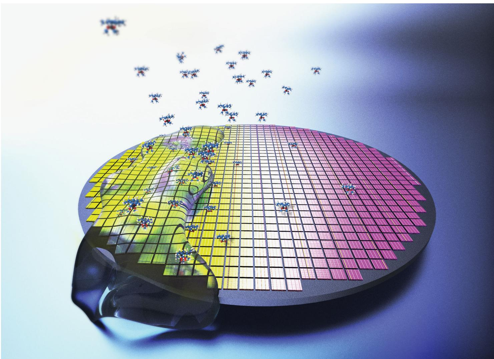
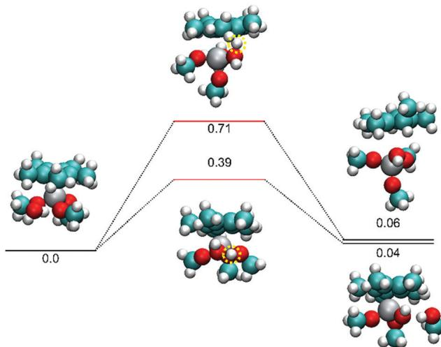
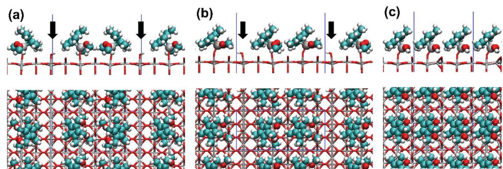
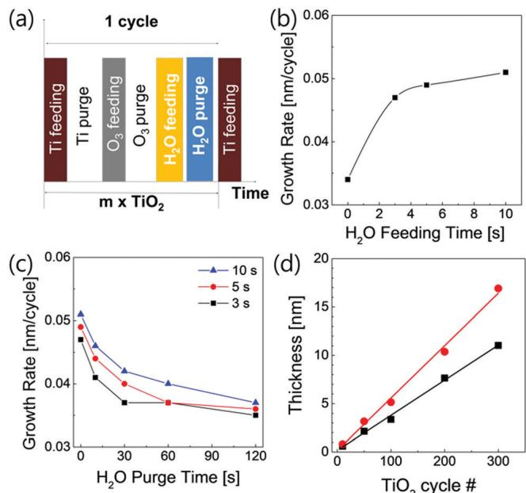
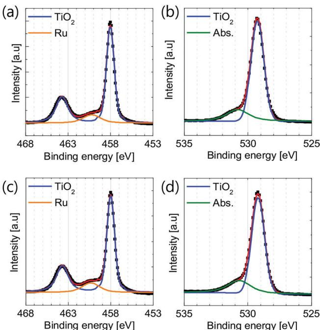
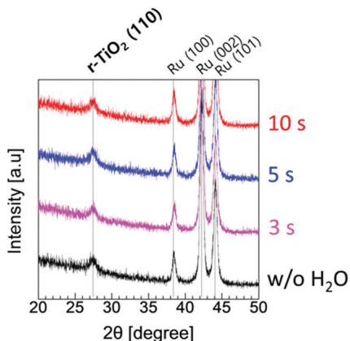
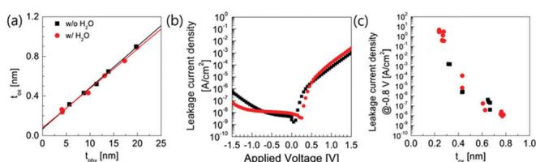

# Showcasing research from the group of Prof. Woojin Jeon at Kyung Hee University, Republic of Korea

Modulation of the adsorption chemistry of a precursor in atomic layer deposition to enhance the growth per cycle of a  $\mathrm{TiO}_2$  thin film

Atomic layer deposition (ALD) has scarcely been utilized in industrial processes due to its low productivity, even though it possesses several advantages for improving device performance. In this study, we investigate the exact chemical reaction mechanism of the ALD to obtain a designated growth behaviour or property, theoretically and experimentally. This study provides significant implications for understanding the ALD reaction mechanism based on the DFT calculation.

# As featured in:

See Woojin Jeon et al., Phys. Chem. Chem. Phys., 2021, 23, 2568.

# Modulation of the adsorption chemistry of a precursor in atomic layer deposition to enhance the growth per cycle of a  $\mathrm{TiO_2}$  thin film

Yeonchoo Cho,  $\oplus$  Sang Hyeon Kim,  $\dagger^{\flat}$  Byung Seok Kim,  $\dagger^{\mathbb{C}}$  Youngjin  $\mathsf{Kim}^{\mathsf{d}}$  and Woojin Jeon  $\oplus$  \*C

Received 7th August 2020, Accepted 30th September 2020

DOI: 10.1039/d0cp04176a

rsc.li/pccp

Atomic layer deposition (ALD) has scarcely been utilized in large- scale manufacturing and industrial processes due to its low productivity, even though it possesses several advantages for improving the device performance. The major cause of its low productivity is the slow growth rate, which is determined by the amount of chemisorbed precursor. The slow growth rate of ALD has become even more critical due to the introduction of heteroleptic- based precursors for achieving a higher thermal stability. In this study, we investigated the theoretical and experimental chemisorption characteristics of the  $\mathrm{Ti(CpMe_5)(OMe)_3}$  precursor during the ALD of  $\mathrm{TiO_2}$ . By density functional theory calculations, the relationship between the steric hindrance effect and the chemistry of a chemisorbed precursor was revealed. Based on the calculation result, a way for improving the growth per cycle by  $50\%$  was proposed and demonstrated, successfully.

# Introduction

Atomic layer deposition (ALD) has been attracting a lot of attention as the most promising thin film deposition technique owing to its superior characteristics, such as precisely controllable film thickness and composition, excellent uniformity and step coverage, and good adhesion.1- 6 Moreover, ALD has been employed in the deposition of various kinds of thin film materials, such as conventional metals7- 9 and metal oxides,10- 14 and emerging materials such as perovskites15- 19 and 2- dimensional materials.20- 25 Hence, ALD is useful not only in electronic device applications,26- 28 but also in passivation layer coating29,30 and functional thin film coating.31 However, the applicability of ALD is hindered in the industry because of its low growth rate during the fabrication process. This implies that the application of ALD can be dramatically improved by solving the low growth rate problem.

The growth rate of ALD is generally calculated by the deposited film thickness per cycle (growth per cycle (GPC)). GPC is affected by several process parameters, among which the amount of chemisorbed precursor  $(p_{\mathrm{chem}})$  is the most significant.32,33 The  $p_{\mathrm{chem}}$  value strongly depends on the surface chemistry. The chemistry of surface termination characterizes the density of the active site, where the precursor can be adsorbed chemically; further, the geometry of the precursor ligand limits the maximum density of  $p_{\mathrm{chem}}$ , which is a result of steric hindrance. Generally, the number of activated sites on the substrate can be increased by introducing a surfactant. Several surfactants (generally based on carbon compounds) have been introduced for performing surface treatment to enhance the chemisorption of a precursor that increases the GPC successfully. However, the residual compound from the surfactant causes contamination, resulting in severe degradation of the electrical properties.34 The maximum density of  $p_{\mathrm{chem}}$ , which is governed by steric hindrance, limits the enhancement of  $p_{\mathrm{chem}}$  upon increasing the adsorption site number when the surfactant is incorporated. Moreover, bigger ligands have been introduced recently in numerous metalorganic precursors for ALD,35 thereby enhancing the influence of steric hindrance on the GPC. In this regard, the reduction in steric hindrance would effectively increase the GPC. The steric hindrance is influenced by the ligand geometry of the chemisorbed precursor; therefore, analysing the reaction that occurs between the surface termination group and the precursor is also important. However, only a few studies have elucidated the chemical reaction mechanism that occurs during the chemisorption of a precursor, thereby demonstrating a change in GPC due to steric hindrance.

In this work, the GPC of  $\mathrm{TiO_2}$  ALD is enhanced by controlling the  $p_{\mathrm{chem}}$  of Ti according to the surface termination chemistry. Furthermore, the mechanism involved in the GPC enhancement is revealed by investigating the chemical reaction between the surface termination and the precursor. The steric hindrance of  $p_{\mathrm{chem}}$  has also been experimentally and theoretically estimated.

# Experimental

We performed first- principles density- functional simulations and used Gaussian 16 for molecular simulations.30 [Gaussian 16, Revision A.03] The B3LYP functional was used with a cc- pVTZ basis set and D3 dispersion correction.37 For slab simulations, we used the Vienna Ab initio Simulation Package.38 The PerdewBurke- Ernzerhof functional was used with D3 dispersion correction.37 The plane wave cut- off was  $400\mathrm{eV}$  The atomic structures were relaxed until the residual forces decreased to a value lesser than  $0.02\mathrm{eV}\mathrm{A}^{- 1}$  . We prepared a rutile  $\mathrm{TiO_2(110)}$  slab as described by Zydor et al.39 In the presence of chemisorbed water, the Ti precursor underwent chemisorption. Due to the steric hindrance between the precursor and the surface, the cyclopentadienyl  $(\mathrm{Cp})$  ligand and the methoxy ligands were more stable when they were parallel to the  $[- 110]$  direction, compared to the [001] direction.

$\mathrm{TiO_2}$  thin films were deposited in a shower- head type ALD reactor (iSAC research, iOV dX1) to obtain a single wafer of 6 in. diameter.  $\mathrm{Ti(CpMe_5)(OMe)_3}$  (synthesized by SK Trichem Co., Ltd, Korea) was employed as the Ti precursor, respectively. The canister of  $\mathrm{Ti(CpMe_5)(OMe)_3}$  was heated to  $80^{\circ}\mathrm{C}$  for obtaining an appropriate precursor vapor pressure.  $\mathrm{O_3}$  was the source of oxygen in  $\mathrm{TiO_2}$  ALD with a concentration of  $200\mathrm{g}\mathrm{m}^{- 3}$  . For all the experiments, the thin film growth temperature  $(T_{\mathrm{g}})$  was  $370^{\circ}\mathrm{C}$  All the  $\mathrm{TiO_2}$  thin films were deposited on a Ru  $(40~\mathrm{nm})/$ $\mathrm{SiO_2}$ $(100\mathrm{nm}) / \mathrm{Si}$  substrate with the sequence consisting of  $\mathrm{Ti(CpMe_5)(OMe)_3}$  feeding, Ar purge,  $\mathrm{O_3}$  feeding, and Ar purge steps of 12, 15, 10, and  $15\mathrm{~s~}$  respectively. To measure the electrical properties, a metal- insulator- metal (MIM) capacitor was fabricated with a  $30\mathrm{nm}$  thick  $\mathrm{RuO_2}$  top electrode (TE) using a metal shadow mask (with a  $300\mu \mathrm{m}$  hole diameter). On the  $\mathrm{RuO_2}$  TE, an additional  $30~\mathrm{nm}$  thick Pt layer was deposited to improve the contact while probing. The  $\mathrm{RuO_2}$  TE layer was deposited by DC reactive sputtering using an Ru metal target under an  $\mathrm{Ar / O_2}$  atmosphere. After the TE deposition, post- metallization annealing (PMA) was performed at  $400^{\circ}\mathrm{C}$  for  $30\mathrm{m}$  under  $95\%$ $\mathrm{N}_2 + 5\%$ $\mathrm{O_2}$  atmosphere inside a tube furnace. The film thickness was measured using spectroscopic ellipsometry (J. A. Woolham, ESM- 300), X- ray fluorescence spectroscopy (XRF, Thermo Scientific ARL QUANT'X), and X- ray reflection spectroscopy (XRR, PANalytical X'Pert Pro). The chemical structure was analysed using X- ray photoemission spectroscopy (XPS, Sigma Probe). Glancing angle incident X- ray diffraction (GIXRD, PANalytical X'Pert Pro., incident angle of  $0.5^{\circ}$  was used to examine the crystallographic structure of the deposited films. The electrical performance was studied by measuring the capacitance- voltage  $(C - V)$  and the current- voltage  $(I - V)$  using Hewlett Packard 4140B and 4194A, respectively. During the electrical tests, the TE was biased and the bottom electrode (BE) was grounded.

# Results and discussion

The chemisorption behaviour of the Ti precursor was analysed, depending on the surface termination chemistry. The Ti precursor adsorption was a typical dissociative chemisorption. The  $\mathrm{OCH_3}$  ligand captured the surface hydrogen, which was released as a methanol molecule. The Ti precursor was strongly bound to the surface via the Ti- O bond. This interaction could be considered as a ligand exchange reaction from the frame of reference of the Ti precursor. The reaction was exothermic with a reaction energy of  $- 1.25\mathrm{eV}$  . The  $\mathrm{CpMe_5}$ $(\mathrm{Cp^*})$  and  $\mathrm{OCH_3}$  ligands laid parallel to the  $[- 110]$  direction. If they lie perpendicular to this direction, the stability decreases because of the steric hindrance between the  $\mathrm{Cp^*}$  ligand and the surface oxygen. Consequently, the  $\mathrm{TiO_2}$  ALD with the Ti precursor has a low GPC because the Ti precursor chemisorbs with the  $\mathrm{Cp^*}$  ligand and two  $\mathrm{OCH_3}$  ligands, thereby inducing severe steric hindrance. Hence, the GPC can be increased by altering the ligand chemistry of the chemisorbed Ti precursor. However, despite the induction of steric hindrance by the  $\mathrm{Cp^*}$  ligand, the  $\mathrm{Cp^*}$  ligand cannot be removed during the chemisorption because it improves the temperature stability of the precursor. Hence, we considered eliminating the  $\mathrm{OCH_3}$  ligand to reduce the steric hindrance.

To eliminate the  $\mathrm{OCH_3}$  ligand,  $\mathrm{H}_2\mathrm{O}$  was chosen for altering  $\mathrm{OCH_3}$  into OH, which exhibited a smaller size; this is because  $\mathrm{H}_2\mathrm{O}$  does not react with the  $\mathrm{Cp^*}$  ligand under moderate ALD process conditions.40 Moreover, introducing  $\mathrm{H}_2\mathrm{O}$  in ALD is convenient due to the physisorption of  $\mathrm{H}_2\mathrm{O}$  thereby rendering  $\mathrm{H}_2\mathrm{O}$  suitable for reducing the steric hindrance. The physi- . sorbed water molecules have sufficient energy to react with the Ti precursors and reduce the steric hindrance in the Ti precursor pulse. Fig. 1 shows two ways in which the Ti precursor reacts with a water molecule. In the reactant state, one of the hydrogen atoms in the water molecule is hydrogen- bonded to the methoxy oxygen in the Ti precursor. This hydrogen atom can be transferred to the Ti precursor if a relatively small activation energy of  $0.39\mathrm{eV}$  is applied. As a result, a methanol molecule is released and the Ti precursor becomes less bulky. There is also a possibility in which the hydrogen atom can be transferred to the  $\mathrm{Cp^*}$  ligand; however, this process requires more energy. In addition, the hydrogen in the initial reactant state prefers to interact with the oxygen in the methoxy ligand, rather than the carbon in the  $\mathrm{Cp^*}$  ligand. Thus, the release of methanol is preferred, as observed experimentally. However, the activation energy required for the  $\mathrm{Cp^*}$  detachment is not excessively large. At elevated temperatures, a chemical vapor deposition (CVD)- like non- self- limiting behaviour is expected. Note that the energies represented in Fig. 1 are internal energies. Although the internal energy of the product state is

  
Fig. 1 Reaction between the Ti precursor and a water molecule. Black lines indicate reactant and product states, and the red lines indicate transition states. Yellow circles indicate transferred hydrogens. White, emerald, red, and gray spheres represent hydrogen, carbon, oxygen, and titanium atoms, respectively. Numbers are internal energies in the electron volt unit.

higher than that of the reactant state, the reaction can be driven by entropy. It is also important to note that although the B3LYP hybrid exchange- correlation functional is used in the calculations for accuracy, it underestimates the activation energies. Hence, the actual activation energies are likely larger.

The hydroxyl ligand significantly reduced the steric hindrance compared to the methoxy ligand. First- principles atomistic scale simulations were used to estimate the difference in the amount of chemisorbed precursor (Fig. 2). In the presence of methoxy ligands, one out of every three adsorption sites was blocked owing to the steric hindrance in the  $[- 110]$  direction (Fig. 2(a)). Both the  $\mathrm{Cp^{*}}$  and methoxy ligands are sources of significant steric hindrance. Although the precursors can occupy two adsorption sites in a row in the  $[- 110]$  direction, the steric hindrance tilts them in the opposite directions (Fig. 2(a) and (b)). Hence, the precursor cannot be adsorbed to the nearest adsorption sites next to the precursor pair. If the methoxy ligands are replaced with hydroxyl ligands, the steric hindrance is significantly decreased. The precursor with the hydroxyl ligands can occupy every adsorption site along the  $[- 110]$  direction (Fig. 2(c)). In the [001] direction, the precursor occupies three adsorption sites regardless of whether it has methoxy ligands or hydroxyl ligands. As shown in Fig. 2(a) and (b), the chemisorbed precursor density is  $1.15\mathrm{nm}^{- 2}$ , while as shown in Fig. 2(c) it is  $1.72\mathrm{nm}^{- 2}$ . A simple change of ligands from methoxy to hydroxyl can enhance the chemisorbed precursor density by  $50\%$ .

The change in the GPC of  $\mathrm{TiO_2}$  ALD with respect to the sequence has been investigated to confirm the experimental implementation of the theoretically calculated increase in the GPC, through  $\mathrm{H}_2\mathrm{O}$ . In this study, the Ti precursor employed in the  $\mathrm{TiO_2}$  ALD reacts only with  $\mathrm{O_3}$ . Even at a higher temperature of  $390^{\circ}\mathrm{C}$ , the Ti precursor does not react with  $\mathrm{H}_2\mathrm{O}$  (data not shown). This result might have originated from the reactivity difference between  $\mathrm{O_3}$  and  $\mathrm{H}_2\mathrm{O}$ . The GPC of  $\mathrm{TiO_2}$  ALD with  $\mathrm{O_3}$  was  $0.034\mathrm{nm}$  per cycle. This GPC value is in agreement with the previous results of  $\mathrm{TiO_2}$  ALD with a heteroleptic Ti precursor. This is because of the steric hindrance originating from the bulky geometry of the  $\mathrm{Cp^{*}}$  ligand. The GPC in ALD is affected by the amount of chemisorbed precursor during the precursor pulse step. Also, the steric hindrance by the geometry of the ligand, where the precursor adsorbs chemically on the surface, is one of the most considerable factors for determining the GPC. Additionally, the Cp- based Ti precursor induces a certain GPC value in the  $\mathrm{TiO_2}$  ALD. The geometry of the ligand in the precursor generally changes during chemisorption because chemisorption involves a chemical reaction. Hence, the surface termination chemistry strongly affects the nature of chemisorption of the precursor, resulting in significant changes in the deposition behaviour. Both  $\mathrm{O_3}$  and  $\mathrm{H}_2\mathrm{O}$  are the most widely used oxygen sources in ALD, but they induce different surface termination. Therefore, modified  $\mathrm{TiO_2}$  ALD sequence by employing additional  $\mathrm{H}_2\mathrm{O}$  feeding and purge steps right after the  $\mathrm{O_3}$  feeding and purge steps (Fig. 3(a)) was used to investigate the change in the growth behaviour with respect to the altered surface termination chemistry. The GPC value change depending on the  $\mathrm{H}_2\mathrm{O}$  feeding and purge time (Fig. 3(b) and (c))

  
Fig. 2 Ti precursors covering the  $\mathrm{TiO_2(110)}$  surface. In the presence of methoxy groups, the precursor cannot adsorb to one of every three rows of the adsorption sites due to the steric hindrance. (a and b) Those rows are denoted by black arrows. If methoxy groups are replaced with hydroxyl groups, the steric hindrance is alleviated and the precursor can adsorb to every row of the adsorption sites. (c) White, emerald, red, and gray spheres represent hydrogen, carbon, oxygen, and titanium atoms, respectively. Blue lines represent the periodic boundary used in calculations.

  
Fig.3 (a) Schematic diagram of the  $\mathsf{H}_2\mathsf{O}$  -added sequence. (b) GPC change with respect to the  $\mathsf{H}_2\mathsf{O}$  feeding time. (c) GPC change with respect to the  $\mathsf{H}_2\mathsf{O}$  purge time at various  $\mathsf{H}_2\mathsf{O}$  feeding times of (black) 3, (red) 5, and (blue)  $10~\mathrm{s}$ . (d) Deposited  $\mathsf{TiO_2}$  thin film thickness with respect to the conducting  $\mathsf{TiO_2}$  ALD cycle number by (black) the conventional sequence, and (red) the  $\mathsf{H}_2\mathsf{O}$  -added sequence.

was evaluated. The additional  $\mathrm{H}_2\mathrm{O}$  step increased the GPC dramatically. The GPC of  $0.034\mathrm{nm}$  per cycle in the conventional ALD sequence which consisted of the Ti precursor feeding and purge, also the  $\mathrm{O_3}$  feeding and purge steps, increased gradually with the increasing step time of the additionally introduced  $\mathrm{H}_2\mathrm{O}$  feeding time (10 s), and reached  $0.052\mathrm{nm}$  per cycle, a value of approximately 1.53 times higher than the conventional sequence. Moreover, the GPC change by the additional  $\mathrm{H}_2\mathrm{O}$  step exhibited some characteristic behaviours with respect to the purge step time. The significant increase in GPC decreased when the  $\mathrm{H}_2\mathrm{O}$  purge time increased. In the case of an  $\mathrm{H}_2\mathrm{O}$  feeding time of  $3\mathrm{s}$ , the GPC decreased to the same level as without the  $\mathrm{H}_2\mathrm{O}$  feeding where the purge time was increased up to  $30~\mathrm{s}$ . This  $\mathrm{H}_2\mathrm{O}$  purge time, where the GPC reached a conventional sequence level, was gradually increased to 60 and  $120~\mathrm{s}$  in the case of  $\mathrm{H}_2\mathrm{O}$  feeding time of 5 and  $10~\mathrm{s}$ , respectively. The characteristic behaviour in the GPC caused by the additional  $\mathrm{H}_2\mathrm{O}$  step is summarized as follows: the additionally introduced  $\mathrm{H}_2\mathrm{O}$  contributes to increasing the GPC, the increasing GPC saturates with respect to the  $\mathrm{H}_2\mathrm{O}$  feeding time, and the GPC increasing effect disappeared with the increasing purge time. Furthermore, the increased GPC caused by the additional  $\mathrm{H}_2\mathrm{O}$  step was retained up to hundreds of ALD cycles (Fig. 3(d)), which indicates that the GPC enhancement is observed not only on the Ru substrate, but also on the fully covered surface deposited with the  $\mathrm{TiO_2}$  film.

These characteristic behaviours indicate that the introduced  $\mathrm{H}_2\mathrm{O}$  was adsorbed on the surface physically; this physisorbed  $\mathrm{H}_2\mathrm{O}$  contributed to the increase in GPC. Moreover, since the increase in GPC eventually saturated and  $\mathrm{H}_2\mathrm{O}$  did not react with the chemisorbed Ti precursor, the increase in  $p_{\mathrm{chem}}$  of the Ti precursor can be attributed to  $\mathrm{H}_2\mathrm{O}$  changing the steric hindrance. These behaviours, especially the increment of GPC by  $\sim 50\%$ , are consistent with the density functional theory (DFT) calculations.

  
Fig.4 Deconvoluted peaks of (a and c) the Ti 2p XPS and (b and d) O 1s XPS spectra, deposited by (a and b) the conventional sequence and (c and d) the  $\mathsf{H}_2\mathsf{O}$  -added sequence.

Furthermore, the properties of the  $\mathrm{TiO_2}$  thin films deposited by the conventional and  $\mathrm{H}_2\mathrm{O}$  - added sequences were investigated to detect any degradation caused by the  $\mathrm{H}_2\mathrm{O}$  - added sequence. The chemical structures of the films were explored using XPS analysis. Fig. 4(a) and (c) shows the Ti 2p XPS spectra (data points) of the  $\mathrm{TiO_2}$  thin films deposited by the conventional without the  $\mathrm{H}_2\mathrm{O}$  sequence and with the  $\mathrm{H}_2\mathrm{O}$  - added sequence methods, respectively. Also, the deconvoluted spectra (lines) were obtained assuming that the Ti 2p peaks were composed of the Ti  $2\mathrm{p}_{3 / 2}$  peak centred at 458.0 and the Ru  $3\mathrm{p}_{3 / 2}$  peak centred at  $460.2\mathrm{eV}$ , which correspond to  $\mathrm{TiO_2}$  and metallic Ru, respectively. The XPS spectra of both the samples were almost identical regardless of the  $\mathrm{H}_2\mathrm{O}$  sequence. Moreover, the O 1s XPS spectra (Fig. 4(b) and (d)) also comprised the same oxygen components that were present in  $\mathrm{TiO_2}$  and absorbed on the surface.

The chemistry of the  $\mathrm{TiO_2}$  ALD also affects the crystallinity of the  $\mathrm{TiO_2}$  thin film deposited on the Ru substrate. In the case of the  $\mathrm{TiO_2}$  ALD on the Ru electrode, which utilizes  $\mathrm{O_3}$  as the oxygen source, the Ru substrate is oxidized by  $\mathrm{O_3}$  in an in situ manner; the resulting  $\sim 1\mathrm{nm}$  thick  $\mathrm{RuO_2}$  induces phase transition of  $\mathrm{TiO_2}$  from anatase to rutile via the local epitaxial relationship. Consequently, any change in the chemistry during the  $\mathrm{TiO_2}$  ALD on the Ru substrate alters the crystallinity of the  $\mathrm{TiO_2}$  thin film. Fig. 5 shows the GIXRD pattern of the samples comprising a  $20\mathrm{nm}$  thick  $\mathrm{TiO_2}$  thin film deposited on the Ru

  
Fig. 5 XRD spectra of the  $\mathrm{TiO_2}$  thin film deposited by various sequences. Values in time (s) denote the  $\mathrm{H}_2\mathrm{O}$  feeding time in the  $\mathrm{H}_2\mathrm{O}$ -added sequence.

substrate under varying  $\mathrm{H}_2\mathrm{O}$  feeding time periods. All the as- deposited films were crystallized without any post- deposition annealing. The diffraction pattern of the  $\mathrm{TiO_2}$  thin film without the  $\mathrm{H}_2\mathrm{O}$  sequence indicated that the thin film comprised crystalline  $\mathrm{TiO_2}$  with a rutile structure. With the increasing  $\mathrm{H}_2\mathrm{O}$  feeding time, no significant change was observed in the diffraction peak of rutile  $\mathrm{TiO_2}$  at  $2\theta = 27.3^{\circ}$ , even for an  $\mathrm{H}_2\mathrm{O}$  feeding time of  $10~\mathrm{s}$ . The results obtained from the XPS and XRD analyses indicate that the physisorbed  $\mathrm{H}_2\mathrm{O}$  does not induce any change in the chemical reaction between the chemisorbed Ti precursor and  $\mathrm{O_3}$  by exhibiting no significant change in the chemical and physical structure of the  $\mathrm{TiO_2}$  thin film.

The electrical properties of the MIM capacitor employing a  $20 \mathrm{nm}$  thick  $\mathrm{TiO_2}$  thin film as an insulating layer also indicated the presence of identical physical and chemical structures, especially the crystallinity of the  $\mathrm{TiO_2}$  thin film deposited with the additional  $\mathrm{H}_2\mathrm{O}$  feeding step as compared to that of the film deposited via the conventional sequence. The bulk dielectric constant  $(k)$  was estimated from the inverse slope of the physical thickness  $(t_{\mathrm{phy}})$  vs. equivalent oxide thickness  $(t_{\mathrm{ox}})$  plot, where  $t_{\mathrm{ox}} = t_{\mathrm{phy}}(3.9 / k)$ , because  $k$  represents the crystallinity of the  $\mathrm{TiO_2}$  thin film. As shown in Fig. 6(a), the  $k$  values of the  $\mathrm{TiO_2}$  thin films by conventional and  $\mathrm{H}_2\mathrm{O}$ - added sequences were 93.5 and 97.8, respectively. This result indicates that the  $\mathrm{TiO_2}$  thin films have identical crystallinity with the rutile phase. Moreover, the  $y$ - intercepts of the film by conventional and  $\mathrm{H}_2\mathrm{O}$ - added sequences were also identical to the values of 0.067 and $0.078 \mathrm{nm}$ , respectively. The  $y$ - axis intercept in  $t_{\mathrm{ox}}$  vs.  $t_{\mathrm{phy}}$  plot is determined by the interfacial properties between the  $\mathrm{TiO_2}$  film and the TE or the BE, implying that the additional  $\mathrm{H}_2\mathrm{O}$  step does not induce any change at the interface of the TE or the BE. Hence, the leakage current density vs. applied voltage  $(J - V)$  curve of the MIM structure, which comprised the  $\mathrm{TiO_2}$  thin film deposited by the  $\mathrm{H}_2\mathrm{O}$ - added sequence, was identical to that of the film deposited via the conventional sequence (Fig. 6(b)). In the  $J - V$  curve of the MIM comprising  $\mathrm{TiO_2}$  deposited via the conventional sequence, the  $J$  value is significantly higher in the positive applied voltage region than in the negative region. This is due to the relatively defective interfacial properties between Ru BE and the  $\mathrm{TiO_2}$  thin film, which is caused by the damage to Ru BE due to  $\mathrm{O_3}$  during the deposition. The asymmetric  $J - V$  curve of the  $\mathrm{H}_2\mathrm{O}$ - added sequence also demonstrated identical characteristics. Fig. 6(c) shows the summary of the electrical performances of both (conventional and  $\mathrm{H}_2\mathrm{O}$ - added sequence) the films, which shows the variation of  $J$  estimated at  $+0.8 \mathrm{V}$  as a function of  $t_{\mathrm{ox}}$ . Since these two types of  $\mathrm{TiO_2}$  thin films have the exact same physical and chemical properties, all the points from the two  $\mathrm{TiO_2}$  thin films lie on the same trend in the  $J - t_{\mathrm{ox}}$  curve.

  
Fig. 6 (a)  $t_{\mathrm{phy}} - t_{\mathrm{ox}}$  plot, (b)  $J - V$  plot, and (c)  $J - t_{\mathrm{ox}}$  plot of the MIM capacitor with  $20 \mathrm{nm}$ -thick  $\mathrm{TiO_2}$  deposited by (black) the conventional sequence and (red) the  $\mathrm{H}_2\mathrm{O}$ -added sequence with a  $\mathrm{H}_2\mathrm{O}$  feeding time of  $10 \mathrm{s}$ .

# Conclusions

A theoretical and experimental approach to ALD has been proposed based on DFT to significantly improve the GPC of  $\mathrm{TiO_2}$  ALD, which is considered to be the most limiting characteristic of ALD. The calculation of the chemisorption reaction of  $\mathrm{Ti(CpMe_5)(OMe)_3}$  in the  $\mathrm{TiO_2}$  ALD, which has a low GPC due to its bulky ligand structure, revealed that the  $\mathrm{OCH_3}$  group also participates in inducing severe steric hindrance. The  $\mathrm{OCH_3}$  ligand can be changed to a smaller ligand of OH using  $\mathrm{H}_2\mathrm{O}$ . Eventually,  $p_{\mathrm{chem}}$  increases by  $50\%$  due to the reaction of  $\mathrm{H}_2\mathrm{O}$  and  $\mathrm{OCH_3}$ . The GPC of  $\mathrm{TiO_2}$  ALD increased by  $53\%$  when  $\mathrm{H}_2\mathrm{O}$  is introduced via an added sequence, which is consistent with the increase in GPC calculated by DFT. Moreover, the increase in GPC eventually saturated as indicated by the DFT calculation, thereby successfully completing the objective of the study.

# Conflicts of interest

There are no conflicts to declare.

# Acknowledgements

This work was supported by the Technology Innovation Program (No. 20003555) funded by the Ministry of Trade, Industry & Energy (MOTIE, Korea) and the National Research Foundation of Korea (NRF) grant funded by the Korea government (MSIT) (No. 2018R1C1B5045854, and 2019R1A6C1010052). The authors gratefully acknowledge SK Trichem Co., Ltd for supporting this work as a precursor supplier.

# References

1 J. S. Ponraj, G. Attolini and M. Bosi, Crit. Rev. Solid State Mater. Sci., 2013, 38, 203- 233.  2 V. Cremers, R. L. Puurunen and J. Dendooven, Conformality in atomic layer deposition: current status overview of analysis and modelling, Appl. Phys. Rev., 2019, 6, 021302.  3 P. O. Oviroh, R. Akbarzadeh, D. Pan, R. A. M. Coetzee and T. C. Jen, New development of atomic layer deposition: processes, methods and applications, Sci. Technol. Adv. Mater., 2019, 20, 465- 496.  4 R. W. Johnson, A. Hultqvist and S. F. Bent, Mater. Today, 2014, 17, 236- 246.  5 S. M. George, Atomic layer deposition: an overview, Chem. Rev., 2010, 110, 111- 131.  6 M. Leskelä and M. Ritala, Atomic layer deposition chemistry: recent developments and future challenges, Angew. Chem., Int. Ed., 2003, 42, 5548- 5554.  7 Atomic Layer Deposition for Semiconductors, ed. C.S. Hwang, Springer Science & Business Media, 2013.  8 C. Zhao and J. Xiang, Atomic layer deposition (ALD) of metal gates for CMOS, Appl. Sci., 2019, 9, 2388.  9 B. H. Lee, J. K. Hwang, J. W. Nam, S. U. Lee, J. T. Kim, S. M. Koo, A. Baunemann, R. A. Fischer and M. M. Sung, Low- temperature atomic layer deposition of copper metal thin films: self- limiting surface reaction of copper dimethylamino- 2- propoxide with diethylzinc, Angew. Chem., Int. Ed., 2009, 48, 4536- 4539.  10 W. Jeon, Recent advances in the understanding of high- k dielectric materials deposited by atomic layer deposition for dynamic random- access memory capacitor applications, J. Mater. Res., 2019, 1- 20.  11 J. P. Niemela, G. Marin and M. Karppinen, Titanium dioxide thin films by atomic layer deposition: a review, Semicond. Sci. Technol., 2017, 32, 093005.  12 J. A. Kittl, K. Opsomer, M. Popovici, N. Menou, B. Kaczer, X. P. Wang, C. Adelmann, M. A. Pawlak, K. Tomida, A. Rothschild, B. Govoreanu, R. Degraeve, M. Schaekers, M. Zahid, A. Delabie, J. Meersschaut, W. Polspoel, S. Clima, G. Pourtois, W. Knaepen, C. Detavernier, V. V. Afanas'ev, T. Blomberg, D. Pierreux, J. Swerts, P. Fischer, J. W. Maes, D. Manger, W. Vandekerst, T. Conard, A. Franquet, P. Favia, H. Bender, B. Brijs, S. Van Elshocht, M. Jurczak, J. Van Houdt and D. J. Wouters, High- k dielectrics for future generation memory devices (invited paper), Microelectron. Eng., 2009, 86, 1789- 1795.  13 J. Robertson, High dielectric constant gate oxides for metal oxide Si transistors, Rep. Prog. Phys., 2006, 69, 327- 396.  14 S. K. Kim, K. M. Kim, D. S. Jeong, W. Jeon, K. J. Yoon and C. S. Hwang, Titanium dioxide thin films for next- generation memory devices, J. Mater. Res., 2013, 28, 313- 325.  15 S. W. Lee, B. J. Choi, T. Eom, J. H. Han, S. K. Kim, S. J. Song, W. Lee and C. S. Hwang, Influences of metal, non- metal precursors, and substrates on atomic layer deposition processes for the growth of selected functional electronic materials, Coord. Chem. Rev., 2013, 257, 3154- 3176.

16 A. Bin Afif, A. L. Dadlani, S. Burgmann, P. Kollensperger and J. Torgersen, Atomic layer deposition of perovskites—part 1: fundamentals of nucleation and growth, Mater. Des. Process. Commun., 2020, 2, 1- 7.  17 A. J. M. Mackus, J. R. Schneider, C. MacIsaac, J. G. Baker and S. F. Bent, Synthesis of Doped, Ternary, and Quaternary Materials by Atomic Layer Deposition: A Review, Chem. Mater., 2019, 31, 1142- 1183.  18 J. H. Shim, H. J. Choi, Y. Kim, J. Torgersen, J. An, M. H. Lee and F. B. Prinz, Process- property relationship in high- : K ALD SrTiO3 and BaTiO3: a review, J. Mater. Chem. C, 2017, 5, 8000- 8013.  19 J.- H. Ahn, S.- W. Kang, J.- Y. Kim, J.- H. Kim and J.- S. Roh, Effect of Sr- Ruthenate Seed Layer on Dielectric Properties of SrTiO[sub 3] Thin Films Prepared by Plasma- Enhanced Atomic Layer Deposition, J. Electrochem. Soc., 2008, 155, G185.  20 H. G. Kim and H.- B.- R. Lee, Atomic Layer Deposition on 2D Materials, Chem. Mater., 2017, 29, 3809- 3826.  21 T. Nam, S. Seo and H. Kim, Atomic layer deposition of a uniform thin film on two- dimensional transition metal dichalcogenides, J. Vac. Sci. Technol., A, 2020, 38, 030803.  22 M. Mattinen, T. Hatanpaa, T. Sarnet, K. Mizohata, K. Meinander, P. J. King, L. Khriachtchev, J. Raisanen, M. Ritala and M. Leskelä, Atomic Layer Deposition of Crystalline MoS2 Thin Films: New Molybdenum Precursor for Low- Temperature Film Growth, Adv. Mater. Interfaces, 2017, 4, 1- 11.  23 J. J. Pyeon, S. H. Kim, D. S. Jeong, S.- H. Baek, C.- Y. Kang, J.- S. Kim and S. K. Kim, Wafer- scale growth of MoS 2 thin films by atomic layer deposition, Nanoscale, 2016, 8, 10792- 10798.  24 W. Jeon, Y. Cho, S. Jo, J.- H. Ahn and S.- J. Jeong, Wafer- Scale Synthesis of Reliable High- Mobility Molybdenum Disulfide Thin Films via Inhibitor- Utilizing Atomic Layer Deposition, Adv. Mater., 2017, 29, 1703031.  25 T. Jurca, M. J. Moody, A. Henning, J. D. Emery, B. Wang, J. M. Tan, T. L. Lohr, L. J. Lennon and T. J. Marks, Low- Temperature Atomic Layer Deposition of MoS 2 Films, Angew. Chem., Int. Ed., 2017, 56, 4991- 4995.  26 S.- J. Jeong, Y. Gu, J. Heo, J. Yang, C.- S. Lee, M.- H. Lee, Y. Lee, H. Kim, S. Park and S. Hwang, Thickness scaling of atomic- layer- deposited HfO2 films and their application to wafer- scale graphene tunnelling transistors, Sci. Rep., 2016, 6, 20907.  27 S.- J. Jeong, H. W. Kim, J. Heo, M.- H. Lee, H. J. Song, J. Ku, Y. Lee, Y. Cho, W. Jeon, H. Suh, S. Hwang and S. Park, Physisorbed- precursor- assisted atomic layer deposition of reliable ultrathin dielectric films on inert graphene surfaces for low- power electronics, 2D Mater., 2016, 3, 035027.  28 Y. Lee, W. Jeon, Y. Cho, M.- H. Lee, S.- J. Jeong, J. Park and S. Park, Mesostructured Hf x Al y O 2 Thin Films as Reliable and Robust Gate Dielectrics with Tunable Dielectric Constants for High- Performance Graphene- Based Transistors, ACS Nano, 2016, 10, 6659- 6666.  29 Y. Li, Y. Xiong, H. Yang, K. Cao and R. Chen, Thin film encapsulation for the organic light- emitting diodes display via atomic layer deposition, J. Mater. Res., 2020, 35, 681- 700.

30 S. Lee, J. H. Han, S. H. Lee, G. H. Baek and J. S. Park, Review of Organic/Inorganic Thin Film Encapsulation by Atomic Layer Deposition for a Flexible OLED Display, JOM, 2019, 71, 197- 211. 31 N. Sobel and C. Hess, Nanoscale Structuring of Surfaces by Using Atomic Layer Deposition, Angew. Chem., Int. Ed., 2015, 54, 15014- 15021. 32 A. J. M. Mackus, M. J. Weber, N. F. W. Thissen, D. Garcia- Alonso, R. H. J. Vervuurt, S. Assali, A. A. Bol, M. A. Verheijen and W. M. M. Kessels, Atomic layer deposition of Pd and Pt nanoparticles for catalysis: on the mechanisms of nanoparticle formation, Nanotechnology, 2016, 27, 034001. 33 H. Van Bui, F. B. Wiggers, A. Gupta, M. D. Nguyen, A. A. I. Aarnink, M. P. de Jong and A. Y. Kovalgin, Initial growth, refractive index, and crystallinity of thermal and plasma- enhanced atomic layer deposition AlN films, J. Vac. Sci. Technol., A, 2015, 33, 01A111. 34 A. Yanguas- Gil, K. E. Peterson and J. W. Elam, Controlled Dopant Distribution and Higher Doping Efficiencies by Surface- Functionalized Atomic Layer Deposition, Chem. Mater., 2011, 23, 4295- 4297. 35 A. L. Johnson and J. D. Parish, Recent developments in molecular precursors for atomic layer deposition, 2018, vol. 1311. 36 M. J. Frisch, G. W. Trucks, H. B. Schlegel, G. E. Scuseria, M. A. Robb, J. R. Cheeseman, G. Scalmani, V. Barone, G. A. Petersson, H. Nakatsuji, X. Li, M. Caricato, A. V. Marenich, J. Bloino, B. G. Janesko, R. Gomperts, B. Mennucci, H. P. Hratchian, J. V. Ortiz, A. F. Izmaylov, J. L. Sonnenberg, D. Williams- Young, F. Ding, F. Lipparini, F. Egidi, J. Goings, B. Peng, A. Petrone, T. Henderson, D. Ranasinghe, V. G. Zakrzewski, J. Gao, N. Rega, G. Zheng, W. Liang, M. Hada, M. Ehara, K. Toyota, R. Fukuda, J. Hasegawa, M. Ishida, T. Nakajima, Y. Honda, O. Kitao, H. Nakai, T. Vreven, K. Throssell, J. A. Montgomery, Jr., J. E. Peralta, F. Ogliaro, M. J. Bearpark, J. J. Heyd, E. N. Brothers,

K. 
N. Kudin, 
V. 
N. Staroverov, 
T. 
A. Keith, 
R. Kobayashi, 
J. Normand, 
K. Raghavachari, 
A. 
P. Rendell, 
J. 
C. Burant, 
S. 
S. Iyengar, 
J. Tomasi, 
M. Cossi, 
J. 
M. Millam, 
M. Klene, 
C. Adamo, 
R. Cammi, 
J. 
W. Ochterski, 
R. 
L. Martin, 
K. Morokuma, 
O. Farkas, 
J. 
B. Foresman and 
D. 
J. Fox, Gaussian 16, Revision A.03, Gaussian, Inc., Wallingford CT, 2016. 37 
S. Grimme, 
J. Antony, 
S. Ehrlich and 
H. Krieg, A consistent and accurate ab initio parametrization of density functional dispersion correction (DFT-D) for the 94 elements H-Pu, 
J. Chem. Phys., 2010, 132, 154104. 38 
G. Kresse and 
J. Furthmüller, Efficient iterative schemes for ab initio total-energy calculations using a plane-wave basis set, Phys. Rev. B: Condens. Mater Mater. Phys., 1996, 54, 11169-11186. 39 
A. Zydor and 
S. 
D. Elliott,  $\mathrm{TiCp^{+}(OMe)}_{3}$  versus  $\mathrm{Ti(OMe)_4}$  in atomic layer deposition of  $\mathrm{TiO_2}$  with water - Ab initio modelling of atomic layer deposition surface reactions, 
J. Nanosci. Nanotechnol., 2011, 11, 8089-8093. 40 
M. 
J. Chung, 
W. Jeon, 
C. 
H. An, 
S. 
H. Kim, 
Y. 
K. Lee, 
W. Lee and 
C. 
S. Hwang, Quantitative Analysis of the Incorporation Behaviors of Sr and Ti Atoms During the Atomic Layer Deposition of  $\mathrm{SrTiO_3}$  Thin Films, ACS Appl. Mater. Interfaces, 2018, 10, 8836-8844. 41 
W. Jeon, 
W. Lee, 
Y. 
W. Yoo, 
C. 
H. An, 
J. 
H. Han, 
S. 
K. Kim and 
C. 
S. Hwang, Chemistry of active oxygen in  $\mathrm{RuO}_x$  and its influence on the atomic layer deposition of  $\mathrm{TiO_2}$  films, 
J. Mater. Chem. C, 2014, 2, 9993-10001. 42 
S. 
K. Kim, 
G. 
J. Choi, 
S. 
Y. Lee, 
M. Seo, 
S. 
W. Lee, 
J. 
H. Han, 
H.-S. Ahn, 
S. Han and 
C. 
S. Hwang, Al-Doped  $\mathrm{TiO_2}$  Films with Ultralow Leakage Currents for Next Generation DRAM Capacitors, Adv. Mater., 2008, 20, 1429-1435. 43 
S. 
K. Kim, 
W. 
D. Kim, 
K. 
M. Kim, 
C. 
S. Hwang and 
J. Jeong, High dielectric constant  $\mathrm{TiO_2}$  thin films on a Ru electrode grown at  $250^{\circ}\mathrm{C}$  by atomic-layer deposition, Appl. Phys. Lett., 2004, 85, 4112-4114.