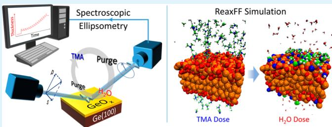
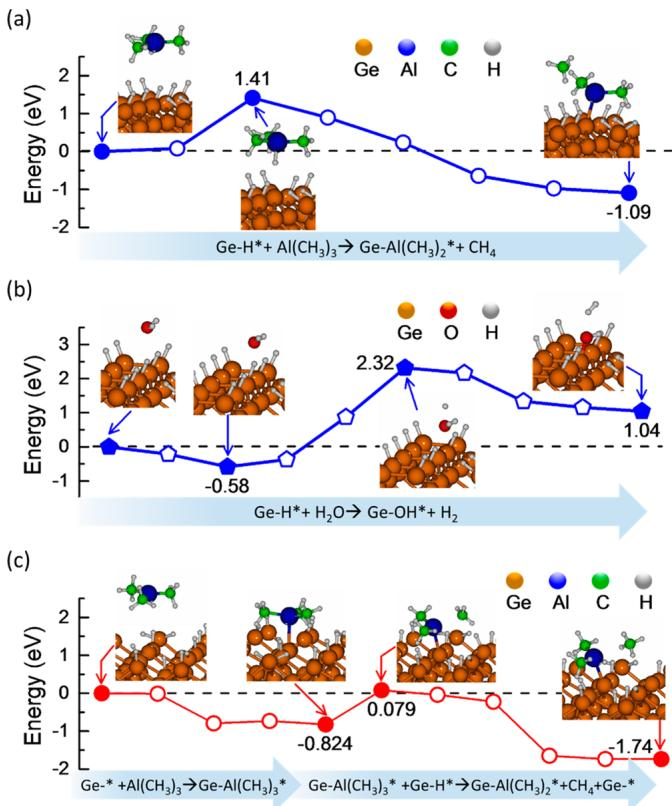
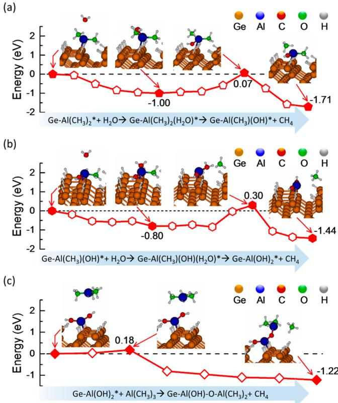
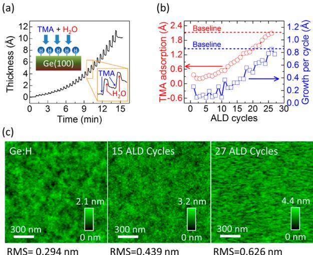
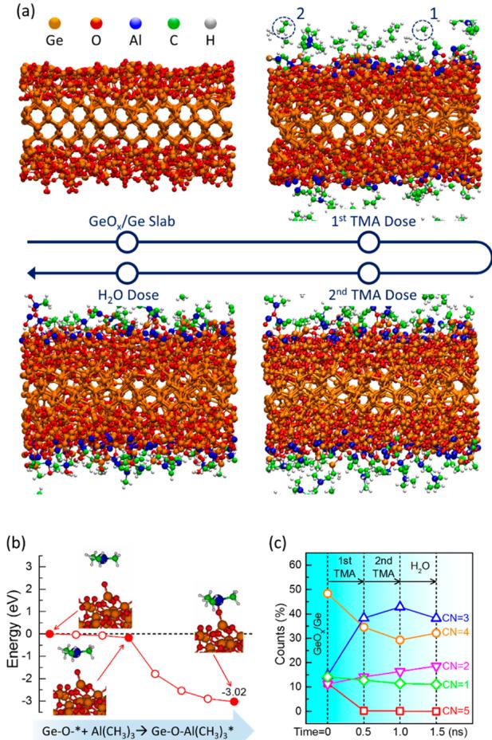
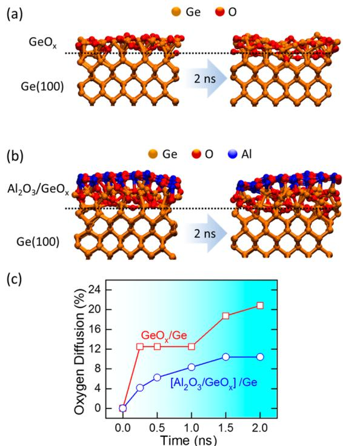
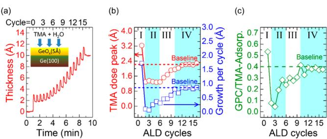
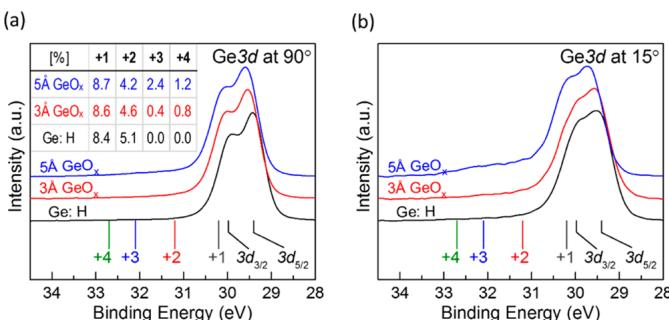
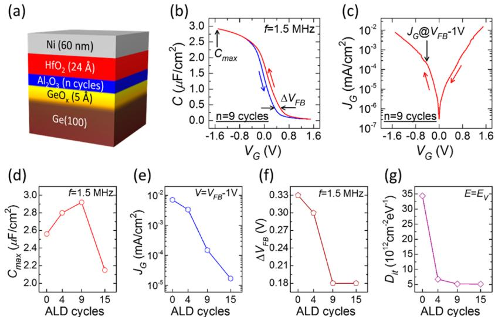

# Modeling and in Situ Probing of Surface Reactions in Atomic Layer Deposition

Yuanxia Zheng, Sungwook Hong, George Psorogiannakis, G. Bruce Rayner, Jr, Suman Datta, Adri C.T. van Duin, and Roman Engel- Herbert*

Department of Physics, Department of Mechanical and Nuclear Engineering, Department of Materials Science and Engineering, Pennsylvania State University, State College, Pennsylvania 16802, United States  $Kurt J. Lesker Company, Pittsburgh, Pennsylvania 15025, United States  $Department of Electrical Engineering, University of Notre Dame, Notre Dame, Indiana 46556, United States

Supporting Information

ABSTRACT: Atomic layer deposition (ALD) has matured into a preeminent thin film deposition technique by offering a highly scalable and economic route to integrate chemically dissimilar materials with excellent thickness control down to the subnanometer regime. Contrary to its extensive applications, a quantitative and comprehensive understanding of the reaction processes seems intangible. Complex and manifold reaction pathways are possible, which are strongly affected by the surface chemical state. Here, we report a combined modeling and experimental approach utilizing ReaxFF reactive force field simulation and in situ real- time spectroscopic ellipsometry to gain insights into the ALD process of  $\mathrm{Al}_2\mathrm{O}_3$  from trimethylaluminum and water on hydrogenated and oxidized Ge(100) surfaces. We deciphered the origin for the different peculiarities during initial ALD cycles for the deposition on both surfaces. While the simulations predicted a nucleation delay for hydrogenated Ge(100), a self- cleaning effect was discovered on oxidized Ge(100) surfaces and resulted in an intermixed  $\mathrm{Al}_2\mathrm{O}_3 / \mathrm{GeO}_x$  layer that effectively suppressed oxygen diffusion into Ge. In situ spectroscopic ellipsometry in combination with ex situ atomic force microscopy and X- ray photoelectron spectroscopy confirmed these simulation results. Electrical impedance characterizations evidenced the critical role of the intermixed  $\mathrm{Al}_2\mathrm{O}_3 / \mathrm{GeO}_x$  layer to achieve electrically well- behaved dielectric/Ge interfaces with low interface trap density. The combined approach can be generalized to comprehend the deposition and reaction kinetics of other ALD precursors and surface chemistry, which offers a path toward a theory- aided rational design of ALD processes at a molecular level.

KEYWORDS: ReaxFF, ALD, germanium, self- cleaning, nucleation, spectroscopic ellipsometry

# INTRODUCTION

Atomic layer deposition (ALD) has become an important synthesis technique in various fields of nanotechnology, e.g. semiconductor processing and microelectronics, biomedical applications, and protective coatings. Compared to other thin film deposition techniques, ALD has a unique set of advantages: (i) atomic scale control of film thickness, (ii) high conformity on structures with high aspect ratios, (iii) deposition of continuous and pinhole- free layers, (iv) low process temperatures, and (v) excellent scalability due to low cost and large area deposition. Considering the large application space in diverse technological areas, it seems surprising that relatively little is known quantitatively about the kinetic processes in ALD at an atomic level. Optimizing deposition conditions is simple, inexpensive, fast, and straightforward. A qualitative understanding of the processes at play is sufficient for rapid process development. On the other hand, it has proven challenging to obtain a theoretical description with sufficient details at reasonable computational costs to realistically model the processes occurring at the surface during deposition such as adsorption/desorption, diffusion, and chemical reactions of molecular species.

surface during deposition such as adsorption/desorption, diffusion, and chemical reactions of molecular species.Rapid advances in semiconductor processing technology require a better comprehension of ALD processes to advance the technology, master the increasing complexity level, and therefore accelerate optimization cycles. The currently employed strategy toward ever efficient computing hardware is continuing miniaturization along with functional diversification, which requires the integration of more materials at the nanoscale with potentially dissimilar and incompatible chemistries. Achieving this will require the capability of predicting experimental outcomes and a quantitative understanding of ALD processes beyond simple trial and error optimization. Even simple changes of materials in complex process flows are becoming a challenging task such as replacing Si with high mobility semiconductors like germanium (Ge) or III- V

compounds as the channel materials in complementary metaloxide- semiconductor (CMOS) transistor technology. Here, ALD is used to integrate an ultrathin dielectric film as a gate dielectric to electrically modulate the channel conductivity in a field effect transistor by an electric potential applied to the gate. The resultant device characteristics are governed by a combination of the quality of the dielectric and the electrical properties of the dielectric/semiconductor interface. However, due to the lack of atomic scale understanding of ALD growth kinetics on the semiconductor surface, the roadmap to obtain highly scaled and electrically reliable gate stacks is not straightforward. In the case of Ge, it has been found that a direct ALD of high permittivity (high  $k$  ) dielectric on a Ge surface results in poor electrical characteristics dominated by the trap response formed at the dielectric/semiconductor interface.20- 25 To address this challenge, the introduction of an ultrathin interlayer that forms an electrically well- behaved interface with Ge was proposed. This layer is thin enough to still allow competitive capacitance density scaling and yet thick enough to avoid trap formation through chemical reaction mechanisms between the high  $k$  and Ge.28- 28 Various materials and deposition conditions were applied and resulted in noticeable improvements, but details of the dominant mechanisms for the ALD processes at the atomic scale and how they can be utilized to improve film nucleation and surface passivation still remain unclear.

In this work, we report a combined theoretical and experimental approach to gain insights into the complex ALD process using ReaxFF reactive force field simulations29 and in situ real- time spectroscopic ellipsometry (SE). The ALD deposition kinetics of  $\mathrm{Al}_2\mathrm{O}_3$  on hydrogenated and oxidized Ge surfaces were investigated to quantify the influence of initial surface chemical states on the reaction kinetics and relate it to the trap formation during ALD nucleation. ReaxFF nudged elastic band (NEB) and molecular dynamics (MD) simulations were performed to directly model the deposition process; in particular, the adsorption and decomposition of ALD precursors along with desorption and diffusion of products formed. The simulations were correlated with in situ SE measurements taken in real time during ALD growth along with ex situ X- ray photoelectron spectroscopy (XPS) and atomic force microscopy (AFM). Metal- oxide- semiconductor capacitor (MOSCap) devices were fabricated to quantify the electrical characteristics of dielectric/Ge interfaces using impedance spectroscopy and were correlated to the surface chemistry and nucleation mechanism.

# MATERIALS AND METHODS

Materials.  $\mathrm{P - Ge(100)}$  substrates (Ga- doping, resistivity  $= 1.0 - 5.0$ $\Omega \cdot \mathrm{cm}$  were supplied by Umicore Electrooptic Materials. Tetrakis (dimethylamino) hafnium (TDMAH,  $99\%$  and trimethylaluminum (TMA,  $98\%$  precursors were purchased from Strem Chemicals, Inc. High purity water  $(\mathrm{H}_2\mathrm{O})$  precursor was purchased from SigmaAldrich.

Preparation of  $\mathrm{Ni / HfO_2 / Al_2O_3 / GeO_x / Ge}$  MOSCap Devices.  $\mathrm{P - }$ $\mathrm{Ge(100)}$  substrates were precleaned by acetone, isopropyl alcohol, and deionized water rinses. The precleaned substrates were immediately transferred into the load- lock of the ALD system (ALD- 150LX, Kurt J. Lesker Co.) for vacuum transfer. In situ surface treatment and ALD deposition processes were performed in the ALD reactor at  $270^{\circ}C$  with a background Ar pressure of  $1.2 - 1.5$  Torr controlled by in situ spectroscopic ellipsometry. The hydrogenated Ge surface  $\mathrm{(Ge:H)}$  was prepared by exposing the precleaned Ge surface to a RF  $\mathrm{H}_2 / \mathrm{Ar}$  plasma  $(30\mathrm{~s~},100\mathrm{~W~},$ $\mathrm{H}_2{:}\mathrm{Ar} = 3{:}117$  sccm). The  $\mathrm{GeO}_x / \mathrm{Ge}$  surface was prepared by exposing the Ge:H surface to  $\mathrm{O}_2 / \mathrm{Ar}$  plasma pulses (1.75 s/pulse,  $125\mathrm{W}$ $\mathrm{O}_2{:}\mathrm{Ar} = 3{:}117$  sccm).  $\mathrm{Al}_2\mathrm{O}_3$  was grown by ALD using TMA and  $\mathrm{H}_2\mathrm{O}$  as precursors.  $\mathrm{HfO_2}$  was grown by ALD using TDMAH and  $\mathrm{H}_2\mathrm{O}$  as precursors. After ALD depositions, all samples were completely cooled to room temperature under vacuum before transferring to any other processing or measurements. Sixty nanometers of Ni was deposited by thermal evaporation as the gate electrode with a pattern defined by a shadow mask. All MOSCap devices were postannealed in forming gas  $(p_{\mathrm{H}_2};p_{\mathrm{Ar}}\approx 20:1200\mathrm{mTorr})$  at  $330^{\circ}C$  for  $10\mathrm{min}$

Characterizations. ALD processes were monitored in real time by in situ M- 2000U spectroscopic ellipsometer  $(\lambda = 240 - 1000 \mathrm{nm},$  J.A. Woollam Co.). The incident angle of light beam was  $71^{\circ}$  with respect to the sample surface. AFM images were obtained using Bruker Dimension Icon. XPS results were measured using Kratos Analytical Axis Ultra with an Al  $\mathrm{K}\alpha$  source. AFM and XPS measurements were performed immediately after transferring samples out of the ALD chamber to minimize the air exposure. Electrical impedance measurements were carried out on a Cascade probe station (Summit 11000). An LCR meter (Hewlett- Packard 4285A) was used for measuring capacitance- voltage  $(C - V)$  characteristics; a combination of DC and AC voltage was used with an AC amplitude of  $50~\mathrm{mV}$  and a frequency  $f = 75\mathrm{kHz}$  to  $1.5\mathrm{MHz}$  A parameter analyzer (Keithley 4200- SCS) was used for measuring leakage- voltage  $(J_{\mathrm{G}} - V)$  characteristics.

# THEORETICAL BASIS

The ReaxFF reactive force fields were optimized against quantum mechanics- based training sets. A LAMMPS code (version 28, June 2014, http://lammps.sandia.gov) was used in ReaxFF- MD simulations. A time step of 0.25 fs was used to ensure the chemical reactions at given temperatures (300- 1000 K in MD simulations), while the system temperatures were controlled by the NVT ensemble using the Nose- Hoover thermostat with a damping constant of 25 fs. All of the reaction profiles were evaluated by ReaxFF- NEB calculations using standalone ReaxFF code; the initial and final structures of each NEB calculation were fully relaxed, and then 4- 6 intermediate structures were generated. All of the system configurations were displayed by the Molden (version  $50)^{33}$  and VMD (version  $1.9.2)^{34}$  software.

A ReaxFF reactive force field for  $\mathrm{Ge / Al / C / H / O}$  interactions was used in the simulation of TMA/  $\mathrm{H}_2\mathrm{O}$  ALD process on the  $\mathrm{Ge(100):H}$  and  $\mathrm{GeO}_x / \mathrm{Ge(100)}$  surfaces (see Supporting Information for more details about the force field development and validation). The starting surfaces were described by the following slab models: (a)  $40\times 40\times 11$  Å for the  $\mathrm{Ge(100):H}$  slab and (b)  $40\times 40\times 20$  Å for the  $\mathrm{GeO}_x / \mathrm{Ge(100)}$  slab (see Supporting Information for more details about the system description). The ReaxFF- MD simulations were performed inside orthogonal simulation boxes of  $40\times 40\times 50$  Å for  $\mathrm{Ge(100):H}$  and  $40\times 40\times 80$  Å for  $\mathrm{GeO}_x / \mathrm{Ge(100)}$ . Relatively high temperatures  $[500\mathrm{K}$  for  $\mathrm{Ge(100):H}$  and  $1000\mathrm{K}$  for  $\mathrm{GeO}_x / \mathrm{Ge(100)}$  were used in the ReaxFF- MD simulations to accelerate reaction speed within the limited time scale  $(\sim \mathrm{ns})$  due to the computational costs. TMA or  $\mathrm{H}_2\mathrm{O}$  dose was realized by randomly distributing 80 TMA or  $\mathrm{H}_2\mathrm{O}$  molecules into the system; after a sufficient relaxation (500 ps), a removal of all gas phase molecules mimicked the purge step in ALD. Particularly in the case of  $\mathrm{GeO}_x / \mathrm{Ge(100)}$ , double TMA doses were used prior to  $\mathrm{H}_2\mathrm{O}$  dose in the simulation to ensure a saturated reaction.

The ReaxFF- MD simulations of oxygen diffusion from  $\mathrm{GeO}_x / \mathrm{Ge(100)}$  and  $(\mathrm{Al}_2\mathrm{O}_3 / \mathrm{GeO}_x) / \mathrm{Ge(100)}$  interfaces were performed inside an orthogonal simulation box of  $20\times 20\times 60$

Å (see Supporting Information for more details about the system description). The system temperature was kept at 300 K, while a higher temperature (800 K) was assigned to O atoms to accelerate the O diffusion within the limited time frame (2.0 ns).

# RESULTS AND DISCUSSION

$\mathbf{Al}_2\mathbf{O}_3$  ALD on Hydrogenated Ge Surface. A ReaxFF model for  $\mathrm{Ge / Al / C / H / O}$  interactions was developed to simulate the reactions of trimethyl- aluminum  $\mathrm{[Al(CH_3)_3,}$  TMA] and water  $\mathrm{(H_2O)}$  with hydrogenated Ge surfaces Ge:H). Details for the calculation and validation of the employed ReaxFF force fields are available in the Supporting Information.

The reaction profiles for TMA and  $\mathrm{H}_2\mathrm{O}$  adsorption with a hydrogenated  $\mathrm{Ge(100)}$ $\mathrm{[Ge(100):H]}$  surface were determined from ReaxFF- NEB calculations (Figures 1a and b). Both

  
Figure 1. Reaction profiles obtained by the ReaxFF-NEB calculations for  $\mathrm{Al}_2\mathrm{O}_3$  ALD on the  $\mathrm{Ge(100):H}$  surface. Adsorption of (a) TMA and (b)  $\mathrm{H}_2\mathrm{O}$  at H-terminated Ge surface site. (c) TMA adsorption on a  $\mathrm{Ge - ^*}$  dangling bond site. The insets in each profile are the spatial arrangement of molecule and atomic structures at the corresponding reaction stages.

profiles indicate that a fully hydrogenated Ge surface is chemically inert when exposed to TMA or  $\mathrm{H}_2\mathrm{O}$ . In Figure 1a, the TMA molecule approaches a H- termination surface site (physisorption) and then forms a chemical bond (chemisorption) that is accompanied by a H atom transfer from the surface to a methyl  $\left(- \mathrm{CH}_3\right)$  group of TMA. An Al- Ge bond is formed, and a methane  $\left(\mathrm{CH}_4\right)$  molecule is liberated from TMA as byproduct. The reaction is overall exothermic (energy gain  $\Delta E = - 1.09 \mathrm{eV}$ ) but hampered by the large barrier  $\left(E_{\mathrm{a}} = 1.41 \mathrm{eV}\right)$  at the physisorption stage.

In contrast,  $\mathrm{H}_2\mathrm{O}$  adsorption on the Ge:H surface is endothermic (Figure 1b).  $\mathrm{H}_2\mathrm{O}$  physisorption is likely to occur on Ge:H surfaces due to the strong polar characteristic of  $\mathrm{H}_2\mathrm{O}$ , but the energy gain of  $\Delta E = - 0.58 \mathrm{eV}$  is comparable to the evaporation energy of  $\mathrm{H}_2\mathrm{O}$  (0.42 eV), so the physisorption is limited by the thermal desorption at elevated temperatures used in real ALD processes  $\left(T = 270^{\circ}\mathrm{C}\right.$  in our experiments). Moreover, the subsequent hydroxylation of the Ge:H surface to form  $\mathrm{Ge - OH^*}$  is strongly inhibited by the high reaction barrier (2.32 eV); therefore, a pronounced nucleation delay of ALD  $\mathrm{Al}_2\mathrm{O}_3$  on Ge:H is expected.

The TMA nucleation process on Ge:H is dramatically accelerated if a partially hydrogenated Ge surface, i.e. a high density of dangling bond sites  $\left(\mathrm{Ge - ^*}\right)$ , is present (Figure 1c). The chemisorption of TMA on a local  $\mathrm{Ge - ^*}$  site is energetically favored  $\left(\Delta E = - 0.82 \mathrm{eV}\right)$ , and a  $\mathrm{Ge - Al}$  bond is formed. The chemisorbed TMA molecule now favorably affects the dehydrogenation of an adjacent  $\mathrm{Ge - H^*}$  site through the formation of a dimethyl- aluminum group  $\left[- \mathrm{Al}\left(\mathrm{CH}_3\right)_2^*\right.$ , DMA] and release of a methane  $\left(- 1.74 \mathrm{eV}\right)$  molecule. Overall the reaction is highly exothermic  $\left(- 1.74 \mathrm{eV}\right)$  and preserves the number of dangling bond sites available for the subsequent TMA adsorption (see ReaxFF- MD simulations at an elevated temperature  $T = 500 \mathrm{K}$  in the Supporting Information). Thus, the nucleation dynamics are governed by the density of  $\mathrm{Ge - ^*}$  sites. Additional ReaxFF simulations on Ge:H surfaces were performed to explore the origin of dangling bond sites. Details for parametrizing initial structures are given in the Supporting Information. The simulations showed that rather than surface H- dissociation,  $\mathrm{Ge - ^*}$  sites originate from surface H diffusion into the subsurface interstitial sites. This diffusion shows a moderate activation energy  $\left(E_{\mathrm{a}} = 0.68 \mathrm{eV}\right)$  and a small overall energy  $\left(\Delta E = 0.39 \mathrm{eV}\right)$ , which can be partially compensated by the increased entropy contribution to the free energy at elevated temperatures in a real ALD environment. The ReaxFF- MD simulation of annealing a Ge:H surface at  $800 \mathrm{K}$  revealed up to  $0.3 / \mathrm{nm}^2$  of  $\mathrm{Ge - ^*}$  site formation, corresponding to  $\sim 4\%$  of all surface sites.

The presence of surface DMA sites  $\left[\mathrm{Ge - Al}\left(\mathrm{CH}_3\right)_2^*\right]$  enabled the adsorption of  $\mathrm{H}_2\mathrm{O}$  and resulted in a typical two- step oxidation reaction, shown in Figures 2a and b. An Al- O bond  $\left(- 1.71 \mathrm{eV}\right)$  is initially formed, and a H atom is transferred to a  $- \mathrm{CH}_3$  ligand, thus liberating a  $\mathrm{CH}_4$  molecule and leaving a partially hydroxylated surface site  $\mathrm{Ge - Al}\left(\mathrm{CH}_3\right)\left(\mathrm{OH}\right)^*$ . A fully hydroxylated surface site  $\mathrm{Ge - Al}\left(\mathrm{OH}\right)_2^*$  is formed upon further exposure to  $\mathrm{H}_2\mathrm{O}$ . The ReaxFF- MD simulation at  $T = 500 \mathrm{K}$  confirmed the preferential  $\mathrm{H}_2\mathrm{O}$  adsorption on DMA surface sites (see Supporting Information). An oversupply of  $\mathrm{H}_2\mathrm{O}$  does not result in additional reactions, reflecting the self- limiting nature of ALD.

Subsequently supplied TMA molecules are either chemisorbed at the new  $\mathrm{Ge - ^*}$  dangling bond site formed in close proximity, resulting in lateral growth, or directly at  $\mathrm{Ge - Al}\left(\mathrm{OH}\right)_2^*$ , resulting in vertical growth. In Figure 2c, a slightly higher reaction barrier  $\left(0.18 \mathrm{eV}\right)$  is found for the exothermic TMA adsorption on  $\mathrm{Ge - Al}\left(\mathrm{OH}\right)_2^*$  compared to that found on the  $\mathrm{Ge - ^*}$  site  $\left(0.079 \mathrm{eV}\right)$ . However, both reaction barriers are small enough so that both lateral and vertical growths will occur by oversupplying TMA.

Three major consequences of  $\mathrm{Al}_2\mathrm{O}_3$  ALD on Ge:H can be derived from the ReaxFF results. First, a pronounced ALD nucleation delay is expected along with an island growth mode due to the chemical inertness of Ge:H. Second, Al- Ge bonds

  
Figure 2. Reaction profiles obtained by the ReaxFF-NEB calculations for: (a)  $\mathrm{H}_2\mathrm{O}$  hydroxylates one  $-\mathrm{CH}_3$  group on the  $\mathrm{Ge - Al(CH_3)_2^*}$  site, (b)  $\mathrm{H}_2\mathrm{O}$  hydroxylates  $-\mathrm{CH}_3$  group on the  $\mathrm{Ge - Al(CH_3)(OH)^*}$  site, and (c) TMA adsorption on the  $\mathrm{Ge - Al(OH)_2^*}$  site. The insets in each profile are the spatial arrangement of molecule and atomic structures at the corresponding reaction stages.

are formed during TMA adsorption which give rise to a high interface trap density  $(D_{\mathrm{L}})$  inside the Ge band gap.37 Third, the nonconformity of the nucleation process and the associated island formation cause nonuniform regions in the film where  $\mathrm{Al}_2\mathrm{O}_3$  islands merge at the coalescence layer thickness.2 These nonuniform regions can act as leakage paths when the film is used as a gate dielectric.38 It is therefore expected that a direct  $\mathrm{Al}_2\mathrm{O}_3$  deposition on  $\mathrm{Ge - H}$  will result in inferior electrical characteristics of dielectric/Ge interface in the application in field effect transistors.39

To experimentally confirm the ReaxFF predictions, in situ SE experiments were performed during the  $\mathrm{Al}_2\mathrm{O}_3$  ALD on  $\mathrm{Ge(100):H}$  (Figure 3a). The  $\mathrm{Al}_2\mathrm{O}_3$  thickness during ALD was extracted in real time by fitting the SE spectra using a layered model of  $\mathrm{Al}_2\mathrm{O}_3 / \mathrm{Ge}$ . Details about SE modeling are given in the Supporting Information. The inset of Figure 3a shows the SE response to sequential doses of TMA and  $\mathrm{H}_2\mathrm{O}$  separated by purge cycles. Each ALD cycle starts with a TMA pulse (blue arrow), and the resultant change in surface optical properties is reflected as a nominal increase of  $\mathrm{Al}_2\mathrm{O}_3$  thickness. The TMA adsorption on the surface saturates due to the self- limiting nature of ALD. The amplitude of the nominal thickness increase corresponds to the amount of TMA adsorption. After purging, an  $\mathrm{H}_2\mathrm{O}$  dose (red arrow in Figure 3a inset) removes the surface methyl  $(- \mathrm{CH}_3)$  groups and is reflected as a nominal thickness decrease. The net thickness change at the end of each ALD cycle provides the growth per cycle (GPC).

  
Figure 3. (a) In situ SE monitoring of  $\mathrm{Al}_2\mathrm{O}_3$  ALD on the  $\mathrm{Ge:H}$  surface; the inset enlarges the segment in the green box. (b) TMA adsorption and growth per cycle as a function of ALD cycles; the TMA adsorption baseline (red dash line) is  $\sim 2.2\mathrm{\AA}$ , and the GPC baseline (blue dash line) is  $\sim 0.86\mathrm{\AA}$ . (c) AFM images at different  $\mathrm{Al}_2\mathrm{O}_3$  ALD stages.

The experiments were in excellent agreement with the predicted nucleation delay on  $\mathrm{Ge:H}$  surfaces, as revealed by the nonlinearity of ALD growth. In Figure 3b, the trends of TMA adsorption (red circles) and GPC (blue squares) are compared to the  $\mathrm{Al}_2\mathrm{O}_3$  ALD baseline (deposition on  $\mathrm{Al}_2\mathrm{O}_3$  surface; see Supporting Information). The TMA adsorption on  $\mathrm{Ge:H}$  is low in the first cycle,  $\sim 17\%$  of the baseline, corresponding to a coverage density of  $\sim 0.5 / \mathrm{nm}^2$  (see Supporting Information for calculation details). Assuming TMA adsorption occurs only at  $\mathrm{Ge - *}$  sites, this density is comparable to the above- mentioned ReaxFF result of  $\sim 0.3 / \mathrm{nm}^2$ . In subsequent cycles, the TMA adsorption is still well below the baseline. This suggests that the creation of new  $\mathrm{Ge - *}$  sites driven either by H diffusion or TMA adsorption is a slow process. The adsorption level gradually approaches the baseline within 25- 27 cycles. The nucleation is strongly inhibited for the first few cycles but then improved due to an increased  $\mathrm{Al}_2\mathrm{O}_3$  surface coverage through lateral expansion from initial nucleation sites as implied by ReaxFF simulations. Consequently, the growth rate or GPC (blue squares in Figure 3b) is proportional to the TMA adsorption and also lower than the baseline of 0.86 Å (see Supporting Information). The island growth mode was confirmed by ex situ AFM measurements (Figure 3c). The surface roughness, indicated by the root- mean- square (RMS) and maximum surface corrugation, significantly increases with the number of ALD cycles during the nucleation delay.

$\mathrm{Al}_2\mathrm{O}_3$  ALD on  $\mathrm{GeO}_x / \mathrm{Ge(100)}$  Surface. ReaxFF simulations for  $\mathrm{Al}_2\mathrm{O}_3$  ALD  $\mathrm{(TMA + H_2O)}$  were performed on oxidized Ge surfaces to further explore the influence of surface chemistry on the ALD nucleation behavior. A slab of  $\mathrm{Ge(100)}$  terminated by 5 Å of amorphous  $\mathrm{GeO}_x$  was used as the starting surface (see Supporting Information for constructing the model).

Figure 4a shows the snapshots of ReaxFF MD simulations for the first and second TMA doses and a subsequent  $\mathrm{H}_2\mathrm{O}$  dose. In contrast to the  $\mathrm{Ge:H}$  surface, a pronounced TMA absorption occurs on  $\mathrm{GeO}_x / \mathrm{Ge}$  in the first TMA dose, consumes most of TMA molecules (80 in total), and results in a conformal overlayer. The Al atom in the TMA molecule

  
Figure 4. (a) Snapshots of ReaxFF-MD simulations for  $\mathrm{Al}_2\mathrm{O}_3$  ALD using  $\mathrm{TMA / H_2O}$  sequential doses on a  $\mathrm{GeO_x(5\AA) / Ge(100)}$  slab at  $1000~\mathrm{K}$ . Duration of each dose was 500 ps. In the snapshot of the first TMA dose, the highlighted molecules (1 and 2) are byproducts of  $\mathrm{CH}_4$  and  $\mathrm{H}_3\mathrm{C} - \mathrm{CH}_3$ . (b) ReaxFF-NEB calculation for TMA adsorption on the  $\mathrm{GeO_x / Ge}$  surface. (c) Number of O atoms coordinated to Ge during the ReaxFF-MD simulation of  $\mathrm{Al}_2\mathrm{O}_3$  ALD on  $\mathrm{GeO_x / Ge}$ .

directly attaches to the surface O sites and forms Al- O bonds so only  $\mathrm{Ge} - \mathrm{O}$  and  $\mathrm{Al} - \mathrm{O}$  bonds are present. ReaxFF NEB calculation (Figure 4b) reveals that TMA chemisorption onto  $\mathrm{GeO_x}$  surfaces is highly reactive with no reaction barrier and strongly exothermic  $(- 3.02\mathrm{eV})$ . Upon the first TMA adsorption, abundant volatile byproducts like methane  $(\mathrm{CH}_4)$  and ethane  $(\mathrm{C}_2\mathrm{H}_6)$  are formed despite any  $\mathrm{H}_2\mathrm{O}$ . This implies that TMA is highly oxidized during the chemisorption. The oxidant was found to be  $\mathrm{GeO_x}$  through the analysis of chemical states of  $\mathrm{GeO_x}$  during TMA adsorption (Figure 4c). While  $\mathrm{Ge}^+$  is the dominant oxidation state of the initial  $\mathrm{GeO_x}$  surface layer, the exposure to TMA reduces the average oxygen coordination, rendering  $\mathrm{Ge}^{3 + }$  the dominant oxidation state. This strong redox reaction in the absence of any  $\mathrm{H}_2\mathrm{O}$  "cleans" the Ge surface from  $\mathrm{GeO_x}$ . Note that the TMA cleaning mechanism on Ge is different from the ligand- exchange mechanism on  $\mathrm{III} - \mathrm{V}$  surfaces. On  $\mathrm{III} - \mathrm{V}$ , the O atoms in native oxides directly exchange with the  $- \mathrm{CH}_3$  groups in TMA, which results in the methylation of the native oxides and forms volatile byproducts. On Ge, a similar ligand- exchange mechanism was also observed in our simulation but in a much lower degree and resulted only in a small amount of nonvolatile  $- \mathrm{Ge}(\mathrm{CH}_3)_x$ * surface species with  $x< 4$ .

After the first TMA dose, fewer  $\mathrm{GeO_x}$  surface adsorption sites are available, i.e. the surface tends to saturate. In the second TMA dose, fewer TMA molecules adsorb (Figure 4a), and the change in the Ge oxidation state is smaller (Figure 4c). Note that in the second TMA dose snapshot of Figure 4a, Al atoms more deeply diffuse into the  $\mathrm{GeO_x}$  resulting in an intermixed amorphous  $(\mathrm{Al}_2\mathrm{O}_3 / \mathrm{GeO}_x)$  layer. The driving force of intermixing is attributed to the aforementioned self- cleaning effect. In the subsequent snapshot, the  $\mathrm{H}_2\mathrm{O}$  dose (80 molecules) hydroxylates  $- \mathrm{CH}_4$  groups located at the outermost surface and forms volatile  $\mathrm{CH}_4$  molecules. At this point, the fully oxidized Al atoms have less driving force to diffuse into the  $\mathrm{GeO_x}$  sublayer. By tracking the O atoms during the ReaxFF MD simulations, it was found that over  $90\%$  of O atoms bonded to Al originated from  $\mathrm{GeO_x}$  with the rest contributed by  $\mathrm{H}_2\mathrm{O}$ . This O atom tracking confirms the direct redox reaction between TMA and  $\mathrm{GeO_x}$ .

The formation of an  $(\mathrm{Al}_2\mathrm{O}_3 / \mathrm{GeO}_x)$  intermixed layer was found beneficial to limit oxygen diffusion from the oxide into the underlying Ge crystal, as revealed by the ReaxFF MD simulations in Figure 5. A  $\mathrm{GeO_x / Ge(100)}$  structure capped

  
Figure 5. ReaxFF-MD simulations for oxygen diffusion from  $\mathrm{GeO_x}$  into underlying Ge subsurface for  $\mathrm{GeO_x / Ge(100)}$  (red) and  $(\mathrm{Al}_2\mathrm{O}_3 / \mathrm{GeO}_x)$  /Ge(100) (blue) interfaces. Calculations were performed at 800 K to accelerate the oxygen diffusion effect within 2 ns. The portion of oxygen diffusion was normalized by the total number of oxygen atoms in the  $\mathrm{GeO_x}$  layer.

with an  $\mathrm{Al}_2\mathrm{O}_3$  layer was annealed at  $T = 800~\mathrm{K}$  for 2 ns (Figure 5a), and the same process was performed on a simple  $\mathrm{GeO_x / Ge(100)}$  structure for comparison (Figure 5b). Position tracking of O atoms during annealing (Figure 5c) showed that  $\sim 20\%$  of O atoms diffused into the Ge sublayer for the  $\mathrm{GeO_x / Ge}$  case (red squares), but only  $\sim 10\%$  for  $(\mathrm{Al}_2\mathrm{O}_3 / \mathrm{GeO}_x)$  /Ge (blue circles). While the  $\mathrm{GeO_x / Ge}$  interface is known to be thermodynamically unstable, as also observed in our simulation, the incorporation of Al atoms into  $\mathrm{GeO_x}$  significantly suppresses oxygen out- diffusion. The thermody

namic origin of this stabilization effect is attributed to an Al- O bond much stronger compared to that of Ge- O (see Ellingham diagram analysis in the Supporting Information). The driving force for O- diffusion is hampered by the presence of Al- O bonds and therefore O remains better confined. Similar stabilization effects have also been observed by incorporating other metal elements or nitrogen into  $\mathrm{GeO}_x$ .46

Three major consequences of  $\mathrm{Al}_2\mathrm{O}_3$  ALD on  $\mathrm{GeO}_x / \mathrm{Ge}$  can be derived from the ReaxFF simulations. First, a pronounced TMA adsorption is expected along with a conformal growth mode. Second, an  $(\mathrm{Al}_2\mathrm{O}_3 / \mathrm{GeO}_x)$  intermixing layer is formed, and only Al- O and Ge- O bonds are present at the interface. Third, the intermixing layer suppresses oxygen diffusion into Ge. All three contribute to a reduction of trap state density at the dielectric/Ge interface.

In situ SE monitoring experiments were performed to validate the ReaxFF predictions of  $\mathrm{Al}_2\mathrm{O}_3$  ALD on  $\mathrm{GeO}_x / \mathrm{Ge}$ . A nominally 5 Å- thick  $\mathrm{GeO}_x$  overlayer was formed prior to ALD deposition by exposing the hydrogenated Ge surface to a remote oxygen plasma. The ALD nucleation behavior (Figure 6a) is also nonlinear but with distinctively different character

  
Figure 6.  $\mathrm{Al}_2\mathrm{O}_3$  ALD  $(T = 270^{\circ}\mathrm{C})$  on  $\mathrm{GeO}_x(5\mathrm{\AA}) / \mathrm{Ge}(100)$ . (a) In situ SE monitoring of  $\mathrm{Al}_2\mathrm{O}_3$  thickness. (b) TMA adsorption and growth per cycle (GPC) as a function of ALD cycles extracted from SE measurement; the TMA adsorption baseline (red dash line) is  $\sim 2.2\mathrm{\AA}$  and the GPC baseline (blue dash line) is  $\sim 0.86\mathrm{\AA}$ . (c) GPC/TMA-adsorption ratio extracted from SE; the ratio baseline (green dash line) is  $\sim 0.4$

istics of TMA adsorption and GPC compared to those of Ge:H surfaces. The nucleation can be categorized into four regions (Figure 6b). During the first ALD cycle (region I), TMA adsorption is pronounced at  $\sim 45\%$  higher than the baseline; this is attributed to the high density of TMA chemisorption sites on  $\mathrm{GeO}_x$ , as predicted in ReaxFF simulations. The high conformity growth mode revealed by the simulation was also verified using postdeposition AFM measurements (see Supporting Information). The resultant GPC/TMA- adsorption ratio is significantly higher than the baseline (Figure 6c), indicating that  $\mathrm{H}_2\mathrm{O}$  is not the only oxidizing agent. This signature is in agreement with the ReaxFF predicted self- cleaning effect where TMA is directly oxidized by  $\mathrm{GeO}_x$  in the absence of  $\mathrm{H}_2\mathrm{O}$

In the following five cycles (region II in Figure 6b), the TMA adsorption level is moderate and relatively constant ( $\sim 60\%$  of the baseline), but the GPC is close to zero, resulting in a large deviation of the GPC/TMA- adsorption ratio from the baseline (Figure 6c). Even with a sizable TMA adsorption, a small  $\mathrm{Al}_2\mathrm{O}_3$  overlayer is formed due to intermixing, whereby the Al atoms penetrate into  $\mathrm{GeO}_x$ , densifying the oxide, as predicted by ReaxFF. In region III, TMA adsorption level and growth rate gradually approach the baseline; the self- cleaning and intermixing effects are still present but to a smaller degree.

After ALD cycle  $n = 9$  in region IV, all parameters remain relatively constant with values similar to the baseline. At this point, the  $\mathrm{Al}_2\mathrm{O}_3$  overlayer coalesces, and the conventional ALD  $\mathrm{Al}_2\mathrm{O}_3$  process becomes the dominant reaction mechanism.

Ex situ high resolution XPS measurements were performed to determine the chemical bonding state of Ge after  $\mathrm{Al}_2\mathrm{O}_3$  ALD on  $\mathrm{GeO}_x / \mathrm{Ge}$  surfaces (Figure 7). Three samples with different

  
Figure 7. XPS measurements of Ge  $3d$  at (a)  $90^{\circ}$  and (b)  $15^{\circ}$  takeoff angles for samples with  $1\mathrm{nm}$  ALD grown  $\mathrm{Al}_2\mathrm{O}_3$  capping on Ge:H (black),  $\mathrm{GeO}_x(3\mathrm{\AA}) / \mathrm{Ge}$  (red), and  $\mathrm{GeO}_x(5\mathrm{\AA}) / \mathrm{Ge}$  (blue) surfaces. The chemical shifts for different oxidation states are indicated underneath.51 Inset of panel a is the numerical deconvolution in percentage for the areas of oxidation state peaks [normalized by  $\mathrm{Ge}^0$ $(3d_{3 / 2} + 3d_{5 / 2})$  peak area] at  $90^{\circ}$  while the deconvolution of  $15^{\circ}$  measurement is limited by its low signal-to-noise ratio. The numerical deconvolution is based on ref 52 with a Tougard background profile. Binding energy shift for Ge  $3d_{3 / 2}$  with respect to Ge  $3d_{5 / 2}$  is  $0.58\mathrm{eV}$ , and the core level shifts for  $+1, + 2, + 3,$  and  $+4$  are 0.8, 1.8, 2.7, and  $3.3\mathrm{eV}$  with respect to Ge  $3d_{5 / 2}$ , respectively.

starting surfaces were evaluated: Ge:H,  $\mathrm{GeO}_x(3\mathrm{\AA}) / \mathrm{Ge}$ , and  $\mathrm{GeO}_x(5\mathrm{\AA}) / \mathrm{Ge}$ . An  $\mathrm{Al}_2\mathrm{O}_3$  cap layer of  $\sim 1\mathrm{nm}$  was deposited to ensure a coalesced film and avoid Ge valence state changes by air exposure during sample transfer to the XPS system; this thickness also allowed sufficient signal from the  $\mathrm{GeO}_x / \mathrm{Ge}$  interface. The Ge:H sample is a control sample that shows a minimal amount of  $\mathrm{GeO}_x$ , with  $+3$  and  $+4$  oxidation states absent and only a small signal from  $+1$  and  $+2$  states. The lower oxidation states can be ascribed to the transition region of a suboxide layer separating the Ge bulk from the  $\mathrm{Al}_2\mathrm{O}_3$  overlayer. For the  $\mathrm{GeO}_x / \mathrm{Ge}$  samples, peak intensities of lower Ge oxidation states are similar to those measured from the Ge:H sample and also attributed to the suboxide transition layer. Higher oxidation states ( $+3$  and  $+4$ ) that were expected to occur for  $\mathrm{GeO}_x / \mathrm{Ge}^{47}$  are barely above the detection limit for  $\mathrm{GeO}_x(3\mathrm{\AA}) / \mathrm{Ge}$  and give rise to only weak signals for the  $\mathrm{GeO}_x(5\mathrm{\AA}) / \mathrm{Ge}$  sample. This experimentally confirms the self- cleaning effect where oxygen is scavenged from  $\mathrm{GeO}_x$ .40,48

Properties of the  $(\mathrm{Al}_2\mathrm{O}_3 / \mathrm{GeO}_x) / \mathrm{Ge}(100)$  interface. The electrical properties of  $(\mathrm{Al}_2\mathrm{O}_3 / \mathrm{GeO}_x) / \mathrm{Ge}(100)$  interfaces were tested by fabricating MOSCap with a device structure shown in Figure 8a. The starting surface was  $\mathrm{GeO}_x(5\mathrm{\AA}) / \mathrm{p - Ge}(100)$  on which  $\mathrm{Al}_2\mathrm{O}_3$  was deposited by ALD for  $n$  cycles, followed by 24 Å of  $\mathrm{HfO}_2$  to limit the gate leakage current  $(J_{\mathrm{G}})$  and enable impedance measurements. A  $60\mathrm{nm}$ - thick Ni gate contact was used. More details on the fabrication process are given in the Supporting Information. Four MOSCap devices were evaluated using  $n = 0, 4, 9,$  and 15 cycles of  $\mathrm{Al}_2\mathrm{O}_3$  ALD, corresponding to the following four nucleation stages on  $\mathrm{GeO}_x / \mathrm{Ge}$  surface: (1) no  $\mathrm{Al}_2\mathrm{O}_3$ , (2) partially intermixed  $\mathrm{Al}_2\mathrm{O}_3 / \mathrm{GeO}_x$ , (3) fully intermixed  $\mathrm{Al}_2\mathrm{O}_3 / \mathrm{GeO}_x$  capped with a coalesced  $\mathrm{Al}_2\mathrm{O}_3$  overlayer, and (4) overgrowing  $\mathrm{Al}_2\mathrm{O}_3$  after coalescence. Figures

  
Figure 8. Electrical characterization of  $\mathbb{P}$  Ge(100) MOSCap devices. (a) Schematic of the MOSCap structure using  $\mathrm{Ni / HfO_2(24\AA) / [Al_2O_3(n\Delta A) / [Al_2O_3(n\Delta A) / [Al_2O_3(n\Delta A) / [Al_2O_3(n\Delta A) / [Al_2O_3(n\Delta A) / [Al_2O_3(n\Delta A) / [Al_2O_3(n\Delta A) / [Al_2O_3(n\Delta A) / [Al_2O_2(n\Delta A) / [Al_2O_2(n\Delta A) / [Al_2O_2(n\Delta A) / [Al_2O_2(n\Delta A) / [Al_2O_2(n\Delta A) / [Al_2O_2(n\Delta A) / [Al_2O_2(n\Delta A) / [Al_2O_2(n\Delta A) / [Al_{2}O_{2}]$  cycles)/GeOx(5 A)]/p-Ge(100). (b)  $C - V$  and (c)  $J_{\mathrm{G}} - V$  for MOSCaps with  $n = 9$  cycles of  $\mathrm{Al}_2\mathrm{O}_3$  ALD. Trends of (d)  $C_{\mathrm{max}}$  for  $C - V$  at  $f = 1.5\mathrm{MHz}$  (e)  $J_{\mathrm{G}}$  at  $1\mathrm{V}$  overdrive with respect to flatband voltage  $(V_{\mathrm{FB}})$ $V = V_{\mathrm{FB}} - 1\mathrm{V}$  (f)  $C - V$  hysteresis  $(\Delta V_{\mathrm{FB}})$  at flatband voltage, and (g)  $D_{\mathrm{it}}$  at valence band top  $(E = E_{\mathrm{V}})$ $D_{\mathrm{it}}$  was obtained by analyzing frequency-dependent  $C - V$  characteristics based on the Castagne-Vapaille method.53

8b and c exemplarily show results for  $C - V$  and  $J_{\mathrm{G}} - V$  curves for the  $n = 9$  device.

The MOSCap device performances were evaluated by the following electrical parameters: capacitance density at accumulation  $(C_{\mathrm{max}})$ $C - V$  hysteresis  $(\Delta V_{\mathrm{FB}})$ $J_{\mathrm{G}}$  at  $1\mathrm{V}$  overdrive, and  $D_{\mathrm{it}}$  at valence band top  $(E_{\mathrm{v}})$  (see Figures  $8\mathrm{d} - \mathrm{g}$  . Trends in the electrical characteristics correlate well with the four- stage nucleation scenario of  $\mathrm{Al}_2\mathrm{O}_3$  ALD on  $\mathrm{GeO_x / Ge}$ $C_{\mathrm{max}}$  directly reflects the capacitance density of the gate oxide and is determined as  $C_{\mathrm{max}} = \epsilon_{\mathrm{ox}} / t_{\mathrm{ox}}$  where  $\epsilon_{\mathrm{ox}}$  and  $t_\mathrm{ox}$  are the dielectric constant and thickness of the gate oxide layer, respectively. Instead of  $n = 0$  (no  $\mathrm{Al}_2\mathrm{O}_3$ $C_\mathrm{max}$  is the highest in the  $n = 9$  device. An insufficient  $\mathrm{Al}_2\mathrm{O}_3$  ALD  $n = 0$  and 4) will result in a direct contact between the subsequently deposited  $\mathrm{HfO}_2$  and the unstable  $\mathrm{GeO_x / Ge}$  interface, which has been reported to form volatile GeO diffusing into  $\mathrm{HfO}_2$  and to oxidize Ge sublayers via a two- step reaction mechanism.46 The additional  $\mathrm{GeO_x}$  formed increases the overall  $t_\mathrm{ox}$  and lowers the effective  $\epsilon_{\mathrm{ox}}$  of the gate oxide due to a lower  $\epsilon_{\mathrm{ox}}$  of  $\mathrm{GeO_x}$ $(\sim 4.5)$  compared to those of  $\mathrm{Al}_2\mathrm{O}_3$ $(\sim 9)$  and  $\mathrm{HfO}_2$ $(\sim 18)$  leading to  $C_\mathrm{max}$  reduction. For  $n = 9$  cycles, intermixing of  $(\mathrm{Al}_2\mathrm{O}_3 / \mathrm{GeO}_x)$  is maximized, and the  $\mathrm{Al}_2\mathrm{O}_3$  overlayer is coalesced, preventing a direct contact between  $\mathrm{Al}_2\mathrm{O}_3 / \mathrm{Ge}$  and  $\mathrm{HfO}_2$  Due to the intermixing,  $\mathrm{Al}_2\mathrm{O}_3$  ALD results in a small  $t_\mathrm{ox}$  increase, and the resultant densification of the dielectric slightly increases the effective  $\epsilon_{\mathrm{ox}}$  49 both factors contribute to a higher  $C_\mathrm{max}$  for  $n = 9$  compared to those of  $n = 0$  and 4. An overgrowth of  $\mathrm{Al}_2\mathrm{O}_3$  ALD  $(n = 15)$  only causes additional  $\mathrm{Al}_2\mathrm{O}_3$  thickness to the overall  $t_\mathrm{ox}$  which leads to a decreased  $C_\mathrm{max}$  compared to that of  $n = 9$

The systematic changes in other parameters are in agreement with the trends in  $C_\mathrm{max}$  In Figure 8e, the high leakage current in  $n = 0$  and 4 samples can be attributed to the conductive defects formed by GeO diffusion into  $\mathrm{HfO}_2$  . This diffusion also creates slow trap states and causes large  $C - V$  hysteresis,28 as shown in Figure 8f. With the dielectric/Ge interface stabilized with sufficient  $\mathrm{Al}_2\mathrm{O}_3$ $(n = 9)$  ,overgrowing  $\mathrm{Al}_2\mathrm{O}_3$ $(n = 15)$  does not further reduce the hysteresis but lowers the leakage current due to an increased thickness of the gate oxide. The absence of any  $\mathrm{Al}_2\mathrm{O}_3$  results in a high interface trap density (Figure  $8\mathrm{g}$  due to the formation of Ge dangling50 and Hf- Ge bonds.37 The device performances benefit from the self- cleaning and intermixing effect as well as the formation of a coalesced  $\mathrm{Al}_2\mathrm{O}_3$  cap to avoid direct physical contact between  $\mathrm{GeO_x}$  and  $\mathrm{HfO}_2$

# CONCLUSIONS

A strategy to rationalize how surface chemistry affects the nucleation kinetics in an ALD process was demonstrated by combining ReaxFF simulations with in situ spectroscopic ellipsometry of ALD  $\mathrm{Al}_2\mathrm{O}_3$ $\mathrm{(TMA + H_2O)}$  on hydrogenated and oxidized Ge surfaces. The nucleation characteristics predicted by simulations were in excellent agreement with experiments. While the  $\mathrm{Al}_2\mathrm{O}_3$  ALD on hydrogenated Ge surface showed an island growth mode resulting in defective dielectric/semiconductor interface, a TMA self- cleaning effect of  $\mathrm{GeO_x}$  was observed during the  $\mathrm{Al}_2\mathrm{O}_3$  ALD on  $\mathrm{GeO_x / Ge}$  Tandem simulations and experiments revealed that the self- cleaning effect was accompanied by the formation of an  $(\mathrm{Al}_2\mathrm{O}_3 / \mathrm{GeO}_x)$  intermixing layer which was found thermodynamically stable on Ge by limiting the O diffusion from the  $\mathrm{GeO_x}$  to Ge sublayer. The impact of surface chemistries on the nucleation behavior was correlated with the electrical characteristics of the dielectric/semiconductor interface. Optimum electrical performance of high gate oxide capacitance density, low gate leakage, small  $C - V$  hysteresis, and low interface trap density was found for the sample with an intermixed layer and a completely coalesced  $\mathrm{Al}_2\mathrm{O}_3$  overlayer, thus clarifying the origin of the high quality  $\mathrm{Al}_2\mathrm{O}_3 / \mathrm{GeO}_x / \mathrm{Ge}$  interface and the intimate connection to the nucleation kinetics and surface reactions at play. This work clarifies the atomic scale mechanism of  $\mathrm{Al}_2\mathrm{O}_3$  ALD nucleation on chemically dissimilar Ge surfaces and more generally demonstrates the potential of a combined simulation and experimental approach to quantify the ALD processes at a molecular level during film nucleation, which can be expanded to other precursor and surface chemistries as well.

# ASSOCIATED CONTENT

# $=$  Supporting Information

The Supporting Information is available free of charge on the ACS Publications website at DOI: 10.1021/acsami.7b01618.

Details for ReaxFF reactive force field development, ReaxFF reactive force field validation, system description for ReaxFF calculations, Ge dangling bond formation on the hydrogenated Ge surface, TMA and  $\mathrm{H}_2\mathrm{O}$  adsorption on the hydrogenated Ge surface, spectroscopic ellipsometry, Ellingham diagram, atomic force microscopy, electrical characterization, and ReaxFF reactive force field for  $\mathrm{Ge / Al / C / H / O}$  interactions (PDF) (PDF)

# AUTHOR INFORMATION

Corresponding Authors \*E- mail: acv13@psu.edu \*E- mail: rue2@psu.edu.

# ORCID

Yuanxia Zheng: 0000- 0003- 1314- 7717

Present Address #S.H.: University of Southern California, Los Angeles, California 90089- 0242, United States.

Author Contributions  $^{\perp}\mathrm{Y.Z.}$  and S.H. contributed equally.

# Notes

The authors declare no competing financial interest.

# ACKNOWLEDGMENTS

This work was supported by Intermolecular Inc. The authors also acknowledge the support from Penn State College of Engineering Innovation Grant.

# ABBREVIATIONS

ALD, atomic layer deposition SE, spectroscopic ellipsometry MOSCap, metal- oxide- semiconductor capacitor MD, molecular dynamics NEB, nudged elastic band AFM, atomic force microscopy XPS, X- ray photoelectron spectroscopy GPC, growth per cycle TMA, trimethyl- aluminum DMA, dimethyl- aluminum RMS, root- mean- square

# REFERENCES

1) ITRS. International Technology Roadmap for Semiconductors; 2007. 2)SnehO.Clark-PhelpsR.B.LonderganA.R.WinklerJ Seidel, T. E. Thin Film Atomic Layer Deposition Equipment for Semiconductor Processing. Thin Solid Films 2002, 402 (1), 248-261. 3ParanjpeA.GopinathS.OmsteadT.BubberR.Atomic Layer Deposition of  $\mathrm{AlO}_x$  for Thin Film Head Gap Applications.J. Electrochem.Soc.2001,1489G465-G471. 4ElersK.-E.SaanilaV.SoininenP.J.LiW.-M.KostamoJ.T. Haukka, S. Juhanoja, J.; Beeling, W. F. a. Diffusion Barrier Deposition on a Copper Surface by Atomic Layer Deposition. Chem. Vap. Deposition 2002,84),149. 5) Niinisto, L. Advanced Thin Films for Electronics and Optoelectronics by Atomic Layer Epitaxy. Proc. CAS Int. Semicond. Conf.2000,33-42.

REFERENCES(1) ITRS. International Technology Roadmap for Semiconductors; 2007. (2) Sneh, O.; Clark- Phelps, R. B.; Londergan, A. R.; Winkler, J.; Seidel, T. E. Thin Film Atomic Layer Deposition Equipment for Semiconductor Processing. Thin Solid Films 2002, 402 (1), 248- 261. (3) Paranjpe, A.; Gopinath, S.; Omstead, T.; Bubber, R. Atomic Layer Deposition of  $\mathrm{AlO}_x$  for Thin Film Head Gap Applications. J. Electrochem. Soc. 2001, 148 (9), G465- G471. (4) Elers, K.- E.; Saanila, V.; Soininen, P. J.; Li, W.- M.; Kostamo, J. T.; Haukka, S.; Juhanoja, J.; Beeling, W. F. a. Diffusion Barrier Deposition on a Copper Surface by Atomic Layer Deposition. Chem. Vap. Deposition 2002, 8 (4), 149. (5) Niinisto, L. Advanced Thin Films for Electronics and Optoelectronics by Atomic Layer Epitaxy. Proc. CAS Int. Semicond. Conf. 2000, 33- 42. (6) Ahmed, K.; Schuegraf, K. Transistor Wars: Rival Architecture Face off in a Bid to Keep Moore's Law Alive. IEEE Spectrum 2011, 48, 50. (7) Pang, C.; Lee, C.; Suh, K. Recent Advances in Flexible Sensors for Wearable and Implantable Devices. J. Appl. Polym. Sci. 2013, 130 (3), 1429- 1441. (8) Purniawan, a.; French, P. J.; Pandraud, G.; Sarro, P. M.  $\mathrm{TiO}_2$  ALD Nanolayer as Evanescent Waveguide for Biomedical Sensor Applications. Procedia Eng. 2010, 5, 1131- 1135. (9) Adiga, S. P.; Curtiss, L. a.; Elam, J. W.; Pfein, M. J.; Shih, C.; Shih, C.; Lin, S.; Su, Y.; Gittard, S. D.; Zhang, J.; Narayan, R. J. Nanoporous Materials for Biomedical Devices. JOM 2008, 60 (3), 26- 32. (10) George, S. M. Atomic Layer Deposition: An Overview. Chem. Rev. 2010, 110 (1), 111- 131. (11) Knez, M.; Nielsch, K.; Niinisto, L. Synthesis and Surface Engineering of Complex Nanostructures by Atomic Layer Deposition. Adv. Mater. 2007, 19 (21), 3425- 3438. (12) Leskelä, M.; Ritala, M. Atomic Layer Deposition Chemistry: Recent Developments and Future Challenges. Angew. Chem., Int. Ed. 2003, 42 (45), 5548- 5554. (13) Puurunen, R. L. Surface Chemistry of Atomic Layer Deposition: A Case Study for the Trimethylaluminum/water Process. J. Appl. Phys. 2005, 97 (12), 121301. (14) Miikkulainen, V.; Leskelä, M.; Ritala, M.; Puurunen, R. L. Crystallinity of Inorganic Films Grown by Atomic Layer Deposition: Overview and General Trends. J. Appl. Phys. 2013, 113 (2), 21301. (15) Kim, H. Atomic Layer Deposition of Metal and Nitride Thin Films: Current Research Efforts and Applications for Semiconductor Device Processing. J. Vac. Sci. Technol., B. Microelectron. Process. Phenom. 2003, 21 (6), 2231- 2261. (16) Leskelä, M.; Ritala, M. Atomic Layer Deposition (ALD): From Precursors to Thin Film Structures. Thin Solid Films 2002, 409 (1), 138- 146. (17) Van Delft, J. A.; Garcia- Alonso, D.; Kessels, W. M. M. Atomic Layer Deposition for Photovoltaics: Applications and Prospects for Solar Cell Manufacturing. Semicond. Sci. Technol. 2012, 27 (7), 74002. (18) Knisley, T. J.; Kalutarage, L. C.; Winter, C. H. Precursors and Chemistry for the Atomic Layer Deposition of Metallic First Row Transition Metal Films. Coord. Chem. Rev. 2013, 257 (23), 3222- 3231. (19) Bakke, J. R.; Pickrahn, K. L.; Brennan, T. P.; Bent, S. F. Nanoengineering and Interfacial Engineering of Photovoltaics by Atomic Layer Deposition. Nanoscale 2011, 3 (9), 3482- 3508. (20) Abermann, S.; Bethge, O.; Henkel, C.; Bertagnolli, E. Atomic Layer Deposition of  $\mathrm{ZrO}_2 / \mathrm{La}_2\mathrm{O}_3$  High- K Dielectrics on Germanium Reaching 0.5 Nm Equivalent Oxide Thickness. Appl. Phys. Lett. 2009, 94 (26), 262904. (21) Swaminathan, S.; Shandalov, M.; Oshima, Y.; McIntyre, P. C. Bilayer Metal Oxide Gate Insulators for Scaled Ge- Channel Metal- Oxide- Semiconductor Devices. Appl. Phys. Lett. 2010, 96 (8), 82904. (22) Afanas'ev, V. V.; Fedorenko, Y. G.; Stesmans, A. Interface Traps and Dangling- Bond Defects in (100)Ge/HfO2. Appl. Phys. Lett. 2005, 87 (3), 32107. (23) Delabie, A.; Bellenger, F.; Houssa, M.; Conard, T.; Van Elshocht, S.; Caymax, M.; Heyns, M.; Meuris, M. Effective Electrical Passivation of Ge(100) for High- K Gate Dielectric Layers Using Germanium Oxide. Appl. Phys. Lett. 2007, 91 (8), 82904. (24) Bellenger, F.; Houssa, M.; Delabie, A.; Afanasiev, V.; Conard, T.; Caymax, M.; Meuris, M.; De Meyer, K.; Heyns, M. M. Passivation of Ge(100)/GeO2/high-  $\kappa$  Gate Stacks Using Thermal Oxide Treatments. J. Electrochem. Soc. 2008, 155 (2), G33. (25) Iwachi, S.; Tanaka, T. Interface Properties of  $\mathrm{Al}_2\mathrm{O}_3$  Ge Structure and Characteristics of  $\mathrm{Al}_2\mathrm{O}_3$  Ge MOS Transistors. Jpn. J. Appl. Phys. 1971, 10, 260- 265. (26) Caymax, M.; Eneman, G.; Bellenger, F.; Merckling, C.; Delabie, A.; Wang, G.; Loo, R.; Simoen, E.; Mitard, J.; De Jaeger, B.; Hellings, G.; De Meyer, K.; Meuris, M.; Heyns, M. Germanium for Advanced CMOS Anno 2009: A SWOT Analysis. Technol. Dig. - Int. Electron Devices Meet. IEDM 2009, 461- 464.

(27) Simoen, E.; Mitard, J.; Hellings, G.; Eneman, G.; De Jaeger, B.; Witters, L.; Vincent, B.; Loo, R.; Delabie, A.; Sioncke, S.; Caymax, M.; Claeys, C. Challenges and Opportunities in Advanced Ge pMOSFETs. Mater. Sci. Semicond. Process. 2012, 15 (6), 588-600. 
(28) Xie, Q.; Deng, S.; Schaekers, M.; Lin, D.; Caymax, M.; Delabie, A.; Qu, X.-P.; Jiang, Y.-L.; Deduytsche, D.; Detavernier, C. Germanium Surface Passivation and Atomic Layer Deposition of High-K Dielectrics-a Tutorial Review on Ge-Based MOS Capacitors. Semicond. Sci. Technol. 2012, 27 (7), 740-2. 
(29) Newsome, D. A.; Sengupta, D.; Foroutan, H.; Russo, M. F.; van Duin, A. C. T. Oxidation of Silicon Carbide by  $\mathrm{O}_2$  and  $\mathrm{H}_2\mathrm{O}$  : A ReaxFF Reactive Molecular Dynamics Study, Part I. J. Phys. Chem. C 2012, 116 (30), 16111-16121. 
(30) Van Duin, A. C. T.; Dasgupta, S.; Lorant, F.; Goddard, W. A. ReaxFF: A Reactive Force Field for Hydrocarbons. J. Phys. Chem. A 2001, 105, 9396-9409. 
(31) Plimpton, S. Fast Parallel Algorithms for Short-Range Molecular Dynamics. J. Comput. Phys. 1995, 117 (1), 1-19. 
(32) Henkelman, G.; Uberuaga, B. P.; Jonsson, H. A Climbing Image Nudged Elastic Band Method for Finding Saddle Points and Minimum Energy Paths. J. Chem. Phys. 2000, 113 (22), 9901-9904. 
(33) Schaftenaar, G.; Noordik, J. H. olden: A Pre-and PostProcessing Program for Molecular and Electronic Structures\*. J. Comput.-Aided Mol. Des. 2000, 14 (2), 123-134. 
(34) Humphrey, W.; Dalke, A.; Schulten, K. VMD: Visual Molecular Dynamics. J. Mol. Graphics 1996, 14 (1), 33-38. 
(35) Klepeis, J. L.; Lindorff-Larsen, K.; Dror, R. O.; Shaw, D. E. Long-Timescale Molecular Dynamics Simulations of Protein Structure and Function. Curr. Opin. Struct. Biol. 2009, 19 (2), 120-127. 
(36) Widjaja, Y.; Musgrave, C. B. Quantum Chemical Study of the Mechanism of Aluminum Oxide Atomic Layer Deposition. Appl. Phys. Lett. 2002, 80 (18), 3304-3306. 
(37) Houssa, M.; Pourtois, G.; Caymax, M.; Meuris, M.; Heyns, M. M. First-Principles Study of the Structural and Electronic Properties of (100)Ge/Ge(M)O $_2$  Interfaces (M = Al, La, or Hf). Appl. Phys. Lett. 2008, 92 (24), 242101. 
(38) Wilk, G. D.; Wallace, R. M.; Anthony, J. M. High-K Gate Dielectrics: Current Status and Materials Properties Considerations. J. Appl. Phys. 2001, 89 (2001), 5243-5275. 
(39) Zheng, Y.; Agrawal, A.; Rayner, G. B.; Barth, M. J.; Ahmed, K.; Datta, S.; Engel-Herbert, R. In-Situ Process Control of Trilayer Gate Stacks on P-Germanium with 0.85 Nm EOT. IEEE Electron Device Lett. 2015, 36 (9), 881-883. 
(40) Milojevic, M.; Contreras-Guerrero, R.; Lopez-Lopez, M.; Kim, J.; Wallace, R. M. Characterization of The "Clean-Up" of the Oxidized Ge (100) Surface by Atomic Layer Deposition. Appl. Phys. Lett. 2009, 95 (21), 212902. 
(41) Hinkle, C. L.; Sonnet, a. M.; Vogel, E. M.; McDonnell, S.; Hughes, G. J.; Milojevic, M.; Lee, B.; Aguirre-Tostado, F. S.; Choi, K. J.; Kim, H. C.; Kim, J.; Wallace, R. M. GaAs Interfacial Self-Cleaning by Atomic Layer Deposition. Appl. Phys. Lett. 2008, 92 (7), 71901. 
(42) Chang, C. H.; Chiou, Y. K.; Chang, Y. C.; Lee, K. Y.; Lin, T. D.; Wu, T. B.; Hong, M.; Kwo, J. Interfacial Self-Cleaning in Atomic Layer Deposition of  $\mathrm{HfO_2}$  Gate Dielectric on  $\mathrm{In}_{0.15}\mathrm{Ga}_{0.85}\mathrm{As}$ . Appl. Phys. Lett. 2006, 89 (24), 242911. 
(43) Hou, C. H.; Chen, M. C.; Chang, C. H.; Wu, T. B.; Chiang, C. D.; Luo, J. J. Effects of Surface Treatments on Interfacial Self-Cleaning in Atomic Layer Deposition of  $\mathrm{Al}_2\mathrm{O}_3$  on InSb. J. Electrochem. Soc. 2008, 155 (9), G180-G188. 
(44) Milojevic, M.; Aguirre-Tostado, F. S.; Hinkle, C. L.; Kim, H. C.; Vogel, E. M.; Kim, J.; Wallace, R. M. Half-Cycle Atomic Layer Deposition Reaction Studies of  $\mathrm{Al}_2\mathrm{O}_3$  on In0.2Ga0.8As (100) Surfaces. Appl. Phys. Lett. 2008, 93 (20), 202902. 
(45) Wang, S. K.; Kita, K.; Lee, C. H.; Tabata, T.; Nishimura, T.; Nagashio, K.; Toriumi, A. Desorption Kinetics of GeO from  $\mathrm{GeO_2 / Ge}$  Structure. J. Appl. Phys. 2010, 108 (5), 54104. 
(46) Kamata, Y. High-k/Ge MOSFETs for Future Nanoelectronics. Mater. Today 2008, 11 (1), 30-38.

(47) Caymax, M.; Van Elshocht, S.; Houssa, M.; Delabie, A.; Conard, T.; Meuris, M.; Heyns, M. M.; Dimoulas, A.; Spiga, S.; Fanciulli, M.; Seo, J. W.; Goncharova, L. V.  $\mathrm{HfO_2}$  as Gate Dielectric on Ge: Interfaces and Deposition Techniques. Mater. Sci. Eng., B 2006, 135 (3), 256-260. 
(48) Delabie, A.; Alian, A.; Bellenger, P.; Caymax, M.; Conard, T.; Franquet, A.; Sioncke, S.; Van Elshocht, S.; Heyns, M. M.; Meuris, M.  $\mathrm{H}_2\mathrm{O}$ - and  $\mathrm{O}_3$ -Based Atomic Layer Deposition of High-k Dielectric Films on  $\mathrm{GeO_2}$  Passivation Layers. J. Electrochem. Soc. 2009, 156 (10), G163-G167. 
(49) Pollock, C. R. Fundamentals of Optoelectronics; Irwin: Chicago, 1995. 
(50) Takagi, S.; Maeda, T.; Taoka, N.; Nishizawa, M.; Morita, Y.; Ikeda, K.; Yamasaki, Y.; Nishikawa, M.; Kurosaki, H.; Nakano, R.; Sugahara, S.; Sugiyama, N. Gate Dielectric Formation and MIS Interface Characterization on Ge. Microelectron. Eng. 2007, 84 (9-10), 2314-2319. 
(51) Adhikari, H.; Sun, S.; Pianetta, P.; Chidsey, C. E. D.; McIntyre, P. C. Surface Passivation of Germanium Nanowires; Stanford Linear Accelerator Center, United States Department of Energy: United States, 2005. 
(52) Knapp, D. Chemical Passivation of Ge(111) Surfaces., Ph.D. Thesis, California Institute of Technology, 2011. 
(53) Engel-Herbert, R.; Hwang, Y.; Stemmer, S. Comparison of Methods to Quantify Interface Trap Densities at dielectric/III-V Semiconductor Interfaces. J. Appl. Phys. 2010, 108 (12), 124101.