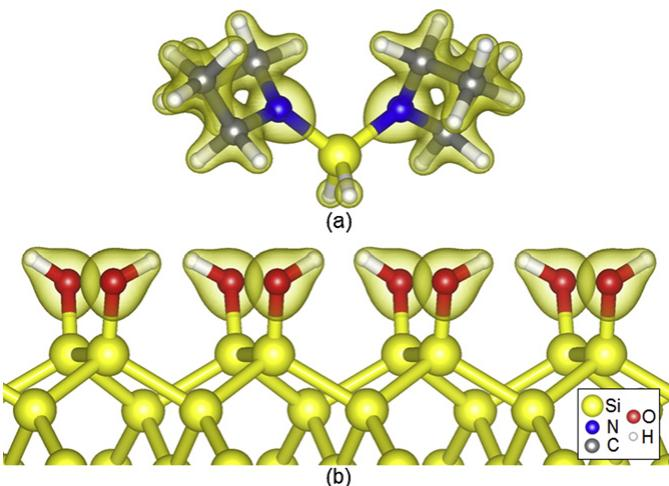
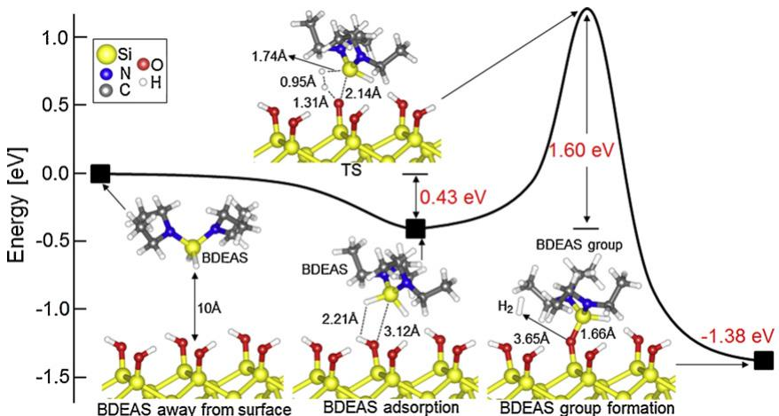
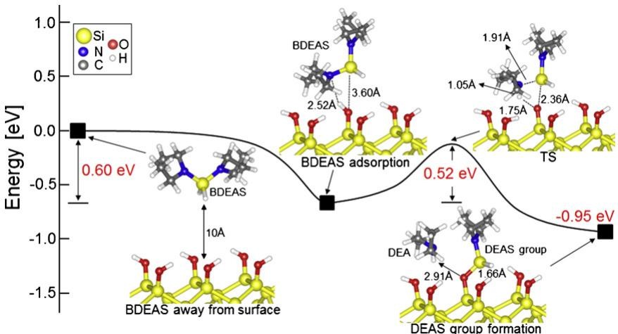

# Adsorption and surface reaction of bis-diethylaminosilane as a Si precursor on an OH-terminated Si (0 0 1) surface

Seung- Bin Baek, Dae- Hee Kim, Yeong- Cheol Kim*

School of Energy, Materials & Chemical Engineering, Korea University of Technology and Education, Cheonan 330- 708, Republic of Korea

# ARTICLE INFO

Article history:  Received 29 October 2011  Received in revised form 17 February 2012  Accepted 8 March 2012  Available online 16 March 2012

Keywords:  Bond dissociation energy  Adsorption  Surface reaction  Bis- diethylaminosilane  Atomic layer deposition  Density functional theory

# ABSTRACT

The adsorption and the surface reaction of bis- diethylaminosilane  $(\mathrm{SiH}_2[\mathrm{N}(\mathrm{C}_2\mathrm{H}_5)_2]_2$  BDEAS) as a Si precursor on an OH- terminated Si (0 0 1) surface were investigated to understand the initial reaction mechanism of the atomic layer deposition (ALD) process using density functional theory. The bond dissociation energies between two atoms in BDEAS increased in the order of  $\mathrm{Si - H}$ $\mathrm{Si - N}$  and the rest of the bonds. Therefore, the relatively weak  $\mathrm{Si - H}$  and  $\mathrm{Si - N}$  bonds were considered for bond breaking during the surface reaction. Optimum locations of BDEAS for the  $\mathrm{Si - H}$  and  $\mathrm{Si - N}$  bond breaking were determined on the surface, and adsorption energies of 0.43 and  $0.60\mathrm{eV}$  respectively, were obtained. The  $\mathrm{Si - H}$  bond dissociation energy of the adsorbed BDEAS on the surface did not decrease, so that a high reaction energy barrier of  $1.60\mathrm{eV}$  was required. On the other hand, the  $\mathrm{Si - N}$  bond dissociation energy did decrease, so that a relatively low reaction energy barrier of  $0.52\mathrm{eV}$  was required. When the surface reaction energy barrier was higher than the adsorption energy, BDEAS would be desorbed from the surface instead of being reacted. Therefore, the  $\mathrm{Si - N}$  bond breaking would be dominantly involved during the surface reaction, and the result is in good agreement with the experimental data in the literature.

$\mathfrak{G}$  2012 Elsevier B.V. All rights reserved.

# 1. Introduction

Since the size of semiconductor devices has diminished and the ratio between the height and width of features has increased continuously, it has become more difficult to deposit uniform and conformal thin- films. Atomic layer deposition (ALD), a deposition technique based on sequential and self- limiting surface reactions, has become more prevalent in terms of depositing thin- films in the semiconductor fabrication processes due to its excellent uniformity and conformality [1,2]. To achieve uniform and conformal thin- films using the ALD technique, precursors must possess several important properties: They should not react by themselves when they are contained in a canister; they should not decompose in the gas phase when they are delivered into a reaction chamber; they should react with the surface when they are adsorbed on it; and excess precursors should not react with the surface after the surface is saturated by the precursors. Additionally, the reaction energy barrier between the precursor and surface should be lower than its adsorption energy, so that the precursor can react with the surface without being desorbed.

Among many Si precursors, bis- diethylaminosilane  $\mathrm{SiH}_2[\mathrm{N}(\mathrm{C}_2\mathrm{H}_5)_2]_2$  BDEAS) has been used for the deposition of  $\mathrm{SiO_2}$  thin- films through the ALD technique, as it can be deposited in a wide temperature range of  $100 - 400^{\circ}C$  with a high deposition rate, as well as having good thermal stability [3]. Katamreddy et al. reported that BDEAS was a suitable Si precursor for  $\mathrm{HfSiO_x}$  because it suppressed the structural change of the thin- films from the amorphous to the crystalline phase [4]. Moreover, Won et al. reported that  $\mathrm{SiO_2}$  thin- film showed an excellent breakdown field because it had very low carbon content, and did not exhibit oxygen deficiency or nonbridging oxygens [5]. Recently, Baek et al. theoretically studied the adsorption energy of BDEAS and its reaction energy barrier on an OH- terminated  $\mathrm{Si}(001)$  surface using density functional theory (DFT), without considering the van der Waals interaction [6]. They obtained an adsorption energy of  $0.20\mathrm{eV}$  and a reaction energy barrier of  $0.62\mathrm{eV}$  . Since the adsorption energy is less than the reaction energy barrier, the precursor will be desorbed rather than being reacted. Therefore, the theoretical result could not explain the easily deposited initial experimental ALD process [3- 5].

In this study, the adsorption and surface reaction of BDEAS with - OH on a Si (0 0 1) surface were investigated to understand the initial reaction mechanism of the ALD process using DFT with consideration of the van der Waals interaction. Based on the bond dissociation energies between two atoms in BDEAS, two weak bonds were considered for bond breaking during the reaction with the surface. The accurately obtained adsorption energies and reaction energy barriers were well interrelated, thereby elucidating the initial experimental ALD process.

Table 1 Bond lengths between two atoms in a fully OH-terminated Si (0 0 1) surface.  

<table><tr><td rowspan="2">Bond type</td><td colspan="2">Bond length (Å)</td></tr><tr><td>This study</td><td>Ref. [20]</td></tr><tr><td>O-H</td><td>0.97</td><td>0.97</td></tr><tr><td>Si-O</td><td>1.68</td><td>1.68</td></tr><tr><td>Si dimer</td><td>2.43</td><td>2.36</td></tr></table>

# 2. Calculation details

All DFT calculations were performed using the Vienna ab- initio simulation package (VASP, code [7- 10]. Electron wave functions were described using the projector augmented wave (PAW) method of Blochl [11] implemented in the VASP code by Kresse and Joubert [12]. The exchange correlation energy was described by the generalized gradient approximation (GGA) of Perdew, Burke, and Ernzerhof (PBE) [13]. All calculations considered van der Waals interactions based on Grimme's DFT- D2 approach in PAw; the van der Waals interactions were described via a simple pair- wise force field, which was optimized for several popular DFT functionals, such as PBE and B3LYP [14]. Since the geometric configuration was not well optimized with DFT- D2, all geometric configurations were first optimized by DFT. The cutoff energy of  $500\mathrm{eV}$  and  $2\times 2\times 1k-$  points mesh with zero shift for a slab structure including a  $2\mathrm{nm}$  vacuum layer were used to generate the plane wave basis set with the Monkhorst- Pack grid method [15]. Partial wave occupancies were calculated with the Gaussian smearing method, and its factor was  $0.05\mathrm{eV}$  . Electronic and geometry optimizations were converged when the total energy difference between successive calculation steps was less than  $10^{- 3}$  and  $10^{- 2}\mathrm{eV}$  respectively.All atoms were allowed to relax until the force on each atom was below  $0.2\mathrm{eV / nm}$

Using these computational settings, the Si unit cell was optimized and a lattice parameter of  $5.411\mathrm{\AA}$  was obtained. This value was in good agreement with the experimental and computational lattice parameters (5.416 and  $5.41\mathrm{\AA}$  [16].A Si 001) surface with  $4\times 4$  surface size and four Si layers was constructed using the optimized Si unit cells. Two neighboring Si atoms of the surface formed the Si dimer, which buckled in a zigzag pattern below the order- disorder transition temperature to reduce the surface energy [17,18]. OHs were attached to the top- layer Si atoms to form an OH- terminated Si (0 0 1) surface [19], and H atoms were attached to the bottom- layer Si atoms to remove their dangling bonds. Bond lengths between two atoms in the optimized Si (0 0 1) surface were in good agreement with previous surface calculation, as shown in Table 1 [20]. One bottom Si layer was fixed among four Si layers with H atoms underneath, and the three top Si layers with OHs on top were allowed to relax. BDEAS was optimized to calculate the bond dissociation energies between two atoms of BDEAS in a  $3\mathrm{nm}\times 3\mathrm{nm}\times 3\mathrm{nm}$  vacuum region. For bond dissociation energy, calculation between the two atoms in BDEAS, the molecule was divided into two groups by breaking the bond between the two atoms while maintaining the molecular structure of the two groups, in the same way as that of the molecule. The optimized BDEAS was introduced to the surface, and its adsorption and reaction energy barrier calculations were carried out using the climbing nudged elastic band (CI- NEB) tool implemented in the VASP code. Six images, including the initial and final configurations, were used for the CI- NEB calculations. Atoms in the relaxed layers and BDEAS were allowed to relax during the energy barrier calculations. The electron density image was drawn by the visualization for electronic and structural analysis (WESTA) tool [21]. An iso- surface level is the amount of electron charge per  $a_0^3$ $a_0 =$  Bohr radius), and the value is 0.15 in this study.

  
Fig. 1. Perspective views of (a) the optimized BDEAS and (b) a fully OH-terminated Si (0 0 1) surface with the electron density distribution. The Si atom is positively charged and the N and H atoms are negatively charged in BDEAS. The O atom is negatively charged and the H atom is positively charged in  $-\mathrm{OH}$  on the Si (0 0 1) surface.

# 3. Results and discussion

Fig. 1(a) shows the optimized BDEAS with the electron density distribution. BDEAS consists of one Si atom, two H atoms, and two amino groups including two N atoms and four ethyls  $(C_{2}H_{5}S)$  The Si atom is positively charged, whereas the N and H atoms are negatively charged in BDEAS due to the relatively strong electronegativity of the N and H atoms (3.04, 2.20) compared to the Si atom (1.90) [22]. Fig. 1(b) shows a fully OH- terminated Si (0 0 1) surface with the electron density distribution. The H atoms of OHs are positively charged, whereas the O atoms are negatively charged due to the relatively strong electronegativity of the O atom (3.44) compared to the H atom (2.20) [22]. From these electron distributions, the Si and H atoms or Si and N atoms of BDEAS could be adsorbed on the O and H atoms of  $- \mathrm{OH}$  on the surface, respectively. Bond lengths and bond dissociation energies between two atoms in BDEAS are shown in Table 2. The bond lengths between the two atoms of the optimized BDEAS were in good agreement with the common bond lengths [23]. Si- H and Si- N bonds were weak among the bonds in BDEAS, and their bond dissociation energies were 4.98 and  $5.00\mathrm{eV}$  with the bond lengths of 1.49 and  $1.72\mathrm{\AA}$  respectively. Therefore, Si- H or Si- N bond is expected to be broken when BDEAS reacts with  $- \mathrm{OH}$  on the surface. We tried several different configurations of BDEAS to find optimum adsorption sites on the fully OH- terminated Si (0 0 1) surface for its reaction with consideration of Si- H or Si- N bond breaking.

Fig. 2 shows an optimum BDEAS adsorption (adsorption energy:  $0.43\mathrm{eV}$  on the surface with consideration of Si- H bond breaking, and the energy variation for its surface reaction. The adsorption

Table 2 Bond lengths and bond dissociation energies between two atoms in BDEAS.  

<table><tr><td rowspan="2">Bond type</td><td colspan="2">Bond length (Å)</td><td rowspan="2">Bond dissociation energy (eV)</td></tr><tr><td>In this study</td><td>Ref. [23]</td></tr><tr><td>Si-H</td><td>1.49</td><td>1.48</td><td>4.98</td></tr><tr><td>Si-N</td><td>1.72</td><td>-</td><td>5.00</td></tr><tr><td>N-C</td><td>1.46</td><td>1.47</td><td>5.45</td></tr><tr><td>C-C</td><td>1.53</td><td>1.54</td><td>5.56</td></tr><tr><td>C-H1a</td><td>1.11</td><td>1.09</td><td>5.34</td></tr><tr><td>C-H2b</td><td>1.10</td><td>1.09</td><td>6.41</td></tr></table>

a C-H1:a C atom is bonded to an N atom. b C-H2: a C atom is bonded to a C atom.

  
Fig. 2. Energy variation for the BDEAS reaction with  $-\mathrm{OH}$  on the Si (0 0 1) surface to produce a BDEAS group and  $\mathrm{H}_{2}$ . Perspective views are shown along the [1 00] direction. "TS" in this figure indicates a transition state.

energy was  $0.10\mathrm{eV}$  without the van der Waals interaction. The relative energy is set to  $0\mathrm{eV}$  as a reference when BDEAS is located at a distance of  $10\mathrm{\AA}$  from the surface. The positively charged Si atom of the adsorbed BDEAS was located on the negatively charged O atom of  $- \mathrm{OH}$  at a  $\mathrm{Si}_{\mathrm{BDEAS}}\cdot \cdot \cdot \mathrm{O}_{- \mathrm{OH}}$  distance of  $3.12\mathrm{\AA}$ . The negatively charged H atom of the adsorbed BDEAS was located on the positively charged H atom of  $- \mathrm{OH}$  at a  $\mathrm{H}_{\mathrm{BDEAS}}\cdot \cdot \cdot \mathrm{H}_{- \mathrm{OH}}$  distance of  $2.21\mathrm{\AA}$ . The chemical reaction formula of BDEAS with  $- \mathrm{OH}$  on the surface is as follows:

$$
\mathrm{-OH + SiH_2[N(C_2H_5)_2]_2\rightarrow -O - SiH[N(C_2H_5)_2]_2 + H_2.}
$$

The adsorbed BDEAS reacted with  $- \mathrm{OH}$  to produce a silylhydride group  $(- \mathrm{SiH}[\mathrm{N}(\mathrm{C}_2\mathrm{H}_5)_2]_2)$  and  $\mathrm{H}_{2}$  with its reaction energy barrier of  $1.60\mathrm{eV}$ . The Si atom of the silylhydride group was bonded to the O atom of  $- \mathrm{OH}$  with a bond length of  $1.66\mathrm{\AA}$ , and the generated  $\mathrm{H}_{2}$  as a by- product was located near the silylhydride group at a distance of  $3.65\mathrm{\AA}$ . The energy was decreased to  $- 1.38$  from  $- 0.43\mathrm{eV}$  after the surface reaction. The adsorbed BDEAS for  $\mathrm{Si - H}$  bond breaking would rather be desorbed from the surface, because the reaction energy barrier was higher than the adsorption energy.

Fig. 3 shows an optimum BDEAS adsorption (adsorption energy:  $0.60\mathrm{eV}$ ) on the surface with consideration of  $\mathrm{Si - N}$  bond breaking, and the energy variation for its surface reaction. The adsorption energy was  $0.20\mathrm{eV}$  without the van der Waals interaction. The positively charged Si atom from BDEAS was located on the negatively charged O atom of  $- \mathrm{OH}$  at a  $\mathrm{Si}_{\mathrm{BDEAS}}\cdot \cdot \cdot \mathrm{O}_{- \mathrm{OH}}$  distance of  $3.60\mathrm{\AA}$ . The negatively charged N atom of BDEAS was located on the positively

Table 3 Bond lengths and bond dissociation energies of the  $\mathrm{Si - H}$  and  $\mathrm{Si - N}$  bonds in BDEAS, and the  $\mathrm{O - H}$  bond in  $-\mathrm{OH}$  before and after the adsorption of BDEAS on a fully OH-terminated Si (0 0 1) surface.  

<table><tr><td rowspan="2">Bond type</td><td colspan="2">Before adsorption</td><td colspan="2">After adsorption</td><td rowspan="2">Adsorption with consideration of</td></tr><tr><td>Bond length (Å)</td><td>Bond dissociation energy (eV)</td><td>Bond length (Å)</td><td>Bond dissociation energy (eV)</td></tr><tr><td>Si-H in BDEAS</td><td>1.49</td><td>4.98</td><td>1.49</td><td>4.85</td><td rowspan="2">Si-H bond breaking</td></tr><tr><td>O-H in -OH</td><td>0.97</td><td>5.58</td><td>0.97</td><td>5.45</td></tr><tr><td>Si-N in BDEAS</td><td>1.72</td><td>5.00</td><td>1.74</td><td>4.42</td><td rowspan="2">Si-N bond breaking</td></tr><tr><td>O-H in -OH</td><td>0.97</td><td>5.58</td><td>0.99</td><td>5.01</td></tr></table>

  
Fig. 3. Energy variation for the BDEAS reaction with  $-\mathrm{OH}$  on the Si (0 0 1) surface to produce a DEAS group and DEA. Perspective views are shown along the [1 00] direction. "TS" in this figure indicates a transition state.

charged H atom of  $- \mathrm{OH}$  at a  $\mathrm{N_{BDEAS}}\dots \mathrm{H_{- OH}}$  distance of  $2.52\mathrm{\AA}$  . The reaction formula is given below:

$$
\mathrm{-OH + SiH_2[N(C_2H_5)_2]\_ - - - - - - - - - - - - - - - - - - - - - - - - - - - - - - - - - - - - - - - - - - - - - - - - - - - - - - - - - - - - - - - - - - - - - - - - - - - - - - - - - - - - - - - - - - - - - - - - - - - -}
$$

The adsorbed BDEAS reacted with  $- \mathrm{OH}$  to produce a silylene group  $(- \mathrm{SiH}_2[\mathrm{N}(\mathrm{C}_2\mathrm{H}_5)_2])$  and diethylamine  $(\mathrm{NH}(\mathrm{C}_2\mathrm{H}_5)_2$  DEA),with a reaction energy barrier of  $0.52\mathrm{eV}$  The Si atom of the silylene group was bonded to the O atom of  $- \mathrm{OH}$  with a bond length of  $1.67\mathrm{\AA}$  and the DEA generated as a by- product was located near the silylene group at a distance of 2.91 A. Experimentally, DEA is measured by quadrupole mass spectrometry (QMS) during the first half cycle of ALD [24]. The energy was decreased to  $- 0.95$  from  $- 0.60\mathrm{eV}$  after the surface reaction. The adsorbed BDEAS for Si- N bond breaking could react with the surface because the adsorption energy was high enough for BDEAS to stay on the surface during the reaction.

Although the bond dissociation energy of the  $\mathrm{Si - H}$  bond is smaller than that of the  $\mathrm{Si - N}$  bond in BDEAS, as shown in Table 2, its surface reaction with  $- \mathrm{OH}$  is dominated by  $\mathrm{Si - N}$  bond breaking. To understand this reaction mechanism, the variation of bond lengths and bond dissociation energies of the  $\mathrm{Si - H}$  and  $\mathrm{Si - N}$  bonds in BDEAS and the  $\mathrm{O - H}$  bond in  $- \mathrm{OH}$  were calculated before and after the BDEAS adsorption on the surface, as shown in Table 3. When BDEAS was in vacuum, the bond dissociation energies of the  $\mathrm{Si - H}$ $\mathrm{Si - N}$  and  $\mathrm{O - H}$  bonds were 4.98, 5.00, and  $5.58\mathrm{eV}$  with the bond lengths of 1.49, 1.72, and  $0.97\mathrm{\AA}$  respectively. When BDEAS was adsorbed on the surface, as shown in Fig. 2, the bond dissociation energies of the  $\mathrm{Si - H}$  and  $\mathrm{O - H}$  bonds were nearly unchanged, at 4.85 and  $5.45\mathrm{eV}$  with the same bond lengths of 1.49 and  $1.72\mathrm{\AA}$  On the other hand, when BDEAS was adsorbed on the surface, as shown in Fig. 3, the bond dissociation energies of the  $\mathrm{Si - N}$  and  $\mathrm{O - H}$  bonds significantly decreased from 5.00 to 4.42 and from 5.58 to  $5.01\mathrm{eV}$  respectively. The bond lengths of the  $\mathrm{Si - N}$  and  $\mathrm{O - H}$  bonds also increased from 1.72 and 0.97 to 1.74 and  $0.99\mathrm{\AA}$  respectively. In summary, when BDEAS was adsorbed on the surface with a certain configuration, its adsorption energy was high, sometimes causing order reversal of the bond dissociation energies, for example, in the  $\mathrm{Si - N}$  and  $\mathrm{Si - H}$  bonds at the adsorption configuration with consideration of  $\mathrm{Si - N}$  bond breaking. Since strong adsorption could also weaken the neighboring bonds that were to be broken for surface reaction, the surface reaction energy barrier would be affected.

# 4.Conclusions

The adsorption and surface reaction of BDEAS as a Si precursor on an OH- terminated Si (0 0 1) surface were investigated to understand the initial reaction mechanism of ALD process using DFT. The  $\mathrm{Si - H}$  bond was weaker than the  $\mathrm{Si - N}$  bond when BDEAS was in vacuum. When BDEAS was adsorbed on the surface with consideration of  $\mathrm{Si - H}$  bond breaking, its adsorption energy and reaction energy barrier were 0.43 and  $1.60\mathrm{eV}$  respectively. The adsorbed BDEAS was desorbed from the surface rather than reacting with the surface because its reaction energy barrier was higher than its adsorption energy. When BDEAS was adsorbed on the surface with consideration of  $\mathrm{Si - N}$  bond breaking, its adsorption energy and reaction energy barrier were 0.60 and  $0.52\mathrm{eV}$  respectively. The adsorbed BDEAS would react with  $- \mathrm{OH}$  on the surface because its reaction energy barrier was lower than its adsorption energy. Therefore, the adsorption configuration of BDEAS on the surface could determine the dominant bond breaking during the surface reaction by affecting its adsorption energy and the bond dissociation energies of the neighboring bonds. This result was in good agreement with the experimental data in the literature.

# Acknowledgments

AcknowledgmentsThis work was supported by Basic Science Research Program through the National Research Foundation of Korea (NRF) funded by the Ministry of Education, Science and Technology (No. 2011- 0002549), and partially by the Education and Research Promotion Program of Korea University of Technology and Education (KUT).

# References

References[1] S.M. George, A.W. Ott, J.W. Klaus, J. Phys. Chem. 100 (1996) 13121- 13131. [2] S.M. George, Chem. Rev. 100 (2010) 111- 131. [3] I. Suzuki, K. Yanagita, C. Dussarrat, 210th ECS Meeting Proceedings, 2006, pp. 119- 128. [4] R. Katamreddy, B. Feist, C. Takoudis, J. Electrochem. Soc. 155 (2008) G163- G167. [5] S.- J. Won, S.J. Suh, M.S. Huh, H.J. Kim, IEEE Elec. Dev. Lett. 31 (2010) 857- 859. [6] S.- B. Baek, D.- H. Kim, Y.- C. Kim, IEICE Trans. Electron. E94- C (2011) 771- 774. [7] G. Kresse, J. Hafner, Phys. Rev. B 47 (1993) 558- 561. [8] G. Kresse, Thesis Technische Universität Münne, 1993. [9] G. Kresse, J. Furthmüller, Comput. Mater. Sci. 6 (1996) 15- 50. [10] G. Kresse, J. Furthmüller, Phys. Rev. B 54 (1996) 11169- 11186. [11] P.E. Blöchl, Phys. Rev. B 50 (1994) 17953- 17979. [12] G. Kresse, D. Joubert, Phys. Rev. B 59 (1999) 1758- 1775. [13] J.P. Perdew, K. Burke, M. Ernzerhof, Phys. Rev. Lett. 77 (1996) 3865- 3868. [14] S. Grimme, J. Comput. Chem. 27 (2006) 1787- 1799. [15] H.J. Monkhorst, J.D. Pack, Phys. Rev. B 13 (1976) 5188- 5192. [16] T. Bucko, J. Phys. Chem. A 114 (2010) 11814- 11824. [17] M. Ono, A. Kamoshida, N. Matsuura, T. Eguchi, Y. Hasegawa, Phys. B: Condens. Matter 329- 333 (2003) 1644- 1646. [18] G.S. Hwang, Surf. Sci. 465 (2000) L789- L793. [19] S.S. Lee, J.Y. Baik, K.- S. An, Y.D. Suh, J.H. Oh, Y.S. Kim, J. Phys. Chem. B 108 (2004) 15128- 15132. [20] G. Demirel, M. Cakmak, T. Caukara, S. Ellailioglu, J. Phys. Chem. C 111 (2007) 15020- 15025. [21] K. Momma, F. Izumi, J. Appl. Crystallogr. 41 (2008) 653- 658. [22] A.L. Allred, J. Inorg. Nucl. Chem. 17 (1961) 215- 221. [23] C.D. Schaeffer, C.A. Strauss, M.W. Thomsen, C.H. Yoder, Data for General Organic and Physical Chemistry, Franklin & Marshall College, 1989 (Table 6). [24] G. Dignemans, C.A.A. van Helvoirt, M.C.M. van de Sanden, W.M.M. Kessels, ECS Trans. 35 (2011) 191- 204.