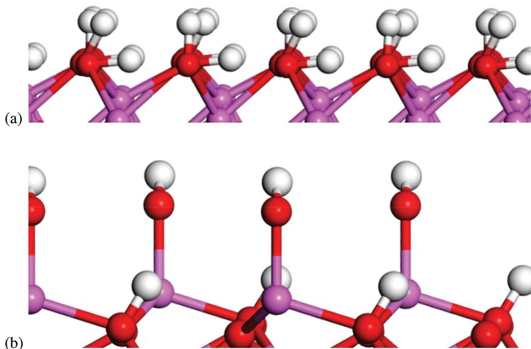
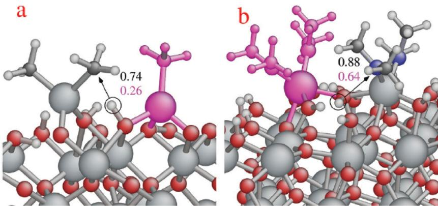
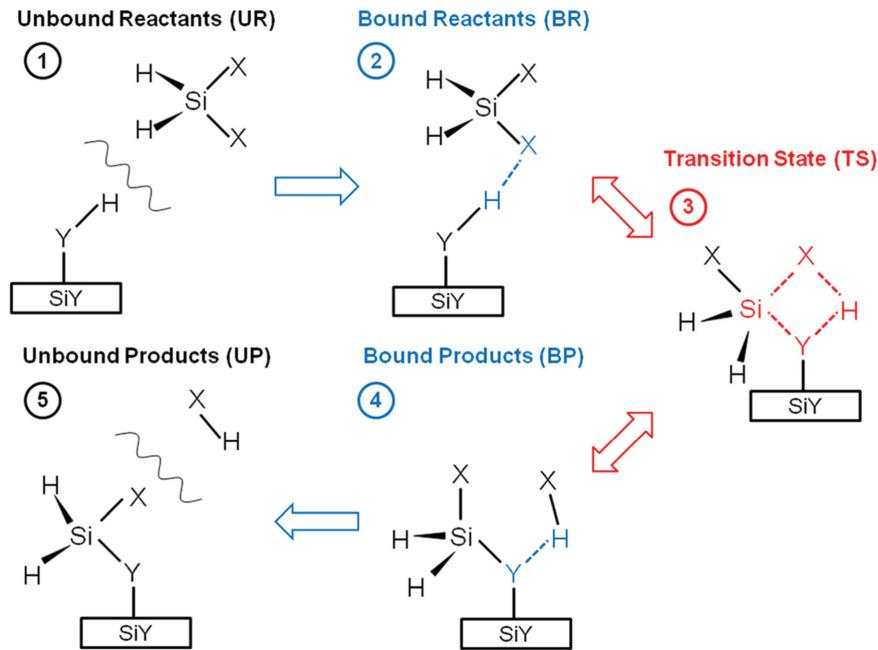
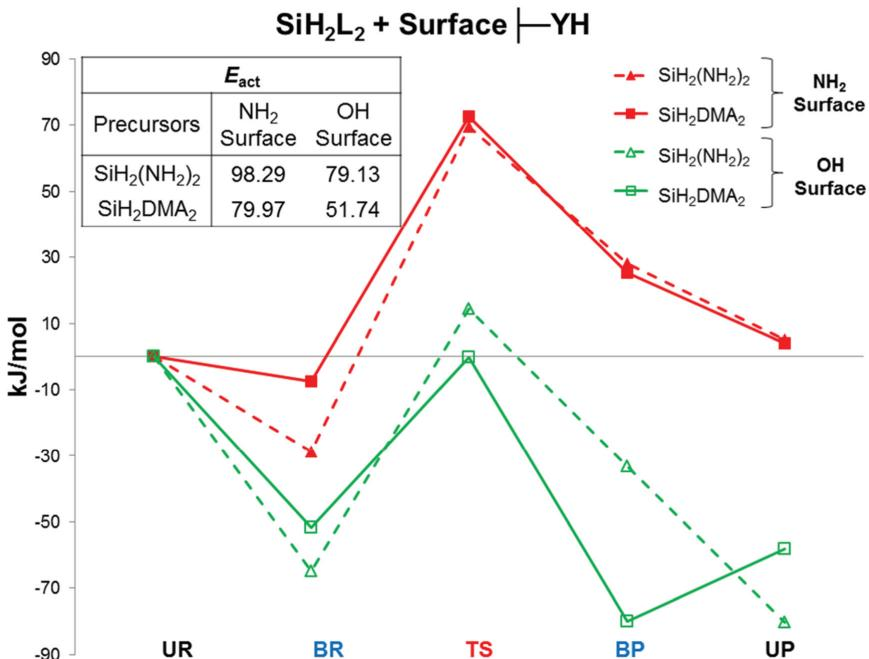
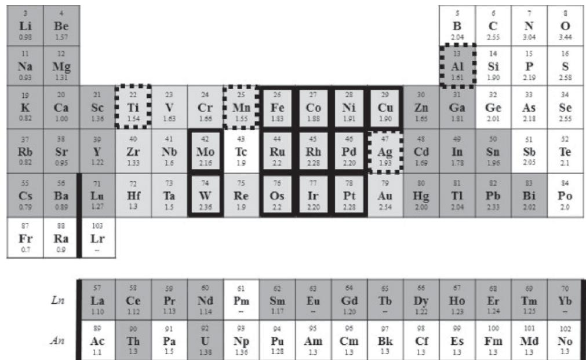
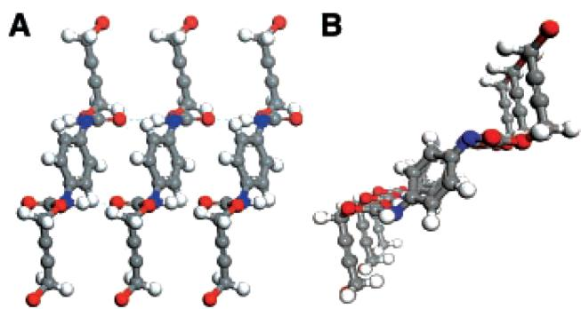
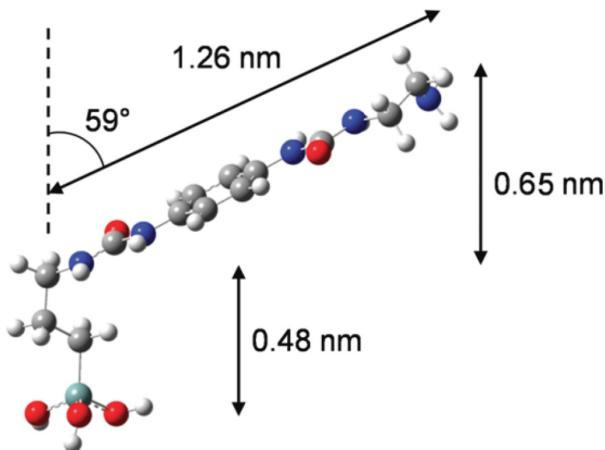
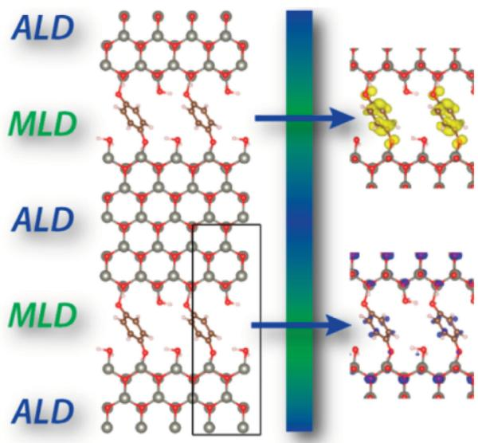
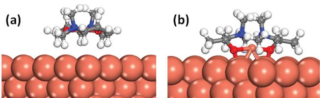
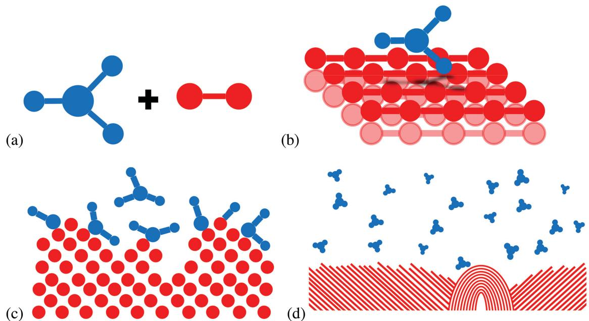

# Modeling Mechanism and Growth Reactions for New Nanofabrication Processes by Atomic Layer Deposition

Simon D. Elliott,* Gangotri Dey, Yasheng Maimaiti, Hayrensa Ablat, Ekaterina A. Filatova, and Glen N. Fomengia

# 1. Introduction

While new materials often play a key role in disruptive new inventions, developing an appropriate way to fabricate materials is the key to commercialization of such inventions as viable technologies. Accordingly, many technological roadblocks in fact come down to limitations in materials processing. For example, although steel had been known since antiquity, it was only with the development of the cost- efficient Bessemer process in the 1850s that steel- reinforced skyscrapers could be built.[1] In today's electronics industry, further advancements in speed and efficiency are dependent on improving the resolution of materials processing during the manufacture of electronic chips.[2] As electronic devices become smaller, specific materials must be deposited, patterned and etched at the nanoscale. There is thus a need to coat 3D structures with nanometer- thin films of various materials, within the stringent reliability and uniformity tolerances of semiconductor manufacturing. Atomic layer deposition (ALD), a special type of chemical vapor deposition (CVD), allows the growth of such ultrathin and conformal films of inorganic materials by using sequential, self- limiting reactions.[3]

This paper gives an overview of developments in modeling the chemical mechanism of ALD, concentrating on the period from 2012 to date and putting the research of our group in the context of recent publications. A survey of the ALD modeling literature prior to 2012 is given in ref. [4].

ALD differs from CVD in that the substrate is exposed separately to each gas- phase reagent (precursor), with the aim of restricting reactions to the surface only. In temporal ALD, each precursor is pulsed individually into the ALD reactor and purged out again with inert gas or vacuum before the next precursor is admitted, so that one cycle typically consists of pulse - purge - pulse - purge. In spatial ALD' the substrate is moved between zones that each contain the precursor gases, separated by inert gas curtains. ALD precursors undergo selflimited reactions with the substrate or growing film, which terminate when the substrate is covered with fragments of the new precursor. In this way, growth is limited to a fraction of a monolayer in each cycle of precursor pulses. ALD cycles are repeated until the desired film thickness is obtained. ALD is therefore uniquely suited to growing nanometer- thin films of high quality in a controlled fashion, uniformly coating any substrate geometry over length scales from nanometers to meters. A comprehensive summary of ALD precursors, processes and materials is given in a recent review.[5] ALD- grown layers are now used for electroluminescent displays, transistors, memory chips, disk read- write heads and light- emitting diodes. Nonelectronics applications are also emerging, such as passivation layers in solar cells, thin film batteries, diffusion barriers for packaging and anti- corrosion coatings.

ALD is defined through its chemical mechanism: self- limiting reactions of a gaseous precursor with the solid substrate. In general these gas- surface reactions can be described as dissociative chemisorption, where precursors react in multiple steps with functionalized surfaces and by- products desorb. Whether the desired purity of target film can be achieved depends on what by- products desorb. Similar chemical reactions occur in heterogeneous catalysis,[6] but in ALD continuous turnover of the reaction is not desired. Instead, many ALD processes exploit the inertness of ligands, assumed or known from experience, to ensure saturation of the surface in each precursor pulse (i.e., the self- limiting growth reaction), as well as thermal stability of the precursor (to avoid uncontrolled gas- phase reactions).

While it is convenient to speak about ALD chemistry in the absolute terms of which reactions take place and which ones do not, leading irreversibly to fixed structures, the real situation is more nuanced. Many different reactions are in continual competition during the various phases of the cyclic growth experiment, responding to the changes in gas pressure and concentration of surface species. The outcome of this competition is of course determined by kinetics and for a successful ALD process the desired growth reactions should be much more rapid than the undesired - and possibly uncontrolled - non- ALD reactions. Thus, during the precursor pulse, dissociative chemisorption and by- product desorption should lead rapidly to saturation, before there can be substantial contribution from competing non- limited reactions (such as CVD). During the purge, the physical process of evacuating reagents and byproducts should be faster than reverse reactions on the surface (e.g., etching). The duration of pulse and purge periods should

therefore be optimized so as to be short enough to minimize the contribution from unwanted reactions, but long enough to achieve saturation and evacuation respectively.

To design, analyze or improve an ALD process in a rational way therefore requires knowledge of the underlying chemical mechanism. A remarkable level of detail about the mechanism can be obtained from characterization under typical process conditions in situ to the ALD reactor using techniques such as quadrupole mass spectrometry, quartz crystal microbalance, infrared spectrometry[7] and synchrotron X- ray methods.[8] Atomic- scale modeling using density functional theory (DFT) provides a complementary view, which is the focus of this report.

In principle, the kinetics of every conceivable growth reaction and side reaction for a given system of substrate and reagents should be evaluated and compared. Clearly, this is rarely possible, but fortunately there are short- cuts. Comparing the activation energies of selected key reaction steps may be sufficient to answer specific questions about a process, and this is the approach taken in most of the papers reported below. The common approach for ALD modeling is to use DFT to calculate the pathways for precursor adsorption, ligand migration and by- product formation on the surface, yielding reaction energies and activation energies for each step and indicating whether the reaction is thermodynamically or kinetically favorable at the temperature of interest (if the effect of entropy is included). Surfaces may be modeled using either periodic slabs or finite clusters. Empirical corrections of the van der Waals interactions are included in some studies,[9- 11] which is discussed further in section 6.2.

An even simpler approach is to compute the overall thermodynamics of the ALD reaction with DFT. Though apparently ignoring kinetics, this can give valuable insight because, within a class of similar reactions, reactions that are more exothermic also have lower activation energies. In addition, low- temperature ALD processes must be driven forward by favorable energetics  $(\Delta E< 0)$  whereas high- temperature CVD processes are often driven by entropy  $(\Delta S > 0)$

This report is organized into sections according to the material class deposited by ALD: metal oxides in section 2, siliconbased materials in section 3, metals in section 4 and organic materials such as polymers in section 5. Finally section 6 outlines some areas where method development is needed to further advance the scope of ALD modeling.

# 2. Modeling the ALD of Oxides

# 2.1. Alumina from Trimethylaluminium

Thermal ALD of alumina  $(\mathrm{Al}_2\mathrm{O}_3)$  from trimethylaluminium (TMA,  $\mathrm{Al(CH_3)_3}$ ) and water is widely studied because of its numerous applications in the electronics industry. Several reaction mechanisms of alumina ALD are proposed that are consistent with experiment[12- 14] but without specific evidence for surface intermediates and fragments. Exploring the reaction mechanisms at the atomic scale should help us to understand how thin films are deposited with precise thickness control even in high aspect ratio structures. Ab initio techniques are Simon Elliott leads the materials modeling for devices group at Tyndall National Institute, Ireland. Before joining Tyndall in 2001, he studied chemistry at Trinity College Dublin and the Karlsruhe Institute of Technology. He uses computational materials science to understand the mechanism of thin film growth by atomic layer deposition and is interested in science communication.

used to compute various models revealing thermodynamically and kinetically favorable mechanistic pathways at different stages of alumina ALD.

The first reported study is by Widjaja and Musgrave, who use DFT cluster models of a few dozen atoms[15] to compute reaction energetics and transition state structures involved in single ligand elimination (also known as 'ligand exchange') in both ALD pulses, with the formation of Lewis acid- base Al- O adducts and  $\mathrm{CH}_4$  from proton transfer over an activation barrier. Insignificant non- local electronic effects on the reactions involving these clusters are observed. A similar model involving two ligand elimination reactions for each half reaction is presented by Shankar et al. to predict the reaction kinetics and the kinetics are fed into a continuum- based ALD reactor simulation that also includes fluid flow, mass and heat transport, so as to predict growth rate as a function of reactor conditions.[16]

Heyman and Musgrave also explore the  $\mathrm{AlCl}_3 + \mathrm{H}_2\mathrm{O}$  half reactions for alumina ALD with DFT, comparing the computed reaction mechanisms to those obtained for the TMA+water process.[17] Both half reactions are predicted to have similar reaction kinetics at  $T = 0\mathrm{K}$  involving only a single transition state for each discrete reaction step. At higher temperatures, non- ALD side- reactions of the chloro ligands compete with the ALD reactions through the deactivation of surface sites, leading to lower growth rates per cycle, as seen in experiment. These side- reactions are computed to be endothermic, but can nevertheless be significant because many ALD reactions take place under non- equilibrium flow conditions, with the difference in chemical potential between the reactants and products providing the thermodynamics to push the reaction forward.[18] Similar observations have been noted for the ALD of  $\mathrm{HfO}_2$  and  $\mathrm{ZrO}_2$  from chloride precursors (see section 2.2).[19,20]

Elliott and Greer report DFT studies using a periodic model of bare and fully hydroxylated  $\alpha$ - alumina surfaces (Figure 1a), focusing on the early stages of the TMA pulse when precursor fragments are isolated, and simulating precursor dissociation and ligand elimination reactions with neighboring groups.[21] Ligand elimination is found to proceed most readily by proton transfer from particular neighboring hydroxyl groups (those where the proton is horizontally oriented). In addition,

www.MaterialsViews.com

molecular chemisorption of TMA is barrier- less with reaction energy close to that obtained using the cluster model.[15] The simulations show that reactions are possible on bare alumina, but yield a lower ALD growth rate than for the fully hydroxylated surface.

An improved model of precursor fragments covering the surface is proposed by Shirazi and Elliott and this is seen to have a substantial effect on the surface reaction kinetics.[22] For instance, the activation barrier for proton transfer and ligand elimination is reduced substantially by the existence of neighboring fragments (Figure 2) This influence of neighboring adsorbates on the reaction kinetics at a given surface site is termed the 'cooperative effect'. In general, the acidity/basicity of the surface is seen to depend on the coverage of fragments, and this ultimately explains the self- limiting nature of the ALD reactions. This important step forward in understanding ALD chemistry is only possible through time- consuming calculations that explicitly include a model of the environment around the reactive site.

Travis and Adomaitis determine the rate limiting steps within a kinetic model of  $\mathrm{Al}_2\mathrm{O}_3$  film growth using the calculated energetics and transition state structures from Elliott and Greer.[23] The results show that a combination of TMA adsorption on bare and hydroxylated surface oxygen sites is needed in order to produce growth rates that are comparable with experiments in the saturation regime. Adomaitis and co- workers also use the known mechanistic data on  $\mathrm{Al}_2\mathrm{O}_3$  ALD to demonstrate a reaction factorization technique that rigorously determines if the deposition process time scales can be separated.[24] The significance of individual reactions within the overall ALD process can thus be analyzed, revealing which reactions truly achieve self- limiting behavior under given growth conditions. For instance, including the cooperative effect is seen to have a dramatic impact. It is particularly valuable that this technique can reveal whether a proposed reaction mechanism is structurally correct and complete.

Hydroxylation is known to play a critical role in oxide ALD, as the growth rate is linearly dependent on the extent to which ligands are eliminated during the metal precursor pulse, and hence on the coverage of labile surface- OH groups at the end of the oxygen pulse.[21] The models of Elliott and Greer correspond to two extremes - the high temperature bare  $\alpha - \mathrm{Al}_2\mathrm{O}_3$  surface or the low temperature surface with complete gibbsite- like hydroxylation. Łodziana et al.[25] introduce a more realistic model representing the surface coverage of  $\alpha - \mathrm{Al}_2\mathrm{O}_3$  under actual conditions of temperature and pressure by converting DFT calculations into phase diagrams. According to this, typical process conditions should yield a partially hydroxylated surface with higher and lower hydroxyl groups in different coordination environments (Figure 1b).

Weckman and Laasonen use this model to investigate reaction energetics of alumina from  $\mathrm{TMA + H_2O}$  under typical experimental conditions.[26] The improved model yields lower activation barriers for proton transfer and ligand elimination reactions compared to the previously reported results of ref.[21] In addition, complex surface structures are simulated resulting from the adsorption of multiple TMA molecules, e.g., methyl bridges that stabilize the adsorbed species through the cooperative effect.[22] The authors provide evidence that saturation with monomethylaluminium fragments at the end of the TMA pulse is due to kinetics, not thermodynamics as previously assumed. A sort of cooperative effect is also noted during the water pulse, with interactions between water molecules stabilizing the transition states.

Similar results are observed by Sandupatla et al. on a partially hydroxylated gibbsite- like surface.[27] Bridging oxygen is identified as the predominant site for TMA adsorption leading to methylation of the surface.

The other main class of alumina ALD processes use  $\mathrm{TMA + O}_3$  or other oxidizing agents. By using O atoms as a model for these oxidants in DFT calculations, the redox reactions with a methylated surface are simulated based on structures from short molecular dynamics (MD) runs in various spin states. This reveals the transfer of hydride  $\mathrm{(H^{- })}$  from  $\mathrm{CH}_3$  fragments to adsorbed O atoms on the surface generating surface  $\mathrm{OH^{- }}$  groups and volatile by- products such as  $\mathrm{C}_2\mathrm{H}_4$ .[28] On the contrary, in a different study, DFT- assigned in situ spectra confirm the formation of stable formant intermediates via the incorporation of O atoms into the surface.[29] The wide range of redox reactions that TMA can undergo with a reducible oxide surface is elucidated in a comprehensive DFT study by Klejna and Elliott.[30] This knowledge of reaction pathways can be useful for modeling plasma- enhanced ALD of alumina using TMA and oxygen plasma, although it is likely that more complex reaction mechanisms are required, rendering the simulations of plasma- enhanced ALD very challenging (see section 6.3).

  
Figure 1. Side views of surface models for hydroxylated alumina surfaces prior to the adsorption of TMA: a) gibbsite-like fully hydroxylated surface  $(25\mu \mathrm{mol}\mathrm{m}^{-2}$  of OH), and b) partially hydroxylated surface  $(16\mu \mathrm{mol}\mathrm{m}^{-2})$  that is more representative of ALD conditions and features both higher and lower OH groups. Ball-and-stick representation: violet  $= \mathsf{Al}$  red  $= \mathsf{O}$  white  $= \mathsf{H}$

  
Figure 2. Cooperative effect in metal oxide ALD. The presence of a remaining fragment (pink atoms) in the neighborhood of the ligand creates a highly facilitative environment for proton transfer from the surface oxygen to the ligand. The pink fragment does not participate directly in proton transfer but does increase the coordination number of the central surface oxygen. The activation energy computed for proton transfer is thus lower when the pink fragment is present (pink text, eV) than when it is absent (black text, eV). a)  $A1_{2}O_{3}$  from TMA  $+H_{2}O_{i}$  b)  $HfO_{2}$  from  $\mathsf{Hf(NMe_2)_4 + H_2O}$ $\mathbf{red} = \mathbb{O}$  blue  $= \mathbb{N}$  white  $= \mathbb{H}$  large gray  $= \mathbb{A}1$  or Hf, and small gray  $= \mathbb{C}$  Reproduced with permission.[22] Copyright 2015, Royal Society of Chemistry.

Together, these investigations show that a rich and complex chemistry underlies thermal ALD with TMA, which goes beyond a linear sequence of independent H- transfer reactions and in fact depends on substrate, coverage, co- reactant and ambient conditions. We may soon be in a position to see how atomistic growth chemistry dictates properties at higher scales, such as film morphology. These insights should help advance our understanding of the ALD of other oxides (section 2.2) and help design novel ALD processes.

# 2.2. ALD of Transition Metal Oxides

Afshar and Cadien study the reaction pathways of ALD of  $\mathrm{ZnO}$  from diethylzinc  $(\mathrm{Et}_2\mathrm{Zn},\mathrm{Et} = \mathrm{C}_2\mathrm{H}_5)$  and water using DFT.[31] Ren follows a similar approach for the same  $\mathrm{Et}_2\mathrm{Zn} + \mathrm{H}_2\mathrm{O}$  system, but considering reactions on the hydroxylated silicon substrate.[32] These studies show that the existence of hydroxyl groups on the silicon substrate lowers the activation energy. In a computational study of ALD of nitrogen- doped  $\mathrm{ZnO}$  based on the reaction of  $\mathrm{Et}_2\mathrm{Zn}$  and ammonium hydroxide  $(\mathrm{NH_4OH})$  it is shown that the dissociation of  $\mathrm{NH_4OH}$  leads to  $\mathrm{NH}_3$  and  $\mathrm{H}_2\mathrm{O}$  which undergo parallel half reactions that simultaneously provide oxygen and nitrogen, and is then followed by the  $\mathrm{Et}_2\mathrm{Zn}$  half reaction.[33] The ALD of zinc tin oxide from  $\mathrm{Et}_2\mathrm{Zn}$  tetrakis(dimethylamido)tin TDMASn) and  $\mathrm{H}_2\mathrm{O}$  is studied using DFT calculations and in situ quadrupole mass spectrometry.[34] In this case, Gibbs free energies of adsorption of TDMASn onto OH- terminated  $\mathrm{ZnO}$  surfaces are calculated to demonstrate that the ALD reaction is feasible. Tanskanen et al. investigate the ALD of tin oxide from TDMASn and  $\mathrm{H}_2\mathrm{O}$  on an OH- terminated silicon substrate using DFT and Møller- Plesset second- order perturbation theory.[35]

The mechanisms of ALD of  $\mathrm{TiO_2}$  from  $\mathrm{TiCl}_4 + \mathrm{H}_2\mathrm{O}^{[36]}$  and  $\mathrm{TiI}_4 + \mathrm{H}_2\mathrm{O}^{[37]}$  on  $\mathrm{SiO}_2$  substrates are studied by Hu and Turner using cluster models. Substitution of  $\mathrm{TiI_4}$  with  $\mathrm{TiCl_4}$  as the metal precursor is proven to increase the binding energies of the absorbates onto the surface, but the activation barriers are not significantly different between these two metal precursors. Zydor et al. study the adsorptions of ALD precursor molecules  $\mathrm{Ti(OMe)_4}$  and  $\mathrm{TiCp^{*}(OMe)_3}$  [where  $\mathrm{Me} = \mathrm{CH}_3$ ] and find that differences in Lewis acidity of the Ti center mean that  $\mathrm{Ti(OMe)_4}$  adsorbs strongly on the hydrated  $\mathrm{TiO_2}$  surface and loses ligands, while  $\mathrm{TiCp^{*}(OMe)_3}$  does not.[38] This accounts for the experimental observation that films may be successfully deposited using  $\mathrm{Ti(OMe)_4}$ , but not  $\mathrm{TiCp^{*}(OMe)_3}$ , in a thermal  $\mathrm{H}_2\mathrm{O}$ - based ALD process.

The ALD of  $\mathrm{HfO_2}$  is one of the most studied processes from the modeling prospective. The reaction mechanisms of  $\mathrm{HfCl}_4 + \mathrm{H}_2\mathrm{O}$  [39- 41]  $\mathrm{HfI}_4 + \mathrm{H}_2\mathrm{O}$  [37]  $\mathrm{Hf(OEt)_4 + H_2O}$  [42]  $\mathrm{HfMe}_4 + \mathrm{H}_2\mathrm{O}$  [40] and  $\mathrm{Hf(NEtMe)_4 + H_2O^{[33]}}$  are all modeled with DFT using cluster models. The adsorp tion energies of precursors and the activation barriers for ligand elimination are calculated so as to propose feasible reaction pathways. Possible side- reactions during the ALD of  $\mathrm{HfCl}_4 + \mathrm{H}_2\mathrm{O}$ , which compete with the ligand elimination reactions, are also calculated to explain the source of chlorine contamination in this process.[44] Kinetic Monte Carlo (KMC) simulations of ALD are developed and used to investigate the reaction of  $\mathrm{HfCl}_4 + \mathrm{H}_2\mathrm{O}$  on Si and  $\mathrm{SiO}_2$  substrates (see section 6.4).[45- 47] DFT calculations are also used to compare the ALD growth kinetics of  $\mathrm{HfO_2}$  and  $\mathrm{Hf}_x\mathrm{Si}_y\mathrm{O}_2$  films by studying the reactions of  $\mathrm{HfCl}_4 + \mathrm{H}_2\mathrm{O}$  on H- terminated Si and on  $\mathrm{Si(OMe)_4}$ - pretreated Si substrates.[48] Our study of  $\mathrm{Hf(NMe_2)_4 + H_2O}$  on  $\mathrm{HfO_2}$ [49] shows that repeated proton diffusion from the surface to multiple amide ligands and rotation of the protonated amines without desorption is more energetically accessible than the simple elimination of the amine ligands one at a time.

ALD reactions of  $\mathrm{ZrO_2}$  based on the reaction of  $\mathrm{ZrCl}_4 + \mathrm{H}_2\mathrm{O}$  are studied with quantum chemical[20,40,50,51] and KMC methods.[45] The first half reaction of  $\mathrm{ZrO_2}$  ALD using the precursor  $\mathrm{Cp}_2\mathrm{ZrMe}_2$  is also simulated using DFT.[52]

All of the foregoing models assume - mostly for reasons of computational necessity - that ligands are eliminated from an isolated precursor fragment because of the Brønsted acidity of surrounding hydroxyl groups. However the activation energies obtained in these models are consistently high (around 1 eV), which suggests that this reaction should be slow. However, as for alumina ALD (section 2.1), the surface acidity of transition metal oxides is also found to be strongly dependent on local environment (cooperative effect). Our first principles calculations on  $\mathrm{HfO_2}$  have shown that activation energies are strongly influenced by the coordination number of atoms at the metal oxide surface. Figure 2 shows complex surface models including co- adsorbed precursor fragments that cause 0.2- 0.5 eV lowering in activation energies, corresponding to orders of magnitude faster reaction rates.[22]

www.MaterialsViews.com

# 2.3.ALD of Ternary Oxides

Much of the utility of oxide materials relates to the vast range of properties that can be realized by combining different metal cations. In many cases, properties can be tuned through controlling stoichiometry. There is therefore much interest in depositing ternary and quaternary oxides with ALD. This is usually achieved by combining ALD processes for the respective binary oxides. The main question for modeling then centers around how the chemical intermediates from each binary process interact and the resulting effect on stoichiometry.

To address this, Murray and Elliott determine the surface reactivity of a wide range of metal precursors during the ALD of ternary oxides.[53] The Bronsted reactivity of a metal complex precursor at a hydroxylated surface is estimated by computing a gas- phase hydrolysis model with DFT. This is applied to a large suite of precursors containing 17 different metal cations  $(\mathrm{Mg},$  CaSrSc,YLaTiZrCrMnFeCoNiCuZnAland Ga) and five different anionic ligands (conjugate bases of tertbutanol, tetramethyl heptanedione, dimethyl amine, isopropyl amidine, and methane). The theoretically computed energies are used to determine the energetics of the model reactions, considering ligand elimination and ligand exchange, and hence successfully explain the resulting stoichiometry in terms of metal cation ratios seen experimentally for a variety of ALDgrown ternary oxide systems.

# 3. Modeling the ALD of Silicon-Based Materials

Si- based materials are very important and widely used in the electronics industry and an overview of theoretical modeling of  $\mathrm{SiO}_2$  and  $\mathrm{Si}_3\mathrm{N}_4$  thin film growth by ALD is given in this section.  $\mathrm{SiO}_2$  is the most- frequently used dielectric in electronics.  $\mathrm{SiO}_2$  films are chemically inert, scratch resistant, hard and have high optical transmittance.[54] They therefore have many different applications such as sidewall spacers in fin field- effect transistors,[55] hard masks in self- aligned double pattering[56] and gap fill oxides for shallow trench isolation. Amorphous  $\mathrm{Si}_3\mathrm{N}_4$  thin films are widely used as passivation layers, masking layers to prevent oxidation in underlying materials and as a final protection layer due to their hardness and radiation resistance.[57- 59] There is great interest in developing new ALD processes for SiC and elemental Si itself.

Traditionally, thin films are fabricated using plasma- enhanced CVD or low pressure CVD. Plasma- enhanced CVD is used to fabricate thin films at low temperature  $(< 400^{\circ}C)$  while low pressure CVD is used to fabricate very conformal films. ALD is the technique that provides both features, depositing highly conformal Si- based thin films at low temperatures on high- aspect ratio structures. Using plasma- enhanced ALD (PEALD) can be a solution for reducing the temperature of the ALD process, albeit sometimes at the cost of poorer conformality (see also section 6.3).

Choosing the right precursor for an ALD process is one of the crucial steps that determine the viability of the process and the quality of the grown film. The precursor first undergoes dissociative chemisorption on the surface, leaving a Si atom attached to the surface and releasing by- products into the gas phase. Here there is a significant difference to the ALD of metal oxides and nitrides: an energetic barrier towards the breaking of Si- ligand bonds must usually be overcome before Si can form a new bond to the surface and chemisorb (Figure 3). Ligands may be simultaneously protonated to form by- products. After purging out the Si precursor, the appropriate co- reagent is pulsed into the reactor.  $\mathrm{H}_2\mathrm{O}$  or  $\mathrm{O}_2$  plasma is used for  $\mathrm{SiO}_2$  in thermal ALD or PEALD respectively.  $\mathrm{NH}_3$  or a nitrogen- containing plasma  $(\mathrm{N}_2 / \mathrm{H}_2$  or  $\mathrm{NH}_3$  ) is used for thermal ALD or PEALD of  $\mathrm{Si}_3\mathrm{N}_4$

A wide variety of Si precursors exist and have been used for these ALD processes, including alkylamides such as bis(ethylmethylamino)silane (BDEAS)[60] or tris- dimethylaminosilane (TDMAS),[60] alkoxides like tetraethoxysilane (TEOS)[61] and halides  $\mathrm{SiH}_2\mathrm{Cl}_2^{[62,63]}$  and  $\mathrm{SiCl}_4$  [64] Using chloride- based precursors for ALD of  $\mathrm{SiO}_2$  can lead to excessive particle formation and residual chlorine impurities in the film.[65] Although chlorosilanes (e.g.,  $\mathrm{SiCl}_4$ ,  $\mathrm{SiH}_2\mathrm{Cl}_2$  and  $\mathrm{Si}_2\mathrm{Cl}_6$ ) are currently used for ALD of silicon nitride with  $\mathrm{NH}_3$  or  $\mathrm{N}_2$  as nitrogen source,[57- 59,66,67] a chlorine- free low- temperature CVD or, ideally, ALD process would be preferred for many applications. Finding alternative Si precursors, and optimizing existing families such as aminosilanes, is therefore the motivation for some of the theoretical work presented here and for ongoing research.

In theoretical studies of thermal ALD of  $\mathrm{SiO}_2$  on hydroxylated  $\mathrm{SiO}_2$  (011) surface using di(sec- butylamino)silane (DSBAS)[54]

  
Figure 3. ALD of  $\mathrm{SiO}_2$  and  $\mathrm{Si}_3\mathrm{N}_4$ . The proposed mechanistic steps for reactive chemisorption of an  $\mathrm{SiH}_2\mathrm{X}_2$  precursor and desorption of functional group X via proton transfer from an Si-Y-H functionalized surface  $(Y = 0$ , NH or N). Reproduced with permission.[69] Copyright 2014, American Chemical Society.

or bis(t- butylamino)silane (BTBAS)[68] as silicon precursors and ozone as oxygen source, the ALD cycle is modeled firstly by the dissociative chemisorption of the Si precursor followed by sequential surface reactions liberating protonated amines, and then secondly by oxidation of the remaining H- terminated surface by ozone. For adsorption of both DSBAS and BTBAS, initial removal of  $\mathrm{H}_{2}$  and formation of surface-  $\mathrm{SiH_2}$  is found to be kinetically facile. All the oxidation steps have modest activation energies and are found to be highly exothermic, making the overall ALD cycles also exothermic for both precursors. It is suggested that at higher temperatures, where ALD is less sensitive to the kinetics, thermodynamics will dictate the growth pathways leading to crystalline growth. At lower temperatures kinetics might be the dominant factor and it is suggested that this results in a largely disordered  $\mathrm{SiO_2}$  layer.

The same team simulates the thermal ALD of  $\mathrm{Si}_3\mathrm{N}_4$  on the  $\mathrm{NH / NH_2}$  terminated  $\beta - \mathrm{Si}_3\mathrm{N}_4$  (0001) surface using BTBAS and BDEAS with ammonia as a nitrogen source.[57] Adsorption is considered at sites corresponding to a continuation of the crystalline lattice or at sites that produce a strained (potentially amorphous) overlayer, so as to obtain an indication of how growth reactions may direct the morphology of the film. For both BDEAS and BTBAS, it is found that activation energies to chemisorb and lose ligands are high. Activation energies for  $\mathrm{NH}_3$  to adsorb and displace Si- H with  $\mathrm{Si - NH_2}$  are nearly as high. Thus it is concluded that this is an inherently high- temperature ALD process, with a high risk of impurity incorporation due to incomplete reactions at lower temperatures.

We present computed energetics along reaction pathways for the elimination of ligands from precursors bis- (dimethylamino)- silane (BDMAS), BDEAS, BTBAS, diamino- silane and diisopropylamino- silane (DIPAS) in plasma- enhanced ALD of silicon nitride and silicon oxide films.[69] The motivation for this study is to explain why ALD of silicon nitride from  $\mathrm{NH}_3$  plasma is problematical while ALD of silicon oxide from  $\mathrm{O}_2$  plasma is straightforward, even though these processes are assumed to be mechanistically similar. Differences are seen in the reactivity of all precursors with OH versus  $\mathrm{NH}_2$  terminated surfaces (Figure 4) and this is traced back to the orientation of the hydrogen atom attached to the hydroxyl and amine groups. Initial physisorption via H- bonding to this atom is identified as the crucial step towards deposition and can therefore be used to predict the reactivity of different precursors, successfully accounting for the difficulties seen in experimental ALD of silicon nitride.

Ande et al. use first- principles calculations to investigate adsorption on a wider range of silicon nitride surfaces.[70] This confirms that steric hindrance due to surface H and  $\mathrm{NH}_2$  groups leads to weak adsorption, but also reveals that strong adsorption is possible if there are under- coordinated Si or N atoms at the surface. This provides an explanation for their experimental finding that an  $\mathrm{N}_2$  (rather than  $\mathrm{NH}_3$ ) plasma facilitates silicon nitride ALD, apparently through generating reactive under- coordinated surface sites.

Two different routes towards chemisorption are analyzed in a DFT study of the BDEAS precursor on an OH- terminated Si (001) surface.[9] In one route the Si atom of BDEAS binds with the sur

face after its Si- H bonds are broken to produce  $\mathrm{H}_2$ . In the other route Si- N bonds are broken to produce an aminosilane and amine that can both bind to the surface. Adsorption energies, energy barriers and bond dissociation energies are calculated and indicate that the latter route with chemisorption via Si- N cleavage is thermodynamically and kinetically more favorable.

Adsorption energetics are computed for the series of silane molecules with zero to four dimethylamino ligands [silane, dimethylaminosilane (DMAS), BDMAS, TDMAS and tetrakis- dimethylaminosilane(TeDMAS)] on OH- terminated Si (001).[10] While the variation in physisorption energy is modest across the series, the activation energy towards chemisorption and ligand loss is seen to depend parabolically on the number of amine ligands, with the smallest barrier for BDMAS and highest barrier for silane and TeDMAS. This correlates with the lack of viable processes for silane and TeDMAS.

  
Figure 4. ALD of  $\mathrm{SiO_2}$  and  $\mathrm{Si}_3\mathrm{N}_4$ . Energetics for the Bound Reactants (BR), Transition State (TS), Bound Products (BP) and Unbound Products (UP) relative to the Unbound Reactants (UR) (described in Figure 3) for the reaction of  $\mathrm{SiH}_2(\mathrm{NH}_2)_2$  (triangles, dashed lines),  $\mathrm{SiH}_2(\mathrm{N}(\mathrm{CH}_3)_2)_2$  (squares, solid lines) with the cluster models of an aminated nitride surface (red) and a hydroxylated oxide surface (green).  $\Delta E$  values are given in  $\mathrm{kJ} \mathrm{mol}^{-1}$  and were determined from BP86/SV(P) DFT calculations. Activation energies  $E_{\mathrm{act}}$  are listed in the inset. Reproduced with permission.[69] Copyright 2014, American Chemical Society.

ALD temperature windows are estimated for a set of six aminosilane precursors reacting on the same substrate and are related to the size of the aminosilane ligand.[71] It is found that DMAS, EMAS, DEAS and EIPAS are appropriate for low temperatures and DPAS for high temperature, whereas DIPAS is suitable to be used in a wide temperature range.

www.MaterialsViews.com

# 4. Modeling the ALD of Metals

Although the ALD of oxides and nitrides is investigated using both quantum chemical and multiscale simulation methods, theoretical works on metal ALD are rare in the literature, probably because the experimental ALD of metals is less common than that of ALD of oxides and nitrides. In a review article, Emslie et al.[72] give a list of metals that are deposited through ALD or pulsed CVD (Figure 5), which reveals that it is mainly the less electropositive transition metals that are deposited so far. Emslie et al. also outline the importance of thin films of these metals in current and future technologies.

Where mature metal ALD processes do exist, there has been relatively little characterization of surface structure, intermediates and by- products, which could be the starting point for simulation. Deposition of metal from metalorganic precursors generally requires electron transfer to the metal, which means that redox reactions must take place. Our existing knowledge about the Lewis and Bronsted acid- base reactions that drive the ALD of oxides and nitrides is not therefore particularly useful. Some metal ALD processes use plasma, which further complicates the mechanism. This lack of mechanistic understanding, of course, hinders the application of the ALD technique to metals. Ideally, computational studies would propose new metal ALD precursors and processes by showing what is needed for the key goals of facile but self- limiting growth reactions at low temperature on a given substrate, along with suppression of competing side- reactions and impurities. In actuality of course, close collaboration between theory and experiment is needed to achieve a useful level of understanding.

The ALD of Co metal from  $\mathrm{Co(allyl)(CO)_3}$  and dimethylhydrazine  $(\mathrm{H}_2\mathrm{NNMe}_2)$  is found to proceed selectively on a

H- terminated Si surface rather than on OH- terminated  $\mathrm{SiO}_2$  [73] First principles simulations show that the mechanism involves donation of a H atom (not  $\mathrm{H^{+}}$  from the substrate to Co and confirm that this nucleation reaction is thermodynamically favored on Si- H and hindered on  $\mathrm{SiO}_2\mathrm{- OH}$  reflecting the different H- donor capabilities of these surfaces.[73] A quantum chemical study of the decomposition pathway of amidinate precursors for Co or Ni ALD shows that thermal and kinetic stability can be substantially enhanced by locating a  $\mathrm{CH}_3$  group at the  $\beta$  position, rather than H, which is consistent with experimental data.[74] Furthermore, chelation enhances the stability of the complex against  $\beta$ - H migration and decomposition.

Copper is one of the most studied metal ALD processes from the modeling perspective. Indeed one of the first theoretical studies of any ALD mechanism considers the ALD of Cu metal: Martensson et al.[75] study the  $\mathrm{CuCl + H_2}$  process and find the optimum adsorption site along with several possible ways by which  $\mathrm{H}_{2}$  can abstract the Cl from CuCl. Machado et al.[76] use first principles MD calculations to show that the passivation of pure metallic Ti, Ta, and W substrates by means of nitrogen strongly reduces their reactivity toward the Cu(hfac) (tmvs) precursor, which is a possible way to solve the adhesion problems of Cu films on these surfaces. Quantum chemical calculations are used for the assignment of vibrational signatures of the surface intermediates for ALD of Cu on  $\mathrm{SiO_x}$  from Cu amidinates.[77] Related precursors, Cu guanidinates, are computed with DFT to assess which isomer is preferred and what fragmentation pathways are followed during gas- phase thermolysis.[78]

We study the adsorption of copper dimethylamino- 2- propoxide  $(\mathrm{Cu(dmap})_2)$  on copper surfaces as the first step of the ALD process using van der Waals (vdW) inclusive DFT

  
Figure 5. Pidc table of metals and semi-metals, highiging those that have ben deosited as elements or metal lloys by thmal ALD (solid black box) or pulsed-CVD (dashed black box). Atomic numbers are shown above the atom symbols and Pauling electronegativities are shown below for values with two decimal places, the oxidation state is: I for groups 1 and 11, II for groups 2, 4-10 and 12, III for groups 3 and 13, and IV for group 14. Non-metals (including semi-metals) and elements without significant natural abundance are shown in white. Transition metals are shaded in light grey, while other metals are dark grey. Reproduced with permission.[72] Copyright 2013, Elsevier.

methods.[79] It is found that the adsorption energies and geometries depend on the roughness of the surface and on the method to treat the vdW interaction in DFT (more details in section 6.2). We also present DFT calculations on five Cu precursors, including  $\mathrm{Cu(dmap)_2}$  and  $\mathrm{ZnEt_2}$  as reducing co- reagent, so as to determine the transmetallation mechanism of Cu ALD. Gas- phase energetics are used to screen possible surface intermediates,[80] which are then used in calculations of reaction pathways on a cluster model surface.[81] The role of precursor stereochemistry is examined and it is found that sterically hindered precursors have less chance of adsorption onto the surface. Pathways to incorporation of  $\mathrm{Zn}$  impurity are identified, explaining the experimental results.

An ideal precursor molecule should be easy to synthesize, have low volatility, adsorb strongly to the surface and then react spontaneously with the co- reagent so as to deposit the metal. Of these desirable properties, thermodynamic reactivity with the co- reagent and surface may be accurately calculated with DFT, and this can allow the screening of candidate precursors before synthesis. Following this rationale, Orimoto et al. compute the stability of a series of copper(II)diketonate complexes.[82] Likewise, two novel N- heterocyclic carbene containing copper(I) amides are reported as precursors for copper ALD, and DFT is used to assess the strength of the carbene- copper bond, the charge distribution after dissociation and the adsorption on copper surfaces.[83] A copper(I) carbene hydride complex acting both as reducing agent and precursor for Cu ALD is proposed based on DFT calculations.[84] Like hydride, formate can be a source of electrons in metal ALD, as revealed in our calculations on the three- step ALD process published by Knisley et al. involving the reaction of  $\mathrm{Cu(dmap)_2}$ , HCOOH and  $\mathrm{N}_2\mathrm{H}_4$ .[85] We find that when a proton is abstracted by hydrazine from surface- bound formate  $(\mathrm{HCOO}^{- })$ , the latter spontaneously decomposes into volatile  $\mathrm{CO}_2$  and donates two electrons to the surface.[86] To understand the role of reducing agents, we study how the surface of  $\mathrm{CuO}$  is reduced to metallic  $\mathrm{Cu}$  through oxygen vacancy formation or hydrogen adsorption.[87] On the basis of all these findings, we propose metallocenes  $\mathrm{MCp}_2$  where  $\mathrm{M(II)}$  is an oxidisable transition metal cation, as possible reducing co- reagents for Cu ALD, and use quantum chemical calculations and solution phase experiments to evaluate the most promising metal  $\mathrm{M}$ .[88]

Phung et al. contribute to the understanding of ALD of ruthenium in their DFT studies.[11,89] They study the adsorption of two different precursors,  $\mathrm{RuCp}_2$  and  $\mathrm{RuCpPy}$ $[\mathrm{Cp} = \mathrm{C}_5\mathrm{H}_5$ $\mathrm{Py} = \mathrm{C}_4\mathrm{H}_4\mathrm{N}]$  on a TiN substrate using a vdW inclusive DFT method. They find that that the  $\mathrm{RuCpPy}$  precursor chemisorbs on the TiN(100) surface while the  $\mathrm{RuCp}_2$  precursor only physisorbs.[11] By contrast, on ruthenium surfaces, it is seen that both  $\mathrm{RuCp}_2$  and  $\mathrm{RuCpPy}$  undergo ligand dissociation reactions.[89] Alkyl ligands are a part of many organometallic precursors for metal ALD, and so it is useful to understand their adsorption and dissociation behavior on metal substrates, which is also important for a variety of catalytic processes. To this end, Ande et al. study all possible elementary reactions involved in the interaction of  $\mathrm{CH}_4$ ,  $\mathrm{C}_2\mathrm{H}_6$ ,  $\mathrm{C}_2\mathrm{H}_4$  and  $\mathrm{C}_2\mathrm{H}_2$  with the  $\mathrm{Ru(0001)}$  surface using DFT calculations.[90] DFT is also used to predict the preferred composition in core- shell Pd- Pt nanostructures[91] and the binding site for  $\mathrm{Pt}$  on strontium titanate,[92] both with a view to using ALD- deposited films for catalysis.

As the foregoing discussion illustrates, there are relatively few computational studies of metal ALD and they concentrate on atomic- scale aspects of the redox reaction mechanism, which can show a challenging level of complexity. Many open questions have yet to be addressed, such as modeling the evolution of grains versus films and how this depends on substrate preparation and gas exposure. There are no studies to date at the atomistic level of how multiple layers of metal may be oxidized and reduced in every cycle of noble metal ALD, as predicted by fitting to experiment.[93] Multi- scale modeling techniques may be useful here (section 6.4), but only if sufficient atomic- scale information becomes available on which to base the higher- scale simulations.

# 5. Modeling Molecular Layer Deposition

Molecular layer deposition (MLD) extends the ALD strategy to encompass organic and hybrid organic- inorganic polymeric material.[94] Although quantum chemical calculations are used to explain some aspects of MLD experiments in the literature,[95- 97] it is quite demanding to simulate the full reaction mechanism of an MLD process. There are a number of reasons for this. As discussed in the other sections of this article, ALD is modeled with reasonable success as multi- step chemical reactions of a precursor with a two- dimensional solid surface to give a material with a known crystal structure. MLD on the other hand involves larger precursor molecules, interacting both weakly and strongly with a three- dimensional and partially molten surface zone of a polymer of unknown secondary and tertiary structure. Many of these aspects are particularly problematical for DFT, including large simulation cells, weak interactions, long- time MD and unknown substrate structure. Molecular mechanics models may be better suited to tackling these issues, but may not be reliable for chemical reactions, especially where metal cations are involved. Because of this, the mechanism of MLD is generally even less well understood than that of inorganic ALD. Here, we summarize the few modeling studies of MLD processes to date.

The first MLD modeling paper[98] considers the spin coating of a polyurethane polymer thin film onto Si from 1,4- phenylene diisocyanate (PDI) and 2- butyne- 1,4- diol (BDO). The structure of the PDI/BDO polymer chains on Si are optimized using the faccite force field and the crystalline thin film structure shown in Figure 6 is proposed, which shows that most of the PDI/BDO polymer chains in (PDI/BDO)/Si are uniformly aligned on the substrate.

Los cutoff et al.[99] use DFT to calculate the geometry of the initial polyurea coupling product at a functionalized  $\mathrm{SiO}_2$  surface in MLD of polyurea from 1,4- phenylene diisocyanate (PDIC) and ethylenediamine (ED). They assess the chain angles and molecular angles of the static PDIC/ED system at  $T = 0\mathrm{K}$  and use these angles (Figure 7) to estimate the approximate thickness of layers in the film.

The reaction mechanisms of TMA and poly(methyl methacrylate) are studied at the ab initio level to understand experiments on the 'infiltration' (i.e., diffusion and/or reaction) of TMA into the polymer, modifying its material composition and structure.[100]

  
Figure 6. Molecular layer deposition. The proposed structure and interchain interaction of a PDI/BDO polyurethane polymer on silicon wafer and glass. A) Hydrogen bonding between the H atom on N and the O atom in the C = O unit. B) The horizontal orientation of the N-H, C-H, C = O, and C-O bonds. Reproduced with permission.[98] Copyright 2003, American Association for the Advancement of Science.

A recent publication[99] presents the first atomic- level structural models for inorganic- organic ZnO:hydroquinone superlattices using quantum chemical methods. The theoretical results are compared with the experimental data and provide a detailed interpretation of the experimentally measured infrared vibrational spectra, proving the presence of organic interfaces within the ALD/MLD deposited superlattices. The structure- property correlations discovered here provide guidelines for the systematic improvement of the functional properties of these hybrid organic- inorganic superlattices (Figure 8).

In the MLD experiment of Choudhury et al.[101], a hybrid zincone film  $\mathrm{[(HO)Zn(OPhOH)]_n}$  is deposited using  $\mathrm{ZnEt}_2$  and hydroquinone (HO- Ph- OH,  $\mathrm{Ph} =$  phenyl). DFT is used to calculate the formation energy of several units of the zincone structure and to explain the stability of the MLD deposited hybrid thin film.

In summary, quantum chemical simulations are occasionally used to explain certain aspects of MLD experiments. By identifying the orientation of organic molecules during MLD growth, the thickness of the film can be analyzed together with the number of MLD cycles and the growth rate. Simulated infrared spectra of MLD grown thin film can be compared with experiment to confirm the material composition. Formation energies and charge distributions of the thin film are used to explain the structural and electronic properties. Despite these useful applications, the full reaction cycle of an MLD process has not yet been studied with ab initio methods.

  
Figure 7. Molecular layer deposition. Optimized geometry of the product of a hydrolyzed 3-amino-propyltriethoxysilane (APTES) chain that has reacted with PDIC and subsequently ED. Reproduced with permission.[99] Copyright 2010, American Chemical Society.

  
Figure 8. Schematic structure of a 1:1 hybrid inorganic-organic thin film fabricated by the ALD/MLD technique. Reproduced with permission.[95] Copyright 2015, American Chemical Society.

# 6. Current Challenges to Modeling ALD

In this section we highlight topics where we think that progress is most urgently needed in developing approaches to modeling ALD.

# 6.1. Computing Precursor Volatility

Precursor synthesis is one of the most time- consuming and costly parts of developing a new process. It would therefore be appealing to use computational modeling to screen libraries of precursor compounds against all the requisite properties and narrow down options before embarking on the laboratory synthesis. In practice, models do not always exist for accurately and rapidly computing the properties of interest, and precursor volatility is a case in point.

ALD can be carried out with greatest control at low temperature and this is of course facilitated by using highly volatile precursors. Particularly involatile precursors may have to be heated to such high vaporization temperatures that thermal decomposition takes place before they can be delivered to the substrate. Adequate volatility is thus a vital property for a successful ALD precursor and must be established before a precursor can be considered for testing in an ALD reactor. Theoretical screening of precursor volatility would therefore make the development of new ALD chemistries much more efficient.

Volatility can be quantified as the partial pressure of gas that is at equilibrium with the condensed phase (liquid or solid) at a given temperature. Theoretical analysis is thus based on determining equilibrium concentrations between gas and condensed phase for the transition between these phases at some temperature. Phase transitions are collective macroscopic phenomena that occur over time and length scales that are not directly accessible through microscopic simulations of aggregates of molecules, such as by explicit MD or constant- volume Monte Carlo simulations. However, statistical mechanics can provide a bridge between microscopic and macroscopic views. For phase transitions, an appropriate approach is to use the Gibbs Ensemble  $(\mu PT)$  in combination with Monte Carlo simulations (together denoted GEMC).[102] In this approach, the different phases are simulated separately at the temperature of interest under the constraint that their chemical potential be equalized. The result is an equilibrium pressure in the gas- phase system, which is the vapor pressure. Having obtained vapor pressures at various temperatures, the Clausius- Clapeyron equation[102] can be used to find intermediate values.

The microscopic simulations that underpin this approach must include a reasonable description of intermolecular forces that can be computed rapidly enough to allow cells of thousands of molecules to be simulated over long times in the Gibbs ensemble. Molecular mechanics force fields therefore work best at present, and are suitable for organic compounds. For instance, GEMC simulations are reported on  $n$ - octane, cyclohexane and 1- propanol that yield pressure versus temperature curves agreeing with experiment to within  $20\%$ .[103] Simulations based on ab initio intermolecular forces are more exploratory, and require substantial computing resources, even for small molecules such as water.[104] Computing the volatility of metalorganics (and indeed of any less volatile compounds) is out of range with current methods and computing power. A viable approach might be through developing polarizable and/or variable- charge force fields for metalorganics that properly capture intermolecular interactions, oligomerisation and decomposition.

# 6.2. The Effect of Weak Interactions on Adsorption

Van der Waals (vdW) interactions arise from correlated electronic fluctuations in matter and are therefore present in all materials.[105] Although they are smaller in magnitude than bonded interactions, vdW interactions often play a role in the structure and function of organic/organic and organic/inorganic interfaces.[106] A good description of physisorption certainly requires inclusion of vdW interactions. Where stronger chemisorption takes place, it is often assumed that vdW effects can be neglected. However, because ALD precursors are organometallic molecules (quite large in some cases), it is interesting to assess whether vdW interactions are significant during the adsorption and reaction of the precursors on substrates during ALD processes.

Ground state DFT is unable to properly describe the fluctuations in electron density that give rise to vdW forces. However, recent developments on incorporating the vdW interaction into standard DFT methods make it possible to approximately include the vdW interactions without an increase in computational time. A few recent theoretical works therefore use a vdW inclusive DFT method when studying the adsorption of precursors and their surface reactions.[11,79,89,107]

We calculate the adsorption energies of the copper precursor  $\mathrm{Cu(dmap)_2}$  on Cu surfaces using several vdW inclusive DFT methods along with pure DFT.[79] We find that, despite their small magnitude per atom, vdW interactions play an important role in the adsorption geometries and energies of the precursor on smooth Cu surfaces. This is because vdW interactions can reduce ligand- surface repulsion and thereby shorten the physisorption distance sufficiently to trigger orbital overlap between adsorbate Cu and surface Cu. This in turn leads to strong interactions: covalent Cu- Cu bonding, electron transfer to adsorbate Cu, lengthening of Cu- ligand bonds and substantial distortion of the chemisorbed complex. By triggering this transition from physisorption to chemisorption, inclusion of the vdW adjustment can cause an increase in the adsorption energy by over  $1\mathrm{eV}/$  adsorbate (Figure 9). The exact value depends on which vdW functional is chosen, with optB88- vdW the most quantitatively reliable in our opinion.

However, a dramatic effect such as this is not a general finding. For instance, on rough Cu surfaces, the same  $\mathrm{Cu(dmap)_2}$  precursor is predicted by pure DFT and all vdW functionals to chemisorb, because ligand- surface repulsion is less significant.

# 6.3. Modeling Plasma-Enhanced ALD

Plasma- enhanced or plasma- assisted ALD is a variant to thermal ALD. The growing popularity of plasma- enhanced ALD is evident in the increasing number of publications on thin film materials fabricated by this technique and in the increasing number of dedicated plasma ALD equipment manufacturers.[108] In plasma ALD, the surface is exposed to species generated by a plasma (e.g., of  $\mathrm{O}_2$ ,  $\mathrm{H}_2$ , or  $\mathrm{N}_2$ ) during the second half- reaction of the ALD cycle.

Sustained thermal heating of a sample is an indiscriminate way of activating ALD growth reactions and may of course also facilitate unwanted CVD- like reactions or degradation of the substrate. By contrast, short plasma pulses are a way to introduce activated species, such as radicals and ions that can quickly undergo reactions at the surface at a lower overall temperature. In the ideal case, the plasma can be tuned to

  
Figure 9. Two different adsorption modes: a) physisorption and b) chemisorption of a copper ALD precursor  $\mathrm{Cu(dmap)_2}$  on  $\mathrm{Cu(111)}$  surface. The adsorption energies and structures are dependent on the selection of adsorption site and the method to treat vdW interaction in DFT calculations. Reproduced with permission.[79] Copyright 2015, American Chemical Society.

www.MaterialsViews.com

selectively promote the desired ALD reactions, thus providing an extra opportunity for control of the material processing conditions.[109] This can overcome the limitations of thermal ALD in cases where precursors show low reactivity or where undesirable results are obtained at higher temperatures.

Despite the advantages of plasma ALD, a reduced conformality or step coverage is frequently observed on high aspect ratio structures (e.g., pores and trenches) or on large surface area substrates. This is due to the loss of plasma species through recombination at surfaces,[110] and in this sense, plasma is not an ideal ALD co- reagent that can access all parts of the substrate. Another important limitation is modification of sensitive substrates through undesired reactions of plasma species such oxidation or nitridation.[111,112]

The above- mentioned limitations of plasma ALD are intrinsic to the way the plasma interacts with the surface during the process and so cannot simply be avoided by adjusting processing conditions. It is hoped that a deeper understanding of these interactions at the atomic scale can be obtained through simulations, not only addressing mechanistic issues but also providing information for equipment development and industrial scale- up. The complexity of the mechanisms makes them very challenging to simulate, considering both the variety of active species in the plasma (electrons, radicals and ions in ground and excited states) and the numerous parallel reaction pathways open to them.

As shown in previous sections of this article, DFT is found to yield reaction energies of thermal ALD reactions with a high degree of accuracy. Much has already been reported for modeling plasma catalysis using MD and DFT, focusing on specific effects of a catalyst on a plasma and vice versa.[113] However no studies are reported at this level for plasma ALD surface reactions. Tentative steps are taken to model radicals in oxygen plasma or ozone as atomic and/or molecular species in various spin states and their reactions during ALD of alumina[28] and hafnia.[114] A major difficulty is the reliability of DFT in quantifying the redox (or combustion) reactions of radicals generated in the plasma, as radicals may change spins on the surface, resulting in the crossing of potential energy hypersurfaces. More accurate multi- configurational ab initio approaches for spin crossings are at this time prohibitively time- consuming on systems of this size.

# 6.4. Simulating Processes Over Long Time Scales

The ALD process is manifest across many length scales. The pulsed flow of gases into meter- scale reactors, around millimeter- scaled geometries, leads to chemical reactions between atoms, which aggregate into nanometer- thick films and coat micrometer- scaled pores or particles. It is clearly impossible to describe explicitly all of these length scales in one model, and most simulations are 'multi- scale' insofar as they involve coupling between selected length scales according to the property of interest. A successful multi- scale model minimizes the propagation of errors from one scale to the next. The problem of timescale in ALD is perhaps even more acute than that of length scale, since a combination of fast (ps- ns) and slow reactions (us- ms) contribute to film growth, and the pressure changes as gases are pulsed and purged over second- long timescales.[16]

Kinetic Monte Carlo (KMC) is one approach to combining reaction events with disparate time scales so as to reveal the evolution of the overall process in time. In KMC, film growth is modeled by the sequential execution of elementary reaction steps at certain locations, stochastically selected according to their relative kinetics. Time is coarse- grained, proceeding in irregular jumps from one reaction event to the next.[115] The timescales of seconds needed for ALD pulses and purges can therefore be simulated if the events are sufficiently rare. There is loose coupling with the atomic scale, as this is the source of the reaction events and their probabilities (i.e., activation energies). The most common implementation is Lattice KMC, where events take place on a fixed lattice of cells in space, and a group of atoms is associated with each cell. The bulk crystallographic lattice of the product film is often chosen as the simulation lattice and including a few thousand such cells means that areas of the order of  $10\mathrm{nm}\times 10\mathrm{nm}$  can be simulated.

Potential outputs from KMC simulations as a function of time are the amount of film deposited (in terms of moles, mass and thickness), by- product distributions, the stoichiometry or purity of the film, and the evolution of nanostructure (morphology, interface to substrate etc.) - all predictions that can be compared with experiment. By artificially switching particular reaction steps on and off in the simulation, their effect on film growth can be investigated and the proposed mechanism can be validated.

The first KMC model of ALD is developed by Deminsky et al. as part of a multi- scale simulation of  $\mathrm{HfCl_4}$  or  $\mathrm{ZrCl_4 + H_2O}$  and good agreement is obtained with experiment.[45] The temperature- dependence of residual chlorine in the film can be traced back to steric hindrance between adsorbates. Heterdeposition of high-  $k$  oxides onto Si is simulated in lattice KMC by Mazaleyrat et al.  $(\mathrm{Al}_2\mathrm{O}_3)^{[116]}$  and Dkhissi et al.  $(\mathrm{HfO}_2)^{[46,47]}$  again based on DFT data, revealing the effect on film growth of substrate hydroxylation, temperature and pulse durations. Neizvestny et al. use KMC to show the relationship between growth rate and island nucleation, with recommendations for improving film quality at the interface.[117]

We present a three- dimensional on- lattice KMC model to describe the ALD of  $\mathrm{HfO_2}$  from  $\mathrm{Hf(NMe_2)_4}$  and  $\mathrm{H}_2\mathrm{O}$ .[118] This KMC model is the first to account for the steric demand of ligands and the cooperative effect of neighboring adsorbates on activation energies. Growth rates (in terms of thickness or mass) are examined over 20 cycles of ALD and agree with experiment to within  $20\%$ . The most surprising results are that growth takes place simultaneously on three layers of the growing film and that isolated ligands can be so inert that they persist for a couple of ALD cycles, before being activated by neighboring adsorbates.

These studies demonstrate the power of KMC for producing data at a scale that can be directly compared with experiment. (By contrast, structures and energetics from DFT are rarely measurable). However developing the KMC model for each system is laborious and time- consuming, in terms of generating input data from DFT and adjusting the lattice and reaction list. The computational limits of the simulations are quickly reached. For these reasons the KMC technique can

not currently be applied routinely to an arbitrary system, but ongoing research into new algorithms and improved computational efficiency gives much cause for optimism that KMC will soon be a standard simulation tool for ALD.

# 7. Conclusion

As shown here, atomic- scale modeling of precursor- surface reactions is successful in elucidating important steps in the chemical mechanism of various ALD processes and hence answering key questions about precursor choice and process conditions. The most significant contribution from such modeling is probably in developing our understanding of ALD chemistry: challenging proposed mechanisms or providing evidence to support them, and often yielding unexpected new ideas that can help move the field forward. DFT continues to be the method of choice, as a reliable, accurate, parameter- free approach to computing electronic structure and hence chemical structure and bonding, leading eventually to thermodynamics and kinetics. Increases in computational power allow ever larger model systems to be simulated, or a wider variety of models. As the work outlined above illustrates, it is now commonplace not only to simulate the pathway of interest, but to strengthen the argument by checking competing pathways as well. Large cells allow more complex arrangements of multiple adsorbates to be simulated, giving a superior model of the saturated surface during ALD. Nevertheless, the choice of model remains the main source of uncertainty and error in DFT- level calculations.

It is evident from the work summarized in this article that the atomic- scale models all rely on the assumption that ALD growth is the result of repeated 'sticking' events where a gas- phase precursor interacts with a surface (of either the substrate or the growing film). In successful and ideal ALD, sticking is self- limiting. Each sticking event involves multiple chemical reactions that can generally be described as dissociative chemisorption of the precursor, along with associative desorption of by- products, leaving the involatile target material bound to the surface. For ALD of oxides and nitrides (sections 2 and 3), these are predominantly the acid- base reactions of adduct formation and H- transfer (sometimes described as 'ligand exchange' even where ligands do not swap places). But for metals (section 4), plasmas (section 6.3) and ligand decomposition reactions, it is becoming increasingly important to develop an understanding of redox reactions at surfaces.

Regardless of the type of chemistry, these surface reactions may be described with models of various complexity, which we group into the following four classes (Figure 10).

(a) The deposition process is ultimately driven by the mutual reactivity of the precursors, which can be evaluated with gas-phase calculations of the precursor molecules. This yields information about bond strengths and thermodynamics that can give qualitative insights into the reaction mechanism, but no information on structure. 
(b) Bringing a single precursor molecule close to a model 2D surface (cluster or slab) allows computation of the structure and energetics of the chemisorption reaction steps, thus quantifying the ALD mechanism. The bonds thus formed are the basis of the primary structure of the target material. 
(c) Recent work shows that higher accuracy data about reaction pathways can be obtained with larger and more realistic models of the local environment around a reaction site, featuring multiple precursor fragments interacting with a zone of multiple surface layers.[2] More work at this scale may reveal structural motifs that lead to particular crystal

  
Figure 10. Schematic representations of four levels of atomistic simulation of ALD mechanism: a) reactivity of model molecules, b) reactive adsorption of individual precursors on a model surface, c) multiple adsorbates on a complex substrate, d) morphology of the growing film.

structures through densification. This corresponds to the secondary structure of polymers, e.g., in MLD (section 5). (d) A future goal is to simulate the evolution of film morphology (or the tertiary structure of MLD polymers) through the fully 3D aggregation of nanoscale units, while still describing reactions with the same level of atomic level accuracy. Multi- scale modeling such as kinetic Monte Carlo (section 6.4) may help achieve this goal.

For the simulator, ALD provides a well- defined system for studying gas- surface interactions and materials growth at the nanoscale. As shown here, useful general insights are being obtained into how various reagents (ranging for example from silane to metal amidinates) react with different classes of surfaces (metals, dielectrics and even polymers) and how certain reagents can be used to achieve atomic- level control of growth or etching. In this way, a conceptual framework is being built up to describe film growth, a framework that may have general applicability to CVD, physical vapor deposition, catalysis and perhaps even aspects of solution- based crystal growth, electrochemistry and corrosion.

# Acknowledgements

The authors acknowledge the DJEI/DES/SFI/HEA Irish Center for High- End Computing (ICHEC) for the provision of computational facilities and support and are grateful to the following agencies and companies for funding the research reported here: Collaborative Center for Applied Nanotechnology, Science Foundation Ireland, Irish Research Council, Henkel Ireland, Larn Research Corporation and the European Union through the Marie Curie ITN 'RAPID'.

Received: August 19, 2015  Revised: October 26, 2015  Published online: December 21, 2015

[16] S. Shankar, H. Simka, M. Haverty, J. Phys. Condens. Matter 2008, 20, 064232.  [17] A. Heyman, C. B. Musgrave, J. Phys. Chem. B 2004, 108, 5718.  [18] Y. Widjaja, C. B. Musgrave, Appl. Phys. Lett. 2002, 81, 304.  [19] Y. Widjaja, C. B. Musgrave, J. Chem. Phys. 2002, 117, 1931.  [20] W. Chen, D. W. Zhang, J. Ren, H.- L. Lu, J.- Y. Zhang, M. Xu, J.- T. Wang, L.- K. Wang, Thin Solid Films 2005, 479, 73.  [21] S. D. Elliott, J. C. Greer, J. Mater. Chem. 2004, 14, 3246.  [22] M. Shirazi, S. D. Elliott, Nanoscale 2015, 7, 6311.  [23] C. D. Travis, R. A. Adomaitis, Theor. Chem. Acc. 2013, 133, 1414.  [24] C. D. Travis, R. A. Adomaitis, Chem. Vap. Depos. 2013, 19, 4.  [25] Z. Łodziana, J. K. Nørskov, P. Stoltze, J. Chem. Phys. 2003, 118, 11179.  [26] T. Weckman, K. Laasonen, Phys. Chem. Chem. Phys. 2015, 17, 17322.  [27] A. S. Sandupatla, K. Alexopoulos, M.- F. Reyniers, G. B. Marin, J. Phys. Chem. C 2015, 119, 13050.  [28] S. D. Elliott, G. Scarel, C. Wiemer, M. Fanciulli, G. Pavia, Chem. Mater. 2006, 18, 3764.  [29] J. Kwon, M. Dai, M. D. Halls, Y. J. Chabal, Chem. Mater. 2008, 20, 3248.  [30] S. Klejna, S. D. Elliott, J. Phys. Chem. C 2012, 116, 643.  [31] A. Afshar, K. C. Cadien, Appl. Phys. Lett. 2013, 103, 251906.  [32] J. Ren, Appl. Surf. Sci. 2009, 255, 5742.  [33] L. Dong, Q. Q. Sun, Y. Shi, H. W. Guo, H. Liu, C. Wang, S. J. Ding, D. W. Zhang, Thin Solid Films 2009, 517, 4355.  [34] J. T. Tanskanen, C. Hagglund, S. F. Bent, Chem. Mater. 2014, 26, 2795.  [35] J. T. Tanskanen, S. F. Bent, J. Phys. Chem. C 2013, 117, 19056.  [36] Z. Hu, C. H. Turner, J. Phys. Chem. B 2006, 110, 8337.  [37] Z. Hu, C. H. Turner, J. Am. Chem. Soc. 2007, 129, 3863.  [38] A. Zydor, V. G. Kessler, S. D. Elliott, Phys. Chem. Chem. Phys. 2012, 14, 7954.  [39] A. Estève, M. Djafari Rouhani, L. Jeloaica, D. Estève, Comput. Mater. Sci. 2003, 27, 75.  [40] R. D. Fenno, M. D. Halls, K. Raghavachari, J. Phys. Chem. B 2005, 109, 4969.  [41] J. Ren, Y.- T. Zhang, D. W. Zhang, J. Mol. Struct. (Theochem) 2007, 803, 23.  [42] C. Mui, C. B. Musgrave, J. Phys. Chem. B 2004, 108, 15150.  [43] W. Chen, Q.- Q. Sun, M. Xu, S.- J. Ding, D. W. Zhang, L.- K. Wang, J. Phys. Chem. C 2007, 111, 6495.  [44] A. B. Mukhopadhyay, C. B. Musgrave, Chem. Phys. Lett. 2006, 421, 215.  [45] M. Deminsky, A. Knizhnik, I. Belov, S. Umanskii, E. Rykova, A. Bagatur'yants, B. Potapkin, M. Stoker, A. Korkin, Surf. Sci. 2004, 549, 67.  [46] A. Dkhissi, A. Estève, C. Mastal, L. Olivier, G. Mazaleyrat, L. Jeloaica, M. Djafari Rouhani, J. Chem. Theory Comput. 2008, 4, 1915.  [47] A. Dkhissi, G. Mazaleyrat, A. Estève, M. D. Rouhani, Phys. Chem. Chem. Phys. 2009, 11, 3701.  [48] J. Ren, Y. Hu, J. Wang, H. Jiang, D. W. Zhang, Thin Solid Films 2008, 516, 2966.  [49] M. Shirazi, S. D. Elliott, Chem. Mater. 2013, 25, 878.  [50] Y. Widjaja, J. H. Han, C. B. Musgrave, J. Phys. Chem. B 2003, 107, 9319.  [51] J. H. Han, G. Gao, Y. Widjaja, E. Garfunkel, C. B. Musgrave, Surf. Sci. 2004, 550, 199.  [52] J. Ren, C. Cui, G. Zhou, Y. Liu, Y. Hu, B. Wang, Thin Solid Films 2011, 519, 3716.  [53] C. Murray, S. D. Elliott, ACS Appl. Mater. Interfaces 2013, 5, 3704.  [54] L. Huang, B. Han, B. Han, A. Derecskei-kovacs, M. Xiao, X. Lei, M. L. O. Neill, R. M. Pearlstein, H. Chandra, H. Cheng, J. Phys. Chem. C 2013, 117, 19454.

[55] K. Endo, Y. Ishikawa, T. Matsukawa, Y. Liu, O. Shin- ichi, K. Sakamoto, J. Tsukada, H. Yamauchi, M. Masahara, Solid State Electron. 2012, 74, 13. [56] J.- E. Park, J.- H. Ku, J.- W. Lee, J. Yang, K.- S. Chu, S.- H. Lee, M.- H. Park, N.- I. Lee, H.- K. Kang, K.- P. Suh, B.- H. Cho, B.- C. Kim, C.- H. Shin, in Electron Devices Meet. 2002. IEDM '02. Int., 2002, pp. 229. [57] L. Huang, B. Han, B. Han, A. Derecskei- Kovacs, M. Xiao, X. Lei, M. L. O'Neill, R. M. Pearlstein, H. Chandra, H. Cheng, Phys. Chem. Chem. Phys. 2014, 16, 18501. [58] J. Klaus, A. Ott, A. Dillon, S. George, Surf. Sci. 1998, 418, L14. [59] C. Mui, Y. Widjaja, J. K. Kang, C. B. Musgrave, Surf. Sci. 2004, 557, 159. [60] B. B. Burton, S. W. Kang, S. W. Rhee, S. M. George, J. Phys. Chem. C 2009, 113, 8249. [61] J. D. Ferguson, E. R. Smith, A. W. Weimer, S. M. George, J. Electrochem. Soc. 2004, 528. [62] W. Lee, C. Han, J. Park, Y. Lee, S. Rha, Jpn. J. Appl. Phys. 2010, 49, 071504. [63] J. H. Lee, U. J. Kim, C. H. Han, S. K. Rha, W. J. Lee, C. O. Park, Jpn. J. Appl. Phys. 2004, 43, L328. [64] J. K. Kang, C. B. Musgrave, J. Appl. Phys. 2002, 91, 3408. [65] S.- J. Won, H.- S. Jung, S. Suh, Y. Jin Choi, N.- I. Lee, C. Seong Hwang, H. Joon Kim, J. Vac. Sci. Technol. A Vacuum, Surfaces, Film. 2012, 30, 01A126. [66] S. K. Rha, W. J. Lee, U. J. Kim, C. H. Han, M. H. Chun, Y. S. Lee, J. Korean Phys. Soc. 2005, 47, S598. [67] S. K. Rha, K. Park, W. D. Yan, B. J. Choi, H. D. Kim, W. J. Lee, C. O. Park, Thin Solid Films 2009, 517, 3975. [68] B. Han, Q. Zhang, J. Wu, B. Han, E. J. Karwacki, A. Derecskei, M. Xiao, X. Lei, M. L. O. Neill, H. Cheng, J. Phys. Chem. C 2012, 2, 947. [69] C. A. Murray, S. D. Elliott, D. Hausmann, J. Henri, A. LaVoie, ACS Appl. Mater. Interfaces 2014, 6, 10534. [70] C. K. Ande, H. C. M. Knoops, K. de Peuter, M. van Drunen, S. D. Elliott, W. M. M. Kessels, J. Phys. Chem. Lett. 2015. [71] J. Kim, J. Yang, Y. Jeong, D. Kim, S. Baek, Y. Kim, Jpn. J. Appl. Phys. 2014, 53, 08NE04. [72] D. J. H. Emslie, P. Chadha, J. S. Price, Coord. Chem. Rev. 2013, 257, 3282. [73] J. Kwon, M. Saly, M. D. Halls, R. K. Kanjolia, Y. J. Chabal, Chem. Mater. 2012, 24, 1025. [74] J. Li, J. Wu, C. Zhou, E. Han, X. Lei, R. Gordon, H. Cheng, Int. J. Quantum Chem. 2009, 109, 756. [75] P. Martensson, K. Larsson, J.- O. Carlsson, Appl. Surf. Sci. 2000, 157, 92. [76] E. Machado, M. Kaczmarski, P. Ordejón, D. Garg, J. Norman, H. Cheng, Langmuir 2005, 21, 7608. [77] M. Dai, J. Kwon, M. D. Hall, R. G. Gordon, Y. J. Chabal, Langmuir 2010, 26, 3911. [78] J. P. Coyle, P. A. Johnson, G. A. DiLabio, S. T. Barry, J. Müller, Inorg. Chem. 2010, 49, 2844. [79] Y. Maimaiti, S. D. Elliott, J. Phys. Chem. C 2015, 119, 9375. [80] G. Dey, S. D. Elliott, J. Phys. Chem. A 2012, 116, 8893. [81] G. Dey, S. D. Elliott, J. Phys. Chem. C 2015, 119, 5914. [82] Y. Orimoto, A. Toyota, T. Furuya, H. Nakamura, M. Uehara, K. Yamashita, H. Maeda, Ind. Eng. Chem. Res. 2009, 48, 3389. [83] J. P. Coyle, G. Dey, E. R. Sirianni, M. L. Kemell, G. P. A. Yap, M. Ritala, M. Leskelä, S. D. Elliott, S. T. Barry, Chem. Mater. 2013, 25, 1132. [84] G. Dey, S. Elliott, Theor. Chem. Acc. 2013, 133, 1.

[85] T. J. Knisley, T. C. Ariyasena, T. Sajavaara, M. J. Saly, C. H. Winter, Chem. Mater. 2011, 23, 4417. [86] G. Dey, S. D. Elliott, RSC Adv. 2014, 4, 34448. [87] Y. Maimaiti, M. Nolan, S. D. Elliott, Phys. Chem. Chem. Chem. Phys. 2014, 16, 3036. [88] G. Dey, J. S. Wrench, D. J. Hagen, L. Keeney, S. D. Elliott, Dalt. Trans. 2015, 44, 10188. [89] Q. M. Phung, G. Pourtois, J. Swerts, K. Pierloot, A. Delabie, J. Phys. Chem. C 2015, 119, 6592. [90] C. Ande, S. Elliott, W. Kessels, J. Phys. Chem. C 2014. [91] Y. Lei, B. Liu, J. Lu, R. J. Lobo- Lapidus, T. Wu, H. Feng, X. Xia, A. U. Mane, J. A. Libera, J. P. Greeley, J. T. Miller, J. W. Elam, Chem. Mater. 2012, 24, 3525. [92] S. T. Christensen, J. W. Elam, F. A. Raffuffetti, Q. Ma, S. J. Weigand, B. Lee, S. Seifert, P. C. Stair, K. R. Poeppelmeier, M. C. Hersam, M. J. Bedzyk, Small 2009, 5, 750. [93] S. D. Elliott, Langmuir 2010, 26, 9179. [94] S. M. George, Chem. Rev. 2010, 110, 111. [95] A. J. Karttunen, T. Tynell, M. Karppinen, J. Phys. Chem. C 2015, 119, 13105. [96] P. W. Loscutoff, H. Zhou, S. B. Clendenning, S. F. Bent, ACS Nano 2010, 4, 331. [97] C. Draxl, D. Nabok, K. Hannewald, Acc. Chem. Res. 2014, 47, 3225. [98] J. S. Lee, Y.- J. Lee, E. L. Tae, Y. S. Park, K. B. Yoon, Science 2003, 301, 818. [99] P. W. Loscutoff, H. Zhou, S. B. Clendenning, S. F. Bent, ACS Nano 2010, 4, 331. [100] E. C. Dandley, C. D. Needham, P. S. Williams, A. H. Brozena, C. J. Oldham, G. N. Parsons, J. Mater. Chem. C 2014, 2, 9416. [101] D. Choudhury, G. Rajaraman, S. N. Sarkar, RSC Adv. 2015, 5, 29947. [102] M. Z. Panagiotopoulos, Mol. Phys. 1987, 61, 813. [103] A. J. McGrath, I.- F. W. Kuo, J. N. Ghogomu, C. J. Mundy, J. I. Siepmann, J. Phys. Chem. B 2011, 115, 11688. [104] M. J. McGrath, J. I. Siepmann, I.- F. W. Kuo, C. J. Mundy, Mol. Phys. 2006, 104, 3619. [105] A. Tkatchenko, Adv. Funct. Mater. 2015, 25, 2054. [106] A. Tkatchenko, L. Romner, O. T. Hoffmann, E. Zojer, C. Ambrosch- Draxl, M. Scheffler, MRS Bull. 2011, 35, 435. [107] T. Weckman, K. Laasonen, Phys. Chem. Chem. Phys. 2015, 17, 17322. [108] N. Pinna, M. Knez, Eds., Atomic Layer Deposition of Nanostructured Materials, Wiley- VCH Verlag GmbH & Co. KGaA, Weinheim, Germany, 2011. [109] H. B. Profit, S. E. Potts, M. C. M. van de Sanden, W. M. M. Kessels, J. Vac. Sci. Technol. A Vacuum, Surfaces, Film. 2011, 29, 50801. [110] H. C. M. Knoops, E. Langereis, M. C. M. van de Sanden, W. M. M. Kessels, J. Electrochem. Soc. 2010, 157, G241. [111] S.- C. Ha, E. Choi, S.- H. Kim, J. Sung Roh, Thin Solid Films 2005, 476, 252. [112] E. Langereis, S. B. S. Heil, M. C. M. van de Sanden, W. M. M. Kessels, J. Appl. Phys. 2006, 100, 023534. [113] E. C. Neyts, A. Bogaerts, J. Phys. D. Appl. Phys. 2014, 47, 224010. [114] H. Jeon, Y. Won, Appl. Phys. Lett. 2008, 93, 124104. [115] C. C. Battaile, D. J. Srolovitz, Annu. Rev. Mater. Res. 2002, 32, 297. [116] G. Mazaleyrat, A. Estève, L. Jeloaicai, M. Djafari- Rouhani, Comput. Mater. Sci. 2005, 33, 74. [117] I. G. Neizvestny, N. L. Shwartz, Z. S. Yanovitskaja, A. V. Zverev, Comput. Mater. Sci. 2006, 36, 36. [118] M. Shirazi, S. D. Elliott, J. Comput. Chem. 2014, 35, 244.