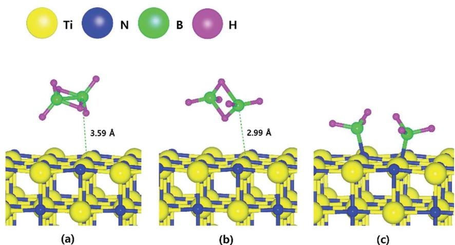
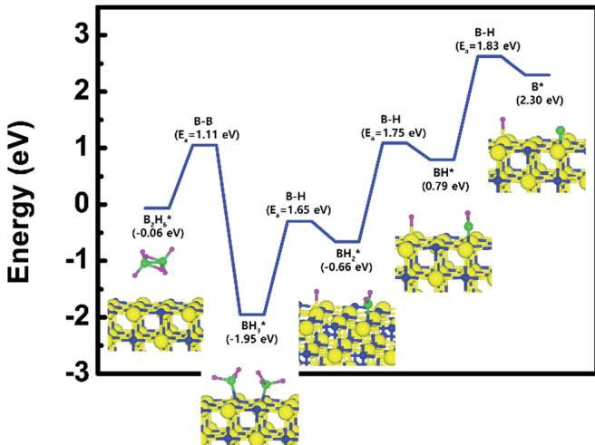
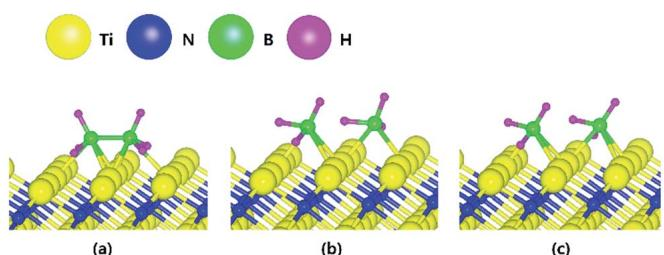
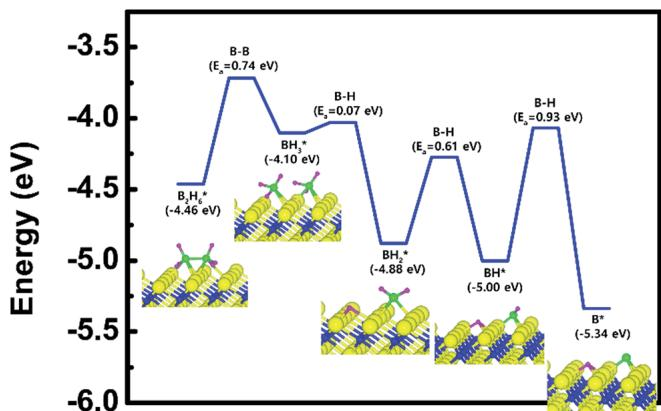
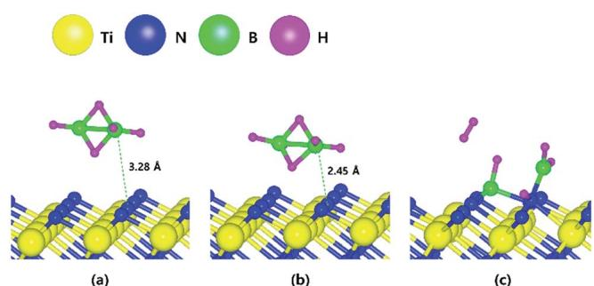
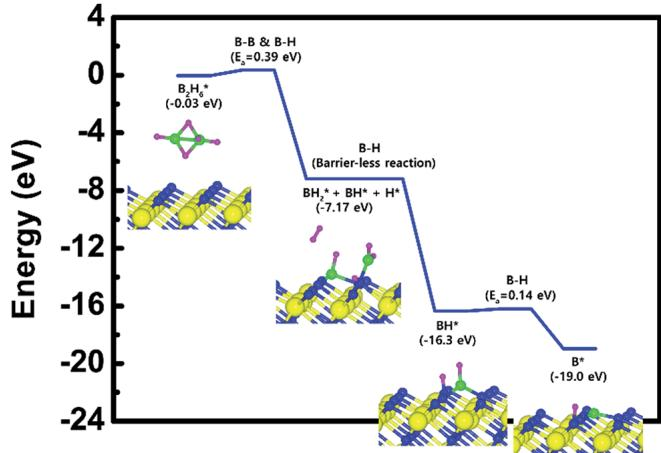

# Dissociation reaction of  $\mathsf{B}_2\mathsf{H}_6$  on TiN surfaces during atomic layer deposition: first-principles study†

Hwanyeol Park, $^{a}$  Sungwoo Lee,  $^{a}$  Ho Jun Kim, $^{b}$  Euijoon Yoon $^{*ac}$  and Gun- Do Lee  $^{*ac}$

In the fabrication process of memory devices, a void- free tungsten (W) gate process with good conformability is very important for improving the conductivity of the W gate, leading to enhancement of device performance. As the downscaling continues to progress, void- free W deposition becomes more difficult due to the experimental limitations of conformal film deposition even with atomic layer deposition (ALD) W processes. In ALD W processes, it is known that the  $\mathsf{B}_2\mathsf{H}_6$  dosing process plays a key role in deposition of the ALD W layer with low resistivity and in removal of residual fluorine (F) atoms. To comprehend the detailed ALD W process, we have investigated the dissociation reaction of  $\mathsf{B}_2\mathsf{H}_6$  on three different TiN surfaces, TiN (001), Ti- terminated TiN (111), and N- terminated TiN (111), using first- principles density functional theory (DFT) calculations. N- terminated TiN (111) shows the lowest overall reaction energy for  $\mathsf{B}_2\mathsf{H}_6$ . These results imply that severe problems, such as a seam or void, in filling the W metal gate for memory devices could be attributed to the difference in the deposition rate of W films on TiN surfaces. From this study, it was found that the control of the texture of the TiN film is essential for improving the subsequent W nucleation.

# 1. Introduction

As thin film deposition techniques have advanced following Moore's law for decades, increasingly smaller sizes and higher aspect ratios (AR) for improving device performance have required highly uniform and conformal films. Nitride materials, such as silicon nitride and titanium nitride, have been deposited using conventional deposition techniques such as plasma- enhanced chemical vapor deposition (PECVD) $^{2,3}$  and low- pressure chemical vapor deposition (LPCVD). $^{4,5}$  However, the down- scaling of memory devices has required another deposition technique such as atomic layer deposition (ALD) $^{6 - 8}$  to resolve the step coverage issues of highly integrated devices. As a thin film deposition process, ALD is the most prevalent method due to the demand for excellent step coverage and conformality of deposited thin films. The ALD processes use well- controlled sequential surface reactions to obtain uniform and conformal films. $^{9,10}$

Tungsten (W) is a good material for use as a metal gate with low resistivity in memory devices. $^{11}$  A thin film of W can be deposited using ALD by alternatively exposing W precursors such as  $\mathrm{WF}_6$  and reducing agents such as disilane  $\mathrm{(Si_2H_6)}$  or diborane  $\mathrm{(B_2H_6)}$ . First, the successful deposition of W via ALD has been carried out using tungsten hexafluoride  $\mathrm{(WF_6)}$  and  $\mathrm{Si}_2\mathrm{H}_6$  in an ABAB... sequence. It was reported that the  $\mathrm{Si}_2\mathrm{H}_6$  reactant could play only a sacrificial role to remove residual fluorine (F) from the surface. $^{12}$  Later, the ALD W process using  $\mathrm{B}_2\mathrm{H}_6$  and silane precursors was also intensively investigated. $^{12,13}$  Recently, the comparative study of ALD W using two different precursors,  $\mathrm{SiH_4}$  and  $\mathrm{B}_2\mathrm{H}_6$ , was reported by Guilei Wang et al. $^{14}$  They concluded that ALD W films using  $\mathrm{B}_2\mathrm{H}_6$  showed much lower residual F content and a lower resistivity than those using  $\mathrm{SiH_4}$ , and a better ALD W film as a gate filling metal could be obtained. These ALD W films have been typically utilized as nucleation layers for a metal gate in memory devices before the deposition of the bulk CVD- W film. $^{15 - 17}$

Despite much effort in improving ALD W processes, as memory devices become smaller and smaller, the limitation of conformality at ultrahigh aspect ratio (UHAR) contact can induce potential problems such as a seam or void in the final W- plug, leading to an increase in contact resistance. $^{18,19}$  Further downscaling the memory devices necessitates the theoretical comprehension of the ALD W process due to the experimentally limited observations on the sub- nanometer scale. Although a few experimental studies on ALD W have

been investigated, there has been no theoretical report on the reactivity of  $\mathrm{B}_2\mathrm{H}_6$

been investigated, there has been no theoretical report on the reactivity of  $\mathrm{B}_2\mathrm{H}_6$ .In this study, we investigated the reactivity of  $\mathrm{B}_2\mathrm{H}_6$  with three different TiN surfaces using first principles study based on density functional theory (DFT) calculation to explore the reaction mechanism of the underlying TiN layers during the  $\mathrm{B}_2\mathrm{H}_6$  dosing process in the ALD W deposition because the underlying surfaces can have significant effects on the characteristics of the subsequent W nucleation layers.15,20 TiN films have been widely used as a glue/barrier layer for subsequent W nucleation.21 Although transition metal nitrides always have a problem of oxidation at elevated temperatures,22 TiN film used in fabrication process of a memory device does not exposed to the oxidation W film is deposited right after deposition of TiN films in ALD process under vacuum system. Three different planes of TiN surfaces, TiN (001), Ti- terminated TiN (111), and N- terminated TiN (111) were taken into account because polycrystalline TiN layers with (001) and (111) preferred orientations were mainly observed in deposition of TiN films.23,24 The decomposition reaction pathways and reaction energetics on three different TiN surfaces were investigated. It is expected that comparative analysis of the reaction mechanism of  $\mathrm{B}_2\mathrm{H}_6$  with different TiN surfaces would give us insight into how important the underlying TiN surfaces could be for improving the quality of the subsequent W layer during the  $\mathrm{B}_2\mathrm{H}_6$  dosing process in ALD W deposition.

# 2. Computational methods

In our theoretical results, all DFT calculations were performed using Vienna Ab initio Simulation Package (VASP) program with the Perdew- Burke- Ernzerh of (PBE) functional in the generalized gradient approximation (GGA).25,26 TiN (001) and TiN (111) surfaces with B1- NaCl structure were used as the reactive surfaces with the  $\mathrm{B}_2\mathrm{H}_6$  precursor. The optimized lattice parameter of TiN was  $a_0 = 4.21\mathrm{\AA}$  which is in good agreement with the experimental value  $(a_{0} = 4.24\mathrm{\AA})$  27 For the TiN (001) surface, a 4- layer slab of  $(2\times 2)$  supercell was considered. For comparison, the TiN surfaces with Ti- terminated and N terminated (111) orientations were considered with a 5- layer slab of  $(2\times 2)$  supercell. For all TiN surfaces, such as TiN (001), Ti- terminated TiN (111), and N- terminated TiN (111), vacuum gaps with values of  $23.7\mathrm{\AA}$ $25.4\mathrm{\AA}$  and  $25.6\mathrm{\AA}$  respectively, in the  $\Xi$  direction were included to avoid interactions between adjacent slabs.

Valence orbitals were described by a plane- wave basis set with the cutoff energy of  $400\mathrm{eV}$  Electronic energies were calculated with a self- consistent- field (SCF) tolerance of  $10^{- 4}\mathrm{eV}$  Ultrasoft Vanderbilt- type pseudopotentials28 were used to describe the interactions between ions and electrons. A  $3\times 3\times$  3 Monkhorst  $k$  - point mesh for bulk TiN was chosen to ensure that the total energies converged within  $1\mathrm{meV}$  per formula unit. The Brillouin zone for three different TiN surfaces was sampled with a  $3\times 3\times 1$  Monkhorst- Pack  $k$  - point mesh. Geometry optimization was performed by minimizing the forces of all atoms to less than  $0.02\mathrm{eV}\mathrm{\AA}^{- 1}$  . In addition, we have calculated total energies for various configurations to determine the energy barrier for dissociative adsorption of  $\mathrm{B}_2\mathrm{H}_6$  on the TiN surfaces.

To optimize adsorption structures, we considered three orientations and three positions of  $\mathrm{B}_2\mathrm{H}_6$  on the three different TiN surfaces. The details of all nine cases are shown in the ESI (Fig. S1- S3†). The optimized adsorption structures with the lowest energy in the ESI (Tables S1- S3†) were used in this paper.

To calculate the transition state, the distance between the two dissociative atoms is slightly separated, and energy relaxation is performed with the constrained distance. The same procedures are carried out until the force between two dissociative atoms becomes almost zero at the saddle point of energy. Those results of transition structure were also checked by the nudged elastic band method.29

# 3. Results and discussion

# 3.1.  $\mathbf{B}_2\mathbf{H}_6$  dissociative chemisorption on TiN (001)

Fig. 1 shows the optimized structures for the  $\mathrm{B}_2\mathrm{H}_6$  reaction pathway of B- B dissociation on the TiN (001) surface. The optimized structure with the lowest adsorption energy of  $\mathrm{B}_2\mathrm{H}_6$

  
Fig. 1 The optimized structures for (a) adsorption state, (b) transition state and (c) reaction state of a  $\mathrm{B}_2\mathrm{H}_6$  on the TiN (001) surface.

  
Fig. 2 Calculated energy diagram of  $\mathsf{B}_2\mathsf{H}_6$  decomposition on the TiN (001) surface.

on the surface is displayed in Fig. 1a. As shown in Fig. 1c, it was found that borane  $(\mathrm{BH}_3)$  molecules dissociated from  $\mathrm{B}_2\mathrm{H}_6$  favorably react with nitrogen atoms on the TiN (001) surface after B- B dissociation due to stronger B- N bonding nature than B- Ti bonding. As shown in Fig. 2, the reaction energy is  $- 1.89\mathrm{eV}$  which means that the reaction is exothermic and energetically favorable. The activation energy from Fig. 1a- c is  $1.11\mathrm{eV}$  and the transition state is shown in Fig. 1b with no obvious surface reconstruction during the reaction. Generally, if any surface reconstruction is occurred during the reaction, activation and reaction energy can be smaller. However, no obvious surface reconstruction was not found for all surfaces used in this study.

To complete the overall reaction energetics of  $\mathrm{B}_2\mathrm{H}_6$  the calculated energy diagram of  $\mathrm{B}_2\mathrm{H}_6$  decomposition on the TiN (001) surface is displayed in Fig. 2. The detailed structures of  $\mathrm{B}_2\mathrm{H}_6$  during the overall reaction pathway on the TiN (001) surface for transition state calculations can be found in Fig. S4  $(\mathrm{ESI}\dagger)$  . During the reaction of the  $\mathrm{B}_2\mathrm{H}_6$  precursor on the TiN (001) surface, this calculation shows that the overall reaction process is endothermic, with a calculated overall reaction energy of  $2.36\mathrm{eV}$  These results indicate that the reaction is thermodynamically unfavorable. Furthermore,  $\mathrm{B}_2\mathrm{H}_6$  dissociative chemisorption on TiN (001) is kinetically difficult due to high activation energies that range from a minimum of  $1.11\mathrm{eV}$  to a maximum of  $1.83\mathrm{eV}$  The low reactivity of  $\mathrm{B}_2\mathrm{H}_6$  with the TiN (001) surface might be attributed to the presence of only one dangling bond per atom on the surface.

  
Fig. 3 The optimized structures for (a) adsorption state, (b) transition state and (c) reaction state of a  $\mathrm{B}_2\mathrm{H}_6$  on the Ti-terminated TiN (111) surface.

# 3.2.  $\mathbf{B}_2\mathbf{H}_6$  dissociative chemisorption on Ti-terminated TiN (111)

The decomposition mechanism of  $\mathrm{B}_2\mathrm{H}_6$  was also studied on the Ti- terminated TiN (111) surface to estimate the difference between TiN (001) and TiN (111) surfaces. The adsorption and reaction of  $\mathrm{B}_2\mathrm{H}_6$  on the Ti- terminated TiN (111) surface are shown in Fig. 3a and c with the transition state shown in Fig. 3b. As shown in Fig. 3c, it was found that dissociated  $\mathrm{BH}_3$  molecules were adsorbed on the hollow site made by three Ti atoms (site number 3 in Fig. S2†). In Fig. 4, the lowest adsorption energy of  $\mathrm{B}_2\mathrm{H}_6$  on the Ti- terminated TiN surface is  $- 4.46\mathrm{eV}$  showing that the adsorption is energetically favorable. However, the reaction energy is  $0.36\mathrm{eV}$  indicating that the reaction is endothermic. The activation energy from Fig. 3a- c is  $0.74\mathrm{eV}$  with the transition state in Fig. 3b, and no obvious surface reconstruction was found during the reaction. There are three more B- H bond breaking steps after a B- B bond breaking step, as shown in Fig. S4 and Table S4  $(\mathrm{ESI}\dagger)$

The entire energy diagram for the  $\mathrm{B}_2\mathrm{H}_6$  decomposition on Ti- terminated TiN (111) is illustrated in Fig. 4, which differs with the diagram for TiN (001) in Fig. 2. It demonstrates that both B- B and B- H bond dissociation steps on the Ti- terminated TiN (111) surfaces are more facile than the TiN (001) surface due to smaller activation energies of dissociation on the Ti- terminated TiN (111) surface. Moreover, the overall reaction of  $\mathrm{B}_2\mathrm{H}_6$  is exothermic, with an overall reaction energy of  $- 0.88\mathrm{eV}$ . These results show that the reaction is energetically favorable. The high reactivity of  $\mathrm{B}_2\mathrm{H}_6$  on the Ti- terminated TiN (111) surface may be because the surface has triple dangling bonds per atom, which make the surface even more reactive than the TiN (001) surface. To be more specific, the number of dangling bonds on the Ti- terminated TiN (111) surface is more than that of the TiN (001), so that  $\mathrm{B}_2\mathrm{H}_6$  dissociative reaction is more favorable on the former. This analysis is confirmed by higher adsorption of both B and H atoms on Ti- terminated TiN (111) surface than the TiN

  
Fig. 4 Calculated energy diagram of  $\mathrm{B}_2\mathrm{H}_6$  decomposition on the Ti-terminated TiN (111) surface.

Table 1 Binding energies (eV) of both B and H atoms on the most stable site of TiN (001), Ti-terminated TiN (111) and N-terminated TiN (111) surfaces  

<table><tr><td>Surface</td><td>B</td><td>H</td></tr><tr><td>TiN (001)</td><td>4.9</td><td>2.9</td></tr><tr><td>Ti-Terminated TiN (111)</td><td>6.3</td><td>4.6</td></tr><tr><td>N-Terminated TiN (111)</td><td>11.8</td><td>5.7</td></tr></table>

(001) surface as shown in Table 1. The aforementioned reasons, this surface can also reduce the energy barriers of the  $\mathrm{B}_2\mathrm{H}_6$  decomposition as compared to the TiN (001) surface. The activation energies for dissociation of  $\mathrm{B}_2\mathrm{H}_6$ ,  $\mathrm{BH}_3$ , and  $\mathrm{BH}_2$  are 0.74, 0.07 and  $0.61\mathrm{eV}$ , respectively, which are lower than that of  $\mathrm{BH}(0.93\mathrm{eV})$ . This implies that the  $\mathrm{B - H}$  bond dissociation of  $\mathrm{BH}$  is the rate-determining step along the overall reaction.

# 3.3.  $\mathbf{B}_2\mathbf{H}_6$  dissociative chemisorption on N-terminated TiN (111)

The optimized structures for the adsorption, transition state and reaction of  $\mathrm{B}_2\mathrm{H}_6$  on the N- terminated TiN (111) surface are depicted in Fig. 5. Fig. 5c shows that both  $\mathrm{B - B}$  and  $\mathrm{B - H}$  bond dissociation occur simultaneously during the energy relaxation procedure of the reaction state. In addition, hydrogen molecule  $(\mathrm{H}_2)$  desorption also occurs because two  $\mathrm{H}$  atoms of  $\mathrm{B}_2\mathrm{H}_6$  meet each other at the position away from preferentially adsorbed  $\mathrm{BH}_x$  species with higher binding energy. ESI Movie  $\mathrm{S1}\dagger$  represent the complete record for reaction process of the  $\mathrm{B}_2\mathrm{H}_6$  on N- terminated TiN (111) surface. For more detailed description of the movie,  $\mathrm{BH}_x$  species with relatively higher binding energy than  $\mathrm{H}$  atom are preferentially adsorbed first and two  $\mathrm{H}$  atoms in the gas phase are desorbed as  $\mathrm{H}_2$  apart from the adsorbed  $\mathrm{BH}_x$  species instead of adsorption on the surface.

As a result, the remaining species with boron on the surface are BH and  $\mathrm{BH}_2$  . The lowest energies for adsorption and reaction are  $- 0.03\mathrm{eV}$  and  $- 7.17\mathrm{eV}$  with a low energy barrier of  $0.39\mathrm{eV}$  . No obvious surface reconstruction was found during the reaction. There are two more  $\mathrm{B - H}$  bond breaking steps after the first bond breaking step, as depicted in Fig. S6 and Table S6  $\mathrm{(ESI\dagger)}$  .These results show that three sequential  $\mathrm{B - H}$  bond breaking steps occur and leave the B atom bound to three N atoms as shown in Fig. S6  $\mathrm{(ESI\dagger)}$

  
Fig. 5 The optimized structures for (a) adsorption state, (b) transition state and (c) reaction state of a  $\mathrm{B}_2\mathrm{H}_6$  on the N-terminated TiN (111) surface.

  
Fig. 6 Calculated energy diagram of  $\mathrm{B}_2\mathrm{H}_6$  decomposition on the N-terminated TiN (111) surface.

The mechanism of  $\mathrm{B}_2\mathrm{H}_6$  decomposition was also studied on the N- terminated TiN (111) surface to estimate the differences with the previously described TiN surfaces. Fig. 6 shows the entire energy diagram for the  $\mathrm{B}_2\mathrm{H}_6$  decomposition on N- terminated TiN (111). We found that both  $\mathrm{B - B}$  and  $\mathrm{B - H}$  bond breaking on the N- terminated TiN (111) surfaces were much more facile than those of both TiN (001) and Ti- terminated TiN (111) surfaces, as shown in Fig. 2 and 4. This result is primarily because the binding energies of  $\mathrm{B}$  and  $\mathrm{H}$  atoms on the N- terminated TiN (111) surface are the highest among the three different TiN surfaces, as shown in Table 1. Furthermore, the decomposition of  $\mathrm{B}_2\mathrm{H}_6$  on the surface is energetically favorable due to the downhill reactions and  $\mathrm{B - H}$  bond breaking with very small barrier. Rather than  $\mathrm{H}$  atoms, B adatoms would be preferably supplied by  $\mathrm{B}_2\mathrm{H}_6$  to form the first monolayer during the  $\mathrm{B}_2\mathrm{H}_6$  dosing process in the ALD W deposition due to the much higher binding energy of  $\mathrm{B}$  on the surface, as shown in Table 1. In the next ALD cycle,  $\mathrm{WF}_6$  precursor is commonly used for W deposition. A  $\mathrm{BF}_3$  desorption process would occur on the surface because boron adatoms would react with the  $\mathrm{F}$  atoms of  $\mathrm{WF}_6$ , therefore, a uniform W film could be deposited. Our results indicate that a specific TiN surface, such as N- terminated TiN (111), plays an important role in improving the properties of the subsequent W nucleation layers during the W ALD process.

# 3.4. Discussion

According to the above results, the N- terminated TiN (111) surface is the most efficient in depositing boron- containing layer during the  $\mathrm{B}_2\mathrm{H}_6$  dosing process in ALD W deposition. The TiN (001) surface is unfavorable to deposit W film due to residual  $\mathrm{BH}_3$  species on the surface and, corresponds to a reduction in the number of W sites that can be deposited. We suggest that the reason there are critical problems, such as a seam or void, in filling the W metal gate is the difference in deposition rate on three different TiN surfaces (N- terminated

TiN (111) is the fastest and TiN (001) is the slowest). Thus, it is necessary to study the control of preferred orientation in TiN surfaces to enhance the W ALD process.

There are several models to explain texture evolution in cubic transition- metal nitrides. Oh and Je proposed that the orientation of poly- crystalline TiN films should initially be (001) due to the lowest surface energy, and with increasing thickness, the (111) texture becomes favored due to the lower elastic modulus in the [111] direction.23,24 The change of the texture in this model is driven by the film/substrate system minimizing the total free energy.

Takeshi Kaizuka et al.30 later reported that a TiN film of (111) preferred orientation with conformal step coverage could be successfully obtained by pre- deposition of the Ti (001) layer before the CVD TiN film deposition. They said that TiN film with the (111) preferred orientation could be induced due to the lattice matching of the Ti film. The combination of their results and our results provides insight into how to design the TiN surfaces to improve the properties of the W films during the W ALD process.

# 4. Conclusions

We have studied  $\mathrm{B}_2\mathrm{H}_6$  decomposition on three different TiN surfaces to understand the detailed reaction mechanisms of  $\mathrm{B}_2\mathrm{H}_6$  during the  $\mathrm{B}_2\mathrm{H}_6$  dosing process in ALD W deposition. This procedure is essential for depositing dense and conformal W films. In this study, we utilize density functional theory to evaluate the energetics of  $\mathrm{B}_2\mathrm{H}_6$  decomposition for overall reactions.

The overall reactions of the  $\mathrm{B}_2\mathrm{H}_6$  with the Ti- terminated TiN (111) and N- terminated TiN (111) surfaces are energetically favorable, whereas the overall reaction for the TiN (001) is energetically unfavorable. These differences in energetics come from the difference in binding energies of B and H atoms among three different surfaces. N- terminated TiN (111) shows the lowest overall reaction energy compared with three different surfaces due to the highest binding energy of both B and H atoms with the surface, and corresponds to the most reactive surface. From the understanding of the influence of the TiN surfaces during the  $\mathrm{B}_2\mathrm{H}_6$  dosing process, the control of the texture of TiN film is required for improvement of the W nucleation layers. These results imply that the understanding of the reactivity of the TiN surfaces gives us insight into improving the W ALD process for future memory devices.

# Conflicts of interest

There are no conflicts to declare.

# Acknowledgements

Euijoon Yoon and Gun- Do Lee acknowledge support from the Supercomputing Center/Korea Institute of Science and Technology Information with supercomputing resources (KSC- 2016- C3- 0020), from the joint program for Samsung Electronics Co., Ltd. (SEC), from the Brain Korea 21 Plus project for SNU

Materials Division for Educating Creative Global Leaders (F15SN02D1702), and from the National Research Foundation of Korea (NRF) grant funded by the Korea government (RIAM NRF- 2016R1D1A1A02937045).

# References

1 S. Bin Baek, D. H. Kim and Y. C. Kim, Appl. Surf. Sci., 2012, 258, 6341- 6344. 2 N. Sharma, M. Hooda and S. K. Sharma, J. Mater., 2014, 2014, 1- 8. 3 B. C. Joshi, G. Eranna, D. P. Runthala, B. B. Dixit, O. P. Wadhawan and P. D. Yyas, Indian J. Eng. Mater. Sci., 2000, 7, 303- 309. 4 W. Huang, X. Wang, M. Sheng, L. Xu, F. Stubhan, L. Luo, T. Feng, X. Wang, F. Zhang and S. Zou, Mater. Sci. Eng., B, 2003, 98, 248- 254. 5 A. El Amrani, A. Bekhtari, B. Mahmoudi, A. Lefgoum and H. Menari, Vacuum, 2011, 86, 385- 390. 6 W.- J. Lee, J.- H. Lee, C. O. Park, Y.- S. Lee, S.- J. Shin and S.- K. Rha, J. Korean Phys. Soc., 2004, 45, 1352- 1355. 7 J. W. Klaus, A. W. Ott, A. C. Dillon and S. M. George, Surf. Sci., 1998, 418, L14- L19. 8 C. A. Murray, S. D. Elliott, D. Hausmann, J. Henri and A. LaVoie, ACS Appl. Mater. Interfaces, 2014, 6(13), 10534- 10541. 9 S. M. George, Chem. Rev., 2010, 110, 111- 131. 10 S. J. Won, J. R. Kim, S. Suh, N. I. Lee, C. S. Hwang and H. J. Kim, ACS Appl. Mater. Interfaces, 2011, 3, 1633- 1639. 11 S.- H. Kim, N. Kwak, J. Kim and H. Sohn, J. Electrochem. Soc., 2006, 153(10), 887- 893. 12 J. Klaus, S. Ferro and S. George, Thin Solid Films, 2000, 360, 145. 13 T. Luoh, C.- T. Su, T.- H. Yang, K.- C. Chen and C.- Y. Lu, Microelectron. Eng., 2008, 85, 1739. 14 G. Wang, Q. Xu, T. Yang, J. Xiang, J. Xu, J. Gao, C. Li, J. Li, J. Yan, D. Chen, T. Ye, C. Zhao and J. Luoz, ECS J. Solid State Sci. Technol., 2014, 3(4), 82- 85. 15 S.- H. Kim, S. Yeom, N. Kwak and H. Sohn, J. Electrochem. Soc., 2008, 155, D148. 16 S. Smith, K. Aouadi, J. Collins, E. Van der Vegt, M.- T. Basso, M. Juhel and S. Pokrant, Microelectron. Eng., 2005, 82, 261. 17 S.- H. Kim, J.- T. Kim, N. Kwak, J. Kim, T.- S. Yoon and H. Sohn, J. Vac. Sci. Technol., B: Microelectron. Nanometer Struct.- Process., Meas., Phenom., 2007, 25, 1574. 18 T. Omstead, G. C. D'Couto, S.- H. Lee, P. Wongsenkaum, J. Collins and K. Levy, Solid State Technol., 2002, 51, 45. 19 S.- H. Kim, E.- S. Hwang, S.- H. Pyi, H.- J. Sun, J.- W. Lee, J.- K. Kim, N. Kwak, H. Sohn and J. Kim, J. Electrochem. Soc., 2005, 152, C408. 20 G. Ramanath, H. Kim, H. S. Goindi, M. J. Frederick, C.- S. Shin, R. Goswami, I. Petrov and J. E. Greene, AIP Conf. Proc., 2002, 612, 10. 21 C.- H. Kim, I.- C. Rho, S.- H. Kim, Y.- S. Sohn, H.- S. Kang and H.- S. Kim, Electrochem. Solid- State Lett., 2009, 12(3), H80- H83.

22 U. Guler, A. V. Kildishev, V. M. Shalaev, A. Boltasseva, D. Stocks and G. Naik, WO Pat., PCT/US14/38561,Ref. 22: Please provide the patent type. 2014. 23 U. C. Oh and J. H. Je, J. Appl. Phys., 1993, 74, 1692. 24 J. H. Je, D. Y. Noh, H. K. Kim and K. S. Liang, J. Appl. Phys., 1997, 81, 6126. 25 J. P. Perdew, K. Burke and M. Ernzerhof, Phys. Rev. Lett., 1996, 77, 3865- 3868.

26 G. Kresse and J. Furthmuller, Phys. Rev. B: Condens. Matter Mater. Phys., 1996, 54, 11169- 11186. 27 N. Schoenberg, Acta Chem. Scand., 1954, 8, 213. 28 D. Vanderbilt, Phys. Rev. B, 1992, 46, 6671. 29 G. Henkelman and H. Jonsson, J. Phys. Chem., 2000, 113, 9978- 9985. 30 T. Kaizuka, H. Shinriki, N. Takeyasu and T. Ohta, Jpn. J. Appl. Phys., 1994, 33, 470- 474.