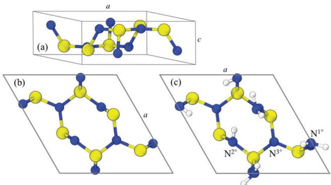
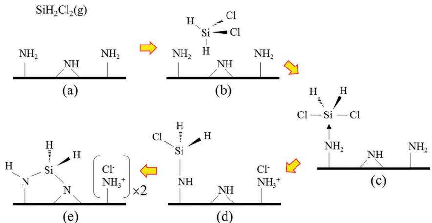
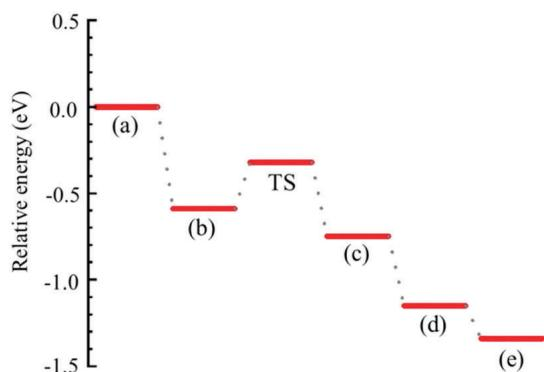
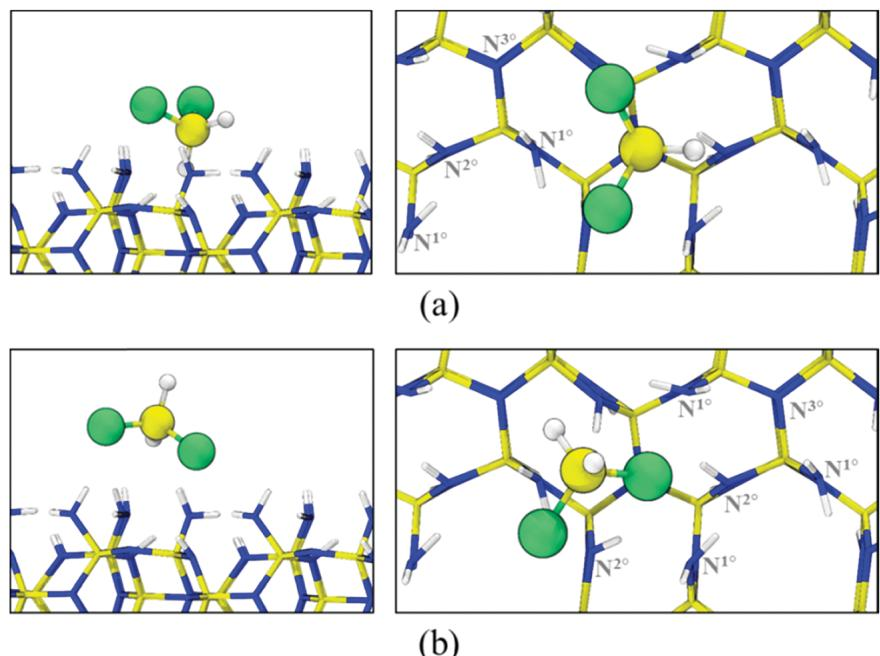
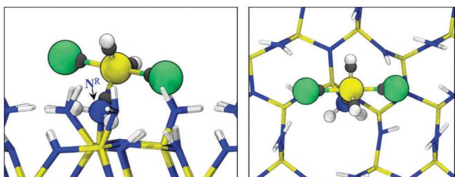
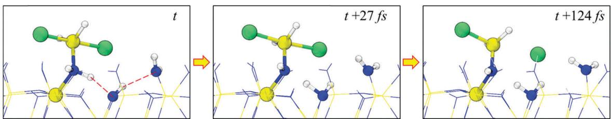
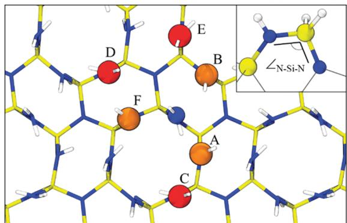

# Theoretical evaluation of thermal decomposition of dichlorosilane for plasma-enhanced atomic layer deposition of silicon nitride: the important role of surface hydrogen†

Gregory Hartmann, Peter L. G. Ventzek, Toshihiko Iwao, Kiyotaka Ishibashi and Gyeong S. Hwang  $\oplus$  \*a

Silicon nitride (SiN) thin films have been widely employed for various applications including microelectronics, but their deposition presents a challenge especially when highly conformal layers are necessary on nanoscale features with high aspect ratios. Plasma- enhanced atomic layer deposition (PEALD) has been demonstrated to be a promising technique for controlled growth of SiN thin films at relatively low temperatures  $(< 400^{\circ}C)$ , in which thermal decomposition of Si- containing precursors on a N- rich surface is a critical step. Based on periodic density functional theory calculations, we present potential underlying mechanisms leading to facile thermal decomposition of dichlorosilane (DCS,  $\mathrm{SiH_2Cl_2}$ ) on the N- rich  $\beta - \mathrm{Si}_3\mathrm{N}_4(0.001)$  surface. Our study highlights the importance of high hydrogen content on the N- rich surface, rendering primary and secondary amine groups. When the N- rich  $\beta - \mathrm{Si}_3\mathrm{N}_4(0.0001)$  surface is fully hydrogenated, the molecular adsorption of DCS is predicted to be exothermic by  $0.6\text{eV}$ . In this case, DCS decomposition appears to be initiated by nucleophilic attack by an amine lone- pair on the electrophilic Si, leading to the formation of a DCS- amine adduct intermediate followed by release of a  $\mathrm{Cl^- }$  anion and a proton. The predicted activation barrier for the DCS decomposition reaction is only  $0.3\text{eV}$  or less, depending on its adsorption configuration. We also discuss the formation and desorption of HCl, the subsequent formation and nature of Si- N bonds, and the interaction between adsorbed DCS molecules. While clearly demonstrating the advantageous features of DCS as a Si precursor, this work suggests that the thermal decomposition of Si precursors, and in turn the ALD kinetics and resulting film quality, can be strongly influenced by surface functional groups, in addition to product accumulation and precursor coverage.

# I. Introduction

Silicon nitride (SiN) thin films have been widely used for isolation, surface passivation, encapsulation, charge trapping, and masking materials in microelectronic fabrication. With progress towards ever- smaller feature sizes, it becomes necessary to deposit high- quality conformal thin films into structures with increasingly high aspect ratios. Achieving such uniform thickness, and chemical and mechanical properties for the production of ultra- large- scale integrated (ULSI) circuits can be difficult with conventional chemical vapor deposition (CVD) processes, leading to the development of atomic layer deposition (ALD) techniques. ALD achieves high film quality by separating the processes into a sequence of alternating cycles. In the case of SiN, exposure to a silane precursor deposits Si in alternation with a nitrogen bearing reducing agent. The alternating reactions are self- limiting, allowing atomic layer resolution. A SiN ALD process typically requires high temperatures  $(800^{\circ}C)$  which are unsuitable for other components involved in device integration, but the required temperature can be substantially lowered by performing nitridation with a nitrogen plasma source in what is known as plasma enhanced atomic layer deposition (PEALD). Plasma nitridation lowers the required temperature for nitridation below that of Si deposition, leaving Si deposition as the controlling factor in the lower limit of the temperature window for a given process. Thus, the low- temperature deposition of Si is important for the production of SiN thin films.

In an effort to improve the quality of the deposited SiN film, different precursor and plasma pairings have been identified.

Dichlorosilane (DCS) with  $\mathrm{NH_3}$  plasma deposits SiN films with atomic- layer thickness in the range of  $250–500^{\circ}\mathrm{C}$  7Hexachlorodisilane  $(\mathrm{Si}_2\mathrm{Cl}_6)$  and ammonia  $(\mathrm{NH}_3)$  were used to deposit films with  $95\%$  conformality over high aspect ratio nanostructures. Using in situ attenuated total reflection Fourier transform infrared spectroscopy, the previous study also identified that  $\mathrm{Si}_2\mathrm{Cl}_6$  may react with surface  $- \mathrm{NH_2}$  groups. An alternative perspective is that Si dangling bonds may serve as the active site, particularly when silane  $(\mathrm{SiH_4})$  is used together with nitrogen  $(\mathbf{N}_2)$  plasma below  $400^{\circ}\mathrm{C}$  9 Use of  $\mathbb{N}_2$  plasma as opposed to  $\mathrm{NH_3}$  may produce many dangling bonds at the surface to follow a deposition process more similar to Si. When use of  $\mathbb{N}_2$  plasma is directly compared to that of  $\mathrm{NH_3}$  plasma the growth per cycle is larger for the  $\mathbb{N}_2$  cycle.10

The molecular mechanisms of Si deposition by various precursors are difficult to characterize experimentally, but a first- principles computational approach can assist by providing relevant insights. Quantum mechanical methods, including density functional theory (DFT), are well- suited to identify the reaction pathways and intermediates responsible for SiN ALD and also describe the bonding nature of nitride materials. Early studies investigated gas phase reactions under CVD conditions. Korkin et al. identified a mechanism for the decomposition of DCS through reaction with  $\mathrm{NH_3}$  identifying a pathway with hypercoordinated Si intermediates allowing the elimination of HCl.11 These gas phase models were also expanded to cluster models which suggest a favorable reaction between DCS and chemisorbed  $- \mathrm{NH_2}$  groups.12 Previous DFT studies also showed the importance of the hydrogen bonding interaction between silicon precursors and surface functional groups.13 Due to rapid advancement in computational resources it is now possible to use slab models which approximate a substrate surface to include a more detailed description of the surface chemistry. Very recently, Yusup et al. used DFT periodic slab calculations to study the reaction of silicon chlorides with a  $\mathrm{NH / SiNH_2}$  terminated SiN surface; considering  $\mathrm{H}_2$  as a byproduct, the energy barrier for DCS decomposition was predicted to be around  $4\mathrm{eV}$  14 With previous studies identifying reaction mechanisms involving a relatively large activation energy, a low- temperature mechanism for Si deposition via DCS remains identified. Further mechanistic studies are necessary to better understand and explain the existing experimental observations as well as improve and optimize SiN ALD processes.

In this work, we attempt to identify the reaction pathways of thermal decomposition of DCS allowing for SiN ALD at low temperatures. DFT periodic slab calculations are employed to examine the adsorption and dissociation of DCS on the hydrogen- saturated N- rich surface of  $\beta - \mathrm{Si}_3\mathrm{N}_4,$  especially the effect of surface amine groups. We compare the reaction energetics with and without including dispersion corrections to DFT to evaluate the influence of dispersion forces on the adsorption, desorption and dissociation of DCS, which would be of particular importance in predicting the surface reaction behavior of high molecular weight molecules. We also examine the formation and desorption of HCl, the subsequent formation and nature of Si- N bonds, and the interaction between DCS molecules on the N- rich surface, providing some insights supporting the efficacy of DCS as a Si precursor for SiN ALD.

# II. Results and discussion

Fig. 1(a and b) shows the hexagonal  $\beta - \mathrm{Si}_3\mathrm{N}_4$  unit cell containing two formula units (14 atoms) and the bare  $\beta - \mathrm{Si}_3\mathrm{N}_4(0001) - (1\times 1)$  surface that is made by cleaving the bulk structure along the c- axis. The (0001) surface contains three twofold coordinated N atoms and three threefold coordinated Si atoms around a threefold coordinated N atom. The [0001] direction has been identified to be a preferred direction as a model for layered growth of  $\beta - \mathrm{Si}_3\mathrm{N}_4$  which may occur in alternating N- rich and Si- rich surfaces.

As shown in Fig. 1(c), the N- rich surface for modeling the half- cycle reaction with a Si precursor is created by terminating the dangling bonds of the undecoordinated  $\mathbb{N}$  and Si with H and  $\mathrm{NH_2}$  respectively, yielding three primary  $(\mathbb{N}^{1^{\circ}})$  , three secondary  $(\mathbb{N}^{2^{\circ}})$  , and one tertiary  $(\mathbb{N}^{3^{\circ}})$  amine groups on the  $\beta - \mathrm{Si}_3\mathrm{N}_4(0001) - (1\times 1)$  surface. The dangling bonds on the bottom (0001) surface of the slab are saturated by hydrogen. Selected structural parameters of the relaxed N- rich surface from our DFT calculations are listed in Table 1, in close agreement with the results of previous DFT studies.15

Fig. 2 presents a schematic illustration of the reaction pathway that we have identified for DCS adsorption and dissociation on the N- rich surface of  $\beta - \mathrm{Si}_3\mathrm{N}_4$  . The corresponding energy profile as shown in Fig. 3 is obtained using a three- layer thick slab with a  $(2\times 2)$  surface. DCS is predicted to molecularly adsorb on the surface  $[(a)\rightarrow (b)]$  . The adsorbed DCS may react

  
Fig.1 Atomic configurations for the (a) hexagonal  $\beta -\mathrm{Si}_3\mathrm{N}_4$  unit cell, (b) bare  $\beta -\mathrm{Si}_3\mathrm{N}_4(0001) - (1\times 1)$  surface; and (c)  $\mathrm{H / NH_2}$  -terminated N-rich surface containing three primary  $(\mathbb{N}^{1^{\circ}})$  , three secondary  $(\mathbb{N}^{2^{\circ}})$  and one tertiary  $(\mathbb{N}^{3^{\circ}})$  amine groups. Yellow, blue, and white balls represent Si, N, and H atoms, respectively.

Table 1 Selected geometric parameters of the  $\beta -\mathrm{Si}_3\mathrm{N}_4(0001)$  surface as predicted via DFT-D3BJ (DFT)  

<table><tr><td></td><td>d (Å)</td><td></td><td>Angle</td></tr><tr><td>Si-N1°</td><td>1.74 (1.79)</td><td>LN-N1°-H</td><td>112.2° (112.0°)</td></tr><tr><td>N1°-H</td><td>1.02 (1.02)</td><td>LN1°-Si-N2°</td><td>115.7° (115.3°)</td></tr><tr><td>N2°...H (of N1°)</td><td>2.20 (2.21)</td><td></td><td></td></tr></table>

  
Fig. 2 Schematic illustration of the reaction mechanism for Si deposition via DCS. (a) DCS in the gas phase, (b) molecularly adsorbed DCS, (c) DCS-amine adduct, (d) decomposed DCS with  $\mathbb{C}\mathbb{I}^{-}$  and  $\mathsf{H}^{+}$  and (e)  $>\mathsf{SiH}_2$  with  $2\times \mathbb{C}\mathbb{I}^{-} / \mathbb{H}^{+}$  after second  $\mathsf{Si} - \mathsf{N}$  bond formation.

  
Fig. 3 Energy profile predicted via DFT-D3BJ for the DCS decomposition reaction as shown in Fig. 2.

with  $\mathbf{N}^{1^{\circ}}$  to form a DCS- amine adduct by overcoming a moderate energy barrier  $[(\mathsf{b})\to (\mathsf{c})]$  followed by dissociation of the adduct  $[(\mathsf{c})\to (\mathsf{d})]$  releasing a proton and a chlorine anion. Si will then react with another amine to form a second  $\mathrm{Si - N}$  bond  $(i.e., > \mathrm{SiH}_2$  where - indicates a  $\mathrm{Si - N}$  bond)  $[(\mathsf{d})\to (\mathsf{e})]$  while additionally releasing a proton and a chlorine anion.

It is well known that standard DFT functionals generally fail to accurately describe weak nonbonding interactions such as dispersion. The DFT results can be substantially improved at almost no additional computational cost by adding a correction to account for the missing dispersion energy. Dispersion interactions are usually much weaker than covalent or ionic bonds such that their contribution is often neglected, particularly where chemisorption takes place. However, considering the large weight of Cl in DCS, it is pertinent to evaluate the influence of dispersion forces on the energetics of adsorption, desorption and dissociation of DCS. Here, we compare the binding energy  $(E_{\mathrm{b}})$  and adsorption geometry of DCS with and without including dispersion corrections to DFT.

Fig. 4(a) shows the lowest- energy configuration of molecularly adsorbed DCS where an H of DCS tends to orient towards the center of the three  $\mathbf{N}^{2^{\circ}}$  . The  $E_{\mathrm{b}}$  of DCS is predicted to be  $0.12\mathrm{eV}$  with standard DFT and increases to  $0.59\mathrm{eV}$  when including dispersion corrections (DFT- D3BJ). Here,  $E_{\mathrm{b}}$  is obtained by subtracting the total energy of the DCS/slab system  $(E_{\mathrm{DCS / slab}})$  from the sum of the slab  $(E_{\mathrm{slab}})$  and DCS  $(E_{\mathrm{DCS}})$  energies  $(i.e.,E_{\mathrm{b}} = E_{\mathrm{slab}} + E_{\mathrm{DCS}} - E_{\mathrm{DCS / slab}}$  where a more positive value indicates stronger binding). The predicted distances between Si (in DCS) and its nearest  $\mathbf{N}^{1^{\circ}}$  are  $d_{\mathrm{Si - N}} = 3.44\mathrm{\AA}$  and  $3.1\mathrm{\AA}$  from DFT and DFT- D3BJ calculations, respectively. Our results clearly show that the dispersion correction can strongly enhance the molecular adsorption of DCS. While the DFT- D3BJ method has not been explicitly validated for describing the interaction between DCS and  $\beta \mathrm{- Si_3N_4(0001)}$  our results seem consistent with previous studies. For instance,  $E_{\mathrm{b}}$  of  $0.72\mathrm{eV}$  was predicted for the molecular adsorption of bis(tert- butylamino)silane (with a larger molecular weight of  $174.3\mathrm{g}\mathrm{mol}^{- 1}$  relative to  $101\mathrm{g}\mathrm{mol}^{- 1}\mathrm{DCS})$  on the N- rich surface of  $\beta \mathrm{- Si_3N_4}$  10 In addition, using Grimme's DFT- D3BJ method a previous study predicted a sizable  $E_{\mathrm{b}}$  of  $0.32\mathrm{eV}$  for  $\mathrm{C}_2\mathrm{H}_2$  adsorption on NaCl, in good agreement with experimental data  $(0.24 - 0.31\mathrm{eV})$  16

We also checked the convergence of  $E_{\mathrm{b}}$  with respect to slab thickness. As expected, the  $E_{\mathrm{b}}$  is found to gradually increase with slab thickness due to the increased long- range interaction of DCS with the underlying  $\beta \mathrm{- Si_3N_4}$  slab; it tends to converge after three layers (see Table S2, ESI†). Two dimensional materials (which have a fixed single atomic layer thickness) provide an estimate of the magnitude of the non- boning interactions at the minimum thickness limit. Our DFT- D3BJ calculations predict the  $E_{\mathrm{b}}$  of DCS to be  $0.25\mathrm{eV}$  on both graphene and hexagonal boron nitride (see Fig. S1, ESI†).

For comparison, we also considered DCS adsorption directly above the  $\mathbf{N}^{1^{\circ}}$  groups, as shown in Fig. 4(b). In the configuration,  $E_{\mathrm{b}}$  is predicted to be  $0.29\mathrm{eV}$  by DFT- D3BJ; however, upon annealing at  $300~\mathrm{K}$ , the adsorbed DCS molecule is found to easily migrate and reorient itself into the lowest energy state with  $E_{\mathrm{b}} = 0.59\mathrm{eV}$  in Fig. 4(a). Coulombic attraction between the negatively charged Cl atoms in DCS and the positively charged H atoms on the N- rich surface could also contribute to the strong binding of molecularly adsorbed DCS. Bader charge analysis shows strong polarization of the Si- Cl bonds of DCS

  
Fig. 4 Side (left panels) and top (right panels) views for molecularly adsorbed DCS at the lowest energy site [(a)] and an alternative site above the  $\mathbb{N}^{1^{\circ}}$  groups [(b)]. Green, yellow, and white balls in DCS represent Cl, Si, and H atoms, respectively.

  
Fig. 5 Side (left) and top (right) views of the DCS-amine adduct. Green, yellow, white, and blue balls represent Cl, Si, H, and N atoms, respectively. Wannier centers are also indicated in grey balls.

due to the large difference in electronegativity between Si  $(= 1.9$  on the Pauling scale) and Cl  $(= 3.16)$ ; the predicted charge states of Si and Cl are  $+3.5e$  and  $- 0.9e$ , respectively, in the gas phase. Likewise, on the N- rich surface, each H  $(\mathrm{in}\mathbb{N}^{1^{\circ}})$  tends to carry a positive charge of  $0.3e$  due to electron donation to the more electronegative N atom.

The reaction of the adsorbed DCS with the N- rich surface appears to be initiated by nucleophilic attack by a lone pair of  $\mathbb{N}^{1^{\circ}}$  (referred to as  $\mathbf{N}^{\mathbb{R}}$  hereafter) on the electrophilic Si, leading to the formation of a DCS- amine intermediate adduct. In the transition state, the Cl- Si- Cl angle increases to  $114.9^{\circ}$  from  $109.4^{\circ}$  (in the molecularly adsorbed state), and it becomes nearly  $180^{\circ}$  in the adduct state. In the adduct configuration, as specified in Table 2,  $\mathrm{N}^{\mathrm{R}}\mathrm{- SiH}_{2}$  exhibits a trigonal planar geometry; the  $\mathrm{H - Si - H}$  and  $\mathrm{H - Si - N^R}$  angles are  $128^{\circ}$  and  $116^{\circ}$  respectively. This indicates that the Si of DCS has nearly  $\mathfrak{sp}^2$  hybridization with an empty  $\mathbb{P}$  orbital. The  $\mathrm{Si - N^R}$  distance of  $1.84\mathrm{\AA}$  appears somewhat elongated compared to the typical length of a Si- N single bond  $(\sim 1.75\mathrm{\AA})$ . The empty Si  $\mathbb{P}_2$  orbital lying orthogonal to the  $\mathrm{N}^{\mathrm{R}}\mathrm{- SiH}_{2}$  bonding plane tends to share the lone pairs of Cl atoms; the Si- Cl bond length of  $2.24 - 2.29\mathrm{\AA}$  is noticeably elongated in comparison to  $2.05\mathrm{\AA}$  for DCS in the gas phase.

Table 2 Selected geometric parameters of the DCS-amine adduct (in Fig.5) as predicted via DFT-D3BJ (DFT)  

<table><tr><td></td><td>d (Å)</td><td>Angle</td><td></td></tr><tr><td>Si-NR</td><td>1.837 (1.856)</td><td>i_H-H-Si-H</td><td>128.4° (128.6°)</td></tr><tr><td>N-H</td><td>1.071 (1.061)</td><td>i Cl-Si-Cl</td><td>178.9° (178.2°)</td></tr><tr><td>Si-H</td><td>1.478 (1.479)</td><td></td><td></td></tr><tr><td>Si-Cl</td><td>2.24/2.29 (2.244/2.301)</td><td></td><td></td></tr></table>

pairs of Cl atoms; the Si- Cl bond length of  $2.24 - 2.29\mathrm{\AA}$  is noticeably elongated in comparison to  $2.05\mathrm{\AA}$  for DCS in the gas phase.From the most stable state of molecular adsorption [Fig. 4(a)], the activation energy of DCS- amine adduct formation, i.e.,  $(\mathbf{b})\rightarrow (\mathbf{c})$  in Fig. 2, is predicted to be  $E_{\mathrm{a}} = 0.3 \mathrm{eV}$ . The predicted  $E_{\mathrm{a}}$  is significantly reduced to  $0.1\mathrm{eV}$  of DCS approaches from the alternative configuration in Fig. 4(b), implying its sensitivity to the ability of adsorbed DCS to reorient and permit nucleophilic attack by the lone pair of an amine group on the surface. Our calculation predicts the formation of the  $\mathrm{DCS - NH_3}$  adduct from DCS and  $\mathrm{NH_3}$  to be slightly endothermic  $(\approx 0.05\mathrm{eV})$  in the gas phase, as also reported by previous quantum chemical calculations.11 We also constructed an alternative model surface by replacing other primary amines with H such that a single primary amine reacts with DCS on the surface (see Fig. S3, ESI); in this case, the DCS- amine adduct formation is found to be endothermic by  $0.11\mathrm{eV}$  while  $E_{\mathrm{a}}$  increases only by  $0.1\mathrm{eV}$ . The results may suggest that the reaction energetics of DCS could be a strong function of  $\mathbf{N}^{1^{\circ}}$  (and/or  $\mathbf{N}^{2^{\circ}}$ ) availability and distribution, DCS adsorption behavior, and other adsorbates. Nonetheless, the moderate  $E_{\mathrm{a}}$  implies that the DCS reaction path reported herein is thermally accessible under typical PEALD conditions.

  
Fig. 6 AIMD snapshots of the DCS decomposition reaction producing  $\mathsf{H}^{+}$  and  $\mathsf{Cl}^{-}$ , corresponding to the  $(c) \rightarrow (d)$  reaction in Fig. 2. Red dotted lines indicate the hydrogen bonds associated with  $\mathsf{H}^{+}$  transfer.

The DCS- amine intermediate adduct tends to undergo facile dissociation by releasing a proton and a  $\mathrm{Cl}^{- }$  anion with virtually no barrier, as demonstrated by our AIMD simulations at  $300~\mathrm{K}$ . As shown in Fig. 6, a proton is abstracted by a neighboring  $\mathbb{N}^2$  amine forming a quaternary ammonium group  $(>\mathrm{NH}_2^+)$ , accompanied by the release of a  $\mathrm{Cl}^{- }$  anion through the interaction with positively polarized  $\mathrm{H}$  atoms in surface amine groups. Our calculations also show that the dissociated proton and  $\mathrm{Cl}^{- }$  anion may migrate across the N- rich surface, leading to the formation of an ammonium-  $\mathrm{Cl}^{- }$  complex  $(- \mathrm{NH}_3^+ /\mathrm{Cl}^- )$ ; details are included in the  $\mathrm{ESI}^+$  (see Fig. S4). On the N- rich surface considered, the energy cost to remove (or eliminate) HCl from the complex, which tends to be the most stable state, is predicted to be  $1.1\mathrm{eV}$ $(= E_{\mathrm{lab}} + E_{\mathrm{HCl(g)}} - E_{\mathrm{HCl(slab)}})$ . Taking the  $- \mathrm{NH}_3^+ /\mathrm{Cl}^-$  complex as a reference, the dissociation reaction  $[(c) \rightarrow (d)$  in Fig. 2] is predicted to be exothermic by  $0.40\mathrm{eV}$ . On the other hand, in the gas phase, the release of HCl from the DCS-  $\mathrm{NH}_3$  adduct is an endothermic reaction with  $\Delta E = 0.35\mathrm{vs}$ .  $0.19\mathrm{eV}$ , as also predicted by previous theoretical studies. This suggests that the facile dissociation of DCS on the N- rich surface is largely attributed to the strong stabilization of the dissociated proton and  $\mathrm{Cl}^{- }$  anion by surface amine groups.

Upon release of proton and  $\mathrm{Cl}^{- }$ , the  $\mathrm{sp}^3$  hybridization of Si appears to be restored, accompanying noticeable shrinkage of the  $\mathrm{Si - N_R}$ , Si- Cl and  $\mathrm{N}_{\mathrm{R}} - \mathrm{H}$  bonds to  $1.69\mathrm{\AA}$ ,  $2.10\mathrm{\AA}$  and  $1.04\mathrm{\AA}$  respectively (see Table 3).  $- \mathrm{SiH}_2\mathrm{Cl}$  may further react with a neighboring  $\mathrm{N}^{1^{\circ}}$  or  $\mathrm{N}^{2^{\circ}}$  via nucleophilic substitution, followed by  $\mathrm{Cl}^{- }$  and proton release. As a result, a DCS molecule is decomposed to  $>\mathrm{Si - H_2}$  while forming two Si- N bonds. On the N- rich surface, three  $\mathrm{N}^{\circ}$  and three  $\mathrm{N}^{2^{\circ}}$  sites are available as shown in Fig. 7 for the reaction with  $- \mathrm{SiH}_2\mathrm{Cl}$  leading to the second Si- N bond formation. As summarized in Table 4, the reaction energetics significantly varies from site to site, which is apparently related to the resulting strain (arising from deviations from the equilibrium Si- N bond length and Si- N- Si/N- Si- N bond angles). According to our calculations, the Si (in  $- \mathrm{SiH}_2\mathrm{Cl}$ )

Table 3 Selected geometric parameters of  $-\mathrm{NH - SiH_2Cl}$  from DCS decomposition as predicted via DFT-D3BJ (DFT)  

<table><tr><td></td><td>d (Å)</td><td></td><td>Angle</td></tr><tr><td>Si-NR</td><td>1.690 (1.699)</td><td>∠H-Si-H</td><td>111.9° (111.4°)</td></tr><tr><td>NR-H</td><td>1.037 (1.035)</td><td></td><td></td></tr><tr><td>Si-H</td><td>1.487 (1.487)</td><td>∠Si-NR-H</td><td>118.7° (117.2°)</td></tr><tr><td>Si-Cl</td><td>2.100 (2.101)</td><td></td><td></td></tr></table>

  
Fig.7 Available N atoms for the nucleophilic attack of  $-\mathrm{SiH}_2\mathrm{Cl}$  to form  $>\mathrm{SiH}_2$ , where the blue ball indicates the N atom  $(\mathrm{N}^{\mathrm{R}})$  including  $-\mathrm{SiH}_2\mathrm{Cl}$ . Red and orange balls indicate  $\mathrm{N}^{1^{\circ}}$  and  $\mathrm{N}^{2^{\circ}}$ , respectively. The inset details the atomic configuration of  $>\mathrm{SiH}_2$ .

Table 4 Energy changes (A) associated with second Si-N bond formation [(d)  $\rightarrow$  e) in Fig.2] as predicted via DFT-D3BJ (DFT)  

<table><tr><td></td><td colspan="2">ΔE (eV)</td><td>LN-Si-N (e)</td></tr><tr><td>A</td><td>N2°</td><td>-0.19 (0.08)</td><td>107</td></tr><tr><td>B</td><td>N2°</td><td>0.04 (0.32)</td><td>110</td></tr><tr><td>C</td><td>N1°</td><td>0.60 (0.79)</td><td>126</td></tr><tr><td>D</td><td>N1°</td><td>0.75 (0.87)</td><td>121</td></tr><tr><td>E</td><td>N1°</td><td>0.80 (0.92)</td><td>121</td></tr><tr><td>F</td><td>N2°</td><td>1.02 (1.23)</td><td>165</td></tr></table>

prefers to form a bond with a neighboring  $\mathrm{N}^{2^{\circ}}$  (indicated as A). The second most favorable site is predicted to be  $0.24\mathrm{eV}$  less favorable than the A site, while other  $\mathrm{N}^{1^{\circ}}$  and  $\mathrm{N}^{2^{\circ}}$  sites tend to cause more significant strain upon Si- N bond formation. The significant variation of strain associated with Si- N bonding may contribute to realizing high- quality  $\mathrm{Si}_3\mathrm{N}_4$  ALD; although highly strained Si- N bonds are formed, they can be easily broken in the presence of hydrogen and/or halogen atoms and ions.

Finally, we examine the interaction between DCS molecules on the N- rich surface of  $\beta - \mathrm{Si}_3\mathrm{N}_4(0001)$ . For  $\mathrm{Si}_3\mathrm{N}_4$  ALD, the  $1\times 1$  surface should accommodate up to three DCS molecules (corresponding to coverage  $\theta = 1$ ). With a DCS molecule at the lowest energy site [(a) in Fig. 4], the  $E_{\mathrm{b}}$  for second DCS adsorption (i.e.,  $\theta = 2 / 3$ ) is predicted to be  $0.1\mathrm{eV}$  by DFT- D3BJ, and it increases to  $0.17\mathrm{eV}$  and  $0.20\mathrm{eV}$  when the first adsorbed DCS remains decomposed to  $- \mathrm{SiH}_2\mathrm{Cl}$  [(d)] and  $\mathrm{= SiH_2}$  [(e)], respectively. The significantly reduced  $E_{\mathrm{b}}$  as compared to when  $\theta = 1 / 3$  ( $E_{\mathrm{b}} = 0.59\mathrm{eV}$ ) suggests that DCS molecules would remain

dispersed, rather than aggregated, at low  $\theta (< 1 / 3)$ . Indeed, when two to four DCS molecules are placed on the  $2 \times 2$  surface, they are found to be dispersed while occupying the lowest energy sites; the predicted  $E_{\mathrm{b}}$  of each DCS molecule remains almost unchanged up to four DCS molecules  $(\theta \leq 1 / 3)$ . This tendency may benefit the layered growth of  $\beta - \mathrm{Si}_3\mathrm{N}_4$ . Our work also suggests that the adsorption and dissociation of Si precursors, and in turn the ALD kinetics and resulting film quality, can be strongly influenced by functional groups and adsorbates on the N- rich surface of  $\mathrm{Si}_3\mathrm{N}_4$ , warranting further investigation.

# III. Conclusions

We investigated molecular mechanisms underlying the adsorption and decomposition of dichlorosilane (DCS) on the N- rich  $\beta - \mathrm{Si}_3\mathrm{N}_4(0001)$  surface, with particular attention to the role of surface amine groups. The H- saturated N- rich surface employed in this study is composed of three primary, three secondary, and one tertiary amine groups per  $(1 \times 1)$  unit cell. The predicted binding energy of DCS is  $E_{\mathrm{b}} = 0.12 \mathrm{eV}$  with standard DFT and substantially increases to  $0.59 \mathrm{eV}$  when including dispersion corrections (DFT- D3BJ). These results underline the importance of nonbonding interactions in DCS adsorption and decomposition on the N- rich surface of  $\beta - \mathrm{Si}_3\mathrm{N}_4$ . The molecularly adsorbed DCS is found to undergo nucleophilic attack by a neighboring primary amine group, leading to the formation of a DCS- amine intermediate adduct which then releases a proton and a  $\mathrm{Cl}^-$  anion easily. The activation barrier for the DCS decomposition reaction is predicted to be  $E_{\mathrm{a}} = 0.3 \mathrm{eV}$  or lower, while it tends to be sensitive to the ability of adsorbed DCS to reorient and permit nucleophilic attack of the lone pair on the N atom of an amine group on the surface.  $- \mathrm{SiH}_2\mathrm{Cl}$  may further react with a neighboring primary or secondary amine group via nucleophilic substitution, followed by  $\mathrm{Cl}^-$  and proton release. The energetics associated with the subsequent decomposition to  $\mathrm{Si} - \mathrm{H}_2$  is found to significantly vary from site to site due largely to the variation in local strain; this could be an important factor contributing to realizing high- quality  $\mathrm{Si}_3\mathrm{N}_4$  ALD. Our calculations show that proton and  $\mathrm{Cl}^-$  may easily migrate across the N- rich surface, leading to the formation of stable ammonium-  $\mathrm{Cl}^-$  complexes. Adsorbed DCS molecules tend to remain dispersed, rather than aggregated, which may benefit the layered growth by preferring an even coverage up to a coverage of one third of a monolayer. While highlighting the critical role played by primary amine functional groups in DCS thermal decomposition, our work also suggests the importance of surface chemistry in controlling the adsorption and dissociation of Si precursors and in turn the ALD kinetics and resulting film quality.

# IV. Computational methods

The atomic and electronic structures reported herein were calculated based on density functional theory (DFT) with the generalized gradient approximation (GGA) of Perdew, Burke, and Ernzerhof (PBE) for the exchange- correlation energy, as implemented in the Vienna ab initio Simulation Package.17 We employed the projector augmented wave method18 to describe the interaction between core and valence electrons, and a planewave basis set with a kinetic energy cutoff of  $450 \mathrm{eV}$ . We used the semi- empirical approach proposed by Grimme with Beck- Johnson damping, also known as the DFT- D3BJ method,19,20 to take into account the contribution of the dispersion forces within DFT. The lattice parameters of  $\beta - \mathrm{Si}_3\mathrm{N}_4$  were optimized using a hexagonal primitive unit cell, space group  $P6_3 / m$ , consisting of 6 Si atoms and 8 N atoms; an  $4 \times 4 \times 8 \Gamma$ - centered  $k$  point mesh was used for Brillouin zone integration while all atoms were fully relaxed until residual forces were below a tolerance of  $10^{- 3} \mathrm{eV} \mathring{\mathrm{A}}^{- 1}$ . Periodic boundary conditions were imposed in all three directions.

Each slab structure used to model the surface is separated by  $15 \mathring{\mathrm{A}}$  of vacuum, corresponding to approximately 10 atomic layers, to avoid interactions between periodic images. Surface configurations were obtained using the  $(1 \times 1)$  eight- layer slab and a  $2 \times 2 \times 1 \Gamma$ - centered  $k$ - point mesh. While the atoms of the bottom surface were fixed in their bulk positions, the rest of the atoms in the slab were fully relaxed until residual forces were below a tolerance of  $10^{- 2} \mathrm{eV} \mathring{\mathrm{A}}^{- 1}$ . Reaction intermediate structures and binding energies were obtained using a  $(2 \times 2)$  three- layer slab and a  $2 \times 2 \times 1 \Gamma$ - centered  $k$ - point mesh. The size of the  $k$ - point mesh was increased to  $4 \times 4 \times 1$  for detailed electronic structure analysis. Bader decomposition of charge density was performed with core and valence electron density integrated over the simulation cell.21 Maximally localized Wannier functions and Wannier centers were calculated within  $\mathrm{CPMD}^{22}$  using Trouiller- Martins norm- conserving psuedopotentials.23 The climbing image nudged elastic band (CI- NEB) method24 was utilized to identify transition states on the  $(2 \times 2)$  (0001) surface constructed with the three- layer slab. CI- NEB calculations were performed utilizing five intermediate images with a  $\Gamma$ - centered  $2 \times 2 \times 1 k$ - point mesh for Brillouin zone integration; a tolerance of  $5 \times 10^{- 2} \mathrm{eV} \mathring{\mathrm{A}}^{- 1}$  for residual forces between neighboring images and a spring constant of  $5 \mathrm{eV} \mathring{\mathrm{A}}^{- 2}$  were used.  $Ab$  initio molecular dynamics (AIMD) simulations were performed within the Born- Oppenheimer approximation with a time step of 1 fs and a Nose- Hoover thermostat; here, an energy cutoff of  $320 \mathrm{eV}$  and  $\Gamma$  point sampling were used.

# Conflicts of interest

There are no conflicts to declare.

# Acknowledgements

This work was supported by the Robert A. Welch Foundation (F- 1535) and Tokyo Electron Limited (TEL). We would also like to thank the Texas Advanced Computing Center for use of their computing resources.

# References

1 S. M. George, Atomic layer deposition: An overview, Chem. Rev., 2010, 110, 111- 131.

2 S. Morishita, S. Sugahara and M. Matsumura, Atomic- layer chemical- vapor- deposition of silicon- nitride, Appl. Surf. Sci., 1997, 112, 198- 204.  3 T. Kääriäinen, D. Cameron, M. L. Kääriäinen and A. Sherman, Atomic Layer Deposition: Principles, Characteristics, and Nanotechnology Applications, Wiley, 2013.  4 S. Yokoyama, H. Goto, T. Miyamoto, N. Ikeda and K. Shibahara, Atomic layer controlled deposition of silicon nitride and in situ growth observation by infrared reflection absorption spectroscopy, Appl. Surf. Sci., 1997, 112, 75- 81.  5 H. C. M. Knoops, K. de Peuter and W. M. M. Kessels, Redeposition in plasma- assisted atomic layer deposition: Silicon nitride film quality ruled by the gas residence time, Appl. Phys. Lett., 2015, 107, 10- 14.  6 T. Iwao, P. L. G. Ventzek, R. Upadhyay, L. L. Raja, H. Ueda and K. Ishibashi, Measurements and modeling of the impact of radical recombination on silicon nitride growth in microwave plasma assisted atomic layer deposition, J. Vac. Sci. Technol., A, 2018, 36, 01A111.  7 H. Goto, K. Shibahara and S. Yokoyama, Atomic layer controlled deposition of silicon nitride with self- limiting mechanism, Appl. Phys. Lett., 1996, 68, 3257- 3259.  8 R. A. Ovanesyan, D. M. Hausmann and S. Agarwal, Low- temperature Conformal Atomic Layer Deposition of  $\mathrm{SiN}_x$  Films using  $\mathrm{Si}_2\mathrm{Cl}_6$  and  $\mathrm{NH}_3$  Plasma, ACS Appl. Mater. Interfaces, 2015, 7, 10806- 10813.  9 S. W. King, Plasma enhanced atomic layer deposition of  $\mathrm{SiN}_x{:}\mathrm{H}$  and  $\mathrm{SiO}_2$ , J. Vac. Sci. Technol., A, 2011, 29, 041501.  10 C. K. Ande, H. C. M. Knoops, K. de Peuter, M. van Drunen, S. D. Elliott and W. M. M. Kessels, Role of Surface Termination in Atomic Layer Deposition of Silicon Nitride, J. Phys. Chem. Lett., 2015, 6, 3610- 3614.  11 A. A. Korkin, J. V. Cole, D. Sengupta and J. B. Adams, On the Mechanism of Silicon Nitride Chemical Vapor Deposition from Dichlorosilane and Ammonia, J. Electrochem. Soc., 1999, 146, 4203- 4212.  12 A. A. Bagatur'yants, K. P. Novoselov, A. A. Safonov, L. L. Savchenko, J. V. Cole and A. A. Korkin, Atomistic modeling of chemical vapor deposition: silicon nitride CVD from dichlorosilane and ammonia, Mater. Sci. Semicond. Process., 2000, 3, 23- 29.  13 C. A. Murray, S. D. Elliott, D. Hausmann, J. Henri and A. LaVoie, Effect of Reaction Mechanism on Precursor

Exposure Time in Atomic Layer Deposition of Silicon Oxide and Silicon Nitride, ACS Appl. Mater. Interfaces, 2014, 6, 10534- 10541.  14 L. L. Yusup, J. M. Park, T. R. Mayangsari, Y. K. Kwon and W. J. Lee, Surface reaction of silicon chlorides during atomic layer deposition of silicon nitride, Appl. Surf. Sci., 2018, 432, 127- 131.  15 L. Huang, B. Han, B. Han, A. Derecskei- Kovacs, M. Xiao, X. Lei, M. L. O'Neill, R. M. Pearstein, H. Chandra and H. Cheng, Density functional theory study on the full ALD process of silicon nitride thin film deposition via BDEAS or BTBAS and  $\mathrm{NH}_3$ , Phys. Chem. Chem. Phys., 2014, 16, 18501- 18512.  16 S. Ehrlich, J. Moellmann, W. Reckien, T. Bredow and S. Grimme, System- dependent dispersion coefficients for the DFT- D3 treatment of adsorption processes on ionic surfaces, ChemPhysChem, 2011, 12, 3414- 3420.  17 G. Kresse and J. Furthmüller, Efficient iterative schemes for ab initio total- energy calculations using a plane- wave basis set, Phys. Rev. B: Condens. Matter Mater. Phys., 1996, 54, 11169- 11186.  18 P. E. Blöchl, Projector augmented- wave method, Phys. Rev. B: Condens. Matter Mater. Phys., 1994, 50, 17953- 17979.  19 S. Grimme, J. Antony, S. Ehrlich and H. Krieg, A consistent and accurate ab initio parametrization of density functional dispersion correction (DFT- D) for the 94 elements H- Pu, J. Chem. Phys., 2010, 132, 1456- 1465.  20 S. Grimme, S. Ehrlich and L. Goerigk, Effect of Damping Function in Dispersion Corrected Density Functional Theory, J. Comput. Chem., 2011, 32, 1456- 1465.  21 G. Henkelman, A. Arnaldsson and H. Jónsson, A fast and robust algorithm for Bader decomposition of charge density, Comput. Mater. Sci., 2006, 36, 354- 360.  22 CPMD. http://www.cpmd.org/, Copyright IBM Corp 1990- 2008, Copyright MPI Für Festkörperforschung Stuttgart 1997- 2001, 1985.  23 N. Troullier and J. L. Martins, Efficient pseudopotentials for plane- wave calculations, Phys. Rev. B: Condens. Matter Mater. Phys., 1991, 43, 1993- 2006.  24 G. Henkelman, B. P. Uberuaga and H. Jónsson, Climbing image nudged elastic band method for finding saddle points and minimum energy paths, J. Chem. Phys., 2000, 113, 9901- 9904.