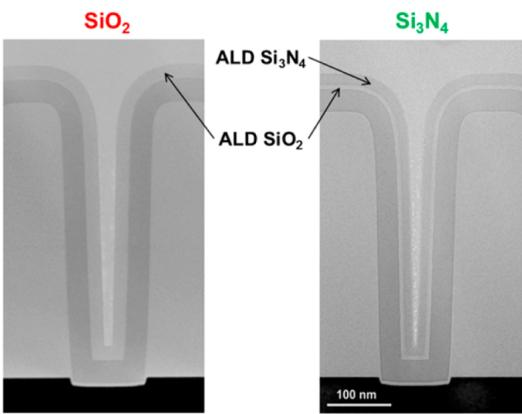
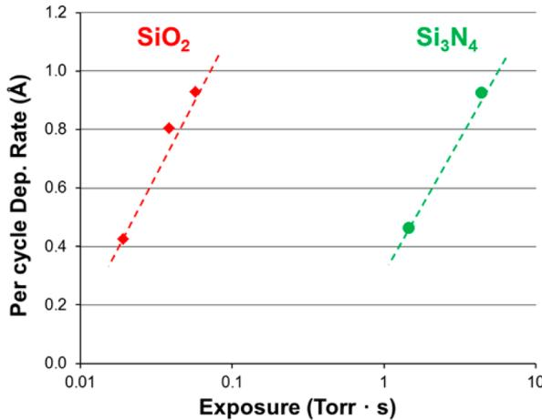
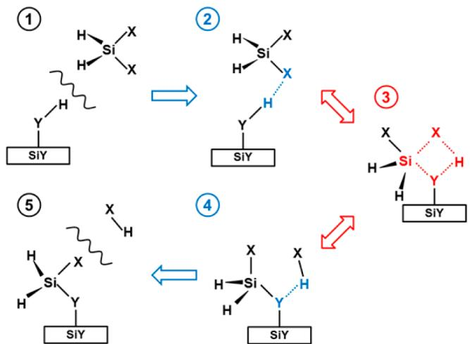
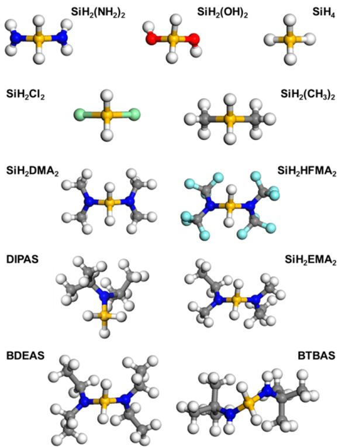
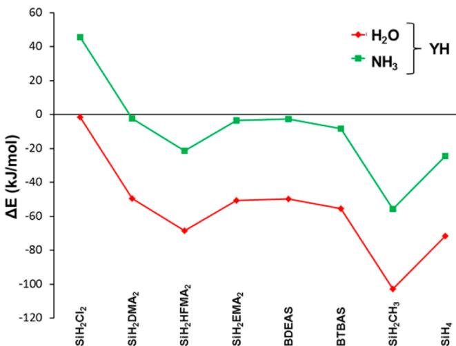
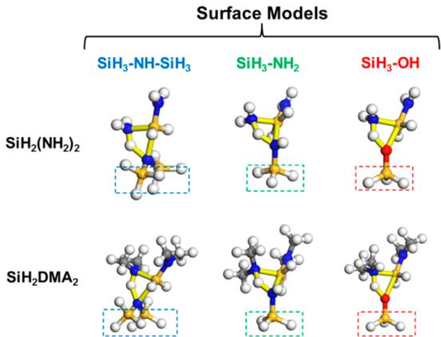
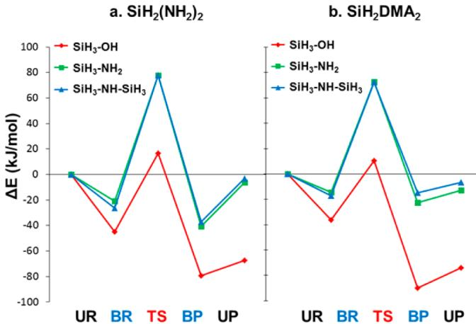
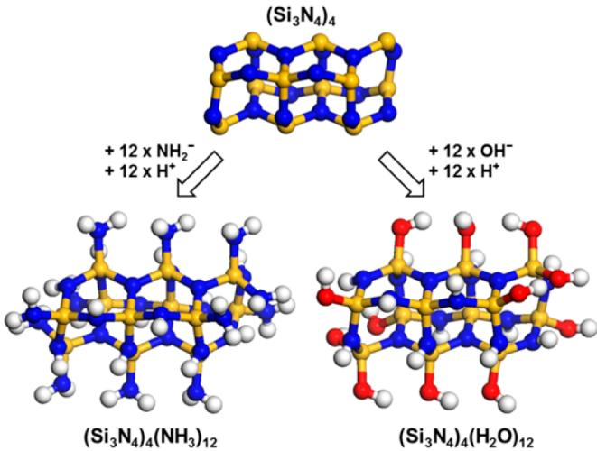
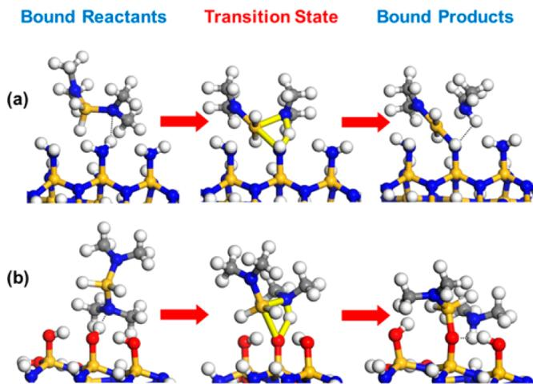
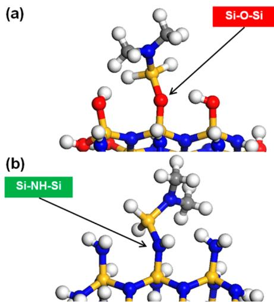

# Effect of Reaction Mechanism on Precursor Exposure Time in Atomic Layer Deposition of Silicon Oxide and Silicon Nitride

Ciaran A. Murray, $^{\dagger}$  Simon D. Elliott, $^{*,\dagger}$  Dennis Hausmann, $^{\ddagger}$  Jon Henri, $^{\ddagger}$  and Adrien LaVoie $^{\ddagger}$

$^{\dagger}$ Tyndall National Institute, University College Cork, Lee Maltings, Cork, Ireland   $^{\ddagger}$ Lam Research Corporation, 11155 SW Leverton Drive, Tualatin, Oregon 97062- 8094, United States

ABSTRACT: Atomic layer deposition (ALD) of highly conformal, silicon- based dielectric thin films has become necessary because of the continuing decrease in feature size in microelectronic devices. The ALD of oxides and nitrides is usually thought to be mechanistically similar, but plasma- enhanced ALD of silicon nitride is found to be problematic, while that of silicon oxide is straightforward. To find why, the ALD of silicon nitride and silicon oxide dielectric films was studied by applying ab initio methods to theoretical models for proposed surface reaction mechanisms. The thermodynamic energies for the elimination of functional groups from different silicon precursors reacting with simple model molecules were calculated using density functional theory (DFT), explaining the lower reactivity of precursors toward the deposition of silicon nitride relative to silicon oxide seen in experiments, but not explaining the trends between precursors. Using more realistic cluster models of amine and hydroxyl covered surfaces, the structures and energies were calculated of reaction pathways for chemisorption of different silicon precursors via functional group elimination, with more success. DFT calculations identified the initial physisorption step as crucial toward deposition and this step was thus used to predict the ALD reactivity of a range of amino- silane precursors, yielding good agreement with experiment. The retention of hydrogen within silicon nitride films but not in silicon oxide observed in FTIR spectra was accounted for by the theoretical calculations and helped verify the application of the model.

KEYWORDS: silicon nitride, silicon oxide, atomic layer deposition, DFT, mechanisms

# INTRODUCTION

Conformal dielectric films based on silicon oxide or silicon nitride are used for liner and spacer applications in front- endof- line (FEOL) semiconductor wafer processing. The traditional methods for depositing these films have been either plasma enhanced chemical vapor deposition (PECVD) or low pressure chemical vapor deposition LPCVD).PECVD is capable of depositing semiconformal films at low temperature  $(< 400^{\circ}\mathrm{C})$  and LPCVD is capable of perfectly conformal films at high temperature  $(>550~^{\circ}\mathrm{C})$  .For sub-  $32~\mathrm{nm}$  technology, however, both low deposition temperature and perfect conformality is required, which has necessitated the move to atomic layer deposition (ALD). Additional applications such as FinFET conformal doping, double patterning, and through- Sivia (TSV) 3D integration are also enabled by ALD of siliconbased dielectrics.

Herein, we focus on two silicon dielectric films:  $\mathrm{SiO}_2$  and  $\mathrm{Si}_3\mathrm{N}_4$  . The successful deposition of these materials using ALD techniques is shown in Figure 1, demonstrating that high quality conformal films are possible. Plasma enhanced ALD techniques may be applied in the deposition of these materials where an oxygen plasma is used for  $\mathrm{SiO}_2$  and a nitrogen plasma for  $\mathrm{Si}_3\mathrm{N}_4$  1,2 The films presented in Figure 1 (as well as those in Figures 2 and 3) were deposited by a standard commercially available  $300~\mathrm{mm}$  parallel plate capacitance PECVD tool utilizing commercially available silicon precursors with  $\mathrm{O}_2$  (for  $\mathrm{SiO}_2$  deposition),  $\mathrm{NH}_3$  (for  $\mathrm{Si}_3\mathrm{N}_4$  deposition) and  $\mathrm{N}_2$  (for purge) gases onto (100) double- sided, polished,  $300~\mathrm{mm}$  diameter silicon substrates. Both ALD silicon oxide and nitride films exhibit the properties desired of these materials with

  
Figure 1. TEM images of  $\mathrm{SiO}_2$  and  $\mathrm{Si}_3\mathrm{N}_4$  ALD thin films.

  
Figure 2. Deposition rate versus exposure of  $\mathrm{SiO}_2$  (red diamonds) and  $\mathrm{Si}_3\mathrm{N}_4$  (green circles) films deposited from chloro-silane precursors by ALD at  $450^{\circ}\mathrm{C}$  with less than  $2\%$  absolute variation on per cycle deposition rate.

  
Figure 3. FTIR absorption spectra of  $\mathrm{SiO}_2$  (upper red plot) and  $\mathrm{Si}_3\mathrm{N}_4$  (lower green plot) thin films both deposited by ALD at  $>400^{\circ}\mathrm{C}$ .

excellent step coverage, good dielectric properties, and low wet etch rates. Deposition of these films has also demonstrated reasonable growth rates per ALD cycle if exposure is sufficient. Unfortunately, many experimental problems exist, making the application of the ALD of these silicon dielectrics in industrial processes unfeasible, in particular silicon nitride. These experimental difficulties in the ALD of  $\mathrm{SiO}_2$  and  $\mathrm{Si}_3\mathrm{N}_4$  therefore warrant further study.

Of specific interest is the experimental observation that the required silicon precursor exposure is significantly  $(>100\times)$  higher for  $\mathrm{Si}_3\mathrm{N}_4$  than for  $\mathrm{SiO}_2$ . Figure 2 compares the relative reactivity for simple chloro- silane precursors (e.g., DCS, HCDS, etc.), whereas similar data (not shown) has been obtained using amino- silane precursors (e.g., BTBAS, BDEAS, etc.). Precursor exposure was varied by changing the exposure time, the exposure partial pressure, or both. Deposition rate was determined by measurement of the thickness after deposition and dividing by the number of ALD cycles performed. The very long precursor exposure for deposition of silicon nitride makes this process economically unviable, due to both the excessive throughput time per film deposited and the unacceptably high volume of silicon precursors consumed. It is the goal of this work to explain the difference in deposition efficiency for a given exposure between  $\mathrm{SiO}_2$  and  $\mathrm{Si}_3\mathrm{N}_4$  and to examine the effect of different silicon precursor on deposition efficiency.

Representative FTIR data are shown in Figure 3. One of the marked differences between these spectra is the lack of bands associated with hydrogen  $\mathrm{(Si - O - H)}$  in  $\mathrm{SiO}_2$ . In  $\mathrm{Si}_3\mathrm{N}_4$ , a peak assigned to NH stretching modes can be clearly observed at  $3350~\mathrm{cm^{- 1}}$ , whereas the equivalent OH stretching modes in  $\mathrm{SiO}_2$  are nonexistent. The incorporation of hydrogen in ALD of silicon nitride but not in ALD of silicon oxide suggests different surface chemistries during deposition. To investigate the surface chemistry of these materials, we have developed models for the deposition of silicon oxide/nitride. The prediction of hydrogen incorporation can be used as a way of verifying the mechanistic models.

In this paper, we use first- principles density functional theory to probe the reasons behind the differences between the ALD of  $\mathrm{SiO}_2$  and  $\mathrm{Si}_3\mathrm{N}_4$ . Various theoretical approaches are used including model reaction pathways, acidity/basicity of the oxide vs nitride surfaces and overall energetics as a function of precursor functional group. A variety of silicon precursors will be taken into account with particular consideration of amino- silane precursors. Amino- silane precursors would be preferred in the ALD of silicon nitride due to the detrimental incorporation of chlorine in films deposited using chlorosilanes. Other potential precursors such as the alkyloxysilanes tetraethoxysilane and 3- aminopropyltriethoxysilane will not be considered in this work because of their unsuitability in the deposition of silicon nitride and their very different amine- catalyzed mechanisms. It is assumed that the  $\mathrm{NH}_3$  plasma produces an amine- terminated surface, in analogy with the hydroxyl- terminated surface that is produced by oxygen plasma.

# METHODS

All species in this work were modeled as isolated molecules in vacuum in their ground state using the TURBOMOLE suite of programs. All optimized structures and energies (including those of the transition states) were calculated using the generalized gradient approximation Becke- Perdew density functional BP86 with the resolution of identity (RI) approximation. Atom- centered basis sets were used for all atoms in this work: the large def2- TZVPP basis set for amination/hydrolysis thermodynamic calculations and the smaller defSV(P) basis set for both cluster models. The BP86 density functional was selected due to its computational efficiency and reasonable accuracy compared to hybrid functionals. Transition- state structures were optimized by following a vector with a negative eigenvalue (or imaginary frequency) corresponding to the reaction pathway of interest. These transition vectors were determined by performing a vibrational analysis.

The elimination of  $\mathrm{H} - \mathrm{L}$  from a surface has been successfully modeled previously for the ALD of metal oxides using a gas phase hydrolysis model.  $\Delta E_{\mathrm{hyd}}$  is the computed energy change of the following model reaction:  $\mathrm{ML}_{q}(\mathrm{g}) + q\mathrm{H}_2\mathrm{O}(\mathrm{g})\rightarrow \mathrm{M(OH)}_{q}(\mathrm{g}) + q\mathrm{HL}(\mathrm{g})$ , where  $\mathrm{M}$  is a metal of valence  $q$  and  $L$  is a monodentate ligand. In this model, gas- phase  $\mathrm{H}_2\mathrm{O}$  represents the source of hydroxyl groups on the surface of the metal oxide, whereas the substitution of OH groups for the ligands represents the formation of new  $\mathrm{M} - \mathrm{O}$  bonds in the solid. Here, to model the elimination of groups from difunctionalized silane precursors  $\mathrm{SiH}_2\mathrm{X}_2$ , the hydrolysis model is modified so that only elimination of two functional groups  $(\mathrm{X})$  is considered during the ALD of silicon oxide (eq 1a). An equation to represent surface reactivity on silicon nitride is proposed where gas- phase ammonia  $(\mathrm{NH}_3)$  represents  $\mathrm{NH}$  bonds on the surface (analogous to  $\mathrm{H}_2\mathrm{O}$  representing surface hydroxyl groups) and the substitution of amide groups  $(\mathrm{NH}_2)$  for the functional groups,  $\mathrm{X}$ , represents the formation of new  $\mathrm{Si} - \mathrm{N}$  bonds (eq 1b). This model

reaction is referred to in this work as "hydrolysis" for the deposition of silicon oxide and "amination" when considering silicon nitride deposition.

$$
\begin{array}{r l} & {\Delta E_{\mathrm{hyd}} = \frac{\Delta E}{2}\colon \mathrm{SiH}_{2}\mathrm{X}_{2}(\mathrm{g}) + 2\mathrm{H}_{2}\mathrm{O}(\mathrm{g})}\\ & {\qquad \rightarrow \mathrm{SiH}_{2}(\mathrm{OH})_{2}(\mathrm{g}) + 2\mathrm{HX}(\mathrm{g})}\\ & {\Delta E_{\mathrm{amin}} = \frac{\Delta E}{2}\colon \mathrm{SiH}_{2}\mathrm{X}_{2}(\mathrm{g}) + 2\mathrm{NH}_{3}(\mathrm{g})}\\ & {\qquad \rightarrow \mathrm{SiH}_{2}(\mathrm{NH}_{2})_{2}(\mathrm{g}) + 2\mathrm{HX}(\mathrm{g})} \end{array} \tag{1b}
$$

In eqs 1a and 1b,  $\Delta E$  is quoted per functional group X. The more negative a  $\Delta E_{\mathrm{hyd}}$  or  $\Delta E_{\mathrm{min}}$  value is, the more exothermic the hydrolysis/amination reaction and the greater the possibility of HX elimination. As all the models in this work are concerned solely with the changes in bonding, temperature effects are neglected and energies are presumed to scale according to Bell- Evans- Polanyi principle.

In many cases, the activation energies and surface geometries are important in determining the reactivity of a molecule at a surface and so the model proposed in Section 2.1 is not adequate. The proposed mechanism for the reactive chemisorption of a  $\mathrm{SiH}_2\mathrm{X}_2$  precursor is (i) physisorption and (ii) proton transfer via a transition state followed by (iii) HX elimination. The various steps required to model this process are described in Figure 4.

  
Figure 4. Proposed mechanistic steps for reactive chemisorption of  $\mathrm{SiH}_2\mathrm{X}_2$  precursor and desorption of functional group X via proton transfer from a  $\mathrm{Si - Y - H}$  functionalized surface  $\mathrm{Y} = \mathrm{O}$ ,  $\mathrm{NH}$ , or  $\mathrm{N}$ . Structure 1 depicts the initial unbound reactants (UR) step; structure 2, the bound reactants (BR); structure 3, the transition state (TS); structure 4, the bound product (BP) step and structure 5, the final unbound products (UP).

The first step in Figure 4 shows the "unbound reactants" (UR) where the precursor  $\mathrm{SiH}_2\mathrm{X}_2$  is isolated, by an effectively infinite distance, from a surface group  $\mathrm{Y - H}$  (where  $\mathrm{Y} = \mathrm{O}$ ,  $\mathrm{NH}$ , or  $\mathrm{N}$ ). In the second "bound reactants" (BR) step, a loosely bound complex is formed between a group X on the precursor and a surface hydrogen atom. Direct coordination of the Si precursor to surface Y via dative bonding is not expected in this mechanism because Si does not tend to increase its coordination number beyond four in stable structures. This BR structure leads into a four- membered ring "transition state" (TS) involving the Si and X on the precursor and Y and H on the surface. With 5- fold coordination about Si in TS, this structure is expected to be unstable and transient. Step 4 describes the "bound products" (BP) where the precursor is now chemisorbed to the surface but the newly formed molecule  $\mathrm{H - X}$  is still hydrogen bonded to Y. Step 5 in Figure 4 shows the final "unbound products" (UP) where  $\mathrm{H - X}$  has been fully eliminated from the surface and the  $\mathrm{SiH}_2\mathrm{X}$  group bound to the surface has relaxed to its most stable structure.

# RESULTS AND DISCUSSION

In the following section, results from the application of the theoretical models described in above will be given. Multiple dialkylamide silanes with the general formula  $\mathrm{SiH}_2(\mathrm{NR}^{\prime \prime})_2$  were considered including:  $\mathrm{SiH}_2\mathrm{DMA}_2$ $[\mathrm{R^{\prime} = R^{\prime\prime} = CH_{3}}$  bis(dimethylamino)silane],  $\mathrm{SiH}_2\mathrm{HFMA}_2$ $[\mathrm{R^{\prime} = R^{\prime\prime} = CF_{3}}$  bis(hexafluorodimethylamino)silane],  $\mathrm{SiH}_2\mathrm{EMA}_2$ $[\mathrm{R^{\prime} = CH_{3}}$ $\mathrm{R^{\prime\prime} = CH_{2}CH_{3}}$  bis(ethylmethylamino)silane], BDEAS  $[\mathrm{R^{\prime} =}$ $\mathrm{R^{\prime\prime} = CH_{2}CH_{3}}$  bis(diethylamino)silane], and BTBAS  $[\mathrm{R^{\prime} =}$ $\mathrm{C(CH_3)_3}$ $\mathrm{R}^{\prime \prime} = \mathrm{H}$  bis(tert- butylamino)silane] as well as  $\mathrm{SiH}_2(\mathrm{NH}_2)_2$  [diamino- silane] and DIPAS [disopropylamino- silane] with only one amide functional group with  $\mathrm{R^{\prime} = R^{\prime\prime} =}$ $\mathrm{CH(CH_3)_2}$  attached to the silyl  $\mathrm{SiH}_2$  group. Some results for other silanes including  $\mathrm{SiH}_2\mathrm{Cl}_2$  [dichlorosilane],  $\mathrm{SiH}_2(\mathrm{CH}_3)_2$  [dimethylsilane] and  $\mathrm{SiH}_4$  [silane] will also be given. The molecular structures of these precursors are shown in Figure 5.

  
Figure 5. Molecular structures of some of the silicon precursors considered in this work. Structures were optimized using BP86/ TZVPP. The silicon atoms are represented by yellow spheres, carbon by gray, hydrogen by white, nitrogen by dark blue, oxygen by red, chlorine by green, and fluorine by light blue.

The molecules  $\mathrm{SiH}_2(\mathrm{NH}_2)_2$ ,  $\mathrm{SiH}_2\mathrm{DMA}_2$  and  $\mathrm{SiH}_2\mathrm{HFMA}_2$  were selected as model amino- silanes in order to observe the effect of changing  $\mathrm{R^{\prime}}$  and  $\mathrm{R^{\prime\prime}}$  on the alkylamide functional groups.  $\mathrm{SiH}_2\mathrm{EMA}_2$ , BDEAS, BTBAS and DIPAS are commercially available amino- silane precursors that could be potentially used in the ALD of  $\mathrm{SiO}_2$  and  $\mathrm{Si}_3\mathrm{N}_4$ , whereas  $\mathrm{SiH}_2\mathrm{Cl}_2$  is an example of a potential chloro- silane precursor. The molecules  $\mathrm{SiH}_2(\mathrm{CH}_3)_2$  and  $\mathrm{SiH}_4$  were selected as counter examples to the amino- and chloro- silane precursors where ALD growth has not been seen experimentally.

The molecular structures for a selection of silicon precursors and the molecules  $\mathrm{(SiH_2(NH_2)_2}$  and  $\mathrm{SiH}_2(\mathrm{OH})_2$  respectively) employed to model the silicon nitride and oxide surfaces were optimized using BP86/TZVPP. The resulting geometries are

depicted in Figure 5. The functional groups are coordinated to the silicon atom in a quasi- tetrahedral fashion, exemplified by the  $\mathrm{SiH_4}$  parent molecule. Some distortion from this idealized coordination is seen for  $\mathrm{SiH}_2\mathrm{HFMA}_2,$ $\mathrm{SiH}_2\mathrm{EMA}_2,$  BDEAS, and BTBAS molecules because of the relatively large size of the functional group and for  $\mathrm{SiH}_2(\mathrm{OH})_2$  due to intramolecular interactions between the two OH groups. Optimization of the same molecules using the  $\mathrm{SV(P)}$  basis set resulted in similar geometries.

The  $\Delta E$  values for both the hydrolysis and amination of a selection of silicon precursors were determined from eqs 1a and 1b using DFT calculated energies (BP86/TZVPP) and are presented in Figure 6.  $\Delta E_{\mathrm{hyd}}$  was significantly more negative than  $\Delta E_{\mathrm{amin}}$  by  $47.14\mathrm{kJ / mol}$  this value is actually  $|\Delta E|$  of  $\mathrm{SiH}_2(\mathrm{NH}_2)_2 + 2\mathrm{H}_2\mathrm{O}\leftrightarrow \mathrm{SiH}_2(\mathrm{OH})_2 + 2\mathrm{NH}_3)$  .This result predicts that functional group elimination from difunctionalized silane precursors is thermodynamically more favorable on OHcovered  $\mathrm{SiO_2}$  surfaces than on  $\mathrm{NH}_2 / \mathrm{NH}$  - covered  $\mathrm{Si}_3\mathrm{N}_4$  surfaces. This appears to correlate with the much slower ALD growth rates for silicon nitride compared with silicon dioxide.

  
Figure 6.  $\Delta E$  for the hydrolysis  $\mathrm{(YH = H_2O)}$  and amination  $\mathrm{(YH =}$ $\mathrm{NH_3}$  ) of various silicon precursors calculated using eqs 1a and 1b from BP86/TZVPP total energies.

Unfortunately, the limitations of this thermodynamic model become apparent when the trends between the different precursors are considered.  $\mathrm{SiH}_2(\mathrm{CH}_3)_2$  and  $\mathrm{SiH_4}$  are predicted here to be the most reactive and  $\mathrm{SiH}_2\mathrm{Cl}_2$  the least reactive. These theoretical predictions are contradicted experimentally where  $\mathrm{SiH}_2(\mathrm{CH}_3)_2$  and  $\mathrm{SiH_4}$  are not precursors for the ALD of either  $\mathrm{SiO_2}$  or  $\mathrm{Si}_3\mathrm{N}_4$  because of slow or negligible growth rates.  $\mathrm{SiH}_2\mathrm{Cl}_2$  is one of the more promising precursors, in particular for the deposition of  $\mathrm{Si}_2\mathrm{N}_4,$  and has demonstrated significant ALD growth rates in experiment. Even for the alkyl amides  $\mathrm{(SiH_2DMA_2)}$ $\mathrm{SiH}_2\mathrm{EMA}_2,$  BDEAS, and BTBAS), greater variation in deposition rates is seen in experiments than compared to the theoretical results presented in Figure 6. A kinetic model, considering energy barriers and surface geometries, is therefore needed to explain the differences between silicon amide precursors in the deposition of silicon nitride and dioxide.

Simple surface models consisting of one functional group of interest were investigated. The silyl group  $\mathrm{SiH}_3$  was selected to represent both the  $\mathrm{SiO}_2$  and  $\mathrm{Si}_3\mathrm{N}_4$  bulk material. To model hydroxyl groups on  $\mathrm{SiO}_2,$  we added an OH group to the  $\mathrm{SiH}_3$  fragment resulting in a  $\mathrm{SiH}_3\mathrm{- OH}$  (silanol) surface model. For the nitride models,  $\mathrm{SiH}_3$  was added to either  $\mathrm{NH}_2$  to represent a primary amine, resulting in a  $\mathrm{SiH}_3\mathrm{- NH}_2$  (silylamine) surface model, or  $\mathrm{NH - SiH}_3$  to model secondary amides, a  $\mathrm{SiH}_3\mathrm{- NH - }$ $\mathrm{SiH}_3$  disilylamine) surface model. Two precursors were initially considered,  $\mathrm{SiH}_2(\mathrm{NH}_2)_2$  and  $\mathrm{SiH}_2\mathrm{DMA}_2,$  because of their small size, reducing the computation resources required and allowing easy analysis of the resulting structures. All  $\mathrm{SiH}_3-$  YH results presented here were calculated using the BP86 GGA density functional and  $\mathrm{SV(P)}$  basis set.

The optimized geometries and energies for the proton transfer steps (outlined in Figure 4) from  $\mathrm{SiH}_3\mathrm{- NH - SiH}_3,$ $\mathrm{SiH}_3\mathrm{- NH}_2$  and  $\mathrm{SiH}_3\mathrm{- OH}$  to one of the functional groups of  $\mathrm{SiH}_2(\mathrm{NH}_2)_2$  and  $\mathrm{SiH}_2\mathrm{DMA}_2$  were calculated. The transition state (TS) geometries from these calculations are shown in Figure 7. For these transition states a planar, kite"- shaped 4-

  
Figure 7. DFT-optimized structures of the transition states for the reactions of  $\mathrm{SiH}_2(\mathrm{NH}_2)_2$  and  $\mathrm{SiH}_2\mathrm{DMA}_2$  silicon precursors with  $\mathrm{SiH}_3\mathrm{-NH - SiH}_3,$ $\mathrm{SiH}_3\mathrm{-NH}_2,$  and  $\mathrm{SiH}_3\mathrm{-OH}$  surface models. The silicon atoms are represented by yellow spheres, hydrogen by white, nitrogen by blue, oxygen by red, and carbon by gray. The bonds of the 4-membered ring transition state are highlighted in yellow.

membered ring is found between the  $\mathrm{O / N}$  and H of the surface model molecule and the  $\mathbb{N}$  and Si of the incoming precursors. The orientation of the precursors toward the surface models is different for each group. Although the precursors may approach  $\mathrm{SiH}_3\mathrm{- OH}$  vertically to form a transition state, a side- on approach of the precursors is necessary for the  $\mathrm{SiH}_3\mathrm{- NH}_2$  due to the orientation of the amine hydrogen atoms. This seems to reflect the direction of the lone pair on  $\mathrm{O}$  and  $\mathbb{N},$  respectively.

The energetics calculated for  $\mathrm{SiH}_2(\mathrm{NH}_2)_2$  and  $\mathrm{SiH}_2\mathrm{DMA}_2$  precursors are very similar (Figure 8). The reactions leading to BR, BP and UP (optimized to local minima) on the  $\mathrm{SiH}_3\mathrm{- OH}$  model surface were calculated to be more exothermic than those on the  $\mathrm{SiH}_3\mathrm{- NH}_2$  and  $\mathrm{SiH}_3\mathrm{- NH - SiH}_3$  systems, consistent with the results of the thermodynamic model (c.f. Section 4.1). The  $\Delta E$  values for the  $\mathrm{SiH}_3\mathrm{- NH}_2$  and  $\mathrm{SiH}_3\mathrm{- NH - SiH}_3$  models were almost identical, indicating the similar chemistry of primary  $(\mathrm{NH}_2)$  and secondary  $(\mathrm{NH})$  amine groups. The transition state energy barriers or activation energies,  $E_{\mathrm{act}}$  (i.e.,  $E_{\mathrm{act}} = E(\mathrm{TS}) - E(\mathrm{BR}))$  are presented in Table 1. Again the  $\mathrm{SiH}_2(\mathrm{NH}_2)_2$  and  $\mathrm{SiH}_2\mathrm{DMA}_2$  results are quite similar to  $E_{\mathrm{act}}$  for both precursors with the  $\mathrm{SiH}_3\mathrm{- OH}$  substrate lower than with  $\mathrm{SiH}_3\mathrm{- NH}_2 / \mathrm{SiH}_2\mathrm{- NH - SiH}_3$  substrates. Although  $E_{\mathrm{act}}$  values (as well as energies of the local minima BR, BP, and UP) are lower for  $\mathrm{SiH}_2(\mathrm{NH}_2)_2$  and

  
Figure 8. Energetics for the bound reactants (BR), transition state (TS), bound products (BP) and unbound products (UP) relative to the unbound reactants (UR) for the reaction of (a)  $\mathrm{SiH}_2(\mathrm{NH}_2)_2$  and (b)  $\mathrm{SiH}_2\mathrm{DMA}_2$  precursor with the surface group models  $\mathrm{SiH}_3\mathrm{-OH}$  (red diamonds),  $\mathrm{SiH}_3\mathrm{-NH}_2$  (green squares), and  $\mathrm{SiH}_3\mathrm{-NH - SiH}_3$  (blue triangles).  $\Delta E$  values are given in  $\mathrm{kJ / mol}$  and were determined using BP86/SV(P) DFT calculations.

Table 1. Activation Energies,  $E_{\mathrm{act}}$  Determined from  $E(\mathrm{TS})-$ $E(\mathbf{BR})$  in the Reaction Pathway for  $\mathrm{SiH}_2(\mathrm{NH}_2)_2$  and  $\mathrm{SiH}_2\mathrm{DMA}_2$  Precursors with  $\mathrm{SiH}_3\mathrm{-OH}$ $\mathrm{SiH}_3\mathrm{-NH}_2,$  and  $\mathrm{SiH}_3\mathrm{-NH - SiH}_3$  Substrate Modela  

<table><tr><td>Eact(kJ/mol)</td><td>SiH2(NH2)2</td><td>SiH2DMA2</td></tr><tr><td>SiH3-OH</td><td>61.3</td><td>46.7</td></tr><tr><td>SiH3-NH2</td><td>98.8</td><td>87.1</td></tr><tr><td>SiH3-NH2-SiH3</td><td>104.1</td><td>89.8</td></tr></table>

Energies are in  $\mathrm{kJ / mol}$  and were determined from BP86/SV(P) DFT Calculations.

$\mathrm{SiH}_2\mathrm{DMA}_2$  with  $\mathrm{SiH}_3\mathrm{- OH}$  than on either  $\mathrm{SiH}_3\mathrm{- NH}_2$  or  $\mathrm{SiH}_3\mathrm{- NH - SiH}_3$  it must be remembered that these calculations ignored temperature effects that may reduce the significance of these energy differences.

A cylindrical silicon nitride cluster consisting of 4  $\mathrm{Si}_3\mathrm{N}_4$  stoichiometric units  $\mathrm{(Si_{12}N_{16}}$  with 28 atoms) was constructed based on the chemically stable,  $\beta$  - phase crystal structure with hexagonal symmetry.18 To this bare cluster were added 12  $\mathrm{NH_2}^-$  anions and  $12\mathrm{H}^{+}$  cations, terminating the uncoordinated Si and  $\mathrm{N}$  atoms, respectively, on the outside of the cluster. This had the effect of adding 12  $\mathrm{NH}_3$  molecules to the cluster, retaining the neutral charge of the cluster. This  $(\mathrm{Si}_3\mathrm{N}_4)_4(\mathrm{NH}_3)_12$  cluster  $(\mathrm{Si}_{12}\mathrm{N}_{16}\mathrm{H}_{12}(\mathrm{NH}_2)_12$  with 76 atoms) was used to model ALLD reactions of silicon precursors at a  $\mathrm{Si}_3\mathrm{N}_4$  surface. The model used for reactions at a silicon oxide surface was constructed in a similar fashion to the silicon nitride, where  $12\mathrm{OH}^-$  and  $12\mathrm{H}^{+}$  fragments (i.e.,  $12\mathrm{H}_2\mathrm{O}$  molecules) were added to the  $\mathrm{Si}_{12}\mathrm{N}_{16}$  cluster resulting in a  $(\mathrm{Si}_3\mathrm{N}_4)_4(\mathrm{H}_2\mathrm{O})_{12}$  cluster  $(\mathrm{Si}_{12}\mathrm{N}_{16}\mathrm{H}_{12}(\mathrm{OH})_{12}$  with 64 atoms). Although  $\mathrm{SiO}_2$  has a different crystal structure than  $\mathrm{Si}_3\mathrm{N}_4,$  the use of the same  $(\mathrm{Si}_3\mathrm{N}_4)_4$  core for both silicon dioxide and nitride models allowed direct comparison of many calculated properties, e.g., changes in geometry between reaction steps.

The geometries of both  $(\mathrm{Si}_3\mathrm{N}_4)_4(\mathrm{H}_2\mathrm{O})_{12}$  and  $(\mathrm{Si}_3\mathrm{N}_4)_4(\mathrm{NH}_3)_12$  clusters were optimized using the BP86 DFT functional and SV(P) basis set. The resulting structures are shown in Figure 9 with only minor changes to the underlying  $(\mathrm{Si}_3\mathrm{N}_4)_4$  cluster seen during the optimizing process.

  
Figure 9.  $(\mathrm{Si}_3\mathrm{N}_4)_4$  cluster model (upper center) with  $\mathrm{NH}_2 / \mathrm{H}$  terminated  $(\mathrm{Si}_3\mathrm{N}_4)_4(\mathrm{NH}_3)_12$  cluster (lower left) and  $\mathrm{OH} / \mathrm{H}$  terminated  $(\mathrm{Si}_3\mathrm{N}_4)_4(\mathrm{H}_2\mathrm{O})_{12}$  cluster (lower right).

Optimization of the various structures corresponding to the reaction steps outlined in Figure 4, was attempted for the  $\mathrm{SiH}_2(\mathrm{NH}_2)_2$  and  $\mathrm{SiH}_2\mathrm{DMA}_2$  precursors with both the  $(\mathrm{Si}_3\mathrm{N}_4)_4(\mathrm{H}_2\mathrm{O})_{12}$  and  $(\mathrm{Si}_3\mathrm{N}_4)_4(\mathrm{NH}_3)_12$  surface models, using the same method as for the smaller  $\mathrm{SiH}_3\mathrm{- XH}$  models (BP86/SV(P)). Only reactions of precursors with  $\mathrm{NH}_2$  and  $\mathrm{OH}$  groups were considered because of the relative inaccessibility of the secondary,  $\mathrm{NH}$  amine groups on the cluster.

The structures determined for both  $\mathrm{SiH}_2\mathrm{DMA}_2$  and  $\mathrm{SiH}_2(\mathrm{NH}_2)_2$  amide precursors were quite similar. Figure 10

  
Figure 10. BP86/SV(P) optimized geometries of bound reactants, transition state, and bound products structures for  $\mathrm{SiH}_2\mathrm{DMA}_2$  with (a)  $(\mathrm{Si}_3\mathrm{N}_4)_4(\mathrm{NH}_3)_12$  as a model for silicon nitride growth and (b)  $(\mathrm{Si}_3\mathrm{N}_4)_4(\mathrm{H}_2\mathrm{O})_{12}$  as a model for silicon oxide growth.

depicts the geometries determined for the BR, TS and BP steps of the  $\mathrm{SiH}_2\mathrm{DMA}_2$  reaction with cluster model surfaces. The structures calculated for the reaction steps are qualitatively similar to those determined using the  $\mathrm{SiH}_3\mathrm{- YH}$  models with a few notable differences. In the BR and TS steps of  $\mathrm{SiH}_2\mathrm{DMA}_2$  on  $(\mathrm{Si}_3\mathrm{N}_4)_4(\mathrm{NH}_3)_12,$  there is an increased steric interaction between one of the  $\mathrm{CH}_3$  groups on the reacting DMA fragment and the cluster surface. A side- on orientation of the reacting precursor alkyl amide group with respect to the surface means that only one  $\mathrm{CH}_3$  group of DMA interacts strongly with the

surface while the other points away. For reactions involving  $\mathrm{SiH}_2(\mathrm{NH}_2)_2,$  these steric interactions are reduced because of the smaller  $\mathrm{NH}_2$  precursor groups. The favorable orientation of hydroxyl groups on the  $(\mathrm{Si}_3\mathrm{N}_4)_4(\mathrm{H}_2\mathrm{O})_{12}$  cluster also reduces the steric interactions.

The relative energies of the mechanism steps for the three model precursors with the  $\mathrm{NH}_2$  and OH covered clusters are plotted in Figure 11. The  $E_{\mathrm{act}}$  barriers are comparable to those determined using the smaller  $\mathrm{SiH}_3\mathrm{- NH}_2$  and  $\mathrm{SiH}_3\mathrm{- OH}$  models. The reduction in energy from BP to UP steps for  $\mathrm{SiH}_2(\mathrm{NH}_2)_2$  reactions with both surfaces and  $\mathrm{SiH}_2\mathrm{DMA}_2$  with  $(\mathrm{Si}_3\mathrm{N}_4)_4(\mathrm{H}_2\mathrm{O})_{12}$  is due to the removal of the hydrogen bonded  $\mathrm{NH}_3$  and H- DMA molecules. This allows the newly formed surface  $\mathrm{SiH}_2\mathrm{NH}_2 / \mathrm{SiH}_2\mathrm{DMA}$  groups to relax to more stable structures that were prohibited by the presence of the H bonded amine molecules in the bound products structures.

  
Figure 11. Energetics for the bound reactants (BR), transition state (TS), bound products (BP) and unbound products (UP) relative to the unbound reactants (UR) for the reaction of  $\mathrm{SiH}_2(\mathrm{NH}_2)_2$  (triangles, dashed lines),  $\mathrm{SiH}_2\mathrm{DMA}_2$  (squares, solid lines) with the cluster models  $(\mathrm{Si}_3\mathrm{N}_4)_4(\mathrm{NH}_3)_{12}$  (red) and  $(\mathrm{Si}_3\mathrm{N}_4)_4(\mathrm{H}_2\mathrm{O})_{12}$  (green). The table inset presents the  $E_{\mathrm{act}}$  values for the precursors with the  $\mathrm{NH}_2$  and OH covered surfaces.  $\Delta E$  values are given in  $\mathrm{kJ / mol}$  and were determined from BP86/SV(P) DFT calculations.

One of the most striking differences between these larger cluster calculations and those of the  $\mathrm{SiH}_3\mathrm{- YH}$  models is the widespread now apparent in the BR energies relative to UR (Figure 11). This energy difference is the adsorption energy. The larger steric interactions experienced by  $\mathrm{SiH}_2\mathrm{DMA}_2$  with the amine- covered surface compared with the hydroxyl- covered surface destabilize BR. The same steric interactions explain the weaker adsorption by  $\mathrm{SiH}_2\mathrm{DMA}_2$  relative to  $\mathrm{SiH}_2(\mathrm{NH}_2)_2$  on both substrates. The higher energy of BR reflects a reduced bond strength of the precursor to the surface. This may increase the probability of the precursor returning unreacted to the gas phase at ALD temperatures and may prevent the remaining reaction steps occurring. This initial BR step is therefore crucial in determining the deposition rate of a precursor and was chosen as a metric for ALD reactivity of other potential precursors.

The  $\Delta E[\mathrm{BR}]$  values calculated for a series of precursors bound to either  $(\mathrm{Si}_3\mathrm{N}_4)_4(\mathrm{NH}_3)_{12}$  or  $(\mathrm{Si}_3\mathrm{N}_4)_4(\mathrm{H}_2\mathrm{O})_{12}$  surface models are tabulated in Table 2. In all cases,  $\Delta E[\mathrm{BR}]$  for adsorption onto the oxide model surface  $(\mathrm{Si}_3\mathrm{N}_4)_4(\mathrm{H}_2\mathrm{O})_{12}$  is significantly lower than that onto the nitride model  $(\mathrm{Si}_3\mathrm{N}_4)_4(\mathrm{NH}_3)_{12}$ . The most exothermic  $\Delta E[\mathrm{BR}]$  value determined for  $(\mathrm{Si}_3\mathrm{N}_4)_4(\mathrm{H}_2\mathrm{O})_{12}$  was for the  $\mathrm{SiH}_2(\mathrm{NH}_2)_2$  precursor, gradually increasing to the least reactive, BDEAS. A greater variation in relative reactivity was determined for the same amino- silane precursor with  $(\mathrm{Si}_3\mathrm{N}_4)_4(\mathrm{NH}_3)_{12}$  than seen for  $(\mathrm{Si}_3\mathrm{N}_4)_4(\mathrm{H}_2\mathrm{O})_{12}$ . As described above in Section 4.2, the difference in  $\Delta E[\mathrm{BR}]$  between  $\mathrm{SiH}_2(\mathrm{NH}_2)_2$  and  $\mathrm{SiH}_2\mathrm{DMA}_2$  was primarily due to the difference in size between the functional groups, the smaller hydrogen atom in  $\mathrm{SiH}_2(\mathrm{NH}_2)_2$  reduced steric interactions compared with the larger methyl groups of  $\mathrm{SiH}_2(\mathrm{DMA})_2$ . The substantially different  $\Delta E[\mathrm{BR}]$  values of  $- 21.4$  and  $- 5.8 \mathrm{kJ / mol}$  determined for BTBAS and BDEAS on the nitride substrate are, at first glance, surprising considering that they have the same number of constituent atoms. Examining the molecular structure of these precursors (see Figure 5), the presence of NH in the BTBAS allows the alkyl amide functional group to approach surface  $\mathrm{NH}_2$  groups with relatively low steric hindrance, comparable to the much smaller  $\mathrm{SiH}_2(\mathrm{NH}_2)_2$ . It is therefore possible to combine large R groups for volatility with accessible NH groups for adsorption in precursors of the type  $\mathrm{SiH}_2(\mathrm{NH}_2)_2$ . BDEAS, unlike BTBAS, has two ethyl groups on each of its alkyl amide functional groups, resulting in steric interactions similar to  $\mathrm{SiH}_2\mathrm{DMA}_2$ , decreasing the stability of this BR complex. Although DIPAS has only one alkyl amide attached to its central silicon atom, the large iso- propyl groups interact in a similar manner to the alkyl groups of  $\mathrm{SiH}_2\mathrm{DMA}_2$  and BDEAS creating steric hindrance around the reacting site.

Optimized geometries for  $\mathrm{SiH}_4$  and  $\mathrm{SiH}_2(\mathrm{CH}_3)_2$  precursors on both  $(\mathrm{Si}_3\mathrm{N}_4)_4(\mathrm{NH}_3)_{12}$  and  $(\mathrm{Si}_3\mathrm{N}_4)_4(\mathrm{H}_2\mathrm{O})_{12}$  clusters were also attempted. Bound reactant structures corresponding those for the amino- silane precursors could not be found. Repulsive interactions  $\mathrm{SiH}_4$  and  $\mathrm{SiH}_2(\mathrm{CH}_3)_2$  precursors and  $\mathrm{NH}_2$  and OH reaction sites made stable BR structures difficult to obtain, preventing the transition state leading to chemisorption to be formed and preventing ALD growth. For  $\mathrm{SiH}_2\mathrm{Cl}_2$  on the  $(\mathrm{Si}_3\mathrm{N}_4)_4(\mathrm{H}_2\mathrm{O})_{12}$  cluster, a BR structure with  $\Delta E[\mathrm{BR}] = - 20.7 \mathrm{kJ / mol}$  was determined. However, calculations for  $\mathrm{SiH}_2\mathrm{Cl}_2$  on the  $(\mathrm{Si}_3\mathrm{N}_4)_4(\mathrm{NH}_3)_{12}$  cluster resulted in a very weakly bonding BR structure with  $\Delta E[\mathrm{BR}] = - 9.0 \mathrm{kJ / mol}$  counter to experiment where  $\mathrm{SiH}_2\mathrm{Cl}_2$  has been found to be one of the better precursors of the ALD of silicon nitride. The failure to predict the reactivity of  $\mathrm{SiH}_2\mathrm{Cl}_2$  using models for the

Table 2. Energy Difference Calculated Between Unbound Reactants (UR) and Bound Reactants (BR) structures,  $\Delta E[\mathrm{BR}] =$ $E(\mathrm{UR}) - E(\mathrm{BR})$  for  $\mathrm{SiH}_2(\mathrm{NH}_2)_2,$ $\mathrm{SiH}_2\mathrm{DMA}_2,$  BTBAS, BDEAS, and DIPAS Precursors and  $(\mathrm{Si}_3\mathrm{N}_4)_4(\mathrm{NH}_3)_{12}$  and  $(\mathrm{Si}_3\mathrm{N}_4)_4(\mathrm{H}_2\mathrm{O})_{12}$  Cluster Modelsa  

<table><tr><td>ΔE[BR] (kJ/mol)</td><td>SiH2(NH2)2</td><td>SiH2DMA2</td><td>BTBAS</td><td>BDEAS</td><td>DIPAS</td></tr><tr><td>(Si3N4)(NH3)12</td><td>-28.8</td><td>-7.5</td><td>-21.4</td><td>-5.8</td><td>-10.6</td></tr><tr><td>(Si3N4)(H2O)12</td><td>-64.8</td><td>-51.8</td><td>-47.4</td><td>-41.9</td><td>-32.4</td></tr></table>

aEnergy values  $(\mathrm{in~kJ / mol})$  were determined using BP86/SV(P) calculations.

mechanism presented in the current work indicates that a different reaction mechanism for the deposition of chlorosilanes may be in operation and will require further investigation.

The presence of intense absorption bands, assigned to NH stretching and bending modes, in FTIR spectra of  $\mathrm{Si}_3\mathrm{N}_4$  compared to the absence of OH bands in  $\mathrm{SiO}_2$  is one of the notable differences observed between ALD- grown silicon nitride and silicon dioxide. This retention of hydrogen in silicon nitride films may be explained by looking at the final unbound products (UP) calculated using the proton transfer mechanism described in this work. The molecular structure shown in Figure 12a depicts a  $\mathrm{SiH}_2\mathrm{DMA}$  group chemisorbed to a  $(\mathrm{Si}_3\mathrm{N}_4)_4(\mathrm{H}_2\mathrm{O})_{12}$  surface after the elimination of an H- DMA molecule. The new silicon atom from the precursor is bonded to the surface via an oxygen atom which in turn is bonded to a Si atom of the bulk substrate  $(\mathrm{Si} - \mathrm{O} - \mathrm{Si})$ , leaving no H atoms coordinated to the oxygen. Though beyond the scope of this paper, which is primarily concerned with the initial adsorption of silane precursors, elimination of the other DMA group as H- DMA may be possible. This process would further deplete the surface of hydrogen and form a second  $\mathrm{Si} - \mathrm{O} - \mathrm{Si}$  bridge.

  
Figure 12. Structures of chemisorbed  $\mathrm{SiH}_2\mathrm{DMA}_2$  product (UP) on (a)  $(\mathrm{Si}_3\mathrm{N}_4)_4(\mathrm{H}_2\mathrm{O})_{12}$  and (b)  $(\mathrm{Si}_3\mathrm{N}_4)_4(\mathrm{NH}_3)_{12}$  clusters.

Considering the product from the same precursor onto the  $(\mathrm{Si}_3\mathrm{N}_4)_4(\mathrm{NH}_3)_{12}$  cluster in Figure 12b, the incoming silicon atom is bonded to the surface via a nitrogen and then to a substrate silicon atom. However, unlike the  $\mathrm{SiO}_2$  model, the nitrogen atom bridging the new silicon atom with the underlying surface has a remaining hydrogen atom  $(\mathrm{Si} - \mathrm{NH} - \mathrm{Si})$  where elimination of the other DMA group would form another  $\mathrm{Si} - \mathrm{NH} - \mathrm{Si}$  bridge. Further adsorption of a second precursor to bridging NH group and removal of second hydrogen during the silicon precursor ALD pulse is prevented by steric hindrance from the first precursor fragment, particularly in attempting to form the four- membered ring TS (Figure 10). In this way, despite removal of DMA by the nitrogenation pulse (e.g., by treatment with  $\mathrm{NH}_3$  plasma) or by an elimination reaction with neighboring  $\mathrm{NH}_2$  groups, this NH group will be buried within the film and will remain even after annealing.

# CONCLUSIONS

Silicon nitride films deposited using ALD with silicon precursors and  $\mathrm{NH}_3$  plasma require a precursor exposure more than 100 times greater than that for silicon oxide films deposited with oxygen plasma. Experiments also show significantly different deposition rates between the precursors employed in the deposition of silicon nitride. To explain these differences, we have applied various theoretical models employing DFT calculations. Thermodynamic models using DFT calculated energies correctly predict the lower reactivity of silicon precursors with amine- terminated surfaces compared to hydroxylated surfaces, but failed to predict the trends in reactivity between precursors. A mechanistic pathway for growth involving the elimination of a precursor functional group via proton transfer mechanism was applied first to small molecules representing surface groups and then to larger cluster models of silicon nitride and silicon oxide surfaces. A significant difference in reactivity is observed because of the orientation of the hydrogen atoms attached to the hydroxyl and amine groups, where in- coming precursors approach the OH group vertically and approach the  $\mathrm{NH}_2$  group side- on. The nitride surface is therefore considerably more sensitive to precursor bulk.

Though simple thermodynamic models did correctly predict the difference in ALD reactivity between silicon oxides and silicon nitrides they were ineffective in predicting the trends in reactivity between individual precursors. Calculations of the reaction pathway using small gas- phase molecules as models for surface groups were vital in developing a reaction mechanism for adsorption of the precursors and highlighted the importance of the orientation of chemical groups to each other. The significance of this difference in approach of the precursors toward the surface groups becomes apparent when reactivity with the larger cluster models is considered. For the OH- covered surface, little interaction is observed between the precursor and surrounding surface, but for the  $\mathrm{NH}_2$  covered surface, the side- on approach of the precursor causes the precursor groups to be oriented toward the surface. This has a substantial effect on the strength of the H- bonding between precursor and surface ("bound reactants") and thus on the lifetime of the adsorbed state and the probability of further reaction before desorption. Their relative adsorption energetics are therefore used to estimate the ALD kinetics and exposure required. With regard to the silicon dioxide surface model, all the amino- silane precursors considered in this work were determined to have reasonably strongly bound reactants (adsorption energies between  $- 32$  and  $- 65 \mathrm{kJ / mol}$ ) and therefore a reasonable ALD growth rate is predicted. The steric bulk of the amine functional groups attached to the precursors was found to have a greater effect on ALD growth of silicon nitride.

For the precursors where one or more smaller R groups were attached to the amine functional groups (e.g.,  $\mathrm{SiH}_2(\mathrm{NH}_2)_2$ ,  $\Delta E[\mathrm{BR}] = - 28.2 \mathrm{kJ / mol}$ ), more stable bound reactants structures were found than those with larger R groups (e.g., BDEAS,  $\Delta E[\mathrm{BR}] = - 5.9 \mathrm{kJ / mol}$ ). DFT calculations for the bound reactants of the larger  $\mathrm{SiH}_2\mathrm{DMA}_2$  and BDEAS precursors yielded the lowest adsorption energies  $- 7.5$  and  $- 5.8 \mathrm{kJ / mol}$ . Despite the same number of atoms as BDEAS and a large t- butyl group attached to one position of the amine functional groups, adsorption of BTBAS  $(- 21.4 \mathrm{kJ / mol})$  was determined to be significantly more exothermic than that of BDEAS  $(- 5.8 \mathrm{kJ / mol})$ . In fact, BTBAS adsorbs as easily as the

model precursor  $\mathrm{SiH}_2(\mathrm{NH}_2)_2$ $(- 28.8\mathrm{kJ / mol})$  where the presence of the small hydrogen on the amine functional group allows the precursors to form bound reactant structures with reduced steric interactions with the surrounding surface compared to larger alkyl groups.

model precursor  $\mathrm{SiH}_2(\mathrm{NH}_2)_2$ $(- 28.8\mathrm{kJ / mol})$ , where the presence of the small hydrogen on the amine functional group allows the precursors to form bound reactant structures with reduced steric interactions with the surrounding surface compared to larger alkyl groups.The mechanism presented in this work for the adsorption of silicon precursors via functional group elimination predicts hydrogen atoms to be present both on the surface and embedded within the growing silicon nitride film. By contrast, the same mechanism predicts that hydrogen is only present on the surface of silicon oxide film. In the experimental FTIR absorption spectra, vibrational bands associated with NH bonds in silicon nitride are indeed detected, in contrast with a lack of OH vibrational bands in silicon oxide. This helps validate the proposed growth mechanism and theoretical approach. Due the relative unreactivity of NH groups toward functional group elimination, the plasma assisted ALD silicon nitride is much slower compared to that of silicon oxide systems and requires longer precursor exposure. Targeted reduction in precursor bulk may improve the situation, but the main reason is the inflexible orientation of amine groups at the surface, which is an intrinsic property of the silicon nitride material being deposited.

# AUTHOR INFORMATION

Corresponding Author \*E- mail: simon.elliott@tyndall.ie.

# Author Contributions

All authors have given approval to the final version of the manuscript.

# Notes

The authors declare no competing financial interest.

# ACKNOWLEDGMENTS

The authors thank Lam Research Corporation for the financial support of this work.

# REFERENCES

(1) Koehler, F.; Triyoso, D. H.; Hussain, I.; Mutas, S.; Bernhardt, H. Atomic Layer Deposition of SiN for Spacer Applications in High-End Logic Devices. IOP Conf. Ser.: Mater. Sci. Eng. 2012, 41 (1), 012006. 
(2) Triyoso, D. H.; Jaschke, V.; Shu, J.; Mutas, S.; Hempel, K.; Schaeffer, J. K.; Lenski, M. In Robust PEALD SiN spacer for gate first high-k metal gate integration, IC Design & Technology (ICICDT), 2012 IEEE International Conference on, May 30 2012-June 1 2012; 2012; pp 1-4. 
(3) Ferguson, J.; Smith, E.; Wimer, A.; George, S. ALD of  $\mathrm{SiO}_2$  at Room Temperature Using TEOS and  $\mathrm{H}_2\mathrm{O}$  with  $\mathrm{NH}_3$  as the Catalyst. J. Electrochem. Soc. 2004, 151 (8), G528-G535. 
(4) Bachmann, J.; Zierold, R.; Chong, Y. T.; Hauert, R.; Sturm, C.; Schmidt-Grund, R.; Rheinfander, B.; Grundmann, M.; Gosele, U.; Nielsch, K. A Practical, Self-Catalytic, Atomic Layer Deposition of Silicon Dioxide. Angew. Chem., Int. Ed. 2008, 47 (33), 6177-6179. 
(5) Elliott, S. D.; Scarel, G.; Wiemer, C.; Fanciulli, M.; Pavia, G. Ozone-Based Atomic Layer Deposition of Alumina from TMA: Growth, Morphology, and Reaction Mechanism. Chem. Mater. 2006, 18 (16), 3764-3773. 
(6) Ahlrichs, R.; Bär, M.; Häser, M.; Horn, H.; Kölmel, C. Electronic Structure Calculations on Workstation Computers: The Program System Turbomole. Chem. Phys. Lett. 1989, 162 (3), 165-169. 
(7) TURBOMOLE V6.1; a development of University of Karlsruhe and Forschungszentrum Karlsruhe GmbH, 1989-2007; TURBOMOLE GmbH: Karlsruhe, Germany, 2009. 
(8) Becke, A. D. Density-Functional Exchange-Energy Approximation with Correct Asymptotic Behavior. Phys. Rev. A 1988, 38 (6), 3098.

(9) Perdew, J. P. Density-Functional Approximation for the Correlation Energy of the Inhomogeneous Electron Gas. Phys. Rev. B 1986, 33 (12), 8822. 
(10) Eichkorn, K.; Treutler, O.; Öhm, H.; Häser, M.; Ahlrichs, R. Auxiliary Basis Sets to Approximate Coulomb Potentials (Chem. Phys. Letters 240 (1995) 283). Chem. Phys. Lett. 1995, 242 (6), 652-660. 
(11) Eichkorn, K.; Weigend, F.; Treutler, O.; Ahlrichs, R. Auxiliary Basis Sets for Main Row Atoms and Transition Metals and their use to Approximate Coulomb Potentials. Theor. Chem. Acc. 1997, 97 (1), 119-124. 
(12) Sierka, M.; Hogekamp, A.; Ahlrichs, R. Fast Evaluation of the Coulomb Potential for Electron Densities Using Multipole Accelerated Resolution of Identity Approximation. J. Chem. Phys. 2003, 118 (20), 9136-9148. 
(13) Schäfer, A.; Horn, H.; Ahlrichs, R. Fully Optimized Contracted Gaussian Basis Sets for Atoms Li to Kr. J. Chem. Phys. 1992, 97 (4), 2571-2577. 
(14) Weigend, F.; Ahlrichs, R. Balanced Basis Sets of Split Valence, Triple Zeta Valence and Quadruple Zeta Valence Quality for H to Rn: Design and Assessment of Accuracy. Phys. Chem. Chem. Phys. 2005, 7 (18), 3297-3305. 
(15) Murray, C.; Elliott, S. D. Density Functional Theory Predictions of the Composition of Atomic Layer Deposition-Grown Ternary Oxides. ACS Appl. Mater. Interfaces 2013, 5 (9), 3704-3715. 
(16) Helgaker, T. Transition-State Optimizations by Trust-Region Image Minimization. Chem. Phys. Lett. 1991, 182 (5), 503-510. 
(17) O'Neill, M. L.; Bowen, H. R.; Derecskei-Kovacs, A.; Cuthill, K. S.; Han, B.; Xiao, M. Impact of Aminosilane Precursor Structure on Silicon Oxides by Atomic Layer Deposition. Electrochem. Soc. Interface 2011, 20 (4), 33. 
(18) Grün, R. The Crystal Structure of  $\beta -\mathrm{Si}_3\mathrm{N}_4$ : Structural and Stability Considerations Between  $\alpha$ - and  $\beta -\mathrm{Si}_3\mathrm{N}_4$ . Acta Crystallogr., Sect. B 1979, 35 (4), 800-804.