# Molecular dynamics simulation of the  $\mathrm{Al}_2\mathrm{O}_3$  film structure during atomic layer deposition

Zheng Hu, Junxia Shi & C. Heath Turner

To cite this article: Zheng Hu, Junxia Shi & C. Heath Turner (2009) Molecular dynamics simulation of the  $\mathrm{Al}_2\mathrm{O}_3$  film structure during atomic layer deposition, Molecular Simulation, 35:4, 270- 279, DOI: 10.1080/08927020802468372

To link to this article: https://doi.org/10.1080/08927020802468372

# Molecular dynamics simulation of the  $\mathbf{Al}_2\mathbf{O}_3$  film structure during atomic layer deposition

Zheng  $\mathrm{H u^{a1}}$  Junxia  $\mathrm{Sh^{b2}}$  and C. Heath Turnera\*

Department of Chemical and Biological Engineering, University of Alabama, Tuscaloosa, AL, USA; School of Electrical and Computer Engineering, Cornell University, Ithaca, NY, USA

(Received 12 June 2008; final version received 8 September 2008)

Based on an understanding of atomic layer deposition (ALD) from prior experimental and computational results, all- atom molecular dynamics (MD) simulations are used to model the  $\mathrm{Al}_2\mathrm{O}_3$  film structure and composition during ALD processing. By separating the large time- scale surface reactions from the small time- scale structural relaxation, we have focused on the growth dynamics of amorphous  $\mathrm{Al}_2\mathrm{O}_3$  films at the atomic scale. The simulations are able to reproduce some important properties and growth mechanisms of  $\mathrm{Al}_2\mathrm{O}_3$  ALD films, and hence provide a bridge between atomic- level information and experimental measurements. Information about the evolution of the microscopic structures of the  $\mathrm{Al}_2\mathrm{O}_3$  films is generated, and the influence of operation parameters on the  $\mathrm{Al}_2\mathrm{O}_3$  ALD process. The simulations predict a strong influence of the initial surface composition and process temperature on the surface roughness, growth rate and growth mode of the deposited films.

Keywords: molecular dynamics; atomic layer deposition; interface;  $\mathrm{Al}_2\mathrm{O}_3$

# 1. Introduction

As the controlled deposition of thin films becomes a critical problem in the electronic materials industry, the utility of atomic layer deposition (ALD) is growing significantly. ALD is a deposition method by which precursor vapours are alternately pulsed onto the surface of a substrate, with a purge cycle of an inert gas between the precursor pulses. The surface reactions in ALD are complementary and selflimiting, which enables the deposition of a material through highly uniform and conformal growth, with thickness control at the atomic level [1].

The surface chemistry of ALD has been investigated both experimentally [2- 8] and computationally [6,7,9- 13]. However, the overall ALD growth dynamics are not yet fully understood, especially at the atomic level. The actual ALD growth mechanism is complicated by competing reactions and significant structural relaxation, as surface coverage increases and subsequent layers are deposited [14]. In addition, the actual growth process depends on the operating conditions (temperature, partial pressure of the precursors, purge times, exposure times, etc.) and the configurations and densities of surface reactive sites [11], often leading to amorphous structures and point defects in the deposited film. Unfortunately, as with many physical and chemical processes, the overall ALD growth is too complex to be fully modelled by using precise electronic structure calculations, and hence we need simulation methods that can extend the time and length scales accessible in our simulations. Along this line, the ALD growth dynamics have been simulated previously using lattice kinetic Monte Carlo (LKMC) simulations [15,16] and continuous analytical models [17,18]. However, all of these models are based on approximations of the bulk geometries of the thin films, and hence sacrifice important atomic- level information, such as critical information about the interface structure. For instance, an integrated method, which combines KMC and molecular dynamics (MD) methods, was used to model the initial steps of  $\mathrm{ZrO_2}$  ALD onto a Si(100) surface [19]. However, the LKMC is not a suitable method to describe the amorphous structure of ALD films, and it is hard to incorporate complex steric hindrance effects into rate constants, so the authors modelled only the initial first half- cycle of  $\mathrm{ZrO_2}$  ALD.

In this work, we present an atomic- scale simulation approach, which can model the overall ALD structural dynamics in a more realistic (flexible) way. Specifically, we focused on all- atom simulations of  $\mathrm{Al}_2\mathrm{O}_3$  ALD, due to its value as a high-  $k$  gate dielectric alternative to  $\mathrm{SiO}_2$ . However, this approach can be easily extended to other ALD systems by assigning the relevant intermolecular parameters and simulation details. In this work, we studied the film density, composition, roughness, and growth rate during the ALD process. The influence of initial  $- \mathrm{OH}$  concentration on the ALD process was explored. We also compared the ALD process at different temperatures (150 and  $300^{\circ}\mathrm{C}$ ). Overall, we have tried to explain the interrelationships between the properties of the ALD films and the atomic details obtained from our simulations. Our simulations predict a strong influence of the initial surface composition and process temperature on the

surface roughness, growth rate and growth mode of the deposited films.

# 2. Computational details

# 2.1 The simulation approach

To better understand the complicated physicochemical processes that control ALD growth, it is important that a simulation can describe the time evolution of interacting atoms during the ALD process. MD simulation with an empirical inter- atomic potential is a well- suited approach to describe the defects and relaxation phenomena in ALD. However, the time scale is the main obstacle for a generalised application of the MD method to model thin film growth. The characteristic MD simulation time scale (nanoseconds) is very small compared with the realistic time of ALD (seconds per pulse). To address this problem, we separated the large time scale of surface reactions (which are often characterised by significant activation energies, with time scale spanning from ns to s at typical ALD temperatures) from the small time scale of structural relaxation (ps). The chemisorption of precursors and surface reactions were described by an empirical model based on our understanding of  $\mathrm{Al}_2\mathrm{O}_3$  ALD from ab initio calculations and previous experimental results, and the structural relaxation is modelled by the MD method.

Although some types of strained oxygen bridges on dehydroxylated  $\mathrm{SiO}_2$  were found to be reactive at ALD conditions, most of the siloxane bonds are chemically stable and only a small fraction of the siloxane bonds exist either as strained edge- shared tetrahedra or much less reactive SiO trimer rings [20]. Similarly, we did not find any highly strained oxygen bridges on the hydroxylated  $\mathrm{Al}_2\mathrm{O}_3$  surfaces in our simulations. Therefore, we assumed that the ALD reactions occur only on the active  $- \mathrm{OH}$  groups on the surface. This is consistent with the experimental evidence and our previous DFT calculations. We also assumed that the products of the metal precursor pulse can be fully hydroxylated. Along with these approximations, we also assumed that there are no impurities from the metal precursors left in the ALD films. Based on these relatively mild assumptions, we eliminated the direct simulations of large (multi- )time- scale surface reactions and instead developed an approximate deposition algorithm as outlined in Figure 1.

The deposition algorithm is not intended to be mechanistically rigorous, but is meant only to deposit the successive precursor pulses in a physically plausible way. Starting with a hydroxylated surface, the simulation algorithm begins by searching for the  $- \mathrm{OH}$  groups on the surface, which are the active sites. After that, an available  $- \mathrm{OH}$  is randomly picked for the deposition of the ALD product. Steric hindrance and overlap restrictions are then checked for the selected deposition site. If deposition occurs on an  $- \mathrm{OH}$  group, any other  $- \mathrm{OH}$  groups within a distance of less than  $4.5\mathrm{\AA}$  (estimated from our DFT calculations) are prohibited for deposition events in this cycle, since these sites would be inaccessible to other incoming adsorbates. Once all of the deposition rules shown in Figure 1 are satisfied, a H atom in the selected  $- \mathrm{OH}$  group is removed and an aluminium dihydroxide is attached to the O atom in  $- \mathrm{OH}$ , with a random orientation in the  $xy$  plane. Here, we assumed that the  $- \mathrm{Al}(\mathrm{CH}_3)_2$  products left on the surfaces during the TMA pulse are fully hydroxylated during the subsequent  $\mathrm{H}_2\mathrm{O}$  pulse. This deposition process continues until the surface is saturated with precursors. After each (sub)monolayer was deposited, the structure was relaxed using MD simulation for  $500\mathrm{ps}$ . The system reached equilibration within the first  $200\mathrm{ps}$ , and the sampling was performed over the final  $300\mathrm{ps}$ . After the system has relaxed, the cycle is repeated multiple times in order to deposit the  $\mathrm{Al}_2\mathrm{O}_3$  film layer by layer. Although not all of the ALD reactions and possible surface species are taken into account in this approach, the dominant reactions on the surface and the most prevalent species are explicitly included in the simulation algorithm [3,21,22]. In addition, unlike analytical ALD models, this all- atom simulation offers us an atomic- level understanding of the ALD process, which has been unavailable previously. Using this simulation methodology, we can also model different precursors and capture the steric interactions between neighbouring adsorbates.

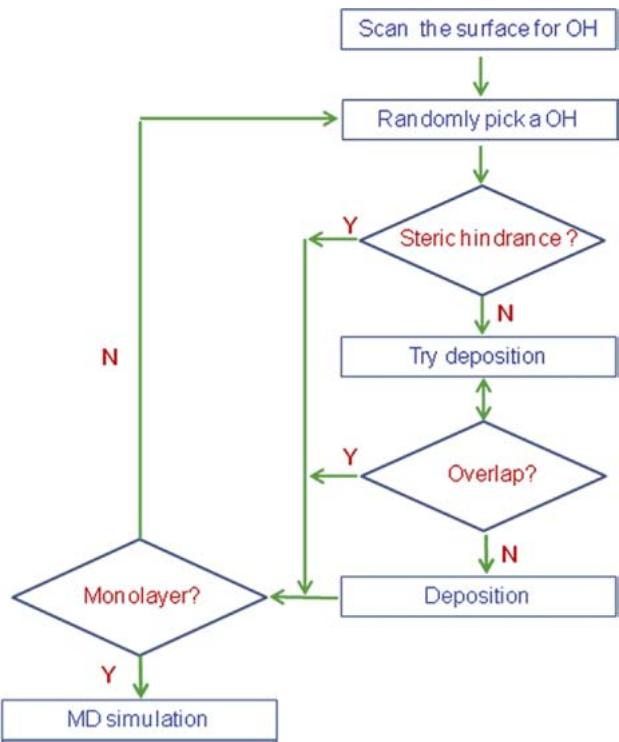  
Figure 1. The deposition method used to model the  $\mathrm{Al}_2\mathrm{O}_3$  film growth.

This deposition algorithm is assumed to be relevant during the conditions when the reaction kinetics and gas- phase transport are fast and when the reverse reactions are negligible. This tends to be valid during the experimental operation, due to the continuous removal of the gas products during ALD. At these conditions, it is reasonable to assume that the reaction occurs on a reactive site with  $100\%$  possibility if the steric effects are negligible. In addition, this algorithm approximately describes the stochastic deposition process, which is an important factor that influences the structure of the ALD films. The surface composition and structure are handled with MD simulations to generate rigorous dynamics of the surface relaxation process between deposition cycles.

# 2.2 MD simulation details

In our MD simulations, the inter- atomic potentials used for the hydroxylated alumina surface are of the Buckingham type, derived by Matsui [23,24]. This is a fixed charge potential and has been previously used successfully for studying the amorphous alumina surface [24,25]. The pair interaction potential between atoms  $i$  and  $j$  as a function of the inter- atomic distance  $r_i$  is given by

$$
U_{ij} = \frac{q_iq_j}{r_{ij}} +D(B_i + B_j)\exp \left(\frac{A_i + A_j - r_{ij}}{B_i + B_j}\right) - \frac{C_iC_j}{r_{ij}^6}.
$$

This potential consists of a long- ranged electrostatic potential and a short- ranged Buckingham potential, which include the repulsion and dispersion interactions. In the equation above,  $D$ $(4.184\mathrm{kJ}\mathring{\mathrm{A}}^{- 1}\mathrm{mol}^{- 1})$  is a force constant,  $r_{ij}$  is the relative distance between the atoms  $i$  and  $j$  and  $q$  is the effective charge on each atom. The empirically fitted parameters,  $A,B$  and  $C$  and are listed in Table 1. One notable deficiency of this empirical potential is its inability to describe pure species association (i.e.  $\mathrm{H - H}$  O- O or Al- Al). Since this potential does not include attractive interactions (except the small dispersion interactions) for like- like dimers, and the species charges are fixed (regardless of the neighbouring species), it is effectively incapable of forming like- like dimers during the simulations. However, our focus is on the ALD growth of stoichiometric  $\mathrm{Al}_2\mathrm{O}_3$  films. In this case, the aggregation of like- like species is expected to be less important to our investigation.

Table 1. Inter-atomic potential parameters corresponding to Equation (1) [23,24].  

<table><tr><td></td><td>q (e)</td><td>A(Å)</td><td>B(Å)</td><td>C(Å3kJ1/2mol-1/2)</td></tr><tr><td>Al</td><td>1.4175</td><td>0.78520</td><td>0.03400</td><td>36.82</td></tr><tr><td>O</td><td>-0.9450</td><td>1.82150</td><td>0.13800</td><td>90.61</td></tr><tr><td>H</td><td>0.4725</td><td>-0.17607</td><td>-0.02462</td><td>1.86285</td></tr></table>

All of the MD simulations were carried out in the canonical ensemble (NVT) using a time step of 0.5 fs. The short- range Buckingham interactions were calculated by using a cut- off of  $8\mathring{\mathrm{A}}$ . The long- range dispersion interactions were calculated using the dispersion summation method [26], and the Coulomb interactions were calculated using the Ewald summation with a correction for two- dimensional slab systems [27,28]. In all of the MD simulations, the Nosè- Hoover chain algorithm [29] was used for integration of the equations of motion. The equations of motion were coupled with two Nosè- Hoover chains to generate a canonical distribution. In our simulations, the Ewald parameters are chosen as follows. The real space force cut- off  $(r_{\mathrm{cut}})$  was given an initial value, but was treated as an adjustable parameter during the simulation. The real/reciprocal space partition parameter  $(\alpha)$  and the reciprocal lattice vector  $(k)$  are dependent on  $r_{\mathrm{cut}}$  and determined by ensuring that the relative errors in the real space sum and reciprocal space sum are negligible (below  $10^{- 7}$ ). The  $r_{\mathrm{cut}}$  was adjusted to maximise the rate of convergence of both sums. In most of our simulations, the  $r_{\mathrm{cut}}$  was set close to half of the simulation box length.

# 2.3 Substrate preparation

In our simulations, the hydroxylated  $\mathrm{Al}_2\mathrm{O}_3$  surface was used as the substrate for the ALD of  $\mathrm{Al}_2\mathrm{O}_3$ . As shown in Figure 2, MD simulation was used to generate the surface model using a procedure similar to the approach used by Adiga et al. [24]. At first, a bulk  $\mathrm{Al}_2\mathrm{O}_3$  sample consisting of 600 atoms was created according to the  $\mathrm{Al}_2\mathrm{O}_3$  crystal structure  $(a = 15.3836208\mathring{\mathrm{A}}$ ,  $b = 20.5114944\mathring{\mathrm{A}}$ ,  $c = 25.639368\mathring{\mathrm{A}}$ ,  $\alpha = \beta = \gamma = 55.282635^{\circ}$ ). Then, the simulation box was anisotropically scaled to a large cubic supercell with box lengths  $a = b = c = 26\mathring{\mathrm{A}}$ . After annealing the sample at  $5000\mathrm{K}$  for  $300\mathrm{ps}$ , the simulation box was scaled to obtain the desired density of the oxide. Then, the sample was quenched to  $300\mathrm{K}$  in  $100\mathrm{ps}$  at a rate of  $47\mathrm{K / ps}$ . Following this, the box was replicated twice in the  $x$  and  $y$  directions (in order to increase the system size), and the surface was created by increasing the box length in the  $z$  direction to  $55.344\mathring{\mathrm{A}}$ . In order to create the

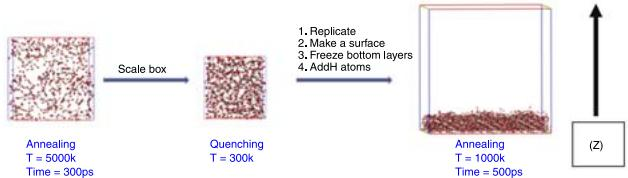  
Figure 2. The preparation process of the hydroxylated  $\mathrm{Al}_2\mathrm{O}_3$  surface.

hydroxylated surface, certain amounts of  $\mathrm{H}$  atoms were added above the frozen layers to obtain the desired  $\mathrm{H}$  content. To add a  $\mathrm{H}$  atom into the system, an Al atom was randomly picked and replaced by a  $\mathrm{H}$  atom. Simultaneously, an  $\mathrm{O}$  atom was randomly selected and removed to maintain the overall charge neutrality of the system. Finally, the surface was annealed at  $1000\mathrm{K}$  for  $500\mathrm{ps}$ . Consistent with the simulations of Adiga et al. [24] the  $\mathrm{H}$  atoms migrated to the surface region after annealing, resulting in a  $- \mathrm{OH}$  terminated surface. During the subsequent simulation studies, the atoms in the bottom  $3\mathrm{\AA}$  of the simulation box were frozen at their relaxed geometries.

# 3. Results and discussion

# 3.1 In situ characterisation of  $Al_{2}O_{3}$  films during the ALD process

Total density profiles for the ALD of  $\mathrm{Al}_2\mathrm{O}_3$  films after zero, four and eight ALD cycles and at a temperature of  $300^{\circ}\mathrm{C}$  are plotted in Figure 3, as a function of the distance along the  $Z$  direction (perpendicular to the surface). Unless otherwise noted, all of the simulation results presented here were also obtained at  $300^{\circ}\mathrm{C}$ . The number density is calculated using layers of height  $\Delta Z = 1\mathrm{\AA}$  parallel to the surfaces. As shown in Figure 3, there is a decrease in density in the region of height  $Z = 3 - 5\mathrm{\AA}$ . This decrease arises from the boundary conditions used. Since the atoms in the bottom  $3\mathrm{\AA}$  are frozen, the atoms directly contacting the frozen layers receive large repulsive forces, due to exclusion. As a result, the motion of these atoms is more restricted, leading to a depleted density in this region. The effects of the boundary constraints are less influential to the atoms with larger distances from the frozen layers.

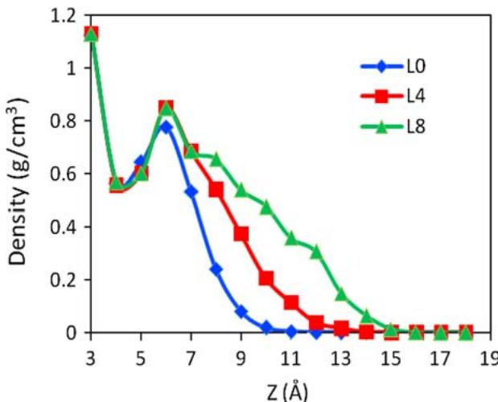  
Figure 3. Total density profiles after zero (blue), four (red) and eight (green) ALD cycles as a function of the distance along the  $Z$  direction of the  $\mathrm{Al}_2\mathrm{O}_3$  film at  $300^{\circ}\mathrm{C}$ .

Overall, the density profiles become more flat as the number of deposited layers increases. This shows that, in the initial ALD stage, the film deposited by ALD has a smaller density in the surface region than the initial substrate. Number density profiles for individual atoms (O, Al, H) as a function of the distance along the  $Z$  direction are shown in Figure 4. It is clear from the number density profiles that H and O have larger densities than Al at the surface region. This indicates that the  $\mathrm{Al}_2\mathrm{O}_3$  surface is mainly terminated by H and O, even as additional layers are deposited and the surface structure relaxes. This can mainly be explained by the empirical potential used in this work. In order to minimise the total energy of the H- terminated  $\mathrm{Al}_2\mathrm{O}_3$  surfaces, the atoms in the surface region rearrange to form a different structure from that of bulk  $\mathrm{Al}_2\mathrm{O}_3$  in order to decrease the repulsive interactions (the short- ranged Buckingham term in Equation (1)) and increase the electrostatic attractive interactions between Al and O. Different from the bulk  $\mathrm{Al}_2\mathrm{O}_3$ , the H terminated  $\mathrm{Al}_2\mathrm{O}_3$  surface has more structural freedom, and hence the atoms in the surface region can further increase the distance among themselves in order to decrease the short- ranged Buckingham repulsion interactions. Consequently, as shown in Figure 3, the density in the surface region is smaller than that in the bulk region. In addition, the system is stabilised by increasing the Al- O attractive electrostatic interactions. Since the empirical two- body potential being used was well- parameterised to stoichiometric  $\mathrm{Al}_2\mathrm{O}_3$ , in which the coordination number of Al is twice the coordination number of O, Al atoms tend to go down inside the film. This maximises the total coordination among Al and O, and hence minimises the electrostatic energy. This gives rise to larger O densities in the surface region. In accordance with the total energy minimisation, the H atoms tend to prefer the ambient. These species are

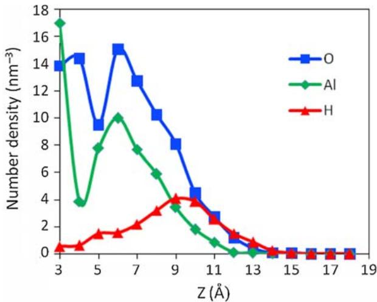  
Figure 4. Number density profiles for O, Al and H as a function of the distance along the  $Z$  direction of the  $\mathrm{Al}_2\mathrm{O}_3$  film at  $300^{\circ}\mathrm{C}$ .

electrostatically repelled by the Al atoms within the film, and at the same time, they are incapable of displacing the Al atoms, since three H atoms would be needed to preserve the local charge neutrality of an extracted Al atom. Hence, the bulk of the film tends to adopt an  $\mathrm{Al}_2\mathrm{O}_3$  stoichiometry, while the O and H atoms are pushed towards the surface, resulting in  $- \mathrm{OH}$  termination.

The ratios of different coordinated Al (Al[4]/Al[3]) for the  $\mathrm{Al}_2\mathrm{O}_3$  films after zero, four and eight ALD cycles are plotted in Figure 5, as a function of the distance along the  $Z$  direction. The coordination number of an atom is defined as the number of other atoms located within the first nearest- neighbour shell of the central atom. Therefore, in this work, the coordination numbers are computed by accounting for neighbours of a central atom using a site- site cut- off criteria of 2.1 and  $1.05\mathrm{\AA}$  for the  $\mathrm{Al} - \mathrm{O}$  and the  $\mathrm{O} - \mathrm{H}$  bond distances, respectively. As shown in Figure 5, it is evident that most of the Al atoms exist as Al[3] at the surface and as Al[4] in the interior of the film, where the number in brackets indicates the coordination number. We also notice that the ratio of Al[4] in the surface region increases when more layers are deposited. This effect is due to the increase of the surface  $- \mathrm{OH}$  concentration with the growth of the thin film. As explained in the following sections, the surface  $- \mathrm{OH}$  concentration increases in the initial ALD cycles if the starting  $- \mathrm{OH}$  concentration is low. The available  $- \mathrm{OH}$  species can attach to the Al[3] on the surface and increase its coordination to Al[4]. Similarly, as shown in Figure 6, most of the O atoms exist as O[2] at the surface region. This is mainly because both  $- \mathrm{OH}$  and oxygen bridges on the surface lead to O[2]. Going inside the films, the fraction of O[3] increases quickly, indicating the predominance of O[3] in the interior of the film.

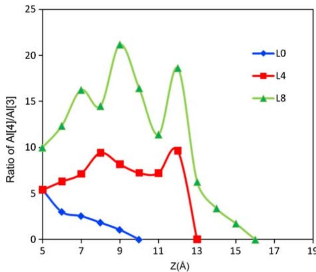  
Figure 5.Ratio of Al[4]/Al[3] after zero (blue), four (red) and eight (green) ALD cycles as a function of the distance along the  $Z$  direction of the  $\mathrm{Al}_2\mathrm{O}_3$  film at  $300^{\circ}\mathrm{C}$

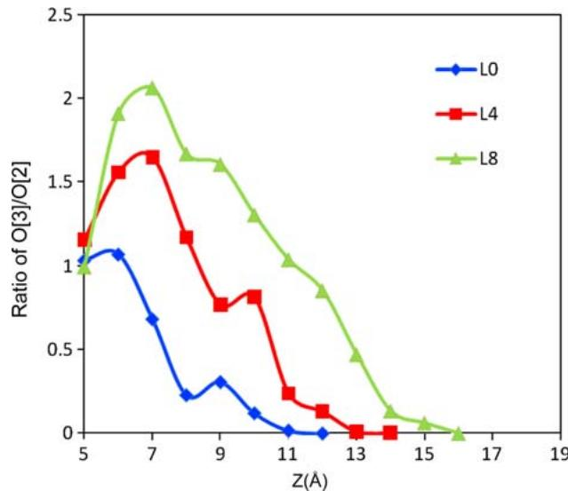  
Figure 6.Ratio of O[3]/O[2] after zero (blue), four (red) and eight (green) ALD cycles as a function of the distance along the  $Z$  direction of the  $\mathrm{Al}_2\mathrm{O}_3$  film at  $300^{\circ}\mathrm{C}$

The surface  $- \mathrm{OH}$  concentrations and the roughness of the surfaces as a function of ALD cycles are plotted in Figure 7. The surface roughness  $(R_{a})$  was evaluated by

$$
R_{a} = \sum_{i}\frac{|Z_{i} - Z_{\mathrm{ave}}|}{N}, \tag{2}
$$

where  $Z_{i}$  is a measured surface height,  $Z_{\mathrm{ave}}$  is the average height and  $N$  is the number of measurements. As shown in Figure 7, both roughness and (OH concentration increase during the first few ALD cycles. This can be explained by the island growth mode in the initial ALD stage. Starting with a low  $- \mathrm{OH}$  concentration, deposition can only proceeded on the few active sites available, which serve as

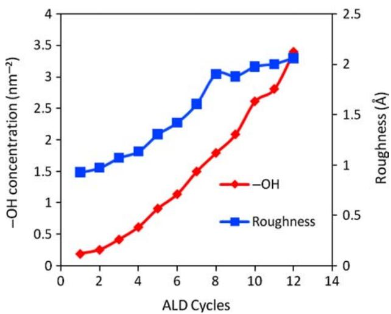  
Figure 7.Surface  $-\mathrm{OH}$  concentrations and roughness of the  $\mathrm{Al}_2\mathrm{O}_3$  film at  $300^{\circ}\mathrm{C}$  as a function of ALD cycles.

Table 2. Surface roughness of the  $\mathrm{Al}_2\mathrm{O}_3$  film at  $300^{\circ}\mathrm{C}$  as a function of ALD cycles. Surface roughness is calculated by treating the atoms as spatial points and as hard balls, respectively.  

<table><tr><td rowspan="2">ALD cycles</td><td colspan="2">Roughness (Å)</td><td rowspan="2">ALD cycles</td><td colspan="2">Roughness (Å)</td></tr><tr><td>Point</td><td>Hard ball</td><td>Point</td><td>Hard Ball</td></tr><tr><td>1</td><td>0.929</td><td>0.943</td><td>7</td><td>1.608</td><td>1.603</td></tr><tr><td>2</td><td>0.975</td><td>0.984</td><td>8</td><td>1.905</td><td>1.908</td></tr><tr><td>3</td><td>1.073</td><td>1.092</td><td>9</td><td>1.881</td><td>1.890</td></tr><tr><td>4</td><td>1.137</td><td>1.152</td><td>10</td><td>1.976</td><td>1.971</td></tr><tr><td>5</td><td>1.306</td><td>1.312</td><td>11</td><td>2.002</td><td>2.005</td></tr><tr><td>6</td><td>1.423</td><td>1.427</td><td>12</td><td>2.062</td><td>2.063</td></tr></table>

growth seeds for the film. Therefore, at the beginning of ALD, the growth process features island growth, which leads to an increase of the surface roughness. From Figure 14(b), which is a representative simulation snapshot after two ALD cycles, we can clearly observe that islands are formed on the surface. As the islands grow, the  $- \mathrm{OH}$  concentration on the surface also increases, until an entire monolayer is eventually deposited.

The effect of atomic radii on surface roughness was evaluated by idealising the atoms as hard spheres. All of the atoms were approximated as hard balls with empirical atomic radii  $1.25\mathrm{\AA}$  for Al,  $0.60\mathrm{\AA}$  for O and  $0.25\mathrm{\AA}$  for H) [30], and the surface roughness was evaluated by the approach described above. Within the simulation cell, the surface heights were measured by using a uniform grid that corresponds to the conditions of the AFM measurements with a tip size equal to  $3.5\mathrm{\AA}$  . The surface roughness of the  $\mathrm{Al}_2\mathrm{O}_3$  film calculated by treating the atoms as points and hard balls is compared in Table 2. Compared with the approximation of the atoms as spatial points, replacing the atoms with hard balls has minimal influence on the surface roughness calculation. When more OH groups are present on the surface (with increasing ALD cycles), we obtained essentially the exact same surface roughness using the two approaches. The uniformity of the surface functional groups reduces the effect of the atomic radii on surface roughness to a negligible level.

The growth per cycle as a function of the ALD cycles is shown in Figure 8. The growth rate is defined by the growth per cycle in terms of the average height and mass. As shown in the growth rate profiles, the height growth rate may be larger or smaller than the mass growth rate during the ALD process. A larger height growth rate suggests that the film deposited in this cycle has a lower density. On the contrary, a larger mass growth rate indicates significant structural relaxation and densification occurring in that cycle. For example, as shown in Figure 8, the mass growth rate of the ninth ALD cycle is larger than that of the eighth ALD cycle, while the height growth rate of the ninth ALD cycle is larger than that of the eighth ALD cycle. This indicates structural relaxation and densification occurring in the ninth ALD cycle, which is consistent with the experimental result that ultra- thin amorphous  $\mathrm{Al}_2\mathrm{O}_3$  is quite defective and can undergo densification to reduce its free volume [31]. The densification process can also be quantified by analysing the coordination number of Al and O. For the  $\mathrm{Al}_2\mathrm{O}_3$  film prepared by ALD, both the  $\mathrm{Al[4] / Al[3]}$  and  $\mathrm{O[3] / O[2]}$  ratios are larger after nine cycles (2.39 for  $\mathrm{Al[4] / Al[3]}$  and 0.93 for  $\mathrm{O[3] / O[2]}$ ) than those after eight cycles (2.14 for  $\mathrm{Al[4] / Al[3]}$  and 0.89 for  $\mathrm{O[3] / O[2]}$ ). The overall increase in the coordination number of O and Al leads to a reduction in vacancy defects and a redistribution of Al over the tetrahedral interstices associated with the densification process [31].

# 3.2 Factors influencing ALD

The initial  $- \mathrm{OH}$  concentration has a significant influence on the ALD process. To investigate the effect of the initial  $- \mathrm{OH}$  concentration on ALD, we compared the ALD process starting with two different initial  $- \mathrm{OH}$  concentrations (0.2 and  $2.8\mathrm{nm}^{- 2}$ ). As shown in Figure 9, with a

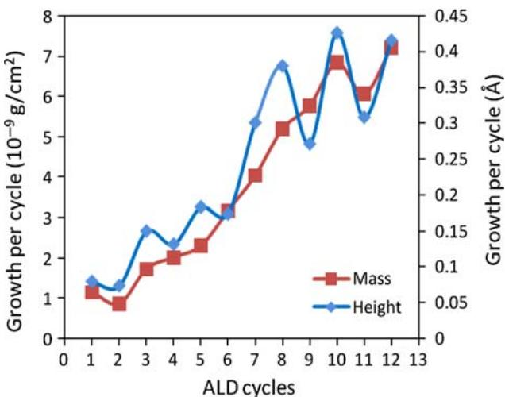  
Figure 8. Growth per cycle in terms of mass (red) and average height (blue) as a function of ALD cycles during the  $\mathrm{Al}_2\mathrm{O}_3$  ALD at  $300^{\circ}\mathrm{C}$ .

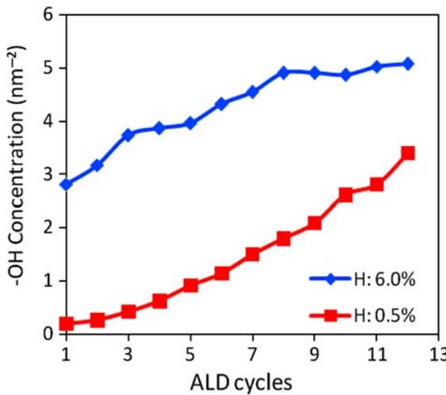  
Figure 9. The evolution of the surface  $-\mathrm{OH}$  concentration during the  $\mathrm{Al}_2\mathrm{O}_3$  ALD starting with two different initial  $-\mathrm{OH}$  concentrations at  $300^{\circ}\mathrm{C}$ .

low initial  $- \mathrm{OH}$  concentration, the population of  $- \mathrm{OH}$  increases rapidly during the ALD process. Correspondingly, as shown in Figure 10, a low initial  $- \mathrm{OH}$  concentration yields a growth rate that is initially very slow, but the growth rate increases quickly. This is consistent with the rapid increase of the  $- \mathrm{OH}$  concentration. On the contrary, a high initial  $- \mathrm{OH}$  concentration leads to a slow increase of  $- \mathrm{OH}$  to an equilibrium concentration of approximately  $5\mathrm{nm}^{- 2}$  (Figure 9), and hence a relatively stable growth rate (Figure 10). Therefore, it is clear that the  $- \mathrm{OH}$  concentration has an important effect on the growth rate. However, the fluctuation of the growth rates (Figure 10) suggests that the  $- \mathrm{OH}$  concentration is not the only factor that influences the ALD growth. In fact, we found, in addition to the  $- \mathrm{OH}$  concentration, the  $- \mathrm{OH}$  distribution and steric hindrance effects are also important factors that influence the ALD growth. For example, for two surfaces with the same  $- \mathrm{OH}$  concentration, a more uneven or clustered  $- \mathrm{OH}$  distribution will yield a slower growth than a more even  $- \mathrm{OH}$  distribution, due to the steric hindrance among the adsorbates. The evolution of surface roughness during the ALD process starting with two different initial  $- \mathrm{OH}$  concentrations are compared in Figure 11. As shown in the surface roughness profiles, a low  $- \mathrm{OH}$  concentration leads to a rougher surface after eight ALD cycles. This is a result of the island growth mode at the low  $- \mathrm{OH}$  concentration.

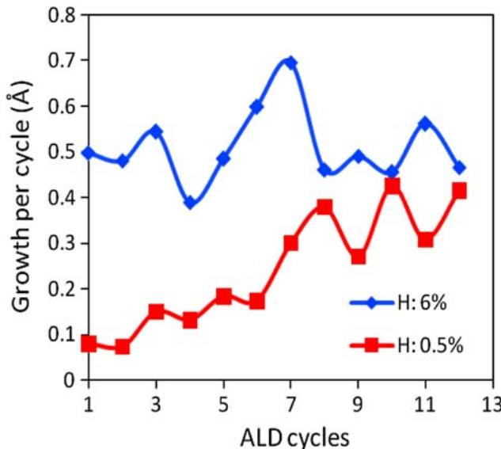  
Figure 10. The evolution of the growth rate during the  $\mathrm{Al}_2\mathrm{O}_3$  ALD starting with two different initial  $-\mathrm{OH}$  concentrations at  $300^{\circ}\mathrm{C}$ .

As shown in Figure 10, after saturation of OH groups on the surface, the  $\mathrm{Al}_2\mathrm{O}_3$  growth rate fluctuates around  $0.06\mathrm{nm}$  per cycle, which is very close to the experimental values (about  $0.08\mathrm{nm}$  per cycle) in the literature [32- 35]. The small difference between our simulation results and experimental measurements may be attributed to the following two possible factors. One possibility is that the steric hindrance factor used in our simulation may not exactly match the steric effects in the experiments. In our simulation, a sphere with a radius of  $4.5\mathrm{\AA}$  is used to designate the regions of steric hindrance. The steric hindrance factor (which was estimated from DFT calculations) is only an approximate description of the true steric effects in  $\mathrm{Al}_2\mathrm{O}_3$  ALD. Therefore, it may be adjusted to refine our model. The second explanation involves the assumptions in the deposition algorithm. Although the predominant ALD reactions have been incorporated in our simulations, there might be other

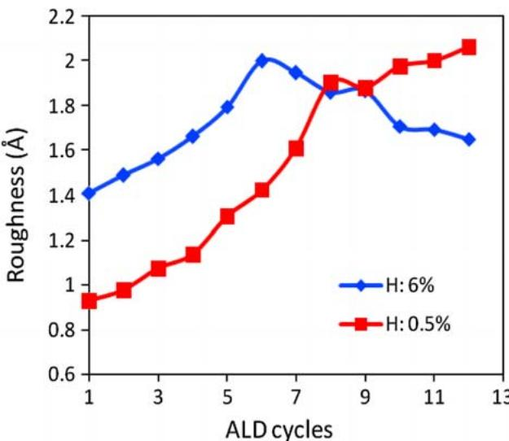  
Figure 11. The evolution of the surface roughness during the  $\mathrm{Al}_2\mathrm{O}_3$  ALD starting with two different initial  $-\mathrm{OH}$  concentrations at  $300^{\circ}\mathrm{C}$ .

reactions, such as the decomposition of the precursors in the gas phase or on the surface, which may contribute to the ALD growth of  $\mathrm{Al}_2\mathrm{O}_3$ . Therefore, future work may need to be performed to investigate the sensitivity of the results to these assumptions.

Temperature is another important factor in ALD. Starting with the same initial surface, we compared the ALD processes at two different temperatures (150 and  $300^{\circ}\mathrm{C}$ ). The effect of temperature on the surface  $- \mathrm{OH}$  concentration is shown in Figure 12. It is clear that the higher temperature  $(300^{\circ}\mathrm{C})$  leads to a faster increase in the  $- \mathrm{OH}$  group concentration on the surface. Correspondingly, a larger growth rate is observed at the higher temperature (Figure 13). This can be explained by closely examining the structures of the films deposited at 150 and  $300^{\circ}\mathrm{C}$ . The initial surface for both simulations is shown in Figure 14(a). In order to investigate the effect of temperature on the ALD films, the two  $- \mathrm{OH}$  groups denoted by the two arrows in Figure 14(a) were traced during the MD simulations at the two different temperatures. As the simulations were performed for  $500\mathrm{ps}$ , the  $- \mathrm{OH}$  group (denoted by the pink arrow) migrated to a different area on the surface when the MD simulation was performed at  $300^{\circ}\mathrm{C}$  (Figure 14(b)). During the next ALD cycle, this allowed additional material to be deposited on both of the two 'largely' separated  $- \mathrm{OH}$  groups. On the contrary, the two  $- \mathrm{OH}$  groups were relatively immobile during the MD simulation performed at  $150^{\circ}\mathrm{C}$  (Figure 14(c)). As a result, the subsequent deposition proceeded only on one of these two  $\mathrm{OH}$  groups during the next ALD cycle, due to the steric hindrance effect. Thus, the higher temperature is predicted to increase the ALD growth rate by increasing the migration of  $- \mathrm{OH}$  groups on the surface, allowing the surface to accommodate additional precursor molecules. However, higher temperatures do not always lead to larger ALD growth rates. At higher temperatures, adjacent  $- \mathrm{OH}$  groups on the surface have a tendency to dehydrate, releasing a  $\mathrm{H}_2\mathrm{O}$  molecule. In our simulations, we have directly observed this dehydration process. Therefore, higher temperature may lower the ALD growth by lowering the surface coverage of  $- \mathrm{OH}$  groups, if the temperature becomes too high. This phenomenon has also been observed experimentally [36].

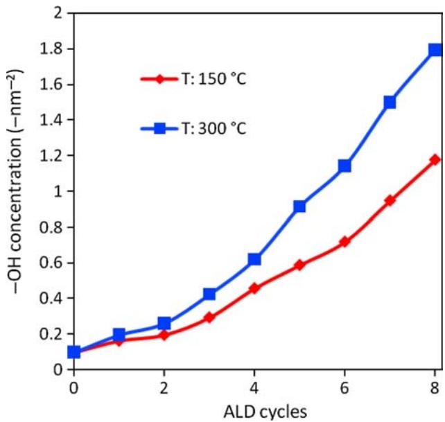  
Figure 12. The evolution of the surface  $-\mathrm{OH}$  concentration during the ALD process at two different temperatures.

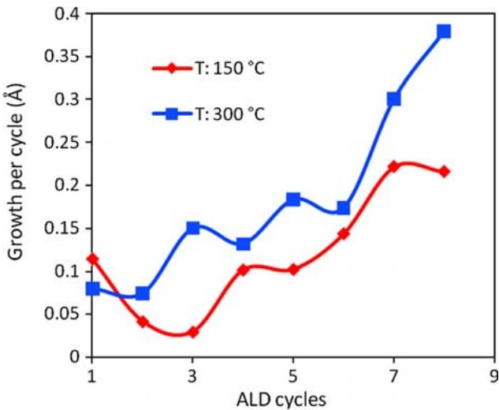  
Figure 13. The evolution of the surface roughness during the ALD process at two different temperatures.

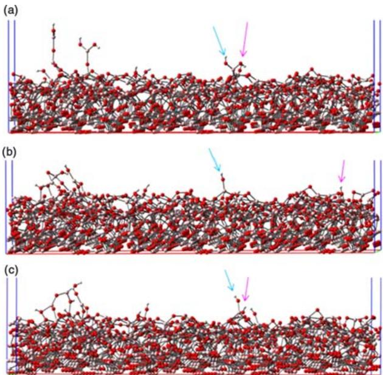  
Figure 14. The effect of temperature on the migration of  $-\mathrm{OH}$  on the  $\mathrm{Al}_2\mathrm{O}_3$  surfaces: (a) starting surface, (b) surface after the MD simulation at  $300^{\circ}\mathrm{C}$  for  $500\mathrm{ps}$  and (c) surface after the MD simulation at  $150^{\circ}\mathrm{C}$  for  $500\mathrm{ps}$ .

# 4.Conclusions

Based on an atomic- level understanding of ALD obtained from previous ab initio calculations and experiments, MDbased all- atom simulations were designed to simulate the dynamic surface relaxation process during ALD of  $\mathrm{Al}_2\mathrm{O}_3$  These simulations enabled us to trace the evolution of the microscopic structure of the  $\mathrm{Al}_2\mathrm{O}_3$  films, as the films grow in thickness. Based on our simulations, the  $\mathrm{Al}_2\mathrm{O}_3$  surface is found to be terminated mainly by  $\mathrm{H}$  and  $\mathrm{O}$  due to their preference for the ambient. This explains why H impurities in ALD  $\mathrm{Al}_2\mathrm{O}_3$  films are usually low. The  $\mathrm{H}$  atoms tend to easily rise to the film surface, rather than becoming incorporated into the bulk of the film. The densification process has also been observed during our ALD simulations. Accompanying the densification of the thin film, Al[3] is converted to Al[4] and Al[5] from its initial precursor state to its bulk state during the process of ALD film growth. Also, we were able to investigate the influence of operating parameters (temperature, initial  $- \mathrm{OH}$  concentration, etc.) on the ALD process at the atomic level. An initially low surface coverage of  $- \mathrm{OH}$  groups leads to an island growth mode, and hence a rough film at the beginning of ALD. In addition to the  $- \mathrm{OH}$  concentration, the  $- \mathrm{OH}$  distribution on the surface is also an important factor that influences the ALD growth mode, due to steric hindrance effects. This indicates that avoiding sparsely and inconsistently populated  $- \mathrm{OH}$  at the initial ALD stage is critical for reducing nucleation periods.

Temperature can have complex structural effects on the ALD film. On one hand, high temperature can increase the ALD growth rate by increasing the migration of  $- \mathrm{OH}$  groups on the surface. On the other hand, high temperature may lower the ALD growth by lowering the surface coverage of  $- \mathrm{OH}$  groups. Although the reaction kinetics are not modelled with our simulation approach, temperature will also have a strong influence on the precursor deposition, rates of reaction and the surface coverage of the products.

Based on our simulations, the  $\mathrm{Al}_2\mathrm{O}_3$  growth rate was predicted to be around  $0.06\mathrm{nm}$  per cycle, which is very close to the experimental values (about  $0.08\mathrm{nm}$  per cycle) in the literature. Possible approaches to improve our model involve refining the steric hindrance criteria and incorporating other reaction events that can capture a more complete and more realistic representation of ALD. From this perspective, our model can serve as an approach to identify the elements required to characterise the essence of ALD by comparing the simulation results and experimental measurements.

This approach enables us to model the atomic structural details during the layer- by- layer ALD growth. We do not expect these simulations to accurately predict all features of  $\mathrm{Al}_2\mathrm{O}_3$  ALD. However, we do hope to gain useful insight into how  $\mathrm{Al}_2\mathrm{O}_3$  films evolve at the atomic level at different ALD operating conditions, which can increase an experimentalist's understanding of how the operation parameters influence the properties of ALD films. Our all- atom MD simulations of ALD aim at building a bridge between atomic- level information and experimental measurements for a complex system.

# Acknowledgements

AcknowledgementsWe are grateful for the financial support from The University of Alabama and supercomputer resources from the Alabama Supercomputer Centre and an MRAC allocation on the TeraGrid.

# Notes

Notes1. Email: hu007@bama.ua.edu2. Email: js544@cornell.edu

# References

References[1] M. Leskela and M. Ritala, Atomic layer deposition (ALD): From precursors to thin film structures, Thin Solid Films 409 (2002), pp. 138- 146. [2] A.B. Mukhopadhyay and C.B. Musgrave, Non- growth ligand exchange reactions in atomic layer deposition of  $HfO_2$ , Chem. Phys. Lett. 421 (2006), pp. 215- 220. [3] M.M. Frank, Y.J. Chabal, and G.D. Wilk, Nucleation and interface formation mechanisms in atomic layer deposition of gate oxides, Appl. Phys. Lett. 82 (2003), pp. 4758- 4760. [4] R.L. Puurunen, Surface chemistry of atomic layer deposition: a case study for the trimethylaluminum/water process, J. Appl. Phys. 97 (2005), 121301. [5] S.D. Elliott and H.P. Pinto, Modelling the deposition of high- k dielectric films by first principles, J. Electroceram. 13 (2004), pp. 117- 120. [6] J.W. Elam, M.J. Pellin, S.D. Elliott, A. Zydor, M.C. Faia, and J.T. Hupp, Mechanism for zirconium oxide atomic layer deposition using bis(methylcyclopentadienyl)methoxymethyl zirconium, Appl. Phys. Lett. 91 (2007), 253123. [7] B.G. Willis, A. Mathew, L.S. Wielunski, and R.L. Opila, Adsorption and reaction of  $HfCl_4$  with  $H_2O$ - Terminated  $Si(100) - \times 1$ , J. Phys. Chem. C 112 (2008), pp. 1994- 2003. [8] L. Dong, Q.Q. Sun, Y. Shi, H. Liu, C. Wang, S.J. Ding, and D.W. Zhang, Quantum chemical study of the initial surface reactions of atomic layer deposition GaAs for photonic crystal fabrication, Appl. Phys. Lett. 92 (2008), 111105. [9] M.D. Halls and K. Raghavachari, Atomic layer deposition of  $Al_2O_3$  on  $H$ - passivated Si. I. Initial surface reaction pathways with  $H / Si(100) - \times 1$ , J. Chem. Phys. 118 (2007), pp. 10221- 10226. [10] A. Heyman and C.B. Musgrave, A quantum chemical study of the atomic layer deposition of  $Al_2O_3$  using  $AlCl_3$  and  $H_2O$  as precursors, J. Phys. Chem. B 108 (2004), pp. 5718- 5725. [11] Z. Hu and C.H. Turner, Atomic layer deposition of  $TiO_2$  from  $TiI_4$  and  $H_2O$  onto  $SiO_2$  surfaces: ab initio calculations of the initial reaction mechanisms, J. Am. Chem. Soc. 129 (2007), pp. 3863- 3878. [12] Z. Hu and C.H. Turner, Oxygen incorporation mechanism during atomic layer deposition of  $Al_2O_3$  on  $H$ - Passivated  $Si(100) - \times 1$ , J. Phys. Chem. C 111 (2007), pp. 5756- 5759. [13] H. Tiznado, M. Bournan, B.C. Kang, K. Lee, and F. Zaera, Mechanistic details of atomic layer deposition (ALD) processes for metal nitride film growth, J. Mol. Catal. A: Chem. 281 (2008), pp. 35- 43. [14] A. Estève, L. Jeloaica, G. Maxaleyrat, A. Dkhissi, M. Djafari- Rouhani, A.A. Messaoud, and N. Fazouan, Atomic scale modeling of  $ZrO_2$  and  $HfO_2$  atomic layer deposition on silicon: linking density functional theory and kinetic Monte Carlo, MRS Symposium Proceedings, Pittsburg, USA, C.R. Albernathy,

E.P. Gusev, 
D. Schlom and 
S. Stemmer, eds., Pittsburg, USA. 2004, p. 35. [15] 
G. Mazaleyrat, 
A. Esteve, 
L. Jeloaica, and 
M. Djafari-Rouhani, A methodology for the kinetic Monte Carlo simulation of alumina atomic layer deposition onto silicon, Comput. Mater. Sci. 33 (2005), pp. 74-82. [16] 
I.M. Iskandarova, 
A.A. Knizhnik, 
I.V. Belov, 
E.A. Rykova, 
A.A. Bagatur'yants, 
S.Y. Umanskii, 
B.V. Potapkin, and 
M.W. Stoker, Roughness simulation for thin films prepared by atomic layer deposition, Russ. 
J. Phys. Chem. B 1 (2007), pp. 102-112. [17] 
O. Nilsen, 
O.B. Karlsen, 
A. Kjekshus, and 
H. Fjellvag, Simulation of growth dynamics in atomic layer deposition. Part I. Amorphous films, Thin Solid Films 515 (2007), pp. 4527-4537. [18] 
O. Nilsen, 
C.E. Mohn, 
A. Kjekshus, and 
H. Fjellvag, Analytical model for island growth in atomic layer deposition using geometrical principles, 
J. Appl. Phys. 102 (2007), 024906. [19] 
A.A. Knizhnik, 
A.A. Bagaturyants, 
I.V. Belov, 
B.V. Potapkin, and 
A.A. Korkin, An integrated kinetic Monte Carlo molecular dynamics approach for film growth modeling and simulation:  $\mathrm{ZrO_2}$  deposition on Si(100) surface, Comput. Mater. Sci. 24 (2002), pp. 128-132. [20] 
A. Grabbe, 
T.A. Michalske, and 
W.L. Smith, Strained siloxane rings on the surface on silica - Their reaction with organosiloxanes, organosilanes, and water, 
J. Phys. Chem. 99 (1995), pp. 4648-4654. [21] 
L. Jeloaica, 
A. Esteve, 
M.D. Rouhani, and 
D. Esteve, Density functional theory study of  $HfCl_{4}$ ,  $\mathrm{ZrCl_{4}}$ , and  $Al(CH_{3})_{3}$  decomposition on hydroxylated  $\mathrm{SiO_2}$ : initial stage of high-k atomic layer deposition, Appl. Phys. Lett. 83 (2003), pp. 542-544. [22] 
G.S. Higashi and 
C.G. Fleming, Sequential surface chemical-reaction limited growth of high-quality  $Al_{2}O_{3}$  dielectrics, Appl. Phys. Lett. 55 (1989), pp. 1963-1965. [23] 
M. Matsui, A transferable interatomic potential model for crystals and melts in the system  $\mathrm{CuO - MgO - Al_{2}O_{3} - SiO_{2}}$ , Mineral. Mag. 58A (1994), pp. 571-572. [24] 
S.P. Adiga, 
P. Zapol, and 
L.A. Curtiss, Structure and morphology of hydroxylated amorphous alumina surfaces, 
J. Phys. Chem. C 111 (2007), pp. 7422-7426.

[25] 
S.P. Adiga, 
P. Zapol, and 
L.A. Curtiss, Atomistic simulations of amorphous alumina surfaces, Phys. Rev. B 74 (2006), 064204. [26] 
N. Karasawa and 
W.A. Goddard, Acceleration of convergence for lattice sums, 
J. Phys. Chem. 93 (1989), pp. 7320- 7327. [27] 
D. Frenkel and 
B. Smit, Long- range interactions, in Understanding Molecular Simulation, 2nd ed., Academic Press, San Diego, CA, 2002, pp. 291- 320. [28] 
I.C. Yeh and 
M.L. Berkowitz, Ewald summation for systems with slab geometry, 
J. Chem. Phys. 111 (1999), pp. 3155- 3162. [29] 
G.J. Martyna, 
M.E. Tuckerman, 
D.J. Tobias, and 
M.L. Klein, Explicit reversible integrators for extended systems dynamics, Mol. Phys. 87 (1996), pp. 1117- 1157. [30] 
J.C. Slater, Atomic radii in crystals, 
J. Chem. Phys. 41 (1964), pp. 3199- 3204. [31] 
P.C. Suijders, 
L.H. Ivergeens, and 
W.G. Sloef, Structural ordering of ultra- thin, amorphous aluminium- oxide films, Surf. Sci. 589 (2005), pp. 98- 105. [32] 
R. Bankras, 
J. Holleman, 
J. Schmitz, 
M. Sturm, 
A. Zinine, 
H. Wormeester, and 
B. Poelsema, In situ reflective high- energy electron diffraction analysis during the initial stage of a trimethylaluminum/water ALD process, Chem. Vap. Deposition 12 (2006), pp. 275- 279. [33] 
L.G. Gosset, 
J.F. Damlencourt, 
O. Renault, 
D. Rouchon, 
P. Holliger, 
A. Ermolieff, 
I. Trimaille, 
J.J. Ganem, 
F. Martin, and 
M.N. Semeria, Interface and material characterization of thin  $Al_{2}O_{3}$  layers deposited by ALD using TMA/H2O, 
J. Non- Cryst. Solids 303 (2002), pp. 17- 23. [34] 
S.C. Ha, 
E. Choi, 
S.H. Kim, and 
J.S. Roh, Influence of oxidant source on the property of atomic layer deposited  $Al_{2}O_{3}$  on hydrogen- terminated Si substrate, Thin Solid Films 476 (2005), pp. 252- 257. [35] 
O. Sneh, 
R.B. Clark- Phelps, 
A.R. Londongan, 
J. Winkler, and 
T.E. Seidel, Thin film atomic layer deposition equipment for semiconductor processing, Thin Solid Films 402 (2002), pp. 248- 261. [36] 
A. Rahtu, 
T. Alaranta, and 
M. Rinala, In situ quartz crystal microbalance and quadrupole mass spectrometry studies of atomic layer deposition of aluminum oxide from trimethylaluminum and water, Langmuir 17 (2001), pp. 6506- 6509.