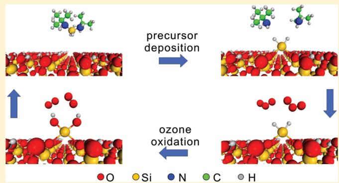
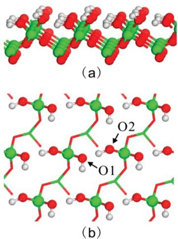
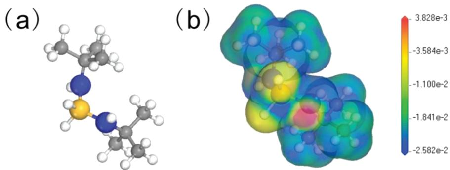
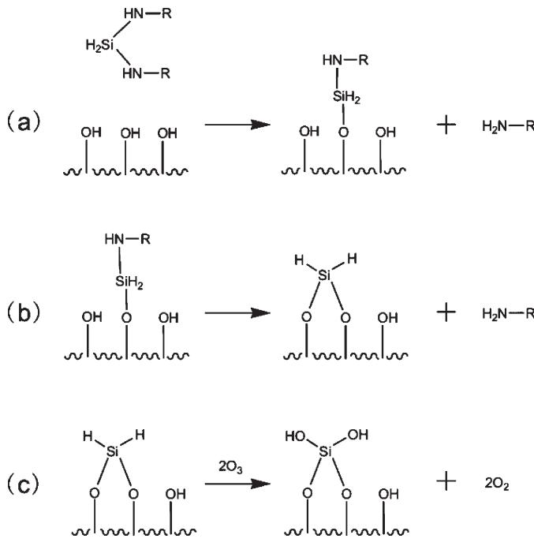
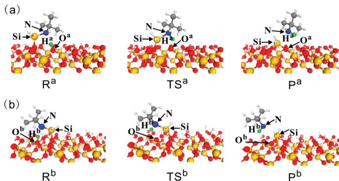
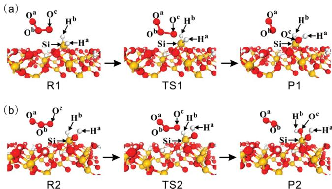

# On the Mechanisms of  $\mathrm{SiO}_2$  Thin-Film Growth by the Full Atomic Layer Deposition Process Using Bis(t-butylamino)silane on the Hydroxylated  $\mathrm{SiO}_2(001)$  Surface

Bo Han, Qingfan Zhang, Jinping Wu,\* Bing Han, Eugene J. Karwacki, Agnes Derecseki, Manchao Xiao, Xinjian Lei, Mark L. O'Neill, and Hansong Cheng\*

Sustainable Energy Laboratory, China University of Geosciences Wuhan, 388 Lumo Road, Wuhan 430074, China Air Products and Chemicals, Inc. (Headquarters), 7201 Hamilton Boulevard, Allentown, Pennsylvania 18195- 1501, United States Air Products and Chemicals, Inc., 1969 Palomar Oaks Way, Carlsbad, California 92011, United States Department of Chemistry, National University of Singapore, 3 Science Drive 3, Singapore

ABSTRACT: With the continuing miniaturization of electronic devices, the atomic layer deposition (ALD) technique has become the preferred choice for the deposition of dense, conformal thin films. Efficient precursors that enable low- temperature deposition processes are of critical importance to ensure high- quality thin films with low impurity levels. Herein, we present a first- principles study on a full cycle of an ALD process using bis(t- butylamino)silane (BTBAS) as the precursor for developing a  $\mathrm{SiO}_2$  thin film on the hydroxylated  $\mathrm{SiO}_2$ - (001) surface with ozone as the oxidizing agent. Two possible deposition pathways were systematically studied. One leads to crystalline growth of the film, and the other gives rise to disordered growth layers. Detailed elementary processes on the surface of the substrate and the associated energetics were examined. We show that the crystalline growth pathway is thermodynamically more favorable, but the disordered growth pathway is kinetically more facile. Given enough time to settle, the BTBAS molecule will fully react with the substrate, leaving essentially few impurities on the surface. Our results suggest that BTBAS is a highly efficient precursor for growing dense and conformal  $\mathrm{SiO}_2$  thin films with the ALD technique.

# 1. INTRODUCTION

Fabrication of silicon dioxide  $(\mathrm{SiO}_2)$  thin films on device substrates is of essential technological importance for the semiconductor industry. Properly manufactured  $\mathrm{SiO}_2$  thin layers exhibit excellent physical and chemical properties, such as optical transparency, chemical inertness, scratch resistance, and hardness. The films can be conventionally deposited on a selected substrate through a variety of techniques, such as chemical vapor deposition (CVD), plasma- enhanced CVD (PECVD), and so on. As the demand to decrease device sizes continues, the temperature range suitable for thin- film fabrications has become very narrow, and a low- temperature process for  $\mathrm{SiO}_2$  deposition is required to ensure excellent device integrity and performance. Although PECVD can produce  $\mathrm{SiO}_2$  films at a relatively low temperature  $(< 300^{\circ}\mathrm{C})$ , the substrate could be damaged by the use of plasma, and the generated surface impurities could become detrimental to the film quality. On the other hand, miniaturization has produced very high- aspect- ratio structures that need to be coated conformally. Films deposited by CVD might no longer be suitable for nodes with feature sizes below  $20 \mathrm{nm}$  because of their natural shortcomings in thickness control, uniformity, and conformality. In particular, CVD can reach full coverage only for structures with aspect ratios of less than 10:1. Design and development of novel deposition processes with lower operating temperatures is essential for novel device manufacturing technologies. For the next generation of semiconductor devices, atomic layer deposition (ALD) is the preferred method for depositing silicon oxide films at temperature lower than  $400^{\circ}\mathrm{C}$ . However, the quality of ALD  $\mathrm{SiO}_2$  films is largely dictated by the physicochemical properties of the precursors. Bis(t- butylamino)- silane (BTBAS) and other alkylaminosilanes have been used as precursors for  $\mathrm{SiO}_2$  film deposition by ALD with ozone as the oxidizing agent. The precursor first undergoes sequential dissociative chemisorption on the hydroxylated  $\mathrm{SiO}_2$  surface, leaving a Si atom anchored on the surface as amines are released to the gas phase. Ozone or plasma- activated oxygen is then used to oxidize the surface intermediates to produce hydroxyl groups for subsequent deposition of the next layer.

The relative reactivity of precursor dissociative chemisorption is critical in determining the deposition temperature and the

density, purity, and roughness of the thin films. A chemically active precursor allows the deposition to be carried out at a relatively low temperature. The precursor structure, to a large extent, is responsible for the quality of the films. In a previous work, we investigated the dissociative chemisorption on the hydroxylated  $\mathrm{SiO}_2(001)$  surface of tris(dimethylamino)silane (TDMAS), which has been used for ALD processes of  $\mathrm{SiO}_2$  thin- film growth. The results indicated that sequential dissociation of TDMAS can occur only up to the second step with dimethylaminosilylenyl groups anchored on the surface. Essentially, further dissociation of these surface species was found to be energetically forbidden under typical ALD processing conditions. This would result in an inherently low- density and compositionally impure  $\mathrm{SiO}_2$  film with a low deposition rate.

Because there are only two  $t$ - butylamino groups in the BTBAS molecule, its dissociative chemisorption is expected to be more complete than that of TDMAS. We thus anticipated that the use of BTBAS as the precursor would give rise to a denser and purer  $\mathrm{SiO}_2$  film. In this article, we present a density functional theory study aimed to understand the mechanism of the full ALD process of BTBAS on a hydroxylated  $\mathrm{SiO}_2(001)$  surface using ozone as the oxidizing agent. The reaction pathways and energetic properties of the whole ALD process, including both the BTBAS dissociation and surface regeneration using ozone, were systematically investigated.

# 2.COMPUTATIONAL METHOD

All calculations were performed using density functional theory (DFT) with the exchange- correlation functional proposed by Perdew and Wang. The projector augmented wave (PAW) method was used to describe the core electrons of atoms, and the valence orbitals were represented with a plane- wave basis set with a cutoff energy of  $396\mathrm{eV}$ . Electronic energies were calculated with a self- consistent- field (SCF) tolerance of  $10^{- 4}\mathrm{eV}$ . Structural optimizations were performed for all atoms of the initial- , intermediate- , and final- state structures, including the adsorbates but excluding the bottom three layers of the substrate, which were kept fixed throughout, until the total energy of the system converged to within  $10^{- 3}\mathrm{eV}$ . Allowing the atoms of two of the bottom layers to relax resulted in only marginal changes in the surface structure, with the differences in bond lengths and bond angles being less than  $0.02\mathrm{\AA}$  and  $3^{\circ}$ , respectively. Transition- state structures were obtained using the nudged- elastic- band (NEB) method to calculate the minimum- energy profile along the prescribed dissociation pathways with the initial and final states chosen based on the optimized structures. The number of images was chosen to achieve smooth curves. The Brillouin zone integration was sampled within a  $4\times 4\times 2$  Monkhorst- Pack  $k$ - point mesh, and electron smearing was employed using the Methfessel- Paxton technique with a width of  $0.1\mathrm{eV}$  to minimize the errors in the Hellmann- Feynman forces. All calculations were performed with the Vienna ab initio simulation package (VASP). For analysis of electrostatic properties of the BTBAS molecule, we also performed DFT calculations using the same exchange- correlation functional but with a double numerical basis set augmented with polarization functions as implemented in the DMol package of Materials Studio 5.0.

Usually,  $\mathrm{SiO}_2$  surfaces are hydroxylated, which increases their reactivity toward silicon precursors. In the present study, we focused on the growth of  $\mathrm{SiO}_2$  thin films by ALD on the fully hydroxylated  $\mathrm{SiO}_2(001)$  surface, which is the preferred orientation in amorphous silica. The reconstructed and fully hydroxylated  $\mathrm{SiO}_2(001)$  surface was taken from our previous work (Figure 1) and modeled as a slab containing six alternating layers with two layers of O atoms and one layer of Si atoms. A rectangular surface unit cell was selected with the optimized cell parameters of  $a = 8.320\mathrm{\AA}$  and  $b = 9.5\mathrm{\AA}$ . Between the slabs, an approximately 12- Å- thick vacuum gap was inserted to avoid interactions between adjacent slabs. The supercell contained 8 Si atoms,  $20\mathrm{O}$  atoms, and  $8\mathrm{H}$  atoms. The surface was equilibrated prior to precursor adsorption. The main calculated structural parameters were found to be in good agreement with the experimental values and previous DFT calculations.

  
Figure 1. Optimized structure of the hydroxylated  $\mathrm{SiO}_2(001)$  surface: a) side view, b) top view.

# 3.RESULTS AND DISCUSSION

In a previous work, we identified that there are two types of hydroxyl groups, indicated in Figure 1b, on the optimized  $\mathrm{SiO}_2(001)$  surface. The more exposed type (labeled O1) was found to be more reactive than the embedded one (labeled O2). The higher electron density on O1, coupled with high surface exposure of the atom, makes the O1 sites more accessible for electrophilic attack by precursor molecules. The optimized BTBAS molecule and its electrostatic charge distribution are shown in Figure 2. Compared with TDMAS, there are only two amino groups in BTBAS, making the Si atom less positively charged (the Mulliken charge on Si is  $1.049\mathrm{e}^{- }$  in BTBAS versus  $1.336\mathrm{e}^{- }$  in TDMAS). We note that the two N atoms of BTBAS are both more negatively charged than the N atoms in TDMAS  $(- 0.664\mathrm{e}^{- }$  versus  $- 0.157\mathrm{e}^{- }$  because of the strong electron- donating effect of the  $t$ - butyl groups in BTBAS.

Because of the self- limiting nature of the ALD process, the deposition process was broken into two half- reactions, as shown in Scheme 1. In the first half (Scheme 1a,b), the silicon precursor undergoes a dissociative chemisorption process on the hydroxylated  $\mathrm{SiO}_2$  surface, resulting in the anchoring of the Si atom of the precursor on the surface and the release of amines into the gas phase. In the second half- reaction (Scheme 1c), ozone is introduced into the reaction chamber to oxidize the  $- \mathrm{SiH}_2$  intermediate species on the surface to form  $- \mathrm{Si(OH)}_2$  groups, thereby completing the deposition of the first  $\mathrm{SiO}_2$  layer and getting ready for the next reaction cycle.

  
Figure 2. (a) Optimized structure of BTBAS. (b) Charge density of the BTBAS molecule.

# Scheme 1. Proposed ALD Reaction Mechanisms for the (a,b) First and (c) Second Half-Reactions

  
Figure 3. Calculated potential energy profiles along the prescribed pathways of the first half-reaction.

# 3.1. First Half-Reaction: BTBAS Dissociative Chemisorption. As shown in Scheme 1, the dissociative chemisorption of BTBAS on the  $\mathrm{SiO}_2(001)$  surface can be broken into two sequential steps, each leading to the formation of a  $\mathrm{Si} - \mathrm{O}$  bond and the release of a  $t$ -butylamine molecule. The calculated energy profiles along the prescribed pathways of the first half-reaction are displayed in Figure 3.

For step 1, the optimized structures of the initial, transition, and final states are shown in Figure 4, and the corresponding optimized structural parameters are presented in Table 1. In the initial state, BTBAS is adsorbed on the hydroxylated  $\mathrm{SiO}_2(001)$  surface through a strong H- bond between the N atom of the precursor and a surface H atom. Because the H atom of the O2 site is H- bonded to the O1 type of oxygen atom, the free H atom of the O1 site becomes more reactive to form a H- bond with BTBAS. One would expect the  $\mathrm{N} - \mathrm{H}$  distance between BTBAS and the surface to be shorter than for TDMAS because of the stronger electrostatic attraction. Instead, the structural optimization yields a  $\mathrm{N} - \mathrm{H}$  distance of  $1.854\mathrm{\AA}$  for BTBAS, considerably longer than that for TDMAS  $(1.604\mathrm{\AA})$ . Detailed examination of the adsorption structure suggests that the unexpectedly long  $\mathrm{N} - \mathrm{H}$  distance results from the steric repulsion between the bulky  $t$ - butylamine group and the surface. As BTBAS comes into contact with the surface, the H atom of the O1- type OH group migrates to the N atom of the precursor as the O1 atom simultaneously attacks the Si atom of the BTBAS molecule. Similarly to the case with TDMAS as the ALD precursor, this process undergoes a transition state with a weakened  $\mathrm{Si} - \mathrm{N}$  bond in the precursor and a significantly elongated  $\mathrm{O} - \mathrm{H}$  bond on the surface. Here, a four- membered ring is formed, leading to the partial dissociation of BTBAS. As the  $\mathrm{Si} - \mathrm{N}$  distance increases, the  $\mathrm{Si} - \mathrm{O}$  distance is decreased from 3.670 to  $1.720\mathrm{\AA}$ . Consequently, a  $\mathrm{H}_2\mathrm{SiNHC}(\mathrm{CH}_3)_3$  species is adsorbed on the  $\mathrm{SiO}_2$ - (001) surface through a strong  $\mathrm{Si} - \mathrm{O}$  bond, and a  $t$ - butylamine molecule is released into the gas phase. The reaction is thermodynamically favorable, with a calculated reaction energy of  $- 4.4$  kcal/mol. The primary dissociation of BTBAS is also kinetically facile, with a relatively modest activation barrier of  $8.9\mathrm{kcal / mol}$ . Only a small change in the surface geometry is necessary to accommodate the dissociative chemisorption of BTBAS.

  
Figure 4. Optimized initial, transition, and final structures of the partial dissociative chemisorption of BTBAS on a hydroxylated  $\mathrm{Si}(001)$  surface to form a monoamine intermediate. The green balls represent the migrating H atom.

Table 1. Main Optimized Bond Parameters  $(\dot{\mathbf{A}})$  for Step 1 of BTBAS Chemisorption  

<table><tr><td rowspan="2">distance label</td><td colspan="3">structure</td></tr><tr><td>R</td><td>TS</td><td>P</td></tr><tr><td>Si-N</td><td>1.763</td><td>1.957</td><td>3.267</td></tr><tr><td>N-H</td><td>1.854</td><td>1.030</td><td>1.025</td></tr><tr><td>O-H</td><td>1.013</td><td>2.322</td><td>4.258</td></tr><tr><td>Si-O</td><td>3.670</td><td>2.231</td><td>1.720</td></tr></table>

  
Figure 5. Optimized initial, transition, and final structures of the dissociative chemisorption of step 2 of BTBAS chemisorption for (a) path a and (b) path b. The green balls represent the migrating H atom.

This concludes the primary step of the dissociative chemisorption of the BTBAS molecule.

Prior to the secondary dissociative chemisorption of BTBAS, which occurs in a similar fashion to the primary step, the surface species must reorient itself to adopt an optimal conformation to interact with the neighboring hydroxyl group of type O2. There are two possible reaction sites for the secondary dissociation of the surface species. First, the  $t$ - butylamino group could react with an adjacent OH group to form an  $\mathrm{O} - \mathrm{SiH}_2 - \mathrm{O}$  species to maintain its original surface orientation, as shown in Figure 5 (path a). As in step 1, a four- membered ring structure is formed in the course of the dissociation. The calculated main structural parameters are summarized in Table 2. At the transition state, the  $\mathrm{Si} - \mathrm{O}$  distance is longer than the value in step 1 because of the longer initial distance of the attacking OH group, implying that this process might be kinetically unfavorable. Indeed, the calculated activation energy of  $20.1\mathrm{kcal / mol}$  is considerably higher than the value  $(8.9\mathrm{kcal / mol})$  in step 1 (Figure 3). The association of the Si atom with the adjacent OH group allows the film to grow with the (001) surface orientation, which lowers the surface tension. Indeed, the calculated thermochemical energy of  $- 13.6$  kcal/mol indicates that the reaction is thermodynamically favorable. The optimized  $\mathrm{Si} - \mathrm{O} - \mathrm{Si}$  and  $\mathrm{O} - \mathrm{Si} - \mathrm{O}$  angles in the top surface layer are  $145.0^{\circ}$  and  $103.2^{\circ}$ , respectively, close to the corresponding values in the  $\mathrm{SiO}_2$  single crystal  $(143.0^{\circ}$  and  $109.8^{\circ}$ , respectively). The reaction results in the formation of a  $\mathrm{SiH}_2$  species on the  $\mathrm{SiO}_2(001)$  substrate with the preserved (001) surface orientation and the release of a second  $t$ - butylamine to the gas phase.

Alternatively, the  $\mathrm{SiH}_2$  species can also undergo another route, with the  $t$ - butylamino group being attacked by the OH group on the same substrate Si atom, as shown in Figure 5 (path b). This bonding configuration represents a deviation from the (001) orientation of the  $\mathrm{SiO}_2$  substrate, because the (001) crystalline surface requires the O atoms that form bonds with a Si atom come from nearest- neighbor Si atoms. As a consequence, this type of bonding network leads to the growth of disordered  $\mathrm{SiO}_2$  films. The main optimized structural parameters are listed in Table 2. The transition- state structure along path b  $(\mathrm{TS}^{\mathrm{b}})$  consists of a six- membered ring with a  $\mathrm{Si} - \mathrm{O}^{\mathrm{b}}$  distance of  $2.358\mathrm{\AA}$ , which is shorter than the analogous distance along path a  $(2.506\mathrm{\AA})$ , indicating that this process is kinetically more facile than path a. Indeed, the calculated activation barrier of  $16.1\mathrm{kcal / mol}$  is lower than the value for path a  $(20.1\mathrm{kcal / mol})$ . It is worth noting that, after the reaction, a four- membered ring is formed with an unusually short  $\mathrm{Si} - \mathrm{Si}$  distance of  $2.463\mathrm{\AA}$ . As a consequence, the structure of the final product  $(\mathrm{P}^{\mathrm{b}})$  exhibits a strong geometric strain with an  $\mathrm{O} - \mathrm{Si} - \mathrm{O}$  angle of  $85.5^{\circ}$ , which deviates significantly from the typical angle of  $109.8^{\circ}$  expected for  $\mathrm{sp}^3$  hybridization. The highly stressed optimized structure indicates that the structure could be thermochemically unstable (Figure 3). Indeed, this process was found to be modestly endothermic, with a reaction energy of  $1.7\mathrm{kcal / mol}$ . It is interesting to note that, despite the strong stress of the local bonding area, only slight surface relaxation was found in the rest of the surface upon the second- step reaction.

Table 2. Main Optimized Bond Parameters  $(\dot{\mathbf{A}})$  for Step 2 of BTBAS Chemisorption  

<table><tr><td rowspan="2">distance label</td><td colspan="3">Path a</td></tr><tr><td>Ra</td><td>TSa</td><td>Pa</td></tr><tr><td>Si-N</td><td>1.750</td><td>1.927</td><td>2.392</td></tr><tr><td>Oa-Ha</td><td>1.004</td><td>1.529</td><td>2.780</td></tr><tr><td>N-Ha</td><td>1.852</td><td>1.082</td><td>1.027</td></tr><tr><td>Si-Oa</td><td>3.463</td><td>2.506</td><td>1.672</td></tr><tr><td rowspan="2">distance label</td><td colspan="3">Path b</td></tr><tr><td>Rb</td><td>Tsb</td><td>Pb</td></tr><tr><td>Si-N</td><td>1.757</td><td>1.935</td><td>2.733</td></tr><tr><td>Ob-Hb</td><td>1.023</td><td>1.820</td><td>2.836</td></tr><tr><td>N-Hb</td><td>1.758</td><td>1.014</td><td>1.029</td></tr><tr><td>Si-Ob</td><td>3.262</td><td>2.358</td><td>1.722</td></tr></table>

3.2. Second Half- Reaction: Surface Oxidation. To grow  $\mathrm{SiO}_2$  films by ALD, surface OH groups need to be regenerated for the next reaction cycle. Ozone is often used to oxidize the surface  $- \mathrm{SiH}_2$  species formed in the first half- reaction. Because there are two different types of  $\mathrm{SiH}_2$  species using BTBAS as the precursor, the oxidation process can also progress along two reaction pathways, which turn out to be very similar, with one O atom of the ozone molecule attacking the positively charged Si atom of the surface  $- \mathrm{SiH}_2$  species, resulting in a surface  $- \mathrm{OH}$  species and an  $\mathrm{O}_2$  molecule in the gas phase.

For the  $- \mathrm{SiH}_2$  species with the same orientation as the  $\mathrm{SiO}_2$ - (001) surface (path a), the calculated structures of the initial, transition, and final states of the two sequential reaction steps are shown in Figure 6, and the main optimized bond parameters are listed in Table 3. In the first step (Figure 6a), both the  $\mathrm{Si} - \mathrm{H}^{\mathrm{a}}$  and  $\mathrm{O}^{\mathrm{b}} - \mathrm{O}^{\mathrm{c}}$  bonds are weakened as the  $\mathrm{Si} - \mathrm{O}^{\mathrm{c}}$  distance decreases.

  
Figure 6. Optimized initial, transition, and final structures of the sequential surface oxidation steps along path a: (a) step 1, (b) step 2.

Table 3. Main Optimized Bond Parameters  $(\dot{A})$  for the Oxidation Reaction along Path a  

<table><tr><td rowspan="2">distance label</td><td colspan="3">Step 1 structure</td></tr><tr><td>R1</td><td>TS1</td><td>P1</td></tr><tr><td>Si-Ha</td><td>1.478</td><td>1.560</td><td>2.308</td></tr><tr><td>Ob-Oc</td><td>1.298</td><td>1.564</td><td>3.246</td></tr><tr><td>Si-Oc</td><td>2.916</td><td>1.776</td><td>1.631</td></tr><tr><td>Hb-Oc</td><td>2.712</td><td>1.699</td><td>0.969</td></tr><tr><td rowspan="2">distance label</td><td colspan="3">Step 2 structure</td></tr><tr><td>R2</td><td>TS2</td><td>P2</td></tr><tr><td>Si-Hb</td><td>1.472</td><td>1.599</td><td>2.291</td></tr><tr><td>Ob-Oc</td><td>1.290</td><td>1.424</td><td>3.993</td></tr><tr><td>Si-Oc</td><td>3.357</td><td>1.949</td><td>1.636</td></tr><tr><td>Hb-Oc</td><td>2.817</td><td>1.787</td><td>0.969</td></tr></table>

A triangular structure is then formed at the transition state  $\left(\mathrm{O}^{\mathrm{c}} - \mathrm{Si} - \mathrm{H}^{\mathrm{a}}\right)$  to minimize the activation energy. At the final state, both the  $\mathrm{Si} - \mathrm{H}^{\mathrm{a}}$  bond and  $\mathrm{O}^{\mathrm{b}} - \mathrm{O}^{\mathrm{c}}$  bond are broken, leading to  $- \mathrm{OH}$  formation and  $\mathrm{O}_3$  release. The oxidation process is strongly exothermic, with a moderate activation barrier of  $17.7\mathrm{kcal / mol}$  (Figure 7). A similar oxidation reaction with  $\mathrm{O}_3$  subsequently takes place to oxidize another  $\mathrm{Si} - \mathrm{H}$  bond into  $\mathrm{Si} - \mathrm{OH}$ . The calculated geometries are shown in Figure 6b, and the associated bond parameters are listed in Table 3. We note that, in the initial state, the calculated  $\mathrm{Si} - \mathrm{O}^{\mathrm{c}}$  distance is considerably longer than the value in step 1 because the  $\mathrm{OH}$  group formed in the first step prevents the ozone molecule from getting closer to the target  $\mathrm{Si}$  atom. However, at the transition state, the two  $\mathrm{OH}$  groups on the  $\mathrm{Si}$  atom form two hydrogen bonds, with calculated distances of 2.393 and  $2.853\mathrm{\AA}$ , respectively. The  $\mathrm{H}$ - bonding formed at the transition state effectively lowers the activation barrier by  $2.3\mathrm{kcal / mol}$  compared to the first oxidation step; however, unlike the first oxidation step, it is the main driving force for the second oxidation step. At the final product state, two  $\mathrm{OH}$  groups are formed with an  $\mathrm{O} - \mathrm{Si} - \mathrm{O}$  angle of  $107.8^{\circ}$ , very close to the value in the pure substrate. Again, the process is strongly exothermic, with a calculated thermochemical energy of  $- 85.5\mathrm{kcal / mol}$ .

  
Figure 7. Calculated energy diagram of the oxidation reactions.

  
Figure 8. Optimized initial, transition, and final structures of the sequential surface oxidation steps along path b: (a) step 1, (b) step 2.

Table 4. Main Optimized Bond Parameters  $(\dot{\mathbf{A}})$  for the Oxidation Reaction along Path b  

<table><tr><td rowspan="2">distance label</td><td colspan="3">Step 1 structure</td></tr><tr><td>R1</td><td>TS1</td><td>P1</td></tr><tr><td>Si-Ha</td><td>1.483</td><td>1.559</td><td>2.268</td></tr><tr><td>Ob-Oc</td><td>1.361</td><td>1.680</td><td>3.381</td></tr><tr><td>Si-Oc</td><td>2.153</td><td>1.754</td><td>1.617</td></tr><tr><td>Hb-Oc</td><td>2.309</td><td>1.850</td><td>0.973</td></tr><tr><td rowspan="2">distance label</td><td colspan="3">Step 2 structure</td></tr><tr><td>R2</td><td>TS2</td><td>P2</td></tr><tr><td>Si-Hb</td><td>1.472</td><td>1.584</td><td>2.233</td></tr><tr><td>Ob-Oc</td><td>1.337</td><td>1.761</td><td>3.375</td></tr><tr><td>Si-Oc</td><td>2.296</td><td>1.720</td><td>1.618</td></tr><tr><td>Hb-Oc</td><td>2.311</td><td>1.707</td><td>0.975</td></tr></table>

The oxidation process for path b, which leads to the disordered surface, is virtually identical to the reactions discussed above. The optimized structures of the initial, transition, and final states are shown in Figure 8. The calculated bond parameters are listed in Table 4. Compared with path a, the  $\mathrm{Si} - \mathrm{O}$  distance at the initial state is much shorter owing to the highly exposed  $\mathrm{Si} - \mathrm{H}$  bonds

because of the strained substrate structure along the disordered growth pathway. This leads to more favorable kinetic processes for the oxidation. Indeed, the calculated activation energy of the primary oxidation (step 1) is significantly lower than the value along path a (5.2 versus  $17.7\mathrm{kcal / mol}$ ). For the secondary oxidation, the calculated activation barrier of  $4.9\mathrm{kcal / mol}$  is also quite modest. Again, the low activation energy results from not only the exposed  $\mathrm{Si - H}$  bond but also the H- bonding with the calculated H- bond distances of 3.518 and  $2.804\mathrm{\AA}$  between the two OH groups. The surface is fully hydroxylated upon full oxidation, which is then ready for the next ALD cycle to grow the  $\mathrm{SiO}_2$  film.

# 4. SUMMARY

With the steady miniaturization of electronic devices, demand for thin- film conformity continues to rise, and as a consequence, the temperature window for thin- film fabrication has become increasingly narrow. Conventional thin- film deposition techniques based on CVD or PECVD might not be able to meet the increasingly stringent requirements for the thin- film quality. To this end, ALD has become the method of choice for fabricating dense, conformal thin films with well- controlled thickness and for high- aspect- ratio features. A carefully designed ALD precursor would enable thin- film deposition to be carried out in the desired temperature range with high purity. An understanding of the detailed reaction mechanisms between the precursor and the substrate is essential for the design and discovery of efficient precursors for thin- film fabrication. In this article, we reported a systematic density functional theory study on the detailed mechanisms of a full ALD cycle on the hydroxylated  $\mathrm{SiO}_2$  (001) surface to grow  $\mathrm{SiO}_2$  films using BTBAS as the precursor and ozone as the oxidizing agent. The ALD process was found to be initiated by the dissociative chemisorption of BTBAS followed by sequential surface reactions and then oxidation by ozone. Two different ALD routes were investigated along their respective minimum- energy pathways. The first route (path a) allows the film to follow the crystalline growth path. It is thermodynamically more favorable but kinetically disadvantageous, with a moderate activation barrier in the second step of precursor surface decomposition. The second ALD route (path b) leads to the growth of a disordered  $\mathrm{SiO}_2$  thin film. Although this process was found to be less thermodynamically favorable than the first route, it is kinetically more facile. In practice, it is likely that both growth mechanisms can be operative. Our results suggest that, at higher temperatures, the crystalline growth pattern might prevail because the ALD process will be less sensitive to the kinetics and thermodynamics will dictate the thin- film growth pathways. At lower temperatures, kinetics might become the dominant factor for film growth. As a consequence, the  $\mathrm{SiO}_2$  film might become largely disordered.

Our calculations suggest that, overall, the full ALD cycle using BTBAS is thermodynamically exothermic, with modest or moderate activation barriers. Given enough time to settle, the precursor will fully react with the substrate, leaving no impurities on the surface. This is in sharp contrast to the ALD behavior of tris(dimethylamino)silane (TDMAS) for which carbon impurity in the  $\mathrm{SiO}_2$  layers is intrinsically inevitable. A recent experiment conducted by Kamiyama et al. made an interesting comparison of the performance of bis(dimethylamino)silane (BDMAS), a precursor with a structure similar to that of BTBAS, and TDMAS for the deposition of  $\mathrm{SiO}_2$  films by ALD. It was reported that the film growth rate using BDMAS is 1.5 times the rate with TDMAS. In addition, the carbon impurity level in the film with BDMAS as the precursor was also found to be much lower than that with TDMAS. Our results are in excellent agreement with the experimental observations. We thus conclude that BTBAS is indeed a superior precursor for  $\mathrm{SiO}_2$  thin- film fabrication.

# AUTHOR INFORMATION

# Corresponding Author

$^*\mathrm{E}$  - mail: chmch@nus.edu.sg.

# ACKNOWLEDGMENT

The work was supported by the National Natural Science Foundation of China (Nos. 20873127 and 20973159) and Air Products and Chemicals, Inc. Support from NUS Startup Fund (H.C.) is also gratefully acknowledged.

# REFERENCES

(1) Kasih, T. P.; Kuroda, S. I.; Kubota, H. Chem. Vapor Depos. 2007, 13 (4), 169-175.  
(2) Kubota, Y.; Matsumoto, T.; Imai, S.; Yamada, M.; Tsuji, H.; Taniguchi, K.; Terakawa, S.; Kobayashi, H. IEEE Trans. Electron Devices 2011, 58 (4), 1134-1140.  
(3) Ritala, H.; Kiihamaki, J.; Puukilainen, E. J. Electrochem. Soc. 2011, 158 (6), D399-D402.  
(4) Jin, S. B.; Choi, Y. S.; Kim, Y. J.; Choi, I. S.; Han, J. G. Surf. Coat. Technol. 2010, 205, S139-S143.  
(5) Kakiuchi, H.; Ohmi, H.; Yamaguchi, Y.; Nakamura, K.; Yasutake, K. Thin Solid Films 2010, 519 (1), 235-239.  
(6) Murata, T.; Kono, K.; Tsunemine, Y.; Fujisawa, M.; Matsuura, M.; Asai, K.; Koilma, M. Jpn. J. Appl. Phys. 2008, 47 (4), 2488-2491.  
(7) Saito, M.; Hasegawa, N.; Koike, F.; Seki, H.; Kuriyama, T. J. Appl. Phys. 1999, 85, 4928-4930.  
(8) Giunta, C. J.; Chapple-Sokol, J. D.; Gordon, R. G. J. Electrochem. Soc. 1990, 137, 3237.  
(9) Nakajima, A.; Khosru, Q. D. M.; Yoshimoto, T.; Yokoyama, S. Microelectron. Reliability 2002, 42, 1823.  
(10) Kinoshita, Y.; Hirose, F.; Miya, H.; Hirahara, K.; Kimura, Y.; Niwano, M. Electrochem. Solid-State Lett. 2007, 10, G80.  
(11) Kamiyama, S.; Miura, T.; Nara, Y. Thin Solid Films 2006, 515, 1517.  
(12) Li, J.; Wu, J.; Zhou, C.; Han, B.; Karwacki, E. J.; Xiao, M.; Lei, J.; Cheng, H. J. Phys. Chem. C 2009, 113 (23), 9731-9736.  
(13) Perdew, J. P.; Wang, Y. Phys. Rev. B 1992, 45 (23), 13244-13249.  
(14) Henkelman, G.; Uberuaga, B. P.; Jonsson, H. J. Chem. Phys. 2000, 113 (22), 9901-9904.  
(15) Henkelman, G.; Jonsson, H. J. Chem. Phys. 2000, 113 (22), 9978-9985.  
(16) Monkhorst, H. J.; Pack, J. D. Phys. Rev. B 1976, 13 (12), 5188.  
(17) Methfessel, M.; Paxton, A. T. Phys. Rev. B 1989, 40 (6), 3616.  
(18) Kresse, G.; Hafner, J. Phys. Rev. B 1993, 48 (17), 13115.  
(19) Delley, B. J. Chem. Phys. 2000, 113 (18), 7756-7764.  
(20) Delley, B. J. Chem. Phys. 1990, 92 (1), 508-517.  
(21) Goumans, T. P. M.; Wander, A.; Brown, W. A.; Catlow, C. R. A. Phys. Chem. Chem. Phys. 2007, 9 (17), 2146-2152.