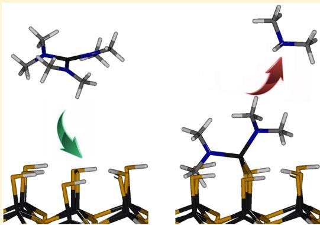
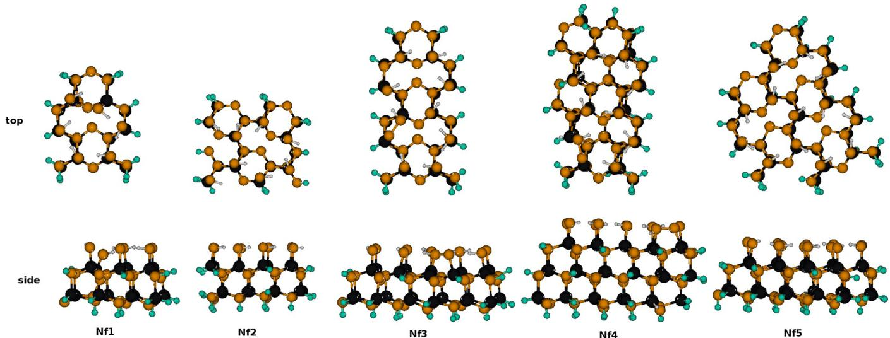
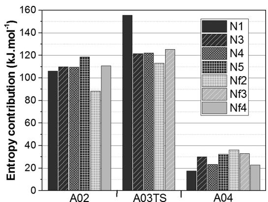
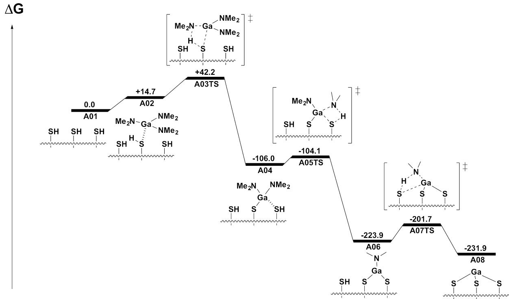
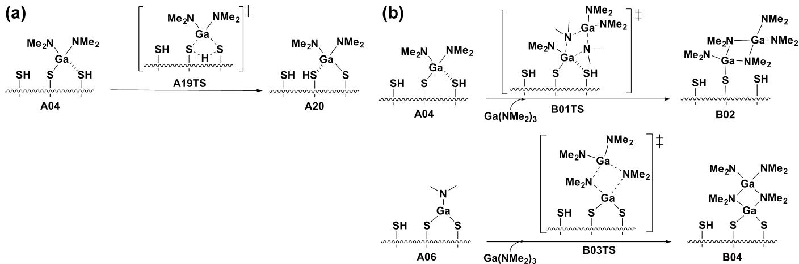
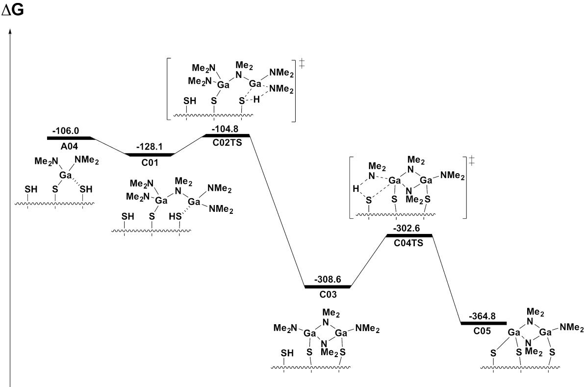
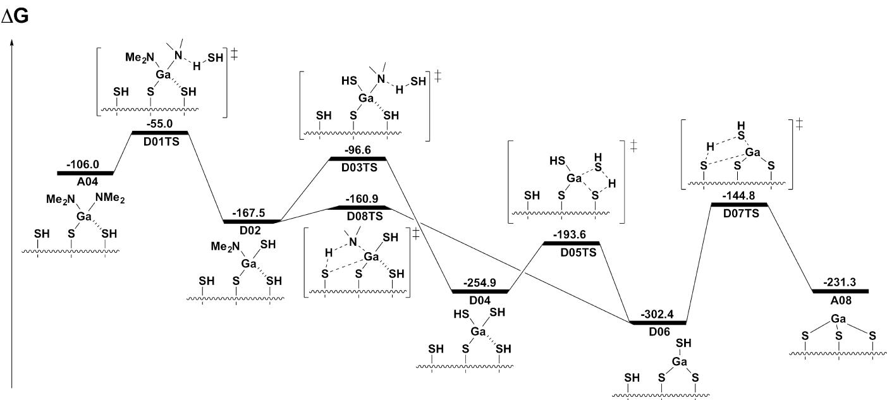
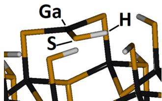
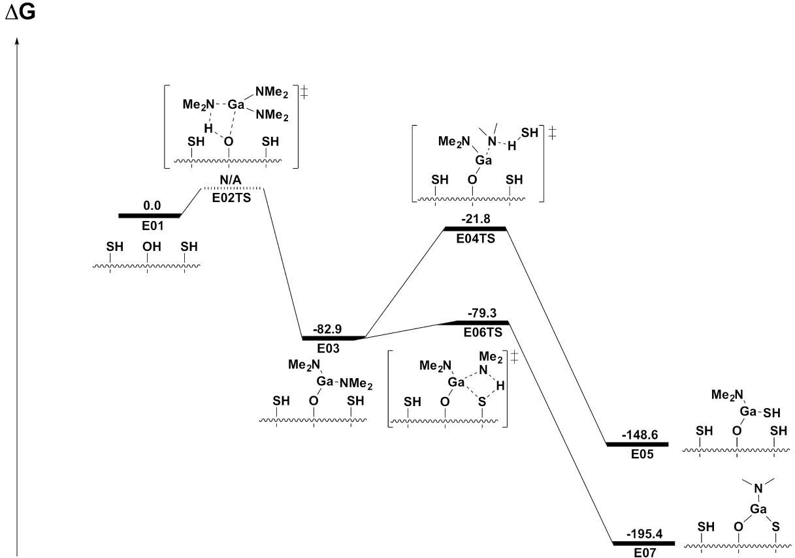

# Chemical Processes Involved in Atomic Layer Deposition of Gallium Sulfide: Insights from Theory

C. Goehry† and 
N. Schneider*†,‡,§

†Institut Photovoltaïque d'Ile- de- France (IPVF), 8, Rue de la Renaissance, 92160 Antony, France  ‡Institut de Recherche et Développement sur l'Energie Photovoltaïque (IRDEF) UMR 7174- CNRS, EDF, Chimie ParisTech, 6 Quant Watier, 78401 Chatou, France

Supporting Information

ABSTRACT: Growth characteristics of atomic layer deposition (ALD) of gallium sulfide  $\left(\mathrm{Ga}_{x} \mathrm{~S}\right)$  from tris(dimethylamino)gallium  $\left(\mathrm{Ga}\left(\mathrm{NMe}_{2}\right)_{3}\right)$  and hydrogen sulfide  $\left(\mathrm{H}_{2} \mathrm{~S}\right)$  have been investigated by density functional theory. The steady- state film growth during one ALD cycle was modeled by studying the energetics of a large set of reactions taking place on a surface described as a SH- terminated gallium sulfide  $\left(\mathrm{Ga}_{2} \mathrm{~S}_{3}\right)$  cluster. The opportunity of using gas- phase cluster calculations to compute entropic contributions is discussed. Detailed reaction mechanisms are provided, along with free energy profiles and a large reaction network emerges. It confirms a ligand loss/exchange mechanism, and various aspects of the growth are explored (late of the precursor and co- reactant, self- saturation of the surface, crawling and cooperative effects, role of the amido ligand, of the impurities, etc.) and confronted to experimental observations. All the key reaction steps are facile and thermodynamically favorable, while undesired side reactions are more demanding energetically.

# INTRODUCTION

Atomic layer deposition (ALD) is a thin film deposition technique based on surface self- limited chemical reactions, where the substrate is exposed separately to each gas- phase reagent (precursor and co- reactant). It leads to ultrathin and conformal films with a fine control of composition and thickness, and ALD has therefore been widely applied to microelectronics but also to emerging applications such as photovoltaics, batteries, coatings, etc.

ALD chemistry is often considered in the absolute terms of the overall reaction. In reality, a large set of reactions are in competition during each phase of the cyclic growth, and their outcome is determined by kinetics. An ALD process is successful when the desired growth reactions are faster than the undesired ones. Most ALD gas- surface reactions can be described as dissociative chemisorption, where precursors react in multiple steps with functionalized surfaces and byproducts desorb.4,5 The precursors have fundamental role as the inertness of their ligands ensure saturation of the surface in each precursor pulse (i.e., the self- limiting growth reaction), as well as thermal stability of the precursor (to avoid uncontrolled gas- phase reactions). Ex situ and in situ characterizations (quadrupole mass spectrometry, quartz crystal microbalance, infrared spectrometry, etc.) can explain many experimental observations (film composition, growth rate, etc.), but achieving a full understanding of an ALD process is rather difficult.

Atomic- scale modeling using density functional theory (DFT) can provide a complementary view. Computational atomistic studies describing ALD processes have been reported since the early days of so- called at that time "atomic layer epitaxy" (ALE), and the reader can refer to recent reviews. A variety of surface models are used: periodic slab, cluster, a combination of both, or molecule models. Also, studies specifically focused on the ALD precursors have been carried out and explored for their stability, reactivity, and fast screening for the identification of best candidates. Reaction data obtained from atomistic DFT calculations lead to reaction rates that can be used to set up a kinetic simulation, where all the relevant simulated steps, reaction barriers, and energies are taken into account in order to model the complete growth (multiple ALD cycles).

While there are now plenty of materials deposited by ALD (mostly oxides and metals), relatively few sulfide materials have been studied, though this class of materials is attracting more and more attention. Quantum- chemical calculations have been applied on an even more limited number of them, i.e., on the growth of PbS from  $\mathrm{Pb}\left(\mathrm{thmd}\right)_{2} / \mathrm{H}_{2} \mathrm{~S}$  (thmd = 2,2,6,6- tetramethyl- 3,5- heptandionato), CdS from  $\mathrm{CdMe}_{2} / \mathrm{H}_{2} \mathrm{~S}$  by hybrid DFT and MP2 calculations, ZnS from  $\mathrm{ZnEt}_{2} / \mathrm{H}_{2} \mathrm{~S}$

  
Figure 1. Top and side view representations of the clusters: black, gallum; orange, sulfur; gray, carbon; blue, nitrogen; white, hydrogen; green, hydrogen atom saturators  $(Z_{\mathrm{H}})$

and  $\mathrm{ZnMe}_2 / \mathrm{H}_2\mathrm{S}_r^{40}$  and  $\mathrm{Cd_xZn_{1 - x}S}$  from  $\mathrm{ZnEt}_2 / \mathrm{CdMe}_2 / \mathrm{H}_2\mathrm{S}$ . Our group has been involved with the ALD of several sulfides, such as  $\mathrm{In}_2\mathrm{S}_{3^{\prime \prime}}^{42}\mathrm{Zn}_x\mathrm{In}_y\mathrm{S}_{z^{\prime \prime}}^{43}\mathrm{Cu}_x\mathrm{S},^{44}$  and  $\mathrm{CuInS}_2$ . Recently, Meng et al. reported the ALD of  $\mathrm{Ga}_x\mathrm{S}$  thin films from  $[\mathrm{Ga}(\mathrm{NMe}_2)_3]_2$  and  $\mathrm{H}_2\mathrm{S}$  and applied them as anode material for Li- ion batteries. The use of a dialkylamido precursor, a class of complexes widely used in group IV oxide/nitride ALD chemistry, was reported to be an important parameter for the success of the synthesis, as no film growth was observed when the common gallium precursor  $\mathrm{GaMe}_2$  was used. Notably, hafniumalkylamido precursors have been used for the synthesis of  $\mathrm{HfO}_2$  and the processes  $\mathrm{Hf}(\mathrm{NEtMe})_4 / \mathrm{H}_2\mathrm{O}^{49}$  and  $\mathrm{Hf}(\mathrm{NMe}_2)_4 / \mathrm{H}_2\mathrm{O}^{50}$  have been studied by DFT.  $\mathrm{TiO}_2$  deposition from  $\mathrm{Ti}(\mathrm{NMe}_2)_4 / \mathrm{H}_2\mathrm{O}$  has been studied by DFT by Detavernier et al. In the process reported by Meng et al., gallium sulfide films are obtained as amorphous and have a relatively high content of  $\mathrm{O}$ , as well as a certain amount of  $\mathrm{N}$  and  $\mathrm{C}$ . Various in situ characterization studies performed (FT- IR, QCM, QMS) gave important mechanistic insights, but the ALD process, notably the oxygen content, could not be fully understood.

Herein is reported the results of our ab initio studies of that process. Density functional theory (DFT) is used to shed a light on a network of reactions taking place on a thiol- functionalized  $\mathrm{Ga}_2\mathrm{S}_3$  surface, exposed to the precursor/coreactant couple:  $\mathrm{Ga}(\mathrm{NMe}_2)_3 / \mathrm{H}_2\mathrm{S}$ . To describe at the atomic scale the mechanisms at play during the growth, a cluster model is proposed and the energetics of a large set of reactions organized in networks in terms of  $\Delta E$  and  $\Delta G$  are reported. The opportunity to include entropy contributions is also discussed. To the best of our knowledge, this is the first time ALD growth of a gallium sulfide material is described using computational methods. Also, this study is performed on a much broader spectrum than any computational insights provided so far for sulfide- based materials.

# COMPUTATIONAL DETAILS

The suite of programs TURBOMOLE  $7.0^{54}$  was used. Generalized gradient approximation (GGA) Becke- Perdew density functional BP86 is used for all the calculations presented in this work, as its computational efficiency and reasonable accuracy compared to hybrid functionals have been previously reported. Guess geometries are optimized with all- electron basis set and valence double-  $\zeta$  polarization at the  $\mathrm{SV}(\mathrm{P})$  level, and the energy of each final structure obtained is evaluated with a larger triple-  $\zeta$  basis set, namely, TZVPP. Empirical dispersion correction is used as proposed by Grimme, D3 version, with Becke- Johnson damping. The convergence criteria on total energies (and for the frequencies determinations), atomic displacements and forces are  $1\times 10^{- 8}$ $(1\times 10^{- 12})$ ,  $1\times 10^{- 3}$ , and  $1\times 10^{- 5}$  at a, respectively. With these computational conditions, the obtained data can be considered as fully converged. All species considered in this work are closed- shell, and the RI approximation was used to accelerate the calculations. Transition states were optimized by following a transition eigenvector obtained by an initial frequency calculation. Entropy is calculated as proposed by the Turbomole package to take into account ubiquitous adsorption/desorption phenomena in surface reactions. All the free energies reported here include the zero- point energy correction. Finally, a force constant calculation is performed to give access to Gibbs free energies, and thermodynamic data are extracted at  $P = 1.5$  mbar and  $T = 150^{\circ}\mathrm{C}$  to simulate experimental conditions. The  $\mathrm{Ga}_2\mathrm{S}_3$  surface is represented with a cluster model in vacuum.

The free energy is represented as a sum of terms, according to the following formulas:

$$
G = H - TS \tag{1}
$$

$$
H = E + \mathrm{ZPE} + k_{\mathrm{b}}T \tag{2}
$$

where  $G$  is the free energy  $(\mathrm{Jmol}^{- 1})$ ,  $H$  is the enthalpy  $(\mathrm{Jmol}^{- 1})$ ,  $T$  is the temperature  $(\mathrm{K})$ , and  $S$  is the entropy  $(\mathrm{J.K}^{- 1})$ .  $E$  is the total electronic energy of the system  $(\mathrm{Jmol}^{- 1})$ ,  $\mathrm{ZPE}$  is the zero- point vibrational energy  $(\mathrm{Jmol}^{- 1})$ , and  $k_{\mathrm{b}}$  is the Boltzmann constant  $(\mathrm{J.K}^{- 1})$ .  $G$  is herein referred to as "free energy",  $E$  as "energy", and all the other terms  $(\mathrm{ZPE} + k_{\mathrm{b}}T - \mathrm{TS})$  as "entropy". In this paper, energy differences  $\Delta E$  are given along with free energy differences  $\Delta G$ . For instance, adsorption  $\Delta E$  and  $\Delta G$  are calculated relative to free surface and separated precursor.

Table 1. Entropy Profile Calculated for the Sample Reactions  $\mathbf{A01}\rightarrow \mathbf{A04}^a$  

<table><tr><td rowspan="2">cluster</td><td colspan="3">entropy profile</td></tr><tr><td>A02</td><td>A03TS</td><td>A04</td></tr><tr><td>N1</td><td>+106.2</td><td>+155.6</td><td>+17.6</td></tr><tr><td>N3</td><td>+109.9</td><td>+121.6</td><td>+30.2</td></tr><tr><td>N4</td><td>+109.6</td><td>+122.0</td><td>+23.4</td></tr><tr><td>N5</td><td>+118.6</td><td>N/A</td><td>+32.3</td></tr><tr><td>Nf2</td><td>+88.3</td><td>+113.1</td><td>+36.1</td></tr><tr><td>Nf3</td><td>N/A</td><td>+125.2</td><td>+33.1</td></tr><tr><td>Nf4</td><td>+110.7</td><td>N/A</td><td>+22.8</td></tr></table>

aValues in  $\mathrm{kJ}\mathrm{mol}^{-1}$  with respect to A01.

  
Figure 2. Variation of contribution of entropy relative to the empty surface. Values are in  $\mathrm{kJ}\mathrm{mol}^{-1}$  over the selected reaction  $\mathrm{A01}\rightarrow \mathrm{A02}$ $\rightarrow \mathrm{A03TS}\rightarrow \mathrm{A04}$ . See Figures 3 and S2 for details.

# RESULTS AND DISCUSSIONS

Description of the Surface. Usually, mechanistic studies on surface reactions using clusters are performed only by looking at energy profiles and neglecting the contribution of entropy,17,19,23,58 use small molecule- like cluster models to. represent the surface,21,22,25 or sometimes have frozen atoms. The contribution of the entropy may modify the free energy profile and should not be neglected, particularly when molecules are adsorbed on a surface and see their degrees of freedom constrained,59 as will be discussed later in this paper. To validate our approach, test calculations have been carried

Table 2. Reaction Energetics for the First Set of Reactions  

<table><tr><td></td><td>ΔE</td><td>ΔG</td></tr><tr><td>A01 (ref)</td><td>+0.0</td><td>+0.0</td></tr><tr><td>A02</td><td>-73.6</td><td>+14.7</td></tr><tr><td>A03TS</td><td>-70.9</td><td>+42.2</td></tr><tr><td>A04</td><td>-142.1</td><td>-106.0</td></tr><tr><td>A05TS</td><td>-138.4</td><td>-104.1</td></tr><tr><td>A06</td><td>-169.4</td><td>-223.9</td></tr><tr><td>A07TS</td><td>-157.3</td><td>-201.7</td></tr><tr><td>A08</td><td>-80.2</td><td>-231.3</td></tr><tr><td>A09</td><td>-125.6</td><td>-3.7</td></tr><tr><td>A10TS</td><td>+149.0</td><td>+146.7</td></tr><tr><td>A11</td><td>+118.7</td><td>+126.9</td></tr><tr><td>A12</td><td>+117.0</td><td>+21.7</td></tr><tr><td>A13TS</td><td>+189.1</td><td>+298.0</td></tr><tr><td>A14</td><td>-100.6</td><td>-61.4</td></tr><tr><td>A15TS</td><td>+223.9</td><td>+241.3</td></tr><tr><td>A16</td><td>-54.0</td><td>-119.7</td></tr><tr><td>A17TS</td><td>+58.0</td><td>+83.0</td></tr><tr><td>A18</td><td>-13.2</td><td>-88.8</td></tr><tr><td>A19TS</td><td>-94.3</td><td>-69.0</td></tr><tr><td>A20</td><td>-157.7</td><td>-124.5</td></tr><tr><td>A21TS</td><td>+95.2</td><td>+109.9</td></tr><tr><td>A22</td><td>-45.6</td><td>-5.2</td></tr><tr><td>A23TS</td><td>+98.0</td><td>+121.5</td></tr></table>

  
Figure 3. Reaction pathway for the chemisorption of  $\mathrm{Ga(NMe_2)_3}$  precursor on the functionalized surface. Free energies  $G$  are in  $\mathrm{kJ}\mathrm{mol}^{-1}$ .

  
Figure 4. Reaction pathways allowing self-saturation: (a) surface rearrangement (so-called "crawling effects"; (b) extra addition of  $\left[\mathrm{Ga}\left(\mathrm{NMe}_{2}\right)_{3}\right]$  precursor.

Table 3. Reaction Energetics Accounting for the SelfSaturation Behavior (Figure 4)a  

<table><tr><td></td><td>ΔE</td><td>ΔG</td></tr><tr><td>A04</td><td>-142.1</td><td>-106.0</td></tr><tr><td>B01TS</td><td>N/A</td><td>N/A</td></tr><tr><td>B02</td><td>-339.1</td><td>-174.1</td></tr><tr><td>A06</td><td>-169.4</td><td>-223.9</td></tr><tr><td>B03TS</td><td>N/A</td><td>N/A</td></tr><tr><td>B04</td><td>-411.6</td><td>-334.6</td></tr><tr><td>aValues in kJ mol-1.</td><td></td><td></td></tr></table>

Table 4. Reaction Energetics Accounting for the Cooperative Effects (More Details, Figures 5 and S3)a  

<table><tr><td></td><td>ΔE</td><td>ΔG</td></tr><tr><td>A04</td><td>-142.1</td><td>-106.0</td></tr><tr><td>C01</td><td>-298.1</td><td>-128.1</td></tr><tr><td>C02TS</td><td>-286.1</td><td>-104.8</td></tr><tr><td>C03</td><td>-399.5</td><td>-308.6</td></tr><tr><td>C04TS</td><td>-390.1</td><td>-302.6</td></tr><tr><td>C05</td><td>-358.0</td><td>-364.8</td></tr><tr><td>C08</td><td>-221.3</td><td>-87.7</td></tr><tr><td>C09</td><td>N/A</td><td>N/A</td></tr><tr><td>C10</td><td>-322.1</td><td>-234.0</td></tr><tr><td>C11TS</td><td>N/A</td><td>N/A</td></tr><tr><td>C05</td><td>-358.0</td><td>-364.8</td></tr><tr><td>aValues in kJ mol-1.</td><td></td><td></td></tr></table>

out to estimate the cluster size convergence in thermodynamical terms. A conceptual difficulty arises with the computation of thermodynamical quantities: if any set of coordinates (here,  $Z_{\mathrm{H}}$  coordinates) is frozen, it may result in a nonoptimal geometry and as a consequence in a set of imaginary frequencies. Those particular modes are not taken into account in the computation of vibrational contribution to the entropy.

Gallium sulfide exhibits two stoichiometries GaS and  $\mathrm{Ga}_2\mathrm{S}_3$ . Experimentally, the films are obtained by ALD as amorphous films and have a  $\mathrm{Ga}_2(\mathrm{O}_2\mathrm{S})_3$  stoichiometry. Thus, crystal data of monoclinic  $\alpha - \mathrm{Ga}_2\mathrm{S}_3$ , a phase of gallium sulfide commonly found at room temperature that displays ordered vacancies, are used to generate three- dimensional structure. The top surface corresponds to the (001) plane of the monoclinic  $\alpha - \mathrm{Ga}_2\mathrm{S}_3$  crystal, and the directions parallel to the surface correspond to [100] and [010]. A series of clusters of increasing sizes was constructed, where the crystal is accordingly cut and covered with thiol groups. Hydrogen atoms (referred to as  $Z_{\mathrm{H}}$  atoms) saturate the dangling bonds on the sides and bottom of the clusters extracted from the three- dimensional crystal. Two test- series of clusters were constructed to probe both the effect of the cluster size and the freezing of  $Z_{\mathrm{H}}$  atoms on the entropy terms.

A sample reaction corresponding to the chemisorption of the  $\mathrm{Ga}\left(\mathrm{NMe}_2\right)_3$  precursor and the release of a  $\mathrm{HNMe}_2$  molecule that includes the reactant A01, adsorbate A02, transition state A03TS, and product A04 is tested on each cluster (see Supporting Information, Figure S2). The proposed test series is performed on clusters of increasing sizes (N1/Nf1, N2/Nf2, N3/Nf3, N4/Nf4 and N5/Nf5), where  $Z_{\mathrm{H}}$  atoms are respectively not frozen and frozen (Figure 1). The "nonfrozen" clusters N1, N2, N3, N4, and N5 have the same starting geometries as their "frozen" counterparts but are deformed during optimization as  $Z_{\mathrm{H}}$  atoms are free to move. Additionally in the cluster Nf2, the bottom Ga/S layer is also frozen to prevent further deformation from lattice positions. The results of this test series are shown in Table 1, Figure 2 and in Supporting Information Table S1, Figure S1. In the first series,  $Z_{\mathrm{H}}$  coordinates are not frozen, the shape of such clusters is strongly impacted, particularly at the edges of the smallest clusters and for the thinnest cluster containing only two Ga- S layers. The cluster N2 even spontaneously expels  $(Z_{\mathrm{H}})_2$  and is therefore discarded. In the second series, the shape of clusters is more tightly kept due to frozen atoms with the exception of Nf1, for which a thiol group orientation is bent toward the center of the cluster. Also, some hydrogen atoms on the surface are transferred to thiol neighbors, creating  $\mathrm{H}_2\mathrm{S}$  groups and  $\mathrm{S} - \mathrm{S}$  bridges. A wrong balance of local charges may be at the origin of this effect, which could not be prevented. An artifact seems to appear with N1 for the transition state energy of A03TS  $(\Delta G^{\ddagger} = - 26.3\mathrm{kJ mol^{- 1}})$ , see Supporting Information Table S1 and Figure S1, as it is found to have a lower energy than separated species (A01,  $E$  reference,  $\Delta G = 0.0\mathrm{kJ mol^{- 1}}$ ) or the chemisorbed precursor (A02,  $\Delta G = - 8.3\mathrm{kJ mol^{- 1}}$ ). For the rest of the set of clusters, the energy of the transition state is rather constant:  $\Delta G^{\ddagger} = +38.0\mathrm{kJ mol^{- 1}}$  and  $\Delta G^{\ddagger} = +45.2\mathrm{kJ mol^{- 1}}$  for, respectively, N3 and N4. The energies of the product seem however to slowly converge as the cluster size increases, no matter whether  $Z_{\mathrm{H}}$  coordinates are frozen or not.

  
Figure 5. Reaction pathways involving cooperation of two  $\mathrm{Ga(NMe_2)_3}$  precursors. Free energies are in  $\mathrm{kJ mol^{-1}}$ .

  
Figure 6. Reaction pathways involving the coreactant  $\mathrm{H}_2\mathrm{S}$  regenerating the thiol end groups of the surface. Free energies are in  $\mathrm{kJ mol^{-1}}$ .

Regarding the entropy (see Table 1 and Figure 2), this term seems to be stable along the test series. The entropy change for  $\mathrm{A01}\rightarrow \mathrm{A02}$  ranges from  $\Delta S = +88.3\mathrm{kJ}\mathrm{mol}^{- 1}$  to  $\Delta S = +118.6$ $\mathrm{kJ mol^{- 1}}$  for, respectively,  $\mathrm{Nf2}$  and N5. The activation entropy for  $\mathrm{A01}\rightarrow \mathrm{A03TS}$  is in a tighter range: from  $\Delta S^{\ddagger} = +113.1\mathrm{kJ}$ $\mathrm{mol}^{- 1}$  to  $\Delta S^{\ddagger} = +125.2\mathrm{kJ mol^{- 1}}$  for, respectively,  $\mathrm{Nf2}$  and  $\mathrm{Nf3}$  Finally, for the overall entropy change during  $\mathrm{A01}\rightarrow \mathrm{A04}$  the computed values range from  $\Delta S = +22.8\mathrm{kJ mol^{- 1}}$  to  $\Delta S =$ $+33.1\mathrm{kJ mol^{- 1}}$  for, respectively,  $\mathrm{Nf4}$  and  $\mathrm{Nf3}$

Overall the results show that the variation of entropy calculated along the selected reaction is similar whether  $\mathrm{Z_H}$  coordinates are frozen or not, except for the smallest cluster (N1). These tests validate our approach of a cluster with frozen  $\mathrm{Z_H}$  saturators. The amount and quality of negative frequencies are required to be constant except for transition states, which always display one single extra negative mode. As a compromise between precision and computational cost, the cluster model  $\mathrm{Nf2}$  was selected and used in the rest of the work presented in this paper and implies an underestimation of energies of approximately  $15\mathrm{kJ mol^{- 1}}$

Reactivity on the Surface. In order to provide a model that represents accurately the chemical reactions taking place in

Table 5. Reaction Energetics for the Second Set of Reactions  $\mathrm{(^{a}H_{2}S}$  Pulse"Figures 6 and S4)  

<table><tr><td></td><td>ΔE</td><td>ΔG</td></tr><tr><td>A01 (ref)</td><td>+0.0</td><td>+0.0</td></tr><tr><td>A04</td><td>-142.1</td><td>-106.0</td></tr><tr><td>D01TS</td><td>-182.8</td><td>-55.0</td></tr><tr><td>D02</td><td>-208.9</td><td>-167.5</td></tr><tr><td>D03TS</td><td>-226.9</td><td>-96.6</td></tr><tr><td>D04</td><td>-284.8</td><td>-254.9</td></tr><tr><td>D05TS</td><td>-234.5</td><td>-193.6</td></tr><tr><td>D06</td><td>-258.8</td><td>-270.0</td></tr><tr><td>D07TS</td><td>-83.3</td><td>-144.8</td></tr><tr><td>D08TS</td><td>-204.4</td><td>-160.9</td></tr><tr><td>D09TS</td><td>-146.6</td><td>-108.3</td></tr><tr><td>A06</td><td>-169.4</td><td>-223.9</td></tr><tr><td>A07TS</td><td>-157.1</td><td>-200.7</td></tr><tr><td>A08</td><td>-80.2</td><td>-231.3</td></tr><tr><td>D10TS</td><td>-121.2</td><td>+0.1</td></tr><tr><td>D11</td><td>-69.6</td><td>-63.4</td></tr><tr><td>C03</td><td>-399.5</td><td>-308.6</td></tr><tr><td>C06TS</td><td>-425.9</td><td>-233.7</td></tr><tr><td>C07</td><td>-486.1</td><td>-387.1</td></tr><tr><td colspan="3">aValues in kJ mol-1.</td></tr></table>

  
Figure 7. Detail of the D06 intermediate. Atoms are represented in black (gallium), orange (sulfur), and white (hydrogen). The thiol group bound to adsorbed Ga center is oriented toward other surface thiol groups and not perpendicular to the surface.

the ALD chamber, one has to ensure that the surface is properly described, and all reactions are thoroughly investigated, particularly the most likely ones, i.e., energetically accessible. In this effort, the energetics of a large number of reactions are explored and split in several categories: (i) "precursor pulse", where the gas- phase precursor  $\mathrm{Ga(NMe_2)_3}$  adsorbs on the surface (see Figure S2); (ii) self- saturation behavior, key characteristics of ALD (see Figure 4); (iii) investigation of some representative reactions of so- called "cooperative effects", when two precursors are chemisorbed in close vicinity (see Figure S3); (iv) reaction mechanisms between  $\mathrm{H}_2\mathrm{S}$  and the chemisorbed species (see Figure S4), as after the chemisorption of  $\mathrm{Ga(NMe_2)_3}$ , the reaction chamber is purged with inert gases and the co- reactant  $\mathrm{H}_2\mathrm{S}$  is injected in the chamber. The four sets of reactions (Figure 4, Figures S2, S3, S4 in Supporting Information) show elementary reactions that may be involved in a full ALD cycle. The purges are not explicitly modeled but can be seen as preventing the reversibility of reactions involving production of gas- phase species. Finally, (v) an exploration of air or water contamination that may result in impurity incorporation is proposed by replacing a thiol group by a hydroxy group on the surface of our cluster model (see Figure 8).

Reaction of the Precursor with the Functionalized Surface. As the functionalized surface (A01) is exposed to the  $\mathrm{Ga(NMe_2)_3}$  precursor (see Figure 3, Table 2 and Supporting

Information Figure S2), their interaction (A02) is slightly disfavored under ALD conditions  $(\Delta G = +14.7 \mathrm{kJ} \mathrm{mol}^{- 1})$ , despite a consequent stabilization in potential energy  $(\Delta E = - 73.6 \mathrm{kJ} \mathrm{mol}^{- 1})$ . The chemisorption  $(\Delta 02 \rightarrow \mathrm{A03TS} \rightarrow \mathrm{A04})$  occurs while a hydrogen from a nearby thiol group is transferred to a dimethylamine ligand. As shown in Figure 3, the chemisorbing fragment approaches the surface by a  $\mathrm{N}$  atom of an amido ligand (distance  $\mathrm{SH} \dots \mathrm{N} = 2.054 \mathrm{\AA}$ ), leading to transition state A03TS with elongated S- H bond (distance  $\mathrm{S} \dots \mathrm{H}$  surface  $= 1.411 \mathrm{\AA}$ ) and  $\mathrm{Ga} - \mathrm{N}$  bonds (distance  $\mathrm{Ga} \dots \mathrm{N} = 1.880 \mathrm{\AA}$  vs  $1.848 \mathrm{\AA}$  and  $1.852 \mathrm{\AA}$ ) and chemisorbing  $\mathrm{Ga}$  atom in trigonal geometry (angle sum  $= 360^{\circ}$ ). This reaction involves a low free energy barrier of  $\Delta G = +412.2 \mathrm{kJ} \mathrm{mol}^{- 1}$ , comprising antagonist potential energy  $(\Delta E^{\ddagger} = - 70.9 \mathrm{kJ} \mathrm{mol}^{- 1})$  and entropy contributions  $(\Delta S^{\ddagger} = +113.1 \mathrm{kJ} \mathrm{mol}^{- 1})$ . The intermediate A04 is largely stabilized with  $\Delta G = - 106.0 \mathrm{kJ} \mathrm{mol}^{- 1}$ , driven by enthalpy stabilization, which highlights the importance of considering entropy and thermal contributions. The formed  $\mathrm{Ga} - \mathrm{S}$  bond remains weaker than in cluster (distance  $\mathrm{Ga} - \mathrm{S} = 2.271 \mathrm{\AA}$ ). The intermediate A04 is stabilized by a weak interaction between the chemisorbed  $\mathrm{Ga}$  atom and a neighboring thiol group (distance  $\mathrm{Ga} \dots \mathrm{S} = 2.591 \mathrm{\AA}$ ), leading to  $\mathrm{Ga}$  atom in distorted tetragonal geometry. The second ligand release step  $\mathrm{A04} \rightarrow \mathrm{A05TS} \rightarrow \mathrm{A06}$  follows a similar trend comprising low free energy barrier stabilization upon ligand release by proton transfer. The  $\mathrm{N}$  atom approaches the thiol  $\mathrm{H}$  atom (distance  $\mathrm{N} \dots \mathrm{H} = 2.666 \mathrm{\AA}$ ), leading to elongation of the  $\mathrm{N} - \mathrm{Ga}$  bond (distance  $= 1.901$  vs  $1.857 \mathrm{\AA}$ ) of the other group, and finally intermediate A06, where the  $\mathrm{Ga} - \mathrm{S}$  bonds have respective 2.246 and 2.217 Å length values, the  $\mathrm{Ga} - \mathrm{N}$  is slightly shorter than planar (angle sum  $= 357.41^{\circ}$ ). The last step  $\mathrm{A06} \rightarrow \mathrm{A07TS} \rightarrow \mathrm{A08}$  is different from the first two steps as a larger deformation is required to eliminate the third ligand. Indeed, the adsorbed gallium atom connects three distant sulfur atoms. The stabilization for  $\mathrm{A06} \rightarrow \mathrm{A08}$  is therefore diminished to only  $\Delta G = - 7.4 \mathrm{kJ} \mathrm{mol}^{- 1}$  (versus  $\Delta G = - 117.9 \mathrm{kJ} \mathrm{mol}^{- 1}$  for  $\mathrm{A04} \rightarrow \mathrm{A06}$ ).

So- called "crawling" effect corresponds to the motion of precursor fragments over the surface and allows the saturation of the surface, which is essential for a successful ALD process. This phenomenon is represented by the reaction  $\mathrm{A04} \rightarrow \mathrm{A19TS} \rightarrow \mathrm{A20}$  (Figure 4a, Table 3). The activation free energy required  $(\Delta G^{\ddagger} = +37.1 \mathrm{kJ} \mathrm{mol}^{- 1})$  is characteristic of a very fast mechanism in ALD conditions. The intermediate has a structure similar to A04, i.e., a chemisorbed  $\mathrm{Ga}$  atom in tetrahedral geometry, a formed  $\mathrm{Ga} - \mathrm{S}$  bond (distance  $\mathrm{Ga} - \mathrm{S} = 2.295 \mathrm{\AA}$ ), and a weak stabilizing interaction with neighboring thiol group (distance  $\mathrm{Ga} \dots \mathrm{SH} = 2.510 \mathrm{\AA}$ ). In this case, the product A20 is more stable than the reactants  $(\Delta G = - 18.5 \mathrm{kJ} \mathrm{mol}^{- 1})$ , an artifact due to the rearrangement of  $\mathrm{H}$ - bonds among thiol groups, which are only available in limited amounts with a finite cluster model. Other routes have been explored and are displayed in Supporting Information, Figure S2. With methane elimination from the ligands  $\mathrm{A02} \rightarrow \mathrm{A13TS} \rightarrow \mathrm{A14}$  and  $\mathrm{A04} \rightarrow \mathrm{A15TS} \rightarrow \mathrm{A16}$  showing very high reaction barriers of, respectively,  $\Delta G^{\ddagger} = +298.0$  and  $+347.3 \mathrm{kJ} \mathrm{mol}^{- 1}$ , no other methane eliminations occurring were calculated. Another mechanistic route to generate A06 was investigated, which corresponds to  $\mathrm{H}$  transfer from a thiol group to adsorbed  $\mathrm{Ga}$  (A21TS), leading to a  $\mathrm{Ga} - \mathrm{H}$  complex (A22) and followed by elimination of  $\mathrm{HNMe}_2$  via A23TS to finally recover intermediate A06. As the first barrier  $\mathrm{A04} \rightarrow \mathrm{A21TS}$  is very high  $(\Delta G^{\ddagger} = +215.9 \mathrm{kJ} \mathrm{mol}^{- 1})$ , the first intermediate A22 lies

  
Figure 8. Mechanisms explored for the key steps of the chemisorption of  $\mathrm{Ga(NMe_2)_3}$  precursor on the functionalized surface which contains an oxygen (hydroxy) impurity on the absorption site, followed by  $\mathrm{H}_2\mathrm{S}$  injection. Free energies are in  $\mathrm{kJ mol^{-1}}$

Table 6. Exploration of the Role of Impurities (Figure  $8)^{a}$  

<table><tr><td></td><td>ΔE</td><td>ΔG</td></tr><tr><td>E01</td><td>0.0</td><td>0.0</td></tr><tr><td>E02TS</td><td>N/A</td><td>N/A</td></tr><tr><td>E03</td><td>-122.6</td><td>-82.9</td></tr><tr><td>E06TS</td><td>-121.8</td><td>-79.3</td></tr><tr><td>E07</td><td>-142.4</td><td>-195.4</td></tr><tr><td>E04TS</td><td>-151.8</td><td>-21.8</td></tr><tr><td>E05</td><td>-191.7</td><td>-148.6</td></tr><tr><td colspan="3">aValues in kJ mol-1.</td></tr></table>

$\Delta G = +100.9 \mathrm{kJ mol^{- 1}}$  above A04, and the second barrier A22  $\rightarrow \mathrm{A23TS}$  is not negligible  $(\Delta G^{\ddagger} = +126.6 \mathrm{kJ mol^{- 1}})$ , this route appears unlikely. A hydrogen atom might be transferred from a methyl group to the gallium:  $\mathrm{A04}\rightarrow \mathrm{A17TS}\rightarrow \mathrm{A18}$  resulting in the release of imide molecule  $\mathrm{N(CH_3) = CH_2}$ . This process involves a high barrier  $(\Delta G^{\ddagger} = +189.0 \mathrm{kJ mol^{- 1}})$ , no stabilization of the product A18 with respect to A04  $(\Delta G = +17.2 \mathrm{kJ mol^{- 1}})$  and is therefore unlikely.

The reactivity of the released dimethylamine  $\mathrm{HNMe}_2$  was also explored. Reaction  $\mathrm{A01}\rightarrow \mathrm{A09}$  that corresponds to the spontaneous transfer of a thiol hydrogen to the dimethylamine leading to an ionic interaction  $\mathrm{S - \ldots H_2N + Me_2}$  was computed,and as the overall stabilization only reaches  $\Delta G = - 3.7 \mathrm{kJ mol^{- 1}}$  this interaction is too weak to be significant especially in ALD conditions (reaction chamber under vacuum and constant flow of inert gas). For this reason, it is assumed that any reaction that produces a release of gas molecule will be irreversible. The spontaneous release of  $\mathrm{H}_2\mathrm{S}$  with the reaction  $\mathrm{A01}\rightarrow \mathrm{A10TS}\rightarrow \mathrm{A11}\rightarrow \mathrm{A12}$  was also tested and displays a reaction barrier of  $\Delta G^{\ddagger} = +146.7 \mathrm{kJ mol^{- 1}}$  and the product A12 lies  $\Delta G = +21.7 \mathrm{kJ mol^{- 1}}$  above A01 in free energy. While the barrier remains high, the surface might gradually loose  $\mathrm{H}_2\mathrm{S}$  units, which could be slowly regenerated with  $\mathrm{H}_2\mathrm{S}$  pulses. It would be interesting to test further such reaction with a larger cluster for a better precision and understanding. Indeed, the loss of a reactive surface groups has already been assumed in the growth of  $\mathrm{Al}_2\mathrm{O}_3$  from TMA and  $\mathrm{H}_2\mathrm{O}$  to explain the noncomplete independence of growth rate with temperature.

Self- Saturation Behavior. During the pulse of the precursor, the whole surface is expected to be gradually filled by chemisorbed precursors, which is possible due to crawling effects (as described earlier), but also to nonreversible or, if present, reversible oligomerization of the precursor. A simple way to represent this is to check the energetics of an additional precursor adsorbing on the first chemisorbed one (paths A04  $\rightarrow \mathrm{B01TS}\rightarrow \mathrm{B02}$  and  $\mathrm{A06}\rightarrow \mathrm{B03TS}\rightarrow \mathrm{B04}$ , Figure 4b). Both processes lead to stabilization of, respectively,  $\Delta G = - 68.1 \mathrm{kJ mol^{- 1}}$  and  $\Delta G = - 110.7 \mathrm{kJ mol^{- 1}}$ . No transition state could be found, perhaps because this reaction is only diffusion- limited. This is not surprising as  $\mathrm{Ga(NMe_2)_3}$  is known to crystallize as a dimer. Similar geometries, bond lengths, and angle values are observed in the experimental structure. The bridging N atom leads to longer  $\mathrm{Ga - N}$  bonds (distance  $\mathrm{Ga - N_{\mathrm{bridging}} = 2.032 - 2.067 \mathrm{\AA}}$  than the terminal ones (distance  $\mathrm{Ga - N_{\mathrm{terminal}} = 1.857 - 1.883 \mathrm{\AA}}$ ). The Ga center adopts a tetragonal coordination. Bond lengths and angle values of the four- membered  $\mathrm{Ga - N - Ga - N}$  ring are similar to the ones observed in B04 and in the crystal structure of  $[\mathrm{Ga(NMe_2)_3}]_2$ .

Cooperative Effects. When two precursors are chemisorbed in close vicinity, it modifies the local chemistry and may influence the relative reactivities. These effects, reported as "cooperative effects" (Table 4), were explored with the set of reactions proposed in Supporting Information Figure S3, and a sample pathway is presented Figure 5. If the chemisorption of a second precursor occurs on the first neighboring thiol group (reaction  $\mathrm{A04\rightarrow C01\rightarrow G02TS\rightarrow C03}$ ), the intermediate C01 is stabilized by  $\Delta G = - 22.1\mathrm{kJ}\mathrm{mol}^{- 1}$  while the first precursor adsorption  $\mathrm{A01\rightarrow A02}$  is slightly disfavored  $\Delta G = +14.7\mathrm{kJ}\mathrm{mol}^{- 1}$ , as described earlier. The stabilization difference is due to the "sharing" of one ligand of the second precursor with the first chemisorbed gallium atom and a stabilized interaction between the Ga center and the thiol group (distance  $\mathrm{Ga - SH} = 2.489\mathrm{\AA}$ ). The reaction  $\mathrm{C01\rightarrow C02TS}$  costs  $\Delta G^{\ddagger} = +23.3\mathrm{kJ}\mathrm{mol}^{- 1}$ , which is similar to the one observed for  $\mathrm{A02\rightarrow A03TS}$ $(\Delta G^{\ddagger} = +27.5\mathrm{kJ}\mathrm{mol}^{- 1})$ . The transition state C02TS corresponds to the insertion of the H atom of the thiol group on the amido ligand, leading to a deformation of the trigonal planar geometry of the  $\mathbb{N}$  atom. The following intermediate C03 is stabilized by  $\Delta G = - 180.5$ $\mathrm{kJ}\mathrm{mol}^{- 1}$  with respect to C01, as a second ligand is shared between chemisorbed gallium centers. A second ligand elimination  $\mathrm{C03\rightarrow C04TS\rightarrow C05}$  is facile  $(\Delta G^{\ddagger} = +6.0\mathrm{kJ}$ $\mathrm{mol}^{- 1}$ ). The resulting stabilization following the elimination of a ligand is limited  $(\Delta G = - 56.2\mathrm{kJ}\mathrm{mol}^{- 1})$ , as the constraints are increasing, three surface sulfur atoms being now connected from the upper side. If the precursor is adsorbed on the second neighboring thiol group available, the adsorption becomes slightly disfavored  $\mathrm{A04\rightarrow C08}$ $\Delta G^{\ddagger} = +18.3\mathrm{kJ}\mathrm{mol}^{- 1}$  which is similar to the scenario when surface was free. Our cluster may be too small to properly render this example, as part of the precursors is dangling out and cannot benefit from favorable van der Waals interactions, albeit the surface of contact is increased by the presence of the first chemisorbed precursor. A more consequent stabilization can be expected with a larger cluster. Regardless, C09TS and C11TS could not be identified at this time despite our efforts. Intermediate C10 displays a large stabilization compared to C08 as two ligands become shared. Additional possible conformations may exist. Evacuation of an additional ligand leads to C05 and a stabilization of  $\Delta G^{\ddagger} = - 130.8\mathrm{kJ}\mathrm{mol}^{- 1}$  in free energy. The neighboring fragment stabilizes every transition state and intermediate by sharing one of its ligands leading to bridging amido groups. In summary, cooperative effects may play a significant role in the overall growth mechanism.

$\mathsf{H}_2\mathsf{S}$  Pulse. The next step corresponds to the  $\mathrm{H}_2\mathrm{S}$  pulse, and elementary reactions calculated are presented in Supporting Information Figure S4 and selected pathways are shown in Figure 6 (see also Table 5). The  $\mathrm{H}_2\mathrm{S}$  pulse has two purposes: it eliminates the remaining ligand fragments, and it regenerates the  $- \mathrm{SH}$  functions of the surface for the next ALD cycle  $\mathrm{A04}$ $\rightarrow \mathrm{D01TS}\rightarrow \mathrm{D02}$ . This reaction displays a low barrier of  $\Delta G^{\ddagger} = +51.0\mathrm{kJ}\mathrm{mol}^{- 1}$  and a stabilization of  $\Delta G = - 61.5\mathrm{kJ}\mathrm{mol}^{- 1}$  with respect to A04. In transition state D01TS, the  $\mathrm{H}_2\mathrm{S}$  molecule approaches the chemisorbed fragment by one of its hydrogen atom that arrives in close vicinity to  $\mathbb{N}$  atom of an amido ligand. The  $\mathbb{N}$  atom trigonal planar geometry is distorted; the corresponding  $\mathrm{Ga - N}$  bond is elongated (distance  $= 1.939\mathrm{\AA}$  vs  $1.874\mathrm{\AA}$  for the other  $\mathrm{Ga - N}$  bond). It leads to the intermediate D02, where Ga has a distorted tetragonal geometry and is bound to three S atoms and one amido group. A second  $\mathrm{H}_2\mathrm{S}$  molecule can eliminate the last ligand (reaction  $\mathrm{D02}\rightarrow \mathrm{D03TS}\rightarrow \mathrm{D04}$ ), following a similar favorable trend  $(\Delta G^{\ddagger} = +70.8\mathrm{kJ}\mathrm{mol}^{- 1}$ ,  $\Delta G = - 87.4\mathrm{kJ}\mathrm{mol}^{- 1}$ ). From this point, an  $\mathrm{H}_2\mathrm{S}$  molecule can be eliminated through D05TS to form species D06. Again, low energy barrier  $(\Delta G^{\ddagger} = +61.3\mathrm{kJ}\mathrm{mol}^{- 1})$  and stabilization of the product D06  $\Delta G = - 47.4\mathrm{kJ}\mathrm{mol}^{- 1}$  relative to D04 are obtained. Intermediate D06 displays a remarkably low free energy  $\Delta G = - 270.0\mathrm{kJ}\mathrm{mol}^{- 1}$ , which is coupled to a series of low barrier steps that make the whole process accessible. However, the thiol ligand attached to the gallium center does not point perpendicularly to the surface and fits in a free space available between the other thiol groups (see Figure 7). The intermediate A08, already observed in the precursor pulse, can be reached via D07TS. The free energy required for this reaction is large  $\Delta G^{\ddagger} = +157.6\mathrm{kJ}\mathrm{mol}^{- 1}$  and leads to destabilization  $\Delta G = +71.1\mathrm{kJ}$ $\mathrm{mol}^{- 1}$ . Another possible route to D06 goes more directly through D08TS, which involves a smaller barrier  $\Delta G^{\ddagger} = +6.6$ $\mathrm{kJ}\mathrm{mol}^{- 1}$  and is much more favored. The route  $\mathrm{D02}\rightarrow \mathrm{D09TS}$ $\rightarrow \mathrm{A06}$  costs only  $\Delta G^{\ddagger} = +59.2\mathrm{kJ}\mathrm{mol}^{- 1}$ , as a  $\mathrm{H}_2\mathrm{S}$  molecule is expelled and falls back to the known intermediate A06 which is  $- 56.4\mathrm{kJ}\mathrm{mol}^{- 1}$  below D02. This latter is an undesired reaction pathway that corresponds to layer etching that can limit the growth rate. Another undesired reaction  $\mathrm{A04}\rightarrow \mathrm{D10TS}\rightarrow \mathrm{D11}$  is explored in which  $\mathrm{H}_2\mathrm{S}$  participates in expelling the gallium from A04 as organometallic complex  $\mathrm{Ga(NMe_2)_2SH}$ , which in turn regenerates an empty surface D11. While this reaction is mildly energetic with  $\Delta G^{\ddagger} = +106.1\mathrm{kJ}\mathrm{mol}^{- 1}$ , the products are destabilized by  $\Delta G = +42.6\mathrm{kJ}\mathrm{mol}^{- 1}$  compared to the reactants.

Cooperation effects similar to the ones described in the previous section are also explored. The reaction of  $\mathrm{H}_2\mathrm{S}$  on C03 displays an activation energy of  $\Delta G^{\ddagger} = +74.9\mathrm{kJ}\mathrm{mol}^{- 1}$  and results in the release of a ligand, and the product C07 lies  $\Delta G = - 78.4\mathrm{kJ}\mathrm{mol}^{- 1}$  below C03 (Supporting Information, Figure S3).

Role of Potential Impurities. Meng et al. have observed a high O content in their films that can originate from an air contamination of the reactor  $(P\approx 1$  mbar, low vacuum level). As a first approach to test these conditions, a reduced set of reactions where one of the thiol groups is replaced by a hydroxy group was tested (see Figure 8 and Table 6). The new surface is labeled E01, and exposure to a  $\mathrm{Ga(NMe_2)_3}$  precursor leads to chemisorption  $\mathrm{E01}\rightarrow \mathrm{E02TS}\rightarrow \mathrm{E03}$ . This reaction is likely to display a low free energy barrier; the product E03 is stabilized by  $\Delta G = - 82.9\mathrm{kJ}\mathrm{mol}^{- 1}$ . Further ligand elimination, leading to E07 via the transition state E06TS, has a very low reaction barrier of  $\Delta G^{\ddagger} = +3.7\mathrm{kJ}\mathrm{mol}^{- 1}$  in free energy, and the product E07 is stabilized by  $\Delta G^{\ddagger} = - 112.4\mathrm{kJ}\mathrm{mol}^{- 1}$ . Alternatively, E03 can react with  $\mathrm{H}_2\mathrm{S}$  (E04TS) and expels  $\mathrm{HNMe}_2$ . This reaction requires  $\Delta G^{\ddagger} = +61.2\mathrm{kJ}\mathrm{mol}^{- 1}$  and the product E05 is  $\Delta G = - 65.7\mathrm{kJ}\mathrm{mol}^{- 1}$  more stable. Overall, the energetics of those reactions based on the modified surface E01 are similar to what is observed for the nonmodified surface A01, and such in situ O insertion is energetically possible.

# CONCLUSION

The surface chemistry of ALD of gallium sulfide from  $\mathrm{Ga(NMe_2)_3}$  and  $\mathrm{H}_2\mathrm{S}$  has been described with DFT through a cluster model. This method gives access to information on the surface chemistry at the atomic scale and is a valuable complement to in situ characterization methods. Structures, pathways, and energetics for a large network of reactions are provided. The computational method used is this paper allows

incorporation of entropy, which strongly impacts the energy profiles, as adsorption and desorption are ubiquitous in ALD processes. Most intermediates and transition states were found, and key reaction routes were identified. It confirmed a ligand exchange/loss mechanism, with typical chemical reaction  $\| -$ $\mathrm{SH}_{\mathrm{surface}} + \mathrm{Ga}(\mathrm{NMe}_2)_3(\mathrm{g})\rightarrow \| - \mathrm{S} - \mathrm{Ga}(\mathrm{NMe}_2)_{3 - x\mathrm{surface}}+$ $x\mathrm{HNMe}_2$ $(\mathbf{g})$  . The low energy barriers involved account for the experimental relatively low deposition temperature  $(150^{\circ}\mathrm{C})$  .46

Cooperative effects involving bridging amido ligands can lower further the energy barriers. Once released, the amine molecule was found unlikely to react with the surface. Side reactions such as methane  $(\mathrm{CH}_4)$  or imide  $\mathrm{(CH_2 = NMe)}$  - elimination have high activation energy barrier and may not occur in this process. This confirms the experimental observation that no (or below the quadrupole mass spectrometry detection limit)  $\mathrm{CH}_4$  was produced during the ALD process.46 However, undesired layer etching is energetically accessible and should be considered. This DFT study also confirmed the feasibility of the self- saturation of the surface by low energy rearrangement of the adsorbed fragments on the surface (crawling effect) and reversible oligomerization of the Ga precursor, a molecule known to crystallize as dimer. In most structures, the gallium atom adopts a tetrahedral geometry by stabilizing effect of a neighboring thiol surface group. Some experimental observations such as the incorporation of O could also be explained. Finally, the complete data set on the growth of the material may be incorporated in the future into a kinetic model that spans multiple ALD cycles to model the time evolution real system. Also, the incorporation of a second precursor would allow the modeling of a ternary material and the explanation of relative atomic ratios by exploring the energetics of exchange.

# ASSOCIATED CONTENT

# $\circledcirc$  Supporting Information

The Supporting Information is available free of charge on the ACS Publications website at DOI: 10.1021/acs.jpcc.6b12242.

Free energies for test reaction  $\mathrm{A01}\rightarrow \mathrm{A02}\rightarrow \mathrm{A03TS}\rightarrow$  A04, extended reaction mechanisms, and detailed views of selected structures and structural descriptions (PDF)

# AUTHOR INFORMATION

# Corresponding Author

\*E- mail: n.schneider@chimie- paristech.fr.

ORCID N. Schneider: 0000- 0001- 7749- 2400

# Notes

The authors declare no competing financial interest.

# ACKNOWLEDGMENTS

This work was carried out in the framework of a project of IPVF (Institut Photovoltaique d'Ile- de- France). This project has been supported by the French Government in the frame of the program of investment for the future (Programme d'Investissement d'Avenir ANR- IEED- 002- 01). The authors thank EDF R&D for providing the computing resources used in this work, and Dr. Philippe Baranek for fruitful discussions.

# REFERENCES

1) George, S. M. Atomic Layer Deposition: An Overview. Chem. Rev.2010,110 1),111-131.

(2) Miikkulainen, V.; Leskelä, M.; Ritala, M.; Puurunen, R. L. Crystallinity of Inorganic Films Grown by Atomic Layer Deposition: Overview and General Trends. J. Appl. Phys. 2013, 113 (2), 021301. 
(3) Johnson, R. W.; Hultqvist, A.; Bent, S. F. A Brief Review of Atomic Layer Deposition: From Fundamentals to Applications. Mater. Today 2014, 17 (5), 236-246. 
(4) Zaera, F. Mechanisms of Surface Reactions in Thin Solid Film Chemical Deposition Processes. Coord. Chem. Rev. 2013, 257 (23-24), 3177-3191. 
(5) Zaera, F. The Surface Chemistry of Atomic Layer Depositions of Solid Thin Films. J. Phys. Chem. Lett. 2012, 3 (10), 1301-1309. 
(6) Knapas, K.; Ritala, M. In Situ Studies on Reaction Mechanisms in Atomic Layer Deposition. Crit. Rev. Solid State Mater. Sci. 2013, 38 (3), 167-182. 
(7) Elliott, S. D. Atomic-Scale Simulation of ALD Chemistry. Semicond. Sci. Technol. 2012, 27 (7), 074008. 
(8) Elliott, S. D.; Dey, G.; Maimaiti, Y.; Ablat, H.; Filatova, E. A.; Fomengia, G. N. Modeling Mechanism and Growth Reactions for New Nanofabrication Processes by Atomic Layer Deposition. Adv. Mater. 2016, 28 (27), 5367-5380. 
(9) Klejna, S.; Elliott, S. D. First-Principles Modeling of the "CleanUp" of Native Oxides during Atomic Layer Deposition onto III-V Substrates. J. Phys. Chem. C 2012, 116 (1), 643-654. 
(10) Han, B.; Zhang, Q.; Wu, J.; Han, B.; Karwacki, E. J.; Derecskei, A.; Xiao, M.; Lei, X.; O'Neill, M. L.; Cheng, H. On the Mechanisms of  $\mathrm{SiO}_2$  Thin-Film Growth by the Full Atomic Layer Deposition Process Using Bis(t-Butylamino) Silane on the Hydroxylated  $\mathrm{SiO}_2(001)$  Surface. J. Phys. Chem. C 2012, 116 (1), 947-952. 
(11) Hu, X.; Schuster, J.; Schulz, S. E.; Geesner, T. Simulation of ALD Chemistry of (nBu3P)2Cu(acac) and (Cu(acac)2 Precursors on Ta(110) Surface. Microelectron. Eng. 2015, 137, 23-31. 
(12) Sandupatla, A. S.; Alexopoulos, K.; Reyniers, M.-F.; Marin, G. B. Ab Initio Investigation of Surface Chemistry of Alumina ALD on Hydroxylated  $\chi$ -Alumina Surface. J. Phys. Chem. C 2015, 119 (23), 13050-13061. 
(13) Sandupatla, A. S.; Alexopoulos, K.; Reyniers, M.-F.; Marin, G. B. DFT Investigation into Alumina ALD Growth Inhibition on Hydroxylated Amorphous Silica Surface. J. Phys. Chem. C 2015, 119 (32), 18380-18388. 
(14) Longo, R. C.; Owen, J. H. G.; McConnell, S.; Dick, D.; Ballard, J. B.; Randall, J. N.; Wallace, R. M.; Chabal, Y. J.; Cho, K. Toward Atomic-Scale Patterned Atomic Layer Deposition: Reactions of  $\mathrm{Al}_2\mathrm{O}_3$  Precursors on a Si(001) Surface with Mixed Functionalizations. J. Phys. Chem. C 2016, 120 (5), 2628-2641. 
(15) Huang, L.; Han, B.; Han, B.; Derecskei-Kovacs, A.; Xiao, M.; Lei, X.; O'Neill, M. L.; Pearlstein, R. M.; Chandra, H.; Cheng, H. Density Functional Theory Study on the Full ALD Process of Silicon Nitride Thin Film Deposition via BDEAS or BTBAS and  $\mathrm{NH}_3$ . Phys. Chem. Chem. Phys. 2014, 16 (34), 18501-18512. 
(16) Machado, E.; Kaczmarski, M.; Ordejchik, P.; Garg, D.; Norman, J.; Cheng, H. First-Principles Analyses and Predictions on the Reactivity of Barrier Layers of Ta and TaN toward Organometallic Precursors for Deposition of Copper Films. Langmuir 2005, 21 (16), 7608-7614. 
(17) Murray, C. A.; Elliott, S. D.; Hausmann, D.; Henri, J.; LaVoie, A. The Effect of Reaction Mechanism on Precursor Exposure Time in Atomic Layer Deposition of Silicon Oxide and Silicon Nitride. ACS Appl. Mater. Interfaces 2014, 6 (13), 10554-10541. 
(18) Coyle, J. P.; Dey, G.; Sirianni, E. P.; Kemell, M. L.; Yap, G. P. A.; Ritala, M.; Leskelä, M.; Elliott, S. D.; Barry, S. T. Deposition of Copper by Plasma-Enhanced Atomic Layer Deposition Using a Novel N-Heterocyclic Carbene Precursor. Chem. Mater. 2013, 25 (7), 1132-1138. 
(19) Mastail, C.; Lanthony, C.; Olivier, S.; Ducéré, J.-M.; Landa, G.; Estève, A.; Djafari Rouhani, M.; Richard, N.; Dkhissi, A. Introducing Densification Mechanisms into the Modelling of  $\mathrm{HfO}_2$  Atomic Layer Deposition. Thin Solid Films 2012, 520 (14), 4559-4563. 
(20) Fang, G.-Y.; Xu, L.-N.; Wang, L.-G.; Cao, Y.-Q.; Wu, D.; Li, A.-D. Stepwise Mechanism and  $\mathrm{H}_2\mathrm{O}$ -Assisted Hydrolysis in Atomic Layer

Deposition of  $\mathrm{SiO}_2$  without a Catalyst. Nanoscale Res. Lett. 2015, 10 (1), 68. (21) Dong, L.; Sun, Q.- Q.; Shi, Y.; Guo, H.- W.; Liu, H.; Wang, C.; Ding, S.- J.; Zhang, D. W. Initial Reaction Mechanism of Nitrogen- Doped Zinc Oxide with Atomic Layer Deposition. Thin Solid Films 2009, 517 (15), 4355- 4359. (22) Mustard, T. J. L.; Kwak, H. S.; Goldberg, A.; Gavartin, J.; Morisato, T.; Yoshidome, D.; Halls, M. D. Quantum Mechanical Simulation for the Analysis, Optimization and Accelerated Development of Precursors and Processes for Atomic Layer Deposition (ALD). Han'guk Seramik Hakhoechi 2016, 53 (3), 317- 324. (23) Lin, J.- M.; Teplyakov, A. V.; Rodriguez- Reyes, J. C. F. Competing Reactions during Metalorganic Deposition: Ligand- Exchange versus Direct Reaction with the Substrate Surface. J. Vac. Sci. Technol., A 2013, 31 (2), 021401. (24) Tanskanen, J. T.; Bent, S. F. Insights into the Surface Chemistry of Tin Oxide Atomic Layer Deposition from Quantum Chemical Calculations. J. Phys. Chem. C 2013, 117 (37), 19056- 19062. (25) Dey, G.; Elliott, S. D. Mechanism for the Atomic Layer Deposition of Copper Using Diethylzinc as the Reducing Agent: A Density Functional Theory Study Using Gas- Phase Molecules as a Model. J. Phys. Chem. A 2012, 116 (35), 8893- 8901. (26) Kazadojev, I.; Otway, D. J.; Elliott, S. D. Modeling of Precursors for Atomic Layer Deposition of Magnesium and Calcium Oxide. Chem. Vap. Deposition 2013, 19 (4- 6), 117- 124. (27) Murray, C.; Elliott, S. D. Density Functional Theory Predictions of the Composition of Atomic Layer Deposition- Grown Ternary Oxides. ACS Appl. Mater. Interfaces 2013, 5 (9), 3704- 3715. (28) Zydor, A.; Elliott, S. D. Thermal Stability of Precursors for Atomic Layer Deposition of TiO2, ZrO2, and HfO2: An Ab Initio Study of  $\alpha$ - Hydrogen Abstraction in Bis- Cyclopentadienyl Dimethyl Complexes. J. Phys. Chem. A 2010, 114 (4), 1879- 1886. (29) Holme, T. P.; Prinz, F. B. Atomic Layer Deposition and Chemical Vapor Deposition Precursor Selection Method Application to Strontium and Barium Precursors. J. Phys. Chem. A 2007, 111 (33), 8147- 8151. (30) Elliott, S. D. Improving ALD Growth Rate via Ligand Basicity: Quantum Chemical Calculations on Lanthanum Precursors. Surf. Coat. Technol. 2007, 201 (22), 9076- 9081. (31) Orimoto, Y.; Toyota, A.; Furuya, T.; Nakamura, H.; Uehara, M.; Yamashita, K.; Maeda, H. Computational Method for Efficient Screening of Metal Precursors for Nanomaterial Syntheses. Ind. Eng. Chem. Res. 2009, 48 (7), 3389- 3397. (32) Fang, G.; Xu, L.; Cao, Y.; Li, A. Theoretical Design and Computational Screening of Precursors for Atomic Layer Deposition. Coord. Chem. Rev. 2016, 322, 94- 103. (33) Mazaleyrat, G.; Esteve, A.; Jeloaica, L.; Djafari- Rouhani, M. A Methodology for the Kinetic Monte Carlo Simulation of Alumina Atomic Layer Deposition onto Silicon. Comput. Mater. Sci. 2005, 33 (1- 3), 74- 82. (34) Shirazi, M.; Elliott, S. D. Atomistic Kinetic Monte Carlo Study of Atomic Layer Deposition Derived from Density Functional Theory. J. Comput. Chem. 2014, 35 (3), 244- 259. (35) Dasgupta, N. P.; Meng, X.; Elam, J. W.; Martinson, A. B. F. Atomic Layer Deposition of Metal Sulfide Materials. Acc. Chem. Res. 2015, 48 (2), 341- 348. (36) Dasgupta, N. P.; Walch, S. P.; Prinz, F. Fabrication and Characterization of Lead Sulfide Thin Films by Atomic Layer Deposition. ECS Proceedings 2008, 16, 29- 36. (37) Lee, W.; Dasgupta, N. P.; Trejo, O.; Lee, J.- R.; Hwang, J.; Usui, T.; Prinz, F. B. Area- Selective Atomic Layer Deposition of Lead Sulfide: Nanoscale Patterning and DFT Simulations. Langmuir 2010, 26 (9), 6845- 6852. (38) Bakke, J. R.; Jung, H. J.; Tanskanen, J. T.; Sinclair, R.; Bent, S. F. Atomic Layer Deposition of CdS Films. Chem. Mater. 2010, 22 (16), 4669- 4678. (39) Tanskanen, J. T.; Bakke, J. R.; Bent, S. F.; Pakkanen, T. A. Molecular Level Insights into Atomic Layer Deposition of CdS by

Quantum Chemical Calculations. J. Phys. Chem. C 2010, 114 (39), 16618- 16624. (40) Tanskanen, J. T.; Bakke, J. R.; Bent, S. F.; Pakkanen, T. A. ALD Growth Characteristics of ZnS Films Deposited from Organozinc and Hydrogen Sulfide Precursors. Langmuir 2010, 26 (14), 11899- 11906. (41) Bakke, J. R.; Tanskanen, J. T.; Jung, H. J.; Sinclair, R.; Bent, S. F. Atomic Layer Deposition of CdXZn1- xS Films. J. Mater. Chem. 2011, 21 (3), 743- 751. (42) Naghavi, N.; Henriquez, R.; Lapiev, V.; Lincot, D. Growth Studies and Characterisation of In2S3 Thin Films Deposited by Atomic Layer Deposition (ALD). Appl. Surf. Sci. 2004, 222 (1- 4), 65- 73. (43) Genevee, P.; Donsanti, F.; Renou, G.; Lincot, D. Study of Growth Mechanism and Properties of Zinc Iodium Sulfide Thin Films Deposited by Atomic Layer Chemical Vapor Deposition over the Entire Range of Composition. J. Phys. Chem. C 2011, 115 (34), 17197- 17205. (44) Schneider, N.; Lincot, D.; Donsanti, F. Atomic Layer Deposition of Copper Sulfide Thin Films. Thin Solid Films 2016, 600, 103- 108. (45) Schneider, N.; Bouttemy, M.; Genevee, P.; Lincot, D.; Donsanti, F. Deposition of Ultra Thin CuInS2 Absorber Layers by ALD for Thin Film Solar Cells at Low Temperature (down to  $150^{\circ}\mathrm{C}$ ). Nanotechnology 2015, 26 (5), 054001. (46) Meng, X.; Libera, J. A.; Fister, T. T.; Zhou, H.; Hedlund, J. K.; Fenter, P.; Elam, J. W. Atomic Layer Deposition of Gallium Sulfide Films Using Hexakis(dimethylamido)digalium and Hydrogen Sulfide. Chem. Mater. 2014, 26 (2), 1029- 1039. (47) Meng, X.; He, K.; Su, D.; Zhang, X.; Sun, C.; Ren, Y.; Wang, H.- H.; Weng, W.; Trahey, L.; Canlas, C. P.; et al. Gallium Sulfide- Single- Valled Carbon Nanotube Composites: High Performance Anodes for Lithium- Ion Batteries. Adv. Funct. Mater. 2014, 24 (34), 5435- 5442. (48) Provine, J.; Schindler, P.; Torgersen, J.; Kim, H. J.; Karnthaler, H.- P.; Prinz, F. B. Atomic Layer Deposition by Reaction of Molecular Oxygen with Tetraakisdimethylamido- Metal Precursors. J. Vac. Sci. Technol., A 2016, 34 (1), 01A138. (49) Chen, W.; Sun, Q.- Q.; Xu, M.; Ding, S.- J.; Zhang, D. W.; Wang, L.- K. Atomic Layer Deposition of Hallium Oxide from Tetrakis (Ethylmethylamino) Hafnium and Water Precursors. J. Phys. Chem. C 2007, 111 (17), 6495- 6499. (50) Shirazi, M.; Elliott, S. D. Multiple Proton Diffusion and Film Densification in Atomic Layer Deposition Modeled by Density Functional Theory. Chem. Mater. 2013, 25 (6), 878- 889. (51) Pi, T. W.; Lin, T. D.; Lin, H. Y.; Chang, Y. C.; Wertheim, G. K.; Kwo, J.; Hong, M. Synchrotron Radiation Photoemission Study of Interfacial Electronic Structure of HfO2 on In0.53Ga0.47As(001)- 4×2 from Atomic Layer Deposition. Appl. Phys. Lett. 2014, 104 (4), 042904. (52) Murray, C.; Elliott, S. D. Density Functional Theory Predictions of the Composition of Atomic Layer Deposition- Grown Ternary Oxides. ACS Appl. Mater. Interfaces 2013, 5 (4), 3704- 3715. (53) Elliott, S. D.; Greer, J. C. Simulating the Atomic Layer Deposition of Alumina from First Principles. J. Mater. Chem. 2004, 14 (21), 3246- 3250. (54) Furche, F.; Ahlrichs, R.; Hattig, G.; Klopper, W.; Sierka, M.; Weigend, F. Turbomole. Wiley Interdiscip. Rev. Comput. Mol. Sci. 2014, 4 (2), 91- 100. (55) Grimme, S.; Antony, J.; Ehrlich, S.; Krieg, H. A Consistent and Accurate Ab Initio Parametrization of Density Functional Dispersion Correction (DFT- D) for the 94 Elements H- Pu. J. Chem. Phys. 2010, 132 (15), 154104. (56) Grimme, S.; Ehrlich, S.; Goerigk, L. Effect of the Damping Function in Dispersion Corrected Density Functional Theory. J. Comput. Chem. 2011, 32 (7), 1456- 1465. (57) Eichkorn, K.; Treutler, O.; Öhm, H.; Häser, M.; Ahlrichs, R. Auxiliary Basis Sets to Approximate Coulomb Potentials. Chem. Phys. Lett. 1995, 240 (4), 283- 290. (58) Coyle, J. P.; Dey, G.; Sirianni, E. R.; Kemell, M. L.; Yap, G. P. A.; Ritala, M.; Leskelä, M.; Elliott, S. D.; Barry, S. T. Deposition of Copper by Plasma- Enhanced Atomic Layer Deposition Using a Novel

N- Heterocyclic Carbene Precursor. Chem. Mater. 2013, 25 (7), 1132- 1138. (59) Gaberle, J.; Gao, D. Z.; Watkins, M. B.; Shluger, A. L. Calculating the Entropy Loss on Adsorption of Organic Molecules at Insulating Surfaces. J. Phys. Chem. C 2016, 120 (7), 3913- 3921. (60) Lieth, R. M. A.; Heijlagers, H. J. M.; Heijden, C. W. M. v d. The P- T- X Phase Diagram of the System Ga- S. J. Electrochem. Soc. 1966, 113 (8), 798- 801. (61) Jones, C. Y.; Bryan, J. C.; Kirschbaum, K.; Edwards, J. G. Refinement of the Crystal Structure of Digallium Trisulfide,  $\mathrm{Ga}_2\mathrm{S}_3$ . Z. Kristallogr. - New Cryst. Struct. 2001, 216 (1- 4), 349- 350. (62) Puurunen, R. L. Surface Chemistry of Atomic Layer Deposition: A Case Study for the Trimethylaluminum/Water Process. J. Appl. Phys. 2005, 97 (13), 131301- 131301. (63) Waggoner, K. M.; Olmstead, M. M.; Power, P. P. Structural and Spectroscopic Characterization of the Compounds  $\mathrm{[Al(NMe_2)3]_2}$ ,  $\mathrm{[Ga(NMe_2)3]_2}$ ,  $\mathrm{[(Me2N)2Al\{\mu - N(H)1 - Ad\}]_2}$ $\mathrm{1 - Ad = 1}$  - Adamantanyl) and  $\mathrm{[\{Me(\mu - NPh_2)Al\}2NPh(\mu - C6H_4)]}$ . Polyhedron 1990, 9 (2- 3), 257- 263. (64) Kanarik, K. J.; Lill, T.; Hudson, E. A.; Sriraman, S.; Tan, S.; Marks, J.; Vahedi, V.; Gottscho, R. A. Overview of Atomic Layer Etching in the Semiconductor Industry. J. Vac. Sci. Technol., A 2015, 33 (2), 020802.