# First-Principles Study of a Full Cycle of Atomic Layer Deposition of  $\mathrm{SiO}_2$  Thin Films with Di(sec-butylamino)silane and Ozone

Liang Huang, Bo Han,\* Bing Han, Agnes Dereoskei- Kovacs, Manchao Xiao, Xinjian Lei, Mark L. O'Neill, Ronald M. Pearlstein, Haripin Chandra, and Hansong Cheng\*

Sustainable Energy Laboratory, China University of Geosciences Wuhua, 388 Lume Road, Wuhua 430074, China Air Products and Chemicals, Inc. (Headquarters), 7201 Hamilton Boulevard, Allentown, Pennsylvania 18195- 1501, United States Air Products and Chemicals, Inc., 1969 Palomar Oaks Way, Carlsbad, California 92011, United States Department of Chemistry, National University of Singapore, 3 Science Drive 3, Singapore

ABSTRACT: The energy landscape of a full atomic layer deposition cycle to grow a layer of  $\mathrm{SiO}_2$  on the hydroxylated  $\mathrm{SiO}_2(001)$  surface was systematically explored using density functional theory. A monoaminosilane- based compound, di(sec- butylamino)silane (DSBAS), was utilized as the silicon precursor with ozone acting as an oxidizing agent. The ALD cycle includes dissociative chemisorption of DSBAS, oxidation, and condensation for surface regeneration. Our results indicate that the dissociative chemisorption of DSBAS is kinetically facile. Upon oxidation by ozone, the layer grows with a  $\mathrm{SiO}_2$  crystalline morphology. The entire ALD cycle was found to be thermodynamically and kinetically favorable. This is important for growing dense and conformal  $\mathrm{SiO}_2$  thin films free of impurities and thus well- suited for low- temperature deposition of  $\mathrm{SiO}_2$  thin films.

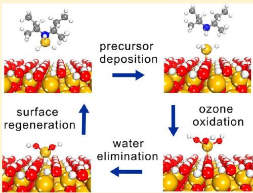

# 1. INTRODUCTION

$\mathrm{SiO}_2$  is one of the most important dielectric materials widely used in the microelectronics industry. Low- temperature deposition of  $\mathrm{SiO}_2$  thin films on semiconductor devices has been in increasing demand as the number of new applications rises rapidly and the feature sizes continue the trend of shrinkage. High optical transmittance, chemical inertness, scratch resistance, and hardness are among the essential attributes of these thin films. Conventional deposition techniques, such as chemical vapor deposition  $(\mathrm{CVD})^{4,5}$  and plasma- enhanced chemical vapor deposition (PECVD), have long been developed for dielectric layer fabrications. Unfortunately, the step coverage limitation of CVD at high temperature is bottleneck for its application in the future, especially for depositing the patterned film structures with high aspect ratios. As a consequence, thin films deposited by CVD are no longer suited for nanosized nodes with very high- aspect- ratio structures due to their intrinsic shortcomings in thickness control, uniformity, and conformality. Although PECVD can produce  $\mathrm{SiO}_2$  films at a relatively low temperature  $(< 300^{\circ}\mathrm{C})$ , it is a notoriously poor process for step coverage as the substrate can be damaged by the use of plasma, and the produced surface impurities then become detrimental to the device performance. With the continuous demand for smaller, more flexible but highly integrated devices in the electronics industry, the temperature range suitable for thin- film fabrications has become increasingly narrow. Increasingly lower temperature deposition of  $\mathrm{SiO}_2$  thin films is required for development of a damage- free deposition process on patterned film structures or heat labile substrates with excellent device integrity and performance.13- 15

For the next generation of semiconductor devices, atomic layer deposition (ALD) techniques are widely accepted to be the preferred methods for depositing  $\mathrm{SiO}_2$  thin films at temperatures lower than  $400^{\circ}\mathrm{C}$ . Thin films can be fabricated with precise thickness control, optimal large- area uniformity, and excellent conformality of the designated substrate topologies. This process has been carried out by first site- selective deposition of a silicon precursor followed by surface oxidation to produce well- controlled  $\mathrm{SiO}_2$  layers. The quality of the  $\mathrm{SiO}_2$  films is largely dictated by the physicochemical properties of the selected precursors. Recently, several novel alkylaminosilanes- based precursors, such as bis(t- butylamino)silane (BTBAS) and tris(dimethylamino)silane (TDMAS), have been studied as precursors for  $\mathrm{SiO}_2$  film deposition. For low- temperature  $\mathrm{SiO}_2$  film deposition, the performance of these precursors has been shown to be superior to silicon chloride based precursors with which an ALD process may lead to excessive particle formation and residual chlorine impurities in the fabricated films. The alkylaminosilanes- based precursors first undergo a sequential dissociative chemisorption process on the hydroxylated  $\mathrm{SiO}_2$  surface, leaving a Si atom anchored on the surface as amines are released to the gas phase. Ozone or plasma- activated oxygen is

then used to oxidize the surface intermediates to produce hydroxyl groups for subsequent deposition of the next layer.

The relative reactivity of precursor dissociative chemisorption is critical in determining the deposition temperature and the density, purity, and roughness of the thin films. A chemically active precursor allows the deposition to be carried out at a relatively low temperature. The precursor structure, to a large extent, is responsible for the quality of the films.24 In the previous studies,20,21 we investigated the dissociative chemisorption of TDMAS on the hydroxylated  $\mathrm{SiO}_2(001)$  surface and the ALD mechanisms of  $\mathrm{SiO}_2$  using BTBAS on the hydroxylated  $\mathrm{SiO}_2(001)$  surface. These precursors have been used for ALD processes of  $\mathrm{SiO}_2$  thin- film growth. It was found that a full ALD cycle using BTBAS is thermodynamically exothermic with moderate activation barriers. Given enough time to settle, the precursor will fully react with the substrate, leaving no impurities on the surface. This is in sharp contrast to the behavior of TDMAS in similar ALD processes, in which sequential dissociation can occur only up to the second step, resulting in an inherently low- density and compositionally impure  $\mathrm{SiO}_2$  film with a low deposition rate. The results demonstrate that aminosilane- based precursors for  $\mathrm{SiO}_2$  thin film fabrications should only allow up to two amino groups to be attached to the silane group in order to avoid deposition of surface impurities.

Here, we investigate the use of the monoaminosilane, di(secbutylamino)silane (DSBAS), for  $\mathrm{SiO}_2$  thin film deposition to develop a chemically more active precursor that may enable lower temperature deposition and a higher deposition rate. This molecule was proposed to be a promising precursor for low- temperature silicon oxide film deposition.27 In contrast to bis(aminosilane)- and tris(aminosilane)- based precursors, the monoaminosilane precursor containing only one amino group is expected to undergo more complete dissociative chemisorption. At the same time, the high chemical reactivity of monoaminosilane on surfaces may lead to a variety of structural arrangements upon completion of an ALD cycle. Understanding the detailed surface reaction mechanisms is thus essential for developing highly conformal, dense, and uniform  $\mathrm{SiO}_2$  thin films. In this paper, we present a theoretical study based on density functional theory, aiming to unveil the growth processes of a  $\mathrm{SiO}_2$  surface in a full ALD cycle with DSBAS as the precursor and ozone as the oxidizing agent. The reaction pathways leading to DSBAS dissociation, oxidation, and surface regeneration and the associated energetic properties are systematically investigated.

# 2. SURFACE MODEL AND COMPUTATIONAL METHOD

Normally, a deposition process starts with a  $\mathrm{SiO}_2$  surface fully hydroxylated, which facilitates the reaction of the substrate toward precursor molecules. In the present study, we focus on the growth of  $\mathrm{SiO}_2$  thin films via ALD on the fully hydroxylated  $\mathrm{SiO}_2(001)$  surface, which is the preferred orientation in amorphous silica.28 The model of the reconstructed and fully hydroxylated  $\mathrm{SiO}_2(001)$  surface was obtained from our previous work (Figure 1).20 A rectangular surface unit cell was selected with the optimized cell parameters of  $a = 17.02\mathrm{\AA}$  and  $b = 14.74\mathrm{\AA}$ . Between the slabs, an approximately  $15\mathrm{\AA}$  thick vacuum gap was inserted to avoid interactions between adjacent slabs. The supercell contained  $24\mathrm{Si}$  atoms,  $60\mathrm{O}$  atoms, and  $24\mathrm{H}$  atoms. The surface was first equilibrated prior to precursor adsorption. The main calculated structural parameters were found to be in good agreement with the experimental values and previous DFT calculations.28

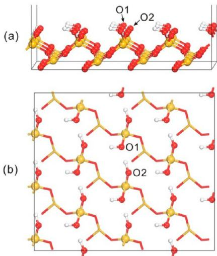  
Figure 1. Optimized structure of the hydroxylated  $\mathrm{SiO}_2(001)$  surface: a) side view and b) top view.

All calculations were performed using density functional theory (DFT) with the exchange- correlation functional proposed by Perdew and Wang.29 The projector augmented wave (PAW) method was used to describe the core electrons of atoms, and the valence orbitals were represented with a planewave basis set with a cutoff energy of  $396\mathrm{eV}$ . Electronic energies were calculated using the spin- polarization scheme with a self- consistent- field (SCF) tolerance of  $10^{- 4}\mathrm{eV}$ . Structural optimizations were performed for all atoms of the initial- , intermediate- , and final- state structures, including the adsorbates but excluding the bottom three layers of the substrate, which were kept fixed, until the total energy of the system converged to within  $10^{- 3}\mathrm{eV}$ . Allowing the atoms of three of the bottom layers to relax resulted in only marginal changes in the surface structure with the differences in bond lengths and bond angles being less than  $0.02\mathrm{\AA}$  and  $3^{\circ}$ , respectively. The overall reaction was broken into a series of elementary processes, for each of which the transition- state structure was obtained using the nudged- elastic- band (NEB) method30,31 to calculate the minimum- energy profile along the prescribed dissociation pathways with the initial and final states chosen based on the optimized structures and the number of images chosen to be six. The Brillouin- zone integration was sampled within a  $4\times 4\times 2$  Monkhorst- Pack k- point mesh,32 and electron smearing was employed using the Methfessel- Paxton technique33 with a width of  $0.1\mathrm{eV}$  to minimize the errors in the Hellmann- Feynman forces. All calculations were performed with the Vienna ab initio simulation package (VASP).34 For the analysis of atomic charges, we also employed the algorithm for Bader decomposition of charge density recently developed by Henkelman and co- workers.35,36 The Bader charges quoted in this paper include both the core charge and the integrated electron density over the atomic basin. For purpose of comparison, DFT calculations using the Perdew- Burke- Ernzerhof exchange- correlation functional37 with long- range dispersion correction based on the Grimme's scheme38 were performed for the dissociative chemisorption process of DSBAS (step a in Scheme 1). Only marginal changes in the optimized structures of the initial, transition, and final states were found. The differences in the calculated bond distances

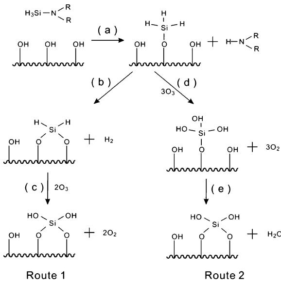  
Scheme 1. Proposed ALD Reaction Mechanisms

and bond angles are within  $0.03\mathrm{\AA}$  and  $4^{\circ}$ , respectively. Using the dispersion- corrected PBE functional, the reaction was found to be slightly less exothermic by  $0.7\mathrm{kcal / mol}$  with the calculated reaction energy of  $- 8.0\mathrm{kcal / mol}$ ; the calculated activation barrier is  $5.9\mathrm{kcal / mol}$ , slightly decreased from  $6.1\mathrm{kcal / mol}$  obtained by using the PW91 functional. The reason to use PW91 in the current study is to facilitate consistent comparison with our previous work on the relative reactivity of different silicon precursors on the same surface.20,21 Our results suggest that the chosen theoretical method and surface model are adequate.

# 3. RESULTS AND DISCUSSION

There are two types of hydroxyl groups: one is more exposed to precursor molecules (O1) and another is somewhat embedded (O2), as indicated in Figure 1, on the optimized  $\mathrm{SiO}_2(001)$  surface. The more exposed type was found previously to be more reactive than the embedded one.21 The higher electron density on O1, coupled with the high surface exposure of the atom, makes the O1 sites more accessible for electrophilic attack by precursor molecules. The optimized DSBAS molecule is shown in Figure 2. Compared with BTBAS and TDMAS, there is only one amino group in DSBAS, making the Si atom less positively charged as expected. Indeed, as the number of amino groups bonded to the Si atom decreases, the lesser is the charge withdrawn from the Si atom. The calculated Bader charge on Si in DSBAS is  $2.51\mathrm{e}$  versus  $2.82\mathrm{e}$  in TDMAS and  $2.68\mathrm{e}$  in BTBAS. In parallel, the  $\mathbb{N}$  atom of DSBAS is negatively charged  $(- 1.37\mathrm{e})$ , slightly smaller than that of TDMAS  $(- 1.42\mathrm{e})$  and BTBAS  $(- 1.56\mathrm{e})$ .

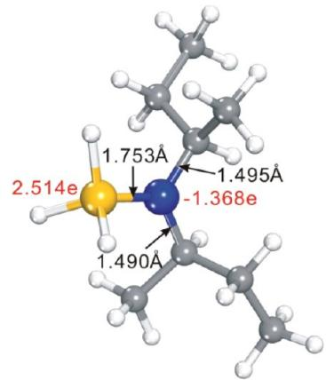  
Figure 2. Optimized structure of DSBAS.

Mechanistically, the ALD process with DSBAS on the  $\mathrm{SiO}_2(001)$  surface can be described in Scheme 1. The silicon precursor molecule first undergoes dissociative chemisorption on the hydroxylated  $\mathrm{SiO}_2(001)$  surface, resulting in the anchoring of the Si atom of the precursor on the surface and the release of amines into the gas phase. In contrast to the ALD process using BTBAS and TDMAS, a  $- \mathrm{SiH}_3$  intermediate species is formed on the surface via only one step of dissociative chemisorption of DSBAS since DSBAS is a monoaminosilane precursor. Subsequently, there are two possible reaction routes that lead to the formation of a new hydroxylated  $\mathrm{SiO}_2$  surface layer for the next reaction cycle. In route 1, the  $- \mathrm{SiH}_3$  intermediate species on the surface, formed from the dissociative chemisorption, reacts with a surface  $- \mathrm{OH}$  group to form a  $- \mathrm{SiH}_2$  species by eliminating a  $\mathrm{H}_2$  molecule into the gas phase. Subsequently, ozone is introduced to oxidize the  $- \mathrm{SiH}_2$  intermediate on the surface to form  $- \mathrm{Si(OH)}_2$  groups. Alternatively, in route 2, the  $- \mathrm{SiH}_3$  species reacts with ozone immediately upon formation on the surface to form a  $- \mathrm{Si(OH)}_3$  group. The intermediate then reacts with a surface  $- \mathrm{OH}$  group to form a  $- \mathrm{Si(OH)}_2$  group for the next ALD cycle. The reaction results in elimination of a water molecule from the surface.

3.1. DSBAS Dissociative Chemisorption. As shown in Scheme 1, step a, a DSBAS molecule on the hydroxylated  $\mathrm{SiO}_2(001)$  surface undergoes a one- step dissociative chemisorption process, leading to the formation of a  $- \mathrm{SiH}_3$  intermediate species on the surface and the elimination of a di(sec- butyl)amine (DSBA) molecule. The optimized structures of the initial, transition, and final states are shown in Figure 3, and the main structural parameters are presented in Table 1. In the initial state, DSBAS is adsorbed on the hydroxylated  $\mathrm{SiO}_2(001)$  surface through strong H- bonding between the  $\mathbb{N}$  atom of the precursor and a surface  $\mathrm{H}$  atom with the calculated adsorption energy of  $- 6.7\mathrm{kcal / mol}$ , resulting in the elongation of the  $\mathrm{Si - N}$  distance in DSBAS from  $1.753$  to  $1.786\mathrm{\AA}$ . Because the  $\mathrm{H}$  atom at the O2 site is  $\mathrm{H}$ - bonded to the  $\mathrm{O}$  atom of the O1 type, the free  $\mathrm{H}$  atom of the O1 site becomes more reactive to form a  $\mathrm{H}$ - bond with DSBAS. The structural optimization yields a  $\mathrm{N - H}$  distance of  $1.836\mathrm{\AA}$  for DSBAS, almost equivalent to that of BTBAS  $(1.854\mathrm{\AA})$  due to the similar electrostatic attraction and the steric repulsion between the bulky amine group and the surface.

As the DSBAS molecule comes into contact with the surface, the  $\mathrm{H}$  atom of the O1- type OH group migrates to the  $\mathbb{N}$  atom of the precursor, while the O1 atom simultaneously attacks the Si atom of the DSBAS molecule. Similar to the case in which BTBAS was used as the ALD precursor, this process undergoes a transition state with a loose  $\mathrm{Si - N}$  bond in the precursor and a significantly elongated  $\mathrm{O - H}$  bond on the surface. Here, a four- membered ring is formed, leading to the partial dissociation of DSBAS. As the  $\mathrm{Si - N}$  distance increases, the  $\mathrm{Si - O}$  distance is decreased from  $3.235$  to  $1.697\mathrm{\AA}$ . Consequently, a  $- \mathrm{SiH}_3$  species is adsorbed on the hydroxylated  $\mathrm{SiO}_2(001)$  surface through a strong  $\mathrm{Si - O}$  bond, and a DSBA molecule is released to the gas phase with the calculated desorption energy of  $0.8\mathrm{kcal / mol}$ . Interestingly, as the  $\mathrm{H}$  atom of the  $\mathrm{OH}$  group

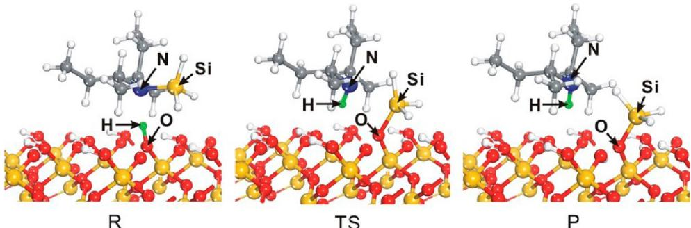  
Figure 3. Optimized initial, transition, and final structures for the dissociative chemisorption of DSBAS on the hydroxylated  $\mathrm{SiO}_2(801)$  surface. The green balls represent the migrating  $\mathrm{H}$  atom.

Table 1. Main Optimized Bond Parameters  $(\dot{\mathbf{A}})$  for the Dissociative Chemisorption of DSBAS  

<table><tr><td rowspan="2">distance label</td><td colspan="3">structure</td></tr><tr><td>R</td><td>TS</td><td>P</td></tr><tr><td>Si-N</td><td>1.786</td><td>2.647</td><td>3.617</td></tr><tr><td>N-H</td><td>1.836</td><td>1.027</td><td>1.025</td></tr><tr><td>O-H</td><td>1.021</td><td>2.418</td><td>3.167</td></tr><tr><td>Si-O</td><td>3.235</td><td>1.784</td><td>1.697</td></tr></table>

migrates to the  $\mathbb{N}$  atom of the precursor, the calculated Bader charge of the  $\mathrm{H}$  atom is reduced from 0.70 to  $0.45\mathrm{e}$ , and the Bader charge of the  $\mathbb{N}$  atom changes from  $- 1.34$  to  $- 1.09\mathrm{e}$ , reflecting the smaller electronegativity of  $\mathbb{N}$  atom than that of  $\mathrm{O}$  atom and the fact that there is more charge sharing in the  $\mathrm{N - H}$  bond than in the  $\mathrm{N - Si}$  bond. Upon the bond formation between the  $\mathrm{Si}$  atom of the precursor and the  $\mathrm{O}$  atom of the  $\mathrm{OH}$  group, the  $\mathrm{O}$  atom gains more electrons from the  $\mathrm{Si}$  atom as the Bader charge on  $\mathrm{O}$  changes from  $- 1.49$  to  $- 1.55\mathrm{e}$ , and the change on  $\mathrm{Si}$  rises from 2.49 to  $2.54\mathrm{e}$ , indicating that the charge variations on both the  $\mathrm{Si}$  atom and the  $\mathrm{O}$  atom are marginal. The corresponding energy profile of the dissociative chemisorption of DSBAS is displayed in Figure 4. The reaction is thermodynamically favorable, with the calculated surface reaction energy and overall reaction energy of  $- 8.7$  and  $- 14.6$ $\mathrm{kcal / mol}$ , respectively. The dissociative chemisorption of DSBAS is also kinetically facile with a relatively modest activation barrier of  $6.1\mathrm{kcal / mol}$ . Only a small change in the surface geometry is necessary to accommodate the dissociative chemisorption of DSBAS. Another possible transition- state structure formed by a six- membered ring involving two  $\mathrm{OH}$  surface species was also considered for the dissociative chemisorption of DSBAS. This process was found to be kinetically unfavorable with a substantially higher barrier of 44.9  $\mathrm{kcal / mol}$  due to the large separation between the two adjacent  $\mathrm{OH}$  surface species and the requirement to transfer the  $\mathrm{H}$  atom from the O2- type  $\mathrm{OH}$  group to the O1 atom in the transition- state structure.

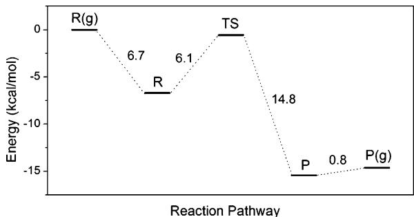  
Figure 4. Calculated potential energy profiles for the dissociative chemisorption of DSBAS.

3.2. Route 1: Reaction between the  $- \mathrm{SiH}_3$  Intermediate with the Surface  $- \mathrm{OH}$  Group followed by Oxidation. To grow a denser and purer  $\mathrm{SiO}_2$  film via ALD, the  $- \mathrm{SiH}_3$  intermediate species on the surface could react with a surface  $- \mathrm{OH}$  group to form a  $- \mathrm{SiH}_2$  group. There are three different types of surface  $- \mathrm{OH}$  groups of O2 type in the proximity of the  $- \mathrm{SiH}_3$  intermediate as indicated in Figure 5. Therefore, the reaction may proceed along three reaction pathways. Mechanistically, the reactive processes are similar to each other with the  $\mathrm{Si}$  atom of the  $- \mathrm{SiH}_3$  species attacking the negatively charged  $\mathrm{O}$  atom of the surface  $- \mathrm{OH}$  group, producing a surface  $- \mathrm{SiH}_2$  species and a  $\mathrm{H}_2$  molecule in the gas phase. However, different reaction pathways lead to different surface morphologies, which were examined via minimum- energy calculations.

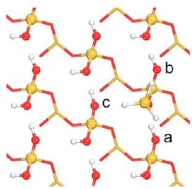  
Figure 5. Three different types of surface  $-\mathrm{OH}$  groups of O2 type in the proximity of the  $-\mathrm{SiH}_3$ .

First, the  $- \mathrm{SiH}_3$  intermediate species may react with an adjacent  $\mathrm{OH}$  group (labeled "a" in Figure 5) to form an  $\mathrm{O} - \mathrm{SiH}_2 - \mathrm{O}$  species to maintain its original surface orientation and allow the  $\mathrm{SiO}_2$  film to continue its crystalline growth. The optimized structures of the initial, transition, and final states are shown in Figure 6 (path a). The calculated main structural parameters are summarized in Table 2. Here, the  $\mathrm{Si}$  atom of the  $- \mathrm{SiH}_3$  species attacks the  $\mathrm{O}$  atom of the adjacent  $\mathrm{OH}$  group, while the  $\mathrm{H}^a$  atom of the same  $\mathrm{OH}$  group tilts toward the  $- \mathrm{SiH}_3$  species to form a  $\mathrm{H}_2$  molecule. This reaction undergoes a transition state involving a loose  $\mathrm{Si} - \mathrm{H}$  bond from  $- \mathrm{SiH}_3$  species and a significantly weakened  $\mathrm{O} - \mathrm{H}^a$  bond on the surface. The calculated  $\mathrm{Si} - \mathrm{O}$  distance is  $2.208\mathrm{\AA}$  at the transition state, significantly longer than its equilibrium distance

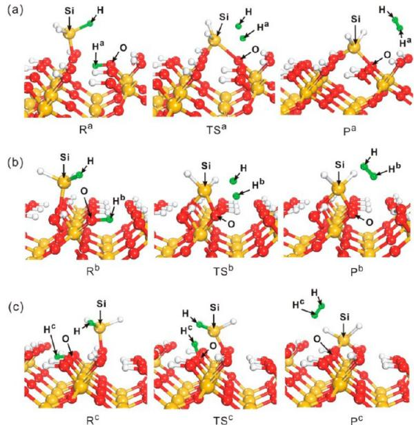  
Figure 6. Optimized initial, transition, and final structures for the reaction between  $-\mathrm{SiH}_3$  species and surface  $-\mathrm{OH}$  group: (a) path a, (b) path b, and (c) path c. The green balls represent the migrating  $\mathrm{H}$  atom.

Table 2. Main Optimized Bond Parameters  $(\dot{\mathbf{A}})$  for the Reaction between  $-\mathrm{SiH}_3$  Species and Surface  $-\mathrm{OH}$  Group  

<table><tr><td rowspan="2">distance label</td><td colspan="3">Path a</td></tr><tr><td>R</td><td>TSa</td><td>Pb</td></tr><tr><td>Si-H</td><td>1.484</td><td>1.780</td><td>3.060</td></tr><tr><td>Si-O</td><td>3.359</td><td>2.208</td><td>1.648</td></tr><tr><td>O-Ha</td><td>0.994</td><td>1.467</td><td>2.956</td></tr><tr><td>Ha-H</td><td>2.745</td><td>0.856</td><td>0.751</td></tr><tr><td colspan="4">Path b</td></tr><tr><td>distance label</td><td>Rb</td><td>TSb</td><td>Pb</td></tr><tr><td>Si-H</td><td>1.483</td><td>1.910</td><td>3.027</td></tr><tr><td>Si-O</td><td>3.220</td><td>1.732</td><td>1.699</td></tr><tr><td>O-Hb</td><td>1.005</td><td>1.574</td><td>2.823</td></tr><tr><td>Hb-H</td><td>3.087</td><td>0.848</td><td>0.754</td></tr><tr><td colspan="4">Path c</td></tr><tr><td>distance label</td><td>Rc</td><td>TSc</td><td>Pc</td></tr><tr><td>Si-H</td><td>1.484</td><td>1.541</td><td>3.151</td></tr><tr><td>Si-O</td><td>4.022</td><td>2.607</td><td>1.679</td></tr><tr><td>O-Hs</td><td>1.003</td><td>0.991</td><td>2.843</td></tr><tr><td>Hs-H</td><td>3.364</td><td>1.443</td><td>0.750</td></tr></table>

of  $1.648\mathrm{\AA}$  at the final state. A four- membered ring is formed, leading to the formation of a  $- \mathrm{SiH}_2$  species on the  $\mathrm{SiO}_2(001)$  surface and the release of a  $\mathrm{H}_{2}$  molecule. This reaction gives rise to only a slight relaxation in the surface geometry with the formation of hydrogen bonding around the  $- \mathrm{SiH}_2$  species. The optimized  $\mathrm{Si - O - Si}$  and  $\mathrm{O - Si - O}$  angles in the top surface layer are  $153.6^{\circ}$  and  $106.3^{\circ}$  respectively, close to the corresponding values in  $\mathrm{SiO}_2$  single crystal  $(143.0^{\circ}$  and  $109.8^{\circ}$  respectively). The association of the Si atom with the adjacent OH group allows the film to grow with the (001) surface orientation, which lowers the surface tension. Indeed, the calculated thermochemical energy of  $- 18.0\mathrm{kcal / mol}$  indicates that the reaction is thermodynamically favorable. However, this process is kinetically unfavorable with the calculated activation energy of  $36.8\mathrm{kcal / mol}$  . Structurally, the high activation barrier is mainly attributed to the long initial  $\mathrm{Si - O}$  distance between the  $- \mathrm{SiH}_3$  species and the surface OH species.

Alternatively, the surface  $- \mathrm{SiH}_3$  species can also undergo a second route along which reaction occurs between the  $- \mathrm{SiH}_3$  species and the OH group (labeled "b" in Figure 5) that resides on the same substrate Si atom. The optimized structures of the initial, transition, and final states are shown in Figure 6 (path b). This bonding configuration represents a deviation from the (001) orientation of the  $\mathrm{SiO}_2$  substrate since the (001) crystalline surface requires the O atoms that form bonds with a Si atom come from closest neighboring Si atoms. As a consequence, this type of bonding network leads to the growth of a disordered  $\mathrm{SiO}_2$  film. The main optimized structural parameters are listed in Table 2. Similarly to the case of path a, the transition- state structure along path b  $(\mathrm{TS}^{\mathrm{b}})$  consists of a four- membered ring with a  $\mathrm{Si - O}$  distance of  $1.736\mathrm{\AA}$ , which is shorter than the analogous distance along path a  $(2.208\mathrm{\AA})$ . This process may seemingly be easier than path a. However, the calculated activation barrier of  $37.1\mathrm{kcal / mol}$  is slightly higher than the value of path a  $(36.8\mathrm{kcal / mol})$ . We note that after the reaction, a four- membered ring is formed with an unusually short  $\mathrm{Si - Si}$  distance of  $2.409\mathrm{\AA}$ . As a consequence, the structure of the final product  $(\mathrm{P}^{\mathrm{b}})$  exhibits a strong geometric strain with the  $\mathrm{O - Si - O}$  angle of  $88.5^{\circ}$ , which deviates significantly from the typical angle of  $109.8^{\circ}$  expected for  $\mathrm{sp}^3$  hybridization. The highly stressed optimized structure indicates that the structure may not be as stable as the structure produced in path a (Figure 6b). Indeed, this process was found to be modestly endothermic with the reaction energy of  $0.2\mathrm{kcal / mol}$ . It is interesting to note that despite the strong stress of the local bonding environment, only slight surface relaxation was found in the remaining part of the surface with the formation of hydrogen bonding around the  $- \mathrm{SiH}_2$  species.

In the third reaction pathway, the  $- \mathrm{SiH}_3$  species reacts with the neighboring surface OH group (labeled "c" in Figure 5) to grow a disordered  $\mathrm{SiO}_2$  film. The optimized structures of the initial, transition, and final states are shown in Figure 6 (path c). The main optimized structural parameters are displayed in Table 2. Compared with the transition state structures in path a and path b, the  $\mathrm{Si - O}$  distance  $(2.607\mathrm{\AA})$  at the transition state is much longer, which arises from the longer  $\mathrm{Si - O}$  distance  $(4.022\mathrm{\AA})$  in the initial state. This leads to a more unfavorable kinetic process for the elimination of  $\mathrm{H}_2$  molecule. Indeed, the calculated activation energy of path c is considerably higher than the values along the paths a and b  $(41.9$  versus  $36.8$  and  $37.1\mathrm{kcal / mol})$ , as shown in Figure 7. Thermodynamically, this process is moderately endothermic with the calculated reaction energy of  $10.3\mathrm{kcal / mol}$ . The structure of the final product  $(\mathrm{P}^{\mathrm{c}})$  exhibits a modest geometric strain with the  $\mathrm{O - Si - O}$  angle of  $117.1^{\circ}$ , which deviates slightly from the typical angle of  $109.8^{\circ}$  expected for  $\mathrm{sp}^3$  hybridization. The calculated  $\mathrm{Si - O}$  distance is  $1.679\mathrm{\AA}$  in the final state, significantly longer than the corresponding values in  $\mathrm{SiO}_2$  single crystal  $(1.610\mathrm{\AA})$ . Again, this reaction gives rise to only a slight relaxation in the surface geometry with the formation of hydrogen bonding around the  $- \mathrm{SiH}_2$  species.

We proceeded further to exam the oxidation reaction (step c in Scheme 1) with ozone to convert the surface  $- \mathrm{SiH}_2$  species

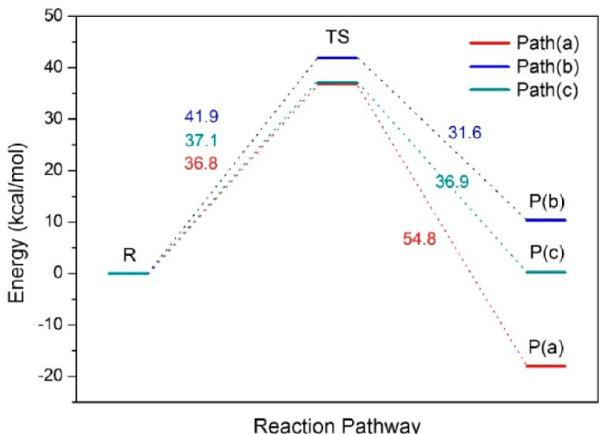  
Figure 7. Calculated potential energy profiles for the reaction between  $-\mathrm{SiH}_3$  species and surface  $-\mathrm{OH}$  group.

to form  $- \mathrm{Si(OH)}_2$  groups for the subsequent reaction cycle, as shown in Scheme 1, step c. As expected, the reaction turns out to be highly favorable both thermodynamically and kinetically. The detailed results were published previously.20 Here, we list only the main calculated data in Table 3. Our studies on the reaction suggest that the surface reaction between the  $- \mathrm{SiH}_3$  species and the adjacent surface hydroxyl group to eliminate  $\mathrm{H}_2$  is the rate- limiting step along the three minimum- energy pathways. However, none of the prescribed pathways is kinetically feasible for low- temperature deposition of  $\mathrm{SiO}_2$  films with an activation barrier of at least  $36.8 \mathrm{kcal / mol}$ . We thus conclude that kinetically it is highly difficult to eliminate a  $\mathrm{H}_2$  molecule upon anchoring a  $- \mathrm{SiH}_3$  species on the surface.

Table 3. Main Calculated Energy Data  $(\mathrm{kcal / mol})$  For the Oxidation Reaction of Surface  $-\mathrm{SiH}_2$  

<table><tr><td></td><td>reaction energy</td><td>activation barrier</td></tr><tr><td>step1</td><td>-86.4</td><td>17.7</td></tr><tr><td>step2</td><td>-85.5</td><td>15.4</td></tr></table>

3.3. Route 2: Oxidation of  $- \mathrm{SiH}_3$  Followed by Water Elimination. An alternative reaction route relates to the conversion of the  $- \mathrm{SiH}_3$  intermediate into the  $- \mathrm{Si(OH)}_3$  surface species via oxidation by ozone, which subsequently undergoes a condensation reaction with the surface hydroxyl groups to eliminate water molecules. The oxidation process includes three sequential reaction steps, each of which turns out to be similar to each other with one O atom of the ozone molecule attacking the positively charged Si atom of the surface  $- \mathrm{SiH}_3$  species. The reaction leads to formation of a new surface  $\mathrm{Si - OH}$  species and the elimination of an  $\mathrm{O}_2$  molecule from ozone.

The calculated structures of the initial, transition, and final states of the three sequential reaction steps are shown in Figure 8, and the main optimized bond parameters are listed in Table 4. In the first step (Figure 8a), both the  $\mathrm{Si - H}$  bond and the  $\mathrm{O}^{\mathrm{b}} - \mathrm{O}^{\mathrm{c}}$  bond are slightly weakened as the  $\mathrm{O}_3$  molecule approaches the Si atom with a decreased  $\mathrm{Si - O}^{\mathrm{c}}$  distance. A triangular structure is then formed at the transition state  $\mathrm{O}^{\mathrm{c}} - \mathrm{Si - H}$  to minimize the activation energy. At the final state, both the  $\mathrm{Si - H}$  bond and the  $\mathrm{O}^{\mathrm{b}} - \mathrm{O}^{\mathrm{c}}$  bond become broken, leading to the formation of a  $- \mathrm{H}_2\mathrm{Si - OH}$  species and the release of an  $\mathrm{O}_2$  molecule. We note that the ground electronic states of  $\mathrm{O}_3$  and  $\mathrm{O}_2$  are singlet and triplet, respectively. As the reaction proceeds, the ground state of the reactant (R1) changes from a singlet state to a triplet state of the product (P1). At the transition state, the  $\mathrm{O}_2$  molecule is not fully formed as it still maintains a significantly elongated bond with the  $\mathrm{O}^{\mathrm{c}}$  atom. As a consequence, the ground electronic state of the transition structure remains to be singlet. As expected, the oxidation process is strongly exothermic with a thermochemical energy of  $109.3 \mathrm{kcal / mol}$  and a modest activation barrier of  $12.7 \mathrm{kcal / mol}$  (Figure 9).

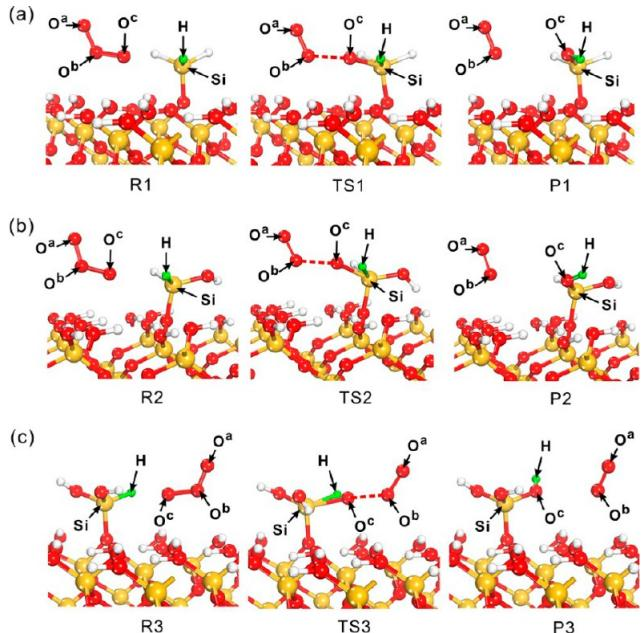  
Figure 8. Optimized initial, transition, and final structures for the sequential oxidation process of the  $-\mathrm{SiH}_3$  species: (a) step 1, (b) step 2, and (c) step 3.

Table 4. Main Optimized Bond Parameters  $(\dot{A})$  for the Oxidation Process of the  $-\mathrm{SiH}_3$  Species  

<table><tr><td rowspan="2">distance label</td><td colspan="3">Step 1</td></tr><tr><td>R1</td><td>TS1</td><td>P1</td></tr><tr><td>Ob-Oc</td><td>1.293</td><td>1.395</td><td>3.207</td></tr><tr><td>Oc-Si</td><td>3.035</td><td>2.272</td><td>1.638</td></tr><tr><td>Si-H</td><td>1.480</td><td>1.513</td><td>2.295</td></tr><tr><td>H-Oc</td><td>2.598</td><td>1.958</td><td>0.972</td></tr><tr><td rowspan="2">distance label</td><td colspan="3">Step 2</td></tr><tr><td>R2</td><td>TS2</td><td>P2</td></tr><tr><td>Ob-Oc</td><td>1.299</td><td>1.347</td><td>3.161</td></tr><tr><td>Oc-Si</td><td>2.983</td><td>2.116</td><td>1.634</td></tr><tr><td>Si-H</td><td>1.482</td><td>1.503</td><td>2.262</td></tr><tr><td>H-Oc</td><td>2.513</td><td>2.054</td><td>0.971</td></tr><tr><td rowspan="2">distance label</td><td colspan="3">Step 3</td></tr><tr><td>R3</td><td>TS3</td><td>P3</td></tr><tr><td>Ob-Oc</td><td>1.298</td><td>1.328</td><td>3.668</td></tr><tr><td>Oc-Si</td><td>3.230</td><td>2.324</td><td>1.638</td></tr><tr><td>Si-H</td><td>1.476</td><td>1.521</td><td>2.239</td></tr><tr><td>H-Oc</td><td>2.708</td><td>1.908</td><td>0.969</td></tr></table>

A similar oxidation reaction with  $\mathrm{O}_2$  subsequently takes place to convert the second  $\mathrm{Si - H}$  bond to form a  $- \mathrm{HSi(OH)}_2$

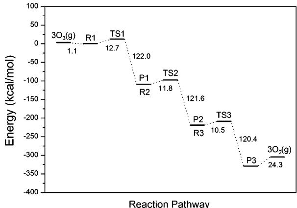  
Figure 9. Calculated energy diagram for the oxidation process of the  $-\mathrm{SiH}_3$  species.

species. At the transition state (Figure 8b), the OH group on the Si atom formed from the first step forms a hydrogen bond with a neighboring surface  $- \mathrm{OH}$  group with the calculated distance of  $2.115\mathrm{\AA}$ . The H- bonding effectively lowers the activation barrier by  $0.9\mathrm{kcal / mol}$  compared to the value in the first oxidation step. The change of spin states from R2 to P2 via TS2 is the same as the case of the first oxidation step. Again, the process is strongly exothermic with the calculated thermochemical energy of  $109.8\mathrm{kcal / mol}$ . The calculated activation energy of  $11.8\mathrm{kcal / mol}$  is slightly lower than the value for the first oxidation step.

The process to oxidize the third  $\mathrm{Si - H}$  bond to form a  $- \mathrm{Si(OH)}_3$  group is virtually identical to the reactions discussed above. The optimized initial, transition state, and final structures are shown in Figure 8c. We note that the calculated  $\mathrm{Si - O^c}$  distance  $(3.230\mathrm{\AA})$  in the initial state is considerably longer than the values in step 1 and step 2 because the OH groups formed in the first two steps prevent the ozone molecule from getting closer to the target Si atom. Nevertheless, the formation of more hydrogen bonds leads to a slightly lower activation barrier of  $10.5\mathrm{kcal / mol}$  than the corresponding values in the first two steps. The reaction is strongly exothermic with the calculated thermochemical energy of  $- 109.9\mathrm{kcal / mol}$ . Again, the ground electronic states of R3 and TS3 remain to be singlet, while the ground state of the final product P3 is triplet.

The calculated energy diagram for the entire oxidation process of the  $- \mathrm{SiH}_3$  species is displayed in Figure 9. Our results indicate that the reaction is inherently a facile process with highly exothermic thermochemical energies and modest activation barriers. Therefore, conversion from  $- \mathrm{SiH}_3$  into  $- \mathrm{Si(OH)}_3$  with ozone is expected to be rather complete at a relatively low temperature. In a previous study,  ${}^{39}\mathrm{O}_3$  reaction with  $\mathrm{Si - H}$  bonds on  $\mathrm{Si(001)}$  surface was explored by Fink and Jenkins using molecular dynamics simulations. They proposed a different reaction mechanism in which ozone first abstracts a hydrogen atom to form a hydrotroxy radical  $(\mathrm{HO}_3^*)$  followed by dissociation of the radical into a surface hydroxyl  $(- \mathrm{OH})$  species and a gas phase  $\mathrm{O}_2$  molecule. While this route may represent one of numerous possibilities of the reaction between the surface  $\mathrm{Si - H}$  bonds and the  $\mathrm{O}_3$  molecules at finite temperature, both reaction routes suggest that the conversion from a  $\mathrm{Si - H}$  bond to a  $\mathrm{Si - OH}$  bond via oxidation by ozone is energetically favorable.

To recover the hydroxylated  $\mathrm{SiO}_2(001)$  surface for the next cycle of the ALD process, the  $- \mathrm{Si(OH)}_3$  species on the surface must undergo a condensation reaction with the adjacent surface  $- \mathrm{OH}$  groups to eliminate water molecules from the surface. Similarly to the  $- \mathrm{SiH}_3$  intermediate species, there are three different types of surface  $- \mathrm{OH}$  groups of  $\mathrm{O}_2$  type in the proximity of the  $- \mathrm{Si(OH)}_3$  species, as indicated in Figure 10.

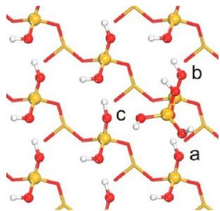  
Figure 10. Three different types of surface  $-\mathrm{OH}$  groups of  $\mathrm{O}_2$  type in the proximity of the  $-\mathrm{Si(OH)}_3$ .

Consequently, the condensation reaction may occur along three pathways. As expected, regardless of which path, the reactive events turn out to be similar to each other with the Si atom of the  $- \mathrm{Si(OH)}_3$  species attacking the negatively charged  $\mathrm{O}$  atom of the surface  $- \mathrm{OH}$  groups. This results in formation of a surface  $- \mathrm{Si(OH)}_2$  species and elimination of a  $\mathrm{H}_2\mathrm{O}$  molecule.

In the first path, the  $- \mathrm{Si(OH)}_3$  intermediate reacts with the adjacent  $\mathrm{O}^a\mathrm{H}$ , which enables the film to grow along the original crystalline surface orientation (Figure 11, path a), to form an  $\mathrm{O - Si(OH)}_2\mathrm{- O}$  species. The calculated main structural parameters are summarized in Table 5. Here, the Si atom of the  $- \mathrm{Si(OH)}_3$  species attacks the  $\mathrm{O}^a$  atom, while the H atom of the same OH group diffuses to the  $\mathrm{O}$  atom of the  $- \mathrm{Si(OH)}_3$  species, leading to the elimination of a  $\mathrm{H}_2\mathrm{O}$  molecule. This reaction undergoes a transition state involving a weakened  $\mathrm{Si - }$

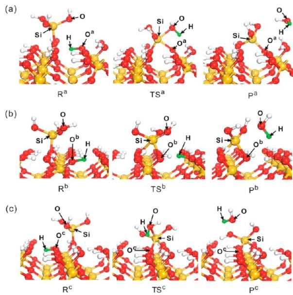  
Figure 11. Optimized initial, transition, and final structures for the reaction between  $-\mathrm{Si(OH)}_3$  species and surface  $-\mathrm{OH}$  group: (a) path a, (b) path b, and (c) path c. The green balls represent the migrating H atom.

Table 5. Main Optimized Bond Parameters  $(\dot{\mathbf{A}})$  for the Reaction between  $-\mathrm{Si(OH)}_3$  Species and Surface  $-\mathrm{OH}$  Group  

<table><tr><td rowspan="2">distance label</td><td colspan="3">Path a</td></tr><tr><td>Ra</td><td>TSa</td><td>Pa</td></tr><tr><td>O-Si</td><td>1.639</td><td>1.869</td><td>3.726</td></tr><tr><td>Si-Oa</td><td>3.364</td><td>1.860</td><td>1.628</td></tr><tr><td>Oa-H</td><td>0.984</td><td>1.810</td><td>3.474</td></tr><tr><td>H-O</td><td>2.815</td><td>0.996</td><td>0.974</td></tr><tr><td rowspan="2">distance label</td><td colspan="3">Path b</td></tr><tr><td>Rb</td><td>TSb</td><td>Pb</td></tr><tr><td>O-Si</td><td>1.639</td><td>1.712</td><td>3.078</td></tr><tr><td>Si-Ob</td><td>3.389</td><td>1.752</td><td>1.713</td></tr><tr><td>Ob-H</td><td>1.002</td><td>1.589</td><td>2.829</td></tr><tr><td>H-O</td><td>3.219</td><td>2.169</td><td>0.997</td></tr><tr><td rowspan="2">distance label</td><td colspan="3">Path c</td></tr><tr><td>Rc</td><td>TSc</td><td>Pc</td></tr><tr><td>O-Si</td><td>1.633</td><td>2.020</td><td>3.341</td></tr><tr><td>Si-Oc</td><td>4.123</td><td>1.808</td><td>1.697</td></tr><tr><td>Oc-H</td><td>0.999</td><td>1.850</td><td>3.252</td></tr><tr><td>H-O</td><td>3.296</td><td>0.989</td><td>0.974</td></tr></table>

O bond in the  $- \mathrm{Si(OH)}_3$  species and a significantly elongated  $\mathrm{O^{a} - H}$  bond on the surface. Indeed, the calculated  $\mathrm{Si - O^a}$  distance of  $1.860\mathrm{\AA}$  at the transition state is considerably longer than its equilibrium distance of  $1.628\mathrm{\AA}$  at the final state. A four- membered ring structure is formed. This reaction gives rise to only a slight relaxation in the surface geometry with the formation of hydrogen bonding in the proximity of the  $- \mathrm{Si(OH)}_2$  species. At the final product state, the optimized  $\mathrm{Si - }$ $\mathrm{O - Si}$  and  $\mathrm{O - Si - O}$  angles in the top surface layer are  $147.4^{\circ}$  and  $106.9^{\circ}$  respectively, very close to the corresponding values in the  $\mathrm{SiO}_2$  single- crystal structure  $143.0^{\circ}$  and  $109.8^{\circ}$  respectively). The association of the Si atom with the adjacent OH group allows the film to grow with the (001) surface orientation, which lowers the surface tension. Indeed, the calculated thermochemical energy of  $- 10.2\mathrm{kcal / mol}$  indicates that the reaction is thermodynamically favorable. Kinetically, this process is also more favorable than the reaction between the  $- \mathrm{SiH}_3$  species and a neighboring surface hydroxyl species, which eliminates a  $\mathrm{H}_{2}$  molecule from the surface. The calculated activation energy is  $20.8\mathrm{kcal / mol}$

In the second path, the  $- \mathrm{Si(OH)}_3$  species undergoes a reaction with the surface  $- \mathrm{OH}$  group residing on the same substrate Si atom, as depicted in Figure 11 (path b). This type of bonding network leads to the growth of a disordered  $\mathrm{SiO}_2$  film, since this bonding configuration represents a deviation from the (001) orientation of the  $\mathrm{SiO}_2$  substrate. The main optimized structural parameters are listed in Table 5. At the transition state, the distance of the  $\mathrm{Si - O^b}$  bond is  $1.752\mathrm{\AA},$  slightly shorter than the analogous distance along path a (1.860  $\mathrm{\AA}$  ). Interestingly, a hydrogen bond with a length of  $1.057\mathrm{\AA}$  is formed between the  $\mathrm{H}$  atom migrating from the surface OH group and its adjacent OH group in the transition state. The reaction gives rise to a four- membered ring in the product structure with an unusually short  $\mathrm{Si - Si}$  distance of  $2.624\mathrm{\AA}$  As a consequence, the structure of the final product  $(\mathrm{P^b})$  exhibits a strong geometric strain with the  $\mathrm{O - Si - O}$  angle of  $87.5^{\circ}$  which deviates significantly from the typical angle of  $109.8^{\circ}$  expected for  $\mathfrak{sp}^3$  hybridization. The highly stressed optimized structure indicates that the structure  $(\mathrm{P^b})$  may be thermochemically unstable. Indeed, in contrast to path a, this process was found to be moderately endothermic with the reaction energy of 7.3  $\mathrm{kcal / mol;}$  the calculated activation barrier of  $30.0\mathrm{kcal / mol}$  is also significantly higher than the value of path a. Despite the high geometric stress at the reaction site, only slight relaxation was found in the remaining part of the surface with the formation of hydrogen bonding around the  $- \mathrm{Si(OH)}_2$  species.

In the third pathway, a reaction between the  $- \mathrm{Si(OH)}_3$  species and the third hydroxyl group  $(- \mathrm{OH})$  occurs to grow a disordered  $\mathrm{SiO}_2$  layer, as shown in Figure 11 (path c). The main optimized structural parameters are listed in Table 5. Compared with the case in path a and path b, the  $\mathrm{Si - O}$  distance  $(4.123\mathrm{\AA})$  of the initial state structure is much longer, making the process kinetically more difficult. Indeed, the calculated activation energy of path c is the highest among the three paths considered  $(34.5\mathrm{kcal / mol}$  versus  $20.8\mathrm{kcal / mol}$  for path a and  $30.0\mathrm{kcal / mol}$  for path b), as shown in Figure 12. In

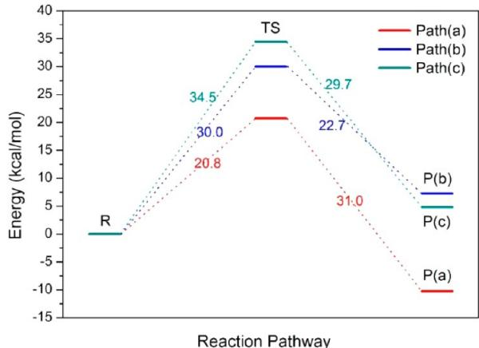  
Figure 12. Calculated potential energy profiles for the reaction between  $-\mathrm{Si(OH)}_3$  species and surface  $-\mathrm{OH}$  group.

addition, this process was found to be modestly endothermic with a reaction energy of  $4.8\mathrm{kcal / mol}$  The structure of the final product  $(\mathrm{P^c})$  exhibits a slight geometric strain with the  $\mathrm{O - }$ $\mathrm{Si - O}$  angle of  $117.7^{\circ}$  which deviates modestly from the optimal angle of  $109.8^{\circ}$  for an  $\mathfrak{sp}^3$  configuration. The calculated  $\mathrm{Si - O}$  distance of  $1.678\mathrm{\AA}$  at the final state is considerably longer than the corresponding values in the  $\mathrm{SiO}_2$  single- crystal structure  $(1.610\mathrm{\AA})$  . Similar to the case in path a and path b, hydrogen bonding dictates the structure near the reactive site while surface relaxation is essentially marginal.

Combining the results of the extensive search for minimum- energy pathways that lead to the completion of a full ALD cycle for growing a  $\mathrm{SiO}_2$  layer on the  $\mathrm{SiO}_2(001)$  surface with DSBAS as the Si precursor and ozone as the oxidation agent, we show in Figure 13 the calculated energy diagram. It is clear that the ALD process is initiated by the dissociative chemisorption of DSBAS, which is both thermochemically and kinetically facile. Elimination of  $\mathrm{H}_2$  through reaction between the resultant  $- \mathrm{SiH}_3$  species and a nearby surface hydroxyl group is kinetically prohibitive. Thus, further reactions along this pathway can be essentially ruled out. The oxidation reaction with ozone converts the  $- \mathrm{SiH}_3$  species into a  $- \mathrm{Si(OH)}_3$  species. The sequential oxidation processes are highly exothermic with only

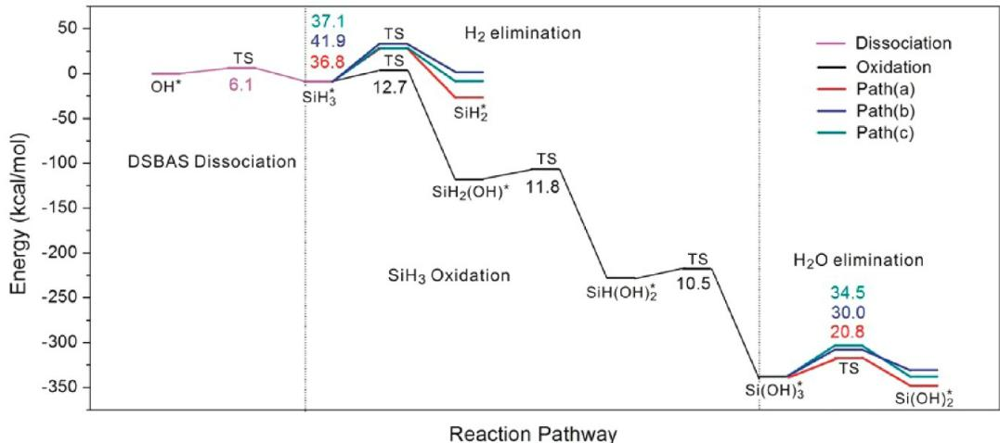  
Figure 13. Calculated potential energy profiles of the whole reaction.

moderate activation barriers as expected. Although there are three possible pathways for the  $- \mathrm{Si(OH)}_3$  species to react with the adjacent surface hydroxyl groups, only one of them is both thermodynamically and kinetically favorable, which leads to growing a  $\mathrm{SiO}_2$  thin film in a crystalline structure. This ensures the thin film deposited with DSBAS and ozone to be dense and conformal.

# 4. SUMMARY

An understanding of the detailed reaction mechanisms between precursors and the substrate is essential for growing dense and conformal  $\mathrm{SiO}_2$  thin films. In the present study, we employed density functional theory to systematically explore the energy landscape of a full ALD cycle to grow a layer of  $\mathrm{SiO}_2$  on the hydroxylated  $\mathrm{SiO}_2(001)$  surface using DSBAS as the precursor and ozone as the oxidizing agent. The ALD cycle was broken into a series of elementary processes, for each of which the surface structure and the associated thermodynamic and kinetic energies were calculated.

Our results indicate that the dissociative chemisorption of DSBAS is kinetically facile, with only a modest activation barrier of  $6.1\mathrm{kcal / mol}$ , suggesting that DSBAS is a promising silicon precursor with strong chemical reactivity toward a hydroxyl species. This is potentially useful for design of a low- temperature ALD process to fabricate  $\mathrm{SiO}_2$  thin films. We subsequently examined two possible reaction routes for the surface  $- \mathrm{SiH}_3$  intermediate species to further react with various surface species upon ozone oxidation. In the first route, the  $- \mathrm{SiH}_3$  species undergoes a reaction with a surface  $- \mathrm{OH}$  group to produce a  $- \mathrm{SiH}_2$  species and eliminate a  $\mathrm{H}_2$  molecule from the surface followed by oxidation with ozone to yield a  $- \mathrm{Si(OH)}_2$  species. The first step for  $\mathrm{H}_2$  removal and  $- \mathrm{SiH}_2$  formation was found to be kinetically difficult with the calculated activation barrier of at least  $36.8\mathrm{kcal / mol}$ , although oxidation with ozone is inherently facile. An alternative route, in which the  $- \mathrm{SiH}_3$  species is first oxidized by ozone followed by condensation to eliminate a water molecule from the surface, was then explored. The three sequential oxidation steps, which lead to formation of a  $- \mathrm{Si(OH)}_3$  species on the surface, are all highly exothermic with the calculated activation barriers lower than  $12.7\mathrm{kcal / mol}$ . Subsequently, three possible pathways for the reaction between the  $- \mathrm{Si(OH)}_3$  species and the neighboring surface hydroxyl groups were investigated. The path that leads to the growth of the  $\mathrm{SiO}_2$  layer with the  $\mathrm{SiO}_2$  crystalline morphology was identified to be both thermodynamically and kinetically preferred. This is important for growing dense and conformal  $\mathrm{SiO}_2$  thin films. The entire ALD cycle was found to be highly exothermic largely due to the strong oxidation by ozone.

crystalline morphology was identified to be both thermodynamically and kinetically preferred. This is important for growing dense and conformal  $\mathrm{SiO}_2$  thin films. The entire ALD cycle was found to be highly exothermic largely due to the strong oxidation by ozone.

Compared with the two well- known silicon precursors, BTBAS and TDMAS, monoaminosaline- based precursors such as DSBAS display unique properties well- suited for  $\mathrm{SiO}_2$  thin- film deposition. The chemical reactivity toward the surface hydroxyl groups is sufficiently high with favorable kinetics, partly due to the high exposure of the  $- \mathrm{SiH}_3$  functional group in the precursors. Once the  $- \mathrm{SiH}_3$  species is anchored on the surface, it should be chemically stable in an environment free of oxidizing agents. Upon oxidation, there is virtually only one reaction pathway which leads to the crystalline growth of a  $\mathrm{SiO}_2$  layer. As a consequence, the film is dense, conformal, and free of impurities.

# AUTHOR INFORMATION

# Corresponding Authors

$^*\mathrm{E}$  mail: hanbo@cug.edu.cn.  $^*\mathrm{E}$  mail: chmch@nus.edu.sg

# Notes

The authors declare no competing financial interest.

# ACKNOWLEDGMENTS

We gratefully acknowledge support of the research by a NUS start- up grant, a Singapore National Research Foundation POC grant, and the Singapore- Peking- Oxford Research Enterprise, COY- 15- EWI- RCFSA/N197- 1. Supports from the National Natural Science Foundation of China (No. 20873127, 21203169, and 21233006), Air Products and Chemicals, and the Fundamental Research Funds for the Central Universities, China University of Geosciences are also gratefully acknowledged.

# REFERENCES

1) Kirkpatrick, C. J.; Lee, B.; Suri, R.; Yang, X.; Misra, V. Atomic Layer Deposition of  $\mathrm{SiO}_2$  for AlGaN/GaN MOS-HFETs. IEEE Electron Device Lett. 2012, 33 (9), 1240-1242. 
2) Dingemans, G.; van Helvoirt, C. A. A.; Pierreux, D.; Keuning, W.; Kessels, W. M. M. Plasma-Assisted ALD for the Conformal Deposition of  $\mathrm{SiO}_2$ : Process, Material and Electronic Properties. J. Electrochem. Soc. 2012, 159 (3), H277-H285.

(3) Kasih, T. P.; Kuroda, S. I.; Kubota, H. A Nonequilibrium, Atmospheric-Pressure Argon Plasma Torch for Deposition of Thin Silicon Dioxide Films. Chem. Vap. Deposition 2007, 13 (4), 169-175. 
(4) Kubota, Y.; Matsumoto, T.; Imai, S.; Yamada, M.; Tsuji, H.; Taniguchi, K.; Terakawa, S.; Kobayashi, H. Submicrometer UltralowPower TFT with  $1.8~\mathrm{nm}$  NAOS  $\mathrm{SiO}_2 / 20$  nm CVD  $\mathrm{SiO}_2$  Gate Stack Structure. IEEE Trans. Electron Devices 2011, 58 (4), 1134-1140. 
(5) Ritala, H.; Kihamakki, J.; Puukilainen, E. Correlation Between Film Properties and Anhydrous HF Vapor Etching Behavior of Silicon Oxide Deposited by CVD Methods. J. Electrochem. Soc. 2011, 158 (6), D399-D402. 
(6) Jin, S. B.; Choi, Y. S.; Kim, Y. J.; Choi, I. S.; Han, J. G. Effect of RF Bias (Ion Current Density) on the Hardness of Amorphous Silicon Oxide Films Deposited by Plasma Enhanced Chemical Vapor Deposition. Surf. Coat. Technol. 2010, 205 (1), S139-S143. 
(7) Kakiuchi, H.; Ohmi, H.; Yamaguchi, Y.; Nakamura, K.; Yasutake, K. Low Refractive Index Silicon Oxide Coatings at Room Temperature Using Atmospheric-Pressure Very High-Frequency Plasma. Thin Solid Films 2010, 519 (1), 235-239. 
(8) Kim, Y.; Matsunaga, T.; Nakahara, K.; Uchida, G.; Kamataki, K.; Itagaki, N.; Seo, H.; Koga, K.; Shiratani, M. Effects of Crystalline Nanoparticle Incorporation on Growth, Structure, and Properties of Microcrystalline Silicon Films Deposited by Plasma Chemical Vapor Deposition. Thin Solid Films 2012, 523, 29-33. 
(9) Chung, T. H.; Kang, M. S.; Chung, C. J.; Kim, Y. Effects of Process Parameters on the Properties of Silicon Oxide Films Using Plasma Enhanced Chemical Vapor Deposition with Tetramethoxysilane. Curr. Appl. Phys. 2009, 9 (3), 598-604. 
(10) Giunta, C. J.; Chapple-Sokol, J. D.; Gordon, R. G. Kinetic Modeling of the Chemical Vapor Deposition of Silicon Dioxide From Silane or Disilane and Nitrous Oxide. J. Electrochem. Soc. 1990, 137 (10), 3237-3253. 
(11) Saito, M.; Hasegawa, N.; Koike, F.; Seki, H.; Kuriyama, T. PtMn Single and Dual Spin Valves with Synthetic Ferrimagnet Pinned Layers. J. Appl. Phys. 1999, 85 (8), 4928-4930. 
(12) Murata, T.; Kono, K.; Tsunemine, Y.; Fujisawa, M.; Matsuura, M.; Asai, K.; Koilma, M. Highly Reliable Cu Interconnect Using LowHydrogen Silicon Nitride Film Deposited at Low Temperature as CuDiffusion Barrier. Jpn. J. Appl. Phys. 2008, 47 (4), 2488-2491. 
(13) Won, S. J.; Jung, H. S.; Suh, S.; Jin Choi, Y.; Lee, N. I.; Seong Hwang, C.; Joon Kim, H. Growth and Electrical Properties of Silicon Oxide Grown by Atomic Layer Deposition Using Bis(ethylmethylamino)silane and Ozone. J. Vac. Sci. Technol, A 2012, 30 (1), 01A126. 
(14) Ferguson, J. D.; Smith, E. R.; Weimer, A. W.; George, S. M. ALD of  $\mathrm{SiO}_2$  at Room Temperature Using TEOS and  $\mathrm{H}_2\mathrm{O}$  with  $\mathrm{NH}_3$  as the Catalyst. J. Electrochem. Soc. 2004, 151 (8), G528-G535. 
(15) Iwanaga, K.; Tada, K. I.; Chiba, H.; Yamamoto, T.; Maniwa, A.; Yotsuya, T.; Oshima, N. Development of Novel Silicon Precursors for Low-Temperature CVD/ALD Processes. ECS Trans. 2011, 41 (2), 211-218. 
(16) Nakajima, A.; Khosru, Q. D. M.; Yoshimoto, T.; Yokoyama, S. Atomic-Layer-Deposited Silicon-Nitride/  $\mathrm{SiO}_2$  Stack-A Highly Potential Gate Dielectrics for Advanced CMOS Technology. Microelectron. Reliab. 2002, 42 (12), 1823-1835. 
(17) George, S. M. Atomic Layer Deposition: An Overview. Chem. Rev. 2010, 110 (1), 111-131. 
(18) Won, S. J.; Kim, J. R.; Suh, S.; Lee, N. I.; Hwang, C. S.; Kim, H. J. Effect of Catalyst Layer Density and Growth Temperature in Rapid Atomic Layer Deposition of Silica Using Tris(tert-pentoxy)Silanol. ACS Appl. Mater. Interfaces 2011, 3 (5), 1633-1639. 
(19) Kinoshita, Y.; Hirose, F.; Miya, H.; Hirahara, K.; Kimura, Y.; Niwano, M. Infrared Study of Tris(dimethylamino)silane Adsorption and Ozone Irradiation on Si(100) Surfaces for ALD of  $\mathrm{SiO}_2$ . Electrochem. Solid-State Lett. 2007, 10 (10), G80-G83. 
(20) Han, B.; Zhang, Q.; Wu, J.; Han, B.; Karwacki, E. J.; Derecskei, A.; Xiao, M.; Lei, X.; O'Neill, M. L.; Cheng, H. On the Mechanisms of  $\mathrm{SiO}_2$  Thin-Film Growth by the Full Atomic Layer Deposition Process

Using Bis(t- butylamino)Silane on the Hydroxylated  $\mathrm{SiO}_2(001)$  Surface. J. Phys. Chem. C 2012, 116 (1), 947- 952. (21) Li, J.; Wu, J.; Zhou, C.; Han, B.; Karwacki, E. J.; Xiao, M.; Lei, X.; Cheng, H. On the Dissociative Chemisorption of Tris(dimethylamino)silane on Hydroxylated  $\mathrm{SiO}_2(001)$  Surface. J. Phys. Chem. C 2009, 113 (22), 9731- 9736. (22) Kamiyama, S.; Miura, T.; Nara, Y. Comparison Between  $\mathrm{SiO}_2$  Films Deposited by Atomic Layer Deposition with  $\mathrm{SiH}_2[\mathrm{N}(\mathrm{CH}_3)_2]_2$  and  $\mathrm{SiH}[\mathrm{N}(\mathrm{CH}_3)_2]_3$  Precursors. Thin Solid Films 2006, 515 (4), 1517- 1521. (23) Kim, J. K.; Jin, K.; Jung, J.; Rha, S. K.; Lee, W. J. Atomic Layer Deposition of  $\mathrm{SiO}_2$  Thin Films Using Tetraakis(ethylamino)silane and Ozone. J. Nanosci. Nanotechnol. 2012, 12 (4), 3589- 3592. (24) O'Neill, M. L.; Bores, H. B.; Derecski- Karwacki, A.; Cuthill, K. S.; Han, B.; Xiao, M. Impact of Aminosilane Precursor Structure on Silicon Oxides by Atomic Layer Deposition. Electrochem. Soc. Interface 2011, 20 (4), 33- 37. (25) Dingemans, G.; van Helvoirt, C. A. A.; van de Sanden, M. C. M.; Kessels, W. M. M. Plasma- Assisted Atomic Layer Deposition of Low Temperature  $\mathrm{SiO}_2$ . ECS Trans. 2011, 35 (4), 191- 204. (26) Degai, M.; Kanomata, K.; Momiyama, K.; Kubota, S.; Hirahara, K.; Hirose, F. Non- Heating Atomic Layer Deposition of  $\mathrm{SiO}_2$  Using Tris(dimethylamino)silane and Plasma- Excited Water Vapor. Thin Solid Films 2012, 525, 73- 76. (27) Thridandam, H.; Xiao, M.; Lei, X.; Gaffney, T. R. Process for Producing Silicon Oxide Films from Organopaminosilane Precursors. U.S. Patent 20070275166, 2007. (28) Goumans, T. P. M.; Wander, A.; Brown, W. A.; Catlow, C. R. A. Structure and Stability of the (001) Alpha- Quartz Surface. Phys. Chem. Chem. Phys. 2007, 9 (17), 2146- 2152. (29) Perdew, J. P.; Wang, Y. Accurate and Simple Analytic Representation of the Electron- Gas Correlation Energy. Phys. Rev. B 1992, 45 (23), 13244- 13249. (30) Henkelman, G.; Uberuaga, B. P.; Jonsson, H. A Climbing Image Judged Elastic Band Method for Finding Saddle Points and Minimum Energy Paths. J. Chem. Phys. 2000, 113 (22), 9901- 9904. (31) Henkelman, G.; Jonsson, H. Improved Tangent Estimate in the Judged Elastic Band Method for Finding Minimum Energy Paths and Saddle Points. J. Chem. Phys. 2000, 113 (22), 9978- 9985. (32) Monkhorst, H. J.; Pack, J. D. Special Points for Brillouin- Zone Integrations. Phys. Rev. B 1976, 13 (12), 5188- 5192. (33) Methfessel, M.; Paxton, A. High- Precision Sampling for Brillouin- Zone Integration in Metals. Phys. Rev. B 1989, 40 (6), 3616- 3621. (34) Kresse, G.; Hafner, J. Ab Initio Molecular Dynamics for Open- Shell Transition Metals. Phys. Rev. B 1993, 48 (17), 13115- 13118. (35) Henkelman, G.; Arnaldsson, A.; Jonsson, H. A Fast and Robust Algorithm for Bader Decomposition of Charge Density. Comput. Mater. Sci. 2006, 36 (3), 354- 360. (36) Sanville, E.; Kenny, S. D.; Smith, R.; Henkelman, G. Improved Grid- Based Algorithm for Bader Charge Allocation. J. Comput. Chem. 2007, 28 (5), 899- 908. (37) Perdew, J. P.; Burke, K.; Ernzerhof, M. Generalized Gradient Approximation Made Simple. Phys. Rev. Lett. 1996, 77 (18), 3865- 3868. (38) Grimme, S. Semiempirical GGA- Type Density Functional Constructed with a Long- Range Dispersion Correction. J. Comput. Chem. 2006, 27 (15), 1787- 1799. (39) Fink, C. K.; Jenkins, S. J. Radical- Mediated Adsorption: Ozone Oxidation of Passivated Silicon. Surf. Sci. 2008, 602 (14), L100- L103.