# OPEN ACCESS

# You may also like

# Atomic Layer Etching: An Industry Perspective

To cite this article: Colin T. Carver et al 2015 ECS J. Solid State Sci. Technol. 4 N5005

- (Invited) Novel Chemistries for Layer-by-Layer Etching of 2D Semiconductor Coatings and Organic-Inorganic Hybrid Materials Jeffrey W. Elam, Anil U. Mane, Matthias J. Young et al.

- Atomic layer deposition of stable 2D materials W Hao, C. Manohy and C. Jeomiot

- Cyclic Etch/Passivation-Deposition as an All-Spatial Concept toward High-Rate Room Temperature Atomic Layer Etching F. Roozeboom, F. van den Bruele, Y. Creughton et al.

# PAT-Tester-x-8 Potentiostat: Modular Solution for Electrochemical Testing!

Flexible Setup with up to 8 Independent Test Channels! Each with a fully equipped Potentiostat, Galvanostat and EIS!

Perfect Choice for Small- Scale and Special Purpose Testing! Suited for all 3- electrode, optical, dilatometry or force test cells from EL- CELL.

Complete Solution with Extensive Software! Plan, conduct and analyze experiments with EL- Software.

# Small Footprint, Easy to Setup and Operate!

Usable inside a glove box. Full multi- user, multi- device control via LAN.

# Contact us:

+49 40 79012- 734 sales@el- cell.com www.el- cell.com

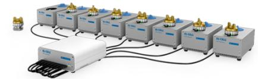

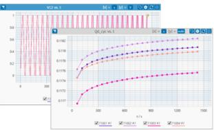

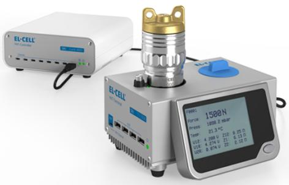

# Atomic Layer Etching: An Industry Perspective

Colin T. Carver, John J. Plombon, Patricio E. Romero, Satyarth Suri, $^{2}$  Tristan A. Tronic, and Robert B. Turkot, Jr.

Components Research, Intel Corporation, Hillsboro, Oregon 97124, USA

This paper provides an industry perspective on atomic layer etching (ALEt) process. Two process sequences representing two different methods of ALEt are described, followed by several examples where ALEt can be an enabling process technology in the semiconductor industry. The authors believe that there needs to be an increased understanding of surface functionalization, modification and chemistry- based material removal. We are confident that this review article will allow for increased scientific and technological solutions for enabling ALEt.  $\mathfrak{G}$  The Author(s) 2015. Published by ECS. This is an open access article distributed under the terms of the Creative Commons Attribution Non- Commercial No Derivatives 4.0 License (CC BY- NC- ND, http://creativecommons.org/licenses/by- nc- nd/4.0/), which permits non- commercial reuse, distribution, and reproduction in any medium, provided the original work is not changed in any way and is properly cited. For permission for commercial reuse, please email: oa@electrochem.org. [DOI: 10.1149/2.0021506jss] All rights reserved.

Manuscript submitted December 23, 2014; revised manuscript received February 7, 2015. Published February 20, 2015. This paper is part of the JSS Focus Issue on Atomic Layer Etching and Cleaning.

A relentless pursuit of Moore's Law requires a scaling of the number of transistors on a microprocessor on a two year cadence. While scaling in general is considered to be a shrink in the critical dimensions (CD, pitch) of patterned features, there is also a scaling in the thickness of the film stacks (z- direction scaling). It was earlier believed that atomic layer etching was not manufacturable due to its slow material removal and relatively large thickness of the film stacks to be removed. However, today's thinner film stacks are now routinely approaching  $< 2 - 3 \mathrm{nm}$  in many applications providing an opportunity for atomic layer etching. Traditional plasma etch processes often cannot meet the extreme selectivity requirements in schemes with such thin layers as etch stops. Pitch scaling increases the role of sidewall etch damage on electrical performance using traditional etch processes and increases the risk of capillary force effects during traditional wet clean processes. Shortcomings of traditional processing such as these provide opportunity for atomic layer etch processes to find their way into future semiconductor manufacturing processes.

In this paper we describe two different process sequences that are currently being used in atomic layer etching. Potential industrial applications of atomic layer etching processes are also presented.

# What is Atomic Layer Etching?

An atomic layer etching process is a highly controlled layer by layer removal of material. We will start by outlining two potential paths toward layer- by- layer removal. The first approach is schematically shown in Figure 1a- 1d. Figure 1a shows a starting substrate where the surface layer is modified using either neutrals, radicals or molecules as represented in Figure 1b. Figure 1c shows the surface layer being bombarded by energetic ions or neutrals to break the bonds of the surface layer of atoms and resulting in the release of the volatile by- products, Figure 1d. The idealized sequence described in Figure 1a- 1d enables formation of an anisotropic atomic layer removal of material. Several reports are present in the literature, where variations of the idealized flow have been successfully demonstrated. A requirement for this flow, and hence somewhat of a limitation, is that the modified surface layer released during the process in Figure 1c should be a stable volatile by- product so that it can be efficiently pumped out of the process chamber. For example, Metzler et al. have reported such a mechanism to remove an atomic layer of  $\mathrm{SiO_2}$  using a combination of  $\mathrm{C_4F_8}$  plasma to create a surface fluorocarbon (FC) layer followed by an ion bombardment with low- energy  $\mathrm{Ar^{+}}$  ions to remove the surface FC layer. Park et al. have reported a similar mechanism for atomic layer removal of Si using a combination of  $\mathrm{Cl}_2$  adsorption and Ne neutral beam. Such atomic layer etching processes have also been reported for GaAs and Ge. It is important to note here that exposure with energetic radicals or use of energetic ions may result in damage or modification of the next layer of atoms, thereby eliminating one of the potential benefits (damage- free processing) of ALEt.

A second and equally important ALEt sequence is described in Figure 2a- 2d. This sequence is akin to a reverse atomic layer deposition (ALD) process. Figure 2a shows a starting substrate where the surface layer of atoms is modified by an adsorption reaction with either molecules or low energy radicals, Figure 2b. Figure 2c shows the exposure of this modified surface layer to a suitable ligand. The role of this ligand is to bond with the modified surface layer of atoms such that the by- product  $(\mathrm{M}^{*}\mathrm{- L})$  can be released with either temperature or has a low enough vapor pressure such that it can simply be pumped out of the system. This removal process needs to be such that there is no decomposition of these large  $\mathrm{M}^{*}$  - L molecules preventing redeposition back on the wafer. A plasma based ion/netural bombardment would not be a preferred approach as it may lead to such decomposition due to secondary collisions in the plasma. An example of such a metal- oxidation- ligand based removal, while not having the atomic layer removal control, has been reported by George et al.

# Potential Applications for Atomic Layer Etching

In this section we highlight a few examples of applications in CMOS front- end of line (FEOL) and back- end of line (BEOL) manufacturing processes for which ALEt would have an immediate impact in helping to achieve the scaling goals laid out by the ITRS.

Novel transistor architecture applications.- Further scaling of FEOL processes for transistor manufacturing requires achieving smaller critical dimensions as well as moving to new 3- D gate architectures, such as FinFET (Figure 3) and gate- all- around (GAA), Figure 4. In a finFET, the body of the transistor consists of a raised fin, allowing the gate to wrap around three sides of the channel. Forming a finFET channel for the gate to wrap around requires a highly vertical fin etch with selectivity to a hardmask. For Si transistors, it is critical in this step to minimize etch damage to the fin, as surface defects and roughness negatively impact carrier mobility and device performance. This damage in a plasma etch is often the result of charging, attack of reactive radicals into the channel, and damage from vacuum ultra violet (VUV) radiation. Wet cleaning for removal of the damaged layer becomes increasingly difficult as fins become more fragile and at tighter pitch. One option for reducing etch damage to the channel would be to use a gentle, anisotropic ALEt process for

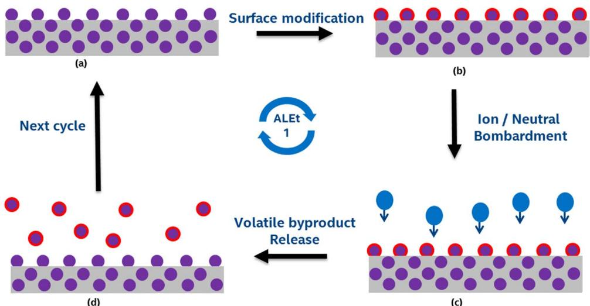  
Figre 1.  1    t  t layer as volatile by-products.

the fin etch itself. Si ALEt by  $\mathrm{Cl}_2$  adsorption followed by low energy sputtering with ions16 or a neutral beam17 could accomplish this, although the process may be slow to define tall fins one atomic layer at a time. Alternatively, a quick conventional fin etch could be performed and followed by an isotropic, gas- phase ALEt process. A key barrier is chemically activating the silicon surface sufficiently so that it can be volatilized by another chemical species or thermal desorption, while not driving the activating chemical deeper into the Si causing more damage and losing atomic level control. To date, such an isotropic ALEt process does not exist.

One can envision similar process schemes to enable binary and tertiary III- V, Ge and SiGe channel fins where, in addition to plasma etch damage, one needs to consider potential changes in surface stoichiometry of the patterned feature.18- 20 ALEt of III- V compounds has been demonstrated using an initial halide adsorption followed by physical sputtering of the adsorbed, activated surface layer with noble gas (either ions or more recently with a neutral beam). Etching of GaAs by  $\mathrm{Cl}_2$  adsorption followed by  $\mathrm{Ar^{+}}$  sputtering was among the first ALEt processes developed.5,6 More recently, Jang, Yeom, and coworkers have demonstrated atomic layer control of III- V compounds using Cl adsorption and a Ne neutral beam to sputter, further minimiz ing damage relative to Ar plasma. They have demonstrated InP recess stopping on an InAlAs/InGaAs transistor channel.3,4 The benefit of the ALEt process was observed by fabricating transistors with superior Hall mobilities relative to devices patterned with conventional plasma processes. They have also used a Ne neutral beam for ALEt of GaAs and demonstrated preservation of the surface stoichiometry, which was not achieved through a continuous ICP plasma etch.21 Matsuura and co- workers have shown that Ge ALEt is possible and, that by conforming  $\mathrm{Cl}_2$  adsorption time, selectivity to  $\mathrm{Sr}$  and SiGe can be achieved.7,8 When this technique is applied to SiGe, the surface stoichiometry is altered as Ge is preferentially removed. Understanding how these anisotropic ALEt processes can pattern vertical profiles, as in a finFET, is an important next step for this technology.

An atomic scale isotropic gas- phase etch will be critical for patterning GAA transistors. The channel of a GAA transistor consists of a thin wire around which the gate metal wraps completely on all sides, Figure 4. In order for the GAA gate to provide effective control of the channel at short gate length, the width of the wire channel can be only a few nanometers,11 making atomic level control of the etch to define the channel a critical aspect of the process. One means of creating a GAA architecture requires patterning of a fin containing

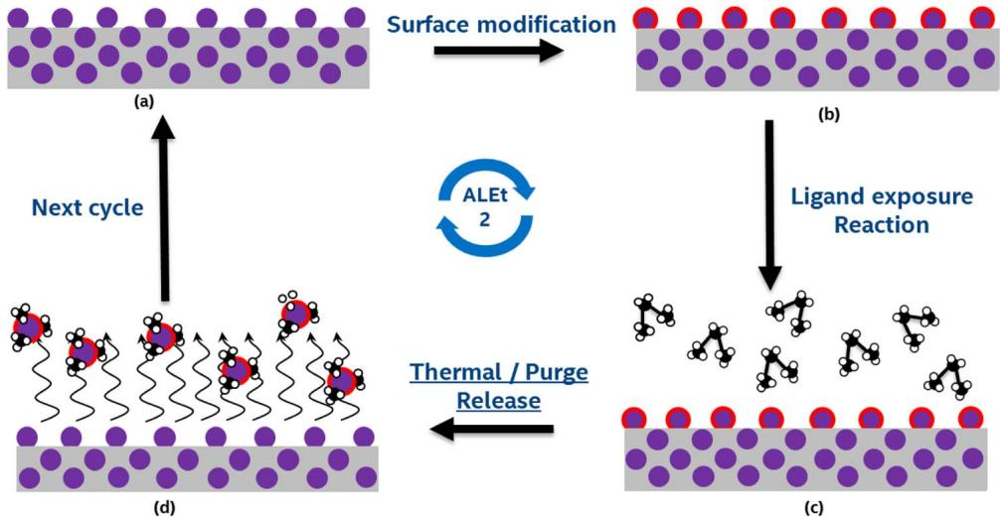  
Figure 2. (a) (d) Schematic representation of an ALEt process. Figure 2(a) is an incoming substrate, Figure 2(b) shows an absorbed layer on the surface atoms due to gaseous/chemical precursor exposure, Figure 2(c) shows exposure of the modified surface layer to ligands such that the  $\mathbf{M}^*$  L molecule can be removed either by temperature or pumping down to low pressure, Figure 2(d).

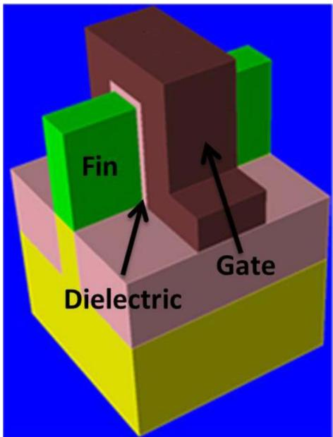  
Figure 3. FinFET CMOS transistor architecture

the channel on top of a sacrificial material. GAA integration schemes using Si channel with either  $\mathrm{SiO}_2$  or SiGe sacrificial layer have been demonstrated. $^{11,22}$  In these devices it is observed that surface roughness and channel shape can strongly affect device performance. $^{23}$  A highly isotropic, chemically driven etch is required for this undercut and, because the channel is exposed, it must have extremely high selectivity for the buffer relative to the channel. At very small dimensions below the gate wet etching can encounter challenges with the reliability of the etch due to limited flow in tight spaces affecting etchant diffusion as well as released channel collapse or incomplete etchant removal due to capillary force from an aqueous cleaning solution. $^{24}$  A conventional plasma etch can lead to changing the shape of the wire due to the top of the wire seeing a different ion bombardment from the bottom. Highly controlled ALEt etch technology (Figure 2a- 2d) would be a significant enabler for manufacturing high quality GAA devices. As an example, isotropic ALEt has been demonstrated for

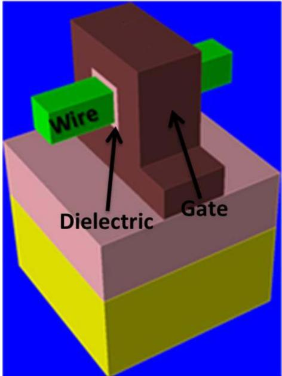  
Figure 4. Gate-All-Around CMOS transistor architecture.

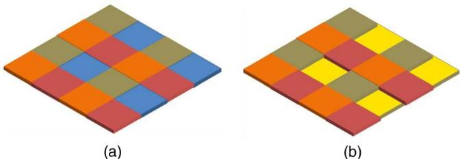  
Figure 5. (a) A representation of a multi-color selectivity patterning scheme, (b) goal is to successfully remove the one "color" material with high selectivity to the other colors and no corner rounding.

Ge selective to SiGe using  $\mathrm{Cl}_2$  adsorption followed by thermal desorption of  $\mathrm{GeCl}_2$  achieving near- monolayer control, albeit slowly and at high temperature (more than 3 minutes per cycle, and desorption at  $400^{\circ}\mathrm{C}$ ). $^{25}$

Development of an ALEt channel undercut etch to enable GAA architecture for high- mobility materials (like compound semiconductors) will also be more challenging. Undercut etch for III- V channels by wet cleans, in addition to stiction issues, also may result in the release of highly toxic and reactive gaseous byproducts, for example  $\mathrm{AsH}_3$  and  $\mathrm{PH}_3$ . $^{26}$  For this application, a more reverse ALD- like approach, as discussed previously, may be needed. Processes for III- V materials have not been developed.

Enabling high selectivity processes.- Figure 5 represents an example of a multiple- color selectivity problem where an isotropic ALEt process would be an enabling solution. The four colors in these tiles represent four different material types (these can be different dielectrics, a- C, SiCOH, SiN, etc...). The goal for this multi- color selectivity challenge would be to remove one color tile with extreme selectivity to the three remaining tiles. One could also envision a second sequence where a different color tile may need to be removed with selectivity to the remaining tiles. Selective surface functionalization of the "blue" tile (for example) would be a key element for success with such a selective process. In addition to selectivity, the complete removal of etched material and retention of sharp corners are of equal importance. No current plasma etch based process can, in our estimation, meet such stringent process requirements. Wet etch removal of similar materials with high selectivity to one another also appears to be challenging. We believe with careful surface functionalization, surface adsorption and proper combination of ligands, such highly demanding process goals can be achieved.

With an increasing number of elements from the periodic table becoming a part of the devices for both logic and memory applications, the role of ALEt will be some more prominent. Another example challenge for ALEt can be in films containing transition metal elements. Figure 6a contains a simple stack of two transition metal films (for e.g. Ni, Co) separated by a dielectric film. These films can be  $< 2\mathrm{nm}$  thick and the goal for the process is to deliver an anisotropic etch with high selectivity to the middle dielectric layer. One can envision a variation of the ALEt processes from Figures 1, 2 where ions or radicals with precise energy control are used to convert the top metal layer (Figure 6b). This is followed by a ligand exposure (Figure 6c) and a thermally assisted removal of metal- ligand by- product, Figure 6d. By precisely controlling the depth of top layer conversion, preventing intermixing of the metal and dielectric films and the right chemistry, one can envision an anisotropic and almost infinite selectivity process.

Enabling chemical mechanical polishing (CMP) processes with fragile interlayer dielectric (ILD).- The final step of traditional dual- damascene patterning schemes is the isolation of  $\mathrm{Cu}$  lines by removal of  $\mathrm{Cu}$  overburden and barrier metals (like Ta, TaN) in the field by chemical mechanical planarization (CMP). The removal of barrier metals by CMP exposes the underlying interlayer dielectric (ILD) to the CMP condition, leading to loss of stack height, and is a key driver of CMP related defects. Challenges associated with

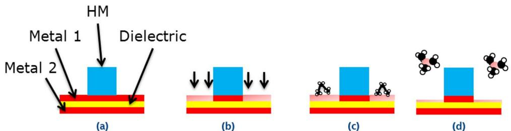  
Figre 6. f low energy radicals, ions (c) exposure to a suitable ligand (d) removal of metal-ligand using thermal assistance.

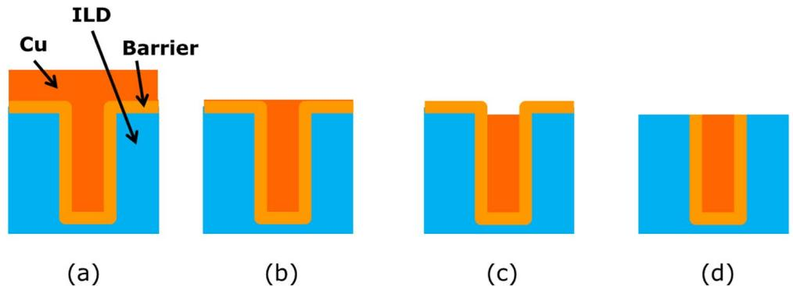  
Figure 7.  i  f  t  i  i an ILD friendly planarization process.

CMP processing of shrinking interconnect layers is compounded by the push toward lower k- value (and more fragile) dielectrics.27 Successive technology nodes will require reductions to CMP related stack height loss that will eventually exceed the capabilities of CMP process control. The only current method to correct for the stack height loss is to compensate in patterning, which complicates etch, cleans and metal fill. Figure 7a- 7d shows a potential solution for CMP related defects and fragile low- k dielectric integration using ALEt as a final material removal step. Figure 7a shows starting pre- polish metal fill and overburden. Using traditional CMP, one can polish back the overburden and stop on the barrier layer in the field, Figure 7b. The next two steps involving recessing of metal in the line with selectivity to barrier layer, Figure 7c and removing of the barrier layers from the field with selectivity to copper line and not damaging the fragile low- k ILD, Figure 7d. Use of an isotropic ALEt process can achieve both of these but requires deep understanding of selective surface functionalization and appropriate chemistry expertise to gain the selectivities needed between the different materials.

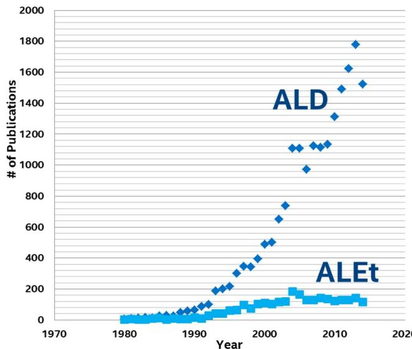  
Figure 8. Graphs showing comparison of number of publications in ALD versus ALEt. Plot constructed from a SCOPUS database search for the terms "Atomic Layer Etching" and "Atomic Layer Depository", retrieved on December  $3^{\mathrm{rd}}$  2014.

# Conclusions

We have provided an industry perspective on emerging challenges based on new materials, architectures and selectivity requirements in logic and memory devices. With increased scaling, we believe that ALEt has the potential to become a critical process tool. As a closing thought, we compare ALEt publications status with its conceptually related counterpart atomic layer deposition (ALD) which made its formal debut nearly two decades ago, Figure 8. While rich chemistry has been developed for ALD in the past decade, in both precursor and process development areas, there is a significant opportunity for ALEt to learn from its counterpart. We hope that this industry perspective will trigger an exponential growth in scientific and technological output like ALD witnessed in mid- 1990s.

# References

1. Gordon E. Moore, Electrons Magazine, 4 (1965). 
2. D. Metzler, R. L. Bruce, S. Engelmann, E. A. Joseph, and G. S. Oehrlein, J. Vac. Sci. Technol. A, 32, 020603 (2014). 
3. S. D. Park, C. K. Oh, J. W. Bae, G. Y. Yeom, T. W. Kim, J. I. Song, and J. H. Jang, Appl. Phys. Lett., 89, 043109 (2006). 
4. T.-W. Kim, J.-I. Song, J. H. Jang, D.-H. Kim, S. D. Park, J. W. Bae, and G. Y. Yeom, Appl. Phys. Lett., 91, 102110 (2007). 
5. Y. Aoyagi, K. Shimura, K. Kawasaki, T. Tanaka, K. Gamo, S. Namba, and I. Nakamoto, Appl. Phys. Lett., 60, 968 (1992). 
6. T. Meguro, M. Ishii, K. Kodama, Y. Yamamoto, K. Gamo, and Y. Aoyagi, Thin Solid Films, 225, 136 (1993). 
7. T. Sugiyama, T. Matsuura, and J. Murota, Appl. Surf. Sci., 112, 187 (1997). 
8. T. Matsuura, T. Sugiyama, and J. Murota, Surf. Sci., 402-404, 202 (1998). 
9. M. A. George, D. W. Hess, S. E. Beck, K. Young, D. A. Bohling, G. Voloshin, and A. P. Lane, J. Electrochem. Soc., 143, 3257 (1996). 
10. International Technology Roadmap for Semiconductors, http://public.itrs.net/

11. K.J. KuhnU.AvciA.CappellaniM.D.GilesM.HavertyS.KimR.Kotlyar, S.ManpatruniD.NikonovC.PawasheM.RadasaljevicR.RiosS.Shankar, R.VedulaR.Chau and I.YoungIEDM2012 IEEE Int.8.1.12012. 
12. C.J.PettiJ.P.McVittie and J.D.PlummerIEDM Tech.Dig.104 1988. 
13. S.J.FonashR.A.DitizioT.GuP.I. MikulanO.O.Awadelkarim and R.W.CollinsMRS Proc.259,55 1992. 
14. K.T.Sung and S.W.PangJ.Vac. Sci.Technol.B 12,1346 1994. 
15. K.RuzylloECS Trans.9,87 2007. 
16. S.D.Athavale and D.J.EconomouJ.Vac.Sci.Technol.B 14,3702 1996. 
17. J.K.KimS.I.ChoS.H.LeeC.K.KimK.S.MinS.J.Kang and G.Y.Yeom, J.Vac.Sci.Technol.A,31,061310 (2013. 
18. J.E.MaslarJ.F.DorstenP.W.BohnS. AgarwalaI. AdesidaC.Caneau and R.BhatJ.Vac.Sci.Technol.B13,988 1995. 
19. S.J.PeartonW.S.HobsonF.A.Baicchi and A.B.EmersonJ.Vac.Sci.Technol. B,8,57 (1990).

20. B. Jacobs, H. Zull, A. Furchel, I. Gyuro, P. Speier, E. Zielinski, and P. Röntgen, Microelectron. Eng., 1-4, 401 (1993).21. W. S. Lim, S. D. Park, B. J. Park, and G. Y. Yeom, Surf. Coat. Technol., 202, 5701 (2008).22. N. Singh, K. D. Buddharaju, S. K. Manhas, A. Agarwal, S. C. Rustagi, G. Q. Lo, N. Balasubramanian, and D.-L. Kwong, IEEE Trans. Electron Dev., 55, 3107 (2008).23. J. Wang, E. Polizzi, A. Ghosh, S. Datta, and M. Lundstrom, Appl. Phys. Lett., 87, 043101 (2005).24. Y.-K. Choi, D.-I. Moon, J.-M. Choi, and J.-H. Ahn in Nanowire Field Effect Transistors: Principles and Applications, 1st ed., D. M. Kim and Y.-H. Jeong, eds., p. 100, Springer, New York (2014).25. K. Ikeda, S. Imai, and M. Matsumura, Appl. Surf. Sci., 112, 87 (1997).26. R. Vos, S. Arnauts, T. Leonard, A. Moussa, H. Struyf, and P. Mertens, Solid State Phenom., 187, 27 (2012).27. V. McGahay, Materials., J. 536 (2010).