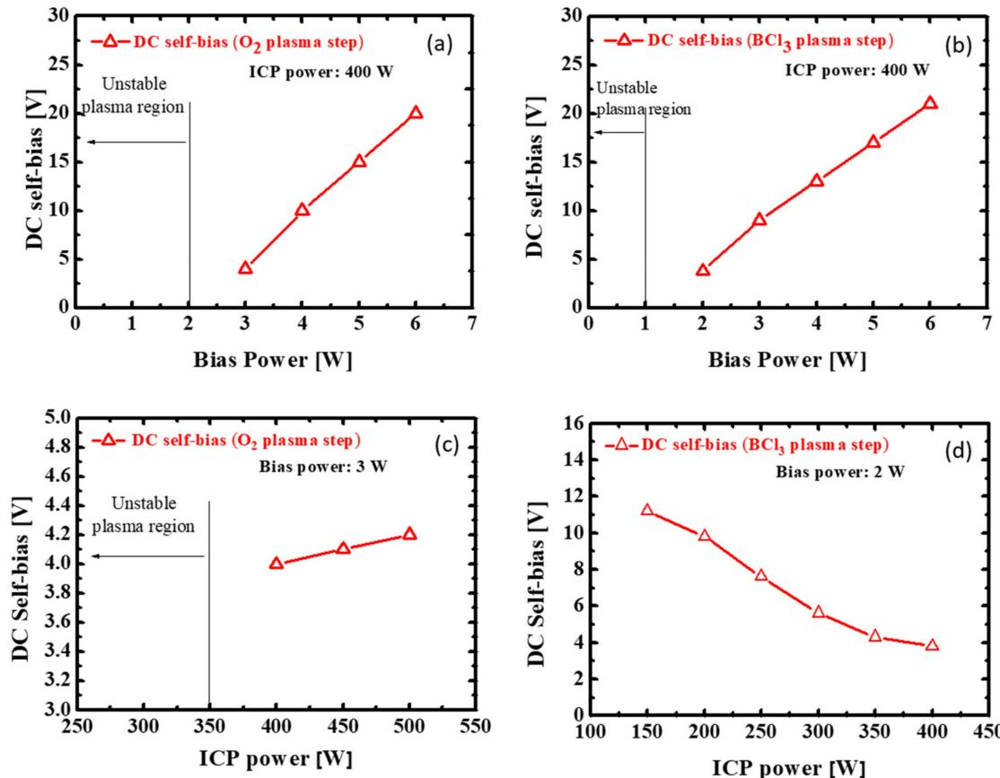
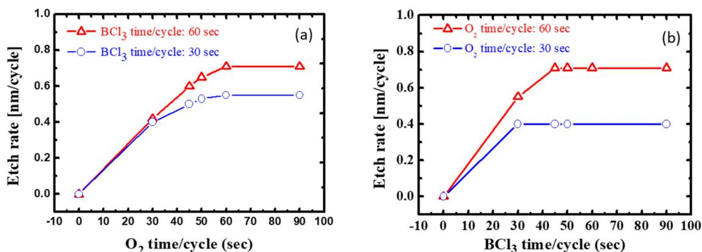
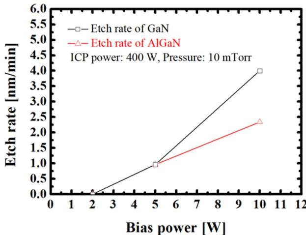
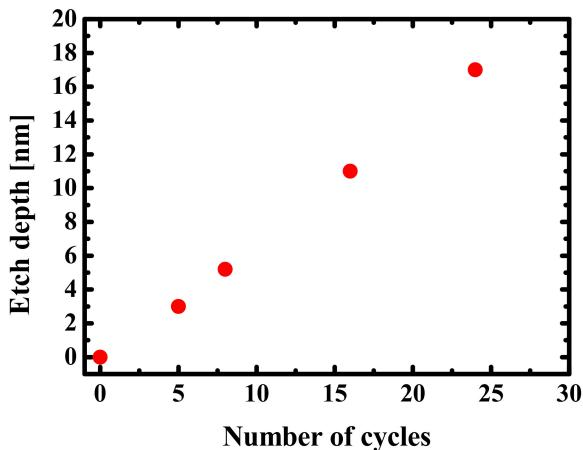
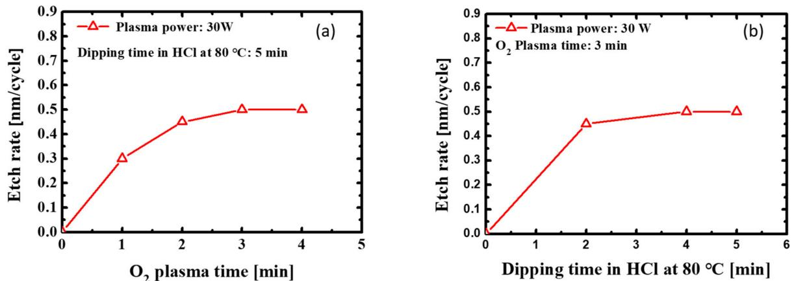
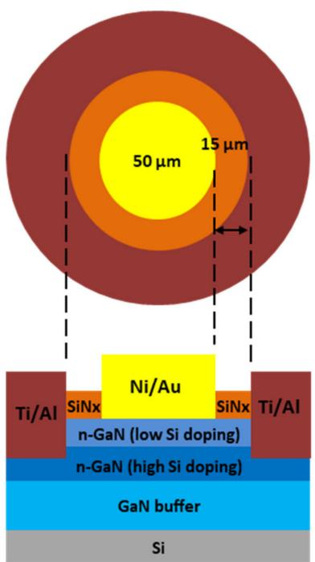
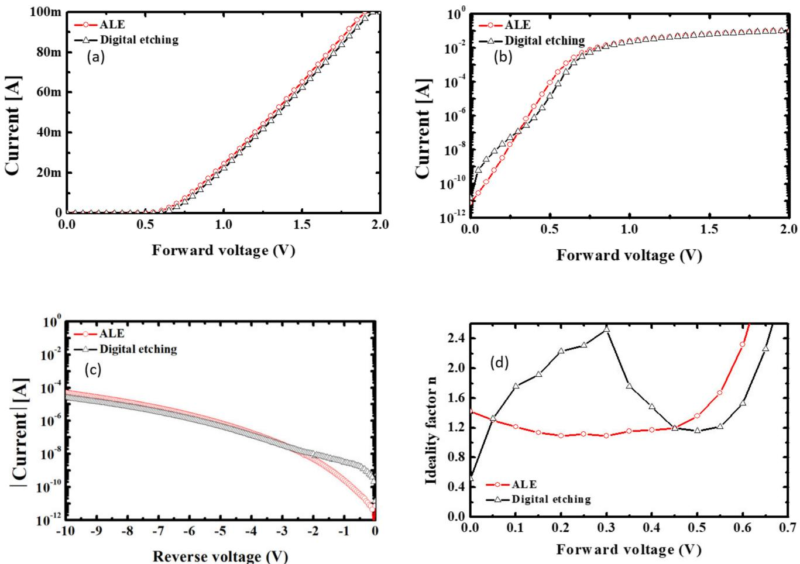
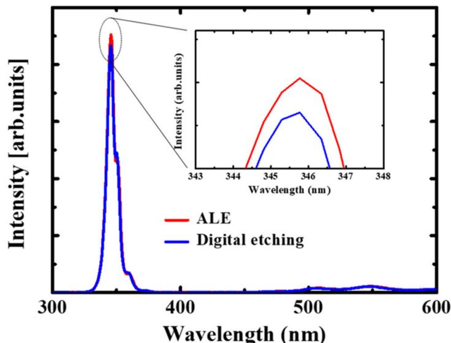
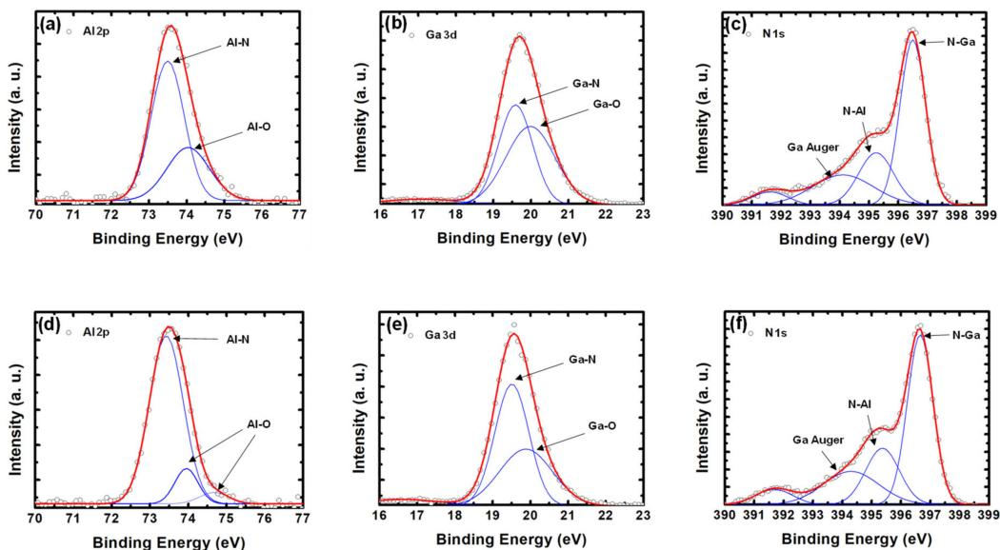
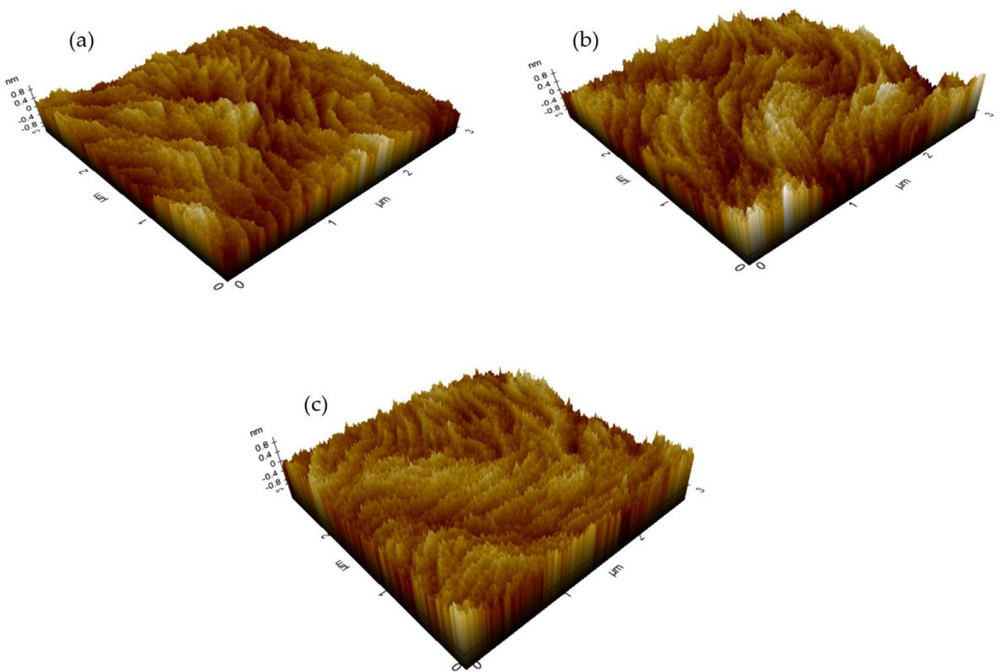

Article

# Low-Damage and Self-Limiting (Al)GaN Etching Process through Atomic Layer Etching Using  $\mathbf{O}_2$  and  $\mathbf{BCl}_3$  Plasma

Il- Hwan Hwang  $^{1}$ , Ho- Young Cha  $^{2, *}$  and Kwang- Seok Seo  $^{1, *}$

$^{1}$  Department of Electrical and Computer Engineering, Inter- University Semiconductor Research Center, Seoul National University, Seoul 151- 744, Korea; hih0705@gmail.com   $^{2}$  School of Electronic and Electrical Engineering, Hongik University, Seoul 121- 791, Korea  * Correspondence: hcha@hongik.ac.kr (H.- Y.C.); kssseo@snu.ac.kr (K.- S.S.); Tel.: +82- 10- 4151- 7275 (K.- S.S.)

Abstract: This paper reports on the use of low- damage atomic layer etching (ALE) performed using  $\mathrm{O}_2$  and  $\mathrm{BCl}_3$  plasma for etching (Al)GaN. The proposed ALE process led to excellent self- limiting etch characteristics with a low direct current (DC) self- bias, which resulted in a high linearity between the etching depth and number of cycles. The etching damage was evaluated using several methods, including atomic force microscopy, photoluminescence (PL), and X- ray photoelectron spectroscopy, and the  $I - V$  properties of the recessed Schottky diodes were compared with those of digital etching performed using  $\mathrm{O}_2$  plasma and HCl solution. The electrical characteristics of the recessed Schottky diode fabricated using the proposed ALE process were superior to those of the diodes fabricated using the conventional digital etching process. Moreover, the ALE process yielded a higher PL intensity and  $\mathrm{N / (Al + Ga)}$  ratio of the etched AlGaN surface, along with a smoother etched surface.

Keywords: GaN; AlGaN; atomic layer etching; low damage etching

Citation: Hwang, I.- H.; Cha, H.- Y.; Seo, K.- S. Low- Damage and Self- Limiting (Al)GaN Etching Process through Atomic Layer Etching Using  $\mathrm{O}_2$  and  $\mathrm{BCl}_3$  Plasma. Coatings 2021, 11, 268. https://doi.org/10.3390/coatings11030268

Academic Editor: Alessandro Patelli

Received: 14 December 2020  Accepted: 22 February 2021  Published: 25 February 2021

Publisher's Note: MDPI stays neutral with regard to jurisdictional claims in published maps and institutional affiliations.

Copyright: © 2021 by the authors. Licensee MDPI, Basel, Switzerland. This article is an open access article distributed under the terms and conditions of the Creative Commons Attribution (CC BY) license (https://creativecommons.org/licenses/by/4.0/).

# 1. Introduction

GaN- based high electron mobility transistors have been developed for use in high- frequency amplifiers and high- voltage power switching applications owing to their high breakdown voltage, large bandgap, and high electron carrier velocity [1]. In terms of device fabrication, GaN- related materials including AlGaN are physically and chemically stable, and thus, plasma etching is a typical technique to realize the etching of (Al)GaN. The etching process considerably influences the device characteristics, especially in cases in which the etch depth must be precisely controlled, and/or the plasma- induced damage must be minimized. For example, the current level and dynamic current collapse characteristics of recessed gate structures in field- effect transistors [2- 4] or diodes [5- 7] are considerably dependent on the recess depth and trap states at the etched surface. Although conventional plasma- etching methods, such as reactive ion etching (RIE) and inductively coupled plasma (ICP)- RIE [8- 11], are still being widely used, a digital etching process involving the  $\mathrm{O}_2$  plasma oxidation of (Al)GaN in conjunction with  $\mathrm{HCl:H_2O}$  solution- based oxide removal has received considerable attention owing to the associated low etching damage and easy control of the recess depth. However, this process is labor- intensive due to the combination of the plasma oxidation and wet etching processes and involves a low etch rate [12]. In this context, the realization of an atomic layer etching (ALE) process, which is an in situ digital etching process and has relatively high etch rates with low etching damage [13- 16], is desirable. To exploit the advantages of the ALE process, the process conditions must be optimized to minimize the plasma- induced etching damage and to attain self- limiting characteristics to precisely control the etch depth.

To this end, in this study, we report on an ALE process performed using  $\mathrm{O}_2$  and  $\mathrm{BCl}_3$  plasma, which exhibits a low DC self- bias and self- limiting characteristics. The etching damage was evaluated using the atomic force microscopy (AFM), photoluminescence (PL), and X- ray photoelectron spectroscopy (XPS) techniques, and the  $I - V$  characteristics of the

Schottky diodes were compared with those of the diodes fabricated using the conventional digital etching process performed using  $\mathrm{O_2}$  plasma and HCl solution.

# 2. Experiments

# 2.1. ALE Process

The ALE process was performed in a BMR HiEtch ICP etch system [17] (BMR Technology, New Jersey, NJ, USA) in which the chuck temperature was set to  $5^{\circ}\mathrm{C}$  using a helium backside cooling system and the chamber was evacuated using a turbo pump. A detailed system diagram is shown in Figure 1.

  
Figure 1. Schematic diagram of BMR HiEtch inductively coupled plasma (ICP) etcher.

An AlGaN layer was oxidized using  $\mathrm{O_2}$  plasma, and the oxidized layer was removed using the  $\mathrm{BCl_3}$  plasma. The gas flow rates for  $\mathrm{O_2}$  and  $\mathrm{BCl_3}$  were 50 and  $10\mathrm{scm}$ , respectively. After the  $\mathrm{O_2}$  and  $\mathrm{BCl_3}$  plasma steps, a pumping step was conducted for  $30~\mathrm{s}$  to avoid sample contamination by any residual  $\mathrm{O_2}$  or  $\mathrm{BCl_3}$  gas. The pressures during the  $\mathrm{O_2}$  and  $\mathrm{BCl_3}$  plasma processes were 50 mTorr and  $10\mathrm{mTorr}$ , respectively, and the effects of the ICP and bias powers on the DC self- bias were investigated, as shown in Figure 2. It was observed that the DC self- bias increased and decreased with an increase in the bias power and ICP power, respectively. Although the DC self- bias values measured in the system seemed to be too low considering a floating potential that could not be eliminated, it was clear that a lower DC self- bias could be achieved with a lower bias power and a higher ICP power. The exact evaluation of the floating potential was not able to be measured in the system. In order to reduce the ion bombardment energy at the surface, lower DC self- bias conditions were selected; bias powers of 3 and  $2\mathrm{W}$  were selected for the  $\mathrm{O_2}$  and  $\mathrm{BCl_3}$  steps, respectively, during which the ICP power was set as  $400~\mathrm{W}$ .

The wafer structure used for the etching test consisted of a  $3.8\mathrm{nm}$  GaN cap layer, a  $22.6\mathrm{nm}$  AlGaN barrier layer, a  $511\mathrm{nm}$  i- GaN channel layer, and a buffer layer grown on a Si substrate. First, the GaN cap layer was etched by  $\mathrm{Cl}_2 / \mathrm{BCl}_3$ - based inductively coupled plasma- reactive ion etching. Then, a SiNx film was deposited as an etch mask layer. After the ALE process, the  $\mathrm{SiN}_x$  mask layer was removed using dilute hydrofluoric acid (DHF),

and the etch depths of the samples were measured using the AFM technique. Figure 3 shows the etch rate per cycle of the ALE for varying  $\mathrm{O_2}$  and fixed  $\mathrm{BCl_3}$  plasma times per cycle and varying  $\mathrm{BCl_3}$  and fixed  $\mathrm{O_2}$  plasma times. The etch rate increased as the  $\mathrm{O_2}$  plasma time increased to  $60~\mathrm{s}$  under constant  $\mathrm{BCl_3}$  plasma times. Above  $60~\mathrm{s}$ , the etch rate remained fairly constant. Moreover, the etch rate increased as the  $\mathrm{BCl_3}$  plasma time increased to  $45~\mathrm{s}$  at a fixed  $\mathrm{O_2}$  plasma time of  $60~\mathrm{s}$ . Above  $45~\mathrm{s}$ , the etch rate was saturated.

  
Figure 2. DC self-bias under varying bias powers at the (a)  $\mathrm{O_2}$  and (b)  $\mathrm{BCl_3}$  plasma steps, and under varying ICP powers at the (c)  $\mathrm{O_2}$  and (d)  $\mathrm{BCl_3}$  plasma steps.

  
Figure 3. Etch rate per cycle of the atomic layer etching (ALE) for (a) varying  $\mathrm{O_2}$  and fixed  $\mathrm{BCl_3}$  plasma times per cycle and (b) varying  $\mathrm{BCl_3}$  and fixed  $\mathrm{O_2}$  plasma times.

As mentioned previously, the self- limiting behavior of ALE must be realized to ensure a high linearity between the etching depth and the number of cycles. Therefore, the etch

rates of GaN and AlGaN when using  $\mathrm{BCl}_3$  plasma were investigated under a fixed ICP power of  $400 \mathrm{W}$  and varying bias power, as shown in Figure 4.

  
Figure 4. Etch rate when using  $\mathrm{BCl}_3$  plasma under a fixed ICP power of  $400 \mathrm{W}$  and varying bias powers.

The GaN and AlGaN layers were not etched at a bias power of  $2 \mathrm{W}$ , and the etch rates appeared to increase with an increase in the bias power. This finding indicates that the proposed ALE technique is a self- limiting etch process at the bias power of  $2 \mathrm{W}$  when using  $\mathrm{BCl}_3$  plasma. Therefore, the optimized ALE process conditions were determined, as listed in Table 1.

Table 1. Optimized ALE process conditions.  

<table><tr><td>Parameter</td><td>O2 Plasma Step</td><td>BCl3 Plasma Step</td></tr><tr><td>ICP power (W)</td><td>400</td><td>400</td></tr><tr><td>Bias power (W)</td><td>3</td><td>2</td></tr><tr><td>DC self-bias (V)</td><td>4</td><td>3.8</td></tr><tr><td>Chamber pressure (mTorr)</td><td>50</td><td>10</td></tr><tr><td>Gas flow rate (sccm)</td><td>50</td><td>10</td></tr><tr><td>Plasma time (s)</td><td>60</td><td>45</td></tr></table>

A high linearity was noted between the etch depth and number of cycles in the ALE, indicating that the etch depth could be controlled in the digital etching technique, as shown in Figure 5.

  
Figure 5. Etch depth versus number of etching cycles.

# 2.2.Digital Etching Process

To realize the digital etching using  $\mathrm{O_2}$  plasma and HCl solution, a microwave plasma. asher was used to conduct the plasma oxidation, because microwave- excited plasma is characterized by a high density and low plasma- induced damage. Subsequently, an HCl:  $\mathrm{H}_2\mathrm{O}$  (1:3) solution at  $80^{\circ}\mathrm{C}$  was used to remove the oxide because HCl can effectively remove oxides [18,19].

To examine the effect of the  $\mathrm{O_2}$  plasma time, several  $\mathrm{O_2}$  plasma times were considered for a fixed HCl dipping time. As shown in Figure 6, the etch rate per cycle increased as the  $\mathrm{O_2}$  plasma time increased to  $3\mathrm{min}$  . After  $3\mathrm{min}$  , the etch rate remained constant. Under a fixed plasma oxidation time of  $3\mathrm{min}$  and varying HCl dipping times, the etch rate increased as the HCl dipping time increased to  $4\mathrm{min}$  and then stabilized.

  
Figure 6. Etch rate per cycle of the digital etching performed under (a) varying  $\mathrm{O_2}$  plasma times and fixed HCl dipping time and (b) varying HCl dipping times and fixed  $\mathrm{O_2}$  plasma time.

# 2.3. Etching Damage Evaluation

The etching damage was evaluated using Schottky diodes fabricated on the etched n- GaN surfaces. We applied n- GaN- on- Si wafers that consisted of a  $300\mathrm{nm}$  n- GaN drift layer with a- Si doping concentration of  $2.5\times 10^{17}\mathrm{cm}^{- 3}$  , a  $700\mathrm{nm}$  highly doped n- GaN contact layer with a- Si doping concentration of  $(2 - 3)\times 10^{18}\mathrm{cm}^{- 3}$  , a  $3900\mathrm{nm}$  GaN buffer layer, and a Si substrate. The device fabrication was initiated by solvent cleaning using acetone, methanol, and isopropanol. Subsequently, a  $\mathrm{SiN}_x$  passivation layer of  $200\mathrm{nm}$  was deposited as a mask layer. Ohmic contacts were subsequently formed through Ti/Al metallization and rapid thermal annealing at  $550^{\circ}C$  in an  $\mathbb{N}_2$  ambient atmosphere for 1 min. The  $\mathrm{SiN}_x$  layer was opened through  $\mathrm{SF}_6$  - based RIE at  $20W,$  and the exposed GaN layer was etched to a depth of  $5\mathrm{nm}$  by using two different methods, i.e., ALE and digital etching. After the  $\mathrm{SiNx}$  opening process, Ni/Au  $(40 / 200\mathrm{nm})$  metal electrodes were deposited through e- gun evaporation. The circular electrodes had diameters of  $50~\mu \mathrm{m}$  and were separated from a concentric contact with a gap of  $15\mu \mathrm{m}$  . The device cross- section is shown in Figure 7.

The surface roughness of the AlGaN surfaces following the etching processes was evaluated using the AFM technique in the non- contact mode. Furthermore, the XPS analysis was conducted to investigate the stoichiometry of the etched surfaces. The surface roughness and XPS analysis were carried out with the witness wafers used for the etch rate test. The PL intensity was measured at room temperature to evaluate the etching damage of each digital etching process by using a  $266~\mathrm{nm}$  laser with a power density of  $2\mathrm{W / cm^2}$  The wafer structure used for the PL measurement consisted of a  $1000\mathrm{nm}$  i- GaN layer and a  $300\mathrm{nm}$  buffer layer grown on a Si substrate.

  
Figure 7. Cross-section of the Schottky diodes fabricated on n-GaN.

# 3. Results and Discussion

Figure 8 presents the  $I - V$  characteristics of the fabricated diodes and the ideality factors determined from the electrical measurements [20,21]. The ideality factor in the low forward bias region is an indicator for the trap- assisted recombination. As shown in Figure 8b, the slope of the forward bias region was not uniform for the digital etching case, which resulted in non- uniform ideality factor behavior in Figure 8d. On the other hand, the ALE case exhibited more uniform and lower ideality factor behavior at the low bias region. Therefore, it is suggested that the plasma- induced damage caused by the ALE process is less than that caused by the digital etching process. The increase in the ideality factor at the high forward bias region in Figure 8d is due to the fact that the diode current does not increase exponentially with the applied voltage [22,23]. The ideality factor determined at applied voltages of 0.1 to  $0.3\mathrm{V}$  was  $\sim 1.1$  and 1.8- 2.5 for the diodes fabricated using the ALE and digital etching, respectively. The zero- bias barrier heights were 0.81 and  $0.72\mathrm{eV}$  for the diodes fabricated using the ALE and digital etching, respectively, and a lower reverse current of  $4.8\mathrm{nA}$  at  $- 2\mathrm{V}$  occurred at the ALE diodes. These results indicated that the ALE incurred lower etching damage than the digital etching, resulting in better electrical characteristics.

To further investigate the etching damage, the PL intensity was measured at the etching depth of  $\sim 5\mathrm{nm}$ . As shown in Figure 9, a lower near- band- edge PL intensity was observed in the samples etched using the digital etching than those in the samples etched using the ALE. This finding indicated that fewer non- radiative recombination centers such as N vacancies were present in the sample etched using the ALE [24- 26].

The chemical composition of the AlGaN surfaces was investigated using XPS analysis. The fitting results of Al  $2p$ , Ga  $3d$ , and N  $1s$  peaks for the AlGaN samples etched using either ALE and digital etching are shown in Figure 10. Larger Al- O and Ga- O peak intensities were observed for the AlGaN surface etched using digital etching, which indicates that the ALE process is more effective for oxide removal in comparison with the digital etching process. In addition, the ratio of N/(Al + Ga) was 0.9 for the ALE sample and 0.82 for the digital etching sample, which suggests that fewer N vacancies were generated during the ALE process [27- 29].

  
Figure 8.  $I - V$  curves of the fabricated Schottky diodes. (a) Forward  $I - V$  characteristics (linear scale), (b) forward  $I - V$  characteristics (log scale), (c) reverse  $I - V$  characteristics (log scale), and (d) ideality factors.

  
Figure 9. Photoluminescence (PL) characteristics for the etched GaN.

  
Figure 10. XPS fitting results of the Al  $2p$ , Ga  $3d$ , and N  $1s$  peaks for the AlGaN samples fabricated using the digital etching (a–c) and ALE (d–f) processes.

The surface morphologies of the etched samples were measured using the AFM technique. Figure 11 shows the images of a  $3 \times 3 \mu \mathrm{m}^2$  area for the samples before and after etching. The root mean square values of the surface roughnesses for the ALE sample and digital etching sample were 0.2 and  $0.25 \mathrm{nm}$ , respectively, while the surface before etching was  $0.19 \mathrm{nm}$ . These results indicate that the generation of the N vacancies could be reduced using the ALE [30–32].

  
Figure 11. Atomic force microscopy (AFM) images of the surfaces etched using (a) ALE and (b) digital etching and (c) the as-grown surface before etching.

# 4.Conclusions

4. ConclusionsALE using  $\mathrm{O_2}$  and  $\mathrm{BCl_3}$  plasma in an ICP-RIE system was developed to realize a self-limiting etching process with low etching damage. The ALE process conditions for the  $\mathrm{O_2}$  plasma step were as follows: ICP power of  $400\mathrm{W},$  bias power of  $3\mathrm{W},$  chamber pressure of 50 mTorr, DC self-bias of  $4\mathrm{V},$  and plasma time of  $60\mathrm{s}$ . The ALE process conditions for the  $\mathrm{BCl_3}$  plasma step included ICP power of  $400\mathrm{W},$  bias power of  $2\mathrm{W},$  chamber pressure of  $10\mathrm{mTorr},$  DC self-bias of  $3.8\mathrm{V},$  and plasma time of  $45\mathrm{s},$  which resulted in the etch rate of  $0.7\mathrm{nm}$  /cycle. The etching damage was investigated using various evaluation methods including AFM,  $\mathrm{PL},$  and XPS, and the  $I - V$  characteristics of recessed Schottky diodes were compared to those obtained using a conventional digital etching process using  $\mathrm{O_2}$  plasma oxidation and HCl-solution-based oxide removal. The ALE using  $\mathrm{O_2}$  and  $\mathrm{BCl_3}$  plasma led to better electrical characteristics of the Schottky diodes, as well as higher PL intensity, increased  $\mathrm{N / (Al + Ga)}$  ratio, and a smoother etched surface compared with those of the conventional digital etching process using  $\mathrm{O_2}$  plasma and HCl solution. In addition, the ALE technique exhibited excellent self-limiting characteristics and ensured a high linearity between the etch depth and number of cycles. The proposed ALE process was noted to be promising to be applied for (Al)GaN etching, in which the precise control of the etch depth and low etching damage are necessary.

Author Contributions: I.- H.H. performed the experiments; conceptualization, I.- H.H., H.- Y.C., and K.- S.S.; methodology, I.- H.H., H.- Y.C., and K.- S.S.; writing—original draft preparation, I.- H.H., H.- Y.C., and K.- S.S. All authors have read and agreed to the published version of the manuscript.

Funding: This work was supported by the Ministry of Trade, Industry & Energy (10067636) and the Basic Science Research Program (No. 2015R1A6A1A03031833 and No. 2019R1A2C1008894).

Conflicts of Interest: The authors declare no conflict of interest.

# References

References1. Chowdhury, S.; Stum, Z.; Li, Z.D.; Ueno, K.; Chow, T.P. Comparison of 600V Si, SiC and GaN power devices. Mater. Sci. Forum 2014, 971–974. [CrossRef]2. Zhao, Y.; Wang, C.; Zheng, X.; Ma, X.; He, Y.; Liu, K.; Li, A.; Peng, Y.; Zhang, C.; Hao, Y. Effects of recess depths on performance of AlGaN/GaN power MIS- HEMTs on the Si substrates and threshold voltage model of different recess depths for the using HfO2 gate insulator. Solid. State. Electron. 2020, 163, 107649. [CrossRef]3. Huang, S.; Jiang, Q.; Wei, K.; Liu, G.; Zhang, J.; Wang, X.; Zheng, Y.; Sun, B.; Zhao, C.; Liu, H.; et al. High- temperature low- damage gate recess technique and ozone- assisted ALD- grown  $\mathrm{Al}_2\mathrm{O}_3$  gate dielectric for high- performance normally- off GaN MIS- HEMTs. In Proceedings of the 2014 IEEE International Electron Devices Meeting, San Francisco, CA, USA, 15–17 December 2014; pp. 17.4.1–17.4.4. [CrossRef]4. He, Y.; Gao, H.; Wang, C.; Zhao, Y.; Lu, X.; Zhang, C.; Zheng, X.; Guo, L.; Ma, X.; Hao, Y. Comparative Study Between Partially and Fully Recessed- Gate Enhancement- Mode AlGaN/GaN MIS HEMT on the Breakdown Mechanism. Phys. Status Solidi Appl. Mater. Sci. 2019, 216, 1–6. [CrossRef]5. Park, Y.; Kim, J.J.; Chang, W.; Jang, H.G.; Na, J.; Lee, H.; Jun, C.H.; Cha, H.Y.; Mun, J.K.; Ko, S.C.; et al. Low onset voltage of GaN on Si Schottky barrier diode using various recess depths. Electron. Lett. 2014, 50, 1164–1165. [CrossRef]6. Xu, R.; Chen, P.; Liu, M.; Zhou, J.; Yang, Y.; Li, Y.; Ge, C.; Peng, H. 2.5- kV AlGaN/GaN Schottky Barrier Diode on Silicon Substrate with Recessed- anode Structure. IEEE Electron Device Lett. 2021, 42, 208–211. [CrossRef]7. Hu, J.; Stoffels, S.; Lenci, S.; De Jaeger, B.; Ronchi, N.; Tallarico, A.N.; Wellekens, D.; You, S.; Bakeroot, B.; Groeseneken, G.; et al. Statistical Analysis of the Impact of Anode Recess on the Electrical Characteristics of AlGaN/GaN Schottky Diodes with Gated Edge Termination. IEEE Trans. Electron Devices 2016, 63, 3451–3458. [CrossRef]8. Chen, J.Y.; Pan, C.J.; Chi, G.C. Electrical and optical changes in the near surface of reactively ion etched n- GaN. Solid State Electron. 1999, 43, 649–652. [CrossRef]9. Shah, A.P.; Azizur Rahman, A.; Bhattacharya, A. Temperature- dependence of Cl 2/Ar ICP- RIE of polar, semipolar, and nonpolar GaN and AlN following BCl 3 / Ar breakthrough plasma. J. Vac. Sci. Technol. A 2020, 88, 013001. [CrossRef]10. Lee, C.; Lu, W.; Piner, E.; Adesida, I. DC and microwave performance of recessed- gate GaN MESFETs using ICP- RIE. Solid State Electron. 2002, 46, 743–746. [CrossRef]11. Harrison, S.E.; Voss, L.F.; Torres, A.M.; Frye, C.D.; Shao, Q.; Nikoli, R.J. Ultradeep electron cyclotron resonance plasma etching of GaN. J. Vac. Sci. Technol. A Vac. Surf. Film. 2017, 35, 061303. [CrossRef]

12. Buttari, D.; Heikman, S.; Keller, S.; Mishra, U.K. Digital Etching for Highly Reproducible Low Damage Gate Recessing on AlGaN/GaN HEMTs. In Proceedings of the IEEE Lester Eastman Conference on High Performance Devices, Newark, DE, USA, 8 August 2002. [CrossRef]13. Fukumizu, H.; Sekine, M.; Hori, M.; Kanomaru, K.; Kikuchi, T. Atomic layer etching of AlGaN using  $\mathrm{Cl}_2$  and Ar gas chemistry and UV damage evaluation. J. Vac. Sci. Technol. A 2019, 37, 021002. [CrossRef]14. Ohba, T.; Yang, W.; Tan, S.; Kanarik, K.J.; Nojiri, K. Atomic layer etching of GaN and AlGaN using directional plasma-enhanced approach. Jpn. J. Appl. Phys. 2017, 56. [CrossRef]15. Burnham, S.D.; Boutros, K.; Hashimoto, P.; Butler, C.; Wong, D.W.S.; Hu, M.; Micovic, M. Gate-recessed normally-off GaN-on-Si HEMT using a new O2- BCl3 digital etching technique. Phys. Status Solidi Curr. Top. Solid State Phys. 2010, 7, 2010-2012. [CrossRef]16. Hu, Q.; Li, S.; Li, T.; Wang, X.; Li, X.; Wu, Y. Channel engineering of normally-OFF AlGaN/GaN/MOS-HEMTs by atomic layer etching and high-κDielectric. IEEE Electron Device Lett. 2018, 39, 1377-1380. [CrossRef]17. Kim, H.K.; Lin, H.; Ra, Y. Etching mechanism of a GaN/InGaN/GaN heterostructure in  $\mathrm{Cl}_2$ - and  $\mathrm{CH}_4$ -based inductively coupled plasmas. J. Vac. Sci. Technol. A Vac. Surf. Film. 2004, 22, 598. [CrossRef]18. Selvanathan, D.; Mohammed, F.M.; Bae, J.-O.; Adesida, I.; Bogart, K.H.A. Investigation of surface treatment schemes on n-type GaN and  $\mathrm{Al}_{0.20}\mathrm{Ga}_{0.80}\mathrm{N}$ . J. Vac. Sci. Technol. B Microelectron. Nanom. Struct. 2005, 23, 2538. [CrossRef]19. Sohal, R.; Dudek, P.; Hilt, O. Comparative study of  $\mathrm{NH_4OH}$  and HCl etching behaviours on AlGaN surfaces. Appl. Surf. Sci. 2010, 256, 2210-2214. [CrossRef]20. Maffeis, T.G.G.; Simmonds, M.C.; Clark, S.A.; Peiro, F.; Haines, P.; Parbrook, P.J. Influence of premetalization surface treatment on the formation of Schottky Au-nGaN contacts. J. Appl. Phys. 2002, 92, 3179-3186. [CrossRef]21. Abdalla, S.; Marzouki, F.; Al-ameen, S.; Turkestani, S. Electric Properties of n-GaN: Effect of Different Contacts on the Electronic Conduction. Int. J. Phys. 2013, 1, 41-48. [CrossRef]22. Diale, M.; Auret, F.D. Effects of chemical treatment on barrier height and ideality factors of Au/GaN Schottky diodes. Phys. B Condens. Matter 2009, 404, 4415-4418. [CrossRef]23. Kane, S.N.; Mishra, A.; Dutta, A.K. Preface: International Conference on Recent Trends in Physics (ICRTP 2016). J. Phys. Conf. Ser. 2016, 755. [CrossRef]24. Qiu, R.; Lu, H.; Chen, D.; Zhang, R.; Zheng, Y. Optimization of inductively coupled plasma deep etching of GaN and etching damage analysis. Appl. Surf. Sci. 2011, 257, 2700-2706. [CrossRef]25. Chen, Z.Z.; Qin, Z.X.; Tong, Y.Z.; Ding, X.M.; Hu, X.D.; Yu, T.J.; Yang, Z.J.; Zhang, G.Y. Etching damage and its recovery in n-GaN by reactive ion etching. Phys. B Condens. Matter 2003, 334, 188-192. [CrossRef]26. Nakano, Y.; Kawakami, R.; Niibe, M. Generation of electrical damage in n-GaN films following treatment in a CF4 plasma. Appl. Phys. Express 2017, 10, 2-5. [CrossRef]27. Niibe, M.; Maeda, Y.; Kawakami, R.; Inaoka, T.; Tominaga, K.; Mukai, T. Surface analysis of n-GaN crystal damaged by RF-plasma-etching with Ar, Kr, and Xe gases. Phys. Status Solidi Curr. Top. Solid State Phys. 2011, 8, 435-437. [CrossRef]28. Kawakami, R.; Inaoka, T.; Minamoto, S.; Kikuhara, Y. Analysis of GaN etching damage by capacitively coupled RF Ar plasma exposure. Thin Solid Film. 2008, 516, 3478-3481. [CrossRef]29. Liu, Z.; Asano, A.; Imamura, M.; Ishikawa, K.; Takeda, K.; Kondo, H.; Oda, O.; Sekine, M.; Hori, M. Thermally enhanced formation of photon-induced damage on GaN films in Cl2 plasma. Jpn. J. Appl. Phys. 2017, 56. [CrossRef]30. Aroulanda, S.; Patard, O.; Altuntas, P.; Michel, N.; Pereira, J.; Lacam, C.; Gamarra, P.; Delage, S.L.; Defrance, N.; De Jaeger, J.-C.; et al.  $\mathrm{Cl}_2$ /Ar based atomic layer etching of AlGaN layers. J. Vac. Sci. Technol. A 2019, 37, 041001. [CrossRef]31. Kauppinen, C.; Khan, S.A.; Sundqvist, J.; Suyatin, D.B.; Suihkonen, S.; Kauppinen, E.I.; Sopanen, M. Atomic layer etching of gallium nitride (0001). J. Vac. Sci. Technol. A Vac. Surf. Film. 2017, 35, 060603. [CrossRef]32. Cao, X.A.; Syed, A.A.; Piao, H. Investigation of the electronic properties of nitrogen vacancies in AlGaN. J. Appl. Phys. 2009, 105. [CrossRef]