# Mechanisms of Thermal Atomic Layer Etching

Steven M. George*

Cite This: Acc. Chem. Res. 2020, 53, 1151- 1160

# ACCESS

# Metrics & More

# Article Recommendations

CONsPECTUS: Atomic layer control of semiconductor processing is needed as critical dimensions are progressively reduced below the  $10\mathrm{nm}$  scale. Atomic layer deposition (ALD) methods are meeting this challenge and produce conformal thin film growth on high aspect ratio features. Atomic layer etching (ALE) techniques are also required that can remove material with atomic layer precision. ALE processes are defined using sequential, self- limiting reactions based on surface modification and volatile release. Plasma ALE methods employ energetic ion or neutral species to release the modified material anisotropically using sputtering. In contrast, thermal ALE processes utilize gas species to release the modified material isotropically using thermal reactions. Thermal ALE can be viewed as the "reverse of ALD".

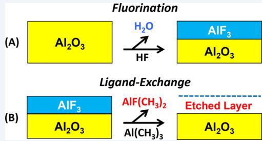

There are a number of mechanisms for thermal ALE that have developed over the last five years. This Accoun will first examine the fluorination and ligand- exchange mechanism for thermal ALE. This mechanism is applicable for many metal oxide and metal nitride materials. Subsequently, the "conversion etch" mechanisms will be explored that are derived from the conversion of the surface of the substrate to a new material. The "conversion etch" mechanisms are needed when the initial material does not have a viable etching pathway via lidormation and ligand- exchange of when the material has a volatile fluoride. The thermal ALE mechanisms founded on either oxidation or halogenation of the initial substrate will then be examined with an emphasis on metal thermal ALE. Lastly, thermal ALE mechanisms will be considered that are based on self- limiting surface ligands or temperature modulation mechanisms. These various mechanisms offer a wide range of pathways to remove material isotropically with atomic layer control.

Thermal ALE will be required to fabricate advanced semiconductor devices. This fabrication will increasingly occur beyond the limits of lithography and will extend into the third dimension. The situation is like Manhattan during the advent of skyscrapers. When there was no more room on the ground, building started to move to the third dimension. Three- dimensional devices require a sequential series of deposition and etching steps to build the skyscraper structures. Some etching needs to be vertical and anisotropic to make the elevator shafts. Other etching needs to be horizontal and isotropic to form the hallways. The mechanisms of thermal ALE will be critical for the definition of isotropic ALE processes.

Reaching beyond the limits of lithography will also increase the need for maskless processing. The mechanisms of thermal ALE lead to strategies for selective etching of one material in the presence of many materials. In addition, area- selective deposition can benefit from the ability of thermal ALE to enhance deposition on the desired growth surfaces by removing deposition from other surrounding surfaces. Looking ahead, thermal ALE will continue to provide unique capabilities and will grow in importance as a nanofabrication processing technique.

# 1. INTRODUCTION

With continued iminaturation, atomic layer processing is increasingly important for nanofabrication. There is a need for atomic layer control for both deposition and removal of material. Sequential, self- limiting surface reactions provide the foundation for atomic layer deposition (ALD) and atomic layer etching (ALE). ALD is a well- established technique that underlies semiconductor device fabrication and many other applications. ALE is a relative newcomer that is still in the developmental stage.

ALE can be subdivided into two categories: plasma ALE2,4 and thermal ALE. Both plasma and thermal ALE utilize sequential surface modification and removal reactions. Plasma ALE removes surface species with energetic ions or neutral atoms.24 Because of the directionality of the energetic ions and neutral atoms, plasma ALE yields anisotropic etching that is needed to fabricate high aspect ratio features.2 In contrast, the randomness of gas species and the self- limiting nature of thermal ALE reactions produce isotropic and conformal etching.6,7

Thermal ALE can be viewed as the reverse of ALD. Both thermal ALE and ALD rely on binary surface reaction sequences.

A schematic for thermal ALE based on surface modification and volatilization reactions is shown in Figure 1. The first surface modification reaction produces an altered surface layer. The second reaction then liberates volatile etch products from this altered surface layer. Ideally, both of these surface reactions are self- limiting. The repetition of these surface modification and volatilization reactions defines the thermal ALE process.

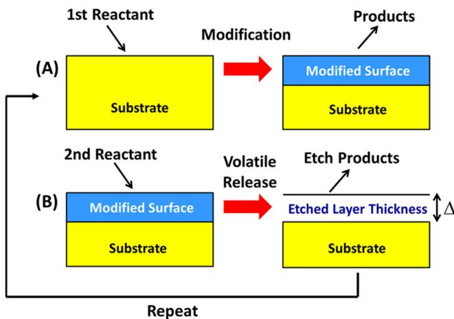  
Figure 1. Schematic of ALE process based on sequential surface modification and volatile release reactions.

This Account considers the mechanisms of ALE processes that are only dependent on temperature or involve thermal annealing. ALE processes that involve ions or energetic neutral atoms for the volatile release process are not considered in this survey. Some plasma processes that are utilized only for surface modification are included in this Account. The goal is to introduce the many possible pathways for thermal ALE and to inspire the development of new mechanisms.

# 2. FLUORINATION AND LIGAND-EXCHANGE MECHANISM

The main thermal ALE mechanism for metal oxides is based on fluorination and ligand- exchange reactions. Fluorination is the surface modification reaction. Fluorination is thermochemically favorable because most metal fluorides are more stable than their corresponding metal oxides. One difficulty with fluorination is that some metal fluorides are volatile. These metal oxides require a different thermal ALE mechanism.

Ligand- exchange is the reaction that volatilizes the modified surface. Ligand- exchange is a metal- exchange transmetalation reaction between adjacent metal centers. Ligand- exchange reactions are useful to replace fluorine in the metal fluoride with ligands that break the strong metal- fluorine- metal bridge bonding that stabilizes the metal fluoride. This ligand replacement leads to volatile complexes that can desorb from the surface.

# 2.1. Thermal  $\mathsf{Al}_2\mathsf{O}_3$  ALE

The first fluorination and ligand- exchange reaction utilized HF and  $\mathrm{Sn(acac)}_2$  as the reactants for  $\mathrm{Al}_2\mathrm{O}_3$  ALE. The original intent of using these reactants was to grow  $\mathrm{SnF}_2$  by an ALD process on an  $\mathrm{Al}_2\mathrm{O}_3$  ALD surface. However, these reactions were observed to etch the  $\mathrm{Al}_2\mathrm{O}_3$  instead of depositing  $\mathrm{SnF}_2$ . Figure 2 shows quartz crystal microbalance (QCM) results that observed the linear loss of mass versus number of  $\mathrm{Al}_2\mathrm{O}_3$  ALE cycles at  $200^{\circ}\mathrm{C}$ . The mass loss of  $- 8.4 \mathrm{ng / (cm^2)}$  cycle is equivalent to an etch rate of  $0.28 \mathrm{\AA / cycle}$ . These results suggested that a new class of reactions similar to the "reverse of ALD" was possible to remove material.

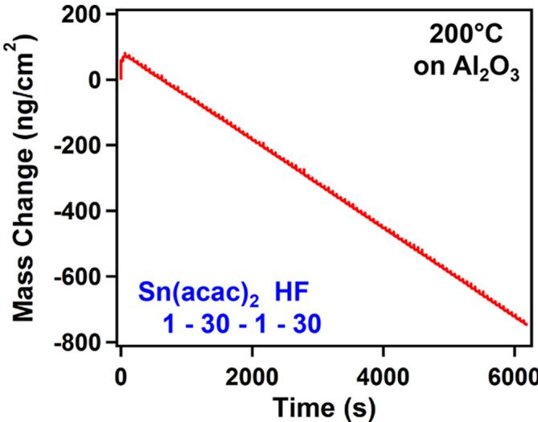  
Figure 2. Mass change versus time during  $\mathrm{Al}_2\mathrm{O}_3$  ALE at  $200^{\circ}\mathrm{C}$  using HF and  $\mathrm{Sn(acac)}_2$  as the reactants. Reproduced with permission from ref 5. Copyright 2015 American Chemical Society.

Subsequent studies explored the mechanism of  $\mathrm{Al}_2\mathrm{O}_3$  ALE with HF and  $\mathrm{Sn(acac)}_2$ . These investigations identified the growth of surface fluoride and loss of  $\mathrm{Al}_2\mathrm{O}_3$  during the HF exposure. Likewise, the loss of surface fluoride was monitored during the  $\mathrm{Sn(acac)}_2$  exposure. The ligand- exchange reaction transfers acac ligands to the  $\mathrm{AlF}_3$  surface layer. Presumably,  $\mathrm{SnF(acac)}$  remains volatile after the ligand- exchange reaction. The Al species probably become volatile as  $\mathrm{AlF(acac)}_2$  or  $\mathrm{Al(acac)}_3$  after multiple ligand- exchange reactions or redistribution of acac ligands on the surface.

Additional studies explored other precursors for the ligand- exchange reaction. Trimethylaluminum (TMA) was observed to etch  $\mathrm{Al}_2\mathrm{O}_3$  together with HF for the fluorination reaction. These results were remarkable because TMA is the main precursor for  $\mathrm{Al}_2\mathrm{O}_3$  ALD using  $\mathrm{H}_2\mathrm{O}$  as the oxygen precursor. With only the change of  $\mathrm{H}_2\mathrm{O}$  to HF, the TMA reactant can etch  $\mathrm{Al}_2\mathrm{O}_3$ . The ligand- exchange reaction between TMA and  $\mathrm{AlF}_3$  is shown in Figure 3. This reaction produces  $\mathrm{AlF(CH}_3\mathrm{)}_2$

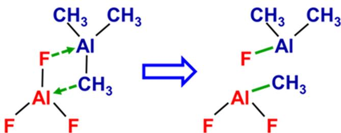  
Figure 3. Ligand-exchange reaction between  $\mathrm{AlF}_3$  and  $\mathrm{Al(CH}_3\mathrm{)}_3$ . Reproduced with permission from ref 9. Copyright 2016 American Chemical Society.

(dimethylaluminum fluoride, DMAF) from the TMA reactant. In addition,  $\mathrm{AlF(CH}_3\mathrm{)}_2$  may also be the volatile etch product from the  $\mathrm{AlF}_3$  surface after two ligand- exchange reactions or redistribution of  $\mathrm{CH}_3$  ligands on the surface.

The overall reaction for  $\mathrm{Al}_2\mathrm{O}_3$  ALE using HF and TMA can be written as

$$
\mathrm{Al}_2\mathrm{O}_3 + 6\mathrm{HF} + 4\mathrm{Al}(\mathrm{CH}_3)_3\rightarrow 6\mathrm{AlF}(\mathrm{CH}_3)_2 + 3\mathrm{H}_2\mathrm{O}
$$

This reaction can be divided into individual HF and TMA reactions:14

$$
\begin{array}{rl} & {\mathrm{(A)Al_2O_3|Al_2O_3^* + 6HF\rightarrow Al_2O_3|2AlF_3^* + 3H_2O}}\\ & {\mathrm{(B)Al_2O_3|2AlF_3^* + 4Al(CH_3)_3\rightarrow Al_2O_3^* + 6AlF(CH_3)_2}} \end{array} \tag{2}
$$

The  $\mathrm{Al}_2\mathrm{O}_3$  that is etched during the ALE reactions is designated by  $\mathrm{Al}_2\mathrm{O}_3^*$ . The asterisks indicate the surface species and the vertical lines separate the various species. A schematic for  $\mathrm{Al}_2\mathrm{O}_3$  ALE is also displayed in Figure 4.

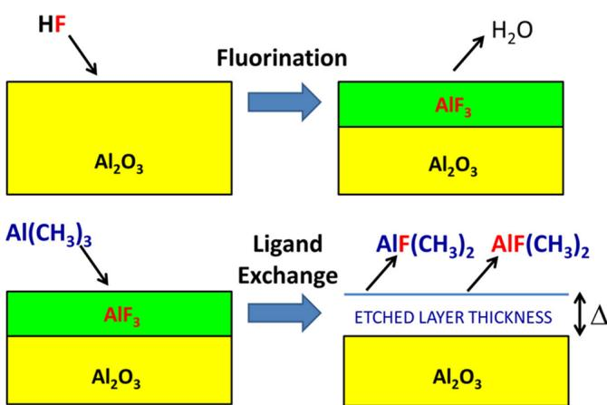  
Figure 4. Schematic of  $\mathrm{Al}_2\mathrm{O}_3$  ALE based on fluorination with HF and ligand-exchange with  $\mathrm{Al(CH_3)_3}$ .

Mass spectrometry studies confirmed the presence of  $\mathrm{AlF(CH_3)_2}$  etch products. However, DMAF was observed as the dimer of DMAF with itself (DMAF/DMAF) or with TMA (DMAF/TMA). These dimers are favored because of strong bridge bonding between fluorine and the Al metal centers. Fluorine forms stronger bridge bonds between the Al metal centers than  $\mathrm{CH}_3$ . Knowledge of the bridge bonding strengths suggests that fluorine forms bridge bonds in the dimers and  $\mathrm{CH}_3$  ligands are in the terminal positions. The terminal  $\mathrm{CH}_3$  ligands facilitate desorption of the dimer from the surface.

Temperature also was a key variable for  $\mathrm{Al}_2\mathrm{O}_3$  ALE. The HF and TMA reactants led to  $\mathrm{Al}_2\mathrm{O}_3$  ALE at  $>250^{\circ}\mathrm{C}$ . The etch rates were progressively higher at higher temperatures where the sequential reactant exposures yield etching by fluorination and ligand- exchange. The HF and TMA reactants could also produce  $\mathrm{AlF}_3$  ALE at  $T< 250^{\circ}\mathrm{C}$  where the sequential reactant exposures led to metal fluoride growth by an ALD process. Competition between  $\mathrm{Al}_2\mathrm{O}_3$  ALE and  $\mathrm{AlF}_3$  ALE was also observed in studies on  $\mathrm{SiO}_2$  nanoparticles.

There is also competition between  $\mathrm{Al}_2\mathrm{O}_3$  ALE and  $\mathrm{AlF}_3$  growth when using HF and TMA as the reactants during rapid  $\mathrm{Al}_2\mathrm{O}_3$  ALE. For rapid  $\mathrm{Al}_2\mathrm{O}_3$  ALE, there is no purge time, and the HF and TMA exposures overlap in time and produce  $\mathrm{AlF}_3$  CVD. The subsequent TMA exposure outside of the overlap with HF is then able to spontaneously etch  $\mathrm{AlF}_3$ . After removing the  $\mathrm{AlF}_3$  CVD layer, TMA can proceed to remove the  $\mathrm{AlF}_3$  layer on the surface of the  $\mathrm{Al}_2\mathrm{O}_3$  substrate. The spontaneous etch of  $\mathrm{AlF}_3$  by TMA allows rapid  $\mathrm{Al}_2\mathrm{O}_3$  ALE to be performed with a short cycle time without a purge.

Additional experimental studies explored the fluorination of  $\mathrm{Al}_2\mathrm{O}_3$  by HF. Higher HF pressure increased the  $\mathrm{Al}_2\mathrm{O}_3$  fluorination and the  $\mathrm{Al}_2\mathrm{O}_3$  etch rate. Fluoride thicknesses up to  $5 - 6\mathrm{\AA}$  were measured for higher HF pressures of  $4 - 8$  Torr. These high HF pressures yielded  $\mathrm{Al}_2\mathrm{O}_3$  etch rates of  $\sim 2.5\mathrm{\AA}/$  cycle at  $300^{\circ}\mathrm{C}$ . Theoretical studies have also examined the fluorination of  $\Theta - \mathrm{Al}_2\mathrm{O}_3$  by HF. These investigations revealed that a self- limiting fluoride coverage is obtained on  $\Theta - \mathrm{Al}_2\mathrm{O}_3$ . The experimental studies were consistent with a fluoride composition of  $\mathrm{Al}_2\mathrm{OF}_4$ .

# 2.2. Other Materials, Reactants, and Effect of Film Structure

The fluorination and ligand- exchange mechanism is applicable for many other metal oxides including  $\mathrm{HfO}_2$  and  $\mathrm{ZrO}_2$ . In addition to  $\mathrm{Sn(acac)}_2$  and TMA, many different metal precursors such as  $\mathrm{AlCl(CH}_3\right)_2$  (dimethylaluminum chloride (DMAC)),  $\mathrm{SiCl}_4$  and  $\mathrm{TiCl}_4$ , have been effective for the ligand- exchange reaction. These metal precursors provide various ligands, such as acac,  $\mathrm{CH}_3$ , and Cl. Different degrees of etching selectivity are derived from these ligands.

Etching selectivity results for TMA are shown in Figure 5a. Together with HF for fluorination, TMA is able to etch  $\mathrm{Al}_2\mathrm{O}_3$

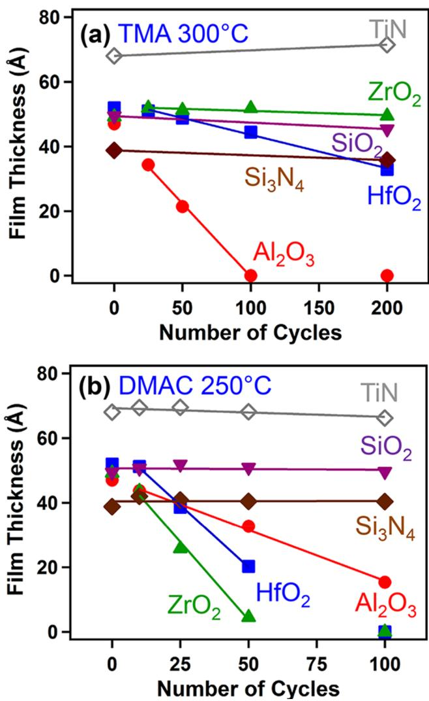  
Figure 5. Film thickness versus number of ALE cycles for various materials using HF as fluorine reactant and (a) TMA or (b) DMAF as metal precursor for ligand-exchange. Reproduced with permission from ref 23. Copyright 2016 American Chemical Society.

and  $\mathrm{HfO}_2$ . However, TMA is not able to etch TiN,  $\mathrm{ZrO}_2$ ,  $\mathrm{SiO}_2$ , or  $\mathrm{Si}_3\mathrm{N}_4$ .  $\mathrm{Al}_2\mathrm{O}_3$  is able to etch because  $\mathrm{AlF}(\mathrm{CH}_3)_2$  is a stable and volatile etch product.  $\mathrm{HfO}_2$  etches at a lower rate, presumably because possible etch products such as  $\mathrm{HfF}(\mathrm{CH}_3)_3$  or  $\mathrm{Hf}(\mathrm{CH}_3)_4$  are not as stable and volatile as  $\mathrm{AlF}(\mathrm{CH}_3)_2$ . In comparison,  $\mathrm{ZrO}_2$  etches at a negligible rate. The differences between  $\mathrm{HfO}_2$  and  $\mathrm{ZrO}_2$  are surprising because the properties of  $\mathrm{Hf}$  and  $\mathrm{Zr}$  are usually similar. However,  $\mathrm{Hf}(\mathrm{CH}_3)_4$  has a higher stability than  $\mathrm{Zr}(\mathrm{CH}_3)_4$  and the  $\mathrm{Hf} - \mathrm{CH}_3$  bond energy is larger than the  $\mathrm{Zr} - \mathrm{CH}_3$  bond energy. $^{24,25}$

Another example of selectivity for DMAC is displayed in Figure 5b. $^{23}$  In similarity to the results for TMA in Figure 5a,  $\mathrm{Al}_2\mathrm{O}_3$  and  $\mathrm{HfO}_2$  are etched by DMAC together with HF for fluorination. These results are anticipated because TMA and DMAC both have  $\mathrm{CH}_3$  ligands for the ligand- exchange reaction. In addition, DMAC is able to etch  $\mathrm{ZrO}_2$ . The ability of DMAC to etch  $\mathrm{ZrO}_2$  is believed to be linked to the Cl ligand on DMAC. A ligand- exchange reaction between DMAC and the fluoride layer on  $\mathrm{ZrO}_2$  can transfer Cl ligands that can form stable and volatile  $\mathrm{Zr}$  complexes.

Stronger fluoride precursors than HF may be needed for thermochemically favorable fluorination.  $\mathrm{SF}_4$  and  $\mathrm{XeF}_2$  are two stronger fluorination reactants that have been explored for thermal ALE.  $\mathrm{SF}_4$  was demonstrated for  $\mathrm{Al}_2\mathrm{O}_3$  ALE and  $\mathrm{VO}_2$  ALE. $^{26}$  Metal nitrides can also be etched using thermal ALE based on fluorination and ligand- exchange reactions.  $\mathrm{XeF}_2$  was reported to be necessary for GaN ALE. $^{27}$  In contrast,  $\mathrm{SF}_4$  and HF were not successful for GaN ALE. $^{27}$  The difficulty in etching GaN may be related to the crystallinity of the GaN films. However, AlN ALE was observed for crystalline AlN films using HF and  $\mathrm{Sn}(\mathrm{acac})_2$  as the reactants. $^{28}$

The effect of film crystallinity has been studied for amorphous and crystalline  $\mathrm{HfO}_2$ ,  $\mathrm{ZrO}_2$ , and  $\mathrm{HfZrO}_4$  films. $^{29}$  The amorphous films all etched faster than the crystalline films under the same reaction conditions.  $\mathrm{HfO}_2$  ALE results for amorphous and crystalline  $\mathrm{HfO}_2$  films using HF and  $\mathrm{TiCl}_4$  as the reactants at 250  ${}^\circ \mathrm{C}$  are displayed in Figure 6.  $^{29}$  Crystallinity reduces the etch rate. This reduction may be related to the higher density of the crystalline films. Fluorination of the metal oxides results in a volume expansion. This volume expansion may be easier for the amorphous films. $^{29}$

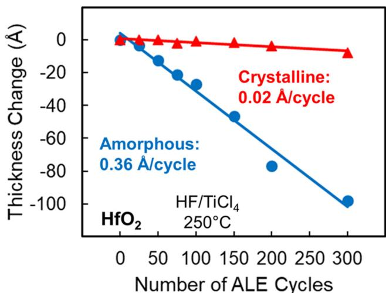  
Figure 6. Thickness change versus number of ALE cycles for crystalline and amorphous  $\mathrm{HfO}_2$  using HF and  $\mathrm{TiCl}_4$  as reactants. Reproduced with permission from ref 29. Copyright 2020 American Vacuum Society.

# 3. CONVERSION MECHANISMS

Many materials do not have a direct pathway for thermal ALE based on fluorination and ligand- exchange reactions. Some metal oxides will form a volatile fluoride and etch spontaneously. Other metal fluorides after fluorination may not easily form stable and volatile etch products with various metal precursors. For example, Figure 5 showed that the TMA and DMAC metal precursors were not able to etch TiN,  $\mathrm{SiO}_2$ , or  $\mathrm{Si}_3\mathrm{N}_4$  under the reaction conditions employed at 250 or  $300^{\circ}\mathrm{C}$ . $^{23}$  These materials do not have accessible pathways to stable and volatile etch products.

One possible strategy for these materials is to use a metal precursor to convert the surface of the original metal oxide to another metal oxide. This conversion process occurs because the original metal oxide is not as stable as the resulting metal oxide. The stability of the metal oxides can be determined by their heats of formation. In addition, Ellingham diagrams or thermochemical calculations can be used to predict the possible conversion of one oxide to another more stable oxide. A metal nitride can also be converted to another more stable nitride.

# 3.1. Conversion, Fluorination, and Ligand-Exchange

The conversion mechanism was initially observed for  $\mathrm{ZnO}$  ALE using HF and TMA. $^{30}$  QCM studies revealed much larger mass losses during TMA exposures than expected from ligand- exchange reactions. These large mass losses suggested that TMA converts the surface of the  $\mathrm{ZnO}$  substrate to a more stable  $\mathrm{Al}_2\mathrm{O}_3$  surface layer. The  $\mathrm{Al}_2\mathrm{O}_3$  surface layer can then be fluorinated and subsequently removed by the TMA ligand- exchange reaction. The TMA can continue to convert the underlying  $\mathrm{ZnO}$  surface to  $\mathrm{Al}_2\mathrm{O}_3$ . A schematic illustrating the  $\mathrm{ZnO}$  ALE surface chemistry via the conversion, fluorination, and ligand- exchange mechanism is shown in Figure 7.  $^{30}$

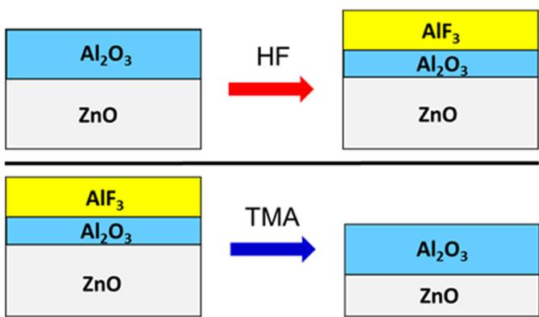  
Figure 7. Schematic for  $\mathrm{ZnO}$  ALE using HF and TMA as reactants. TMA removes  $\mathrm{AlF}_3$  layer by ligand-exchange and then converts the surface of underlying  $\mathrm{ZnO}$  to an  $\mathrm{Al}_2\mathrm{O}_3$  surface layer. Reproduced with permission from ref 30. Copyright 2017 American Chemical Society.

Another example of the conversion, fluorination, and ligand- exchange mechanism is thermal  $\mathrm{SiO}_2$  ALE using HF and TMA. $^{31}$  TMA is able to convert the surface of  $\mathrm{SiO}_2$  to  $\mathrm{Al}_2\mathrm{O}_3$ . This conversion process requires higher pressures of TMA than the TMA pressures of  $\sim 40$  mTorr that were utilized in the TMA results shown in Figure 5a. $^{23}$  At reactant pressures of 1.0 and 4.0 Torr,  $\mathrm{SiO}_2$  etch rates were 0.18 and  $0.27 \mathrm{\AA}$  /cycle, respectively. $^{31}$  Corresponding Fourier transform infrared (FTIR) spectroscopy

studies confirmed the conversion of  $\mathrm{Si} - \mathrm{O}$  stretching vibrations to  $\mathrm{Al} - \mathrm{O}$  stretching vibrations. The FTIR investigations also observed greater conversion at higher reactant pressures. A schematic of thermal  $\mathrm{SiO}_2$  ALE via conversion to  $\mathrm{Al}_2\mathrm{O}_3$  or aluminum oxide silicate is shown in Figure 8.31

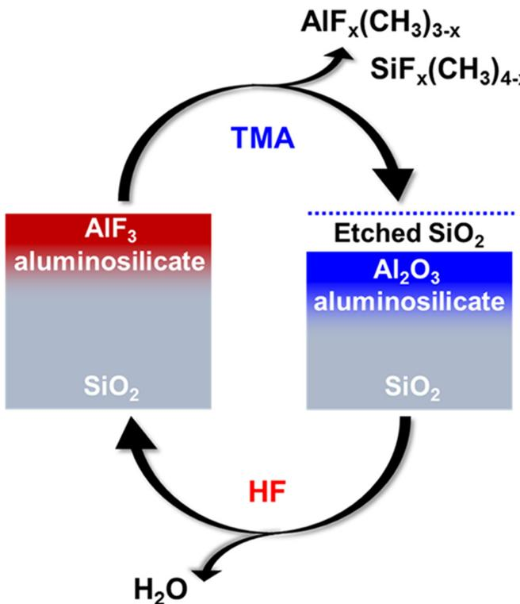

# 3.2. Conversion and Fluorination to Volatile Fluoride

Another class of conversion reactions produce metal oxides that spontaneously etch to produce volatile fluorides after fluorination. These conversion reactions readily lead to pathways for thermal ALE. One useful reactant for conversion and fluorination to a volatile fluoride is  $\mathrm{BCl}_3$ .  $\mathrm{BCl}_3$  can convert metal oxides to  $\mathrm{B}_2\mathrm{O}_3$  because  $\mathrm{B}_2\mathrm{O}_3$  is a very stable metal oxide. In addition,  $\mathrm{B}_2\mathrm{O}_3$  can be etched spontaneously using HF.32 The spontaneous etch products are believed to be  $\mathrm{BF}_3$  and  $\mathrm{B(OH)F}_2$

$\mathrm{WO}_3$  ALE using  $\mathrm{BCl}_3$  and HF is an example of an ALE process that may occur via conversion and fluorination to a volatile fluoride. The proposed mechanism for  $\mathrm{WO}_3$  ALE is shown in Figure 9.33 The surface of  $\mathrm{WO}_3$  is first converted to a  $\mathrm{B}_2\mathrm{O}_3$  surface layer by  $\mathrm{BCl}_3$  exposure. Subsequently, the  $\mathrm{B}_2\mathrm{O}_3$  surface layer is spontaneously etched by HF. The underlying  $\mathrm{WO}_3$  is not spontaneously etched by HF and serves as an etch stop. Mass spectrometry studies are needed to confirm this etching mechanism.

# 4. OXIDATION MECHANISMS

Oxidation is a useful step for many thermal ALE pathways. Oxidation changes the oxidation number of the element that may be critical to obtain the correct oxidation state for the stable, volatile etch product. Oxidation can oxidize elemental metals to metal oxides. Elemental metals have an oxidation state of zero. Many volatile metal etch products have the metal oxidation state in  $^{2 + }$ ,  $^{3 + }$ , or  $^{4 + }$ . Oxidation can also convert metal nitrides to metal oxides. Many metal nitrides have the metal in the  $^{3 + }$  oxidation state. However, many stable etch products require the metal in the  $^{4 + }$  oxidation state.

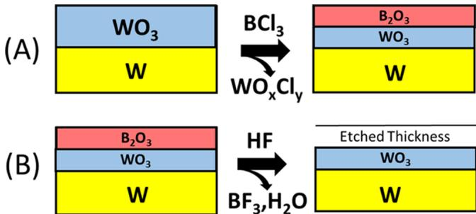  
Figure 9. Schematic for  $\mathrm{WO}_3$  ALE using  $\mathrm{BCl}_3$  and HF as reactants.  $\mathrm{BCl}_3$  converts the surface of  $\mathrm{WO}_3$  to a  $\mathrm{B}_2\mathrm{O}_3$  surface layer. HF then spontaneously etches the  $\mathrm{B}_2\mathrm{O}_3$  surface layer. Reproduced with permission from ref 32. Copyright 2017 American Chemical Society.

# 4.1. Oxidation and Fluorination to Volatile Fluoride

TiN ALE using  $\mathrm{O}_3$  and HF as the reactants is an example of oxidation and fluorination to a volatile fluoride.33 The oxidation state of Ti in TiN is  $^{3 + }$ . The oxidation state for most stable volatile Ti complexes is  $^{4 + }$ . TiN can be oxidized to  $\mathrm{TiO}_2$  using ozone. This oxidation converts the Ti oxidation state to  $^{4 + }$ . After the oxidation of TiN to  $\mathrm{TiO}_2$ , the  $\mathrm{TiO}_2$  surface layer can be spontaneously etched using HF. A schematic of TiN ALE is displayed in Figure 10.33 TiN etch rates of  $0.2\mathrm{A} / \mathrm{cycle}$  were measured at  $250^{\circ}\mathrm{C}$ . The TiN etch rate was also self- limiting versus  $\mathrm{O}_3$  and HF exposure times.33

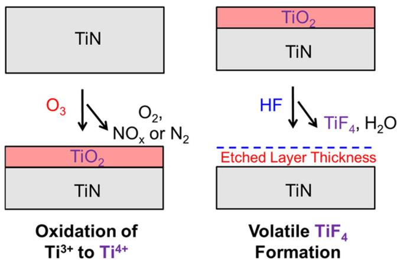  
Figure 8. Schematic for  $\mathrm{SiO}_2$  ALE using TMA and HF as reactants. TMA removes  $\mathrm{AlF}_2$  layer by ligand-exchange and then converts surface of underlying  $\mathrm{SiO}_2$  to an  $\mathrm{Al}_2\mathrm{O}_3$  surface layer. Reproduced with permission from ref 31. Copyright 2017 American Chemical Society.  
Figure 10. Schematic for TiN ALE using  $\mathrm{O}_3$  and HF as reactants.  $\mathrm{O}_3$  oxidizes TiN to  $\mathrm{TiO}_2$ . HF then spontaneously etches the  $\mathrm{TiO}_2$  surface layer. Reproduced with permission from ref 33. Copyright 2017 American Chemical Society.

W ALE using  $\mathrm{O}_2$  and  $\mathrm{WF}_6$  is another example of oxidation and fluorination to a volatile fluoride.34 For W ALE, the W surface is first oxidized to  $\mathrm{WO}_3$  using  $\mathrm{O}_2$ . This oxidation changes the oxidation state of W from 0 to  $^{6 + }$ . Subsequently,  $\mathrm{WF}_6$  is able to etch the  $\mathrm{WO}_3$  surface layer by forming volatile  $\mathrm{WO}_x\mathrm{F}_y$  species. This W ALE procedure is consistent with previous studies where  $\mathrm{WF}_6$  was observed to spontaneously etch  $\mathrm{WO}_3$  at  $>180^{\circ}\mathrm{C}$  during  $\mathrm{WO}_3$  ALD.35,36

# 4.2.Oxidation,Conversion,Fluorination,and Ligand-Exchange

4.2. Oxidation, Conversion, Fluorination, and Ligand- ExchangeOxidation can also be used together with conversion to define other thermal ALE mechanisms. The oxidation and conversion pathway is critical to define thermal Si ALE. For thermal Si ALE, Si is first oxidized to produce a surface  $\mathrm{SiO}_2$  layer. Subsequently, the surface  $\mathrm{SiO}_2$  layer is converted to  $\mathrm{Al}_2\mathrm{O}_3$  or an aluminum oxide silicate using TMA at higher pressures as discussed in Section 3.1. The  $\mathrm{Al}_2\mathrm{O}_3$  or aluminum oxide silicate is then removed by fluorination and ligand- exchange reactions as discussed in Section 2.1. A schematic for thermal Si ALE is shown in Figure 11.

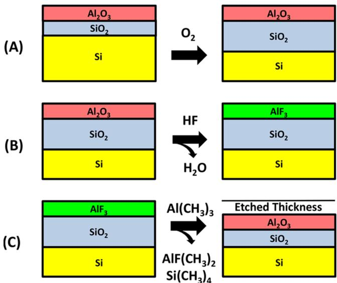  
Figure 11. Schematic for Si ALE using  $\mathrm{O}_2$ ,  $\mathrm{HF}$ , and  $\mathrm{Al(CH_3)_3}$ .  $\mathrm{O}_2$  oxidizes Si to  $\mathrm{SiO}_2$ .  $\mathrm{HF}$  converts the top  $\mathrm{Al}_2\mathrm{O}_3$  layer to  $\mathrm{AlF}_3$ .  $\mathrm{Al(CH_3)_3}$  removes the  $\mathrm{AlF}_3$  surface layer by a ligand-exchange reaction and then converts  $\mathrm{SiO}_2$  to  $\mathrm{Al}_2\mathrm{O}_3$ . Reproduced with permission from ref 37. Copyright 2018 American Chemical Society.

Results for Si ALE based on spectroscopic ellipsometry studies are displayed in Figure 12. Si ALE using a  $\mathrm{O}_2$ ,  $\mathrm{HF}$ , and TMA reaction sequence yields a Si etch rate of  $0.4 \mathrm{\AA}$  cycle at  $290^{\circ}\mathrm{C}$ . The ellipsometric investigations also monitor a  $\mathrm{SiO}_2$  layer with a thickness of  $\sim 11 \mathrm{\AA}$  that exists on the Si surface during Si ALE. This  $\mathrm{SiO}_2$  layer is continuously formed from Si oxidation and then converted to an  $\mathrm{Al}_2\mathrm{O}_3$  or aluminum oxide silicate surface layer by the TMA exposure prior to removal by fluorination and ligand- exchange reactions.

$\mathrm{Si}_3\mathrm{N}_4$  ALE can also be accomplished using the oxidation, conversion, fluorination and ligand- exchange mechanism. Because  $\mathrm{Si}_3\mathrm{N}_4$  is more difficult to oxidize than Si,  $\mathrm{O}_3$  is preferable to  $\mathrm{O}_2$  for the oxidation reaction. Similar etch rates are measured for  $\mathrm{Si}_3\mathrm{N}_4$  ALE and Si ALE under comparable reaction conditions with  $\mathrm{O}_3$  as the oxidant for  $\mathrm{Si}_3\mathrm{N}_4$  ALE and  $\mathrm{O}_2$  as the oxidant for Si ALE. A  $\mathrm{Si}_3\mathrm{N}_4$  etch rate of  $0.47 \mathrm{\AA}$  cycle was measured at  $290^{\circ}\mathrm{C}$  using an  $\mathrm{O}_3\mathrm{- HF - TMA}$  reactant sequence.

# 4.3.Oxidation, Conversion, and Fluorination to Volatile Fluoride

Oxidation can also be combined with conversion and fluorination to a volatile fluoride to define another thermal ALE mechanism. This pathway was utilized for thermal W ALE.32 The W substrate was first oxidized using ozone to form a

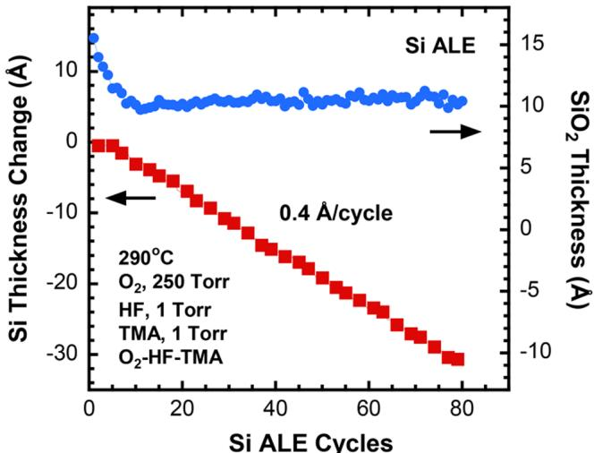  
Figure 12. Si ALE using  $\mathrm{O}_2$ ,  $\mathrm{HF}$ , and  $\mathrm{Al(CH_3)_3}$  as reactants at  $290^{\circ}\mathrm{C}$ . Si etching occurs with an etch rate of  $0.4 \mathrm{\AA}$  cycle, while the top  $\mathrm{SiO}_2$  layer remains constant at  $\sim 11 \mathrm{\AA}$ . Reproduced with permission from ref 37. Copyright 2018 American Chemical Society.

$\mathrm{WO}_3$  surface layer. The  $\mathrm{WO}_3$  surface layer was then removed using  $\mathrm{BCl}_3$  and  $\mathrm{HF}$  as the reactants as discussed in Section 3.2.  $\mathrm{BCl}_3$  converts the  $\mathrm{WO}_3$  surface layer to a  $\mathrm{B}_2\mathrm{O}_3$  surface layer.  $\mathrm{HF}$  can then spontaneously etch the  $\mathrm{B}_2\mathrm{O}_3$  surface layer. A schematic showing this three- step process is given in Figure 13.

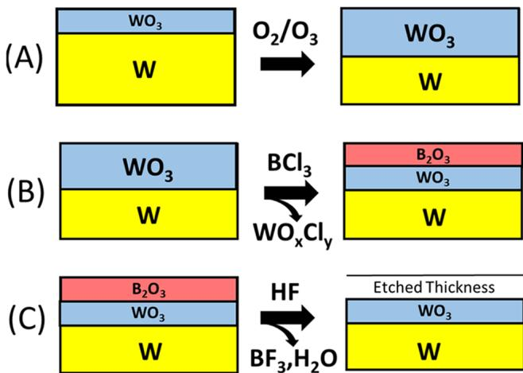  
Figure 13. Schematic for W ALE using  $\mathrm{O}_2 / \mathrm{O}_3$ ,  $\mathrm{BCl}_3$ , and  $\mathrm{HF}$ .  $\mathrm{O}_2 / \mathrm{O}_3$  oxidizes W to  $\mathrm{WO}_3$ .  $\mathrm{BCl}_3$  converts  $\mathrm{WO}_3$  to  $\mathrm{B}_2\mathrm{O}_3$ .  $\mathrm{HF}$  then spontaneously etches  $\mathrm{B}_2\mathrm{O}_3$ . Reproduced with permission from ref 32. Copyright 2017 American Chemical Society.

In situ spectroscopic ellipsometry measurements monitored both the  $\mathrm{WO}_3$  surface layer and the underlying W film thickness during W ALE. Figure 14 shows the  $\mathrm{WO}_3$  and W thicknesses during W ALE at  $207^{\circ}\mathrm{C}$ . The  $\mathrm{WO}_3$  thickness displayed in Figure 14a oscillates as the  $\mathrm{WO}_3$  layer is increased in thickness by  $\mathrm{O}_3$  exposures and then etched by  $\mathrm{BCl}_3 / \mathrm{HF}$  exposures. While the  $\mathrm{WO}_3$  thickness is oscillating, the underlying W film thickness decreases linearly as W is progressively converted into  $\mathrm{WO}_3$ . The results in Figure 14b yield a W etch rate of  $2.44 \mathrm{\AA}$  cycle. Additional experiments determined that the individual  $\mathrm{O}_3$ ,  $\mathrm{BCl}_3$ , and  $\mathrm{HF}$  exposures were self- limiting.

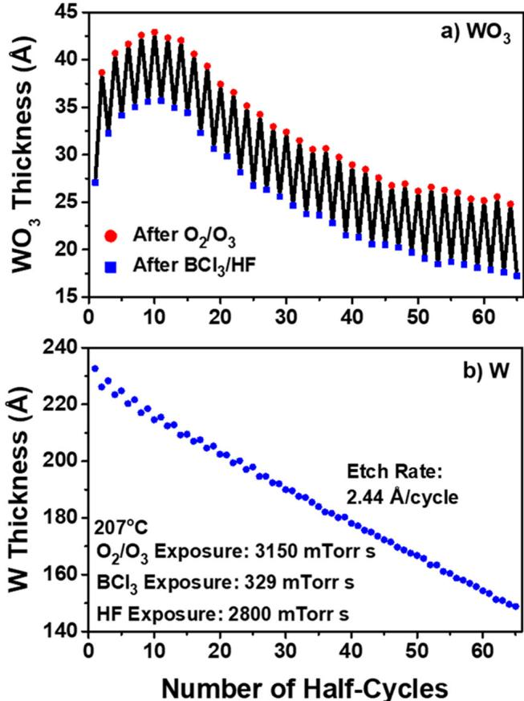  
Figure 14. W ALE using  $\mathrm{O}_2 / \mathrm{O}_2$ ,  $\mathrm{BCl}_3$ , and HF as reactants at  $207^{\circ}\mathrm{C}$ . (a)  $\mathrm{WO}_3$  thickness increases after  $\mathrm{O}_2 / \mathrm{O}_3$  exposure and decreases after  $\mathrm{BCl}_3 / \mathrm{HF}$  exposure. (b) W etching occurs with an etch rate of  $2.44\mathrm{\AA}/$  cycle. Reproduced with permission from ref 32. Copyright 2017 American Chemical Society.

# 4.4. Oxidation and Ligand Volatilization

Oxidation is critical for thermal metal ALE. Oxidation increases the oxidation state of the metal. Subsequently, various ligands can extract the oxidized metal and produce a metal complex that is both stable and volatile. Copper thermal ALE is an example of this mechanism using oxidation with  $\mathrm{O}_2$  or  $\mathrm{O}_3$  to increase the  $\mathrm{Cu}$  oxidation number and yield  $\mathrm{Cu}_2\mathrm{O}$  or  $\mathrm{CuO}$ , respectively. The  $\mathrm{Cu}_2\mathrm{O}$  is then believed to interact with hexafluoroacetylacetone (hfacH) in a disproportionation reaction to form volatile  $\mathrm{Cu(hfac)_2}$  and elemental  $\mathrm{Cu}$ . This process produced an etch rate of  $0.9\mathrm{\AA}/$  cycle at  $275^{\circ}\mathrm{C}$ . Alternatively, the  $\mathrm{CuO}$  is thought to interact with hfacH to produce  $\mathrm{Cu(hfac)_2}$  and  $\mathrm{H}_2\mathrm{O}$ . This process yielded an etch rate of  $84\mathrm{\AA}/$  cycle at  $275^{\circ}\mathrm{C}$ .

Metal ALE using oxidation and ligand volatilization has also been performed using an  $\mathrm{O}_2$  plasma to oxidize the metal. Fe, Cu, Co, Pd, and Pt have been oxidized using an  $\mathrm{O}_2$  plasma to change the oxidation state of the metal. Subsequently, the metal oxide has been removed using various organic ligands such as formic acid. The metal etch rates varied from  $5\mathrm{\AA}/$  cycle for Pt to  $42\mathrm{\AA}/$  cycle for Fe. The etch rates also were proportional to the oxide thicknesses produced by the  $\mathrm{O}_2$  plasma.

# 5. HALOGENATION MECHANISMS

Halogenation is another key step for the thermal ALE of metals. Like oxidation, halogenation changes the oxidation state of the metal. This change may be necessary for the metal to obtain the correct oxidation state to yield stable, volatile etch products. The metal complexes will have an oxidation state determined by the number of halide ligands. In addition, the metal complexes will also contain additional two- electron donor ligands to obey the "18 electron rule" or "16 electron rule".

Guidelines to determine stable metal complexes are given by the Covalent Bond Classification (CBC) method.  $\mathrm{X}$  ligands are one- electron donors such as halogens like Cl. L ligands are two- electron donors like  $\mathrm{PR}_3$  or  $\mathrm{NR}_3$ . The stable metal complex has an initial number of d- electrons. The metal will add electrons by binding X and L ligands to obtain 18 or 16 electrons in its outer shell. For example, Ni has 10 d- electrons, and Ni complexes typically have  $\mathrm{NiX}_2\mathrm{L}_3$  or  $\mathrm{NiX}_2\mathrm{L}_2$  configurations. One approach for Ni ALE is to create volatile nickel compounds that are either  $\mathrm{NiX}_2\mathrm{L}_3$  or  $\mathrm{NiX}_2\mathrm{L}_2$  formed by sequential surface reactions.

# 5.1. Halogenation and Ligand Volatilization

Halogenation followed by ligand exposure has been demonstrated for Co ALE. The pathway to volatilization involved chlorination using  $\mathrm{Cl}_2$  to form  $\mathrm{CoCl}_x$  surface species. The oxidation state of cobalt was increased by chlorination. Subsequently, hfacH exposures are believed to extract the oxidized Co species by forming  $\mathrm{Co(hfac)_xCl_y}$  volatile complexes. A schematic showing this halogenation and ligand volatilization process is given in Figure 15. Co etch rates were determined

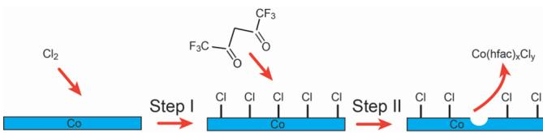  
Figure 15. Schematic of Co ALE with  $\mathrm{Cl}_2$  and hfacH as reactants.  $\mathrm{Cl}_2$  chlorinates the Co surface in Step I. hfacH removes  $\mathrm{Co(hfac)_2Cl_2}$  in Step II. Reproduced with permission from ref 43. Copyright 2019 American Vacuum Society.

using scanning electron microscopy of Co film cross sections before and after Co ALE. The Co etch rates varied from  $2\mathrm{\AA}/$  cycle at  $140^{\circ}\mathrm{C}$  to  $16\mathrm{\AA}/$  cycle at  $185^{\circ}\mathrm{C}$ .

# 5.2. Chlorine/Fluorine Ligand Exchange

Halogenation is also an effective mechanism for thermal ALE if the fluorides and chlorides of materials have different volatilities. In the first step, a self- limiting fluorination process can be used to form a stable fluoride layer on the substrate. In the second step, a chlorine/fluorine ligand- exchange process can be employed to yield volatile chloride species. This chlorine/fluorine ligand- exchange mechanism was utilized to define  $\mathrm{TiO}_2$  ALE with  $\mathrm{WF}_6$  and  $\mathrm{BCl}_3$  as the reactants. The  $\mathrm{TiO}_2$  ALE process was viable at temperatures  $\leq 170^{\circ}\mathrm{C}$  because the fluoride is stable but the chloride is volatile. A  $\mathrm{TiO}_2$  etch rate of  $\sim 0.6\mathrm{\AA}/$  cycle was observed at  $170^{\circ}\mathrm{C}$ . In contrast,  $\mathrm{TiO}_2$  was etched spontaneously by  $\mathrm{WF}_6$  at higher temperatures because the fluoride is volatile.  $\mathrm{TiO}_2$  ALE has also been used together with  $\mathrm{TiO}_2$  ALD for area- selective  $\mathrm{TiO}_2$  ALD.

# 6. SELF-LIMITING SURFACE LIGAND MECHANISMS

Some materials are etched by precursors where the buildup of species on the surface from the precursor eventually stops the etching. The species that limit the etching can then be removed by a second precursor to define the ALE process. An example of this self- limiting surface ligand mechanism is  $\mathrm{AlF}_3$  ALE using  $\mathrm{Sn(acac)}_2$  and HF as the reactants.  $\mathrm{Sn(acac)}_2$  can undergo a

ligand- exchange reaction with  $\mathrm{AlF}_3$  .This ligand- exchange reaction is believed to produce volatile SnF(acac) from  $\mathrm{Sn(acac)}_2$  . In addition, the ligand- exchange reaction also yields  $\mathrm{AlF}_2(\mathrm{acac})$  on the surface.

The etching of  $\mathrm{AlF}_3$  by  $\mathrm{Sn(acac)}_2$  is self- limiting and is known to saturate with acac species on the surface.46 A subsequent HF exposure is required to maintain the  $\mathrm{AlF}_3$  ALE process. The HF exposure is thought to lead to the fluorination reaction:  $\mathrm{AlF}_2(\mathrm{acac}) + \mathrm{HF(g)}\rightarrow \mathrm{AlF}_3 + \mathrm{acacH(g)}$  .This fluorination reaction reforms the  $\mathrm{AlF}_3$  surface and allows the  $\mathrm{AlF}_3$  ALE process to continue versus  $\mathrm{Sn(acac)}_2$  and HF exposures.

Another related example is  $\mathrm{ZnO}$  ALE using acetylacetone  $(\mathrm{acacH})$  and  $\mathrm{O}_2$  plasma as the reactants.47 acacH is proposed to etch  $\mathrm{ZnO}$  by forming  $\mathrm{Zn(acac)}_2$  and  $\mathrm{H}_2\mathrm{O}$  .However, the  $\mathrm{ZnO}$  surface also becomes covered by acacH adsorption products that limit the reaction. The subsequent  $\mathrm{O}_2$  plasma reaction then removes these acacH adsorption products and allows the  $\mathrm{ZnO}$  ALE to continue versus sequential acacH and  $\mathrm{O}_2$  plasma exposures. A schematic of the proposed mechanism for  $\mathrm{ZnO}$  ALE is shown in Figure 16.47  $\mathrm{ZnO}$  etch rates varied from 0.5 to  $1.3\mathrm{\AA}/$  cycle at temperatures between 100 and  $250^{\circ}\mathrm{C}$  47

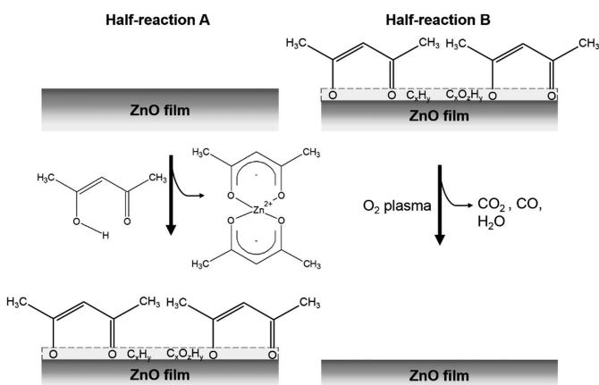  
Figure 16. Schematic of  $\mathrm{ZnO}$  ALE using acacH and  $\mathrm{O}_2$  plasma as reactants. acacH produces  $\mathrm{Zn(acac)}_2$  and also forms self-limiting acac surface ligands in reaction A.  $\mathrm{O}_2$  plasma removes acac surface ligands in reaction B. Reproduced with permission from ref 47. Copyright 2018 American Chemical Society.

# 7. TEMPERATURE MODULATION MECHANISMS

Another class of thermal ALE reactions is based on temperature annealing. A surface modification reaction is first performed at lower temperature. Subsequently, the surface modified layer is desorbed by heating to higher temperature. The temperature is then returned to the initial temperature to repeat the thermal ALE process.

For example, a thermal modulation mechanism for  $\mathrm{Si}_3\mathrm{N}_4$  ALE is based on the formation of an  $(\mathrm{NH}_4)_2\mathrm{SiF}_6$  layer on the  $\mathrm{Si}_3\mathrm{N}_4$  surface.48 This ammonium salt layer can be formed by exposure of a hydrofluorocarbon plasma to the  $\mathrm{Si}_3\mathrm{N}_4$  surface at  $20^{\circ}\mathrm{C}$  Subsequently, the substrate is thermally annealed to  $150^{\circ}\mathrm{C}$  to desorb the  $(\mathrm{NH}_4)_2\mathrm{SiF}_6$  layer.48 A schematic of  $\mathrm{Si}_3\mathrm{N}_4$  ALE using this temperature modulation mechanism is shown in Figure 17.48 This  $\mathrm{Si}_3\mathrm{N}_4$  ALE process produced a  $\mathrm{Si}_3\mathrm{N}_4$  etch rate of 16 A/cycle.48

A temperature modulation mechanism has also been employed for Si ALE.49 The Si surface is first oxidized to a  $\mathrm{SiO}_2$  layer using an  $\mathrm{O}_2$  plasma. The  $\mathrm{SiO}_2$  layer is then converted to an  $(\mathrm{NH}_4)_2\mathrm{SiF}_6$  layer using a  $\mathrm{NH}_3 / \mathrm{NF}_3$  plasma. Subsequently, the substrate is thermal annealed to desorb the ammonium salt layer.49 In addition,  $\mathrm{MoS}_2$  ALE has been performed using an  $\mathrm{O}_2$  plasma to form an amorphous  $\mathrm{MoO}_2$  monolayer on the  $\mathrm{MoS}_2$  surface at  $200^{\circ}\mathrm{C}$  50 Subsequently, the  $\mathrm{MoO}_3$  monolayer can be desorbed by thermal annealing to  $500^{\circ}\mathrm{C}$  50

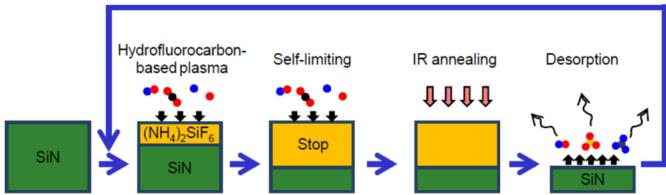  
Figure 17. Schematic of SiN ALE using surface modifying hydrofluorocarbon plasma and thermal annealing. Reproduced with permission from ref 48. Copyright 2017 IOP Publishing.

# 8. CHALLENGES AND FUTURE PROSPECTS

Thermal ALE has developed rapidly over the last five years. The Intel etch group proposed the possibility of thermal ALE using sequential, self- limiting surface reactions in their seminal perspective in 2015.3 Many materials, including metal oxides and metal nitrides, can now be etched using thermal ALE mechanisms. A current important challenge is the development of thermal ALE mechanisms for metals. Another critical goal for thermal ALE is selectivity between various materials. Many studies have illustrated that the different ligands involved in ligand- exchange reactions can provide pathways for selectivity.23 Investigations of new ligands for thermal ALE are needed to expand the options for selectivity between different materials. In addition, a deeper understanding of thermal ALE requires spectroscopic analysis of the species formed on the surface and the volatile products released to the gas phase.

Thermal ALE will become increasingly critical for nanofabrication as dimensions continue to shrink and devices become more three- dimensional. A key application for thermal ALE will be fabrication of advanced devices such as FinFETs and gate- all- around FETs.51 Plasma ALE and thermal ALE will need to be used together to provide anisotropic and isotropic etching. There also may be possibilities for hybrid approaches where low energy ions may remove self- limiting surface species during thermal ALE.28 These hybrid approaches may be able to allow thermal ALE to display anisotropic properties similar to those of plasma ALE.

# AUTHOR INFORMATION

# Corresponding Author

Steven M. George - Department of Chemistry, University of Colorado, Boulder, Colorado 80309- 0215, United States;  $\oplus$  orcid.org/0000- 0003- 0253- 9184; Email: steven.george@ colorado.edu

Complete contact information is available at: https://pubs.acs.org/10.1021/acs.accounts.0c00084

# Notes

The author declares no competing financial interest.

# ACKNOWLEDGMENTS

The author thanks all coworkers in the George group who contributed to the understanding of thermal ALE mechanisms. The research performed by the George group that was presented

in this paper was funded by the NSF, DARPA, SRC, Intel, Tokyo Electron, and the State of Colorado.

# REFERENCES

(1) George, S. M. Atomic Layer Deposition: An Overview. Chem. Rev. 2010, 110, 111-131.  
(2) Kanarik, K. J.; Lill, T.; Hudson, E. A.; Sriraman, S.; Tan, S.; Marks, J.; Vahedi, V.; Gottscho, R. A. Overview of Atomic Layer Etching in the Semiconductor Industry. J. Vac. Sci. Technol., A 2015, 33, 020802.  
(3) Carver, C. T.; Plombon, J. J.; Romero, P. E.; Suri, S.; Tronic, T. A.; Turkot, R. B. Atomic Layer Etching: An Industry Perspective. ECS J. Solid State Sci. Technol. 2015, 4, N5005-N5009.  
(4) Oehnlein, G. S.; Metzler, D.; Li, C. Atomic Layer Etching at the Tipping Point: An Overview. ECS J. Solid State Sci. Technol. 2015, 4, N5041-N5053.  
(5) Lee, Y.; George, S. M. Atomic Layer Etching of  $\mathrm{Al}_2\mathrm{O}_3$  Using Sequential, Self-Limiting Thermal Reactions with  $\mathrm{Sn(acac)}_2$  and HF. ACS Nano 2015, 9, 2061-2070.  
(6) Clancey, J. W.; Cavanagh, A. S.; Smith, J. E. T.; Sharma, S.; George, S. M. Volatile Etch Species Produced During Thermal  $\mathrm{Al}_2\mathrm{O}_3$  Atomic Layer Etching. J. Phys. Chem. C 2020, 124, 287-299.  
(7) Lee, Y.; George, S. M. Thermal Atomic Layer Etching of  $\mathrm{Al}_2\mathrm{O}_3$ ,  $\mathrm{HfO}_2$ , and  $\mathrm{ZrO}_2$  Using Sequential Hydrogen Fluoride and Dimethylaluminum Chloride Exposures. J. Phys. Chem. C 2019, 123, 18455-18466.  
(8) Faraz, T.; Roozeboom, F.; Knoops, H. C. M.; Kessels, W. M. M. Atomic Layer Etching: What Can We Learn from Atomic Layer Deposition? ECS J. Solid State Sci. Technol. 2015, 4, N5023-N5032.  
(9) George, S. M.; Lee, Y. Prospects for Thermal Atomic Layer Etching Using Sequential, Self-Limiting Fluorination and Ligand-Exchange Reactions. ACS Nano 2016, 10, 4889-4894.  
(10) Osakada, K. Transmetalation. In Fundamentals of Molecular Catalysis, Current Methods in Inorganic Chemistry, Vol. 3: Kurosawa, H.; Yamamoto, A., Eds.; Elsevier Science: Amsterdam, 2003, pp 233-291.  
(11) Lockhart, J. C. Redistribution and Exchange Reactions in Groups 2B-7B. Chem. Rev. 1965, 65, 131-151.  
(12) Roesky, H. W.; Haduc, I. Fluorine as a Structure-directing Element in Organometallic Fluorides: Discrete Molecules, Supramolecular Self-Assembly and Host-guest Complexation. J. Chem. Soc., Dalton Trans. 1999, 2249-2264.  
(13) Lee, Y.; DuMont, J. W.; George, S. M. Mechanism of Thermal  $\mathrm{Al}_2\mathrm{O}_3$  Atomic Layer Etching Using Sequential Reactions with  $\mathrm{Sn(acac)}_2$  and HF. Chem. Mater. 2015, 27, 3648-3657.  
(14) Lee, Y.; DuMont, J. W.; George, S. M. Trimethylaluminum as the Metal Precursor for the Atomic Layer Etching of  $\mathrm{Al}_2\mathrm{O}_3$  Using Sequential, Self-Limiting Thermal Reactions. Chem. Mater. 2016, 28, 2994-3003.  
(15) Puurunen, R. L. Surface Chemistry of Atomic Layer Deposition: A Case Study for the Trimethylaluminum/water Process. J. Appl. Phys. 2005, 97, 121301.  
(16) Lee, Y.; DuMont, J. W.; Cavanagh, A. S.; George, S. M. Atomic Layer Deposition of  $\mathrm{AlF}_3$  Using Trimethylaluminum and Hydrogen Fluoride. J. Phys. Chem. C 2015, 119, 14185-14194.  
(17) DuMont, J. W.; George, S. M. Competition Between  $\mathrm{Al}_2\mathrm{O}_3$  Atomic Layer Etching and  $\mathrm{AlF}_3$  Atomic Layer Deposition Using Sequential Exposures of Trimethylaluminum and Hydrogen Fluoride. J. Chem. Phys. 2017, 146, 052819.  
(18) Zywotko, D. R.; Faguet, J.; George, S. M. Rapid Atomic Layer Etching of  $\mathrm{Al}_2\mathrm{O}_3$  Using Sequential Exposures of Hydrogen Fluoride and Trimethylaluminum with No Purging. J. Vac. Sci. Technol., A 2018, 36, 061508.  
(19) Cano, A. M.; Marquardt, A. E.; DuMont, J. W.; George, S. M. Effect of HF Pressure on Thermal  $\mathrm{Al}_2\mathrm{O}_3$  Atomic Layer Etch Rates and  $\mathrm{Al}_2\mathrm{O}_3$  Fluorination. J. Phys. Chem. C 2019, 123, 10346-10355.  
(20) Natarajan, S. K.; Elliott, S. D. Modeling the Chemical Mechanism of the Thermal Atomic Layer Etch of Aluminum Oxide: A Density Functional Theory Study of Reactions during HF Exposure. Chem. Mater. 2018, 30, 5912-5922.

(21) Lee, Y.; DuMont, J. W.; George, S. M. Atomic Layer Etching of \(\mathrm{HfO}_2\) Using Sequential, Self-Limiting Thermal Reactions with \(\mathrm{Sn(acac)}_2\) and HF. ECS J. Solid State Sci. Technol. 2015, 4, N5013-N5022.  
(22) Lee, Y.; George, S. M. Thermal Atomic Layer Etching of \(\mathrm{HfO}_2\) Using HF for Fluorination and \(\mathrm{TiCl}_4\) for Ligand-Exchange. J. Vac. Sci. Technol., A 2018, 36, 061504.  
(23) Lee, Y.; Huffman, C.; George, S. M. Selectivity in Thermal Atomic Layer Etching Using Sequential, Self-Limiting Fluorination and Ligand-Exchange Reactions. Chem. Mater. 2016, 28, 7657-7665.  
(24) Skinner, H. A. The Thermochemistry of Organometallic Compounds. J. Chem. Thermodyn. 1978, 10, 309-320.  
(25) Wu, Y. D.; Peng, Z. H.; Chan, K. W. K.; Liu, X. Z.; Tuinman, A. A.; Xue, Z. L. Computational and Experimental Studies on the Thermolysis Mechanism of Zirconium and Hafnium Tetraalkyl Complexes. Difference Between Titanium and Zirconium Complexes. Organometallics 1999, 18, 2081-2090.  
(26) Gertsch, J. C.; Cano, A. M.; Bright, V. M.; George, S. M. \(\mathrm{SF}_4\) as the Fluorination Reactant for \(\mathrm{Al}_2\mathrm{O}_3\) and \(\mathrm{VO}_2\) Thermal Atomic Layer Etching. Chem. Mater. 2019, 31, 3624-3635.  
(27) Johnson, N. R.; Hite, J. K.; Mastro, M. A.; Eddy, C. R.; George, S. M. Thermal Atomic Layer Etching of Crystalline GaN Using Sequential Exposures of \(\mathrm{XeF}_2\) and \(\mathrm{BCl}_3\). Appl. Phys. Lett. 2019, 114, 243103.  
(28) Johnson, N. R.; Sun, H. X.; Sharma, K.; George, S. M. Thermal Atomic Layer Etching of Crystalline Aluminum Nitride Using Sequential, Self-limiting Hydrogen Fluoride and \(\mathrm{Sn(acac)}_2\) Reactions and Enhancement by \(\mathrm{H}_2\) and Ar Plasmas. J. Vac. Sci. Technol., A 2016, 34, 050603.  
(29) Murdzek, J. A.; George, S. M. Effect of Crystallinity on the Thermal Atomic Layer Etching of Hafnium Oxide, Zirconium Oxide and Hafnium Zirconium Oxide. J. Vac. Sci. Technol., A 2020, 38, 022608.  
(30) Zywotko, D. R.; George, S. M. Thermal Atomic Layer Etching of \(\mathrm{ZnO}\) by a "Conversion-Etch" Mechanism Using Sequential Exposures of Hydrogen Fluoride and Trimethylaluminum. Chem. Mater. 2017, 29, 1183-1191.  
(31) DuMont, J. W.; Marquardt, A. E.; Cano, A. M.; George, S. M. Thermal Atomic Layer Etching of \(\mathrm{SiO}_2\) by a "Conversion-Etch" Mechanism Using Sequential Reactions of Trimethylaluminum and Hydrogen Fluoride. ACS Appl. Mater. Interfaces 2017, 9, 10296-10307.  
(32) Johnson, N. R.; George, S. M. \(\mathrm{WO}_3\) and W Thermal Atomic Layer Etching Using "Conversion-Fluorination" and "Oxidation-Conversion-Fluorination" Mechanisms. ACS Appl. Mater. Interfaces 2017, 9, 34435-34447.  
(33) Lee, Y.; George, S. M. Thermal Atomic Layer Etching of Titanium Nitride Using Sequential, Self-Limiting Reactions: Oxidation to \(\mathrm{TiO}_2\) and Fluorination to Volatile \(\mathrm{TiF}_4\). Chem. Mater. 2017, 29, 8202-8210.  
(34) Xie, W. Y.; Lemaire, P. C.; Parsons, G. N. Thermally Driven Self-Limiting Atomic Layer Etching of Metallic Tungsten Using \(\mathrm{WF}_6\) and \(\mathrm{O}_2\). ACS Appl. Mater. Interfaces 2018, 10, 9147-9154.  
(35) Strobel, A.; Schnabel, H. D.; Reinhold, U.; Rauer, S.; Neidhardt, A. Room Temperature Plasma Enhanced Atomic Layer Deposition for \(\mathrm{TiO}_2\) and \(\mathrm{WO}_3\) Films. J. Vac. Sci. Technol., A 2016, 34, 01a118.  
(36) Tagtstrom, P.; Martensson, P.; Jansson, U.; Carlsson, J. O. Atomic Layer Epitaxy of Tungsten Oxide Films Using Oxyfluorides as Metal Precursors. J. Electrochem. Soc. 1999, 146, 3139-3143.  
(37) Abdulagatov, A. I.; George, S. M. Thermal Atomic Layer Etching of Silicon Using \(\mathrm{O}_2\), HF, and \(\mathrm{Al(CH}_3\)_3\) as the Reactants. Chem. Mater. 2018, 30, 8465-8475.  
(38) Abdulagatov, A. I.; George, S. M. Thermal Atomic Layer Etching of Silicon Nitride Using an Oxidation and "Conversion Etch" Mechanism. J. Vac. Sci. Technol., A 2020, 38, 022607.  
(39) Mohimi, E.; Chu, X. Q. I.; Trinh, B. B.; Babar, S.; Girolami, G. S.; Abelson, J. R. Thermal Atomic Layer Etching of Copper by Sequential Steps Involving Oxidation and Exposure to Hexafluoroacetylacetone. ECS J. Solid State Sci. Technol. 2018, 7, P491-P495.

(40) Chen, J. K. C.; Altieri, N. D.; Kim, T.; Chen, E.; Lill, T.; Shen, M. H.; Chang, J. P. Directional Etch of Magnetic and Noble Metals. II. Organic Chemical Vapor Etch. J. Vac. Sci. Technol., A 2017, 35, 05c305. 
(41) Spessard, G. O.; Miesler, G. L. Organometallic Chemistry; Oxford University Press: New York, NY, 2016. 
(42) Green, M. L. H. A New Approach to the Formal Classification of Covalent Compounds of the Elements. J. Organomet. Chem. 1995, 500, 127-148. 
(43) Konh, M.; He, C.; Lin, X.; Guo, X. Y.; Pallem, V.; Opila, R. L.; Teplyakov, A. V.; Wang, Z. J.; Yuan, B. Molecular Mechanisms of Atomic Layer Etching of Cobalt with Sequential Exposure to Molecular Chlorine and Diketones. J. Vac. Sci. Technol., A 2019, 37, 021004. 
(44) Lemaire, P. C.; Parsons, G. N. Thermal Selective Vapor Etching of  $\mathrm{TiO_2}$  . Chemical Vapor Etching in  $\mathrm{WE_6}$  and  $\mathrm{ScI}_2$  Limiting Atomic Layer Etching Using  $\mathrm{WF_6}$  and  $\mathrm{BCl}_3$  . Chem. Mater. 2017, 29, 6653-6665. 
(45) Song, S. K.; Saare, H.; Parsons, G. N. Integrated Isothermal Atomic Layer Deposition/Atomic Layer Etching Supercycles for Area-Selective Deposition of  $\mathrm{TiO_2}$  . Chem. Mater. 2019, 31, 4793-4804. 
(46) Lee, Y.; DuMont, J. W.; George, S. M. Atomic Layer Etching of  $\mathrm{AlF}_3$  Using Sequential, Self-Limiting Thermal Reactions with  $\mathrm{Sn(acac)}_2$  and Hydrogen Fluoride. J. Phys. Chem. C 2015, 119, 25385-25393. 
(47) Mameli, A.; Verheijen, M. A.; Mackus, A. J. M.; Kessels, W. M. M.; Roozeboom, F. Isotropic Atomic Layer Etching of  $\mathrm{ZnO}$  Using Acetylacetone and  $\mathrm{O}_2$  Plasma. ACS Appl. Mater. Interfaces 2018, 10, 38588-38595. 
(48) Miyoshi, N.; Kobayashi, H.; Shinoda, K.; Kurihara, M.; Watanabe, T.; Kouzuma, Y.; Yokogawa, K.; Sakai, S.; Izawa, M. Atomic Layer Etching of Silicon Nitride Using Infrared Annealing for Short Desorption Time of Ammonium Fluorosilicate. Jpn. J. Appl. Phys. 2017, 56, 06HB01. 
(49) Song, E. J.; Kim, J. H.; Kwon, J. D.; Kwon, S. H.; Ahn, J. H. Silicon Atomic Layer Etching by Two-Step Plasma Process Consisting of Oxidation and Modification to Form  $(\mathrm{NH_4})_2\mathrm{SiF_6}$  and Its Sublimation. Jpn. J. Appl. Phys. 2018, 57, 106505. 
(50) Zhu, H.; Qin, X. Y.; Cheng, L. X.; Azcatl, A.; Kim, J.; Wallace, R. M. Remote Plasma Oxidation and Atomic Layer Etching of  $\mathrm{MoS}_2$  . ACS Appl. Mater. Interfaces 2016, 8, 19119-19126. 
(51) Lu, W. J.; Lee, Y.; Gertsch, J. C.; Murdzek, J. A.; Cavanagh, A. S.; Kong, L. S.; del Alamo, J. A.; George, S. M. In Situ Thermal Atomic Layer Etching for Sub-5 nm InGaAs Multigate MOSFETs. Nano Lett. 2019, 19, 5159-5166.