# $\mathbf{SF}_4$  as the Fluorination Reactant for  $\mathbf{Al}_2\mathbf{O}_3$  and  $\mathbf{VO}_2$  Thermal Atomic Layer Etching

Jonas C. Gertsch,  $\dagger \oplus$  Austin M. Cano, Victor M. Bright, and Steven M. George\*

$^{\dagger}$ Department of Chemistry and  $^{\ddagger}$ Department of Mechanical Engineering, University of Colorado, Boulder, Colorado 80309, United States

ABSTRACT: Thermal atomic layer etching (ALE) is an important technique for the precise isotropic etching of nanostructures. Thermal ALE of many materials can be achieved using a two- step fluorination and ligand- exchange reaction mechanism. Most previous thermal ALE processes have used HF as the fluorination reactant. Alternative fluorination reactants may be needed because HF is a weak nucleophilic fluorination reactant. Stronger fluorination agents may be required for the fluorination of some materials. To demonstrate the usefulness of  $\mathrm{SF_4}$  as an alternative to HF, thermal  $\mathrm{Al}_2\mathrm{O}_3$  ALE was compared using  $\mathrm{SF_4}$  or HF together with  $\mathrm{Sn(acac)}_2$  as the metal precursor for ligand exchange.  $\mathrm{SF_4}$  and HF were observed to behave similarly as fluorination reactants during  $\mathrm{Al}_2\mathrm{O}_3$  ALE. The mass gains during the initial  $\mathrm{SF_4}$  and HF exposures on  $\mathrm{Al}_2\mathrm{O}_3$  atomic layer deposition (ALD) films at  $200^{\circ}\mathrm{C}$  were comparable at 35 and  $38~\mathrm{mg / cm^2}$  respectively, using quartz crystal microbalance measurements. In addition, the etch rates were similar at 0.20 and  $0.28\mathrm{\AA / cycle}$  for  $\mathrm{Al}_2\mathrm{O}_3$  ALE using  $\mathrm{SF_4}$  and HF, respectively, at  $200^{\circ}\mathrm{C}$  Thermal  $\mathrm{VO}_2$  ALE was also performed for the first time using  $\mathrm{SF_4}$  or HF and  $\mathrm{Sn(acac)}_2$  as the reactants. There was evidence that  $\mathrm{SF_4}$  is a stronger fluorination reactant than HF for  $\mathrm{VO}_2$  fluorination. The mass gains during the initial  $\mathrm{SF_4}$  and HF exposures on  $\mathrm{VO}_2$  ALD films were 38 and  $20~\mathrm{ng / cm^2}$  respectively, at  $200^{\circ}\mathrm{C}$  Thermal  $\mathrm{VO}_2$  ALE also had a higher etch rate when fluorinating with  $\mathrm{SF}_4$  compared with HF. Etch rates of 0.30 and  $0.11\mathrm{\AA / cycle}$  were measured for  $\mathrm{VO}_2$  ALE using  $\mathrm{SF_4}$  and HF, respectively, together with  $\mathrm{Sn(acac)}_2$  at  $200^{\circ}\mathrm{C}$  . Fourier transform infrared experiments were also used to monitor fluorination of the  $\mathrm{Al}_2\mathrm{O}_3$  and  $\mathrm{VO}_2$  ALD films by  $\mathrm{SF_4}$  or HF. FTIR difference spectroscopy was used to observe the increase of  $\mathrm{Al - F}$  and  $\mathrm{V - F}$  stretching vibrations and the loss of the  $\mathrm{Al - O}$  and  $\mathrm{V - O / V = O}$  stretching vibrations for  $\mathrm{Al}_2\mathrm{O}_3$  and  $\mathrm{VO}_2$  respectively, versus  $\mathrm{SF_4}$  or HF exposure at  $200^{\circ}\mathrm{C}$  Additional absorbance features after fluorination of the  $\mathrm{Al}_2\mathrm{O}_3$  ALD films by  $\mathrm{SF_4}$  were consistent with  $\mathrm{SF}_x$  surface species.  $\mathrm{SF_4}$  is a useful fluorination agent for thermal ALE processes and can be used as an alternative to HF. In addition,  $\mathrm{SF_4}$  may be necessary when fluorination requires a stronger fluorination reactant than HF.

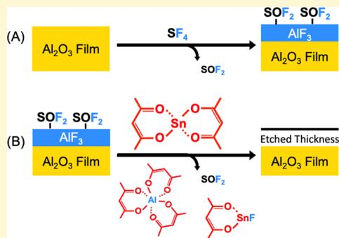

# I. INTRODUCTION

Atomic layer etching (ALE) is possible using sequential and self- limiting surface reactions. ALE is becoming increasingly important for advanced semiconductor manufacturing. ALE can be viewed as the reverse of atomic layer deposition (ALD). ALE can be accomplished using either plasma or thermal methods. The first reaction during ALE usually involves surface modification by the adsorption of a reactive species that activates the surface. The second reaction during ALE is a reaction that produces a volatile etch product. In plasma ALE, the second reaction is the removal of the activated layer by sputtering using an energetic ion or neutral species. Plasma ALE leads to anisotropic etching. In thermal ALE, the second reaction is a reaction between a gaseous reactant and the surface layer that produces stable and volatile etching products. Thermal ALE leads to isotropic etching.

During thermal ALE, the main reaction that activates the surface has been fluorination. For example, thermal  $\mathrm{Al}_2\mathrm{O}_3$  ALE was initially demonstrated using HF and  $\mathrm{Sn(acac)}_2$  as the reactants. The mechanism for thermal  $\mathrm{Al}_2\mathrm{O}_3$  ALE is based on fluorination and ligand- exchange reactions. HF and  $\mathrm{Sn(acac)}_2$  have also been employed as the reactants for  $\mathrm{HfO}_2$  and AlN ALE. Other metal precursors such as  $\mathrm{Al(CH_3)_3}$ $\mathrm{AlCl(CH_3)_2}$ $\mathrm{SiCl}_4,$  and  $\mathrm{TiCl}_4$  have also been effective for the ligand- exchange reaction following fluorination with HF. These reactants have led to  $\mathrm{Al}_2\mathrm{O}_3,$ $\mathrm{HfO}_2,$  and  $\mathrm{ZrO}_2$  ALE. HF and  $\mathrm{Al(CH_3)_3}$  have also been used for  $\mathrm{SiO}_2$  and  $\mathrm{ZnO}$  ALE using a "conversion- etch" mechanism, where  $\mathrm{Al(CH_3)_3}$  both is involved in ligand- exchange after fluorination and also converts the surface of the remaining substrate to  $\mathrm{Al}_2\mathrm{O}_3$ .

Although HF has been useful as a fluorination reactant during thermal ALE, HF does have some drawbacks. HF is a highly corrosive gas. Upon contact with moisture, HF forms hydrofluoric acid, which is also corrosive and toxic. Anhydrous HF is particularly problematic because its vapor pressure at room temperature exceeds atmospheric pressure. HF- pyridine liquid sources of HF are safer because the vapor pressure of HF above the HF- pyridine solution is 90- 100 Torr at room temperature. However, alternative fluorination reactants to

replace HF are desirable because HF is a weak fluorination reactant.

HF is a nucleophilic fluorination reactant where the fluoride anion serves as the active reaction species. HF is a convenient fluorination reactant that can fluorinate most metal oxides or metal nitrides. HF produces metal fluorides and  $\mathrm{H}_2\mathrm{O}$  or  $\mathrm{NH}_3$  as the reaction products. However, HF is a relatively weak fluorination agent compared with other inorganic nucleophilic fluorination reactants, such as  $\mathrm{SF}_4$ . Many electrophilic fluorinating agents also exist in which an electron- deficient fluorine serves as the active reaction species. The most widely used inorganic electrophilic fluorination reactant is  $\mathrm{F}_2$ . Another common inorganic electrophilic fluorination reactant is  $\mathrm{XeF}_2$ .

The standard free energy changes,  $\Delta G^{\circ}$ , for the fluorination of a variety of materials using HF,  $\mathrm{SF}_4$ ,  $\mathrm{F}_2$ , and  $\mathrm{XeF}_2$  are given in Table 1. The  $\Delta G^{\circ}$  values are all reported at  $200^{\circ}\mathrm{C}$ . Most

Table 1. Fluorination Reactions for Various Metal Compounds Using HF,  $\mathbf{SF}_4,$ $\mathbf{F}_{2},$  and  $\mathbf{XeF}_2^a$  

<table><tr><td colspan="2">Al2O3</td></tr><tr><td>Al2O3+6HF→2AlF3+3H2O</td><td>ΔG° = -58 kcal</td></tr><tr><td>Al2O3+3SF4→2AlF3+3SOF2</td><td>ΔG° = -199 kcal</td></tr><tr><td>Al2O3+3F2→2AlF3+3/2O2</td><td>ΔG° = -297 kcal</td></tr><tr><td>Al2O3+3XeF2→2AlF3+3Xe+3/2O2</td><td>ΔG° = -258 kcal</td></tr><tr><td colspan="2">HfO2</td></tr><tr><td>HfO2+4HF→HfF4+2H2O</td><td>ΔG° = -19 kcal</td></tr><tr><td>HfO2+2SF4→HfF4+2SOF2</td><td>ΔG° = -113 kcal</td></tr><tr><td>HfO2+2F2→HfF4+O2</td><td>ΔG° = -178 kcal</td></tr><tr><td>HfO2+4XeF2→HfF4+4Xe+3/2O2</td><td>ΔG° = -152 kcal</td></tr><tr><td colspan="2">GaN</td></tr><tr><td>GaN+3HF→GaF3+NH3</td><td>ΔG° = -40 kcal</td></tr><tr><td>GaN+3/4SF4→GaF3+1/2N2+3/16S8</td><td>ΔG° = -114 kcal</td></tr><tr><td>GaN+3/2F2→GaF3+1/2N2</td><td>ΔG° = -239 kcal</td></tr><tr><td>GaN+3/2XeF2→GaF3+3/2Xe+1/2N2</td><td>ΔG° = -219 kcal</td></tr><tr><td colspan="2">ZnS</td></tr><tr><td>ZnS+2HF→ZnF2+H2S</td><td>ΔG° = +6 kcal</td></tr><tr><td>ZnS+1/2SF4→ZnF2+3/16S8</td><td>ΔG° = -33 kcal</td></tr><tr><td>ZnS+F2→ZnF2+1/5S8</td><td>ΔG° = -116 kcal</td></tr><tr><td>ZnS+XeF2→ZnF2+1/8S8</td><td>ΔG° = -103 kcal</td></tr><tr><td colspan="2">VO2</td></tr><tr><td>VO2+4HF→VF4+2H2O</td><td>ΔG° = +9 kcal</td></tr><tr><td>VO2+2SF4→VF4+2SOF2</td><td>ΔG° = -85 kcal</td></tr><tr><td>VO2+2F2→VF4+O2</td><td>ΔG° = -150 kcal</td></tr><tr><td>VO2+2XeF2→VF4+2Xe+O2</td><td>ΔG° = -124 kcal</td></tr><tr><td colspan="2">aΔG° values are reported at 200°C.17</td></tr></table>

of the  $\Delta G^{\circ}$  values are negative except for HF fluorination of  $\mathrm{ZnS}$  and  $\mathrm{VO}_2,$  which have slightly positive  $\Delta G^{\circ}$  values. A comparison of the various  $\Delta G^{\circ}$  values reveals that  $\mathrm{SF}_4,\mathrm{F}_2,$  and  $\mathrm{XeF}_2$  have higher negative  $\Delta G^{\circ}$  values than HF for all the materials.  $\mathrm{SF}_4,\mathrm{F}_2,$  and  $\mathrm{XeF}_2$  are stronger fluorination reactants than HF and are all possible alternatives to HF.

In this paper,  $\mathrm{SF}_4$  was examined as an alternative to HF.  $\mathrm{SF}_4$  is an effective fluorination reactant for organic carbonyl compounds and metal oxides.18,19 Previous work has also demonstrated that  $\mathrm{SF}_4$  can fluorinate  $\gamma - \mathrm{Al}_2\mathrm{O}_3$ .20 The high  $\mathrm{SF}_4$  vapor pressure of  $\sim 10$  atm at  $25^{\circ}\mathrm{C}$  also facilitates the implementation of  $\mathrm{SF}_4$ .21 However, although  $\mathrm{SF}_4$  is considered a safer alternative to  $\mathrm{HF}$ , because  $\mathrm{SF}_4$  has a distinct sulfur odor,  $\mathrm{SF}_4$  also has issues because hydrolysis of  $\mathrm{SF}_4$  can produce HF via  $\mathrm{SF}_4 + \mathrm{H}_2\mathrm{O} \rightarrow \mathrm{SOF}_2 + 2\mathrm{HF}$ .22

$\mathrm{SF}_4$  was used as the fluorination reactant for the thermal ALE of  $\mathrm{Al}_2\mathrm{O}_3$  and  $\mathrm{VO}_2$ .  $\mathrm{Sn(acac)}_2$  was used as the metal precursor for the ligand- exchange reaction.  $\mathrm{Al}_2\mathrm{O}_3$  ALE was studied to compare  $\mathrm{SF}_4$  with the previous results using HF as the fluorination reactant for thermal  $\mathrm{Al}_2\mathrm{O}_3$  ALE.5,7,10,23  $\mathrm{VO}_2$  ALE was also examined using HF or  $\mathrm{SF}_4$  and  $\mathrm{Sn(acac)}_2$  as the reactants.  $\mathrm{SF}_4$  may be needed as the fluorination agent for thermal  $\mathrm{VO}_2$  ALE. Thermochemical calculations indicate that the predicted  $\Delta G^{\circ}$  for the fluorination of  $\mathrm{VO}_2$  to  $\mathrm{VF}_4$  is slightly positive for HF at  $200^{\circ}\mathrm{C}$ .17 In contrast, fluorination of  $\mathrm{VO}_2$  to  $\mathrm{VF}_4$  has a large negative  $\Delta G^{\circ}$  using  $\mathrm{SF}_4$  at  $200^{\circ}\mathrm{C}$ .17

Thermal  $\mathrm{VO}_2$  ALE is reported for the first time in this paper.  $\mathrm{VO}_2$  is a semiconductor at room temperature and has a metal- - insulator transition around  $68^{\circ}\mathrm{C}$ .24,25 This transition is accompanied by a large change in resistivity and optical transmittance. Consequently,  $\mathrm{VO}_2$  is a useful material for thermochromic films,25,26 bolometers,27,28 and switching devices.29,30 Thermal  $\mathrm{VO}_2$  ALE may be useful to produce thin  $\mathrm{VO}_2$  films with low thermal mass and high film stability. A low thermal mass is needed for larger thermal transients when using  $\mathrm{VO}_2$  as a thermal sensor. Thin films employed for their metal- insulator transition are also less susceptible to fracture from stress that can result from temperature cycling and structural changes around the metal- insulator transition.

# II. EXPERIMENTAL SECTION

II.A. Growth and Etching of  $\mathrm{Al}_2\mathrm{O}_3$  and  $\mathrm{VO}_2$  Films. The initial  $\mathrm{Al}_2\mathrm{O}_3$  and  $\mathrm{VO}_2$  films were prepared using  $\mathrm{Al}_2\mathrm{O}_3$  and  $\mathrm{VO}_2$  ALD. The  $\mathrm{Al}_2\mathrm{O}_3$  ALD films were grown using  $\mathrm{Al(CH_3)_3}$  (trimethylaluminum (TMA)) (97%, Sigma-Aldrich) and DI  $\mathrm{H}_2\mathrm{O}$  as the reactants at deposition temperatures between 130 and  $200^{\circ}\mathrm{C}$ . TMA and  $\mathrm{H}_2\mathrm{O}$  are known to yield amorphous  $\mathrm{Al}_2\mathrm{O}_3$  ALD films at these temperatures.31 The  $\mathrm{VO}_2$  ALD films were deposited using tetrakis(ethylmethylamino) vanadium (TEMAV) (Air Liquide) and DI  $\mathrm{H}_2\mathrm{O}$  as the reactants at  $150^{\circ}\mathrm{C}$ .32 TEMAV is a useful vanadium source for  $\mathrm{VO}_2$  ALD because vanadium is already in the +4 oxidation state. TEMAV and  $\mathrm{H}_2\mathrm{O}$  are known to yield vanadium(IV) oxide films.33 TEMAV and  $\mathrm{H}_2\mathrm{O}$  also yield amorphous  $\mathrm{VO}_2$  ALD films at  $150^{\circ}\mathrm{C}$ .32,33

ALD films were deposited and etched in a custom- built stainless steel viscous flow reactor. This reactor is similar in design to a previous viscous flow reactor built for quartz crystal microbalance (QCM) studies of ALD.34 However, the flow tube was replaced with a circular puck- shaped chamber to accommodate  $8^{\prime \prime}$  wafers. The reactants and the carrier gas flow across the samples in the chamber. The chamber had a  $10^{\prime \prime}$  diameter and was equipped with a fast- entry load- lock door for sample loading. The QCM was positioned at the center of this chamber.

A total  $\mathrm{N}_2$  flow of 160 sccm was used as both a purge and inert carrier gas during the reactions and produced a reactor pressure of 1.0 Torr. The  $\mathrm{N}_2$  flow was controlled on each precursor line by mass flow controllers (Alcat Scientific). The  $\mathrm{N}_2$  flow was uniformly distributed inside the circular puck- shaped chamber using a baffle that served to limit the gas conductance. The reactor was pumped with a dual- stage mechanical pump (Alcatel Adixen Pascal 2010 C2). The pressure was monitored using a capacitance manometer (MKS Baratron 626A) on the reactor. The temperature of the reactor chamber was maintained using heaters regulated with proportional- integral- derivative (PID) control.

The stainless steel bubbler containing the TEMAV was heated to  $60 - 65^{\circ}\mathrm{C}$  to increase the vapor pressure. An  $\mathrm{N}_2$  flow of  $\sim 20$  sccm over the headspace of the TEMAV source was also used to increase the precursor transport. The other growth reactants were maintained at room temperature. All lines were heated to define a temperature gradient between the reactant sources and the reactor. The temperature progressively increased to prevent condensation in the dosing lines in the reactor chamber.

$\mathrm{Al}_2\mathrm{O}_3$  ALE and  $\mathrm{VO}_2$  ALE were performed using sulfur tetrafluoride  $\mathrm{SF}_4$ ,  $>98.5\%$  SynQuest Laboratories), HF- pyridine (70 wt % HF, Sigma- Aldrich), and tin(III) acetylacetonate  $\mathrm{(Sn(acac)_2}$ ,  $99.9\%$  trace metals basis, Sigma- Aldrich).  $\mathrm{SF}_4$  and HF- pyridine were maintained at room temperature. The Sn(acac)2 bubbler was heated to around 100  $^\circ \mathrm{C}$  to obtain adequate vapor pressure.

II.B. QCM, XPS, SE, and FTIR Measurements. The reactor chamber was equipped with an Si in situ quartz crystal microbalance (QCM). The QCM was an SF-cut quartz crystal (Maxtek SC-101 gold coated, 6 MHz). The frequency of the QCM was recorded using an Inficon Q-pod quartz crystal monitor. The QCM housing was a modified Inficon Cool Druwer single sensor that used  $\mathbf{N}_2$  flow to provide a backside purge on the crystal. The housing around the crystal was sealed using high temperature silver epoxy (EpoTek H21D, Epoxy Technology). The additional  $\mathbf{N}_2$  flow from the QCM purge exited downstream from the QCM crystal and raised the reactor pressure to  $1.05\mathrm{Torr}$  when only  $\mathbf{N}_2$  was flowing.

The  $\mathrm{VO}_2$  films on Si coupons were analyzed with ex situ X- ray photoelectron spectroscopy (XPS, PHI 5600) after  $\mathrm{VO}_2$  ALD to verify the chemical state of the film. The films were loaded into the XPS chamber within  $1\mathrm{h}$  of unloading from the deposition chamber to reduce surface oxidation effects. In addition, the  $\mathrm{Al}_2\mathrm{O}_3$  ALD film thicknesses were investigated with ex situ spectroscopic ellipsometry (J. A. Woollam M- 2000) both before and after etching by varying temperatures to determine the temperature dependence of  $\mathrm{Al}_2\mathrm{O}_3$  ALE using  $\mathrm{SF}_4$  and  $\mathrm{Sn(acac)}_2$  as the reactants.

In situ infrared spectroscopy was employed to monitor  $\mathrm{VO}_2$  ALD and the fluorination of the  $\mathrm{Al}_2\mathrm{O}_3$  and  $\mathrm{VO}_2$  ALD films with  $\mathrm{SF}_4$  and HF. A description of this reactor, equipped for in situ FTIR transmission spectroscopy, has been presented earlier. To increase the surface area for higher sensitivity to the surface species, the  $\mathrm{Al}_2\mathrm{O}_3$  and  $\mathrm{VO}_2$  ALD films were deposited on silicon nanoparticles that were  $30 - 50 \mathrm{nm}$  in diameter  $(>98\%)$  US Research Nanomaterials). The Si nanoparticles were initially pressed into tungsten grids. The tungsten grids have an area of  $2\times 3\mathrm{cm}^2$  and were  $50 \mu \mathrm{m}$  thick and contained 100 grid lines per inch.

The tungsten grids were resistively heated to  $150^{\circ}\mathrm{C}$  for  $\mathrm{VO}_2$  ALD and  $200^{\circ}\mathrm{C}$  for  $\mathrm{SF}_4$  and HF fluorination of the  $\mathrm{Al}_2\mathrm{O}_3$  and  $\mathrm{VO}_2$  ALD films. The heating was conducted using a DC power supply (6268B,  $20 \mathrm{V} / 20 \mathrm{A}$ , Hewlett- Packard). The voltage output of the DC power supply was controlled by a PID temperature controller (Love Controls 16B, Dwyer Instruments). The temperature was monitored with a K- type thermocouple. This thermocouple was fixed to the tungsten grid with epoxy (Ceramabond 571, Aremco). The epoxy also electrically isolated the thermocouple from the tungsten grid. The FTIR spectra were recorded at  $150^{\circ}\mathrm{C}$  during  $\mathrm{VO}_2$  ALD and at  $200^{\circ}\mathrm{C}$  for  $\mathrm{Al}_2\mathrm{O}_3$  and  $\mathrm{VO}_2$  fluorination.

# III. RESULTS AND DISCUSSION

III.A.  $\mathrm{Al}_2\mathrm{O}_3$  ALE Using  $\mathrm{SF}_4$  and  $\mathrm{Sn(acac)}_2$ . Figure 1 displays the mass change versus time during 100 cycles of  $\mathrm{Al}_2\mathrm{O}_3$  ALE at  $200^{\circ}\mathrm{C}$  using  $\mathrm{SF}_4$  and  $\mathrm{Sn(acac)}_2$  as the reactants. The  $\mathrm{SF}_4$  exposures were performed at  $500 \mathrm{mTorr}$  for  $2.5 \mathrm{s}$ . The  $\mathrm{Sn(acac)}_2$  exposures were conducted at  $50 \mathrm{mTorr}$  for  $2.5 \mathrm{s}$ . After each reactant exposure, the system was purged with a viscous flow of  $\mathrm{N}_2$  gas at  $160 \mathrm{scm}$  for  $55 \mathrm{s}$ . This reaction sequence is designated as  $2.5 - 55 - 2.5 - 55$ . The initial  $\mathrm{Al}_2\mathrm{O}_3$  film was deposited on the QCM with trimethylaluminum (TMA) and  $\mathrm{H}_2\mathrm{O}$  as the reactants using  $150 \mathrm{Al}_2\mathrm{O}_3$  ALD cycles. The reaction sequence for  $\mathrm{Al}_2\mathrm{O}_3$  ALD was  $3 - 55 - 3 - 55$ . The purge times are longer than usual because of the design and larger volume of the reactor that could accommodate  $8^{\prime \prime}$  silicon wafers.

The loss of mass versus time is linear in Figure 1. The slight deviations from linearity are attributed to the effect of small temperature deviations on the QCM measurements over the course of the long experiments. The average mass change per cycle (MCPC) over the 100 cycles is  $- 6.0 \mathrm{ng / cm}^2$ . This MCPC yields an etch rate of  $0.20 \mathrm{A} / \mathrm{cycle}$ . The conversion between mass and thickness used an  $\mathrm{Al}_2\mathrm{O}_3$  ALD film density of  $2.95 \mathrm{g / cm}^3$  determined by X- ray reflectivity (Bede D1 System). This etch rate for  $\mathrm{Al}_2\mathrm{O}_3$  ALE using  $\mathrm{SF}_4$  and  $\mathrm{Sn(acac)}_2$  at  $200^{\circ}\mathrm{C}$  is very comparable with the etch rate for  $\mathrm{Al}_2\mathrm{O}_3$  ALE using HF and  $\mathrm{Sn(acac)}_2$  at  $200^{\circ}\mathrm{C}$ . The etch rate for  $\mathrm{Al}_2\mathrm{O}_3$  ALE employing HF and  $\mathrm{Sn(acac)}_2$  at  $200^{\circ}\mathrm{C}$  was previously measured to be  $0.28 \mathrm{A} / \mathrm{cycle}$ .

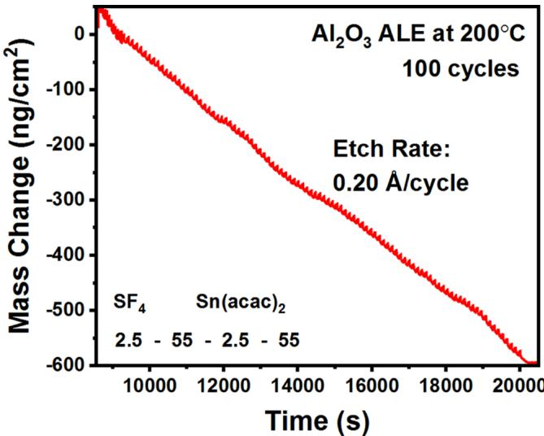  
Figure 1. Mass change versus time during 100 cycles of  $\mathrm{Al}_2\mathrm{O}_3$  ALE at  $200^{\circ}\mathrm{C}$  using  $\mathrm{SF}_4$  and  $\mathrm{Sn(acac)}_2$  as the reactants. Etch rate is  $0.20 \mathrm{A} / \mathrm{cycle}$ .

An expanded view of three  $\mathrm{Al}_2\mathrm{O}_3$  ALE cycles from Figure 1 is shown in Figure 2. The  $\mathrm{SF}_4$  exposure fluorinates the  $\mathrm{Al}_2\mathrm{O}_3$

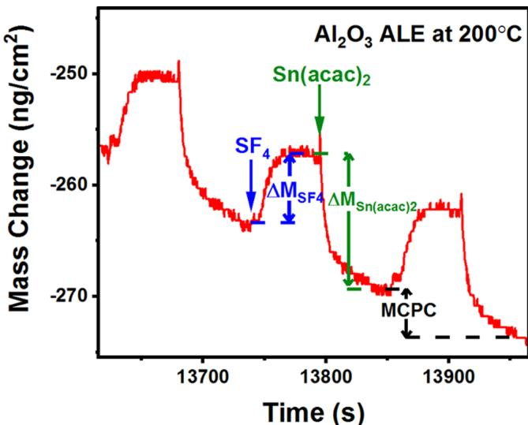  
Figure 2. Expanded view of three  $\mathrm{Al}_2\mathrm{O}_3$  ALE cycles from Figure 1 showing mass gain during the  $\mathrm{SF}_4$  exposure and mass loss during  $\mathrm{Sn(acac)}_2$  exposure.

surface and may produce  $\mathrm{AlF}_3$  or  $\mathrm{AlF}_{x y}$  surface species.  $\mathrm{AlF}_3$  is a stable fluoride with a melting temperature of  $1290^{\circ}\mathrm{C}$  and an extremely low vapor pressure at  $200^{\circ}\mathrm{C}$ . In addition,  $\mathrm{SF}_4$  should remove oxygen from  $\mathrm{Al}_2\mathrm{O}_3$  through  $\mathrm{SOF}_2$  desorption.  $\mathrm{SOF}_2$  is the main reaction product from the reaction of  $\mathrm{SF}_4$  with metal oxides,  $\mathrm{H}_2\mathrm{O}$ , or oxygen- containing organic compounds.  $\mathrm{SF}_4$  should also remove any possible acac

species on the surface from the previous  $\mathrm{Sn(acac)}_2$  exposure. The  $\mathrm{SF}_4$  exposure leads to a mass gain  $\Delta M_{\mathrm{SF}_4} = 6.2 \mathrm{ng / cm^2}$ .

$\mathrm{Sn(acac)}_2$  can then react with the fluorinated  $\mathrm{Al}_2\mathrm{O}_3$  surface through ligand- exchange to form volatile  $\mathrm{SnF(acac)}$  and  $\mathrm{Al(acac)}_3$  or  $\mathrm{AlF(acac)}_2$  species.  $\mathrm{Al(acac)}_3$  has a vapor pressure of 3.3 Torr at  $150^{\circ}\mathrm{C}$  and  $\sim 7$  Torr at  $200^{\circ}\mathrm{C}$ . The net result of the  $\mathrm{Sn(acac)}_2$  exposure is a mass loss  $\Delta M_{\mathrm{Sn(acac)}_2} = - 12.2 \mathrm{ng / cm^2}$ . The gradual mass reduction during the purge time of  $55 \mathrm{s}$  may be attributed to the slow desorption of acac species from the surface. Acac species were observed on  $\mathrm{Al}_2\mathrm{O}_3$  surfaces during  $\mathrm{Al}_2\mathrm{O}_3$  ALE using HF and  $\mathrm{Sn(acac)}_2$ . There was also an inverse correlation between the coverage of acac surface species and the  $\mathrm{Al}_2\mathrm{O}_3$  etch rate in these previous studies that was consistent with more desorption of acac species at higher substrate temperatures.

Assuming that the volatile etch products are  $\mathrm{Al(acac)}_3$ ,  $\mathrm{SnF(acac)}$ , and  $\mathrm{SOF}_2$ , the overall reaction can be described as:

$$
\begin{array}{rl} & {\mathrm{Al}_2\mathrm{O}_3 + 3\mathrm{SF}_4 + 6\mathrm{Sn}(\mathrm{acac})_2}\\ & {\quad \rightarrow 2\mathrm{Al}(\mathrm{acac})_3 + 6\mathrm{SnF}(\mathrm{acac}) + 3\mathrm{SOF}_2} \end{array} \tag{1}
$$

This overall reaction can be divided into the proposed  $\mathrm{SF}_4$  and  $\mathrm{Sn(acac)}_2$  reactions occurring during  $\mathrm{Al}_2\mathrm{O}_3$  ALE at steady state:

$$
\begin{array}{r l} & {\mathrm{(A)Al_{2}O_{3}^{*} + 3S F_{4}(g)\rightarrow 2A l F_{3}l x S O F_{2}^{*} + (3 - x)S O F_{2}(g)}}\\ & {\mathrm{(2)}} \end{array} \tag{2}
$$

$$
\begin{array}{rl} & {\mathrm{(B)}2\mathrm{AlF}_3l x\mathrm{SOF}_2^* +6\mathrm{Sn}(\mathrm{acac})_2(\mathrm{g})}\\ & {\quad \rightarrow 2\mathrm{Al}(\mathrm{acac})_3(\mathrm{g}) + 6\mathrm{SnF}(\mathrm{acac})(\mathrm{g}) + x\mathrm{SOF}_2(\mathrm{g})} \end{array} \tag{3}
$$

These reactions include the surface species that change during the  $\mathrm{SF}_4$  and  $\mathrm{Sn(acac)}_2$  exposures. The asterisks indicate the surface species. The vertical lines separate the various surface species. To satisfy the overall reaction stoichiometry in eq 1, the  $\Delta M_{\mathrm{SF}_4}$  and  $\Delta M_{\mathrm{Sn(acac)}_2}$  values require the presence of a surface intermediate that adds mass during reaction A and subtracts mass during reaction B.  $\mathrm{SOF}_2^*$  is the most likely surface intermediate produced during the  $\mathrm{SF}_4$  exposure in reaction A. A schematic illustrating the proposed  $\mathrm{SF}_4$  and  $\mathrm{Sn(acac)}_2$  reactions is shown in Figure 3.

$\mathrm{Al}_2\mathrm{O}_3^*$  in eq 2 represents the amount of  $\mathrm{Al}_2\mathrm{O}_3$  that is etched during the ALE reactions.  $\mathcal{X}$  quantifies the amount of  $\mathrm{SOF}_2^*$

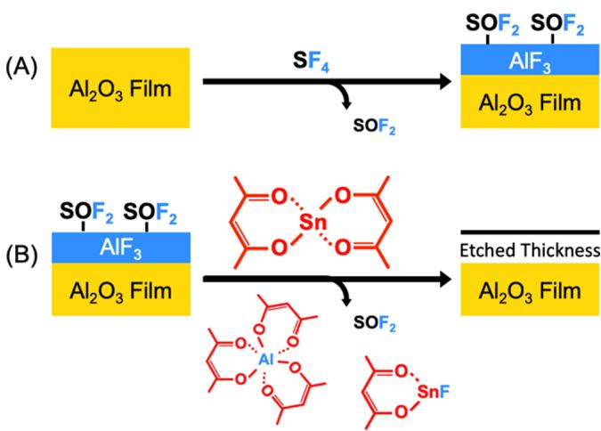  
Figure 3. (A, B) Schematic of the sequential surface reactions during  $\mathrm{Al}_2\mathrm{O}_3$  ALE using exposures of  $\mathrm{SF}_4$  and  $\mathrm{Sn(acac)}_2$ .

surface species after the  $\mathrm{SF}_4$  exposures relative to the amount of  $\mathrm{Al}_2\mathrm{O}_3$  that is etched in one  $\mathrm{Al}_2\mathrm{O}_3$  ALE cycle. The parameter  $x$  can be determined by the  $\Delta M_{\mathrm{Sn(acac)}_2}$  and MCPC values using the equation:

$$
\begin{array}{rl} & {x = [M_{\mathrm{Al}_2\mathrm{O}_3}(\Delta M_{\mathrm{Sn(acac)}_2} / \mathrm{MCPC}) - 2M_{\mathrm{AlF}_3}] / M_{\mathrm{SOF}_2}}\\ & {x = [102.0(-12.2 / - 6.0) - 2(84.0)] / 86.1} \end{array} \tag{4}
$$

The values 84.0, 102.0, and 86.1 are the molecular weights in atomic mass units for  $\mathrm{AlF}_3$ ,  $\mathrm{Al}_2\mathrm{O}_3$ , and  $\mathrm{SOF}_2$ , respectively. Using  $\Delta M_{\mathrm{Sn(acac)}_2} = - 12.2 \mathrm{ng / cm^2}$  and  $\mathrm{MCPC} = - 6.0 \mathrm{ng / cm^2}$ , eq 3 yields  $x = 0.46$ . This  $x$  value indicates that there are 0.46  $\mathrm{SOF}_2^*$  species present on the surface after the  $\mathrm{SF}_4$  exposures for every  $\mathrm{Al}_2\mathrm{O}_3$  unit etched during one  $\mathrm{Al}_2\mathrm{O}_3$  ALE cycle.

The MCPC and etch rate during  $\mathrm{Al}_2\mathrm{O}_3$  ALE at  $200^{\circ}\mathrm{C}$  using  $\mathrm{SF}_4$  and  $\mathrm{Sn(acac)}_2$  are  $- 6.0 \mathrm{ng / cm^2}$  and  $0.20 \mathrm{\AA / cycle}$ , respectively. This removal rate of  $\mathrm{Al}_2\mathrm{O}_3$  is equivalent to 3.54  $\times 10^{13} \mathrm{Al}_2\mathrm{O}_3$  units  $\mathrm{cm^2}$ . This removal rate is only  $\sim 5\%$  of the number of  $\mathrm{Al}_2\mathrm{O}_3$  units on the  $\mathrm{Al}_2\mathrm{O}_3$  surface. An estimate for the number of  $\mathrm{Al}_2\mathrm{O}_3$  units on the  $\mathrm{Al}_2\mathrm{O}_3$  surface is obtained from the mass density of  $3.0 \mathrm{g / cm^3}$  for  $\mathrm{Al}_2\mathrm{O}_3$  ALD films. This mass density is equivalent to a number density  $\rho = 1.77 \times 10^{22} \mathrm{Al}_2\mathrm{O}_3$  units  $\mathrm{cm^3}$ .  $\rho^{2 / 3}$  then provides an estimate for the number of  $\mathrm{Al}_2\mathrm{O}_3$  units on the  $\mathrm{Al}_2\mathrm{O}_3$  surface of  $6.8 \times 10^{14} \mathrm{Al}_2\mathrm{O}_3$  units  $\mathrm{cm^3}$ . Based on the  $x$  value of 0.46, the  $\mathrm{SOF}_2^*$  coverage is determined to be  $1.63 \times 10^{13} \mathrm{SOF}_2^*$  species  $\mathrm{cm^2}$ . This  $\mathrm{SOF}_2^*$  coverage is only about  $2.4\%$  of the number of  $\mathrm{Al}_2\mathrm{O}_3$  units on the  $\mathrm{Al}_2\mathrm{O}_3$  surface.

Figure 4 demonstrates the self- limiting nature of the  $\mathrm{SF}_4$  and  $\mathrm{Sn(acac)}_2$  reactions during  $\mathrm{Al}_2\mathrm{O}_3$  ALE. Each point represents the average mass change per cycle (MCPC) versus exposure time over 20 reaction cycles. In Figure 4a, the  $\mathrm{Sn(acac)}_2$  exposure time was held constant at  $2.5 \mathrm{s}$ , and the  $\mathrm{SF}_4$  exposure time was varied from 0 to  $3 \mathrm{s}$ . The purge time after each reactant exposure was  $55 \mathrm{s}$ . This reactant pulse sequence is designated as  $X - 55 - 2.5 - 55$ . Similarly, in Figure 4b, the  $\mathrm{SF}_4$  exposure time was held constant at  $2.5 \mathrm{s}$ , and the  $\mathrm{Sn(acac)}_2$  exposure time was varied between 0 and  $2.5 \mathrm{s}$ . This reactant pulse sequence is denoted as  $2.5 - 55 - X - 55$ . The MCPC levels off versus exposure time for both  $\mathrm{SF}_4$  and  $\mathrm{Sn(acac)}_2$ . In addition, neither reactant is capable of spontaneously etching the  $\mathrm{Al}_2\mathrm{O}_3$  film.

Other experiments have recently explored the effect of both exposure and pressure on  $\mathrm{Al}_2\mathrm{O}_3$  fluorination using HF as the fluorination reactant. These investigations have revealed that  $\mathrm{Al}_2\mathrm{O}_3$  fluorination is self- limiting as a function of exposure. The fluoride thickness,  $y$ , changes according to  $\mathrm{dy / dt} = k / y$  where  $k$  is a constant that is dependent on HF pressure,  $k = k_{0}P$ . Integration of this rate equation yields the parabolic expressions  $y^2 (t) = 2kt$  or  $y(t) = (2E_0Pt)^{1 / 2}$ . The fluorination kinetics are restricted by the fluoride layer on the  $\mathrm{Al}_2\mathrm{O}_3$  surface that acts as a diffusion barrier for further fluorination. The kinetics of  $\mathrm{Al}_2\mathrm{O}_3$  fluorination are similar to the kinetics of Si oxidation that have been described by the Deal- Grove model. Similar behavior is expected for  $\mathrm{Al}_2\mathrm{O}_3$  fluorination using  $\mathrm{SF}_4$  as the fluorination reactant.

Figure 5 shows the first three cycles of  $\mathrm{Al}_2\mathrm{O}_3$  ALE using  $\mathrm{SF}_4$  and  $\mathrm{Sn(acac)}_2$ . The mass gain observed during the first  $\mathrm{SF}_4$  exposure represents the fluorination of an initial  $\mathrm{Al}_2\mathrm{O}_3$  ALD film prior to any  $\mathrm{Sn(acac)}_2$  exposures. The first  $\mathrm{SF}_4$  exposure leads to a mass gain  $\Delta M_{\mathrm{SF}_4} = 35.1 \mathrm{ng / cm^2}$ . The  $\mathrm{SF}_4$  exposure is believed to fluorinate the  $\mathrm{Al}_2\mathrm{O}_3$  film according to the reaction

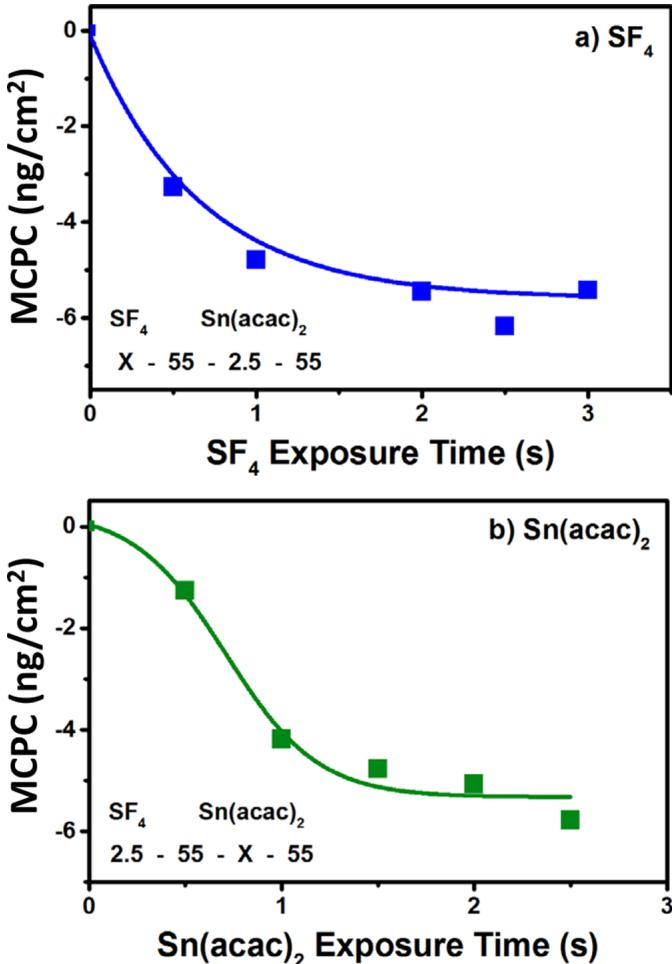  
Figure 4. Mass change per cycle (MCPC) showing the self-limiting nature of the  $\mathrm{SF}_4$  and  $\mathrm{Sn(acac)}_2$  reactions during  $\mathrm{Al}_2\mathrm{O}_3$  ALE at 200  $^\circ \mathrm{C}$ . (a)  $\mathrm{SF}_4$  exposure time,  $X_{r}$  is varied as the  $\mathrm{Sn(acac)}_2$  exposure time is held constant at  $2.5\mathrm{s}$ . (b)  $\mathrm{Sn(acac)}_2$  exposure time,  $X_{r}$  is varied as the  $\mathrm{SF}_4$  exposure time is held constant at  $2.5\mathrm{s}$ . Purge times after each reactant exposure are  $55\mathrm{s}$ .

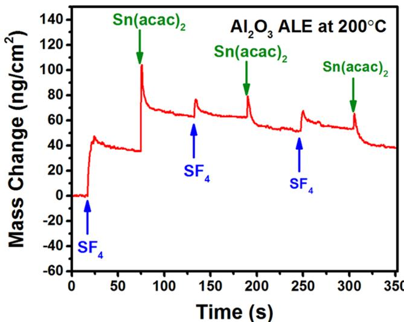  
Figure 5. First three cycles of  $\mathrm{Al}_2\mathrm{O}_3$  ALE using  $\mathrm{SF}_4$  and  $\mathrm{Sn(acac)}_2$  at  $200^{\circ}\mathrm{C}$  showing initial fluorination mass gain during  $\mathrm{SF}_4$  exposure, subsequent mass changes during the first  $\mathrm{Sn(acac)}_2$  exposure, and subsequent  $\mathrm{SF}_4$  and  $\mathrm{Sn(acac)}_2$  exposures.

given in Table 1:  $\mathrm{Al}_2\mathrm{O}_3 + 3\mathrm{SF}_4\rightarrow 2\mathrm{AlF}_3 + 3\mathrm{SOF}_2$ . The mass gain can be used to calculate the  $\mathrm{Al}_2\mathrm{O}_3$  thickness converted to an  $\mathrm{AlF}_3$  thickness by the  $\mathrm{SF}_4$  exposure. The mass change  $\Delta M_{\mathrm{SF}_4} = 35.1\mathrm{ng / cm^2}$  is consistent with the conversion of  $\sim 1.8\mathrm{\AA}$  of  $\mathrm{Al}_2\mathrm{O}_3$  to  $\sim 3.1\mathrm{\AA}$  of  $\mathrm{AlF}_3$ . These thicknesses are based on the change in mass of  $66\mathrm{g / mol}$  during  $\mathrm{Al}_2\mathrm{O}_3$  conversion to  $2\mathrm{AlF}_3$ , an  $\mathrm{Al}_2\mathrm{O}_3$  ALD film density of  $2.95\mathrm{g / cm^3}$  from  $\mathrm{XRR}$ , and an  $\mathrm{AlF}_3$  density of  $2.88\mathrm{g / cm^3}$ .

Figure 5 also shows that there is a mass gain  $\Delta M_{\mathrm{Sn(acac)}_2} = 27.5\mathrm{ng / cm^2}$  for the first  $\mathrm{Sn(acac)}_2$  exposure after the initial  $\mathrm{SF}_4$  exposure. Although  $\mathrm{Sn(acac)}_2$  can undergo ligand exchange with the fluorinated surface, the net mass gain indicates that acac species are added to the surface during the first  $\mathrm{Sn(acac)}_2$  exposure. Subsequently, the  $\mathrm{SF}_4$  and  $\mathrm{Sn(acac)}_2$  exposures for the second and third reaction cycles are evolving to the steady- state etching behavior observed in Figure 2. This nucleation period occurs over approximately six reaction cycles.

Fluorination of the  $\mathrm{Al}_2\mathrm{O}_3$  ALD film with  $\mathrm{SF}_4$  and HF was also monitored with in situ FTIR spectroscopy. Figure 6a

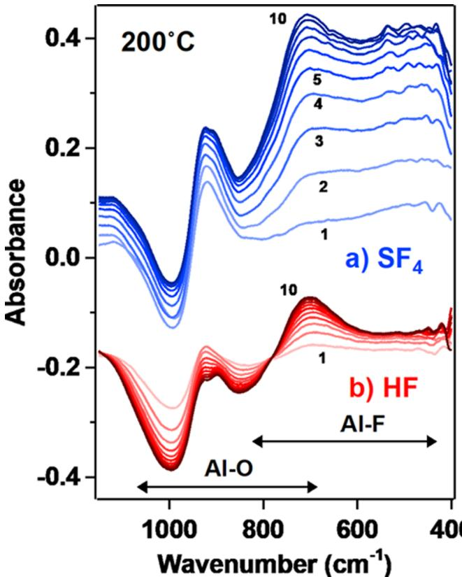  
Figure 6. FTIR spectra recorded at  $200^{\circ}\mathrm{C}$  during fluorination of the  $\mathrm{Al}_2\mathrm{O}_3$  ALD film at  $200^{\circ}\mathrm{C}$ . (a) Difference spectra for  $10\mathrm{SF}_4$  exposures on the  $\mathrm{Al}_2\mathrm{O}_3$  ALD film. (b) Difference spectra for  $10\mathrm{HF}$  exposures on the  $\mathrm{Al}_2\mathrm{O}_3$  ALD film.

shows the difference spectra for  $10\mathrm{SF}_4$  exposures on the  $\mathrm{Al}_2\mathrm{O}_3$  ALD film at  $200^{\circ}\mathrm{C}$ . Each  $\mathrm{SF}_4$  exposure was performed at  $300\mathrm{mTorr}$  for  $1\mathrm{s}$ . The difference spectra were obtained by subtracting the spectra after each  $\mathrm{SF}_4$  exposure from the spectrum for the initial  $\mathrm{Al}_2\mathrm{O}_3$  ALD film. These difference spectra show the progressive fluorination of the  $\mathrm{Al}_2\mathrm{O}_3$  ALD film by the  $\mathrm{SF}_4$  exposures according to the proposed reaction  $\mathrm{Al}_2\mathrm{O}_3 + 3\mathrm{SF}_4\rightarrow 2\mathrm{AlF}_3 + 3\mathrm{SOF}_2$ .

Figure 6a demonstrates that a broad absorbance peak becomes larger at  $\sim 700 \mathrm{cm}^{- 1}$  with increasing  $\mathrm{SF}_4$  exposures. This absorbance peak is assigned to an Al- F stretching vibration. $^{44,45}$  An additional absorbance peak is observed at  $\sim 900 \mathrm{cm}^{- 1}$ . A broad shoulder is also present at frequencies between 400 and  $600 \mathrm{cm}^{- 1}$  that are less than the frequency of the Al- F stretching vibration. These absorbance features are attributed to the presence of  $\mathrm{SF}_x$  species on the  $\mathrm{AlF}_3$  surface.  $\mathrm{SF}_2$  stretching vibrations are observed in  $\mathrm{SF}_4$  at  $\sim 890$  and  $\sim 860 \mathrm{cm}^{- 1}$ . $^{46,47}$  Additional stretching and deformation vibrational modes exist for  $\mathrm{SF}_4$  at  $\sim 560$  and  $\sim 530 \mathrm{cm}^{- 1}$ . $^{46,47}$  Likewise, a strong symmetric FSO deformation mode has been reported in  $\mathrm{SOF}_2$  at  $\sim 550 \mathrm{cm}^{- 1}$ . $^{48,49}$

Figure 6a also shows that a prominent absorbance loss occurs at  $\sim 1000 \mathrm{cm}^{- 1}$ . This absorbance loss is attributed to the reduction of absorbance from Al- O stretching vibrations in  $\mathrm{Al}_2\mathrm{O}_3$ . $^{13}$  In addition, there is an increase in the background absorbance during  $\mathrm{SF}_4$  fluorination. This baseline shift is larger than the progressive loss of Al- O stretching vibrations with increasing  $\mathrm{SF}_4$  exposures in Figure 6a. The origin of this increasing background absorbance with increasing  $\mathrm{SF}_4$  exposures is not understood at this time.

For comparison, Figure 6b shows difference spectra for 10 HF exposures on the  $\mathrm{Al}_2\mathrm{O}_3$  ALD films at  $200^{\circ}\mathrm{C}$ . These difference spectra have been displayed for clarity in presentation. Each HF exposure was conducted at 100 mTorr for  $1 \mathrm{s}$ . The difference spectra were obtained by subtracting the spectra after each HF exposure from the spectrum recorded for the initial  $\mathrm{Al}_2\mathrm{O}_3$  ALD film. These difference spectra are consistent with the progressive fluorination of the  $\mathrm{Al}_2\mathrm{O}_3$  ALD film by HF exposures according to the reaction  $\mathrm{Al}_2\mathrm{O}_3 + 6\mathrm{HF} \rightarrow 2\mathrm{AlF}_3 + 3\mathrm{H}_2\mathrm{O}$ . The HF exposures may also fluorinate the  $\mathrm{Al}_2\mathrm{O}_3$  ALD film to produce oxyfluorides by the reaction  $\mathrm{Al}_2\mathrm{O}_3 + z\mathrm{HF} \rightarrow 2\mathrm{AlO}_{(6 - z) / 4}\mathrm{F}_{z / 2} + (z / 2)\mathrm{H}_2\mathrm{O}$ . $^{50}$

The absorbance peak from the Al- F stretching vibration in Figure 6b is located at  $\sim 700 \mathrm{cm}^{- 1}$ . $^{13,44,45}$  This absorbance peak progressively becomes larger with increasing HF exposures. A prominent absorbance loss also occurs at  $\sim 1000 \mathrm{cm}^{- 1}$  resulting from the progressive loss of Al- O stretching vibrations from  $\mathrm{Al}_2\mathrm{O}_3$  with increasing HF exposure. $^{13}$  In contrast to the results for  $\mathrm{SF}_4$ , absorbance gains at  $\sim 900 \mathrm{cm}^{- 1}$  and between 400 and  $600 \mathrm{cm}^{- 1}$  are not observed for HF fluorination of  $\mathrm{Al}_2\mathrm{O}_3$  because there are no  $\mathrm{SF}_x$  surface species. There is also no increase in the background absorbance during HF fluorination.

Figure 7 shows results for the temperature dependence of  $\mathrm{Al}_2\mathrm{O}_3$  ALE using  $\mathrm{SF}_4$  and  $\mathrm{Sn(acac)}_2$ . These results were obtained using spectroscopic ellipsometry (SE) measurements with  $\mathrm{Al}_2\mathrm{O}_3$  ALD films on Si wafers. A spectroscopic ellipsometer was used to measure film thicknesses both before and after etching. The samples were initially coated with  $\mathrm{Al}_2\mathrm{O}_3$  ALD films at  $130^{\circ}\mathrm{C}$ . The individual samples were then etched for various numbers of cycles at temperatures from 150 to 225  $^\circ \mathrm{C}$  prior to the SE measurements. The  $\mathrm{Al}_2\mathrm{O}_3$  etch rates increased with temperature. The etch rates were  $0.04 \mathrm{Å / cycle}$  at  $150^{\circ}\mathrm{C}$ ,  $0.07 \mathrm{Å / cycle}$  at  $175^{\circ}\mathrm{C}$ ,  $0.14 \mathrm{Å / cycle}$  at  $200^{\circ}\mathrm{C}$ , and  $0.25 \mathrm{Å / cycle}$  at  $225^{\circ}\mathrm{C}$ . The etch rate of  $0.14 \mathrm{Å / cycle}$  at 200  $^\circ \mathrm{C}$  from these SE measurements is less than the etch rate of  $0.2 \mathrm{Å / cycle}$  from the QCM analysis in Figure 1. The SE measurements in Figure 7 provide the trends versus temperature but are not as accurate as the QCM analysis because they are based on only 2- 3 data points.

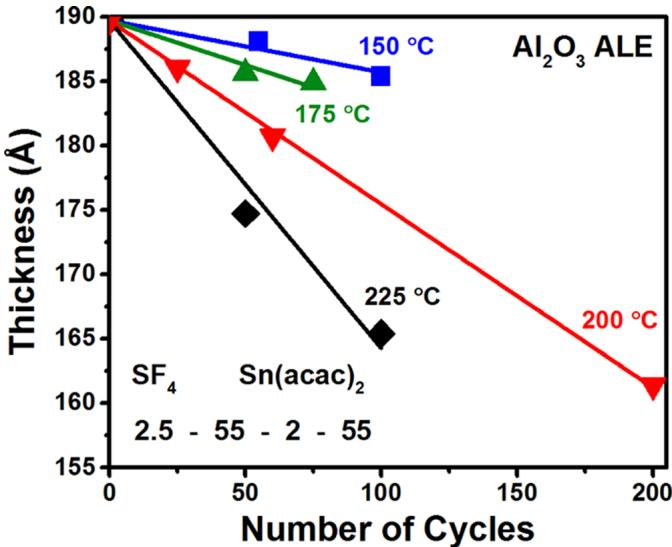  
Figure 7. Temperature dependence of  $\mathrm{Al}_2\mathrm{O}_3$  ALE using  $\mathrm{SF}_4$  and  $\mathrm{Sn(acac)}_2$ . Etch rate increases from  $0.04 \mathrm{Å / cycle}$  at  $150^{\circ}\mathrm{C}$  to  $0.25 \mathrm{Å / cycle}$  at  $225^{\circ}\mathrm{C}$ .

An Arrhenius plot of these temperature- dependent etch rates yields an activation barrier of  $44 \mathrm{kcal / mol}$ . This activation barrier of  $44 \mathrm{kcal / mol}$  could result from the temperature dependence of the fluorination reaction. Higher temperatures should produce progressively thicker fluoride layers on  $\mathrm{Al}_2\mathrm{O}_3$ . If these fluoride layers are removed during the ligand- exchange reaction, then the  $\mathrm{Al}_2\mathrm{O}_3$  etch rates would be expected to be temperature- dependent. The activation barrier may also be associated with the  $\mathrm{Sn(acac)}_2$  ligand- exchange reaction. The ligand- exchange reaction may leave acac species on the  $\mathrm{Al}_2\mathrm{O}_3$  surface that may block the etching. $^{7}$  Removing these acac species would then increase the etching. The thermal desorption of these acac species may produce temperature- dependent  $\mathrm{Al}_2\mathrm{O}_3$  etch rates. $^{7}$

III.B.  $\mathrm{VO}_2$  ALD Using TEMAV and  $\mathrm{H}_2\mathrm{O}$ .  $\mathrm{VO}_2$  ALD films were grown using TEMAV and  $\mathrm{H}_2\mathrm{O}$  prior to the  $\mathrm{VO}_2$  ALE studies. Figure 8 shows the linear growth of  $\mathrm{VO}_2$  ALD films at

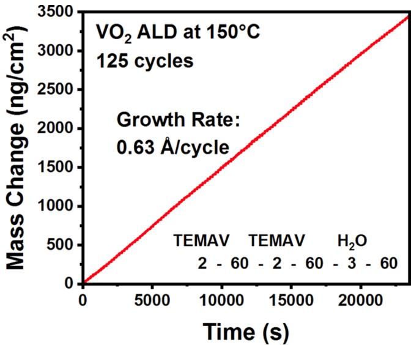  
Figure 8. Mass change versus time during 125 cycles of  $\mathrm{VO}_2$  ALD at  $150^{\circ}\mathrm{C}$  using TEMAV and  $\mathrm{H}_2\mathrm{O}$  as the reactants. Growth rate is  $0.63 \mathrm{Å / cycle}$ .

$150^{\circ}\mathrm{C}$  for 125 reaction cycles. Each reaction cycle consisted of two 2 s TEMAV exposures, followed by a  $60~\mathrm{s~N}_2$  gas purge, a  $3\mathrm{~s~H}_2\mathrm{O}$  exposure, and then a  $60\mathrm{~s~}$  purge. The TEMAV pressure was  $25~\mathrm{mTorr}$ . Two exposures of TEMAV were used for every reaction cycle to ensure that the surface reaction reached completion. The  $\mathrm{H}_2\mathrm{O}$  pressure was  $100\mathrm{mTorr}$ . The mass gain per cycle is  $27.4~\mathrm{ng / cm^2}$ . This mass gain per cycle is consistent with a  $\mathrm{VO}_2$  growth rate of  $0.63\mathrm{~\AA / cycle}$ . This growth rate is based on a film density of  $4.36~\mathrm{g / cm^3}$  measured by XRR. This growth rate is in agreement with the previously reported  $\mathrm{VO}_2$  ALD growth rate of  $0.67\mathrm{~\AA / cycle}$  using TEMAV and  $\mathrm{H}_2\mathrm{O}$  at  $150^{\circ}\mathrm{C}$ .

X- ray photoelectron spectroscopy (XPS) was used to confirm the stoichiometry of the  $\mathrm{VO}_2$  films. Figure 9 shows the XPS spectrum in the O 1s and  $\mathrm{V}2\mathrm{p}$  regions. Curve fittings of the O 1s and  $\mathrm{V}2\mathrm{p}$  regions are consistent with mostly a  $\mathrm{VO}_2$  film with a small component of  $\mathrm{V}_2\mathrm{O}_5$ . The percentages were  $94.4\% \mathrm{VO}_2$  and  $5.6\% \mathrm{V}_2\mathrm{O}_5$ . The peak position was calibrated using the O 1s binding energy set at  $530\mathrm{eV}$  with a single Shirley background over the entire O 1s and  $\mathrm{V}2\mathrm{p}$  areas. The vanadium(IV) oxide and vanadium(V) oxide  $\mathrm{V}2\mathrm{p}_{1 / 2} - \mathrm{V}2\mathrm{p}_{3 / 2}$  splitting was fixed at  $7.33\mathrm{eV}$  and the  $2\mathrm{p}_{1 / 2}$  to  $2\mathrm{p}_{3 / 2}$  ratio was fixed at  $2:1$ .

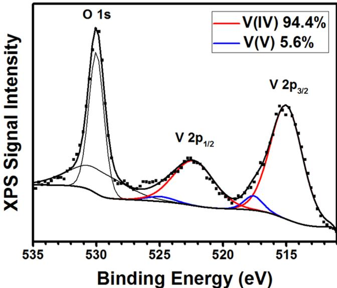  
Figure 9. XPS spectrum of  $\mathrm{VO}_2$  ALD film in the O 1s and  $\mathrm{V}2\mathrm{p}$  regions. Quantification of the  $\mathrm{V}2\mathrm{p}_{3 / 2}$  peak indicates  $94.4\% \mathrm{VO}_2$ $\left(\mathrm{V}^{4 + }\right)$  and  $5.6\% \mathrm{V}_2\mathrm{O}_5$ $\left(\mathrm{V}^{5 + }\right)$ .

The growth of the  $\mathrm{VO}_2$  ALD films using TEMAV and  $\mathrm{H}_2\mathrm{O}$  at  $150^{\circ}\mathrm{C}$  was also investigated using in situ FTIR spectroscopy. The TEMAV exposure was performed at  $10\mathrm{mTorr}$  for  $2\mathrm{s}$ . The  $\mathrm{H}_2\mathrm{O}$  exposure was defined with a pressure of  $100\mathrm{mTorr}$  for  $1\mathrm{s}$ . A  $60\mathrm{s}$  viscous flow  $\mathrm{N}_2$  purge at  $1\mathrm{Torr}$  was employed after each reactant exposure. The FTIR spectra were also recorded after each reactant exposure.

Figure 10 shows the FTIR spectra at  $150^{\circ}\mathrm{C}$  after every 5 cycles of  $\mathrm{VO}_2$  ALD using TEMAV and  $\mathrm{H}_2\mathrm{O}$  for a total of  $35$  cycles. The spectra shown in Figure 10 were obtained after the  $\mathrm{H}_2\mathrm{O}$  exposures. There is a strong and broad absorbance that is centered at approximately  $630~\mathrm{cm^{- 1}}$ . This absorbance peak progressively increases with the number of ALD cycles. This absorbance feature is attributed to  $\mathrm{V} - \mathrm{O}$  stretching vibrations. Earlier infrared vibrational spectroscopy studies of crystalline  $\mathrm{VO}_2$  demonstrated that the vibrational spectrum of  $\mathrm{VO}_2$  becomes featureless in the metallic state above the metal- inulator transition at  $68^{\circ}\mathrm{C}$ . In contrast, vibrational features are observed in Figure 10 for the amorphous  $\mathrm{VO}_2$  films at  $150^{\circ}\mathrm{C}$ . However, evidence of an increase in the background absorbance was observed from  $400$  to  $4000~\mathrm{cm^{- 1}}$  during  $\mathrm{VO}_2$  ALD.

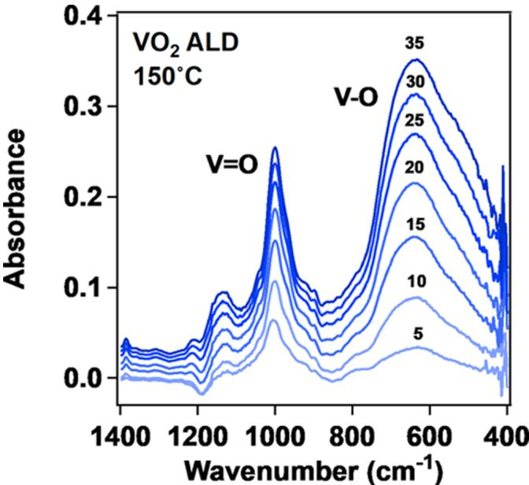  
Figure 10. FTIR spectra recorded at  $150^{\circ}\mathrm{C}$  after every 5 cycles of  $\mathrm{VO}_2$  ALD for 35 cycles using TEMAV and  $\mathrm{H}_2\mathrm{O}$  as the reactants at  $150^{\circ}\mathrm{C}$ .

Absorbance from another vibrational mode centered at  $\sim 996~\mathrm{cm^{- 1}}$  also increases mostly during the initial cycles of  $\mathrm{VO}_2$  ALD. This absorbance feature is attributed to  $\mathrm{V} = \mathrm{O}$  vibrations. The  $\mathrm{V} = \mathrm{O}$  vibration is associated with a terminal oxygen that is likely at the surface of the  $\mathrm{VO}_2$  ALD film. During the later cycles of  $\mathrm{VO}_2$  ALD, this absorbance is increasing more slowly because of some  $\mathrm{V} = \mathrm{O}$  vibrations in the  $\mathrm{VO}_2$  film and because of the increasing background absorbance. The frequency of the  $\mathrm{V} = \mathrm{O}$  vibration is also associated with the oxidation state of the vanadium. The observation of the  $\mathrm{V} = \mathrm{O}$  vibrational feature at  $\sim 996~\mathrm{cm^{- 1}}$  may be an indicator for vanadium in the  $+4$  oxidation state.

III.C.  $\mathrm{VO}_2$  ALE Using  $\mathrm{SF}_4$  or HF and  $\mathrm{Sn(acac)}_2$ . Etching of the  $\mathrm{VO}_2$  ALD films was performed using  $\mathrm{SF}_4$  or HF and  $\mathrm{Sn(acac)}_2$  as the reactants. Figure 11 shows the mass change versus time during  $\mathrm{VO}_2$  ALE using  $\mathrm{SF}_4$  and  $\mathrm{Sn(acac)}_2$  as the reactants at  $200^{\circ}\mathrm{C}$ . The reactant exposure sequence was  $3 - 55 - 3 - 55$ . The  $\mathrm{SF}_4$  pressure was  $500\mathrm{mTorr}$ . The  $\mathrm{Sn(acac)}_2$  pressure was  $\sim 50$  mTorr. Figure 11 reveals that a linear mass loss is observed during  $\mathrm{VO}_2$  ALE over  $50$  cycles. The average MCPC is  $- 13.2~\mathrm{ng / cm^2}$  for the  $50$  cycles. Based on a  $\mathrm{VO}_2$  ALD film density of  $4.36~\mathrm{g / cm^3}$  from XRR measurements, the etch rate is  $0.30\mathrm{~\AA / cycle}$  at  $200^{\circ}\mathrm{C}$ . Additional experiments revealed that the etch rates were in the self-limiting regime for  $\mathrm{SF}_4$  and  $\mathrm{Sn(acac)}_2$  exposures of  $3\mathrm{~s}$ .

An expanded view of three  $\mathrm{VO}_2$  ALE cycles from Figure 11 is shown in Figure 12. The  $\mathrm{SF}_4$  exposure leads to a mass gain  $\Delta M_{\mathrm{SF}_4} = 9.8~\mathrm{ng / cm^2}$ . This mass gain is attributed to fluorination of the  $\mathrm{VO}_2$  surface to  $\mathrm{VF}_4$  or a  $\mathrm{VO}_x\mathrm{F}_y$  oxyfluoride.  $\mathrm{VF}_4$  is a fairly stable metal fluoride with a melting temperature at  $325^{\circ}\mathrm{C}$ .  $\mathrm{SF}_4$  may also leave  $\mathrm{SOF}_2$  on the surface similar to

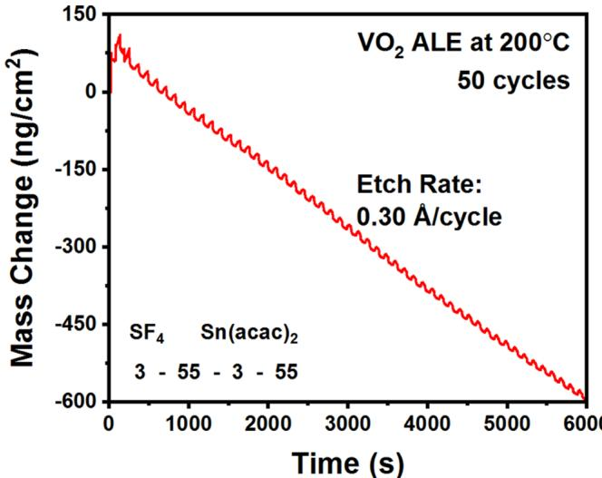  
Figure 11. Mass change versus time during  $\mathrm{VO}_2$  ALE using  $\mathrm{SF}_4$  and  $\mathrm{Sn(acac)}_2$  as the reactants at  $200^{\circ}\mathrm{C}$ . Etch rate is  $0.30\mathrm{\AA}$  /cycle.

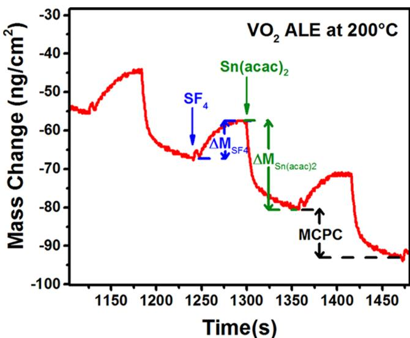  
Figure 12. Expanded view of three  $\mathrm{VO}_2$  ALE cycles from Figure 11 showing mass gain during the  $\mathrm{SF}_4$  exposure and mass loss during  $\mathrm{Sn(acac)}_2$  exposure.

the proposed reactions for  $\mathrm{Al}_2\mathrm{O}_3$  ALE using  $\mathrm{SF}_4$  and  $\mathrm{Sn(acac)}_2$ . The subsequent  $\mathrm{Sn(acac)}_2$  exposure then produces a mass loss  $\Delta M_{\mathrm{Sn(acac)}_2} = - 23.1\mathrm{ng / cm^2}$ . This mass loss is consistent with  $\mathrm{Sn(acac)}_2$  removing the  $\mathrm{VF}_4$  surface layer by a ligand- exchange reaction along with any  $\mathrm{SOF}_2$  surface species to produce volatile products such as  $\mathrm{VF}_2(\mathrm{acac})_2$ ,  $\mathrm{SnF(acac)}_2$  and  $\mathrm{SOF}_2$ . There is very little information on  $\mathrm{VF}_2(\mathrm{acac})_2$  in the literature. However,  $\mathrm{VCl}_2(\mathrm{acac})_2$  is used in the synthesis of other vanadium compounds. The  $\mathrm{Sn(acac)}_2$  exposure may also lead to  $\mathrm{SnF(acac)}$  species adsorbed on the  $\mathrm{VO}_2$  surface.

If the volatile etch products are  $\mathrm{VF}_2(\mathrm{acac})_2$ ,  $\mathrm{SnF(acac)}_2$  and  $\mathrm{SOF}_2$ , the overall reaction can be written as

$$
\begin{array}{rl} & {\mathrm{VO}_2 + 2\mathrm{SF}_4 + 2\mathrm{Sn}(\mathrm{acac})_2}\\ & {\quad \rightarrow \mathrm{VF}_2(\mathrm{acac})_2 + 2\mathrm{SnF}(\mathrm{acac}) + 2\mathrm{SOF}_2} \end{array} \tag{6}
$$

This overall reaction can then be divided into the proposed  $\mathrm{SF}_4$  and  $\mathrm{Sn(acac)}_2$  reactions occurring during  $\mathrm{VO}_2$  ALE at steady state

$$
(\mathrm{A})\mathrm{VO}_2^* +2\mathrm{SF}_4\rightarrow \mathrm{VF}_4\vert x\mathrm{SOF}_2^* +(2 - x)\mathrm{SOF}_2 \tag{7}
$$

$$
\begin{array}{rl} & {(\mathrm{B})\mathrm{VF}_4\vert x\mathrm{SOF}_2^* +2\mathrm{Sn}(\mathrm{acac})_2}\\ & {\rightarrow \mathrm{VF}_2(\mathrm{acac})_2 + 2\mathrm{SnF}(\mathrm{acac}) + x\mathrm{SOF}_2} \end{array} \tag{8}
$$

These reactions include the surface species that are believed to change during the  $\mathrm{SF}_4$  and  $\mathrm{Sn(acac)}_2$  exposures. The asterisks again indicate the surface species, and the vertical lines separate the various surface species. Assuming the reaction stoichiometry given in eq 6, the  $\Delta M_{\mathrm{SF}_4}$  and  $\Delta M_{\mathrm{Sn(acac)}_2}$  values require a surface intermediate that adds mass during reaction A and subtracts mass during reaction B. Therefore,  $\mathrm{SOF}_2^*$  is included as a surface intermediate in eqs 7 and 8.

$\mathrm{VO}_2^*$  shown in eq 7 is the amount of  $\mathrm{VO}_2$  that is etched during the ALE reactions.  $x$  quantifies the amount of  $\mathrm{SOF}_2^*$  species on the surface after the  $\mathrm{SF}_4$  exposure relative to the amount of  $\mathrm{VO}_2$  that is etched in one  $\mathrm{VO}_2$  ALE cycle. The parameter  $x$  can be determined by the  $\Delta M_{\mathrm{Sn(acac)}_2}$  and MCPC values using the equation:

$$
\begin{array}{rl} & {x = [M_{\mathrm{VO}_2}(\Delta M_{\mathrm{Sn(acac)}_2} / \mathrm{MCPC}) - M_{\mathrm{VO}_2}] / M_{\mathrm{SOF}_2}}\\ & {x = [82.9(-23.1 / - 13.2) - 126.9] / 86.1} \end{array} \tag{10}
$$

The values 126.9, 82.9, and 86.1 are the molecular weights for  $\mathrm{VF}_4$ ,  $\mathrm{VO}_2$ , and  $\mathrm{SOF}_2$ , respectively. Using  $\Delta M_{\mathrm{Sn(acac)}_2} = - 23.1$ $\mathrm{ng / cm^2}$  and  $\mathrm{MCPC} = - 13.2\mathrm{ng / cm^2}$ , eq 10 yields  $x = 0.21$ . This  $x$  value reveals that there are  $0.21\mathrm{SOF}_2^*$  species present on the surface after the  $\mathrm{SF}_4$  exposures for every  $\mathrm{VO}_2$  unit etched during one  $\mathrm{VO}_2$  ALE cycle.

The MCPC and etch rate during  $\mathrm{VO}_2$  ALE at  $200^{\circ}\mathrm{C}$  using  $\mathrm{SF}_4$  and  $\mathrm{Sn(acac)}_2$  are  $- 13.2\mathrm{ng / cm^2}$  and  $0.30\mathrm{\AA}$  /cycle, respectively. This removal rate of  $\mathrm{VO}_2$  is equivalent to  $9.58\times 10^{13}\mathrm{VO}_2$  units  $\mathrm{cm}^2$ . The density of the  $\mathrm{VO}_2$  ALD films is  $4.36\mathrm{g / cm^3}$  from XRR measurements. This density yields an estimate of  $1.00\times 10^{15}\mathrm{VO}_2$  units  $\mathrm{cm}^2$  for the number of  $\mathrm{VO}_2$  units on the  $\mathrm{VO}_2$  surface. The  $\mathrm{VO}_2$  removal rate is about  $9.6\%$  of the number of  $\mathrm{VO}_2$  units on the  $\mathrm{VO}_2$  surface. Based on the  $x$  value of  $0.21$ , the  $\mathrm{SOF}_2^*$  coverage is determined to be  $2.01\times 10^{13}\mathrm{SOF}_2^*$  species  $\mathrm{cm}^2$ . This  $\mathrm{SOF}_2^*$  coverage is about  $2.0\%$  of the number of  $\mathrm{VO}_2$  units on the  $\mathrm{VO}_2$  surface.

The mass changes during the  $\mathrm{SF}_4$  and  $\mathrm{Sn(acac)}_2$  exposures decrease slightly as the etching proceeds. However, the MCPC stays nearly constant at  $- 13.2\mathrm{ng / cm^2}$  averaged over the  $50$  cycles in Figure 11. The slight decrease in the mass changes during the  $\mathrm{SF}_4$  and  $\mathrm{Sn(acac)}_2$  exposures may result from slow changes in the surface composition. There is a possibility that the  $\mathrm{Sn(acac)}_2$  reactant may be able to remove some vanadium species from the  $\mathrm{VO}_2$  film as vanadyl acetolactonate  $(\mathrm{VO(acac)}_2)$ . The removal of  $\mathrm{VO(acac)}_2$  would change the  $\mathrm{V / O}$  ratio on the surface and perhaps slowly affect the etch rate.

III.D. Fluorination of  $\mathrm{VO}_2$  Using  $\mathrm{SF}_4$  or  $\mathrm{HF}$ . QCM experiments explored the effect of  $\mathrm{SF}_4$  exposure on an initial  $\mathrm{VO}_2$  ALD film independent of any acac surface species. Figure 13 shows the first three  $\mathrm{VO}_2$  ALE cycles on an initial  $\mathrm{VO}_2$  ALD film using  $\mathrm{SF}_4$  and  $\mathrm{Sn(acac)}_2$  as the reactants. The first  $\mathrm{SF}_4$  exposure leads to a mass gain  $\Delta M_{\mathrm{SF}_4} = 38.5\mathrm{ng / cm^2}$  at  $200^{\circ}\mathrm{C}$ . The  $\mathrm{SF}_4$  exposure was conducted at  $500\mathrm{mTorr}$  for  $3\mathrm{s}$ . The  $\mathrm{SF}_4$  exposure is believed to fluorinate the  $\mathrm{VO}_2$  film according to the reaction given in Table 1:  $\mathrm{VO}_2 + 2\mathrm{SF}_4\rightarrow \mathrm{VF}_4 + 2\mathrm{SOF}_2$ . The mass gain can be used to calculate the  $\mathrm{VO}_2$  thickness

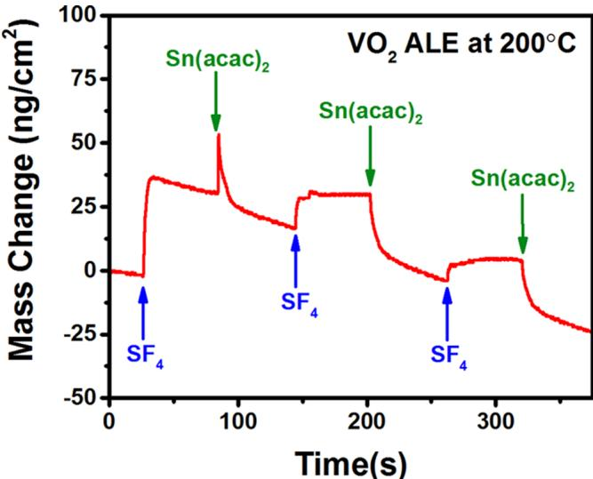  
Figure 13. First three cycles of  $\mathrm{VO}_2$  ALE using  $\mathrm{SF}_4$  and  $\mathrm{Sn(acac)}_2$  at  $200^{\circ}\mathrm{C}$  showing initial mass gain from fluorination during  $\mathrm{SF}_4$  exposure and mass changes during the first  $\mathrm{Sn(acac)}_2$  exposure and subsequent  $\mathrm{SF}_4$  and  $\mathrm{Sn(acac)}_2$  exposures.

converted to  $\mathrm{VF}_4$  by the  $\mathrm{SF}_4$  exposure. The mass change of  $\Delta M_{\mathrm{SF}_4} = 38.5 \mathrm{ng / cm^2}$  is consistent with the conversion of  $\sim 1.6$  Å of  $\mathrm{VO}_2$  to  $\sim 3.7 \mathrm{\AA}$  of  $\mathrm{VF}_4$ . These thicknesses are based on the change in mass of  $44 \mathrm{g / mol}$  during  $\mathrm{VO}_2$  conversion to  $\mathrm{VF}_4$ , a  $\mathrm{VO}_2$  ALD film density of  $4.36 \mathrm{g / cm^3}$  from  $\mathrm{XRR}$ , and a  $\mathrm{VF}_4$  density of  $2.98 \mathrm{g / cm^3}$ .

Figure 14 shows additional QCM measurements that compare the mass gain during the fluorination of the initial $\mathrm{VO}_2$  ALD film using either  $\mathrm{SF}_4$  or HF. The  $\mathrm{SF}_4$  exposure at  $500 \mathrm{mTorr}$  leads to a much higher mass gain than the HF exposures at either 60 or  $500 \mathrm{mTorr}$ . The mass gain resulting from the  $\mathrm{SF}_4$  exposures is  $38.5 \mathrm{ng / cm^2}$ . The mass gain from the HF exposures is  $20.5 \mathrm{ng / cm^2}$  and is independent of the HF pressure. The higher mass gain from the  $\mathrm{SF}_4$  exposures probably cannot be explained solely by the presence of  $\mathrm{SOF}_2^*$  species on the  $\mathrm{VO}_2$  surface. The  $\mathrm{SOF}_2^*$  coverage of  $2.01 \times$

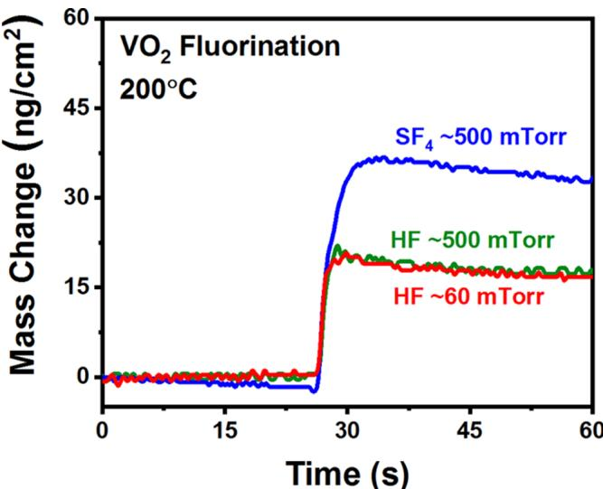  
Figure 14. Mass gains during fluorination of the initial  $\mathrm{VO}_2$  ALD film with either  $\mathrm{SF}_4$  or HF.  $\mathrm{SF}_4$  exposure at  $500 \mathrm{mTorr}$  leads to a higher mass gain than HF exposures at either 60 or  $500 \mathrm{mTorr}$ .

$10^{13} \mathrm{SOF}_2^*$  species  $/ \mathrm{cm}^2$  present after the  $\mathrm{SF}_4$  exposures during steady state  $\mathrm{VO}_2$  ALE using  $\mathrm{SF}_4$  and  $\mathrm{Sn(acac)}_2$  is equivalent to a mass of  $2.9 \mathrm{ng / cm^2}$ .

The ability of the HF to fluorinate the  $\mathrm{VO}_2$  ALD film was initially questioned because the  $\Delta G^{\circ}$  value for the  $\mathrm{VO}_2 + 4 \mathrm{HF} \rightarrow \mathrm{VF}_4 + 2 \mathrm{H}_2\mathrm{O}$  reaction is positive at  $\Delta G^{\circ} = +9 \mathrm{kcal}$ . The mass gain with HF exposure suggests that other fluorination reactions may be possible. For example, a subfluoride of vanadium may be formed from the reaction  $\mathrm{VO}_2 + \mathrm{HF} \rightarrow \mathrm{VOF}_2 + \mathrm{H}_2\mathrm{O}$ . This reaction has a negative standard free energy value  $\Delta G^{\circ} = - 1.58 \mathrm{kcal / mol}$  at  $200^{\circ}\mathrm{C}$ .

To explore further the  $\mathrm{VO}_2$  fluorination, in situ FTIR spectroscopy studies were used to monitor the fluorination of  $\mathrm{VO}_2$  ALD films with  $\mathrm{SF}_4$  and HF at  $200^{\circ}\mathrm{C}$ . Figure 15 displays the fluorination of the  $\mathrm{VO}_2$  ALD film using either  $\mathrm{SF}_4$  or HF exposures. Figure 15a shows the difference spectra for the fluorination using 10 consecutive  $\mathrm{SF}_4$  exposures. Each  $\mathrm{SF}_4$  exposure was defined by a pressure of  $300 \mathrm{mTorr}$  for  $1 \mathrm{s}$ . Figure 15b shows the difference spectra for the progressive fluorination using 10 consecutive HF exposures. These difference spectra have been displaced for clarity in presentation. Each HF exposure was defined by a pressure of  $100 \mathrm{mTorr}$  for  $1 \mathrm{s}$ . The reference spectrum for the difference spectra in Figures 15a and 15b was the spectrum of the initial  $\mathrm{VO}_2$  ALD film.

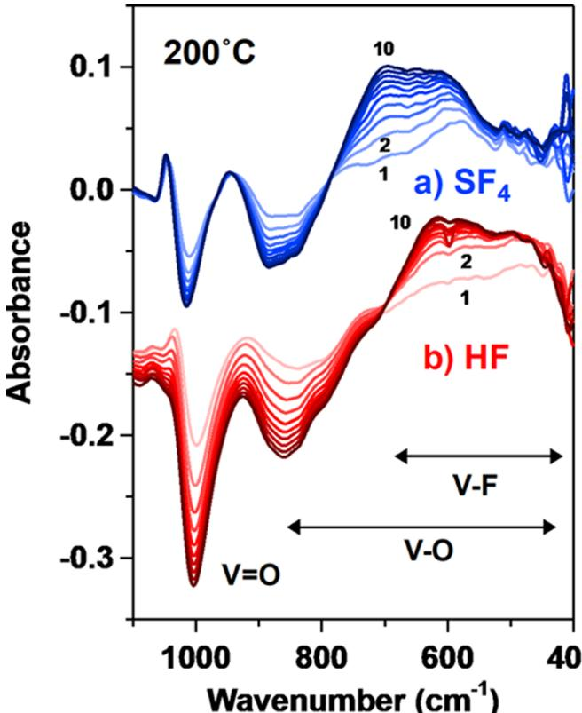  
Figure 15. FTIR spectra recorded at  $200^{\circ}\mathrm{C}$  during fluorination of the  $\mathrm{VO}_2$  ALD film at  $200^{\circ}\mathrm{C}$ . (a) Difference spectra for  $10 \mathrm{SF}_4$  exposures on the  $\mathrm{VO}_2$  ALD film. (b) Difference spectra for  $10 \mathrm{HF}$  exposures on the  $\mathrm{VO}_2$  ALD film.

Broad absorbance gains centered at  $\sim 650$  and  $\sim 590 \mathrm{cm}^{- 1}$  are observed for both  $\mathrm{SF}_4$  and HF exposures, respectively. This absorbance gain is consistent with  $\mathrm{V} - \mathrm{F}$  stretching vibrations. Previous investigations have observed the  $\mathrm{V} - \mathrm{F}$  stretching vibration at  $530 \mathrm{cm}^{- 1}$  in  $\mathrm{VF}_4$  and at  $540 \mathrm{cm}^{- 1}$  in  $\mathrm{VF}_3$ . The

slightly higher frequencies observed during the fluorination of  $\mathrm{VO}_2$  ALD films may be attributed to the presence of oxyfluorides and the higher  $\mathrm{V} - \mathrm{F}$  frequencies in vanadium oxyfluorides.59 In comparison with the results for  $\mathrm{SF}_4$  on  $\mathrm{Al}_2\mathrm{O}_3$  ALD films displayed in Figure 6a, no prominent absorbance gains are observed at  $\sim 900 \mathrm{cm}^{- 1}$  or  $530 - 560 \mathrm{cm}^{- 1}$  in Figure 15a that would be consistent with an abundance of  $\mathrm{SF}_x$  surface species.46- 49 The absence of these absorbance gains is consistent with the lower  $\mathbf{x}$  value for  $\mathrm{VO}_2$  ALE using  $\mathrm{SF}_4$  and  $\mathrm{Sn(acac)}_2$

Another prominent absorbance feature in Figure 15 is the absorbance loss at  $\sim 1000 \mathrm{cm}^{- 1}$  after both  $\mathrm{SF}_4$  and HF exposures. The loss of this  $\mathrm{V} = \mathrm{O}$  stretching vibration would be expected during fluorination if the  $\mathrm{V} = \mathrm{O}$  vibrational modes are primarily on the surface of the  $\mathrm{VO}_2$  ALD film. Fluorination with  $\mathrm{SF}_4$  also produces a small absorbance gain in the difference spectrum in Figure 15a at  $\sim 1045 \mathrm{cm}^{- 1}$ . This absorbance gain may again be indicative of vanadium oxyfluorides with vanadium atoms bonded to both oxygen and fluorine atoms.59

# IV. CONCLUSIONS

Fluorination and ligand- exchange reactions can be employed for thermal ALE. HF has been the most common fluorination reactant. However, HF is a fairly weak nucleophilic fluorination reactant. Stronger fluorination reactants may be useful as an alternative to HF. One possible option is  $\mathrm{SF}_4$ . The thermal ALE of  $\mathrm{Al}_2\mathrm{O}_3$  and  $\mathrm{VO}_2$  was explored using both  $\mathrm{SF}_4$  and HF as fluorination reactants together with  $\mathrm{Sn(acac)}_2$  as the metal precursor for ligand- exchange.

$\mathrm{SF}_4$  and HF were very comparable as fluorination reactants during  $\mathrm{Al}_2\mathrm{O}_3$  ALE. The mass gains during the initial fluorination of  $\mathrm{Al}_2\mathrm{O}_3$  ALD films at  $200^{\circ}\mathrm{C}$  were 35 and 38  $\mathrm{ng / cm^2}$  using  $\mathrm{SF}_4$  and HF, respectively. In addition, the etch rates for  $\mathrm{Al}_2\mathrm{O}_3$  ALD films using  $\mathrm{SF}_4$  and HF, together with  $\mathrm{Sn(acac)}_2$  were 0.20 and  $0.28 \mathrm{\AA}$  cycle, respectively, at  $200^{\circ}\mathrm{C}$ .  $\mathrm{SF}_4$  is an effective alternative to HF for  $\mathrm{Al}_2\mathrm{O}_3$  thermal ALE.

$\mathrm{SF}_4$  was also compared to HF for  $\mathrm{VO}_2$  ALE. The mass gains during the initial  $\mathrm{SF}_4$  and HF exposures on  $\mathrm{VO}_2$  ALD films were 38 and  $20 \mathrm{ng / cm^2}$  respectively. The larger fluorination when using  $\mathrm{SF}_4$  also led to higher  $\mathrm{VO}_2$  etch rates. Etch rates of 0.30 and  $0.11 \mathrm{\AA}$  cycle were measured for  $\mathrm{VO}_2$  ALE using  $\mathrm{SF}_4$  and HF, respectively, together with  $\mathrm{Sn(acac)}_2$  at  $200^{\circ}\mathrm{C}$ . The more favorable thermoc chemistry for  $\mathrm{VO}_2$  fluorination by  $\mathrm{SF}_4$  leads to a larger etch rate.

Additional FTIR experiments were also conducted to observe the fluorination of the  $\mathrm{Al}_2\mathrm{O}_3$  and  $\mathrm{VO}_2$  ALD films by  $\mathrm{SF}_4$  or HF. These studies revealed that  $\mathrm{SF}_4$  and HF were comparable as fluorination reactants. The FTIR difference spectra were used to monitor the growth of  $\mathrm{Al} - \mathrm{F}$  and  $\mathrm{V} - \mathrm{F}$  stretching vibrations and the loss of  $\mathrm{Al} - \mathrm{O}$  and  $\mathrm{V} = \mathrm{O}$  stretching vibrations for  $\mathrm{Al}_2\mathrm{O}_3$  and  $\mathrm{VO}_2$ , respectively, versus  $\mathrm{SF}_4$  or HF exposure. The FTIR difference spectra also suggested that  $\mathrm{S} - \mathrm{F}$  stretching vibrations from  $\mathrm{SF}_x$  surface species were present on  $\mathrm{Al}_2\mathrm{O}_3$  after  $\mathrm{SF}_4$  exposures.  $\mathrm{SF}_4$  is a useful fluorination reactant for thermal ALE.  $\mathrm{SF}_4$  is also a stronger fluorination reactant that may be needed for etching some materials.

# AUTHOR INFORMATION

Corresponding Author \*E- mail: steven.george@colorado.edu.

# ORCID

Jonas C. Gertsch: 0000- 0002- 0626- 9635 Steven M. George: 0000- 0003- 0253- 9184

# Notes

The authors declare no competing financial interest.

# ACKNOWLEDGMENTS

This research was funded by the U.S. Army Research Laboratory and the U.S. Army Research Office under Contract Number W911NF- 14- C- 0007. Additional support was provided by the National Science Foundation through Grant CHE- 1609554.

# REFERENCES

(1) Kanarik, K. J.; Lill, T.; Hudson, B. A.; Sriraman, S.; Tan, S.; Marks, J.; Vahedi, V.; Gottscho, R. A. Overview of Atomic Layer Etching in the Semiconductor Industry. J. Vac. Sci. Technol., A 2015, 33, No. 020802. 
(2) Carver, C. T.; Plombon, J. J.; Romero, P. E.; Suri, S.; Tronic, T. A.; Turkot, R. B., Jr. Atomic Layer Etching: An Industry Perspective. ECS J. Solid State Sci. Technol. 2015, 4, N5005-N5009. 
(3) Faraz, T.; Roozeboom, F.; Knoops, H. C. M.; Kessels, W. M. M. Atomic Layer Etching: What Can We Learn from Atomic Layer Deposition? ECS J. Solid State Sci. Technol. 2015, 4, N5023-N5032. 
(4) George, S. M. Atomic Layer Deposition: An Overview. Chem. Rev. 2010, 110, 111-131. 
(5) Lee, Y.; George, S. M. Atomic Layer Etching of  $\mathrm{Al}_2\mathrm{O}_3$  Using Sequential, Self-Limiting Thermal Reactions with  $\mathrm{Sn(acac)}_2$  and Hydrogen Fluoride. ACS Nano 2015, 9, 2061-2070. 
(6) Zywotko, D. R.; Faguet, J.; George, S. M. Rapid Atomic Layer Etching of  $\mathrm{Al}_2\mathrm{O}_3$  Using Sequential Exposures of Hydrogen Fluoride and Trimethylaluminum with No Purging. J. Vac. Sci. Technol., A 2018, 36, No. 061508. 
(7) Lee, Y.; DuMont, J. W.; George, S. M. Mechanism of Thermal  $\mathrm{Al}_2\mathrm{O}_3$  Atomic Layer Etching Using Sequential Reactions with  $\mathrm{Sn(acac)}_2$  and HF. Chem. Mater. 2015, 27, 3648-3657. 
(8) Johnson, N. R.; Sun, H.; Sharma, K.; George, S. M. Thermal Atomic Layer Etching of Crystalline Aluminum Nitride Using Sequential, Self-limiting Hydrogen Fluoride and  $\mathrm{Sn(acac)}_2$  Reactions and Enhancement by  $\mathrm{H}_2$  and Ar Plasmas. J. Vac. Sci. Technol., A 2016, 34, No. 050603. 
(9) Lee, Y.; DuMont, J. W.; George, S. M. Atomic Layer Etching of  $\mathrm{HfO}_2$  Using Sequential, Self-limiting Thermal Reactions with  $\mathrm{Sn(acac)}_2$  and HF. ECS J. Solid State Sci. Technol. 2015, 4, N5013-N5022. 
(10) Lee, Y.; DuMont, J. W.; George, S. M. Trimethylaluminum as the Metal Precursor for the Atomic Layer Etching of  $\mathrm{Al}_2\mathrm{O}_3$  Using Sequential, Self-limiting Thermal Reactions. Chem. Mater. 2016, 28, 2994-3003. 
(11) Lee, Y.; George, S. M. Thermal Atomic Layer Etching of  $\mathrm{HfO}_2$  Using HF for Fluorination and  $\mathrm{TiCl}_4$  for Ligand-Exchange. J. Vac. Sci. Technol., A 2018, 36, No. 061504. 
(12) Lee, Y.; Huffman, C.; George, S. M. Selectivity in Thermal Atomic Layer Etching Using Sequential, Self-Limiting Fluorination and Ligand-Exchange Reactions. Chem. Mater. 2016, 28, 7657-7665. 
(13) DuMont, J. W.; George, S. M. Competition Between  $\mathrm{Al}_2\mathrm{O}_3$  Atomic Layer Etching and  $\mathrm{AlF}_3$  Atomic Layer Deposition Using Sequential Exposures of Trimethylaluminum and Hydrogen Fluoride. J. Chem. Phys. 2017, 146, No. 052819. 
(14) DuMont, J. W.; Marquardt, A. E.; Cano, A. M.; George, S. M. Thermal Atomic Layer Etching of  $\mathrm{SiO}_2$  by a "Conversion-Etch" Mechanism Using Sequential Reactions of Trimethylaluminum and Hydrogen Fluoride. ACS Appl. Mater. Interfaces 2017, 9, 10296-10307. 
(15) Zywotko, D. R.; George, S. M. Thermal Atomic Layer Etching of  $\mathrm{ZnO}$  by a "Conversion-Etch" Mechanism Using Sequential

Exposures of Hydrogen Fluoride and Trimethylaluminum. Chem. Mater. 2017, 29, 1183- 1191. (16) Na, J. Y.; Woo, K. H.; Yoon, S. Y.; Cho, S. Y.; Song, I. U.; Kim, J. A.; Kim, J. S. Acute Symptoms After a Community Hydrogen Fluoride Spill. Annals of Occupational and Environmental Medicine 2013, 25, 17. (17) HSC Chemistry; HSC Chemistry 5.1, Outokumpu Research Oy: Pori, Finland, 2002. (18) Hasek, W. R.; Smith, W. C.; Engelhardt, V. A. The Chemistry of Sulfur Tetrafluoride. II. The Fluorination of Organic Carbonyl Compounds. J. Am. Chem. Soc. 1960, 82, 543- 551. (19) Oppegard, A. L.; Smith, W. C.; Muetterties, E. L.; Engelhardt, V. A. The Chemistry of Sulfur Tetrafluoride. IV. Fluorination of Inorganic Oxides and Sulfides. J. Am. Chem. Soc. 1960, 82, 3055- 3838. (20) Bendada, A.; Webb, G.; Winfield, J. M. Fluorination of Gamma- Alumina by Sulphur Tetrafluoride, Thionyl Fluoride, Carbonyl Fluoride or Anhydrous Hydrogen Fluoride: A Radiotracer Study. Eur. J. Solid State Inorg. Chem. 1996, 33, 907- 916. (21) Tullock, C. W.; Fawcett, F. S.; Smith, W. C.; Coffman, D. D. The Chemistry of Sulfur Tetrafluoride. I. The Synthesis of Sulfur Tetrafluoride. J. Am. Chem. Soc. 1960, 82, 539- 542. (22) Roberts, H. L. The Chemistry of Compounds Containing Sulphur- Fluorine Bonds. Q. Rev., Chem. Soc. 1961, 15, 30- 55. (23) George, S. M.; Lee, Y. Prospects for Thermal Atomic Layer Etching Using Sequential, Self- Limiting Fluorination and Ligand- Exchange Reactions. ACS Nano 2016, 10, 4889- 4894. (24) Morin, F. J. Oxides Which Show a Metal- to- Insulator Transition at the Neel Temperature. Phys. Rev. Lett. 1959, 3, 34- 36. (25) Soltani, M.; Chaker, M.; Haddad, E.; Kruzelesky, R. V. Thermochromic Vanadium Dioxide Smart Coatings Grown on Kapton Substrates by Reactive Pulsed Laser Deposition. J. Vac. Sci. Technol., A 2006, 24, 612- 617. (26) Manning, T. D.; Parkin, I. P.; Pemble, M. E.; Sheel, D.; Vernardou, D. Intelligent Window Coatings: Atmospheric Pressure Chemical Vapor Deposition of Tungsten- Doped Vanadium Dioxide. Chem. Mater. 2004, 16, 744- 749. (27) Chen, C. Y.; Yi, X.; Zhao, X.; Xiong, B. Characterizations of  $\mathrm{VO}_2$  Based Uncooled Microbometer Linear Array. Sens. Actuators, A 2001, 90, 212- 214. (28) Kats, M. A.; Sharma, D.; Lin, J.; Genevet, P.; Blanchard, R.; Yang, Z.; Qazilbash, M. M.; Basov, D. N.; Ramanathan, S.; Capasso, F. Ultra- Thin Perfect Absorber Employing a Tunable Phase Change Material. Appl. Phys. Lett. 2012, 101, 221101. (29) Jeromelek, H.; Picard, F.; Vincent, D. Vanadium Oxide Films for Optical Switching and Detection. Opt. Eng. 1993, 32, 2092- 2100. (30) Yang, Z.; Ko, C. Y.; Ramanathan, S. Oxide Electronics Utilizing Ultrafast Metal- Insulator Transitions, In Annual Review of Materials Research, Clarke, D. R., Fratzl, P., Eds. Harvard University, 2011; 41 p. 337- 367. (31) Miikkulainen, V.; Leskela, M.; Ritala, M.; Puurunen, R. L. Crystallinity of Inorganic Films Grown by Atomic Layer Deposition: Overview and General Trends. J. Appl. Phys. 2013, 113, No. 021301. (32) Blanquart, T.; Niinisto, J.; Gavagnin, M.; Longo, V.; Heikkila, M.; Puukilainen, E.; Pallem, V. R.; Dussarrat, C.; Ritala, M.; Leskela, M. Atomic Layer Deposition and Characterization of Vanadium Oxide Thin Films. RSC Adv. 2013, 3, 1179- 1185. (33) Rampelberg, G.; Decuytsche, D.; De Schutter, B.; Premkumar, P. A.; Toeller, M.; Schaekers, M.; Martens, K.; Radu, I.; Detavernier, C. Crystallization and Semiconductor- Metal Switching Behavior of Thin  $\mathrm{VO}_2$  Layers Grown by Atomic Layer Deposition. Thin Solid Films 2014, 550, 59- 64. (34) Elam, J. W.; Groner, M. D.; George, S. M. Viscous Flow Reactor with Quartz Crystal Microbalance for Thin Film Growth by Atomic Layer Deposition. Rev. Sci. Instrum. 2002, 73, 2981- 2987. (35) DuMont, J. W.; George, S. M. Pyrolysis of Alucone Molecular Layer Deposition Films Studied Using In Situ Transmission Fourier Transform Infrared Spectroscopy. J. Phys. Chem. C 2015, 119, 14603- 14612.

(36) Ballinger, T. H.; Wong, J. C. S.; Yates, J. T. Transmission infrared spectroscopy of High Area solid surfaces. A Useful Method for Sample Preparation. Langmuir 1992, 8, 1676-1678. 
(37) Ferguson, J. D.; Weimer, A. W.; George, S. M. Atomic Layer Deposition of Ultrathin and Conformal  $\mathrm{Al}_2\mathrm{O}_3$  Films on BN Particles. Thin Solid Films 2000, 371, 95-104. 
(38) Brunetti, B.; Piacente, V.; Scardala, P. Torsion Vapor Pressures and Sublimation Enthalpies of Aluminum Trifluoride and Aluminum Trichloride. J. Chem. Eng. Data 2009, 54, 944-944. 
(39) Berg, E. W.; Truemper, J. T. Vapor Pressure-Temperature Data for Various Metal  $\beta$  diketone Chelates. Anal. Chim. Acta 1965, 32, 245-252. 
(40) Fahlman, B. D.; Barron, A. R. Substituent Effects on the Volatility of Metal  $\beta$  diketonates. Adv. Mater. Opt. Electr. 2000, 10, 223-232. 
(41) Cano, A. M.; Marquardt, A. E.; DuMont, J. W.; George, S. M. Effect of HF Pressure on Thermal  $\mathrm{Al}_2\mathrm{O}_3$  Atomic Layer Etch Rates and  $\mathrm{Al}_2\mathrm{O}_3$  Fluorination. J. Phys. Chem. C 2019, 123, 10346-10355. 
(42) Deal, B. E.; Grove, A. S. General Relationship for the Thermal Oxidation of Silicon. J. Appl. Phys. 1965, 36, 3770-3778. 
(43) Massoud, H. Z.; Plummer, J. D.; Irene, E. A. Thermal Oxidation of Silicon in Dry Oxygen Growth-Rate Enhancement in the Thin Regime. J. Electrochem. Soc. 1985, 132, 2685-2693. 
(44) Gross, U.; Rudiger, S.; Kemnitz, E.; Brzezinka, K. W.; Mukhopadhyay, S.; Bailey, C.; Wander, A.; Harrison, N. Vibrational Analysis Study of Aluminum Trifluoride Phases. J. Phys. Chem. A 2007, 111, 5813-5819. 
(45) Heitmann, W. Vacuum Evaporated Films of Aluminum Fluoride. Thin Solid Films 1970, 5, 61-67. 
(46) Berney, C. V.  $\mathrm{SF}_4$  - Vibrational Spectra and Structure of the Solid. J. Mol. Struct. 1972, 12, 87-97. 
(47) Christe, K. O.; Willner, H.; Sawoony, W. Sulfur Tetrafluoride. Assignment of Vibrational Spectra and Force Field. Spectrochim. Acta, Part A 1979, 33, 1347-1351. 
(48) O'Hara, T. J., III; Nofle, R. E. The Vibrational Spectrum of thionynyl Fluoride and Its Oxygen-18 isotropomer[1]. J. Fluorine Chem. 1982, 20, 149-156. 
(49) Pace, E. L.; Samuelson, H. V. Fundamental Frequency Assignment of Thionyl Fluoride  $\mathrm{SOF}_2$ . J. Chem. Phys. 1966, 44, 3682-3685. 
(50) Kondati Natarajan, S.; Elliott, S. D. Modeling the Chemical Mechanism of the Thermal Atomic Layer Etch of Aluminum Oxide: A Density Functional Theory Study of Reactions during HF Exposure. Chem. Mater. 2018, 30, 5912-5922. 
(51) Biesinger, M. C.; Lau, L. W. M.; Gerson, A. R.; Smart, R. S. C. Resolving Surface Chemical States in XPS Analysis of First Row Transition Metals, Oxides and Hydroxides: Sc, Ti, V, Cu and Zn. Appl. Surf. Sci. 2010, 257, 887-898. 
(52) Silversmit, G.; Depla, D.; Poelman, H.; Marin, G. B.; De Gryse, R. Determination of the V2p XPS Binding Energies for Different Vanadium Oxidation States  $\mathrm{(V^{5 + }}$  to  $\mathrm{V^{0 + }}$ . J. Electron Spectrosc. Relat. Phenom. 2004, 135, 167-175. 
(53) Botto, I. L.; Vassallo, M. B.; Baran, E. J.; Minelli, G. IR Spectra of  $\mathrm{VO}_2$  and  $\mathrm{V}_2\mathrm{O}_3$ . Mater. Chem. Phys. 1997, 10, 267-270. 
(54) Hewston, T. A.; Nadler, M. P. Variable-Temperature Infrared Spectra of  $\mathrm{VO}_2$ . J. Solid State Chem. 1987, 71, 278-281. 
(55) Beattie, I. R.; Gilson, T. R. Oxide Phonon Spectra. J. Chem. Soc. A 1969, 2322-2327. 
(56) Hambley, T. W.; Hawkins, C. J.; Kabanos, T. A. Synthetic, Structural, and Physical Studies of Tris(2,4-pentanedionato)-vanadium(IV) Hexachloroantimonate(V) and Tris(1-phenyl-1,3-butanedionato)vanadium(IV) Hexachloroantimonate(V). Inorg. Chem. 1987, 26, 3740-3745. 
(57) Sharma, N.; Sood, A. K.; Bhatt, S. S.; Kalia, S. B.; Chaudhry, S. C. Bis(2,4-pentanedionato)vanadium(IV) Aryloxides. Transition Met Chem. 1998, 23, 557-560. 
(58) Cavell, R. G.; Clark, H. C. Infrared Spectra of Vanadium Fluorides. Inorg. Chem. 1964, 3, 1789-1791.

(59) Selig, H.; Claassen, H. H. Infrared Spectra of  $\mathrm{VOF}_3$  and  $\mathrm{POF}_3$ .J. Chem. Phys. 1966, 44, 1404-1406.