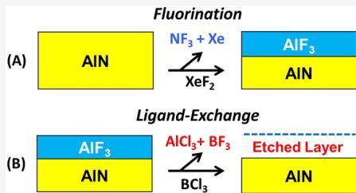
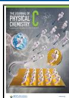
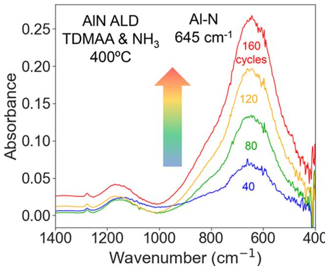
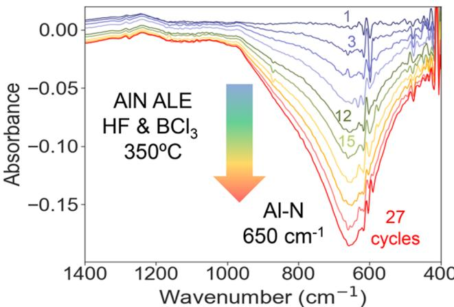
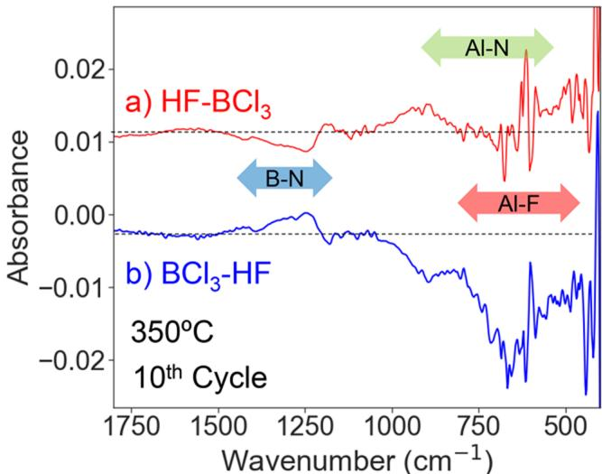
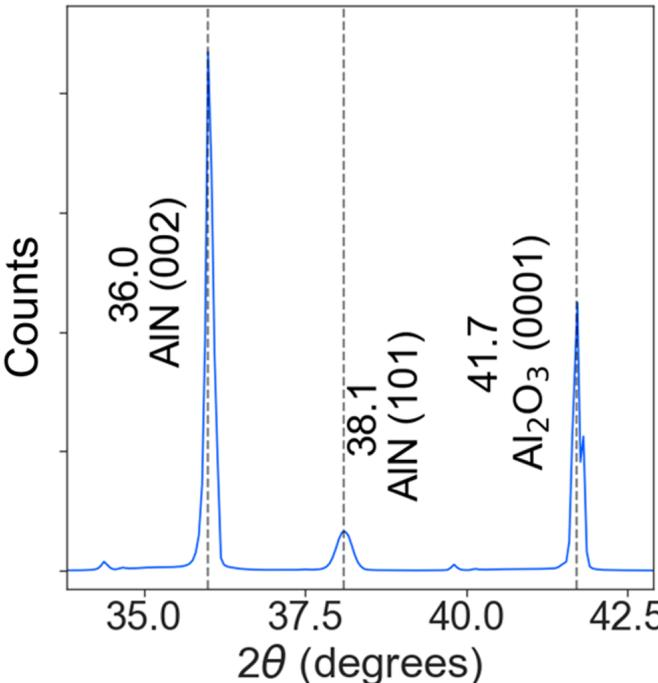
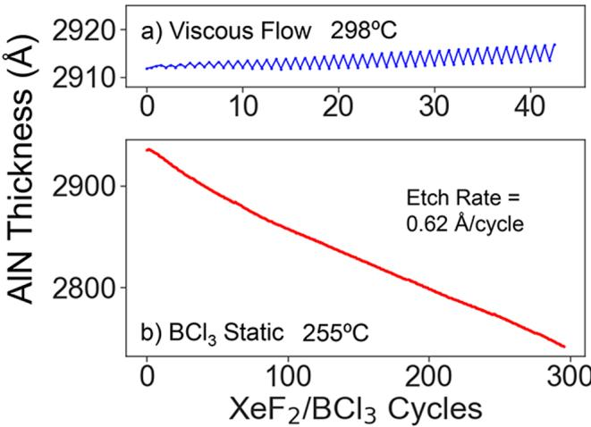
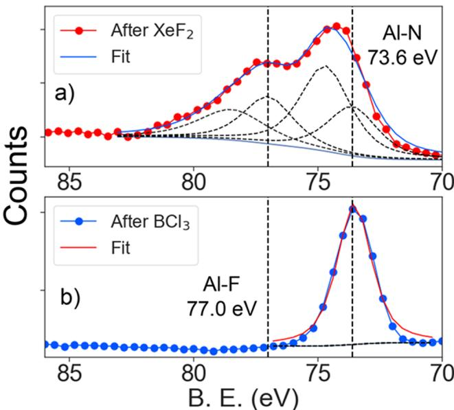
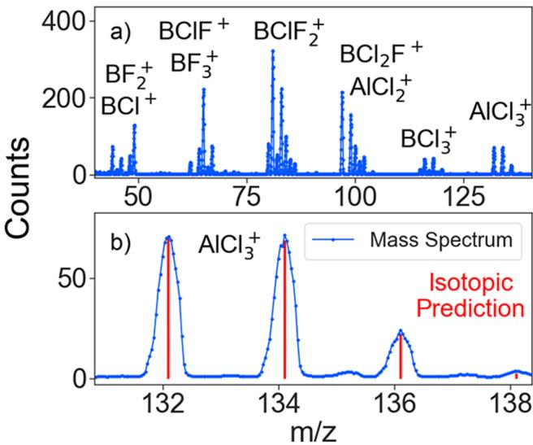
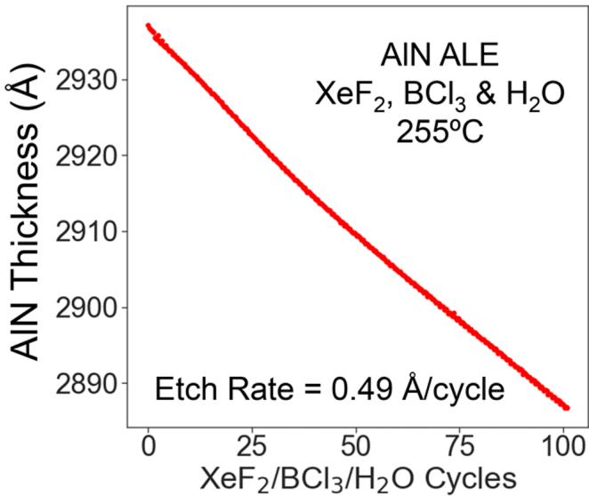

# Thermal Atomic Layer Etching of Aluminum Nitride Using HF or  $\mathbf{XeF}_2$  for Fluorination and  $\mathbf{BCl}_3$  for Ligand Exchange

Published as part of The Journal of Physical Chemistry virtual special issue "Honoring Michael R. Berman".

Austin M. Cano, Ann Lii- Rosales, and Steven M. George*

Cite This: J. Phys. Chem. C 2022, 126, 6990- 6999

# Read Online

# ACCESS

# Metrics & More

# Article Recommendations

ABSTRACT: Thermal atomic layer etching (ALE) of amorphous and crystalline aluminum nitride was performed using sequential exposures of hydrogen fluoride (HF) or xenon difluoride  $\mathrm{(XeF_2)}$  as the fluorination reactant and boron trichloride  $\mathrm{(BCl_3)}$  as the ligand- exchange reactant. The expected fluorination reactions are  $\mathrm{AlN} + 3\mathrm{HF}(\mathrm{g})\rightarrow$ $\mathrm{AlF}_3 + \mathrm{NH}_3(\mathrm{g})$  and  $\mathrm{AlN} + 1.5\mathrm{XeF}_2\rightarrow \mathrm{AlF}_3 + \mathrm{NF}_3(\mathrm{g}) + 1.5\mathrm{Xe}(\mathrm{g})$  . The expected complete ligand- exchange reaction is  $\mathrm{AlF}_3 + \mathrm{BCl}_3(\mathrm{g})\rightarrow \mathrm{BF}_3(\mathrm{g}) + \mathrm{AlCl}_3(\mathrm{g})$  . The HF fluorination reactant together with  $\mathrm{BCl}_3$  could etch amorphous AlN films deposited using AlN atomic layer deposition (ALD). The  $\mathrm{XeF}_2$  fluorination reactant together with  $\mathrm{BCl}_3$  was required to etch crystalline AlN. Fourier transform infrared (FTIR) spectroscopy was utilized to study the growth of AlN ALD using tris(dimethylamido)aluminum and ammonia as the reactants. Thermal AlN ALE of the AlN ALD films with HF and  $\mathrm{BCl}_3$  as the reactants was then monitored using FTIR spectroscopy. The etching of the AlN ALD films occurred at temperatures greater than  $200^{\circ}\mathrm{C}$  The change of the spectral features versus HF and  $\mathrm{BCl}_3$  exposures was consistent with a ligand- exchange etching mechanism for AlN thermal ALE. In situ spectroscopic ellipsometry (SE) was used to measure the thermal ALE of crystalline AlN using  $\mathrm{XeF}_2$  and static exposures of  $\mathrm{BCl}_3$  . The crystalline AlN displayed etch rates that varied with temperature from  $0.19\mathrm{\AA}$  cycle at  $212^{\circ}C$  to  $0.93\mathrm{\AA}$  cycle at  $298^{\circ}C$  The etch rates were dependent on both the static  $\mathrm{BCl}_3$  exposure and the  $\mathrm{XeF}_2$  exposure. Consistent etch rates could be obtained by controlling the time or number of reactant exposures. X- ray photoelectron spectroscopy (XPS) studies were consistent with aluminum fluoride  $\mathrm{(AlF_3)}$  being formed during the  $\mathrm{XeF}_2$  exposure and subsequently removed after the  $\mathrm{BCl}_3$  exposure. Quadrupole mass spectrometry (QMS) was also used to identify the volatile etch products during the reaction of  $\mathrm{BCl}_3$  with  $\mathrm{AlF}_3$  . These QMS investigations observed  $\mathrm{AlCl}_3$  as the etch product and  $\mathrm{BCl}_x\mathrm{F}_y$  ligand- exchange products. The temperature dependence of the  $\mathrm{AlCl}_3$  etch products and  $\mathrm{BCl}_x\mathrm{F}_y$  ligand- exchange products revealed that the ligand- exchange products appeared at temperatures below the onset of the  $\mathrm{AlCl}_3$  etch products at  $200^{\circ}\mathrm{C}$ $\mathrm{H}_2\mathrm{O}$  was also utilized together with  $\mathrm{XeF}_2$  and  $\mathrm{BCl}_3$  to attempt to remove Cl and F from the AlN surface either during or after AlN ALE. XPS studies revealed that a final large  $\mathrm{H}_2\mathrm{O}$  exposure after AlN ALE was most effective at Cl and F removal.

# I. INTRODUCTION

Atomic layer etching (ALE) is a technique used to remove material with atomic layer control.1,2 ALE is performed using sequential, self- limiting reactions that involve initial surface modification and then volatile release of the modified surface layer. During plasma ALE, energetic ions or neutral atoms release the modified surface layer by a sputtering process. During thermal ALE, chemical reactions between an incoming precursor and the modified surface layer lead to the volatilization of the surface layer. Plasma and thermal ALE are both needed for the fabrication of three- dimensional nanostructures. The directional properties of energetic ions or neutrals in plasma ALE can obtain anisotropic etching. The ability of molecules to go anywhere enables thermal ALE to obtain isotropic etching needed for lateral and recess etching.

Many materials have been etched using thermal ALE over the past several years. Using the fluorination and ligand exchange mechanism, a variety of metal oxides and nitrides have been etched including  $\mathrm{Al}_2\mathrm{O}_{3^{5,7,9}}\mathrm{HfO}_2^{9,10}\mathrm{AlN},^{11}$  and GaN. Using an initial conversion reaction, additional materials have been etched such as  $\mathrm{ZnO},^{14}\mathrm{WO}_3,^{15}$  and  $\mathrm{SiO}_2$  Oxidation has also been used to obtain the correct oxidation state that will produce volatile etch products for etching other materials including TiN, Si, and SiGe. These previous studies have developed a family of reactants for surface modification and volatile release. However, additional

reactants are still needed to develop ALE processes for many other materials.

reactants are still needed to develop ALE processes for many other materials.New reactants are also required to obtain selective ALE between various materials. Selective etching aims to remove one material in the presence of other materials. There are examples of selective etching for the thermal ALE for some materials such as  $\mathrm{Al}_2\mathrm{O}_2$ ,  $\mathrm{ZrO}_2$ , and TiN. For full flexibility in fabrication, the goal is to have one set of reactants to etch material A, but not material B. In addition, another set of reactants is required to etch material B, but not material A. This objective is sometimes termed the "multiple color challenge". The goals of area selective etching (ASE) are similar to the objectives of area selective deposition (ASD). Both ASE and ASD would like to achieve either etching or deposition based on the initial material.

Aluminum nitride (AlN) is a III- V wide bandgap semiconductor material with high thermal conductivity. AlN is an important platform for high power transistors and high electron mobility transistors (HEMTs). AlN is also piezoelectric and has key uses for microelectromechanical system (MEMS) sensors. Ultraviolet light- emitting diodes can be fabricated using AlN nanowires. Other application areas for AlN include integrated photonics and spintronics. The processing needed to fabricate AlN devices requires AlN etching. Etching of AlN has been accomplished with both wet and dry plasma- based techniques. These etching processes result in continuous AlN etching that is not controlled at the atomic level.

AlN thermal ALE will be needed for atomic layer control of AlN etching. In addition, selective thermal ALE is required for etching of AlN in the presence of other materials. An earlier study reported AlN thermal ALE using fluorination and ligand exchange where HF was used for fluorination and  $\mathrm{Sn(acac)}_2$  was employed for ligand exchange. In contrast, this work focused on AlN thermal ALE using either HF or  $\mathrm{XeF}_2$  for fluorination and  $\mathrm{BCl}_3$  for ligand exchange. Using different ligand- exchange precursors, such as  $\mathrm{Sn(acac)}_2$  or  $\mathrm{BCl}_3$ , may enable pathways for selective AlN thermal ALE. This study examined the etch rates, etch mechanism, and volatile etch products for AlN thermal ALE using HF or  $\mathrm{XeF}_2$  for fluorination and  $\mathrm{BCl}_3$  for ligand exchange. A variety of different techniques were employed including spectroscopic ellipsometry (SE), Fourier transform infrared (FTIR) spectroscopy, X- ray photoelectron spectroscopy (XPS), and quadrupole mass spectrometry (QMS).

# II. EXPERIMENTAL SECTION

FTIR Spectroscopy. FTIR experiments were performed in a hot- walled, viscous flow reactor. A full description of this reactor has been presented previously. The reactor tube is heated by a ceramic heater (Watlow). The heater was controlled by a PID controller. To obtain a high surface area sample for transmission FTIR experiments, Si nanoparticles (US- Nano Research Materials) were pressed into a  $3\mathrm{cm}$  by  $1.5\mathrm{cm}$  tungsten grid with a thickness of  $50\mu \mathrm{m}$  and 100 gridlines/ in. The silicon particles had an average diameter of 30- 50 nm. The grid was resistively heated by a Hewlett- Packard 6268B power supply. A current of  $\sim 20$  A was required to obtain a substrate temperature of  $400^{\circ}\mathrm{C}$ . The substrate temperature was monitored by a Type K thermocouple that was adhered to the grid with a nonconductive epoxy (Ceramabond, Aremco 571).

AlN ALD was accomplished in the FTIR reactor using tris(dimethylamido)aluminum (TDMAA, Strem Chemicals) and ammonia  $(99.9\%)$  Airgas).TDMAA was heated to 85- 100  $^\circ \mathrm{C}$  for sufficient vapor pressure. The TDMAA was delivered by flowing  $\mathbf{N}_2$  gas at  $\sim 20 - 50$  sccm over the headspace of the TDMAA and then into the FTIR reactor. To obtain the highest ammonia purity, a purifying unit (Matheson) was used to remove water from the ammonia prior to introduction to the FTIR reactor.  $\mathrm{BCl}_3$ $(99\%)$  Syncope Chemicals) and HFpyridine  $70\%$  HF,  $30\%$  pyridine, Millipore- Sigma) were used for AlN etching in the FTIR reactor. The HF- pyridine was loaded into a gold- plated stainless steel bubbler to minimize corrosion. During the HF and BCl exposures,  $\mathbf{N}_2$  gas at a flow rate of 100 sccm was passed through the FTIR reactor. This  $\mathbf{N}_2$  flow established a background pressure of 1.0 Torr in the reactor.

FTIR spectra were obtained with a Nicolet 6700 or an iS50R ThermoFisher FTIR spectrometer. The light was generated and split by a KBr beam splitter. The light was directed into the reactor, transmitted through the tungsten grid, and then traveled back out of the reactor to an MCT- B detector. The infrared light passed through two KBr windows that were separated from the reactor by gate valves. The gate valves were closed during the reactant exposures and opened while obtaining the FTIR spectra. Spectra were averaged for 100 scans with a resolution of  $4\mathrm{cm}^{- 1}$ . Background spectra were collected prior to conducting each experiment.

Spectroscopic Ellipsometry and Atomic Force Microscopy. In situ spectroscopic ellipsometry (SE) experiments were performed in a home- built warm- walled reactor that has been described previously. A resistive heater elevated the sample temperature up to a temperature limit of  $\sim 370^{\circ}\mathrm{C}$ . A spectroscopic ellipsometer (M- 2000, J. A. Woollam) was used for all ellipsometry experiments. Wavelengths from 240 to  $1700\mathrm{nm}$  were used in the fitting of the film optical properties. The polarized light intersected the sample surface at a  $70^{\circ}$  angle from normal and was fixed at this angle. The  $\Psi$  and  $\Delta$  parameters were analyzed with the CompleteEASE software package (J. A. Woollam).

Single- crystal aluminum nitride wafers were obtained from Kyma Technologies. The thickness of the AlN film on sapphire ranged from 300 to  $400\mathrm{nm}$ . An ordinary sapphire model was used to model the sapphire substrate. The AlN layer was fit using an extended Cauchy model with Urbach coefficients. The model fitting yielded an index of refraction of  $\approx 2.5$ . This index of refraction was higher than previously reported values regardless of chosen model. The ellipsometry model included surface roughness. The surface roughness has some correlation with a possible top layer such as the native oxide on the AlN film. Mean- squared errors (MSE) for the ellipsometry model fits were consistently below 10.

$\mathrm{BCl}_3$ , HF- pyridine, and  $\mathrm{XeF}_2$ $(99.5\%)$  Strem Chemicals) were employed for AlN etching in the reactor equipped for in situ ellipsometry. During the  $\mathrm{BCl}_3$ ,  $\mathrm{HF}$ , and  $\mathrm{XeF}_2$  exposures conducted in viscous flow,  $\mathbf{N}_2$  gas at a flow rate of 200 sccm was passed through the reactor. This  $\mathbf{N}_2$  flow established a background pressure of 2.0 Torr. The  $\mathrm{BCl}_3$ ,  $\mathrm{HF}$ , and  $\mathrm{XeF}_2$  pressures were measured on top of this 2.0 Torr base pressure. In addition, static  $\mathrm{BCl}_3$  exposures were also utilized for AlN etching without the  $\mathbf{N}_2$  background pressure.

Static  $\mathrm{BCl}_3$  exposures in the in situ ellipsometry reactor were performed using the following procedure. First, the valve connecting the  $\mathbf{N}_2$  carrier gas to the reactor body was closed,

and the chamber was pumped out fully. Subsequently, the valve to the vacuum pump was closed, and  $\mathrm{BCl}_3$  was flowed into the reactor. After the pressure set point was reached, the valve to the  $\mathrm{BCl}_3$  precursor was closed, and the  $\mathrm{BCl}_3$  was allowed to react with the substrate for the exposure time. After the exposure time was reached, the valve to the pump was reopened before reopening the valve to the  $\mathbf{N}_2$  carrier gas.

The surface topography was also monitored before and after etching. These atomic force microscopy (AFM) measurements determined if etching leads to surface smoothing or an increase in surface roughness. The AFM analysis was conducted using a Park NX10 AFM instrument in noncontact mode.

Quadrupole Mass Spectrometry Detection of the volatile etch products using quadrupole mass spectrometry (QMS) was performed in a new reactor described previously.36 The volatile etch products were entrained in a molecular beam that was formed by expansion from an aperture, traveled through a differentially pumped region, passed through a skimmer, and then was detected by a quadrupole mass spectrometer (Extrel, MAX- QMS Flanged Mounted System). An electron ionization energy of  $70\mathrm{eV}$  was used for these experiments. To minimize exposures to corrosive gaseous species, the ionizer and analyzer were positioned perpendicular to the incoming molecular beam.  $\mathrm{AlF}_3$  powder was purchased from US- Nano Research Materials  $(99.5\%)$

X- ray Photoelectron Spectroscopy. X- ray photoelectron spectroscopy (XPS) (PHI- 5000, RBD Instruments) measured the composition of the AlN films. A monochromatic Al Kα X- ray source  $(1486.6\mathrm{eV})$  was used to collect survey scans with a pass energy of  $93.9\mathrm{eV}$  and step size of  $0.400\mathrm{eV}$ . Casa XPS software (Casa XPS, Casa Software) determined the surface concentrations using the peak areas for the C 1s, O 1s, Al 2p, N 1s, F 1s, and B 2p XPS signals and the corresponding sensitivity factors. All peaks were calibrated to the C 1s peak for adventitious carbon centered at  $284.8\mathrm{eV}$

# III. RESULTS AND DISCUSSION

FTIR Spectroscopy of AlN ALD and AlN ALE. AlN ALD was monitored using in situ FTIR spectroscopy. Figure 1 shows the FTIR spectra during AlN ALD after every 40 cycles during sequential TDMAA and  $\mathrm{NH}_3$  exposures at  $400^{\circ}\mathrm{C}$ . There is a clear absorbance increase at  $645~\mathrm{cm^{- 1}}$  after 40 cycles of TDMAA and  $\mathrm{NH}_3$ . This absorbance peak is consistent with the  $\mathrm{Al - N}$  stretching vibration.37- 39 There is also an absorbance peak at  $1150~\mathrm{cm^{- 1}}$  in Figure 1 that is assigned to the  $\mathrm{Si - O}$  stretching vibration.40 This absorbance peak appears primarily during the first 40 cycles and results from changes to the  $\mathrm{SiO}_2$  layer on the underlying silicon nanoparticles that are used as a support for the AlN ALD film.

  
Figure 1. FTIR spectra during AlN ALD with TDMAA and  $\mathrm{NH}_3$  as the reactants at  $400^{\circ}\mathrm{C}$  after 40, 80, 120, and 160 ALD cycles.

The width of the absorption peak for the  $\mathrm{Al - N}$  stretching vibration peak was  $315~\mathrm{cm^{- 1}}$ . This broad width could result from an amorphous or polycrystalline AlN film.38 There could also be some broadening resulting from the  $\mathrm{Al - O}$  stretching vibration on the high frequency side of the absorption peak from 600 to  $900~\mathrm{cm^{- 1}}$ .41 This blue- shifted shoulder is more prominent early during the AlN ALD growth. The contribution from  $\mathrm{Al - O}$  stretching vibrations is negligible during the later stages of the AlN ALD growth. The source of the oxygen could be the original  $\mathrm{SiO}_2$  native oxide on the silicon nanoparticles used as a support or a small  $\mathrm{H}_2\mathrm{O}$  impurity in the chamber during the early stages of the AlN ALD growth.

FTIR spectra were recorded after each half- cycle during sequential exposures of HF and  $\mathrm{BCl}_3$  at  $350^{\circ}\mathrm{C}$  to monitor the AlN thermal ALE. The HF pressure was  $100\mathrm{mTorr}$  for an exposure time of  $1\mathrm{s}$ . The  $\mathrm{BCl}_3$  pressure was  $500\mathrm{mTorr}$  for an exposure time of  $1\mathrm{s}$ . Figure 2 displays the difference spectra relative to the initial absorption spectrum for the AlN ALD film. The peak of the absorbance loss is centered at  $650~\mathrm{cm^{- 1}}$ . This peak absorbance loss is very close to the peak of the absorbance gain during AlN ALD observed in Figure 1 at  $645~\mathrm{cm^{- 1}}$ . The slight shift in frequency is attributed to the absorbance from some  $\mathrm{Al - F}$  stretching vibrations on the etched surface. Figure 2 shows that there is a nearly linear decrease in the absorbance as a function of HF and  $\mathrm{BCl}_3$  cycles. There is also a small increase in absorbance around  $1240~\mathrm{cm^{- 1}}$ . This slight increase could be caused by some BN formation as a result of AlN conversion to BN by  $\mathrm{BCl}_3$ .13

  
Figure 2. FTIR spectra during thermal AlN ALE with HF and  $\mathrm{BCl}_3$  as the reactants at  $350^{\circ}\mathrm{C}$  after various numbers of ALE cycles.

FTIR difference spectra are useful to isolate the changes occurring during each reactant exposure. Figure 3 displays the FTIR difference spectra during the 10th cycle of AlN ALE at  $350^{\circ}\mathrm{C}$ . Figure 3a shows the FTIR spectrum after the HF exposure referenced to the FTIR spectrum after the previous  $\mathrm{BCl}_3$  exposure. Figure 3b shows the FTIR spectrum after the

  
Figure 3. FTIR difference spectra after (a) HF exposure and (b)  $\mathrm{BCl}_3$  exposure during the 10th cycle of thermal AlN ALE at  $350^{\circ}\mathrm{C}$ . Each spectrum is referenced to the spectrum after the previous exposure.

next  $\mathrm{BCl}_3$  exposure referenced to the FTIR spectrum after the previous HF exposure.

The FTIR difference spectrum in Figure 3a after the HF exposure is complicated by the overlap of the  $\mathrm{Al - N}$  and  $\mathrm{Al - F}$  vibrational features.37,42,43 The HF exposure converts AlN to  $\mathrm{AlF}_3$  by the reaction  $\mathrm{AlN} + \mathrm{3HF(g)}\rightarrow \mathrm{AlF}_3 + \mathrm{NH}_3(\mathrm{g})$ . The absorbance loss of the  $\mathrm{Al - N}$  stretching vibration and the absorbance gain of the  $\mathrm{Al - F}$  stretching vibration are nearly coincident. There is not an obvious absorbance loss at  $\sim 645$ $\mathrm{cm}^{- 1}$  in Figure 3a resulting from HF fluorination of AlN. In contrast, the absorbance loss from the removal of the  $\mathrm{Al - F}$  stretching vibration is much more obvious in Figure 3b. The  $\mathrm{BCl}_3$  exposure removes  $\mathrm{AlF}_3$  by the ligand- exchange reaction  $\mathrm{AlF}_3 + \mathrm{BCl}_3(\mathrm{g})\rightarrow \mathrm{AlCl}_3(\mathrm{g}) + \mathrm{BF}_3(\mathrm{g})$

The difference spectra in Figure 3 also show evidence for some conversion of AlN to BN resulting from the  $\mathrm{BCl}_3$  exposure by the reaction  $\mathrm{AlN} + \mathrm{BCl}_3(\mathrm{g})\rightarrow \mathrm{BN} + \mathrm{AlCl}_3(\mathrm{g})$ . The absorbance for the  $\mathrm{B - N}$  stretching vibration occurs at  $1200 - 1450\mathrm{cm}^{- 1}$ . The absorbance in this region increases in Figure 3b during the  $\mathrm{BCl}_3$  exposure. The converted BN is then removed during the HF exposure by the reaction  $\mathrm{BN} + \mathrm{HF(g)}\rightarrow \mathrm{BF}_3(\mathrm{g}) + \mathrm{NF}_3(\mathrm{g})$ . The absorbance in the region from 1200 to  $1450\mathrm{cm}^{- 1}$  decreases in Figure 3a during the HF exposure.

The temperature dependence of AlN ALE was also investigated by measuring the change of absorbance of the  $\mathrm{Al - N}$  stretching vibration per AlN ALE cycle. Figure 4 shows the change in the integrated absorbance for the  $\mathrm{Al - N}$  stretching vibration per cycle from 400 to  $1000\mathrm{cm}^{- 1}$  at different temperatures from 200 to  $350^{\circ}\mathrm{C}$ . There was negligible AlN etching observed at  $200^{\circ}\mathrm{C}$ . Larger absorbance changes and higher etching rates were observed at higher temperatures.

Spectroscopic Ellipsometry and X- ray Photoelectron Spectroscopy of AlN ALE. AlN ALD yields amorphous or polycrystalline AlN films. The thermal ALE of these AlN ALD films could be different than the thermal ALE of single- crystal AlN films. Single- crystalline materials may be harder to fluorinate than their amorphous or polycrystalline counterparts. Figure 5 shows the XRD pattern for the single- crystal AlN sample on an underlying crystalline sapphire  $\mathrm{Al}_2\mathrm{O}_3$  substrate that was used in these experiments. The thickness of the single- crystal AlN film was  $300\mathrm{nm}$ . A prominent peak is observed for  $\mathrm{AlN}(002)$  at  $2\Theta = 360^{\circ}$ . A smaller peak is also detected for  $\mathrm{AlN}(101)$  at  $2\Theta = 381^{\circ}$ . In addition, the XRD pattern detects a peak for  $\mathrm{Al}_2\mathrm{O}_3(0001)$  at  $2\Theta = 41.7^{\circ}$

  
Figure 4. Temperature dependence of AlN ALE with HF and  $\mathrm{BCl}_3$  as the reactants as measured by the change in integrated absorbance per cycle at 200, 250, 300, and  $350^{\circ}\mathrm{C}$ . The integrated absorbance was measured from 400 to  $1000\mathrm{cm}^{-1}$

  
Figure 5. XRD pattern of single-crystal AlN film with a thickness of  $\sim 300\mathrm{nm}$  on the crystalline  $\mathrm{Al}_2\mathrm{O}_3$  (sapphire) substrate.

The etching of the single- crystal AlN film was first attempted using alternating exposures of HF and  $\mathrm{BCl}_3$  at  $298^{\circ}\mathrm{C}$ . Figure 6 shows the AlN thickness after each half- cycle during 30 cycles of HF and  $\mathrm{BCl}_3$  reactant exposures measured using in situ SE analysis. The  $\mathrm{BCl}_3$  exposure was in viscous flow in Figure 6a and in static exposure in Figure 6b. During the viscous flow  $\mathrm{BCl}_3$  exposures, the  $\mathrm{BCl}_3$  pressure was 500 mTorr for an exposure time of  $1\mathrm{s}$ . During the static  $\mathrm{BCl}_3$  exposures, the

  
Figure 6. AlN film thickness vs number of  $\mathrm{HF / BCl}_3$  cycles on single-crystal AlN film at  $298^{\circ}C$  using (a) viscous flow of  $\mathrm{BCl}_3$  precursor at  $500~\mathrm{mTorr}$  for  $1\mathrm{s}$  and (b) static exposure of  $\mathrm{BCl}_3$  precursor at  $2.5$  Torr for  $20~\mathrm{s}$ . The HF exposure was at  $100~\mathrm{mTorr}$  for  $1\mathrm{s}$ .

$\mathrm{BCl}_3$  pressure was  $2.5\mathrm{Torr}$  for an exposure time of  $20~\mathrm{s}$ . The HF pressure was  $100~\mathrm{mTorr}$  for an exposure time of  $1\mathrm{s}$ .

There is no evidence of any single- crystal AlN etching using HF together with  $\mathrm{BCl}_3$  exposures in viscous flow in Figure 6a. There is also no evidence of single- crystal AlN etching using HF together with the static  $\mathrm{BCl}_3$  exposures in Figure 6b. The single- crystal AlN film clearly does not etch as readily as the AlN ALD film. The etching of single- crystal AlN may require a stronger fluorination reactant. A similar situation was encountered during thermal ALE of single- crystal GaN films. HF and  $\mathrm{BCl}_3$  as the reactants were not sufficient to etch single- crystal GaN. In contrast, the stronger fluorination reactant, xenon difluoride  $(\mathrm{XeF}_2)$ , led to thermal GaN ALE together with  $\mathrm{BCl}_3$  as the reactants.

The thermochemistry of fluorination is much more favorable with  $\mathrm{XeF}_2$  compared with HF. The standard free energy changes for the fluorination of AlN with HF and  $\mathrm{XeF}_2$  are

$$
\mathrm{AlN} + 3\mathrm{HF}(\mathrm{g})\rightarrow \mathrm{AlF}_3 + \mathrm{NH}_3(\mathrm{g})
$$

$$
\Delta G^{\circ}(298^{\circ}\mathrm{C}) = -61.5\mathrm{kcal}
$$

$$
\mathrm{AlN} + 3\mathrm{XeF}_2(\mathrm{g})\rightarrow \mathrm{AlF}_3 + \mathrm{NF}_3(\mathrm{g}) + 3\mathrm{Xe}(\mathrm{g})
$$

$$
\Delta G^{\circ}(298^{\circ}\mathrm{C}) = -244.9\mathrm{kcal}
$$

Given the lack of single- crystal AlN etching using HF,  $\mathrm{XeF}_2$  was explored as a stronger fluorination reactant together with  $\mathrm{BCl}_3$  for ligand exchange.

The etching of the single- crystal AlN film was initially performed with  $\mathrm{XeF}_2$  and  $\mathrm{BCl}_3$  in viscous flow at  $298^{\circ}C$ . The  $\mathrm{XeF}_2$  pressure was  $50~\mathrm{mTorr}$  for an exposure time of  $1\mathrm{s}$ . The  $\mathrm{BCl}_3$  pressure was  $500~\mathrm{mTorr}$  for an exposure time of  $1\mathrm{s}$ . Figure 7a shows that the AlN thickness is not reduced under these reaction conditions. The  $\mathrm{BCl}_3$  reactant exposure was then performed using static exposures. For these AlN etching experiments with static  $\mathrm{BCl}_3$  exposures, the  $\mathrm{XeF}_2$  was pulsed into the reactor at a pressure of  $50~\mathrm{mTorr}$  for  $1\mathrm{s}$ . The reactor was then purged for  $40~\mathrm{s}$  before recording an SE measurement. For the  $\mathrm{BCl}_3$  exposure,  $\mathrm{BCl}_3$  was introduced into the reactor until the  $\mathrm{BCl}_3$  pressure reached  $\sim 2$  Torr. Then the  $\mathrm{BCl}_3$  pressure was held statically for  $\sim 20\mathrm{s}$ . Subsequently, the  $\mathrm{BCl}_3$  was pumped out and the reactor was purged with  $\mathrm{N}_2$  for  $60~\mathrm{s}$  before recording an SE measurement.

  
Figure 7. AlN film thickness vs number of  $\mathrm{XeF}_2 / \mathrm{BCl}_3$  cycles on single-crystal AlN film. (a) Viscous flow at  $298^{\circ}C$  for  $\mathrm{BCl}_3$  at  $500~\mathrm{mTorr}$  for  $1\mathrm{s}$  and  $\mathrm{XeF}_2$  at  $50~\mathrm{mTorr}$  for  $1\mathrm{s}$ . (b) At  $255^{\circ}C$ , static exposure of  $\mathrm{BCl}_3$  at  $2.5$  Torr for  $20~\mathrm{s}$  and viscous flow of  $\mathrm{XeF}_2$  at  $50~\mathrm{mTorr}$  for  $1\mathrm{s}$ .

The single- crystal AlN film could be etched under these static exposure conditions for  $\mathrm{BCl}_3$ . Figure 7b displays the AlN thickness versus number of  $\mathrm{XeF}_2 / \mathrm{BCl}_3$  cycles at  $255^{\circ}C$  using the static  $\mathrm{BCl}_3$  exposures. The AlN thickness decreases linearly as a function of  $\mathrm{XeF}_2 / \mathrm{BCl}_3$  cycles for over 300 cycles. The AlN etch rate was  $0.62\mathrm{\AA / cycle}$ . The optical thickness for the AlN film decreased  $0.32\mathrm{\AA / cycle}$  during the  $\mathrm{XeF}_2$  exposure. The optical thickness for the AlN film also decreased  $0.30\mathrm{\AA / cycle}$  during the  $\mathrm{BCl}_3$  exposure. These decreases in the optical thickness are dependent on the surface species on the AlN surface in addition to the actual change in the AlN film thickness.

Static  $\mathrm{BCl}_3$  exposures were required for AlN ALE. These static  $\mathrm{BCl}_3$  exposures deliver high  $\mathrm{BCl}_3$  exposures of  $40~\mathrm{Torr~s}$ . In comparison, the viscous flow  $\mathrm{BCl}_3$  exposures provide much smaller  $\mathrm{BCl}_3$  exposures of  $0.5$  Torr s. The higher static  $\mathrm{BCl}_3$  exposures may be required for the ligand- exchange reaction to remove the fluorinated  $\mathrm{AlF}_3$  surface layer. In addition, these higher static  $\mathrm{BCl}_3$  exposures could be needed to convert the AlN surface to BN prior to the spontaneous etching of the BN surface layer by HF.

AFM measurements were also recorded before and after etching using  $\mathrm{XeF}_2 / \mathrm{BCl}_3$  cycles at  $255^{\circ}C$ . These AFM measurements revealed that AlN ALE did not change the surface roughness or slightly reduced the surface roughness. For each AFM measurement, the roughness was an average of five separate AFM scans in three different locations across the coupon. Because the initial RMS surface roughness varied between  $0.7$  and  $2.9~\mathrm{nm}$  for the different initial samples, the change in the RMS surface roughness was measured versus number of AlN ALE cycles. The change in the RMS surface roughness was  $- 0.1$ ,  $- 0.16$ ,  $0.9$ , and  $- 0.9~\mathrm{nm}$  after  $10$ ,  $20$ ,  $50$ , and  $100$  AlN ALE cycles, respectively.

The temperature- dependent etching of the single- crystal AlN film using  $\mathrm{XeF}_2$  and  $\mathrm{BCl}_3$  is shown in Figure 8. These experiments utilized the same static  $\mathrm{BCl}_3$  reaction conditions as described above for the AlN etching in Figure 7b. The  $\mathrm{XeF}_2$  exposure was at a pressure of  $50~\mathrm{mTorr}$  for  $1\mathrm{s}$ , and the static  $\mathrm{BCl}_3$  exposure was at a pressure of  $2$  Torr for  $20~\mathrm{s}$ . A

  
Figure 8. AlN film thickness vs number of  $\mathrm{XeF}_2 / \mathrm{BCl}_3$  cycles on single-crystal AlN film for various temperatures. Temperature-dependent etch rates vary from  $0.19\mathrm{\AA}$  cycle at  $212^{\circ}C$  to  $0.93\mathrm{\AA}/$  cycle at  $298^{\circ}C$

measurable AlN etch rate of  $0.19\mathrm{\AA}$  cycle was observed at 212  $^\circ \mathrm{C}$ . The AlN etch rate then increased at higher temperatures. The AlN etch rates were 0.56, 0.58, 0.68, 0.73, and  $0.93\mathrm{\AA}/$  cycle at 230, 255, 263, 280, and  $298^{\circ}C$ , respectively. The temperature dependence of the AlN etch rates is attributed to the temperature dependence of the fluorination and ligand exchange reactions. The etch rates at  $255^{\circ}C$  in Figures 7b and 8 are slightly different because they were measured at different times.

The AlN etch rates from the various temperatures in Figure 8 are less than  $1\mathrm{\AA}$  cycle and all significantly less than the unit cell lengths of crystalline AlN. The structure of crystalline AlN is wurtzite. The lattice constants of crystalline AlN are  $a = 3.11$  Å and  $c = 4.98\mathrm{\AA}$ . The AlN etch rate of  $0.73\mathrm{\AA}$  cycle at  $280^{\circ}C$  using  $\mathrm{XeF}_2$  and  $\mathrm{BCl}_3$  exposures in Figure 8 is slightly higher than the AlN etch rate of  $0.36\mathrm{\AA}$  cycle from previous measurements at  $275^{\circ}C$  using HF and  $\mathrm{Sn(acac)}_2$  exposures. These earlier measurements employed static exposures of 1270 mTorr s for HF and  $900\mathrm{mTorr}$  s for  $\mathrm{Sn(acac)}_2$ . In addition, the single-crystal AlN samples used in the previous measurements were AlN films epitaxially grown on Si(111) wafers by Kyma Technologies. There may have been differences in the quality of crystalline AlN films grown on Si(111) wafers in the previous investigation and sapphire substrates in this study.

The AlN thickness reduction in Figure 8 is linear at each temperature under the given reaction conditions. However, the individual  $\mathrm{XeF}_2$  and  $\mathrm{BCl}_3$  reactions were not self- limiting. Etch rates were measured for larger  $\mathrm{XeF}_2$  and  $\mathrm{BCl}_3$  exposures at  $298^{\circ}C$ . For an AlN ALE cycle composed of 6 consecutive  $\mathrm{XeF}_2$  exposures at  $50\mathrm{mTorr}$  for  $1\mathrm{s}$  followed by 23 consecutive  $\mathrm{BCl}_3$  static exposures at 2 Torr for  $20\mathrm{s}$ , the AlN etch rate was  $1.3\mathrm{\AA}/$  cycle. This etch rate is larger than the etch rate of  $0.93\mathrm{\AA}$  cycle at  $298^{\circ}C$  measured in Figure 8. These results indicate that the AlN etch rate can be controlled by the  $\mathrm{XeF}_2$  and  $\mathrm{BCl}_3$  exposures. Etch rates higher than  $0.93\mathrm{\AA}$  cycle are possible at  $298^{\circ}C$  with higher  $\mathrm{XeF}_2$  and  $\mathrm{BCl}_3$  exposures.

Figure 9 shows the dependence of the AlN etch rate on the  $\mathrm{BCl}_3$  exposure at  $255^{\circ}C$ . The  $\mathrm{BCl}_3$  exposure was varied from 0 to 130 Torr s. The  $\mathrm{XeF}_2$  exposure was  $1\mathrm{s}$  at  $50\mathrm{mTorr}$ . The AlN etch rate was  $0.41\mathrm{\AA}$  per  $\mathrm{XeF}_2 / \mathrm{BCl}_3$  cycle at a  $\mathrm{BCl}_3$  exposure of 4 Torr s. The AlN etch rate nearly doubled to 0.81 Å per  $\mathrm{XeF}_2 / \mathrm{BCl}_3$  cycle at a  $\mathrm{BCl}_3$  exposure of 125 Torr s. The dependence of the AlN etch rate on the  $\mathrm{BCl}_3$  exposure was not self- limiting. This dependence on the  $\mathrm{BCl}_3$  exposure is attributed to difficulty removing the fluorinated AlN surface layer and some additional conversion of AlN to BN at larger  $\mathrm{BCl}_3$  exposures that increases the AlN etch rate. However, very constant etch rates were obtained under constant reaction conditions.

  
Figure 9. Etch rate changes during AlN ALE vs  $\mathrm{BCl}_3$  exposure at 255  $^\circ \mathrm{C}$  using an  $\mathrm{XeF}_2$  exposure of 0.060 Torr s.

The chemical state of Al on the AlN surface during AlN ALE with  $\mathrm{XeF}_2$  and  $\mathrm{BCl}_3$  was examined using ex situ X- ray photoelectron spectroscopy (XPS). For these experiments, the AlN film was etched using  $50\mathrm{XeF}_2 / \mathrm{BCl}_3$  cycles. The  $\mathrm{XeF}_2$  pressure was  $50\mathrm{mTorr}$  for an exposure time of  $1\mathrm{s}$ . The  $\mathrm{BCl}_3$  pressure was  $500\mathrm{mTorr}$  for an exposure time of  $1\mathrm{s}$ . Figure 10 then shows the XPS Al 2p peak after the etching was

  
Figure 10. XPS spectra in the Al 2p region after (a)  $\mathrm{XeF}_2$  exposure and (b)  $\mathrm{BCl}_3$  exposure during thermal AlN ALE.

concluded with either the  $\mathrm{XeF}_2$  or  $\mathrm{BCl}_3$  exposure. Figure 10a displays the results after the  $\mathrm{XeF}_2$  exposure. Figure 10b displays the results after the  $\mathrm{BCl}_3$  exposure.

Figure 10a shows multiple peaks in the Al  $2\mathrm{p}$  region after the  $\mathrm{XeF}_2$  exposure. The Al  $2\mathrm{p}$  XPS peak in AlN is centered at 73.6 eV, and the Al  $2\mathrm{p}$  XPS peak in  $\mathrm{Al}_2\mathrm{O}_3$  is centered at 74.7 eV.48- 50 In comparison, the Al  $2\mathrm{p}$  XPS peak in aluminum fluoride is centered somewhere from 76 to  $77.5\mathrm{eV}$ .42,48,49 The experimentally observed XPS spectrum was fit assuming binding energies and line widths defined by the AlN,  $\mathrm{Al}_2\mathrm{O}_3$  and  $\mathrm{AlF}_3$  Al  $2\mathrm{p}$  XPS peaks. The fit was consistent with the individual peaks shown in Figure 10a containing all three components. The Al  $2\mathrm{p}$  XPS peak consistent with  $\mathrm{Al}_2\mathrm{O}_3$  is attributed to air exposure of the sample during transfer from the etching chamber to the XPS analysis tool. Another small peak located at  $78.2\mathrm{eV}$  most likely results from copper contamination that yields a Cu  $3\mathrm{p}$  XPS peak.51

Figure 10b shows the XPS spectrum in the Al  $2\mathrm{p}$  region for the AlN sample after the  $\mathrm{BCl}_3$  exposure. In contrast to Figure 10a, there is only a single peak that is consistent with AlN. This XPS spectrum argues that only AlN remains after the  $\mathrm{BCl}_3$  exposures. The  $\mathrm{AlF}_3$  component of the surface layer in Figure 10a is not observed after the  $\mathrm{BCl}_3$  exposure. This removal of  $\mathrm{AlF}_3$  is attributed to ligand- exchange reactions between  $\mathrm{BCl}_3$  and  $\mathrm{AlF}_3$ .

Quadrupole Mass Spectrometry of  $\mathrm{BCl}_3$  Exposures on  $\mathrm{AlF}_3$ . The volatile products from the exposure of  $\mathrm{BCl}_3$  to  $\mathrm{AlF}_3$  were studied by quadrupole mass spectrometry (QMS) to understand the ligand- exchange reaction during thermal AlN ALE. Figure 11a displays the mass spectrum recorded when $\mathrm{BCl}_3$  is exposed to  $\mathrm{AlF}_3$  powder at  $295^{\circ}\mathrm{C}$ . The volatile products are the result of the ligand- exchange reactions and the etching of  $\mathrm{AlF}_3$ . Single ligand exchange where  $\mathrm{BCl}_3$  exchanges a single Cl with a single F from the  $\mathrm{AlF}_3$  surface results in  $\mathrm{BCl}_2\mathrm{F}$  with a cluster of ion signals at  $m / z = 97 - 102$ . The cluster of ion intensities results from the two main isotopes of boron  $(20\% ^{10}\mathrm{B}, 80\% ^{11}\mathrm{B})$  and the two main isotopes of chlorine  $(76\% ^{35}\mathrm{Cl}, 24\% ^{37}\mathrm{Cl})$ . Double and complete ligand exchange are also observed by the products  $\mathrm{BClF}_2$  and  $\mathrm{BF}_3$ , respectively, which are observed with a cluster of ion signals around  $m / z = 83$  and  $m / z = 65$ . The cluster around  $m / z = 65$  includes the  $\mathrm{BF}_3^+$  and  $\mathrm{BClF}^+$  peaks.

  
Figure 11. Mass spectrum of volatile species during  $\mathrm{BCl}_3$  exposure on  $\mathrm{AlF}_3$  powder at  $295^{\circ}\mathrm{C}$ . (a)  $\mathrm{BCl}_x\mathrm{F}_y^+$  ligand-exchange products and  $\mathrm{AlCl}_x^+$  etch products observed at  $m / z = 40 - 140$ . (b) Expansion of region at  $m / z = 131 - 139$  showing  $\mathrm{AlCl}_3^+$  etch product.

In addition to the  $\mathrm{BCl}_x\mathrm{F}_y$  ligand- exchange products, the  $\mathrm{AlCl}_3$  etch product from the  $\mathrm{AlF}_3$  surface is also observed in Figure 11a between  $m / z = 132$  and 138. Observing  $\mathrm{AlCl}_3$  at  $295^{\circ}\mathrm{C}$  is expected because  $\mathrm{AlCl}_3$  has a vapor pressure of  $\approx 1$  Torr at  $100^{\circ}\mathrm{C}$  and exceeds  $\approx 760$  Torr at  $>180^{\circ}\mathrm{C}$ . Figure 11b shows an expansion of the  $m / z$  range from  $m / z = 130$  to 139. The red bars indicate the expected ion signals resulting from the isotopic abundance of Cl and Al. The peak at  $m / z = 132$  is the peak with  $100\%$  relative abundance. The intensities for the other ion signals are  $97.2\%$ ,  $31.5\%$ , and  $3.4\%$  for  $m / z = 134$ , 136, and 138, respectively. There is excellent agreement between the ion intensities and the expectations from the natural isotopic abundances. This agreement confirms the assignment of this ion cluster to  $\mathrm{AlCl}_3$ .

The temperature dependence of the reaction of  $\mathrm{BCl}_3$  with  $\mathrm{AlF}_3$  was also explored using a heating rate of  $3^{\circ}\mathrm{C / min}$ . Figure 12a displays the  $\mathrm{BF}_x\mathrm{Cl}_y$  ligand- exchange products. Figure 12b

  
Figure 12. Ion signal intensities versus temperature during  $\mathrm{BCl}_3$  exposure on  $\mathrm{AlF}_3$  powder with a heating rate of  $3^{\circ}\mathrm{C / min}$ . (a) Boron ligand-exchange species  $(\mathrm{BCl}_2\mathrm{F}^+$ ,  $\mathrm{BClF}_2^+$  and  $\mathrm{BF}_3^+$ ) and  $\mathrm{BCl}_3^+$  reactant. (b)  $\mathrm{AlCl}_3^+$  and  $\mathrm{AlCl}_2^+$  etch products.

shows the  $\mathrm{AlCl}_x$  etch products. There is some ligand exchange at temperatures less than the onset temperature of  $200^{\circ}\mathrm{C}$  for the  $\mathrm{AlCl}_3$  etch product. This ligand exchange leads to  $\mathrm{F / Cl}$  transfer and the buildup of Cl in the  $\mathrm{AlF}_3$  powder. At temperatures  $>200^{\circ}\mathrm{C}$ , Figure 12a reveals that the  $\mathrm{BCl}_3^+$  reactant intensity progressively drops and the  $\mathrm{BCl}_2\mathrm{F}^+$  and  $\mathrm{BClF}_2^+$  and  $\mathrm{BF}_3^+$  ion intensities increase. Figure 12b shows that the ion intensities for  $\mathrm{AlCl}_3^+$  and  $\mathrm{AlCl}_2^+$  also display a concurrent increase at temperatures  $>200^{\circ}\mathrm{C}$ . The ligand- exchange reactions are producing ligand- exchange products, and the  $\mathrm{F / Cl}$  transfer is converting  $\mathrm{AlF}_3$  to volatile  $\mathrm{AlCl}_3$ .

The temperature threshold of  $200^{\circ}\mathrm{C}$  for the onset of  $\mathrm{AlCl}_3$  etch products from ligand exchange of  $\mathrm{BCl}_3$  with  $\mathrm{AlF}_3$  is also in good agreement with the temperature threshold for AlN ALE. Figure 4 reveals that the FTIR studies on AlN ALD films observed a threshold for AlN ALE at  $\sim 200^{\circ}\mathrm{C}$ . Figure 8 demonstrates that measurable AlN ALE etch rates for the

single- crystal AlN films were obtained by the ellipsometry studies for temperatures  $>200^{\circ}C$

single- crystal AlN films were obtained by the ellipsometry studies for temperatures  $>200^{\circ}C$ .At temperatures  $>300 - 350^{\circ}C$ , the  $\mathrm{BCl}_2\mathrm{F}^+$  and  $\mathrm{BClF}_2^+$  ion intensities decrease and the  $\mathrm{BF}_3^+$  ion intensity becomes the main ligand- exchange product.  $\mathrm{BF}_3$  is derived from three ligand- exchange reactions between  $\mathrm{BCl}_3$  and the  $\mathrm{AlF}_3$  substrate. The higher temperatures are favoring  $\mathrm{BCl}_2\mathrm{F}$  to undergo a second ligand exchange with  $\mathrm{AlF}_3$  to form  $\mathrm{BClF}_2$ . Subsequently,  $\mathrm{BClF}_2$  undergoes a third ligand exchange with  $\mathrm{AlF}_3$  to form  $\mathrm{BF}_3$ . The production of the  $\mathrm{AlCl}_3$  etch product also continues to increase at these higher temperatures.

These QMS etching measurements avoided HF exposures by using  $\mathrm{AlF}_3$  powder. As a result, the  $\mathrm{BCl}_3$  exposure did not encounter fluorinated metal surfaces that could have undergone  $\mathrm{F / Cl}$  ligand exchange with  $\mathrm{BCl}_3$ . The appearance of the  $\mathrm{BCl}_x\mathrm{F}_y$  products in Figure 12a is attributed only to ligand exchange with the  $\mathrm{AlF}_3$  powder.

X- ray Photoelectron Studies of Effect of  $\mathsf{H}_2\mathsf{O}$  on Surface Species. The AlN surface was examined after AlN ALE using ex situ XPS. These studies revealed that there were chlorine and fluorine species on the surface that varied between 5 and 10 at.  $\%$ $\mathrm{H}_2\mathrm{O}$  exposures were added to the AlN ALE process sequence in an attempt to remove these surface species. A similar strategy was employed recently to reduce the fluorine on  $\mathrm{Al}_2\mathrm{O}_3$  after thermal  $\mathrm{Al}_2\mathrm{O}_3$  ALE using  $\mathrm{Al(CH_3)_3}$  and HF as the reactants. Figure 13 shows the AlN thickness as a function of  $\mathrm{XeF}_2 / \mathrm{BCl}_3 / \mathrm{H}_2\mathrm{O}$  cycles at  $255^{\circ}C$ . The cycle starts with a  $\mathrm{XeF}_2$  exposure of 50 mTorr for 1 s followed by a  $\mathrm{BCl}_3$  static exposure at 2.5 Torr for  $20~\mathrm{s}$ . The cycle ends with a  $\mathrm{H}_2\mathrm{O}$  exposure at 80 mTorr for 1 s. The linear reduction of the AlN thickness in Figure 13 yields an etch rate of  $0.49\mathrm{\AA}$  cycle for the  $\mathrm{XeF}_2 / \mathrm{BCl}_3 / \mathrm{H}_2\mathrm{O}$  process. This etch rate is slightly less than the etch rate of  $0.62\mathrm{\AA}$  cycle observed for the  $\mathrm{XeF}_2 / \mathrm{BCl}_3$  process under similar reaction conditions at  $255^{\circ}C$ .

  
Figure 13. AlN film thickness vs number of  $\mathrm{XeF}_2 / \mathrm{BCl}_3 / \mathrm{H}_2\mathrm{O}$  cycles on single-crystal AlN film at  $255^{\circ}C$ . The measured AlN etch rate is  $0.49\mathrm{\AA}$  cycle.

Additional ex situ XPS studies were performed to quantify the Cl and F species on the AlN surface following different reaction conditions. XPS spectra were recorded after 50 cycles of  $\mathrm{XeF}_2 / \mathrm{BCl}_3$  ending with  $\mathrm{BCl}_3$  after 50 cycles of  $\mathrm{XeF}_2 / \mathrm{BCl}_3/$ $\mathrm{H}_2\mathrm{O}$  ending with  $\mathrm{H}_2\mathrm{O}$ , and after 50 cycles of  $\mathrm{XeF}_2 / \mathrm{BCl}_3$  ending with one  $\mathrm{H}_2\mathrm{O}$  exposure at  $80\mathrm{mTorr}$  for  $5\mathrm{~s~}$ . The atomic percentages of Al, N, O, F, and Cl are plotted in Figure 14 for these three different reaction conditions. In addition, a

  
Figure 14. Atomic percentage of various elements measured by XPS after different etching conditions: (orange) unetched AlN sample, (green) after 50 cycles of  $\mathrm{XeF}_2 / \mathrm{BCl}_3$ , (blue) after 50 cycles of  $\mathrm{XeF}_2 / \mathrm{BCl}_3 / \mathrm{H}_2\mathrm{O}$ , and (red) after 50 cycles of  $\mathrm{XeF}_2 / \mathrm{BCl}_3$  ending with a  $\mathrm{H}_2\mathrm{O}$  exposure for  $5\mathrm{~s~}$ .

survey XPS spectrum is also included for the AlN sample prior to any etching. For clarity, the adventitious carbon was removed from the reported atomic percentages.

survey XPS spectrum is also included for the AlN sample prior to any etching. For clarity, the adventitious carbon was removed from the reported atomic percentages.After 50 cycles of  $\mathrm{XeF}_2 / \mathrm{BCl}_3$  ending with  $\mathrm{BCl}_3,$  the Cl at.  $\%$  was  $10.5\%$  and the F at.  $\%$  was  $6\%$  Adding  $\mathrm{H}_2\mathrm{O}$  to the AlN ALE processing sequence slightly reduced the F at.  $\%$  but not the Cl at.  $\%$  After 50 cycles of  $\mathrm{XeF}_2 / \mathrm{BCl}_3 / \mathrm{H}_2\mathrm{O}$  ending with  $\mathrm{H}_2\mathrm{O}_i$  the Cl at.  $\%$  was  $11\%$  and the F at.  $\%$  was  $4\%$  . The final  $\mathrm{H}_2\mathrm{O}$  exposure displayed the largest reduction in the halogen contamination. After 50 cycles of  $\mathrm{XeF}_2 / \mathrm{BCl}_3$  ending with one  $\mathrm{H}_2\mathrm{O}$  exposure at 80 mTorr for  $5\mathrm{~s~}$  the Cl at.  $\%$  was  $0.6\%$  and F at.  $\%$  was  $3.4\%$  . These results illustrate that  $\mathrm{H}_2\mathrm{O}$  can effectively remove some Cl and F from the AlN surface resulting from AlN ALE. The most effective reduction was obtained by exposing the AlN surface to  $\mathrm{H}_2\mathrm{O}$  exposure after AlN ALE.

Figure 14 reveals that there are also changes in the O at.  $\%$  depending on the reaction conditions. For the AlN sample prior to etching, the O at.  $\%$  was  $27.1\%$ . After 50 cycles of  $\mathrm{XeF}_2 / \mathrm{BCl}_3$  ending with  $\mathrm{BCl}_3$ , the O at.  $\%$  was the lowest at  $6.5\%$ . After 50 cycles of  $\mathrm{XeF}_2 / \mathrm{BCl}_3 / \mathrm{H}_2\mathrm{O}$  ending with  $\mathrm{H}_2\mathrm{O}$ , the O at.  $\%$  was comparable to the initial AlN sample at  $25.1\%$ . After 50 cycles of  $\mathrm{XeF}_2 / \mathrm{BCl}_3$  ending with one  $\mathrm{H}_2\mathrm{O}$  exposure for  $5\mathrm{~s~}$ , the O at.  $\%$  was  $13.4\%$ . The optimum  $\mathrm{H}_2\mathrm{O}$  exposure for reducing Cl and F contaminants and minimizing the AlN oxidation is the one longer  $\mathrm{H}_2\mathrm{O}$  exposure after the AlN ALE process.

# IV. CONCLUSIONS

AlN thermal ALE was performed using HF or  $\mathrm{XeF}_2$  as the fluorination reactant and  $\mathrm{BCl}_3$  as the ligand- exchange reactant. HF together with  $\mathrm{BCl}_3$  was successful for etching amorphous AlN. Crystalline AlN required  $\mathrm{XeF}_2$  together with  $\mathrm{BCl}_3$ . FTIR spectroscopy was used to study the thermal ALE of amorphous AlN ALD films. Sequential HF and  $\mathrm{BCl}_3$  exposures were able

to etch the AlN ALD films at temperatures  $>200~^\circ \mathrm{C}$ . The FTIR difference spectra supported a ligand- exchange mechanism where  $\mathrm{BCl}_3$  removes the  $\mathrm{AlF}_3$  layer on AlN after HF fluorination.  $\mathrm{BCl}_3$  also led to a small amount of conversion of AlN to BN. This BN conversion layer was then removed by HF exposures.

The thermal ALE of crystalline AlN films was investigated using in situ spectroscopic ellipsometry. These experiments employed  $\mathrm{XeF}_2$  for fluorination and static exposures of  $\mathrm{BCl}_3$  for ligand exchange. The sequential  $\mathrm{XeF}_2$  and  $\mathrm{BCl}_3$  exposures led to the linear loss of the AlN film thickness. The etch rates for crystalline AlN increased with temperature. For a constant set of  $\mathrm{XeF}_2$  and  $\mathrm{BCl}_3$  exposures, the measured etch rates were 0.19, 0.56, 0.58, 0.68, 0.73, and 0.93 Å/cycle at 213, 230, 255, 263, 280, and  $298^{\circ}\mathrm{C}$ , respectively. However, the AlN etch rates were dependent on the  $\mathrm{XeF}_2$  exposure and the static  $\mathrm{BCl}_3$  exposure. The AlN etch rates could be tuned by varying the  $\mathrm{XeF}_2$  or  $\mathrm{BCl}_3$  exposures.

XPS studies confirmed that  $\mathrm{AlF}_3$  was formed by the  $\mathrm{XeF}_2$  exposure and then removed by the  $\mathrm{BCl}_3$  exposure. The volatile etch products during the reaction of  $\mathrm{BCl}_3$  with  $\mathrm{AlF}_3$  were also identified using quadrupole mass spectrometry.  $\mathrm{AlCl}_3$  was observed as the etch product. A variety of  $\mathrm{BCl}_x\mathrm{F}_y$  ligand- exchange products were also detected at temperatures below and above the onset of the  $\mathrm{AlCl}_3$  etch products at  $200^{\circ}\mathrm{C}$ . XPS measurements also detected Cl and F on the AlN surface after AlN ALE. These halogen species could be slightly reduced by including  $\mathrm{H}_2\mathrm{O}$  in the reaction sequence together with  $\mathrm{XeF}_2$  and  $\mathrm{BCl}_3$ . The most effective procedure to reduce Cl and F was a large  $\mathrm{H}_2\mathrm{O}$  exposure after the AlN ALE.

# AUTHOR INFORMATION

# Corresponding Author

Steven M. George - Department of Chemistry, University of Colorado at Boulder, Boulder, Colorado 80309, United States;  $\oplus$  orcid.org/0000- 0003- 0253- 9184; Email: Steven.George@Colorado.edu

# Authors

Austin M. Cano - Department of Chemistry, University of Colorado at Boulder, Boulder, Colorado 80309, United States Ann Lii- Rosales - Department of Chemistry, University of Colorado at Boulder, Boulder, Colorado 80309, United States

Complete contact information is available at: https://pubs.acs.org/10.1021/acs.jpcc.1c10972

# Notes

The authors declare no competing financial interest.

# ACKNOWLEDGMENTS

The FTIR and SE studies were funded by Intel through a member specific research grant from the Semiconductor Research Corporation (SRC). Support for the new QMS reactor and the QMS investigations was provided by Lam Research.

# REFERENCES

1) Fischer, A.; Routzahn, A.; George, S. M.; Lill, T. Thermal Atomic Layer Etching: A Review. J. Vac. Sci. Technol. A 2021, 39, 030801.

(2) Kanarik, K. J.; Lill, T.; Hudson, E. A.; Sriraman, S.; Tan, S.; Marks, J.; Vahedi, V.; Gottscho, R. A. Overview of Atomic Layer Etching in the Semiconductor Industry. J. Vac. Sci. Technol. A 2015, 33, 020802. 
(3) George, S. M. Mechanisms of Thermal Atomic Layer Etching. Acc. Chem. Res. 2020, 53, 1151-1160. 
(4) Carver, C. T.; Plombon, J. J.; Romero, P. E.; Suri, S.; Tronic, T. A.; Turkot, R. B. Atomic Layer Etching: An Industry Perspective. ECS J. Solid State Sci. Technol. 2015, 4, N5005-N5009. 
(5) Lee, Y.; George, S. M. Thermal Atomic Layer Etching of  $\mathrm{Al}_2\mathrm{O}_3$ ,  $\mathrm{HfO}_2$ , and  $\mathrm{ZrO}_2$  Using Sequential Hydrogen Fluoride and Dimethylaluminum Chloride Exposures. J. Phys. Chem. C 2019, 123, 18455-18466. 
(6) Zywotko, D. R.; Faquet, J.; George, S. M. Rapid Atomic Layer Etching of  $\mathrm{Al}_2\mathrm{O}_3$  Using Sequential Exposures of Hydrogen Fluoride and Trimethylaluminum with No Purging. J. Vac. Sci. Technol. A 2018, 36, 061508. 
(7) Lee, Y.; DuMont, J. W.; George, S. M. Trimethylaluminum as the Metal Precursor for the Atomic Layer Etching of  $\mathrm{Al}_2\mathrm{O}_3$  Using Sequential, Self-Limiting Thermal Reactions. Chem. Mater. 2016, 28, 2994-3003. 
(8) Lee, Y.; George, S. M. Atomic Layer Etching of  $\mathrm{Al}_2\mathrm{O}_3$  Using Sequential, Self-limiting Thermal Reactions with  $\mathrm{Sn(acac)}_2$  and Hydrogen Fluoride. ACS Nano 2015, 9, 2061-2070. 
(9) Lee, Y.; DuMont, J. W.; George, S. M. Atomic Layer Etching of  $\mathrm{HfO}_2$  Using Sequential, Self-Limiting Thermal Reactions with  $\mathrm{Sn(acac)}_2$  and HF. ESC J. Solid State Sci. Technol. 2015, 4, N5013-N5022. 
(10) Lee, Y.; George, S. M. Thermal Atomic Layer Etching of  $\mathrm{HfO}_2$  using HF for Fluorination and  $\mathrm{TiCl}_4$  for Ligand-Exchange. J. Vac. Sci. Technol. A 2018, 36, 061504. 
(11) Johnson, N. R.; Sun, H. X.; Sharma, K.; George, S. M. Thermal Atomic Layer Etching of Crystalline Aluminum Nitride Using Sequential, Self-limiting Hydrogen Fluoride and  $\mathrm{Sn(acac)}_2$  Reactions and Enhancement by  $\mathrm{H}_2$  and Ar Plasmas. J. Vac. Sci. Technol. A 2016, 34, 050603. 
(12) Johnson, N. R.; Hite, J. K.; Mastro, M. A.; Eddy, C. R.; George, S. M. Thermal Atomic Layer Etching of Crystalline GaN using Sequential Exposures of  $\mathrm{XeF}_2$  and  $\mathrm{BCl}_3$ , Appl. Phys. Lett. 2019, 114, 243103. 
(13) Myers, T. J.; Cano, A. M.; Lancaster, D. K.; Clancey, J. W.; George, S. M. Conversion Reactions in Atomic Layer Processing with Emphasis on  $\mathrm{ZnO}$  Conversion to  $\mathrm{Al}_2\mathrm{O}_3$  by Trimethylaluminum. J. Vac. Sci. Technol. A 2021, 39, 021001. 
(14) Zywotko, D. R.; George, S. M. Thermal Atomic Layer Etching of  $\mathrm{ZnO}$  by a "Conversion-Etch" Mechanism Using Sequential Exposures of Hydrogen Fluoride and Trimethylaluminum. Chem. Mater. 2017, 29, 1183-1191. 
(15) Johnson, N. R.; George, S. M. WO, and W Thermal Atomic Layer Etching Using "Conversion-Fluorination" and "Oxidation-Conversion-Fluorination" Mechanisms. ACS Appl. Mater. Interfaces 2017, 9, 34435-34447. 
(16) DuMont, J. W.; Marquardt, A. E.; Cano, A. M.; George, S. M. Thermal Atomic Layer Etching of  $\mathrm{SiO}_2$  by a "Conversion-Etch" Mechanism Using Sequential Reactions of Trimethylaluminum and Hydrogen Fluoride. ACS Appl. Mater. Interfaces 2017, 9, 10296-10307. 
(17) Lee, Y.; George, S. M. Thermal Atomic Layer Etching of Titanium Nitride Using Sequential, Self-Limiting Reactions: Oxidation to  $\mathrm{TiO}_2$  and Fluorination to Volatile  $\mathrm{TiF}_4$ . Chem. Mater. 2017, 29, 8202-8210. 
(18) Abdulagatov, A. I.; George, S. M. Thermal Atomic Layer Etching of Silicon Using  $\mathrm{O}_2$ , HF, and  $\mathrm{Al}(\mathrm{CH}_3)_3$  as the Reactants. Chem. Mater. 2018, 30, 8465-8475. 
(19) Abdulagatov, A. I.; Sharma, V.; Murdzek, J. A.; Cavanagh, A. S.; George, S. M. Thermal Atomic Layer Etching of Germanium-Rich SiGe Using an Oxidation and "Conversion-Etch" Mechanism. J. Vac. Sci. Technol. A 2021, 39, 022602.

(20) Lee, Y.; Huffman, C.; George, S. M. Selectivity in Thermal Atomic Layer Etching Using Sequential, Self-Limiting Fluorination and Ligand-Exchange Reactions. Chem. Mater. 2016, 28, 7657-7665. 
(21) Zywotko, D. R.; Zandi, O.; Faguet, J.; Abel, P. R.; George, S. M.  $\mathrm{ZrO_2}$  Monolayer as a Removable Etch Stop Layer for Thermal  $\mathrm{Al}_2\mathrm{O}_3$  Atomic Layer Etching Using Hydrogen Fluoride and Trimethylaluminum. Chem. Mater. 2020, 32, 10055-10065. 
(22) Parsons, G. N.; Clark, R. D. Area-Selective Deposition: Fundamentals, Applications, and Future Outlook. Chem. Mater. 2020, 32, 4920-4953. 
(23) Watari, K. High Thermal Conductivity Non-oxide Ceramics. J. Ceram. Soc. Jpn. 2001, 109, S7-S16. 
(24) Hickman, A. L.; Chaudhuri, R.; Bader, S. J.; Nomoto, K.; Li, L.; Hwang, J. C. M.; Grace Xing, H.; Jena, D. Next Generation Electronics on the Ultrawide-bandgap Aluminum Nitride Platform. Semicond. Sci. Technol. 2021, 36, 044001. 
(25) Fei, C. L.; Liu, X. L.; Zhu, B. P.; Li, D.; Yang, X. F.; Yang, Y. T.; Zhou, Q. F. AlN Piezoelectric Thin Films for Energy Harvesting and Acoustic Devices. Nano Energy 2018, 51, 146-161. 
(26) Tadigadapa, S.; Matety, K. Piezoelectric MEMS Sensors: State-of-the-art and Perspectives. Meas. Sci. Technol. 2009, 20, 092001. 
(27) Zhao, S.; Connie, A. T.; Dastjerdi, M. H. T.; Kong, X. H.; Wang, Q.; Djavid, M.; Sadaf, S.; Liu, X. D.; Shih, L.; Guo, H.; Mi, Z. Aluminum Nitride Nanowire Light Emitting Diodes: Breaking the Fundamental Bottleneck of Deep Ultraviolet Light Sources. Sci. Rep. 2015, 5, 8332. 
(28) Li, N. X.; Ho, C. P.; Zhu, S. Y.; Fu, Y. H.; Zhu, Y.; Lee, L. Y. T. Aluminum Nitride Integrated Photonics: A Review. Nanophotonics 2021, 10, 2347-2387. 
(29) Khludkov, S. S.; Prudacev, J. A.; Root, L. O.; Tolbanov, O. P.; Ivonin, I. V. Aluminum Nitride Doped with Transition Metal Group Atoms as a Material for Spintronics. Russ. Phys. J. 2021, 63, 2013-2024. 
(30) Pearton, S. J.; Abernathy, C. R.; Ren, F. Low Bias Electron Cyclotron Resonance Plasma-Etching of GaN, AlN and InN. Appl. Phys. Lett. 1994, 64, 2294-2296. 
(31) Smith, S. A.; Wolden, C. A.; Bremser, M. D.; Hanser, A. D.; Davis, R. F.; Lampert, W. V. High Rate and Selective Etching of GaN, AlGaN, and AlN Using an Inductively Coupled Plasma. Appl. Phys. Lett. 1997, 71, 3631-3633. 
(32) Zhuang, D.; Edgar, J. H. Wet Etching of GaN, AlN, and SiC: A Review. Mater. Sci. Eng.: R. Rep 2005, 48, 1-46. 
(33) DuMont, J. W.; George, S. M. Pyrolysis of Alucone Molecular Layer Deposition Films Studied Using In Situ Transmission Fourier Transform Infrared Spectroscopy. J. Phys. Chem. C 2015, 119, 14603-14612. 
(34) Joo, H.-Y.; Kim, H. J.; Kim, S. J.; Kim, S. Y. Spectrophotometric Analysis of Aluminum Nitride Thin Films. J. Vac. Sci. Technol. A 1999, 17, 862-870. 
(35) Easwarakhanthan, T.; Hamain, S. S.; Pigeat, P. Spectroellipsometric Investigation of Optical, Morphological, and Structural Properties of Reactively Sputtered Polycrystalline AlN Films. J. Vac. Sci. Technol. A 2010, 28, 496-501. 
(36) Lii-Rosales, A.; Cavanagh, A. S.; Fischer, A.; Lill, T.; George, S. M. Spontaneous Etching of Metal Fluorides Using Ligand-Exchange Reactions: Landscape Revealed by Mass Spectrometry. Chem. Mater. 2021, 33, 7719-7730. 
(37) Dupuie, J. L.; Gulan, E. The Low Temperature Catalyzed Chemical Vapor Deposition and Characterization of Aluminum Nitride Thin Films. J. Vac. Sci. Technol. A 1992, 10, 18-28. 
(38) Lu, Y. F.; Ren, Z. M.; Chong, T. C.; Cheong, B. A.; Chow, S. K.; Wang, J. P. Ion-assisted Pulsed Laser Deposition of Aluminum Nitride Thin Films. J. Appl. Phys. 2000, 87, 1540-1542. 
(39) Ren, Z. M.; Lu, Y. F.; Ni, H. Q.; Liew, T. Y. F.; Cheong, B. A.; Chow, S. K.; Ng, M. L.; Wang, J. P. Room Temperature Synthesis of c-AlN Thin Films by Nitrogen-ion-assisted Pulsed Laser Deposition. J. Appl. Phys. 2000, 88, 7346-7350. 
(40) Queeney, K. T.; Weldon, M. K.; Chang, J. P.; Chabal, Y. J.; Gurevich, A. B.; Sapjeta, J.; Opila, R. L. Infrared Spectroscopic

Analysis of the  $\mathrm{Si / SiO_2}$  Interface Structure of Thermally Oxidized Silicon. J. Appl. Phys. 2000, 87, 1322- 1330. (41) Cano, A. M.; Marquardt, A. E.; DuMont, J. W.; George, S. M. Effect of HF Pressure on Thermal  $\mathrm{Al}_2\mathrm{O}_3$  Atomic Layer Etch Rates and  $\mathrm{Al}_2\mathrm{O}_3$  Fluorination. J. Phys. Chem. C 2019, 123, 10346- 10355. (42) Roodenko, K.; Halls, M. D.; Gogte, Y.; Seitz, O.; Veyan, J. F.; Chabal, Y. J. Nature of Hydrophilic Aluminum Fluoride and Oxyaluminum Fluoride Surfaces Resulting from  $\mathrm{XeF}_2$  Treatment of Al and  $\mathrm{Al}_2\mathrm{O}_3$ . J. Phys. Chem. C 2011, 115, 21351- 21357. (43) Lee, Y.; DuMont, J. W.; Cavanagh, A. S.; George, S. M. Atomic Layer Deposition of  $\mathrm{AlF}_3$  Using Trimethylaluminum and Hydrogen Fluoride. J. Phys. Chem. C 2015, 119, 14185- 14194. (44) Carreno, M. N. P.; Botteccchia, J. P.; Pereyra, I. Low Temperature Plasma Enhanced Chemical Vapour Deposition Boron Nitride. Thin Solid Films 1997, 308- 309, 219- 222. (45) Murdzek, J. A.; George, S. M. Effect of Crystallinity on Thermal Atomic Layer Etching of Hafnium Oxide, Zirconium Oxide, and Hafnium Zirconium Oxide. J. Vac. Sci. Technol. A 2020, 38, 022608. (46) Murdzek, J. A.; Rajashekhar, A.; Makala, R. S.; George, S. M. Thermal Atomic Layer Etching of Amorphous and Crystalline  $\mathrm{Al}_2\mathrm{O}_3$  Films. J. Vac. Sci. Technol. A 2021, 39, 042602. (47) HSC Chemistry; HSC Chemistry 5.1; Outokumpu Research Oy: Pori, Finland. (48) Sherwood, P. M. A. Introduction to Studies of Aluminum and its Compounds by XPS. Surf. Sci. Spectra 1998, 5, 1- 3. (49) Ramos, R.; Cunge, G.; Pelissier, B.; Joubert, O. Cleaning Aluminum Fluoride Coatings from Plasma Reactor Walls in  $\mathrm{SiCl}_4 / \mathrm{Cl}_2$  Plasmas. Plasma Sources Sci. Technol. 2007, 16, 711- 715. (50) Rosenberger, L.; Baird, R.; McCullen, E.; Auner, G.; Shreve, G. XPS Analysis of Aluminum Nitride Films Deposited by Plasma Source Molecular Beam Epitaxy. Surf. Interface Anal. 2008, 40, 1254- 1261. (51) Miller, A. C.; Simmons, G. W. Copper by XPS. Surf. Sci. Spectra 1993, 2, 55- 60. (52) Brunetti, B.; Piacente, V.; Scardala, P. Torsion Vapor Pressures and Sublimation Enthalpies of Aluminum Trifluoride and Aluminum Trichloride. J. Chem. Eng. Data 2009, 54, 940- 944. (53) Rahman, R.; Mattson, E. C.; Klesko, J. P.; Dangerfield, A.; Rivillon- Amy, S.; Smith, D. C.; Hausmann, D.; Chabal, Y. J. Thermal Atomic Layer Etching of Silica and Alumina Thin Films Using Trimethylaluminum with Hydrogen Fluoride or Fluoroform. ACS Appl. Mater. Interfaces 2018, 10, 31784- 31794.