Full Length Article

# Thermal atomic layer etching of CoO using acetylacetone and ozone: Evidence for changes in oxidation state and crystal structure during sequential exposures

Jonathan L. Partridgea,1, Aziz I. Abdulagatova,1, Varun Sharmab, Jessica A. Murdzeka, Andrew Cavanagha, Steven M. Georgea,*

a Department of Chemistry, University of Colorado, Boulder, CO 80309- 0215, USA  b ASM Microchemistry Oy, Pietari Kalmin katu 3, F2, 00560 Helsinki, Finland

# ARTICLEINFO

Keywords:  Atomic layer etching  Cobalt oxide  Surface reactions  Oxidation state  Crystal structure  Acetylacetone

# ABSTRACT

Thermal atomic layer etching (ALE) of CoO was demonstrated using sequential exposures of acetylacetone (Hacac) and ozone  $(\mathrm{O_3})$ . During the surface reactions, Hacac can remove CoO according to:  $\mathrm{CoO} + 2\mathrm{Hacac} \rightarrow \mathrm{Co(acac)}_2 + \mathrm{H_2O}$ . Ozone was employed to eliminate carbon residue resulting from Hacac adsorption. In situ spectroscopic ellipsometry observed a linear decrease in CoO film thickness versus Hacac and  $\mathrm{O_3}$  exposures with an etch rate of  $0.43\mathrm{\AA / cycle}$  at  $250^{\circ}\mathrm{C}$ . The surface of the CoO film was also observed to undergo changes in oxidation state and crystal structure with each reactant exposure. Ex situ grazing incidence X- ray diffraction (GIXRD) studies revealed that the initial h- CoO thin films were oxidized to  $\mathrm{c - Co_3O_4}$  by  $\mathrm{O_3}$ . Subsequently, the GIXRD analysis showed that the  $\mathrm{c - Co_3O_4}$  thin films were reduced to c- CoO by Hacac. X- ray photoelectron spectroscopy investigations confirmed the oxidation state of the various cobalt oxides. Quadrupole mass spectrometry measurements observed  $\mathrm{Co(acac)}_2$  etch products during Hacac exposures on  $\mathrm{Co_3O_4}$  and CoO powder. Atomic force microscopy measurements also monitored a reduction in surface roughness during CoO ALE. These studies reveal that alternating changes in oxidation state and crystal structure occur during the sequential Hacac and  $\mathrm{O_3}$  exposures that define CoO thermal ALE.

# 1. Introduction

Cobalt oxide is an industrially important material with applications in catalysis [1,2], water oxidation [3], Li- ion batteries [4,5], and gassensing [6]. Cobalt is also a potential next- generation interconnect material and cobalt oxide may provide a pathway for cobalt etching during semiconductor processing [7,8]. Cobalt is known to have two stable oxides: Co(II) oxide (CoO) and the mixed valence Co(II, III) oxide  $(\mathrm{Co_3O_4})$  [9]. CoO typically crystallizes in a rocksalt- type cubic structure (c- CoO). However, metastable wurtzite- type hexagonal CoO (h- CoO) can be synthesized and stabilized at ambient conditions [10,11]. In comparison,  $\mathrm{Co_3O_4}$  is usually found in a spinel cubic structure  $(\mathrm{c - Co_3O_4})$ .

Many useful properties of thin films can be tuned by precisely controlling the film thickness and morphology [12- 14]. Atomic layer etching (ALE) is an etching technique that provides precise, atomic level removal of a thin film using alternating self- limiting reactions [15- 18]. ALE is usually accomplished with sequential surface modification and volatile release reactions [15- 18]. During thermal ALE that produces isotropic etching, the volatile release reaction is typically a thermal reaction involving ligand exchange or ligand addition [17]. During plasma ALE that produces anisotropic etching, the volatile release reaction involves sputtering by energetic ions or neutral species [18].

Thermal ALE has been demonstrated for a variety of metal oxides [19- 26], metal nitrides [27- 29], and elemental metals [30- 34]. Various semiconductor materials have also been etched using thermal ALE methods such as Si [35],  $\mathrm{Si_3N_4}$  [36], and  $\mathrm{Si_3Ge_{1 - x}}$  [37]. Many of these thermal ALE processes have involved fluorination for surface modification and ligand exchange for volatile release [17,20,21]. In addition, oxidation and conversion reactions are often used together with fluorination and ligand exchange to define thermal ALE processes [30,35,38].

The first row transition metals are more difficult to etch using the ligand- exchange mechanism for volatile release. Besides acetylacetonate (acac) and cyclopentadienyl (Cp) ligands, there are not many ligands that will form volatile products during ligand exchange for the first row

transition metals such as Fe, Co, Ni and Cu. Consequently, other etching mechanisms have been utilized such as halogenation or oxidation to change the oxidation state, and then ligand addition or ligand substitution with hydrogen transfer to volatilize the surface layer. Chlorination and ligand addition have been employed for the thermal ALE of Ni and Co [33,34]. Chlorination and ligand substitution with hydrogen transfer have also been developed for the thermal ALE of Co and Fe [31,39,40]. Oxidation and ligand substitution with hydrogen transfer have also been demonstrated for the ALE of Co [41], Cu [32], and a variety of other metals [42].

Previous work has also concentrated on the thermal ALE of first row transition metal oxides using chlorination and ligand addition. The thermal ALE of CoO, ZnO,  $\mathrm{Fe_2O_3}$  and  $\mathrm{NiO}$  has been developed using sulfuryl chloride  $\mathrm{(SO_2Cl_2)}$  for chlorination and N,N,N,N'- tetramethyl- ethylenediamine (TMEDA) for ligand addition [43]. The spontaneous etching of metal oxides has also been demonstrated using hexafluoroacetylacetone (Hhfac) and acetylacetone (Hacac). Hhfac and Hacac can undergo ligand substitution and hydrogen transfer with a variety of metal oxides to form volatile metal hfac or metal acac complexes [44- 48]. In addition, the acidic proton of Hhfac and Hacac can transfer to the metal oxide to form  $\mathrm{H_2O}$

One advantage of Hhfac over Hacac is that Hhfac has a lower pKa value [49,50]. Hhfac can generally form more stable and volatile cobalt complexes than Hacac [51]. However, despite forming less stable metal complexes, Hacac is more attractive as a halogen- free option for semiconductor processing. Hacac avoids potential problems with fluorine surface contamination and device performance degradation that can originate from fluorine in Hhfac.

In this study, thermal ALE of CoO was demonstrated using Hacac and  $\mathrm{O_3}$  as the reactants. Based on the sequential reactions shown in Fig. 1, Hacac can etch CoO according to the ligand substitution with hydrogen transfer reaction:  $\mathrm{COO + 2Hacac\rightarrow Co(acac)_2 + H_2O}$  Hacac has also been proposed to decompose on some metal oxides and block the spontaneous etching of the metal oxide [52]. To clean the metal oxide surface,  $\mathrm{O_3}$  was employed in this investigation to remove the carbon- containing species after the Hacac exposure. There is also the possibility that CoO can be oxidized to  $\mathrm{CO_3O_4}$  by the  $\mathrm{O_3}$  exposures. Hacac exposures may then be able to reduce the  $\mathrm{CO_3O_4}$  back to CoO by the combustion of Hacac.

This paper measured the etch rates during CoO thermal ALE using spectroscopic ellipsometry (SE). Grazing incidence X- ray diffraction

(GIXRD) was employed to determine the crystalline structure of the various cobalt oxide films after the Hacac and  $\mathrm{O_3}$  reactions. XRD studies were also conducted on  $\mathrm{Co_3O_4}$  and CoO powders to monitor possible Hacac reduction reactions. X- ray photoelectron spectroscopy (XPS) was used to confirm the oxidation state of the various cobalt oxide films. Quadrupole mass spectrometry (QMS) was also employed to measure the etch products during the Hacac and  $\mathrm{O_3}$  reactions. These combined SE, XRD, XPS and QMS investigations were able to reveal the intricacies of sequential thermal ALE reactions when the oxidation states and crystal structures can change with each reactant exposure.

# 2. Materials and methods

# 2.1. Reactor, spectroscopic ellipsometry and precursors

The CoO thin films were etched in a warm wall, hot- stage type ALE reactor. A detailed description of this apparatus has been given in a previous publication [35]. The walls of the reactor were kept at  $160^{\circ}\mathrm{C}$  for all experiments. The sample holder was heated to achieve the desired sample temperature. The experiments were conducted at sample temperatures of 200, 250 and  $275^{\circ}\mathrm{C}$ . These temperatures are higher than the reported melting points for  $\mathrm{Co(acac)_2}$  and  $\mathrm{Co(acac)_3}$  of  $168 - 171^{\circ}\mathrm{C}$  and  $195 - 205^{\circ}\mathrm{C}$ , respectively [53]. The sample was held on the sample holder by gravity.

The experimental apparatus was equipped with in situ thickness monitoring capabilities using a spectroscopic ellipsometer (J.A. Woollam model M- 2000UI). Using this ellipsometer, the changes in the CoO film thickness were measured during etching. For the SE experiments, cobalt oxide films with an initial thickness of  $60~\mathrm{nm}$  were deposited by ALD using  $\mathrm{CoCl_2(TMEDA)}$  and  $\mathrm{H_2O}$  at  $250^{\circ}\mathrm{C}$  directly on a silicon wafer with native oxide [54]. This deposition was performed at ASM Microchemistry Oy.

At a deposition temperature of  $250^{\circ}\mathrm{C}$ , x- ray diffraction (XRD) analysis reveals that the as- deposited CoO ALD films have diffraction peaks that are mostly from the hexagonal phase and some cubic phase [54]. The silicon wafers containing CoO were precut to  $1.5\mathrm{cm}\times 1.5\mathrm{cm}$  coupons from the  $300~\mathrm{mm}$  wafers. The B- Spline model was used to determine thickness change from the ellipsometry results during CoO etching.

Acetylacetone  $(\mathrm{(Hacac)} > 99\%$  Millipore Sigma) and industrial grade  $\mathrm{O_2}$  (Airgas) were the chemical precursors. The  $\mathrm{O_2}$  was used as the

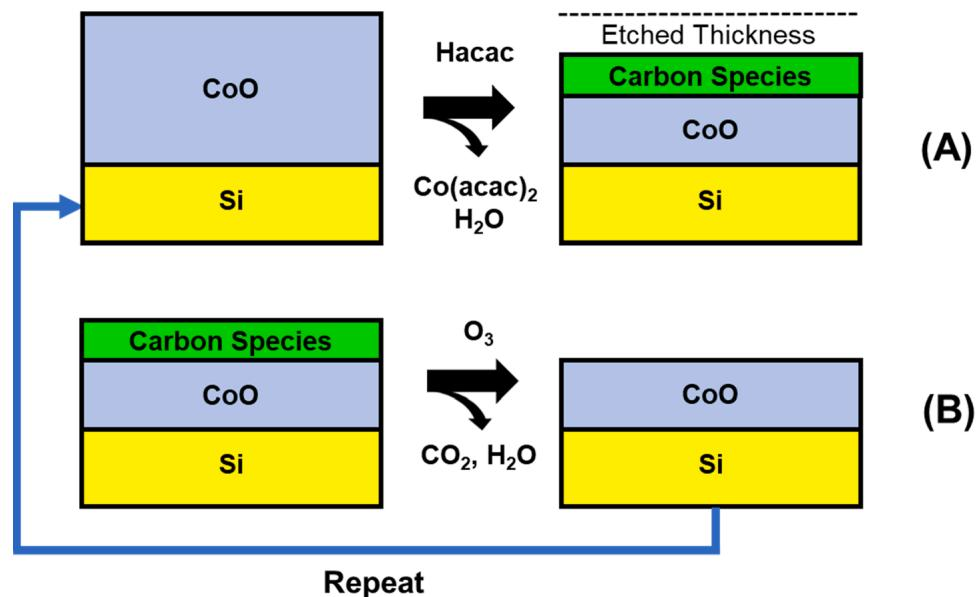  
Fig. 1. Schematic for CoO thermal ALE using sequential Hacac and  $\mathrm{O_3}$  exposures based on: (A) Hacac removal of CoO as  $\mathrm{Co(acac)_2}$  and  $\mathrm{H_2O}$ ; and (B)  $\mathrm{O_3}$  cleaning of carbon species remaining after Hacac exposure.

feed gas for the  $\mathrm{O_3}$  generator. The  $\mathrm{O_3}$  was produced by a generator (O3ONIA CFS- 1A) with an ozone output of  $\sim 15\mathrm{wt}\%$  .Hacac was kept in a gold- plated stainless- steel vessel to minimize contact with the stainless- steel walls. Ultra- high purity UHP) grade  $\mathbb{N}_2$ $(99.9999\%)$  Airgas) was utilized as the carrier and purge gas. The reported reactant pressures refer to their partial pressures with respect to the background  $\mathbb{N}_2$  gas pressure of  $\sim 1$  Torr.

# 2.2. X-ray diffraction and x-ray photoelectron spectroscopy

For the cobalt oxide thin films, XRD was employed to determine the crystalline phase before and after the reactant exposures. GIXRD scans were obtained by a high- resolution X- ray diffractometer (Bede D1, Bruker) using Cu Kα  $(\lambda = 1.54056\mathring{\mathrm{A}})$  radiation. All the GIXRD thin film results were collected using an incidence angle  $\Omega = 0.5^{\circ}$  a scan step size of  $0.03^{\circ}$  and a count time of  $5\mathrm{s}$  per step. An atomic force microscope (Park Systems NX10) employing non- contact mode was also used to measure surface roughness of the cobalt oxide films before and after ALE.

For the cobalt oxide nanopowder, powder XRD was used to analyze the crystalline phase before and after Hacac exposures. A Bruker AXS D8 Advance A25 with Cu Kα radiation  $(40\mathrm{kV},40\mathrm{mA})$  was used for these powder XRD studies. Each 2 Theta scan was from  $30^{\circ}$  to  $80^{\circ}$  with a step size of  $0.03^{\circ}$  .Powder diffraction of unprocessed metallic Co micropowder  $(99.9\%)$ $1.3\mu \mathrm{m}$  trace metals basis) supplied by US Research Nanomaterials was also utilized for comparative study.

The CoO and  $\mathrm{Co_3O_4}$  nanopowders were processed in a separate hotwalled reactor for subsequent analysis by ex situ powder XRD [55]. CoO and  $\mathrm{Co_3O_4}$  nanopowders with a mass of  $\sim 1.0\mathrm{g}$  were loaded into the hotwalled reactor. The nanopowders were then subjected to 15 sequential Hacac exposures at a pressure of 5.0 Torr for  $60~s$  at a temperature of  $250^{\circ}C$  There were  $\mathbb{N}_2$  purges for  $120~s$  between each Hacac exposure. Prior to the Hacac exposures, the reactor was preconditioned without the nanopowder samples using ten Hacac exposures. Each Hacac exposure was at 5.0 Torr for  $60~s$

X- ray photoelectron spectroscopy (XPS) (PHI 5600) was used to determine the binding energy of Co to identify the oxidation state. A monochromatic Al Kα x- ray source  $(1486.6\mathrm{eV})$  was used to collect survey scans with a pass energy of  $93.9\mathrm{eV}$  and step size of  $0.400\mathrm{eV}$  Auger Scan software package (RBD Instruments) was employed to collect the data. Casa XPS (Casa Software) was used to determine the surface concentrations using the peak areas and the corresponding sensitivity factors.

The Co 2p results presented in the paper are shown with Shirley background subtraction. All data represent the average of 10 consecutive survey scans. All spectra were referenced to the adventitious carbon peak centered at  $285.0\mathrm{eV}$  XPS was also used to determine the composition of the initial cobalt oxide ALD film. After  $2\mathrm{min}$  of  $\mathrm{Ar}^+$  sputtering on an as- deposited cobalt oxide ALD thin film, the bulk showed a composition of: O 1s  $(48.07\mathrm{at}.\%)$  Co 2p  $(51.93\mathrm{at}.\%)$  .The  $\mathrm{Ar}^+$  ion sputtering energy and ion current were  $3\mathrm{keV}$  and  $1.6\mu \mathrm{A}$  respectively.

# 2.3. Quadrupole mass spectrometry

The etching of CoO and  $\mathrm{Co_3O_4}$  powders by Hacac was studied at  $250^{\circ}C$  using gas phase quadrupole mass spectrometry (QMS) to identify volatile etch products in a separate experimental setup [43,56]. A detailed description of this QMS reactor design has been given in previous publications [43,56]. The average  $\mathbb{N}_2$  background pressure was 2.6 Torr and the average precursor pressure was 2.4 Torr. During the QMS experiments, the  $\mathbb{N}_2$  carrier gas and precursor and product gases were used to form a molecular beam [56]. The molecular beam formed as a fraction of the gases traveled through a  $300\mu \mathrm{m}$  aperture and expanded into a differentially pumped region.

The molecular beam then passed through a skimmer with a  $1.4~\mathrm{mm}$  diameter and entered the differentially pumped QMS region [56]. The distance between the aperture and skimmer was  $29.2\mathrm{mm}$  .The ionization voltage was  $70~\mathrm{eV}$  for all the QMS experiments. In this work, the QMS scans from  $m / z$  2- 500 with a  $1.0~s$  scan time were performed continuously during the  $120~s$  reactant exposures with  $300~s$  purges between exposures. Spectra were obtained by averaging  $100~s$  of each  $120~s$  dose and subtracting the baseline from the previous  $\mathbb{N}_2$  purge.

The CoO  $(99.7\% ,50\mathrm{nm})$  and  $\mathrm{Co_3O_4}$ $(>99.5\%)$ $30–50\mathrm{nm}$  powders used in the QMS experiments were supplied by US Research Nanomaterials. CoO and  $\mathrm{Co_3O_4}$  nanopowders with a mass of  $1.00\mathrm{g}$  were loaded and degassed in the reactor using a turbomolecular pump at the reaction temperature for  $>12\mathrm{h}$  prior to experiments.

# 3. Results and discussion

# 3.1. Spectroscopic ellipsometry studies of CoO thin film etching

Initial experiments determined if Hacac could spontaneously etch a crystalline CoO thin film. In agreement with previous reports, the initial CoO thin film grown using CoO ALD was determined by GIXRD to be mostly crystalline h- CoO [54]. The SE measurements of the CoO film thickness versus number of Hacac doses at 250 and  $275^{\circ}C$  are shown in Fig. 2. Hacac was repeatedly exposed at a pressure of  $\sim 0.23$  Torr for 1.0 s with  $30~s$  purges in between the Hacac doses. SE measurements were recorded after each Hacac dose during the purge step. The results show a relatively slow spontaneous etch of CoO by Hacac at a rate of  $0.08\pm$ $0.004\mathring{\mathrm{A}}$  per Hacac dose at  $250^{\circ}C$  and  $0.09\pm 0.009\mathring{\mathrm{A}}$  per Hacac dose at  $275^{\circ}C$

The slow spontaneous etching of CoO by Hacac is believed to occur by a ligand substitution and hydrogen transfer reaction:

$$
\mathrm{CoO} + 2\mathrm{Hacac}\rightarrow \mathrm{Co(acac)}_2 + \mathrm{H}_2\mathrm{O} \tag{1}
$$

The acac ligand substitutes for O in CoO to form  $\mathrm{Co(acac)_2}$  .The H on Hacac also transfers to CoO to form  $\mathrm{H_2O}$  Earlier studies observed the spontaneous etching of cobalt oxide by Hacac [41,57]. The cobalt oxide was formed by oxidation of metallic cobalt using an  $\mathrm{O_2}$  plasma.

The spontaneous etch of CoO by Hacac could be hindered by surface bound Hacac species as well as Hacac decomposition products that block CoO etching. Consequently, the CoO was subsequently etched using sequential Hacac and  $\mathrm{O_3}$  exposures as illustrated in Fig. 1. The  $\mathrm{O_3}$  was assumed to provide cleaning that could remove carbon- containing species from the surface.  $\mathrm{O_3}$  exposures should yield  $\mathrm{CO_2}$  and  $\mathrm{H_2O}$

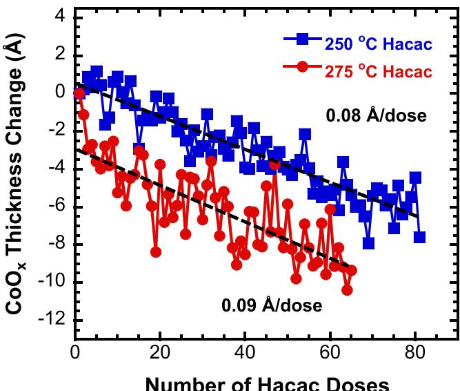  
Fig. 2. CoO film thickness change versus number of Hacac doses at 250 and  $270^{\circ}C$  Dashed lines show the linear fits.

combustion products during the removal of carbon species. Hacac exposures can then etch CoO until the Hacac reaction is again blocked by Hacac or carbon species on the CoO surface.

Fig. 3 shows the SE results observed during etching at 200 and  $250^{\circ}C$  using sequential exposures of Hacac and  $\mathrm{O_3}$  Etching was performed using an Hacac exposure for  $1.5~\mathrm{s}$  at 0.12 Torr, a purge for  $40~\mathrm{s},$  an  $\mathrm{O_3}$  exposure for  $1.0~\mathrm{s}$  at 0.28 Torr, and then another purge for  $40~\mathrm{s}$  The cobalt oxide film thickness decreased linearly at a rate of  $0.09\pm 0.001$ $\dot{\mathrm{A}} /$  cycle at  $200^{\circ}C$  and  $0.43\pm 0.001\mathrm{\AA / cycle}$  at  $250^{\circ}C$

The inclusion of the  $\mathrm{O_3}$  exposure increased the etch rate at  $250^{\circ}C$  from  $0.08\mathrm{\AA}$  per Hacac dose in Fig. 2 to  $0.43\mathrm{\AA}$  /cycle in Fig. 3. This increase in etch rate is attributed to the ability of  $\mathrm{O_3}$  to clean carboncontaining species from the CoO surface. These carbon species may result from surface- coordinated Hacac species or the decomposition of Hacac on the surface. Additional experiments were performed under identical conditions at a lower temperature of  $200^{\circ}C$  The lower temperature resulted in a smaller etch rate of  $0.09\mathrm{\AA}$  /cycle. This smaller etch rate indicates that CoO thermal ALE is a thermally- activated process.

The self- limiting nature of the Hacac and  $\mathrm{O_3}$  reactions at  $250^{\circ}C$  is explored in Fig. 4. The experiments for Hacac were conducted by varying the Hacac exposure times from 1.0 to  $2.5s$  while fixing the  $\mathrm{O_3}$  exposure time at  $1.5~\mathrm{s}$  The experiments for  $\mathrm{O_3}$  were performed by varying the  $\mathrm{O_3}$  exposure times from 1.0 to  $2.5s$  while fixing the Hacac exposure time at  $1.5~\mathrm{s}$  The purge times for both experiments were  $40~\mathrm{s}$  The CoO etch rate increases rapidly with increasing Hacac or  $\mathrm{O_3}$  exposure time. The etch rate then levels out at longer Hacac or  $\mathrm{O_3}$  exposure times. There is reasonably self- limiting behavior versus both the Hacac and  $\mathrm{O_3}$  exposures.

Self- limiting behavior for the  $\mathrm{O_3}$  exposures would be expected if the role of the  $\mathrm{O_3}$  is to remove carbon- containing species from the surface. The etch rate would be expected to reach a limit when the carbon species have been removed from the surface. The self- limiting behavior for the Hacac exposures would be expected if the Hacac species adsorb or decompose and block the spontaneous etching of CoO. The etch rate may become negligible after a particular Hacac exposure time. Further spontaneous etching would then require an  $\mathrm{O_3}$  exposure to clean the CoO surface.

# 3.2. XRD analysis of CoO thin films before and after reactant exposures

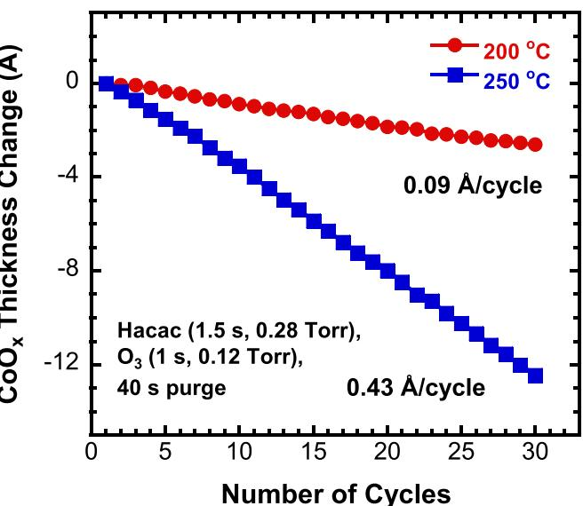  
Fig. 5a shows the GIXRD results for the initial CoO thin film. The as

  
Fig. 4. Self-limiting behavior for CoO thermal ALE for long Hacac and  $\mathrm{O_3}$  exposures at  $250^{\circ}C$  Hacac exposure time was varied with  $\mathrm{O_3}$  exposure fixed at  $1.0~\mathrm{s}$ $\mathrm{O_3}$  exposure time was varied with Hacac exposure fixed at  $1.5~\mathrm{s}$

deposited CoO thin film showed diffraction peaks at 20 values of 31.90, 34.63, 36.4, 47.87, 56.80, and  $67.90^{\circ}$  .These diffraction peaks correspond to the 100)002)101)102)110 and 112 crystal planes of hexagonal CoO (h- CoO). These assignments are based on the reference powder diffraction data for hexagonal CoO (JCPDS, card no. 89- 2803). There are also diffraction peaks at 20 values of  $42.59^{\circ}$  and 61.9 attributed to the (200) and (220) crystal planes of cubic CoO (cCoO). In agreement with earlier studies, the initial CoO thin films grown by ALD using  $\mathrm{CoCl_2(TMESA)}$  and  $\mathrm{H}_2\mathrm{O}$  at  $250^{\circ}C$  are mostly hexagonal phase with some cubic oxide [54].

Fig. 5b shows the GIXRD results for a CoO thin film etched by 300 cycles of alternating Hacac and  $\mathrm{O_3}$  exposures at  $250^{\circ}C$  The GIXRD results are shown after the Hacac exposure. The CoO thermal ALE was performed using sequential exposures of Hacac for  $2s$  and  $\mathrm{O_3}$  for  $2s$  There was a purge for  $40~\mathrm{s}$  between the Hacac and  $\mathrm{O_3}$  exposures. This diffraction pattern differs from h- CoO in Fig. 5a. The diffraction peaks at  $2\theta = 36.50$  42.30,and  $61.90^{\circ}$  in Fig. 5b correspond to the (111), (200),

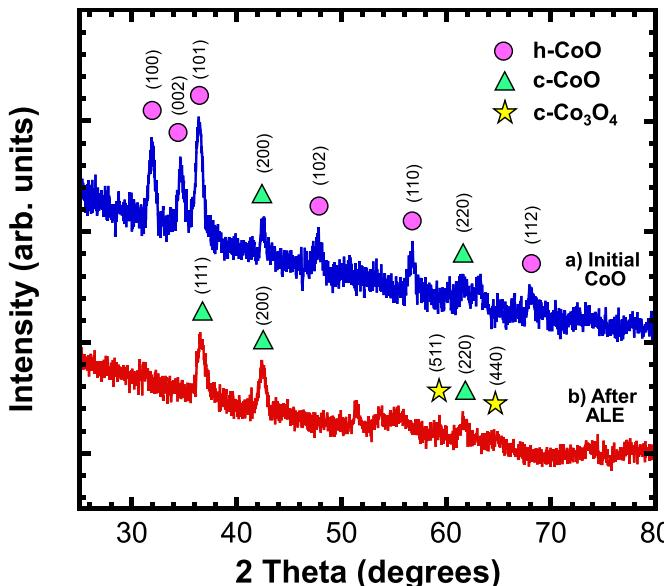  
Fig. 3. CoO film thickness change versus number of CoO thermal ALE cycles using sequential Hacac and  $\mathrm{O_3}$  exposures at 250 and  $200^{\circ}C$  Etch rates are 0.43  $\dot{\mathrm{A}} /$  cycle at  $250^{\circ}C$  and  $0.09\mathrm{\AA}$  /cycle at  $200^{\circ}C$  
Fig. 5. XRD diffractograms for: (a) initial CoO thin film on Si prior to etching (h-CoO); and (b) CoO thin film after 300 ALE cycles using sequential Hacac and  $\mathrm{O_3}$  exposures at  $250^{\circ}C$  (c-CoO).

and (220) crystal planes of c- CoO (JCPDS, card no. 09- 0402).

The results in Fig. 5b indicate that the initial CoO thin film phase has transformed from mostly h- CoO to c- CoO after the thermal ALE. Cubic CoO is reported to be a more thermodynamically stable phase than h- CoO [58,59]. Two peaks at 59.53 and  $65.38^{\circ}$  in Fig. 5b are attributed to the (511) and (440) crystal planes of cubic crystalline  $\mathrm{Co_3O_4}$ $\mathrm{c - Co_3O_4}$  (JCPDS, card no. 42- 1467). The appearance of these two peaks suggests that CoO was produced by Hacac reduction of  $\mathrm{Co_3O_4}$  that was formed during the previous  $\mathrm{O_3}$  cleaning step.

Fig. 6 displays the GIXRD results for initial CoO thin films and after 2, 10, and 410 consecutive  $\mathrm{O_3}$  doses for  $1.0~\mathrm{s}$  at 0.12 Torr. New samples were used for each experiment. There was a purge of  $70~\mathrm{s}$  between each  $\mathrm{O_3}$  dose. The diffraction spectrum of the initial CoO sample after 2  $\mathrm{O_3}$  doses shown in Fig. 6b is different than the diffraction pattern of the initial CoO sample shown in Fig. 6a. Peaks at 47.87, and  $56.80^{\circ}$  in Fig. 6a corresponding to (102) and (110) crystal planes of h- CoO are not observed in Fig. 6b. In addition, a new peak at  $42.3^{\circ}$  assigned to the (200) crystal planes of c- CoO appears in Fig. 6b.

Diffractograms of the cobalt oxide films after 10 and 410 of  $\mathrm{O_3}$  doses are shown in Fig. 6c and 6d, respectively. After  $10\mathrm{O_3}$  doses, Fig. 6c shows new peaks at 19.1, 31.30, 36.94, and  $44.68^{\circ}$  corresponding to the (111), (220), (311), and (400) crystal planes of  $\mathrm{c - Co_3O_4}$  (JCPDS, card no. 42- 1467). In addition, the broad peaks around 31 and  $37^{\circ}$  can be also assigned to the (100) and (101) crystal planes of h- CoO and/or (111) crystal planes of c- CoO. After  $110\mathrm{O_3}$  doses, Fig. 6d illustrates that the cobalt oxide film has converted almost completely to  $\mathrm{c - Co_3O_4}$ . These results suggest that c- CoO is a transition phase between h- CoO and c-  $\mathrm{Co_3O_4}$  during oxidation [9,60].

There is a direct relationship between the incident x- ray angle and the penetration depth of GIXRD measurements [61]. There is also an inverse relationship between the x- ray linear attenuation coefficient and the x- ray energy [62]. For an incident x- ray angle of  $\Omega = 0.5^{\circ}$  and an x- ray energy of  $8.04\mathrm{keV}$ $(\Omega = 1.54056\mathrm{\AA})$  used in this study, the x- ray penetration depth in CoO is calculated to be between 36 and  $43\mathrm{nm}$  [63]. This calculation employed CoO with a density of  $6.44~\mathrm{g / cm^3}$  and two linear attenuation coefficients of  $\mu = 1450$  and  $\mu = 1737$  from the NIST standard reference database [64]. These were the two closest linear attenuation coefficients for CoO exposed to X- rays at  $8.04\mathrm{keV}$ . The calculated penetration depth of  $36 - 43\mathrm{nm}$  is consistent with the GIXRD measurements not observing the Si substrate underneath the CoO films. The GIXRD results are representative of the majority of the  $60~\mathrm{nm}$  CoO film and are not selective to the near surface region.

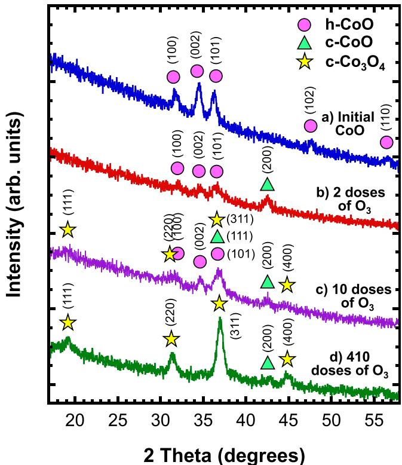  
Fig. 6. XRD diffractograms for: (a) CoO thin film on Si prior to etching (h-CoO); (b) CoO film after 2 doses of  $\mathrm{O_3}$  for 1 s at  $250^{\circ}\mathrm{C}$ ; (c) CoO film after 10 doses of  $\mathrm{O_3}$  for 1 s at  $250^{\circ}\mathrm{C}$ ; (d) CoO film after 410 doses of  $\mathrm{O_3}$  for 1 s at  $250^{\circ}\mathrm{C}$ $\mathrm{c - Co_3O_4}$ .

# 3.3. XPS analysis of CoO thin films after  $\mathrm{O_3}$  exposures and after CoO ALE

Fig. 7 shows the XPS Co 2p spectral region of three separate samples: the initial CoO thin film; the initial CoO film after 2 doses of  $\mathrm{O_3}$ ; and the initial CoO film after 300 cycles of Co thermal ALE. The original h- CoO sample was etched using 300 cycles of CoO thermal ALE at  $250^{\circ}\mathrm{C}$  ending with the Hacac exposure. These Co 2p spectra show spin- orbit splitting into  $2\mathrm{p}_{1 / 2}$  and  $2\mathrm{p}_{3 / 2}$  components and shake- up satellites above the main photoemission lines.

The Co 2p spectrum recorded for the as- deposited CoO film is shown in Fig. 7a. This spectrum is characterized by binding energy values of  $780.05\mathrm{eV}$  for  $2\mathrm{p}_{3 / 2}$  and  $796.12\mathrm{eV}$  for  $2\mathrm{p}_{1 / 2}$ . There are also strong shake- up satellites at higher energies than the main photoemission lines. The binding energy of the strong satellite for the Co  $2\mathrm{p}_{3 / 2}$  peak is  $785.15\mathrm{eV}$ . The Co  $2\mathrm{p}_{3 / 2}$  peak can be deconvolved into two peaks at 780.15 (light blue line) and  $782.55\mathrm{eV}$  (green line). Both the shape of the spectrum and the binding energies are characteristic of h- CoO [65].

The XPS Co 2p spectrum after  $2\mathrm{O_3}$  dosage is shown in Fig. 7b. The Co  $2\mathrm{p}_{3 / 2}$  peak at  $780.3\mathrm{eV}$  and the Co  $2\mathrm{p}_{1 / 2}$  peak at  $795.05\mathrm{eV}$  can be assigned to  $\mathrm{c - Co_3O_4}$  [66]. In addition, a weak Co  $2\mathrm{p}_{3 / 2}$  satellite feature

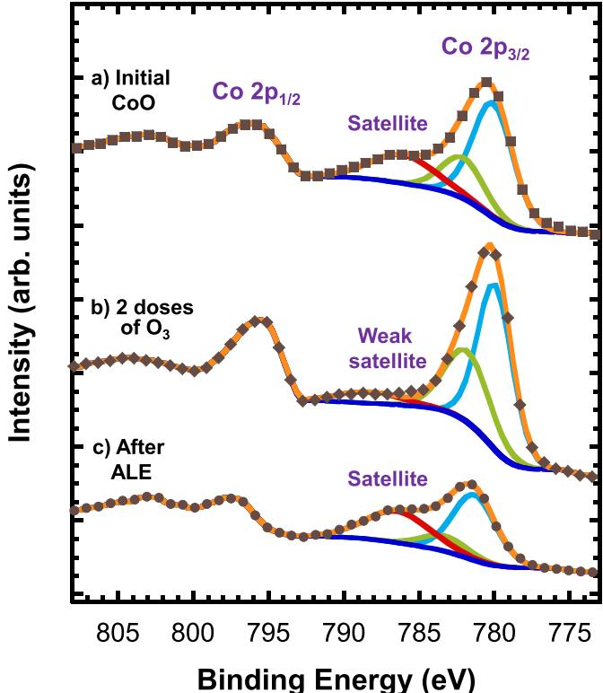  
Fig. 7. XPS spectra of Co 2p region for: a) initial CoO film; b) initial CoO film after two 1 s doses of  $\mathrm{O_3}$  at  $250^{\circ}\mathrm{C}$ ; and c) initial CoO film after  $300\mathrm{CoO}$  thermal ALE cycles using sequential Hacac and  $\mathrm{O_3}$  exposures with Hacac last at  $250^{\circ}\mathrm{C}$ . Satellite peaks, Shirley background, and fitting of Co  $2\mathrm{p}_{3 / 2}$  peak are shown by red, dark blue, and green and light blue lines, respectively. (For interpretation of the references to colour in this figure legend, the reader is referred to the web version of this article.)

for  $\mathrm{Co_3O_4}$  at  $788.71\mathrm{eV}$  is observed with significantly less intensity compared with the intense satellite for CoO. The Co  $2\mathrm{p}_{3 / 2}$  peak can be deconvolved into two peaks at 779.91 (light blue line) and  $781.91\mathrm{eV}$  (green line). While  $\mathrm{Co}^{3 + }$  shows relatively narrow  $2\mathrm{p}_{3 / 2}$  and  $2\mathrm{p}_{1 / 2}$  lines with minor satellites,  $\mathrm{Co}^{2 + }$  generally exhibits broad  $2\mathrm{p}_{3 / 2}$  and  $2\mathrm{p}_{1 / 2}$  lines accompanied by intense satellite structures [65,67- 69]. Very similar spectra to the spectrum in Fig. 7b were observed for the CoO films oxidized by 10 and 410 doses of  $\mathrm{O_3}$  (not shown). These results suggest that two  $\mathrm{O_3}$  doses are sufficient to oxidize CoO to  $\mathrm{Co_3O_4}$ .

These results indicate that  $\mathrm{O_3}$  exposures can both clean carbon from the surface and oxidize the underlying CoO substrate to  $\mathrm{Co_3O_4}$ . The CoO to  $\mathrm{Co_3O_4}$  transformation is in agreement with previous reports where both h- CoO and c- CoO have been oxidized to  $\mathrm{Co_3O_4}$  when annealed in air at  $240^{\circ}\mathrm{C}$  [60]. The oxidation reaction can be written as:

$$
3\mathrm{CoO} + \mathrm{O}_3(\mathrm{g})\rightarrow \mathrm{Co}_3\mathrm{O}_4 + \mathrm{O}_2(\mathrm{g}) \tag{2}
$$

This reaction is thermochemically favorable with a standard free energy change of  $\Delta \mathrm{G}^{\circ}(250^{\circ}\mathrm{C}) = - 71.8$  kcal [70].

XPS results for the CoO film after 300 cycles of Co thermal ALE ending with the Hacac exposure are shown in Fig. 7c. The Co  $2\mathrm{p}_{3 / 2}$  and Co  $2\mathrm{p}_{1 / 2}$  peaks are observed at 781.5 and  $795.22\mathrm{eV}$ , respectively. These peaks are shifted to higher energies compared with c- CoO and can be assigned to  $\mathrm{c - Co(OH)_2}$  [68]. There are also strong shake- up satellites at higher energies than the main photoemission lines. The binding energy of the strong satellite for the Co  $2\mathrm{p}_{3 / 2}$  peak is  $787.08\mathrm{eV}$ . The Co  $2\mathrm{p}_{3 / 2}$  peak can be deconvolved into two peaks at 781.48 (light blue line) and  $783.88\mathrm{eV}$  (green line). This etched sample is consistent with Co in the  $+$  2 oxidation state [67]. Cobalt hydroxide could form as a result of exposure to ambient air after the etching process prior to the XPS measurements [71,72].

The XPS measurements are surface sensitive because only photo- electrons produced near the surface can escape into vacuum [73]. The inelastic mean free path for photoelectrons at  $\sim 1000\mathrm{eV}$  is  $1.5 - 2.0\mathrm{nm}$  for many metals [74]. The photoelectron attenuation length at  $\sim 1000\mathrm{eV}$  is  $\approx 2\mathrm{nm}$  for metal oxide materials such as FeO [75]. Consequently, most of the Co 2p photoelectrons emitted from the cobalt oxide sample are derived from depths of  $\leq 6\mathrm{nm}$  [73]. The XPS measurements provide information regarding the near surface region of the initial cobalt oxide film.

The XRD measurements in Fig. 5b show some  $\mathrm{Co_3O_4}$  structure after the last Hacac exposure. The XPS measurements in Fig. 7b indicate that the initial CoO film can be easily oxidized to  $\mathrm{Co_3O_4}$  after 2 doses of  $\mathrm{O_3}$ . These results suggest that the surface of the cobalt oxide film is mostly  $\mathrm{Co_3O_4}$  after the  $\mathrm{O_3}$  exposures during CoO thermal ALE. In addition, the XPS spectrum in Fig. 7c is consistent with the reduction of  $\mathrm{Co_3O_4}$  to CoO after the last Hacac exposure during CoO thermal ALE. These results argue that Hacac can react with  $\mathrm{Co_3O_4}$  to produce combustion products and reduce  $\mathrm{Co_3O_4}$  to CoO.

# 3.4. XRD analysis of cobalt oxide powders before and after Hacac exposures

XRD powder spectra were also utilized to monitor the effect of Hacac exposure on CoO and  $\mathrm{Co_3O_4}$  powders. Fig. 8a displays the diffraction patterns for the as- received c- CoO powder control samples. The main three diffraction peaks for c- CoO are located at  $2\theta = 36.5$ , 42.4, and 61.5. These diffraction peaks are assigned to the (111), (200) and (220) crystal planes, respectively, of c- CoO (JCPDS, card no. 09- 0402). Fig. 8b shows the diffraction patterns of c- CoO after 15 Hacac exposures at  $250^{\circ}\mathrm{C}$ . The diffraction patterns for the c- CoO powders before and after Hacac exposure are very similar. This similarity indicates that the Hacac exposure has not affected the c- CoO powders.

Fig. 9a displays the diffraction patterns for the as- received  $\mathrm{Co_3O_4}$  powder samples. Seven main peaks are located at  $2\theta = 19.0$ , 31.3, 36.9, 38.5, 44.8, 55.6, 59.4, and  $68.6^{\circ}$ . These peaks are identified as the

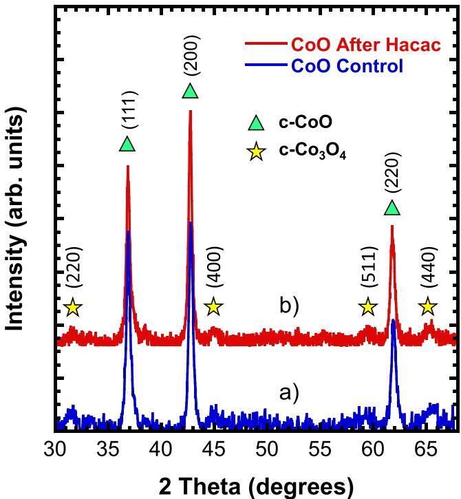  
Fig. 8. XRD data for CoO powder: (a) initial CoO powder; and (b) initial CoO powder after 15 Hacac exposures at  $250^{\circ}\mathrm{C}$ . c-CoO structure is observed before and after Hacac exposures.

(220), (311), (222), (400), (422), (511), and (440) crystal planes of  $\mathrm{c - Co_3O_4}$  (JCPDS, card no. 42- 1467). Fig. 9b shows the diffraction patterns of  $\mathrm{Co_3O_4}$  after 15 Hacac exposures at  $250^{\circ}\mathrm{C}$ . The diffraction patterns in Fig. 9a and Fig. 9b are different. The differences indicate that Hacac exposure has reacted with the  $\mathrm{Co_3O_4}$  powders.

The diffraction peaks associated with the (220) and (422) crystal planes of  $\mathrm{Co_3O_4}$  in Fig. 9a are greatly reduced in Fig. 9b after Hacac

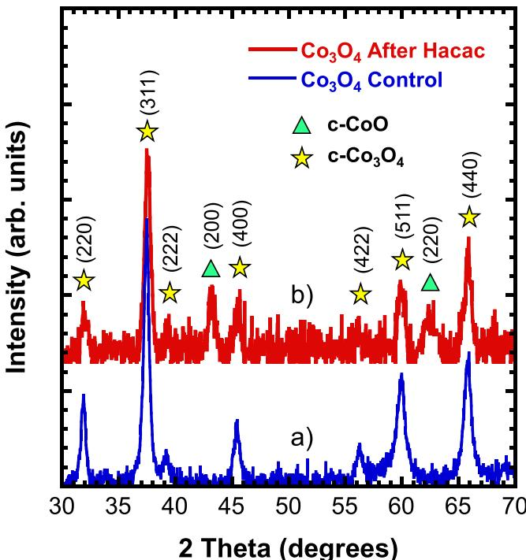  
Fig. 9. XRD data for  $\mathrm{Co_3O_4}$  powder: (a) initial  $\mathrm{Co_3O_4}$  powder; and (b) initial  $\mathrm{Co_3O_4}$  powder after 15 Hacac exposures at  $250^{\circ}\mathrm{C}$ . c-CoO structure develops as Hacac exposures partially convert  $\mathrm{c - Co_3O_4}$  structure to c-CoO structure.

exposure. Concurrently, there is a rise of diffraction peaks at  $2\theta = 42.4$  and 61.5 in Fig. 9b. These peaks are assigned to the (200) and (220) crystal planes of c- CoO. These changes suggest that the  $\mathrm{Co_3O_4}$  powder has been partially reduced to CoO by the Hacac exposure.

A  $\mathrm{Co_3O_4}$  reduction to cubic CoO could proceed through a Hacac combustion reaction:

$$
\mathrm{Co_3O_4 + 1 / 12C_5H_8O_2\rightarrow 3CoO + 5 / 12CO_2(g) + 1 / 3H_2O(g)} \tag{3}
$$

This reaction is thermochemically favorable with a standard free energy change of  $\Delta \mathbf{G}^{\circ}$ $(250^{\circ}\mathrm{C}) = - 23.6$  kcal [70]. This reduction process is also consistent with the XPS observations after Hacac exposure to  $\mathrm{Co_3O_4}$  thin films.  $\mathrm{Co_3O_4}$  reduction could also result from vacuum annealing. However, reduction by vacuum annealing is less likely because of the higher temperatures and lower pressures required for this reduction [76].

There is a possibility that CoO could be further reduced to metallic Co by Hacac combustion [77,78]. However, Hacac exposure to either CoO or  $\mathrm{Co_3O_4}$  powder did not show any evidence of reduction to metallic Co. Metallic Co powder was analyzed by XRD to establish a background reference. These powder XRD scans showed evidence for both fcc- Co and hcp- Co. Diffraction peaks were observed at  $2\theta = 42.1$  44.5, and 47.2 for hcp- Co and  $2\theta = 44.2$  and  $51.3^{\circ}$  for fcc- Co (JCPDS cards no. 00- 105- 0806 and 04- 001- 3273). None of these metallic Co diffraction peaks were observed in Fig. 8b or Fig. 9b.

# 3.5. Quadrupole mass spectrometry analysis of reaction products

Quadrupole mass spectrometry (QMS) studies were performed to identify the gas phase products from the reaction of Hacac with c- CoO and  $\mathrm{Co_3O_4}$  powders. Initially, control QMS experiments were performed without c- CoO and  $\mathrm{Co_3O_4}$  powders in the reactor. These experiments demonstrated that Hacac was thermally stable at  $250^{\circ}C$  The QMS spectrum was consistent with the fragmentation pattern of Hacac reported in the NIST Chemistry WebBook [79]. These results are also consistent with the previously reported decomposition temperature for acetylacetone at  $\sim 480^{\circ}C$  [80].

Fig. 10 shows the gas- phase reaction products in the high mass region from  $m / z$  235- 263 during Hacac exposure to c- CoO and  $\mathrm{Co_3O_4}$  powders at  $250^{\circ}C$  Cobalt acetylacetone etch products are observed during the spontaneous etch of c- CoO and  $\mathrm{Co_3O_4}$  powders. The prominent ion signal intensities are observed at  $m / z = 257$  and 242. These ion signals are attributed to  $\mathrm{Co(acac)}_{2}^{+}$  and  $\mathrm{Co(acac)(C_4H_4O_2)^+}$  These ion signals are both derived from the parent  $\mathrm{Co(acac)_2}$  etch product. The acac ligand has the formula  $\mathrm{C_5H_7O_2}$ $\mathrm{C_4H_4O_2^+}$  results from acac that has lost one  $- \mathrm{CH_3}$  group. Ion signals were also observed for Co  $(\mathrm{acac})^{+}$  with the largest ion signal intensity observed at  $m / z$  158. In addition, the  $\mathrm{Co(acac)^+}$  ion signal had a higher intensity than  $\mathrm{Co(acac)}_{2}^{+}$  in agreement with the reported cracking pattern of  $\mathrm{Co(acac)_2}$  [81].

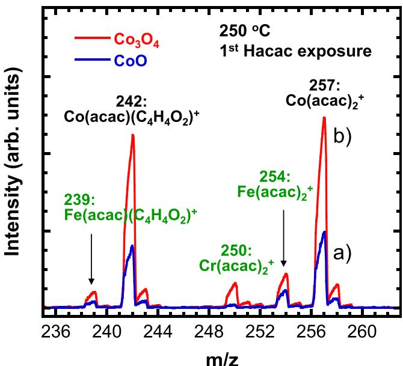  
Fig. 10. Mass spectra from  $m / z$  235 to 263 showing ion signal intensities for Co  $(\mathrm{acac})_2$  etch product during Hacac exposures on (a) CoO and (b)  $\mathrm{Co_3O_4}$  powders at  $250^{\circ}C$  Largest ion signals are observed for  $\mathrm{Co(acac)}_{2}^{+}$  and Co  $(\mathrm{acac})(\mathrm{C_4H_4O_2})^+$

The signal intensity of  $\mathrm{Co(acac)}_{2}^{+}$  etch product from the CoO and  $\mathrm{Co_3O_4}$  powders are shown in Fig. 10a and Fig. 10b, respectively. The  $\mathrm{Co_3O_4}$  powder yields a signal about 2.5 times larger than the CoO powder. This larger signal intensity could indicate a more efficient spontaneous etching reaction for Hacac exposures on the  $\mathrm{Co_3O_4}$  powder. The larger signal intensity could also be attributed to the slightly higher surface area of the  $\mathrm{Co_3O_4}$  powder with  $30\mathrm{- }50\mathrm{nm}$  particle diameters compared with the c- CoO powder with  $\sim 50 \mathrm{nm}$  particle diameters. The smaller particle diameter for the  $\mathrm{Co_3O_4}$  powder also led to the powder packing more tightly in the sample holder mesh. This tighter packing increased the Hacac partial pressure in the sample holder given the same 8.0 Torr manifold Hacac pressure. The Hacac partial pressure on  $\mathrm{Co_3O_4}$  was 3.4 Torr and the Hacac partial pressure on CoO was 1.4 Torr above the  $\mathbb{N}_2$  base pressure.

In addition, no Co- containing ion signal intensities were detected above  $m / z$  260. Despite observation of trace levels of  $\mathrm{Cr(acac)}_{3}^{+}$  and Fe  $(\mathrm{acac})_{3}^{+}$  ion intensities attributed to etching products from the stainless steel chamber walls at  $m / z$  349 and  $m / z$  353, there was no evidence for an ion signal for  $\mathrm{Co(acac)}_{3}^{+}$  at  $m / z = 356$  . These results argue that Co  $(\mathrm{acac})_2$  is the main etch product. The oxidation state for cobalt in Co  $(\mathrm{acac})_2$  is  $2+$  . Cobalt in the  $^{3 + }$  oxidation state would be expected to yield  $\mathrm{Co(acac)_3}$  as the etch product.  $\mathrm{Co(acac)_3}$  is unlikely as an etch product based on these QMS investigations. These results are consistent with the reduction of  $\mathrm{Co_3O_4}$  to CoO during Hacac exposures.

There were also some minority ion signal intensities observed in Fig. 10 and  $m / z$  239 and 254. These smaller ion signals are attributed to Fe  $(\mathrm{acac})_{2}^{+}$  and  $\mathrm{Fe(acac)(C_4H_4O_2)^+}$  . Trace  $\mathrm{Fe(acac)_3}$  was also observed at  $m / z$  353 as mentioned above.  $\mathrm{Fe(acac)_2}$  and  $\mathrm{Fe(acac)_3}$  may be formed by the reaction between Hacac and iron oxide on the stainless- steel chamber walls. Alternatively, there may be a possible ligand transfer between the  $\mathrm{Co(acac)_2}$  etch product and iron on the chamber walls [82]. There is also a small ion signal for  $\mathrm{Cr(acac)}_{2}^{+}$  at  $m / z$  250 in Fig. 10. This  $\mathrm{Cr}$  product is also attributed to an etch product from the stainless- steel chamber walls.

Fig. 11 displays an expanded view of the mass spectrum from  $m / z$  256 to 261 during the Hacac exposure on the  $\mathrm{Co_3O_4}$  powders. This region of the mass spectrum displays the  $\mathrm{Co(acac)}_{2}^{+}$  ion signal intensity. The largest ion signal intensity is observed for  $\mathrm{Co(acac)}_{2}^{+}$  at  $m / z$  257. There is also a smaller peak for  $\mathrm{Co(acac)_2}$  with one  $^{13}\mathrm{C}$  at  $m / z$  258. Fig. 11 shows that the experimental ion signal intensities are in excellent agreement with the calculated signal intensities based on the natural isotopic abundances. The ion signal intensity at  $m / z$  258 is  $11.2\%$  of the ion signal intensity at  $m / z$  257 as expected for the natural isotopic abundance of  $^{13}\mathrm{C}$

QMS analysis was also utilized to study the combustion of Hacac by CoO and  $\mathrm{Co_3O_4}$  powders at  $250^{\circ}C$  These measurements are difficult because  $\mathrm{CO_2}$  and  $\mathrm{H_2O}$  are the combustion products and  $\mathrm{CO_2}$  and  $\mathrm{H_2O}$  are also in the residual background gas in the reactor. However, the QMS analysis revealed that more combustion products were observed for the reaction of Hacac with  $\mathrm{Co_3O_4}$  powder. These combustion products are consistent with the reduction of  $\mathrm{Co_3O_4}$  to CoO during Hacac exposures.

Fig. 12a and Fig. 12b show mass spectra from  $m / z$  10 to 50 during the first  $9s$  of Hacac exposure on fresh  $\mathrm{Co_3O_4}$  and CoO powder, respectively, at  $250^{\circ}C$  These mass spectra have been normalized using the  $\mathrm{C_2H_3O^+}$  ion signal from Hacac at  $m / z$  43. The ion signal intensities for  $\mathrm{CO_2}$  at  $m / z$  44 and  $\mathrm{H_2O}$  at  $m / z$  18 are both larger for the  $\mathrm{Co_3O_4}$  powder in Fig. 12b. These larger  $\mathrm{CO_2}$  and  $\mathrm{H_2O}$  ion signals argue for more Hacac combustion on the  $\mathrm{Co_3O_4}$  powder.

  
Fig. 11. Mass spectrum from  $m / z$  256 to 261 showing an expanded view of Co  $(\mathrm{acac})_2^{\frac{1}{2}}$  ion signal during Hacac exposures on  $\mathrm{Co_3O_4}$  powder at  $250^{\circ}\mathrm{C}$ . Calculated ion signal intensities from expected natural isotopic abundances are shown for comparison.

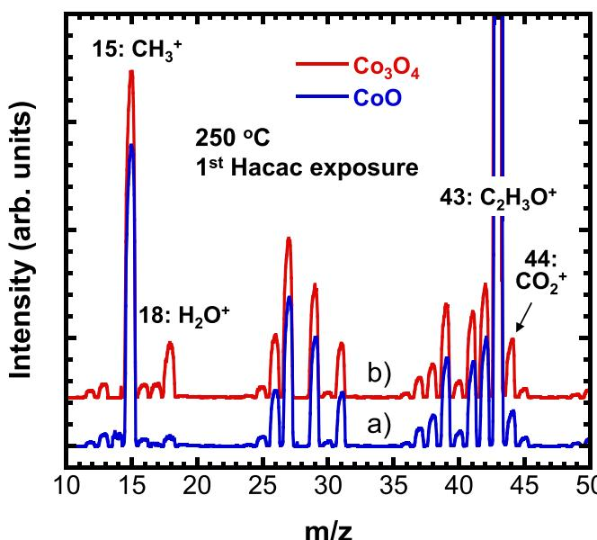  
Fig. 12. Mass spectra from  $m / z$  10 to 50 showing lower masses including  $\mathrm{CO_2}$  and  $\mathrm{H_2O}$  combustion products during Hacac exposures on (a) CoO and (b)  $\mathrm{Co_3O_4}$  powders at  $250^{\circ}\mathrm{C}$ . Mass spectra are normalized using ion signal from Hacac at  $m / z$  43.

# 3.6. Atomic force microscopy analysis of surface roughness

The effect of CoO thermal ALE on surface roughness was studied using AFM measurements. Surface smoothing by ALE has been previously reported during the ALE of many materials such as  $\mathrm{Al_2O_3}$  [21,23,26],  $\mathrm{HfO_2}$  [19], and  $\mathrm{Si_3N_4}$  [36]. The AFM measurements were conducted on CoO films that were etched with sequential Hacac and  $\mathrm{O_3}$  exposures at  $250^{\circ}\mathrm{C}$ . Fig. 13a shows the AFM image and AFM line- scan for the initial CoO film. This surface has an RMS surface roughness of  $40.4\mathrm{\AA}$ . The surface consists of large grains, previously identified as hexagonal pyramid- like crystallites, surrounded by a smoother layer consisting of smaller grains [54].

Fig. 13b shows the AFM image and AFM line- scan for the initial CoO

  
Fig. 13. AFM images of: (a) initial CoO thin films and (b) initial CoO film after 300 ALE cycles of sequential Hacac and  $\mathrm{O_3}$  exposures at  $250^{\circ}\mathrm{C}$ .

film after 300 ALE cycles of Hacac and  $\mathrm{O_3}$  at  $250^{\circ}\mathrm{C}$ . This surface has a lower RMS surface roughness of  $14.0\mathrm{\AA}$ . The observed decrease in surface roughness can result from the CoO thermal ALE. The decrease in surface roughness could also result from the change in film crystallinity. The initial CoO film was largely h- CoO according to XRD analysis. The h- CoO and was converted to c- CoO after CoO thermal ALE ending with an Hacac exposure. Previous studies showed that c- CoO films possess lower roughness values compared to h- CoO films [54].

# 3.7. CoO thermal ALE reaction mechanism

Fig. 14 shows a more detailed mechanism for CoO thermal ALE using Hacac and  $\mathrm{O_3}$  as the reactants. This mechanism incorporates the key findings of this investigation. During the first  $\mathrm{O_3}$  exposure (step B'), the  $\mathrm{O_3}$  cleans residual carbon from the h- CoO surface. In addition, the  $\mathrm{O_3}$

exposure also oxidizes the top layer of the CoO film to  $\mathrm{Co_3O_4}$  .The oxidation state of initial cobalt oxide changes from  $^{2 + }$  in h- CoO to a mixture of  $^{2 + }$  and  $^{3 + }$  in  $\mathrm{Co_3O_4}$

The steady state CoO thermal ALE process is then defined by sequential Hacac (step A) and  $\mathrm{O_3}$  step B reactions. The Hacac undergoes combustion on  $\mathrm{Co_3O_4}$  and reduces  $\mathrm{Co_3O_4}$  to CoO.  $\mathrm{CO_2}$  and  $\mathrm{H_2O}$  combustion products are also observed in the gas phase. The Hacac exposure also removes cobalt and produces  $\mathrm{Co(acac)_2}$  etch products in the gas phase. The H in Hacac also reacts with oxygen in CoO to produce  $\mathrm{H_2O}$  . The etching of CoO by Hacac is then progressively blocked by the adsorption and decomposition of Hacac to produce carbon species on the CoO surface. The  $\mathrm{O_3}$  reaction (step B) then cleans carbon species from the surface. In addition, the  $\mathrm{O_3}$  exposure oxidizes the surface layer from  $\mathbb{C} - \mathbb{C}\mathbb{O}$  to  $\mathbb{C} - \mathbb{O}_2\mathbb{O}_4$

The primarily h- CoO phase of the initial CoO ALD film does not return after the Hacac and  $\mathrm{O_3}$  exposures during CoO thermal ALE. The CoO structure after the Hacac exposure is identified as c- CoO. The CoO thermal ALE proceeds with the surface layer alternating between oxidation to  $\mathrm{Co_3O_4}$  and reduction to CoO by the  $\mathrm{O_3}$  and Hacac exposures, respectively. The transition between c- CoO and  $\mathbb{C} - \mathbb{C}\mathbb{O}_3\mathbb{O}_4$  has previously been shown to be reversible [9]. The ease of switching between  $\mathbb{C} - \mathbb{C}\mathbb{O}_3\mathbb{O}_4$  and c- CoO can be attributed to an epitaxial relationship between these two phases [9,60] as well as the nanocrystalline nature of the films [83].

# 4.Conclusions

The thermal atomic layer etching of CoO was demonstrated using Hacac and  $\mathrm{O_3}$  as the reactants. Initially, the spontaneous etching of CoO thin films by Hacac alone was shown to be slow at  $0.08\mathrm{\AA}$  per Hacac dose at  $250^{\circ}C$  . This slow spontaneous etching was attributed to the adsorption and decomposition of Hacac and the buildup of carbon species on the surface that blocks the etching. After adding  $\mathrm{O_3}$  exposures to remove carbon from the CoO surface, an etch rate of  $0.43\mathrm{\AA}$  /cycle was obtained at  $250^{\circ}C$  using sequential Hacac and  $\mathrm{O_3}$  exposures. The Hacac and  $\mathrm{O_3}$  reactions were demonstrated to be reasonably self- limiting after long exposures.

The  $\mathrm{O_3}$  exposures were also observed to oxidize the top layer of the CoO thin film to  $\mathrm{Co_3O_4}$  . This oxidation increased the oxidation state from  $^{2 + }$  to  $2 + / 3+$  and converted the initial mostly h- CoO crystalline phase to  $\mathbb{C} - \mathbb{C}\mathbb{O}_3\mathbb{O}_4$  . The subsequent Hacac exposures then reduced the oxidation state back to  $^{2 + }$  by converting the  $\mathbb{C} - \mathbb{C}\mathbb{O}_3\mathbb{O}_4$  film to c- CoO. This reduction resulted from the combustion of Hacac to produce  $\mathrm{CO_3}$  and  $\mathrm{H_2O}$  combustion products. In addition, the Hacac also removed cobalt oxide by forming  $\mathrm{Co(acac)_2}$  and  $\mathrm{H_2O}$  gas phase etch products.

Experiments with  $\mathrm{Co_3O_4}$  and CoO powders confirmed the oxidation state changes during Hacac exposures. Crystalline  $\mathbb{C} - \mathbb{C}\mathbb{O}_3\mathbb{O}_4$  powders were reduced and converted to crystalline c- CoO by Hacac exposures. In contrast, crystalline c- CoO powders exposed to Hacac did not display noticeable change. These studies reveal that the sequential  $\mathrm{O_3}$  and Hacac reactant exposures during CoO thermal ALE can oxidize CoO to  $\mathrm{Co_3O_4}$  and reduce  $\mathrm{Co_3O_4}$  back to CoO, respectively, as they etch the CoO surface. CoO thermal ALE also displays distinctive changes between c- CoO and  $\mathbb{C} - \mathbb{C}\mathbb{O}_3\mathbb{O}_4$  crystal structures during the alternating Hacac and  $\mathrm{O_3}$  exposures that volatilize the surface layer.

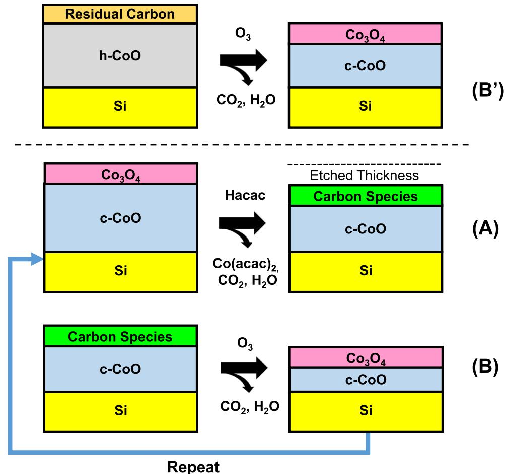  
Fig. 14. Schematic for thermal CoO ALE using sequential Hacac and  $\mathrm{O_3}$  exposures based on results from this study. First cleaning step: (B')  $\mathrm{O_3}$  cleans residual carbon from initial h-CoO film and oxidizes film to  $\mathrm{Co_3O_4}$ . During steady state ALE: (A) Hacac reduction of  $\mathrm{Co_3O_4}$  to  $\mathrm{CoO}$ , removal of  $\mathrm{CoO}$  as  $\mathrm{Co(acac)_2}$  and  $\mathrm{H_2O}$ , and buildup of carbon species; and (B)  $\mathrm{O_3}$  cleaning of carbon species remaining after Hacac exposure and oxidation of  $\mathrm{CoO}$  to  $\mathrm{Co_3O_4}$ .

# CRediT authorship contribution statement

Jonathan L. Partridge: Conceptualization, Data curation, Formal analysis, Investigation, Resources, Writing - original draft, Writing - review & editing. Aziz I. Abdulagatov: Conceptualization, Data curation, Formal analysis, Investigation, Resources, Writing - original draft, Writing - review & editing. Varun Sharma: Resources. Jessica A. Murdzek: Data curation, Formal analysis. Andrew Cavanagh: Data curation, Formal analysis. Steven M. George: Conceptualization, Formal analysis, Funding acquisition, Methodology, Project administration, Supervision, Writing - review & editing.

# Declaration of Competing Interest

The authors declare that they have no known competing financial interests or personal relationships that could have appeared to influence the work reported in this paper.

# Data availability

Data will be made available on request.

# Acknowledgements

AcknowledgementsPrimary funding for this research was provided by ASM Microchemistry. The authors would like to thank Charles Dezelah at ASM Microchemistry (Finland) for sample preparation and valuable scientific discussions. The authors also acknowledge Hessel Sprey at ASM International (Belgium) for his contribution in providing the samples and associated logistics. Funding for the QMS reactor was provided by Lam Research. Authors also acknowledge Aaron Bell at the CU Boulder Geology Department for assistance during the powder XRD measurements.

# References

[1] I.C. ten Have, J.J.G. Kromwijk, M. Monai, D. Ferri, E.B. Sterk, F. Meirer, B. M. Weckhuysen, Uncovering the reaction mechanism behind CoO as active phase for  $\mathrm{CO_2}$  hydrogenation, Nat. Commun. 13 (2022) 324, https://doi.org/10.1038/ s41467- 022- 27981- x. [2] X.W. Xie, Y. Li, Z.Q. Liu, M. Haruta, W.J. Shen, Low- temperature oxidation of CO catalysed by  $\mathrm{Co_3O_4}$  nanorods, Nature 458 (2009) 746- 749, https://doi.org/ 10.1038/nature07877. [3] F. Jiao, H. Frei, Nanostructured cobalt oxide clusters in mesoporous silica as efficient oxygen- evolving catalysts, Angew. Chem. Int. Ed. 48 (2009) 1841- 1844, https://doi.org/10.1002/anie.200805534. [4] S.J. Sun, X.Y. Zhao, M. Yang, L.L. Wu, Z.Y. Wen, X.D. Shen, Hierarchically ordered mesoporous  $\mathrm{Co_3O_4}$  materials for high performance Li- ion batteries, Sci. Rep. 6 (2016) 19564, https://doi.org/10.1038/srep19564. [5] J.Y. Wang, N.L. Yang, H.J. Tang, Z.H. Dong, Q. Jin, M. Yang, D. Kisailus, H.J. Zhao, Z.Y. Tang, D. Wang, Accurate control of multishelled  $\mathrm{Co_3O_4}$  hollow microspheres as high- performance anode materials in lithium- ion batteries, Angew. Chem. Int. Ed. 52 (2013) 6417- 6420, https://doi.org/10.1002/anie.201301622. [6] W.Y. Li, L.N. Xu, J. Chen,  $\mathrm{Co_3O_4}$  nanomaterials in lithium- ion batteries and gas sensors, Adv. Funct. Mater. 15 (2005) 851- 857, https://doi.org/10.1002/ adfm.200400429. [7] A. Pacco, Y. Akanishi, Q.T. Le, E. Kesters, G. Murdoch, F. Holsteyns, Controlled cobalt recess for advanced interconnect metallization, Microelectron. Eng. 217 (2019), 1111131, https://doi.org/10.1016/j.mee.2019.111131. [8] A.A. Vyas, C.J. Zhou, C.Y. Yang, On- chip interconnect conductor materials for end- of- roadmap technology nodes, IEEE Trans. Nanotechnol. 17 (2018) 4- 10, https:// doi.org/10.1109/tnano.2016.2655583. [9] F.C. Kong, Y.F. Li, C. Shang, Z.P. Liu, Stability and phase transition of cobalt oxide phases by machine learning global potential energy surface, J. Phys. Chem. C 123 (2019) 17539- 17547, https://doi.org/10.1021/acs.jpcc.9b02842. [10] K.M. Nam, W.S. Seo, H. Song, J.T. Park, Non- native transition metal monoxide nanostructures: unique physicochemical properties and phase transformations of CoO, MnO and ZnO, NPG Asia Mater. 9 (2017) e364. [11] W.S. Seo, J.H. Shim, S.J. Oh, E.R. Lee, N.H. Hur, J.T. Park, Phase- and size- controlled synthesis of hexagonal and cubic CoO nanocrystals, J. Am. Chem. Soc. 127 (2005) 6188- 6189, https://doi.org/10.1021/ja050359t. [12] L.D. Kadam, P.S. Patil, Thickness- dependent properties of sprayed cobalt oxide thin films, Mater. Chem. Phys. 68 (2001) 225- 232, https://doi.org/10.1016/S0254- 0584(00)00367- 9.

[13] N. Kumar, R.W.A. Hendrikx, A.J.L. Adam, P.C.M. Planken, Thickness dependent terahertz emission from cobalt thin films, Opt. Express 23 (2015) 14252- 14262, https://doi.org/10.1364/Oe.23.014252. [14] Z.N. Kayani, S. Arshad, S. Riaz, S. Naseem, Investigation of structural, optical and magnetic characteristics of  $\mathrm{Co_3O_4}$  thin films, Appl. Phys. A 125 (2019) 196, https://doi.org/10.1007/s00339- 019- 2501- 4. [15] C.T. Carver, J.J. Plombon, P.E. Romero, S. Suri, T.A. Tronic, R.B. Turkot, Atomic layer etching: an industry perspective, ECS J. Solid State Sci. Technol. 4 (2015) N5005- N5009, https://doi.org/10.1149/2.0021506jss. [16] A. Fischer, A. Routzahn, S.M. George, T. Lill, Thermal atomic layer etching: A review, J. Vac. Sci. Technol. A 39 (2021), 030801, https://doi.org/10.1116/ 6.0000894. [17] S.M. George, Mechanisms of thermal atomic layer etching, Acc. Chem. Res. 53 (2020) 1151- 1160, https://doi.org/10.1021/acs.accounts.0c00084. [18] K.J. Kanarik, T. Lill, E.A. Hudson, S. Sriraman, S. Tan, J. Marks, V. Vahedi, R. A. Gottscho, Overview of atomic layer etching in the semiconductor industry, J. Vac. Sci. Technol. A 33 (2015), 020802, https://doi.org/10.1116/1.4913379. [19] Y. Lee, J.W. DuMont, S.M. George, Atomic layer etching of  $\mathrm{HfO_2}$  using sequential, self- limiting thermal reactions with  $\mathrm{Sn(acac)_2}$  and HF, ECS J. Solid State Sci. Technol. 4 (2015) N5013- N5022, https://doi.org/10.1149/2.0041506jss. [20] Y. Lee, J.W. DuMont, S.M. George, Trimentylaluminum as the metal precursor for the atomic layer etching of  $\mathrm{Al_2O_3}$  using sequential, self- limiting thermal reactions, Chem. Mater. 28 (2016) 2994- 3003, https://doi.org/10.1021/acs.chemmater.6b00111. [21] Y. Lee, S.M. George, Atomic layer etching of  $\mathrm{Al_2O_3}$  using sequential, self- limiting thermal reactions with  $\mathrm{Sn(acac)_2}$  and hydrogen fluoride, ACS Nano 9 (2015) 2061- 2070, https://doi.org/10.1021/nn507277f. [22] Y. Lee, S.M. George, Thermal atomic layer etching of  $\mathrm{HfO_2}$  using HF for fluorination and  $\mathrm{TiCl_4}$  for ligand- exchange, J. Vac. Sci. Technol. A 36 (2018), 061504, https://doi.org/10.1116/1.5045180. [23] Y. Lee, S.M. George, Thermal atomic layer etching of  $\mathrm{Al_2O_3}$ ,  $\mathrm{HfO_2}$ , and  $\mathrm{ZrO_2}$  using sequential hydrogen fluoride and dimethylaluminum chloride exposure, J. Phys. Chem. C 123 (2019) 18455- 18466, https://doi.org/10.1021/acs.jpcc.9b047677. [24] J.A. Murdzek, S.M. George, Effect of crystallinity on thermal atomic layer etching of hafnium oxide, zirconium oxide, and hafnium zirconium oxide, J. Vac. Sci. Technol. A 38 (2020), 022608, https://doi.org/10.1116/1.5135317. [25] V. Sharma, S.D. Elliott, T. Blomberg, S. Haukka, M.E. Givens, M. Tuominen, M. Ritala, Thermal atomic layer etching of aluminum oxide  $(\mathrm{Al_2O_3})$  using sequential exposures of niobium pentafluoride  $(\mathrm{NbF_5})$  and carbon tetrachloride  $(\mathrm{CCl_4})$ : a combined experimental and density functional theory study of the etch mechanism, Chem. Mater. 33 (2021) 2883- 2893, https://doi.org/10.1021/acs.chemmater.1c00142. [26] S.R. Zywotko, J. Faguet, S.M. George, Rapid atomic layer etching of  $\mathrm{Al_2O_3}$  using sequential exposures of hydrogen fluoride and trimethylaluminum with no purging, J. Vac. Sci. Technol. A 36 (2018), 061508, https://doi.org/10.1116/ 1.5043488. [27] Y. Lee, S.M. George, Thermal atomic layer etching of titanium nitride using sequential, self- limiting reactions: oxidation to  $\mathrm{TiO_2}$  and fluorination to volatile  $\mathrm{TiF_4}$ , Chem. Mater. 29 (2017) 8202- 8210, https://doi.org/10.1021/acs.chemmater.7b02286. [28] A.M. Cano, A. Lii- Rosales, S.M. George, Thermal atomic layer etching of aluminum nitride using HF or  $\mathrm{FeX_2}$  for fluorination and  $\mathrm{BCl_3}$  for ligand exchange, J. Phys. Chem. C 126 (2022) 6990- 6999, https://doi.org/10.1021/acs.jpcc.1c10972. [29] N.R. Johnson, J.K. Hite, M.A. Maestro, C.R. Eddy, S.M. George, Thermal atomic layer etching of crystalline  $\mathrm{GaN}$  using sequential exposures of  $\mathrm{FeF_2}$  and  $\mathrm{BCl_3}$ , Appl. Phys. Lett. 114 (2019), 243103, https://doi.org/10.1063/1.5095938. [30] N.R. Johnson, S.M. George,  $\mathrm{WO_3}$  and W thermal atomic layer etching using "conversion- fluorination" and "oxidation- conversion- fluorination" mechanisms, ACS Appl. Mater. Interfaces 9 (2017) 34435- 34447, https://doi.org/10.1021/ acsam.7b09161. [31] M. Khan, C. He, X. Lin, X.Y. Guo, V. Palem, R.L. Opila, A.V. Teplyakov, Z.J. Wang, B. Yuan, Molecular mechanisms of atomic layer etching of cobalt with sequential exposure to molecular chlorine and diketones, J. Vac. Sci. Technol. A 37 (2019), 021004, https://doi.org/10.1116/1.5082187. [32] E. Mohimi, X.Q.I. Chu, B.B. Trinh, S. Babar, G.S. Girolami, J.R. Abelson, Thermal atomic layer etching of copper by sequestral steps involving oxidation and exposure to hexafluoroacetylacetone, ECS J. Solid State Sci. Technol. 7 (2018) P491- P495, https://doi.org/10.1149/2.0211809iss. [33] J.A. Murdzek, A. Lii- Rosales, S.M. George, Thermal atomic layer etching of nickel using sequential chlorination and ligand- addition reactions, Chem. Mater. 33 (2021) 9174- 9183, https://doi.org/10.1021/acs.chemmater.1c02684. [34] J.A. Murdzek, A. Lii- Rosales, S.M. George, Thermal atomic layer etching of cobalt using sulfuryl chloride for chlorination and tetramethylethylenediamine or trimethylphosphine for ligand addition, J. Vac. Sci. Technol. A 41 (2023), 032603, https://doi.org/10.1116/6.0002488. [35] A.I. Abdulagatov, S.M. George, Thermal atomic layer etching of silicon using  $\mathrm{O_2}$ , HF, and  $\mathrm{Al(CH_3)_3}$  as the reactants, Chem. Mater. 30 (2018) 8465- 8475, https:// doi.org/10.1021/acs.chemmater.8b02745. [36] A.I. Abdulagatov, S.M. George, Thermal atomic layer etching of silicon nitride using an oxidation and "conversion etch" mechanism, J. Vac. Sci. Technol. A 38 (2020), 022607, https://doi.org/10.1116/1.5140481. [37] A.I. Abdulagatov, V. Sharma, J.A. Murdzek, A.S. Cavanagh, S.M. George, Thermal atomic layer etching of germanium- rich SiGe using an oxidation and "conversion- etch" mechanism, J. Vac. Sci. Technol. A 39 (2021), 022602, https://doi.org/ 10.1116/6.0000834.

[38] T.J. Myers, A.M. Cano, D.K. Lancaster, J.W. Clancey, S.M. George, Conversion reactions in atomic layer processing with emphasis on ZnO conversion to  $\mathrm{Al_2O_3}$  by trimethylaluminum, J. Vac. Sci. Technol. A 39 (2021), 021001, https://doi.org/10.1116/6.0000680. [39] X. Lin, M.X. Chen, A. Janotti, R. Opila, In situ XPS study on atomic layer etching of Fe thin film using  $\mathrm{Cl_2}$  and acetylation, J. Vac. Sci. Technol. A 36 (2018), 051401, https://doi.org/10.1116/1.5039517. [40] Z. Wang, R.L. Opila, In operando x- ray photoelectron spectroscopy study of mechanism of atomic layer etching of cobalt, J. Vac. Sci. Technol. A 38 (2020), 022611, https://doi.org/10.1116/1.5138989. [41] S. Fujisaki, Y. Yamaguchi, H. Kobayashi, K. Shinoda, M. Yamada, H. Hamamura, K. Kawamura, M. Izawa, Thermal- cyclic atomic layer etching of cobalt with smooth etched surface by plasma oxidation and organometalization, Appl. Phys. Lett. 121 (2022), 122102, https://doi.org/10.1103/5.0009949. [42] J.K.C. Chen, N.D. Altieri, T. Kim, E. Chen, T. Lill, M.H. Shen, J.P. Chang, Directional etch of magnetic and noble metals. II. Organic chemical vapor etch, J. Vac. Sci. Technol. A 35 (2017), 05c305, https://doi.org/10.1116/1.498330. [43] J.L. Partridge, J.A. Murdzek, V.I. Johnson, A.S. Cavanagh, A. Fischer, T. Lill, S. Sharma, S.M. George, Thermal atomic layer etching of CoO,  $\mathrm{ZnO}$ ,  $\mathrm{Fe_2O_3}$ , and NiO by chlorination and ligand addition using  $\mathrm{SO_2Cl_2}$  and tetramethylacetylenediaminetile, Chem. Mater. 35 (2023) 2058- 2068, https://doi.org/10.1021/acs.chemmater.2c03619. [44] S.R. Droes, T.T. Kodas, M.J. Hampden- Smith, Dry etching of ZnO films with hexafluoroacetylacetone, Adv. Mater. 10 (1998) 1129- 1133, https://doi.org/10.1002/(sici)1521- 4095(199810)10:14- c1129::Aid- adma1129- 3.3. Co:2- 9. [45] M.A. George, D.W. Hess, S.E. Beck, J.C. Ivankovits, D.A. Bohling, A.P. Lane, Reaction of 1,1,1,5,5,5- hexafluoro- 2,4- pentaedione (Hhfac) with CuO,  $\mathrm{Cu_2O}$ , and Cu films, J. Electrochem. Soc. 142 (1995) 961- 965, https://doi.org/10.1149/1.2048567. [46] M.A. George, D.W. Hess, S.E. Beck, K. Young, D.A. Bohling, G. Voloshin, A.P. Lane, Reaction of 1,1,1,5,5,5- Hexafluoro- 2,4- Pentanedione (Hhfac) with Iron and Iron Oxide Thin Films, J. Electrochem. Soc. 143 (1996) 3257- 3266, https://doi.org/10.1149/1.1837194. [47] A. Jain, T.T. Kodas, M.J. Hampden- Smith, Thermal dry- etching of copper using hydrogen peroxide and hexafluoroacetylacetone, Thin Solid Films 269 (1995) 51- 56, https://doi.org/10.1016/0040- 6090(95)06877- 5. [48] J. Nishino, S. Furuse, A. Satoh, S. Ohsho, K. Kamata, Etching of zinc oxide films by acetylacetone, J. Ceram. Soc. Jpn. 111 (1995) 85- 87. [49] M. Ellinger, H. Duschner, K. Starke, Gel diol- inolate equilibrium- constant of hexafluoroacetylacetone in aqueous- solution, J. Inorg. Nucl. Chem. 40 (1978) 1063- 1067, https://doi.org/10.1016/0022- 1902(78)80509- 0. [50] A. Kuhn, J. Conradie, Synthesis, electrochemical and DFT study of octahedral bis (beta- diketonato)- titanium(iva) complexes, Inorg. Chim. Acta 453 (2016) 247- 256, https://doi.org/10.116/j.ica.2016.08.010. [51] B.D. Fahlman, A.R. Barron, Substituent effects on the volatility of metal beta- diketonates, Adv. Mater. Opt. Electron. 10 (2000) 223- 232, https://doi.org/10.1002/1099- 0712(200005/10.10- 3- 5- 223- Aid- Am4411- 3. C. Cozebom, A. Mameli, M.A. Verheijen, A.J. Li, Macks, W.M.Mossels, F. Rooze- Bloom, Isotropic atom layer etching of ZnO using acetylacetone and  $\mathrm{O_2}$  plasma, ACS Appl. Mater. Interfaces 10 (2018) 38588- 38595, https://doi.org/10.1021/acsami.8b12767. [53] A. Rautiainen, M. Lindblad, L.B. Backman, R.L. Puurunen, Preparation of silica- supported cobalt catalysts through chemisorption of cobalt(ii) and cobalt(iii) acetylacetonate, Phys. Chem. Chem. Phys. 4 (2002) 2466- 2472, https://doi.org/10.1039/b201168a. [54] K. Vayrynen, T. Hatanpaa, M. Mattinen, M. Heikkila, K. Mizohata, K. Meinander, J. Raisanen, M. Ritala, M. Leskela, Diamine adduct of cobalt(ii) chloride as a precursor for atomic layer deposition of stoichiometric cobalt(ii) oxide and reduction thereof to cobalt metal thin films, Chem. Mater. 30 (2018) 3499- 3507, https://doi.org/10.1021/acs.chemmater.8b01271. [55] J.W. Clancey, A.S. Cavanagh, J.R.T. Smith, S. Sharma, S.M. George, Volatile etch species produced during thermal Al2O3 atomic layer etching, J. Phys. Chem. C 124 (2020) 287- 299, https://doi.org/10.1021/acs.jpcc.9b06104. [56] A. Lii- Rosales, A.S. Cavanagh, A. Fischer, T. Lill, S.M. George, Spontaneous etching of metal fluorides using ligand- exchange reactions: landscape revealed by mass spectrometry, Chem. Mater. 33 (2021) 7719- 7730, https://doi.org/10.1021/acs.chemmater.1c01950. [57] N.D. Altieri, J.K.C. Chen, L. Minardi, J.P. Chang, Plasma- surface interactions at the atomic scale for patterning metals, J. Vac. Sci. Technol. A 35 (2017) 05C203, https://doi.org/10.1116/1.499302. [58] A.S. Risbud, L.P. Snedeker, M.M. Elcombe, A.K. Cheetham, R. Seshadri, Wurtzite CoO, Chem. Mater. 17 (2005) 894- 838, https://doi.org/10.1021/cm0481269. [59] J.F. Liu, S. Yin, H.P. Wu, Y.W. Zeng, X.R. Hu, Y.W. Wang, G.L. Lv, J.Z. Jiang, Wurtzite- to- rocksalt structural transformation in nanocrystalline CoO, J. Phys. Chem. B 110 (2006) 21588- 21592, https://doi.org/10.1021/jp0648238.

[60] K.M. Nam, J.H. Shim, D.W. Han, H.S. Kwon, Y.M. Kang, Y. Li, H. Song, W.S. Seo, J. T. Park, Syntheses and characterization of wurtzite CoO, rocksalt CoO, and spinel  $\mathrm{Co_3O_4}$  nanocrystals: Their interconversion and tuning of phase and morphology, Chem. Mater. 22 (2010) 4446- 4454, https://doi.org/10.1021/cm101138h. [61] M. Dimitrievska, A. Fairbrother, R. Gunder, G. Gurieva, H.B. Xie, E. Saucedo, A. Perez- Rodriguez, V. Izquierdo- Roca, S. Schorr,  $\mathrm{Re}_1\mathrm{e}_1\mathrm{o}_4$  and Se atoms on the microstructural properties of Kesterite  $\mathrm{Cu_2ZnSn(S_xSe_1x)_4}$  thin film solar cells, Phys. Chem. Chem. Phys. 18 (2016) 8692- 8700, https://doi.org/10.1039/c5cp07577g. [62] D.G. Neerinck, T.J. Vink, Depth profiling of thin ITO films by grazing incidence x- ray diffraction, Thin Solid Films 278 (1996) 12- 17, https://doi.org/10.1016/0040- 6090(95)08117- 8. [63] M. Toney, S. Brennan, N. Stojanovic, SLAG National Accelerator Laboratory: Grazing incidence x- ray scattering and Diffraction on Thin Films Calculator, https://www.nssrl.slae.stanford.edu/materials/differ/scatter- grazing.html (2010). [64] S.M. Seltzer, NIST Physical Measurement Laboratory: X- Ray Form Factor, Attenuation, and Scattering Tables, https://www.nist.gov/pml/x- ray- form- factor- attenuation- and- scattering- tables (2009). [65] S.C. Petitto, E.M. Marsh, G.A. Carson, M.A. Langell, Cobalt oxide surface chemistry: The interaction of CoO(100),  $\mathrm{Co_3O_4}$  (110) and  $\mathrm{Co_3O_4}$  (111) with oxygen and water, J. Mol. Catal. A: Chem. 281 (2008) 49- 58, https://doi.org/10.1016/j.molcatra.2007.08.023. [66] G.A. Carson, M.H. Nassir, M.A. Langell, Epitaxial growth of  $\mathrm{Co_3O_4}$  on CoO(100), J. Vac. Sci. Technol. A 14 (1996) 1637- 1642, https://doi.org/10.1116/1.580310. [67] M.C. Biesinger, B.P. Payne, A.P. Grosvenor, J.W.M. Lau, A.R. Gerson, R.S. Smart, Resolving surface chemical states in XPS analysis of first row transition metals, oxides and hydroxides: Cr, Mn, Fe, Co and Ni, Appl. Surf. Sci. 257 (2011) 2717- 2730, https://doi.org/10.1016/j.apsusc.2010.10.051. [68] N.S. McIntyre, M.G. Cook, X- Ray photoelectron studies on some oxides and hydroxides of cobalt, nickel, and copper, Anal. Chem. 47 (1975) 2208- 2213, https://doi.org/10.1021/ac60363a034. [69] J. Yang, H.W. Liu, W.N. Martens, R.L. Frost, Synthesis and characterization of cobalt hydroxide, cobalt oxyhydroxide, and cobalt oxide nanodiscs, J. Phys. Chem. C 114 (2010) 111- 119, https://doi.org/10.1021/jp908548f. [70] HSC Chemistry 10.0, (2020). Outokumpu Research Oy, Pori, Finland. [71] Y.L. Hou, H. Kondoh, M. Shimojo, T. Kogure, T. Ohta, High- yield preparation of uniform cobalt hydroxide and oxide nanoplatelets and their characterization, J. Phys. Chem. B 109 (2005) 19094- 19098, https://doi.org/10.1021/jp0521149. [72] D. Mehandjiev, E. Nikolovazhecheva, Mechanism of the decomposition of cobalt(10.1016/0040- 6031(80)80035- 9. [73] F.A. Stevie, C.L. Donley, Introduction to x- ray photoelectron spectroscopy, J. Vac. Sci. Technol. A 38 (2020), 063204, https://doi.org/10.1116/6.0000412. [74] C.J. Powell, A. Jablonski, Surface sensitivity of x- ray photoelectron spectroscopy, Nucl. Instrum. Methods Phys. Res., Sect. A 601 (2009) 54- 65, https://doi.org/10.1016/j.nima.2008.12.103. [75] S.J. Roosendaal, I. Giebels, A.M. Vredenberg, F. Habraken, Determination of photoelectron attenuation lengths in thin oxide films on iron surfaces using quantitative XPS and elastic recoil detection, Surf. Interface Anal. 26 (1998) 758- 765, https://doi.org/10.1002/(sici)1090- 9918(199809)26:10<758:Aidsia425>3.0. Co2- b. [76] X.D. Chen, H. van Gog, M.A. van Huis, Transformation of  $\mathrm{Co_3O_4}$  nanoparticles to CoO monitored by in situ TEM and predicted ferromagnetism at the  $\mathrm{Co_3O_4 / CoO}$  Interface from first principles, J. Mater. Chem. C 9 (2021) 5662- 5675, https://doi.org/10.1039/d0kc05727d. [77] O.A. Bulavchenko, S.V. Cherepanova, V.V. Malakhov, L.S. Dovlitova, A. V. Ishchenko, S.V. Tsybulya, In situ XRD study of nanocrystalline cobalt oxide reduction, Kinet. Catal. 50 (2009) 192- 198, https://doi.org/10.1134/S0023158409020086. [78] L.J. Garces, B. Hincapie, R. Zerger, S.L. Suih, The effect of temperature and support on the reduction of cobalt oxide: An in situ x- ray diffraction study, J. Phys. Chem. C 119 (2015) 5484- 5490, https://doi.org/10.1102/jp5124184. [79] NIST Chemistry WebBook, SRD 69, National Institute of Standards & Technology, U.S. Department of Commerce. [80] P.P. Semyannikov, I.K. Igumenov, S.V. Trupin, I.P. Asanov, In situ mass spectrometry during thermal CVD of the x- acetylacetonate of 3d transition metals, J. Phys. IV 11 (2001) 995- 1003, https://doi.org/10.1016/j.jp3420013125. [81] C.G. MacDonald, J.S. Shannon, Mass spectrometry and structures of metal acetylacetonate vapours, Aust. J. Chem. 19 (1966) 1545- 1566, https://doi.org/10.1071/CH9661545. [82] W. Kakolowicz, E. Giera, Standard enthalpies of formation of the chelate complexes of some 3d- electron elements with pentane- 2,4- dione - metal- oxygen bond- energies and ligand- field stabilization energies, J. Chem. Thermodyn. 15 (1983) 203- 210, https://doi.org/10.1016/0021- 9014(83)90109- X. [83] A. Navrotsky, C.C. Ma, K. Lilova, N. Birkner, Nanophase transition metal oxides show large thermodynamically driven shifts in oxidation- reduction equilibria, Science 330 (2010) 199- 201, https://doi.org/10.1126/science.1195875.