# Thermal Atomic Layer Etching of Zinc Sulfide Using Sequential Trimethylaluminum and Hydrogen Fluoride Exposures: Evidence for a Conversion Mechanism

Taewook Nam, Jonathan L. Partridge, and Steven M. George*

Cite This: Chem. Mater. 2023, 35, 6671- 6681

# Read Online

# ACCESS

# Metrics & More

# Article Recommendations

ABSTRACT: Thermal atomic layer etching (ALE) of zinc sulfide  $(Z\mathrm{n}S)$  was demonstrated using sequential exposures of  $\mathrm{Al(CH_3)_3}$  trimethylaluminum (TMA)) and HF (hydrogen fluoride). ZnS is one of the first sulfide materials to be etched using thermal ALE techniques. In situ spectroscopic ellipsometry (SE) studies were performed on  $\mathrm{ZnS}$  films grown at  $100^{\circ}\mathrm{C}$  using atomic layer deposition (ALD) techniques. These studies revealed that the etch rate during  $\mathrm{ZnS}$  ALE increased with temperature from 1.4  $\mathrm{\AA / }$  cycle at  $225^{\circ}C$  to 2.1 A/cycle at  $300^{\circ}\mathrm{C}$ $\mathrm{ZnS}$  ALE was also self- limiting at longer TMA and HF exposures. A possible mechanism for  $\mathrm{ZnS}$  ALE is fluorination and ligand exchange where  $\mathrm{ZnS}$  is fluorinated by HF and then  $\mathrm{ZnF_2}$  undergoes ligand exchange with  $\mathrm{Al(CH_3)_3}$  to yield  $\mathrm{Zn(CH_3)_2}$  . Because  $\mathrm{Al(CH_3)_3}$  may also have the ability to convert  $\mathrm{ZnS}$  to  $\mathrm{Al}_2\mathrm{S}_3,$  a second possible mechanism for  $\mathrm{ZnS}$  ALE is ligand exchange/ conversion by TMA together with fluorination by HF. To verify the conversion mechanism, in situ quadruple mass spectrometry (QMS) studies revealed that  $\mathrm{Al(CH_3)_3}$  exposures on initial  $\mathrm{ZnS}$  substrates released  $\mathrm{Zn(CH_3)_2}$  products, as expected for a conversion reaction. In addition, no  $\mathrm{H}_2\mathrm{S}$  products were observed by QMS analysis during HF exposure on the initial  $\mathrm{ZnS}$  substrates. However, after  $\mathrm{Al(CH_3)_3}$  exposures on  $\mathrm{ZnS}$  QMS measurements monitored  $\mathrm{H}_2\mathrm{S}$  from HF exposures, as expected if  $\mathrm{Al(CH_3)_3}$  converts  $\mathrm{ZnS}$  to  $\mathrm{Al}_2\mathrm{S}_3$  . These QMS results provide direct evidence for the conversion of  $\mathrm{ZnS}$  to  $\mathrm{Al}_2\mathrm{S}_3$  during  $\mathrm{ZnS}$  ALE. Time- dependent QMS results also revealed that the conversion/ligand- exchange and fluorination reactions were self- limiting. In addition, QMS analysis observed  $\mathrm{Al}_{x}\mathrm{F}_{y}(\mathrm{CH}_{3})_{z}$  dimers and trimers as ligand- exchange products during the  $\mathrm{Al(CH_3)_3}$  exposures. Because the  $\mathrm{Al}_2\mathrm{S}_3$  conversion layer thickness is dependent on  $\mathrm{Al(CH_3)_3}$  exposures, larger  $\mathrm{Al(CH_3)_3}$  pressures over equivalent times led to higher  $\mathrm{ZnS}$  etch rates. In contrast, larger HF pressures over equivalent times had a small effect on the  $\mathrm{ZnS}$  etch rate because HF is able to fluorinate only the converted  $\mathrm{Al}_2\mathrm{S}_3$  layer thickness. The  $\mathrm{ZnS}$  etch rate was slightly dependent on the  $\mathrm{ZnS}$  ALD growth temperature. The  $\mathrm{ZnS}$  etch rate at  $300^{\circ}\mathrm{C}$  was 1.4, 1.0, and  $0.8\mathrm{\AA / }$  cycle for  $\mathrm{ZnS}$  ALD films grown at 100, 200, and  $300^{\circ}\mathrm{C}$ , respectively. The lower  $\mathrm{ZnS}$  etch rates for the  $\mathrm{ZnS}$  ALD films grown at higher temperatures were attributed to the larger density and higher sulfur content of  $\mathrm{ZnS}$  ALD films grown at higher temperatures. The  $\mathrm{ZnS}$  ALD films with a larger density may be more difficult to convert from  $\mathrm{ZnS}$  to  $\mathrm{Al}_2\mathrm{S}_3$  during the  $\mathrm{Al(CH_3)_3}$  reaction. The RMS roughness of the  $\mathrm{ZnS}$  films was slightly decreased from 7.4 to  $5.9\mathrm{\AA}$  after 15 ALE cycles. However, after 30 ALE cycles, the RMS roughness gradually increased with the ALE cycles.

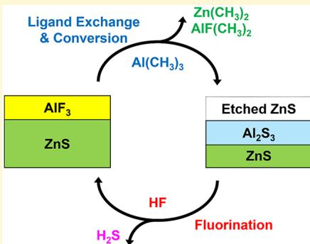

# I. INTRODUCTION

Atomic layer etching (ALE) is based on sequential, self- limiting surface modification and volatile release reactions. The two main types of ALE are plasma ALE and thermal ALE. Plasma ALE achieves anisotropic ALE based on energetic ion and neutral atoms to remove the modified surface by sputtering. Thermal ALE obtains isotropic ALE using gaseous reactants. Thermal ALE acts as the reverse of atomic layer deposition (ALD). Many materials, such as various oxides, nitrides, metals, and semiconductors, have been successfully etched using thermal ALE methods.

Almost no sulfide materials have been etched using ALE methods. The main exception is  $\mathrm{MoS}_2$  because of its importance in nanoscale transition metal dichalcogenide (TMD) devices.  $\mathrm{MoS}_2$  ALE has been performed using mostly plasma ALE methods. These methods include plasma oxidation or chlorination for surface modification followed by volatile release of the modified surface layer using either annealing,  $\mathrm{Ar^{+}}$  sputtering, or dipping in  $\mathrm{H}_2\mathrm{O}$ . One thermal ALE method for  $\mathrm{MoS}_2$  ALE was recently introduced based on sequential  $\mathrm{MoF}_6$  and  $\mathrm{H}_2\mathrm{O}$  exposures. Apart from

these plasma and thermal ALE investigations on  $\mathrm{MoS_2}$ , there are no other reported sulfide ALE processes.

In addition to  $\mathrm{MoS_2}$  nanoscale transistors,26 sulfides are important in photovoltaics, energy storage, and photonics.27 In particular, zinc sulfide  $(ZnS)$  is a wide- bandgap II- VI semiconductor material that is useful for electroluminescent (EL) devices.28 ZnS is also utilized as a transparent conductor, photodetector, and photocatalyst.29,30 ZnS etching processes are required to fabricate the ZnS devices. Many plasma etching methods have been developed for ZnS etching based on chlorine, hydrogen, or hydrocarbon plasmas.31- 33 ZnS etching has also been reported using spontaneous thermal etching with 1,1,1,5,5,5- hexafluoroacetylacetone (hfacH) at  $200^{\circ}\mathrm{C}$ .34 However, there have been no previous reports for thermal ZnS ALE that could provide much more precise control of ZnS etching.

The chemistry for thermal ZnS ALE could be defined using fluorination and ligand- exchange reactions using hydrogen fluoride (HF) and trimethylaluminum (TMA). HF could fluorinate ZnS to  $\mathrm{ZnF_2}$ . Subsequently, TMA could undergo ligand exchange with  $\mathrm{ZnF_2}$  to form  $\mathrm{Zn(CH_3)_2}$  and  $\mathrm{AlF(CH_3)_2}$  ligand- exchange products. These fluorination and ligand- exchange reactions can be written as

$$
\mathrm{ZnS} + 2\mathrm{HF}(\mathrm{g})\rightarrow \mathrm{ZnF}_2 + \mathrm{H}_2\mathrm{S}(\mathrm{g}) \tag{1}
$$

$$
\mathrm{ZnF}_2 + 2\mathrm{Al}(\mathrm{CH}_3)_3(\mathrm{g})\rightarrow 2\mathrm{AlF}(\mathrm{CH}_3)_2(\mathrm{g}) + \mathrm{Zn}(\mathrm{CH}_3)_2(\mathrm{g})
$$

A schematic showing these fluorination and ligand- exchange reactions is given in Figure 1. However, the fluorination of ZnS to  $\mathrm{ZnF_2}$  is not expected to be a thermochemically favorable reaction. Equation 1 has a predicted standard free energy change of  $\Delta G^{\circ} = +9.0$  kcal at  $300^{\circ}\mathrm{C}$ .35 The fluorination and ligand- exchange mechanism could be restricted by the initial fluorination of ZnS to  $\mathrm{ZnF_2}$ .

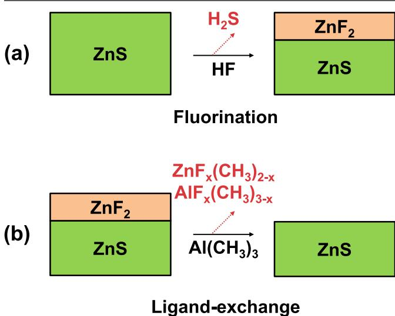  
Figure 1. Proposed mechanism of ZnS ALE using HF and TMA as reactants based on (a) fluorination and (b) ligand-exchange reactions.

Alternatively, thermal ZnS ALE could proceed by a conversion mechanism.10 In previous studies, this conversion mechanism of  $\mathrm{ZnS}$  or  $\mathrm{ZnO}$  by TMA was considered to be etching because the amount of Zn measured by X- ray fluorescence or mass of  $\mathrm{ZnO}$  by quartz crystal microbalance was decreased after TMA exposure.36,37 However, a recent study using in situ analyses has revealed that  $\mathrm{ZnO}$  was converted to  $\mathrm{Al}_2\mathrm{O}_3$  by TMA.38 These studies suggest that other materials may also undergo conversion by TMA.38

In the conversion mechanism, TMA can convert  $\mathrm{ZnS}$  to  $\mathrm{Al}_2\mathrm{S}_3$ . Then HF could fluorinate  $\mathrm{Al}_2\mathrm{S}_3$  to form  $\mathrm{AlF}_3$ . Subsequently, TMA could undergo ligand exchange with  $\mathrm{AlF}_3$  to form  $\mathrm{Zn(CH_3)_2}$  and  $\mathrm{AlF(CH_3)_2}$  ligand- exchange products. After volatilizing the  $\mathrm{AlF}_3$  layer, the TMA could proceed to convert more underlying  $\mathrm{ZnS}$  to  $\mathrm{Al}_2\mathrm{S}_3$ . The conversion, fluorination, and ligand- exchange reactions can be written as

$$
3\mathrm{ZnS} + 2\mathrm{Al}(\mathrm{CH}_3)_3(\mathrm{g})\rightarrow \mathrm{Al}_2\mathrm{S}_3 + 3\mathrm{Zn}(\mathrm{CH}_3)_2(\mathrm{g}) \tag{3}
$$

$$
\mathrm{Al}_2\mathrm{S}_3 + 6\mathrm{HF}(\mathrm{g})\rightarrow 2\mathrm{AlF}_3 + 3\mathrm{H}_2\mathrm{S}(\mathrm{g}) \tag{4}
$$

$$
\mathrm{AlF}_3 + \mathrm{Al}(\mathrm{CH}_3)_3(\mathrm{g})\rightarrow \mathrm{AlF}_2(\mathrm{CH}_3) + \mathrm{AlF}(\mathrm{CH}_3)_2(\mathrm{g}) \tag{5}
$$

A schematic showing these conversion, fluorination, and ligand- exchange reactions is given in Figure 2. However, the

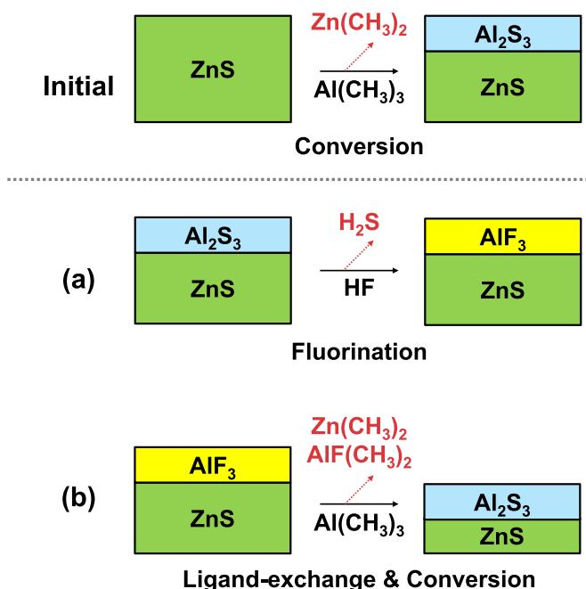  
Figure 2. Proposed mechanism of  $\mathrm{ZnS}$  ALE using HF and TMA as reactants based on initial conversion followed by (a) fluorination and (b) ligand-exchange and conversion reactions.

conversion of  $\mathrm{ZnS}$  to  $\mathrm{Al}_2\mathrm{S}_3$  is not expected to be a thermochemically favorable reaction. Equation 3 has a standard free energy change of  $\Delta G^{\circ} = +53.4$  kcal at  $300^{\circ}\mathrm{C}$ .35 In contrast, the fluorination of  $\mathrm{Al}_2\mathrm{S}_3$  to  $\mathrm{AlF}_3$  is predicted to be a thermochemically favorable reaction. Equation 4 has a standard free energy change of  $\Delta G^{\circ} = - 133.3$  kcal at  $300^{\circ}\mathrm{C}$ .35 Based on the thermochemical predictions, the conversion, fluorination, and ligand- exchange mechanism could be prevented by the unfavorable conversion of  $\mathrm{ZnS}$  to  $\mathrm{Al}_2\mathrm{S}_3$ .

In this paper,  $\mathrm{ZnS}$  ALE was studied by in situ spectroscopic ellipsometry (SE) and quadruple mass spectrometry (QMS) using HF and TMA as the reactants. The etch rates of  $\mathrm{ZnS}$  ALE were characterized by in situ SE at various process temperatures and reactant exposures. In situ QMS identified the volatile species that were produced during the sequential HF and TMA exposures. To clarify the chemical mechanism, QMS studied fresh  $\mathrm{ZnS}$  powder initially exposed to either HF

or TMA. These QMS investigations with fresh  $\mathrm{ZnS}$  powder determined whether HF alone could fluorinate  $\mathrm{ZnS}$  or whether TMA must first convert  $\mathrm{ZnS}$  to  $\mathrm{Al}_2\mathrm{S}_3$ . In addition, the surface roughness was measured by AFM to determine if surface smoothing could be achieved by  $\mathrm{ZnS}$  ALE.

# II. EXPERIMENTAL SECTION

The thermal ALE experiments were conducted in a V- shaped viscous flow reactor. The reactor was enclosed in a ceramic heater to maintain the process temperature. A schematic of this V- shaped reactor has been presented earlier. The reactor was pumped with a mechanical rotary vane pump (2010C1, Pfeiffer). The base pressure of the reactor was maintained at 1 Torr, with a constant flow of ultrahigh- purity grade (UHP) nitrogen  $(\mathrm{N}_2)$  gas  $(99.999\%)$  (Airgas).

The  $\mathrm{ZnS}$  ALD films used for the  $\mathrm{ZnS}$  ALE experiments were grown on p- type silicon (Si) wafer (Silicon Valley Microelectronics, Inc.) using diethylzinc (DEZ)  $(\geq 52\mathrm{wt}\% \mathrm{Zn}$  basis, MilliporeSigma) and hydrogen sulfide  $(\mathrm{H}_2\mathrm{S})$ $(\geq 99.5\%)$  MilliporeSigma) as the reactants. Both precursors were maintained at room temperature  $(\sim 25^{\circ}\mathrm{C})$ . Before loading into the reactor, the Si samples were rinsed by acetone, isopropanol (IPA), and deionized water sequentially to remove surface contaminants and then blown dry using UHP nitrogen  $(99.999\%)$  (Airgas). During  $\mathrm{ZnS}$  ALD, the DEZ and  $\mathrm{H}_2\mathrm{S}$  pressures were  $100\mathrm{mTorr}$  and precursor exposure and purge times were 1 and  $20\mathrm{s}$  respectively.

$\mathrm{ZnS}$  ALE was performed using trimethylaluminum (TMA)  $(97\%)$  MilliporeSigma) and hydrogen fluoride (HF), derived from HF- pyridine  $(\mathrm{HF}\sim 70\mathrm{wt}\%)$  MilliporeSigma), as the reactants. The  $\mathrm{ZnS}$  ALE was conducted after  $\mathrm{ZnS}$  ALD without exposing the  $\mathrm{ZnS}$  ALD films to ambient air. Both reactants were maintained at room temperature. The TMA and HF pressures were 40 and  $45\mathrm{mTorr}$  respectively. The  $\mathrm{ZnS}$  ALE process started with HF exposures first and then with TMA exposures. All of the  $\mathrm{ZnS}$  etch rates were obtained using  $\mathrm{ZnS}$  ALD films grown at  $100^{\circ}\mathrm{C}$  unless noted otherwise.

A spectroscopic ellipsometer (M- 2000UI, J.A. Woollam) was utilized at an incident angle of  $70^{\circ}$  for in situ monitoring of the thin film thickness. The wavelength range for the ellipsometric measurements was 245 to  $1690\mathrm{nm}$ . The data acquisition was performed  $10\mathrm{s}$  after each reactant exposure. For the refractive index measurements, ex situ ellipsometric measurements were conducted on an automated stage by varying the incident angle from  $65^{\circ}$  to  $70^{\circ}$  and  $75^{\circ}$ . After data acquisition, the thickness and refractive index of the  $\mathrm{ZnS}$  films were characterized using CompleteEASE software (J.A. Woollam) employing a Sellmeier model.

The QMS studies were performed in a custom- built reactor using  $\mathrm{ZnS}$  powder samples. A detailed description of this reactor has been given previously. The two reactant lines were isolated until the reactants reached the  $\mathrm{ZnS}$  powder bed. The  $\mathrm{ZnS}$  powder  $(99.9\%)$  average particle size  $\sim 5\mu \mathrm{m}$  (US Research Nanomaterials, Inc.) was housed in a stainless- steel enclosure with a stainless- steel mesh. Before the powder was loaded, the chamber was exposed to sequential cycles of HF and TMA to initialize the reactor walls. The etching of  $\mathrm{ZnS}$  powder was conducted at  $275^{\circ}\mathrm{C}$ . The  $\mathrm{ZnS}$  powder was left in the reactor for at least  $12\mathrm{h}$  at a low for removal of adsorbed water prior to the reactant exposures.

The volatile etch products were formed in a  $\mathrm{N}_2$  background gas at a pressure of  $\sim 1.5$  Torr in the sample holder. The partial pressure of each reactant was approximately 1 Torr. The  $\mathrm{N}_2$ , reactant, and product gases expanded through an aperture into a low- pressure differentially pumped region to form a molecular beam. The products in the molecular beam then passed through a skimmer into a second differentially pumped region that housed the quadrupole mass spectrometer (Extrel, MAX-QMS Flanged Mounted System). An electron ionization energy of  $70\mathrm{eV}$  was used for the QMS experiments.

To characterize the crystallinity and density of the film, grazing incidence X- ray diffraction (GI- XRD) and X- ray reflectivity (XRR) were conducted using an X- ray diffractometer (Bede D1, Jordan

Valley Semiconductors). The XRD measurements employed radiation from  $\mathrm{CuK}\alpha$  at  $\lambda = 1.54\mathrm{\AA}$ . The X- ray tube filament voltage and current were  $40\mathrm{kV}$  and  $35\mathrm{mA}$ , respectively. The incident angle of the X- ray was  $0.3^{\circ}$ . The XRR scan range was  $300 - 7000$  arcsec with a 5 arcsec step size. The REFS software package from Jordan Valley Semiconductors was used for the XRR fitting.

The surface roughness of  $\mathrm{ZnS}$  before and after ALE was characterized using atomic force microscopy (AFM) (NX- 10, Park Systems). For the surface roughness analysis, a  $30\mathrm{nm}$  thick  $\mathrm{ZnS}$  ALD film was grown at  $100^{\circ}\mathrm{C}$ . The AFM image was recorded using noncontact mode (NCM) with a scan rate of  $1\mathrm{Hz}$  and a stage- mounted PPP- NCHR (Nanosensors) probe. The average RMS roughness was obtained using AFM images from three different positions for each sample.

# III. RESULTS AND DISCUSSION

A. Spectroscopic Ellipsometry Measurements. The  $\mathrm{ZnS}$  thin film was sequentially exposed to HF and TMA precursors at  $300^{\circ}\mathrm{C}$ . Figure 3 shows the  $\mathrm{ZnS}$  thickness

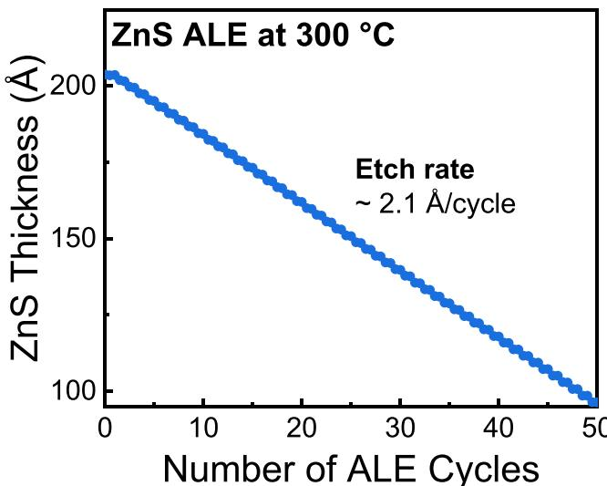  
Figure 3. Thickness of  $\mathrm{ZnS}$  film versus number of  $\mathrm{ZnS}$  ALE cycles using HF and TMA as reactants at  $300^{\circ}\mathrm{C}$ . Initial  $\mathrm{ZnS}$  ALD films were grown at  $100^{\circ}\mathrm{C}$ .

measured by in situ ellipsometry after every exposure for 50 ALE cycles. The  $\mathrm{ZnS}$  films were grown using  $\mathrm{ZnS}$  ALD at  $100^{\circ}\mathrm{C}$ . The initial  $\mathrm{ZnS}$  film thickness was  $203\mathrm{\AA}$ . The film thickness decreased linearly versus the number of ALE cycles. The  $\mathrm{ZnS}$  film thickness was  $96\mathrm{\AA}$  after 50 ALE cycles. The etch rate during this  $\mathrm{ZnS}$  ALE process was  $2.1\mathrm{\AA}$  cycle.

An expansion of Figure 3 during the first 5 ALE cycles is shown in Figure 4. No etch delay was observed for  $\mathrm{ZnS}$  ALE. The last exposure during  $\mathrm{ZnS}$  ALD was  $\mathrm{H}_2\mathrm{S}$ . The first exposure during  $\mathrm{ZnS}$  ALE was HF. Figure 4 shows that the main thickness reduction was observed for every HF exposure during  $\mathrm{ZnS}$  ALE. However, the reaction mechanism cannot be easily determined from ellipsometer results. Ellipsometer modeling does not explicitly account for surface species that may have different polarizability and refractive index than the underlying thin film.

In this case, the thickness loss after the HF exposures is attributed to the removal of the  $- \mathrm{CH}_3$  surface species.  $- \mathrm{CH}_3$  groups are highly polarizable. One measure of their polarizability is their Raman cross sections.  $\mathrm{C - H}$  bonds and  $- \mathrm{CH}_3$  groups have one of the highest Raman cross sections. Consequently, ellipsometry is sensitive to the addition or

Consequently, ellipsometry is sensitive to the addition or

  
Figure 4. Expansion showing thickness of  $\mathrm{ZnS}$  film during the first 5  $\mathrm{ZnS}$  ALE cycles in Figure 3.

removal of  $- \mathrm{CH}_3$  groups from the surface. Ellipsometry may interpret the addition of  $- \mathrm{CH}_3$  groups as a gain of the film thickness and the loss of  $- \mathrm{CH}_3$  groups as a loss of the film thickness.

Figure 5 shows the  $\mathrm{ZnS}$  thickness change during every reactant exposure for  $\mathrm{ZnS}$  ALE at different etching temper atures. The  $\mathrm{ZnS}$  films were grown using  $\mathrm{ZnS}$  ALE at  $100^{\circ}\mathrm{C}$ . The  $\mathrm{ZnS}$  etch rates were 1.4, 1.8, 2.0, and  $2.1\mathrm{\AA}$  cycle at 225, 250, 275, and  $300^{\circ}\mathrm{C}$ , respectively. As expected for a thermally activated process, higher etch rates are observed at higher temperatures. The lowest etching temperature was limited at  $225^{\circ}\mathrm{C}$  because the TMA and HF reactants can produce  $\mathrm{AlF}_3$  ALD when the process temperature is  $< 225^{\circ}\mathrm{C}$ .

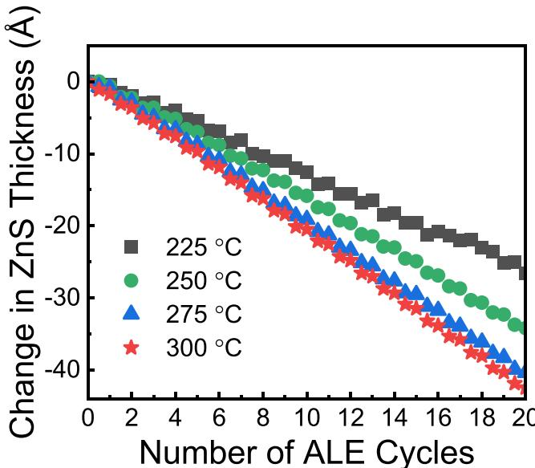  
Figure 5. Thickness change of  $\mathrm{ZnS}$  film vs number of  $\mathrm{ZnS}$  ALE cycles at 225, 250, 275, and  $300^{\circ}\mathrm{C}$ . Initial  $\mathrm{ZnS}$  ALE films were grown at  $100^{\circ}\mathrm{C}$ .

Figure 6 investigates the self- limiting nature of  $\mathrm{ZnS}$  ALE during HF and TMA exposures at  $300^{\circ}\mathrm{C}$ . The  $\mathrm{ZnS}$  films were grown using  $\mathrm{ZnS}$  ALE at  $100^{\circ}\mathrm{C}$ . Etch rates were measured versus HF and TMA exposure times by changing one precursor exposure time while keeping the other precursor exposure time constant. The purge time after each reactant exposure was  $30\mathrm{s}$ . The reaction sequence can be denoted as  $x$ - 30- 4- 30 (s) for the experiments versus HF exposure time. The reaction sequence can be denoted as  $1 - 30 - y - 30$  (s) for the experiments versus TMA exposure time. The  $\mathrm{ZnS}$  etch rate was saturated at  $2.1\mathrm{\AA}$  cycle when HF and TMA exposure times were  $>1$  and  $>3\mathrm{s}$ , respectively. This saturated etch rate indicates self- limiting surface reactions. There was no change in the etch rate when longer purge times were used from 25 to  $50\mathrm{s}$ .

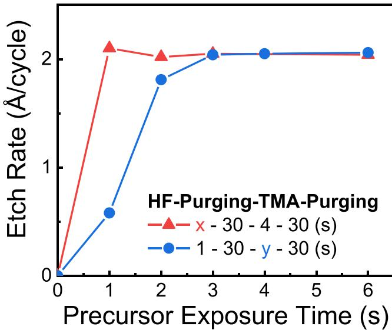  
Figure 6. Etch rate during  $\mathrm{ZnS}$  ALE vs precursor exposure time at  $300^{\circ}\mathrm{C}$ . The HF pressure was  $40\mathrm{mTorr}$  and the TMA pressure was  $45\mathrm{mTorr}$ . Initial  $\mathrm{ZnS}$  ALE films were grown at  $100^{\circ}\mathrm{C}$ .

B. Mass Spectrometry Studies. QMS experiments were performed to examine the etching products during  $\mathrm{ZnS}$  ALE of the  $\mathrm{ZnS}$  powder. Figure 7 shows the ion signal intensities over three different  $m / z$  ranges: (a) 10 to 40, (b) 60 to 100, and (c) 100 to 215. These results were obtained for the TMA and HF exposures during the fourth ALE cycle at  $275^{\circ}\mathrm{C}$ . The fourth ALE cycle was chosen to avoid etch products that could possibly be released from the native oxide on the initial  $\mathrm{ZnS}$  powder.

Figure 7a displays the ion signals for  $m / z$  values from 10 to 40 during HF and TMA exposures.  $\mathrm{CH}_4^+$  ion signals at  $m / z$  15 and  $\mathrm{CH}_4^+$  ion signals at  $m / z$  16 were observed during both the HF and TMA exposures. These results indicate that  $- \mathrm{CH}_3$  species must be present on the  $\mathrm{ZnS}$  surface after TMA exposures. The HF exposure can then release these  $- \mathrm{CH}_3$  species during surface fluorination. The  $\mathrm{CH}_x^+$  ion signals during the TMA exposures are attributed to the fragmentation of the  $\mathrm{Al(CH_3)_3}^+$  and  $\mathrm{Zn(CH_3)_2}^+$  ions.

Ion signals for  $\mathrm{H}_2\mathrm{S}$  at  $m / z$  32, 33, and 34 were also observed in Figure 7a during the HF exposure.  $\mathrm{H}_2\mathrm{S}$  is the expected product from the HF fluorination of a metal sulfide. The  $\mathrm{F}^+$  ion signal at  $m / z$  19 is also monitored during the HF exposure. Likewise,  $\mathrm{Al}^+$  at  $m / z$  27 is detected during the TMA exposure. These ion signals result from the fragmentation of the parent ions of the HF and TMA reactants.

Figure 7b shows the ion signals for  $m / z$  values from 60 to 100 during HF and TMA exposures. The ion signals are consistent with the production of  $\mathrm{Zn(CH_3)_2}$  as the primary etch product of  $\mathrm{ZnS}$  ALE during TMA exposure.  $\mathrm{Zn(CH_3)}^+$  is

  
Figure 7. QMS spectra during the fourth cycle of  $\mathrm{ZnS}$  ALE at  $275^{\circ}C$  for HF and TMA exposures in three different mass regions: (a)  $m / z$  10 to 40, (b)  $m / z$  60 to 100, and (c)  $m / z$  100 to 215.

the main ion signal in the mass spectrum of  $\mathrm{Zn(CH_3)_2}$ . The main ion signals for  $\mathrm{Zn(CH_3)^+}$  were observed at  $m / z$  79, 81, and 83 during the TMA exposure. The main ion signals for the parent  $\mathrm{Zn(CH_3)_2^+}$  were also observed at  $m / z$  94, 96, and 98 during the TMA exposure. These ion signals result primarily from the natural isotopic abundance of  $\mathrm{Zn}$ . Zinc has five stable isotopes:  $^{64}\mathrm{Zn}$  (48.63%),  $^{66}\mathrm{Zn}$  (27.90%),  $^{67}\mathrm{Zn}$  (4.10%),  $^{68}\mathrm{Zn}$  (18.75%), and  $^{70}\mathrm{Zn}$  (0.62%). These isotopes and their natural abundances together with the carbon isotopes and their natural abundances produce the observed ion intensities.

Ion signals from the higher mass region for  $m / z$  values from 100 to  $215~\mathrm{nm}$  are displayed in Figure 7c. This mass region reveals Al dimers and Al trimers that are formed by combinations of  $\mathrm{AlF(CH_3)_2}$  and  $\mathrm{Al(CH_3)_3}$ . The main ion signals are observed at  $m / z$  133, 137, 141, and 213. Nearly identical ion signals were reported earlier by mass spectrometer studies of the reaction of TMA with fluorinated  $\mathrm{Al}_2\mathrm{O}_3$  or  $\mathrm{AlF}$ . These ion signals are the characteristic etch products during  $\mathrm{Al}_2\mathrm{O}_3$  ALE using HF and TMA as the reactants.  $\mathrm{AlF(CH_3)_2}$  results from the ligand- exchange reaction between TMA and  $\mathrm{AlF}$ .  $\mathrm{AlF(CH_3)_2}$  could also be produced by a ligand- exchange reaction between TMA and  $\mathrm{ZnF}_2$ .

The results in Figure 7 confirm that the TMA and HF exposures lead to the etching of  $\mathrm{ZnS}$ . However, the mass spectra do not clearly reveal whether  $\mathrm{Zn(CH_3)_2}$  was formed by TMA converting  $\mathrm{ZnS}$  to  $\mathrm{Al}_2\mathrm{S}_3$  or whether  $\mathrm{Zn(CH_3)_2}$  was formed by TMA undergoing ligand exchange with  $\mathrm{ZnF}_2$ . To clarify the  $\mathrm{ZnS}$  ALE mechanism, fresh  $\mathrm{ZnS}$  powder was exposed only to HF to determine if  $\mathrm{H}_2\mathrm{S}$  was released during the HF exposure.

Figure 8 shows time- resolved QMS spectra of HF and  $\mathrm{H}_2\mathrm{S}$  during 5 HF exposures to fresh  $\mathrm{ZnS}$  powder at  $275^{\circ}C$ . The

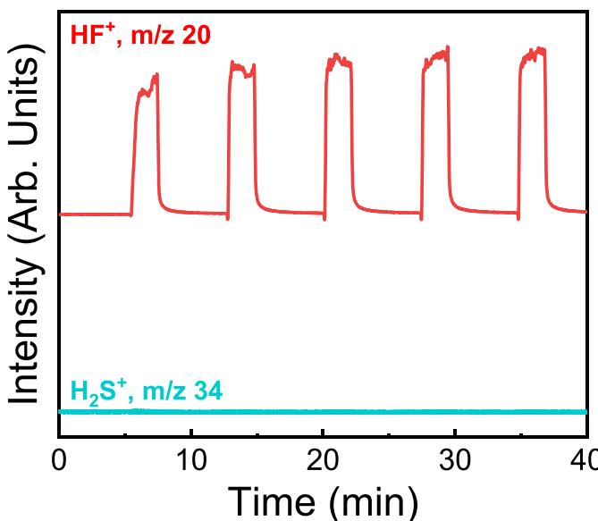  
Figure 8. Intensities for  $\mathrm{HF^{+}}$  ion signal  $(m / z20)$  and  $\mathrm{H}_2\mathrm{S}^+$  ion signal  $(m / z34)$  during 5 exposures of HF to fresh  $\mathrm{ZnS}$  powder at  $275^{\circ}C$  No intensity is observed for the  $\mathrm{H}_2\mathrm{S}^+$  ion signal.

reaction sequence was  $2\mathrm{min}$  for the HF exposure followed by  $5\mathrm{min}$  for  $\mathrm{N}_2$  purging. If  $\mathrm{ZnS}$  is fluorinated by HF exposures, then the  $\mathrm{H}_2\mathrm{S}$  signal at  $m / z$  34 should be observed during HF exposures as expected by the mechanism in Figure 1. However, the  $\mathrm{H}_2\mathrm{S}$  signal was not detected during the 5 HF exposures. These results indicate that HF is not able to fluorinate  $\mathrm{ZnS}$ . This lack of fluorination is consistent with thermochemical predictions for the fluorination of  $\mathrm{ZnS}$  by HF given in eq 1. This reaction has a positive standard free energy change of  $\mathrm{AG}^\circ = +9.0$  kcal at  $300^{\circ}\mathrm{C}$ . This positive free energy change implies a nonspontaneous reaction.

To further clarify the  $\mathrm{ZnS}$  ALE mechanism, TMA and HF were sequentially exposed to fresh  $\mathrm{ZnS}$  powder at  $275^{\circ}C$ . Figure 9 displays the time- resolved QMS spectra during 5 sequential exposures of TMA and HF. The reaction sequence was  $2\mathrm{min}$  for each reactant exposure followed by  $10\mathrm{min}$  for  $\mathrm{N}_2$  purging. The time- resolved QMS spectra are consistent with a conversion reaction during the first TMA exposure. Two ion signals at  $m / z$  83 and 98 were coincident with the first TMA exposure. These two ion signals correspond to  $^{68}\mathrm{Zn(CH_3)^+}$  and  $^{68}\mathrm{Zn(CH_3)_2^+}$ , respectively.

Because there was no fluorination prior to this TMA exposure, these two  $\mathrm{Zn(CH_3)_x^+}$  ion signal species must have been generated by the conversion of  $\mathrm{ZnS}$  to  $\mathrm{Al}_2\mathrm{S}_3$  during the TMA exposure. This conversion reaction is shown in the top panel of Figure 2. This conversion reaction is not consistent with thermochemical calculations for the conversion reaction given in eq 3. The thermochemical calculations yield a positive

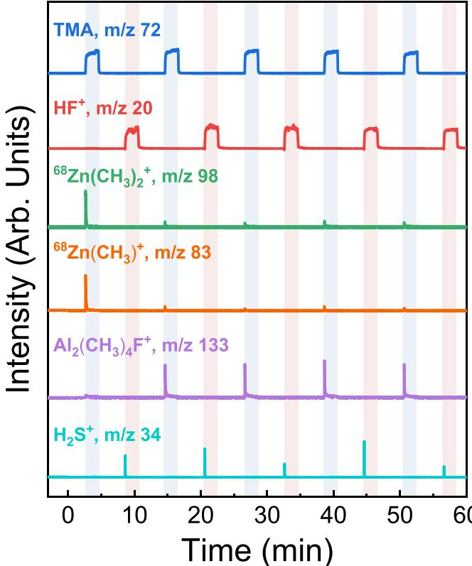  
Figure 9. Time-resolved QMS results during 5 cycles of  $\mathrm{ZnS}$  ALE using HF and TMA as reactants at  $275^{\circ}C$ .  $\mathrm{ZnS}$  ALE starts with TMA exposure. First TMA exposure produces intensity for the  $^{68}\mathrm{Zn}(\mathrm{CH}_3)_2^+$  ion signal at  $m / z$  98. HF exposure produces intensity for the  $\mathrm{H}_2\mathrm{S}^+$  ion signal at  $m / z$  34. Subsequent TMA exposures also produce intensity for the  $\mathrm{Al}_2(\mathrm{CH}_3)_4\mathrm{F}^+$  ion signal at  $m / z$  133.

standard free energy change of  $\Delta G^{\circ} = +53.4$  kcal at  $300^{\circ}\mathrm{C}$ . Although this positive free energy change predicts no reaction, the clear observation of  $\mathrm{Zn(CH_3)_2}$  by the QMS studies provides compelling evidence of a conversion reaction.

The standard free energy changes,  $\Delta G^{\circ}$ , predicted by thermochemical calculations are based on equilibrium conditions, with the reactants and products in their standard states. These conditions may be very different than the experimental situation during  $\mathrm{ZnS}$  ALE. The reactant and product pressures are not at their standard pressures during  $\mathrm{ZnS}$  ALE. In particular,  $\mathrm{ZnS}$  ALE is conducted under vacuum with continuous removal of the product pressure. This vacuum environment would facilitate the forward reaction given by eq 3. In addition, the values for solids in the thermochemical databases are based on bulk materials. These bulk values may be different from the values for the surfaces of these materials. The disagreement between the thermochemical predictions and experimental observations for  $\mathrm{ZnS}$  conversion illustrates that different models may be needed for accurate free energy calculations under nonequilibrium conditions.

The subsequent HF exposure in Figure 9 produces an ion signal at  $m / z$  34 that corresponds to  $\mathrm{H}_2\mathrm{S}^+$ . This  $\mathrm{H}_2\mathrm{S}$  product results from the fluorination of  $\mathrm{Al}_2\mathrm{S}_3$  to  $\mathrm{AlF}_3$  as illustrated in Figure 2a. This fluorination reaction is consistent with the thermochemical calculations for the fluorination reaction given by eq 4. This reaction has a negative standard free energy change of  $\Delta G^{\circ} = - 133.3$  kcal at  $300^{\circ}\mathrm{C}$ . This large negative standard free energy change indicates that fluorination of  $\mathrm{Al}_2\mathrm{S}_3$  by HF should occur spontaneously.

After the surface is fluorinated, the next TMA exposure produces an ion signal at  $m / z$  133 corresponding to an Al dimer, in addition to ion signals at  $m / z$  83 and 98 from  $^{68}\mathrm{Zn(CH_3)^+}$  and  $^{68}\mathrm{Zn(CH_3)_2^+}$ . The Al dimer is consistent with the ligand- exchange reaction between TMA and the fluorinated  $\mathrm{AlF}_3$  surface, as illustrated in Figure 2b. Additional Al dimer and trimer ion signals at  $m / z$  137, 141, and 213 were also concurrent with the Al dimer ion signal at  $m / z$  133. The ion signals from  $\mathrm{Zn(CH_3)_2}$  are attributed to the additional conversion of  $\mathrm{ZnS}$  to  $\mathrm{Al}_2\mathrm{S}_3$  by TMA.

The subsequent HF and TMA exposures in Figure 9 continue to produce the same products. A  $\mathrm{H}_2\mathrm{S}^+$  ion signal is observed during the second HF exposure.  $^{68}\mathrm{Zn(CH_3)^+}$  and  $^{68}\mathrm{Zn(CH_3)_2^+}$  ion signals together with the Al dimer and trimer ion signals are monitored during the third TMA exposure. The following HF and TMA exposures in Figure 9 release the same products with nearly identical ion intensities.

The time- resolved QMS spectra can reveal the self- limiting nature of the ALE reactions. Figure 10 shows the time evolution of the TMA exposure together with the  $^{68}\mathrm{Zn(CH_3)^+}$  and  $^{68}\mathrm{Zn(CH_3)_2^+}$  ion signals at  $m / z$  83 and 98 produced by the conversion reaction in Figure 10a and the Al dimer ion

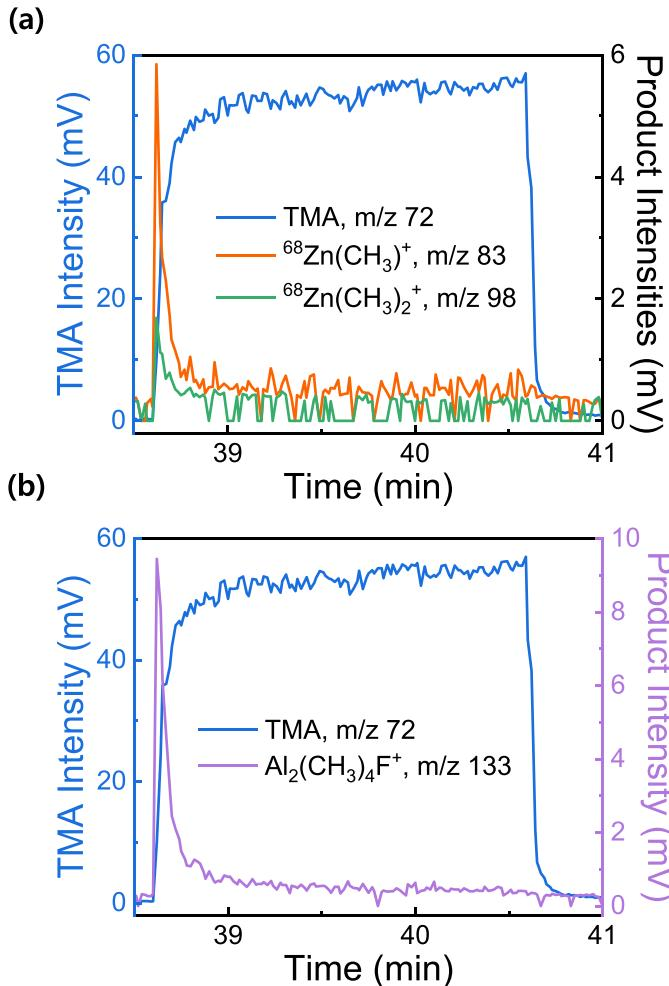  
Figure 10. Time-resolved QMS results during the fourth TMA exposure in Figure 9. (a) Ion intensities for the  $^{68}\mathrm{Zn(CH_3)_2}$  conversion product at  $m / z$  83 and 98 appear rapidly in advance of the ion intensity for the TMA reactant at  $m / z$  72. (b) Intensity for the  $\mathrm{Al}_2(\mathrm{CH}_3)_4\mathrm{F}^+$  ion signal at  $m / z$  133 appears rapidly in advance of the ion intensity for the TMA reactant at  $m / z$  72.

intensity at  $m / z$  133 from the ligand- exchange reactions in Figure 10b. The  $^{68}\mathrm{Zn(CH_3)^+}$ ,  $^{68}\mathrm{Zn(CH_3)_2^+}$ , and Al dimer ion signals increase rapidly on the rising edge of the TMA ion intensity at  $m / z$  72. This coincidence indicates that the ligand- exchange and conversion reactions take place at the same time. The  $^{68}\mathrm{Zn(CH_3)^+}$ ,  $^{68}\mathrm{Zn(CH_3)_2^+}$ , and Al dimer ion signals then decrease rapidly and go down to baseline as the TMA ion signal intensity reaches a steady value. The  $^{68}\mathrm{Zn(CH_3)^+}$  and  $^{68}\mathrm{Zn(CH_3)_2^+}$  ion intensities were used to avoid overlap between  $^{64}\mathrm{Zn(CH_3)^+}$  and a chlorine- containing species,  $\mathrm{Al^{37}Cl(CH_3)^+}$ , at  $m / z$  79.

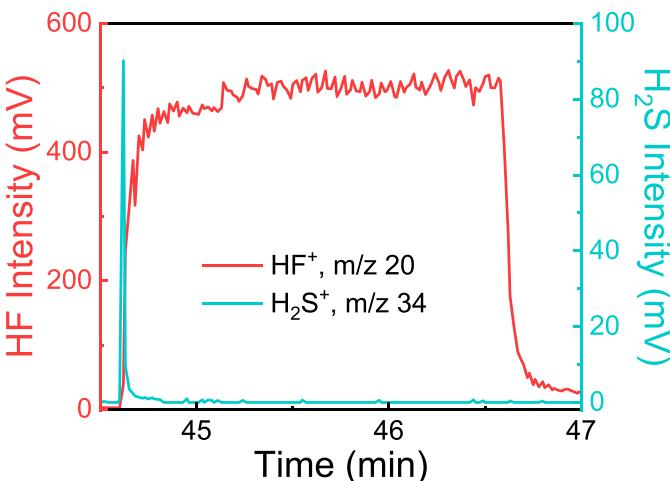  
Figure 11 displays the time evolution of the HF exposure together with the  $\mathrm{H}_2\mathrm{S}^+$  ion signal at  $m / z$  34 produced by the

fluorination of  $\mathrm{Al}_2\mathrm{S}_3$  as illustrated in Figure 2a. The fluorination of  $\mathrm{Al}_2\mathrm{S}_3$  is extremely rapid. The  $\mathrm{H}_2\mathrm{S}^+$  ion signal intensity occurs on the rising edge of the  $\mathrm{HF}^+$  ion signal intensity at  $m / z$  20. The  $\mathrm{H}_2\mathrm{S}^+$  ion signal then drops rapidly, and the  $\mathrm{HF}^+$  ion signal intensity reaches a constant level. Because the QMS data acquisition time was  $\sim 1$  s per scan, the rapid evolution of the volatile  $\mathrm{H}_2\mathrm{S}$  product produced by the fluorination reaction could not always be captured completely. This behavior may explain the fluctuation of the  $\mathrm{H}_2\mathrm{S}$  ion signal intensities observed in Figure 9.

C. ZnS ALE versus Reactant Pressure and Different Film Thicknesses. ZnS ALE was also explored at different TMA and HF reactant pressures. Figure 12 shows the measured  $\mathrm{ZnS}$  etch rates versus HF pressure at TMA pressures of 20 and 200 mTorr. The initial  $\mathrm{ZnS}$  ALD films were grown at  $100^{\circ}\mathrm{C}$ . For HF and TMA exposure times of 1 and  $4\mathrm{~s}$ , respectively, the etch rate saturated at an etch rate of  $1.8\mathrm{~A / }$  cycle for HF pressure above 150 mTorr when the TMA pressure was 20 mTorr. In comparison, the etch rate saturated at an etch rate of  $2.5\mathrm{~A / }$  cycle for HF pressures above 150 mTorr when the TMA pressure was 200 mTorr.

The increase in the  $\mathrm{ZnS}$  etch rate for higher TMA pressures is attributed to the higher conversion of  $\mathrm{ZnS}$  to  $\mathrm{Al}_2\mathrm{S}_3$  at higher TMA pressures. The conversion layer is known to form a diffusion barrier on the surface of the converted material. In this case, the  $\mathrm{Al}_2\mathrm{S}_3$  conversion layer acts as a diffusion barrier for the conversion of additional  $\mathrm{ZnS}$ . Similar results have been observed for the fluorination of  $\mathrm{Al}_2\mathrm{O}_3$  at different HF pressures. The fluorination appears to self- limit at various

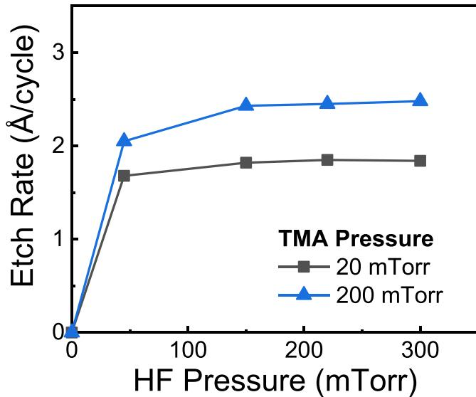  
Figure 12.  $\mathrm{ZnS}$  etch rates vs temperature for  $\mathrm{ZnS}$  ALD films grown at different temperatures.

HF pressures because HF forms an  $\mathrm{AlF}_3$  surface layer that acts as a diffusion barrier for further fluorination. The fluorination proceeds according to the HF exposure in units of Torr.s. The kinetics of  $\mathrm{ZnS}$  conversion to  $\mathrm{Al}_2\mathrm{S}_3$  are also similar to those of silicon oxidation. Silicon oxidation is limited by the formation of a  $\mathrm{SiO}_2$  diffusion barrier on the silicon surface. The oxidation layer thickness can be described by the Deal- Grove model.

The  $\mathrm{ZnS}$  etch rate was also observed to be slightly dependent on the growth temperature during  $\mathrm{ZnS}$  ALD. Figure 13 shows the  $\mathrm{ZnS}$  etch rate versus temperature for  $\mathrm{ZnS}$

  
Figure 11. Time-resolved QMS results during 4th HF exposure are shown in Figure 9. Intensity for the  $\mathrm{H}_2\mathrm{S}^+$  ion signal at  $m / z$  20 appears rapidly in advance of intensity for the  $\mathrm{HF}^+$  reactant at  $m / z$  20. Figure 13.  $\mathrm{ZnS}$  etch rates vs temperature for  $\mathrm{ZnS}$  ALD films grown at different temperatures.

ALD films grown at 100, 200, and  $300^{\circ}\mathrm{C}$ . The  $\mathrm{ZnS}$  etch rate at  $300^{\circ}\mathrm{C}$  was 1.4, 1.0, and  $0.8\mathrm{~A / }$  cycle for  $\mathrm{ZnS}$  ALD films grown at 100, 200, and  $300^{\circ}\mathrm{C}$ , respectively. This dependence of the  $\mathrm{ZnS}$  etch rate on  $\mathrm{ZnS}$  ALD growth temperature is attributed to the higher  $\mathrm{ZnS}$  film density at higher temperature.

The film density is proportional to refractive index through the Lorentz- Lorenz relationship. The refractive index of the

ZnS films was characterized using ex situ ellipsometry. The ZnS refractive index at  $632.8 \mathrm{nm}$  increased versus the  $\mathrm{ZnS}$  ALD temperature. The refractive indices increased from  $n =$  2.198 at  $100^{\circ}\mathrm{C},$  to  $n = 2.211$  at  $200^{\circ}\mathrm{C},$  and to  $n = 2.218$  at  $300^{\circ}\mathrm{C}$ . The mass densities of the  $\mathrm{ZnS}$  ALD films grown at 100, 200, and  $300^{\circ}\mathrm{C}$  measured by XRR were 3.98, 4.01, and  $4.04 \mathrm{g / cm}^3$ , respectively. The dependence of the etch rate on the film density may result from the diffusion required for conversion. The  $\mathrm{Al(CH_3)_3}$  reactant needs to diffuse into the  $\mathrm{ZnS}$  film for the conversion of  $\mathrm{ZnS}$  to  $\mathrm{Al}_2\mathrm{S}_3$ . The  $\mathrm{ZnS}$  films with a higher density may have slower diffusion rates.

Another possibility to explain the lower etch rates for the  $\mathrm{ZnS}$  ALD films grown at higher temperatures could be related to the  $\mathrm{ZnS}$  stoichiometry. The  $\mathrm{ZnS}$  composition was characterized using X- ray spectroscopy (XPS). The  $\mathrm{ZnS}$  ratios for  $\mathrm{ZnS}$  ALD films grown at 100 and  $300^{\circ}\mathrm{C}$  were 52:48 and 45:55, respectively. Similar amounts of  $\mathrm{O}$  and carbon were observed for both samples. This result for more S- rich  $\mathrm{ZnS}$  ALD films at higher growth temperatures was also reported earlier. The more S- rich  $\mathrm{ZnS}$  films may have a lower etch rate.

The  $\mathrm{ZnS}$  etch rates may also be dependent on the crystallinity of the  $\mathrm{ZnS}$  film. The crystallinity of  $\mathrm{ZnS}$  for different film thicknesses was examined using XRD. Figure 14

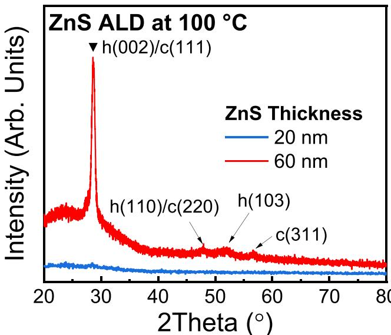  
Figure 14. XRD spectra of  $\mathrm{ZnS}$  ALD films grown at  $100^{\circ}\mathrm{C}$  with thicknesses of 20 and  $60 \mathrm{nm}$ . Crystallinity is observed for the  $\mathrm{ZnS}$  ALD film with a thickness of  $60 \mathrm{nm}$ .

shows XRD spectra of  $\mathrm{ZnS}$  ALD films grown at  $100^{\circ}\mathrm{C}$  for thicknesses of 20 and  $60 \mathrm{nm}$ . The  $\mathrm{ZnS}$  films with a thickness of  $20 \mathrm{nm}$  may be amorphous because they have no diffraction peaks. In contrast, the  $\mathrm{ZnS}$  films with a thickness of  $60 \mathrm{nm}$  show a very sharp diffraction peak at  $28.6^{\circ}$ . This diffraction peak may correspond to either  $\mathrm{h}(002)$  or  $\mathrm{c}(111)$  or both because the  $\mathrm{ZnS}$  crystalline peaks of  $\mathrm{h}(002)$  and  $\mathrm{c}(111)$  overlap each other. In addition to this main diffraction peak, three smaller peaks were also detected at  $47.6^{\circ}$ ,  $51.9^{\circ}$ , and  $56.6^{\circ}$ . These diffraction peaks correspond to  $\mathrm{h}(110) / \mathrm{c}(220)$ ,  $\mathrm{h}(103)$ , and  $\mathrm{c}(311)$ , respectively. From this XRD analysis, the  $\mathrm{ZnS}$  ALD film with a thickness of  $60 \mathrm{nm}$  has a crystalline structure.

To determine if the  $\mathrm{ZnS}$  etch rates were also dependent on  $\mathrm{ZnS}$  ALD film thickness, the  $\mathrm{ZnS}$  etch rates were measured for

$\mathrm{ZnS}$  ALD films grown at  $100^{\circ}\mathrm{C}$  with different initial thickness. Figure 15 shows the  $\mathrm{ZnS}$  ALD for  $\mathrm{ZnS}$  films with initial

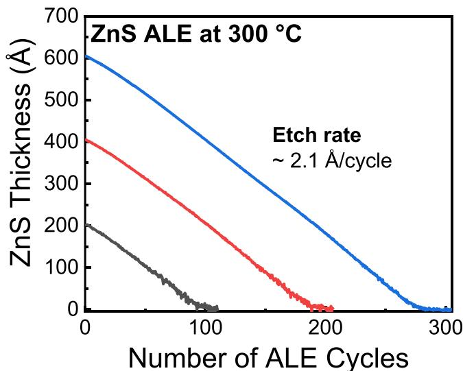  
Figure 15. Thickness of  $\mathrm{ZnS}$  films versus number of  $\mathrm{ZnS}$  ALD cycles using HF and TMA as reactants at  $300^{\circ}\mathrm{C}$ . Initial  $\mathrm{ZnS}$  film thicknesses were 20, 40, and  $60 \mathrm{nm}$ . Initial  $\mathrm{ZnS}$  ALD films were grown at  $100^{\circ}\mathrm{C}$ .

thicknesses of 20, 40, and  $60 \mathrm{nm}$ . The etch rate was the same at  $2.1 \mathrm{A / cycle}$  independent of the initial thickness of the  $\mathrm{ZnS}$  ALD film. These results argue that either the  $\mathrm{ZnS}$  etch rate is not dependent on film crystallinity or the  $\mathrm{ZnS}$  films with thickness of  $20 \mathrm{nm}$  were too thin for sufficient sensitivity to determine their crystallinity. The etch rate is expected to be dependent on the film crystallinity based on earlier results for amorphous and crystalline  $\mathrm{Al}_2\mathrm{O}_3$ ,  $\mathrm{HfO}_2$ , and  $\mathrm{ZrO}_2$  films. The amorphous films of these materials displayed higher etch rates than the corresponding crystalline films.

Figure 16 shows the RMS roughness of the  $\mathrm{ZnS}$  surface versus the number of ALE cycles. The roughness of as- deposited  $30 \mathrm{nm}$  thick  $\mathrm{ZnS}$  films grown at  $100^{\circ}\mathrm{C}$  was  $7.4 \mathrm{A}$ .

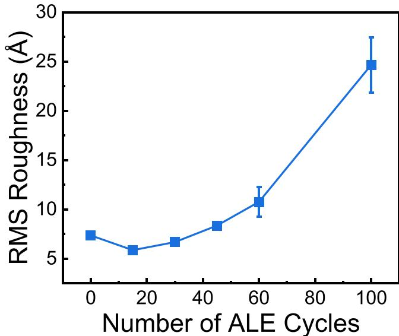  
Figure 16. Average RMS roughness of  $\mathrm{ZnS}$  ALD films grown at  $100^{\circ}\mathrm{C}$  and after  $\mathrm{ZnS}$  ALD at  $300^{\circ}\mathrm{C}$ . The  $\mathrm{ZnS}$  film thickness before  $\mathrm{ZnS}$  ALD was  $30 \mathrm{nm}$ .

After 15 ALE cycles, the roughness was slightly decreased to  $5.9\mathrm{\AA}$  However, after 30 ALE cycles, the RMS roughness gradually increased and reached an RMS roughness of  $24.7\mathrm{\AA}$  at 100 ALE cycles. Previous ALE studies have reported surface smoothing versus number of ALE cycles.7,10,11,58- 60 In this study, the surface roughness initially decreased and then increased after 30 ALE cycles. Similar behavior was observed during nickel ALE.16

The increase in surface roughness with a larger number of ALE cycles could result from the polycrystalline nature of the  $\mathrm{ZnS}$  ALD films. Although the XRD spectrum of  $30~\mathrm{nm}$  thick  $\mathrm{ZnS}$  ALD films grown at  $100^{\circ}\mathrm{C}$  did not show noticeable XRD peaks, the  $\mathrm{ZnS}$  ALD film could form nanocrystals while the sample was annealing to  $300^{\circ}\mathrm{C}$  for the subsequent ALE. Because etch rates have been shown to be dependent on crystallinity,9,57 once the  $\mathrm{ZnS}$  film forms crystallites, the etch rate may change depending on the crystallinity. Etching at grain boundaries between crystalline grains could also lead to a larger surface roughness.

# IV. CONCLUSIONS

$\mathrm{ZnS}$  thermal ALE was accomplished using sequential exposures of  $\mathrm{Al(CH_3)_3}$  and HF. In situ spectroscopic ellipsometry studies were employed to measure the  $\mathrm{ZnS}$  etch rates for  $\mathrm{ZnS}$  ALD films grown at  $100^{\circ}\mathrm{C}$ . The etch rates increased with temperature from 1.4 at  $225^{\circ}\mathrm{C}$  to 2.1 at  $300^{\circ}\mathrm{C}$ . In addition, experiments at  $300^{\circ}\mathrm{C}$  revealed that the etch rate for  $\mathrm{ZnS}$  ALE was self- limiting at longer TMA and HF exposures.

Several mechanisms are possible for thermal  $\mathrm{ZnS}$  ALE using TMA and HF.  $\mathrm{ZnS}$  could be fluorinated by HF to produce  $\mathrm{ZnF}$ . Subsequently,  $\mathrm{ZnF}$ , could undergo ligand exchange with  $\mathrm{Al(CH_3)_3}$  to yield  $\mathrm{Zn(CH_3)_2}$  etch products. Alternatively, TMA could first convert  $\mathrm{ZnS}$  to  $\mathrm{Al}_2\mathrm{S}_3$ . Then HF could fluorinate  $\mathrm{Al}_2\mathrm{S}_3$  to produce  $\mathrm{AlF}_3$  and  $\mathrm{H}_2\mathrm{S}$ . Ligand exchange between  $\mathrm{AlF}_3$  and TMA would then produce various  $\mathrm{AlF(CH_3)_2}$  etch products.

The conversion mechanism for  $\mathrm{ZnS}$  ALE was confirmed using in situ QMS studies. The QMS investigations observed that TMA exposures on initial  $\mathrm{ZnS}$  substrates released  $\mathrm{Zn(CH_3)_2}$  products as expected for the conversion of  $\mathrm{ZnS}$  to  $\mathrm{Al}_2\mathrm{S}_3$ . In addition, HF exposure on the initial  $\mathrm{ZnS}$  substrates did not produce  $\mathrm{H}_2\mathrm{S}$  products. However, after  $\mathrm{Al(CH_3)_3}$  exposures on  $\mathrm{ZnS}$ ,  $\mathrm{H}_2\mathrm{S}$  was monitored during HF exposures because  $\mathrm{Al(CH_3)_3}$  converts  $\mathrm{ZnS}$  to  $\mathrm{Al}_2\mathrm{S}_3$ . Time- dependent QMS studies also showed that the conversion, ligand- exchange, and fluorination reactions during  $\mathrm{ZnS}$  ALE were self- limiting.

Larger  $\mathrm{Al(CH_3)_3}$  exposures led to higher  $\mathrm{ZnS}$  etch rates because the  $\mathrm{Al}_2\mathrm{S}_3$  conversion layer thickness is dependent on  $\mathrm{Al(CH_3)_3}$  exposures. Because HF can fluorinate only the converted  $\mathrm{Al}_2\mathrm{S}_3$  layer thickness, larger HF pressures had a small effect on the  $\mathrm{ZnS}$  etch rate. The  $\mathrm{ZnS}$  etch rate was also observed to be dependent on the  $\mathrm{ZnS}$  ALD growth temperature. The  $\mathrm{ZnS}$  etch rate at  $300^{\circ}\mathrm{C}$  was 1.4, 1.0, and  $0.8\mathrm{\AA}$  cycle for  $\mathrm{ZnS}$  ALD films grown at 100, 200, and  $300^{\circ}\mathrm{C}$ , respectively.

These lower  $\mathrm{ZnS}$  etch rates for  $\mathrm{ZnS}$  ALD films grown at higher temperatures may result from the larger density or higher sulfur content of the  $\mathrm{ZnS}$  ALD films grown at higher temperatures. The diffusion of TMA into  $\mathrm{ZnS}$  during the conversion reaction may be more difficult at higher  $\mathrm{ZnS}$  film densities. An increase in the  $\mathrm{ZnS}$  surface roughness was also observed after a larger number of ALE cycles. This surface roughness may be related to different etch rates for various crystalline phases or grain boundaries between the crystalline grains.

# AUTHOR INFORMATION

# Corresponding Author

Steven M. George - Department of Chemistry, University of Colorado Boulder, Boulder, Colorado 80309, United States;  $\oplus$  orcid.org/0000- 0003- 0253- 9184. Email: Steven.George@Colorado.edu

# Authors

Tuewook Nam - Department of Chemistry, University of Colorado Boulder, Boulder, Colorado 80309, United States;  $\oplus$  orcid.org/0000- 0001- 9702- 0873 Jonathan L. Partridge - Department of Chemistry, University of Colorado Boulder, Boulder, Colorado 80309, United States;  $\oplus$  orcid.org/0000- 0002- 0071- 9854

Complete contact information is available at: https://pubs.acs.org/10.1021/acs.chemmater.3c00616

# Notes

The authors declare no competing financial interest.

# ACKNOWLEDGMENTS

This work was supported in part by the Joint University Microelectronics Program (JUMP) funded by the Semiconductor Research Corporation (SRC). The V- shaped viscous flow reactor was built and the spectroscopic ellipsometer was obtained using funding from Sierra Nevada Corporation. The authors thank Kenneth Smith and Don David from the University of Colorado Integrated Instrument Development Facility for their help in the construction of the V- shaped viscous flow reactor. Funding for the QMS reactor and the QMS investigations was provided by Lam Research. The authors also thank Dr. Andrew Cavanagh for the XPS analysis and Dr. Jessica Murdzek and Rebecca Hirsch for the XRD and XRR analyses.

# REFERENCES

1) Carver, C. T.; Plombon, J. J.; Romero, P. E.; Suri, S.; Tronic, T. A.; Turkot, R. B. Atomic Layer Etching: An Industry Perspective. ECS J. Solid State Sci. Technol. 2015, 4, N5005-N5009. 
2) George, S. M. Mechanisms of Thermal Atomic Layer Etching. Acc. Chem. Res. 2020, 53, 1151-1160. 
3) Kanarik, K. J.; Lill, T.; Hudson, E. A.; Sriraman, S.; Tan, S.; Marks, J.; Vahedi, V.; Gottscho, R. A. Overview of Atomic Layer Etching in the Semiconductor Industry. J. Vac. Sci. Technol. A 2015, 33, No. 020802. 
4) Fischer, A.; Routzahn, A.; George, S. M.; Lill, T. Thermal Atomic Layer Etching: A Review. J. Vac. Sci. Technol. A 2021, 39, No. 030801. 
5) Faraz, T.; Roozeboom, F.; Knoops, H. C. M.; Kessels, W. M. M. Atomic Layer Etching: What Can We Learn from Atomic Layer Deposition? ECS J. Solid State Sci. Technol. 2015, 4, N5023-N5032. 
6) DuMont, J. W.; Marquardt, A. E.; Cano, A. M.; George, S. M. Thermal Atomic Layer Etching of  $\mathrm{SiO}_2$  by a "Conversion-Etch" Mechanism Using Sequential Reactions of Trimethylaluminum and Hydrogen Fluoride. ACS Appl. Mater. Interfaces 2017, 9, 10296-10307. 
7) Lee, Y.; George, S. M. Thermal Atomic Layer Etching of  $\mathrm{Al}_2\mathrm{O}_3$ ,  $\mathrm{HfO}_2$ , and  $\mathrm{ZrO}_2$  Using Sequential Hydrogen Fluoride and Dimethylaluminum Chloride Exposures. J. Phys. Chem. C 2019, 123, 18455-18466.

(8) Lee, Y.; Johnson, N. R.; George, S. M. Thermal Atomic Layer Etching of Gallium Oxide Using Sequential Exposures of HF and Various Metal Precursors. Chem. Mater. 2020, 32, 5937-5948.  
(9) Murdzek, J. A.; George, S. M. Effect of Crystallinity on Thermal Atomic Layer Etching of Hafnium Oxide, Zirconium Oxide, and Hafnium Zirconium Oxide. J. Vac. Sci. Technol. A 2020, 38, No. 022608.  
(10) Zywotko, D. R.; George, S. M. Thermal Atomic Layer Etching of ZnO by a "Conversion-Eth" Mechanism Using Sequential Exposures of Hydrogen Fluoride and Trimethylaluminum. Chem. Mater. 2017, 29, 1183-1191.  
(11) Lee, Y.; George, S. M. Atomic Layer Etching of  $\mathrm{Al}_2\mathrm{O}_3$  Using Sequential, Self-Limiting Thermal Reactions with  $\mathrm{Sn(acac)}_2$  and Hydrogen Fluoride. ACS Nano 2015, 9, 2061-2070.  
(12) Johnson, N. R.; Hite, J. K.; Mastro, M. A.; Eddy, C. R.; George, S. M. Thermal Atomic Layer Etching of Crystalline GaN Using Sequential Exposures of  $\mathrm{XeF}_2$  and  $\mathrm{BCl}_3$ . Appl. Phys. Lett. 2019, 114, 243103.  
(13) Johnson, N. R.; Sun, H.; Sharma, K.; George, S. M. Thermal Atomic Layer Etching of Crystalline Aluminum Nitride Using Sequential, Self-limiting Hydrogen Fluoride and  $\mathrm{Sn(acac)}_2$  Reactions and Enhancement by  $\mathrm{H}_2$  and Ar Plasmas. J. Vac. Sci. Technol. A 2016, 34, No. 050603.  
(14) Cano, A. M.; Lii-Rosales, A.; George, S. M. Thermal Atomic Layer Etching of Aluminum Nitride Using HF or  $\mathrm{XeF}_2$  for Fluorination and  $\mathrm{BCl}_3$  for Ligand Exchange. J. Phys. Chem. C 2022, 126, 6990-6999.  
(15) Johnson, N. R.; George, S. M.  $\mathrm{WO}_3$  and W Thermal Atomic Layer Etching Using "Conversion-Fluorination" and "Oxidation-Conversion-Fluorination" Mechanisms. ACS Appl. Mater. Interfaces 2017, 9, 34435-34447.  
(16) Murdzek, J. A.; Lii-Rosales, A.; George, S. M. Thermal Atomic Layer Etching of Nickel Using Sequential Chlorination and Ligand-Addition Reactions. Chem. Mater. 2021, 33, 9174-9183.  
(17) Konh, M.; He, C.; Lin, X.; Guo, X.; Palle, V.; Opila, R. L.; Teplyakov, A. V.; Wang, Z.; Yuan, B. Molecular Mechanisms of Atomic Layer Etching of Cobalt with Sequential Exposure to Molecular Chlorine and Diketones. J. Vac. Sci. Technol. A 2019, 37, No. 021004.  
(18) Mohimi, E.; Chu, X. Q. I.; Trinh, B. B.; Babar, S.; Girolami, G. S.; Abelson, J. R. Thermal Atomic Layer Etching of Copper by Sequential Steps Involving Oxidation and Exposure to Hexafluoroacetylacetone. ECS J. Solid State Sci. Technol. 2018, 7, P491-P495.  
(19) Lu, W.; Lee, Y.; Gertsch, J. C.; Murdzek, J. A.; Cavanagh, A. S.; Kong, L.; del Alamo, J. A.; George, S. M. In Situ Thermal Atomic Layer Etching for Sub-5 nm InGaAs Multigate MOSFETs. Nano Lett. 2019, 19, 5159-5166.  
(20) Abdulagatov, A. I.; George, S. M. Thermal Atomic Layer Etching of Silicon Using  $\mathrm{O}_2$ ,  $\mathrm{HF}$ , and  $\mathrm{Al(CH}_3\mathrm{)}_3$  as the Reactants. Chem. Mater. 2018, 30, 8465-8475.  
(21) Zhu, H.; Qin, X. Y.; Cheng, L. X.; Azcat, A.; Kim, J.; Wallace, R. M. Remote Plasma Oxidation and Atomic Layer Etching of  $\mathrm{MoS}_2$ . ACS Appl. Mater. Interfaces 2016, 8, 19119-19126.  
(22) Kim, K. S.; Kim, K. H.; Nam, Y.; Jeon, J.; Yim, S.; Singh, E.; Lee, J. Y.; Lee, S. J.; Jung, Y. S.; Yeom, G. Y.; et al. Atomic Layer Etching Mechanism of  $\mathrm{MoS}_2$  for Nanodevices. ACS Appl. Mater. Interfaces 2017, 9, 11967-11976.  
(23) Lin, T. Z.; Kang, B. T.; Jeon, M. H.; Huffman, C.; Jeon, J. H.; Lee, S. J.; Han, W.; Lee, J. Y.; Lee, S. H.; Yeom, G. Y.; et al. Controlled Layer-by-Layer Etching of  $\mathrm{MoS}_2$ . ACS Appl. Mater. Interfaces 2015, 7, 15892-15897.  
(24) Chen, K. C.; Liu, C. W.; Chen, C.; Lin, S. Y. The Atomic Layer Etching of Molybdenum Disulfides Using Low-Power Oxygen Plasma. Semicond. Sci. Technol. 2019, 34, No. 045007.  
(25) Soares, J.; Mane, A. U.; Choudhury, D.; Letourneau, S.; Hues, S. M.; Elam, J. W.; Graugnard, E. Thermal Atomic Layer Etching of  $\mathrm{MoS}_2$  Using  $\mathrm{MoF}_6$  and  $\mathrm{H}_2\mathrm{O}$ . Chem. Mater. 2023, 35, 927-936.

(26) Radisavljevic, B.; Radenovic, A.; Brivio, J.; Giacometti, V.; Kis, A. Single-Layer  $\mathrm{MoS}_2$  Transistors. Nat. Nanotechnol. 2011, 6, 147-150.  
(27) Dasgupta, N. P.; Meng, X.; Elam, J. W.; Martinson, A. B. F. Atomic Layer Deposition of Metal Sulfide Materials. Acc. Chem. Res. 2015, 48, 341-348.  
(28) Smet, P. F.; Moreels, I.; Hens, Z.; Poelman, D. Luminescence in Sulfides: A Rich History and a Bright Future. Materials 2010, 3, 2834-2883.  
(29) Chandrasekaran, S.; Yao, L.; Deng, L. B.; Bowen, C.; Zhang, Y.; Chen, S. M.; Lin, Z. Q.; Peng, F.; Zhang, P. X. Recent Advances in Metal Sulfides: From Controlled Fabrication to Electrocatalytic, Photocatalytic and Photoelectrochemical Water Splitting and Beyond. Chem. Soc. Rev. 2019, 48, 4178-4280.  
(30) Xu, X.; Li, S.; Chen, J.; Cai, S.; Long, Z.; Fang, X. Design Principles and Material Engineering of ZnS for Optoelectronic Devices and Catalysis. Adv. Funct. Mater. 2018, 28, 1802029.  
(31) Orloff, G. J.; Elkind, J. L.; Koch, D. Hydrogen Based Reactive Ion Etching of Zinc Sulfide. J. Vac. Sci. Technol. A 1992, 10, 1371-1374.  
(32) Pearton, S. J.; Ren, F. Plasma Etching of ZnS, ZnSe, CdS, and CdTe in Electron-Cyclotron Resonance  $\mathrm{CH}_4 / \mathrm{H}_2 / \mathrm{Ar}$  and  $\mathrm{H}_2 / \mathrm{Ar}$  Discharges. J. Vac. Sci. Technol. B 1993, 11, 15-19.  
(33) Saitoh, T.; Yokogawa, T.; Narusawa, T. Reactive Ion-Beam Etching of ZnSe and ZnS Epitaxial Films Using  $\mathrm{Cl}_2$  Electron-Cyclotron Resonance Plasma. Appl. Phys. Lett. 1990, 56, 839-841.  
(34) Rousseau, F.; Jain, A.; Kodas, T. T.; Hampden-Smith, M.; Farr, J. D.; Muenchausen, R. Low Temperature Dry Etching of Metal Oxides and ZnS Via Formation of Volatile Metal Beta-Diketonate Complexes. J. Mater. Chem. 1992, 2, 893-894.  
(35) HSC Chemistry 9.9.2.3, Outokumpu Research Oy, Pori, Finland.  
(36) Devloo-Casier, K.; Geiregat, P.; Ludwig, K. F.; van Stiphout, K.; Vantomme, A.; Hens, Z.; Detavernier, C.; Dendooven, J. A Case Study of ALD Encapsulation of Quantum Dots: Embedding Supported CdSe/CdS/ZnS Quantum Dots in a ZnO Matrix. J. Phys. Chem. C 2016, 120, 18039-18043.  
(37) Elam, J. W.; George, S. M. Growth of ZnO/Al2O3 Alloy Films Using Atomic Layer Deposition Techniques. Chem. Mater. 2003, 15, 1020-1028.  
(38) Myers, T. J.; Cano, A. M.; Lancaster, D. K.; Clancey, J. W.; George, S. M. Conversion Reactions in Atomic Layer Processing with Emphasis on ZnO Conversion to  $\mathrm{Al}_2\mathrm{O}_3$  by Trimethylaluminum. J. Vac. Sci. Technol. A 2021, 39, No. 021001.  
(39) Junige, M.; George, S. M. Area-Selective Molecular Layer Deposition of Nylon 6,2 Polyamide Growth on Carbon and Inhibition on Silica. J. Vac. Sci. Technol. A 2021, 39, No. 023204.  
(40) Bakke, J. R.; King, J. S.; Jung, H. J.; Sinclair, R.; Bent, S. F. Atomic Layer Deposition of ZnS via in situ Production of  $\mathrm{H}_2\mathrm{S}$ . Thin Solid Films 2010, 518, 5400-5408.  
(41) Kim, Y. S.; Yun, S. J. Studies on Polycrystalline ZnS Thin Films Grown by Atomic Layer Deposition for Electroluminescent Applications. Appl. Surf. Sci. 2004, 229, 105-111.  
(42) Lancaster, D. K.; Sun, H. X.; George, S. M. Atomic Layer Deposition of  $\mathrm{Zn(O,S)}$  Alloys Using Diethylzinc with  $\mathrm{H}_2\mathrm{O}$  and  $\mathrm{H}_2\mathrm{S}$ : Effect of Exchange Reactions. J. Phys. Chem. C 2017, 121, 18643-18652.  
(43) Li, H. H. Refractive Index of  $\mathrm{ZnS}$ ,  $\mathrm{ZnSe}$ , and  $\mathrm{ZnTe}$  and Its Wavelength and Temperature Derivatives. J. Phys. Chem. Ref. Data 1984, 13, 103-150.  
(44) Partridge, J. L.; Murdzek, J. A.; Johnson, V. L.; Cavanagh, A. S.; Fischer, A.; Lill, T.; Sharma, S.; George, S. M. Thermal Atomic Layer Etching of  $\mathrm{CoO}$ ,  $\mathrm{ZnO}$ ,  $\mathrm{Fe}_2\mathrm{O}_3$ , and  $\mathrm{NiO}$  by Chlorination and Ligand Addition Using  $\mathrm{SO}_2\mathrm{Cl}_2$  and Tetramethylethylenediamine. Chem. Mater. 2023, 35, 2058-2068.  
(45) Lii-Rosales, A.; Cavanagh, A. S.; Fischer, A.; Lill, T.; George, S. M. Spontaneous Etching of Metal Fluorides Using Ligand-Exchange Reactions: Landscape Revealed by Mass Spectrometry. Chem. Mater. 2021, 33, 7719-7730.

(46) Burns, K. H.; Srivastava, P.; Elles, C. G. Absolute Cross Sections of Liquids from Broadband Stimulated Raman Scattering with Femtosecond and Picosecond Pulses. Anal. Chem. 2020, 92, 10686-10692.(47) Colles, M. J.; Griffiths, J. E. Relative and Absolute Raman Scattering Cross-Sections in Liquids. J. Chem. Phys. 1972, 56, 3384-3391.(48) Lee, Y.; DuMont, J. W.; Cavanagh, A. S.; George, S. M. Atomic Layer Deposition of  $\mathrm{AlF}_3$  Using Trimethylaluminum and Hydrogen Fluoride. J. Phys. Chem. C 2015, 119, 14185-14194.(49) DuMont, J. W.; George, S. M. Competition between  $\mathrm{Al}_2\mathrm{O}_3$  Atomic Layer Etching and  $\mathrm{AlF}_3$  Atomic Layer Deposition Using Sequential Exposures of Trimethylaluminum and Hydrogen Fluoride. J. Chem. Phys. 2017, 146, No. 052819.(50) Clancey, J. W.; Cavanagh, A. S.; Smith, J. E. T.; Sharma, S.; George, S. M. Volatile Etch Species Produced during Thermal  $\mathrm{Al}_2\mathrm{O}_3$  Atomic Layer Etching. J. Phys. Chem. C 2020, 124, 287-299.(51) George, S. M.; Lee, Y. Prospects for Thermal Atomic Layer Etching Using Sequential, Self-Limiting Fluorination and Ligand-Exchange Reactions. ACS Nano 2016, 10, 4889-4894.(52) Christ, C. D.; Mark, A. E.; van Gunsteren, W. F. Basic Ingredients of Free Energy Calculations: A Review. J. Comput. Chem. 2010, 31, 1569-1582.(53) Cano, A. M.; Marquardt, A. E.; DuMont, J. W.; George, S. M. Effect of HF Pressure on Thermal  $\mathrm{Al}_2\mathrm{O}_3$  Atomic Layer Etch Rates and  $\mathrm{Al}_2\mathrm{O}_3$  Fluorination. J. Phys. Chem. C 2019, 123, 10346-10355.(54) Deal, B. E.; Grove, A. S. General Relationship for Thermal Oxidation of Silicon. J. Appl. Phys. 1965, 36, 3770-3778.(55) Wolf, E.; Born, M. Principles of Optics: Electromagnetic Theory of Propagation, Interference and Diffraction of Light, 5th ed.; Pergamon Press: Oxford, 1975.(56) Kuhs, J.; Dobbelaere, T.; Hens, Z.; Detavernier, C. Plasma Enhanced Atomic Layer Deposition of Zinc Sulfide Thin Films. J. Vac. Sci. Technol. A 2017, 35, No. 01B111.(57) Murdzek, J. A.; Rajashekhar, A.; Makala, R. S.; George, S. M. Thermal Atomic Layer Etching of Amorphous and Crystalline  $\mathrm{Al}_2\mathrm{O}_3$  Films. J. Vac. Sci. Technol. A 2021, 39, No. 042602.(58) Abdulagatov, A. I.; George, S. M. Thermal Atomic Layer Etching of Silicon Nitride Using an Oxidation and "Conversion Etch" Mechanism. J. Vac. Sci. Technol. A 2020, 38, No. 022607.(59) Lee, Y.; DuMont, J. W.; George, S. M. Atomic Layer Etching of  $\mathrm{HfO}_2$  Using Sequential, Self-Limiting Thermal Reactions with  $\mathrm{Sn(acac)}_2$  and HF. ECS J. Solid State Sci. Technol. 2015, 4, N5013-N5022.(60) Zywotko, D. R.; Faguet, J.; George, S. M. Rapid Atomic Layer Etching of  $\mathrm{Al}_2\mathrm{O}_3$  Using Sequential Exposures of Hydrogen Fluoride and Trimethylaluminum with No Purging. J. Vac. Sci. Technol. A 2018, 36, No. 061508.