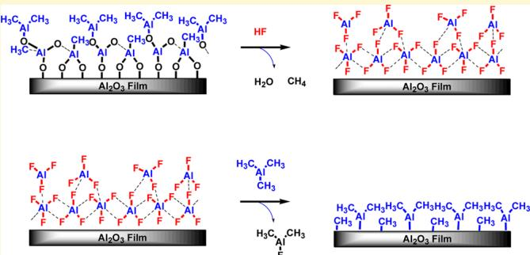
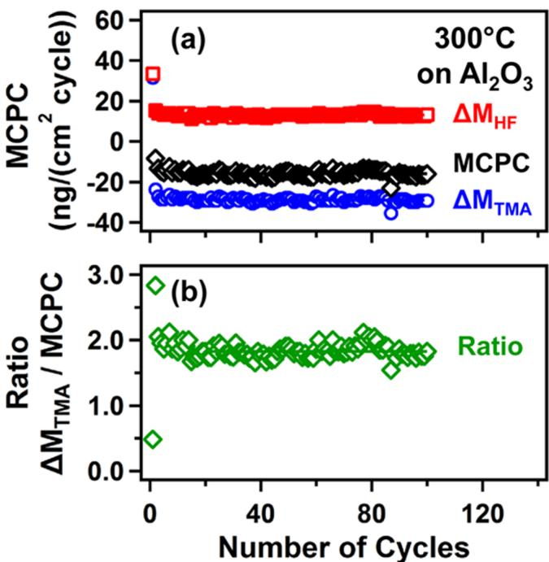
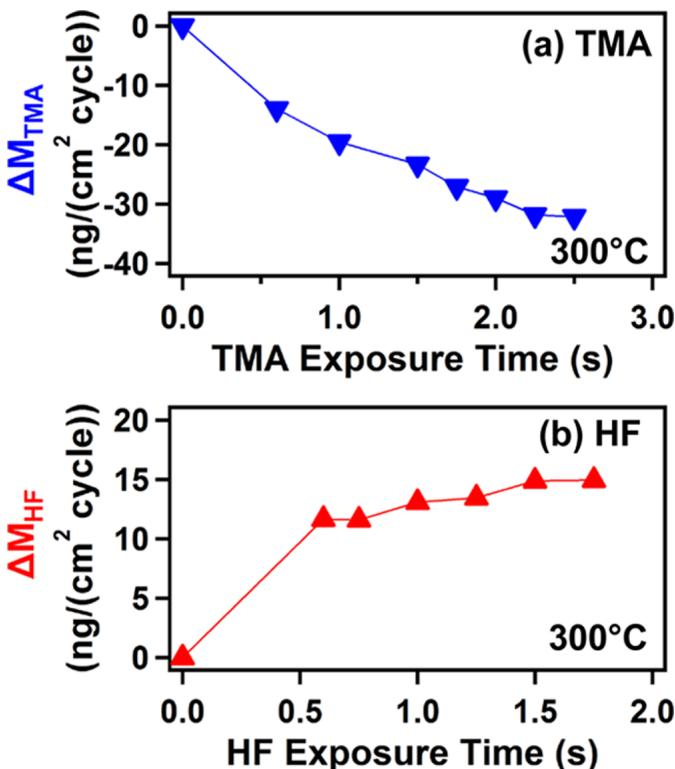
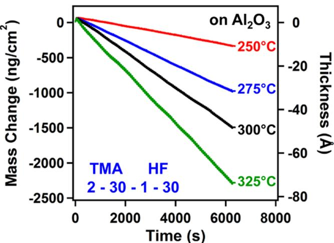
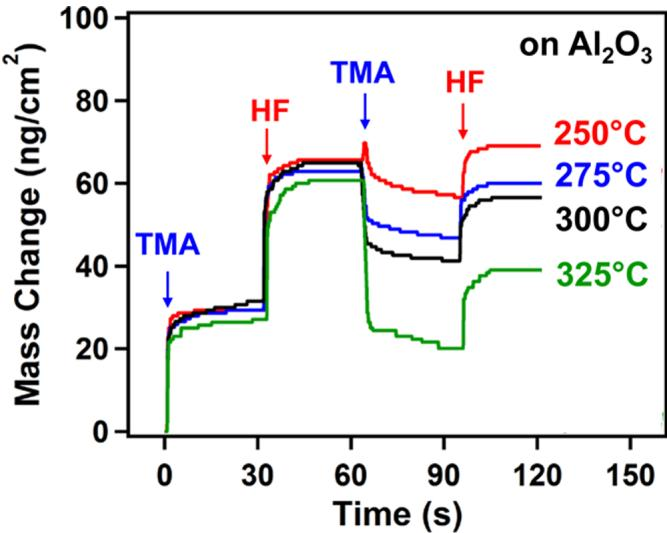
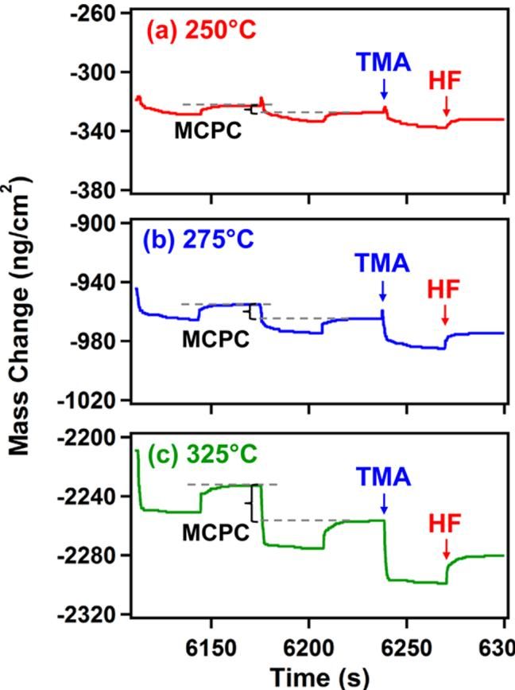
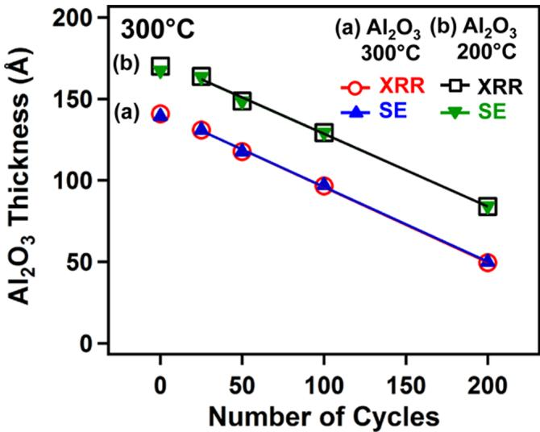
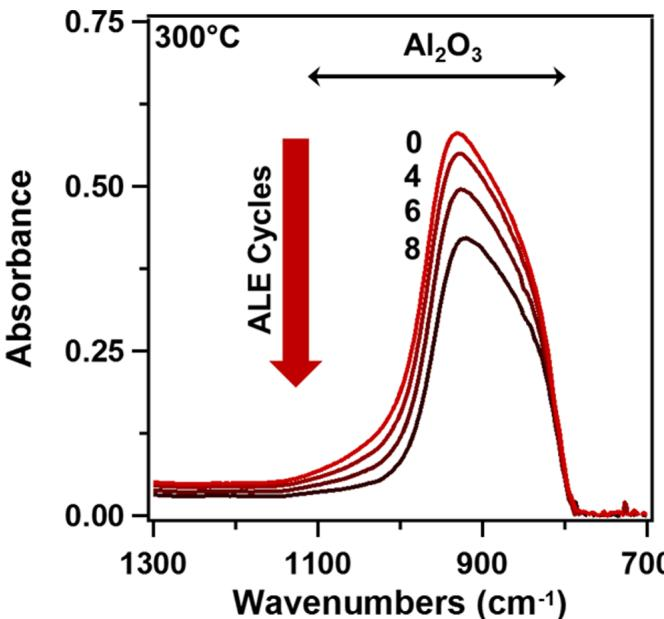
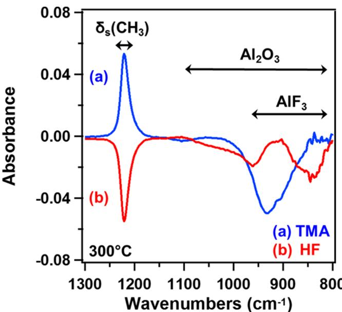

# Trimethylaluminum as the Metal Precursor for the Atomic Layer Etching of  $\mathbf{Al}_{2}\mathbf{O}_{3}$  Using Sequential, Self-Limiting Thermal Reactions

Younghee Lee,† Jaime W. DuMont,† and Steven M. George*,†,‡

†Department of Chemistry and Biochemistry, ‡Department of Mechanical Engineering, University of Colorado, Boulder, Colorado 80309, United States

Supporting Information

ABSTRACT: Trimethylaluminum (TMA,  $\mathrm{Al(CH_3)_3}$ ) was used as the metal precursor, together with HF, for the atomic layer etching (ALE) of  $\mathrm{Al}_2\mathrm{O}_3$  using sequential, self- limiting thermal reactions.  $\mathrm{Al}_2\mathrm{O}_3$  ALE using TMA demonstrates that other metal precursors, in addition to  $\mathrm{Sn(acac)}_2,$  can be employed for  $\mathrm{Al}_2\mathrm{O}_3$  ALE. The use of TMA for  $\mathrm{Al}_2\mathrm{O}_3$  ALE is especially interesting because TMA can also be used for  $\mathrm{Al}_2\mathrm{O}_3$  atomic layer deposition (ALD). Quartz crystal microbalance (QCM) experiments monitored  $\mathrm{Al}_2\mathrm{O}_3$  ALE at temperatures from 250 to  $325^{\circ}C$  The  $\mathrm{Al}_2\mathrm{O}_3$  ALE was linear versus the number of HF and TMA reaction cycles. The QCM studies showed that the sequential HF and TMA reactions were self limiting versus reactant exposure. The  $\mathrm{Al}_2\mathrm{O}_3$  etching rates increased at higher temperatures. The QCM analysis measured mass change per cycle (MCPC) values that varied from  $- 4.2\mathrm{ng / (cm^2}$  cycle) at  $250^{\circ}C$  to  $- 23.3\mathrm{ng / (cm^2}$  cycle) at  $325^{\circ}C$  These MCPCs correspond to  $\mathrm{Al}_2\mathrm{O}_3$  etch rates from  $0.14\mathrm{\AA / }$  cycle at  $250^{\circ}C$  to  $0.75\mathrm{\AA / }$  cycle at  $325^{\circ}C$  X- ray reflectivity and spectroscopic elipsometry analyses confirmed the linear removal of  $\mathrm{Al}_2\mathrm{O}_3$  and etching rates. Further transform infrared spectroscopy measurements monitored  $\mathrm{Al}_2\mathrm{O}_3$  ALE by observing the loss of infrared absorbance from Al- O stretching vibrations. Surface intermediates were also identified after the HF and TMA exposures.  $\mathrm{Al}_2\mathrm{O}_3$  ALE with TMA is believed to occur by the reaction  $\mathrm{Al}_2\mathrm{O}_3 + 4\mathrm{Al}(\mathrm{CH}_3)_3 + 6\mathrm{HF}\rightarrow 6\mathrm{AlF}(\mathrm{CH}_3)_2 + 3\mathrm{H}_2\mathrm{O}$  The proposed mechanism involves fluorination and ligand- exchange reactions. The HF exposure fluorinates the  $\mathrm{Al}_2\mathrm{O}_3$  and forms an  $\mathrm{AlF}_3$  surface layer and  $\mathrm{H}_2\mathrm{O}$  as a volatile reaction product. During the ligand- exchange transmetalation reaction, TMA accepts F from the  $\mathrm{AlF}_3$  surface layer and donates  $\mathrm{CH}_3$  to produce volatile  $\mathrm{AlF}(\mathrm{CH}_3)_2$  reaction products. The QCM measurements were consistent with an  $\mathrm{AlF}_3$  surface layer thickness of  $3.0\mathrm{\AA}$  on  $\mathrm{Al}_2\mathrm{O}_3$  after the HF exposures. The larger etch rates at higher temperatures were attributed to the removal of a larger fraction of the  $\mathrm{AlF}_3$  surface layer by TMA exposures at higher temperatures.

# I. INTRODUCTION

Atomic layer etching (ALE) involves the removal of thin films based on sequential, self- limiting surface reactions.1,2 ALE is the reverse of atomic layer disposition (ALD).3,4 Atomic layer processes, such as ALE and ALD, are crucial to engineer film thicknesses with atomic scale precision and to build nanoscale semiconductor devices.1,6 Most of the reported ALE processes to date have used halogenation reactions followed by energetic ion or noble gas atom bombardment to etch the material.1,5,6 The use of energetic ions or atoms for etching is useful to achieve anisotropic etching.1,2 In contrast, thermal ALE processes enable conformal and isotropic etching of threedimensional structures.2 Thermal ALE may also achieve etching without damaging the underlying film.

Thermal ALE processes have been developed only recently. The first reported thermal ALE system was  $\mathrm{Al}_2\mathrm{O}_3$  ALE using HF and  $\mathrm{Sn(acac)}_2$  as the reactants.7,8 Subsequently,  $\mathrm{HfO}_2\mathrm{ALE}^9$  and  $\mathrm{AlF}_3$  ALE10 were also demonstrated using HF and  $\mathrm{Sn(acac)}_2$  The chemistry of thermal ALE is based on fluorination and ligand- exchange reactions.  $\mathrm{Sn(acac)}_2$  is a good metal precursor for the ligand- exchange reaction. The ligand- exchange reaction can be characterized as a metal exchange transmetalation11 or a redistribution12 reaction. In the ligand- exchange reaction, ligands are transferred between adjacent metal centers.13 The transition state is generally believed to be a four- center ring based on a variety of transmetalation reaction studies, such as Stille cross- coupling between Pd and organotin compounds.13 For thermal ALE, the four- center ring would be formed by the metal in the metal precursor and the metal in the metal fluoride with fluorine and ligand bridging species. Fluorine facilitates the four- center ring transition state because of its ability to form bimetallic bridges.14

Transmetalation reactions are known to be favored if an empty orbital is available on both metals.13 In addition, thermodynamics predicts that the halide atom prefers to

transfer to the most electropositive atom during transmetalation.13 Sn(II) compounds with  $\mathrm{SnX}_2$  stoichiometry like  $\mathrm{Sn(acac)}_2$  are good candidates for transmetalation.15,16 Sn has a medium electronegativity of 1.8. Sn(II) complexes with  $\mathrm{SnX}_2$  stoichiometry also have an empty 5p orbital and an unshared 5s electron pair.17,18 The empty 5p orbital and unshared 5s electron pair yield Lewis acid and Lewis base properties that give chemical versatility to  $\mathrm{Sn(acac)}_2$  Sn also can form relatively strong bonds with fluorine.18

Other metal precursors may also display favorable properties for the ligand- exchange reaction. Another promising metal precursor is trimethylaluminum (TMA). TMA has an open outer shell and is a strong Lewis acid because Al has only three valence electrons and does not obey the octet rule. Al has a low electronegativity of 1.5. Al is also known to form strong bonds with fluorine.19 TMA is a popular reactant resulting from its high volatility and excellent reactivity. For example, sequential TMA and  $\mathrm{H}_2\mathrm{O}$  exposures are well- known to form  $\mathrm{Al}_2\mathrm{O}_3$  ALD films.20 The use of TMA for  $\mathrm{Al}_2\mathrm{O}_3$  ALE is particularly intriguing because TMA could serve to either grow  $\mathrm{Al}_2\mathrm{O}_3$  by ALD or etch  $\mathrm{Al}_2\mathrm{O}_3$  by ALE depending on the other reactant used together with TMA.

The use of different metal precursors for thermal ALE could also lead to selective ALL. Different metal precursors introduce various ligands that may transfer during the ligand- exchange transmetalation reaction. If the transferred ligand produces a metal product that is stable and volatile, then the metal product may leave the surface and produce etching. If the possible metal product is not stable or volatile, then the ligand- exchange reaction may not occur or may not produce a volatile etch product. In the previous work using  $\mathrm{Sn(acac)}_2$  as the metal precursor for ligand- exchange,  $\mathrm{Sn(acac)}_2$  transferred acac ligands to produce stable and volatile Al and Hf reaction products.7- 10 In comparison, TMA can transfer  $\mathrm{CH}_3$  ligands that may lead to reaction products with different stabilities and volatilities that may provide for selective ALE.

In this paper, sequential exposures of HF and TMA were employed for thermal  $\mathrm{Al}_2\mathrm{O}_3$  ALE. The etching rates and individual HF and TMA reactions during thermal  $\mathrm{Al}_2\mathrm{O}_3$  ALE were examined using quartz crystal microbalance (QCM) studies. The  $\mathrm{Al}_2\mathrm{O}_3$  film thicknesses versus number of sequential HF and TMA exposures were also measured using X- ray reflectivity (XRR) and spectroscopic ellipsometry analyses. In addition, Fourier transform infrared (FTIR) spectroscopy measurements were used to observe the loss of infrared absorbance from Al- O stretching vibrations and monitor the surface species during the sequential HF and TMA exposures. These studies demonstrate that other metal precursors, in addition to  $\mathrm{Sn(acac)}_2$  can be employed for the ligand- exchange reactions in thermal ALE.

# II. EXPERIMENTAL SECTION

II.A. In situ QCM Studies in Viscous Flow Reactor. The ALE reactions were performed in a viscous flow, hot wall ALD reactor.21 An in situ quartz crystal microbalance (QCM) was mounted inside of the isothermal, hot wall ALD reactor. The quartz crystal (gold coated and polished, RC-cut 6 MHz, Colnatec) was placed in a sensor housing (BSH-150, Inficon). This sensor housing was then sealed with high temperature epoxy (Epo-Tek H21D, Epoxy technology). The mass changes during the ALE reactions were recorded by a thin film deposition monitor (Maxtek TM-400, Inficon). A proportional-integral-derivative (PID) temperature controller (2604, Eurotherm) maintained the reaction temperature at 250, 275, 300, and  $325^{\circ}C$ . The temperature was controlled to within  $\pm 0.04^{\circ}C$  of the exact set

point. This temperature stability was important for accurate QCM measurements. The change of the reaction temperature required more than  $2\textrm{h}$  of stabilization. A capacitance manometer (Baratron 121A, MKS) monitored the pressure in the reactor.

The  $\mathrm{Al}_2\mathrm{O}_3$  films were grown on the QCM crystal with  $\mathrm{Al}_2\mathrm{O}_3$  ALD using TMA (97%, Sigma- Aldrich) and  $\mathrm{H}_2\mathrm{O}$  (Chromasolv for HPLC, Sigma- Aldrich). The  $\mathrm{Al}_2\mathrm{O}_3$  ALE reactions were accomplished using sequential exposures of TMA and HF derived from HF- pyridine (70 wt % HF, Sigma- Aldrich). HF- pyridine is a liquid and HF gas has a vapor pressure of 90- 100 Torr over the HF- pyridine solution at room temperature. The pyridine partial pressure is negligible. The use of gaseous HF from the HF- pyridine solution allows for the safe handling of anhydrous HF. HF- pyridine was transferred to a gold- plated stainless steel bubbler using a dry  $\mathrm{H}_2$  filled glovebag. The HF- pyridine, TMA, and  $\mathrm{H}_2\mathrm{O}$  precursors were at room temperature.

A constant flow of 150 sccm of ultra high purity (UHP)  $\mathrm{N}_2$  gas was delivered into the reactor using mass flow controllers (Type 1179A, MKS). An additional flow of 20 sccm of  $\mathrm{N}_2$  gas through a metering bellows- sealed valve (SS- 4BMG, Swagelok) prevented deposition on the backside of the QCM crystal. The total  $\mathrm{N}_2$  gas flow of 170 sccm produced a base pressure of  $\sim 1$  Torr in the reactor pumped by a mechanical pump (Pascal 2015SD, Alcatel).

II.B. Si Wafers, X-ray Reflectivity, Spectroscopic Ellipsometry and X-ray Photoelectron Spectroscopy.  $\mathrm{Al}_2\mathrm{O}_3$  ALD films were grown on boron-doped  $\mathrm{Si}(100)$  wafers (p-type, Silicon Valley Microelectronics). These  $\mathrm{Al}_2\mathrm{O}_3$  ALD films were used as the substrates for the ALE reactions. The bare Si substrates were cut into samples with dimensions of  $2.5\mathrm{cm}$  by  $2.5\mathrm{cm}$  before the  $\mathrm{Al}_2\mathrm{O}_3$  ALD.

The ex situ X- ray reflectivity (XRR) scans were measured by a high resolution X- ray diffractometer (Bede Dr. Jordan Valley Semiconductors) using Cu Kα ( $\lambda = 1.540$  Å) radiation. The filament voltage and current in the X- ray tube were  $40\mathrm{kV}$  and  $35\mathrm{mA}$ , respectively. A 10 arcsec step size and a  $5\mathrm{s}$  acquisition time were used for recording all XRR scans with a range of 300 to 6000 arcsec. The analysis software (Bede REFS, Jordan Valley Semiconductors) determined film thickness, film density, and surface roughness by fitting the XRR scans.

Ellipsometry was performed using a spectroscopic ellipsometer (M- 2000, J. A. Woollam) with a spectral range of 240 to  $1700\mathrm{nm}$  and an incidence angle of  $75^{\circ}$ . The analysis software (CompleteEASE, J. A. Woollam) fitted the  $\Psi$  and  $\Delta$  values based on a Sellmeier model to determine the thicknesses and refractive index of the film. The film composition was confirmed using X- ray photoelectron spectroscopy (XPS). The XPS instrument (PHI 5600) was equipped with a monochromatic Al Kα X- ray source.

II.C. In situ Fourier Transform Infrared (FTIR) Spectroscopy Studies. The in situ FTIR spectroscopy studies were performed in a reactor equipped with an FTIR spectrometer. The FTIR experiments utilized high surface area,  $\mathrm{ZrO}_2$  nanoparticles (99.95%, US research Nanomaterials) with an average diameter of  $20\mathrm{nm}$ . The  $\mathrm{ZrO}_2$  nanoparticles absorb infrared radiation between  $\sim 400 - 800\mathrm{cm}^{-1}$  and leave an open window at  $>800\mathrm{cm}^{-1}$  to monitor absorbance from the surface species.

The  $\mathrm{ZrO}_2$  nanoparticles were mechanically pressed into a tungsten grid support to obtain the transmission FTIR measurements. The tungsten grids were  $2\mathrm{cm}\times 3\mathrm{cm}$ ,  $50\mu \mathrm{m}$  thick, with 100 grid lines per inch. The tungsten grid could be resistively heated and temperature controlled as described previously. The  $\mathrm{Al}_2\mathrm{O}_3$  films were grown on the  $\mathrm{ZrO}_2$  nanoparticles with  $\mathrm{Al}_2\mathrm{O}_3$  ALD using TMA (97%, Sigma- Aldrich) and  $\mathrm{H}_2\mathrm{O}$  (Chromasolv for HPLC, Sigma- Aldrich). The  $\mathrm{Al}_2\mathrm{O}_3$  ALE reactions were performed using sequential exposures of TMA (97%, Sigma- Aldrich) and HF derived from HF- pyridine (70 wt % HF, Sigma- Aldrich).

Static dosing of both the ALD and ALE precursors was performed to achieve self- limiting behavior on the high surface area particle substrates. Each reactant exposure consisted of a  $\sim 1$  Torr static dose for  $10\mathrm{s}$  followed by a  $240\mathrm{s}$  purge. The  $\mathrm{Al}_2\mathrm{O}_3$  film on the  $\mathrm{ZrO}_2$  nanoparticles was grown using 15 cycles of  $\mathrm{Al}_2\mathrm{O}_3$  ALD at  $150^{\circ}\mathrm{C}$ . Subsequently, 8 cycles of  $\mathrm{Al}_2\mathrm{O}_3$  ALE were performed at  $300^{\circ}\mathrm{C}$ .

# III. RESULTS AND DISCUSSION

III.A. QCM Measurements. Figure 1 shows the mass change during 100 ALE cycles using sequential exposures of TMA and HF on an  $\mathrm{Al}_2\mathrm{O}_3$  substrate at  $300^{\circ}\mathrm{C}$  The initial  $\mathrm{Al}_2\mathrm{O}_3$  ALD film on the QCM crystal was deposited by 100 cycles of  $\mathrm{Al}_2\mathrm{O}_3$  ALD using TMA and  $\mathrm{H}_2\mathrm{O}$  at  $300^{\circ}\mathrm{C}$  One ALE cycle consisted of a TMA dose of  $2.0~\mathrm{s}$ , an  $\mathrm{N}_2$  purge of  $30~\mathrm{s}$ , a HF dose of  $1.0~\mathrm{s}$ , and a second  $\mathrm{N}_2$  purge of  $30~\mathrm{s}$ . This reaction sequence is represented as  $2 - 30 - 1 - 30$ . Pressure transients during TMA and HF exposures were  $\sim 40$  mTorr and  $\sim 80$  mTorr, respectively. These pressure transients were observed on top of the base pressure of  $\sim 1$  Torr in the reactor.

  
Figure 1. Mass change versus time for  $\mathrm{Al}_2\mathrm{O}_3$  ALE using sequential TMA and HF exposures at  $300^{\circ}\mathrm{C}$

Figure 1 displays linear etching of the  $\mathrm{Al}_2\mathrm{O}_3$  film. A slope of the mass change versus time yields a mass change per cycle (MCPC) of  $- 15.9\mathrm{ng / cm}^2$  cycle). This MCPC represents the removal of  $9.4\times 10^{13}$ $\mathrm{Al}_2\mathrm{O}_3$  units/  $\mathrm{cm}^2$  cycle). This MCPC is also equivalent to an etch rate of  $0.51\mathrm{\AA / }$  cycle based on the  $\mathrm{Al}_2\mathrm{O}_3$  ALD film density of  $3.1~\mathrm{g / cm}^3$  determined by XRR. All ALE cycles show mass loss except during the first ALE cycle. The first cycle displays mass gains of  $\Delta M_{\mathrm{TMA}} = 32\mathrm{ng / cm}^2$  and  $\Delta M_{\mathrm{HF}} = 33\mathrm{ng / cm}^2$

The mass gain for  $\Delta M_{\mathrm{TMA}}$  during the first TMA exposure is attributed to the formation of  $\mathrm{AlCH}_3^*$  surface species on the initial hydroxylated  $\mathrm{Al}_2\mathrm{O}_3$  substrate. The asterisks designate a surface species. The mass gain for  $\Delta M_{\mathrm{HF}}$  during the first HF exposure is attributed to the fluorination of the  $\mathrm{Al}_2\mathrm{O}_3$  substrate. The HF exposure reacts with  $\mathrm{AlCH}_3^*$  to form  $\mathrm{AlF}^*$  surface species. HF exposure can also fluorinate the underlying  $\mathrm{Al}_2\mathrm{O}_3$  film to form an  $\mathrm{AlF}_3$  surface layer. The reaction of  $\mathrm{Al}_2\mathrm{O}_3 + 6\mathrm{HF}$ $\rightarrow 2\mathrm{AlF}_3 + 3\mathrm{H}_2\mathrm{O}$  is spontaneous with  $\Delta G = - 49$  kcal at  $300^{\circ}\mathrm{C}$  27 This first cycle establishes the initial  $\mathrm{AlF}_3$  layer on the  $\mathrm{Al}_2\mathrm{O}_3$  substrate.

Figure 2 shows an enlargement of the mass changes versus time at  $300^{\circ}\mathrm{C}$  in the steady state region of Figure 1. Each reactant exposure leads to pronounced mass changes. The TMA exposure results in a mass decrease. This behavior indicates TMA can remove the  $\mathrm{AlF}_3$  surface layer on the  $\mathrm{Al}_2\mathrm{O}_3$  film. A mass loss of  $\Delta M_{\mathrm{TMA}} = - 29\mathrm{ng / cm}^2$  was observed after  $2.0~\mathrm{s}$  of TMA exposure. In contrast, the HF exposure leads to mass gain. A mass gain of  $\Delta M_{\mathrm{HF}} = 13\mathrm{ng / cm}^2$  was observed after  $1.0~\mathrm{s}$  of HF exposure. This mass gain is consistent with the fluorination of  $\mathrm{Al}_2\mathrm{O}_3$  to form an  $\mathrm{AlF}_3$  surface layer. This  $\mathrm{AlF}_3$  surface layer is then ready for the ligand- exchange reaction during the next TMA exposure.

  
Figure 2. Enlargement of linear region of Figure 1 showing the individual mass changes during the sequential TMA and HF exposures at  $300^{\circ}\mathrm{C}$

Figure 3 shows the MCPC and the  $\Delta M_{\mathrm{TMA}} / \mathrm{MCPC}$  ratio during  $100\mathrm{Al}_2\mathrm{O}_3$  ALE cycles at  $300^{\circ}\mathrm{C}$ . The  $\Delta M_{\mathrm{TMA}}$  and

  
Figure 3. (a) Mass change after the TMA exposure  $(\Delta M_{\mathrm{TMA}})$ , mass change after the HF exposure  $(\Delta M_{\mathrm{HF}})$  and mass change per cycle (MCPC) versus number of ALE cycles at  $300^{\circ}\mathrm{C}$ . (b)  $\Delta M_{\mathrm{TMA}} / \mathrm{MCPC}$  ratio versus number of ALE cycles.

$\Delta M_{\mathrm{HF}}$  mass changes are very constant. The MCPC is defined by  $\mathrm{MCPC} = \Delta M_{\mathrm{TMA}} + \Delta M_{\mathrm{HF}}$ . Figure 3a displays  $\Delta M_{\mathrm{TMA}} / \Delta M_{\mathrm{HF}}$  and MCPC for the same 100 cycles of  $\mathrm{Al}_2\mathrm{O}_3$  ALE reaction at  $300^{\circ}\mathrm{C}$  shown in Figure 1. A short nucleation period was observed before reaching steady state with  $\mathrm{MCPC} = - 15.9\mathrm{ng / cm}^2$  cycle). Figure 3b displays the  $\Delta M_{\mathrm{TMA}} / \mathrm{MCPC}$  ratio during the same 100 cycles. The  $\Delta M_{\mathrm{TMA}} / \mathrm{MCPC}$  ratio shows a steady- state value of 1.8 after the first three ALE cycles. The

$\Delta M_{\mathrm{TMA}} / \mathrm{MCPC}$  ratio will be employed to define the stoichiometry of the  $\mathrm{Al}_2\mathrm{O}_3$  ALE reactions.

The self- limiting behavior can be confirmed by monitoring mass change as a function of exposure for each reactant. Selflimiting ALE reactions are important for conformal or isotropic etching. Figure 4 examines the self- limiting nature of the  $\mathrm{Al}_2\mathrm{O}_3$  ALE reactions at  $300^{\circ}C$  Figure 4a shows  $\Delta M_{\mathrm{TMA}}$  the mass change after the TMA exposure, using different TMA exposure times with a single  $1.0~\mathrm{s}$  exposure of HF. A constant  $\mathbb{N}_2$  purge of  $30~\mathrm{s}$  was used after each exposure. This reaction sequence can be represented as  $\mathrm{x} - 30 - 1 - 30$ $\Delta M_{\mathrm{TMA}}$  versus the TMA exposure time decreases and levels off slowly.

  
Figure 4. (a) Mass change after TMA exposure  $(\Delta M_{\mathrm{TMA}})$  versus TMA exposure time at  $300^{\circ}C$  (b) Mass change after HF exposure  $(\Delta M_{\mathrm{HF}})$  versus HF exposure time at  $300^{\circ}C$

Nearly self- limiting behavior at  $\Delta M_{\mathrm{TMA}} = - 29\mathrm{ng / cm}^2$  is observed after  $2.0~\mathrm{s}$  of TMA exposure. This slow approach to self- limiting behavior may result from the difficulty in removing all of the  $\mathrm{AlF}_3$  surface layer. An initial fraction of the  $\mathrm{AlF}_3$  surface layer may be easily removed by TMA. The removal of more of the  $\mathrm{AlF}_3$  surface layer may then become progressively difficult. Additional analysis of the temperature dependence of the TMA reaction presented below will reveal that only a fraction of the  $\mathrm{AlF}_3$  surface layer is removed even at the highest temperatures.

Figure 4b monitors  $\Delta M_{\mathrm{HF}},$  the mass change after the HF exposure, using different HF exposure times with a single  $2.0~\mathrm{s}$  exposure of TMA. This reaction sequence can be denoted as  $2 - 30 - x - 30$ $\Delta M_{\mathrm{HF}}$  versus the HF exposure time increases and then levels off at approximately  $\Delta M_{\mathrm{HF}} = 13\mathrm{ng} / (\mathrm{cm}^2$  cycle) after a  $1.0~\mathrm{s}$  HF exposure. This self- limiting behavior is consistent with HF fluorinating the  $\mathrm{Al}_2\mathrm{O}_3$  film and forming an  $\mathrm{AlF}_3$  surface layer that passivates the underlying  $\mathrm{Al}_2\mathrm{O}_3$  film.

This surface fluoride layer on  $\mathrm{Al}_2\mathrm{O}_3$  is similar to the native oxide layers formed on metals28- 30 or silicon31- 33 that protect the metals or silicon from further oxidation. The  $\mathrm{AlF}_3$  surface layer is expected to passivate the  $\mathrm{Al}_2\mathrm{O}_3$  film because the PillingBedworth ratio,  $\mathrm{R_{PB}},$  is  $>1$  34  $\mathrm{R}_{\mathrm{PB}}$  is the ratio of the molar volume,  $\mathrm{V}_{\mathrm{r}}$  of the top layer to the molar volume of the underlying material. The molar volume,  $\mathrm{V} = \mathrm{M} / \rho ,$  where  $\mathbf{M}$  is the molar mass and  $\rho$  is the density,  $\mathrm{V_{AlF3} = M_{AlF3} / \rho_{AlF3} = 29}$ $\mathrm{cm}^3 /\mathrm{mol}$  because  $\mathrm{M_{AlF3} = 84~g / mol}$  and  $\rho_{\mathrm{AlF3}} = 2.9\mathrm{g / cm}^3$ $\mathrm{V_{Al2O3} = M_{Al2O3} / \rho_{Al2O3} = 33~cm^3 / mol}$  because  $\mathrm{M_{Al2O3} = 102~g / }$  mol and  $\rho_{\mathrm{Al2O3}} = 3.1\mathrm{g / cm}^3$  . Using these values,  $\mathrm{R_{PB} = (V_{AlF3}\times}$ $2) / V_{\mathrm{Al2O3}} = 1.8$  The factor of 2 accounts for the aluminum stoichiometry difference between  $\mathrm{AlF}_3$  and  $\mathrm{Al}_2\mathrm{O}_3$

Figure 5 displays the mass change during 100 ALE cycles at 230, 275, 300, and  $325^{\circ}C$  using the reaction sequence of  $2-$  $30 - 1 - 30$  The initial  $\mathrm{Al}_2\mathrm{O}_3$  ALD films were grown by 100 cycles of  $\mathrm{Al}_2\mathrm{O}_3$  ALD at the same temperatures. The mass changes versus time during  $\mathrm{Al}_2\mathrm{O}_3$  ALE are linear at all temperatures. The MCPC increases with temperature from  $- 4.2\mathrm{ng} / (\mathrm{cm}^2$  cycle) at  $250^{\circ}C$  to  $- 23.3\mathrm{ng} / (\mathrm{cm}^2$  cycle) at 325  $^\circ \mathrm{C}$  These MCPCs correspond to etch rates that increase from  $0.14\mathrm{\AA / cycle}$  at  $250^{\circ}C$  to  $0.75\mathrm{\AA / cycle}$  at  $325^{\circ}C$  The determination of these etch rates is based on the  $\mathrm{Al}_2\mathrm{O}_3$  ALD film density of  $3.1\mathrm{g / cm}^3$  . These results indicate that the  $\mathrm{Al}_2\mathrm{O}_3$  etch rate can be controlled by the reaction temperature.

  
Figure 5. Mass change versus time for  $\mathrm{Al}_2\mathrm{O}_3$  ALE using sequential TMA and HF exposures at 250, 275, 300, and  $325^{\circ}C$

The nucleation of  $\mathrm{Al}_2\mathrm{O}_3$  ALE was examined at different temperatures during the first several TMA and HF exposures. Figure 6 shows an enlargement of the mass changes during the first two  $\mathrm{Al}_2\mathrm{O}_3$  ALE cycles for the different temperatures in Figure 5. The first TMA exposure displays mass gains of  $\Delta M_{\mathrm{TMA}} = 27 - 32\mathrm{ng / cm}^2$  at  $250 - 325^{\circ}C$  These mass gains result from the reaction of  $\mathrm{AlOH^{*} + Al(CH_{3})_{3}\rightarrow AlOAl(CH_{3})_{2}* + CH_{4}}$

The first HF exposure in Figure 6 then shows mass gains of  $\Delta M_{\mathrm{HF}} = 33 - 36\mathrm{ng / cm}^2$  at  $250 - 325^{\circ}C$  These mass gains result from the reaction of  $\mathrm{AlCH}_3^*$  surface species with HF according to  $\mathrm{AlCH}_3^* +\mathrm{HF}\rightarrow \mathrm{AlF}^* +\mathrm{CH}_4$  In addition, some of the underlying  $\mathrm{Al}_2\mathrm{O}_3$  is also converted to an  $\mathrm{AlF}_3$  surface layer. The fluorination reaction  $\mathrm{Al}_2\mathrm{O}_3 + 6\mathrm{HF}\rightarrow 2\mathrm{AlF}_3 + 3\mathrm{H}_2\mathrm{O}$  is spontaneous over the temperature range from 250 to  $325^{\circ}C$  The Gibbs free energy changes are negative and change slightly from  $\Delta G = - 53.8$  kcal at  $250^{\circ}C$  to  $\Delta G = - 46.8$  kcal at 325  $^\circ \mathrm{C}$  27 Figure 6 shows that the fluorination of  $\mathrm{Al}_2\mathrm{O}_3$  to form an  $2\mathrm{AlF}_3$  surface layer is nearly constant at all temperatures.

  
Figure 6. Expansion of first two ALE cycles in Figure 5 showing the individual mass changes during the sequential TMA and HF exposures at 250, 275, 300, and  $325^{\circ}C$ .

HF exposures on initial, hydroxylated  $\mathrm{Al}_2\mathrm{O}_3$  substrates prior to TMA exposures showed very similar mass gains of  $\Delta M_{\mathrm{HF}} =$ $35 - 38\mathrm{ng} / \mathrm{cm}^2$  at  $150 - 250^{\circ}\mathrm{C}$  7 This similarity of the mass gains for HF exposure on the initial hydroxylated  $\mathrm{Al}_2\mathrm{O}_3$  substrate and for HF exposure on the  $\mathrm{Al}_2\mathrm{O}_3$  substrate after the TMA exposure results from the similar molar mass of the  $\mathrm{AlCH}_3^*$  and  $\mathrm{AlOH^*}$  species. The  $\mathrm{AlCH}_3^*$  and  $\mathrm{AlOH^*}$  species lead to the production of  $\mathrm{CH_4}$  and  $\mathrm{H}_2\mathrm{O}_3$  respectively. The mass changes resulting from these reactions, together with the mass gains occurring during the fluorination of  $\mathrm{Al}_2\mathrm{O}_3$  to produce an  $\mathrm{AlF}_3$  surface layer, are nearly equivalent.

The mass gain of  $\Delta M_{\mathrm{HF}} = 33 - 36\mathrm{ng} / \mathrm{cm}^2$  at  $250 - 325^{\circ}C$  can be employed to estimate the thickness of the  $\mathrm{AlF}_3$  surface layer on the  $\mathrm{Al}_2\mathrm{O}_3$  substrate. This estimation assumes that the mass change from the reaction  $\mathrm{AlCH}_3^* +\mathrm{HF}\rightarrow \mathrm{AlF}^* +\mathrm{CH}_4$  is negligible compared with the fluorination of  $\mathrm{Al}_2\mathrm{O}_3$  .The fluorination reaction  $\mathrm{Al}_2\mathrm{O}_3 + 6\mathrm{HF}\rightarrow 2\mathrm{AlF}_3 + 3\mathrm{H}_2\mathrm{O}$  will result in a mass increase of  $65\%$  . This mass increase is expected from the masses of 102 amu for  $\mathrm{Al}_2\mathrm{O}_3$  and 168 amu for  $2\mathrm{AlF}_3$  Therefore, the average value of  $\Delta M_{\mathrm{HF}} = 34\mathrm{ng} / \mathrm{cm}^2$  corresponds to the conversion of  $52.5\mathrm{ng} / \mathrm{cm}^2$  of  $\mathrm{Al}_2\mathrm{O}_3$  into  $86.5\mathrm{ng} / \mathrm{cm}^2$  of the  $\mathrm{AlF}_3$  layer. Based on the density of  $3.1~\mathrm{g}/$ $\mathrm{cm}^3$  for  $\mathrm{Al}_2\mathrm{O}_3,$  22 the mass of  $52.5\mathrm{ng} / \mathrm{cm}^2$  for  $\mathrm{Al}_2\mathrm{O}_3$  is equivalent to an  $\mathrm{Al}_2\mathrm{O}_3$  thickness of  $1.7\mathrm{\AA}$  Likewise, based on the density of  $2.9\mathrm{g} / \mathrm{cm}^3$  for  $\mathrm{AlF}_3,$  22 the mass of  $86.5\mathrm{ng} / \mathrm{cm}^2$  for  $\mathrm{AlF}_3$  is equivalent to an  $\mathrm{AlF}_3$  thickness of  $3.0\mathrm{\AA}$

XPS measurements also examined the film composition after the HF exposures during  $\mathrm{Al}_2\mathrm{O}_3$  ALE at  $300^{\circ}C$  The  $\mathrm{Al}_2\mathrm{O}_3$  films were exposed to atmosphere after the  $\mathrm{Al}_2\mathrm{O}_3$  ALE and prior to the XPS studies. The XPS analysis yielded  $\mathrm{F}$  concentrations of  $4 - 6$  at.  $\%$  including the adventitious carbon. Fluorine concentrations of  $4 - 6$  at.  $\%$  are in approximate agreement with the expected photoelectron yield from a layered sample consisting of a  $6\mathrm{\AA}$  thick adventitious carbon layer35 on a  $3\mathrm{\AA}$  thick  $\mathrm{AlF}_3$  layer on an  $\mathrm{Al}_2\mathrm{O}_3$  substrate. The model for the photoelectron sources employed the C, F, Al and O number densities in each layer and the Beer- Lambert equation integrated over the film thicknesses. The Beer- Lambert equation is  $\mathrm{I} = \mathrm{I}_0$  expJ- d/ sin  $\Theta ]$  where  $\mathrm{I}_0$  is the initial photoelectron intensity, d is the distance traveled through the layer and  $\Theta$  is the angle to the surface normal.36 The electron mean free path,  $\lambda_{j}$  was based on approximate expressions for  $\lambda$  given in the literature.37

After the first HF exposure, the next TMA exposure removes the  $\mathrm{AlF}_3$  layer on the  $\mathrm{Al}_2\mathrm{O}_3$  substrate. Figure 6 shows that mass losses during the TMA and HF cycles begin with the second TMA and HF cycle for temperatures from  $275 - 325^{\circ}C$  The TMA and HF cycles at  $250^{\circ}C$  show a mass loss after the third ALE cycle. Figure 6 reveals that higher temperatures produce both a larger mass loss for the removal of  $\mathrm{AlF}_3$  by TMA and a larger mass gain for the subsequent fluorination of  $\mathrm{Al}_2\mathrm{O}_3$  by HF.

Figure 7 shows enlargements of the mass changes during three cycles in the steady state etching regime for  $\mathrm{Al}_2\mathrm{O}_3$  ALE at

  
Figure 7. Enlargement of linear region of Figure 5 showing the individual mass changes during the sequential TMA and HF exposures at a) 250,b) 275 and c  $325^{\circ}C$

250, 275, and  $325^{\circ}C$  Mass losses are observed after the TMA exposures. These mass losses suggest that  $\mathrm{Al(CH_3)_3}$  can remove the  $\mathrm{AlF}_3$  surface layer as volatile  $\mathrm{AlF(CH_3)_2}$  product according to the reactions  $\mathrm{AlF}_3^* +\mathrm{Al}(\mathrm{CH}_3)_3\rightarrow \mathrm{AlF}_2\mathrm{CH}_3^* +$ $\mathrm{AlF(CH_3)_2}$  and  $\mathrm{AlF}_2(\mathrm{CH}_3)^*$ $+\mathrm{Al(CH}_3)_3\rightarrow \mathrm{2AlF(CH}_3)_2$  Earlier experiments observed the continuous etching of an  $\mathrm{AlF}_3$  film by  $\mathrm{Al(CH_3)_3}$  at  $300^{\circ}C$  10 This behavior suggests that the formation of volatile  $\mathrm{AlF(CH_3)_2}$  product is favorable. Mass spectrometry studies are needed to confirm these proposed volatile reaction products.

The mass losses are larger at higher temperatures. A small mass decrease is observed after the TMA exposure at  $250^{\circ}C$  Figure 7a displays a mass loss of  $\Delta M_{\mathrm{TMA}} = - 10.5\mathrm{ng} / \mathrm{cm}^2$  after the TMA exposure for  $2.0~\mathrm{s}$  at  $250^{\circ}C$  Larger mass decreases are observed after the TMA exposures at 275 and  $325^{\circ}C$  Figures 7b shows a mass loss of  $\Delta M_{\mathrm{TMA}} = - 20.5\mathrm{ng} / \mathrm{cm}^2$  after a

Table 1. MCPC, Etch Rate,  $\Delta M_{\mathrm{TMA}},$ $\Delta M_{\mathrm{HF}},$  Ratio,  $x,$  xMCPC, and  $\% \mathrm{AlF}_3$  removed for  $\mathbf{Al}_2\mathbf{O}_3$  ALE at Different Temperatures  

<table><tr><td>temperature (°C)</td><td>MCPC ng/(cm2cycle)</td><td>etch rate (Å/cycle)</td><td>ΔMTMA ng/(cm2cycle)</td><td>ΔMHF ng/(cm2cycle)</td><td>ratio</td><td>x</td><td>xMCPC</td><td>%AlF3 removed</td></tr><tr><td>250</td><td>-4.2</td><td>0.14</td><td>-10.5</td><td>6.3</td><td>2.55</td><td>7.7</td><td>-32</td><td>19</td></tr><tr><td>275</td><td>-10.6</td><td>0.34</td><td>-20.5</td><td>9.9</td><td>1.94</td><td>2.5</td><td>-27</td><td>38</td></tr><tr><td>300</td><td>-15.9</td><td>0.51</td><td>-29.0</td><td>13.1</td><td>1.83</td><td>1.6</td><td>-25</td><td>55</td></tr><tr><td>325</td><td>-23.3</td><td>0.75</td><td>-41.9</td><td>18.6</td><td>1.81</td><td>1.4</td><td>-33</td><td>74</td></tr></table>

TMA exposure for  $2.0~\mathrm{s}$  at  $275^{\circ}C$  Figure  $7c$  displays an even larger mass loss of  $\Delta M_{\mathrm{TMA}} = - 41.9\mathrm{ng / cm}^2$  after a TMA exposure for  $2.0~\mathrm{s}$  at  $325^{\circ}C$

In contrast, mass increases are observed after the HF excorination reactions. These mass increases are consistent with the fluorination of  $\mathrm{Al}_2\mathrm{O}_3$  to  $\mathrm{AlF}_3$  .A mass increase of  $\Delta M_{\mathrm{HF}} =$ $6.3~\mathrm{ng / cm^2}$  is observed after the HF exposure for  $1.0~\mathrm{s}$  at 250  $^\circ \mathrm{C}$  as shown in Figure 7a. HF exposures for  $1.0~\mathrm{s}$  produce larger mass gains of  $\Delta M_{\mathrm{HF}} = 9.9~\mathrm{ng / cm^2}$  at  $275^{\circ}C$  and  $\Delta M_{\mathrm{HF}} = 18.6$ $\mathrm{ng / cm^2}$  at  $325^{\circ}C$  as shown in Figures  $7\mathrm{b}$  and  $7c,$  respectively. However, these  $\Delta M_{\mathrm{HF}}$  values in the steady state regime are much less than the  $\Delta M_{\mathrm{HF}}$  values observed in the first  $\mathrm{Al}_2\mathrm{O}_3$  ALE cycle on initial, hydroxylated  $\mathrm{Al}_2\mathrm{O}_3$  substrates in Figure 6. The smaller mass gains observed for  $\Delta M_{\mathrm{HF}}$  in the steady state regime suggest that the HF exposures may be removing surface species in addition to fluorinating  $\mathrm{Al}_2\mathrm{O}_3$  . The TMA exposures may also not be removing all the  $\mathrm{AlF}_3$  layer prior to the subsequent HF fluorination reaction.

From the QCM measurements in Figure 6, the average value of  $\Delta M_{\mathrm{HF}} = 34\mathrm{ng / cm^2}$  during the first HF exposure corresponds to the conversion of  $52.5\mathrm{ng / cm^2}$  of  $\mathrm{Al}_2\mathrm{O}_3$  into  $86.5~\mathrm{ng / cm^2}$  of the  $\mathrm{AlF}_3$  layer. If TMA can remove the entire  $\mathrm{AlF}_3$  layer on  $\mathrm{Al}_2\mathrm{O}_3$  then  $\Delta M_{\mathrm{TMA}}$  is limited to a maximum value of  $\Delta M_{\mathrm{TMA}} = - 86.5\mathrm{ng / cm^2}$  . Because TMA can also form  $\mathrm{AlCH}_3^*$  surface species after  $\mathrm{AlF}_3$  removal, the  $\mathrm{AlCH}_3^*$  surface species could add  $30~\mathrm{ng / cm^2}$  based on the averaged results for the first TMA exposure on the  $\mathrm{Al}_2\mathrm{O}_3$  substrate at different temperatures shown in Figure 6. Consequently,  $\Delta M_{\mathrm{TMA}}$  is limited to a maximum value of  $\Delta M_{\mathrm{TMA}} = - 56.5\mathrm{ng / cm^2}$

Calculations were performed to estimate the amount of  $\mathrm{AlF}_3$  removal during the TMA exposures at different temperatures using the measured  $\Delta M_{\mathrm{TMA}}$  values. The percentage of  $\mathrm{AlF}_3$  removed is based on the maximum value of  $\Delta M_{\mathrm{TMA}} = - 56.5$ $\mathrm{ng / cm^2}$  expected if the entire  $\mathrm{AlF}_3$  layer is removed by TMA. These calculations revealed that the percentage of  $\mathrm{AlF}_3$  removed by the TMA exposures increases with temperature. The percentages increased from  $19\%$  at  $250^{\circ}C$  to  $74\%$  at 325  $^\circ \mathrm{C}$  The percentages of  $\mathrm{AlF}_3$  removal at all the temperatures are summarized in Table 1.

The  $\Delta M_{\mathrm{TMA}},$ $\Delta M_{\mathrm{HF}},$  and MCPC values at all the reaction temperatures are shown in Figure 8. All ALE reactions were performed using a reaction sequence of  $2 - 30 - 1 - 30$  on initial  $\mathrm{Al}_2\mathrm{O}_3$  substrates. Figure 8a displays the  $\Delta M_{\mathrm{TMA}}$  and  $\Delta M_{\mathrm{HF}}$  values obtained at different reaction temperatures.  $\Delta M_{\mathrm{TMA}}$  shows progressively larger mass losses at higher temperatures. In contrast,  $\Delta M_{\mathrm{HF}}$  reveals progressively larger mass gains at higher temperatures. The temperature dependence of  $\Delta M_{\mathrm{TMA}}$  dominates the temperature dependence observed in the MCPC shown in Figure 8b.  $\Delta M_{\mathrm{TMA}},$ $\Delta M_{\mathrm{HF}},$  MCPC, the etch rate, and the  $\Delta M_{\mathrm{TMA}} / \mathrm{MCPC}$  ratio are summarized in Table 1.

IIIB. XRR and SE Measurements.  $\mathrm{Al}_2\mathrm{O}_3$  ALE was also examined using ex situ XRR studies. For these experiments,  $\mathrm{Al}_2\mathrm{O}_3$  ALD films with a thickness of  $141\mathrm{\AA}$  were grown on  $\mathrm{Si(100)}$  wafers at  $300^{\circ}\mathrm{C}$  In addition,  $\mathrm{Al}_2\mathrm{O}_3$  ALD films with a thickness of  $170\mathrm{\AA}$  were grown on  $\mathrm{Si(100)}$  wafers at  $200^{\circ}\mathrm{C}$

  
Figure 8. Temperature dependence of (a)  $\Delta M_{\mathrm{TMA}}$  and  $\Delta M_{\mathrm{HF}}$  and (b) MCPC for  $\mathrm{Al}_2\mathrm{O}_3$  ALE.

These  $\mathrm{Al}_2\mathrm{O}_3$  ALD films were deposited using 150 cycles of TMA and  $\mathrm{H}_2\mathrm{O}$  with a reaction sequence of  $1 - 20 - 1 - 20$  . The XRR scans of the  $\mathrm{Al}_2\mathrm{O}_3$  ALD films on the Si wafers grown at  $300^{\circ}\mathrm{C}$  versus the number of TMA and HF reaction cycles at  $300^{\circ}\mathrm{C}$  are displayed in Figure S1 in the Supporting Information.

Figure 9 shows the XRR measurements of the initial  $\mathrm{Al}_2\mathrm{O}_3$  film thickness and the  $\mathrm{Al}_2\mathrm{O}_3$  film thickness after 25, 50, 100, and 200 ALE cycles at  $300^{\circ}\mathrm{C}$  The initial  $\mathrm{Al}_2\mathrm{O}_3$  films grown at 300 and  $200^{\circ}\mathrm{C}$  had initial thicknesses of 141 and  $170\mathrm{\AA},$  respectively. The film thickness versus number of ALE cycles in Figure 9a is linear and yields an etch rate of  $0.46\mathrm{\AA / cycle}$  . The spectroscopic ellipsometry (SE) measurements on these same samples also yield an etch rate of  $0.46\mathrm{\AA / cycle}$  . The different growth temperatures for the two  $\mathrm{Al}_2\mathrm{O}_3$  films did not affect the  $\mathrm{Al}_2\mathrm{O}_3$  etch rate. In addition, the etch rates determined by XRR and SE are similar to the etch rate obtained by the in situ QCM experiments at  $300^{\circ}\mathrm{C}$

The  $\gamma$  intercepts from the linear least- squares fitting in Figure 9a are  $142\mathrm{\AA}$  for the  $\mathrm{Al}_2\mathrm{O}_3$  films grown at  $300^{\circ}\mathrm{C}$  for both the XRR and SE measurements. These thicknesses are slightly higher than the initial thicknesses of 141 and  $139\mathrm{\AA}$  measured by XRR and SE, respectively. These slightly larger thicknesses originate from the mass gain that occurs during the nucleation of the ALE process on the first ALE cycle. The SE analysis also determined a refractive index of  $n = 1.67$  for the  $\mathrm{Al}_2\mathrm{O}_3$  film grown at  $300^{\circ}\mathrm{C}$  at a wavelength of  $589~\mathrm{nm}$  .This refractive index for the  $\mathrm{Al}_2\mathrm{O}_3$  film remained at  $n = 1.68$  after 25, 50, 100, and 200 ALE cycles. Similar behavior was observed for the

  
Figure 9. X-ray reflectivity and spectroscopic ellipsometry measurements of  $\mathrm{Al}_2\mathrm{O}_3$  film thickness versus number of  $\mathrm{Al}_2\mathrm{O}_3$  ALE cycles for initial  $\mathrm{Al}_2\mathrm{O}_3$  ALD films grown using  $150\mathrm{Al}_2\mathrm{O}_3$  ALD cycles.

$\mathrm{Al}_2\mathrm{O}_3$  films grown at  $200^{\circ}\mathrm{C}$  and etched at  $300^{\circ}\mathrm{C}$  as shown in Figure 9b.

III.C. FTIR Spectroscopy Measurements. An  $\mathrm{Al}_2\mathrm{O}_3$  ALD film was first grown using 15 cycles of TMA and  $\mathrm{H}_2\mathrm{O}$  at  $150^{\circ}\mathrm{C}$  on  $\mathrm{ZrO}_2$  nanoparticles. FTIR spectroscopy measurements of the  $\mathrm{Al}_2\mathrm{O}_3$  ALD film growth are presented in Figure S2 in the Supporting Information. Following the  $\mathrm{Al}_2\mathrm{O}_3$  ALD, the sample temperature was raised to  $300^{\circ}\mathrm{C}$ , and the  $\mathrm{Al}_2\mathrm{O}_3$  film was etched using sequential exposures of TMA and HF. FTIR spectra recorded during the TMA and HF exposures at  $300^{\circ}\mathrm{C}$  are shown in Figure 10. These spectra were recorded after the HF exposures and are again referenced to the starting  $\mathrm{ZrO}_2$  nanoparticle substrate. The progressive loss in absorbance between 800 and  $1000~\mathrm{cm}^{-1}$  with ALE cycles is in agreement with the etching of the  $\mathrm{Al}_2\mathrm{O}_3$  film.

  
Figure 10. Infrared absorbance showing the loss of  $\mathrm{Al - O}$  stretching vibration in bulk  $\mathrm{Al}_2\mathrm{O}_3$  versus number of  $\mathrm{Al}_2\mathrm{O}_3$  ALE cycles at  $300^{\circ}\mathrm{C}$ . These FTIR spectra were referenced to the initial  $\mathrm{ZrO}_2$  nanoparticles.

  
Figure 11 displays the FTIR difference spectra at 800-1300  $\mathrm{cm}^{-1}$  after consecutive TMA and HF exposures during the fifth

ALE cycle at  $300^{\circ}\mathrm{C}$ . These difference spectra are referenced to the spectra after the previous reactant exposure. After TMA exposures, an increase in absorbance at  $\sim 1212~\mathrm{cm}^{- 1}$  is observed in Figure 11a that is in accord with the addition of  $\mathrm{AlCH}_3^*$  surface species. These  $\mathrm{AlCH}_3^*$  species may be present as either  $\mathrm{AlF(CH_3)_2^*}$ ,  $\mathrm{AlF}_2(\mathrm{CH}_3)^*$ , or  $- \mathrm{OAl(CH}_3)_2^*$ . All of these species would be expected to show a methyl deformation mode at  $\sim 1212~\mathrm{cm}^{- 1}$ . However, since  $\mathrm{AlF(CH}_3)_2^*$  is expected to have a higher volatility than other species, the vibrational feature at  $1212~\mathrm{cm}^{- 1}$  is likely attributed to  $\mathrm{AlF}_2(\mathrm{CH}_3)^*$  or  $- \mathrm{OAl(CH}_3)_2^*$ . In addition, a decrease in absorbance between  $\sim 850$  and  $975~\mathrm{cm}^{- 1}$  is observed that is consistent with the loss of absorbance from  $\mathrm{Al - F}$  stretching vibrations as TMA removes the  $\mathrm{AlF}_3$  surface layer.

Figure 11b shows the absorbance after the subsequent HF exposure. The absorbance is completely removed for the vibrational feature attributed to the addition of  $\mathrm{AlCH}_3^*$  species. This loss of absorbance is in accord with the conversion of  $\mathrm{AlCH}_3^*$  surface species to  $\mathrm{AlF}^*$  species. The HF exposure also results in a broad absorbance loss between 800 and  $1100~\mathrm{cm}^{- 1}$  that is in agreement with the conversion of  $\mathrm{Al}_2\mathrm{O}_3$  into  $\mathrm{AlF}_3$  by the reaction  $\mathrm{Al}_2\mathrm{O}_3 + 6\mathrm{HF} \rightarrow 2\mathrm{AlF}_3 + 3\mathrm{H}_2\mathrm{O}$ . Figure 11b also reveals an absorbance increase on the broad absorbance loss between  $\sim 850$  and  $950~\mathrm{cm}^{- 1}$  that is consistent with the formation of the  $\mathrm{AlF}_3$  layer.

Figure 12 shows the difference spectra from 2500 to 4000  $\mathrm{cm}^{- 1}$  for the same consecutive TMA and HF exposures at 300  $^\circ \mathrm{C}$  that are displayed in Figure 11. Figure 12a shows the difference spectrum after the TMA exposure. An increase in absorbance is observed at  $\sim 2900$  and  $2950~\mathrm{cm}^{- 1}$  that is in agreement with the addition of symmetric and asymmetric stretching vibrations of  $\mathrm{AlCH}_3^*$  species, respectively. This absorbance gain is in accord with the formation of  $\mathrm{AlF}_2(\mathrm{CH}_3)^*$  or  $- \mathrm{OAl(CH}_3)_2^*$  species after TMA exposures. Figure 12b shows the difference spectrum after the HF exposure. The

  
Figure 12. Difference infrared absorbance spectra from 2500 to 4000  $\mathrm{cm}^{-1}$  during  $\mathrm{Al}_2\mathrm{O}_3$  ALE at  $300^{\circ}\mathrm{C}$ . The difference spectra recorded after the (a) TMA and (b) HF exposures were referenced using the spectra after the previous HF and TMA exposures, respectively.

spectrum observes an absorbance decrease at  $\sim 2900$  and  $\sim 2950 \mathrm{cm}^{- 1}$  that is consistent with the removal of the previously added  $\mathrm{AlCH}_3^*$  species.

There are also no vibrational features in Figure 12a and b between  $\sim 3000$  and  $3675 \mathrm{cm}^{- 1}$  that would indicate  $\mathrm{HF}^*$  surface species. Vibrational features for  $\mathrm{HF}^*$  were observed during  $\mathrm{AlF}_3$  ALD using TMA and HF at lower temperatures.22  $\mathrm{HF}^*$  species are important intermediates during  $\mathrm{AlF}_3$  ALD growth. The desorption of  $\mathrm{HF}^*$  surface species at higher temperatures allows TMA to accept fluorine from the underlying  $\mathrm{AlF}_3$  film and form volatile etch products that lead to  $\mathrm{Al}_2\mathrm{O}_3$  etching. At lower temperatures,  $\mathrm{HF}^*$  surface species remain on the surface and react with TMA to form  $\mathrm{AlF}_3$ .22 Temperature can determine whether TMA and HF lead to either  $\mathrm{AlF}_3$  ALD or  $\mathrm{Al}_2\mathrm{O}_3$  ALE.

III.D. Proposed  $\mathrm{Al}_2\mathrm{O}_3$  ALE Mechanism. Figure 13 shows the schematic for the proposed ALE reaction mechanism. This mechanism is based on the mass changes during the TMA and

  
Figure 13. Schematic of proposed reaction mechanism for  $\mathrm{Al}_2\mathrm{O}_3$  ALE showing (A) HF reaction and (B) TMA reaction.

HF exposures as determined by the QCM measurements. This visualization does not include surface species that do not change during the HF and TMA reactions. During the fluorination reaction (A), HF reacts with  $\mathrm{AlCH}_3^*$  surface species to form  $\mathrm{AlF}^*$  surface species and  $\mathrm{CH}_4$  reaction product. HF also reacts with the underlying  $\mathrm{Al}_2\mathrm{O}_3$  film to form an  $\mathrm{AlF}_3$  surface layer and  $\mathrm{H}_2\mathrm{O}$  as a reaction product. The  $\mathrm{AlF}_3$  layer is then ready for the next TMA reaction.

During the ligand- exchange reaction (B), TMA reacts with the  $\mathrm{AlF}_3$  surface layer on the  $\mathrm{Al}_2\mathrm{O}_3$  substrate to form volatile  $\mathrm{AlF}(\mathrm{CH}_3)_2$  reaction products.  $\mathrm{AlF}(\mathrm{CH}_3)_2$  has a vapor pressure of 80 Torr at  $100^{\circ}\mathrm{C}$ .38 There also may be  $\mathrm{AlF}_2(\mathrm{CH}_3)^*$  surface species produced by the TMA exposures. These  $\mathrm{AlF}_2(\mathrm{CH}_3)^*$  surface species could be removed by additional TMA exposure. The reaction for the removal of  $\mathrm{AlF}_2(\mathrm{CH}_3)^*$  surface species is  $\mathrm{Al}(\mathrm{CH}_3)_3 + \mathrm{AlF}_2(\mathrm{CH}_3)^*\rightarrow 2\mathrm{AlF}(\mathrm{CH}_3)_2$ . After the removal of fluorine- containing species,  $\mathrm{Al}(\mathrm{CH}_3)_2$  could also react with the underlying  $\mathrm{Al}_2\mathrm{O}_3$  substrate to form  $\mathrm{Al}(\mathrm{CH}_3)^*$ .

The simplest overall proposed reaction can be expressed as

$$
\mathrm{Al}_2\mathrm{O}_3 + 6\mathrm{HF} + 4\mathrm{Al}(\mathrm{CH}_3)_3\rightarrow 6\mathrm{AlF}(\mathrm{CH}_3)_2 + 3\mathrm{H}_2\mathrm{O}
$$

This overall reaction can be divided into the HF and TMA reactions:

$$
(\mathrm{A})\mathrm{Al}_2\mathrm{O}_3\mathrm{Al}_2\mathrm{O}_3\dagger +6\mathrm{HF}\rightarrow \mathrm{Al}_2\mathrm{O}_3\mathrm{2AlF}_3\dagger +3\mathrm{H}_2\mathrm{O} \tag{2}
$$

$$
(\mathrm{B})\mathrm{Al}_2\mathrm{O}_3\mathrm{2AlF}_3\dagger +4\mathrm{Al}(\mathrm{CH}_3)_3\rightarrow \mathrm{Al}_2\mathrm{O}_3\dagger +6\mathrm{AlF}(\mathrm{CH}_3)_2
$$

The daggers indicate the species involved in the etching, and the vertical lines are used to separate the various surface species. The amount of  $\mathrm{Al}_2\mathrm{O}_3$  that is etched during the ALE reactions is given by  $\mathrm{Al}_2\mathrm{O}_3\dagger$  in eqs 2 and 3.

The reactions described by eqs  $1 - 3$  are incomplete because TMA can also interact with the etched surface. For example, the reaction of TMA with  $\mathrm{Al}_2\mathrm{O}_3$  is known to form  $\mathrm{AlCH}_3^*$  surface species.39 This reaction of  $\mathrm{Al}(\mathrm{CH}_3)_3$  with  $\mathrm{Al} - \mathrm{O} - \mathrm{Al}$  bonds on the  $\mathrm{Al}_2\mathrm{O}_3$  substrate can be expressed as

$$
\begin{array}{rl} & {\mathrm{Al - O - Al^{*} + Al(CH_{3})_{3}}}\\ & {\quad \rightarrow \mathrm{Al - O - Al(CH_{3})_{2}^{*} + Al(CH_{3})^{*}}} \end{array} \tag{4}
$$

TMA may also interact with  $\mathrm{AlF}_3$  species remaining on the etched surface. To incorporate the  $\mathrm{Al}(\mathrm{CH}_3)_3^*$  species, the HF and TMA reactions need be modified:

$$
\begin{array}{rl} & {\mathrm{(A)Al_2O_3lxAl(CH_3)_3^* + (6 + 3x)HF}}\\ & {\quad \rightarrow 2\mathrm{AlF_3lxAlF_3^* + 3H_2O + 3xCH_4}} \end{array} \tag{5}
$$

$$
\begin{array}{rl} & {\mathrm{(B)}2\mathrm{AlF}_3\mathrm{lxAlF}_3^* +(4 + 3x)\mathrm{Al}(\mathrm{CH}_3)_3}\\ & {\quad \rightarrow x\mathrm{Al}(\mathrm{CH}_3)_3^* +(6 + 3x)\mathrm{AlF}(\mathrm{CH}_3)_2} \end{array} \tag{6}
$$

The conventions are slightly different in the HF and TMA reactions given by eqs 2 and 3 and eqs 5 and 6. The amount of  $\mathrm{Al}_2\mathrm{O}_3$  that is etched during the ALE reactions is given by  $\mathrm{Al}_2\mathrm{O}_3$  in eqs 5 and 6.  $x$  is a parameter that defines the number of  $\mathrm{Al}(\mathrm{CH}_3)_3^*$  species relative to the number of  $\mathrm{Al}_2\mathrm{O}_3$  units that are etched during the ALE reaction.

The overall proposed reaction can then be expressed as

$$
\begin{array}{rl} & {\mathrm{Al}_2\mathrm{O}_3 + (6 + 3x)\mathrm{HF} + (4 + 3x)\mathrm{Al}(\mathrm{CH}_3)_3}\\ & {\quad \rightarrow (6 + 3x)\mathrm{AlF}(\mathrm{CH}_3)_2 + 3\mathrm{H}_2\mathrm{O} + 3x\mathrm{CH}_4} \end{array} \tag{7}
$$

$\mathcal{X}$  can be calculated from the  $\Delta M_{\mathrm{TMA}} / \mathrm{MCPC}$  ratio using the equation:

$$
x = (2\times 84 - 102(\Delta M_{\mathrm{TMA}} / \mathrm{MCPC})) / (72 - 84) \tag{8}
$$

where 84, 102, and 72 are the molecular weights for  $\mathrm{AlF}_3,$ $\mathrm{Al}_2\mathrm{O}_3,$  and  $\mathrm{Al(CH_3)_3},$  respectively. To obtain agreement with the relative  $\Delta M_{\mathrm{TMA}}$  and  $\Delta M_{\mathrm{HF}}$  mass changes in Table 1,  $x =$  7.7,2.5,1.6, and 1.4 at 250, 375, 300, and  $325^{\circ}C_{i}$  respectively.

Although  $\mathcal{X}$  decreases at higher temperatures, the product xMCPC is fairly constant over the entire temperature range. This behavior results from the increase in MCPC and the decrease in  $\mathcal{X}$  at higher temperatures. These temperature dependences yield a nearly constant xMCPC product versus temperature. Because  $\mathcal{X}$  is defined relative to the amount of  $\mathrm{Al}_2\mathrm{O}_3$  that is etched during the ALE reaction, the absolute  $\mathrm{Al(CH_3)_3}^*$  coverages are proportional to xMCPC. The nearly constant xMCPC values in Table 1 indicate that the absolute  $\mathrm{Al(CH_3)_3}^*$  coverages are similar at all the etching temperatures. The larger etch rates at higher temperatures are attributed to the higher percentage of the  $\mathrm{AlF}_3$  surface layer removed by ligand- exchange reactions during TMA exposures at higher temperatures.

# IV. CONCLUSIONS

$\mathrm{Al}_2\mathrm{O}_3$  ALE was demonstrated using sequential, self- limiting thermal reactions with HF and TMA as the reactants. TMA is an effective metal precursor for the ligand- exchange transmetalation reaction during thermal ALE.  $\mathrm{Al}_2\mathrm{O}_3$  ALD can be performed using TMA and  $\mathrm{H}_2\mathrm{O}$ $\mathrm{Al}_2\mathrm{O}_3$  ALE can be accomplished using TMA and HF. The ability of TMA to lead to either  $\mathrm{Al}_2\mathrm{O}_3$  ALD or  $\mathrm{Al}_2\mathrm{O}_3$  ALE suggests that metal ALD precursors for a particular material may also be employed for the ALE of the same material.

$\mathrm{Al}_2\mathrm{O}_3$  ALE was studied at temperatures from 250 to  $325^{\circ}C$  using QCM experiments. The QCM studies revealed that the  $\mathrm{Al}_2\mathrm{O}_3$  ALE was linear versus the number of HF and TMA reaction cycles. The sequential HF and TMA reactions were self- limiting versus reactant exposure. The  $\mathrm{Al}_2\mathrm{O}_3$  etching rates were larger at higher temperatures. The etch rates varied from  $0.14\mathrm{\AA}$  cycle at  $250^{\circ}C$  to  $0.75\mathrm{\AA}$  cycle at  $325^{\circ}C$  XRR and SE studies confirmed the linearity of  $\mathrm{Al}_2\mathrm{O}_3$  ALE and the etching rates. FTIR spectroscopy studies observed the loss of infrared absorbance from the  $\mathrm{Al - O}$  stretching vibrations during  $\mathrm{Al}_2\mathrm{O}_3$  ALE. The FTIR studies also identified  $\mathrm{AlF}^*$  surface species after the HF exposures and  $\mathrm{AlCH}_3^*$  species after the TMA exposures.

The overall reaction for  $\mathrm{Al}_2\mathrm{O}_3$  ALE is believed to be described by  $\mathrm{Al}_2\mathrm{O}_3 + \mathrm{Al(CH}_3\mathrm{)}_3 + 6\mathrm{HF}\rightarrow 6\mathrm{AlF(CH}_3\mathrm{)}_3+$ $3\mathrm{H}_2\mathrm{O}$  This overall reaction is the result of individual fluorination and ligand- exchange reactions. The HF exposure fluorinates the  $\mathrm{Al}_2\mathrm{O}_3$  substrate and forms an  $\mathrm{AlF}_3$  surface layer and  $\mathrm{H}_2\mathrm{O}$  as the reaction products. In a ligand- exchange transmetalation reaction, TMA accepts  $\mathrm{F}$  from the  $\mathrm{AlF}_3$  layer and donates  $\mathrm{CH}_3$  to the  $\mathrm{AlF}_3$  layer to produce volatile  $\mathrm{AlF(CH}_3\mathrm{)}_2$  reaction products. The  $\mathrm{AlF}_3$  surface layer was estimated to have a thickness of  $3.0\mathrm{\AA}$  on  $\mathrm{Al}_2\mathrm{O}_3$  after the HF exposures. The larger etch rates at higher temperatures result from the removal of a larger fraction of the  $\mathrm{AlF}_3$  surface layer by TMA at higher temperatures. The ability to change the metal precursor and the ligands during the ligand- exchange reaction may also provide pathways to selective ALE.

# ASSOCIATED CONTENT

# $\pmb{\mathfrak{G}}$  Supporting Information

The Supporting Information is available free of charge on the ACS Publications website at DOI: 10.1021/acs.chemma- ter.6b00111.

XRR measurements of  $\mathrm{Al}_2\mathrm{O}_3$  ALE versus number of TMA and HF reaction cycles at  $300^{\circ}C_{i}$  FTIR spectroscopy measurements of  $\mathrm{Al}_2\mathrm{O}_3$  ALD versus number of TMA and  $\mathrm{H}_2\mathrm{O}$  reaction cycles at  $150^{\circ}C$  (PDF)

# AUTHOR INFORMATION

Corresponding Author \*E- mail: steven.george@colorado.edu.

# Notes

The authors declare no competing financial interest.

# ACKNOWLEDGMENTS

This research was funded by the National Science Foundation (CHE- 1306131). Additional support was provided by Intel Corporation through a Member Specific Research Project administered by the Semiconductor Research Corporation. The authors acknowledge Dr. Huaxing Sun for obtaining and modeling the XPS results.

# REFERENCES

1 Kanarik, K. J.; Lill, T.; Hudson, E. A.; Sriraman, S.; Tan, S.; Marks, J.; Vahedi, V.; Gottscho, R. A. Overview of Atomic Layer Etching in the Semiconductor Industry. J. Vac. Sci. Technol., A 2015, 33, 020002. 2 Carver, C. T.; Plombon, J. J.; Romero, P. E.; Suri, S.; Tronic, T. A.; Turkot, R. B. Atomic Layer Etching: An Industry Perspective. ECS J. Solid State Sci. Technol. 2015, 4, N5003- N5009. 3 George, S. M. Atomic Layer Deposition: An Overview. Chem. Rev. 2010, 110, 111- 131. 4 Faraz, T.; Roozeboom, F.; Knoops, H. C. M.; Kessels, W. M. M. Atomic Layer Etching: What Can We Learn from Atomic Layer Deposition? ECS J. Solid State Sci. Technol. 2015, 4, N5023- N5032. 5 Agarwal, A.; Kushner, M. J. Plasma Atomic Layer Etching Using Conventional Plasma Equipment. J. Vac. Sci. Technol., A 2009, 27, 37- 50. 6 Oehrlein, G. S.; Metzler, D.; Li, C. Atomic Layer Etching at the Tipping Point: An Overview. ECS J. Solid State Sci. Technol. 2015, 4, N5041- N5053. 7 Lee, Y.; DuMont, J. W.; George, S. M. Mechanism of Thermal  $\mathrm{Al}_2\mathrm{O}_3$  Atomic Layer Etching Using Sequential Reactions with  $\mathrm{Sn(acac)}_2$  and HF. Chem. Mater. 2015, 27, 3648- 3657. 8 Lee, Y.; George, S. M. Atomic Layer Etching of  $\mathrm{Al}_2\mathrm{O}_3$  Using Sequential, Self- Limiting Thermal Reactions with  $\mathrm{Sn(acac)}_2$  and HF. ACS Nano 2015, 9, 2061- 2070. 9 Lee, Y.; DuMont, J. W.; George, S. M. Atomic Layer Etching of  $\mathrm{HfO}_2$  Using Sequential, Self- Limiting Thermal Reactions with  $\mathrm{Sn(acac)}_2$  and HF. ECS J. Solid State Sci. Technol. 2015, 4, N5013- N5022. 10 Lee, Y.; DuMont, J. W.; George, S. M. Atomic Layer Etching of  $\mathrm{AlF}_3$  Using Sequential, Self- Limiting Thermal Reactions with  $\mathrm{Sn(acac)}_2$  and Hydrogen Fluoride. J. Phys. Chem. C 2015, 119, 25385- 25393. 11) Osakada, K. Transmetalation. In Fundamentals of Molecular Catalysis, Current Methods in Inorganic Chemistry; Kurosawa, H., Yamamoto, A., Eds.; Elsevier Science: Amsterdam, 2003; Vol. 3. 12) Lockhart, J. C. Redistribution and Exchange Reactions in Groups IIB- VIIB. Chem. Rev. 1965, 65, 131- 151. 13) Spessard, G. O.; Miessler, G. L. Organometallic Chemistry, 3rd. ed.; Oxford University Press: New York, 2016.

(14) Roesky, H. W.; Halduc, I. Fluorine as a Structure-Directing Element in Organometallic Fluorides: Discrete Molecules, Supramolecular Self-Assembly and Host-Guest Complexation. J. Chem. Soc., Dalton Trans. 1999, 2249-2264.  
(15) Janiak, C. Stannocene as Cyclopentadienyl Transfer Agent in Transmetalation Reactions with Lanthanide Metals for the Synthesis of Tris(cyclopentadienyl)lanthanides. Z. Anorg. Allg. Chem. 2010, 636, 2387-2390.  
(16) Westerhausen, M. Synthesis and Spectroscopic Properties of Bis(trimethylsilyl)amides of the Alkaline-Earth Metals Magnesium, Calcium, Strontium, and Barium. Inorg. Chem. 1991, 30, 96-101.  
(17) Davies, A. G.; Gielen, M.; Pannell, K. H.; Tiekink, E. R. T. Tin Chemistry: Fundamentals, Frontiers and Applications; John Wiley & Sons, Ltd., West Sussex, United Kingdom, 2008.  
(18) Ewings, P. F. R.; Harrison, P. G.; Fenton, D. E. Derivatives of Divalent Germanium, Tin, and Lead. 5. Bis-(Pentane-2,4-Dionato)-Tin(II), Bis(1,1,1-Trifluoroepentane-2,4-Dionato)-Tin(II), and Bis(1,1,1,5,5,5-Hexafluoropentane-2,4-Dionato)-Tin(II). J. Chem. Soc., Dalton Trans. 1975, 821-826.  
(19) Darwent, B. d. B. Bond Dissociation Energies in Simple Molecules; National Bureau of Standards, United States Department of Commerce: Washington, DC, 1970.  
(20) Puurunen, R. L. Surface Chemistry of Atomic Layer Deposition: A Case Study for the Trimethylaluminum/Water Process. J. Appl. Phys. 2005, 97, 121301.  
(21) Elam, J. W.; Groner, M. D.; George, S. M. Viscous Flow Reactor with Quartz Crystal Microbalance for Thin Film Growth by Atomic Layer Deposition. Rev. Sci. Instrum. 2002, 73, 2981-2987.  
(22) Lee, Y.; DuMont, J. W.; Gavanagh, A. S.; George, S. M. Atomic Layer Deposition of  $\mathrm{AlF}_3$  Using Trimethylaluminum and Hydrogen Fluoride. J. Phys. Chem. C 2015, 119, 14185-14194.  
(23) Shannon, R. D.; Shannon, R. C.; Medenbach, O.; Fischer, R. X. Refractive Index and Dispersion of Fluorides and Oxides. J. Phys. Chem. Ref. Data 2002, 31, 931-970.  
(24) DuMont, J. W.; George, S. M. Pyrolysis of Alucone Molecular Layer Deposition Films Studied Using In Situ Transmission Fourier Transform Infrared Spectroscopy. J. Phys. Chem. C 2015, 119, 14603-14612.  
(25) Ballinger, T. H.; Wong, J. C. S.; Yates, J. T. Transmission Infrared-Spectroscopy of High Area Solid Surfaces - A Useful Method for Sample Preparation. Langmuir 1992, 8, 1676-1678.  
(26) Ferguson, J. D.; Weimer, A. W.; George, S. M. Atomic Layer Deposition of Ultrathin and Conformal  $\mathrm{Al}_2\mathrm{O}_3$  films on BN Particles. Thin Solid Films 2000, 371, 95-104.  
(27) HSC Chemistry S.1; Outokumpu Research Oy: Pori, Finland.  
(28) Evertsson, J.; Bertram, F.; Zhang, F.; Rullik, L.; Merte, L. R.; Shipilin, M.; Soldemo, M.; Ahmadi, S.; Vinogradov, N.; Carlå, F.; Weissenrieder, J.; Gøthelid, M.; Pan, J.; Mikkelsen, A.; Nilsson, J. O.; Lundgren, E. The Thickness of Native Oxides on Aluminum Alloys and Single Crystals. Appl. Surf. Sci. 2015, 349, 826-832.  
(29) Graham, M. J.; Cohen, M. On the Mechanism of Low Temperature Oxidation (23-450 C) of Polycrystalline Nickel. J. Electrochem. Soc. 1972, 119, 879-882.  
(30) Song, S.; Placido, F. Investigation on Initial Oxidation Kinetics of Al, Ni, and Hf Metal Film Surfaces. Chin. Opt. Lett. 2010, 8, 87-90.  
(31) Derrie, J.; Commandre, M.  $\mathrm{SiO}_2$  Ultra Thin Film Growth Kinetics as Investigated by Surface Techniques. Surf. Sci. 1982, 118, 32-46.  
(32) Fehlner, F. P. Formation of Ultrathin Oxide Films on Silicon. J. Electrochem. Soc. 1972, 119, 1723-1727.  
(33) Gupta, P.; Mak, C. H.; Coon, P. A.; George, S. M. Oxidation Kinetics of  $\mathrm{Si}(111)7 \times 7$  in the Submonolayer Regime. Phys. Rev. B: Condens. Matter Mater. Phys. 1989, 40, 7739-7749.  
(34) Pilling, N. B.; Bedworth, R. E. The Oxidation of Metals at High Temperatures. J. Inst. Met. 1923, 29, 529-582.  
(35) Mangolini, F.; McClimon, J. B.; Rose, F.; Carpick, R. W. Accounting for Nanometer-Thick Adventitious Carbon Contamination in X-ray Absorption Spectra of Carbon-Based Materials. Anal. Chem. 2014, 86, 12258-12265.

(36) Castle, J. E. Use of X-Ray Photoelectron Spectroscopy in Corrosion Science. Surf. Sci. 1977, 68, 583-602.  
(37) Seah, M. P.; Dench, W. A. Quantitative Electron Spectroscopy of Surfaces: A Standard Data Base for Electron Inelastic Mean Free Paths in Solids. Surf. Interface Anal. 1979, 1, 2-11.  
(38) Weidlein, J.; Krieg, V. Vibrational Spectra of Dimethyl and Diethyl Aluminum Fluoride. J. Organomet. Chem. 1968, 11, 9-16.  
(39) Dillon, A. C.; Ott, A. W.; Way, J. D.; George, S. M. Surface Chemistry of  $\mathrm{Al}_2\mathrm{O}_3$  Deposition Using  $\mathrm{Al}(\mathrm{CH}_3)_3$  and  $\mathrm{H}_2\mathrm{O}$  in a Binary Reaction Sequence. Surf. Sci. 1995, 322, 230-242.