# $\mathrm{WO}_3$  and W Thermal Atomic Layer Etching Using "Conversion-Fluorination" and "Oxidation-Conversion-Fluorination" Mechanisms

Nicholas R. Johnson† and Steven M. George*,†,‡

†Department of Chemistry and Biochemistry, and ‡Department of Mechanical Engineering, University of Colorado, Boulder, Colorado 80309, United States

ABSTRACT: The thermal atomic layer etching (ALE) of  $\mathrm{WO}_3$  and W was demonstrated with new "conversion- fluorination" and "oxidation- conversion- fluorination" etching mechanisms. Both of these mechanisms are based on sequential, self- limiting reactions.  $\mathrm{WO}_3$  ALE was achieved by a "conversion- fluorination" mechanism using an AB exposure sequence with boron trichloride  $(\mathrm{BCl}_3)$  and hydrogen fluoride (HF).  $\mathrm{BCl}_3$  converts the  $\mathrm{WO}_3$  surface to a  $\mathrm{B}_2\mathrm{O}_3$  layer while forming volatile  $\mathrm{WO}_x\mathrm{Cl}_2$  products. Subsequently, HF spontaneously etches the  $\mathrm{B}_2\mathrm{O}_3$  layer producing volatile  $\mathrm{BF}_3$  and  $\mathrm{H}_2\mathrm{O}$  products. In situ spectroscopic ellipsometry (SE) studies determined that the  $\mathrm{BCl}_3$  and HF reactions were self- limiting versus exposure. The  $\mathrm{WO}_3$  ALE etch rates increased with temperature from 0.55  $\mathrm{\AA}$  cycle at  $128^{\circ}\mathrm{C}$  to  $4.19\mathrm{\AA}$  cycle at  $207^{\circ}\mathrm{C}$ . W served as an etch stop because  $\mathrm{BCl}_3$  and HF could not etch the underlying W film. W ALE was performed using a three- step "oxidation- conversion- fluorination" mechanism. In this ABC exposure sequence, the W surface is first oxidized to a  $\mathrm{WO}_3$  layer using  $\mathrm{O}_2 / \mathrm{O}_3$ . Subsequently, the  $\mathrm{WO}_3$  layer is etched with  $\mathrm{BCl}_3$  and HF. SE could simultaneously monitor the W and  $\mathrm{WO}_3$  thicknesses and conversion of W to  $\mathrm{WO}_3$ . SE measurements showed that the W film thickness decreased linearly with number of ABC reaction cycles. W ALE was shown to be self- limiting with respect to each reaction in the ABC process. The etch rate for W ALE was  $\sim 2.5\mathrm{\AA}$  cycle at  $207^{\circ}\mathrm{C}$ . An oxide thickness of  $\sim 20\mathrm{\AA}$  remained after W ALE, but could be removed by sequential  $\mathrm{BCl}_3$  and HF exposures without affecting the W layer. These new etching mechanisms will enable the thermal ALE of a variety of additional metal materials including those that have volatile metal fluorides.

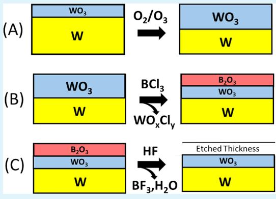

KEYWORDS: etching, atomic layer etching,  $\mathrm{WO}_3$ , W, oxidation, fluorination, conversion

# 1. INTRODUCTION

The continued miniaturization of advanced semiconductor devices requires atomic layer control in both growth and etching processes. Atomic layer deposition (ALD) and atomic layer etching (ALE) techniques can provide the necessary atomic level precision. ALD techniques have been developed for a wide range of materials over the past few decades and have been extensively adapted by the semiconductor industry. In contrast, the need for ALE techniques has emerged more recently, and ALE methods are still in an early stage of development.

Initial plasma ALE methods have been based on surface activation by halogenation followed by ion bombardment to remove surface material. Plasma processes have been developed for a variety of materials including  $\mathrm{Si},^{6,7}$  compound semiconductors, metal oxides, and carbon materials.

The plasma ALE method can achieve anisotropic etching. Thermal ALE techniques have also been demonstrated with fluorination and ligand- exchange reactions. Thermal ALE methods have been developed for  $\mathrm{Al}_2\mathrm{O}_3$ , HfO, ZrO, AIN, and  $\mathrm{AlF}_3$ . Thermal ALE is able to provide isotropic etching.

Materials with volatile metal fluorides do not have thermal ALE pathways using fluorination and ligand- exchange reactions because their fluorides are gases. Other materials, such as elemental metals, may fluorinate readily and produce fluoride layers too thick for ALE. For these materials, alternative pathways are required for controlled atomic layer etching. Some new strategies in thermal ALE have recently been introduced based on "conversion- etch" mechanisms. In the conversion- etch procedure, the surface layer is converted to a different material that can be fluorinated and removed by ligand- exchange. Conversion- etch approaches also have the potential to provide pathways for the ALE of materials with volatile fluorides.

In this Article, "conversion- fluorination" and "oxidation- conversion- fluorination" mechanisms are demonstrated for thermal ALE. The conversion reactions utilize  $\mathrm{BCl}_3$  as the reactant.  $\mathrm{BCl}_3$  has the ability to convert many metal oxides to  $\mathrm{B}_2\mathrm{O}_3$ .  $\mathrm{B}_2\mathrm{O}_3$  has a volatile fluoride and can be easily removed spontaneously as  $\mathrm{BF}_3$  and  $\mathrm{H}_2\mathrm{O}$  by HF exposures. The example of "conversion- fluorination" is  $\mathrm{WO}_3$  ALE using  $\mathrm{BCl}_3$  and HF as the reactants in an AB sequence. The example of "oxidation-

conversion- fluorination" is W ALE using  $\mathrm{O}_2 / \mathrm{O}_3,$ $\mathrm{BCl}_3,$  and HF in an ABC sequence.

Figure 1 shows the various reaction steps for W and  $\mathrm{WO}_3$  ALE. In reaction A, W is oxidized to  $\mathrm{WO}_3$  using ozone  $(\mathrm{O}_2/$

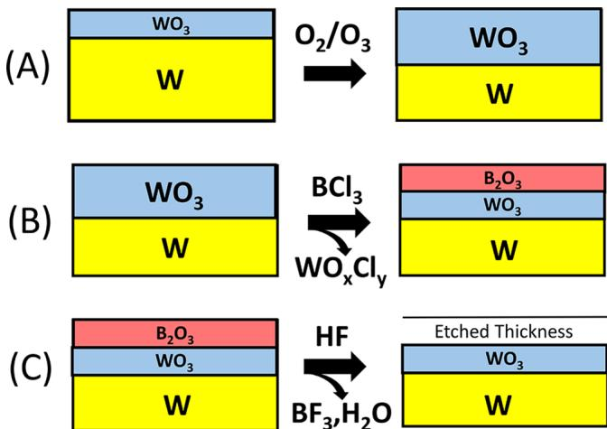  
Figure 1. Oxidation, conversion, and fluorination reactions: (A) oxidation of W using  $\mathrm{O}_2 / \mathrm{O}_3;$  B) conversion of W to  $\mathrm{WO}_3$  using  $\mathrm{BCl}_3;$  and (C) fluorination of  $\mathrm{B}_2\mathrm{O}_3$  by HF to form volatile  $\mathrm{BF}_3$  and  $\mathrm{H}_2\mathrm{O}$

$\mathrm{O}_3$  ). In reaction B,  $\mathrm{BCl}_3$  is used to convert the surface of  $\mathrm{WO}_3$  to a  $\mathrm{B}_2\mathrm{O}_3$  surface layer. During this conversion, the chlorine ligands are transferred from  $\mathrm{BCl}_3$  to the surface to form volatile  $\mathrm{WO}_x\mathrm{Cl}_x$  products. In reaction C, the  $\mathrm{B}_2\mathrm{O}_3$  surface layer can then be etched spontaneously by HF to form  $\mathrm{H}_2\mathrm{O}$  and  $\mathrm{BF}_3$  products. The conversion of  $\mathrm{WO}_3$  to  $\mathrm{B}_2\mathrm{O}_3$  is necessary because HF cannot spontaneously etch  $\mathrm{WO}_3$

Reactions  $\mathrm{A},\mathrm{B},$  and  $C$  in Figure 1 based on oxidation, conversion, and fluorination are all thermochemically favorable.26 The reaction and standard free energy changes for the oxidation of W to  $\mathrm{WO}_3$  using  $\mathrm{O}_3$  or  $\mathrm{O}_2$  are

$$
\mathrm{W} + 3\mathrm{O}_3(\mathrm{g})\rightarrow \mathrm{WO}_3 + 3\mathrm{O}_2(\mathrm{g})
$$

$$
\Delta G^{\circ}(200^{\circ}\mathrm{C}) = -296.7\mathrm{kcal / mol} \tag{1}
$$

$$
\begin{array}{rl} & {\mathrm{W} + 3 / 2\mathrm{O}_2(\mathrm{g})\rightarrow \mathrm{WO}_3}\\ & {\Delta G^{\circ}(200^{\circ}\mathrm{C}) = -171.7\mathrm{kcal / mol}} \end{array} \tag{2}
$$

Proposed conversion reactions of  $\mathrm{WO}_3$  with  $\mathrm{BCl}_3$  to yield various possible  $\mathrm{WO}_x\mathrm{Cl}_x$  reaction products and their standard free energy changes are

$$
\begin{array}{rl} & {\mathrm{WO}_3 + 2\mathrm{BCl}_3(\mathrm{g})\rightarrow \mathrm{B}_2\mathrm{O}_3 + \mathrm{WCl}_6(\mathrm{g})}\\ & {\Delta G^{\circ}(200^{\circ}\mathrm{C}) = -7.7\mathrm{kcal / mol}} \end{array} \tag{3}
$$

$$
\mathrm{WO}_3 + 4 / 3\mathrm{BCl}_3(\mathrm{g})\rightarrow 2 / 3\mathrm{B}_2\mathrm{O}_3 + \mathrm{WOCl}_4(\mathrm{g})
$$

$$
\Delta G^{\circ}(200^{\circ}\mathrm{C}) = -4.3\mathrm{kcal / mol} \tag{4}
$$

$$
\mathrm{WO}_3 + 2 / 3\mathrm{BCl}_3(\mathrm{g})\rightarrow 1 / 3\mathrm{B}_2\mathrm{O}_3 + \mathrm{WO}_2\mathrm{Cl}_2(\mathrm{g})
$$

$$
\Delta G^{\circ}(200^{\circ}\mathrm{C}) = -7.8\mathrm{kcal / mol} \tag{5}
$$

In addition, the reaction for the fluorination of  $\mathrm{B}_2\mathrm{O}_3$  to volatile  $\mathrm{BF}_3$  and  $\mathrm{H}_2\mathrm{O}$  reaction products and the standard free energy change is

$$
\mathrm{B}_2\mathrm{O}_3 + 6\mathrm{HF}(\mathrm{g})\rightarrow 2\mathrm{BF}_3(\mathrm{g}) + 3\mathrm{H}_2\mathrm{O}(\mathrm{g})
$$

$$
\Delta G^{\circ}(200^{\circ}\mathrm{C}) = -17.3\mathrm{kcal / mol} \tag{6}
$$

After removal of the  $\mathrm{B}_2\mathrm{O}_3$  surface layer, a new W or  $\mathrm{WO}_3$  surface remains. The reactions can then be repeated to etch either W or  $\mathrm{WO}_3$  W ALE uses reactions  $\mathrm{A},\mathrm{B},$  and C.  $\mathrm{WO}_3$  ALE uses reactions B and C.

HF alone should not etch or react with the  $\mathrm{WO}_3$  or W surface. Likewise,  $\mathrm{BCl}_3$  should not react with the W surface. The expectations for these reactions are based on their positive standard free energy changes:

$$
\mathrm{WO}_3 + 6\mathrm{HF}(\mathrm{g})\rightarrow \mathrm{WF}_6 + 3\mathrm{H}_2\mathrm{O}(\mathrm{g})
$$

$$
\Delta G^{\circ}(200^{\circ}\mathrm{C}) = +32.6\mathrm{kcal / mol} \tag{7}
$$

$$
\mathrm{W} + 6\mathrm{HF}(\mathrm{g})\rightarrow \mathrm{WF}_6(\mathrm{g}) + 3\mathrm{H}_2(\mathrm{g})
$$

$$
\Delta G^{\circ}(200^{\circ}\mathrm{C}) = +19.0\mathrm{kcal / mol} \tag{8}
$$

$$
\mathrm{W} + 2\mathrm{BCl}_3(\mathrm{g})\rightarrow 2\mathrm{B} + \mathrm{WCl}_6(\mathrm{g})
$$

$$
\Delta G^{\circ}(200^{\circ}\mathrm{C}) = +95.0\mathrm{kcal / mol} \tag{9}
$$

W and  $\mathrm{WO}_3$  can also be etched spontaneously using various dry etching techniques. Methods for spontaneous tungsten etching utilize plasmas containing various halogens such as fluorine27- 29 or chlorine.28,30,31 Tungsten etching occurs through formation of volatile chlorides to fluorides. Tungsten can also be etched by  $\mathrm{Cl}_2$  or  $\mathrm{XeF}_2$  gases.30,32,33  $\mathrm{WO}_3$  can be etched spontaneously with halogen- containing plasmas using  $\mathrm{NF}_3$  or  $\mathrm{SF}_6$  34- 36  $\mathrm{WF}_6$  is also known to etch  $\mathrm{WO}_3$  spontaneously at  $>180^{\circ}C$  from  $\mathrm{WO}_3$  ALD studies using  $\mathrm{WF}_6$  and  $\mathrm{H}_2\mathrm{O}$  as the reactants.37,38 This spontaneous etching of  $\mathrm{WO}_3$  by  $\mathrm{WF}_6$  suggests a pathway for W ALE based on sequential reactions with W oxidation followed by  $\mathrm{WF}_6$  exposures to remove  $\mathrm{WO}_3$

W ALE and  $\mathrm{WO}_3$  ALE may have applications in a variety of areas. In the semiconductor industry, W is employed as a conductor in contact holes and vias.39 W is also utilized for fabricating gates in 3D NAND memory devices.40 Outside the semiconductor industry, W has application in MEMS and NEMS structures.41,42  $\mathrm{WO}_3$  also is a useful material for water splitting43 and gas sensing.44 The atomic layer controlled etching of W and  $\mathrm{WO}_3$  may be needed for device fabrication. The isotropic etching of W may be particularly useful for the lateral etching required to fabricate W gates in 3D NAND flash memory.40

# 2. EXPERIMENTAL SECTION

W samples were deposited on Si wafers with a  $500~\mathrm{nm}$  thermal oxide layer. The  $\mathrm{SiO}_2$  layer improves the sensitivity of the in situ spectroscopic ellipsometry (SE) analysis by providing interference enhancement.45  $\mathrm{Al}_2\mathrm{O}_3$  ALD films were first grown on the  $\mathrm{SiO}_2$  thermal oxide layer at  $130^{\circ}\mathrm{C}$  using  $15\mathrm{Al}_2\mathrm{O}_3$  ALD cycles. These  $\mathrm{Al}_2\mathrm{O}_3$  ALD films provided an adhesion layer for W ALD growth.46 W ALD films with a thickness of  $250\mathrm{\AA}$  were then deposited at  $130^{\circ}\mathrm{C}$  with sequential self- limiting reactions of  $\mathrm{WF}_6$  and  $\mathrm{Si}_2\mathrm{H}_6$  47 These  $\mathrm{Al}_2\mathrm{O}_3$  ALD and W ALD films were deposited in a separate hot- wall viscous flow reactor. Upon exposure to atmosphere, an oxide thickness of  $12-$ $30\mathrm{\AA}$  is formed on the W film as determined by X- ray photoelectron spectroscopy (XPS) and X- ray reflectivity (XRR) analysis.48,49

The Si wafer was then diced to produce W coupons with dimensions of  $1.6\times 1.6\mathrm{cm}$  These W coupons were placed in a reaction chamber that has been described previously.50 This reaction chamber is similar to other plasma atomic layer deposition (ALD)

reactors equipped for in situ SE measurements.51 The chamber walls were coated with  $\sim 500$  cycles of  $\mathrm{Al}_2\mathrm{O}_3$  ALD using  $\mathrm{Al(CH_3)_3}$  and  $\mathrm{H}_2\mathrm{O}$  as the reactants at the chamber wall temperature of  $170^{\circ}\mathrm{C}$ .  $\mathrm{WO}_3$  films were prepared by the oxidation of the W ALD films at  $280^{\circ}\mathrm{C}$  using an  $\mathrm{O}_2$  plasma at  $600\mathrm{W}$  with an  $\mathrm{O}_2$  pressure of  $100\mathrm{mTorr}$ . The  $\mathrm{O}_2$  plasma exposures produced a  $\mathrm{WO}_3$  film thickness of  $130 - 150\mathrm{\AA}$  on the W ALD films.

A remote inductively coupled plasma (ICP) provided oxygen radicals for the oxidation of W to  $\mathrm{WO}_3$ . A quartz tube (6 cm inner diameter  $\times 25\mathrm{cm}$  long) encircled by a helical copper coil was the ICP source. A  $13.56\mathrm{MHz}$  RF generator (Paramount RF Power Supply, Advanced Energy) and  $50\Omega$  impedance matching network (Navigator Digital Matching Network, Advanced Energy) were used in conjunction to generate the ICP plasma. The distance between the ICP source and the W coupon was  $\sim 4\mathrm{cm}$ .

Etching of the  $\mathrm{WO}_3$  and W films was monitored by in situ SE using a J.A. Woollam M- 2000D ellipsometer. This ellipsometer has a spectral range of  $240 - 1700\mathrm{nm}$  and utilized an incidence angle of  $70^{\circ}$ . The  $\mathrm{WO}_3$  and W films were analyzed to obtain film thicknesses after each reaction cycle or each individual reaction. A schematic showing the film stack and ellipsometer optical beams is shown in Figure 2. Note that the individual layer thicknesses are not to scale. SE has the ability to measure the thicknesses of each individual layer in the film stack. This allows for simultaneous determination of the  $\mathrm{WO}_3$  and W film thicknesses.

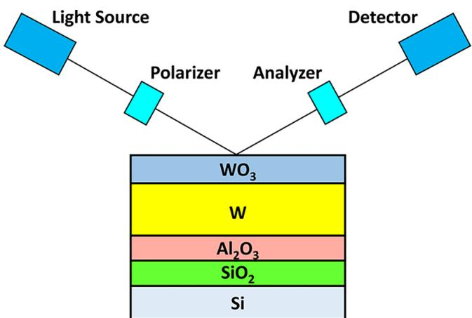  
Figure 2. Schematic showing ellipsometer beam interacting with film stack comprised of  $\mathrm{WO}_3$ , W,  $\mathrm{Al}_2\mathrm{O}_3$ ,  $\mathrm{SiO}_2$ , and underlying Si substrate.

The  $\mathrm{WO}_3$  films were analyzed using the Complete Ease software package from J.A. Woollam. The model employed a Tauc- Lorentz oscillator and a Gaussian oscillator. Only the parameters of the Tauc- Lorentz oscillator model were varied from the starting parameters to increase the accuracy of the model. The metal W layer underneath the  $\mathrm{WO}_3$  layer was measured by a B- Spline model.  $\mathrm{n}$  and  $k$  values for bulk W were used as the initial parameters and were varied to fit the experimental data.

Boron trichloride (99.9%, Synquest Laboratories) and HF- pyridine (70 wt % HF, Sigma- Aldrich) were used as the reactants. The reactants were separately dosed into the reaction chamber together with a constant stream of ultrahigh purity (UHP) nitrogen. The reactants were introduced using two pneumatic valves (Swagelok- HBVvCR4- C for  $\mathrm{BCl}_3$  or Swagelok- 6LVV- DPFR4- P- C for HF) on either side of a conductance limiting valve (Swagelok SS- 4BMG- VCR). The pneumatic valves were actuated using LabView.

Between each reactant exposure, the reaction chamber was purged with UHP nitrogen gas for  $130\mathrm{s}$  at a pressure of  $1180\mathrm{mTorr}$ . The  $\mathrm{O}_3$  for the oxidation reaction during W ALE was produced by an O3ONIA ozone generator with oxygen [Airgas,  $99.999\%$ ]. The gas flow from the ozone generator contained  $\sim 10\%$  of  $\mathrm{O}_3$  in  $\mathrm{O}_2$ . The  $\mathrm{O}_2$  pressure used for the oxidation reaction was  $70\mathrm{mTorr}$ . Therefore, the  $\mathrm{O}_3$  pressure was  $\sim 7\mathrm{mTorr}$ . The HF and  $\mathrm{BCl}_3$  purge times were  $130\mathrm{s}$  during W ALE using the  $\mathrm{O}_2 / \mathrm{O}_3$  exposures. The purge time after the  $\mathrm{O}_2 / \mathrm{O}_3$  exposures was  $60\mathrm{s}$ .

Samples were heated on a sample stage inside of the reaction chamber. A constant temperature of  $207^{\circ}\mathrm{C}$  was used for all of the ALE experiments performed to determine the self- limiting conditions. The temperature was initially targeted to be  $200^{\circ}\mathrm{C}$ . A temperature calibration revealed that the temperature was  $207^{\circ}\mathrm{C}$ . The temperature of the sample stage was varied during the studies of  $\mathrm{WO}_3$  ALE etch rate versus temperature. The chamber walls were held constant at  $170^{\circ}\mathrm{C}$ . A rotary vane pump (Alcatel 2010) was used to pump the chamber to a base pressure of  $\sim 20\mathrm{mTorr}$ . A capacitance monometer measured the chamber base pressure and pressure transients from each reactant.

# 3. RESULTS AND DISCUSSION

3.1.  $\mathrm{WO}_3$  ALE Using "Conversion- Fluorination" with  $\mathrm{BCl}_3$  and HF. Figure 3 shows the  $\mathrm{WO}_3$  layer thickness

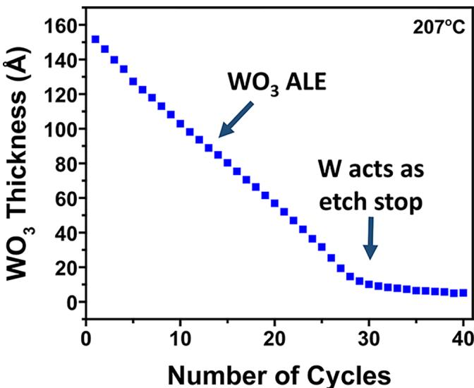  
Figure 3.  $\mathrm{WO}_3$  thickness versus number of cycles showing  $\mathrm{WO}_3$  ALE at  $207^{\circ}\mathrm{C}$  using  $\mathrm{BCl}_3$  and HF as reactants. W film under  $\mathrm{WO}_3$  layer acts as an etch stop.

measured using in situ SE during the etching of the  $\mathrm{WO}_3$  layer on the W film. These results were obtained using an AB exposure sequence with  $\mathrm{BCl}_3$  and HF as the reactants. Figure 3 displays results for 40 reaction cycles at a substrate temperature at  $207^{\circ}\mathrm{C}$ . The initial  $\mathrm{WO}_3$  film thickness is  $\sim 150\mathrm{\AA}$ . The  $\mathrm{WO}_3$  film thickness decreases linearly until reaching a  $\mathrm{WO}_3$  film thickness of  $\sim 10\mathrm{\AA}$ . The etching of the  $\mathrm{WO}_3$  layer is linear over this range of thicknesses with an etch rate of  $4.18\mathrm{\AA} / \mathrm{cycle}$ . The SE measurements confirmed that there was no change in the underlying W film thickness during  $\mathrm{WO}_3$  etching.

The  $\mathrm{WO}_3$  etch rate is reduced dramatically when the  $\mathrm{WO}_3$  layer reaches a thickness of  $\sim 10\mathrm{\AA}$ . At this point, the  $\mathrm{WO}_3 / \mathrm{W}$  interface is nearby and the  $\mathrm{WO}_3$  layer may undergo a transition to  $\mathrm{WO}_x$  oxides where  $x< 3$  before reaching the underlying W film. These  $\mathrm{WO}_x$  oxides may not be amenable to the "conversion- etch" procedure using  $\mathrm{BCl}_3$  and HF. As a result, the etch rate slows when the tungsten oxide layer thickness reaches a thickness of  $\sim 5\mathrm{\AA}$ . The underlying W film acts as an etch stop because the W film is not etched by the sequential exposures of  $\mathrm{BCl}_3$  and HF.

Figure 4 shows the  $\mathrm{WO}_3$  thickness versus number of  $\mathrm{BCl}_3$  and HF cycles at  $207^{\circ}\mathrm{C}$  for 20 cycles. The  $\mathrm{BCl}_3$  exposures were  $325\mathrm{mTorr}$  s. The maximum  $\mathrm{BCl}_3$  pressure during these exposures was  $\sim 40\mathrm{mTorr}$ . The HF exposures were  $200\mathrm{mTorr}$

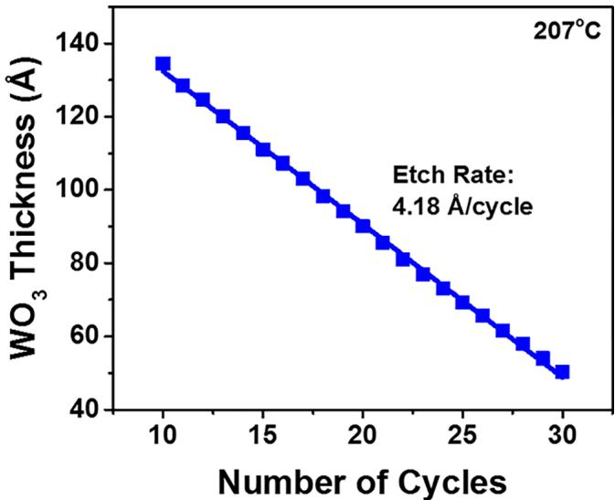  
Figure 4.  $\mathrm{WO}_3$  thickness versus number of cycles showing  $\mathrm{WO}_3$  ALE at  $207^{\circ}\mathrm{C}$  using  $\mathrm{BCl}_3$  and HF as reactants. Etch rate during  $\mathrm{WO}_3$  ALE is  $4.18\mathrm{\AA}$  /cycle.

s. The maximum HF pressure during these exposures was  $\sim 60$  mTorr. Each dose was followed by an UHP  $\mathrm{N}_2$  purge lasting  $130\mathrm{~s~}$  The data points in Figure 4 show the individual SE measurements of the  $\mathrm{WO}_3$  thickness after each reaction cycle. The etching of  $\mathrm{WO}_3$  is linear with an  $R^2$  value of 0.999. The  $\mathrm{WO}_3$  etch rate is  $4.18\mathrm{\AA}$  /cycle. Multiple measurements of  $\mathrm{WO}_3$  ALE at  $207^{\circ}\mathrm{C}$  yielded etch rates that varied from  $3.98 - 4.44\mathrm{\AA}/$  cycle. Crystalline  $\mathrm{WO}_3$  has a monoclinic structure with cell dimensions of  $a = 7.306\mathrm{\AA}$ $b = 7.540\mathrm{\AA}$  and  $c = 7.692\mathrm{\AA}$  54 The  $\mathrm{WO}_3$  etch rate is slightly more than one-half of the  $\mathrm{WO}_3$  unit cell lengths.

The etching of  $\mathrm{WO}_3$  by  $\mathrm{BCl}_3$  and HF occurs by the "conversion- fluorination" mechanism where  $\mathrm{BCl}_3$  converts the  $\mathrm{WO}_3$  surface layer to a  $\mathrm{B}_2\mathrm{O}_3$  layer. During the conversion of  $\mathrm{WO}_3$  to  $\mathrm{B}_2\mathrm{O}_3,$  the likely reaction product is a volatile  $\mathrm{WO}_x\mathrm{Cl}_y$  compound. HF can then spontaneously remove the  $\mathrm{B}_2\mathrm{O}_3$  layer by forming  $\mathrm{BF}_3$  and  $\mathrm{H}_2\mathrm{O}$  as reaction products. The removal of  $\mathrm{B}_2\mathrm{O}_3$  regenerates the original  $\mathrm{WO}_3$  surface and completes one  $\mathrm{BCl}_3 / \mathrm{HF}$  reaction cycle. The conversion of  $\mathrm{WO}_3$  to  $\mathrm{B}_2\mathrm{O}_3$  is driven by the higher stability of  $\mathrm{B}_2\mathrm{O}_3$  as compared to  $\mathrm{WO}_3$  26 The etching of  $\mathrm{B}_2\mathrm{O}_3$  by HF occurs because both  $\mathrm{BF}_3$  and  $\mathrm{H}_2\mathrm{O}$  are volatile reaction products.

To prove that  $\mathrm{B}_2\mathrm{O}_3$  can be spontaneously etched by HF,  $\mathrm{B}_2\mathrm{O}_3$  films were grown with  $\mathrm{BCl}_3$  and  $\mathrm{H}_2\mathrm{O}$  at  $20^{\circ}\mathrm{C}$ . This method was adapted from the previously reported  $\mathrm{B}_2\mathrm{O}_3$  ALD process with  $\mathrm{BBr}_3$  and  $\mathrm{H}_2\mathrm{O}$  as the reactants at  $20^{\circ}\mathrm{C}$  55  $\mathrm{B}_2\mathrm{O}_3$  films were grown using 600 cycles of  $\mathrm{BCl}_3$  and  $\mathrm{H}_2\mathrm{O}$  at  $20^{\circ}\mathrm{C}$ . This  $\mathrm{B}_2\mathrm{O}_3$  ALD process led to  $\mathrm{B}_2\mathrm{O}_3$  films with a thickness of  $\sim 580\mathrm{\AA}$ . X- ray photoelectron spectroscopy (XPS) analysis of these films was consistent with stoichiometric  $\mathrm{B}_2\mathrm{O}_3$  films. The  $\mathrm{B}_2\mathrm{O}_3$  films were then heated to  $207^{\circ}\mathrm{C}$  for the HF exposures.

The  $\mathrm{B}_2\mathrm{O}_3$  ALD films were exposed to HF pressures of 100 mTorr for  $1\mathrm{~s}$ . SE measurements were performed  $60\mathrm{~s}$  after the initial HF exposure. The SE measurements were then repeated  $12\mathrm{~min}$  after the first measurements to verify that no further etching occurred without additional HF exposures. Figure 5 shows the  $\mathrm{B}_2\mathrm{O}_3$  film thickness versus the number of HF exposures for six HF exposures. Each HF exposure removes  $\sim 2$ $\mathrm{\AA}$  of the  $\mathrm{B}_2\mathrm{O}_3$  film. The second scan recorded after  $12\mathrm{~min}$  confirms that no additional etching is observed in the absence of HF exposures. These experiments demonstrate that HF can spontaneously etch the  $\mathrm{B}_2\mathrm{O}_3$  film. The  $\mathrm{B}_2\mathrm{O}_3$  etching is dependent on the HF pressure and the HF exposure time. The spontaneous  $\mathrm{B}_2\mathrm{O}_3$  etching will continue for at least  $20 - 30$  HF exposures.

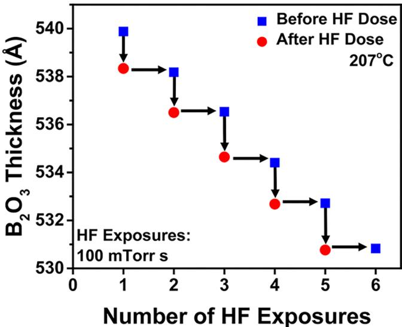  
Figure 5.  $\mathrm{B}_2\mathrm{O}_3$  thickness versus number of HF exposures showing spontaneous etching of  $\mathrm{B}_2\mathrm{O}_3$  film at  $207^{\circ}\mathrm{C}$ . HF exposure was 100 mTorr s, and  $\mathrm{B}_2\mathrm{O}_3$  etch rate is  $\sim 2\mathrm{\AA}$  per HF exposure.

Both  $\mathrm{BCl}_3$  and HF exposures are required for  $\mathrm{WO}_3$  etching. Without HF exposures,  $\mathrm{BCl}_3$  exposures alone cannot etch  $\mathrm{WO}_3$ . Without  $\mathrm{BCl}_3$  exposures, HF exposures alone did not etch  $\mathrm{WO}_3$ . Figure 6 examines the self- limiting  $\mathrm{BCl}_3$  and HF reactions during  $\mathrm{WO}_3$  ALE at  $207^{\circ}\mathrm{C}$ . The etch rates were determined by varying one reactant while holding the other reactant at a constant reactant exposure. Each precursor was dosed into a stream of UHP  $\mathrm{N}_2$  gas at a pressure of 1180 mTorr. The purge time after each reactant exposure was  $130\mathrm{~s}$ .

The self- limiting behavior for the  $\mathrm{WO}_3$  etch rate versus the  $\mathrm{BCl}_3$  exposure is shown in Figure 6a. The  $\mathrm{BCl}_3$  exposures were varied from 0 to 492 mTorr s. The HF exposures were held constant at 200 mTorr s. Increasing the  $\mathrm{BCl}_3$  exposure to  $>225$  mTorr s did not produce significantly more  $\mathrm{WO}_3$  etching. The  $\mathrm{BCl}_3$  reaction with  $\mathrm{WO}_3$  is self- limiting at the larger  $\mathrm{BCl}_3$  exposures with an etch rate of  $\sim 4.2\mathrm{\AA}$  /cycle.

The self- limiting behavior of the HF exposure is shown in Figure 6b. The HF exposure was varied from 0 to 318 mTorr s.  $\mathrm{BCl}_3$  exposures were held constant at  $327\mathrm{~mTorr~s}$ . The  $\mathrm{WO}_3$  etch rate increases progressively versus HF exposure. Increasing the HF exposure to  $>200\mathrm{~mTorr~s}$  did not produce significantly more  $\mathrm{WO}_3$  etching. The HF reaction with  $\mathrm{WO}_3$  is self- limiting at larger HF exposures with an etch rate of  $\sim 4.2\mathrm{\AA}$  /cycle.

Figure 7 shows SE measurements that were recorded after each  $\mathrm{BCl}_3$  and HF exposure during  $\mathrm{WO}_3$  ALE at  $207^{\circ}\mathrm{C}$  for 26 half- cycles. The  $\mathrm{WO}_3$  thickness decreases linearly with the number of half- cycles. An expansion of the  $\mathrm{WO}_3$  thickness versus number of half- cycles for four half- cycles is displayed in Figure 8. The SE model assumed that the entire film was  $\mathrm{WO}_3$ . Adding a Cauchy layer to account for the  $\mathrm{B}_2\mathrm{O}_3$  layer on the  $\mathrm{WO}_3$  film after the  $\mathrm{BCl}_3$  conversion reaction did not improve the SE fitting. Figure 8 indicates that the  $\mathrm{WO}_3$  thickness etched in one  $\mathrm{BCl}_3 / \mathrm{HF}$  cycle is  $4.29\mathrm{\AA}$ . The thickness loss after the  $\mathrm{BCl}_3$  exposure is  $2.99\mathrm{\AA}$ . The thickness loss after the HF exposure is  $1.30\mathrm{\AA}$ .

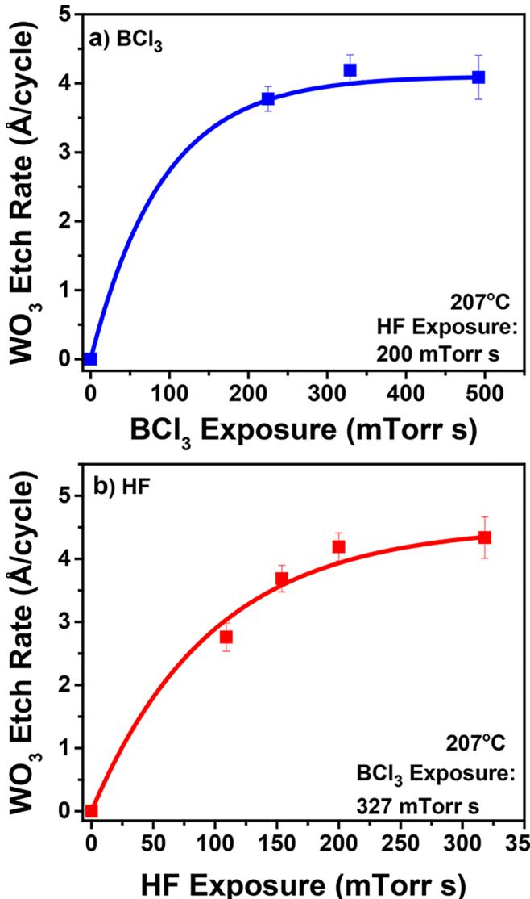

  
Figure 6.  $\mathrm{WO}_3$  etch rate versus reactant exposure during  $\mathrm{WO}_3$  ALE at  $207^{\circ}\mathrm{C}$ . (a)  $\mathrm{BCl}_3$  exposure was varied with HF exposure held at 200 mTorr s. (b) HF exposure was varied with  $\mathrm{BCl}_3$  exposure held at 327 mTorr s.  
Figure 7.  $\mathrm{WO}_3$  thickness versus number of half-cycles during  $\mathrm{WO}_3$  ALE at  $207^{\circ}\mathrm{C}$  under self-limiting conditions.

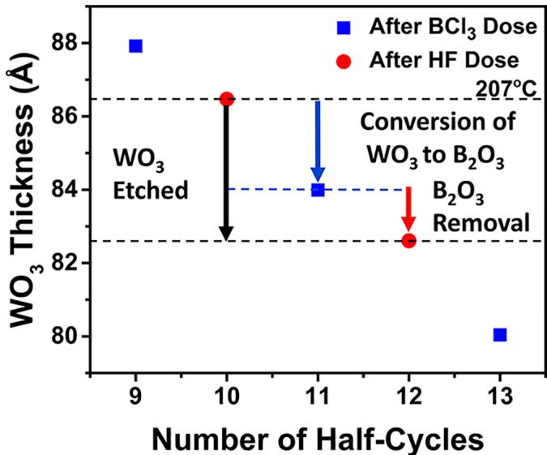  
Figure 8. Analysis of  $\mathrm{WO}_3$  thickness change after  $\mathrm{BCl}_3$  exposure and HF exposure during  $\mathrm{WO}_3$  ALE at  $207^{\circ}\mathrm{C}$ .

The  $\mathrm{WO}_3$  thickness loss of  $4.29\mathrm{\AA}$  during one complete cycle represents  $1.32\times 10^{- 9}\mathrm{WO}_3\mathrm{mol / cm}^2$  based on a  $\mathrm{WO}_3$  density of  $7.16~\mathrm{g / cm}^3$  and a  $\mathrm{WO}_3$  molar mass of  $231.8~\mathrm{g / mol}$ . During the  $\mathrm{WO}_3$  etching,  $\mathrm{WO}_3$  can be converted to various amounts of  $\mathrm{B}_2\mathrm{O}_3$  depending on the possible  $\mathrm{BCl}_3$  conversion reactions given by eqs 3- 5. The thickness loss of  $2.99\mathrm{\AA}$  after the  $\mathrm{BCl}_3$  exposure leaves a  $\mathrm{B}_2\mathrm{O}_3$  thickness of  $1.30\mathrm{\AA}$  on the surface. The SE modeling assumes that the  $\mathrm{B}_2\mathrm{O}_3$  thickness can be modeled as indistinguishable from a  $\mathrm{WO}_3$  thickness. This  $\mathrm{B}_2\mathrm{O}_3$  thickness is then removed by the subsequent HF exposure.

The  $\mathrm{B}_2\mathrm{O}_3$  thickness of  $1.30\mathrm{\AA}$  on the surface prior to removal by HF is in agreement with the  $\mathrm{BCl}_3$  conversion reaction given by eq 5. This  $\mathrm{BCl}_3$  conversion reaction yields  $\mathrm{WO}_2\mathrm{Cl}_2$  as the volatile reaction product. On the basis of eq 5, the predicted  $\mathrm{B}_2\mathrm{O}_3$  thickness remaining on the surface after the conversion of  $4.29\mathrm{\AA}$  of  $\mathrm{WO}_3$  or  $1.32\times 10^{- 9}\mathrm{WO}_3\mathrm{mol / cm}^2$  is  $1.25\mathrm{\AA}$ . The predicted  $\mathrm{B}_2\mathrm{O}_3$  thickness of  $1.25\mathrm{\AA}$  agrees well with the measured  $\mathrm{B}_2\mathrm{O}_3$  thickness of  $1.30\mathrm{\AA}$ . Mass spectrometry studies are needed to confirm  $\mathrm{WO}_2\mathrm{Cl}_2$  as the volatile reaction product.

The  $\mathrm{WO}_3$  film thicknesses versus number of  $\mathrm{BCl}_3$  and HF reaction cycles at different substrate temperatures are shown in Figure 9. The self- limiting reaction conditions at  $207^{\circ}\mathrm{C}$  were used for all of the various temperatures. The self- limiting conditions were a  $\mathrm{BCl}_3$  exposure of  $325\mathrm{mTorr}\mathrm{s}$  and an HF exposure of  $200\mathrm{mTorr}\mathrm{s}$ . All of the initial  $\mathrm{WO}_3$  thicknesses were referenced to a starting value of  $140\mathrm{\AA}$  to compare the results at 128, 160, 196, and  $207^{\circ}\mathrm{C}$ . For all of the temperatures, the  $\mathrm{WO}_3$  etching is linear with the number of reaction cycles. The etch rate also increases at higher temperatures. The etch rates are 0.55, 2.04, 2.95, and  $4.19\mathrm{\AA}$  cycle at 128, 160, 196, and  $207^{\circ}\mathrm{C}$ , respectively.

Figure 10 shows an Arrhenius plot of all of the etch rates at different temperatures acquired from the SE measurements. The approximately linear plot of ln(etch rate) versus  $1 / T$  shows that the etch rates are nearly exponentially dependent on temperature. The temperature- dependent  $\mathrm{WO}_3$  etch rate exhibits an activation energy of  $8.6\mathrm{~kcal / mol}$ . The temperature dependence of the  $\mathrm{WO}_3$  etch rate provides a means to control the  $\mathrm{WO}_3$  etch rate.

3.2. W ALE Using "Oxidation- Conversion- Fluorination" with  $\mathrm{O}_3$ ,  $\mathrm{BCl}_3$ , and HF. The development of  $\mathrm{WO}_3$  ALE

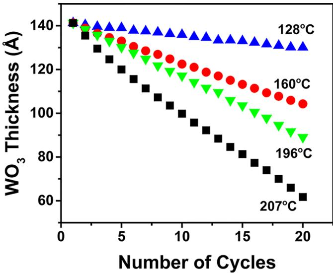  
Figure 9.  $\mathrm{WO}_3$  thickness versus number of cycles for  $\mathrm{WO}_3$  ALE at 128, 160, 196, and  $207^{\circ}\mathrm{C}$ .

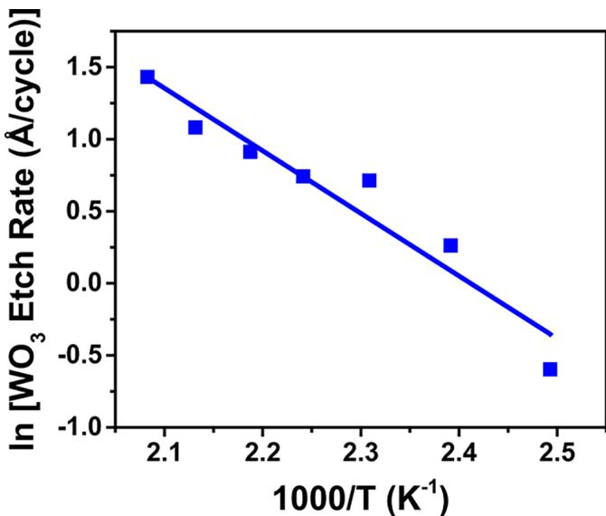  
Figure 10. Arrhenius plot of temperature-dependent etch rates for  $\mathrm{WO}_3$  ALE. Slope of the Arrhenius plot yields an activation barrier of  $8.6\mathrm{kcal / mol}$ .

opens a pathway to W ALE. Tungsten can first be oxidized to  $\mathrm{WO}_3$ . Subsequently,  $\mathrm{WO}_3$  can be etched using sequential  $\mathrm{BCl}_3$  and HF exposures as described in section 3.1. The oxidation of W to produce  $\mathrm{WO}_3$  must be self- limiting to obtain atomic layer control of W etching. This requirement is demanding because oxidation of metals is generally very favorable, and often the oxidation can extend deep into the initial metal.

Tungsten oxidation has been studied extensively over a variety of temperatures and oxidation conditions. Many investigations have been reported at high temperatures  $>500$ $^\circ \mathrm{C}$  where tungsten oxidizes readily to form  $\mathrm{WO}_3$  and other tungsten oxides.56,57 At temperatures  $>800^{\circ}\mathrm{C}$ , these oxides can also desorb into the gas phase.58 At temperatures between 300 and  $400^{\circ}\mathrm{C}$ , tungsten is oxidized by  $\mathrm{O}_2$  to form a  $\mathrm{WO}_3$  layer with thicknesses of  $10 - 50\mathrm{nm}$  59- 61 The  $\mathrm{WO}_3$  layer acts as a diffusion barrier that limits further oxidation.62

At lower temperatures of  $< 300^{\circ}\mathrm{C}$ , the tungsten oxidation is limited to thin  $\mathrm{WO}_3$  films on the W substrate.59,61,63 Oxide thicknesses of  $10 - 16\mathrm{\AA}$  have been reported after  $\mathrm{O}_2$  exposures on polycrystalline W substrates for  $1\mathrm{h}$  at  $23 - 200^{\circ}\mathrm{C}$  61 Somewhat thicker oxide thicknesses have been measured when using  $\mathrm{O}_2$  plasmas to oxidize tungsten at lower temperatures.64,65 Tungsten oxidation at these lower temperatures is compatible with the temperature for  $\mathrm{WO}_3$  ALE and also is self- limiting at thin film thicknesses that are required for an ALE process.

Figure 11 shows results for the tungsten thickness versus number of ABC reaction cycles during W ALE at  $207^{\circ}\mathrm{C}$ . In

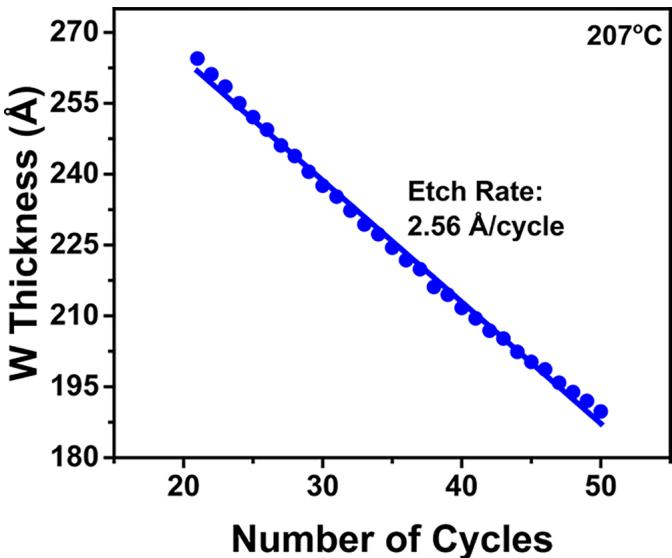  
Figure 11. W thickness versus number of cycles during W ALE at 207  $^\circ \mathrm{C}$  using  $\mathrm{O}_2 / \mathrm{O}_3$ ,  $\mathrm{BCl}_3$ , and HF as reactants. Etch rate during W ALE is  $2.56\mathrm{\AA} / \mathrm{cycle}$ .

these experiments, the surface of the W film was oxidized to  $\mathrm{WO}_3$  using  $\mathrm{O}_2 / \mathrm{O}_3$  pressures of  $70\mathrm{mTorr}$ . The  $\mathrm{WO}_3$  layer was then etched using the next  $\mathrm{BCl}_3$  and HF exposures. The W ALE was conducted under self- limiting conditions for the  $\mathrm{O}_2 / \mathrm{O}_3$ ,  $\mathrm{BCl}_3$ , and HF reactions at  $207^{\circ}\mathrm{C}$  as discussed below. The  $\mathrm{O}_2 / \mathrm{O}_3$  exposure was  $3150\mathrm{mTorr}$  s, the  $\mathrm{BCl}_3$  exposure was  $329\mathrm{mTorr}$  s, and the HF exposure was  $2800\mathrm{mTorr}$  s.

Figure 11 reveals that the tungsten film thickness decreases linearly versus the number of cycles. The etch rate is  $2.56\mathrm{\AA} / \mathrm{cycle}$ , and the  $R^2$  value of the linear fit is  $0.996$ . Multiple SE measurements of W ALE at  $207^{\circ}\mathrm{C}$  yielded etch rates that varied from  $2.35 - 2.56\mathrm{\AA} / \mathrm{cycle}$ . XRR measurements confirmed the SE measurements. The W etch rate at  $207^{\circ}\mathrm{C}$  is slightly less than one unit cell length. W has a body- centered cubic structure with a unit cell length of  $3.19\mathrm{\AA}$ .

The  $\mathrm{WO}_3$  and W layer thicknesses could be determined simultaneously using SE measurements during W ALE. Figure 12 shows the concurrent SE measurements of the  $\mathrm{WO}_3$  and W film thicknesses versus the number of half- cycles at  $207^{\circ}\mathrm{C}$ . The half- cycles are the  $\mathrm{O}_2 / \mathrm{O}_3$  oxidation reaction and the  $\mathrm{BCl}_3 / \mathrm{HF}$  etching reaction. The  $\mathrm{O}_2 / \mathrm{O}_3$  exposure was  $3150\mathrm{mTorr}$  s, the  $\mathrm{BCl}_3$  exposure was  $329\mathrm{mTorr}$  s, and the HF exposure was  $2800\mathrm{mTorr}$  s. The ellipsometry measurements were performed after each half- cycle. The SE measurements were able to monitor both the growth and etching of the  $\mathrm{WO}_3$  layer and the concurrent removal of the underlying W film.

With an ABC exposure sequence, the  $\mathrm{WO}_3$  thickness is increased during W oxidation by  $\mathrm{O}_2 / \mathrm{O}_3$  and then decreased during the  $\mathrm{BCl}_3$  and HF etching reactions. The oxidation and

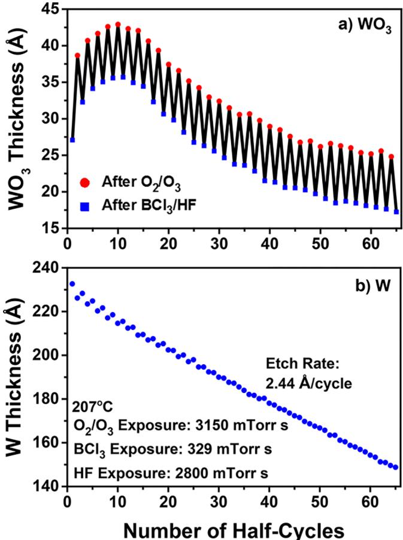  
Figure 12.  $\mathrm{WO}_3$  and W thickness versus number of half-cycles during W ALE under self-limiting conditions using  $\mathrm{O}_2 / \mathrm{O}_3,$ $\mathrm{BCl}_3,$  and HF as reactants at  $207^{\circ}C$  a  $\mathrm{WO}_3$  thickness showing oscillation of  $\mathrm{WO}_3$  thickness after  $\mathrm{O}_2 / \mathrm{O}_3$  exposure and  $\mathrm{BCl}_3 / \mathrm{HF}$  reaction.b)W thickness showing linear reduction versus number of half-cycles with an etch rate of  $2.44\mathrm{\AA}/$  cycle.

etching leads to an oscillatory  $\mathrm{WO}_3$  thickness in Figure 12a versus the number of half- cycles. The increase in the  $\mathrm{WO}_3$  thickness from oxidation is  $7.2\mathrm{\AA}/$  half- cycle averaged over five random half- cycles after 12 half- cycles. The decrease in the  $\mathrm{WO}_3$  thickness from the  $\mathrm{BCl}_3 / \mathrm{HF}$  etching is  $7.7\mathrm{\AA}/$  half- cycle averaged over five random half- cycles after 12 half- cycles.

The  $\mathrm{WO}_3$  thickness loss of  $\sim 7.7\mathrm{\AA}$  after the  $\mathrm{BCl}_3 / \mathrm{HF}$  reactions during W ALE at  $207^{\circ}C$  is larger than the  $\mathrm{WO}_3$  thickness loss of  $\sim 4.2\mathrm{\AA}/$  cycle during  $\mathrm{WO}_3$  ALE at  $207^{\circ}C$ $\mathrm{WO}_3$  ALE is performed with  $\mathrm{BCl}_3$  and HF as the reactants. W ALE is performed with  $\mathrm{O}_2 / \mathrm{O}_3,$ $\mathrm{BCl}_3,$  and HF as the reactants. The addition of the  $\mathrm{O}_2 / \mathrm{O}_3$  exposure may alter the surface species and affect the  $\mathrm{BCl}_3 / \mathrm{HF}$  reactions. Additional experiments were conducted where  $\mathrm{O}_2 / \mathrm{O}_3$  was removed from the ABC exposure sequence and  $\mathrm{WO}_3$  ALE was performed on  $\mathrm{WO}_3$  films produced using  $\mathrm{O}_2 / \mathrm{O}_3$  . These experiments observed a  $\mathrm{WO}_3$  etch rate of  $\sim 4.2\mathrm{\AA}/$  cycle that is the same as the etch rate of  $\sim 4.2\mathrm{\AA}/$  cycle for  $\mathrm{WO}_3$  films produced using an  $\mathrm{O}_2$  plasma. The  $\mathrm{WO}_3$  etching is not dependent on the oxidant used to form the  $\mathrm{WO}_3$  film.

Figure 12a also observes an increase in the  $\mathrm{WO}_3$  thickness from  $\sim 30$  to  $\sim 40\mathrm{\AA}$  during the first 10 half- cycles. This increase is followed by a reduction to an oxide thickness of  $\sim 20\mathrm{\AA}$  after 60 half- cycles. The change in the  $\mathrm{WO}_3$  thickness results from the competition between  $\mathrm{WO}_3$  growth during the  $\mathrm{O}_2 / \mathrm{O}_3$  exposures and  $\mathrm{WO}_3$  etching during the  $\mathrm{BCl}_3 / \mathrm{HF}$  reactions.

Higher or lower  $\mathrm{O}_2 / \mathrm{O}_3$  exposures were observed to result in more or less  $\mathrm{WO}_3$  growth. The presence of a maximum  $\mathrm{WO}_3$  thickness after 10 half- cycles in Figure 12a may be related to nucleation effects combined with the competition between  $\mathrm{WO}_3$  growth and  $\mathrm{WO}_3$  etching.

Concurrent ellipsometry measurements of the W thickness are shown in Figure 12b. While the  $\mathrm{WO}_3$  thickness is oscillating during the oxidation and etching half- cycles, the W thickness is reduced linearly versus number of half- cycles. The W etching rate is  $2.44\mathrm{\AA}/$  cycle. A small oscillation of the W thickness was observed over the first 30 half- cycles. The decreases in the W thickness during the half- cycles occur after the  $\mathrm{O}_2 / \mathrm{O}_3$  exposures when W is oxidized to  $\mathrm{WO}_3$  . This slight oscillation may be an artifact from the ellipsometric modeling.

An expansion of the oscillation in the  $\mathrm{WO}_3$  thickness in Figure 12a is shown in Figure 13. The increase of the  $\mathrm{WO}_3$

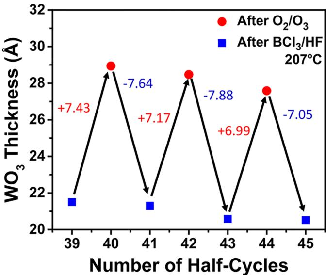  
Figure 13. Enlargement of  $\mathrm{WO}_3$  thickness versus number of halfcycles showing increase and decrease of  $\mathrm{WO}_3$  thickness after  $\mathrm{O}_2 / \mathrm{O}_3$  exposure and  $\mathrm{BCl}_3 / \mathrm{HF}$  reaction.

thickness during oxidation and the reduction of the  $\mathrm{WO}_3$  thickness during etching for six consecutive half- cycles are dramatic. Values of the individual  $\mathrm{WO}_3$  thickness increases and decreases are given in Figure 13. In addition, the increase in the  $\mathrm{WO}_3$  thickness from oxidation is  $7.2\mathrm{\AA}/$  half- cycle averaged over five random half- cycles after 12 half- cycles in Figure 12a. The decrease in the  $\mathrm{WO}_3$  thickness from the  $\mathrm{BCl}_3 / \mathrm{HF}$  etching is 7.7 A/half- cycle averaged over five random half- cycles after 12 halfcycles in Figure 12a.

The ratio of the  $\mathrm{WO}_3$  thickness gain per half- cycle and the W thickness loss per cycle should be equal to the ratio of the  $\mathrm{WO}_3$  and W molar volumes. This expectation is based on conservation of tungsten mass where a W loss must equal a  $\mathrm{WO}_3$  gain. The ratio of the  $\mathrm{WO}_3$  gain and W loss is 7.2 (A/halfcycle)/2.44  $(\mathrm{\AA / cycle}) = 2.95$  In comparison, the ratio of the molar volumes for  $\mathrm{WO}_3$  and W is  $(32.4\mathrm{cm}^3 /\mathrm{mol}) / (9.5\mathrm{cm}^3 /$ $\mathrm{mol}) = 3.4$  The ratio of the molar volumes is only slightly higher than the ratio of the etch rates. This reasonable agreement is confirmation that W ALE occurs by conversion of W to  $\mathrm{WO}_3$  followed by the etching of  $\mathrm{WO}_3$  .The slight differences in the ratios may also be explained by some  $\mathrm{WO}_2$  in the tungsten oxide layer. As compared to  $\mathrm{WO}_3,$ $\mathrm{WO}_2$  has a smaller molar volume of  $20.0\mathrm{cm}^3 /\mathrm{mol}$  The molar volume of a

mixture of  $\mathrm{WO}_3 / \mathrm{WO}_2$  would lower the ratio of the molar volumes for  $\mathrm{WO}_3 / \mathrm{WO}_2$  and W.

The self- limiting nature of the  $\mathrm{O}_2 / \mathrm{O}_3$ ,  $\mathrm{BCl}_3$ , and HF reactions is critical to establish a W ALE process. Self- limiting  $\mathrm{BCl}_3$  and HF reactions have already been established during the characterization of  $\mathrm{WO}_3$  ALE as shown in Figure 6. The self- limiting behavior of the  $\mathrm{O}_2 / \mathrm{O}_3$ ,  $\mathrm{BCl}_3$ , and HF reactions during W ALE also needs to be verified to confirm a self- limiting procedure for W ALE.

Figure 14 displays the W etch rate versus  $\mathrm{O}_2 / \mathrm{O}_3$  exposure during the ABC reaction sequence at  $207^{\circ}\mathrm{C}$ . The pressure of the  $\mathrm{O}_2 / \mathrm{O}_3$  exposure was  $70\mathrm{mTorr}$  for the different exposure times of 15, 30, 45, and  $60~\mathrm{s}$ . HF and  $\mathrm{BCl}_3$  exposures were held constant at 2800 and  $500~\mathrm{mTorr}$  s, respectively. The HF and  $\mathrm{BCl}_3$  pressures were 53.6 and  $60~\mathrm{mTorr}$ , respectively, during these exposures. Figure 14 shows that the W etch rate increases with  $\mathrm{O}_2 / \mathrm{O}_3$  exposure and reaches a maximum etch rate of 2.45  $\mathrm{\AA / cycle}$  at an  $\mathrm{O}_2 / \mathrm{O}_3$  exposure of 3150 mTorr s. The line fitting the data points is meant to guide the eye.

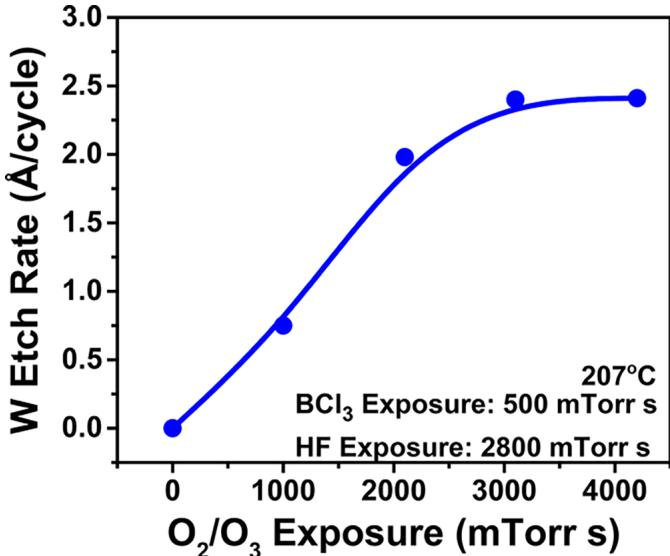  
Figure 14. W etch rate versus  $\mathrm{O}_2 / \mathrm{O}_3$  exposure during W ALE at  $207^{\circ}\mathrm{C}$ .  $\mathrm{BCl}_3$  and HF exposures were held at 500 and 2800 mTorr s, respectively.

Results for the W etch rate versus  $\mathrm{BCl}_3$  or HF exposure during W ALE at  $207^{\circ}\mathrm{C}$  are shown in Figure 15a and b, respectively. These measurements were performed by varying one reactant exposure and holding the other two reactant exposures constant.  $\mathrm{BCl}_3$  and HF were dosed into a stream of UHP  $\mathrm{N}_2$  that was a pressure of  $1180~\mathrm{mTorr}$ . A purge of  $130~\mathrm{s}$  was employed after etch reactant exposure. The  $\mathrm{O}_2 / \mathrm{O}_3$  exposure was  $3150~\mathrm{mTorr}$  s conducted at an  $\mathrm{O}_2 / \mathrm{O}_3$  pressure of  $70~\mathrm{mTorr}$ . A purge of  $60~\mathrm{s}$  was used after each  $\mathrm{O}_2 / \mathrm{O}_3$  exposure.

Figure 15a shows the results for varying the  $\mathrm{BCl}_3$  exposure while holding the HF and  $\mathrm{O}_2 / \mathrm{O}_3$  exposures constant at 2800 and 3150 mTorr s, respectively. The  $\mathrm{BCl}_3$  exposures were varied from 0 to  $500~\mathrm{mTorr}$  s. The  $\mathrm{BCl}_3$  exposure converts the  $\mathrm{WO}_3$  surface to a  $\mathrm{B}_2\mathrm{O}_3$  surface layer. The  $\mathrm{B}_2\mathrm{O}_3$  surface layer is then spontaneously etched by HF. The W etch rate increases rapidly with  $\mathrm{BCl}_3$  exposure. With a  $\mathrm{BCl}_3$  exposure of  $329~\mathrm{mTorr}$  s, the W etch rate reaches the self- limiting W etch rate of 2.45  $\mathrm{\AA / cycle}$ .

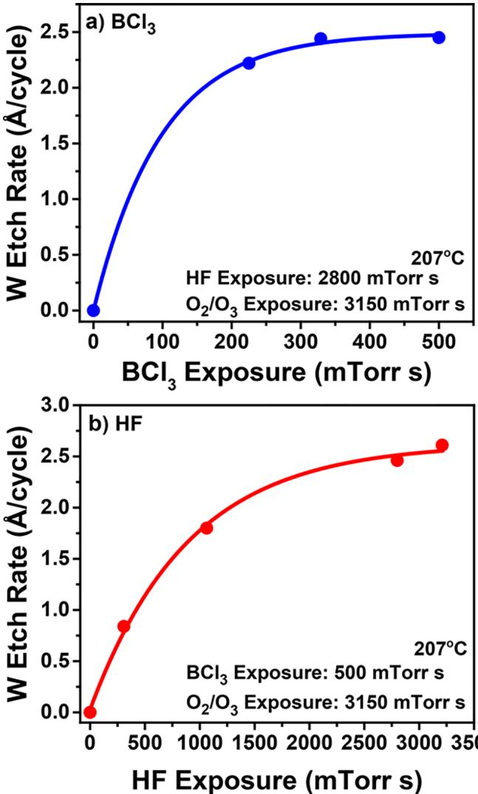  
Figure 15. W etch rate versus reactant exposure during W ALE. (a)  $\mathrm{BCl}_3$  exposure was varied with HF and  $\mathrm{O}_2 / \mathrm{O}_3$  exposures held at 2800 and  $3150~\mathrm{mTorr}$  s, respectively. (b) HF exposure was varied with  $\mathrm{BCl}_3$  and  $\mathrm{O}_2 / \mathrm{O}_3$  exposures held at 500 and  $3150~\mathrm{mTorr}$  s, respectively.

Figure 15b shows the results for varying the HF exposure while holding the  $\mathrm{BCl}_3$  and  $\mathrm{O}_2 / \mathrm{O}_3$  exposures constant at 500 and  $3150~\mathrm{mTorr}$  s, respectively. Higher HF exposures progressively remove the  $\mathrm{B}_2\mathrm{O}_3$  surface layer as volatile  $\mathrm{BF}_3$  and  $\mathrm{H}_2\mathrm{O}$ . With HF exposures of 2800 mTorr s, the W etch rate reaches the self- limiting W etch rate of  $2.45\mathrm{\AA / cycle}$ .

Additional experiments examined the oxidation of the W ALD films by successive  $\mathrm{O}_2 / \mathrm{O}_3$  exposures at  $207^{\circ}\mathrm{C}$ . The  $\mathrm{O}_2 / \mathrm{O}_3$  exposures were  $3150~\mathrm{mTorr}$  s resulting from an  $\mathrm{O}_2 / \mathrm{O}_3$  pressure of  $70~\mathrm{mTorr}$  for  $45~\mathrm{s}$ . This is the same  $\mathrm{O}_2 / \mathrm{O}_3$  exposure that was employed in the W ALE experiments. The W ALD films had been exposed to atmosphere prior to loading into the reactor. The  $\mathrm{WO}_3$  thickness on the W ALD film was then measured by SE after each  $\mathrm{O}_2 / \mathrm{O}_3$  exposure. The  $\mathrm{WO}_3$  thickness versus number of  $\mathrm{O}_2 / \mathrm{O}_3$  exposures is displayed in Figure 16.

The initial  $\mathrm{WO}_3$  thickness in Figure 16 is  $\sim 33\mathrm{\AA}$ . This thickness is close to the native oxide thicknesses on tungsten that have been measured earlier with XPS and XRR analysis. The  $\mathrm{WO}_3$  thickness is nearly constant at  $\sim 33\mathrm{\AA}$  after the first three  $\mathrm{O}_2 / \mathrm{O}_3$  exposures. This constant oxide thickness may be related to the  $\mathrm{O}_2 / \mathrm{O}_3$  exposure cleaning

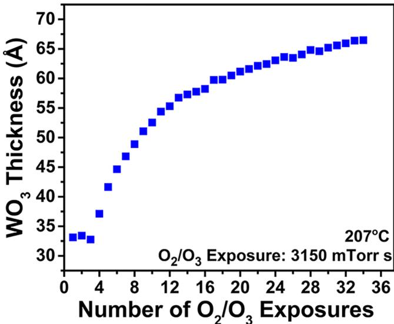  
Figure 16.  $\mathrm{WO}_3$  thickness versus number of  $\mathrm{O}_2 / \mathrm{O}_3$  exposures for initial W ALD film. Each  $\mathrm{O}_2 / \mathrm{O}_3$  exposure was 70 mTorr for  $45\mathrm{~s~}$

residual carbon from the surface. Figure 16 then shows that the  $\mathrm{WO}_3$  thickness increases consistently after the third  $\mathrm{O}_2 / \mathrm{O}_3$  exposure. However, the increase is progressively reduced after each  $\mathrm{O}_2 / \mathrm{O}_3$  exposure. This behavior is suggestive of diffusion- limited oxidation when the surface oxide acts as a barrier for oxidation of the underlying W metal. Similar behavior is also observed for the diffusion- limited oxidation of silicon described by the Deal- Grove model.62 The  $\mathrm{WO}_3$  thickness is  $\sim 66\mathrm{\AA}$  after  $34\mathrm{O}_2 / \mathrm{O}_3$  exposures. XPS analysis of the  $\mathrm{WO}_3$  film produced by these  $\mathrm{O}_2 / \mathrm{O}_3$  exposures was consistent with stoichiometric  $\mathrm{WO}_3$  with W in the  $6+$  oxidation state.

The larger  $\mathrm{WO}_3$  thicknesses produced by greater number of sequential  $\mathrm{O}_2 / \mathrm{O}_3$  exposures may lead to W etch rates that are higher after larger  $\mathrm{O}_2 / \mathrm{O}_3$  exposures. However, Figure 14 shows that the W etch rate is self- limiting versus  $\mathrm{O}_2 / \mathrm{O}_3$  exposure. This behavior suggests that the W ALE is self- limiting because of the self- limiting  $\mathrm{BCl}_3$  and HF reactions. Larger  $\mathrm{O}_2 / \mathrm{O}_3$  exposures may lead to larger  $\mathrm{WO}_3$  film thicknesses. However, the  $\mathrm{WO}_3$  removal is still limited by the self- limiting  $\mathrm{BCl}_3$  and HF reactions. The  $\mathrm{BCl}_3$  and HF reactions may only remove a fraction of the  $\mathrm{WO}_3$  film. After partial removal of the  $\mathrm{WO}_3$  film, the next  $\mathrm{O}_2 / \mathrm{O}_3$  exposure would then reestablish a larger  $\mathrm{WO}_3$  film thickness that is consistent with the  $\mathrm{O}_2 / \mathrm{O}_3$  exposure.

Additional experiments were performed at  $207^{\circ}\mathrm{C}$  by varying the  $\mathrm{O}_2 / \mathrm{O}_3$  exposure times with an  $\mathrm{O}_2 / \mathrm{O}_3$  pressure of 70 mTorr under self- limiting conditions for the  $\mathrm{BCl}_3$  and HF reactions.  $\mathrm{O}_2 / \mathrm{O}_3$  exposure times of 45 and  $60\mathrm{~s~}$  both produced W ALE etch rates of  $2.45\mathrm{\AA}$  cycle. However, the  $\mathrm{WO}_3$  film thickness was  $\sim 20\mathrm{\AA}$  for the  $45\mathrm{~s~}\mathrm{O}_2 / \mathrm{O}_3$  exposures  $(3150\mathrm{mTorr s})$  and  $\sim 30\mathrm{\AA}$  for the  $60\mathrm{~s~O}_2 / \mathrm{O}_3$  exposures  $(4200\mathrm{mTorr s})$  after  $>20$  reaction cycles. The consequence of larger  $\mathrm{O}_2 / \mathrm{O}_3$  exposure times at constant  $\mathrm{O}_2 / \mathrm{O}_3$  pressures is thicker  $\mathrm{WO}_3$  thicknesses during W ALE. However, the W ALE etch rates remain the same. These results argue that W ALE is self- limiting because of the self- limiting  $\mathrm{BCl}_3$  and HF reactions.

Figure 12a shows that the  $\mathrm{WO}_3$  thickness is reduced to a thickness of  $\sim 20\mathrm{\AA}$  after 60 half- cycles during W ALE with an  $\mathrm{O}_2 / \mathrm{O}_3$  pressure of  $70\mathrm{mTorr}$  and  $\mathrm{O}_2 / \mathrm{O}_3$  exposure time of  $45\mathrm{~s~}$  under self- limiting conditions for the  $\mathrm{BCl}_3$  and HF reactions. Removal of this  $\mathrm{WO}_3$  layer on W may be important for applications where no oxide is desired for proper device function. This  $\mathrm{WO}_3$  layer can be removed by stopping the  $\mathrm{O}_2 / \mathrm{O}_3$  exposures and utilizing an AB reaction sequence with  $\mathrm{BCl}_3$  and HF exposures. Figure 17a displays the removal of the  $\mathrm{WO}_3$

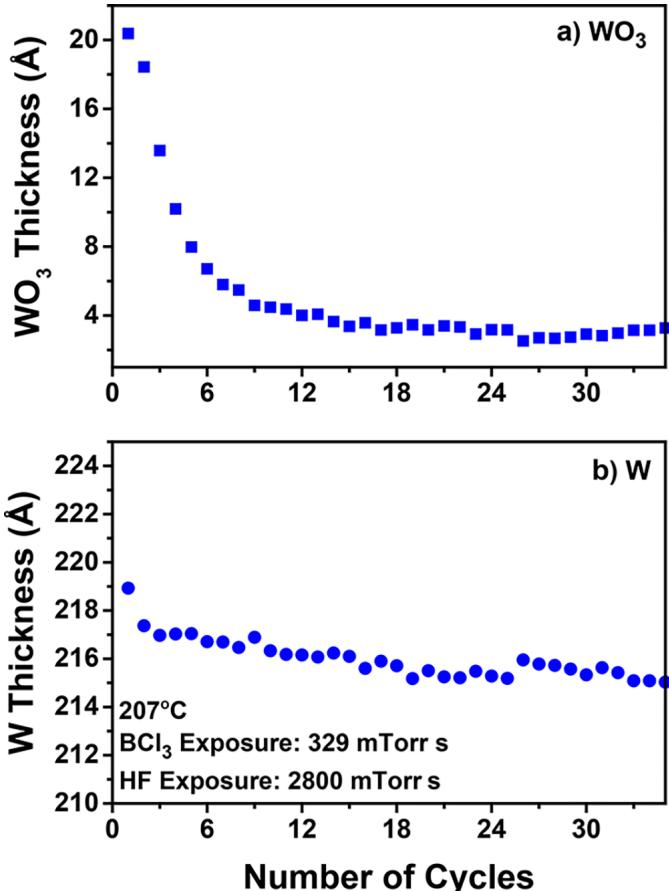  
Figure 17.  $\mathrm{WO}_3$  removal after W ALE using  $\mathrm{BCl}_3$  and HF as reactants. (a)  $\mathrm{WO}_3$  thickness versus number of cycles showing reduction of  $\mathrm{WO}_3$  thickness to limiting value of  $\sim 3\mathrm{\AA}$ . (b) W thickness versus number of cycles showing that W thickness remains nearly constant during  $\mathrm{WO}_3$  removal.

layer after W ALE versus the number of  $\mathrm{BCl}_3 / \mathrm{HF}$  reaction cycles using the self- limiting reaction conditions for  $\mathrm{WO}_3$  ALE at  $207^{\circ}\mathrm{C}$ . The  $\mathrm{WO}_3$  layer thickness is reduced in thickness from  $20\mathrm{\AA}$  to a limiting thickness of  $\sim 3\mathrm{\AA}$  after  $>12$  reaction cycles.

The corresponding W film thickness during the removal of the  $\mathrm{WO}_3$  layer is shown in Figure 17b. While the  $\mathrm{WO}_3$  layer is removed during the AB reaction sequence, the W film thickness is nearly constant. The initial W film thickness is  $\sim 218\mathrm{\AA}$ . The W film thickness reaches  $215 - 216\mathrm{\AA}$  after  $>12$  reaction cycles. These results indicate that the  $\mathrm{WO}_3$  layer on W can be removed with almost no effect on the W thickness. There are also alternative methods to remove the  $\mathrm{WO}_3$  layer based on hydrogen reduction using  $\mathrm{H}_2$  or  $\mathrm{H}_2$  plasma exposures.59,64,66

The self- limiting conditions for the  $\mathrm{BCl}_3$  and HF exposures during  $\mathrm{WO}_3$  ALE at  $207^{\circ}\mathrm{C}$  were 325 and  $200\mathrm{mTorr s}$ , respectively. In comparison, the self- limiting conditions for the  $\mathrm{O}_2 / \mathrm{O}_3$ ,  $\mathrm{BCl}_3$ , and HF exposures during W ALE at  $207^{\circ}\mathrm{C}$  were 3150, 325, and  $2800\mathrm{mTorr s}$ , respectively. The self- limiting conditions for the HF exposure are very different for  $\mathrm{WO}_3$  and W ALE. The inclusion of the  $\mathrm{O}_2 / \mathrm{O}_3$  exposure in the ABC reaction sequence for W ALE leads to a much larger self- limiting HF exposure. The chamber walls are coated with  $\mathrm{Al}_2\mathrm{O}_3$

ALD, and HF is known to adsorb on  $\mathrm{Al}_2\mathrm{O}_3$  at the chamber wall temperature of  $170^{\circ}\mathrm{C}$ . The  $\mathrm{O}_2 / \mathrm{O}_3$  exposure may remove HF from the chamber walls. Larger HF exposures may then be required during the subsequent  $\mathrm{BCl}_3 / \mathrm{HF}$  reaction to replace the adsorbed HF and obtain self- limiting behavior.

3.3. Extension to Additional Materials. The "conversion- fluorination" and "oxidation- conversion- fluorination" mechanisms can be useful for the ALE of a variety of additional metal materials. These mechanisms will be valuable because some metal materials cannot be etched using the fluorination and ligand- exchange mechanism. Fluorination of many metal materials is not thermodynamically favorable with HF. However, stronger fluorination reactants, like  $\mathrm{SF}_4$  and  $\mathrm{XeF}_2$ , can lead to volatile metal fluorides and spontaneous etching. The highly exothermic reaction of stronger fluorination reagents with metal materials can also lead to fluoride layers too thick for ALE. Some metal materials are also difficult to fluorinate because they do not have stable fluorides in the same oxidation state as the initial metal material. Other metal materials can be fluorinated but do not easily yield volatile products during the ligand- exchange reaction.

$\mathrm{BCl}_3$  is important for the conversion of many initial metal oxides to  $\mathrm{B}_2\mathrm{O}_3$  because  $\mathrm{B}_2\mathrm{O}_3$  is a stable metal oxide and many metals have volatile chlorides or oxychlorides. Metals with volatile chlorides or oxychlorides include W, V, Nb, Ta, Cr, Mo, Fe, Au, Ga, Ge, Sn, As, Sb, Zr and Hf. The spontaneous etching of  $\mathrm{B}_2\mathrm{O}_3$  by HF also plays a key role in the new conversion etching mechanisms. HF can spontaneously etch  $\mathrm{B}_2\mathrm{O}_3$ . However, HF cannot spontaneously etch many other metal oxides. Consequently, if the initial metal oxide can be converted to  $\mathrm{B}_2\mathrm{O}_3$  then HF can spontaneously etch  $\mathrm{B}_2\mathrm{O}_3$  and the underlying initial metal oxide will serve as an etch stop.

Table 1 explores the thermochemistry of a variety of conversion reactions for various metal oxides. Most of these metal oxides will have difficulty achieving self- limiting ALE using fluorination and ligand- exchange reactions. The reasons for the difficulty include: (1) formation of volatile fluorides that lead to spontaneous etching  $\left(\mathrm{WO}_3, \mathrm{MoO}_3, \mathrm{VO}_2, \mathrm{V}_2\mathrm{O}_5, \mathrm{Ta}_2\mathrm{O}_5, \mathrm{GeO}_2, \mathrm{As}_2\mathrm{O}_3, \mathrm{Au}_2\mathrm{O}_3, \mathrm{SbO}_2, \mathrm{Sb}_2\mathrm{O}_3, \mathrm{and} \mathrm{NbO}_2\right)$ ; (2) lack of volatile products after ligand- exchange reaction with various metal precursors  $\left(\mathrm{Fe}_2\mathrm{O}_3\right)$ ; and (3) absence of fluoride with the same oxidation state as the initial metal oxide  $\left(\mathrm{CrO}_3\right)$ . All of these metal oxides have volatile chlorides or oxychlorides and should be converted to  $\mathrm{B}_2\mathrm{O}_3$  using  $\mathrm{BCl}_3$  based on thermochemical calculations.  $\mathrm{SnO}_2, \mathrm{Ga}_2\mathrm{O}_3, \mathrm{ZrO}_2,$  and  $\mathrm{HfO}_2$  ALE are possible using fluorination and ligand- exchange reactions. These metal oxides are included in Table 1 because they have volatile chlorides or oxychlorides and could be etched using the "conversion- fluorination" mechanism as an alternative.

The thermochemistry of most of these reactions in Table 1 is favorable as measured by the standard free energy changes. The examples in Table 1 use either  $\mathrm{BCl}_3$  or  $\mathrm{B}\left(\mathrm{CH}_3\right)_3$  for the conversion reaction to form  $\mathrm{B}_2\mathrm{O}_3$ . The choice of  $\mathrm{BCl}_3$  or  $\mathrm{B}\left(\mathrm{CH}_3\right)_3$  depends on the volatility of the reaction products. In addition, the ligand on the boron center can also lead to selective ALE. The thermochemical calculations reveal that  $\mathrm{Ga}_2\mathrm{O}_3$  cannot be converted to  $\mathrm{B}_2\mathrm{O}_3$  using  $\mathrm{B}\left(\mathrm{CH}_3\right)_3$ . Consequently,  $\mathrm{B}\left(\mathrm{CH}_3\right)_3$  could be used to etch  $\mathrm{In}_2\mathrm{O}_3, \mathrm{GeO}_2, \mathrm{As}_2\mathrm{O}_3,$  and  $\mathrm{SnO}_2$  without etching  $\mathrm{Ga}_2\mathrm{O}_3$ .

The conversion of metal oxides to other metal oxides besides  $\mathrm{B}_2\mathrm{O}_3$  is also possible. One possibility is the conversion of metal oxides to  $\mathrm{TiO}_2$  using  $\mathrm{TiCl}_4$ . Fluorination of  $\mathrm{TiO}_2$  using HF exposures would then spontaneously etch  $\mathrm{TiO}_2$  by producing volatile  $\mathrm{TiF}_4$  and  $\mathrm{H}_2\mathrm{O}$  reaction products.  $\mathrm{TiCl}_4$  may not be as useful as  $\mathrm{BCl}_3$  for conversion etch. The thermochemistry of conversion of metal oxides to  $\mathrm{TiO}_2$  using  $\mathrm{TiCl}_4$  is not as favorable as the thermochemistry of conversion of metal oxides to  $\mathrm{B}_2\mathrm{O}_3$  using  $\mathrm{BCl}_3$ . However, the conversion of the surface of a metal oxide to a  $\mathrm{TiO}_2$  surface layer may be useful for device applications to avoid a  $\mathrm{TiO}_2$  ALE processing step.

Table 1. Thermochemistry of a Variety of Conversion Reactions for Various Metal Oxides  

<table><tr><td></td><td>ΔG° at 150 °C (kcal)</td></tr><tr><td>BCl3 Conversion Reactions</td><td></td></tr><tr><td>As2O3+ 2BCl3(g) → B2O3+ 2AsCl3(g)</td><td>-81.3</td></tr><tr><td>Au2O3+ 2BCl3(g) → B2O3+ 2AuCl3(g)</td><td>-134.5</td></tr><tr><td>CrO3+ 2/3BCl3→ 1/3B2O3+ CrO2Cl2(g)</td><td>-93.7</td></tr><tr><td>Fe2O3+ 2BCl3(g) → B2O3+ 2FeCl3(g)</td><td>-42.3</td></tr><tr><td>Ga2O3+ 2BCl3(g) → B2O3+ 2GaCl3(g)</td><td>-61.6</td></tr><tr><td>GeO2+ 4/3BCl3(g) → 2/3B2O3+ GeCl4(g)</td><td>-76.7</td></tr><tr><td>HfO2+ 4/3BCl3(g) → 2/3B2O3+ HfCl4(g)</td><td>-15.6</td></tr><tr><td>MoO3+ 2/3BCl3(g) → 1/3B2O3+ MoO2Cl2(g)</td><td>-19.1</td></tr><tr><td>NbO2+ 2/3BCl3(g) → 1/3B2O3+ NbCl4(g)</td><td>-13.6</td></tr><tr><td>Sb2O3+ 2BCl3(g) → B2O3+ 2SbCl3(g)</td><td>-93.6</td></tr><tr><td>SnO2+ 4/3BCl3(g) → 2/3B2O3+ SnCl4(g)</td><td>-47.5</td></tr><tr><td>Ta2O5+ 10/3BCl3(g) → 5/3B2O3+ 2TaCl3(g)</td><td>-42.8</td></tr><tr><td>VO2+ 4/3BCl3(g) → 2/3B2O3+ VCl4(g)</td><td>-26.0</td></tr><tr><td>V2O5+ 2BCl3(g) → B2O3+ 2VOCl3(g)</td><td>-67.1</td></tr><tr><td>ZrO2+ 4/3BCl3(g) → 2/3B2O3+ ZrCl4(g)</td><td>-15.9</td></tr><tr><td>TiCl4 Conversion Reactions</td><td></td></tr><tr><td>As2O3+ 3/2TiCl4(g) → 3/2TiO2+ 2AsCl3(g)</td><td>-41.7</td></tr><tr><td>CrO3+ 1/2TiCl4(g) → 1/2TiO2+ CrO2Cl2(g)</td><td>-18.0</td></tr><tr><td>Fe2O3+ 3/2TiCl4(g) → 3/2TiO2+ 2FeCl3(g)</td><td>-2.7</td></tr><tr><td>Ga2O3+ 3/2TiCl4(g) → 3/2TiO2+ 2GaCl3(g)</td><td>-22.0</td></tr><tr><td>GeO2+ TiCl4(g) → TiO2+ GeCl4(g)</td><td>-24.7</td></tr><tr><td>MoO3+ 1/2TiCl4(g) → 1/2TiO2+ MoO2Cl2(g)</td><td>-5.9</td></tr><tr><td>Sb2O3+ 3/2TiCl4(g) → 3/2TiO2+ 2SbCl3(g)</td><td>-54.0</td></tr><tr><td>SnO2+ TiCl4(g) → TiO2+ SnCl4(g)</td><td>-21.1</td></tr><tr><td>B(CH3)3 Conversion Reactions</td><td></td></tr><tr><td>As2O3+ 2B(CH3)3(g) → B2O3+ 2Aa(CH3)3(g)</td><td>-83.0</td></tr><tr><td>Ga2O3+ 2B(CH3)3(g) → B2O3+ 2Ga(CH3)3(g)</td><td>+34.1</td></tr><tr><td>GeO2+ 4/3B(CH3)3(g) → 2/3B2O3+ Ge(CH3)4(g)</td><td>-45.6</td></tr><tr><td>In2O3+ 2B(CH3)3(g) → B2O3+ 2In(CH3)4(g)</td><td>-127.3</td></tr><tr><td>SnO2+ 4/3B(CH3)3(g) → 2/3B2O3+ Sn(CH3)4(g)</td><td>-26.8</td></tr></table>

# 4. CONCLUSIONS

The thermal ALE of  $\mathrm{WO}_3$  and  $\mathrm{W}$  was demonstrated with new etching procedures using "conversion- fluorination" and "oxidation- conversion- fluorination" mechanisms. These procedures are important because earlier thermal ALE processes have utilized fluorination and ligand- exchange reactions that require the formation of a stable metal fluoride. In contrast, the new mechanisms are applicable for metal materials with volatile metal fluorides. Some elemental metals also require initial oxidation reactions because fluorination is very robust and leads to fluoride layers too thick for ALE.

The "conversion- fluorination" mechanism using an AB exposure sequence with  $\mathrm{BCl}_3$  and  $\mathrm{HF}$  as the reactants was employed for  $\mathrm{WO}_3$  ALE.  $\mathrm{BCl}_3$  converts the  $\mathrm{WO}_3$  surface to a  $\mathrm{B}_2\mathrm{O}_3$  layer and is believed to form volatile  $\mathrm{WO}_2\mathrm{Cl}_2$  as a reaction product. The  $\mathrm{B}_2\mathrm{O}_3$  layer is then spontaneously etched by  $\mathrm{HF}$  to produce volatile  $\mathrm{BF}_3$  and  $\mathrm{H}_2\mathrm{O}$ . The  $\mathrm{BCl}_3$  and  $\mathrm{HF}$  reactions

were both self- limiting versus exposure. The  $\mathrm{WO}_3$  ALE etch rates were temperature dependent and increased from  $0.55\mathrm{\AA}/$  cycle at  $128^{\circ}C$  to  $4.19\mathrm{\AA}/$  cycle at  $207^{\circ}C$  The W film acted as an etch stop because  $\mathrm{BCl}_3$  and HF could not etch the underlying W film.

The "oxidation- conversion- fluorination" mechanism using an ABC exposure sequence with  $\mathrm{O}_2 / \mathrm{O}_3,$ $\mathrm{BCl}_3,$  and HF as the reactants was employed for W ALE.  $\mathrm{O}_2 / \mathrm{O}_3$  first oxidizes the W surface to a  $\mathrm{WO}_3$  layer. The  $\mathrm{WO}_3$  layer is then etched with  $\mathrm{BCl}_3$  and HF. The SE measurements could monitor simultaneously the W and  $\mathrm{WO}_3$  thicknesses during W ALE. The  $\mathrm{WO}_3$  thickness is oscillatory and increases during W oxidation and decreases during  $\mathrm{WO}_3$  etching. Concurrently, the W film thickness decreased linearly with number of ABC reaction cycles. W ALE was self- limiting with respect to each reaction in the ABC process. The etch rate for W ALE was  $\sim 2.5\mathrm{\AA}/$  cycle at  $207^{\circ}C$  The residual  $\mathrm{WO}_3$  thickness of  $\sim 20\mathrm{\AA}$  after W ALE could be removed with  $\mathrm{BCl}_3$  and HF reaction cycles without affecting the W layer.

These new etching mechanisms based on "conversionfluorination" and "oxidation- conversion- fluorination" should be useful for the thermal ALE of a variety of materials. The conversion and fluorination reactions using  $\mathrm{BCl}_3$  and HF can be applied to many metal oxide materials including the oxides of W,V,NbTaCrMoFe,AuGaGeSnAsSbZr and Hf. The metals in these metal oxides can be converted to  $\mathrm{B}_2\mathrm{O}_3$  by  $\mathrm{BCl}_3$  and have metal chlorides and metal oxychlorides that are volatile. The new "conversion- fluorination" and "oxidationconversion- fluorination" mechanisms will be particularly valuable for providing ALE pathways for metals and metal oxides that have volatile metal fluorides.

# AUTHOR INFORMATION

Corresponding Author \*E- mail: steven.george@colorado.edu.

ORCID Steven M.George:0000- 0003- 0253- 9184

# Notes

The authors declare no competing financial interest.

# ACKNOWLEDGMENTS

This research was funded by the Semiconductor Research Corp. We thank Jonas Gertsch for depositing the initial W ALD films on the silicon wavers. We also acknowledge Advanced Energy in Fort Collins, CGs for the RF power supply and the impedance matching network for the ICP plasma source. In addition, we are grateful to Dr. Satyarth Suri of Intel Corp. for many useful discussions.

# REFERENCES

1) CarverC.T.PlombenJ.J.RomeroP.E.SuriS.TronicT. A.; Turkot, R. B. Atomic Layer Etching: An Industry Perspective. ECS J.Solid State Sci.Technol.2015,4,N5005-N5009. 2FarazT.RoozeboomF.KnoopsH.C.M.KesselsW.M.M. Atomic Layer Etching: What Can We Learn from Atomic Layer Deposition? ECS J.Solid State Sci.Technol.2015,4,N5023-N5032. 3George, S.M. Atomic Layer Deposition: An Overview. Chem. Rev.2010,110,111-131. 4MiikkulainenV.LoskelaM.RitalaM.PuurunenR.L. Crystallinity of Inorganic Films Grown by Atomic Layer Deposition: Overview and General Trends.J.Appl.Phys.2013,113,021301. 5KanarikK.J.LillT.HudsonE.A.SriramanS.TanS. Marks, J.Vahedi, V.Gottscho, R.A. Overview of Atomic Layer

Etching in the Semiconductor Industry. J. Vac. Sci. Technol., A 2015, 33, 020802. (6) Athavale, S. D.; Economou, D. J. Realization of Atomic Layer Etching of Silicon. J. Vac. Sci. Technol., B: Microelectron. Process. Phenom. 1996, 14, 3702- 3705. (7) Park, S. D.; Lee, D. H.; Yeom, G. Y. Atomic Layer Etching of Si(100) and Si(111) Using  $\mathrm{Cl}_2$  and Ar Neutral Beam. Electrochem. Solid- State Lett. 2005, 8, C106- C109. (8) Lim, W. S.; Park, S. D.; Park, B. J.; Yeom, G. Y. Atomic Layer Etching of (100)/(111) GaAs with Chlorine and Low Angle Forward Reflected Ne Neutral Beam. Surf. Coat. Technol. 2008, 202, 5701- 5704. (9) Park, S. D.; Oh, C. K.; Bae, J. W.; Yeom, G. Y.; Kim, T. W.; Song, J. I.; Jung, J. H. Atomic Layer Etching of In- P Using a Low Angle Forward Reflected Ne Neutral Beam. Appl. Phys. Lett. 2006, 89, 043109. (10) Metzler, D.; Bruce, R. L.; Engelmann, S.; Joseph, E. A.; Oehrlein, G. S. Fluorocarbon Assisted Atomic Layer Etching of  $\mathrm{SiO}_2$  using Cyclic  $\mathrm{Ar / C_4F_8}$  Plasma. J. Vac. Sci. Technol., A 2014, 32, 020603. (11) Min, K. S.; Kang, S. H.; Kim, J. K.; Jhon, Y. I.; Jhon, M. S.; Yeom, G. Y. Atomic Layer Etching of  $\mathrm{Al}_2\mathrm{O}_3$  Using  $\mathrm{BCl}_3 / \mathrm{Ar}$  for the Interface Passivation Layer of III- V MOS Devices. Microelectron. Eng. 2013, 110, 457- 460. (12) Park, J. B.; Lim, W. S.; Park, B. J.; Park, I. H.; Kim, Y. W.; Yeom, G. Y. Atomic Layer Etching of Ultra- Thin  $\mathrm{HfO}_2$  Film for Gate Oxide in MOSFET Devices. J. Phys. D: Appl. Phys. 2009, 42, 055202. (13) Kim, Y. Y.; Lim, W. S.; Park, J. B.; Yeom, G. Y. Layer by Layer Etching of the Highly Oriented Pyrolythic Graphite by Using Atomic Layer Etching. J. Electrochem. Soc. 2011, 158, D710- D714. (14) Vogli, E.; Metzler, D.; Oehrlein, G. S. Feasibility of Atomic Layer Etching of Polymer Material Based on Sequential  $\mathrm{O}_2$  Exposure and Ar Low- Pressure Plasma- Etching. Appl. Phys. Lett. 2013, 102, 253105. (15) George, S. M.; Lee, Y. Prospects for Thermal Atomic Layer Etching Using Sequential, Self- Limiting Fluorination and Ligand- Exchange Reactions. ACS Nano 2016, 10, 4889- 4894. (16) DuMont, J. W.; George, S. M. Competition Between  $\mathrm{Al}_2\mathrm{O}_3$  Atomic Layer Etching and  $\mathrm{AlF}_3$  Atomic Layer Deposition Using Sequential Exposures of Trimethylaluminum and Hydrogen Fluoride. J. Chem. Phys. 2017, 146, 052819. (17) Lee, Y.; DuMont, J. W.; George, S. M. Mechanism of Thermal  $\mathrm{Al}_2\mathrm{O}_3$  Atomic Layer Etching Using Sequential Reactions with  $\mathrm{Sn(acac)}_2$  and HF. Chem. Mater. 2015, 27, 3648- 3657. (18) Lee, Y.; DuMont, J. W.; George, S. M. Trimethylaluminum as the Metal Precursor for the Atomic Layer Etching of  $\mathrm{Al}_2\mathrm{O}_3$  Using Sequential, Self- Limiting Thermal Reactions. Chem. Mater. 2016, 28, 2994- 3003. (19) Lee, Y.; George, S. M. Atomic Layer Etching of  $\mathrm{Al}_2\mathrm{O}_3$  Using Sequential, Self- Limiting Thermal Reactions with  $\mathrm{Sn(acac)}_2$  and HF. ECS Nano 2015, 9, 2061- 2070. (20) Lee, Y.; DuMont, J. W.; George, S. M. Atomic Layer Etching of  $\mathrm{HfO}_2$  Using Sequential, Self- Limiting Thermal Reactions with  $\mathrm{Sn(acac)}_2$  and HF. ECS J. Solid State Sci. Technol. 2015, 4, N5013- N5022. (21) Lee, Y.; Huffman, C.; George, S. M. Selectivity in Thermal Atomic Layer Etching Using Sequential, Self- Limiting Fluorination and Ligand- Exchange Reactions. Chem. Mater. 2016, 28, 7657- 7665. (22) Johnson, N. R.; Sun, H.; Sharma, K.; George, S. M. Thermal Atomic Layer Etching of Crystalline Aluminum Nitride Using Sequential, Self- Limiting Hydrogen Fluoride and  $\mathrm{Sn(acac)}_2$  Reactions and Enhancement by  $\mathrm{H}_2$  and Ar Plasmas. J. Vac. Sci. Technol., A 2016, 34, 050603. (23) Lee, Y.; DuMont, J. W.; George, S. M. Atomic Layer Etching of  $\mathrm{AlF}_3$  Using Sequential, Self- Limiting Thermal Reactions with  $\mathrm{Sn}$  -  $(\mathrm{acac})_2$  and Hydrogen Fluoride. J. Phys. Chem. C 2015, 119, 25385- 25393. (24) DuMont, J. W.; Marquardt, A. E.; Cano, A. M.; George, S. M. Thermal Atomic Layer Etching of  $\mathrm{SiO}_2$  by a "Conversion- Etch" Mechanism Using Sequential Reactions of Trimethylaluminum and

Hydrogen Fluoride. ACS Appl. Mater. Interfaces 2017, 9, 10296- 10307. (25) Zywotko, D. R.; George, S. M. Thermal Atomic Layer Etching of ZnO by a "Conversion- Etch" Mechanism Using Sequential Exposures of Hydrogen Fluoride and Trimethylaluminum. Chem. Mater. 2017, 29, 1183- 1191. (26) HSC Chemistry; HSC Chemistry 5.1, Outokumpu Research Oy: Pori, Finland. (27) Adachi, S.; Susa, N. Reactive Ion Etching of Tungsten Films Sputter Deposited on GaAs. J. Electrochem. Soc. 1985, 132, 2980- 2989. (28) Morel, T.; Bamola, S.; Ramos, R.; Beaurain, A.; Pargon, E.; Joubert, O. Tungsten Metal Gate Etching in  $\mathrm{Cl}_2 / \mathrm{O}_2$  Inductively Coupled High Density Plasmas. J. Vac. Sci. Technol. B 2008, 26, 1875- 1882. (29) Tang, C. C.; Hess, D. W. Tungsten Etching in  $\mathrm{CF_4}$  and  $\mathrm{SF}_6$  Discharges. J. Electrochem. Soc. 1984, 131, 115- 120. (30) Balooch, M.; Fischl, D. S.; Olander, D. R.; Siekhaus, W. J. The Kinetics of Tungsten Etching by Atomic and Molecular Chlorine. J. Electrochem. Soc. 1988, 135, 2090- 2095. (31) Fischl, D. S.; Rodrigues, G. W.; Hess, D. W. Etching of Tungsten and Tungsten Silicide Films by Chlorine Atoms. J. Electrochem. Soc. 1988, 135, 2016- 2019. (32) Bensaoula, A.; Grossman, E.; Ignatiev, A. Etching of Tungsten with  $\mathrm{XeF}_2$  - An X- Ray Photoelectron Spectroscopy Study. J. Appl. Phys. 1987, 62, 4587- 4590. (33) Winters, H. F. The Etching of W(111) with  $\mathrm{XeF}_2$ . J. Vac. Sci. Technol., A 1985, 3, 700- 704. (34) Blain, M. G.; Jarocka, R. L.; Simonson, R. J. Chemical Downstream Etching of Tungsten. J. Vac. Sci. Technol., A 1998, 16, 2115- 2119. (35) Peignon, M. C.; Cardinaud, C.; Turban, G. A Kinetic Study of Reactive Ion Etching of Tungsten in  $\mathrm{SF}_6 / \mathrm{O}_2$  Rf Plasmas. J. Electrochem. Soc. 1993, 140, 505- 512. (36) Schloh, M. O.; Leventis, N.; Wrighton, M. S. Microfabrication of  $\mathrm{WO}_3$ - Based Microelectrochemical Devices. J. Appl. Phys. 1989, 66, 965- 968. (37) Strobel, A.; Schnabel, H. D.; Reinhold, U.; Rauer, S.; Neidhardt, A. Room Temperature Plasma Enhanced Atomic Layer Deposition for  $\mathrm{TiO}_2$  and  $\mathrm{WO}_3$  films. J. Vac. Sci. Technol., A 2016, 34, 01A118. (38) Tagtstrom, P.; Martensson, P.; Jansson, U.; Carlsson, J. O. Atomic Layer Epitaxy of Tungsten Oxide Films Using Oxyfluorides as Metal Precursors. J. Electrochem. Soc. 1999, 146, 3139- 3143. (39) Hasper, A.; Hollenhan, J.; Middelhoek, J.; Kleijn, C. R.; Hoogendoorn, C. J. Modeling and Optimization of the Step Coverage of Tungsten LPCVD in Trences and Contact Holes. J. Electrochem. Soc. 1991, 138, 1728- 1738. (40) Kofuji, N.; Mori, M.; Nishida, T. Uniform Lateral Etching of Tungsten in Deep Trenches Utilizing Reaction- Limited  $\mathrm{NF}_3$  Plasma Process. Jpn. J. Appl. Phys. 2017, 56, 66hb05. (41) Davidson, D. B.; Seghete, D.; George, S. M.; Bright, V. M. ALD Tungsten NEMS Switches and Tunneling Devices. Sens. Actuators, A 2011, 166, 269- 276. (42) Gray, J. M.; Houlton, J. P.; Gertsch, J. C.; Brown, J. J.; Rogers, C. T.; George, S. M.; Bright, V. M. Hemispherical Micro- Resonators from Atomic Layer Deposition. J. Micromech. Microeng. 2014, 24, 125028. (43) Liu, R.; Lin, Y. J.; Cheu, L. Y.; Sheehan, S. W.; He, W. S.; Zhang, F.; Hou, H. J. M.; Wang, D. W. Water Splitting by Tungsten Oxide Prepared by Atomic Layer Deposition and Decorated with an Oxygen- Evolving Catalyst. Angew. Chem., Int. Ed. 2011, 50, 499- 502. (44) Wetchakun, K.; Sanerjai, T.; Tamaekong, N.; Liewhiran, C.; Siriwong, C.; Kruefu, V.; Wisitsoraat, A.; Tuantranont, A.; Phanichphant, S. Semiconducting Metal Oxides as Sensors for Environmentally Hazardous Gases. Sens. Actuators, B 2011, 160, 580- 591. (45) Hilfiker, J. N.; Singh, N.; Tiwald, T.; Convey, D.; Smith, S. M.; Baker, J. H.; Tompkins, H. G. Survey of methods to characterize thin absorbing films with Spectroscopic Ellipsometry. Thin Solid Films 2008, 516, 7979- 7989. (46) Wind, R. W.; Fabreguette, F. H.; Sechrist, Z. A.; George, S. M. Nucleation Period, Surface Roughness, and Oscillations in Mass Gain per Cycle during W Atomic Layer Deposition on  $\mathrm{Al}_2\mathrm{O}_3$ . J. Appl. Phys. 2009, 105, 074309. (47) Klaus, J. W.; Ferro, S. J.; George, S. M. Atomic Layer Deposition of Tungsten Using Sequential Surface Chemistry with a Sacrificial Stripping Reaction. Thin Solid Films 2000, 349, 145- 153. (48) Wilson, C. A.; Goldstein, D. N.; McCormick, J. A.; Weimer, A. W.; George, S. M. Tungsten Atomic Layer Deposition on Cobalt Nanoparticles. J. Vac. Sci. Technol., A 2008, 26, 430- 437. (49) Wilson, C. A.; McCormick, J. A.; Cavanagh, A. S.; Goldstein, D. N.; Weimer, A. W.; George, S. M. Tungsten Atomic Layer Deposition on Polymers. Thin Solid Films 2008, 516, 6175- 6185. (50) Clancey, J. W.; Cavanagh, A. S.; Kukreja, R. S.; Kongkanand, A.; George, S. M. Atomic Layer Deposition of Ultrathin Platinum Films on Tungsten Atomic Layer Deposition Adhesion Layers: Application to High Surface Area Substrates. J. Vac. Sci. Technol., A 2015, 33, 01A130. (51) Langereis, E.; Heil, S. B. S.; Knoops, H. C. M.; Keuning, W.; van de Sanden, M. C. M.; Kessels, W. M. M. In Situ Spectroscopic Ellipsometry as a Versatile Tool for Studying Atomic Layer Deposition. J. Phys. D: Appl. Phys. 2009, 42, 073001. (52) Fijiwara, H. Spectroscopic Ellipsometry: Principles and Applications; John Wiley & Sons Ltd.: Hoboken, NJ, 2007. (53) Johs, B.; Hale, J. S. Dielectric Function Representation by B- Splines. Phys. Status Solidi A 2008, 205, 715- 719. (54) Loopstra, B. O.; Rietveld, H. M. Further Refinement of Structure of  $\mathrm{WO}_3$ . Acta Crystallogr., Sect. B: Struct. Crystallogr. Cryst. Chem. 1969, B 25, 1420- 1421. (55) Putkonen, M.; Niinisto, L. Atomic Layer Deposition of  $\mathrm{B}_2\mathrm{O}_3$  Thin Films at Room Temperature. Thin Solid Films 2006, 514, 145- 149. (56) Cifuentes, S. C.; Monge, M. A.; Perez, P. On the Oxidation Mechanism of Pure Tungsten in the Temperature Range 600- 800 C. Corros. Sci. 2012, 57, 114- 121. (57) Gulbransen, E. A.; Andrew, K. F. Kinetics of the Oxidation of Pure Tungsten from 500 to 1300 C. J. Electrochem. Soc. 1960, 107, 619- 628. (58) King, D. A.; Madey, T. E.; Yates, J. T. Interaction of Oxygen with Polycrystalline Tungsten. 2. Corrosive Oxidation. J. Chem. Phys. 1971, 55, 3247- 3253. (59) Gulbransen, E. A.; Wysong, W. S. Thin Oxide Films on Tungsten. Trans. Am. Inst. Min. Met. Eng. 1948, 175, 611- 627. (60) Sohal, R.; Walczyk, C.; Zaumseil, P.; Wolansky, D.; Fox, A.; Tillack, B.; Mussig, H. J.; Schroeder, T. Thermal Oxidation of Chemical Vapour Deposited Tungsten Layers on Silicon Substrates for Embedded Non- Volatile Memory Applications. Thin Solid Films 2009, 517, 4534- 4539. (61) Warren, A.; Nylund, A.; Olefjord, I. Oxidation of Tungsten and Tungsten Carbide in Dry and Humid Atmospheres. Int. J. Refract. Harv. Met. 1996, 14, 345- 353. (62) Deal, B. E.; Grove, A. S. General Relationship for Thermal Oxidation of Silicon. J. Appl. Phys. 1965, 36, 3770- 3778. (63) King, D. A.; Madey, T. E.; Yates, J. T. Interaction of Oxygen with Polycrystalline Tungsten. 1. Sticking Probabilities and Desorption Spectra. J. Chem. Phys. 1971, 55, 3236- 3246. (64) Kim, J. K.; Nam, S. W.; Cho, S. I.; Jhon, M. S.; Min, K. S.; Kim, C. K.; Jung, H. B.; Yeom, G. Y. Study on the Oxidation and Reduction of Tungsten Surface for sub- 50 nm Patterning Process. J. Vac. Sci. Technol., A 2012, 30, 061305. (65) Romanyuk, A.; Melnik, V.; Oelhafen, P. Oxidation of Tungsten Surface with Reactive Oxygen Plasma. Nucl. Instrum. Methods Phys. Res., Sect. B 2005, 232, 358- 361. (66) Xu, S. L.; Diao, L. Study of Tungsten Oxidation in  $\mathrm{O}_2 / \mathrm{H}_2 / \mathrm{N}_2$  Downstream Plasma. J. Vac. Sci. Technol., A 2008, 26, 360- 364.

(67) Lee, Y.; George, S. M. Thermal Atomic Layer Etching of Titanium Nitride Using Sequential, Self-Limiting Reactions: Oxidation to  $\mathrm{TiO_2}$  and Fluorination to Volatile  $\mathrm{TiF_4}$ . Chem. Mater. 2017, in press.