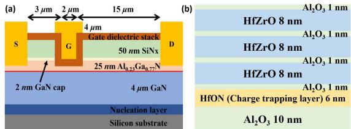
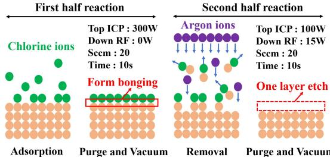
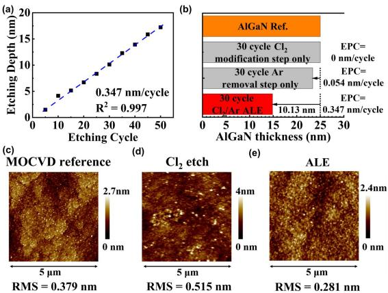
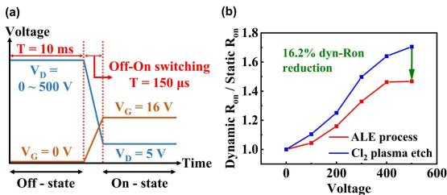

# A Normally-Off GaN MIS-HEMT Fabricated Using Atomic Layer Etching to Improve Device Performance Uniformity for High Power Applications

Tsung- Ying Yang, Huuan- Yao Huang, Yan- Kui Liang, Graduate Student Member, IEEE, Jui- Sheng Wu, Mei- Yan Kuo, Kuan- Pang Chang, Heng- Tung Hsu, Senior Member, IEEE, and Edward- Yi Chang, Life Fellow, IEEE

Abstract- Normally- off ferroelectric charge trap gate stack GaN high electron mobility transistor (FEG- HEMT) was fabricated with atomic layer etching (ALE) to precisely control the device parameters including  $\mathsf{V}_{\mathsf{th}}$  of the device. The ALE process consists of cyclic  $\mathbb{C}\mathbb{I}_2$  adsorption modification steps and the Ar ion removal steps. The ALE process achieved etch- per- cycle (EPC) of  $0.347~\mathrm{nm / cycle}$  and superior etching morphology with  $\mathsf{RMS} = 0.281~\mathsf{nm}$ . The fabricated GaN HEMT using the ALE process exhibited a high threshold voltage  $(V_{\mathrm{th}})$  of  $5.06~\mathrm{V}$ , high maximum drain current  $(\mathsf{I}_{\mathsf{D},\mathsf{MAX}})$  of  $772~\mathrm{mA / mm}$  with low on- resistance  $(\mathsf{R}_{\mathsf{on}})$  of  $8.57~\Omega \cdot \mathrm{mm}$  and high breakdown voltage (BV) of  $888~\mathrm{V}$ , the device also showed good  $\mathsf{V}_{\mathrm{th}}$  uniformity. Finally, the contact resistance  $(\mathsf{R}_{\mathsf{c}})$  was reduced from  $0.46~\Omega \cdot \mathrm{mm}$  to  $0.15~\Omega \cdot \mathrm{mm}$  by the ALE process, and the dynamic on- resistance (dyn-  $\mathsf{R}_{\mathsf{on}}$ ) was improved at the same time.

Index Terms- Atomic layer etching, AlGaN/GaN, enhancement- mode, charge trap gate stack, threshold voltage uniformity.

Manuscript received 8 July 2022; revised 27 July 2022 and 16 August 2022; accepted 19 August 2022. Date of publication 26 August 2022; date of current version 27 September 2022. This work was financially supported by the "Center for the Semiconductor Technology Research" from The Featured Areas Research Center Program within the framework of the Higher Education Sprout Project by the Ministry of Education (MOE) in Taiwan. Also supported in part by the Ministry of Science and Technology, Taiwan, under Grant No. NSTC- 110- 2622- 8- A49- 008- SB, NSTC- 11- 2622- 8- A49- 018- SB and NSTC- 111- 2634- F- A49- 008 as well as National Chung- Shan Institute of Science and Technology NSISI- 404- V407(111). The review of this letter was arranged by Editor H. G. G. Xing. (Corresponding author: Edward- Yi Chang.)

Tsung- Ying Yang, Huuan- Yao Huang, Yan- Kui Liang, and Heng- Tung Hsu are with the International College of Semiconductor Technology, National Yang Ming Chiao Tung University (NYCU), Hsinchu 300, Taiwan.

Jui- Sheng Wu is with the Department of Materials Science and Engineering, National Yang Ming Chiao Tung University, Hsinchu 300, Taiwan. Mei- Yan Kuo and Kuan- Pang Chang are with the Graduate Program for Nanotechnology, Department of Materials Science and Engineering, National Yang Ming Chiao Tung University, Hsinchu 300, Taiwan.

Edward- Yi Chang is with the Department of Materials Science and Engineering, International College of Semiconductor Technology, National Yang Ming Chiao Tung University, Hsinchu 300, Taiwan (e- mail: edc@mail.nctu.edu.tw).

Color versions of one or more figures in this letter are available at https://doi.org/10.1109/LED.2022.3201900. Digital Object Identifier 10.1109/LED.2022.3201900

# I. INTRODUCTION

LGAN/GAN high- electron- mobility transistors (HEMTs) are promising for high power applications due to the superior electrical properties [1], [2]. For power applications, normally off or enhancement- mode (E- mode) device operation mode is preferred to simplify the design of the circuits and to diminish the power loss during switching and for safety reasons. To date, the E- mode GaN HEMT has been achieved by p- GaN [3], [4], [5], gate- recessed process [6], [7], and cascode approaches [8], [9]. Recently, gate recessed with hybrid ferroelectric charge trap gate stack has been demonstrated with high threshold voltage and high current due to the polarization effect of the ferroelectric layer [10], [11], [12]. In this study, the atomic layer etching process was implemented on the FEG- HEMT process to further increase the  $\mathrm{V_{th}}$  value of the E- mode device and the uniformity of the  $\mathrm{V_{th}}$  value across the wafer.

In the GaN device fabrication, GaN and AlGaN materials etching process was performed by inductively coupled plasma (ICP) etching system for both gate recess and ohmic recess processes [13], [14]. The drawback of the plasma etching techniques is that the radicals, ions, and UV light included due to plasma discharges can cause lattice damages of the etched surface [15].

ALE is a self- limiting chemical etching process consisting of cyclic surface modification and removal steps, these steps have extremely low etching damage during the process. Thus, the ALE method is a good candidate for device process due to the excellent quality of the interface after etching [16], [17], [18], [19], [20], [21], [22]. In the past research, most of the ALE studies on GaN focused on the etching mechanisms of the materials, studies of ALE etching with different processing conditions for GaN HEMT power devices are still lacking in the literature [23], [24].

In this work, we fabricated the GaN HEMT with the ALE process and made a systematic comparison between ALE and traditional  $\mathrm{Cl}_2$  plasma etching  $\mathrm{Cl}_2$  etch) for the GaN device. The ALE process precisely controlled the etch depth and resulted in better surface morphology with  $\mathrm{RMS} = 0.281$  nm. The fabricated GaN HEMT by ALE process exhibited a high threshold voltage  $(\mathrm{V_{th}})$  of  $5.06~\mathrm{V}$ , high maximum drain current  $(\mathrm{I}_{\mathrm{D},\mathrm{MAX}})$  of  $772~\mathrm{mA / mm}$  with low on- resistance  $(\mathsf{R}_{\mathsf{on}})$  of  $8.57~\Omega \cdot \mathrm{mm}$ , high breakdown voltage (BV) of  $888~\mathrm{V}$ , and the

  
Fig. 1. (a) Cross section schematic of the GaN FEG-HEMTs grown on (111) Si substrate. (b) Ferroelectric gate stack structure.

uniformity of  $\mathrm{V_{th}}$  across the whole sample was also improved. Finally, the contact resistance was reduced from  $0.46\Omega \cdot \mathrm{mm}$  to  $0.15\Omega \cdot \mathrm{mm}$ , and the dynamic on- resistance  $(\mathrm{dynR_{on}})$  of the devices was also improved by the ALE process.

# II. DEVICE FABRICATION

Fig. 1(a) shows the cross- section of the AlGaN/GaN FEG- HEMT. The epitaxial structure includes  $4\mu \mathrm{m}$  GaN buffer layer/25nm buffer layer with aluminum concentration of  $23\% /2\mathrm{nm}$  GaN cap layer. The devices process started with mesa isolation using  $\mathrm{Cl}_2$  - based dry etching by ICP to define the active area. Ohmic recess was etched by the ALE process and Ti/Al/Ni/Au was deposited as source/drain metals, followed by annealing at  $800^{\circ}$  for 60 seconds. A  $50\mathrm{nm}\mathrm{SiN_x}$  film was deposited as the passivation layer by plasma- enhanced chemical vapor deposition (PECVD), a pretreatment with in- situ nitrogen plasma was carried out before the passivation layer was deposited [25].

Gate recess process was performed by etching the passivation layer with  $\mathrm{CF_4}$  plasma and then etching the AlGaN with the ALE process. Ferroelectric charge trap gate stack was deposited by atomic layer deposition (ALD) system. The gate stacks were deposited with  $10\mathrm{nm}\mathrm{Al}_2\mathrm{O}_3$  tunnel oxide layer,  $6\mathrm{nm}$  HfON charge trapping layer, where the ratio of O to  $\mathbb{N}$  is 1:1, and  $28\mathrm{nm}\mathrm{Al}_2\mathrm{O}_3 / \mathrm{HfZrO} / \mathrm{Al}_2\mathrm{O}_3$  blocking oxide layer, the gate stack structure is as shown in Fig. 1(b). After the deposition of the gate stacks, post- deposition annealing at  $400^{\circ}\mathrm{C}$  in  $\mathrm{N}_2$  atmosphere was performed. Ni/Au was deposited as the gate metal. The gate length, gate- source spacing, and gate- drain spacing of the fabricated GaN HEMT were  $3\mu \mathrm{m}$ ,  $2\mu \mathrm{m}$ , and  $15\mu \mathrm{m}$ , respectively.

# III. RESULT AND DISCUSSION

The ALE process in this study was performed using ICP tool. Fig. 2 shows the steps of the ALE process. A full ALE cycle consists of two half- reactions. The first half- reaction is the modification step, in which the binding energy of the surface atoms is modified by the chlorination reaction. In this step, chlorine is introduced into the chamber and the top ICP power of  $300\mathrm{W}$  and down RF power of  $0\mathrm{W}$  was turned on to react with the surface atoms, where the reaction time is 10 seconds. Followed by argon purge and evacuation to ensure that no residual chlorine remains in the chamber to affect the next half- reaction. The second half- reaction is the removal step, which removes the chlorinated surface in the modification step by bombarding the surface of the sample with top ICP power of  $100\mathrm{W}$  and down RF power of  $15\mathrm{W}$  low- energy argon ions for 10 seconds.

Fig. 3(a) shows the etch depth of ALE at different etch cycles, the EPC equals to  $0.347\mathrm{nm / cycle}$ . Fig. 3(b) shows the etch depth if two steps were performed individually for 30 cycle. For the modification step, the chlorine reacts chemically with the atoms in contact with the surface to form compounds with lower binding energy, and the EPC for this step was  $0\mathrm{nm / cycle}$ . In contrast, the EPC of Ar removal step was  $0.054\mathrm{nm / cycle}$ , causing physical etching about  $1.62\mathrm{nm}$ . Based on the comparison of  $\mathrm{Cl}_2$  modification step and Ar removal step, the results indicated AlGaN could not be etched by any single reaction step. However, the EPC for ALE process was  $0.347\mathrm{nm / cycle}$ . It is clarifying that AlGaN could be only etched by sequential modification step and removal step, attributed to the self- limiting reactions of ALE process.

  
Fig. 2. AlGaN/GaN one atomic layer etching cycle process. Modification Step and Removal Step are included.

  
Fig. 3. (a) Etching depth of the ALE process. (b) Etching level for etch step and ALE process. (c) Roughness image of MOCVD reference, (d)  $\mathrm{Cl}_2$  plasma etching, and (e) ALE.

The surface roughness obtained by MOCVD before etching shows the RMS of  $0.379\mathrm{nm}$  as shown in Fig. 3(c). However, the surface RMS of  $0.515\mathrm{nm}$  was obtained after the ICP  $\mathrm{Cl}_2$  plasma etching with a significant increase in roughness. Fig. 3(e) shows the surface RMS of  $0.281\mathrm{nm}$  after the ALE process, which is better than the ICP  $\mathrm{Cl}_2$  plasma etching and the pristine condition after MOCVD growth. The surface was examined by the AFM. This demonstrates, the ALE process used in this study is a promising way to achieve a smooth surface.

In this work, the gate region of the device was etched by the ALE process with a residual AlGaN thickness of  $5\mathrm{nm}$  after etching, and then a ferroelectric gate dielectric layer was deposited on top to achieve a normally- off GaN HEMT. Before testing the devices, an initialization process  $\mathrm{V_G} = 16\mathrm{V}$ ,  $\mathrm{V_D} = 0\mathrm{V}$  for  $1\mathrm{ms}$  for the FEG- HEMT is required. The  $\mathrm{I_D - V_G}$  characteristics are shown in Fig. 4(a). The  $\mathrm{V_{th}}$  shifted from  $- 1.65\mathrm{V}$  to  $5.06\mathrm{V}$  due to the application of ferroelectric gate stack. In Fig. 4(b), we also measured the threshold voltages of the devices with the ALE process and

  
Fig.4. (a)  $\mathsf{I}_{\mathsf{D}} - \mathsf{V}_{\mathsf{G}}$  before and after the initialization process. (b)  $\mathsf{V}_{\mathsf{th}}$  error bar for both processes. (c)  $\mathsf{I}_{\mathsf{D}} - \mathsf{V}_{\mathsf{D}}$  characteristics between two processes. (d) Compare the contact resistance of the two processes at the same etch depth. (e) Off-state leakage and breakdown voltage. (f) Gate breakdown voltage.

the devices with the ICP  $\mathrm{Cl}_2$  plasma etch process separately with a sample size of 25 devices, the results show that the devices processed with ALE have good control of etch depth and etch uniformity and average etch depths are smaller than the ICP  $\mathrm{Cl}_2$  plasma etch process.

Fig.4(c) shows the  $\mathrm{I_D - V_D}$  output characteristics of two devices, etched with the ALE process and  $\mathrm{Cl}_2$  plasma etching process respectively. The device using ALE shows a  $\mathrm{I_{D,MAX}}$  of  $772\mathrm{mA / mm}$  at  $\mathrm{V_G} = 16\mathrm{V},$  and an excellent  $\mathbb{R}_{\mathrm{on}}$  of  $8.57\Omega \cdot \mathrm{mm}$  . The device using  $\mathrm{Cl}_2$  plasma etching shows a  $\mathrm{I_{D,MAX}}$  of  $714~\mathrm{mA / mm}$  at  $\mathrm{V_G} = 16\mathrm{V},$  and a high  $\mathbb{R}_{\mathrm{on}}$  of  $10.15\Omega \cdot \mathrm{mm}$

To further evaluate the effect of the ALE process on the contact resistance, Fig.4(d) shows the contact resistance versus the etch cycle. The contact resistance was reduced when the ohmic metal is close to the 2DEG interface, due to the reduction of barrier height [26], [27]. The red column represents the data obtained using the ALE process, the contact resistance gradually decreased from  $0.37\Omega \cdot \mathrm{mm}$  for the sample etched with 11 cycles to  $0.15\Omega \cdot \mathrm{mm}$  for the sample etched with 29 cycles. For the devices with 29 etch cycles, the etch depth was about  $10\mathrm{nm}$  .We also etched the device with the same depth using ICP  $\mathrm{Cl}_2$  plasma etching and obtained a contact resistance of  $0.46\Omega \cdot \mathrm{mm}$  which is shown in the blue column.

The off- state leakage current of the two devices is shown in Fig. 4(e). The ALE device exhibits a high breakdown voltage of  $888~\mathrm{V}$  at drain current of  $1\mu \mathrm{A} / \mathrm{mm}$  while the  $\mathrm{Cl}_2$  plasma etching device also exhibits a breakdown voltage of  $876~\mathrm{V}$  And the hard breakdown of the two devices are  $1272\mathrm{V}$  and  $1188\mathrm{V}$  The gate breakdown voltage of the two devices are  $21.84\mathrm{V}$  and  $21.48\mathrm{V}$  shown in Fig.4(f).

However, the positive bias stress (PBS) conditions and negative bias stress (NBS) were performed using  $\mathrm{V_D} = 0\mathrm{V}$  and  $\mathrm{V_G} = +16\mathrm{V}$  for PBS tests and  $\mathrm{V_G} = - 16\mathrm{V}$  for NBS tests at room temperature (RT) for  $0\mathrm{s}$  to  $1,000\mathrm{s}$  The  $\mathrm{V_{th}}$  shifts after PBS and NBS were  $+1.18\mathrm{V}$  and  $- 2.85\mathrm{V}$  (Not shown here). Therefore, the issue of reliability should be further improved in the future work.

  
Fig.5. (a) Dynamic  $\mathbb{R}_{\mathbb{on}}$  measurement setting condition. (b) Dynamic  $\mathbb{R}_{\mathbb{on}}$  ratio comparison of two processes.

TABLEI THE MEASUREMENT RESULTS OF EACH DATA OF THE  $\mathbb{C}\mathbb{L}_{2}$  PLASMA ETCH AND THE ALE PROCESS  

<table><tr><td>Etching method</td><td>Cl2plasma etch</td><td>ALE</td></tr><tr><td>Etching rate</td><td>1 nm/second</td><td>0.347 nm/cycle</td></tr><tr><td>RMS (nm)</td><td>0.515</td><td>0.281</td></tr><tr><td>Vth uniformity (V)</td><td>4.84 ± 0.33</td><td>5.04 ± 0.10</td></tr><tr><td>IDMAX (mA/mm)</td><td>714</td><td>772</td></tr><tr><td>Ron (Ω/mm)</td><td>10.15</td><td>8.57</td></tr><tr><td>RC (Ω/mm)</td><td>0.46</td><td>0.15</td></tr><tr><td>Dyn-Ron/Static Ron</td><td>1.705</td><td>1.467</td></tr><tr><td>BV (V)</td><td>876</td><td>888</td></tr><tr><td>Gate BV (V)</td><td>21.48</td><td>21.84</td></tr></table>

The other important feature for the GaN HEMTs is the dynamic on- resistance (dyn-  $\mathbb{R}_{\mathrm{on}}$  [28], [29]. The dyn-  $\mathbb{R}_{\mathrm{on}}$  can be attributed to the decrease in 2DEG concentration due to the trapping of electrons in the different areas of the device, such as the interface or in the buffer layer [30], [31]. To investigate the device quality improvement by using the ALE process, a stress test was performed to evaluate the switching loss. The test conditions are shown in Fig. 5(a), the gate voltage was switched from OFF- state  $(\mathrm{V_{G}} = 0\mathrm{V})$  to ON- state  $(\mathrm{V_G} = 16\mathrm{V})$  and the drain voltage from  $0\mathrm{V}$  to  $500~\mathrm{V}$

Fig.5(b) shows the dyn-  $\mathbb{R}_{\mathrm{on}}$  results of the two devices. Compared to the ICP  $\mathrm{Cl}_2$  plasma etch process, the ALE process demonstrates a  $16.2\%$  reduction in dynamic  $\mathbb{R}_{\mathrm{on}}$  when stressed  $\mathrm{V_D} = 500\mathrm{V}$  at OFF- state, indicating that the ALE process can effectively reduce the trapping states at the interface. The device performance of the GaN HEMT using ALE process is summarized in Table I.

# IV. CONCLUSION

A normally- off hybrid FEG- HEMT was fabricated using the ALE process for ohmic and gate recess. The ALE process consists of cyclic  $\mathrm{Cl}_2$  adsorption modification steps and Ar ion removal steps which results in an etch rate of  $0.347\mathrm{nm / cycle}$  and with a superior etching morphology of  $\mathrm{RMS} = 0.281\mathrm{nm}$  The GaN HEMT fabricated with the ALE process exhibited a high  $\mathrm{V_{th}}$  of  $5.06\mathrm{V}$ $\mathrm{I_{D,MAX}}$  of  $772\mathrm{mA / mm}$  with low  $\mathbb{R}_{\mathrm{on}}$  of  $8.57\Omega \cdot \mathrm{mm}$  and high BV of  $888~\mathrm{V}.$  Finally, the contact resistance was reduced from  $0.46\Omega \cdot \mathrm{mm}$  to  $0.15\Omega \cdot \mathrm{mm}$  and the dynamic  $\mathbb{R}_{\mathrm{on}}$  of the device was also improved by the ALE process. Thus, this work demonstrates that the ALE process can be applied to the FEG- HEMT fabrication with improved device parameter uniformity and overall device performance.

# REFERENCES

[1] K. J. Chen, O. Haberlen, A. Lidow, C. L. Tsai, T. Ueda, Y. Uemoto, and Y. Wu, "GaN- on- Si power technology: Devices and applications," IEEE Trans. Electron Devices, vol. 64, no. 3, pp. 779- 795, Mar. 2017, doi: 10.1109/TED.2017.2657579. [2] U. K. Mishra, P. Parikh, and Y.- F. Wu, "AlGaN/GaN HEMTs—An overview of device operation and applications," Proc. IEEE, vol. 90, no. 6, pp. 1022- 1031, Jun. 2002, doi: 10.1109/JPROC.2002.1021567. [3] G. Greco, F. Iucolano, and F. Roccaforte, "Review of technology for normally- off HEMTs with p- GaN gate," Mater. Sci. Semicond. Process., vol. 78, pp. 96- 106, May 2018, doi: 10.1016/j.mssp.2017.09.027. [4] Y. Uemoto, M. Hikita, H. Ueno, H. Matsuo, H. Ishida, M. Yanagihara, T. Ueda, T. Tanaka, and D. Ueda, "A normally- off AlGaN/GaN transistor with  $\mathrm{R_{on}A = 26}$  mΩcm2 and  $\mathrm{BV_{ds} = 640}$  v using conductivity modulation," IEDM Tech. Dig., Dec. 2006, pp. 1- 4, doi: 10.1109/IEDM.2006.346930. [5] H. Okita, M. Hikita, A. Nishio, T. Sato, K. Matsunaga, H. Matsuo, M. Mannoh, and Y. Uemoto, "Through recessed and regrowth gate technology for realizing process stability of GaN- GITs," in Proc. 28th Int. Symp. Power Semiconductor Devices ICs (ISPSD), Jun. 2016, pp. 23- 26, doi: 10.1109/ISPSD.2016.7520768. [6] T. Oka and T. Nozawa, "AlGaN/GaN recessed MIS- gate HFET with high- threshold- voltage normally- off operation for power electronics applications," IEEE Electron Device Lett., vol. 29, no. 7, pp. 668- 670, Jul. 2008, doi: 10.1109/LED.2008.2000607. [7] Q. Zhou, B. Chen, Y. Jin, S. Huang, K. Wei, X. Liu, X. Bao, J. Mou, and B. Zhang, "High- performance enhancement- mode  $\mathrm{Al}_2\mathrm{O}_3$ /AlGaN/GaN- on- Si MISFETs With 626 MW/cm2 figure of merit," IEEE Trans. Electron Devices, vol. 62, no. 3, pp. 776- 781, Mar. 2015, doi: 10.1109/TED.2014.2385062. [8] T. Zhu, F. Zhuo, F. Wang, H. Wang, X. He, and S. Shi, "A novel cascode GaN switch integrating paralleled GaN DHEMTs for high- power applications," in Proc. 1st Workshop Wide Bandgap Power Devices Applesia (WiPDA Asia), May 2018, pp. 332- 336, doi: 10.1109/WiPDAASIA- 2018.8734696. [9] S. Buetow and R. Herzer, "Characterization of GaN- HEMT in cascode topology and comparison with state of the art- power devices," in Proc. IEEE, vol. Int. Symp. Power Semiconductors Devices ICs (ISPSD), May 2018, pp. 196- 199, doi: 10.1109/ISPSD.2018.8393636. [10] C. Wu, P.- C. Han, S.- C. Liu, T.- E. Hsieh, F. J. Lumbantoruan, Y.- H. Ho, J.- Y. Chen, K.- S. Yang, H.- C. Wang, Y.- K. Lin, P.- C. Chang, Q. H. Luc, Y.- C. Lin, and E. Y. Chang, "High- performance normally- off GaN MIS- HEMTs using hybrid ferroelectric charge trap gate stack (FEG- HEMT) for power device applications," IEEE Electron Device Lett., vol. 39, no. 7, pp. 991- 994, Jul. 2018, doi: 10.1109/LED.2018.2825645. [11] C.- H. Wu, S.- C. Liu, C.- K. Huang, Y.- C. Chiu, P.- C. Han, P.- C. Chang, F. Lumbantoruan, C.- A. Lin, Y.- K. Lin, C.- Y. Chang, C. Hu, H. Iwai, and E. Y. Chang, "High  $\mathrm{V_{th}}$  enhancement mode GaN power devices with high  $\mathrm{ID,max}$  using hybrid ferroelectric charge trap gate stack," in Proc. Symp. VLSI Technol., May 2017, pp. T60- T61, doi: 10.23919/VLSIT.2017.798201. [12] Y.- K. Liang, J.- S. Wu, C.- Y. Teng, H.- L. Ko, Q.- H. Luc, C.- J. Su, E.- Y. Chang, and C.- H. Lin, "Demonstration of highly robust 5 nm  $\mathrm{Hf}_0.5\mathrm{Zr}_0.5\mathrm{O}_2$  ultra- thin ferroelectric capacitor by improving interface quality," IEEE Electron Device Lett., vol. 42, no. 9, pp. 1299- 1302, Sep. 2021, doi: 10.1109/LED.2021.3102604. [13] H. Cho, C. B. Vartuli, C. R. Abernathy, S. M. Donovan, S. J. Pearton, R. J. Shul, and J. Han, "C(2)- based dry etching of the AlGaN system in inductively coupled plasmas," Solid- State Electron., vol. 42, no. 12, pp. 2277- 2281, 1998, doi: 10.1016/S0038- 1101(98)00225- 1. [14] H.- S. Kim, G.- Y. Yeom, J.- W. Lee, and T.- I. Kim, "A study of GaN etch mechanisms using inductively coupled  $\mathrm{Cl}_2 / \mathrm{Ar}$  plasmas," Thin Solid Films, vol. 341, nos. 1- 2, pp. 180- 183, 1999, doi: 10.1016/S0040- 6090(98)01551- X.

[15] M. Minami, S. Tomiya, K. Ishikawa, R. Matsumoto, S. Chen, M. Fukasawa, F. Uesawa, M. Sekine, M. Hori, and T. Tatsumi, "Analysis of GaN damage induced by  $\mathrm{Cl}_2 / \mathrm{SiCl}_4 / \mathrm{Ar}$  plasma," Jpn. J. Appl. Phys., vol. 50, no. 8S1, Aug. 2011, Art. no. 08JE03, doi: 10.7567/JJAP.50.08JE03. [16] K. J. Kanarik, S. Tan, and R. A. Gottscho, "Atomic layer etching: Rethinking the art of etch," J. Phys. Chem. Lett., vol. 9, no. 16, pp. 4814- 4821, Aug. 2018, doi: 10.1021/acs.jpclett.8b00997. [17] C. Fang, Y. Cao, D. Wu, and A. Li, "Thermal atomonic layer etching: Mechanism, materials and prospects," Prog. Natural Sci., Mater. Int., vol. 28, no. 6, pp. 667- 675, Dec. 2016, doi: 10.1016/j.pnsc.2018.11.003. [18] S. M. George and Y. Lee, "Prospects for thermal atomic layer etching using sequential, self- limiting fluorination and ligand- exchange reactions," ACS Nano, vol. 10, no. 5, pp. 4889- 4894, May 2016, doi: 10.1031/acs.ano.6c02891. [19] T. Faraz, F. Rooboom, H. C. M. Knoops, and W. M. M. Kessels, "Atomic layer etching: What can we learn from atomic layer deposition?" ECS J. Solid State Sci. Technol., vol. 4, no. 6, pp. N5023- N5032, 2015, doi: 10.1149/2.0051506jss. [20] T. Ohba, W. Yang, S. Tan, K. J. Kanarik, and K. Nojiri, "Atomic layer etching of GaN and AlGaN using directional plasma- enhanced approach," Jpn. J. Appl. Phys., vol. 56, no. 6S2, Jun. 2017, Art. no. 06HB06, doi: 10.7567/JJAP.56.06HB06. [21] C. Mannequin, C. Vallee, K. Akimoto, T. Chevolleau, C. Durand, C. Dussarrot, T. Teramoto, E. Gheeraert, and H. Mariette, "Comparative study of two atomic layers etching processes for GaN," J. Vac. Sci. Technol. A, Vac. Surf. Films, vol. 38, no. 3, May 2020, Art. no. 032602, doi: 10.1116/1.5134f30. [22] C. Kauppinen, S. A. Khan, J. Sundqvist, D. B. Suyatin, S. Suihkonen, E. I. Kauppinen, and M. Sopanen, "Atomic layer etching of gallium nitride (0001)," J. Vac. Sci. Technol. A, Vac., Surf., Films, vol. 35, no. 6, Nov. 2017, Art. no. 060603, doi: 10.1116/1.4993996. [23] Q. Hu, S. Li, T. Li, X. Wang, X. Li, and Y. Wu, "Channel engineering of normally- OFF AlGaN/GaN MOS- HEMTs by atomic layer etching and high-  $\kappa$  dielectric," IEEE Electron Device Lett., vol. 39, no. 9, pp. 1377- 1380, Sep. 2018, doi: 10.1109/LED.2018.2856934. [24] Y. Zhang, S. Huang, K. Wei, S. Zhang, X. Wang, Y. Zheng, G. Liu, X. Chen, Y. Li, and X. Liu, "Mini- wave- wave AlGaN/GaN HEMTs with 43.6% power- added- efficiency at 40 GHz fabricated by atomic layer etching gate recess," IEEE Electron Device Lett., vol. 41, no. 5, pp. 701- 704, May 2020, doi: 10.1109/LED.2020.2984663. [25] S.- C. Liu, B.- Y. Chen, Y.- C. Lin, T.- E. Hsieh, H.- C. Wang, and E. Y. Chang, "GaN MIS- HEMTs with nitrogen passivation for power device applications," IEEE Electron Device Lett., vol. 35, no. 10, pp. 1001- 1003, Oct. 2014, doi: 10.1109/LED.2014.2345130. [26] L. Wang, D.- H. Kim, and I. Adesida, "Direct contact mechanism of Ohmic metallization to AlGaN/GaN heterostructures via Ohmic area recess etching," Appl. Phys. Lett., vol. 95, no. 17, 2009, Art. no. 172107, doi: 10.1063/1.3255014. [27] Y.- K. Lin, J. Bergsten, H. Leong, A. Malmros, J.- T. Chen, D.- Y. Chen, O. Kordina, H. Zirath, E. Y. Chang, and N. Rorsman, "A versatile low- resistance ohmic contact process with ohmic recess and low- temperature annealing for GaN HEMTs," Semicond. Sci. Technol., vol. 33, no. 9, Sep. 2018, Art. no. 095010, doi: 10.1088/1361- 6641/aaad7a8. [28] G. Zulauf, M. Guacci, and J. W. Kolar, "Dynamic on- resistance in GaN- on- Si HEMTs: Origins, dependencies, and future characterization frameworks," IEEE Trans. Power Electron., vol. 35, no. 6, pp. 5581- 5588, Jun. 2020, doi: 10.1109/TPEI.2019.2955656. [29] D. Jin and J. A. del Alamo, "Mechanisms responsible for dynamic ON- resistance in GaN high- voltage HEMTs," in Proc. 24th Int. Symp. Power Semiconductor Devices ICs, Jun. 2012, pp. 333- 336, doi: 10.1109/ISPSD.2012.6229089.