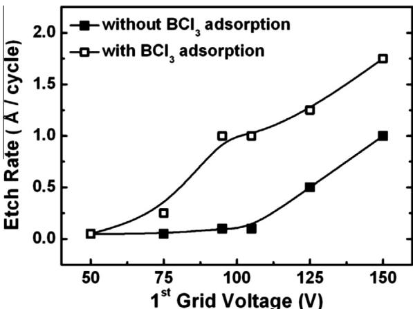
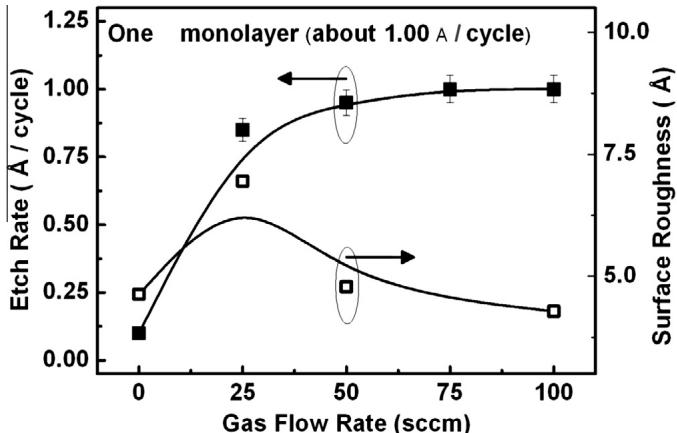
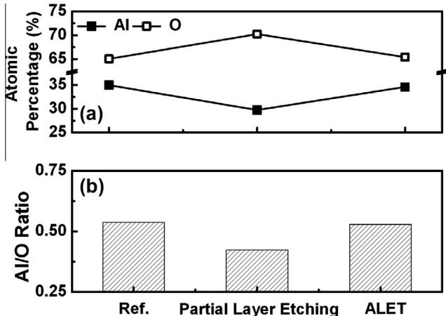
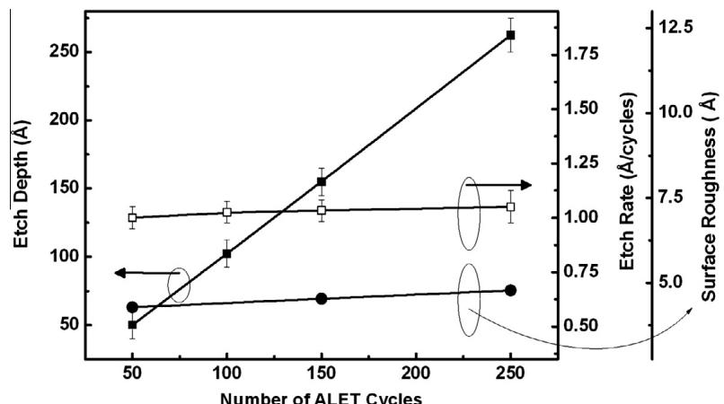

# Atomic layer etching of  $\mathrm{Al}_2\mathrm{O}_3$  using  $\mathrm{BCl}_3 / \mathrm{Ar}$  for the interface passivation layer of III-V MOS devices

K.S. Min a, 
S.H. Kang a, 
J.K. Kim a,c, 
Y.I. Jhon b, 
M.S. Jhon b, 
G.Y. Yeom a,*

a Department of Advanced Materials Science and Engineering, Sungkyunkwan University, Suwon, Gyeonggi- do 440- 746, South Korea  b Department of Chemical Engineering and Data Storage Systems Center, Carnegie Mellon University, Pittsburgh, PA 15213, USA  c Technology Team, Semiconductor FED Center Samsung Electronics Co. Ltd., Hwasung, Gyeonggi- do 445- 701, South Korea

# ARTICLE INFO

# ABSTRACT

Article history:  Available online 9 April 2013

The atomic layer etching (ALET) of  $\mathrm{Al}_2\mathrm{O}_3$  has been studied for possible application in precise etch control and low damage etching of the  $\mathrm{Al}_2\mathrm{O}_3$  layer for use as the interface passivation layer (IPL) between the high-  $k$  dielectric and the III- V compound semiconductors. Under the ALET condition, about  $1\mathrm{\AA / cycle}$  of  $\mathrm{Al}_2\mathrm{O}_3$  corresponding to one monolayer per etch cycle and surface roughness similar to that of the reference, regardless of the number of etch cycles, were obtained. Therefore, etch depth could be controlled with atomic scale precision. In addition, during the ALET, the stoichiometry of  $\mathrm{Al}_2\mathrm{O}_3$  and the  $\mathrm{Al / O}$  ratio were maintained the same as those of the reference. Therefore, it is believed that the ALET of  $\mathrm{Al}_2\mathrm{O}_3$  can reduce the plasma induced damage at the edge of an IPL because it can decrease the sidewall leakage by maintaining the stoichiometry of the sidewall  $\mathrm{Al}_2\mathrm{O}_3$  surface, in addition to, precisely controlling the etch depth and minimizing the amount of substrate access.

$\widehat{\Xi}$  2013 Elsevier B.V. All rights reserved.

# 1. Introduction

High-  $k$  dielectrics have been studied for silicon metal- oxidesemiconductor (MOS) devices. Recently, it has been extended to different channel materials such as GaAs, InGaAs, etc. for III- V compound MOS devices because of the high electron mobility of III- V materials [1,2]. However, unlike the silicon, one of the main problems in applying high-  $k$  dielectric to III- V compound semiconductors is the deficiency of a stable native, which would passivate the interface states between the high-  $k$  dielectric and the substrate. To address this problem, various high-  $k$  dielectrics, such as  $\mathrm{SiO}_2$ $\mathrm{Al}_2\mathrm{O}_3$ $\mathrm{Ga}_2\mathrm{O}_3$  , etc. have been considered as interface passivation layer (IPL) materials for III- V MOS devices [3- 5].

In the patterning of the IPL, as the critical dimension (CD) is scaled down to  $22~\mathrm{nm}$  node and below, plasma etching has become important because of the difficulty in etching the IPL with the minimal recess of the III- V compound semiconductor substrate due to the very thin physical thickness of the IPL ranging from about 0.5 to  $1\mathrm{nm}$  even when the gate stacks can be etched anisotropically for accurate CD control. Therefore, a precise etch rate, rather than a high etch rate, and a very high etch selectivity between the IPL and the III- V compound semiconductor substrate are required. Plasma etching of the IPL has been studied in many groups [6,7]. During the IPL etching, however, conventional plasma etching techniques tend to physically damage the etched surface of the substrate because of the energetic reactive ions they use to make anisotropic gate profiles. Additionally, these reactive ions can degrade the electric characteristics of MOS and memory devices [8- 10].

Previously, atomic layer etching (ALET) has been introduced as the most suitable method for extreme nanoscale device patterning because it can etch a material at an atomic scale without physically and chemically damaging the substrate. ALET is a cyclic process similar to atomic layer deposition (ALD), but after the one cycle, ALET etches exactly one atomic layer whereas ALD deposits one atomic layer. ALET consists of four steps: (1) adsorption of reactive atoms and molecules on the surface for chemisorption, (2) evacuation of un- reacted gas species, (3) desorption by energetic Ar beam bombardment from a beam source to chemisorbed compounds, and (4) evacuation of the desorbed species. The details of ALET can be found elsewhere [11,12].

This article presents the first time study of the ALET of  $\mathrm{Al}_2\mathrm{O}_3$  as the IPL for III- V MOS devices. The monolayer etching of  $\mathrm{Al}_2\mathrm{O}_3$  for ALET is investigated. By using the optimized ALET condition, the etch depth of a very thin  $\mathrm{Al}_2\mathrm{O}_3$  can precisely be controlled with minimal surface roughness and without stoichiometric change during the ALET of  $\mathrm{Al}_2\mathrm{O}_3$

# 2. Experimental

$\mathrm{Al}_2\mathrm{O}_3$  was deposited to a thickness of  $3\mathrm{nm}$  on a GaAs substrate using atomic layer deposition (ALD) using commercial ALD equip-

ment with trimethylaluminium (TMA) and  $\mathrm{O_2}$ . In the ALET of  $\mathrm{Al}_2\mathrm{O}_3$ , one cycle was composed of four steps, and each step carried out under the following conditions. In the 1st step, 0- 100 sccm of  $\mathrm{BCl}_3$  gas was supplied for  $30~\mathrm{s}$  to adsorb the reactive gas (chemisorption) on the surface of  $\mathrm{Al}_2\mathrm{O}_3$ . In the 2nd step, the ALET system was evacuated to the base pressure of  $5\times 10^{- 7}$  Torr for  $30~\mathrm{s}$  to remove the non- reacted  $\mathrm{BCl}_3$  gas. In the 3rd step, a low energy Ar beam from a beam source was applied to desorb the chemisorbed compounds for  $125~\mathrm{s}$ . For the Ar beam source, an energetic Ar neutral beam was used to avoid possible charge- related damage during the etching and, to form an energetic Ar neutral beam, a three- gridded inductively coupled plasma (ICP) ion gun and a neutralizer installed in front of the ICP ion gun were used. To extract  $\mathrm{Ar}^+$  ion beam from the ICP ion gun,  $300~\mathrm{W}$  of  $13.56\mathrm{MHz}$  rf power and 50 sccm of Ar gas flow rate were used to generate an Ar plasma in the ICP source while  $50 - 150\mathrm{V}$ ,  $- 250\mathrm{V}$ , and  $0\mathrm{V}$  were applied to the 1st grid of the ion gun for the energy of the  $\mathrm{Ar}^+$  ions, the 2nd grid for focusing the ions, and the third grid for grounding, respectively. After the extraction of the  $\mathrm{Ar}^+$  ion beam, the beam was reflected to the neutralizer composed of parallel reflecting plates having  $5^{\circ}$  tilted to the ion beam direction to form a near- parallel and energetic Ar neutral beam. In the final step, the ALET system was evacuated again for  $30~\mathrm{s}$  to the base pressure of  $5\times 10^{- 7}$  Torr. Therefore, the ALET experimental condition is composed of  $30~\mathrm{s}$  of  $\mathrm{BCl}_3$  adsorption time,  $30~\mathrm{s}$  of evacuation time,  $125~\mathrm{s}$  of desorption time, and  $30~\mathrm{s}$  of evacuation time, so it requires  $215~\mathrm{s}$  for one cycle of ALET.

After the ALET, the etch depth was measured using a step profilemeter (Tencor Instrument, Alpha Step 500). The measured etch depth was divided by the total number of cycles to obtain the etch rate per cycle (A/cycle). Atomic force microscopy (AFM, Thermomicroscope, CP Research) was used to measure the surface roughness. X- ray photoelectron spectroscopy (XPS, Thermo VG, MultiLab 2000, Mg Kα source) was used to measure the surface composition.

# 3. Results and discussion

To etch one monolayer of  $\mathrm{Al}_2\mathrm{O}_3$  per each cycle in ALET, one monolayer of  $\mathrm{BCl}_3$  needs to be adsorbed on the  $\mathrm{Al}_2\mathrm{O}_3$  surface during the 1st adsorption step and  $\mathrm{BCl}_3$ - reacted one monolayer of  $\mathrm{Al}_2\mathrm{O}_3$  needs to be etched away during the 3rd desorption step by energetic Ar bombardment without sputtering the  $\mathrm{Al}_2\mathrm{O}_3$  layers under  $\mathrm{BCl}_3$ - reacted one monolayer of  $\mathrm{Al}_2\mathrm{O}_3$ . The adsorption of  $\mathrm{BCl}_3$  tends to form one monolayer of chemisorbed species such as AlCl/BCl- O on the  $\mathrm{Al}_2\mathrm{O}_3$  surface, due to the electron transfer from the Al- O 1st sub- layer (or  $\mathrm{Al}_2\mathrm{O}_3$  1st sub- layer) to the Al- Cl/BCl- O chemisorbed surface layer, the binding energy  $(E_{\mathrm{a}})$  between the chemisorbed layer and the Al- O 1st sub- layer is weakened. By using the energy, which is higher than the binding energy  $(E_{\mathrm{b}})$  between the chemisorbed layer and the Al- O 1st sub- layer, but lower than the binding energy  $(E_{\mathrm{b}})$ , which is the binding energy of natural  $\mathrm{Al}_2\mathrm{O}_3$  between the Al- O 1st sub- layer and the Al- O 2nd sub- layer, only the chemisorbed layer can be etched during the 3rd desorption step without sputtering the Al- O 1st sub- layer [13]. Therefore, for one- monolayer etching, it is important to supply the appropriate Ar bombardment energy  $(E_{\mathrm{n}})$  during the 3rd desorption step.

Fig. 1 shows the etch depth of  $\mathrm{Al}_2\mathrm{O}_3$  per cycle (A/cycle) for Ar sputtering and ALET, measured as a function of the 1st grid voltage from 50 to  $150\mathrm{V}$  of the  $\mathrm{Ar}^+$  ion beam source (the 1st grid voltage of the  $\mathrm{Ar}^+$  ion beam source controls the energy of the  $\mathrm{Ar}^+$  ion beam and determines the final Ar neutral beam energy for desorption during ALET). During the 1st adsorption step, one monolayer of  $\mathrm{BCl}_3$  covered the  $\mathrm{Al}_2\mathrm{O}_3$  surface at  $\mathrm{BCl}_3$  flow rate of  $100~\mathrm{sccm}$ . Without sputtering the Ar- O sub- layer under the chemisorbed layer, the 1st grid voltage was varied to determine the optimum Ar neu

  
Fig. 1. The etch depth of  $\mathrm{Al}_2\mathrm{O}_3$  per cycle (A/cycle) by Ar sputtering and ALET, measured as a function of 1st grid voltage from 50 to  $150\mathrm{V}$  for the  $\mathrm{Ar}^+$  ion beam source.  $\mathrm{BCl}_3$  gas flow rate of  $100~\mathrm{sccm}$  was used during the 1st adsorption step.

tral beam energy for desorption of the chemisorbed species such as Al- Cl and BCl- O on the  $\mathrm{Al}_2\mathrm{O}_3$  surface. ALET without the  $\mathrm{BCl}_3$  adsorption step was also carried out to find out whether  $\mathrm{Al}_2\mathrm{O}_3$  is etched just by Ar sputtering (without  $\mathrm{BCl}_3$  adsorption), not by ALET (with  $\mathrm{BCl}_3$  adsorption). As shown in the figure, when the 1st grid voltage was less than about  $105\mathrm{V}$ , no sputtering of  $\mathrm{Al}_2\mathrm{O}_3$  was observed, but when the 1st grid voltage was higher than  $105\mathrm{V}$ , the sputtering of  $\mathrm{Al}_2\mathrm{O}_3$  was observed and the sputter rate increased almost linearly with increasing 1st grid voltage. This indicates that, the threshold voltage for the sputtering of  $\mathrm{Al}_2\mathrm{O}_3$  is about  $105\mathrm{V}$  (the actual threshold voltage would be lower because the  $\mathrm{Ar}^+$  ions lose some energy during neutralization by the reflection on a parallel reflector to form an Ar neutral beam); therefore, if the 1st grid voltage is lower than  $105\mathrm{V}$ , then no sputtering of  $\mathrm{Al}_2\mathrm{O}_3$  would be observed during the ALET.

When the ALET was carried out with different 1st grid voltages, as shown in Fig. 1, the etch depth/cycle was divided into three regions. In region 1 (1st grid voltage  $(1st\mathrm{G})< 95\mathrm{V}$ ), the etch depth/cycle is low and increases abruptly with increasing 1st grid voltage, indicating that the beginning of partial layer etching of  $\mathrm{Al}_2\mathrm{O}_3$  because of the insufficient energy transfer from the bombarding Ar beam to the  $\mathrm{Al}_2\mathrm{O}_3$  surface for the removal of the chemisorbed layer due to the lower  $E_{\mathrm{n}}$  than both  $E_{\mathrm{a}}$  and  $E_{\mathrm{b}}$ . On the other hand, in region 3  $(105\mathrm{V}< 1st\mathrm{G})$ , the etch depth/cycle increases linearly again with increasing 1st grid voltage, indicating the additional sputtering of the Al- O sub- layer, in addition to the removal of the chemisorbed layer, due to the excessive energy transfer of Ar to the Al- O sub- layer under the chemisorbed layer due to higher  $E_{\mathrm{n}}$  than both  $E_{\mathrm{a}}$  and  $E_{\mathrm{b}}$ . However, in region 2  $(95\mathrm{V}< 1st\mathrm{G}< 105\mathrm{V})$ , the etch rate of ALET is constant with the largest differences between the Ar sputter and the ALET indicating that the optimum ALET condition, which removes one monolayer/cycle is obtained because  $E_{\mathrm{n}}$  is between  $E_{\mathrm{a}}$  and  $E_{\mathrm{b}}$ .

In the Langmuir isotherm, the adsorption of  $\mathrm{BCl}_3$  on the  $\mathrm{Al}_2\mathrm{O}_3$  surface forms one monolayer of  $\mathrm{BCl}_3$  on the  $\mathrm{Al}_2\mathrm{O}_3$  surface. Its surface coverage (0) is dependent on the operating pressure, which can be determined by the gas flow rate. Therefore,  $\mathrm{BCl}_3$  gas flow rate is an important factor in obtaining one monolayer etching per cycle during ALET [14]. Fig. 2 shows the etch depth per cycle (A/cycle) of  $\mathrm{Al}_2\mathrm{O}_3$  and the AFM root mean square (rms) roughness of the etched  $\mathrm{Al}_2\mathrm{O}_3$  surface measured as a function of  $\mathrm{BCl}_3$  gas flow rate from 0 to  $100~\mathrm{sccm}$  during the 1st adsorption step. Based on previous results, as the 1st grid voltage for  $\mathrm{Ar}^+$  ion beam,  $100\mathrm{V}$  was used because it ranges between  $E_{\mathrm{a}}$  and  $E_{\mathrm{b}}$ , which results in etching the chemisorbed layer without sputtering the Al- O

  
Fig. 2. The etch depth per cycle  $(\mathrm{A / cycle})$  of  $\mathrm{Al}_2\mathrm{O}_3$  and the rms roughness of the etched  $\mathrm{Al}_2\mathrm{O}_3$  surface measured as a function of  $\mathrm{BCl}_3$  gas flow rate from 0 to 100 sccm at 1st grid voltage of  $100\mathrm{V}$  for the  $\mathrm{Ar}^+$  ion beam in the 3rd desorption step.

sub- layer. As shown in the figure, the etch depth/cycle of  $\mathrm{Al}_2\mathrm{O}_3$  increased with  $\mathrm{BCl}_3$  gas flow rate up to  $50~\mathrm{sccm}$  and saturated at higher  $\mathrm{BCl}_3$  gas flow rates. The saturated etch rate for  $\mathrm{Al}_2\mathrm{O}_3$  was about  $1\mathrm{\AA / cycle}$  consistent with the deposition rate of  $\mathrm{Al}_2\mathrm{O}_3$  by ALD, suggesting one monolayer etching per cycle during ALET [15]. In the case of the partial layer etching condition, in which less than one monolayer is etched per cycle, the rms roughness of the etched  $\mathrm{Al}_2\mathrm{O}_3$  surface was higher than that of the reference (unetched  $\mathrm{Al}_2\mathrm{O}_3$  sample) whereas in the case of the ALET condition, the rms roughness was similar to that of the reference. This is attributed to the coverage of adsorbed reactive molecules on the  $\mathrm{Al}_2\mathrm{O}_3$  during the 1st adsorption step, which forms chemisorbed compounds between  $\mathrm{BCl}_3$  and  $\mathrm{Al}_2\mathrm{O}_3$  (i.e.,  $\mathrm{Al - Cl_x / BCl - O_x}$ ) on the surface. As shown in the figure, when the gas flow rate  $(P_{\mathrm{BCl}})$  is lower than  $50~\mathrm{sccm}$ , the surface coverage of the reactive gas  $(\Theta_{\mathrm{Al - Cl / BCl - O}})$  is lower than 1, which results in partial layer etching per cycle, and the random partial layer etching during each cycle increases the surface roughness. However, when the gas flow rate  $(P_{\mathrm{BCl}})$  is higher than  $50~\mathrm{sccm}$ , the surface coverage  $(\Theta_{\mathrm{Al - Cl / BCl - O}})$  is about 1, reaching the one monolayer self- limiting coverage of the Langmuir isotherm, which results in one monolayer etching per cycle, and due to the a full monolayer etching per each cycle, a surface roughness similar to the reference is obtained after the ALET.

Fig. 3 shows the etch depth  $(\mathrm{\AA})$ , etch depth per cycle  $(\mathrm{\AA / cycle})$  of  $\mathrm{Al}_2\mathrm{O}_3$ , and AFM root- mean- square (rms) roughness of the etched

  
Fig. 4. (a) The atomic percentage of the etched  $\mathrm{Al}_2\mathrm{O}_3$  surface and (b) the  $\mathrm{Al / O}$  ratio of the etched surface of  $\mathrm{Al}_2\mathrm{O}_3$  measured by X-ray photoelectron spectroscopy (XPS) for the reference, the  $\mathrm{Al}_2\mathrm{O}_3$  etched by partial layer etching  $(\Theta_{\mathrm{Al - Cl / BCl - O}}< 1)$ , and the  $\mathrm{Al}_2\mathrm{O}_3$  etched by ALET  $(\Theta_{\mathrm{Al - Cl / BCl - O}} = 1)$ .

$\mathrm{Al}_2\mathrm{O}_3$  surface measured as a function of the number of ALET etch cycles. As the  $\mathrm{Al}_2\mathrm{O}_3$  ALET condition,  $\mathrm{BCl}_3$  flow rate of  $100~\mathrm{sccm}$  during the 1st adsorption step and 1st grid voltage of  $100\mathrm{V}$  during the 3rd desorption step were used. As shown in the figure, the  $\mathrm{Al}_2\mathrm{O}_3$  etch depth/cycle maintained constant at about  $1\mathrm{\AA / cycle}$ , regardless of the number of etch cycles. Therefore, the etch depth  $(\mathrm{\AA})$  increased linearly with increasing number of etch cycles, enabling us to control the etch depth of the  $\mathrm{Al}_2\mathrm{O}_3$  with atomic scale precision. Also, the rms roughness of the etched  $\mathrm{Al}_2\mathrm{O}_3$  surface remained similar to that of the reference regardless of etch cycles.

Fig. 4 shows (a) the atomic percentage of the etched  $\mathrm{Al}_2\mathrm{O}_3$  surface and (b) the  $\mathrm{Al / O}$  ratio of the etched surface of  $\mathrm{Al}_2\mathrm{O}_3$  measured by X- ray photoelectron spectroscopy (XPS) for the reference, for the  $\mathrm{Al}_2\mathrm{O}_3$  etched by partial layer etching  $(\Theta_{\mathrm{Al - Cl / BCl - O}}< 1)$ , and for the  $\mathrm{Al}_2\mathrm{O}_3$  etched by ALET  $(\Theta_{\mathrm{Al - Cl / BCl - O}} = 1)$ . They were measured at the take- off angle of  $25^{\circ}$  to measure the surface composition, where the sampling depth was estimated to be about  $1\mathrm{nm}$  of the  $\mathrm{Al}_2\mathrm{O}_3$  surface. The  $\mathrm{Al / O}$  ratio of the  $\mathrm{Al}_2\mathrm{O}_3$  deposited by ALD (reference) in our experiment was lower than 0.67 even though that of a sapphire substrate was exactly 0.67. The lower ratio of  $\mathrm{Al / O}$  of as- received  $\mathrm{Al}_2\mathrm{O}_3$  is believed to be related to ALD condition before post deposition annealing [16]. As shown in the figure, in the case of the partial layer etching condition, the stoichiometry of the  $\mathrm{Al}_2\mathrm{O}_3$  surface did not remain the same as that of the reference

  
Fig. 3. The etch depth  $(\mathrm{\AA})$ , etch depth per cycle  $(\mathrm{\AA / cycle})$  of  $\mathrm{Al}_2\mathrm{O}_3$ , and the rms roughness of the etched  $\mathrm{Al}_2\mathrm{O}_3$  surface measured as a function of the number of ALET etch cycles at  $\mathrm{BCl}_3$  gas flow rate of  $100~\mathrm{sccm}$  during the 1st adsorption step and at 1st grid voltage of  $100\mathrm{V}$  during the 3rd desorption step as the  $\mathrm{Al}_2\mathrm{O}_3$  ALET condition.

and the Al/O ratio was lower than that of the reference possibly due to the preferential removal on the exposed  $\mathrm{Al}_2\mathrm{O}_3$  surface during the partial layer etching. However, in the case of the ALET, the stoichiometry of  $\mathrm{Al}_2\mathrm{O}_3$  surface and the Al/O ratio remained the same as those of the reference because one monolayer was fully etched during the each cycle.

# 4. Conclusions

The ALET of  $\mathrm{Al}_2\mathrm{O}_3$  as the IPL for III- V MOS devices, which is composed of four steps (BCl $_3$  adsorption for chemisorption, Ar desorption of the chemisorbed layer, and the evacuation steps between adsorption and desorption), has been studied. To obtain one monolayer etching per cycle during ALET, energetic Ar bombardment with energy between the binding energies of  $E_{\mathrm{a}}$  (the binding energy of Al- O 1st sub- layer under the chemisorbed layer) and  $E_{\mathrm{b}}$  (the binding energy of Al- O 2nd sub- layer or natural Al- O binding energy) at the 1st grid voltage of  $95 - 105\mathrm{V}$  for the  $\mathrm{Ar^{+}}$  ion source and one monolayer coverage of  $\mathrm{BCl}_3$  during the 1st adsorption step at  $\mathrm{BCl}_3$  gas flow rate over 50 sccm were required. When the ALET condition was used, the etch depth per cycle remained the same at about  $1\mathrm{\AA}$  /cycle, and the surface roughness remained the same as that of reference, regardless of the number of etch cycles. Therefore, the etch depth could be controlled precisely with atomic scale precision while maintaining the surface roughness the same as that of the reference. Also, during the ALET, not only the stoichiometry of  $\mathrm{Al}_2\mathrm{O}_3$  surface but also the Al/O ratio remained the same as those of the reference because one monolayer was fully etched during each cycle. Therefore, the ALET is promising for etching  $\mathrm{Al}_2\mathrm{O}_3$  for use as the IPL for III- V MOS devices because plasma in duced damage at the edge of IPL can be minimized. In addition, the etch depth can be precisely controlled, and the amount of III- V substrate recess can be minimized to further improve device characteristics.

# Acknowledgments

This work was supported by Nano- Material Technology Development Program through the National Research Foundation of Korea (NRF) funded by the Ministry of Education, Science and Technology (2012M3A7B4035323) and was supported in part by the World Class University program of National Research Foundation of Korea (Grant No. R32- 10124) and was supported by MKF/ KOTEF through the Human Resource Training Project for Strategic Technology.

# References

[1] B.H. Lee et al., IEEE Trans. Electron Devices 55 (2008) 1. [2] J.C. Lee et al., ECS Trans. 6 (2007) 3. [3] F. Zhu et al., Appl. Phys. Lett. 94 (2009) 013511. [4] H.S. Kim et al., Appl. Phys. Lett. 93 (2008) 1132902. [5] D. Shahrjerdi et al., Appl. Phys. Lett. 91 (2007) 063501. [6] X. Li et al., Microelectron. Eng. 87 (2010) 1587. [7] X. Li et al., Microelectron. Eng. 84 (2007) 1124. [8] P.J. Tzeng et al., IEEE Electron Device Lett. 22 (2001) 11. [9] M.M. Hussain et al., IEEE Electron Device Lett. 27 (2006) 12. [10] J. Paul et al., Microelectron. Eng. 86 (2009) 949. [11] S.D. Park et al., Appl. Phys. Lett. 89 (2006) 043109. [12] W.S. Lim et al., Carbon 50 (2012). [13] Y. Ayagi et al., Thin Solid Films 225 (1993) 155. [14] N.A. Kubota et al., J. Appl. Phys. 83 (1994) 4055. [15] M.D. Groner et al., Chem. Mater. 16 (2008) 639. [16] L. Zhang et al., J. Phys. D: Appl. Phys. 40 (2007) 3707.