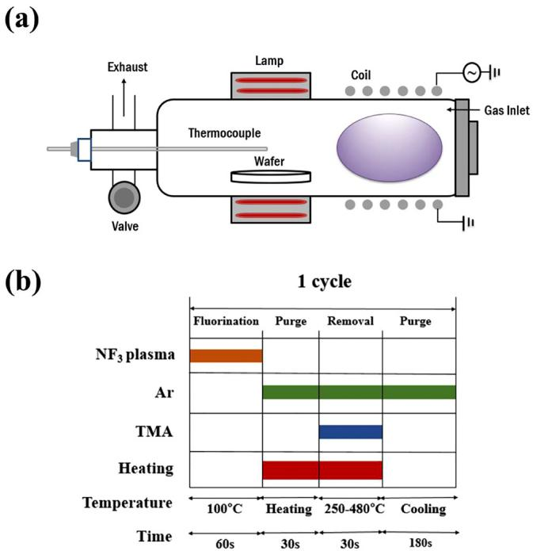
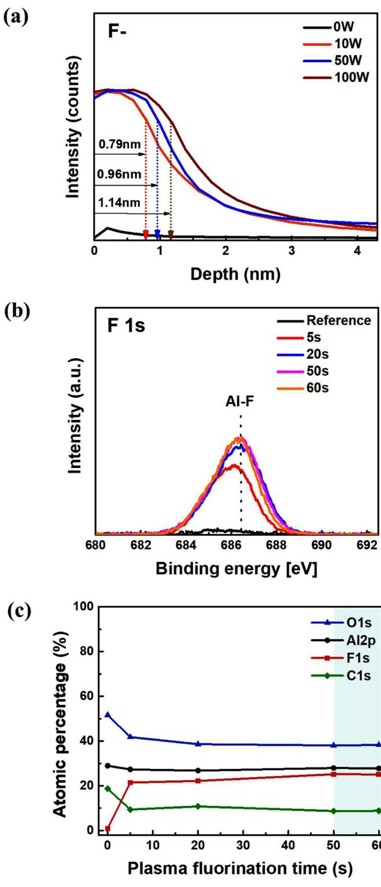
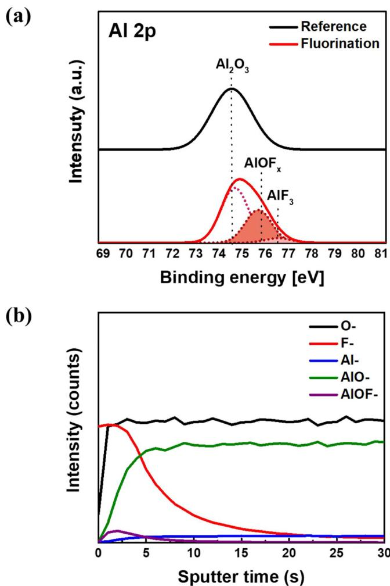
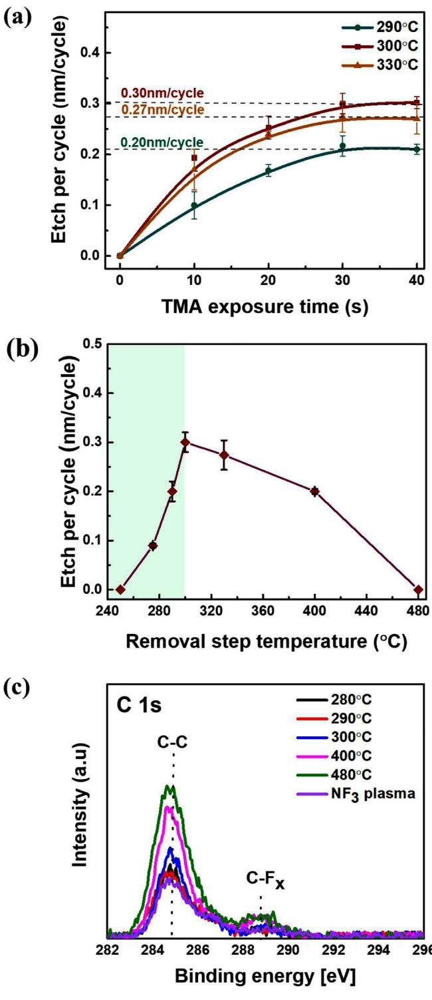
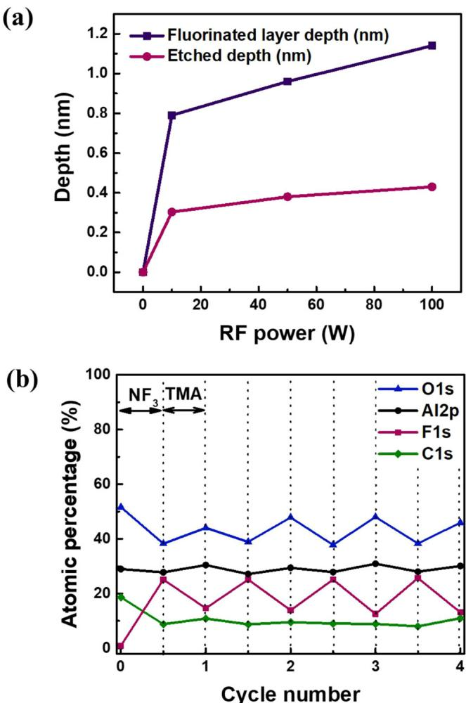
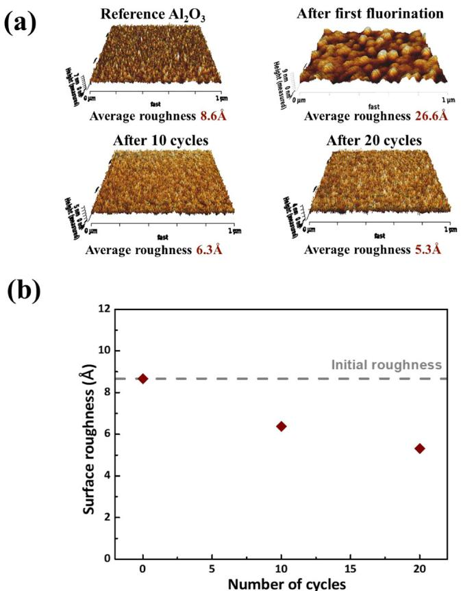

RESEARCH ARTICLE | APRIL 22 2022

# Atomic layer etching of  $\mathsf{Al}_2\mathsf{O}_3$  with  $\mathsf{NF}_3$  plasma fluorination and trimethylaluminum ligand exchange  $\mathbf{\delta}$

Special Collection: Atomic Layer Etching (ALE)

Jihyun Kim; Dahee Shim; Yongjae Kim; Heeyeop Chae

Check for updates J.Vac.Sci.Technol.A 40,032603 2022) https://doi.org/10.1116/6.0001616

# Articles You May Be Interested In

Thermal atomic layer etching of amorphous and crystalline  $\mathsf{Al}_2\mathsf{O}_3$  films

J.Vac.Sci.Technol.A (June 2021)

In situ studies on atomic layer etching of aluminum oxide using sequential reactions with trimethylaluminum and hydrogen fluoride

J.Vac.Sci.Technol.A (April 2022)

Rapid atomic layer etching of  $\mathsf{Al}_2\mathsf{O}_3$  using sequential exposures of hydrogen fluoride and trimethylaluminum with no purging

J.Vac.Sci.Technol.A (October 2018)

# Atomic layer etching of  $\mathrm{Al}_2\mathrm{O}_3$  with  $\mathrm{NF}_3$  plasma fluorination and trimethylaluminum ligand exchange

Cite as: J. Vac. Sci. Technol. A 40, 032603 (2022); doi: 10.1116/S.0001616 Submitted: 11 November 2021  $\cdot$  Accepted: 4 April 2022  $\cdot$  Published Online: 22 April 2022

Jihyun Kim, $^{1}$  Dahee Shim, $^{1}$  Yongjae Kim, $^{2}$  and Heeyeop Chae $^{1,2,a)}$

# AFFILIATIONS

$^{1}$ School of Chemical Engineering, Sungkyunkwan University (SKKU), Suwon 16419, Republic of Korea  $^{2}$ SKKU Advanced Institute of Nanotechnology (SAINT), Sungkyunkwan University (SKKU), Suwon 16419, Republic of Korea

Note: This paper is part of the 2023 Special Topic Collection on Atomic Layer Etching (ALE).  $^{a)}$ Author to whom correspondence should be addressed: hchae@skku.edu

# ABSTRACT

In this study, a cyclic isotropic plasma atomic layer etching (ALE) process was developed for aluminum oxide that involves fluorination with  $\mathrm{NF}_3$  plasma and ligand exchange with trimethylaluminum (TMA). The isotropic plasma ALE consists of two steps: fluorination and removal. During the fluorination step, the  $\mathrm{Al}_2\mathrm{O}_3$  surface was fluorinated to  $\mathrm{AlOF}_x$  with  $\mathrm{NF}_3$  plasma at  $100^{\circ}\mathrm{C}$ . The formation of the  $\mathrm{AlOF}_x$  layer was confirmed by x- ray photoelectron spectroscopy analysis, and the atomic fraction of fluorine on the surface was saturated at  $25\%$  after  $50~\mathrm{s}$  of plasma fluorination. The depths of the fluorinated layers were in the range of  $0.79 - 1.14\mathrm{nm}$  at different plasma powers. In the removal step, the fluorinated layer was removed by a ligand exchange reaction with TMA at an elevated temperature range of  $250 - 480^{\circ}\mathrm{C}$ . The etch per cycle (EPC) was  $0.20 - 0.30\mathrm{nm}$  cycle and saturated after  $30~\mathrm{s}$  in the temperature range of  $290 - 330^{\circ}\mathrm{C}$ . No etching was observed below  $250^{\circ}\mathrm{C}$ , and the EPC increased in the temperature range of  $250 - 300^{\circ}\mathrm{C}$  during the removal step with the ligand exchange reaction and reached the maximum at  $300^{\circ}\mathrm{C}$ . Then, the EPC was significantly reduced at high temperatures, possibly due to TMA decomposition. The fluorine atomic fraction on the surface was reduced to  $14\%$  after the removal. In conclusion,  $\mathrm{Al}_2\mathrm{O}_3$  was successfully etched at the atomic scale by the cyclic plasma ALE process. The average surface roughness of  $\mathrm{Al}_2\mathrm{O}_3$  was reduced from  $8.6$  to  $5.3\mathrm{\AA}$  after 20 cycles of etching.

Published under an exclusive license by the AVs. https://doi.org/10.1116/6.0001616

# I. INTRODUCTION

Over the last several decades, the critical dimensions (CD) of semiconductor devices have reduced as expressed by Moore's law and recently reached the nanometer scale.1- 4 The CD reduction has also induced the thickness reduction of gate silicon dioxide for metaloxide- semiconductor field- effect transistors and a reduction of the lateral dimensions.5,6 However, the continuous decrease in  $\mathrm{SiO_2}$  thickness, approaching the permissible limits, has led to large gate leakage currents.5,7- 9 High- dielectric constant  $(\kappa)$  materials have been adopted to replace  $\mathrm{SiO}_2$  to enable the thickness reduction by blocking the leakage current at the limited thickness.6,7,10,11 High-  $\kappa$  materials, such as  $\mathrm{Al}_2\mathrm{O}_3$ $\mathrm{ZrO_2}$  and  $\mathrm{HfO_2}$  provide the specific capacitance required for the gate dielectric at a considerable thickness with a reduced leakage current of transistors.10,12,13 Among them,  $\mathrm{Al}_2\mathrm{O}_3$  is considered a potential candidate for the blocking oxides in charge- trap flash memory applications owing to its larger bandgap  $(7\mathrm{eV})$  than other high-  $\kappa$  materials, such as  $\mathrm{ZrO_2}$ $(4.6\mathrm{eV})$  and  $\mathrm{HfO_2}$ $(5.7\mathrm{eV})$  .14,15 However,  $\mathrm{Al}_2\mathrm{O}_3$  is difficult to etch because of its physical and physical stabilities and is typically etched by reactive ion etching (RIE).16- 18 The use of three- dimensional (3D) structures is another miniaturization solution that requires a different etching technology than the conventional methods.4 The RIE results in anisotropic patterns and, therefore, cannot be applied to make 3D structures that require isotropic etching.4,19,20 Isotropic atomic layer etching (ALE) technologies are required to fabricate 3D structures with atomic scale dimensions.20- 24

Isotropic ALE for  $\mathrm{Al}_2\mathrm{O}_3$  is typically carried out by the surface fluorination and removal reactions, which are separated by purge steps.22,25- 29 The fluorination is typically the first modification step

that converts the surface of  $\mathrm{Al}_2\mathrm{O}_3$  to  $\mathrm{AlF}_3$  using hydrogen fluoride at elevated substrate temperatures.25,26,30- 32  $\mathrm{Al}_2\mathrm{O}_3$  at the surface is converted into an  $\mathrm{AlF}_3$  layer by reacting with HF because  $\mathrm{AlF}_3$  is more thermodynamically stable and reactive than  $\mathrm{Al}_2\mathrm{O}_3$  4,25,26 However, the use of HF should be restricted owing to safety issues related to its highly corrosive nature.30 Fluorine- containing plasma processing can be an alternative method to replace HF for the fluorination of surfaces.22,25,30 The high reactivity of plasma can broaden the choice of the fluorinating agent for isotropic ALE.21,22 The second stage of isotropic ALE comprises the removal step using thermal reactions, such as ligand exchange reactions, to remove the fluorinated surface.29,30,33- 35 The isotropic plasma ALE for  $\mathrm{Al}_2\mathrm{O}_3$  has been previously studied, but not as much as thermal ALE.22,36 A previous ALE study using plasma was characterized by etch rate and etch profiles.26 However, the study on fluorination on the surface and that in different depths using plasma fluorination has not been reported yet.

In this study, a cyclic isotropic plasma ALE process was developed for  $\mathrm{Al}_2\mathrm{O}_3$  by employing  $\mathrm{NF}_3,$  inductively coupled plasma (ICP), and trimethylaluminum (TMA) ligand exchange. The  $\mathrm{Al}_2\mathrm{O}_3$  surface was fluorinated to  $\mathrm{AlOF_x}$  with  $\mathrm{NF}_3$  plasma in the fluorination step, and the fluorinated layer was removed by a ligand exchange process with TMA at elevated temperatures in the removal step. The depth of the fluorinated layer was analyzed for different radio frequency (RF) powers in the fluorination step and etched. Surface analysis was performed after each half cycle. The etch per cycle (EPC), which was dependent on the exposure time of TMA, was saturated at various temperatures. The surface roughness of  $\mathrm{Al}_2\mathrm{O}_3$  decreased after the cyclic isotropic plasma ALE process.

# II.EXPERIMENT

A cyclic isotropic plasma ALE was studied in an ICP reactor with halogen lamps surrounding the quartz tube, as shown in Fig. 1(a). RF power was supplied through an inductive coil at  $13.56\mathrm{MHz}$  to generate plasma. Six halogen lamps were used for heating the sample to  $480^{\circ}C$ $\mathrm{Al}_2\mathrm{O}_3$  films that are  $50\mathrm{nm}$  - thick were prepared on a silicon substrate by physical vapor deposition sputtering to study the isotropic plasma ALE.  $\mathrm{Al}_2\mathrm{O}_3$  test samples of dimensions  $1.5\times 1.5\mathrm{cm}^2$  were positioned on  $5\times 5\mathrm{cm}^2$  Si carrier wafers and placed at the center of the heating lamp.

The isotropic plasma ALE process sequence for  $\mathrm{Al}_2\mathrm{O}_3$  is shown in Fig. 1(b). One cycle is composed of two steps: fluorination and removal. The first step in surface fluorination is the conversion reaction of the  $\mathrm{Al}_2\mathrm{O}_3$  layer to the  $\mathrm{AlOF_x}$  layer using plasma at  $100^{\circ}\mathrm{C}$  The temperature of the fluorination step was maintained at  $100^{\circ}\mathrm{C}$  for  $60~\mathrm{s}$  and the halogen lamps were turned on to elevate the temperature by  $300^{\circ}\mathrm{C}$  for  $30~\mathrm{s}$  after the fluorination in the first purge step,  $\mathrm{NF}_3,$  at a mass flow rate of 3.0 SCCM was exposed to surface fluorination, and the pressure was maintained at  $35~\mathrm{mTorr}$  . The applied RF power source was operated at  $10W$  for  $60~\mathrm{s}$  The second step,  $\mathrm{AlOF_x}$  layer removal, was achieved by a ligand exchange reaction with TMA at elevated temperatures. The temperature was increased to  $300^{\circ}\mathrm{C}$  by turning the halogen lamps and the temperature was maintained for  $30~\mathrm{s}$  with 50 SCCM TMA and 50 SCCM Ar. After this removal step, the sample was cooled for  $180~\mathrm{s}$  in the following purge step before the temperature reaches  $100^{\circ}\mathrm{C}$  These two sequential steps were repeated to etch the  $\mathrm{Al}_2\mathrm{O}_3$  layer.

  
FIG.1. (a) Schematic of ICP-type PECVD reactor and (b) sequence of the isotropic plasma ALE process for  $\mathrm{Al}_2\mathrm{O}_3$  etching.

The thickness of the fluorinated layer was measured using secondary ion mass spectrometry (SIMS, DNTOF, TOF- SIMS- 5) after the fluorination step.  $\mathrm{Cs}^+$ $1\mathrm{keV}$ $40\mathrm{nA}$  was used to remove the material forming a  $150\times 150\mu \mathrm{m}^2$  sputter crater, and Bi1 ion  $(25\mathrm{keV},1\mathrm{pA})$  was used for elemental analysis. The etch rate of the  $\mathrm{Al}_2\mathrm{O}_3$  layer was measured by changing the thickness of the removed  $\mathrm{Al}_2\mathrm{O}_3$  layer using a spectroscopic ellipsometer (Ellipso- Technology, Elli- SE- U) before and after the process. X- ray photoelectron spectroscopy (XPS, Thermo Scientific, ESCALAB 250) was used to characterize the chemical bonding structure and surface atomic composition of the  $\mathrm{Al}_2\mathrm{O}_3$  surface. High- resolution atomic force microscopy (HR- AFM, JPK Instruments, Nano Wizard Ultra Speed) was used to confirm the surface roughness after etching.

# III.RESULTS AND DISCUSSION

As the first step,  $\mathrm{Al}_2\mathrm{O}_3$  was fluorinated with  $\mathrm{NF}_3$  plasma, and the surface was analyzed by varying the plasma RF power and processing time. The depths of the fluorinated layers were investigated by SIMS depth profiling at various RF powers, as shown in Fig. 2(a). The F peak increased significantly with the RF power due to highly reactive fluorine radicals generated in the plasma. The fluorinated depth is defined as the depth at which the F intensity drops to  $80\%$  of its maximum intensity. The fluorination thickness is not saturated with the RF power, and the increase in the depth of fluorination is attributed to an increase in fluorine radicals generated at high

  
FIG.2. (a) SIMS depth profiles of F as a function of the sputtering time after  $\mathrm{NF}_3$  plasma treatment for  $60~\mathrm{s}$  at 0, 10, 50, and  $100W$  b) F 1s XPS peak from  $\mathrm{Al}_2\mathrm{O}_3$  films; and (c) saturation of atomic fractions as  $\mathrm{NF}_3$  plasma exposure time at  $10W$  and  $100^{\circ}C$

RF powers.38,39 A similar phenomenon is observed in the plasma oxidation of silicon. The oxidation thickness increased by plasma power without saturation.34,40 The fluorination as a function of  $\mathrm{NF}_3$  plasma processing time was investigated with the F1s peak at the binding energy of  $686.3\mathrm{eV}$  in the XPS spectra, as shown in Fig. 2(b).41 The peak increases with NF, plasma time up to  $50~\mathrm{s}$  and thereafter saturates at an RF power of  $10W$  The F1s peak is saturated because the fluorinated layer acts as a diffusion barrier that prevents fluorine from further penetrating the  $\mathrm{Al}_2\mathrm{O}_3$  layer.22 The atomic surface compositions of Al, O, and F were also plotted as a function of the fluorination time, as shown in Fig. 2(c). The atomic fraction of F increased to  $25\%$  and that of O decreased from  $38\%$  to  $51\%$  after  $50~\mathrm{s}$  of  $\mathrm{NF}_3$  plasma. The decrease in O is caused by the removal of NO or  $\mathrm{NO}_2$  in the  $\mathrm{NF}_3$  plasma.35 All the atomic compositions were saturated after  $50~\mathrm{s}$  of  $\mathrm{NF}_3$  plasma exposure time, and therefore, the plasma time of  $60~\mathrm{s}$  was selected as the standard time for the following fluorination step. The saturation in the fluorination step with  $\mathrm{NF}_3$  plasma allows precise control of the etch rate in the ALE process.

As the next step, the chemical composition of the fluorinated layer processed under the  $60~\mathrm{s}$  and  $10W$  conditions was investigated using XPS and SIMS depth profiles, as shown in Fig. 3. Al 2p peak was analyzed for fluorination, and the peak was deconvoluted into three peaks of 74.5, 75.8, and  $76.5\mathrm{eV}$  representing  $\mathrm{Al}_2\mathrm{O}_3$ $\mathrm{AlOF}_x,$  and  $\mathrm{AlF}_3$  respectively, as shown in Fig. 3(a).42 The peak area fractions of  $\mathrm{AlOF}_x$  and  $\mathrm{AlF}_3$  correspond to  $\sim 56.7\%$  and  $\sim 7.6\%$  respectively, of the total area. The depth profiles of O, F, Al, AIO, and AlOF were analyzed by SIMS at different sputtering times, as shown in Fig. 3(b). High concentrations of F and AlOF were observed near the surface region, indicating a high degree of fluorination on the surface. The intensity of F increased slightly near the surface and decreased significantly with depth. The low O and AIO fractions near the surface are attributed to the replacement of O by F in the fluorination step.43

The fluorinated  $\mathrm{Al}_2\mathrm{O}_3$  and  $\mathrm{AlOF}_x$  were removed by a ligand exchange reaction with TMA in the next step, and the EPC was studied as a function of the temperature and TMA exposure time as shown in Fig. 4(a). The EPC plateaus after  $30~\mathrm{s}$  of TMA exposure at various temperatures, and, therefore,  $30~\mathrm{s}$  was selected as the standard TMA exposure time in the subsequent study on the removal step. TMA exposure time in this work is considerably longer than that of HF in previous studies.21,35,44- 46 We believe that this longer TMA exposure time is attributed to a thicker fluorination depth formed with reactive fluorine radicals. The EPC increased from 0.20 to  $0.30\mathrm{nm / cycle}$  when the temperature was increased from 290 to  $300^{\circ}\mathrm{C}$  and decreased to  $0.27\mathrm{nm / cycle}$  at  $330^{\circ}\mathrm{C}$ . The EPC at  $300^{\circ}\mathrm{C}$  in this work is approximately 2- 7 times higher with plasma fluorination than that with HF.21,35,44- 46 The saturated EPC at  $30~\mathrm{s}$  of TMA processing was plotted over the entire temperature range, as shown in Fig. 4(b). No etching was observed below  $250^{\circ}\mathrm{C}$ , and the EPC increases at the temperature range of  $250 - 300^{\circ}\mathrm{C}$ . The EPC sharply decreases above  $300^{\circ}\mathrm{C}$ , and no etching was observed above  $480^{\circ}\mathrm{C}$ . We analyzed the surface composition with XPS at higher temperature of  $280 - 480^{\circ}\mathrm{C}$  as shown in Fig. 4(c). C1s peaks were fit using C- C at  $284.5\mathrm{eV}$  and  $\mathrm{C - F_x}$ $(x = 1,2,3)$  at  $288.7\mathrm{eV}$ .47,48 The C1s peaks maintained the similar intensity with and without TMA in the temperature range of  $280 - 300^{\circ}\mathrm{C}$  after first cycle ALE process. The intensities of C- C

  
FIG. 3. (a) Al 2p XPS peak and (b) SIMS depth profiles of O, F, Al, AlO, and AlOF of  $\mathrm{Al}_2\mathrm{O}_3$  surface after 60 s exposures using  $\mathrm{NF}_3$  at 10 W and  $100^{\circ}\mathrm{C}$ .

and  $\mathrm{C - F_x}$  peaks increase at the temperature above  $300^{\circ}\mathrm{C}$ , and the increase of carbon on the surface is believed to be related to the decomposition of TMA at higher temperature. The monomers of TMA were reported to decompose into dimethyl aluminum, monomethyl aluminum,  $\mathrm{C}_2\mathrm{H}_4$ , and  $\mathrm{CH}_3$  at high temperatures in a previous study. The decrease of EPC is attributed to the increased carbon on surface at higher temperature above  $300^{\circ}\mathrm{C}$ .

The etched depth after each ALE cycle was compared with the depth of the fluorinated layer at RF powers of 10, 50, and  $100\mathrm{W}$  via SIMS depth profiling, as shown in Fig. 5(a). Both the fluorinated depth and etched depth increased with the increasing RF power. However, the etched depth was less than the fluorinated depth, indicating that the fluorinated layers were not completely removed from the surface after the ALE. The ratio of fluorinated layer depth to etched depth was almost constant at 2.6 at each RF power. The atomic compositions of the  $\mathrm{Al}_2\mathrm{O}_3$  surface were analyzed at  $10\mathrm{W}$  by XPS and are plotted in Fig. 5(b) after each fluorination and removal

  
FIG. 4. (a) TMA exposure time at 290, 300, and  $330^{\circ}\mathrm{C}$  of the removal step; (b) EPC using  $\mathrm{NF}_3 / \mathrm{TMA} = 60 / 30\mathrm{s}$  at the range of  $250 - 480^{\circ}\mathrm{C}$  of the removal step; and (c) C 1s XPS peak from  $\mathrm{Al}_2\mathrm{O}_3$  films after  $\mathrm{NF}_3$  plasma exposure time at  $10\mathrm{W}$  and  $100^{\circ}\mathrm{C}$  and after removal step at an elevated temperature range of  $280 - 480^{\circ}\mathrm{C}$ .

  
FIG. 5. (a) Depth comparison of each half cycle of the fluorination step for  $60 \text{s}$ $\mathrm{NF}_3$  plasma at 10, 50, and  $100 \text{W}$  and a temperature of  $100^{\circ}\text{C}$ , and the removal step with TMA for  $30 \text{s}$  at an elevated temperature of  $300^{\circ}\text{C}$  and (b) surface atomic fraction tendency at each half cycle at  $10 \text{W}$ .

The concentration of fluorine was increased by  $25\%$  owing to the formation of  $\mathrm{AlOF}_x$  layers on  $\mathrm{Al}_2\mathrm{O}_3$  with  $\mathrm{NF}_3$  plasma in the first fluorination step. The fluorine concentration of the surface dropped to  $14\%$  after the reaction with TMA during the first removal step. The concentration of fluorine increased to  $25\%$  after the second fluorination step and decreased to  $14\%$  after the second removal step. In conclusion, this ALE process removes  $\mathrm{Al}_2\mathrm{O}_3$  at the atomic scale, even though the process leaves a fluorine residue on the surface after the plasma ALE process.

The surface roughness of the  $\mathrm{Al}_2\mathrm{O}_3$  films were observed by HR- AFM to image and quantify the roughness after the isotropic plasma ALE process, as shown in Fig. 6. As the number of cycles increased, the surface morphology became smooth, as shown in Fig. 6(a). The average roughness of the initial  $\mathrm{Al}_2\mathrm{O}_3$  surface was  $8.6 \text{\AA}$  and increased to  $26.6 \text{\AA}$  after first fluorination step possibly due to reorganization into  $\mathrm{AlOF}_x$  layer. The lower surface roughness was achieved by a chemical reaction between the fluorinated layer and TMA during the ligand exchange reaction. The average roughness of  $\mathrm{Al}_2\mathrm{O}_3$  decreases significantly by  $5.3 \text{\AA}$  after a 20- cycle process as shown in Fig. 6(b). From the literature, the surface roughness, determined after a thermal ALE process using HF via x- ray reflectivity, decreased from  $6.26$  to  $3.56 \text{\AA}$  after 100 cycles of ALE process at  $300^{\circ}\text{C}$ . This study using plasma for ALE effectively lowers the surface roughness as smoothly as the thermal ALE within only 20 cycles.

  
FIG. 6. (a) Surface morphology and (b) reduction of surface roughness after isotropic ALE process as a function of the number of cycles.

# IV. SUMMARY AND CONCLUSIONS

A plasma  $\mathrm{NF}_3$  ALE process for  $\mathrm{Al}_2\mathrm{O}_3$  was developed in this study. The depth of the fluorinated layer was confirmed to be  $0.79 \text{nm}$  using  $\mathrm{NF}_3$  plasma at  $10 \text{W}$ . The  $\mathrm{Al}_2\mathrm{O}_3$  surface was fluorinated to  $\mathrm{AlOF}_x$  with  $\mathrm{NF}_3$  plasma, and all atomic fractions of this surface were saturated as a function of the  $\mathrm{NF}_3$  plasma processing time at a fluorine concentration of  $25\%$ . The self- limiting characteristics were confirmed at various temperatures and TMA exposure times, and an EPC of  $0.30 \text{nm / cycle}$  was achieved at a temperature of  $300^{\circ}\text{C}$ . After the ALE process, the fluorine concentration of

the surface dropped to  $14\%$  after the reaction with TMA. The etched depth at  $10\mathrm{W}$  increased with the increasing RF power and the plasma ALE process demonstrated atomic scale etching even though the surface remained fluorinated. The roughness of the  $\mathrm{Al}_2\mathrm{O}_3$  substrate was decreased from 8.6 to  $5.3\mathrm{\AA}$  after a 20- cycle ALE process. We demonstrated that the proposed process with the use of plasma is an effective and nondestructive technique for the atomic level etching of 3D structures.

# ACKNOWLEDGMENTS

This work was supported by the National Research Foundation of Korea (NRF) grant funded by the Korea Government (MSIT) (No. 2018R1A2A3074950) and by the Korea Institute for Advancement of Technology (KIAT) and the Ministry of Trade, Industry & Energy (MOTIE) of the Republic of Korea (No. P0017363).

# AUTHOR DECLARATIONS

# Conflict of Interest

The authors have no conflicts to disclose.

# DATA AVAILABILITY

The data that support the findings of this study are available from the corresponding author upon reasonable request.

# REFERENCES

$^1\mathrm{Y}$  - T.OhK.- B.KimS.- H.ShimH.SimN.Van ToanT.Ono and Y.- H.Song, Microelectron. Eng. 79, 1 (2018).  $^2\mathrm{J}$  U. Knickerbocker et al., 2008 58th Electronic Components and Technology Conference, Lake Buena Vista, FL, 27- 30 May 2008 (2008).  $^3\mathrm{S}$  Ye, K. Yamabe, and T. Endoh, Mater. Sci. Semicond. Process. 134, 106046 (2021).  $^4\mathrm{A}$  Fischer, A. Routzahn, S. M. George, and T. Lill, J. Vac. Sci. Technol. A 39, 030801 (2021).  $^5\mathrm{M}$  Hirose, M. Koh, W. Mizubayashi, H. Murakami, K. Shibahara, and S. Miyazaki, Semicond. Sci. Technol. 15, 485 (2000).  $^6\mathrm{D}$  Rathee, M. Kumar, and S. K. Arya, Int. J. Comput. Appl. 8, 10 (2010).  $^7\mathrm{R}$  Chau, S. Datta, M. Doczy, J. Kavalieros, and M. Metz, Extended Abstracts of International Workshop on Gate Insulator (IEEE Cat. No. 03EX765), Tokyo, Japan, 6- 7 November 2003 (2003).  $^8\mathrm{S}$  Saha, J. Vac. Sci. Technol. B 39, 2240 (2001).  $^9\mathrm{Q}$  Chen and J. D. Meindl, Nanotechnology 15, S549 (2004).  $^{10}\mathrm{J}$  A. Kittl et al., Microelectron. Eng. 86, 1789 (2009).  $^{11}\mathrm{C}$  Zhao, C. Zhao, S. Taylor, and P. Chalker, Materials 7, 5117 (2014).  $^{12}\mathrm{K}$  Takahashi, K. Ono, and Y. Setsuhara, J. Vac. Sci. Technol. A 23, 1691 (2005).  $^{13}\mathrm{K}$  Yim, Y. Yong, J. Lee, K. Lee, H.- H. Nahm, J. Yoo, C. Lee, C. Seong Hwang, and S. Han, NPG Asia Mater. 7, e190 (2015).  $^4\mathrm{X}$  Yang, J.- C. Woo, D.- S. Um, and C.- I. Kim, Trans. Electr. Electron. Mater. 11, 202 (2010).  $^{15}\mathrm{W}$  Ban, S. Kwon, J. Nam, J. Yang, S. Jang, and D. Jung, Thin Solid Films 641, 47 (2017).  $^{16}\mathrm{D}$  - P. Kim, J.- W. Yeo, and C.- I. Kim, Thin Solid Films 459, 122 (2004).  $^{17}\mathrm{J}$  Paul et al., Microelectron. Eng. 86, 949 (2009).

$^{18}\mathrm{D}$  W. Kim, C. H. Jeong, K. N. Kim, H. Y. Lee, H. S. Kim, Y. J. Sung, and G. Y. Yeom, Thin Solid Films 435, 242 (2003).  $^{19}\mathrm{K}$  S. Min, S. H. Kang, J. K. Kim, Y. I. Jhon, M. S. Jhon, and G. Y. Yeom, Microelectron. Eng. 110, 457 (2013).  $^{20}\mathrm{A}$  Fischer, A. Routzahn, and T. Lill, ECS Meeting Abstracts MA2020- 02 (2020).  $^{21}\mathrm{Y}$  Lee, J. W. DuMont, and S. M. George, Chem. Mater. 28, 2994 (2016).  $^{22}\mathrm{N}$  J. Chittock, M. F. J. Vos, T. Faraz, W. M. M. Kessels, H. C. M. Knoops, and A. J. M. Mackus, Appl. Phys. Lett. 117, 162107 (2020).  $^{23}\mathrm{N}$  Miyoshi, H. Kobayashi, K. Shinoda, M. Kurihara, T. Watanabe, Y. Kouzuma, K. Yokoyama, S. Sakai, and M. Irwan- Iran, J. Appl. Phys. 55, 96UP01 (2017).  $^{24}\mathrm{W}$  Lu, Y. Lee, J. C. Gertsch, J. A. Murdzek, A. S. Cavanagh, L. Kong, J. A. Del Alamo, and S. M. George, Nano Lett. 19, 5159 (2019).  $^{25}\mathrm{V}$  Sharma, S. D. Elliott, T. Blomberg, S. Haukkka, M. E. Givens, M. Tuominen, and M. Ritala, Chem. Mater. 33, 2883 (2021).  $^{26}\mathrm{S}$  M. George, Acc. Chem. Res. 53, 1151 (2020).  $^{27}\mathrm{J}$  W. DuMont and S. M. George, J. Chem. Phys. 146, 052819 (2017).  $^{28}\mathrm{Y}$  Kim, S. Lee, Y. Cho, S. Kim, and H. Chae, J. Vac. Sci. Technol. A 38, 022606 (2020).  $^{29}\mathrm{Y}$  Cho, Y. Kim, S. Kim, and H. Chae, J. Vac. Sci. Technol. A 38, 022604 (2020).  $^{30}\mathrm{J}$  C. Gertsch, A. M. Cano, V. M. Bright, and S. M. George, Chem. Mater. 31, 3624 (2019).  $^{31}\mathrm{C}$  Fang, Y. Cao, D. Wu, and A. Li, Prog. Nat. Sci. Mater. Int. 28, 667 (2018).  $^{32}\mathrm{J}$  W. Clancey, A. S. Cavanagh, J. E. T. Smith, S. Sharma, and S. M. George, J. Phys. Chem. C 124, 287 (2020).  $^{33}\mathrm{J}$  A. Murdzek, A. Rajashekhar, R. S. Makala, and S. M. George, J. Vac. Sci. Technol. A 39, 042602 (2021).  $^{34}\mathrm{A}$  M. Cano, A. E. Marquardt, J. W. DuMont, and S. M. George, J. Phys. Chem. C 123, 10346 (2019).  $^{35}\mathrm{S}$  M. George and Y. Lee, ACS Nano 10, 4889 (2016).  $^{36}\mathrm{A}$  Fischer, R. Janek, J. Boniface, T. Lill, K. Kanarik, Y. Pan, V. Vahedi, and R. A. Gottsch, Proc. SPIE 10149, 101490H (2017).  $^{37}\mathrm{Z}$  Wang, C. Carriere, A. Seyeux, S. Zanna, D. Mercier, and P. Marcus, J. Electrochem. Soc. 168, 041503 (2021).  $^{38}\mathrm{E}$  - F. Wang, L.- C. Wang, M. Shih, and C.- H. Tsai, Chemosphere 57, 1157 (2004).  $^{39}\mathrm{G}$  Bruno, P. Capezzuto, G. Cicala, and P. Manodoro, J. Vac. Sci. Technol. A 12, 690 (1994).  $^{40}\mathrm{Y}$  Huang et al., Sol. Energy Mater. Sol. Cells 208, 110389 (2020).  $^{41}\mathrm{S}$  W. King, R. F. Davis, and R. J. Nemanich, J. Vac. Sci. Technol. A 32, 051402 (2014).  $^{42}\mathrm{R}$  Ramos, G. Cunge, B. Pelissier, and O. Joubert, Plasma Sources Sci. Technol. 16, 711 (2007).  $^{43}\mathrm{C}$  S. Lai, K. M. Fan, H. K. Peng, S. J. Lin, C. Y. Lee, and C. F. Ai, Appl. Phys. Lett. 90, 172904 (2007).  $^{44}\mathrm{Y}$  Lee, C. Huffman, and S. M. George, Chem. Mater. 28, 7657 (2016).  $^{45}\mathrm{J}$  Hennessy, C. S. Moore, K. Balasubramanian, A. D. Jewell, K. France, and J. Nikzad, J. Vac. Sci. Technol. A 35, 041512 (2015).  $^{46}\mathrm{D}$  R. Zywotko, J. Faguet, and S. M. George, J. Vac. Sci. Technol. A 36, 061508 (2018).  $^{47}\mathrm{S}$  - K. Kang, J. S. Oh, B. J. Park, S. W. Kim, J. T. Lim, G. Y. Yeom, C. J. Kang, and G. J. Min, Appl. Phys. Lett. 93, 043126 (2008).  $^{48}\mathrm{J}$  Chastain and R. C. King, Jr., Handbook of X- ray photoelectron spectroscopy (Perkin- Elmer, 1992), p. 261.  $^{49}\mathrm{Z}$  Zhang, Y. Pan, J. Yang, Z. Jiang, and F. Fang, J. Cryst. Growth 473, 6 (2017).  $^{50}\mathrm{K}$  Miwa, K. Usami, N. Takada, and K. Sasaki, Jpn. J. Appl. Phys. 48, 126002 (2009).