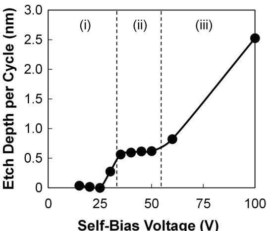
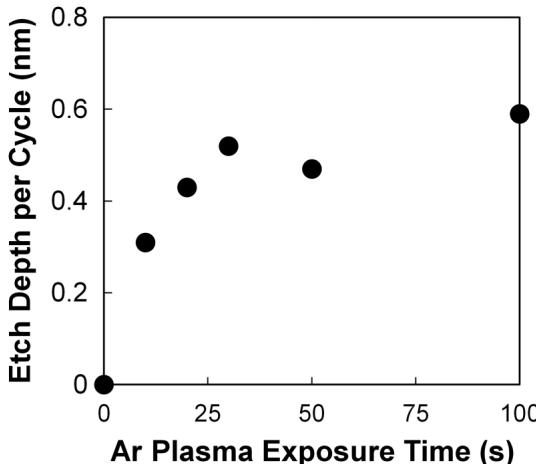
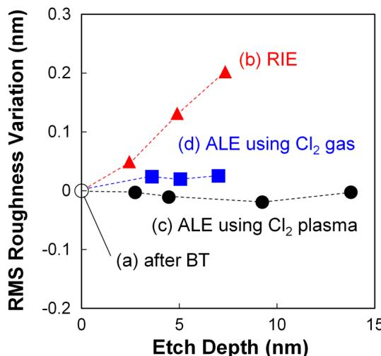
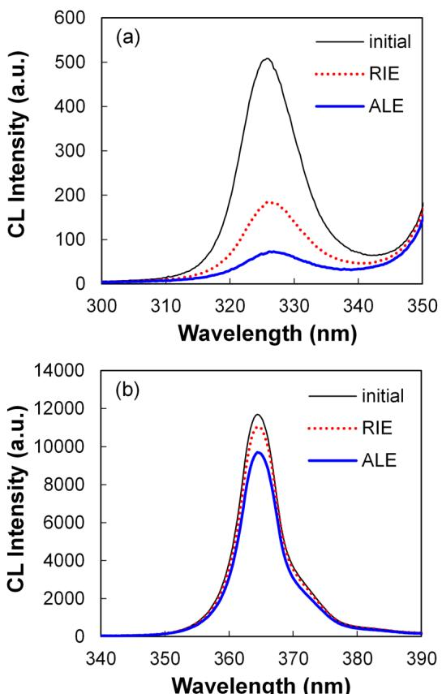
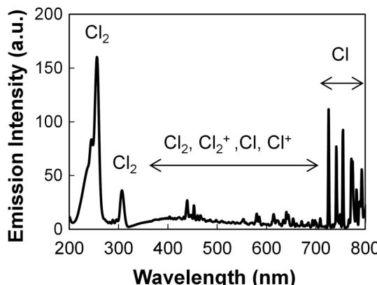
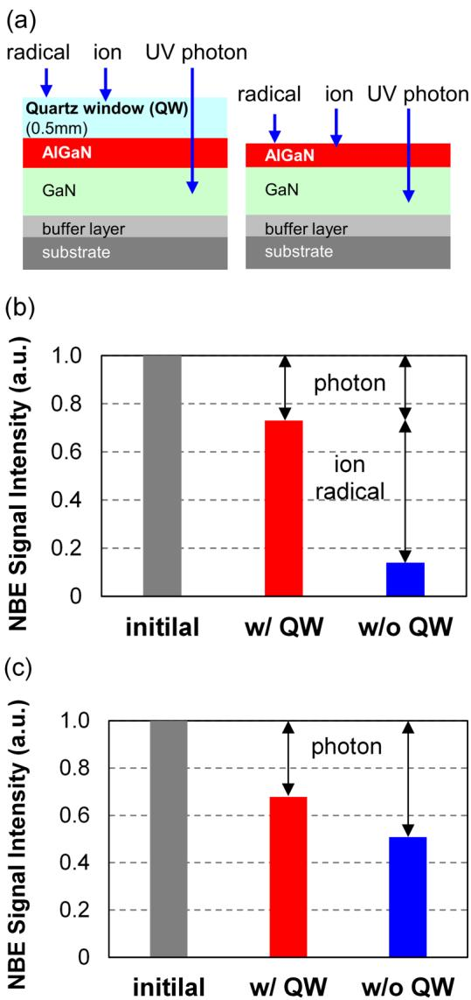
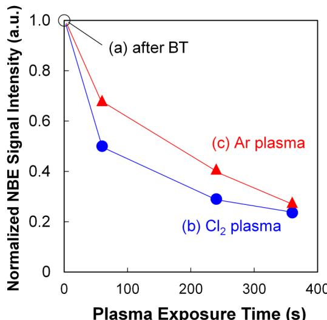
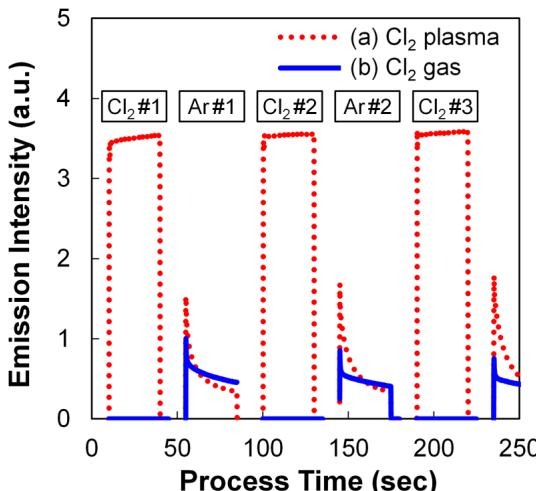

RESEARCH ARTICLE | JANUARY 23 2019

# Atomic layer etching of AlGaN using Cl $_2$  and Ar gas chemistry and UV damage evaluation  $\odot$

Special Collection: 2019 Special Collection on Atomic Layer Etching (ALE)

Hiroyuki Fukumizu; Makoto Sekine; Masaru Hori; Koji Kanomaru; Takuo Kikuchi

Check for updates J.Vac.Sci.Technol.A 37,021002 (2019) https://doi.org/10.1116/1.5063795

# Articles You May Be Interested In

Atomic layer etching of titanium nitride with surface modification by Cl radicals and rapid thermal annealing J.Vac.Sci.Technol.A (April 2022)

Morphological and electrical characterization of gate recessed AlGaN/GaN high electron mobility transistor device by purge- free atomic layer etching

J.Vac.Sci.Technol.A (February 2024)

Effect of Ar ion beam channeling on AlGaN/GaN heterostructures during the ion beam etching process Appl.Phys.Lett.April 2000)

# Atomic layer etching of AlGaN using  $\mathbb{C}\mathbb{I}_2$  and Ar gas chemistry and UV damage evaluation

Hiroyuki Fukumizu, $^{1,a,b)}$  Makoto Sekine, $^{2}$  Masaru Hori, $^{2}$  Koji Kanomaru, $^{1}$  and Takuo Kikuchi $^{1}$ $^{1}$ Corporate Manufacturing Engineering Center, Toshiba Corporation, Yokohama 235- 0017, Japan $^{2}$ Plasma Nanotechnology Research Center, Graduate School of Engineering, Nagoya University, Nagoya 464- 8603, Japan

(Received 1 October 2018; accepted 28 December 2018; published 23 January 2019)

The atomic layer etching (ALE) characteristics of AlGaN using  $\mathrm{Cl}_2$  plasma in the modification step and Ar plasma in the removal step were investigated in comparison with conventional reactive ion etching (RIE). Although surface roughening and GaN composition changes were observed in the RIE process, the ALE process did not result in such changes. However, the etching damage of the AlGaN layer evaluated using cathodoluminescence in AlGaN/GaN stacked films in the case of ALE was  $30\%$  higher than that in RIE. This was attributed to the longer process time of ALE compared to RIE. The GaN layer underneath the AlGaN layer was also damaged. This could be mainly caused by UV photons during the modification step using  $\mathrm{Cl}_2$  plasma. The authors introduced a modification step using  $\mathrm{Cl}_2$  gas instead of  $\mathrm{Cl}_2$  plasma; thus, the etching damage was successfully reduced while maintaining good surface characteristics. Published by the AVS. https://doi.org/10.1116/1.5063795

# I. INTRODUCTION

For next- generation power devices, wide- bandgap semiconductors such as SiC and GaN are being developed. The GaN- based high electron mobility transistor (HEMT) is a promising candidate for ultralow- loss power switching devices owing to its high breakdown voltage and high electron carrier velocity in the transistor channel giving a low on- state resistance. While power switching applications strongly demand normally- off operation from the fail- safe point of view, this normally- off operation for a GaN/AlGaN HEMT is still a challenge. Several normally- off structures have been investigated such as recess gate, $^{1 - 5}$  fluorine ion treatment, $^{6 - 8}$  and p- GaN gate structures. $^{9 - 12}$  In general, the recess gate is considered a simple structure and can be fabricated without complicated process steps in comparison with other structures. The recess gate HEMT has the AlGaN layer partially removed using dry etching, resulting in an in- plane AlGaN/GaN heterojunction. In this structure, a gate insulator can be used to suppress the gate leakage current and increase the on- state operation swing. However, the recess gate poses three main challenges in the etching process, such as control of the residual AlGaN film thickness, surface roughness, and plasma- induced damage. First, the residual AlGaN thickness directly affects the initial gate threshold voltage (Vth); therefore, very precise control of this thickness is required. $^{4,5}$  In addition, from a manufacturing point of view, controllability, uniformity, and repeatability of the etch depth across a large wafer are major challenges. Second, a rough surface would increase the interface state density and reduce electron mobility. $^{13,14}$  Third, plasma induces surface damages, such as lattice defects, discharge- gas related residues, and nonstoichiometric surfaces, $^{15 - 25}$  which degrade the electrical characteristics of the device. $^{15 - 18}$  Recently, it was reported that some etching damages could be reversed via an additional thermal annealing process after etching. $^{15,16,19,23,25}$  The higher the temperature in the annealing process, the higher the extent to which the damages could be reversed; however, it was difficult to reverse the etching damages completely. Therefore, one of the promising methods to solve these three problems in AlGaN etching could be atomic layer etching (ALE).

ALE is mainly composed of four steps: surface modification such as adsorption of etch species, oxidation, and nitridation, purging, removal of the modified layer, and purging again. $^{26}$  Both the modification and removal steps are self- limiting, and therefore, ALE has the advantage of good controllability of the etch depth, compared to conventional reactive ion etching (RIE). In previous studies on ALE of GaN or AlGaN, the surface was oxidized with  $\mathrm{O}_2$  plasma, and subsequently, this oxidized layer was removed with  $\mathrm{BCl}_3$  plasma. $^{27}$  This oxidation step was a self- limiting process, but  $\mathrm{BCl}_3$  plasma etching in the removal step was not self- limiting. Recently, a directional type of ALE for GaN and AlGaN films using  $\mathrm{Cl}_2$  or  $\mathrm{BCl}_3 / \mathrm{Cl}_2$  plasma and Ar ion bombardment was investigated. $^{28}$  In this process, both the modification and removal steps are self- limiting. The root mean square (RMS) surface roughness of the GaN film etched via ALE using  $\mathrm{Cl}_2$  and Ar plasma was  $0.6 \mathrm{nm}$  while that obtained via RIE was  $4.0 \mathrm{nm}$ ; the surface of the AlGaN film etched via ALE using  $\mathrm{BCl}_3 / \mathrm{Cl}_2$  and Ar plasma was also very smooth, and its RMS surface roughness was  $0.3 \mathrm{nm}$ . The etching damages caused in the GaN film using RIE were evaluated via photoluminescence analysis. $^{19,20,29 - 32}$  However, etching damage caused by ALE is not reported so far.

Therefore, in this study, we precisely investigated the ALE process of AlGaN/GaN stacked films using  $\mathrm{Cl}_2 / \mathrm{Ar}$  gas chemistry and the possible etching damage caused by ALE.

# II. EXPERIMENT

# A. Experimental setup

The AlGaN/GaN heterostructure was epitaxially grown on a Si substrate via metal organic chemical vapor deposition. A  $30\mathrm{- nm}$  AlGaN film was stacked on a  $100\mathrm{- nm}$  GaN film. Conventional RIE and ALE processes were performed in a standard transformer coupled plasma (TCP) etching system, operating at a  $13.56\mathrm{MHz}$  RF power, and a separate  $13.56\mathrm{MHz}$  RF power was also supplied to the bottom electrode. The sample stage temperature was  $25^{\circ}C$  and the chamber pressure was kept at  $20\mathrm{mTorr}$ . First, the native oxide layer on the AlGaN surface was removed via RIE using the  $\mathrm{BCl}_3 / \mathrm{Cl}_2$  chemistry at a self- bias voltage of  $131\mathrm{V}$  and a TCP power of  $700\mathrm{W}$ . This etching process was termed the break through (BT) step, and the etch depth of AlGaN at this step was approximately  $5\mathrm{nm}$ . Next, the AlGaN surface was etched using RIE or ALE. In the case of RIE, AlGaN was etched using the  $\mathrm{Cl}_2 / \mathrm{Ar}$  chemistry, with a self- bias voltage of  $45\mathrm{V}$  and a TCP power of  $700\mathrm{W}$ .  $\mathrm{Cl}_2$  plasma and Ar plasma were used for the modification step and the removal step, respectively. The AlGaN surface was exposed to  $\mathrm{Cl}_2$  plasma at a pressure of  $20\mathrm{mTorr}$  for  $30\mathrm{s}$  at a TCP power of  $700\mathrm{W}$  in which the self- bias voltage was set at  $0\mathrm{V}$  to prevent the etching of the AlGaN film. After  $30\mathrm{s}$  of  $\mathrm{Cl}_2$  plasma exposure, the surface was irradiated by Ar plasma at a pressure of  $20\mathrm{mTorr}$  and a TCP power of  $700\mathrm{W}$  where the self- bias voltage was changed from  $0$  to  $100\mathrm{V}$  and exposure time to Ar plasma was changed from  $0$  to  $100\mathrm{s}$ . Between the modification and removal steps, a purge step without plasma was carried out to avoid contamination by residual gas and radicals. The purge time after the modification and removal steps was  $30\mathrm{s}$  at a pressure of  $20\mathrm{mTorr}$  with Ar gas flow. Optical emission spectroscopy (OES) was carried out to estimate the reactive species in the plasmas.

# B. Film characterization

The thickness of the unetched and etched AlGaN films was measured using spectroscopic ellipsometry (Woollam M- 2000). The surface roughness was measured using atomic force microscopy (AFM, Hitachi High- Tech Science E- sweep). The measurements were performed in tapping mode under ambient conditions, and the scanning area was  $1\times 1\mu \mathrm{m}^2$ . The initial surface roughness of AlGaN was  $0.09\mathrm{nm}$ . The atomic composition and chemical bonding of the etched surfaces were analyzed using x- ray photoelectron spectroscopy (XPS, ULVAC- PHI PHI 5000). To evaluate the plasma- induced damage, the etched AlGaN/GaN surface was analyzed via cathodoluminescence (CL). For CL measurements, a JEOL JSM- 7100F/TTLS scanning electron microscopy (SEM) system was used as the excitation source, and the emitted light was analyzed via a HORIBA Jobin Yvon iHR- 320. The acceleration voltage of the electron beam for SEM was  $2\mathrm{kV}$ , and the electron penetration depth in AlGaN was approximately  $45\mathrm{nm}$ . Under this condition, we could evaluate not only the etched AlGaN film but also the underlying GaN film.

# III. RESULTS AND DISCUSSION

# A. Basic etching characteristic of ALE

First, we evaluated the modification step performed using  $\mathrm{Cl}_2$  plasma. After the BT step, the AlGaN film was exposed to  $\mathrm{Cl}_2$  plasma. According to XPS analysis results, the Cl/Ga atomic composition ratio increased with an increase in the  $\mathrm{Cl}_2$  plasma exposure time and then became saturated. The AlGaN film was not etched by the  $\mathrm{Cl}_2$  plasma regardless of the exposure time. Based on this result, we chose  $30\mathrm{s}$  as the  $\mathrm{Cl}_2$  plasma exposure for the modification step. Figure 1 shows the AlGaN etch depth per cycle (EPC) depending on the self- bias voltage of Ar plasma for the removal step. This EPC was determined using the average etch depth for five cycles. The AlGaN film was not etched at self- bias voltages below  $25\mathrm{V}$ , but started to be etched above  $30\mathrm{V}$ , corresponding to regime (i). A constant EPC of  $\sim 0.5\mathrm{nm}$  was obtained at the bias condition from  $35$  to  $50\mathrm{V}$ . This corresponded to regime (ii), and this removal step was self- limiting in this regime.  ${}^{26}$  EPC increased significantly above  $60\mathrm{V}$  owing to the sputtering effect, which corresponded to regime (iii).  ${}^{26}$  We chose a self- bias voltage of  $45\mathrm{V}$  for our ALE process. Figure 2 shows the dependence of EPC on the Ar plasma exposure time. EPC increased with an increase in the Ar plasma exposure time for the first  $30\mathrm{s}$  and then became saturated after  $30\mathrm{s}$ . We chose an Ar exposure time of  $30\mathrm{s}$  for our ALE process. In this process, both the modification and removal steps were self- limiting, and a good linearity between the etch depth and the number of cycles was obtained. Thus, it was confirmed that the process had good controllability in terms of the etch depth.

# B. Surface roughness comparison between RIE and ALE

Figure 3 shows the surface roughness variation measured using AFM as a function of the etch depth of the AlGaN

  
FIG. 1. EPC of ALE for the AlGaN film as a function of self-bias voltage for a fixed  $30\mathrm{s}$  of Ar plasma exposure in the removal step: (i) incomplete removal, (ii) ALE window, and (iii) sputtering.

  
FiG. 2. EPC of ALE for the AlGaN film as a function of Ar plasma exposure time in the removal step with a self-bias voltage of  $45~\mathrm{V}$ .

film, which was etched using conventional RIE and ALE. The self- bias voltage in RIE was  $45~\mathrm{V}$ , and this was the same as that of ALE for the removal step using Ar ion bombardment. Both the modification step using  $\mathrm{Cl}_2$  plasma and the removal step using Ar plasma were performed for  $30~\mathrm{s}$ . The roughness of AlGaN after the BT step slightly increased to  $0.13\mathrm{nm}$  from  $0.09\mathrm{nm}$  of the initial unetched surface. Both the etch depth and surface roughness variation, respectively, shown on the  $x$ - axis and  $y$ - axes of Fig. 3 were measured from the end of the BT step. In the case of RIE, the roughness increased with an increase in the etch depth. On the other hand, the surface roughness in ALE did not change regardless of the etch depth. According to the XPS analysis results, the N/Ga composition ratio on the AlGaN surface etched using ALE was the same as that after the BT step. The N/Ga ratio in the case of RIE decreased after etching. This nitrogen desorption from the surface etched using RIE is supposed to induce surface roughness. Because the vapor pressures of the etching by- products such as  $\mathrm{NCl}_x$  or

  
FiG. 3. Surface roughness variation of AlGaN as a function of etch depth of the AlGaN film after (a) BT step, (b) RIE, (c) ALE using  $\mathrm{Cl}_2$  plasma, and (d) ALE using  $\mathrm{Cl}_2$  gas.

$\mathrm{N}_2$  are higher than that of  $\mathrm{GaCl}_x$ , nitrogen trends to desorb preferentially. In the case of ALE, after the uniform modified layer was formed during the modification step, this layer was completely removed during the removal step. Thus, a smooth surface was obtained via ALE.

In the case of ALE, the etch depth in the Ar removal step was very less and independent of the Ar plasma exposure time, which could have suppressed roughening of the surface. This result shows that the ALE process could produce an AlGaN film with a smooth and stoichiometric surface.

# C. Etching damage evaluation using CL

To evaluate crystal defects induced by etching, CL measurements were performed. The etching damage in GaN films introduced by conventional RIE was analyzed via CL. After the BT step,  $2.5\mathrm{nm}$  of the AlGaN film was etched using ALE or RIE, and the residual thicknesses etched using ALE and RIE were 22.6 and  $23.0\mathrm{nm}$ , respectively. The penetration depth of the electrons was approximately  $45~\mathrm{nm}$  for our CL measurements; hence, we could evaluate not only the etched AlGaN film but also the underlying GaN film. Figure 4(a) shows CL spectra related to the AlGaN film. The near- band- edge (NBE) signal of AlGaN was observed at approximately  $325~\mathrm{nm}$ $(3.8\mathrm{eV})$ . The degradation of the NBE signal intensity means that some crystal defects are introduced into the film owing to etching damage. The intensity of the AlGaN NBE signal drastically decreased

  
FiG. 4. CL spectra of the AlGaN/GaN stacked film without etching, etched by RIE, and etched by ALE: (a) NBE of AlGaN and (b) NBE of GaN.

after etching, indicating that severe damages were introduced by both the RIE and ALE processes. Furthermore, it was found that the etching damage caused by ALE was higher than that caused by RIE; the AlGaN NBE intensity decreased by  $64\%$  after RIE, while its intensity decreased by  $86\%$  after ALE. Figure 4(b) shows the CL spectra for the GaN film. The NBE signal of GaN was observed at approximately  $364\mathrm{nm}$ $(3.4\mathrm{eV})$ . The GaN film underneath the AlGaN film was not etched at all in both ALE and RIE, but the GaN NBE signal intensity decreased after etching. The GaN film underneath the etched AlGaN film was also defective, and the defects caused by ALE were also larger than those caused by RIE. A  $6\%$  decrease in the GaN NBE intensity was observed after RIE, while a  $17\%$  decrease was observed after ALE. We compared the etching process time between RIE and ALE. The etching time in RIE was  $20\mathrm{s}$ . On the other hand, in the case of ALE, the duration of the  $\mathrm{Cl}_2$  plasma modification step was  $30\mathrm{s}$  and that of the Ar plasma removal step was  $30\mathrm{s}$ ; thus, the total plasma exposure time in five ALE cycles for etching  $2.5\mathrm{nm}$  was  $300\mathrm{s}$ . The plasma exposure time in ALE was 15 times longer than that in RIE. We speculate that the longer process time in ALE would induce more plasma damage. Next, we discuss the root cause of etching damage.

# D. Root cause of etching damage

In general, plasma- induced damages were mainly introduced by radicals, ions, and photons. Radicals do not have much energy, and the radical penetration depth is limited to only the surface. The penetration depth of Ar ions was estimated to be approximately  $0.5\mathrm{nm}$  for a self- bias voltage of  $45\mathrm{V}$ , determined using the SRIM/TRIM software package. Next, the photon penetration depths of the AlGaN and GaN films were evaluated. While Ar plasma does not have strong emission peaks in the UV region  $(200 - 320\mathrm{nm})$ ,  $\mathrm{Cl}_2$  plasma has several strong emission peaks. Figure 5 shows the optical emissions of the  $\mathrm{Cl}_2$  plasma in the modification step. We also observed strong emissions at approximately  $257\mathrm{nm}$ $(4.8\mathrm{eV})$  and  $308\mathrm{nm}$ $(4.0\mathrm{eV})$ , related to  $\mathrm{Cl}_2$  molecules in the UV region. The penetration depths into the AlGaN film at  $308$  and  $257\mathrm{nm}$  are  $104$  and  $63\mathrm{nm}$ , respectively. Both these penetration depths were larger than  $23\mathrm{nm}$ , the thickness of the residual AlGaN film; this indicates that photons at these wavelengths could cause defects in the entire AlGaN film. The penetration depths into the GaN film at  $308$  and  $257\mathrm{nm}$  were  $97$  and  $66\mathrm{nm}$ , respectively. According to this estimation, the photons at these wavelengths could penetrate into not only the AlGaN film but also the GaN film, damaging both the GaN film and the AlGaN film. Therefore, the damage induced in the unetched GaN film was attributed not to ions and radicals but to UV photons.

  
FIG. 5. Optical emission from  $\mathrm{Cl}_2$  plasma in the adsorption step with a TCP power of  $700\mathrm{W}$ , a self-bias voltage of  $0\mathrm{V}$ , and a pressure of  $20\mathrm{mTorr}$ .

To separately analyze the etching damage induced by UV photons and that induced by ions and radicals, the AlGaN/ GaN stacked film was etched with and without a quartz window (QW)  $(0.5\mathrm{mm}$  thick) on the sample for five cycles after the BT step, as shown in Fig. 6(a). Figures 6(b) and 6(c) show the CL results of AlGaN and GaN films, respectively. According to Fig. 6(b), in the case without the QW, the AlGaN NBE signal intensity drastically decreased, as shown in Fig. 4(a); this degradation was caused by ions, radicals, and photons. On the other hand, the degradation of the AlGaN

  
FIG. 6. NBE signal intensities of etched AlGaN/GaN with and without quartz windows: (a) sample setup, (b) NBE signal intensity of AlGaN, and (c) NBE signal intensity of GaN.

NBE signal intensity in the presence of the Qw was much lower than that in the absence of the Qw, which was induced by only UV photons. The damage to the AlGaN film induced by ions and radicals was larger than that induced by photons. The decrease in GaN NBE signal intensity in the cases with and without the Qw shown in Fig. 6(c) was caused by only photons because ions and radicals could not reach the GaN layer. These results clearly indicated that photons could damage both the AlGaN and GaN layers. The amount of degradation during etching without the Qw was slightly larger than that with the Qw in Fig.6(c).This is because a slightly etched (approximately  $7\mathrm{nm}$  AlGaN layer resulted in increased photon penetration.

As mentioned earlier, Ar does not have inherently strong emissions between 200 and  $320\mathrm{nm}$  this indicates that the damage on the AlGaN and GaN films might be caused by only  $\mathrm{Cl}_2$  plasma exposure. To compare the UV photon damage between  $\mathrm{Cl}_2$  and Ar plasmas, the following experiment was carried out. After the BT step, we exposed the AlGaN/GaN stacked layer to either only  $\mathrm{Cl}_2$  plasma or only Ar plasma, with the same conditions as those employed in the modification or removal steps, respectively. The AlGaN film was not etched by the Ar plasma without  $\mathrm{Cl}_2$  plasma exposure. Figure 7 shows a normalized GaN NBE signal intensity as a function of the plasma exposure time. The NBE signal intensity after  $\mathrm{Cl}_2$  or Ar plasma exposure was normalized using that obtained after the BT step. The GaN NBE signal intensity after exposure to  $\mathrm{Cl}_2$  or Ar plasma decreased with an increase in the plasma exposure time. Photon damage on the GaN caused by  $\mathrm{Cl}_2$  plasma was larger than that caused by Ar plasma. It was observed that even Ar plasma induced photon damage, although there are inherently no strong emission peaks between 200 and 320 nm. We will discuss the reason for this phenomenon later. After  $360\mathrm{s}$  of plasma exposure, the amount of deterioration caused by  $\mathrm{Cl}_2$  plasma was the same as that caused by Ar plasma. Under our CL measurement conditions, only the $19\mathrm{- nm}$  top layer of the GaN film was analyzed. This top layer was completely damaged by UV radiation during the long plasma exposure time; therefore, there is no large difference in the NBE signal intensities between the  $\mathrm{Cl}_2$  and Ar plasmas.

  
FIG. 7. Normalized NBE signal intensity of GaN underneath the AlGaN film: (a) after the BT step, (b) after exposure to  $\mathrm{Cl}_2$  plasma, and (c) after exposure to Ar plasma as a function of plasma exposure time.

We examined the reason why the Ar plasma induced damage on the GaN film. Figure 8(a) shows an emission intensity of  $308\mathrm{nm}$  corresponding to  $\mathrm{Cl}_2$  molecules as a function of the process time for both the  $\mathrm{Cl}_2$  plasma modification step and the Ar plasma removal step. A strong emission intensity was observed in the  $\mathrm{Cl}_2$  plasma step, and this intensity was relatively stable. Moreover, the  $308\mathrm{- nm}$  emission line was also observed during the Ar plasma step, and this intensity was smaller than that in the  $\mathrm{Cl}_2$  plasma step. UV emissions related to  $\mathrm{Cl}_2$  during the Ar plasma step might be attributed to the chlorine residue on the chamber wall, and these UV emissions could induce photon damage on the GaN and AlGaN films even in the Ar plasma step. We analyzed the etched AlGaN film using XPS. Just after the modification step using  $\mathrm{Cl}_2$  plasma, a  $\mathrm{Cl}2\mathrm{p}$  peak with a binding energy of approximately  $198\mathrm{eV}$  was observed (not shown). This intensity decreased with the Ar plasma exposure time of the removal step, but a  $\mathrm{Cl}_2$  - related peak was still observed even after  $30\mathrm{s}$  of exposure in the Ar plasma step. This suggests that Cl adsorbed on the chamber wall was not removed completely during the removal step; therefore, this residual Cl would appear again.

# E. Photon damage reduction

E. Photon damage reductionIt was found that UV-induced damage was serious in ALE owing to its long process time. The primary reason for degradation was UV emission from  $\mathrm{Cl}_2$  plasma. To reduce UV photon damage, we propose a remote  $\mathrm{Cl}_2$  plasma or  $\mathrm{Cl}_2$  gas process in the modification step because it is possible to remove UV photons during the modification step. Ar plasma potentially causes less UV damage. However, the residual Cl on the chamber wall is desorbed into the Ar plasma, and it would produce UV photons in the removal step as long as

  
FIG. 8. Emission intensity at  $308\mathrm{nm}$  as a function of process time: (a) ALE using  $\mathrm{Cl}_2$  plasma and (b) ALE using  $\mathrm{Cl}_2$  gas.

we use the same chamber for the modification and removal steps. Therefore, it could be possible to suppress UV damage during the removal step using the following two methods. The first one is the use of the same Ar plasma, but this process should be carried out in a separate chamber and not the one used in the modification step with  $\mathrm{Cl}_2$  plasma. The second one is using a neutral Ar beam, which has very limited plasma radiation.39,40 Hemmi et al. reported that the current collapse caused by the interface traps at the gate electrode is suppressed by neutral- beam etching of the stacked AlGaN/GaN structure.41 However, additional chambers or equipment would increase the process time and cost.

Therefore, we examined  $\mathrm{Cl}_2$  gas exposure instead of using  $\mathrm{Cl}_2$  plasma for the modification step and Ar plasma for the removal step in the same chamber. The EPC of the  $\mathrm{Cl}_2$  gas process at a pressure of 200 mTorr was  $0.34\mathrm{nm}$ . Figure 3(d) shows the dependence of the surface roughness variation on the etched depth in the  $\mathrm{Cl}_2$  gas process. Regardless of the etched depth, the surface roughness produced in ALE using  $\mathrm{Cl}_2$  gas did not increase, as with  $\mathrm{Cl}_2$  plasma. We compared the photon damage on the GaN film caused in ALE using  $\mathrm{Cl}_2$  gas, ALE using  $\mathrm{Cl}_2$  plasma, and RIE using  $\mathrm{Cl}_2 / \mathrm{Ar}$  plasma. The total etched depth of AlGaN was  $7\mathrm{nm}$  including the BT step. First, OES of  $\mathrm{Cl}_2$  plasma was performed. No emission, even at  $308~\mathrm{nm}$  was observed during the modification step in the case of ALE using  $\mathrm{Cl}_2$  gas, as shown in Fig. 8(b). However, the  $308\mathrm{- nm}$  emission in the  $\mathrm{Cl}_2$  gas process still appeared just after ignition of the Ar plasma. The emission intensity was not significantly suppressed in the Ar plasma step even when  $\mathrm{Cl}_2$  gas was used for ALE. When we performed ALE with  $\mathrm{Cl}_2$  gas using the same chamber for the modification and removal steps, it was difficult to suppress Cl- related emissions in the Ar plasma step. The  $308\mathrm{- nm}$  photon flux at the same etch depth was estimated from OES. The total photon flux of the process with  $\mathrm{Cl}_2$  gas drastically decreased to  $7\%$  of that with  $\mathrm{Cl}_2$  plasma owing to the elimination of  $\mathrm{Cl}_2$  plasma radiation in the modification step. Finally, the sample etched by ALE using  $\mathrm{Cl}_2$  gas was analyzed via  $\mathrm{Cl}_2$ . The NBE signal intensity of GaN and AlGaN etched by ALE using  $\mathrm{Cl}_2$  gas was twice that obtained when using  $\mathrm{Cl}_2$  plasma. However, the damage amount in ALE using  $\mathrm{Cl}_2$  gas was larger than that in RIE because of the residual  $\mathrm{Cl}_2$  on the chamber wall and the longer process time. It was difficult to reduce the photon damage in ALE to less than that in RIE.

# IV. SUMMARY

We investigated plasma- induced damages on AlGaN/GaN stacked layers during RIE and ALE processes. In the case of RIE, the surface roughness of the layers etched using the  $\mathrm{Cl}_2 / \mathrm{Ar}$  gas- mixture plasma increased with an increase in the etched depth, and nitrogen was desorbed from the surface of the AlGaN layer. On the other hand, these deteriorations were not observed in the ALE process at the same etched depth. It was, however, revealed that photon damages in ALE were larger than those in RIE owing to the longer plasma irradiation time of the modification and/or removal steps. As surface roughness and residual thickness are the most critical factors influencing device operations, we conclude that ALE could be a promising etching process for next- generation power devices.

# ACKNOWLEDGMENTS

The authors thank Kazuyuki Ito of Toshiba Corporation for his technical support in surface analysis and also thank Junichi Tonotani of Toshiba Corporation, as well as Kazuaki Kurihara, Hisataka Hayashi, and Keiji Suzuki of Toshiba Memory Corporation for their useful discussions and suggestions.

$^1\mathrm{W}$  B. Lanford, T. Tanaka, Y. Otoki, and I. Adesida, Electron. Lett. 41, 449 (2005).  $^2\mathrm{W}$  Saito, Y. Takada, M. Kuraguchi, K. Tsuda, and I. Omura, IEEE Trans. Electron Devices 53, 356 (2006).  $^3\mathrm{M}$  Kuraguchi, Y. Takada, T. Suzuki, M. Hirose, K. Tsuda, W. Saito, Y. Saito, and I. Omura, Phys. Status Solidi A 204, 2010 (2007).  $^4\mathrm{M}$  Kanamura, T. Ohki, T. Kikkawa, K. Imanishi, T. Imada, A. Yamada, and N. Hara, IEEE Electron Device Lett. 31, 189 (2010).  $^5\mathrm{T}$  T. J. Anderson, M. J. Tadjer, M. A. Mastro, J. K. Hite, K. D. Hobart, C. R. Eddy, and F. J. Kub, J. Electron. Mater. 30, 478 (2010).  $^6\mathrm{Y}$  Cai, Y. Zhou, K. J. Chen, and K. M. Lau, IEEE Electron Device Lett. 26, 435 (2005).  $^7\mathrm{D}$  Song, J. Liu, Z. Cheng, W. C. W. Tang, K. M. Lau, and K. J. Chen, IEEE Electron Device Lett. 28, 189 (2007).  $^8\mathrm{W}$  Chen, K.- Y. Wong, and K. J. Chen, IEEE Electron Device Lett. 30, 430 (2009).  $^{10}\mathrm{X}$  Hu, G. Simin, J. Yang, M. Khan, R. Gaska, and M. S. Shur, Electron. Lett. 36, 753 (2000).  $^{10}\mathrm{Y}$  Uemoto, M. Hikita, H. Ueno, H. Matsuo, H. Ishida, M. Yanagihara, T. Ueda, T. Tanaka, and D. Ueda, IEEE Trans. Electron Devices 54, 3393 (2007).  $^{11}\mathrm{H}$  Yuliang, Z. Lian, C. Zhe, Z. Yun, A. Yujie, Z. Yongbing, L. Hongxi, W. Junxi, and L. Jinmin, J. Semiconductor, 37, 114002 (2016).  $^{12}\mathrm{Q}$  Wang, Y. Jiang, T. Miyashita, S. Motoyama, L. Li, D. Wand, Y. Ohno, and J.- P. Ao, Solid State Electron. 59, 99 (2014).  $^{13}\mathrm{O}$  Ambacher et al., J. Appl. Phys. 85, 3222 (1999).  $^{14}\mathrm{G}$  Y. Zhao, H. Ishikawa, T. Egawa, T. Jimbo, and M. Umeno, Physica E 7, 963 (2000).  $^{15}\mathrm{A}$  T. Ping, A. C. Schmitz, and I. Adesida, J. Electron. Mater. 26, 266 (1997).  $^{16}\mathrm{X}$  A. Cao et al., Appl. Phys. Lett. 75, 232 (1999).  $^{17}\mathrm{Z}$  Yatabe, J. T. Asubar, T. Sato, and T. Hashizume, Phys. Status Solidi A 212, 1075 (2015).  $^{18}\mathrm{Q}$  Zhou, B. Chen, Y. Jin, S. Huang, K. Wei, X. Liu, X. Bao, J. Mou, and B. Zhang, Trans. Electron Devices 62, 776 (2015).  $^{19}\mathrm{H}$  W. Choi, S. J. Chua, A. Raman, J. S. Pan, and A. T. S. Wee, Appl. Phys. Lett. 77, 1795 (2000).  $^{20}\mathrm{Y}$  Han, S. Xue, W. P. Guo, C. Z. Sun, Z. B. Hao, and Y. Luo, Jpn. J. Appl. Phys. 42, 6409 (2003).  $^{21}\mathrm{R}$  Kawakami, T. Inaoka, S. Minamoto, and Y. Kikuhara, Thin Solid Films 516, 3478 (2008).  $^{22}\mathrm{K}$  J. Choi, H. W. Jang, and J.- L. Lee, Appl. Phys. Lett. 82, 1232 (2003).  $^{23}\mathrm{A}$  Terano, H. Imadate, and K. Shiojima, Mater. Sci. Semicond. Process. 70, 92 (2017).  $^{24}\mathrm{Y}$  B. Hahn, Y. H. Im, J. S. Park, K. S. Nahm, and Y. S. Lee, J. Vac. Sci. Technol. A 19, 1277 (2001).  $^{25}\mathrm{H}$  F. Hong, C. K. Chao, J. I. Chyi, and Y. C. Tzeng, Mater. Chem. Phys. 77, 411 (2002).  $^{26}\mathrm{K}$  J. Kanarik, T. Lill, E. A. Hudson, S. Sriraman, S. Tan, J. Marks, V. Vahedi, and R. A. Gottscho, J. Vac. Sci. Technol. A 33, 02802 (2015).  $^{27}\mathrm{S}$  D. Burnham, K. Boutros, P. Hashimoto, C. Butler, D. W. S. Wong, M. Hu, and M. Micovic, Phys. Status Solidi C 7, 2010 (2010).  $^{28}\mathrm{T}$  Ohba, W. Yang, S. Tan, K. J. Kanarik, and K. Nojiri, Jpn. J. Appl. Phys. 56, 60HB06 (2017).  $^{29}\mathrm{R}$  Kawakami, T. Inaoka, K. Tominaga, A. Kuwahara, and T. Mukai, Jpn. J. Appl. Phys. 47, 6863 (2008).

$^{30}$ M. Minami et al., Jpn. J. Appl. Phys. **50**, 08JE03 (2011).  $^{31}$ R. Kometani, K. Ishikawa, K. Takeda, H. Kondo, M. Sekine, and M. Hori, Appl. Phys. Express **6**, 056201 (2013).  $^{32}$ Z. Liu, J. Pan, T. Kako, K. Ishikawa, K. Takeda, H. Kondo, O. Oda, M. Sekine, and M. Hori, Jpn. J. Appl. Phys. **54**, 06GB04 (2015).  $^{33}$ K. Kataoka, Y. Kimoto, K. Horibuchi, T. Nonaka, N. Takahashi, T. Narita, M. Kanechika, and K. Dohmae, Surf. Interface Anal. **44**, 709 (2012).  $^{34}$ M. Schauler et al., Appl. Phys. Lett. **74**, 1123 (1999).  $^{35}$ J. T. Hsieh, J. M. Hwang, H. L. Hwang, O. Breitschadel, and H. Schweizer, Appl. Surf. Sci. **158**, 450 (2001).

$^{36}$ H. Lu, X. A. Cao, S. F. LeBoeuf, H. C. Hong, E. B. Kaminsky, and S. D. Arthur, J. Crystal Growth **291**, 82 (2006).  $^{37}$ J. F. Ziegler, M. D. Ziegler, and J. P. Biersack, Nucl. Instrum. Methods Phys. Res. B **268**, 1818 (2010).  $^{38}$ V. M. Donnelly, M. V. Malyshev, M. Schabel, A. Kornblit, W. Tai, I. P. Herman, and N. C. M. Fuller, Plasma Sources Sci. Technol. **11**, A26 (2002).  $^{39}$ S. Samukawa, Jpn. J. Appl. Phys. **45**, 2395 (2006).  $^{40}$ S. Samukawa, Y. Ishikawa, K. Okumura, Y. Sato, K. Tohji, and T. Ishida, J. Phys. D Appl. Phys. **41**, 024006 (2008).  $^{41}$ P. Hemmi et al., Phys. Status Solidi A **214**, 1600617 (2017).