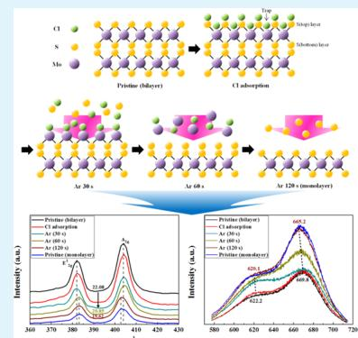
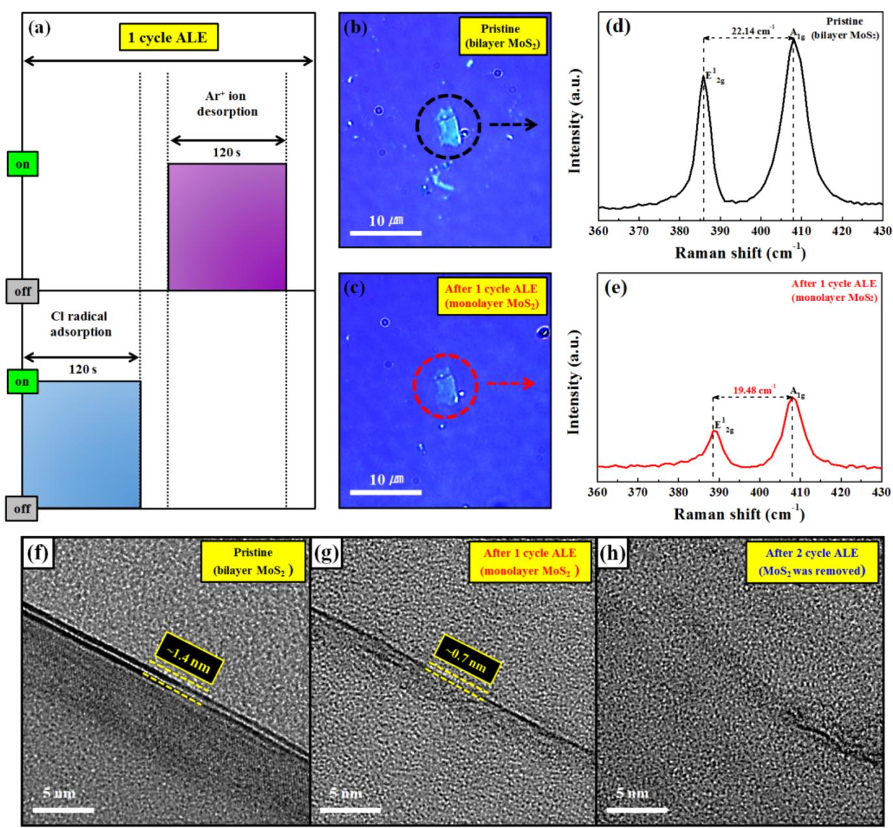
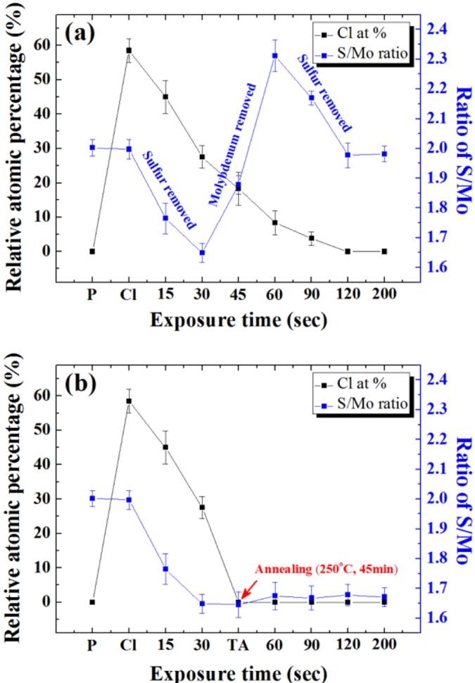
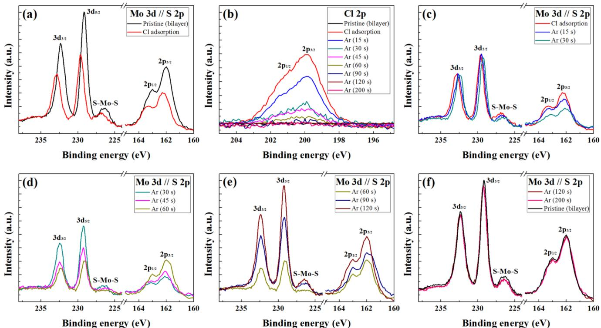
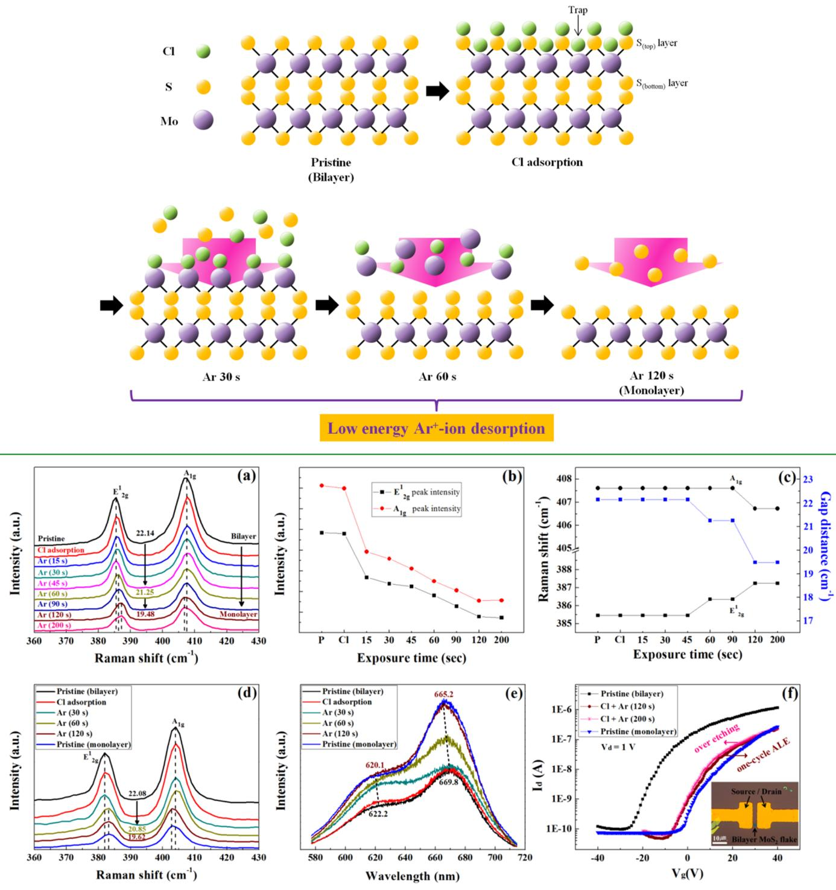

# Atomic Layer Etching Mechanism of  $\mathrm{MoS}_2$  for Nanodevices

Ki Seok Kim, Ki Hyun Kim, Yeonsig Nam, Jaeho Jeon, Soonmin Yim, Eric Singh, Jin Yong Lee, Sung Joo Lee, Yeon Sik Jung, Geun Young Yeom, and Dong Woo Kim\*

School of Advanced Materials Science and Engineering, School of Chemistry, and SKKU Advanced Institute of Nano Technology (SAINT), Sungkyunkwan University, 2066 Seobu- ro, Jangan- gu, Suwon- si, Gyeonggi- do 16419, Republic of Korea School of Materials Science and Engineering, Korea Advanced Institute of Science and Technology (KAIST), 291 Daehak- ro, Yuseong- gu, Daejeon 305- 701, Republic of Korea

Department of Computer Science, Stanford University, Stanford, California 94305, United States

# Supporting Information

ABSTRACT: Among the layered transition metal dichalcogenides (TMDs) that can form stable two- dimensional crystal structures, molybdenum disulfide  $(\mathrm{MoS}_2)$  has been intensively investigated because of its unique properties in various electronic and optoelectronic applications with different band gap energies from 1.29 to  $1.9\mathrm{eV}$  as the number of layers decreases. To control the  $\mathrm{MoS}_2$  layers, atomic layer etching (ALE) (which is a cyclic etching consisting of a radical- adsorption step such as Cl adsorption and a reacted- compound- desorption step via a low- energy  $\mathrm{Ar^{+}}$  - ion exposure) can be a highly effective technique to avoid inducing damage and contamination that occur during the reactive steps. Whereas graphene is composed of one- atom- thick layers,  $\mathrm{MoS}_2$  is composed of three- atom- thick  $\mathrm{S_{(top)} - Mo_{(mid)} - S_{(bottom)}}$  layers; therefore, the ALE mechanisms of the two structures are significantly different. In this study, for  $\mathrm{MoS}_2$  ALE, the Cl radical is used as the adsorption species and a low- energy  $\mathrm{Ar^{+}}$  ion is used as the desorption species. A  $\mathrm{MoS}_2$  ALE mechanism (by which the  $\mathrm{St_{top}}$ $\mathrm{Mo}_{(\mathrm{mid})}$  and  $\mathrm{S}_{(\mathrm{bottom})}$  atoms are sequentially removed from the  $\mathrm{MoS}_2$  crystal structure due to the trapped Cl atoms between the  $\mathrm{S_{(top)}}$  layer and the  $\mathrm{Mo}_{(\mathrm{mid})}$  layer) is reported according to the results of an experiment and a simulation. In addition, the ALE technique shows that a monolayer  $\mathrm{MoS}_2$  field effect transistor (FET) fabricated after one cycle of ALE is undamaged and exhibits electrical characteristics similar to those of a pristine monolayer  $\mathrm{MoS}_2$  FET. This technique is also applicable to all layered TMD materials, such as tungsten disulfide  $(\mathrm{WS}_2)$  , molybdenum diselenide  $(\mathrm{MoSe}_2)$  , and tungsten diselenide  $(\mathrm{WSe}_2)$

KEYWORDS: transition metal dichalcogenides (TMDs), molybdenum disulfide  $(MoS_2)$  atomic layer etching (ALE), low- energy  $Ar^{+}$  - ion, field effect transistors (FETs)

# INTRODUCTION

Layered transition metal dichalcogenides (TMDs) have attracted considerable attention in various electronic and optoelectronic applications due to their unique properties. Among the layered TMD materials such as molybdenum disulfide  $(\mathrm{MoS}_2)$  tungsten disulfide  $(\mathrm{WS}_2)$  molybdenum diselenide  $(\mathrm{MoSe}_2)$  and tungsten diselenide  $(\mathrm{WSe}_2)$  which can form a stable crystal structure,  $\mathrm{MoS}_2$  has been intensively investigated due to its distinctive electronic, optical, and catalytic properties, as well as for its use in dry lubrication.  $\mathrm{MoS}_2$  possesses covalent bonds between the Mo and S atoms, whereas the  $\mathrm{MoS}_2$  layers are combined through van der Waals forces. In addition, the electronic properties are extremely dependent on the number of layers, whereby different band- gap energies are exhibited from 1.29 to  $1.9\mathrm{eV}$  as the number of layers is decreased.

Accordingly, the technology involved in controlling the  $\mathrm{MoS}_2$  layers is extremely important in various nanodevice applications. However, difficulty is encountered with controlling the layers of  $\mathrm{MoS}_2$  when conventional synthetic methods are used, such as the chemical vapor deposition (CVD), plasma- enhanced CVD (PECVD), and exfoliation methods. This difficulty arises because these methods generally involve random nucleation of nonuniform  $\mathrm{MoS}_2$  domains with different number of layers. Therefore, not only multilayer  $\mathrm{MoS}_2$  but also  $\mathrm{MoS}_2$  that has areas with different layer thicknesses is generally formed on the same wafer, especially when the wafer size is of a commercial scale. For this reason, various methods have been reported by many research groups for the control of the  $\mathrm{MoS}_2$  layers, such as xenon difluoride  $(\mathrm{XeF}_2)$  etching, laser thining, Ar- plasma etching, thermal annealing, and soft plasma etching that uses low- energy electrons  $(< 0.4\mathrm{eV})$  for  $\mathrm{SF}_6 / \mathrm{N}_2$  plasmas to minimize the ion- bombardment- related damage. However, these methods are ineffective for the precise layer- by- layer control of  $\mathrm{MoS}_2$  layers at the atomic scale because the control of the  $\mathrm{MoS}_2$  layers depends only on the

  
Figure 1. (a) Schematic diagram of the  $\mathrm{MoS}_2$  one-cycle ALE composed of the Cl-radical adsorption step and the subsequent  $\mathrm{Ar^{+}}$  ion desorption step. (b), (c) Optical microscopic images of the pristine exfoliated bilayer  $\mathrm{MoS}_2$  and monolayer  $\mathrm{MoS}_2$  after one ALE cycle, as shown in (a). (d, e) Raman spectroscopic data of the pristine bilayer  $\mathrm{MoS}_2$  and monolayer  $\mathrm{MoS}_2$  that were observed after the one-cycle ALE. (f-h) TEM cross-sectional images of the pristine bilayer  $\mathrm{MoS}_2$ . (f) as received, (g) after one-cycle ALE, and (h) after two-cycle ALE, exhibiting the removal of one monolayer per cycle.

thinning time and because processing without inducing damage is difficult.

On the contrary, atomic layer etching (ALE) is one of the most important techniques that allows for a precise control of the number of  $\mathrm{MoS}_2$  layers without inducing damage and contamination through the chemical adsorption and physical desorption of the cyclic steps. In our previous work, we reported the successful layer- by- layer etching of  $\mathrm{MoS}_2$  through controlled Cl- radical adsorption using an inductively coupled plasma (ICP) system with a mesh grid and  $\mathrm{Ar^{+}}$  ion desorption using a two- grid  $\mathrm{Ar^{+}}$  ion source system with a monoenergetic energy of  $20\mathrm{eV}$ . However, the ALE mechanism of a single- monolayer  $\mathrm{MoS}_2$  consisting of a S- Mo- S crystal structure could not be identified.

Whereas a single monolayer of graphene is composed of a one- atom- thick layer, a single monolayer of TMDs is composed of a three- atom- thick layer; therefore, the ALE mechanisms of the two structures significantly differ. In this research, we present the ALE mechanism of a single- monolayer  $\mathrm{MoS}_2$  from a bilayer  $\mathrm{MoS}_2$  through sequential Cl- radical adsorption and  $\mathrm{Ar^{+}}$  ion desorption. This novel ALE technique allows uniform removal of a single- monolayer  $\mathrm{MoS}_2$  without undesirable residues and damage to the etched surface. In addition, the ALE technique can be performed at a low temperature, has a high throughput, covers a large area, and is a Si- compatible process, in contrast to the other previous  $\mathrm{MoS}_2$  etch methods. In addition, using the ALE method, it is possible to control the S/Mo ratio of the top  $\mathrm{MoS}_2$  layer during the  $\mathrm{Ar^{+}}$  ion desorption step and is very useful for making nanodevices of next- generation layered TMD materials.

# RESULTS AND DISCUSSION

Figure 1a shows a schematic diagram of the cyclic etching process that is composed of a sequential reactant- adsorption step and a reacted- compound- desorption step for the one- cycle  $\mathrm{MoS}_2$  ALE. Figure  $1\mathrm{b,c}$  shows the optical microscopic images of the pristine bilayer  $\mathrm{MoS}_2$  and the monolayer  $\mathrm{MoS}_2,$  respectively, after the one- cycle ALE of the bilayer  $\mathrm{MoS}_2$  Figure 1d,e shows the Raman spectroscopic data of the pristine bilayer  $\mathrm{MoS}_2$  and the monolayer  $\mathrm{MoS}_2,$  respectively, that were obtained after the one- cycle ALE shown in Figure 1a. Through the adsorption of the reactive Cl radical on the bilayer  $\mathrm{MoS}_2$  surface for  $120~s$  during the adsorption step and through the subsequent  $\mathrm{Ar^{+}}$  - ion exposure with an adequate energy of  $\sim 20$  eV (Figure S1a of the Supporting Information) for  $120~s$  during the desorption step, a monolayer  $\mathrm{MoS}_2$  could be obtained (i.e., the monolayer  $\mathrm{MoS}_2$  could be removed) from the bilayer  $\mathrm{MoS}_2$  by the one- cycle ALE;21 however, when the bilayer  $\mathrm{MoS}_2$  was processed with the Cl- radical- adsorption step for only  $10\mathrm{min}$  or with the  $\mathrm{Ar^{+}}$  - ion desorption step for only  $10\mathrm{min}$  a change of the Raman spectroscopic data was not observed, indicating that the etching of the bilayer  $\mathrm{MoS}_2$  did not occur with only Clradical adsorption or with only  $\mathrm{Ar^{+}}$  - ion bombardment (Figure S1b). Therefore, using ALE, the thickness of the  $\mathrm{MoS}_2$  layers could be precisely controlled (Figure S1c- f). Also, the  $\mathrm{MoS}_2$  thickness was observed for the as- received bilayer  $\mathrm{MoS}_2$  after the one- cycle ALE and after the two- cycle ALE using crosssectional TEM. As shown in Figure  $1\mathrm{f - h},$  the removal of exactly one  $\mathrm{MoS}_2$  monolayer per ALE cycle could be confirmed. In this study, the ALE mechanism of the  $\mathrm{MoS}_2$  layers was further investigated.

During  $\mathrm{MoS}_2$  ALE, when the  $\mathrm{MoS}_2$  - layer surface is exposed to the Cl radicals, the Cl radicals fully cover the  $\mathrm{MoS}_2$  surface and are chemisorbed onto the  $\mathrm{MoS}_2$  surface. Also, when the  $\mathrm{Ar^{+}}$  ions of an adequate energy bombard the surface, the chemically adsorbed  $\mathrm{MoS}_2$  - surface layer is gradually removed by desorption until the top monolayer  $\mathrm{MoS}_2$  is removed, exposing the  $\mathrm{MoS}_2$  layer underneath. The single  $\mathrm{MoS}_2$  monolayer is composed of three atomic layers (i.e., S- Mo- S); therefore, it is important to determine how this three- atom- thick monolayer is removed during the desorption step. The change of the  $\mathrm{MoS}_2$  - layer surface composition with the desorption time and the  $\mathrm{Ar^{+}}$  - ion exposure time was investigated using a bilayer  $\mathrm{MoS}_2$  that was prepared by CVD. In particular, the way in which the top S, middle Mo, and bottom S atoms of the chlorinated  $\mathrm{MoS}_2$  are removed during the desorption step was closely investigated.

Figure 2a shows the change of the  $\mathrm{S / Mo}$  ratio and the relative Cl atomic percentage on the  $\mathrm{MoS}_2$  surface that was measured as a function of the  $\mathrm{Ar^{+}}$  - ion exposure time (15- 200 s) using X- ray photoelectron spectroscopy (XPS) during the desorption step of  $\mathrm{MoS}_2$  ALE after Cl- radical adsorption on the  $\mathrm{MoS}_2$  surface for the bilayer  $\mathrm{MoS}_2$  As shown, before the exposure to the  $\mathrm{Ar^{+}}$  ion after the Cl- radical adsorption step for  $\mathrm{MoS}_2$  ALE, the ratio of  $\mathrm{S / Mo}$  is  $\sim 2.0$  indicating that the stoichiometric  $\mathrm{MoS}_2$  had not changed even with Cl- radical adsorption of the relative atomic percentage of  $58.5\%$  .The binding energies of the four top and four bottom S atoms  $(S_{1 - 4})$  that were bound with a single Mo atom of the first  $\mathrm{MoS}_2$  layer were investigated (Figure S3) after Cl- radical adsorption on one of the top S atoms (top S;  $\mathbf{S}_{1\mathrm{or}3}$  ). The binding energy of the top  $\mathbf{S}_{(1\mathrm{or}3)}$  atoms was decreased significantly from 1.993 to  $1.472\mathrm{eV}$  by the movement of electrons from S to Cl due to the higher electronegativity of Cl compared to that of S, whereas a change of the binding energies of the bottom S atoms (bottom S;  $\mathbf{S}_{2\mathrm{or}4}$  was not observed (Figure S4 and Table S1). Therefore, this shows that, for the Cl- adsorbed  $\mathrm{MoS}_2,$  the top S atoms will be removed first by the exposure to the  $\mathrm{Ar^{+}}$  ions. In addition, during the Cl- radical adsorption step, the Cl atoms can also be trapped between the top S atoms and the mid Mo atoms by the van der Waals force. These Cl atoms can form a Mo- Cl bond during the desorption step caused by the  $\mathrm{Ar^{+}}$  - ion exposure (Figure S5).As shown in Figure 2a, with the increase of the  $\mathrm{Ar^{+}}$  - ion exposure time from O to  $30~\mathrm{s},$  the  $\mathrm{S}/$  Mo ratio was decreased gradually from 2 to  $\sim 1.65,$  in addition to the decrease of the relative Cl percentage from 58.5 to  $\sim 27.5\%$  due to the preferential removal of the top S atoms that had bonded to the Cl with the lowest binding energy in the top  $\mathrm{MoS}_2$  layer.

  
Figure 2. (a) Change of the  $\mathrm{S / Mo}$  ratio and the relative Cl atomic percentage on the  $\mathrm{MoS}_2$  surface that was measured as a function of the  $\mathrm{Ar^{+}}$  -ion exposure time (15-200 s) using XPS during the desorption step of  $\mathrm{MoS}_2$  ALE for the bilayer  $\mathrm{MoS}_2$  b) Change of the  $\mathrm{S / Mo}$  ratio and the relative Cl atomic percentage on the  $\mathrm{MoS}_2$  surface that was measured as a function of the  $\mathrm{Ar^{+}}$  -ion exposure time up to  $30~\mathrm{s},$  similar to (a).A further exposure to the  $\mathrm{Ar^{+}}$  ion of  $200~\mathrm{s}$  was performed after the annealing TA); after  $30~\mathrm{s}$  of  $\mathrm{Ar^{+}}$  ion exposure time (at  $30~\mathrm{s},$  it appeared that the top S of the  $\mathrm{MoS}_2$  had been removed), a further  $\mathrm{Ar^{+}}$  ion desorption was carried out after the  $\mathrm{MoS}_2$  sample was annealed at  $250^{\circ}C$  for  $45\mathrm{min}$  in a vacuum to remove the Cl radical on the  $\mathrm{MoS}_2$  surface. The experiment was repeated seven times, and the data were averaged. P indicates the pristine  $\mathrm{MoS}_2$  state, and Cl represents  $\mathrm{MoS}_2$  after Cl-radical adsorption.

  
Figure 3. XPS data of Mo, S, and Cl on the  $\mathrm{MoS_2}$  surface after Cl-radical adsorption and during  $\mathrm{Ar^{+}}$  -ion desorption of  $\mathrm{MoS_2}$  ALE. (a) XPS data of the pristine bilayer  $\mathrm{MoS_2}$  before and after Cl-radical adsorption. (b) XPS data of Cl before/after Cl-radical adsorption and after the  $\mathrm{Ar^{+}}$  -ion exposure time of  $0 - 200\mathrm{s}$  XPS data of Mo and S after the  $\mathrm{Ar^{+}}$  -ion exposure of the Cl-adsorbed bilayer  $\mathrm{MoS_2}$  for (c) 0, 15, 30 s, (d) 30, 45, 60 s, (e) 60, 90,  $120~\mathrm{s},$  and (f)  $120,200\mathrm{s},$  and pristine bilayer  $\mathrm{MoS_2}$

When the  $\mathrm{Ar^{+}}$  - ion exposure time was increased from 30 to 60 s, the  $\mathrm{S / Mo}$  ratio was increased from  $\sim 1.65$  to  $\sim 2.31$  indicating the removal of Mo below the top S atoms. The relative Cl percentage continuously decreased from  $27.5\%$  at 30 s to approximately  $8.4\%$  at  $90~\mathrm{s},$  indicating the removal of Mo by Mo- Cl. The simulation results (Figure S6 and Table S2) show that when the Mo atoms are bonded with the trapped/ adsorbed Cl atoms after the top S atoms were removed the Mo- binding energy decreased from 2.147 to  $1.630\mathrm{eV},$  whereas the binding energy of the Mo atoms further increased from 2.147 to  $2.616\mathrm{eV}$  due to the tighter binding with the bottom S atoms when the Mo atoms are not bonded to the trapped Cl atoms. The binding energy of the bottom S atoms did not change significantly after the top S atoms were removed, and it remained higher than that of the Mo atoms that were bonded with Cl. Therefore, the increased  $\mathrm{S / Mo}$  ratio for the  $\mathrm{Ar^{+}}$  - ion exposure time of  $30 - 60\mathrm{~s~}$  should be related to the removal of Mo- Cl that formed on the first  $\mathrm{MoS_2}$  layer during Cl- radical adsorption.

However, when the  $\mathrm{Ar^{+}}$  - ion exposure time was further increased from 60 to  $120~\mathrm{s},$  the  $\mathrm{S / Mo}$  ratio was again decreased from  $\sim 2.31$  to  $\sim 2,$  indicating the removal of the bottom S atoms after the removal of the Mo atoms in the first  $\mathrm{MoS_2}$  layer. After the removal of the Mo in the first  $\mathrm{MoS_2}$  layer, only the bottom S atoms remained. After the removal of the Mo atoms, the binding energy of the bottom S atoms (bottom  $\mathrm{S}_{(2\mathrm{or}4)}$  atoms can be bonded together, provided the van der Waals force is maintained between the bottom S atoms and the second  $\mathrm{MoS_2}$  layer) decreases further from  $\sim 1.91$  to  $\sim 1.51\mathrm{eV}$  (Figure S7 and Table S3) and the bottom S atoms are preferentially removed by the  $\mathrm{Ar^{+}}$  exposure from 60 to  $120~\mathrm{s}.$  The relative Cl percentage decreased from 8.4 to  $0\%$  during the  $\mathrm{Ar^{+}}$  - ion exposure from 60 to  $120~\mathrm{s}.$  It is believed that the remaining  $8.4\%$  of the Cl atoms at  $90\mathrm{~s~}$  are related to the bonding of some of the Cl atoms (possibly by the dissociation of the removed Mo- Cl) to the bottom S atoms. The remaining Cl percentage also decreased to 0 after the  $\mathrm{Ar^{+}}$  - ion exposure of  $120~\mathrm{s},$  indicating the exposure of the fresh second  $\mathrm{MoS_2}$  layer.

After the preferential removal of the bottom  $\mathrm{S}_{(2\mathrm{or}4)}$  atoms, the second  $\mathrm{MoS_2}$  layer was exposed. However, even though the  $\mathrm{Ar^{+}}$  - ion exposure time was extended to  $200\mathrm{~s~}$  after the first  $\mathrm{MoS_2}$  layer was completely removed at  $120\mathrm{~s~}$  the  $\mathrm{S / Mo}$  ratio remained at  $\sim 2,$  indicating that the second  $\mathrm{MoS_2}$  layer was not etched by the  $\mathrm{Ar^{+}}$  - ion energy of  $20\mathrm{eV}$  (Figure S1b). The simulation results are based on the A- A stacking of the bilayer  $\mathrm{MoS_2}$  but the same results were obtained for the A- B stacking of the bilayer  $\mathrm{MoS_2}$  (Figure S8 and Table S4).

To investigate the importance of Cl- radical adsorption between the top S atoms and the Mo atoms in  $\mathrm{MoS_2}$  during the desorption step of  $\mathrm{MoS_2}$  ALE, the remaining  $27.5\%$  of Cl atoms on the first  $\mathrm{MoS_2}$  layer after  $30~\mathrm{s}$  of the  $\mathrm{Ar^{+}}$  - ion exposure, that is, after the removal of the top S atoms in the first  $\mathrm{MoS_2}$  layer, were removed by annealing in a vacuum  $250^{\circ}\mathrm{C},$  45 min) and the annealed  $\mathrm{MoS_2}$  sample was further exposed to the  $\mathrm{Ar^{+}}$  ions at  $200\mathrm{~s~}$  The  $\mathrm{S / Mo}$  ratio and the relative Cl percentage that was measured by  $\mathrm{XP_S}$  are shown in Figure 2b. As shown in Figure 2b, after the annealing, the atomic percentage of the Cl atoms of the  $\mathrm{MoS_2}$  layer decreased to  $0\%$  due to the vaporization of the trapped/adsorbed Cl atoms from the first-  $\mathrm{MoS_2}$  - layer surface (the  $\mathrm{MoS_2}$  layer after the top S atoms were removed). On the other hand, the  $\mathrm{S / Mo}$  ratio remained the same as that before the annealing, indicating the removal of only the Cl atoms on the surface by annealing. It is believed that the preferential removal of Cl on the first-  $\mathrm{MoS_2}$  layer surface is related to the lower binding energy of Cl (0.881

$\mathrm{eV}$  when compared to that of Mo  $(1.630\mathrm{eV})$  in the  $\mathrm{MoS}_2$  structure (Figure S6 and Table S2). After the removal of Cl on the first-  $\mathrm{MoS}_2$  - layer surface, the  $\mathrm{Mo}^{6 + }$  peak at  $\sim 236\mathrm{eV}$  was observed on the  $\mathrm{MoS}_2$  surface in the XPS analysis, in addition to the redshifts of the Mo peaks  $(3\mathrm{d}_{3 / 2}$  and  $3\mathrm{d}_{5 / 2}$  and the S peaks  $(2\mathrm{p}_{1 / 2}$  and  $2\mathrm{p}_{3 / 2}$  (Figure S9). The  $\mathrm{Mo}^{6 + }$  peak is related to a defective  $\mathrm{MoS}_2$  (i.e.,  $\mathrm{MoS}_2$ ,  $1\leq \times \leq 2$ ), and it is formed by the binding of only the Mo atoms with the bottom S atoms after the removal of the Cl atoms on the first  $\mathrm{MoS}_2$  layer (the first  $\mathrm{MoS}_2$  layer after the top S atoms are removed). The removal of Cl from the  $\mathrm{MoS}_2$  surface also causes redshifts of the XPS peaks that are related to Mo and S. As mentioned earlier, after the top S atoms are removed, the binding energy between the Mo and the bottom S atoms increased to  $2.616\mathrm{eV}$  when no Cl atoms are adsorbed on Mo. Therefore, as shown in Figure 2b, for the annealed  $\mathrm{MoS}_2$ , the  $\mathrm{S / Mo}$  ratio was not changed even after the  $\mathrm{Ar^{+}}$  - ion exposure for  $200\mathrm{~s~}$  due to the high binding energy between the Mo and bottom S atoms. This indicates that no further etching of  $\mathrm{MoS}_2$  occurred and reveals the importance of Cl- radical adsorption on the Mo surface during Mo ALE. In fact, the increase of the  $\mathrm{Mo}^{6 + }$  peak could also be related to the oxidation of the  $\mathrm{MoS}_2$  surface after the annealing from the exposure to the air environment.22 In the experiment in this study, the oxygen percentage that bonded to the  $\mathrm{MoS}_2$  surface could not be measured due to the use of  $\mathrm{SiO}_2$  as the substrate. If the Mo in  $\mathrm{MoS}_2$  is bonded with oxygen, the binding energy of the oxygen- adsorbed Mo in  $\mathrm{MoS}_2$  (after the top S atoms are removed) decreases from 2.616 to  $1.986\mathrm{eV}$  (Figure S10 and Table S5); however, this is still much higher than that  $(1.630\mathrm{eV})$  of the Cl- adsorbed Mo in  $\mathrm{MoS}_2$  (after the top S atoms are removed). Therefore, removing the Mo atoms from  $\mathrm{MoS}_2$  after the subsequent  $\mathrm{Ar^{+}}$  - ion exposure of  $200\mathrm{~s~}$  is still difficult. In Mo ALE, Cl- radical adsorption onto Mo is consequently important for the preferential removal of Mo from the  $\mathrm{MoS}_2$  structure.

Figure 3a shows the XPS data of Mo and S for the pristine bilayer  $\mathrm{MoS}_2$  and the Cl- adsorbed bilayer  $\mathrm{MoS}_2$ . After Cl- radical adsorption, the XPS peak intensities of Mo 3d and S 2p were decreased because of the presence of  $58.5\%$  of Cl on  $\mathrm{MoS}_2$  surface. In addition, the XPS peak positions of Mo  $3\mathrm{d}_{3 / 2}$ , Mo  $3\mathrm{d}_{5 / 2}$ , S  $2\mathrm{p}_{1 / 2}$ , and S  $2\mathrm{p}_{3 / 2}$  that are located at 232.4, 229.2, 163, and  $162\mathrm{eV}$ , respectively, were blue- shifted by approximately  $+0.3$  to  $+0.4\mathrm{eV}$  because of the Fermi- level increase caused by the movement of electrons from Mo and S to Cl with a higher electronegativity.23,24 Figure 3b shows the XPS narrow- scan data for Cl in the pristine bilayer  $\mathrm{MoS}_2$  and the Cl- adsorbed bilayer  $\mathrm{MoS}_2$  after the  $\mathrm{Ar^{+}}$  - ion exposure from 0 to  $200\mathrm{~s~}$ . As shown, the Cl- peak intensity on the Cl- adsorbed bilayer  $\mathrm{MoS}_2$  rapidly decreased from 0 to  $30\mathrm{~s~}$ , followed by a gradual decrease from 30 to  $60\mathrm{~s~}$  and a slow decrease to zero from 60 to  $120\mathrm{~s~}$ . After the  $\mathrm{Ar^{+}}$  - ion exposure time from 120 to  $200\mathrm{~s~}$ , the Cl- related peak was not observed.

Figure 3c- f shows the XPS data of Mo and S for the  $\mathrm{MoS}_2$  surface during the  $\mathrm{Ar^{+}}$  - ion desorption step of  $\mathrm{MoS}_2$  ALE after Cl adsorption. As shown in Figure 3c,e, after the  $\mathrm{Ar^{+}}$  - ion exposure of the Cl- adsorbed bilayer  $\mathrm{MoS}_2$ , the XPS peak positions were red- shifted back to the original pristine XPS positions due to the removal of the Cl atoms on the bilayer  $\mathrm{MoS}_2$  surface (Figure S11). Figure 3c shows the XPS narrow- scan data of Mo and S after the  $\mathrm{Ar^{+}}$  - ion exposure from 0 to 30 s; these data are related to the removal period of the top S atoms of the first  $\mathrm{MoS}_2$  layer. During the  $\mathrm{Ar^{+}}$  - ion exposure from 0 to  $30\mathrm{~s~}$ , the peak intensities of Mo  $3\mathrm{d}_{3 / 2}$  and Mo  $3\mathrm{d}_{5 / 2}$  did not change, whereas the peak intensities of the  $\mathrm{S2p}_{1 / 2}$  and  $\mathrm{S2p}_{3 / 2}$  decreased due to the removal of the top S atoms on the first  $\mathrm{MoS}_2$  layer, in addition to the red- shifting of the peak positions of Mo and S by approximately  $- 0.2$  to  $- 0.3\mathrm{eV}$ , which is due to the removal of some of the Cl atoms with the top S atoms.

Figure 3d shows the XPS narrow- scan data of Mo and S after  $\mathrm{Ar^{+}}$  - ion exposure from 30 to  $60\mathrm{~s~}$ ; these data are related to the Mo atom removal period of the first  $\mathrm{MoS}_2$  layer. As the  $\mathrm{Ar^{+}}$  - ion exposure time was increased from 30 to  $60\mathrm{~s~}$ , the peak intensities of Mo  $3\mathrm{d}_{3 / 2}$  and Mo  $3\mathrm{d}_{5 / 2}$  decreased due to the removal of the Mo atoms in the first  $\mathrm{MoS}_2$  layer, whereas the peak intensities of S  $2\mathrm{p}_{1 / 2}$  and S  $2\mathrm{p}_{3 / 2}$  were increased due to the exposure of the bottom S atoms of the first  $\mathrm{MoS}_2$  layer. The peak positions of Mo and S were further red- shifted by approximately  $- 0.1\mathrm{eV}$  due to the removal of Cl. Also, the peak intensity of S- Mo- S at  $\sim 226.8\mathrm{eV}$ , which is related to the crystalline  $\mathrm{MoS}_2$ , was significantly decreased without an increase of the peak intensity of  $\mathrm{Mo}^{6 + }$  at  $\sim 236\mathrm{eV}$ , which is related to the defective  $\mathrm{MoS}_2$ . In general, when the  $\mathrm{MoS}_2$  layer is physically damaged, the S- Mo- S peak intensity at  $\sim 226.8\mathrm{eV}$ , which is related to the crystalline  $\mathrm{MoS}_2$ , was decreased, and the  $\mathrm{Mo}^{6 + }$  peak intensity at  $\sim 236\mathrm{eV}$  that is related to the damaged  $\mathrm{MoS}_2$  is increased.21,22,25- 27 It is believed that the lack of increase of the  $\mathrm{Mo}^{6 + }$  peak intensity while the S- Mo- S peak intensity decreased during  $\mathrm{MoS}_2$  ALE is related to the removal of Mo by Mo- Cl, whereby the first  $\mathrm{MoS}_2$  layer is redamaged even though only the (Cl)- Mo bottom- S- atom bonding remains in the first  $\mathrm{MoS}_2$  layer.

Figure 3e shows the XPS narrow- scan data of Mo and S after the  $\mathrm{Ar^{+}}$  - ion exposure from 60 to  $120\mathrm{~s~}$  that is related to the removal period of the bottom S atoms of the first  $\mathrm{MoS}_2$  layer. During the  $\mathrm{Ar^{+}}$  - ion exposure from 60 to  $120\mathrm{~s~}$ , the peak intensities of Mo and S were gradually increased (in fact, the relative S intensity is decreased when it is normalized with the Mo peaks, which is due to the removal of the remaining bottom S atoms of the first  $\mathrm{MoS}_2$  layer) without changing the peak positions of Mo and S. This indicates the gradual exposure of the second  $\mathrm{MoS}_2$  layer as the top layer (as monolayer  $\mathrm{MoS}_2$  from bilayer  $\mathrm{MoS}_2$ ) through the removal of the remaining bottom S atoms of the first  $\mathrm{MoS}_2$  layer that bonded with the second  $\mathrm{MoS}_2$  layer through the van der Waals force. In addition, along with the evidence of the exposure of the second  $\mathrm{MoS}_2$  layer, with the increase of the  $\mathrm{Ar^{+}}$  - ion exposure time from 60 to  $120\mathrm{~s~}$ , the crystalline S- Mo- S peak at  $\sim 226.8\mathrm{eV}$  was increased without showing the defective  $\mathrm{Mo}^{6 + }$  peak at  $\sim 236\mathrm{eV}$ . Also, the XPS peak- intensity ratios of Mo and S for the Cl- adsorbed bilayer  $\mathrm{MoS}_2$  after the  $\mathrm{Ar^{+}}$  - ion exposure of  $120\mathrm{~s~}$  are similar to those of the pristine  $\mathrm{MoS}_2$  layer (the peak ratios are the same for both the  $\mathrm{MoS}_2$  bilayer and the  $\mathrm{MoS}_2$  monolayer). Changes of the peak positions of Mo and S are not noticeable during the  $\mathrm{Ar^{+}}$  - ion exposure from 60 to  $120\mathrm{~s~}$ , and this is related to the fact that a significant amount of adsorbed Cl did not remain on the  $\mathrm{MoS}_2$  layer, with the possible exception of some of the bottom S atoms of the first  $\mathrm{MoS}_2$  layer. In fact, after the  $\mathrm{Ar^{+}}$  - ion exposure time of  $60\mathrm{~s~}$ , the XPS positions of Mo and S had shifted back to the locations that are similar to the positions of pristine  $\mathrm{MoS}_2$  due to the removal of most of the Cl atoms that were adsorbed onto the  $\mathrm{MoS}_2$  surface.

The remaining  $\mathrm{MoS}_2$  layer became a monolayer  $\mathrm{MoS}_2$ , and the  $\mathrm{MoS}_2$  layer was further exposed to the  $\mathrm{Ar^{+}}$  ions from 120 to  $200\mathrm{~s~}$ . As shown in Figure 3f, even after the  $\mathrm{Ar^{+}}$  - ion exposure of  $200\mathrm{~s~}$ , changes of the peak intensities and peak positions of Mo and S were not observed, indicating that the  $\mathrm{MoS}_2$  structure

Scheme 1. Schematic Diagram of the  $\mathrm{MoS}_2$  ALE Mechanism through Cl- Radical Adsorption and  $\mathbf{A}\mathbf{r}^{+}$  Ion Desorption as a Function of Time

  
Figure 4. (a) Raman spectra of the CVD bilayer  $\mathrm{MoS}_2$  before and after Cl adsorption and those after the  $\mathrm{Ar^{+}}$  ion exposure from 15 to  $200~\mathrm{s}$  b) Raman peak intensities of  $\mathrm{E}_{1\mathrm{g}}^{1}$  and  $\mathrm{A_{1g}}$  of  $\mathrm{MoS}_2$  c) Peak positions of  $\mathrm{E}_{1\mathrm{g}}^{1}$  and  $\mathrm{A_{1g}}$  of  $\mathrm{MoS}_2$  and the gap distance between  $\mathrm{E}_{1\mathrm{g}}^{1}$  and  $\mathrm{A_{1g}}$  (d) Raman and (e) photoluminescence (PL) spectra of the exfoliated bilayer  $\mathrm{MoS}_2$  and the exfoliated monolayer  $\mathrm{MoS}_2$  flakes. The Raman and PL spectra of the exfoliated bilayer  $\mathrm{MoS}_2$  flake before and after Cl adsorption and those after the  $\mathrm{Ar^{+}}$  ion exposure from 30 to  $120~\mathrm{s},$  exhibiting the formation of the monolayer  $\mathrm{MoS}_2$  from the bilayer  $\mathrm{MoS}_2,$  are also shown. (f) Drain currents vs gate voltages of the bottom-gate  $\mathrm{MoS}_2$  field effect transistors (FETs) that were fabricated with the exfoliated bilayer  $\mathrm{MoS}_2,$  the exfoliated monolayer  $\mathrm{MoS}_2,$  and the exfoliated bilayer  $\mathrm{MoS}_2$  after one cycle of  $\mathrm{MoS}_2$  ALE with  $120~\mathrm{s}$  (monolayer etching condition) and  $200~\mathrm{s}$  (overexposure with  $\mathrm{Ar^{+}}$  ion) of  $\mathrm{Ar^{+}}$  ion exposure. The inset shows an optical microscopic image of the bottom-gate  $\mathrm{MoS}_2$  FET that was fabricated with the exfoliated bilayer  $\mathrm{MoS}_2$

also remained unchanged. Also, because of the absence of any  $\mathrm{MoS}_2$  surface damage from the low- energy  $\mathrm{Ar^{+}}$  ion exposure (approximately  $20\mathrm{eV}$ ), a change of the crystalline- S- Mo- S peak intensity and the existence of a defective  $\mathrm{Mo}^{6 + }$  peak were not observed, even though the  $\mathrm{MoS}_2$  layer was exposed by the  $200~\mathrm{s}$  of  $\mathrm{Ar^{+}}$  ions. Therefore, clean and undamaged monolayer  $\mathrm{MoS}_2$  was exposed after the one- cycle of ALE of the bilayer  $\mathrm{MoS}_2$

Scheme 1 shows a schematic diagram of the detailed  $\mathrm{MoS}_2$  ALE mechanism for the one- cycle ALE from the bilayer  $\mathrm{MoS}_2$  to the monolayer  $\mathrm{MoS}_2$  through Cl- radical adsorption and  $\mathrm{Ar}^+$  ion desorption. When Cl atoms were adsorbed on the bilayer  $\mathrm{MoS}_2$ , these were adsorbed on the top S atoms of  $\mathrm{MoS}_2$ , where they are also trapped between the top S atoms and the Mo atoms by the van der Waals force because six of the electrons in the Mo atoms  $(4\mathrm{d}^{5}\mathrm{Ss}^{1})$  are fully bound to the S atoms. After Cl- radical adsorption, the binding energy between  $\mathrm{S}_{\mathrm{(top)}}$  and Mo (the binding between the  $\mathrm{S}3\mathrm{s}^{2}3\mathrm{p}^{4}$  and Mo  $4\mathrm{d}^{5}\mathrm{Ss}^{1}$ ) decreased significantly (the binding energy of the top S atoms decreased from 1.99 to  $1.47~\mathrm{eV}$ ) due to the higher electronegativity of Cl compared to that of S. Therefore, during the Ar- ion desorption, the top S atoms of the first  $\mathrm{MoS}_2$  layer are preferentially removed as S- Cl for the  $\mathrm{Ar}^+$  ion desorption time from 0 to  $30~\mathrm{s}$ . After the removal of the top S atoms, the trapped Cl atoms form Mo- Cl bonding, the binding energy between the Mo atoms and the bottom S atoms is significantly decreased (the binding energy of the Mo atoms decreased from 2.15 to  $1.63~\mathrm{eV}$ ) and Mo is preferentially removed as Mo- Cl for the  $\mathrm{Ar}^+$  ion desorption time from 30 to  $60~\mathrm{s}$ . After the removal of the top S and Mo atoms of the first  $\mathrm{MoS}_2$  layer, only the bottom S atoms that bonded with the second  $\mathrm{MoS}_2$  layer through the van der Waals force remain, and their binding energy decreased after the removal of the Mo atoms (the binding energy of the bottom S atoms decreased from 1.91 to  $1.51~\mathrm{eV}$ ). Therefore, the bottom S atoms are finally removed during the  $\mathrm{Ar}^+$  ion desorption time from 60 to  $120~\mathrm{s}$ . After the  $\mathrm{Ar}^+$  ion exposure time of  $120~\mathrm{s}$ , the fresh second  $\mathrm{MoS}_2$  layer (bilayer to monolayer) is exposed, and because of the low  $\mathrm{Ar}^+$  ion desorption energy of  $20~\mathrm{eV}$ , the further exposure to the  $\mathrm{Ar}^+$  ions does not change the exposed  $\mathrm{MoS}_2$  monolayer structure after the one- cycle  $\mathrm{MoS}_2$  ALE.

Figure 4a shows the Raman spectra of the CVD bilayer  $\mathrm{MoS}_2$  before and after Cl adsorption and after the  $\mathrm{Ar}^+$  ion exposure from 15 to  $200~\mathrm{s}$ . The  $\mathrm{MoS}_2$  Raman spectra showed two peaks of  $\mathrm{E}^{1}_{2\mathrm{g}}$  and  $\mathrm{A_{1g}}$ . It has previously been reported that not only their peak intensities decrease but also the gap differences between  $\mathrm{E}^{1}_{2\mathrm{g}}$  and  $\mathrm{A_{1g}}$  decrease from  $\sim 22$  to  $\sim 19~\mathrm{cm}^{- 1}$  as the layer thickness was varied from the bilayer to monolayer. As shown in Figure 4b, changes of the peak intensities of  $\mathrm{E}^{1}_{2\mathrm{g}}$  and  $\mathrm{A_{1g}}$  were not observed after Cl- radical adsorption; however, after the  $\mathrm{Ar}^+$  ion exposure, a decrease of the Raman peak intensities was observed up to  $120~\mathrm{s}$  of the  $\mathrm{Ar}^+$  ion exposure and no further change of the peak intensities was observed after  $120~\mathrm{s}$  of the  $\mathrm{Ar}^+$  ion exposure, indicating the decrease of the  $\mathrm{MoS}_2$  layer from the bilayer to the monolayer after  $120~\mathrm{s}$  of the  $\mathrm{Ar}^+$  ion exposure. Measurement of the gap distances between  $\mathrm{E}^{1}_{2\mathrm{g}}$  and  $\mathrm{A_{1g}}$  showed a decrease in the gaps after the  $\mathrm{Ar}^+$  ion exposure, and the detailed changes of the peak positions of  $\mathrm{E}^{1}_{2\mathrm{g}}$  and  $\mathrm{A_{1g}}$  are shown in Figure 4c. As shown, as the  $\mathrm{Ar}^+$  ion exposure time was increased from 15 to  $120~\mathrm{s}$ , the gap distance decreased from  $\sim 22.14$  to  $\sim 19.48~\mathrm{cm}^{- 1}$ , indicating the change from a bilayer  $\mathrm{MoS}_2$  to monolayer  $\mathrm{MoS}_2$ . During the change from the bilayer  $\mathrm{MoS}_2$  to the monolayer  $\mathrm{MoS}_2$  from 60 to  $90~\mathrm{s}$ , the gap distance showed a midvalue of  $\sim 21.25~\mathrm{cm}^{- 1}$ , which is possibly due to the changes of the interactions between the atoms from the  $\mathrm{S}_{\mathrm{(top)}}$  Mo-  $\mathrm{S}_{\mathrm{(bottom)}}$  bonds to the Mo-  $\mathrm{S}_{\mathrm{(bottom)}}$  bonds in the first  $\mathrm{MoS}_2$  layer during  $\mathrm{MoS}_2$  ALE.

To investigate the degree of damage on the monolayer  $\mathrm{MoS}_2$  that occurred after the etching of the bilayer  $\mathrm{MoS}_2$  by the one- cycle  $\mathrm{MoS}_2$  ALE, bottom- gate  $\mathrm{MoS}_2$  FETs were fabricated with the exfoliated pristine bilayer  $\mathrm{MoS}_2$ , the exfoliated pristine monolayer  $\mathrm{MoS}_2$ , and the exfoliated monolayer  $\mathrm{MoS}_2$  that were obtained using the one- cycle ALE of the exfoliated bilayer  $\mathrm{MoS}_2$ . In  $\mathrm{MoS}_2$ - FET fabrication, the exfoliated  $\mathrm{MoS}_2$  was used instead of the CVD  $\mathrm{MoS}_2$  because the exfoliated  $\mathrm{MoS}_2$  layers comprise a stoichiometric and defectless  $\mathrm{MoS}_2$ . With the exfoliated  $\mathrm{MoS}_2$  flakes, the bilayer and monolayer  $\mathrm{MoS}_2$  were selected by Raman spectroscopy, as shown in Figure 4d. One of the bilayer  $\mathrm{MoS}_2$  flakes was etched using the one- cycle  $\mathrm{MoS}_2$  ALE with different  $\mathrm{Ar}^+$  ion exposure times from 30 (partial layer etch condition) to  $120~\mathrm{s}$  (monolayer etch condition), followed by the measurement of its Raman peak. The result is shown in Figure 4d. As shown in Figure 4d, the exfoliated pristine bilayer  $\mathrm{MoS}_2$  and the exfoliated pristine monolayer  $\mathrm{MoS}_2$  show typical gap distances between  $\mathrm{E}^{1}_{2\mathrm{g}}$  and  $\mathrm{A_{1g}}$  of  $\sim 22.08$  and  $\sim 19.62~\mathrm{cm}^{- 1}$ , respectively. The monolayer  $\mathrm{MoS}_2$  that was obtained by the one- cycle ALE of the bilayer  $\mathrm{MoS}_2$  flake is  $\sim 19.62~\mathrm{cm}^{- 1}$ , indicating the formation of the monolayer  $\mathrm{MoS}_2$ . In addition, the intensities and gap distances of the  $\mathrm{E}^{1}_{2\mathrm{g}}$  and  $\mathrm{A_{1g}}$  peaks in the Raman spectra gradually decreased with  $\mathrm{Ar}^+$  ion exposure from 30 to  $120~\mathrm{s}$ . These results are very similar to those of the CVD  $\mathrm{MoS}_2$  shown in Figure 4a.

Figure 4e shows the PL spectra of the exfoliated bilayer  $\mathrm{MoS}_2$ , exfoliated monolayer  $\mathrm{MoS}_2$ , exfoliated bilayer  $\mathrm{MoS}_2$  before and after Cl adsorption, and those after the  $\mathrm{Ar}^+$  ion exposure from 30 to  $120~\mathrm{s}$ . Two peaks were observed in the PL spectra. The peak at  $\sim 665~\mathrm{nm}$  was due to the direct band structure at the K point of the Brillouin zone, and the peak at  $\sim 620~\mathrm{nm}$  was due to the splitting of the valence band from spin- orbit coupling. The PL spectra were normalized by the Raman  $\mathrm{A_{1g}}$  peak intensity to avoid distortions caused by external environmental factors. The PL intensity was almost unchanged after Cl adsorption on the bilayer  $\mathrm{MoS}_2$ , but the PL intensity gradually increased with  $\mathrm{Ar}^+$  ion exposure from 30 to  $120~\mathrm{s}$ . Also, the PL peak position was gradually blueshifted from 669.8 to  $665.2~\mathrm{nm}$ . These results are due to the band gap transitions from the indirect to the direct band gap according to the sequential removal of  $\mathrm{S}_{\mathrm{(top)}}$ ,  $\mathrm{Mo}_{\mathrm{(mid)}}$ , and  $\mathrm{S}_{\mathrm{(bottom)}}$ . In addition, the PL spectra of the exfoliated monolayer  $\mathrm{MoS}_2$  and the exfoliated bilayer  $\mathrm{MoS}_2$  after the one- cycle ALE are very similar, indicating that the single monolayer has been very effectively removed.

Using the exfoliated bilayer  $\mathrm{MoS}_2$ , exfoliated monolayer  $\mathrm{MoS}_2$ , and exfoliated bilayer  $\mathrm{MoS}_2$  after the one- cycle ALE with  $\mathrm{Ar}^+$  ion exposure for  $120~\mathrm{s}$  (monolayer etch condition) to  $200~\mathrm{s}$  (overexposure condition), bottom- gate  $\mathrm{MoS}_2$  FETs were fabricated, and the characteristics of the drain currents versus the gate voltages ( $I_{\mathrm{d}}$  vs  $V_{\mathrm{g}}$ ) of the  $\mathrm{MoS}_2$  FETs are shown in Figure 4f. The inset shows an optical microscopic image of one of the  $\sim 3~\mu \mathrm{m}$  channel bottom- gate  $\mathrm{MoS}_2$  FETs that were fabricated, for which  $300~\mathrm{nm}$  thick  $\mathrm{SiO}_2$  was used as the gate dielectric and  $80~\mathrm{nm}$  thick Au was used for the source and drain electrodes. As shown in Figure 4f, the  $\mathrm{MoS}_2$  FETs that were fabricated with the pristine bilayer  $\mathrm{MoS}_2$  and pristine monolayer  $\mathrm{MoS}_2$  exhibited the typical electrical characteristics of the  $\mathrm{MoS}_2$  FETs. Also, the  $\mathrm{MoS}_2$  FETs that were fabricated with  $\mathrm{MoS}_2$  and obtained after the one- cycle ALE of the bilayer  $\mathrm{MoS}_2$  with  $\mathrm{Ar}^+$  ion exposure of 120 and  $200~\mathrm{s}$  exhibited similar electrical characteristics as those of the FETs fabricated with a pristine monolayer  $\mathrm{MoS}_2$ . The field- effect mobility ( $\mu$ ) of the fabricated  $\mathrm{MoS}_2$  FETs was calculated using the following equation:  $\mu = (\mathrm{d}I_{\mathrm{d}} / \mathrm{d}V_{\mathrm{g}}) \times [L / (W_{\mathrm{i}}C_{\mathrm{i}}V_{\mathrm{d}})]$ , where  $L$  is the channel length and  $W$  is the channel width ( $L$  and  $W$  were

obtained from the SEM images of the fabricated  $\mathrm{MoS}_2$  (FETs).  $C_{\mathrm{i}} = 1.151\times 10^{- 4}\mathrm{Fm}^{- 2}$  is the back- gate capacitance  $\bar{C} = \epsilon_0\epsilon_{\mathrm{r}}/$ $d;\epsilon_0 = 8.85\times 10^{- 12}\mathrm{Fm}^{- 1},$ $\epsilon_{\mathrm{r}} = 3.9,$  and  $d = 300 \mathrm{nm}$  which was calculated by assuming a parallel plate capacitance model.32,33 The calculated field effect mobility of the exfoliated bilayer  $\mathrm{MoS}_2$  black) the exfoliated monolayer  $\mathrm{MoS}_2$  blue), and the exfoliated bilayer  $\mathrm{MoS}_2$  after the one- cycle  $\mathrm{MoS}_2$  ALE under the monolayer etching condition (  $120~\mathrm{s},$  brown) and  $\mathrm{Ar^{+}}$  ion overexposure condition  $(200~\mathrm{s},\mathrm{pink})$  were estimated to be 5.78, 2.65, 2.03, and  $2.02\mathrm{cm}^2\mathrm{V}^{- 1}\mathrm{s}^{- 1},$  respectively. The mobility differences between the exfoliated pristine monolayer  $\mathrm{MoS}_2$  and the monolayer  $\mathrm{MoS}_2$  after ALE with 120 and  $200~\mathrm{s}$  of  $\mathrm{Ar^{+}}$  ion exposure were similar and were in the error range. Therefore, one- monolayer  $\mathrm{MoS}_2$  could be successfully removed by the  $\mathrm{MoS}_2$  ALE process without damaging the  $\mathrm{MoS}_2$  layer.

# CONCLUSIONS

The single  $\mathrm{MoS}_2$  monolayer has a  $S_{(\mathrm{top})} - \mathrm{Mo} - S_{(\mathrm{bottom})}$  crystal structure that consists of three- atom- thick covalent bonds between the Mo and S atoms; therefore, the ALE mechanism for which Cl is used as the adsorption species and the  $\mathrm{Ar^{+}}$  ion is used as the desorption species can differ somewhat from that of other two- dimensional (2D) materials with one- atom- thick bonds, such as graphene. The  $\mathrm{MoS}_2$  ALE mechanism from the bilayer  $\mathrm{MoS}_2$  to the monolayer  $\mathrm{MoS}_2,$  for which controlled Clradical adsorption and  $\mathrm{Ar^{+}}$  - ion desorption are used, was investigated in this article as a function of the  $\mathrm{Ar^{+}}$  - ion desorption time with a monoenergetic  $\mathrm{Ar^{+}}$  - ion energy of 20 eV. The results showed that the Cl atoms are adsorbed on the top S atoms and are trapped between the top S atoms and the Mo atoms by the van der Waals force during Cl- radical adsorption. The results also showed that the monolayer  $\mathrm{MoS}_2$  is sequentially removed from the top S atoms by S- Cl, Mo is removed by Mo- Cl, and the bottom S atoms are removed by selective sputtering. The XPS data showed no change of chemical composition and no structural damage to the exposed second  $\mathrm{MoS}_2$  layer after the one- cycle ALE. In addition, the  $\mathrm{MoS}_2$  FETs fabricated with the  $\mathrm{MoS}_2$  samples obtained after the one- cycle ALE (monolayer etch condition and  $\mathrm{Ar^{+}}$  - ion overexposure condition) of a bilayer  $\mathrm{MoS}_2$  exhibited similar electrical properties to those fabricated with a pristine monolayer  $\mathrm{MoS}_2$  . Therefore, ALE technology can effectively and precisely remove  $\mathrm{MoS}_2$  layers layer- by- layer without electrical damage to the remaining  $\mathrm{MoS}_2$  layers. It is believed that the ALE technique used in the experiment can be applicable to all of the layered TMD materials including  $\mathrm{MoS}_2$  for next- generation nanodevices.

# MATERIALS AND METHODS

Formation of the Bilayer  $\mathbf{MoS}_2$  For the  $\mathrm{MoS}_2$  ALE mechanism study, bilayer  $\mathrm{MoS}_2$  films were synthesized by CVD. For the fabrication of  $\mathrm{MoS}_2$  device, bilayer- and monolayer-  $\mathrm{MoS}_2$  flakes (for stoichiometric and zero- defect  $\mathrm{MoS}_2$  were obtained by mechanical exfoliation from bulk  $\mathrm{MoS}_2$  . To improve the hydrophilic property of the substrate surface, a  $300\mathrm{nm}$  thick  $\mathrm{SiO}_2/$  heavily p- type- doped Si wafer was treated in capacitively coupled plasma equipment with an oxygen plasma under the condition of 5 sccm of  $\mathrm{O}_2$  and  $60~\mathrm{W}$  for 120 s before  $\mathrm{MoS}_2$  formation. For the CVD of  $\mathrm{MoS}_2,$  the bilayer  $\mathrm{MoS}_2$  films were synthesized in a vacuum furnace through vaporizing  $\mathrm{MoO}_3$  and sulfur for  $20\mathrm{min}_i$  while the substrate was heated to  $800^{\circ}\mathrm{C}$  For the exfoliated  $\mathrm{MoS}_2,$  the  $\mathrm{MoS}_2$  flakes were mechanically exfoliated from the bulk  $\mathrm{MoS}_2$  using Scotch tape, and they were then placed onto the  $300~\mathrm{nm}$  thick  $\mathrm{SiO}_2/$  heavily p- type- doped Si wafer. The bilayer- and monolayer-  $\mathrm{MoS}_2$  flakes were obtained using optical microscopy, and the thickness of the candidates was confirmed by Raman spectroscopy (HORIBA, ARAMS).

$\mathbf{MoS}_2$  ALE Method. First, the Cl radicals that were generated from the ICP system were adsorbed onto the  $\mathrm{MoS}_2$  surface. Then, the chlorinated  $\mathrm{MoS}_2$  surface was removed using a low- energy  $\mathrm{Ar^{+}}$  - ion beam system. During Cl- radical adsorption, the ion bombardment to the  $\mathrm{MoS}_2$  surface was significantly reduced by a grounded metal- mesh grid installed between the ICP source and the substrate. For Cl- radical adsorption,  $\mathrm{Cl}_2$  plasma was generated for  $120~\mathrm{s}$  at  $10~\mathrm{mTorr}$  with 63 s- cm of  $\mathrm{Cl}_2$  and  $18~\mathrm{W}$  of a  $13.56\mathrm{MHz}$  radio frequency (rf) ICP- source power. For the  $\mathrm{MoS}_2$  desorption step, the Cl- radical- adsorbed  $\mathrm{MoS}_2$  samples were transferred to a dual grid, ICP- type  $\mathrm{Ar^{+}}$  - ion- beam system. The Cl- radical- adsorbed  $\mathrm{MoS}_2$  monolayer was then removed for  $120~\mathrm{s}$  with an  $\mathrm{Ar^{+}}$  ion beam while the inside extraction grid voltage was maintained at  $+10\mathrm{V}$ $\sim 20\mathrm{eV}$  of  $\mathrm{Ar^{+}}$  ion peak energy; see Figure S1a) for the acceleration of the  $\mathrm{Ar^{+}}$  ion, whereas the outside grid of the ion- beam system was grounded. The process conditions are Ar of 70 sccm, a  $13.56\mathrm{MHz}$  ICP power of  $200~\mathrm{W}$  and pressure of  $6.7~\mathrm{mTorr}$  The details of the mesh- gridded ICP system for Cl- radical adsorption and the  $\mathrm{Ar^{+}}$  ion- beam system for  $\mathrm{MoS}_2$  desorption can be found elsewhere.21

$\mathbf{MoS}_2$  Binding- Energy Calculation. To theoretically investigate the mechanism of  $\mathrm{MoS}_2$  ALE according to the adsorption of Cl radicals on  $\mathrm{MoS}_2$  and desorption by  $\mathrm{Ar^{+}}$  - ion bombardment, a computer simulation was performed for the changing of the binding energies between Mo and S using the Vienna Ab Initio Simulation Package.34 The lattice constant of the  $\mathrm{MoS}_2$  unit cell was calculated as  $3.213\mathrm{\AA},$  the distance between top S and bottom S as  $3.159\mathrm{\AA},$  and the bond length of Mo- S as  $2.436\mathrm{\AA}$  To describe the  $\mathrm{MoS}_2$  multilayer system, a 2D periodic boundary condition was used along the growth direction with a vacuum layer of  $27\mathrm{\AA}$  along the nonperiodic direction to avoid an additional interaction between the multilayers. Spinunpolarized density function theory calculations were performed with the Perdew- Burke- Ernzerhof generalized gradient approximation (PBE- GGA) and the projector- augmented wave (PAw) method. Geometry optimization was performed on the  $3\times 3\times 1$  supercell structure, with a  $3\times 3\times 1$  Monkhorst- Pack  $k$  - point37 mesh and plane- wave basis sets with an energy cutoff of  $400\mathrm{eV}$  The convergence threshold for the energy was set to  $10^{- 4}\mathrm{eV}$  The Mo- S binding energy  $(E_{\mathrm{B}})$  was calculated using  $E_{\mathrm{B}} = (E_{\mathrm{tot}} - E_{\mathrm{sub}}-$ $E_{\mathrm{S}} - E_{\mathrm{vdW}}) / n,$  where  $E_{\mathrm{tot}},E_{\mathrm{sub}},E_{\mathrm{S}},E_{\mathrm{vdW}},$  and  $n$  refer to the electronic energy of the entire system, the energy of the system after the removal of the target atom, the energy of the target atom, the van der Waals interaction energy, and the number of target atom coordination bonds, respectively. The van der Waals interaction energy between the target atom and the adjacent layer was calculated using  $E_{\mathrm{vdw}} = (E_{\mathrm{S + AL}} - E_{\mathrm{AL}}$ $- E_{\mathrm{S}})$  where  $E_{\mathrm{S + AL}}$  and  $E_{\mathrm{AL}}$  represent the electronic energy of the adjacent layer with the target atom held together and the energy of the adjacent layer, respectively (Figure S2). For the  $\mathrm{MoS}_2$  bilayer structure, both the  $\mathrm{A - A}$  and  $\mathrm{A - B}$  stacking structures were considered (Figures S3 and S8).

$\mathbf{MoS}_2$  - FET Fabrication. For the  $\mathrm{MoS}_2$  - FET fabrication, few- layer  $\mathrm{MoS}_2$  was exfoliated and transferred to a  $\mathrm{SiO}_2 / \mathrm{Si}$  wafer. Bilayer- and monolayer-  $\mathrm{MoS}_2$  flakes were obtained using optical microscopy, and the thickness of the  $\mathrm{MoS}_2$  layer was confirmed by Raman spectroscopy (HORIBA, ARAMS). For the bottom- gate FET fabrication, the conventional photolithography method was used to define the source/ drain electrode contact area with a  $\sim 3\mu \mathrm{m}$  channel region and  $80~\mathrm{nm}$  thick Au was deposited by a thermal evaporation system. After a lift- off process, contact annealing (Ar:  $96.1\%$ $\mathrm{H}_2$ $3.9\%$ $1\mathrm{slm},$  and  $200^{\circ}\mathrm{C}$  for  $1\mathrm{h})$  was performed prior to measurement to increase the contact property of the devices.

Characterization. The Raman and PL spectra were inspected using a Raman microscopic system (WTTEC  $\alpha 300\mathrm{M}^{+}$  with a wavelength of  $532~\mathrm{nm}$  The morphology of the  $\mathrm{MoS}_2$  surface was measured by atomic force microscopy (AFM, Dimension 3100, Veeco) under the tapping mode. The chemical composition of the  $\mathrm{MoS}_2$  surface was measured by XPS (MultiLab 2000, Thermo VG,  $\mathrm{Mg}$  Kα source). During the XPS measurement, to observe the  $\mathrm{S / Mo}$  ratio, the take- off angle of the  $\mathrm{MoS}_2$  sample was maintained at  $45^{\circ}$  and the

peak energies were calibrated using the C1 peak at  $284.5\mathrm{eV}$ . The electrical characteristics of the  $\mathrm{MoS}_2$  FET were measured under ambient conditions using Keithley 4200- SCS. The change of the thickness of the  $\mathrm{MoS}_2$  layer before and after the ALE cycles was observed using field- emission transmission electron microscopy (JEOL JEM- 2100F).

# ASSOCIATED CONTENT

# $\bullet$  Supporting Information

The Supporting Information is available free of charge on the ACS Publications website at DOI: 10.1021/acsami.6b15886.

Calculation of binding energy according to Cl- radical adsorption and  $\mathrm{Ar^{+}}$  ion desorption on the bilayer  $\mathrm{MoS}_2$  structure (A- A stacking and  $\mathrm{A - B}$  stacking) and additional experimental data (PDF)

# AUTHOR INFORMATION

# Corresponding Authors

$^{*}\mathrm{E}$  mail: gyyeom@skku.edu (G.Y.Y.).  $^{*}\mathrm{E}$  mail: plasma@skku.edu (D.W.K.).

# ORCID

Jin Yong Lee: 0000- 0003- 0360- 5059 Sung Joo Lee: 0000- 0003- 1284- 3593 Yeon Sik Jung: 0000- 0002- 7709- 8347 Geun Young Yeom: 0000- 0001- 7516- 8404

# Notes

The authors declare no competing financial interest.

# ACKNOWLEDGMENTS

This work was supported by the Nano- Material Technology Development Program through the National Research Foundation of Korea (NRF), funded by the Ministry of Education, Science and Technology (2012M3A7B4035323 and 2016M3A7B4910429).

# REFERENCES

(1) Baugher, B. W.; Churchill, H. O.; Yang, Y.; Jarillo-Herrero, P. Optoelectronic Devices Based on Electrically Tunable pn Diodes in a Monolayer Dichalcogenide. Nat. Nanotechnol. 2014, 9, 262-267. 
(2) Jariwala, D.; Sangwan, V. K.; Lauhon, L. J.; Marks, T. J.; Hersam, M. C. Emerging Device Applications for Semiconducting Two-dimensional Transition Metal Dichalcogenides. ACS Nano 2014, 8, 1102-1120. 
(3) Wang, Q. H.; Kalantar-Zadeh, K.; Kis, A.; Coleman, J. N.; Strano, M. S. Electronics and Optoelectronics of Two-dimensional Transition Metal Dichalcogenides. Nat. Nanotechnol. 2012, 7, 699-712. 
(4) Geim, A. K.; Grigorieva, I. V. Van der Waals Heterostructures. Nature 2013, 499, 419-426. 
(5) Lee, C.; Yan, H.; Brus, L. E.; Heinz, T. F.; Hone, J.; Ryu, S. Anomalous Lattice Vibrations of Single-and Few-layer  $\mathrm{MoS}_2$ . ACS Nano 2010, 4, 2695-2700. 
(6) Li, B.; Yang, S.; Huo, N.; Li, Y.; Yang, J.; Li, R.; Fan, C.; Lu, F. Growth of Large Area Few-layer or Monolayer  $\mathrm{MoS}_2$  from Controllable  $\mathrm{MoO}_3$  Nanowire Nuclei. RSC Adv. 2014, 4, 26407-26412. 
(7) Yang, S.; Kang, J.; Yue, Q.; Yao, K. Vapor Phase Growth and Imaging Stacking Order of Bilayer Molybdenum Disulfide. J. Phys. Chem. C 2014, 118, 9203-9208. 
(8) Huang, Y.; Wu, J.; Xu, X.; Ho, Y.; Ni, G.; Zou, Q.; Koon, G. K. W.; Zhao, W.; Neto, A. G.; Eda, G.; et al. An Innovative Way of Etching  $\mathrm{MoS}_2$ : Characterization and Mechanistic Investigation. Nano Res. 2013, 6, 200-207.

(9) Mak, K. F.; Lee, C.; Hone, J.; Shan, J.; Heinz, T. F. Atomically Thin  $\mathrm{MoS}_2$ : A New Direct-gap Semiconductor. Phys. Rev. Lett. 2010, 105, No. 136805. 
(10) Frey, G.; Elani, S.; Homyonfer, M.; Feldman, Y.; Tenne, R. Optical-absorption Spectra of Inorganic Fullerenelike  $\mathrm{MS}_2$  (M=Mo, W). Phys. Rev. B 1998, 57, No. 6666. 
(11) Kam, K.; Parkinson, B. Detailed Photocurrent Spectroscopy of the Semiconducting Group VIB Transition Metal Dichalcogenides. J. Phys. Chem. 1982, 86, 463-467. 
(12) Liu, K.; Zhang, W.; Lee, Y.; Lin, Y.; Chang, M.; Su, C.; Chang, C.; Li, H.; Shi, Y.; Zhang, H.; et al. Growth of Large-area and Highly Crystalline  $\mathrm{MoS}_2$  Thin Layers on Insulating Substrates. Nano Lett. 2012, 12, 1538-1544. 
(13) Jeon, J.; Jang, S. K.; Jeon, S. M.; Yoo, G.; Jang, Y. H.; Park, J.; Lee, S. Layer-controlled CVD Growth of Large-area Two-dimensional  $\mathrm{MoS}_2$  Films. Nanoscale 2015, 7, 1688-1695. 
(14) Dumcenco, D.; Ovchinnikov, D.; Marinov, K.; Lazic, P.; Gibertini, M.; Marzari, N.; Sanchez, O. L.; Kung, Y.; Krasnozhon, D.; Chen, M.; et al. Large-area Epitaxial Monolayer  $\mathrm{MoS}_2$ . ACS Nano 2015, 9, 4611-4620. 
(15) Kim, H.; Ahn, C.; Arabale, G.; Lee, C.; Kim, T. Synthesis of  $\mathrm{MoS}_2$  Atomic Layer using PECVD. ECS Trans. 2013, 58, 47-50. 
(16) Castellanos-Gomez, A.; Barkelid, M.; Goossens, A.; Calado, V. E.; van der Zant; van der Zant, H. S. J.; Steele, G. A. Laser-thinning of  $\mathrm{MoS}_2$ : On Demand Generation of a Single-layer Semiconductor. Nano Lett. 2012, 12, 3187-3192. 
(17) Xiao, S.; Xiao, P.; Zhang, X.; Yan, D.; Gu, X.; Qin, F.; Ni, Z.; Han, Z. J.; Ostrikov, K. K. Atomic-Layer Soft Plasma Etching of  $\mathrm{MoS}_2$ . Sci. Rep. 2016, 6, No. 19945. 
(18) Liu, Y.; Nan, H.; Wu, X.; Pan, W.; Wang, W.; Bai, J.; Zhao, W.; Sun, L.; Wang, X.; Ni, Z. Layer-by-layer Thinning of  $\mathrm{MoS}_2$  by Plasma. ACS Nano 2013, 7, 4202-4209. 
(19) Lu, X.; Utama, M. I. B.; Zhang, J.; Zhao, Y.; Xiong, Q. Layer-by-layer Thinning of  $\mathrm{MoS}_2$  by Thermal Annealing. Nanoscale 2013, 5, 8904-8908. 
(20) Wu, J.; Li, H.; Yin, Z.; Li, H.; Liu, J.; Cao, X.; Zhang, Q.; Zhang, H. Layer Thinning and Etching of Mechanically Exfoliated  $\mathrm{MoS}_2$  Nanosheets by Thermal Annealing in Air. Small 2013, 9, 3314-3319. 
(21) Lin, T.; Kang, B.; Jeon, M.; Huffman, C.; Jeon, J.; Lee, S.; Han, W.; Lee, J.; Lee, S.; Yeom, G.; Kim, K. Controlled Layer-by-layer Etching of  $\mathrm{MoS}_2$ . ACS Appl. Mater. Interfaces 2015, 7, 15892-15897. 
(22) Yang, X.; Fu, W.; Liu, W.; Hong, J.; Cai, Y.; Jin, C.; Xu, M.; Wang, H.; Yang, D.; Chen, H. Engineering Crystalline Structures of Two-dimensional  $\mathrm{MoS}_2$  Sheets for High-performance Organic Solar Cells. J. Mater. Chem. A 2014, 2, 7727-7733. 
(23) Yang, L.; Majumdar, K.; Liu, H.; Du, Y.; Wu, H.; Hatzistergos, M.; Hung, P.; Tieckelmann, R.; Tsai, W.; Hobbs, C.; Ye, P. D. Chloride Molecular Doping Technique on 2D Materials:  $\mathrm{WS}_2$  and  $\mathrm{MoS}_2$ . Nano Lett. 2014, 14, 6275-6280. 
(24) Yang, L.; Majumdar, K.; Du, Y.; Liu, H.; Wu, H.; Hatzistergos, M.; Hung, P.; Tieckelmann, R.; Tsai, W.; Hobbs, C. In High-performance  $\mathrm{MoS}_2$  Field-effect Transistors Enabled by Chloride Doping: Record Low Contact Resistance (0.5 kΩ·μm) and Record High Drain Current (460 μA/μm): Symposium on VLSI Technology (VLSI-Technology): Digest of Technical Papers. IEEE, 2014; pp 1-2. 
(25) Jeon, M. H.; Ahn, C.; Kim, H.; Kim, K. N.; Lin, T. Z.; Qin, H.; Kim, Y.; Lee, S.; Kim, T.; Yeom, G. Y. Controlled  $\mathrm{MoS}_2$  Layer Etching using  $\mathrm{CF}_4$  Plasma. Nanotechnology 2015, 26, No. 355706. 
(26) Baker, M.; Gilmore, R.; Lenardi, C.; Gissler, W. XPS Investigation of Preferential Sputtering of S from  $\mathrm{MoS}_2$  and Determination of  $\mathrm{MoS}_2$ . Stoichiometry from Mo and S Peak Positions. Appl. Surf. Sci. 1999, 150, 255-262. 
(27) Ma, Q.; Odenthal, P. M.; Mann, J.; Le, D.; Wang, C. S.; Zhu, Y.; Chen, T.; Sun, D.; Yamaguchi, K.; Tran, T.; et al. Controlled Argon Beam-induced Desulfurization of Monolayer Molybdenum Disulfide. J. Phys.: Condens. Matter 2013, 25, No. 252201. 
(28) Wieting, T.; Verble, J. Interlayer Bonding and the Lattice Vibrations of  $\beta$ -GaSe. Phys. Rev. B 1972, 5, No. 1473.

(29) Splendiani, A.; Sun, L.; Zhang, Y.; Li, T.; Kim, J.; Chim, C.; Galli, G.; Wang, F. Emerging Photoluminescence in Monolayer  $\mathrm{MoS}_2$ . Nano Lett. 2010, 10, 1271–1275.(30) Zhu, Z.; Cheng, Y.; Schwingenschlögl, U. Giant Spin-Orbit-Induced Spin Splitting in Two-Dimensional Transition-Metal Dichalcogenide Semiconductors. Phys. Rev. B 2011, 84, No. 153402.(31) Mak, K. F.; Lee, C.; Hone, J.; Shan, J.; Heinz, T. F. Atomically Thin  $\mathrm{MoS}_2$ : A New Direct-Gap Semiconductor. Phys. Rev. Lett. 2010, 105, No. 136805.(32) Lopez-Sanchez, O.; Lemhake, D.; Kayci, M.; Radenovic, A.; Kis, A. Ultrasensitive Photodetectors Based on Monolayer  $\mathrm{MoS}_2$ . Nat. Nanotechnol. 2013, 8, 497–501.(33) Fang, H.; Tosun, M.; Seol, G.; Chang, T. C.; Takei, K.; Guo, J.; Jerry, A. Degenerate N-Doping of Far-Layer Transition-Metal Dichalcogenides by Potassium. Nano Lett. 2013, 13, 1991–1995.(34) Kresse, G.; Furthmüller, J. Efficiency of ab-initio Total Energy Calculations for Metals and Semiconductors using a Plane-wave Basis Set. Comput. Mater. Sci. 1996, 6, 15–50.(35) Perdew, J. P.; Burke, K.; Ernzerhof, M. Generalized Gradient Approximation Made Simple. Phys. Rev. Lett. 1996, 77, No. 3865.(36) Blöchl, P. E. Projector Augmented-wave Method. Phys. Rev. B: Condens. Matter Mater. Phys. 1994, 50, No. 17953.(37) Monkhorst, H. J.; Pack, J. D. Special Points for Brillouin-zone Integrations. Phys. Rev. B: Condens. Matter Mater. Phys. 1976, 13, No. 5188.