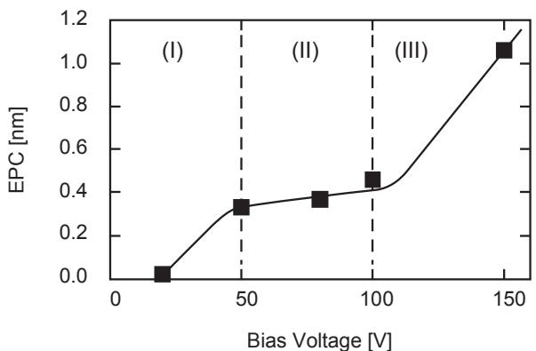
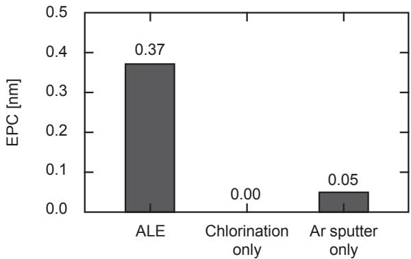
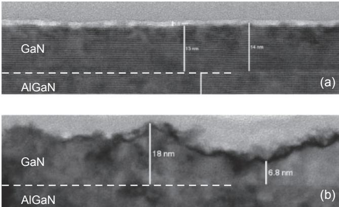
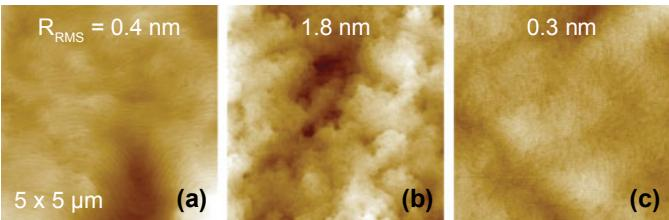
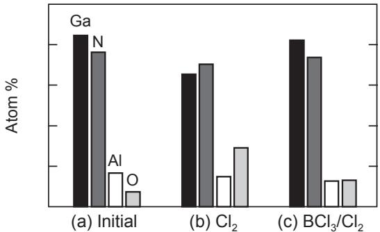

# REGULAR PAPERS

# You may also like

# Atomic layer etching of GaN and AlGaN using directional plasma-enhanced approach

- (Invited) Atomic Layer Processing of MoS₂Elton Graugnard

- (Tutorial) Thermal Atomic Layer EtchingSteven M George

To cite this article: Tomihito Ohba et al 2017 Jpn. J. Appl. Phys. 56 06HB06

- (Invited) Atomic Layer Etching Using Thermal Reactions: Atomic Layer Deposition in ReverseYoungJoo Lee, Samil W. Duhont and Steven M. George

View the article online for updates and enhancements.

This content was downloaded from IP address 131.155.24.31 on 18/07/2023 at 12:47

# Atomic layer etching of GaN and AlGaN using directional plasma-enhanced approach

Tomihito Ohba $^{1*}$ , Wenbing Yang $^{2}$ , Samantha Tan $^{2}$ , Keren J. Kanarik $^{2}$ , and Kazuo Nojiri $^{1}$

$^{1}$ Lam Research Co., Ltd., Yokohama 222- 0033, Japan  $^{2}$ Lam Research Corporation, Fremont, CA 94538, U.S.A.

$^{*}$ E- mail: tomihito.ohba@lamresearch.com

Received December 29, 2016; accepted March 16, 2017; published online May 25, 2017

The directional atomic layer etching (ALE) of GaN and AlGaN has been developed. The GaN ALE process consists of cyclic  $\mathbb{C}\mathbb{I}_{2}$  plasma chemisorption and Ar ion removal. The etch per cycle (EPC) was  $0.4\mathrm{nm}$  within the self- limiting regime, which is 50 to  $100V.$  The root- mean- square surface roughness  $R_{\mathrm{RMS}}$  was  $0.6\mathrm{nm}$  which was improved from an initial roughness of  $0.8\mathrm{nm}$  For AlGaN ALE,  $\mathsf{BCl}_3$  was added to the chlorine step to obtain a smooth surface with  $R_{\mathrm{RMS}}$  of  $0.3\mathrm{nm}$  and stoichiometry similar to the initial sample. The ultra smooth surface obtained by etching is promising for use in next- generation power devices.  $①$  2017 The Japan Society of Applied Physics

# 1. Introduction

As next- generation power devices, wide- band- gap semiconductors are being developed. GaN is a promising candidate because of its excellent high- power and high- speed performance. The high electron mobility of GaN devices is realized by an AlGaN/GaN heterojunction, which induces two- dimensional electron gas (2DEG). However, owing to the structure, electrons always exist under the gate electrode unless it is negatively biased (normally on). For commercial applications, the normally on operation is not preferable. To make the device normally off, several structural approaches have been proposed such as a recessed gate $^{1)}$  and p- GaN gate. $^{2)}$  Since feature size fidelity is important to make the devices operate as designed, they are expected to be fabricated by plasma dry etching. Because of the chemically inert nature of GaN, simple wet etching using an acid or base is difficult, $^{3)}$  and the other conventional technique of ion milling causes serious damage. $^{4)}$  Plasma dry etching of GaN using a number of chemistries, mostly halogens or methane, $^{4 - 13)}$  has been studied, mainly for the purpose of obtaining a high etching rate and anisotropy. However, exposure to plasma also induces various types of damage, $^{14 - 23)}$  which cause the degradation of device performance. Although several post- treatments have been proposed, $^{24 - 28)}$  a damage- free etching process is desirable and atomic layer etching (ALE) is one of the promising candidates.

ALE is expected to achieve atomic- scale etching control for nanoscale device fabrication.29,30) Ultra thin layers of the material are removed by a multi step cycling process, which consists of self- limiting surface modification and removal. Several approaches can be considered for surface modification such as chemisorption, deposition, converting the top layer, and extraction. For removal, the use of thermal, chemical and bombarding energy can be considered. With the exception of removal by bombardment, process characteristics will be isotropic. ALE has been studied as a derivative of atomic layer deposition (ALD) and recently highlighted as a method that can break through the limitations of continuous etching processes. Whereas all species interact simultaneously in continuous processes, in the ALE process, surface modification and removal are functionally separated, which enables more precise process control and less ion- induced damage. High selectivity and better uniformity across the wafer are also achievable.29) Moreover, since it is necessary to maintain post etching stoichiometry, ALE has been investigated for various compound semiconductors.30) In previous reports of GaN/AlGaN ALE, the surface was first oxidized with either  $\mathrm{O_2}$  plasma31,32) or  $\mathrm{H}_2\mathrm{O}_2$  solution33) and then removed with either HCl acid solution31,33) or  $\mathrm{BCl}_3$  plasma.32)

In our study, a directional type of ALE is used to examine GaN and AlGaN etching for the fabrication of p- GaN gate- type devices. In our ALE approach, the surface is modified using chlorination instead of oxidation. The removal step uses Ar ion bombardment, which enables directionality in a patterned feature.

# 2. Experimental methods

All experiments were performed in a commercially established transformer coupled plasma (TCP) etching system (Kiyo® F Series conductor etch system) equipped with advanced mixed mode pulsing (AMMP). AMMP provides fast, repeatable, and reliable power/gas switching, which ensures the sufficient robustness of the process for production. GaN and AlGaN blanket samples were used to examine the amount of etching and surface roughness. Each sample was cleaned in advance by HF to remove native oxide on the surface and  $\mathrm{N}_2$  dried. The ALE process consisted of cyclic plasma chlorination followed by Ar ion bombardment with applied bias voltages ranging from 20 to  $150\mathrm{V}$ . The pressure in the non- biased chlorination step was  $60\mathrm{mT}$  and the duration was  $2.5\mathrm{s}$ . The pressure applied for Ar removal was  $5\mathrm{mT}$  and the duration was  $5.0\mathrm{s}$ . These step times were determined in preliminary studies to be sufficient lengths for each reaction to be fully completed under the conditions. Between these steps, a non- plasma purge step was inserted to minimize interactions. For comparison with the ALE process, a continuous process was also analyzed. The continuous process used  $\mathrm{Cl}_2 / \mathrm{Ar}$  chemistry simultaneously and was operated at  $50\mathrm{V}$  bias.

The etch per cycle (EPC) of the ALE process was calculated by dividing the total amount etched by the number of cycles. The etch depth was measured by ellipsometry (Woollam M- 2000) and transmission electron microscopy (TEM; FEI Tecnai TF- 30). Atomic force microscopy (AFM; Veeco Vx310) was used to measure the surface roughness for plasma damage estimation. The initial surface roughnesses  $R_{\mathrm{RMS}}$  were 0.8 and  $0.4\mathrm{nm}$  for GaN and AlGaN, respectively. The stoichiometry of the AlGaN surface was determined by

  
Fig. 1. EPC of GaN as a function of bias voltage for a fixed Ar step time of  $5\mathrm{s}$ .

X- ray photoelectron spectroscopy (XPS; Thermo Scientific K- Alpha with  $0.1 - 0.2\%$  detection limits) since the composition ratio will affect device characteristics.

# 3. Results and discussion

Figure 1 shows the EPC of GaN as a function of RF bias voltage. Three different process regimes are visible, consistent with previous studies of silicon.34) In regime I  $(0 - 50\mathrm{V}$  bias) and regime III  $(>100\mathrm{V}$  bias), the EPC increased with the bias voltage, while in regime II (50 to  $(00\mathrm{V})$  the EPC is almost constant. From our prediction of GaN ALE mechanism, which is surface modification by  $\mathrm{Cl}_2$  plasma and the desorption of volatile by- products such as  $\mathrm{GaCl}_3$  and  $\mathbf{N}_2$  formed by the energy delivered from Ar ion bombardment, this behavior can be explained as follows. In regime I, the ion energy is insufficient to remove plasma- modified compounds completely. In regime III pure sputter etching occurs, where the ion energy exceeds the physical sputtering threshold. The boundary,  $100\mathrm{V}$  is in good agreement with the reported threshold energy of approximately  $100\mathrm{eV}$  for GaN obtained by experiment35) and molecular dynamics simulation.36) In regime II, a self- limited EPC was observed and the regime can be considered as the ALE window,30) for this system. The EPC in this regime of  $0.4\mathrm{nm}$  corresponds to one or two layers of GaN crystal. Since the ion energy is below the sputtering threshold, it suggests that only a few layers of GaN are chemisorbed by the preceding chlorination step. As compared with the Si ALE window of  $40 - 60\mathrm{eV}$  34) the GaN window of  $50 - 100\mathrm{eV}$  is notably shifted to higher energies. According to basic sputtering theory, the sputter threshold, represented by the upper limit of the ALE window, scales with the surface binding energy. For example, the Si surface binding energy is  $4.7\mathrm{eV}$  37) compared with the stronger GaN surface binding energy of  $8.6\mathrm{eV}$  38) This widens the overall process window as observed, and is consistent with trends recently reported for other materials.39)

In the ALE window  $(80\mathrm{V})$  ,etching synergy was confirmed by comparison between the EPC of ALE (full cycle), chlorination only, and Ar sputtering only (Fig.2). Each step was executed individually for 90 cycles. The EPC of chlorination was negligible and Ar sputter was  $0.05\mathrm{nm}$  contributing only  $\sim 10 - 15\%$  of the ALE process. The result showed that the basic concept of reactive ion etching, synergistic effect of neutrals and ion bombardment40) was confirmed, and was completely separated in this process.

  
Fig. 2. Results of EPC synergy test at  $80\mathrm{V}$  bias.

  
Fig. 3. Cross-sectional TEM images of GaN processed with (a) ALE and (b) continuous plasma process.

The  $R_{\mathrm{RMS}}$  GaN surface roughness after ALE of  $0.6\mathrm{nm}$  was an order of magnitude less than that of  $4.0\mathrm{nm}$  after the continuous plasma process with the same etched depth. The TEM image in Fig. 3(a) suggests that crystal structures were kept intact beneath the etch front of ALE. Although we have to take into account the effect of UV light irradiation,21,22) from the surface morphology point of view, this smoothness is attributed to the layer- by- layer self- limiting nature of ALE and is a characteristic advantage over the conventional continuous plasma process. Moreover, the injection of reactive ions such as  $\mathrm{Cl^+}$  or  $\mathrm{Cl}_2^+$  is minimized in ALE, which may prevent the increase in surface roughness seen in the continuous process.

For AlGaN ALE, we first employed the same ALE process as that used as for GaN, expecting that the same etching mechanism would form volatile metal chlorides. However, in contrast to GaN, measurable surface roughness was observed with the  $\mathrm{Cl}_2$  - only ALE approach. As shown in Figs. 4(a) and 4(b),  $R_{\mathrm{RMS}}$  was  $1.8\mathrm{nm}$  as compared with  $0.4\mathrm{nm}$  for the pre- etch sample. XPS measurements detected higher amount of O on the roughened surface [Fig. 5(b)], suggesting the formation of non- volatile ALO, which act as a micromask and roughens the surface. Oxygen is assumed to be provided from the ceramic parts inside the chamber. Therefore,  $\mathrm{BCl}_3$  was added to the chlorination step to prevent oxidization by scavenging  $\mathrm{BClO}$  41- 43) With  $\mathrm{BCl}_3 / \mathrm{Cl}_2$  ALE, the stoichiometry post- ALE became similar to that of the initial pre- etch sample (Fig. 5). As further evidence that ALE was working properly,  $R_{\mathrm{RMS}}$  recovered to  $0.3\mathrm{nm}$  [Fig. 4(c)].

  
Fig. 4. (Color online) AFM images of AlGaN surface. (a) Initial, (b)  $\mathrm{Cl}_2$  ALE, and (c)  $\mathrm{BCl}_3 / \mathrm{Cl}_2$  ALE.

  
Fig. 5. Results of XPS analysis of AlGaN surface. (a) Initial, (b)  $\mathrm{Cl}_2$  ALE, and (c)  $\mathrm{BCl}_3 / \mathrm{Cl}_2$  ALE.

# 4. Conclusions

A GaN and AlGaN etching process to obtain an ultra smooth surface was realized by ALE. The ALE window was observed for GaN by cyclic  $\mathrm{Cl}_2$  plasma modification and Ar ion removal process. In the ALE window of  $50\mathrm{- }100\mathrm{V}$  the EPC was around  $0.4\mathrm{nm}$ . For the AlGaN process,  $\mathrm{BCl}_3$  was added to scavenge oxidized materials on the etch front. The post- ALE  $R_{\mathrm{RMS}}$  obtained was  $0.3\mathrm{nm}$  and the stoichiometry was similar to that of the initial pre- etch sample. Further work is required to confirm the correspondence between these characteristics and actual device electrical properties.

10) L. Zhang, J. Ramer, J. Brown, K. Zheng, L. F. Lester, and S. D. Hersee, Appl. Phys. Lett. 68, 367 (1996). 
11) R. J. Shul, S. P. Kilcoyne, M. Hagerott Crawford, J. E. Parmeter, C. B. Vartuli, C. R. Abernathy, and S. J. Pearton, Appl. Phys. Lett. 66, 1761 (1995). 
12) S. Nakamura, M. Senoki, S. Nagahama, N. Iwasa, T. Yamada, T. Matsushita, H. Kiyoku, and Y. Sugimoto, Jpn. J. Appl. Phys. 35, L74 (1996). 
13) C. B. Vartuli, S. J. Pearton, J. W. Lee, J. Hong, J. D. MacKenzie, C. R. Abernathy, and R. J. Shul, Appl. Phys. Lett. 69, 1426 (1996). 
14) H. Cho, C. B. Vartuli, C. R. Abernathy, S. M. Donovan, S. J. Pearton, R. J. Shul, and J. Han, Solid-State Electron. 42, 2277 (1998). 
15) H. S. Kim, G. Y. Yeong, J. W. Lee, and T. I. Kim, Thin Solid Films 341, 180 (1999). 
16) W. V. Schoenfeld, C. H. Chen, P. M. Petroff, and E. L. Hu, Appl. Phys. Lett. 72, 2035 (1998). 
17) P. Hacke, T. Detchprohn, K. Hiramatsu, and N. Sawaki, Appl. Phys. Lett. 63, 2676 (1993). 
18) J. D. Guo, M. S. Feng, R. J. Guo, F. M. Pan, and C. Y. Chang, Appl. Phys. Lett. 67, 2657 (1995). 
19) B. Rong, E. van der Drift, R. J. Reeves, W. G. Sloof, and R. Cheung, J. Vac. Sci. Technol. B 19, 2917 (2001). 
20) F. A. Khan, L. Zhou, V. Kumar, and I. Adesida, J. Vac. Sci. Technol. B 19, 2926 (2001). 
21) R. Kawakami, T. Inaoka, K. Tominaga, A. Kuwahara, and T. Mukai, Jpn. J. Appl. Phys. 47, 6863 (2008). 
22) M. Minami, S. Tomiya, K. Ishikawa, R. Matsumoto, S. Chen, M. Fukasawa, F. Uesawa, M. Sekine, M. Hori, and T. Tatsumi, Jpn. J. Appl. Phys. 50, 08JE03 (2011). 
23) R. Kawakami and T. Inaoka, Vacuum 83, 490 (2008). 
24) X. A. Cao, H. Cho, S. F. Pearton, G. T. Dang, A. P. Zhang, F. Ren, R. J. Shul, L. Zhang, R. Hickman, and J. M. van Hove, Appl. Phys. Lett. 75, 232 (1999). 
25) J. M. Lee, K. M. Chang, S. W. Kim, C. Huh, I. H. Lee, and S. J. Park, J. Appl. Phys. 87, 7667 (2000). 
26) S.-I. Na, G.-Y. Ha, D.-S. Han, S.-S. Kim, J.-Y. Kim, J.-H. Lim, D.-J. Kim, K.-I. Min, and S.-J. Park, IEEE Photonics Technol. Lett. 18, 1512 (2006). 
27) A. Hierro, S. A. Ringel, M. Hansen, J. S. Speck, U. K. Mishra, and S. P. Den Baers, Appl. Phys. Lett. 77, 1490 (2000). 
28) S. Chen, K. Ishikawa, Y. Lu, R. Kometani, H. Kondo, Y. Tokuda, T. Egawa, H. Amano, M. Sekine, and M. Hori, Jpn. J. Appl. Phys. 51, 111002 (2012). 
29) T. Lill, S. Tan, W. Yang, K. J. Kanarik, X. Hua, M. Shen, V. Vahedi, J. Marks, and R. A. Gottscho, Proc. Int. Symp. Dry Process, 2014, p. 149. 
30) K. J. Kanarik, T. Lill, D. A. Hudson, S. Sriraman, S. Tan, J. Marks, V. Vahedi, and R. A. Gottscho, J. Vac. Sci. Technol. A 33, 020802 (2015). 
31) D. Buttari, S. Heikman, S. Keller, and U. K. Mishra, Proc. IEEE Lester Eastman Conf. High Performance Devices, 2002, p. 461. 
32) S. D. Burnham, K. Bouros, P. Hashimoto, C. Butter, D. W. S. Wong, M. Hu, and M. Micovic, Phys. Status Solidi C 7, 2010 (2010). 
33) D. H. van Dorp, S. Arments, F. Holsteyns, and S. De Gendt, ECS J. Solid State Sci. Technol. 4, N5061 (2015). 
34) S. Tan, W. Yang, K. J. Kanarik, T. Lill, V. Vahedi, J. Marks, and R. A. Gottscho, ECS J. Solid State Sci. Technol. 4, N5010 (2015). 
35) S. J. Pearton, C. R. Abernathy, F. Ren, and J. R. Lothian, J. Appl. Phys. 76, 1210 (1994). 
36) K. Harafuji and K. Kawamura, Jpn. J. Appl. Phys. 47, 1536 (2008). 
37) Y. Yamamura and H. Tawara, At. Data Nucl. Data Tables 62, 149 (1996). 
38) J. Nord, K. Albe, P. Erhart, and K. Nordlund, J. Phys.: Condens. Matter 15, 5649 (2003). 
39) K. J. Kanarik, S. Tan, W. Yang, T. Kim, T. Lill, A. Kabansky, E. A. Hudson, T. Ohba, K. Nojiri, J. Yu, R. Wise, Y. Pan, J. Marks, and R. A. Gottscho, J. Vac. Sci. Technol. A 35, 05C302 (2017). 
40) J. W. Coburn and H. F. Winters, J. Appl. Phys. 50, 3189 (1979). 
41) T. Banjo, M. Tsuchihashi, M. Hanzaki, M. Tuda, and K. Ono, Jpn. J. Appl. Phys. 36, 4824 (1997). 
42) E. Zhirnov, S. Stepanov, W. N. Wang, Y. G. Shreter, D. V. Takhin, and N. I. Bochkareva, J. Vac. Sci. Technol. A 22, 2336 (2004). 
43) T. Wu, Z. Hao, G. Tang, and Y. Luo, Jpn. J. Appl. Phys. 42, L257 (2003).