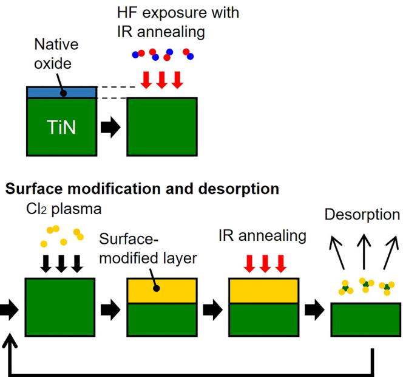
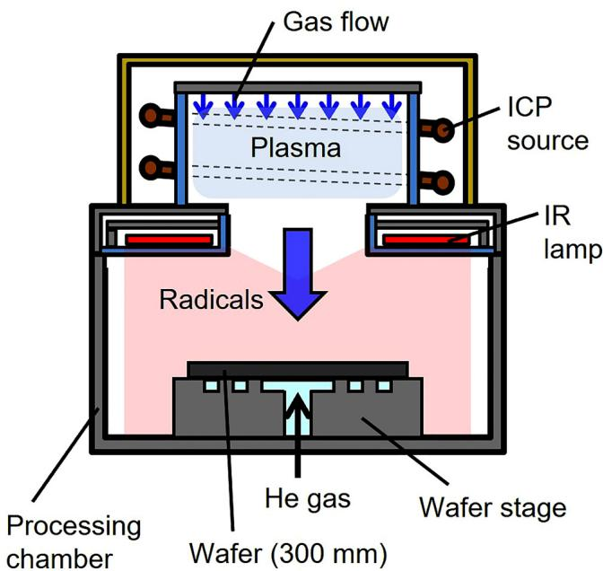
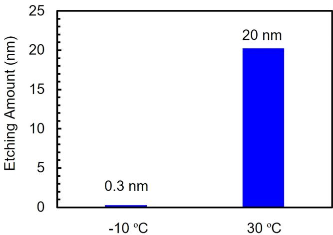
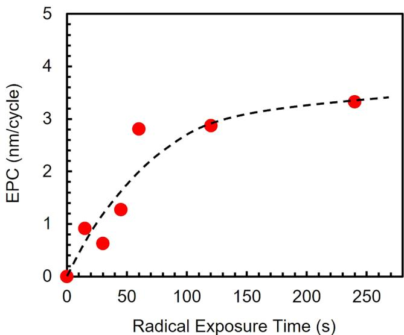
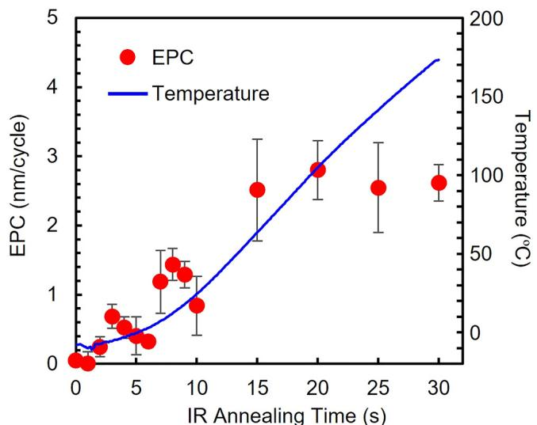
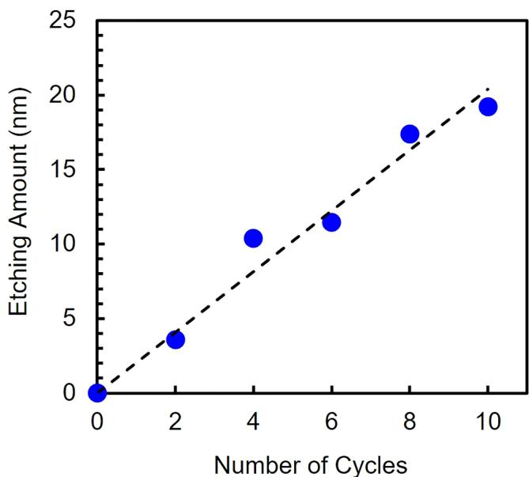
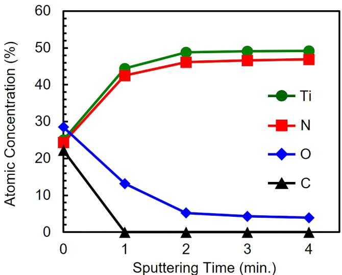
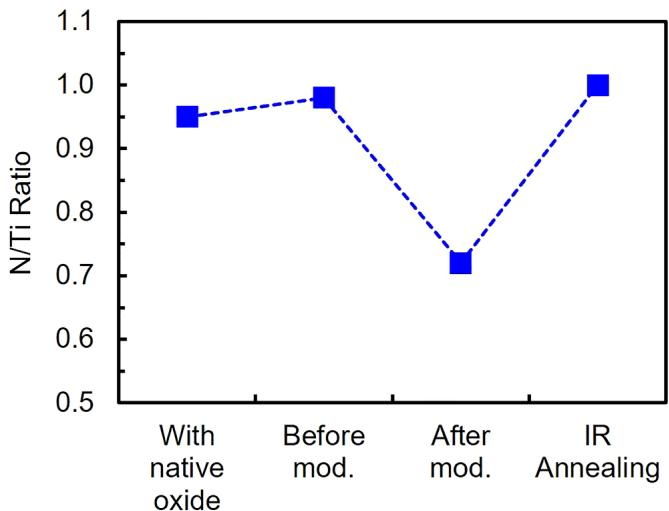
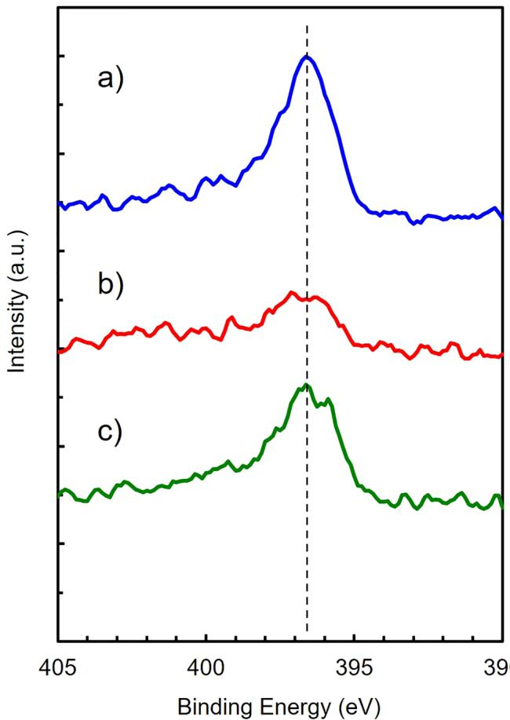
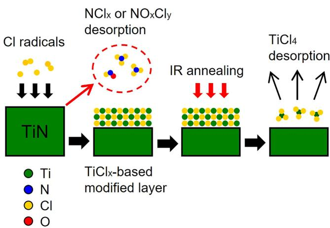

# Atomic layer etching of titanium nitride with surface

# modification by Cl radicals and rapid thermal annealing

Special Collection: Atomic Layer Etching (ALE)

Nobuya Miyoshi  $\oplus$  Nicholas McDowell; Hiroyuki Kobayashi

Check for updates J.Vac.Sci.Technol.A 40,032601 2022) https://doi.org/10.1116/6.0001827

# Articles You May Be Interested In

Dry etching characteristics of TiN film using Ar/CHF 3, Ar/Cl 2, and Ar/BCl 3 gas chemistries in an inductively coupled plasma

J.Vac.Sci.Technol. 8 (September 2003)

Atomic layer etching of  $\mathrm{SiO}_2$  with self- limiting behavior on the surface modification step using sequential exposure of HF and  $\mathrm{NiO}_2$

J.Vac.Sci.Technol.A (December 2021)

Atomic layer etching of  $\mathrm{Si}_3\mathrm{N}_4$  with high selectivity to  $\mathrm{SiO}_2$  and poly- Si

J.Vac.Sci.Technol.A (August 2021)

# Atomic layer etching of titanium nitride with surface modification by Cl radicals and rapid thermal annealing

Cite as: J. Vac. Sci. Technol. A 40, 032601 (2022); doi: 10.1116/s0001827  Submitted: 24 February 2022 · Accepted: 22 March 2022 · Published Online: 5 April 2022

Nobuya Miyoshi.a) Nicholas McDowell, and Hiroyuki Kobayashi

# AFFILIATIONS

Hitachi High- Tech America, Inc., 6357 NE Evergreen Parkway, Building D, Hillsboro, Oregon 97124

Note: This paper is part of the 2023 Special Topic Collection on Atomic Layer Etching (ALE). a)Electronic mail: nobuya.miyoshi.wp@hitachi- hightech.com

# ABSTRACT

Thermal atomic layer etching (ALE) is a promising method for isotropic etching with atomic level precision and high conformality over three- dimensional structures. In this study, a thermal ALE process for titanium nitride (TiN) films was developed using surface modification with a  $\mathrm{Cl}_2 / \mathrm{Ar}$  downstream plasma followed by infrared (IR) annealing of the films. The oxygen- free  $\mathrm{Cl}_2$ - based plasma was adopted to enable highly selective etching of TiN with regard to various materials. It was confirmed that spontaneous etching of TiN during radical exposure can be suppressed at a surface temperature of  $- 10^{\circ}\mathrm{C}$ . Measurements of etch per cycle (EPC) of TiN demonstrated that the EPC is self- limiting with respect to both the radical exposure and IR annealing times. With repeated steps of self- limiting radical exposure and IR annealing, TiN was etched at  $2.0 \mathrm{nm / cycle}$ , while no thickness change was observed for poly- Si,  $\mathrm{SiO}_2$ ,  $\mathrm{Si}_3\mathrm{N}_4$ ,  $\mathrm{W}$ , and  $\mathrm{HfO}_2$ . The selectivity to amorphous carbon was higher than 4. X- ray photoelectron spectroscopy analysis revealed that during surface modification,  $\mathrm{NCl}_x$  species sublimate spontaneously, while  $\mathrm{TiCl}_x$  species remain in the surface- modified layer on TiN. This  $\mathrm{TiCl}_x$ - based modified layer desorbs in the IR annealing step, and the TiN surface then returns to its original condition (pristine TiN) before surface modification.

Published under an exclusive license by the AVs. https://doi.org/10.1116/6.0001827

# I. INTRODUCTION

As semiconductor devices shrink to sub-  $10\mathrm{nm}$  dimensions, the introduction of new device structures, integration schemes, and materials brings many challenges to device manufacturing processes. Fin- type field- effect transistors were introduced to reduce the power consumption of transistors and achieve higher transistor integration density.34 This has been followed by the introduction of new device. architectures such as gate- all- around nanosheets to provide further increase in integration density. Fabricating these three- dimensional (3D) devices requires isotropic etching of thin films with atomic layer control, high selectivity to underlying materials, and high uniformity over high- aspect- ratio 3D structures. Atomic layer etching (ALE) is a promising candidate to achieve these requirements.

ALE can be subdivided into two categories: directional and isotropic processes. Both processes consist of self- limiting surface modification and desorption steps. Isotropic ALE is generally called thermal ALE because it utilizes random motion of gas molecules and thermal energy for surface reactions.7 In a cyclic process of thermal ALE, reactive precursors adsorb on surfaces to form a surface- modified layer. The second reaction then liberates volatile etching species from this modified layer. These surface reactions are self- limiting, which enables layer- by- layer removal of thin films and highly uniform (conformal) etching over 3D structures. Thermal ALE has been mainly reported for metal oxides,9- 14 metal nitrides,15,16 and metals.17- 20

Another approach to thermal ALE is based on temperature annealing in an ALE cycle. Surface modification by reactive radicals or gas molecules is first performed at lower temperature. Subsequently, the surface- modified layer is desorbed by heating the modified layer to higher temperature. The temperature is then returned to its initial value to start the next cycle of the ALE process. Originally, this approach was demonstrated for etching of  $\mathrm{SiO}_2$  films by Nishino et al. In that study, exposure of  $\mathrm{SiO}_2$  to an  $\mathrm{NH}_3 / \mathrm{NF}_3$  plasma produced an  $(\mathrm{NH}_4)_2\mathrm{SiF}_6$  layer on the surface as a by- product, which was then removed by heating.

We have investigated thermal ALE with temperature annealing for  $\mathrm{Si}_3\mathrm{N}_4$  and  $\mathrm{SiO}_2$  films based on the formation and desorption of surface- modified layers.22- 26 We have demonstrated the formation of an  $(\mathrm{NH_4})_2\mathrm{SiF_6}$  layer on an  $\mathrm{Si}_3\mathrm{N}_4$  surface at room temperature using  $\mathrm{CHF}_3 / \mathrm{O}_2$  and  $\mathrm{CH}_2\mathrm{P}_2 / \mathrm{O}_2 / \mathrm{Ar}$  plasmas.24,25 This ammonium salt layer was found to be described by thermal annealing using infrared (IR) lamps.23 The formation and desorption of an  $(\mathrm{NH_4})_2\mathrm{SiF_6}$  layer has also been employed for ALE of  $\mathrm{SiO}_2$  films using sequential exposure to HF and  $\mathrm{NH}_3$  gases.26

Titanium nitride (TiN) is a multipurpose material because of its high compatibility with high- k dielectric materials and its good chemical stability. It is widely used as a gate metal, a diffusion- barrier metal, and a wire- mask in complementary metal- oxide semiconductor devices.8,27 Lee and George demonstrated thermal ALE of TiN films using sequential oxidation and fluorination reactions at surface temperatures from 150 to  $350^{\circ}C$  16 The oxidation reactant was  $\mathrm{O_3}$  or  $\mathrm{H}_2\mathrm{O}_2,$  and HF was used as the fluorination reactant. In 2019, our group demonstrated thermal ALE of TiN using the formation and desorption of an  $(\mathrm{NH_4})_x\mathrm{TiF_y}$  - based surfacemodified layer.28 The surface modification was performed using a  $\mathrm{CHF}_3 / \mathrm{O}_2$  plasma. Shim et al. successfully developed a thermal ALE process of TiN consisting of plasma oxidation, plasma fluorination, and thermal removal at low temperatures.29 These ALE processes use  $\mathrm{O_3}$  or oxygen radicals for surface modification, but oxygen- free chemistries are required to prevent excessive recess of carbon- based materials and undesirable oxidation on metals.

In this study, an ALE process for TiN films was successfully demonstrated using surface modification with a  $\mathrm{Cl}_2 / \mathrm{Ar}$  downstream plasma followed by IR annealing of the films. Oxygen- free  $\mathrm{Cl}_2$  - based plasmas were used using to the lower boiling point of the volatile by- products,  $136.5^{\circ}C$  for  $\mathrm{TiCl_4}$  and  $284^{\circ}C$  for  $\mathrm{TiF_4}$  which is essential for desorption of surface- modified layers using IR annealing.27,30 The etching rates of the TiN films were measured to investigate the self- limiting behavior during the formation and desorption of the surface- modified layer. The highly selective etching of TiN films was then successfully demonstrated by repeating the self- limiting steps. X- ray photoelectron spectroscopy (XPS) was carried out to investigate the surface- modified layer, and finally a mechanism of the TiN ALE was proposed.

# II. EXPERIMENT

Figure 1 depicts an overview of the thermal ALE of TiN, which consists of three primary steps: native oxide removal on TiN films, surface modification, and desorption of the surface- modified layer. For native oxide removal, simultaneous HF gas exposure and IR annealing are employed to selectively etch  $\mathrm{TiO_2}$  species on TiN films. This method to etch  $\mathrm{TiO_2}$  was originally explored by Lee and George.16 The native oxide removal occurs only once at the beginning of processing for each sample and is not part of the ALE cycle described next. After removal of the native oxide, the surface of the pristine TiN is exposed to radicals generated in the  $\mathrm{Cl}_2 / \mathrm{Ar}$  plasma. As shown later, a  $\mathrm{TiCl_x}$  - based surface- modified layer forms on the TiN film. Subsequently, the substrate is heated at over  $100^{\circ}\mathrm{C}$  to desorb the modified layer. Repeating this formation and desorption of the modified layer enables layer- by- layer removal of TiN films, and the number of ALE cycles determines the total etching amount.

# Native oxide removal

  
FIG.1. Overview of thermal ALE of TiN films consisting of native oxide removal and the formation and desorption of a surface-modified layer. A  $\mathrm{Cl}_2 / \mathrm{Ar}$  downstream plasma is used for the surface modification, and the modified layer is removed by IR annealing.

A schematic of the etching apparatus used in this study is presented in Fig. 2. This apparatus consisted of an inductively coupled plasma (ICP) source that produced reactive radicals, an IR annealing lamp unit, and a processing chamber. The chamber was pumped by a mechanical booster pump that held a base pressure below  $1\mathrm{Pa}$  A wafer stage with an electrostatic chuck (ESC) was placed at the bottom of the processing chamber. Reactive radicals produced in the ICP source were transported to the processing chamber through down- flow.

In the ICP source, a two- turn coil was wound around the source and was connected to a  $13.56\mathrm{MHz}$  radio frequency (RF) power supply through an impedance- matching network (not shown here). Process gases were supplied through a gas inlet plate at the top of the ICP source. Gas flow rates were controlled using mass flow controllers.

Carrier (substrate) wafers with a diameter of  $300\mathrm{mm}$  were placed on the bipolar ESC. The temperature of the ESC body was regulated by a circulating coolant. Helium gas was confined in a space between the carrier wafer and the ESC to improve the thermal conductivity during radical exposure and to cool the wafers. The helium pressure was variable, delivering a high level of temperature control in the ALE cycles.

The TiN film samples used in this study were chemical vapor deposition (CVD)- grown TiN. The film was deposited on a  $100\mathrm{- nm - SiO_2}$  layer on an Si substrate. The other film samples were thermally grown  $\mathrm{SiO_2}$  low- pressure CVD  $\mathrm{Si}_3\mathrm{N}_4,$  CVD- grown poly- Si, atomic layer deposition- grown  $\mathrm{HfO_2}$  spin- coated

  
FIG. 2. Schematic of ALE chamber for  $300 - \text{mm}$  wafer processing. Process gases are injected into the ICP source, and reactive radicals are transported to the processing chamber through down-flow. The carrier wafer is annealed using an IR lamp during the desorption step.

amorphous carbon, and CVD- grown W. The samples were cleaved into  $30 \times 30 \text{mm}^2$  coupons and glued on a  $300 - \text{mm}$  carrier wafer with vacuum grease.

IR lamp annealing was used for rapid thermal desorption of the surface- modified layer. Before starting radical exposure, the temperatures of the carrier wafers and coupon samples were controlled by flowing helium gas into the space between the wafers and the ESC. The sample was then exposed to radicals produced in the ICP source. Next, the wafer was annealed by IR irradiation with the helium flow rate decreased to enhance wafer heating. Finally, the wafer was cooled down to the ESC temperature. In the cooling step, the helium flow rate was increased to the same value as in the surface modification step. The details of the heating characteristics of our apparatus have been presented in previous articles.23,24

Film thicknesses of coupon samples were measured using  $\mathbf{x}$  ray reflectivity,  $\mathbf{x}$  ray fluorescence (XRR/XRF, Bruker JVX6300 RF- T) for TiN and W, and spectroscopic ellipsometry (Horiba SmartSE) for other films. The XRR system used a copper anode  $\mathbf{x}$  ray source with maximum settings of  $50 \text{kV}$ ,  $1 \text{mA}$ , and  $50 \text{W}$ . The XRF system used a molybdenum anode  $\mathbf{x}$  ray source with maximum settings of  $50 \text{kV}$ ,  $2.5 \text{mA}$ , and  $50 \text{W}$ . For ellipsometry, the wavelength range was  $450 - 900 \text{nm}$  and the spot size on the coupon samples was  $500 \times 500 \mu \text{m}^2$ . Surface analysis on TiN films was carried out using XPS at a takeoff angle of  $10^{\circ}$  with respect to the surface normal. The XPS tool, with a spatial resolution of  $200 \mu \text{m}$ , was equipped with a high- resolution monochromatic Al

  
FIG. 3. Etching amount of TiN films. The sample temperature during radical exposure were  $-10$  or  $30^{\circ}\text{C}$ , and the radical exposure time was fixed at  $300 \text{s}$ .

Kα x- ray source  $(1486.6 \text{eV})$ . High- resolution spectra were obtained using a constant pass energy of  $58 \text{eV}$ . The carbon C1s peak at  $234.8 \text{eV}$  was taken as a reference for the precise determination of binding energies for all analyzed samples.

# III. RESULTS AND DISCUSSION

# A. Temperature of TiN samples during radical exposure

To construct a TiN ALE process with self- limiting behavior, the surface temperature of TiN samples during radical exposure without spontaneous etching needs to be found. In this experiment, one cycle of ALE was carried out by varying the temperature of the samples during radical exposure. The gas flow rates for  $\mathrm{Cl}_2 / \mathrm{Ar}$  were  $400 / 1000 \text{CCM}$ , and the process pressure was  $50 \text{Pa}$ . The radical exposure time was fixed at  $300 \text{s}$ . The temperatures of TiN samples were set at  $- 10$  or  $30^{\circ}\text{C}$  using a circulating coolant. Figure 3 shows the etching amount of the samples. The contribution to etching from the removal of the native oxide on TiN samples was subtracted from the etch amount in Fig. 3. When the temperature was  $30^{\circ}\text{C}$ , the etching amount was  $20 \text{nm}$ , whereas it was less than  $1 \text{hm}$  when the temperature was  $- 10^{\circ}\text{C}$ . This result indicates that spontaneous etching occurs at  $30^{\circ}\text{C}$ , and it is expected to be suppressed at  $- 10^{\circ}\text{C}$ . Based on these results, Subsections III B- III E will investigate the ALE characteristics at a surface temperature of  $- 10^{\circ}\text{C}$  during radical exposure.

# B. Self-limiting behavior during the formation and desorption of a surface-modified layer

Self- limiting behavior, which is an essential characteristic of ALE, was investigated for different radical exposure times and IR annealing times. The surface temperature during radical exposure was set at  $- 10^{\circ}\text{C}$ , and the etch per cycle (EPC) of TiN films was measured using XRF.

Figure 4 shows the EPC as a function of the radical exposure time. The exposure time was varied from 15 to  $240~\mathrm{s}$  with the annealing time fixed at  $30~\mathrm{s}$ . The EPC increased to  $2.8~\mathrm{nm}$  cycle in the first  $60~\mathrm{s}$  and to  $2.9~\mathrm{nm}$  cycle at  $120~\mathrm{s}$ , and saturated at  $3.3~\mathrm{nm}$  cycle for an exposure time of  $240~\mathrm{s}$ . This result demonstrates that the surface modification by Cl radicals is self- limiting with respect to the radical exposure time. Two types of mechanism have been proposed for the surface modification that occurs during ALE: the Deal- Grove model and the Cabrera- Mott model. In the former model, the EPC increases in proportion to the square root of the exposure time of reactants, while in the latter model, it increases according to an inverse logarithmic function of the exposure time. Figure 4 suggests that the EPC of this study is closer to the Cabrera- Mott model.

Next, self- limiting behavior in the annealing step was studied by varying the annealing time. The dependence of the EPC on the annealing time is shown in Fig. 5. In this experiment, the exposure time was fixed at  $60~\mathrm{s}$  and the annealing time was varied from 1 to  $30~\mathrm{s}$ . The surface temperature of a carrier wafer during the annealing was measured using a k- type thermocouple pasted on a carrier wafer. A reflection plate was put above the thermocouple to avoid direct heating by IR irradiation. The dependence of the temperature on the IR annealing time is shown on the right axis of Fig. 5. The EPC started to increase when the temperature exceeded  $30^{\circ}\mathrm{C}$  (an annealing time of  $8~\mathrm{s}$ ), which is consistent with the result shown in Fig. 3 that continuous etching occurs when the surface temperature is  $30^{\circ}\mathrm{C}$ . The EPC then saturated at approximately  $3~\mathrm{nm}$  cycle when the annealing time was increased above  $15~\mathrm{s}$ . The surface temperature of the carrier wafer reached  $63^{\circ}\mathrm{C}$  when the annealing time was  $15~\mathrm{s}$ . In addition, further annealing after  $15~\mathrm{s}$  did not etch the TiN bulk film under the modified layer. Based on these results, the desorption step of the surface- modified layer is self- limiting with respect to the IR annealing time.

  
FIG. 4. EPC of the TiN films as a function of the radical exposure time. The dashed line is provided as a guide to the eye only.

# C. Selective cyclic etching

The self- limiting formation and desorption of the surface- modified layer were repeated to demonstrate the precise control of the etch amount TiN films and the high selectivity to various materials. In this experiment, the radical exposure time and the IR annealing time were set at 60 and  $30~\mathrm{s}$ , respectively, to repeat the cycle under a self- limiting condition. After annealing, TiN samples were cooled down to the stage temperature of  $- 10^{\circ}\mathrm{C}$  in  $70~\mathrm{s}$ . Coupon samples of poly- Si,  $\mathrm{SiO}_2$ ,  $\mathrm{Si}_3\mathrm{N}_4$ ,  $\mathrm{HfO}_2$ , amorphous carbon, and W were also pasted on carrier wafers, and their thicknesses were measured ex situ using XRF and spectroscopic ellipsometry.

Figure 6 plots the etching amount of TiN over the course of ten cycles of etching. The etching amount of TiN films increased linearly as the number of cycles increased, showing consistent etching behavior. The EPC obtained from a least squares fit to the data points was  $2.0~\mathrm{nm}$  cycle, which is lower than that observed in the preceding EPC saturation studies (Figs. 4 and 5). On the other hand, the EPC obtained from Fig. 6 falls within the variation of  $1\sigma$  shown in Fig. 5. This variation in the EPC may be attributed to chamber conditions such as the temperature of the chamber wall and its surface adsorption state before the start of the first ALE cycle. The method of chamber conditioning needs to be improved to achieve stable results for the EPC.

The EPCs of other materials are given in Table I, together with the selectivity for etching of TiN compared with each material. For W films, a native oxide with thickness of  $2~\mathrm{nm}$  was present on

  
FIG. 5. IR annealing time dependence of the EPC of TiN films with error bars representing the standard deviation  $\sigma$ . Temperature (solid line), shown on the right axis, was measured using a thermocouple attached to the carrier wafer during processing.

  
FIG. 6. Etching amount of TiN films as a function of the number of ALE cycles. The radical exposure time and IR annealing time were set at 60 and  $30~\mathrm{s}$ , respectively. The dashed line on the plot was obtained from least squares fitting to the data points.

the surface and was etched away in the first ALE cycle. No bulk W etching was observed over the course of subsequent ALE cycles, demonstrating high selectivity to W. It was found that IR annealing shrank the amorphous carbon films and the thickness saturated at  $90\%$  of the initial value as the total annealing time increased. To eliminate the contribution of the shrinkage, postshrunk films were used for the EPC evaluation. The EPC of amorphous carbon and the etching selectivity were  $0.6\mathrm{nm}$  cycle and 4, respectively. No measurable thickness changes were observed for poly- Si,  $\mathrm{SiO_2}$ ,  $\mathrm{Si}_3\mathrm{N}_4$ , and  $\mathrm{HfO_2}$ , which demonstrates the high selectivity for etching of TiN compared with these films.

# D. XPS analysis of the surface modification step

XPS depth profiling was carried out on pristine TiN films to determine their chemical composition. Depth profiles of atomic concentration are shown in Fig. 7. According to our ellipsometry and XRF measurements, the thickness of the native oxide on the films was approximately  $3\mathrm{nm}$ . After the first sputtering, contaminating carbon was found to have been removed from the surface. As the sputtering time increased, the atomic concentration of oxygen decreased and saturated at approximately  $4\%$ , while those of titanium and nitrogen increased and saturated at  $49\%$  and  $47\%$ , respectively. This result shows that the native oxide on the TiN films was removed in two rounds of sputtering and that the ratio of N to Ti in the bulk film was  $47 / 49 = 0.96$  (i.e., close to a one to one ratio).

  
FIG. 7. Depth profiles of atomic concentrations of Ti, N, O, and C in the pristine TiN film. The thickness of the native oxide was approximately  $3\mathrm{nm}$ .

Next, to investigate the chemical composition of the surface- modified layer, the N/Ti ratio was measured in an ALE cycle. XPS analysis was performed on four TiN samples: (1) as- grown with native oxide; (2) before surface modification (after removal of native oxide); (3) after surface modification; and (4) after surface modification and IR annealing. It should be noted that the native oxide layer was reformed on the surface of the TiN samples of (2)- (4), because they were transported ex situ from the etching chamber to the XPS chamber. The N/Ti ratio was obtained from high- resolution spectra of N1s and Ti2p spectra of the surfaces. The sputtering of adventitious carbon was not performed because the authors could not find an appropriate sputtering condition that can remove carbon contamination while the surface- modified layer is not affected. Figure 8 shows the N/Ti ratios for these four samples. The ratio was 0.98 before surface modification and decreased to 0.72 after modification. This decrease in the N/Ti ratio shows that, in the modification step, nitrogen atoms were sublimated from the surface, while titanium atoms were retained on the surface. This selective sublimation of nitrogen atoms is attributed to the lower boiling point of  $\mathrm{NCl}_x$ $(x = 1 - 3)$  species compared with

TABLE I. Summary of EPC and selectivity of TiN etching.  

<table><tr><td></td><td>TiN</td><td>Poly-Si, SiO2, Si3N4, HfO2</td><td>Amorphous carbon</td><td>W</td></tr><tr><td>EPC (nm/cycle)</td><td>2-3</td><td>Under detection limit</td><td>0.6</td><td>Under detection limit</td></tr><tr><td>Selectivity (TiN/material)</td><td>—</td><td>Very high (&amp;gt;20)</td><td>4</td><td>Very high (&amp;gt;20)</td></tr></table>

  
FIG. 8. Change in N/Ti ratio during an ALE cycle. The atomic concentrations of N and Ti were measured for four TiN films: (1) as-grown with native oxide; (2) before surface modification (after removal of native oxide); (3) after surface modification; (4) after surface modification and IR annealing.

$\mathrm{TiCl_x}$ $(x = 1 - 4)$  species.34 In their Cl- based reactive ion etching process, Kim et al. found that  $\mathrm{NCl_x}$  by- products sublimated spontaneously, whereas  $\mathrm{TiCl_x}$  by- products required ion bombardment.34 After surface modification followed by IR annealing, the N/Ti ratio increased back to 1.0, which is similar to the value before surface modification. These results show that a Ti- rich modified layer forms on the TiN surface owing to selective removal of nitrogen atoms, and that this modified layer is desorbed during the IR annealing.

Finally, the chemical binding state of titanium was analyzed using XPS. High- resolution Ti2p and N1s spectra in an ALE cycle are shown in Figs. 9 and 10. See the supplementary material for the O1s spectra. Before surface modification [Fig. 9(a)], a shoulder corresponding to  $\mathrm{Ti^{3 + }}$  (Ti- N) was observed at  $455.1\mathrm{eV}$ , in addition to a peak at  $458.5\mathrm{eV}$  corresponding to  $\mathrm{Ti^{4 + }}$  (Ti- O). As shown in Fig. 9(b), the signal intensity of the shoulder  $(\mathrm{Ti^{3 + }})$  was decreased after surface modification using Cl radical exposure. After surface modification followed by IR annealing [Fig. 9(c)], the intensity of the shoulder increased with respect to the peak of  $\mathrm{Ti^{4 + }}$  and the spectrum returned to a profile similar to that before surface modification. For N1s spectra, the spectrum after surface modification [Fig. 10(b)] shows reduction in the peak intensity in comparison with that before surface modification [Fig. 10(a)]. As shown in Fig. 10(c), after IR annealing, the peak intensity returned to a similar value before surface modification. In this XPS analysis, chlorine was detected on the sample after surface modification. However, peak fitting to analyze the chemical binding state of Cl could not be performed because the atomic percentage of Cl was  $2\%$ . In summary, this analysis of the Ti2p and N1s spectra from XPS suggests that (i) Cl radicals broke the Ti- N bond to form a  $\mathrm{TiCl_x}$ - based surface- modified layer with oxidation state higher than 3; (ii) this layer, which was modified in vacuum, reacted with oxygen molecules or moisture in the atmosphere when the samples were transported to the XPS chamber, and the modified layer was mainly observed as the peak corresponding to the Ti- O bond  $(\mathrm{Ti^{4 + }})$ , as shown in Fig. 9(b).

  
FIG. 9. High-resolution Ti2p spectra of TiN samples (a) before surface modification, (b) after surface modification, and (c) after surface modification followed by IR annealing.

# E. Proposed mechanism of ALE for TiN films

A proposed mechanism of TiN ALE supported by both the etching characteristics and the XPS analysis is presented in Fig. 11. As the TiN samples are exposed to a  $\mathrm{Cl_2}$ - based plasma, Cl radicals attack the surface, spontaneously forming  $\mathrm{NCl_x}$  and  $\mathrm{TiCl_x}$  species. In addition to these species,  $\mathrm{NO_xCl_y}$  species may form in chemical reactions with residual oxygen in the chamber. Because of the lower boiling point (higher vapor pressure) of  $\mathrm{NCl_x}$ $(x = 1 - 3)$  species compared with  $\mathrm{TiCl_x}$ $(x = 1 - 4)$  species, the  $\mathrm{NCl_x}$  species sublimate spontaneously from the surface, leaving only chlorinated titanium species as the surface- modified layer. On IR annealing, the  $\mathrm{TiCl_x}$  species in the modified layer desorb, and the surface returns to the precycle condition (pristine TiN).

  
FIG. 10. High-resolution N1s spectra of TiN samples (a) before surface modification, (b) after surface modification, and (c) after surface modification followed by IR annealing.

  
FIG. 11. Proposed mechanism of ALE for TiN films involving the formation and desorption of a  $\mathsf{TIC}_{\mathsf{X}}$  based surface-modified layer.

# IV. SUMMARY AND CONCLUSIONS

IV. SUMMARY AND CONCLUSIONSWe have demonstrated a thermal ALE process for TiN films using a  $\mathrm{Cl}_2 / \mathrm{Ar}$  downstream plasma. This ALE process consists of exposure to radicals generated in the  $\mathrm{Cl}_2 / \mathrm{Ar}$  plasma to form surface-modified layers and IR annealing to desorb the modified layer. First, we investigated the impact of the temperature of TiN films during the radical exposure to find appropriate temperatures to achieve ALE. It was confirmed that spontaneous etching occurred at a temperature of  $30^{\circ}\mathrm{C}$ , while etching was suppressed at a temperature of  $-10^{\circ}\mathrm{C}$ . Next, we investigated self-limiting with respect to the radical exposure time and the IR annealing time. Measurements of the EPC revealed that the EPC exhibited self-limiting behavior with respect to both the radical exposure and IR annealing times. The etching amount of TiN films monotonically increased at an EPC of  $2.0 \mathrm{nm}$  cycle as the number of ALE cycles increased, while no measurable thickness change was observed for poly-Si,  $\mathrm{SiO}_2$ ,  $\mathrm{Si}_3\mathrm{N}_4$ , and  $\mathrm{HfO}_2$  which demonstrates the highly selective etching of TiN compared with these materials. The selectivity of TiN etching with respect to W and amorphous carbon films were higher than 12 and 4, respectively. We investigated the mechanisms of the surface modification and desorption steps through an ex situ XPS analysis. This showed that, in the modification step, the  $\mathrm{NCI}_x$  species sublimate spontaneously from the surface, leaving  $\mathrm{TiCl}_x$  species in the surface-modified layer. This  $\mathrm{TiCl}_x$  based modified layer sublimates in the desorption step, and the surface returns to the precycle condition (pristine TiN).

# ACKNOWLEDGMENT

ACKNOWLEDGMENTThe authors sincerely thank N. Pica for his suggestions and helpful discussion.

# AUTHOR DECLARATIONS

# Conflict of Interest

The authors have no conflicts to disclose.

# DATA AVAILABILITY

DATA AVAILABILITYThe data that support the findings of this study are available within the article and the articles listed in the References.

# REFERENCES

REFERENCES1J. Micout et al., Technical Digest on IEEE Electron Devices Meeting, San Francisco, CA, 2–6 December 2017 (IEEE, New York, 2017), p. 721. 2D. Benoit et al., Technical Digest on IEEE Electron Devices Meeting, Washington, DC, 7–9 December 2015 (IEEE, New York, 2015), p. 201. 3D. Hisamoto, T. Kaga, Y. Kawamoto, and R. Takeda, IEEE Electron. Device Lett. 11, 36 (1990). 4K. J. Kuhn et al., Technical Digest on IEEE Electron Devices Meeting, San Francisco, CA, 10–13 December 2012 (IEEE, New York, 2012), p. 171. 5G. Bae et al., Technical Digest on IEEE Electron Devices Meeting, San Francisco, CA, 1–5 December 2018 (IEEE, New York, 2018), p. 656. 6K. J. Kanarik, T. Lill, E. A. Hudson, S. Sriraman, S. Tan, J. Marks, V. Vahedi, and R. A. Gottscho, J. Vac. Sci. Technol. A 33, 020802 (2015).

$^{7}$ S. M. George, Acc. Chem. Res. 53, 1151 (2020).   $^{8}$ A. Fischer, A. Routzahn, S. M. George, and T. Lill, J. Vac. Sci. Technol. A 39, 030801 (2021).   $^{9}$ Y. Lee and S. M. George, ACS Nano 9, 2061 (2015).   $^{10}$ Y. Lee, C. Huffman, and S. M. George, Chem. Mater. 28, 7657 (2016).   $^{11}$ A. M. Cano, A. E. Marquardt, J. W. DuMont, and S. M. George, J. Phys. Chem. C 123, 10346 (2019).   $^{12}$ J. A. Murdzek and S. M. George, J. Vac. Sci. Technol. A 38, 022608 (2020).   $^{13}$ J. W. Clancey, A. S. Cavanagh, J. E. T. Smith, S. Sharma, and S. M. George, J. Phys. Chem. C 124, 287 (2020).   $^{14}$ A. Mameli, M. A. Verbičin, A. J. M. Mackus, W. M. Keasels, and F. Roozeboom, ACS Appl. Mater. Interfaces 10, 38588 (2018).   $^{15}$ N. R. Johnson, H. Sun, K. Sharma, and S. M. George, J. Vac. Sci. Technol. A 34, 050603 (2016).   $^{16}$ Y. Lee and S. M. George, Chem. Mater. 29, 8202 (2017).   $^{17}$ N. R. Johnson and S. M. George, ACS Appl. Mater. Interfaces 9, 34435 (2017).   $^{18}$ W. Xie, P. C. Lemaire, and C. N. Parsons, ACS Appl. Mater. Interfaces 10, 9147 (2018).   $^{19}$ J. Zhao, M. Konh, and A. Teplyakov, Appl. Surf. Sci. 455, 438 (2018).   $^{20}$ M. Konh, C. He, X. Lin, X. Guo, V. Pallem, R. L. Opila, A. V. Teplyakov, Z. Wang, and B. Yuan, J. Vac. Sci. Technol. A 37, 021004 (2019).   $^{21}$ H. Nishino, N. Hayasaka, and H. Okano, J. Appl. Phys. 74, 1345 (1993).   $^{22}$ K. Shinoda, M. Izawa, T. Kanekiyo, K. Ishikawa, and M. Hori, Appl. Phys. Express 9, 106201 (2016).

$^{23}$ N. Miyoshi, H. Kobayashi, K. Shinoda, M. Kurihara, T. Watanabe, K. Kouzuma, K. Yokogawa, S. Sakai, and M. Izawa, Jpn. J. Appl. Phys. 56, 06HB01 (2017).   $^{24}$ K. Shinoda, N. Miyoshi, H. Kobayashi, M. Izawa, T. Saeki, K. Ishikawa, and M. Hori, J. Vac. Sci. Technol. A 37, 051002 (2019).   $^{25}$ N. Miyoshi, K. Shinoda, H. Kobayashi, M. Kurihara, Y. Kouzuma, and M. Izawa, J. Vac. Sci. Technol. A 39, 052601 (2021).   $^{26}$ N. Miyoshi, H. Kobayashi, K. Shinoda, M. Kurihara, K. Kawamura, Y. Kouzuma, and M. Izawa, J. Vac. Sci. Technol. A 40, 012601 (2022).   $^{27}$ B. Lee Sang, M.- J. Gour, M. Darnon, S. Eoffey, A. Jaouad, B. Sadani, and D. Drouin, J. Vac. Sci. Technol. B 34, 02M102 (2016).   $^{28}$ K. Shinoda, N. Miyoshi, H. Kobayashi, M. Izawa, K. Ishikawa, and M. Hori, J. Phys. D: Appl. Phys. 52, 475106 (2019).   $^{29}$ D. Shim, J. Kim, Y. Kim, and H. Chae, J. Vac. Sci. Technol. B 40, 022208 (2022).   $^{30}$ D. Kim, J. Woo, K. Baek, K. Park, K. Lee, K. Kim, and L. Do, Vacuum 86, 380 (2011).   $^{31}$ B. E. Deal and A. S. Grove, J. Appl. Phys. 36, 3770 (1965).   $^{32}$ N. Cabrera and N. F. Mott, Rep. Prog. Phys. 12, 163 (1949).   $^{33}$ T. Lill, Atomic Layer Processing (WILEY- VCH, Weinheim, Germany, 2021).   $^{34}$ D. Kim, X. Yang, J. Woo, D. Um, and C. Kim, J. Vac. Sci. Technol. A 27, 1320 (2009).   $^{35}$ H. Tiznado and F. Zaera, J. Phys. Chem. B 110, 13491 (2006).   $^{36}$ See the supplementary material at https://www.scitation.org/doi/suppl/10.1116/6.0001827 for high- resolution O1s spectra in an ALE cycle.