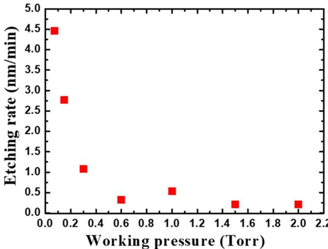
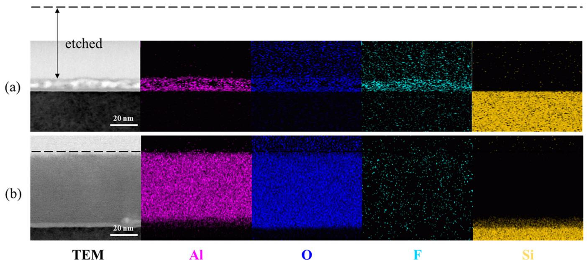
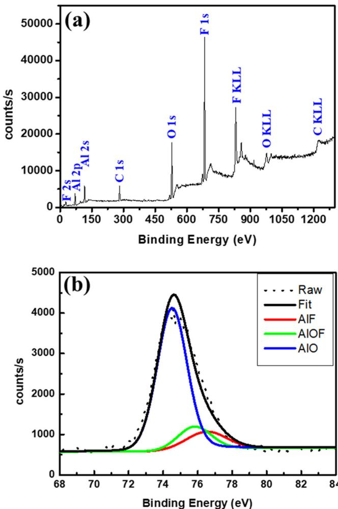
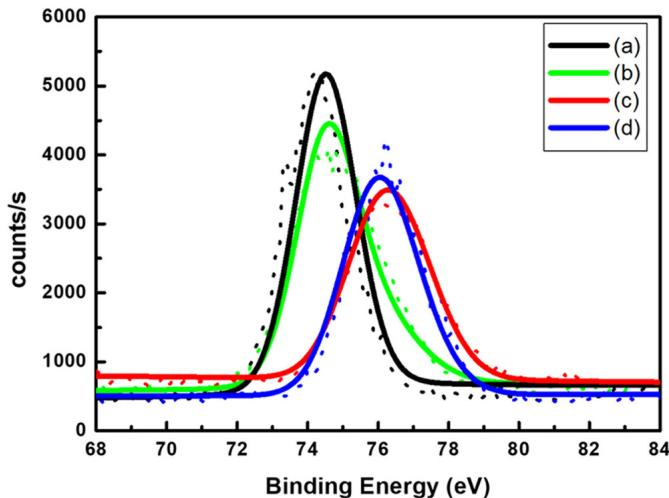
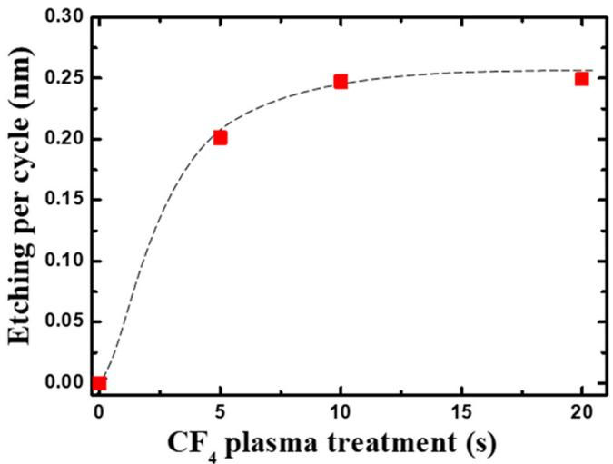
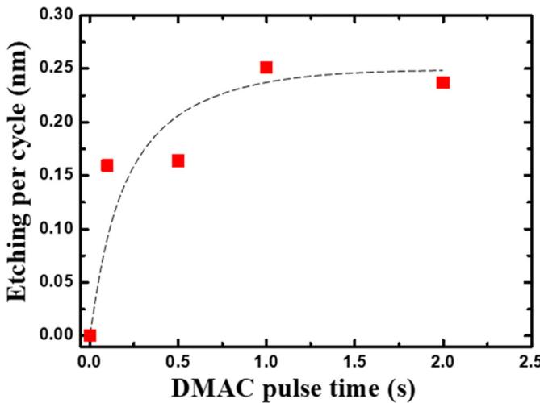
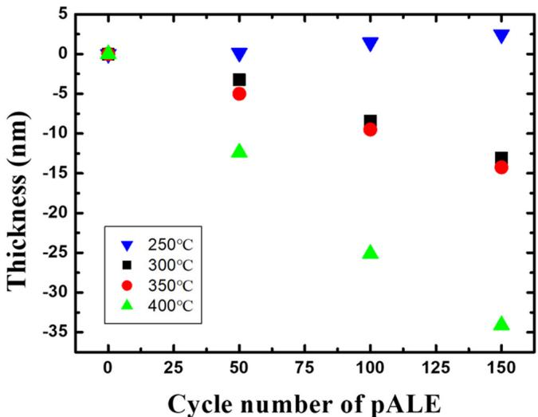
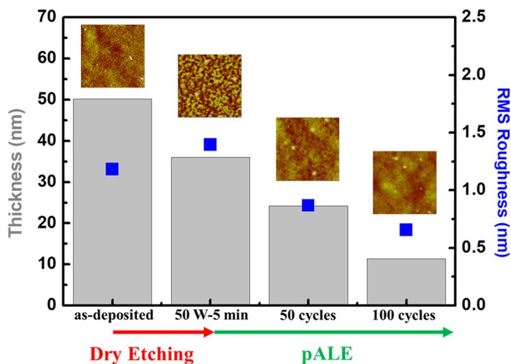
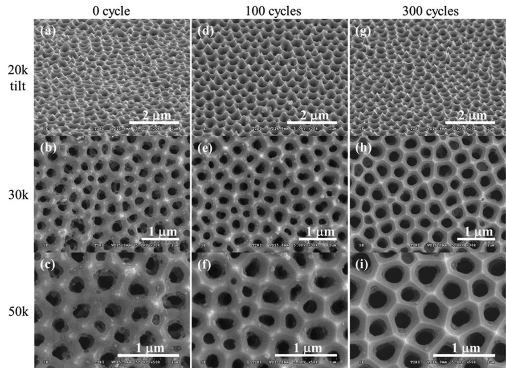
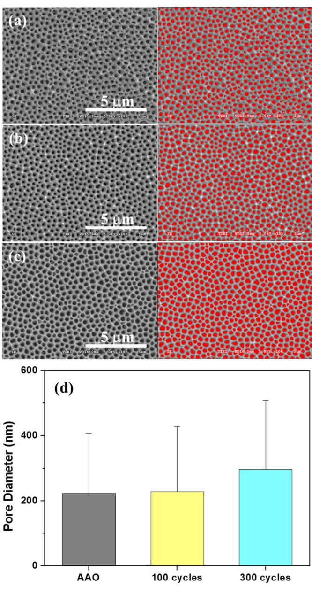

# CF $_4$  plasma-based atomic layer etching of Al $_2$ O $_3$  and surface smoothing effect ©

Special Collection: Atomic Layer Etching (ALE)

Chien- Wei Chen  $\oplus$  ; Wen- Hao Cho; Chan- Yuen Chang  $\oplus$  ; Chien- Ying Su; Nien- Nan Chu; Chi- Chung Kei  $\oplus$  ; Bor- Ran Li  $\oplus$

Check for updates

J. Vac. Sci. Technol. A 41, 012602 (2023) https://doi.org/10.1168/0000210

# Articles You May Be Interested In

Effect of crystallinity on thermal atomic layer etching of hafnium oxide, zirconium oxide, and hafnium zirconium oxide

J. Vac. Sci. Technol. A (February 2020)

Thermal atomic layer etching of amorphous and crystalline Al $_2$ O $_3$  films

J. Vac. Sci. Technol. A (June 2021)

Conductive atomic force microscopy study of silica nanotrench structure

Appl. Phys. Lett. (January 2007)

# $\mathrm{CF}_4$  plasma-based atomic layer etching of  $\mathrm{Al}_2\mathrm{O}_3$  and surface smoothing effect

Cite as: J. Vac. Sci. Technol. A 41, 012602 (2023); doi: 10.1116/6.0002210  Submitted: 8 September 2022 · Accepted: 21 November 2022 · Published Online: 30 December 2022

Chien- Wei Chen, $^{1,2,3}$  Wen- Hao Cho, $^{1}$  Chan- Yuen Chang, $^{1}$  Chien- Ying Su, $^{1}$  Nien- Nan Chu, $^{1}$  Chi- Chung Kei, $^{1,a)}$  and Bor- Ran Li $^{2,3,4,a)}$

# AFFILIATIONS

$^{1}$ Taiwan Instrument Research Institute, National Applied Research Laboratories, Hsinchu 300, Taiwan   $^{2}$ Department of Electrical and Computer Engineering, College of Electrical and Computer Engineering, National Yang Ming Chiao Tung University, Hsinchu 300, Taiwan   $^{3}$ Institute of Biomedical Engineering, College of Electrical and Computer Engineering, National Yang Ming Chiao Tung University, Hsinchu 300, Taiwan   $^{4}$ Center for Emergent Functional Matter Science, National Yang Ming Chiao Tung University, Hsinchu 300, Taiwan

Note: This paper is part of the 2023 Special Topic Collection on Atomic Layer Etching (ALE).   $^{a)}$ Authors to whom correspondence should be addressed: g893552@itrc.narl.org.tw and liborran@nycu.edu.tw

# ABSTRACT

Plasma- based  $\mathrm{Al}_2\mathrm{O}_3$  atomic layer etching (pALE) has a reaction mechanism similar to thermal  $\mathrm{Al}_2\mathrm{O}_3$  ALE (tALE). The main difference between the two methods is that pALE uses plasma instead of HF in tALE to fluorinate  $\mathrm{Al}_2\mathrm{O}_3$  to  $\mathrm{AlF}_3$ . In this study, the  $\mathrm{CF}_4$  plasma source commonly used for dry etching is combined with a self- developed low- ion- bombardment remote  $\mathrm{Al}_2\mathrm{O}_3$  plasma- based ALE system to obtain  $\mathrm{Al}_2\mathrm{O}_3$  plasma fluorination conditions, and then the  $\mathrm{AlCl(CH}_3\mathrm{)}_2$  (dimethylaluminum chloride) precursor is used to develop the pALE  $\mathrm{Al}_2\mathrm{O}_3$  process. In addition to using x- ray photoelectron spectroscopy to investigate ideal fluorination conditions of  $\mathrm{CF}_4$  plasma for  $\mathrm{Al}_2\mathrm{O}_3$  films and establishing the linear etching rate curves of pALE at different process temperatures  $(250 - 400^{\circ}\mathrm{C})$ , we used atomic force microscopy to analyze the surface morphology of the  $\mathrm{Al}_2\mathrm{O}_3$  films after dry etching and pALE. We showed that pALE can smooth  $\mathrm{Al}_2\mathrm{O}_3$  films with a root mean square surface roughness of  $1.396 - 0.655\mathrm{nm}$  and used anodic aluminum oxide substrates with nanotrench structures to demonstrate that pALE can improve the surface roughness of nonplanar structures.

Published under an exclusive license by the AVs. https://doi.org/10.1116/6.0002210

# I. INTRODUCTION

Etching is an essential process in semiconductor wafer fabrication. It is generally classified as wet etching, dry (plasma) etching, or reactive- ion etching (RIE). These techniques can be used depending on the material (e.g., Si, dielectric, or metal), pattern density (leading effect), or etching requirements of the 3D structure (FinFET or GAAFET). Since wet etching is not ideal for structural etching in submicrometer- sized processes, dry etching or RIE is currently the most widely used technique. On the other hand, as the size of components continues to shrink, not only do lithography and thin- film deposition processes require increasing precision and uniformity, but etching processes also face the same challenges. However, when faced with trench structures with  $< 20\mathrm{nm}$  line width and high aspect ratios, dry etching or RIE etching rates that are too fast to control the etched depth precisely or poor selective etching characteristics are the biggest bottleneck for advanced semiconductor processes to overcome the physical limits. To solve these problems, the development of atomic layer etch (ALE) $^{2 - 8}$  could be a possible answer for the next generation of etching technology, similar to the evolution of the lithography process from DUV to EUV or the thin film process from CVD/PVD to atomic layer deposition (ALD). $^{9}$  ALE is an advanced etching technique that is uniform, self- limiting, and allows precise control of etching rates at the angstrom level. Although the theory of ALE was proposed in early 1990, it was not until recently that it was considered a key technology for advancing the new generation of semiconductor devices in order to extend Moore's law that more ALE- related processes and equipment have been developed. Compared to conventional etching methods such as dry etching, ALE has the most

important feature and advantage of flattening the etched film surface in addition to precise etching rate control. Similar to the principle of ALD, ALE can be considered a reverse reaction of ALD and can be divided into two major mechanisms: thermal ALE (tALE) $^{10 - 18}$  and plasma ALE (pALE). The main difference between the two is that the former provides the energy for the thermochemical reaction between the substrate and the precursor by heating, while the latter involves the addition of plasma to the etching reaction. To further explore the pALE mechanism, plasma may play two roles in the pALE reaction. The first is to use plasma as a chemical reaction precursor to modify the material to be etched, $^{19,20}$  while the second is to use inert ions $^{21 - 29}$  as bombarding particles to remove the modified material by precisely controlling the plasma energy. However, the principle of both tALE and pALE is that the surface of the material reacts with the precursor to produce chemical bonding or adsorption so that the surface atomic layer bonds to the underlying atomic layer with less strength than before and becomes easily removable. The tALE  $\mathrm{Al}_2\mathrm{O}_3$  thin film mechanism was proposed by George's group at the University of Colorado, and several studies have been published. $^{30,31}$  HF is used as the fluorination $^{32 - 34}$  medium for the first reaction of converting  $\mathrm{Al}_2\mathrm{O}_3$  to  $\mathrm{AlF}_3$  and trimethylaluminum (TMA), $^{35 - 38}$  dimethyl aluminum chloride (DMAC), $^{39,40}$  or  $\mathrm{Sn(acac)}_{2}^{41}$  is used as a precursor to complete the second reaction of  $\mathrm{AlF}_3$  removal. However, the use of HF as a fluorination precursor requires consideration of the corrosion resistance of equipment valves, chambers, and even pumps to HF vapor, so fluorine- containing plasma may be an alternative reactant that is easier to work with. To investigate whether  $\mathrm{Al}_2\mathrm{O}_3$  etching can be performed in pALE mode in addition to tALE mode, in this study, we confirmed the pALE process window and investigated its reaction mechanism. In addition, the surface smoothing properties of pALE  $\mathrm{Al}_2\mathrm{O}_3$  were verified and compared with dry etching  $\mathrm{Al}_2\mathrm{O}_3$ .

# II. EXPERIMENT

# A.  $\mathrm{Al}_2\mathrm{O}_3$  film preparation

We used a 6- in. thermal ALD equipment (TIRI 6- in. cluster ALD) to deposit the  $\mathrm{Al}_2\mathrm{O}_3$  film on a (100) silicon wafer as a substrate for subsequent etching experiments. The precursors for depositing  $\mathrm{Al}_2\mathrm{O}_3$  films are TMA (PentaPro Materials) and  $\mathrm{H}_2\mathrm{O}$  with  $99.999\%$ $\mathrm{LN}_2$  as the purge gas at  $200^{\circ}\mathrm{C}$ . After  $\mathrm{Al}_2\mathrm{O}_3$  deposition, the film thicknesses at the top, middle, bottom, left, and right of the wafer are measured by spectroscopic ellipsometry (SE), and the nonuniformity (non-  $\mathrm{U}\%$  was lower than  $1\%$ . The 6- in. wafer was then cut into  $2\times 2\mathrm{cm}^3$  pieces, and the thickness of  $\mathrm{Al}_2\mathrm{O}_3$  was measured before and after ALE etching to calculate the etching rate.

# B. Dry etching test

A direct  $\mathrm{CF}_4$  plasma etching experiment was performed in a 2- in. vacuum reactor. The ALD  $\mathrm{Al}_2\mathrm{O}_3$  substrate to be etched is placed into the chamber, and the base pressure is pumped down to  $10\mathrm{mTorr}$ . Then, the  $\mathrm{CF}_4$  flow rate is adjusted into the chamber with the needle valve until the system maintains a stable target operating pressure (0.07- 2Torr). The plasma source was a radio frequency (RF) source  $(13.56\mathrm{MHz})$ . The output power was set to  $50\mathrm{W}$ , and the plasma was applied for 5 or  $10\mathrm{min}$  (reflected power was  $0\mathrm{W}$ ). The film thickness was measured to collect the etching rate at different working pressures, and analyses of the fluorination depth and surface roughness of the film were carried out.

# C. pALE system setup

The pALE reaction is carried out in a 2- in. remote CCP plasma chamber that can be heated to  $400^{\circ}\mathrm{C}$ . Compared with ICP or microwave plasma, the CCP design can effectively reduce the chamber volume. This has the advantages of fast saturation of the precursor in the chamber and shortening the time required to remove residual precursors of the reaction for the pALE process. The experimental substrate is made of a 6- in. Si wafer coated with  $40\mathrm{nm}\mathrm{Al}_2\mathrm{O}_3$  by ALD and then cut into  $1\times 1\mathrm{cm}^2$  coupon pieces. Because of the small volume of the chamber, the precursor (DMAC) used in this experiment takes only approximately  $1\mathrm{s}$  to fill the chamber. Thus, the experiment can be effectively and quickly conducted. The chamber vacuum is pumped to  $10\mathrm{mTorr}$  with an oil pump, and the purge gas is  $\mathrm{LN}_2$ . The purge pressure is maintained at 3 Torr and controlled by a needle valve. The pressure of CF4 plasma is maintained at  $0.5\mathrm{Torr}$  and the RF power of plasma is  $30\mathrm{W}$ .

# D. Elemental composition and surface roughness analysis

Transmission electron microscopy- energy dispersive x- ray spectroscopy (TEM- EDS) and x- ray photoelectron spectroscopy (XPS) were used to analyze the degree of fluorination of the  $\mathrm{Al}_2\mathrm{O}_3$  film. Scanning electron microscopy (SEM) was used to observe the change in the surface morphology of the specimens before and after etching, and atomic force microscopy (AFM) was used to obtain quantitative roughness data (area within  $3\times 3\mu \mathrm{m}^2$ ).

# III. RESULTS AND DISCUSSION

# A.  $\mathrm{CF}_4$  plasma fluorination of  $\mathrm{Al}_2\mathrm{O}_3$

$\mathrm{CF}_4$  plasma is often used in the dry etching process of semiconductor processes such as oxide (e.g.,  $\mathrm{SiO}_2$ ) $^{42}$  and nitride (e.g.,  $\mathrm{Si}_3\mathrm{N}_4$ ) $^{43}$  etching, and  $\mathrm{CF}_4$  plasma directly etches and fluorinates  $\mathrm{Al}_2\mathrm{O}_3$  at a specific power and working pressure. The dry etching mechanism is mainly based on ion bombardment, but etching is less selective, and ion bombardment that is too strong may even cause substrate damage. In this study, we would like to control the effect of  $\mathrm{CF}_4$  plasma only to fluorinate the  $\mathrm{Al}_2\mathrm{O}_3$  surface to  $\mathrm{AlF}_3$  and do not want to damage or etch the film during the plasma fluorination process. Therefore, we analyzed the range of conditions under which  $\mathrm{CF}_4$  plasma fluorinates the surface of  $\mathrm{Al}_2\mathrm{O}_3$  and produces etching at different operating pressures. Figure 1 shows the etching rate of ALD  $\mathrm{Al}_2\mathrm{O}_3$  films at different working pressures with  $30\mathrm{W}$ $\mathrm{CF}_4$  plasma. It is found that the etching rate starts to increase significantly when the working pressure is lower than  $0.4\mathrm{Torr}$  and reaches an etching rate of approximately  $4.5\mathrm{nm / min}$  at  $0.07\mathrm{Torr}$ . Meanwhile, the etching effect decreases significantly when the working pressures are higher than  $0.6\mathrm{Torr}$ , which is a more suitable pressure range for fluorinated  $\mathrm{Al}_2\mathrm{O}_3$ . We also

  
FIG. 1. Etching rate of  $\mathrm{CF_4}$  dry etching for  $\mathrm{Al}_2\mathrm{O}_3$  films at various  $\mathrm{CF_4}$  plasma pressures.

performed the TEM- EDS mapping analysis on  $\mathrm{Al}_2\mathrm{O}_3$  films dry- etched under two kinds of gas pressure conditions (Fig. 2). The results show that after  $10\mathrm{min}$  of etching at 0.07 Torr, an approximately  $44\mathrm{nm}\mathrm{Al}_2\mathrm{O}_3$  film was etched, and the remaining  $7\mathrm{nm}$  film showed a strong F signal. The F signal shown by EDS mapping may come from both fluorinated  $\mathrm{Al}_2\mathrm{O}_3$  and F due to ion bombardment doping (no binding with Al). Our goal is to achieve fluorination of only a very shallow layer of  $\mathrm{Al}_2\mathrm{O}_3$ . In addition, since  $\mathrm{CF_4}$  plasma also etches  $\mathrm{SiO}_2$ , no significant native oxide layer is observed in the TEM. After etching for  $5\mathrm{min}$  at 2 Torr, an approximately  $1\mathrm{nm}\mathrm{Al}_2\mathrm{O}_3$  film is etched, and the remaining film has no significant F signal by TEM- EDS. We then analyzed the Al 2p signal by XPS on this sample (Fig. 3) and could still observe a partial shift from the Al- O (binding energy  $74.5\mathrm{eV}$ ) to the Al- O- F (binding energy  $75.8\mathrm{eV}$ ) and Al- F (binding energy  $76.5\mathrm{eV}$ ) positions in the proportions of  $76.31\%$ ,  $12.46\%$ , and  $11.23\%$ , respectively. In addition, although there is a carbon signal from the sample surface contamination in Fig. 3(a) (see supplementary material for  $\mathrm{Al}_2\mathrm{O}_3$  surface contamination verification), it can be inferred from the C 1s signal that it is almost entirely C- C bonded, so we ignore the possible presence of a very small Al- C ratio in the Al 2p in Fig. 3(b), since we are interested in the degree of fluorination of  $\mathrm{Al}_2\mathrm{O}_3$  here.

# B. pALE  $\mathrm{Al}_2\mathrm{O}_3$

After the previous fluorination experiment confirmed that  $\mathrm{Al}_2\mathrm{O}_3$  can be reformed to  $\mathrm{AlF}_3$  by  $\mathrm{CF_4}$  plasma, to further reduce the direct etching effect of  $\mathrm{CF_4}$  plasma, we transferred the ALE experiment to a remote plasma design chamber. This design is based on the PEALD experience to reduce ion bombardment by increasing the distance between the plasma formation zone and the substrate. We selected 0.6 Torr as the  $\mathrm{CF_4}$  equilibrium working pressure condition with a greater fluorination effect and measured the  $\mathrm{Al}_2\mathrm{O}_3$  film thickness after  $10\mathrm{min}$  of remote  $\mathrm{CF_4}$  plasma treatment at  $50 / 30\mathrm{W}$ . The performance of different types of plasma conditions on the  $\mathrm{Al}_2\mathrm{O}_3$  etching rate was compared (Table I). Unlike  $50\mathrm{W}$  direct dry etching for  $5\mathrm{min}$  at 0.6 and 2 Torr, where approximately 1.7 and  $1\mathrm{nm}$  of  $\mathrm{Al}_2\mathrm{O}_3$  were etched, respectively, the

  
FIG. 2. TEM-EDS element mapping of  $\mathrm{CF_4}$  plasma-treated  $\mathrm{Al}_2\mathrm{O}_3$  film at (a) 0.07 Torr-10 min and at (b) 2 Torr-5 min. Dotted line represents the original  $\mathrm{Al}_2\mathrm{O}_3$  film surface.

  
FIG. 3. XPS spectra (Al anode) of (a) the surface survey and (b) Al 2p narrow scan of 50 W dry etching  $\mathrm{Al}_2\mathrm{O}_3$  at 2 Torr.

thickness of  $\mathrm{Al}_2\mathrm{O}_3$  was identical before and after  $30W$  remote  $\mathrm{CF_4}$  plasma treatment, and the Al 2p XPS spectra and Al- F/Al- O- F/ Al- O ratios of the plasma- treated  $\mathrm{Al}_2\mathrm{O}_3$  film in Fig. 4 and Table I can be obtained by XPS analysis. Compared to the Al 2p peak of the untreated  $\mathrm{Al}_2\mathrm{O}_3$  film, which was composed of  $100\%$  Al- O, the Al- O of the  $50W$  direct plasma treatment at 0.6 Torr was completely converted to  $21.91\%$  Al- O- F and  $78.09\%$  Al- F. The fluorination effect of the  $50W$  direct plasma treatment at 2 Torr was lower, with  $76.31\%$  of the Al- O signal still present, while the  $30W$  remote  $\mathrm{CF_4}$  plasma treatment at 0.6 Torr had a result close to that of the direct plasma treatment at 0.6 Torr, with an Al- O- F/ Al- F ratio of  $47.87\% /52.13\%$ . Taken together, these results show that remote- type plasma at 0.6 Torr has the high efficiency fluorination capability of  $\mathrm{Al}_2\mathrm{O}_3$  without direct etching that pALE requires.

  
FIG. 4. XPS Al 2p narrow scan spectra of (a) nonplasma-treated  $\mathrm{Al}_2\mathrm{O}_3$ , (b) 50 W direct plasma at 2 Torr, (c) 50 W direct plasma at 0.6 Torr, and (d) 30 W remote plasma at 0.6 Torr for 300 s.

After obtaining suitable fluorination parameters for  $\mathrm{CF_4}$  plasma, DMAC can be used to react with  $\mathrm{Al}_2\mathrm{O}_3$  converted  $\mathrm{AlF}_3$  to form volatile  $\mathrm{AlF(CH_3)_2}$  (dimethyl aluminum fluoride, DMAF), and then the purge and pumping system removes the byproduct to achieve a complete pALE reaction. Since the full pALE  $\mathrm{Al}_2\mathrm{O}_3$  reaction consists of two half- reactions, the first half chemical reaction equation can be written as  $2\mathrm{Al}_2\mathrm{O}_3$ $(\mathrm{s}) + 3\mathrm{CF}_4(\mathrm{plasma})\rightarrow 4\mathrm{AlF}_3(\mathrm{s}) + 3\mathrm{CO}_2(\mathrm{g})$ . In the second half reaction, according to the mass spectrometer analysis results described in the literature,  ${}^{45}\mathrm{CH}_3$  ligand transfer is the dominant ligand- exchange reaction between  $\mathrm{AlCl(CH_3)_2}$  (DMAC) and  $\mathrm{AlF}_3$ , and after ligand transfer, molecular ions such as  $\mathrm{Al}_2\mathrm{F(CH}_3\mathrm{)^{4 + }}$  and  $\mathrm{Al}_2\mathrm{FCl(CH}_3\mathrm{)^{3 + }}$  are generated. The corresponding time for each step of pALE are  $\mathrm{CF_4}$  pulse for  $15\mathrm{s}$ , plasma duration for  $10\mathrm{s}$  (30 W RF power applied after  $5\mathrm{s}$  of  $\mathrm{CF_4}$  pulse),  $\mathrm{LN}_2$  purge for  $5\mathrm{s}$  and pump for  $5\mathrm{s}$ , followed by DMAC pulse for  $1\mathrm{s}$ , then close the pumping valve to make DMAC soak for  $1\mathrm{s}$ , and finally  $\mathrm{LN}_2$  purge for  $5\mathrm{s}$  and

TABLE I. Comparison of etching rate and Al-F and Al-O composition of  $\mathrm{Al}_2\mathrm{O}_3$  films with different plasma parameters.  

<table><tr><td>CF4 plasma type</td><td>Power (W)</td><td>Time (s)</td><td>Pressure (Torr)</td><td>Etching rate (nm/min)</td><td>Al-F (%)</td><td>Al-O-F (%)</td><td>Al-O (%)</td></tr><tr><td>Untreated</td><td>0</td><td>0</td><td>N/A</td><td>N/A</td><td>0</td><td>0</td><td>100</td></tr><tr><td rowspan="2">Direct</td><td>50</td><td>300</td><td>0.6</td><td>0.33</td><td>78.09</td><td>21.91</td><td>0</td></tr><tr><td>50</td><td>300</td><td>2</td><td>0.21</td><td>11.23</td><td>12.46</td><td>76.31</td></tr><tr><td>Remote</td><td>30</td><td>300</td><td>0.6</td><td>0</td><td>52.13</td><td>47.87</td><td>0</td></tr></table>

  
FIG. 5. Saturation curve of the  $\mathrm{CF}_4$  plasma dosage.

pump for  $5\mathrm{s}$  to complete one pALE cycle. Later, we established the saturation curves of  $\mathrm{CF}_4$  plasma and DMAC (Figs. 5 and 6) to confirm that the dosage of each precursor reacted with the film surface to reach the self- limiting state to make the ALE reaction in an ideal process window. Note that in the saturation curve of DMAC, the difference in the etching rate between 0.1- and  $0.5 - 5$  pulses is insignificant, probably due to the inability of the computer- controlled diaphragm valve to switch on/off at a speed less than  $0.5\mathrm{s}$ . The relationship between process temperature and ALE rate (Fig. 7) shows that  $\mathrm{Al}_2\mathrm{O}_3$  starts to be etched when the process temperature is higher than  $300^{\circ}\mathrm{C}$ . The ALE rate is proportional to the process temperature, with etching per cycle (EPC) at approximately  $0.08\mathrm{nm}$  cycle number at  $300^{\circ}\mathrm{C}$  and  $0.09\mathrm{nm}$  cycle number at  $350^{\circ}\mathrm{C}$ . At  $400^{\circ}\mathrm{C}$ , the EPC increases significantly to approximately  $0.24\mathrm{nm}$  cycle number. According to the literature, in the reaction of tALE  $\mathrm{Al}_2\mathrm{O}_3$  with HF and TMA, volatile  $\mathrm{AlF(CH}_3\mathrm{)}_2$  can be formed by the ligand- exchange reaction between TMA and HF covering  $\mathrm{Al}_2\mathrm{O}_3$  at high temperature and then removed by pumping. However, at low temperature, too- high coverage of TMA and HF produces  $\mathrm{AlF}_3$  ALD. We also observed an increase in film thickness at a process temperature of  $250^{\circ}\mathrm{C}$ ; this is presumed to be a similar mechanism in the low- temperature pALE reaction. In Table II, we also compare  $\mathrm{CF}_4$ - based pALE with other developed  $\mathrm{Al}_2\mathrm{O}_3$  ALE processes and see that the EPC of plasma- based ALE is higher than thermal- based ALE at the same process temperature because the fluorinated plasma may achieve deeper surface fluorination of  $\mathrm{Al}_2\mathrm{O}_3$  than HF. On the other hand, the EPC in this study is slightly lower compared to that of  $\mathrm{SF}_6$ - based pALE, probably because the plasma power used in their study is  $100\mathrm{W}$ , while only  $30\mathrm{W}$  is used in this study to avoid spontaneous etching, so the surface fluorination depth formed in each ALE cycle is also shallower.

  
FIG. 6. Saturation curve of the DMAC dosage.

  
FIG. 7.  $\mathrm{Al}_2\mathrm{O}_3$  film thickness vs cycle number of pALE for various process temperatures.

TABLE II. Comparison of  $A l_{2}O_{3}$  ALE process.  

<table><tr><td>ALE type</td><td>Surface modification</td><td>Surface removal</td><td>EPC (Å/cycle)</td><td>Process temperature (°C)</td><td>Reference</td></tr><tr><td rowspan="2">Thermal</td><td>HF</td><td>TMA</td><td>0.14/0.45 0.75</td><td>250/300/325</td><td>37 and 38</td></tr><tr><td>HF</td><td>DMAC</td><td>0.32–0.7</td><td>250–300</td><td>37 and 39</td></tr><tr><td rowspan="2">Plasma</td><td>100-W SF6</td><td>TMA</td><td>0.2–3.4</td><td>155–280</td><td>19</td></tr><tr><td>30-W CF4</td><td>DMAC</td><td>0.8–2.4</td><td>300–400</td><td>This work</td></tr></table>

  
FIG. 8. Roughness and thickness change of  $60 \text{nm} \text{Al}_2\text{O}_3$  after 5 min of  $50 \text{W}$  dry etching at 0.06 Torr, 50-cycle pALE at  $400^{\circ}\text{C}$ , and 100-cycle pALE at  $400^{\circ}\text{C}$ .

  
FIG. 9. Surface images of the AAO substrate (a)–(c) intrinsic, (d)–(f) after 100 cycles pALE, and (g)–(i) after 300 cycles pALE.

# C.Surface roughness smoothing effect

C. Surface roughness smoothing effectIt has been noted that the ALE process maintains better surface roughness and even smoothes the surface of Ru and Si compared to the RIE process, $^{47}$  so we would like to know whether this property is also present in pALE  $\mathrm{Al}_2\mathrm{O}_3$ . First, we took an AFM comparison of an ALD-deposited  $\mathrm{Al}_2\mathrm{O}_3$  film before and after 100 cycles of pALE treatment and the root mean square (RMS)/Ra

  
FIG.10. Pore area analysis of the AAO substrate (a) intrinsic, (b) 100 cycles pALE, (c) 300 cycles pALE by ImageJ, and (d) comparison of pore diameter after pALE.

changed from  $0.310 / 0.243$  to  $0.295 / 0.235\mathrm{nm}$  which means that the original surface roughness was maintained after pALE or was even slightly improved. To further observe the smoothing effect of pALE,  $\mathrm{Al}_2\mathrm{O}_3$  films with a rougher surface were prepared by electron beam evaporation, followed by dry etching  $(50\mathrm{W} - 5\mathrm{min})$  the first 50 cycles of pALE (at  $400^{\circ}\mathrm{C})$  and the second 50 cycles of pALE treatments, and roughness information over a scanning area of  $3\times 3\mu \mathrm{m}^2$  was collected by AFM after each etching step. The thickness of the  $\mathrm{Al}_2\mathrm{O}_3$  film decreased by approximately  $14\mathrm{nm}$  and the RMS/Ra increased from  $1.182 / 0.84$  to  $1.306 / 1.111\mathrm{nm}$  after dry etching. (RMS is more sensitive to single large peaks such as particles or defects when analyzing rough surfaces.) Then, the thickness of the film was reduced by approximately  $12\mathrm{nm}$  and the RMS/Ra decreased to  $0.867 / 0.613\mathrm{nm}$  and continued to decrease to  $0.655/$ $0.491\mathrm{nm}$  after 50 cycles and a further 50 cycles of pALE. The relationship between thickness and roughness after etching is shown in Fig. 8, and the above experiments demonstrate the obvious smoothing effect of pALE  $\mathrm{Al}_2\mathrm{O}_3$  In addition, we performed 100 and 200 cycles of pALE on AAO substrates (ViciaBio, average pore diameter  $200\mathrm{nm}$  pitch  $450\mathrm{nm}$  with nanotrench structures and observed surface morphology changes after etching by SEM. Figure 9 shows surface morphology of the original AAO substrate after 100 and  $200\mathrm{pALE}$  cycles. As the cycle number of ALE etching increases, it can be observed that apart from the longer pore diameter, the inner wall of the pores is etched, and the surface around the pores gradually becomes smoother. Notably, the hexagonal structure48- 50 is more clearly visible in the pALE- etched AAO. We used ImageJ software to assist in the quantitative analysis of pore size variation by converting the SEM image to a eight- bit format and then setting the scale according to the SEM information. We adjusted the threshold so that the red block covers the hole area so that we can calculate the hole area [Figs. 10(a)- 10(c)]. Then, we calculated the average hole diameter and standard deviation from the hole area obtained by ImageJ. The average pore diameter of AAO was  $222.3\mathrm{nm}$  which increased to  $227.7\mathrm{nm}$  after 100 cycles of pALE and  $296.4\mathrm{nm}$  after 300 cycles of etching [Fig. 10(d)]. In addition, there is a tendency to change the shape of the red blocks from irregular to round as the number of etched cycles increases.

# IV.CONCLUSIONS

IV. CONCLUSIONSIn this study, we successfully developed a pALE  $\mathrm{Al}_2\mathrm{O}_3$  process with precise control of the etching rate. Compared with the tALE approach,  $\mathrm{CF}_4$  plasma is easier to use than HF for general vacuum equipment that has not been subjected to anticorrosion treatment. On the other hand, pALE not only achieves an angstrom level of etching accuracy compared to the  $\mathrm{Al}_2\mathrm{O}_3$  dry etching process using  $\mathrm{CF}_4$  but also avoids the increase in surface roughness caused by the ion bombardment effect and even has the property of smoothing the original rough  $\mathrm{Al}_2\mathrm{O}_3$  surface. In addition to the  $\mathrm{Al}_2\mathrm{O}_3$  pALE demonstrated in this work, it has been pointed out in the literature that other oxide films (e.g.,  $\mathrm{ZnO}$  and  $\mathrm{Y}_2\mathrm{O}_3$ ) can be fluorinated by  $\mathrm{CF}_4$  plasma, $^{51,52}$  which means that there is a good chance to develop the pALE process for this material by a similar mechanism as this study. Today's semiconductor processes have entered the sub-10 nm world, and most of the key process emphasis is no longer on speed but on accuracy and uniformity. In this view, the

slow yield of the atomic level process is no longer regarded as a drawback. Instead, ALE can achieve uniform etch results on nonplanar or nanostructures and improve etch roughness, which has a key impact on subsequent processes and even device characteristics. Therefore, it is expected that ALE will gradually increase its importance in etching technology, similar to the development of ALD. In the future, ALE could be used in conjunction with ALD technology to improve the film deposition/etching selection ratio and further enhance the structural homogeneity to improve the performance and yield of devices. This has high development potential and application value.

# ACKNOWLEDGMENTS

The authors thank all co- workers in the NARLABS TIRI ALD group who contributed to the understanding of ALD/ALE equipment and process. The authors also thank MSSCORPS CO., LTD for the technical support of the TEM- EDS analysis. This study was financially supported by the Ministry of Science and Technology (No. MOST 111- 2221- E- AA49- 026) of Taiwan, the Center for Emergent Functional Matter Science of National Yang Ming Chiao Tung University, Featured Areas Research Center Program, within the framework of the Higher Education Sprout Project of the Ministry of Education (MoDE) in Taiwan, and Taiwan Instrument Research Institute, NARLabs.

# AUTHOR DECLARATIONS

# Conflict of Interest

The authors have no conflicts to disclose.

# Author Contributions

Chien- Wei Chen: Conceptualization (equal); Data curation (equal); Formal analysis (equal); Methodology (equal); Writing - original draft (equal). Wen- Hao Cho: Formal analysis (equal); Resources (equal). Chan- Yuen Chang: Formal analysis (equal); Resources (equal). Chien- Ying Su: Formal analysis (equal); Resources (equal). Nien- Nan Chu: Formal analysis (equal); Resources (equal). Chi- Chung Kei: Formal analysis (equal); Resources (equal). Bor- Ran Li: Funding acquisition (equal); Resources (equal); Supervision (equal); Writing - review & editing (equal).

# DATA AVAILABILITY

The data that support the findings of this study are available from the corresponding authors upon reasonable request.

# REFERENCES

1J. K. Kang and C. B. Musgrave, J. Chem. Phys. 116, 275 (2002). 2G. S. Oehrlein, D. Metzler, and C. Li, ECS J. Solid State Sci. Technol. 4, N5041 (2015). 3C. T. Carver, J. J. Plombon, P. E. Romero, S. Suri, T. A. Tronic, and R. B. Turkot, Jr., ECS J. Solid State Sci. Technol. 4, N5005 (2015). 4T. Faraz, F. Roozeboom, H. C. M. Knoops, and W. M. M. Kessels, ECS J. Solid State Sci. Technol. 4, N5023 (2015). 5K. J. Kanarik, T. Lill, E. A. Hudson, S. Sriraman, S. Tan, J. Marks, V. Vahedi, and R. A. Gottscho, J. Vac. Sci. Technol. A 33, 020802 (2015).

6C. Fang, Y. Cao, D. Wu, and A. Li, Prog. Nat. Sci. 28, 667 (2018). 7J. Hennessy, J. Vac. Sci. Technol. A 35, 041512 (2017). 8E. Sortino, J. P. Houlton, J. C. Gertsch, O. D. Supekar, G. D. Skidmore, S. M. George, C. T. Rogers, and V. M. Bright, 2019 20th International Conference on Solid- State Sensors, Berlin Germany, 23- 27 June 2019 (IEEE, New York, 2019), pp. 2404- 2407. 9N. M. George, Chem. Rev. 110, 111 (2010). 10N. R. Johnson, H. X. Sun, K. Sharma, and S. M. George, J. Vac. Sci. Technol. A 34, 050603 (2016). 11N. R. Johnson, J. K. Hite, M. A. Mastro, C. R. Eddy, and S. M. George, Appl. Chem. J. 114, 241103 (2019). 12Y. Lee and S. M. George, J. Vac. Sci. Technol. A 36, 061504 (2018). 13J. W. DuMont, A. E. Marquardt, A. M. Cano, and S. M. George, ACS Appl. Mater. Interfaces 9, 10296 (2017). 14Y. Lee and S. M. George, Chem. Mater. 29, 8202 (2017). 15D. R. Zywotko and S. M. George, Chem. Mater. 29, 1183 (2017). 16N. R. Johnson and S. M. George, ACS Appl. Mater. Interfaces 9, 34435 (2017). 17V. Sharma, S. D. Elliott, T. Blomberg, S. Haukkka, M. E. Givens, M. Tuominen, and M. Ritala, Chem. Mater. 33, 2883 (2021). 18S. K. Natarajan and S. D. Elliott, Chem. Mater. 30, 5912 (2018). 19N. J. Chittock, M. F. J. Vos, T. Faraz, W. M. M. Kessels, H. C. M. Knoops, and A. J. M. Mackus, Appl. Phys. Lett. 117, 162107 (2020). 20J. C. Gertsch, A. M. Cano, V. M. Bright, and S. M. George, Chem. Mater. 31, 3624 (2019). 21W. S. Lim, S. D. Park, B. J. Park, and G. Y. Yeom, Surf. Coat. Technol. 202, 5701 (2008). 22J. B. Park, W. S. Lim, B. J. Park, I. H. Park, Y. W. Kim, and G. Y. Yeom, Phys. D: Appl. Phys. 42, 055202 (2009). 23T. Sugiyama, T. Matsuura, and J. Murota, Appl. Surf. Sci. 112, 187 (1997). 24T. Z. Lin et al., ACS Appl. Mater. Interfaces. 7, 15892 (2015). 25E. Vogli, D. Metzler, and G. S. Oehrlein, Appl. Phys. Lett. 102, 253105 (2013). 26V. Metzler, R. L. Bruce, S. Engelmann, E. A. Joseph, and G. S. Oehrlein, J. Vac. Sci. Technol. A 32, 020603 (2014). 27D. Metzler, C. Li, S. Engelmann, R. L. Bruce, E. A. Joseph, and G. S. Oehrlein, J. Vac. Sci. Technol. A 34, 01B101 (2016). 28C. Li, D. Metzler, C. S. Lai, E. A. Hudson, and G. S. Oehrlein, J. Vac. Sci. Technol. A 34, 041307 (2016). 29A. Agarwal and M. J. Kushner, J. Vac. Sci. Technol. A 27, 37 (2009). 30Y. Lee, J. W. DuMont, A. S. Cavanagh, and S. M. George, J. Phys. Chem. C 119, 14185 (2015). 31Y. Lee and S. M. George, ACS Nano 9, 2061 (2015). 32J. L. Quan, B. T. Teng, X. D. Wen, Y. Zhao, R. Liu, and M. F. Luo, J. Chem. Phys. 136, 114701 (2012). 33J. Wirth, J. Schacht, P. Saalfrank, and B. Paulus, J. Phys. Chem. C 120, 9713 (2016). 34C. L. Bailey, S. Mukhopadhyay, A. Wander, B. G. Searle, and N. M. Harrison, J. Phys. Chem. C 113, 4976 (2009). 35A. M. Cano, A. E. Marquardt, J. W. DuMont, and S. M. George, J. Phys. Chem. C 123, 10346 (2019). 36D. R. Zywotko, J. Faguet, and S. M. George, J. Vac. Sci. Technol. A 36, 061508 (2018). 37Y. Lee, C. Huffman, and S. M. George, Chem. Mater. 28, 7657 (2016). 38Y. Lee, J. W. DuMont, and S. M. George, Chem. Mater. 28, 2994 (2016). 39S. M. George, Acc. Chem. Res. 53, 1151 (2020). 40A. Fischer, A. Routzahn, Y. Lee, T. Lill, and S. M. George, J. Vac. Sci. Technol. A 38, 022603 (2020). 41Y. Lee, J. W. DuMont, and S. M. George, Chem. Mater. 27, 3648 (2015). 42D. C. Marra and E. S. Aydil, J. Vac. Sci. Technol. A 15, 2508 (1997). 43B. E. E. Kastenmeier, P. J. Matsuo, J. J. Beulens, and G. S. Oehrlein, J. Vac. Sci. Technol. A 15, 2508 (1997). 44R. Ramos, G. Cunge, B. Pelissier, and O. Joubert, Plasma Sources Sci. Technol. 16, 711 (2007). 45J. W. Clancey, A. S. Cavanagh, J. E. T. Smith, S. Sharma, and S. M. George, J. Phys. Chem. C 124, 287 (2020).

46J. W. DuMont and S. M. George, J. Chem. Phys. 146, 052819 (2017). 47K. J. Kanarik, S. Tan, and R. A. Gottscho, J. Phys. Chem. Lett. 9, 4814 (2018). 48V. M. Prida et al., Nanoscale Res. Lett. 8, 263 (2013). 49L. Foley, W. Park, M. Yang, E. Carlson, E. Korblova, D. K. Yoon, and D. M. Walba, Chem. Eur. J. 25, 7438 (2019). 50S. Zhao, K. Chan, A. Yelon, and T. Veres, Adv. Mater. 19, 3004 (2007).

51T. H. Huang, P. K. Yang, D. H. Lien, C. F. Kang, M. L. Tsai, Y. L. Chueh, and J. H. He, Sci. Rep. 4, 4402 (2014). 52K. Miwa, N. Takada, and K. Sasaki, J. Vac. Sci. Technol. A 27, 831 (2009). 53See supplementary material at https://www.scitation.org/doi/suppl/10.1116/ s0002210 for  $\mathrm{Al}_2\mathrm{O}_3$  surface contamination verification.