# REGULAR PAPER

# You may also like

# Cyclic  $C_4F_8$  and  $O_2$  plasma etching of  $\mathrm{TiO}_2$  for high-aspect-ratio three-dimensional devices

- Experimental and theoretical study of RF capacitively coupled plasma in Ar-CF4-CF4 mixtures  O V Proshina, T V Rakhimova, D V Lopaev et al.

To cite this article: Tsubasa Imamura et al 2021 Jpn. J. Appl. Phys. 60 036001

- Flexible Polyaniline/Reduced Graphene Oxide/Carbon Fibers Composites Applied As Electrodes for Supercapacitors  David Arves and Antonio André Ferreira  Sardinha and Neidenei Gomes Ferreira

View the article online for updates and enhancements.

- Growth of Fluorocarbon Macromolecules in the Gas Phase: II. The Growth Mechanisms of Large Positive Ions Observed in the Downstream Region of Ar/CF4 Plasmas  Kenji Furuya, Shinobu Yukita and Akira Harata

This content was downloaded from IP address 131.155.24.31 on 18/07/2023 at 12:45

# Cyclic  $\mathbf{C}_4\mathbf{F}_8$  and  $\mathbf{O}_2$  plasma etching of  $\mathbf{TiO}_2$  for high-aspect-ratio three-dimensional devices

Tsubasa Imamura $^{1,2}$ , Itsuko Sakai $^{1*}$ , Hisataka Hayashi $^{1}$ , Makoto Sekine $^{2}$ , and Masaru Hori $^{2}$

$^{1}$ Process Technology Research & Development Center, Kioxia Corporation, Yokkaichi, Mie 512- 8550, Japan  $^{2}$ Center for Low- temperature Plasma Sciences, Nagoya University, Nagoya 464- 8603, Japan

$^{*}$ E- mail: tsubasa.imamura@kioxia.com

Received November 19, 2020; revised January 7, 2021; accepted January 25, 2021; published online February 12, 2021

The present study investigates the cyclic etching of  $\mathsf{TiO}_2$  with CF polymer deposition and removal. We find that  $\mathsf{C}_4\mathsf{F}_8$  plasma treatment forms a CF polymer deposition layer on the  $\mathsf{TiO}_2$  and a modified  $\mathsf{TiO}_2$  surface under the CF polymer layer. Subsequent  $\mathsf{C}_2$  plasma treatment removes the CF polymer and the modified layer at the same time. This sequence is repeated. Accordingly, the  $\mathsf{TiO}_2$  film is etched at a rate of  $0.67~\mathsf{nm}$  per cycle. The CF polymer and modified  $\mathsf{TiO}_2$  layer also form on the sidewall  $\mathsf{TiO}_2$  surface of a trench pattern. We realize the isotropic  $\mathsf{TiO}_2$  etching of a trench pattern having a high aspect ratio exceeding 40 adopting the cyclic  $\mathsf{C}_4\mathsf{F}_8$  and  $\mathsf{O}_2$  plasma process.  $\mathbb{Q}$  2021 The Japan Society of Applied Physics

# 1. Introduction

Flash memory devices have changed from planar to threedimensional (3D) structures, comprising vertically stacked memory cells that require the formation of small and highaspect- ratio spaces, to meet market demands for increased storage capacity. In general, 3D flash memory has a plurality of holes formed by alternating layers of conducting and insulating materials. The conducting layers act as control gates. Memory cells form on the sidewalls of holes. A memory cell usually comprises a  $\mathrm{SiO}_2$  layer,  $\mathrm{Si}_3\mathrm{N}_4$  layer, and another  $\mathrm{SiO}_2$  layer as a gate dielectric, a charge trap layer, and a tunnel dielectric layer. These memory cell layers do not require insulation between control gates. However, some types of 3D memory require the insulation of memory cells. Such types of 3D memory require the recession of conducting materials after holes are formed for this purpose. Memory cell films are then deposited along the recessed regions and the sidewalls, and predetermined portions of the films are removed to provide insulation through isotropic etching.1- 4) A challenging requirement of 3D memory devices is to control the amount of etching of these films precisely. Moreover, the most difficult aspect of this process is that the amount of etching needs to be uniform from the top to the bottom of the high- aspect- ratio pattern. The memory cell films comprise various materials, such as W, TiN,  $\mathrm{Al}_2\mathrm{O}_3$ $\mathrm{HfO}_2$ $\mathrm{ZrO}_2$ $\mathrm{TiO}_2$  Si,  $\mathrm{Si}_3\mathrm{N}_4$  and  $\mathrm{SiO}_2$  5.

Several studies have investigated isotropic atomic layer etching (ALE) to meet the demand for increased storage capacity in recent years.6- 25) These studies can be classified as those on wet ALE and those on thermal ALE. Yin et al. demonstrated isotropic SiGe etching adopting wet solution oxidation.7 However, the wet process faces the problem of pattern collapse.8) Thermal ALE, called ligand exchange,9- 13) and conversion etching14- 17) have been employed for metal oxide materials; e.g.  $\mathrm{Al}_2\mathrm{O}_3$ $\mathrm{HfO}_2$ $\mathrm{ZnO}_2$ $\mathrm{ZnO}$ $\mathrm{WO}_3$ $\mathrm{TiO}_2$  GaN, and  $\mathrm{SiO}_2$  .These processes are the reverse of atomic layer deposition, which requires a high temperature exceeding  $150^{\circ}\mathrm{C}$  and a metal coreagent such as trimethylaluminum, tin acetylacetone, dimethylaluminum chloride, or silicon tetrachloride. Izawa's group reported the thermal ALE of  $\mathrm{Si}_3\mathrm{N}_4$  using the formation and desorption of ammonium fluorosilicate.18- 20) They used fluorocarbon radicals to form ammonium fluorosilicate on a  $\mathrm{Si}_3\mathrm{N}_4$  surface at room temperature and then desorbed the ammonium fluorosilicate at a temperature exceeding  $100^{\circ}\mathrm{C}$  This requires a cycle of wafer cooling and annealing, and they thus developed a special  $300\mathrm{mm}$  tool with an infrared lamp for rapid cycling.19) In addition, the high- temperature process adopted in thermal ALE can degrade the device performance. A lowtemperature process that can be realized preferentially with a conventional tool is thus needed.

In this paper, we report on an isotropic cycle etching of  $\mathrm{TiO}_2$  that can be realized at a low temperature of  $60^{\circ}\mathrm{C}$  using a conventional capacitively coupled plasma (CCP) reactive ion etching (RIE) tool. We suggest the mechanism of cycle etching and demonstrate the sidewall  $\mathrm{TiO}_2$  etching of a trench pattern with a high aspect ratio of more than 40.

# 2. Experimental methods

A  $10\mathrm{nm}$  thick amorphous  $\mathrm{TiO}_2$  blanket film was deposited on a  $300\mathrm{mm}$  Si wafer through atomic layer deposition. We used tetrakis dimethylamino titanium and  $\mathrm{O}_3$  as a precursor and oxidant, respectively. The process temperature of the atomic layer deposition was  $200^{\circ}\mathrm{C}$ . In addition to the blanket sample, we used two types of patterned sample having different aspect ratios. One was a  $\mathrm{SiO}_2$  line and space pattern with an aspect ratio 16.5. The  $330\mathrm{nm}$  thick  $\mathrm{SiO}_2$  was deposited on  $30\mathrm{nm}$  thick  $\mathrm{Si}_3\mathrm{N}_4$  and etched through RIE. We used spin- on- coat polymer film as the  $\mathrm{SiO}_2$  etching mask of the line and space pattern with a half- pitch of  $40\mathrm{nm}$ . After the  $\mathrm{SiO}_2$  etching, the spin- on- coat film was removed through ashing. A  $10\mathrm{nm}$  thick layer of  $\mathrm{TiO}_2$  was then deposited. The space after  $\mathrm{TiO}_2$  deposition was  $20\mathrm{nm}$ . The other sample was a  $\mathrm{SiO}_2$  trench pattern with an aspect ratio of 46. The  $3500\mathrm{nm}$  thick  $\mathrm{SiO}_2$  was deposited on a Si substrate and etched through RIE. We used amorphous carbon film with a slit width of  $100\mathrm{nm}$  as the mask of the trench pattern. The carbon layer was removed after  $\mathrm{SiO}_2$  RIE. A  $10\mathrm{nm}$  thick layer of  $\mathrm{TiO}_2$  was deposited and the space after the deposition was  $80\mathrm{nm}$ . Etching experiments were carried out using a CCP RIE system (Tokyo Electron, Vesta- RBH). Radiofrequency  $(100\mathrm{MHz})$  power was applied to the substrate to induce plasma. Conditions to which the  $\mathrm{TiO}_2$  film was exposed are listed in Table I. Ellipsometry was adopted to measure the thickness of the  $\mathrm{TiO}_2$  blanket film and the etched amount of film was calculated from the thickness before and after the plasma treatments. Transmission electron

Table I.Plasma exposure conditions of  $\mathrm{TiO_2}$  samples.  

<table><tr><td></td><td>CF4 plasma</td><td>C4F8 plasma</td><td>O2 plasma</td></tr><tr><td>Pressure (Pa)</td><td>1.3</td><td>1.3</td><td>13.3</td></tr><tr><td>Gas</td><td>CF4</td><td>C4F8</td><td>O2</td></tr><tr><td>Gas flow rate (sccm)</td><td>100</td><td>100</td><td>300</td></tr><tr><td>100 MHz RF power (W)</td><td>1000</td><td>1000</td><td>1000</td></tr><tr><td>Stage temperature (°C)</td><td>60</td><td>60</td><td>60</td></tr></table>

microscopy (TEM) was adopted to measure the sidewall  $\mathrm{TiO_2}$  film thickness of the pattern samples. We also adopted X- ray photoelectron spectroscopy (XPS) to investigate the bonding states of the blanket film surface and energy dispersive X- ray spectroscopy (EDX) to analyze the atomic composition of the sidewall film of the pattern samples.

# 3.Results and discussion

# 3.1.  $\mathbf{TiO}_2$  etching with  $\mathbf{CF}_4$  plasma

Figure 1 shows the amount of etching of the  $\mathrm{TiO_2}$  blanket film with  $\mathrm{CF_4}$  plasma. The plasma conditions were pressure of  $1.3\mathrm{Pa}$ $100\mathrm{MHz}$  radio- frequency power of  $1000\mathrm{W}$  a  $\mathrm{CF_4}$  gas flow rate of  $100\mathrm{~sccm}$  and a substrate temperature of  $60^{\circ}\mathrm{C}$  The etched amount increased linearly with the treatment time as expected and the etching rate was  $12.5\mathrm{nm}\mathrm{min}^{- 1}$  .We next confirm the amount of etching of the sidewall  $\mathrm{TiO_2}$  film. Figure 2(a) shows the cross- sectional TEM image of the line and space patterned sample with an aspect ratio of 16.5. Figure 2(b) shows the cross- sectional TEM image after  $\mathrm{CF_4}$  plasma treatment for  $30\mathrm{s}$  .The depth dependence of the sidewall  $\mathrm{TiO_2}$  film thickness before and after the  $\mathrm{CF_4}$  plasma treatment and the etched amount are plotted in Fig. 3. The depth is defined as being from the top of the pristine pattern. The deposited  $\mathrm{TiO_2}$  film thickness varies from  $10.1\mathrm{nm}$  at a depth of  $40\mathrm{nm}$  to  $9.8\mathrm{nm}$  at a depth of  $300\mathrm{nm}$  .The remaining  $\mathrm{TiO_2}$  film thickness after the plasma treatment increased from  $7.5\mathrm{nm}$  at  $40\mathrm{nm}$  to  $8.3\mathrm{nm}$  at  $300\mathrm{nm}$  . The etched amount therefore decreased from  $2.6\mathrm{nm}$  at  $40\mathrm{nm}$  to  $1.5\mathrm{nm}$  at  $300\mathrm{nm}$  .Woo et al. showed the mechanism of the etching of  $\mathrm{TiO_2}$  film with  $\mathrm{CF_4}$  plasma.26) They mentioned that the  $\mathrm{TiO_2}$  film reacted with  $\mathrm{F}$  radicals from the  $\mathrm{CF_4}$  plasma because the Ti- F chemical bond is stronger than the Ti- O bond, and  $\mathrm{TiF_4}$  formed on the surface as a byproduct. The  $\mathrm{TiF_4}$  was removed by ion bombardment. We believe that the amount of  $\mathrm{F}$  radical decreased from the top of the pattern to the bottom because the radicals having diffused from the plasma were consumed on the sidewall. This caused the dependence of the etched amount on the pattern depth, or aspect ratio. Therefore, to suppress this dependence, we considered it important to supply the same amount of  $\mathrm{F}$  radicals regardless of the aspect ratio, and one method would be to use the CF polymer formed on the  $\mathrm{TiO_2}$  surface. We supposed the same amount of  $\mathrm{F}$  radical could be provided from the CF polymer from top to bottom of the hole when etching with  $\mathrm{O_2}$  plasma. In this study, we used  $\mathrm{C_4F_8}$  plasma to form the CF polymer.

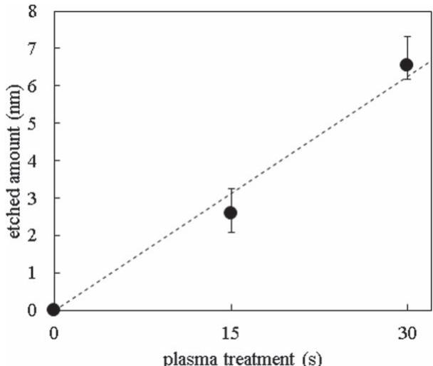  
Fig.1. Etched amount of the blanket  $\mathrm{TiO_2}$  as a function of the  $\mathrm{CF_4}$  plasma treatment time (30 and 60 s).

# 3.2. Blanket  $\mathbf{TiO}_2$  etching with cyclic  $\mathbf{C}_4\mathbf{F}_8$  and  $\mathbf{O}_2$  plasma

First, blanket  $\mathrm{TiO_2}$  etching was carried out with cyclic  $\mathrm{C_4F_8}$  and  $\mathrm{O_2}$  plasma processing. Figure 4 shows the cyclic number dependence of blanket  $\mathrm{TiO_2}$  etching with cyclic  $\mathrm{C_4F_8}$  and  $\mathrm{O_2}$  plasma. Both treatment times were  $30\mathrm{s}$  .The etched amount increased linearly with the number of cycles. The  $\mathrm{TiO_2}$  etched amount per cycle was  $0.71\mathrm{nm}$  /cycle. We also confirmed the  $\mathrm{O_2}$  plasma did not etch the  $\mathrm{TiO_2}$  film. This result supports that  $\mathrm{F}$  radicals from the CF polymer etched  $\mathrm{TiO_2}$  We next confirm the dependence of the  $\mathrm{TiO_2}$  etched amount on the CF polymer thickness. We first measured CF polymer thicknesses for different  $\mathrm{C_4F_8}$  plasma treatment times from cross- sectional SEM images. Figure 5 shows that the thickness increased linearly with the treatment time. We then measured the  $\mathrm{TiO_2}$  etched amounts for the different CF polymer thicknesses. The  $\mathrm{TiO_2}$  etched amounts were 0.74 and  $0.80\mathrm{nm}$  when the CF polymer thicknesses were 13.6 and  $27.6\mathrm{nm}$  , respectively. The  $\mathrm{O_2}$  plasma treatment time was  $30\mathrm{s}$  and there was one cycle. These results indicate that the  $\mathrm{TiO_2}$  etched amount was constant even if the thickness of the CF polymer formed on the film surface was different. We next analyze cross- sectional images after taken each step to investigate whether  $\mathrm{TiO_2}$  etching is constant regardless of the CF polymer thickness.

Figure 6 shows TEM images as the  $\mathrm{TiO_2}$  was deposited [Fig.6(a)], after  $\mathrm{C_4F_8}$  plasma treatment [Fig. 6(b)], and after  $\mathrm{O_2}$  plasma treatment [Fig. 6(c)]. Both plasma treatment times were  $30\mathrm{s}$  .The  $\mathrm{TiO_2}$  thickness increased from  $10.1\mathrm{nm}$  as  $\mathrm{TiO_2}$  was deposited to  $10.5\mathrm{nm}$  after  $\mathrm{C_4F_8}$  plasma treatment, and then decreased to  $0.4\mathrm{nm}$  after  $\mathrm{O_2}$  plasma treatment. This means that  $\mathrm{TiO_2}$  was not etched by  $\mathrm{C_4F_8}$  plasma but etched by  $\mathrm{O_2}$  plasma. The sample after  $\mathrm{C_4F_8}$  plasma treatment [Fig. 6(b)] shows that there was a modified layer between the CF polymer and  $\mathrm{TiO_2}$  surface. The modified layer was removed with  $\mathrm{O_2}$  plasma treatment [Fig. 6(c)]. Figure 7 shows the TEM images after  $\mathrm{C_4F_8}$  plasma treatment for  $30\mathrm{s}$  [Fig. 7(a)] and  $60\mathrm{s}$  [Fig. 7(b)]. The thickness of the modified layer after  $60\mathrm{s}$  was the same as that after  $30\mathrm{s}$  although the CF polymer after  $60\mathrm{s}$  was thicker than that after  $30\mathrm{s}$  .This shows that the modified layer thickness is constant regardless of the CF polymer thickness. We speculate that the  $\mathrm{TiO_2}$  surface is modified by CF radicals with ion bombardment and not with thermal energy from the stage. However, the thick CF polymer protects the surface from ions. Therefore, the modified layer is kept constant, although the CF polymer thickness increases. As a result, the  $\mathrm{TiO_2}$  etched amount is constant even if the CF polymer thickness changes. We then

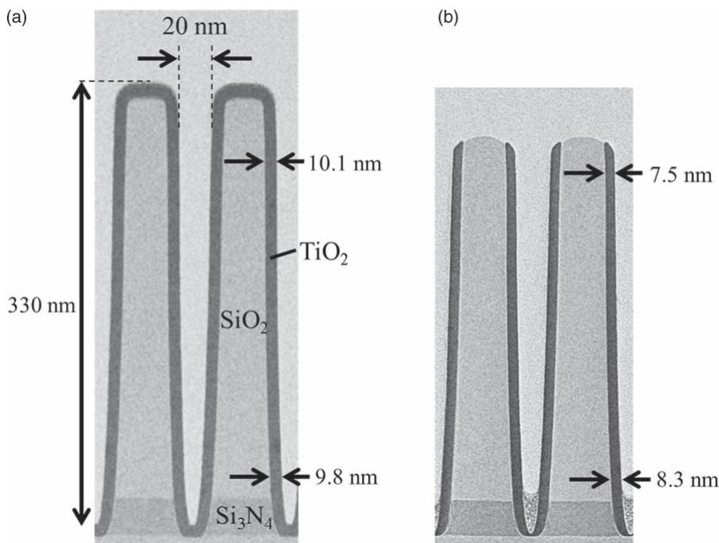  
Fig. 2. Cross-sectional TEM images: (a) as deposited and (b) after  $\mathrm{CF_4}$  plasma treatment for  $30~\mathrm{s}$ .

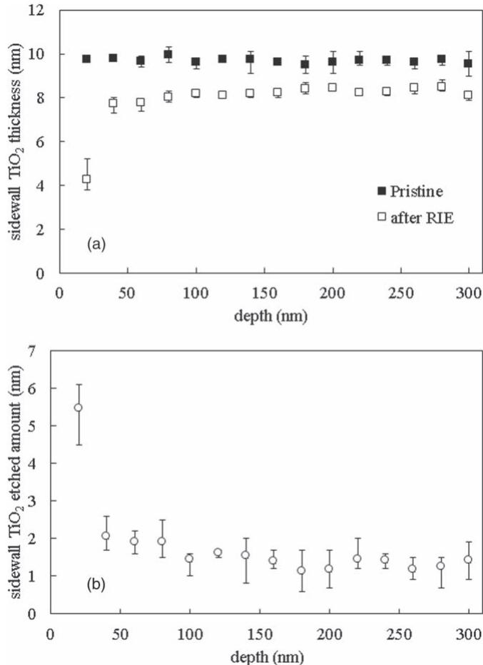  
Fig. 3. (a) Depth dependence of the sidewall  $\mathrm{TiO_2}$  thicknesses before and after  $\mathrm{CF_4}$  plasma treatment for  $30~\mathrm{s}$  and (b) the sidewall etched amount.

carried out XPS analysis to investigate the  $\mathrm{TiO_2}$  surface after removal of the modified layer.

Figure 8 shows the narrow- scan spectra of (a) Ti, (b) F, and (c) C of both the pristine sample and sample after  $\mathrm{C_4F_8}$  plasma and  $\mathrm{O_2}$  plasma treatment. The sample after these plasma treatments had a single peak at around  $684\mathrm{eV}$  related to F 1s, while the pristine sample did not [Fig. 8(b)]. This means that there was F residue on the surface after the plasma treatments. Figure 8(c) shows the spectrum of C 1s. Both samples had two peaks at 284.8 and  $288.9\mathrm{eV}$  which

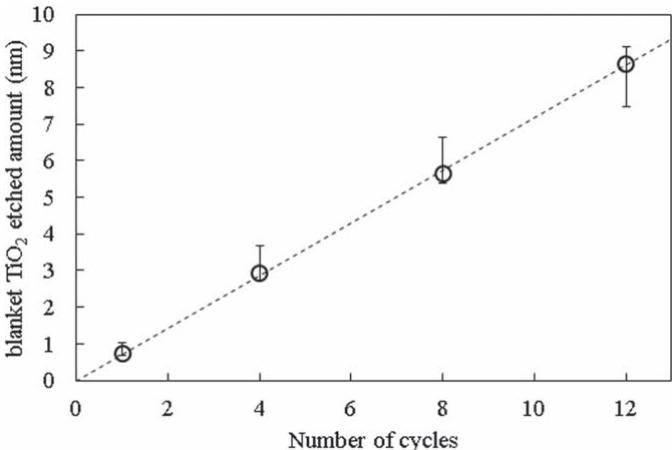  
Fig. 4. Cyclic number dependence of the amount of blanket  $\mathrm{TiO_2}$  etching with cyclic  $\mathrm{C_4F_8}$  and  $\mathrm{O_2}$  plasma.

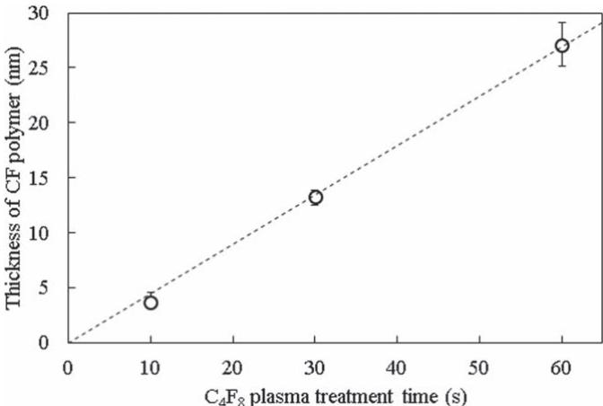  
Fig. 5. CF polymer thickness on the blanket  $\mathrm{TiO_2}$  film for different  $\mathrm{C_4F_8}$  plasma treatment times.

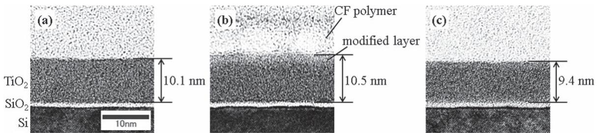  
Fig. 6. TEM images: (a) as  $\mathrm{TiO_2}$  deposited, (b) after  $\mathrm{C_4F_8}$  plasma treatment, and (c) after  $\mathrm{O_2}$  plasma treatment.

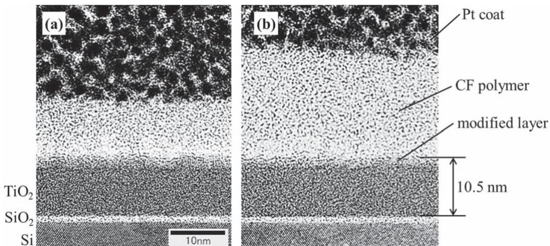  
Fig. 7. TEM images of  $\mathrm{TiO_2}$  film after  $\mathrm{C_4F_8}$  plasma treatment for (a)  $30~\mathrm{s}$  and (b)  $60~\mathrm{s}$ .

correspond to  $\mathrm{C} - \mathrm{C}$  and  $\mathrm{O} - \mathrm{C} = \mathrm{O}$  bonds, respectively. These peaks are considered to be due to surface impurities. This result supports the finding that the  $\mathrm{F}$  residue after the plasma treatments was not CF polymer. The spectrum of Ti 2p in the pristine sample had two peaks at 458.8 and  $464.6\mathrm{eV}$  owing to the titanium atoms of  $\mathrm{TiO_2}$  [Fig. 8(a)], and the spectrum after the plasma treatments had two peaks at 459.1 and  $464.9\mathrm{eV}$ . These peaks were also due to  $\mathrm{TiO_2}$  but they were slightly shifted to higher energy, which indicates Ti- F bonds on the surface. The surface after the plasma treatments thus contained  $\mathrm{TiO_2}$  and  $\mathrm{TiF}_x$ . We speculate that the  $\mathrm{TiF}_x$  is the residue of the modified layer. We finally conducted thermal desorption spectroscopy after each step to investigate the detail of the modified layer.

Figure 9 shows ion currents for mass- to- charge ratios of 67, 86, 105, and 124, which respectively correspond to TiF,  $\mathrm{TiF}_2$ ,  $\mathrm{TiF}_3$ , and  $\mathrm{TiF}_4$ . The spectroscopies of TiF and  $\mathrm{TiF}_3$  had two peaks at  $350^{\circ}\mathrm{C}$  and  $460^{\circ}\mathrm{C}$  while  $\mathrm{TiF}_2$  and  $\mathrm{TiF}_4$  had a single peak at  $350^{\circ}\mathrm{C}$ . We believe that there were two types of titanium fluoride. One had a desorption peak at  $350^{\circ}\mathrm{C}$  and dissociated into TiF,  $\mathrm{TiF}_2$ ,  $\mathrm{TiF}_3$ , and  $\mathrm{TiF}_4$  in the mass spectrometer. The other had a peak at  $450^{\circ}\mathrm{C}$  and dissociated into TiF and  $\mathrm{TiF}_3$  [Fig. 9(a)]. There were no peaks of these except for TiF in the sample after the  $\mathrm{O_2}$  plasma treatment [Fig. 9(b)]. The TiF peak count was  $1.78\times 10^{- 13}$  A having decreased from  $1.00\times 10^{- 12}$  A after the  $\mathrm{C_4F_8}$  plasma treatment. These results show that the modified layer that formed in the  $\mathrm{C_4F_8}$  plasma was titanium fluorides and most of it was etched away with  $\mathrm{O_2}$  plasma. We finally confirm that the etched amount depends on the stage temperatures in the  $\mathrm{C_4F_8}$  plasma step and  $\mathrm{O_2}$  plasma step.

Figure 10 shows the blanket  $\mathrm{TiO_2}$  etched amount for different stage temperatures in each step. We first decreased the temperature of the  $\mathrm{C_4F_8}$  plasma step from  $60^{\circ}\mathrm{C}$  to  $20^{\circ}\mathrm{C}$  while the  $\mathrm{O_2}$  plasma step had a temperature of  $60^{\circ}\mathrm{C}$ . The etched amount per cycle in the  $\mathrm{C_4F_8}$  plasma step at  $20^{\circ}\mathrm{C}$  was  $0.63\mathrm{nm}$  cycle, which was almost the same as that at  $60^{\circ}\mathrm{C}$ . We then decreased the temperature in the  $\mathrm{O_2}$  plasma step from  $60^{\circ}\mathrm{C}$  to  $20^{\circ}\mathrm{C}$ , while the  $\mathrm{C_4F_8}$  plasma step had a temperature of  $60^{\circ}\mathrm{C}$ . The etched amount per cycle in the  $\mathrm{O_2}$  plasma step at  $20^{\circ}\mathrm{C}$  was  $0.24\mathrm{nm}$  cycle, which was lower than that at  $60^{\circ}\mathrm{C}$ . These results show that the thickness of the modified layer formed in the  $\mathrm{C_4F_8}$  plasma step does not depend on the temperature, while the etched amount of the modified layer in the  $\mathrm{O_2}$  plasma step does. This is consistent with the results of thermal desorption spectroscopy. However, the calculated vapor pressure of  $\mathrm{TiF}_4$  at  $60^{\circ}\mathrm{C}$  was  $0.14\mathrm{Pa}$ , which was lower than the pressure of the  $\mathrm{O_2}$  plasma of  $13.3\mathrm{Pa}$  by a factor of 95. We therefore believe that the etching reaction is assisted by ion bombardment in the  $\mathrm{O_2}$  plasma treatment.

On the basis of the above results, we suggest the  $\mathrm{TiO_2}$  etching mechanism of the cyclic process shown in Fig. 11. First, the  $\mathrm{C_4F_8}$  plasma modifies the surface of the  $\mathrm{TiO_2}$  and formed TiF,  $\mathrm{TiF}_2$ ,  $\mathrm{TiF}_3$ , and  $\mathrm{TiF}_4$  [Fig. 11(a)]. The titanium fluorides remain on the surface because their vapor pressure is lower than the plasma pressure. The CF polymer therefore forms on the titanium fluorides [Fig. 11(b)]. Consequently, the CF polymer suppresses further modification and formation of titanium fluorides. O radicals and ions in the  $\mathrm{O_2}$  plasma remove the CF polymer and  $\mathrm{TiF}_2$ ,  $\mathrm{TiF}_3$ , and  $\mathrm{TiF}_4$  [Figs. 11(c), 11(d)]. TiF remains on the surface and changes to  $\mathrm{TiF}_x$  in the next  $\mathrm{C_4F_8}$  plasma step.

# 3.3. Cyclic  $\mathrm{C_4F_8}$  and  $\mathrm{O_2}$  plasma etching of sidewall  $\mathrm{TiO_2}$

This section reports on the application of the cyclic process to a sidewall  $\mathrm{TiO_2}$  film on a line pattern.

First, we measured the profile of the film composition to study the surface state of the sidewall  $\mathrm{TiO_2}$  film after the  $\mathrm{C_4F_8}$  plasma treatment. Figure 12(a) shows the TEM image of the pattern sample after  $\mathrm{C_4F_8}$  plasma treatment for  $30~\mathrm{s}$ .

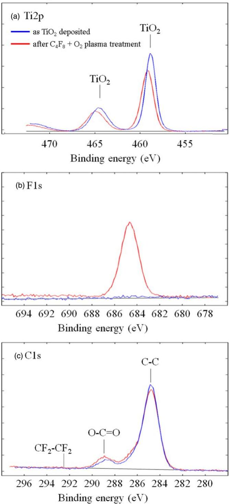  
Fig. 8. (Color online) Narrow-scan XPS spectra of the blanket  $\mathrm{TiO_2}$  surface and the film after  $\mathrm{C_4F_8}$  plasma and  $\mathrm{O_2}$  plasma treatment: (a) Ti 2p, (b) F 1s, and (c) C 1s.

Figures 12(b) and 12(c) shows the atomic percentages of C, F, Ti, and Si, which were obtained by EDX spectroscopy, at the upper and lower portions shown in Fig. 12(a), respectively. The horizontal axis shows the distance from the line pattern while the vertical axis shows the atomic percentage. The Ti increases from below  $1\%$  at  $2\mathrm{nm}$  to above  $20\%$  at  $8\mathrm{nm}$  as the Si decreases from above  $25\%$  to below  $1\%$  in both Figs. 12(b) and 12(c). We believe that the boundary between the  $\mathrm{SiO_2}$  and  $\mathrm{TiO_2}$  film was at about  $5\mathrm{nm}$ . Meanwhile, the boundary between the  $\mathrm{TiO_2}$  film and CF polymer is unclear in both the upper portion [Fig. 12(b)] and lower portion [Fig. 12(c)]. In both portions, Ti decreased from above  $20\%$  at  $20\mathrm{nm}$  to below  $1\%$  at  $25\mathrm{nm}$ , C increased from below  $3\%$  at  $15\mathrm{nm}$  to above  $80\%$  at  $24\mathrm{nm}$ , and F was above  $3\%$  in the range from 14 to  $22\mathrm{nm}$ . Therefore, there were Ti, C, and F in the range from 15 to  $20\mathrm{nm}$ . This means that  $\mathrm{TiO_2}$  film and CF polymer were mixed at the boundary

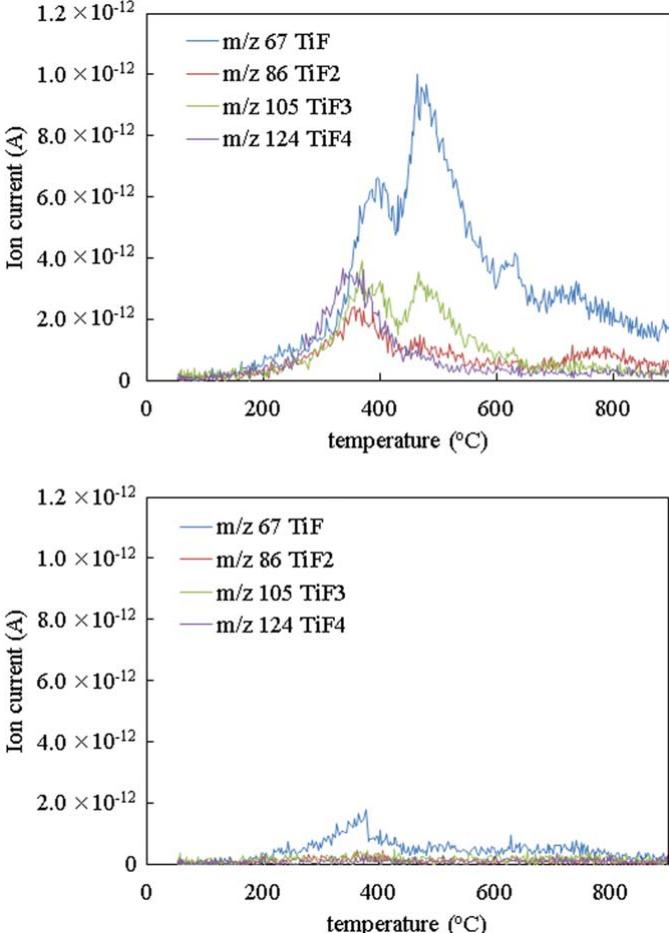  
Fig. 9. (Color online) Ion currents of thermal desorption spectroscopy (a) after  $\mathrm{C_4F_8}$  plasma treatment and (b) after  $\mathrm{O_2}$  plasma treatment. Mass-to-charge ratios of 67, 86, 105, and 124 correspond to TiF,  $\mathrm{TiF_2}$ ,  $\mathrm{TiF_3}$ , and  $\mathrm{TiF_4}$ , respectively.

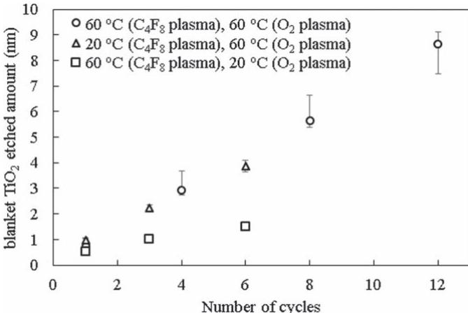  
Fig. 10. Cyclic number dependence of the blanket  $\mathrm{TiO_2}$  etched amount at different stage temperatures: (O) both steps had temperatures of  $60^{\circ}\mathrm{C}$ ,  $(\Delta)$  the  $\mathrm{C_4F_8}$  plasma had a temperature of  $20^{\circ}\mathrm{C}$  and the  $\mathrm{O_2}$  plasma a temperature of  $60^{\circ}\mathrm{C}$ ,  $(\square)$  and the  $\mathrm{C_4F_8}$  plasma had a temperature of  $60^{\circ}\mathrm{C}$  and the  $\mathrm{O_2}$  plasma a temperature of  $20^{\circ}\mathrm{C}$ . The plasma treatment time was  $30\mathrm{s}$  under all conditions.

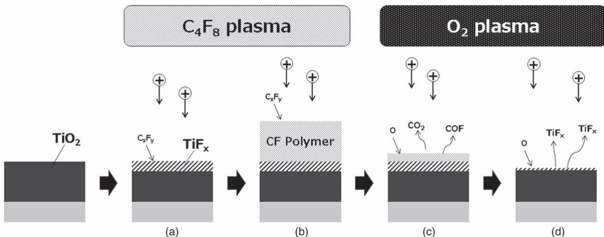  
Fig. 11. Schematic flow of the cyclic  $\mathrm{C_4F_8}$  and  $\mathrm{O_2}$  plasma etching mechanism. (a) The  $\mathrm{C_4F_8}$  plasma modified the surface of the  $\mathrm{TiO_2}$ . (b) CF polymer formed on the modified surface.  $\mathrm{O_2}$  plasma etched (c) the CF polymer and then (d) the modified layer.

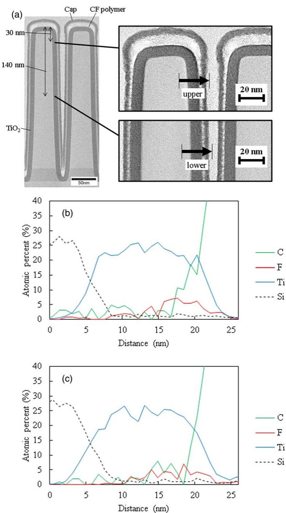  
Fig. 12. (Color online) (a) TEM image of the pattern sample after the  $\mathrm{C_4F_8}$  plasma treatment for  $30~\mathrm{s}$ . The atomic percentages of C, F, Ti, and Si obtained by EDX spectroscopy in (b) the upper portion and (c) the lower portion.

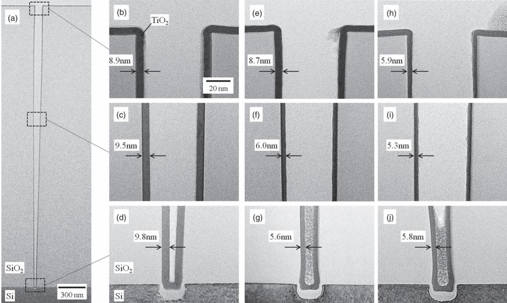  
Fig. 13. TEM images of the trench pattern sample as  $\mathrm{TiO_2}$  was deposited: (a) perspective of the pattern, (b) enlargement of the top of the pattern, (c) middle of the pattern at a depth of  $1400\mathrm{nm}$  from the top, and (d) the bottom of the pattern. Images (e)–(j) are TEM images after eight cycles of the process. Images show samples after the cyclic process with  $\mathrm{O_2}$  plasma treatment for  $30~\mathrm{s}$  [(e)–(g)] and  $60~\mathrm{s}$  [(h)–(j)].

regardless of the depth. We believe from these results that the sidewall surface was modified by  $\mathrm{C_4F_8}$  plasma treatment, the same as for the blanket surface.

Second, we etched the sidewall  $\mathrm{TiO_2}$  film on a trench pattern with an aspect ratio of 46. Figure 13(a) shows the TEM image of the trench pattern sample as  $\mathrm{TiO_2}$  was deposited. Figures 13(b)–13(d) shows enlargements of Fig. 13(a) at the top, a  $1400\mathrm{nm}$  depth from the top, and the bottom, respectively. We used two  $\mathrm{O_2}$  plasma treatment times in the cyclic process. One was  $30~\mathrm{s}$  and the other was  $60~\mathrm{s}$ . The  $\mathrm{C_4F_8}$  plasma treatment time and the number of cycles were held constant at  $30~\mathrm{s}$  and eight cycles, respectively. TEM images after the cyclic process with  $\mathrm{O_2}$  plasma for  $30~\mathrm{s}$  are shown in Figs. 13(e)–13(g) while those for  $60~\mathrm{s}$  are shown in Figs. 13(h)–13(j). Figure 14 shows the thickness of sidewall  $\mathrm{TiO_2}$  as deposited and after the cyclic processes. The etched amounts were 0.2, 3.4, 3.5, 3.5, 3.1, and  $4.2\mathrm{nm}$  at the top of the pattern, a depth of  $700\mathrm{nm}$  from the top, a depth of  $1400\mathrm{nm}$ , a depth of  $2100\mathrm{nm}$ , a depth of  $2800\mathrm{nm}$ , and the bottom, respectively. The sidewall  $\mathrm{TiO_2}$  at the top was not etched and the average etched amount except at the top was  $3.5\mathrm{nm}$ . The amount increased with an increase in the  $\mathrm{O_2}$  plasma treatment time from 30 to  $60~\mathrm{s}$ . The etched amounts after  $60~\mathrm{s}$  were 2.9, 4.3, 4.2, 5.1, 4.3, and  $4.0\mathrm{nm}$ , respectively; i.e. the top sidewall  $\mathrm{TiO_2}$  was etched by  $2.9\mathrm{nm}$  and the average etched amount except at the top was  $4.4\mathrm{nm}$ . We believe that  $\mathrm{O_2}$  plasma treatment for insufficient time cannot remove the CF polymer completely. The remaining CF polymer then prevents the modified  $\mathrm{TiO_2}$  from being removed. Consequently, the etched amount increases with the  $\mathrm{O_2}$  plasma treatment time. Furthermore, the CF polymer thickness at the top is greater than that of the sidewall in the trench as shown in Fig. 12(a), which results in a smaller amount of etching at the top.

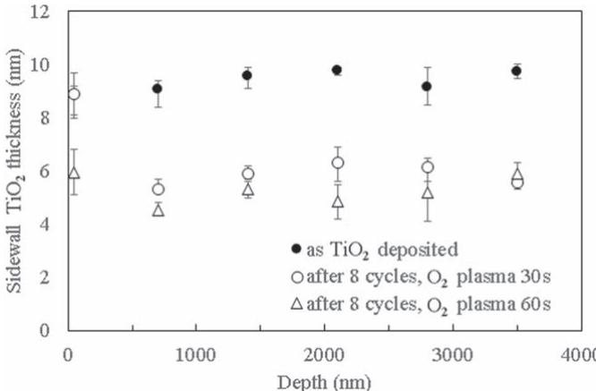  
Fig. 14. Sidewall  $\mathrm{TiO_2}$  thicknesses of the trench pattern samples as deposited and after the cyclic processes.

# 4. Conclusions

Cycle etching of  $\mathrm{TiO_2}$  was performed using  $\mathrm{C_4F_8}$  and  $\mathrm{O_2}$  plasma. We confirmed that  $\mathrm{C_4F_8}$  plasma formed a CF polymer layer on  $\mathrm{TiO_2}$  and a modified  $\mathrm{TiO_2}$  layer under the CF polymer, and most of the modified layer was removed by the following  $\mathrm{O_2}$  plasma treatment. We believe that the modified layer comprises several types of titanium fluoride, and they do not desorb from the surface in the  $\mathrm{C_4F_8}$  plasma step because of their low vapor pressure and the CF polymer formed on the modified layer. In addition, the desorption

amount of the modified layer in the  $\mathrm{O_2}$  plasma step depends on the temperature, and we can thus control the etched amount per cycle using the temperature of the step. The cyclic process of these two steps successfully etched  $\mathrm{TiO_2}$  and the etching amount increased in proportion to the number of cycles. The etch rate was  $0.67~\mathrm{nm / cycle}$ . We also confirmed uniform sidewall etching of  $\mathrm{TiO_2}$  film formed on a trench patterned sample with an aspect ratio of 46. We believe that the  $\mathrm{C_4F_8}$  and  $\mathrm{O_2}$  plasma cyclic process is a promising way to etch a sidewall uniformly in future- generation 3D devices.

1) F. A. Simsek-Ege and N. Ramaswamy, U.S. Patent 10141322 (2018). 
2) S.-C. Lai, U.S. Patent 9356040 (2016). 
3) J. Alsmeyer, U.S. Patent 8445347 (2013). 
4) M. Fujiwara et al., Proc. 2019 IEEE Int. Electron Device Meeting (IEDM 2019), 2019, p. 28.1.1. 
5) G. D. Wilk, R. M. Wallace, and J. M. Anthony, J. Appl. Phys. 89, 5243 (2001). 
6) C. Fang, Y. Cao, D. Wu, and A. Li, Prog. Nat. Sci: Mater. Int. 28, 667 (2018). 
7) X. Yin, H. Zhu, L. Zhao, G. Wang, C. Li, W. Huang, Y. Zhang, K. Jia, J. Li, and H. H. Radamson, ECS J. Solid State Sci. Technol. 9, 034012 (2020). 
8) H. Namatsu, K. Kurihara, M. Nagase, K. Iwadate, and K. Murase, Appl. Phys. Lett. 66, 2655 (1995). 
9) Y. Lee and S. M. George, ACS Nano 9, 2061 (2015). 
10) Y. Lee, C. Huffman, and S. M. George, Chem. Mater. 28, 7657 (2016).

11) Y. Lee, J. W. DuMont, and S. M. George, Chem. Mater. 28, 2994 (2016). 
12) N. R. Johnson, J. K. Hitt, M. A. Mastro, C. R. Eddy Jr, and S. M. George, Appl. Phys. Lett. 114, 283103 (2019). 
13) K. J. Kanarik, T. Lill, E. A. Hudson, S. Sriraman, S. Tan, J. Marks, V. Vahedi, and R. A. Gottscho, J. Vac. Sci. Technol. A33, 020802 (2015). 
14) J. W. DuMont, A. E. Marquardt, A. M. Cano, and S. M. George, ACS Appl. Mater. Interfaces 9, 10256 (2017). 
15) D. R. Zywotko and S. M. George, Chem. Mater. 29, 1183 (2017). 
16) N. R. Johnson and S. M. George, ACS Appl. Mater. Interfaces 9, 34435 (2017). 
17) P. C. Lemaire and G. N. Parsons, Chem. Mater. 29, 6653 (2017). 
18) K. Shinoda, M. Izawa, T. Kanekiyo, K. Ishikawa, and M. Hori, Appl. Phys. Express 9, 106201 (2016). 
19) K. Shinoda, N. Miyoshi, H. Kobayashi, M. Izawa, T. Sacki, K. Ishikawa, and M. Hori, J. Vac. Sci. Technol. A37, 051002 (2019). 
20) N. Miyoshi, H. Kobayashi, H. Shinoda, M. Kurihara, T. Watanabe, Y. Kouzuma, K. Yokogawa, S. Sakai, and M. Izawa, Jpn. J. Appl. Phys. 56, 06HB01 (2017). 
21) S. Imai, T. Haga, O. Matsuzaki, T. Hattori, and M. Matsumura, Jpn. J. Appl. Phys. 34, 5049 (1995). 
22) H. Nishino, N. Hayasaki, and H. Okano, J. Appl. Phys. 74, 1345 (1993). 
23) J. B. Park, W. S. Lim, S. D. Park, B. J. Park, and G. Y. Yeom, J. Korean Phys. Soc. 54, 976 (2009). 
24) D. Metzler, R. L. Bruce, S. Engelmann, E. A. Joseph, and G. S. Oehrlein, J. Vac. Sci. Technol. A 32, 020603 (2014). 
25) T. Tsutsumi, H. Kondo, M. Hori, M. Zaitsu, A. Kobayashi, T. Nozawa, and N. Kobayashi, J. Vac. Sci. Technol. A 35, 01A103 (2017). 
26) J.-C. Woo, Y.-H. Joo, and C.-I. Kim, Jpn. J. Appl. Phys. 50, 08KC02 (2011). 
27) E. H. Hall, J. M. Blocher, and I. E. Campbell, J. Electrochem. Soc. 105, 275 (1958).