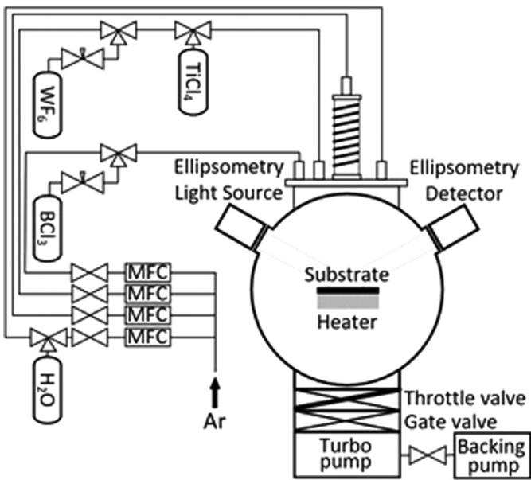
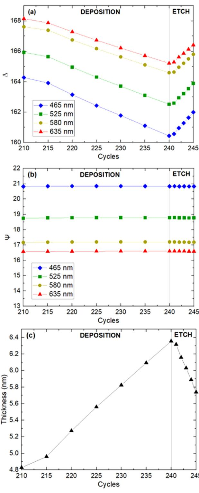
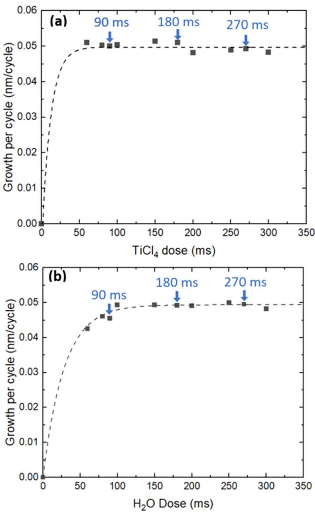
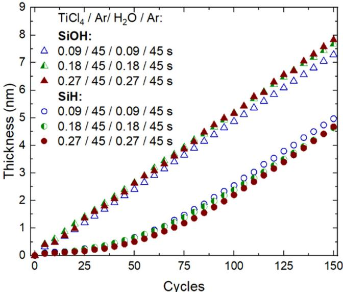
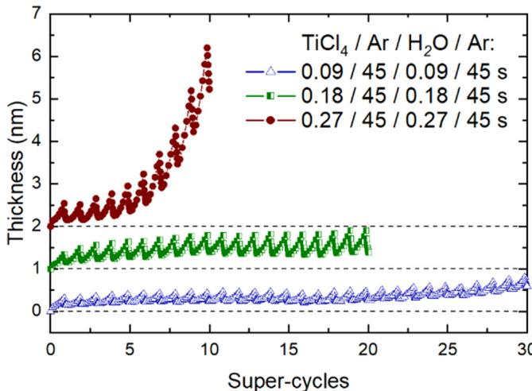
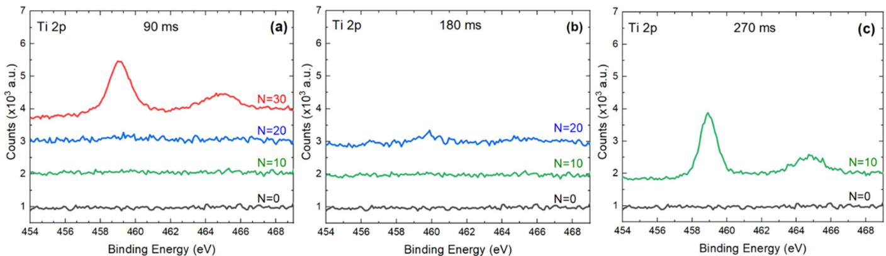
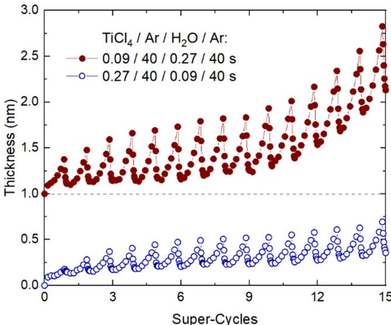
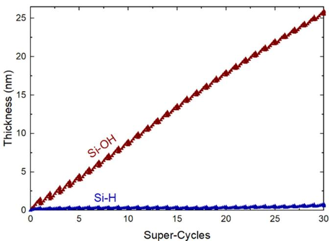
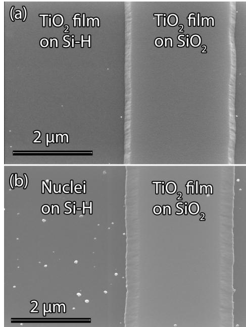
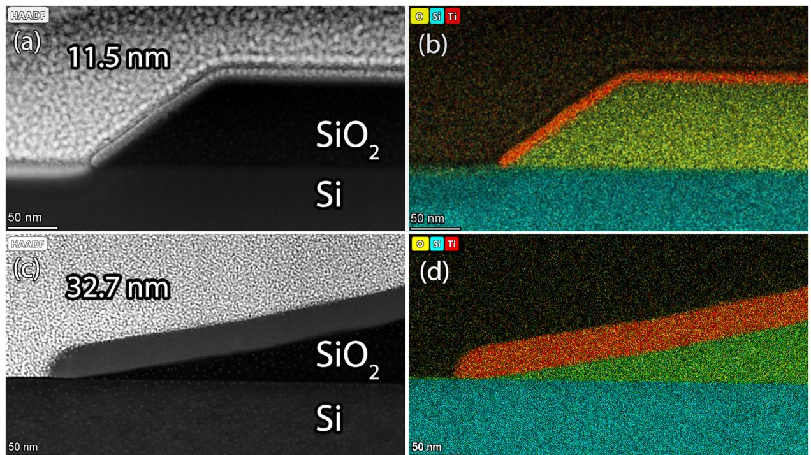

# Effect of reactant dosing on selectivity during area-selective deposition of  $\mathrm{TiO}_2$  via integrated atomic layer deposition and atomic layer etching  $\odot$

Holger Saare  $\oplus$  ; Seung Keun Song  $\oplus$  ; Jung- Sik Kim  $\oplus$  ; Gregory N. Parsons  $\oplus$

Check for updates

J. Appl. Phys. 128, 105302 (2020) https://doi.org/10.1063/5.0013552

CHOPUS

# Articles You May Be Interested In

In situ studies on atomic layer etching of aluminum oxide using sequential reactions with trimethylaluminum and hydrogen fluoride

J. Vac. Sci. Technol. A (April 2022)

Comparison of  $\mathrm{BO}_3$ ,  $\mathrm{TiO}_4$ , and  $\mathrm{SOCl}_2$  chlorinating agents for atomic layer etching of  $\mathrm{TiO}_2$  and  $\mathrm{ZrO}_2$  using tungsten hexafluoride

J. Vac. Sci. Technol. A (June 2023)

Atomic layer deposition of Ta- based thin films: Reactions of alkylamide precursor with various reactants J. Vac. Sci. Technol. 8 (September 2006)

# Journal of Applied Physics

# Special Topics Open for Submissions

Learn More

# Effect of reactant dosing on selectivity during area-selective deposition of  $\mathrm{TiO_2}$  via integrated atomic layer deposition and atomic layer etching

Cite as: 3. Appl. Phys. 128, 105302 (2020); doi: 10.1063/5.0013552  Submitted: 12 May 2020 · Accepted: 25 August 2020 · Published Online: 8 September 2020

Holger Saare, $^{1}$  Seung Keun Song, $^{2}$  Jung- Sik Kim, $^{2}$  and Gregory N. Parsons $^{1,2,a)}$

# AFFILIATIONS

$^{1}$ Department of Physics, North Carolina State University, Raleigh, North Carolina 27695, USA   $^{2}$ Department of Chemical and Biomolecular Engineering, North Carolina State University, Raleigh, North Carolina 27695, USA

$^{a)}$ Author to whom correspondence should be addressed: gnp@ncsu.edu

# ABSTRACT

A key hallmark of atomic layer deposition (ALD) is that it proceeds via self- limiting reactions. For a good ALD process, long reactant exposure times beyond that required for saturation on planar substrates can be useful, for example, to achieve conformal growth on high aspect ratio nanoscale trenches, while maintaining consistent deposition across large- area surfaces. Area- selective deposition (ASD) is becoming an enabling process for nanoscale pattern modification on advanced nanoelectronic devices. Herein, we demonstrate that during area- selective ALD, achieved by direct coupling of ALD and thermal atomic layer etching (ALE), excess reactant exposure can have a substantially detrimental influence on the extent of selectivity. As an example system, we study ASD of  $\mathrm{TiO_2}$  on hydroxylated  $\mathrm{SiO_2}$  (Si- OH) vs hydrogen- terminated (100) Si (Si- H) using  $\mathrm{TiCl_4 / H_2O}$  for ALD and  $\mathrm{WF_6 / BC_3}$  for ALE. Using in situ spectroscopic ellipsometry and ex situ x- ray photoelectron spectroscopy, we show that unwanted nucleation can be minimized by limiting the water exposure during the ALD steps. Longer exposures markedly increased the rate of nucleation and growth on the desired non- growth region, thereby degrading selectivity. Specifically, transmission electron microscopy analysis demonstrated that near- saturated  $\mathrm{H}_2\mathrm{O}$  doses enabled  $32.7\mathrm{nm}$  thick  $\mathrm{TiO_2}$  patterns at selectivity threshold  $S > 0.9$  on patterned  $\mathrm{Si / SiO_2}$  substrates. The correlation between selectivity and reactant exposure serves to increase fundamental insights into the effects of sub- saturated self- limiting surface reactions on the quality and effectiveness of ASD processes and methods.

Published under license by AIP Publishing. https://doi.org/10.1063/5.0013552

# I. INTRODUCTION

Area- selective deposition (ASD) can provide alternative bottom- up options for atomic- scale material placement and nanoscale patterning, thereby complementing top- down lithography in semiconductor manufacturing. $^{1}$  Bottom- up ASD can aid in device miniaturization while enabling uniform deposition on complex 3D structures with atomic- scale precision. $^{2}$  Exploiting the observation that adsorption of certain deposition precursors depends strongly on the chemical termination present on the initial growth surface, noticeable growth can be achieved on a receptive surface while simultaneously limiting growth on adjacent non- receptive regions. As feature sizes shrink to  $< 10\mathrm{nm}$ , physical alignment and over- lay of multiple features and line- edges become significant challenges. Chemical self- alignment has the potential to bypass the challenges in physical feature alignment, enabling new device designs and manufacturing schemes. As such, the field of area- selective deposition is becoming increasingly vital for the continuation of Moore's low and viability of advanced device architectures.

Although in an ideal case no growth should be present on the non- receptive surface, the exposure of ALD precursors can modify surface termination, generating nucleation sites and subsequent undesired film growth. $^{4}$  Area- selective deposition requires eliminating nucleation on the preferred non- growth regions, while maintaining good growth on the preferred growth regions. To combat the problem of unwanted nuclei, a common approach is to passivate the surface by forming patterns of organic molecules or monolayers to block growth on the covered areas. $^{5 - 8}$  Another method that does not require organic molecule integration employs intermittent atomic layer etching (ALE) steps within the ALD cycle, i.e., ALD/ALE "super- cycles," to periodically remove unwanted nuclei from the non- growth substrate. $^{9}$

Atomic layer deposition of metal oxides on Si- OH vs Si- H surfaces have been extensively researched related to high-  $\kappa$  dielectric scaling. A work by Puurunen compares the behavior of ALD of  $\mathrm{HfO_2}$  on varying density of surface hydroxyl groups using three mathematical models: by Alam and Green, by Puurunen, and by Ylilammi.10- 13 The work shows that while the physical explanations vary, the growth per cycle GPC) of ALD using  $\mathrm{HfCl_4 / H_2O}$  is strongly dependent on the - OH concentration on the surface. While  $1.0\mathrm{nm}$  thick chemical  $\mathrm{SiO_2}$  exhibits characteristic linear growth, the H- terminated Si- surface exhibits a "substrate- inhibited" growth. This trend has been demonstrated experimentally and shows that  $\mathrm{HfO_2}$  grown on Si- H are rougher and have poor electrical properties compared to  $\mathrm{HfO_2}$  deposited on Si- OH.14- 17 It has also been shown that during  $\mathrm{HfO_2}$  ALD deposition, the initially H- terminated surface oxidizes, forming an interstitial layer, which promotes growth.17- 20 This substrate- inhibited growth is dependent on the temperature and precursors used.19,21,22 Similar trends have been demonstrated for other metal oxides such as  $\mathrm{ZrO_2}^{20,21,23 - 26}$  and  $\mathrm{TiO_2}$  27,28

Previously, our group studied ALD/ALE and reported  $\mathrm{TiO_2}$  ASD on  $\mathrm{SiO_2}$  with minimal deposition on Si- H surfaces using the same approach used in this work.29 In the ALD/ALE sequence, the ALD cycles were stopped after a small number of nuclei appeared on the Si- H surface, and ALE cycles were introduced to remove the unwanted material. Repeating the ALD/ALE sequence allowed the net film thickness to increase on the desired growth region while minimizing growth on the desired non- growth region. The selflimiting ALE process permits a balance with the ALD, so that etching of the film on the desired growth surface only minutely affects the final deposited thickness.30 A significant advantage of this approach is that both processing steps are carried out in a single reactor system at fixed temperature and require minimal number of steps with no plasma exposure or necessary lift- off.31 Compared to more commonly used plasma- enhanced ALE, thermal ALE used in this work enables conformal etching of the material.32 A possible downside is that coupling the deposition and etching sequences increases the total process time. A previous study2 did not examine the effect of reactant exposure on selectivity or perform in situ measurements, which are the key elements in this study.

In situ analysis techniques monitor sample properties without interrupting the process or exposing the surface to atmosphere, thereby avoiding sample contamination and simplifying data analysis.33- 35 Performing sample characterization using in situ tools is imperative when studying nucleation mechanisms, where minute features on the surface can otherwise become masked or degraded by ambient exposure.36- 38 In addition, critical nuclei can be created in a few cycles, making it difficult to accurately collect data without realtime measurements.39 In situ ellipsometry has been used to study nucleation of  $\mathrm{Pt}$  on  $\mathrm{Al}_2\mathrm{O}_3,$  40 growth of ultrathin TiN films, nucleation and growth of TiN/Si and TiN/GaN heterostructures,42 Cu ASD on Pd vs  $\mathrm{SiO_2 / SiN^{\circ}43}$  and many more processes.39,44- 49 By probing a material's optical and electro- optical response, film thickness can be measured on different substrates, effectively quantifying the selectivity. Moreover, measuring the film thickness change during the ASD process enables us to understand the mechanism behind selectivity loss and the impact of processing conditions on ASD.

While the effect of reactant exposure time during ALD processing is widely explored and well- understood,36,50- 55 previous reports of area- selective ALD generally use exposure conditions suitable for the desired deposition, without addressing how exposure and other process variables influence reactions on the nongrowth surface. Mackus et al. demonstrated the impact of oxygen exposure on the nucleation of  $\mathrm{Pt}$  during ALD and showed that longer  $\mathrm{O_2}$  dosing time increased the rate of  $\mathrm{Pt}$  nucleation on an  $\mathrm{Al}_2\mathrm{O}_3$  film surface.36 Additionally, the influence of precursor pressure on area- selective deposition of  $\mathrm{Al}_2\mathrm{O}_3$  on Ti has been previously studied using self- assembled monolayers (SAMs) as blocking layers and was shown that increasing precursor pressure led to lower selectivity due to increased physisorption on SAMs.56

The work presented here explores the effect of ALD reactant dosing times during area- selective ALD of  $\mathrm{TiO_2}$  on Si- OH vs Si- H, which is an isothermal process in the sense that the reaction temperature is held constant throughout the experiment. The ALD/ALE sequence examined was described previously29,57 and provides a valuable model to understand ASD and the means to control the extent of selectivity. This work presents a systematic in situ study addressing the effects of ALD conditions on net ASD selectivity.

# II. EXPERIMENTAL DETAILS

# A. Reactor design

II. EXPERIMENTAL DETAILSA. Reactor designThe ALD and ALE processes were carried out in a home-built warm-walled reaction chamber equipped with a four-wavelength ellipsometer (Film Sense FS-1) capable of in situ measurement of thin film optical properties. A simplified schematic of the reaction chamber is presented in Fig. 1. The sample is introduced to the chamber on a sample chuck, which locks onto a sample stage, heated by PID-controlled cartridge heaters and thermally isolated

  
FIG. 1. Simplified schematic representation of deposition chamber used in this work, including the gas-delivery lines setup, pumping system, and attached spectroscopic ellipsometer.

from the rest of the chamber via ceramic standoffs. The substrate temperature can be controlled between  $50^{\circ}\mathrm{C}$  and  $350^{\circ}\mathrm{C}$ , while the reactor wall is typically  $100^{\circ}\mathrm{C}$ . Compared to isothermal hot- wall reactors, this differentially heated sample holder has the benefit of allowing the sample temperature to be adjusted relatively quickly.

The precursors are introduced to the system through four heated stainless- steel gas- delivery lines using argon  $(99.999\%$  purity, Arc3 Gases) as a carrier and purge gas: line  $\# 1$  hosted  $\mathrm{BCl}_3$ $(99.9\%$  purity, Matheson); line  $\# 2$ $\mathrm{TiCl}_4$ $(99\%$  purity, Strem Chemicals) and  $\mathrm{WF}_6$ $(99.99\%$  purity, Calary Chemicals); line  $\# 3$  de- ionized  $\mathrm{H}_2\mathrm{O}$ ; line  $\# 4$  was only used for flowing argon. The argon flow rates were controlled by mass- flow controllers present on each line, and the precursors were dosed using pneumatic diaphragm valves (Swagelok, ALD series) controlled by a Pyrhon interface using automated process recipes. The gases and by- products are pumped out of the system using a Seiko- Seiki STP- 300C turbo pump backed by an Alcatel 2021a two- stage rotary vane pump with activated aluminum and Sodasorb filters to shield the pump oil from harmful vapors. The pressure was controlled by a throttle valve located before the turbo pump and monitored by a Baratron capacitance manometer (0- 10 Torr range,  $0.1\mathrm{mTorr}$  resolution). During the Ar purge step, the throttle valve position produces a process pressure of  $600\mathrm{mTorr}$ . Dosing leads to a small increase in process pressure due to the precursor partial pressure.

# B. Substrate preparation

Two types of silicon wafer pieces were used as deposition substrates in this study: (1) boron- doped p- type silicon (100) wafers with  $5 - 10\Omega \mathrm{cm}$  resistivity, blanket- terminated with either a chemical oxide or hydrogen; and (2)  $\mathrm{Si - H / SiO}_2$  patterned wafers prepared by photolithographic wet etching of  $\sim 100\mathrm{nm}$  thick  $\mathrm{SiO}_2$  resulting in alternating  $\mathrm{Si / SiO}_2$  lines with  $6\mu \mathrm{m}$  pitch  $(3\mu \mathrm{m}$  lines/ spaces). The wet etching process produced a tapered edge on the  $\mathrm{SiO}_2$  features. Both the blanket and the patterned wafers were cleaved into  $\sim 2\times 2\mathrm{cm}$  squares, submerged for  $15\mathrm{min}$  in a piranha solution (1:1 mixture of  $\mathrm{H}_2\mathrm{O}_2{:}\mathrm{H}_2\mathrm{SO}_4$ ) to remove organic residue and to form a hydroxyl- terminated (Si- OH) chemical oxide layer. To form a hydrogen- terminated (Si- H) substrate, the piranha- cleaned wafers were dipped into  $5\%$  HF solution for  $30\mathrm{s}$ .

Immediately prior to loading samples into the reactor, they were rinsed with de- ionized water and blown dry with flowing nitrogen. They were then placed onto a sample chuck and secured in place using a physical clamp. The chamber was pumped down to  $\sim 10^{- 5}$  Torr, and the temperature and the pressure were allowed to stabilize for  $30\mathrm{min}$  before any processing.

# C. Deposition and etching process

Deposition and etching were carried out at  $170^{\circ}\mathrm{C}$ . The  $\mathrm{TiO}_2$  ALD sequence included discrete  $\mathrm{TiCl}_4$  and de- ionized water doses with argon as the purge and carrier gas. The dosing times for both precursors were varied from  $90\mathrm{ms}$  to  $270\mathrm{ms}$ . After every dose, the chamber was purged with argon for  $20\mathrm{s}$ , followed by a  $10\mathrm{s}$  pump down by completely opening the throttle valve to the turbo pump, evacuating the chamber to  $10^{- 5}$  Torr. After this pump step, the throttle valve was partially closed and the flow of argon resumed for  $15\mathrm{s}$  to bring the system back to the operating pressure of $600~\mathrm{mTorr}$  .This was followed by the subsequent  $\mathrm{H}_2\mathrm{O}$  or  $\mathrm{TiCl_4}$  dose step. The timing sequence is designated as  $\mathrm{TiCl_4 / Ar / pump / }$ $\mathrm{Ar / H_2O / Ar / pump / Ar = x / 20 / pump / 15 / x / 20 / pump / 15s}$  where x ranges from 90 to  $270~\mathrm{ms}$

The atomic layer etching process coupled alternating  $\mathrm{WF}_6$  and  $\mathrm{BCl}_3$  doses. Based on earlier measurements and thermodynamic calculations,57 exposing  $\mathrm{TiO}_2$  to  $\mathrm{WF}_6$  at  $\mathrm{T} > 125^{\circ}\mathrm{C}$  fluorinates the  $\mathrm{TiO}_2$  surface, forming solid  $\mathrm{WO}_x\mathrm{F}_y / \mathrm{TiO}_y\mathrm{F}_z$  and volatile  $\mathrm{TiF}_4$ . At  $\mathrm{T}< 190^{\circ}\mathrm{C}$ , subsequent  $\mathrm{BCl}_3$  exposure removes the W species and forms solid  $\mathrm{B}_2\mathrm{O}_3$ . The boron oxide is then removed by the next  $\mathrm{WF}_6$  dose, thereby achieving self- limiting ALE.57 The timing sequence during ALE follows  $\mathrm{WF}_6 / \mathrm{Ar / pump / Ar / BCl}_3 / \mathrm{Ar / pump / Ar} = 0.1 / 20 / \mathrm{pump / 15 / 0.1 / 20 / \mathrm{pump / 15s}}$ . Under these conditions, the rate of ALE was measured to be  $0.11\mathrm{nm / cycle}$  under steady- etch conditions.

The ALD/ALE super- cycle sequence used here consists of 30 ALD cycles followed by 5 ALE cycles. The number of ALD/ALE cycles was selected based on successful results published previously.29 This sequence was repeated N times (where  $\mathrm{N} = 10$ , 20, or 30) and is designated here as  $(30 / 5)\times \mathrm{N}$ .

# D. Process characterization

An in situ four- wavelength spectroscopic ellipsometer (Film Sense FS- 1) directly attached to the chamber was used to monitor film thickness during the ALD/ALE sequence. The ellipsometer was positioned at a  $65^{\circ}\pm 1^{\circ}$  incident angle and ellipsometry parameters  $\Psi$  and  $\Delta$  were acquired at wavelengths  $465~\mathrm{nm}$ ,  $525~\mathrm{nm}$ ,  $580~\mathrm{nm}$ , and  $635~\mathrm{nm}$ . The ellipsometer was isolated from the chamber by two quartz windows and pneumatic gate valves that were opened and closed by electronic actuation in sequence with the process cycle. The gate valves were opened and ellipsometry data collected only during purge/pump periods, thereby preventing deposition on the windows. For this study, we collected ellipsometric data after every five ALD cycles and after every one ALE cycle. For the ALD step, data were collected after the water dose, and for ALE, data were collected after the  $\mathrm{BCl}_3$  step. Ellipsometry data collection required  $9\mathrm{s}$  for full data collection. For blanket substrates, the  $\mathrm{TiO}_2$  film thickness was obtained from the ellipsometry data using a Cauchy model in the ellipsometer software, which takes into account the temperature- dependence of the optical response.

An example of raw ellipsometry data and the resulting thickness output are shown in Fig. 2. The values for  $\Psi$ ,  $\Delta$ , and thickness are shown for a single super- cycle of  $\mathrm{TiO}_2$ , ASD on the Si- OH surface, consisting of 30 ALD cycles followed by 5 ALE cycles performed at  $170^{\circ}\mathrm{C}$  with  $90\mathrm{ms}$  dosing times for both  $\mathrm{TiCl}_4$  and  $\mathrm{H}_2\mathrm{O}$ . While the value of  $\Psi$  does not change significantly in this thickness range, there is an evident correlation between the  $\Delta$  and  $\mathrm{TiO}_2$  film thickness values. The  $\Delta$  parameter characterizes the phase change upon reflection of the polarized light, which is highly sensitive to thickness changes in ultrathin layers.58 While analyzing nucleation behavior using spectroscopic ellipsometry data, it is important not to over- interpret the thickness output by the model as it usually presumes a continuous thin film.59

To compare selectivity for different materials or process approaches, the selectivity fraction, S, is defined as the difference between the surface coverage on growth surface,  $\theta_1$ , and that on the

  
FIG. 2. In situ ellipsometry data collected during deposition and etching steps on the Si-OH surface. (a) and (b) show the raw delta  $(\Delta)$  and psi  $(\Psi^{\prime})$  parameters, respectively, which are fitted by a Cauchy model to (c) measure the  $\mathrm{TiO_2}$  layer thickness.

non- growth surface,  $\theta_{2}$ , relative to the total coverage on both surfaces. $^{59 - 61}$  When the coverage on the non- growth surface is relatively small, a reasonable estimate for S is found using the measured film thicknesses on the growth and non- growth surfaces,  $\mathfrak{t}_1$  and  $\mathfrak{t}_2$ , respectively,

$$
\mathrm{S} = \frac{\theta_1 - \theta_2}{\theta_1 + \theta_2}\approx \frac{\mathfrak{t}_1 - \mathfrak{t}_2}{\mathfrak{t}_1 + \mathfrak{t}_2}. \tag{1}
$$

When growth proceeds on the desired surface, and no growth appears on the non- growth surface, the process is perfectly selective and  $\mathbf{S} = 1$ . When unwanted growth occurs on the non- growth region, S decreases, reaching 0 when both surfaces become fully covered. By setting a target S, which might be needed for practical ASD applications, one can determine from experimental measurements the threshold thickness that can be achieved on the growth surface before the value of S drops below target and selectivity loss occurs.

# E. Material characterization

The chemical composition of blanket films on Si- OH and Si- H was determined by ex situ XPS using Kratos Axis Ultra DLD X- ray Photoelectron Spectrometer and the CasaXPS software package. The analysis consisted of survey scans followed by high- resolution scans for the elements Ti, Si, O, Cl, F, and C. The energy axes were calibrated using an adventitious carbon peak at  $285.0\mathrm{eV}$ . Field emission scanning electron microscopy (FESEM Verios 460L), with a low energy electron detector operating at  $10\mathrm{kV}$  and  $\Xi$ $0.8\mathrm{nA}$  was used to obtain the patterned  $\mathrm{Si} / \mathrm{SiO}_2$  images. Focused ion beam (FIB, FEI Quanta 3D FEG instrument) with a high current Ga liquid metal ion gun was used for a TEM sample preparation. Cross- sectional images were obtained by scanning transmission electron microscopy (STEM, Jeol 2000FX) with energy dispersive spectrometer (EDS) attachment for chemical characterization of the patterned samples.

# III. RESULTS AND DISCUSSION

# A. Effect of dosing time on ALD growth

Figure 3 displays saturation curves obtained during steady ALD of  $\mathrm{TiO_2}$  at  $170^{\circ}\mathrm{C}$ , where the thickness growth per cycle (GPC) is plotted vs the dosing time of  $\mathrm{TiCl_4}$  or  $\mathrm{H}_2\mathrm{O}$ . The curves are obtained by fixing one of the precursor dosing times at  $300\mathrm{ms}$  and varying the other between 0 and  $300\mathrm{ms}$ . The thickness per cycle at each condition was measured after 50 deposition cycles, and the average value was plotted vs dosing time. Note that the shortest time used for open- dosing is  $60\mathrm{ms}$ . This maximum valve switching speed was limited by the computer interface communication rate. Figure 3(a) shows that for a fixed  $300\mathrm{ms}$ $\mathrm{H}_2\mathrm{O}$  dosing time, changing the  $\mathrm{TiCl_4}$  dosing time between 60 and  $300\mathrm{ms}$  had minimal influence on the growth, with good saturation at  $\sim 0.05\mathrm{nm / cycle}$ . Similarly, Fig. 3(b) shows that fixing  $\mathrm{TiCl_4}$  dosing time at  $300\mathrm{ms}$  and varying  $\mathrm{H}_2\mathrm{O}$  dosing time results in similar saturation at the same  $\sim 0.05\mathrm{nm / cycle}$ . Saturation requires  $\sim 100\mathrm{ms}$  of  $\mathrm{H}_2\mathrm{O}$  dosing time, whereas in Fig. 3(a), saturation is observed for the shortest  $60\mathrm{ms}$ $\mathrm{TiCl_4}$  dosing time.

  
FIG. 3. Growth per cycle (GPC) of  $\mathrm{TiO_2}$  thin films deposited on Si-OH surface measured by in situ ellipsometry. One of the precursor dosing times is held constant at  $300\mathrm{ms}$  while the dosing time of (a)  $\mathrm{TiCl_4}$  and (b)  $\mathrm{H}_2\mathrm{O}$  is varied.

To study the effect of dosing conditions on nucleation on Si- H surfaces, growth was monitored under different dose conditions. As a first test, the  $\mathrm{TiCl_4}$  and  $\mathrm{H}_2\mathrm{O}$  dosing times were set equal to each other at  $90\mathrm{ms}$ ,  $180\mathrm{ms}$ , or  $270\mathrm{ms}$ , which can be referred to as "near- saturated," "saturated," and "oversaturated," respectively, based on  $\mathrm{H}_2\mathrm{O}$  saturation levels. It is important to note that  $\mathrm{TiCl_4}$  dose reached saturation at all dosing times. A total of  $150\mathrm{TiO_2}$  ALD cycles were performed on freshly prepared Si- H surfaces, and deposition was monitored by in situ ellipsometry as a function of ALD cycle. For comparison, these three experiments were also repeated on Si- OH substrates. We note from the results shown in Fig. 3 that all three dosing conditions are close to or well within the saturated ALD regime. Therefore, the growth on each substrate type is expected to be nearly the same for each dose condition.

  
FIG. 4. The thickness of the  $\mathrm{TiO_2}$  layer on Si-OH and Si-H surfaces for  $90\mathrm{ms}$ ,  $180\mathrm{ms}$ , and  $270\mathrm{ms}$ $\mathrm{TiCl_4 / H_2O}$  dosing times as measured by in situ ellipsometry.

The resulting six datasets (Si- OH and Si- H surfaces, three dosing conditions each) are shown in Fig. 4. On the Si- H substrates, all three dosing conditions show similar results, with noticeable growth delay up to  $\sim 25$  ALD cycles, after which the GPC accelerates to near the steady value of  $\sim 0.05\mathrm{nm / cycle}$ . After 150 cycles, the thickness on all three Si- H surfaces is  $\sim 5\mathrm{nm}$ . The small differences in the growth rates reflect minute run- to- run variations on the surface. Likewise, on Si- OH, the different dose conditions show nearly identical results: 150 ALD cycles yielding  $\sim 8\mathrm{nm}$  of  $\mathrm{TiO_2}$  with the lowest dosing time condition resulting in the lowest film thickness as expected due to near- saturation condition. Using Eq. (1), the trend in film nucleation yields a film thickness of  $\sim 1.5\mathrm{nm}$  when selectivity  $S = 0.9$  for all three conditions. These results indicate that near- and oversaturated  $\mathrm{H}_2\mathrm{O}$  dosing do not substantially affect the initial nucleation delay on the Si- H surface.

# B. Combined ALD/ALE super-cycles

Next, we worked to understand how different saturated ALD dosing times could influence nucleation on the desired non- growth surface during more extended ASD conditions using ALD/ALE super- cycles. For this test, Si- H substrates were exposed to multiple ALD/ALE super- cycles, where the ALD dosing times per cycle were the same as those used to collect data in Fig. 4. The ALE cycles followed the conditions described in the experimental section. Figure 5 shows the resulting thickness values measured by in situ ellipsometry, plotted vs number of ALD/ALE super- cycles for all three deposition dose conditions. Note that on the plot, the data collected using  $180\mathrm{ms}$  and  $270\mathrm{ms}$  dosing times are offset on the  $y$  axis by  $1\mathrm{nm}$  and  $2\mathrm{nm}$ , respectively, to improve data visualization. Comparing results during the first three to five super- cycles, the

  
FIG. 5. The thickness of the  $\mathrm{TiO_2}$  layer on  $\mathrm{Si - H}$  as a function of the number of super-cycles using  $\mathrm{TiCl_4 / H_2O}$  dosing times of 90, 180, and  $270~\mathrm{ms}$  as measured by in situ ellipsometry. Data are collected after every five ALD cycles and after each individual ALE cycle. The data for 180 and  $270~\mathrm{ms}$  is offset on the  $y$  axis by  $1\mathrm{nm}$  and  $2\mathrm{nm}$ , respectively, to improve visualization.

different dosing times show similar trends in film deposition and etching. However, after  $\sim 5$  super- cycles, for the  $270~\mathrm{ms}$  dosing time for both precursors, a significant amount of net deposition is present after ALE. As shown in Fig. 4, longer  $\mathrm{TiCl_4 / H_2O}$  dose times (without ALE) did not influence the rate of unwanted nucleation on  $\mathrm{Si - H}$ . However, in Fig. 5 where ALE cycles are used, longer  $\mathrm{TiCl_4 / H_2O}$  dose times produced more rapid nucleation. This is ascribed to the removal of passivating  $\mathrm{Si - H}$  bonds by the ALE etchant exposure, which allows more rapid formation  $\mathrm{Si - O}$  sites that allow  $\mathrm{TiO_2}$  growth. Interestingly, for all dosing conditions, the ellipsometry data indicate that during each sequence of five ALE steps, the amount of film removed per ALE cycle gradually decreases, leaving a thin layer of "un- etched" film on the  $\mathrm{Si - H}$  substrate. For example, for the case of  $90~\mathrm{ms}$  dosing times, ellipsometry indicates that after completing the etching for the 10th or 20th super- cycle,  $\sim 0.2\mathrm{nm}$  of  $\mathrm{TiO_2}$  remains on the  $\mathrm{Si - H}$  surface. However, as discussed below, based on results from XPS analysis, the trend in ellipsometry is ascribed to the oxidation of the surface and formation of species not etched by the ALE process, rather than incomplete etching of  $\mathrm{TiO_2}$ .

XPS analysis was performed on  $\mathrm{Si - H}$  samples exposed to various dosing conditions during ALD/ALE to evaluate the film deposition and chemical composition of the surface after the process was completed. The XPS data of the measured Ti 2p signals on samples prepared with various dosing times are displayed in Fig. 6. All samples (including the starting  $\mathrm{Si - H}$ ) were measured by ex situ XPS, so differences in adventitious surface carbon and oxygen result from variations in ambient exposure for the different samples tested. However, there is an apparent trend of increasing  $\mathrm{O}$  at.  $\%$  as the dosing times and the number of supercycles increase, which points to the oxidation of the non- growth region, promoting unwanted nucleation. Moreover, the starting  $\mathrm{Si - H}$  and all other samples show mild fluorine contamination ( $>0.2$  at.  $\%$ ), which is ascribed to remanent fluorine from the HF- dip surface preparation before deposition. This premise is supported by the observation of clean hydrogen- terminated  $\mathrm{Si}$  not exposed to ALD displaying  $\mathrm{F}$  contamination of  $3.1$  at.  $\%$ .

After  $20$  super- cycles using  $90~\mathrm{ms}$ $\mathrm{TiCl_4}$  and  $\mathrm{H}_2\mathrm{O}$  dosing times [Fig. 6(a)], the XPS Ti  $2\mathrm{p}$  spectrum shows no detectable signal. Considering that  $\mathrm{TiO_2}$  sensitivity on  $\mathrm{Si}$  is about  $0.3$  at.  $\%$ , the lack of measurable signal indicates that the maximum possible thickness of  $\mathrm{TiO_2}$  on that surface is  $\sim 0.04\mathrm{nm}$ , or  $\sim 80\%$  of one monolayer, which is substantially less than suggested by the ellipsometry results in Fig. 5. Other XPS analysis (shown below) indicates that the  $\mathrm{WF}_6$  and  $\mathrm{BCl}_3$  used for ALE modify the surface and change the surface reflectivity, which the ellipsometry model interprets as the thickness increases.

The atomic percentages calculated from the elemental XPS peaks collected on the  $\mathrm{Si - H}$  surface after ALD/ALE using the

  
FIG. 6. XPS data of the Ti 2p signal for deposition carried out using (a) 90, (b) 180, and (c)  $270~\mathrm{ms}$ $\mathrm{H}_2\mathrm{O}$  and  $\mathrm{TiCl_4}$  dosing times for varying number of deposition/etch super-cycles (N) on  $\mathrm{Si - H}$ .

TABLE I. Elemental composition of hydrogen-terminated (100) Si wafers exposed to different  $\mathrm{TiCl_4 / H_2O}$  dosing times as measured by x-ray photoelectron spectroscopy (XPS). One super-cycle consists of 30 ALD and 5 ALE cycles.  

<table><tr><td>Dosing time (ms)</td><td>Super-cycles</td><td>Ti (at. %)</td><td>Si (at. %)</td><td>O (at. %)</td><td>C (at. %)</td><td>B (at. %)</td><td>W (at. %)</td><td>F (at. %)</td><td>Cl (at. %)</td></tr><tr><td>0</td><td>0</td><td>0</td><td>72.7</td><td>9.0</td><td>15.2</td><td>0</td><td>0</td><td>3.1</td><td>0</td></tr><tr><td rowspan="3">90</td><td>10</td><td>0</td><td>72.9</td><td>17.2</td><td>8.7</td><td>0</td><td>0</td><td>1.2</td><td>0</td></tr><tr><td>20</td><td>0</td><td>70.1</td><td>20.7</td><td>7.8</td><td>0</td><td>0</td><td>0.5</td><td>0.9</td></tr><tr><td>30</td><td>1.2</td><td>64.1</td><td>20.2</td><td>10.3</td><td>0.1</td><td>0</td><td>4.1</td><td>0</td></tr><tr><td rowspan="2">180</td><td>10</td><td>0</td><td>65.4</td><td>21.4</td><td>12.0</td><td>0.1</td><td>0.1</td><td>0.4</td><td>0.7</td></tr><tr><td>20</td><td>0.9</td><td>58.0</td><td>24.9</td><td>15.1</td><td>0.1</td><td>0.2</td><td>0.5</td><td>0.9</td></tr><tr><td>270</td><td>10</td><td>4.5</td><td>43.9</td><td>30.1</td><td>17.6</td><td>0.2</td><td>0.2</td><td>2.7</td><td>0.8</td></tr></table>

different exposure times are summarized in Table I. With XPS data measured after every 10 super- cycles, the  $270~\mathrm{ms}$  dosing condition first exhibited the Ti 2p signal at 10 super- cycles (4.5 at.  $\%$  ;the  $180\mathrm{ms}$  at 20 (0.3 at.  $\%$  and the  $90~\mathrm{ms}$  at 30 1.2 at.  $\%$  .This indicates that shorter dosing times help inhibit unwanted nucleation in the combined ALD/ALE process.

The spectra of measured B 1s and W 4d peaks are shown in Fig. S1 in the supplementary material. As seen in Figs. S1(a)- S1(c) in the supplementary material, the exact determination of B 1s signal is complicated due to overlapping Si 2s plasmon loss peak and low concentration of boron. However, the results indicate that only minor amounts of W and B contamination were detected  $(\leq 0.2$  at.  $\%$  for higher dosing times.

To further distinguish the effect of  $\mathrm{TiCl_4}$  and  $\mathrm{H}_2\mathrm{O}$  dose amount on  $\mathrm{TiO_2}$  selectivity, the  $\mathrm{TiCl_4}$  and  $\mathrm{H}_2\mathrm{O}$  dosing times were varied independently, and Fig. 7 shows the resulting in situ ellipsometry data collected during ALD/ALE on  $\mathrm{Si - H}$  .This experiment consisted of two runs, one using  $\mathrm{TiCl_4 / H_2O}$  dosing times of  $270 / 90\mathrm{ms}$  and the other using  $90 / 270\mathrm{ms}$  The conditions were otherwise identical to those used for collecting data in Fig. 5, and data were collected for a total of 15 ALD/ALE super- cycles. The two datasets are clearly distinguishable with the larger  $\mathrm{H}_2\mathrm{O}$  dosing time condition displaying less nucleation delay than the shorter  $\mathrm{H}_2\mathrm{O}$  dosing time condition. Moreover, the shorter  $\mathrm{H}_2\mathrm{O}$  dose condition sample etches to a relatively constant optical thickness of  $0.15\mathrm{- }0.3\mathrm{nm}$  after each super- cycle. In comparison, the higher  $\mathrm{H}_2\mathrm{O}$  dosing time condition is unable to etch back to the initial baseline of the optical thickness after the sixth super- cycle, where the thickness after each super- cycle exceeds the previous. At the end of the 15 super- cycles, the  $90 / 270\mathrm{ms}$  case resulted in a final thickness of  $\sim 1.2\mathrm{nm}$  while the  $270 / 90\mathrm{ms}$ $\mathrm{TiCl_4 / H_2O}$  case had a final thickness of  $\sim 0.4\mathrm{nm}$  . This noticeable difference between two conditions confirms that  $\mathrm{H}_2\mathrm{O}$  is the major factor in shortening the nucleation delay during ALD/ALE super- cycles on the  $\mathrm{Si - H}$  surfaces. This effect of  $\mathrm{H}_2\mathrm{O}$  exposure is ascribed to oxidation of the initial

  
FIG. 7. The thickness of the  $\mathrm{TiO_2}$  layer on  $\mathrm{Si - H}$  for  $\mathrm{TiCl_4 / H_2O}$  90/270 ms and 270/90 ms dosing times as measured by in situ ellipsometry. Data are shown for 15 super-cycles, consisting of 30 ALD and 5 ALE cycles each, with data points taken every five cycles for ALD and every cycle for ALE. The data for 90/270 ms are offset on the y axis by 1 nm to improve visualization.

  
FIG. 8.  $\mathrm{TiO_2}$  film thickness on  $\mathrm{Si - H}$  and  $\mathrm{Si - OH}$  surfaces during ALE/ALE super-cycles with  $90~\mathrm{ms}$  dosing conditions for  $\mathrm{TiCl_4 / H_2O}$ . The measurement was done by in situ ellipsometry, with the data point taken after every five cycles for ALD and every cycle for ALE.

  
FIG. 9. SEM images of  $\mathrm{TiO_2}$  ALD/ALE on patterned  $\mathrm{Si / SiO_2}$  substrates using (a)  $270~\mathrm{ms}$  dosing conditions for 10 super-cycles and (b)  $90~\mathrm{ms}$  dosing conditions for 30 super-cycles.

hydrogen- terminated surface, promoting growth of mixed Ti/Si oxide. The ALE sequence used here is favorable for etching  $\mathrm{TiO_2}$  but not for etching  $\mathrm{SiO_2}$ .29

Based on results in Figs. 6 and 7, the conditions using the shortest reactant exposure time are expected to produce the largest selectivity values. Figure 8 shows results obtained by in situ ellipsometry for  $90~\mathrm{ms}$  dosing times for the 80/5 ALD/ALE condition at  $170^{\circ}\mathrm{C}$  for 30 super- cycles measured during two identical runs, where the ellipsometer was focused on Si- OH and Si- H, respectively. The final thicknesses were  $\sim 25.5\mathrm{~nm}$  on the Si- OH surface and  $\sim 0.6\mathrm{~nm}$  on the Si- H surface. Calculating the selectivity defined by Eq. (1) results in  $S\approx 0.95$  for a thickness of  $25.5\mathrm{~nm}$  on the preferred growth surface. Extrapolation of the data using a model to quantify and predict nucleation indicates a selectivity of  $S > 0.9$  up to  $36.9\mathrm{~nm}$  film thickness—a significant improvement from our previously reported result of  $15\mathrm{~nm}$  ASD for  $S > 0.9$  using fully saturated dosing conditions,29,50 and even more notable compared to the ALD- only case, where  $S > 0.9$  was limited to only  $1.5\mathrm{~nm}$ .

# C. Effect of dosing time on patterned substrates

The effect of reactant dosing duration on the deposition of  $\mathrm{TiO_2}$  on  $\mathrm{Si / SiO_2}$  patterned substrates was studied using SEM. Figure 9 exhibits patterns exposed to  $270 / 270\mathrm{~ms}$  dosing conditions for 10 super- cycles and to  $90 / 90\mathrm{~ms}$  dosing conditions for 30 super- cycles. The growth conditions are the same as used to collect data

  
FIG. 10. (a) Cross-sectional TEM and (b) TEM-EDS mapping of 10 ALD/ALE super-cycles at  $270~\mathrm{ms}$  dosing conditions on  $\mathrm{Si / SiO_2}$  pattern. (c) Cross-sectional TEM and (d) TEM-EDS mapping of 30 ALD/ALE super-cycles at  $90~\mathrm{ms}$  dosing conditions on  $\mathrm{Si / SiO_2}$  pattern.

shown in Fig. 5. The smooth surfaces observed using oversaturated dosing times [Fig. 9(a)] is consistent with blanket  $\mathrm{TiO_2}$  on both  $\mathrm{Si - H}$  and  $\mathrm{SiO_2}$  surfaces. However, using near- saturated exposure times [Fig. 9(b)], a smooth blanket layer appears only on the  $\mathrm{SiO_2}$  surface, with less growth, appearing as visible isolated nuclei, on the  $\mathrm{Si - H}$  surface.

To further study the effect of the reactant doses on promoting deposition on the non- growth surface, cross- sectional STEM images were taken of the  $\mathrm{Si / SiO_2}$  patterned substrates exposed to different dosing time conditions, and resulting images are presented in Fig. 10. The EDS analysis of samples deposited using  $90 / 90\mathrm{ms}$  dosing times for 30 super- cycles and  $270 / 270\mathrm{ms}$  dosing times for 10 super- cycles show no visible  $\mathrm{TiO_2}$  growth on the  $\mathrm{Si - H}$  for either sample. However, a thin top layer of the initially hydrogen- terminated surface appears to have oxidized as indicated by a thin green layer visible in TEM- EDS images. As no detectable  $\mathrm{TiO_2}$  has deposited on top of this oxidized layer, it can be presumed to have oxidized during the preparation of the TEM cross section. Meanwhile, noticeable  $\mathrm{TiO_2}$  growth is present on the  $\mathrm{SiO_2}$  surface with measured film thickness of  $11.5\mathrm{nm}$  for the  $270 / 270\mathrm{ms}$  condition and  $32.7\mathrm{nm}$  for the  $90 / 90\mathrm{ms}$  condition. Although more detailed higher- resolution images are needed, it appears that the thicker  $\mathrm{TiO_2}$  film leads to "mushroom" growth, where the  $\mathrm{TiO_2}$  deposits from all directions,  $\mathrm{SiO_2}$ , including laterally on the  $\mathrm{Si - H}$  surface near  $\mathrm{Si / SiO_2}$  interface.

# IV.CONCLUSION

The effect of reactant exposure on the selectivity of areaselective  $\mathrm{TiO_2}$  deposition has been investigated in a combined isothermal ALD/ALE process. In situ ellipsometry results show that extending the reactant exposure times during ALD maintains nearly the same growth per cycle on both  $\mathrm{Si - H}$  and  $\mathrm{Si - OH}$  surfaces. In contrast, overdosing  $\mathrm{TiCl_4 / H_2O}$  during ALD/ALE supercycles leads to excess thickness increase on the preferred nongrowth  $\mathrm{Si - H}$  surface. Near- saturated  $\mathrm{H}_2\mathrm{O}$  dosing was shown to maintain a selectivity of  $S\approx 0.95$  up to a  $\mathrm{TiO_2}$  film thickness of  $25.5\mathrm{nm}$  on the  $\mathrm{Si - OH}$  surface: a significant improvement from the ALD- only case, which resulted in a film thickness of  $1.5\mathrm{nm}$  at  $S\approx 0.9$

Independently comparing  $\mathrm{TiCl_4}$  and  $\mathrm{H}_2\mathrm{O}$  dosing times, water was found to be the main cause for the selectivity loss, with longer  $\mathrm{H}_2\mathrm{O}$  dosing times exhibiting notably faster nucleation on  $\mathrm{Si - H}$ . This loss of selectivity can be attributed to two main factors: (1) overexposure of the reactants leads to increased chance of interactions with the surface, prompting physisorption, and generation of potential nucleation sites; and (2) water vapor reacts with the exposed surface sites formed during ALE by the removal of  $\mathrm{Si - H}$  bonds causing the growth of surface oxide species that are not etched by the  $\mathrm{TiO_2}$  ALE chemistry.

The mechanisms shown here for ASD using combined ALD/ ALE steps indicate that selectivity loss is associated with alternate unfavorable reactions on the non- growth surface during extended ALD reactant exposures. Therefore, this work expands the understanding of effects of reactant exposure during area- selective ALD, where overexposure of one or both of the precursors may have a negligible effect during typical ALD, but leads to selectivity loss during area- selective deposition. Although not studied explicitly in this work, adjusting the reactant dose times to improve selectivity could negatively impact the conformality of a desired film coating, for example, in high aspect ratio trenches where relatively long dose times are needed to achieve uniform deposition. As shown here, increasing the exposure beyond near- saturation can have a negative impact on overall deposition selectivity. We believe that achieving conformal deposition while maintaining high selectivity is an important challenge, which needs to be addressed in future works. In general, the effect of dosing duration on film nucleation helps further improve area- selective deposition and the ability to manipulate or minimize unwanted nucleation in future processes.

# SUPPLEMENTARY MATERIAL

See the supplementary material for XPS data of B 1s and W 4d peaks for various process conditions.

# ACKNOWLEDGMENTS

This material is based on the work supported by the National Science Foundation under Grant No. 1704151 and the Semiconductor Research Corporation (Task No. 2729.001). This work was performed in part at the Analytical Instrumentation Facility (AIF) at North Carolina State University, which is supported by the State of North Carolina and the National Science Foundation (Award No. ECCS- 1542015). The AIF is a member of the North Carolina Research Triangle Nanotechnology Network (RTNN), a site in the National Nanotechnology Coordinated Infrastructure (NNCI). Some work was also performed in part at the Shared Materials Instrumentation Facility (SMIF) at Duke University. The authors thank S. Smith for the STEM characterization.

# DATA AVAILABILITY

The data that support the findings of this study are available from the corresponding author upon reasonable request.

# REFERENCES

1N. Biyikli, A. Haider, P. Deminskyi, and M. Yilmaz, Proc. SPIE 10349, 10349M (2017). 2A. J. M. Mackus, M. J. M. Merkx, and W. M. M. Kessels, Chem. Mater. 31, 2 (2019). 3A. J. M. Mackus, A. A. Bol, and W. M. M. Kessels, Nanoscale 6, 10941 (2014). 4A. Vallat, R. Gassilloud, B. Eychenne, and C. Vallat, J. Vac. Sci. Technol. A 35, 1 (2017). 5F. S. Minaye Hashemi, B. R. Birchansky, and S. F. Bent, ACS Appl. Mater. Interfaces 8, 33264 (2016). 6E. K. Seo, J. W. Lee, H. M. Sung- Suh, and M. M. Sung, Chem. Mater. 16, 1878 (2004). 7J. R. Avila, E. J. Demarco, J. D. Emery, O. K. Farha, M. J. Pellin, J. T. Hupp, and A. B. F. Martinson, ACS Appl. Mater. Interfaces 6, 11891 (2014). 8R. Chen, H. Kim, P. C. McIntyre, and S. F. Bent, Chem. Mater. 17, 536 (2005). 9K. J. Kanarik, T. Lill, E. A. Hudson, S. Sriraman, S. Tan, J. Marks, V. Vahedi, and R. A. Gottscho, J. Vac. Sci. Technol. A 33, 020802 (2015). 10R. L. Puurunen, J. Appl. Phys. 95, 4777 (2004). 11M. A. Alam and M. L. Green, J. Appl. Phys. 94, 3403 (2003). 12R. L. Puurunen, Chem. Vap. Deposition 9, 249 (2003). 13M. Ylilammi, Thin Solid Films 279, 124 (1996).

$^{14}$ M. L. Green, M.- Y. Ho, B. Busch, G. D. Wilk, T. Sorsch, T. Conard, B. Brijs, W. Vandervorst, P. I. Raisänen, D. Muller, M. Bude, and J. Grazul, J. Appl. Phys. 92, 7168 (2002).  $^{15}$ M. L. Green, A. J. Allen, X. Li, J. Wang, J. Ilavsky, A. Delabie, R. L. Puurunen, and B. Brijs, Appl. Phys. Lett. 88, 032907 (2006).  $^{16}$ E. P. Gusev, C. Cabral, M. Copel, C. D'Emic, and M. Gribelyuk, Microelectron. Eng. 69, 145 (2003).  $^{17}$ J.- F. Damlencourt, O. Renault, D. Samour, A.- M. Papon, C. Leroux, F. Martin, S. Marthon, M.- N. Semeia, and X. Garros, Solid State Electron. 47, 1613 (2003).  $^{18}$ J. C. Hackley, T. Gougousi, and J. D. Demaree, J. Appl. Phys. 102, 034101 (2007).  $^{19}$ M. Cho, J. Park, H. B. Park, C. S. Hwang, J. Jeong, and K. S. Hyun, Appl. Phys. Lett. 81, 334 (2002).  $^{20}$ E. P. Gusev, E. Cartier, D. A. Buchanan, M. Gribelyuk, M. Copel, H. Okorn- Schmidt, and C. D'Emic, Microelectron. Eng. 59, 341 (2001).  $^{21}$ P. D. Kirsch, M. A. Quevedo- Lopez, H.- J. Li, Y. Senzaki, J. J. Peterson, S. C. Song, S. A. Krishnan, N. Moumen, J. Barnett, G. Bersuker, P. Y. Hung, B. H. Lee, T. Lafford, Q. Wang, D. Gay, and J. G. Ekerdt, J. Appl. Phys. 99, 023508 (2006).  $^{22}$ J. Aarik, A. Aidla, A. Kikas, T. Käämbre, R. Rammula, P. Ritslaid, T. Uustare, and V. Sammelselg, Appl. Surf. Sci. 230, 292 (2004).  $^{23}$ M. Copel, M. Gribelyuk, and E. Gusev, Appl. Phys. Lett. 76, 436 (2000).  $^{24}$ S. Ferrari, M. Modreanu, G. Scarel, and M. Fanciulli, Thin Solid Films 450, 124 (2004).  $^{25}$ R. L. Puurunen, W. Vandervorst, W. F. A. Besling, O. Richard, H. Bender, T. Conard, C. Zhao, A. Delabie, M. Caymax, S. De Gendt, M. Heyns, M. M. Viitanen, M. de Ridder, H. H. Brongersma, Y. Tamminga, T. Dao, T. de Win, M. Verheijen, M. Kaiser, and M. Tuominen, J. Appl. Phys. 96, 4878 (2004).  $^{26}$ K. Kukli, M. Ritala, J. Aarik, T. Uustare, and M. Leskela, J. Appl. Phys. 92, 1833 (2002).  $^{27}$ R. Methaapanon and S. F. Bent, J. Phys. Chem. C 114, 10498 (2010).  $^{28}$ D. R. G. Mitchell, D. J. Attard, and G. Triani, Thin Solid Films 441, 85 (2003).  $^{29}$ S. K. Song, H. Saare, and G. N. Parsons, Chem. Mater. 31, 4793 (2019).  $^{30}$ K. J. Kanarik, S. Tan, and R. A. Gottscho, J. Phys. Chem. Lett. 9, 4814 (2018).  $^{31}$ S. M. George and Y. Lee, ACS Nano 10, 4889 (2016).  $^{32}$ C. Fang, Y. Cao, D. Wu, and A. Li, Prog. Nat. Sci. Mater. Int. 28, 667 (2018).  $^{33}$ E. Langereis, S. B. S. Heil, H. C. M. Knoops, W. Keuning, M. C. M. van de Sanden, and W. M. M. Kessels, J. Phys. D Appl. Phys. 42, 073001 (2009).  $^{34}$ M. T. Kief, Proc. SPIE 10294, 1024903 (1999).  $^{35}$ M. Junige, M. Geidel, M. Knaut, M. Albert, and J. W. Bartha, in IEEE Semiconductor Conference Dresden, Dresden (IEEE, 2011).  $^{36}$ A. J. M. Mackus, M. A. Verheijen, N. Leick, A. A. Bol, and W. M. M. Kessels, Chem. Mater. 25, 1905 (2013).  $^{37}$ T. Muneshwar and K. Cadien, Appl. Surf. Sci. 328, 344 (2015).  $^{38}$ R. W. Wind, F. H. Fabreguette, Z. A. Sechrist, and S. M. George, J. Appl. Phys. 105, 074309 (2009).

$^{39}$ L. Lecordier, S. Herregods, and S. Armini, J. Vac. Sci. Technol. A 36, 031605 (2018).  $^{40}$ L. Baker, A. S. Cavanagh, D. Seghete, S. M. George, A. J. M. MacKus, W. M. M. Kessels, Z. Y. Liu, and F. T. Wagner, J. Appl. Phys. 109, 084333 (2011).  $^{41}$ E. Langereis, S. B. S. Heil, M. C. M. Van De Sanden, and W. M. M. Kessels, Appl. Phys. 100, 023534 (2006).  $^{42}$ P. Patsalas and S. Logothetidis, J. Appl. Phys. 93, 989 (2003).  $^{43}$ X. Jiang, H. Wang, J. Qi, and B. G. Willis, J. Vac. Sci. Technol. A 32, 041513 (2014).  $^{44}$ M. Janige, M. Löffler, M. Giddel, M. Albert, J. W. Bartha, E. Zachoch, B. Rellinghaus, and W. F. van Dorp, Nanotechnology 28, 395301 (2017).  $^{45}$ M. A. Raza, H. J. W. Zandvliet, B. Poelsema, and E. S. Kooij, J. Appl. Phys. 113, 233510 (2013).  $^{46}$ M. F. J. Vos, S. N. Chopra, M. A. Verheijen, J. G. Ekerdt, S. Agarwal, W. M. M. Kessels, and A. J. M. Mackus, Chem. Mater. 31, 3878 (2019).  $^{47}$ V. Pesce, C. Vallee, R. Gassilloud, A. Chacker, M. Bonvalot, B. Pelissier, N. Posseme, and A. Bsiesy, in AVS 65th International Symposium (AVS, 2018).  $^{48}$ A. Mameli, M. J. M. Merkx, B. Karasulu, P. Roozeboom, W. M. M. Kessels, and A. J. M. Mackus, ACS Nano 11, 9303 (2017).  $^{49}$ A. Mameli, B. Karasulu, M. A. Verheijen, B. Barcones, B. Maccio, A. J. M. Mackus, W. M. M. E. Kessels, and F. Roozeboom, Chem. Mater. 31, 1250 (2019).  $^{50}$ K. M. Niang, G. Bai, and J. Robertson, J. Vac. Sci. Technol. A 38, 042401 (2020).  $^{51}$ Z. Baji, Z. Labadi, Z. E. Horváth, G. Molnár, J. Volk, I. Bársony, and P. Barna, Cryst. Growth Des. 12, 5615 (2012).  $^{52}$ R. Kuse, M. Kundu, T. Yasuda, N. Miyata, and A. Toriumi, J. Appl. Phys. 94, 6411 (2003).  $^{53}$ C. A. Murray, S. D. Elliott, D. Hausmann, J. Henri, and A. LaVoie, ACS Appl. Mater. Interfaces 6, 10534 (2014).  $^{54}$ K. Kudli, J. Aarik, M. Ritala, T. Uustare, T. Saiyaara, J. Lu, J. Sundqvist, A. Aidla, L. Pung, A. Hårsta, and M. Leskela, J. Appl. Phys. 96, 5298 (2004).  $^{55}$ R. G. Gordon, D. Hausmann, E. Kim, and J. Shepard, Chem. Vap. Deposition 9, 73 (2003).  $^{56}$ S. Seo, B. C. Yeo, S. S. Han, C. M. Yoon, J. Y. Yang, J. Yoon, C. Yoo, H.- J. Kim, Y.- B. Lee, S. J. Lee, J.- M. Myoung, H.- B.- R. Lee, W.- H. Kim, I.- K. Oh, and H. Kim, ACS Appl. Mater. Interfaces 9, 41607 (2017).  $^{57}$ P. C. Lemaire and G. N. Parsons, Chem. Mater. 29, 6653 (2017).  $^{58}$ E. Garcia- Caurel, A. De Martino, J. P. Gaston, and L. Yan, Appl. Spectrosc. 67, 1 (2013).  $^{59}$ G. N. Parsons, J. Vac. Sci. Technol. A 37, 020911 (2019).  $^{60}$ W. L. Gladfelter, Chem. Mater. 5, 1372 (1993).  $^{61}$ G. N. Parsons and R. D. Clark, Chem. Mater. 32, 4920 (2020).  $^{62}$ A. G. Shard, Surf. Interface Anal. 46, 175 (2014).