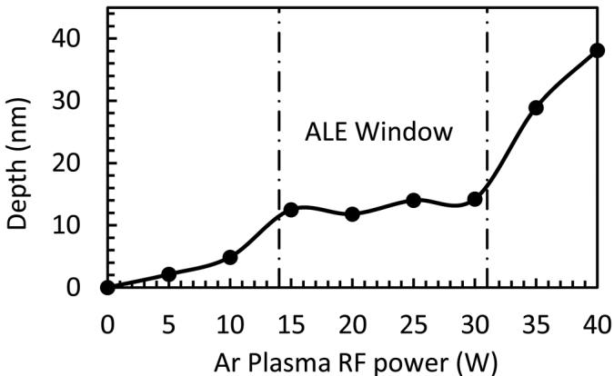
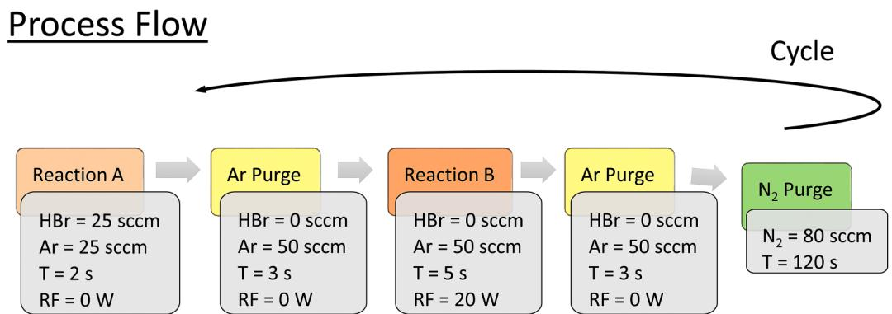
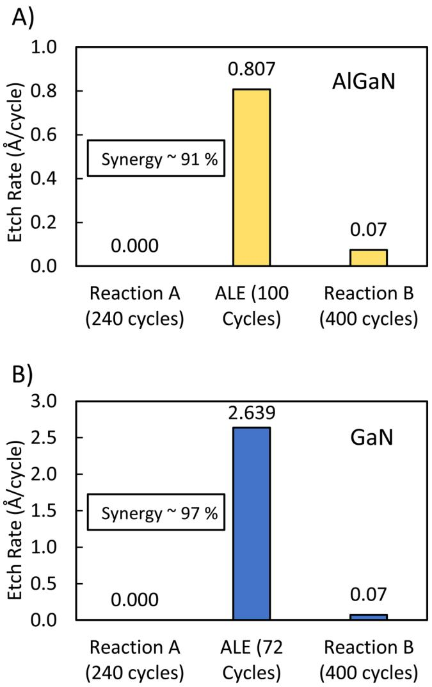
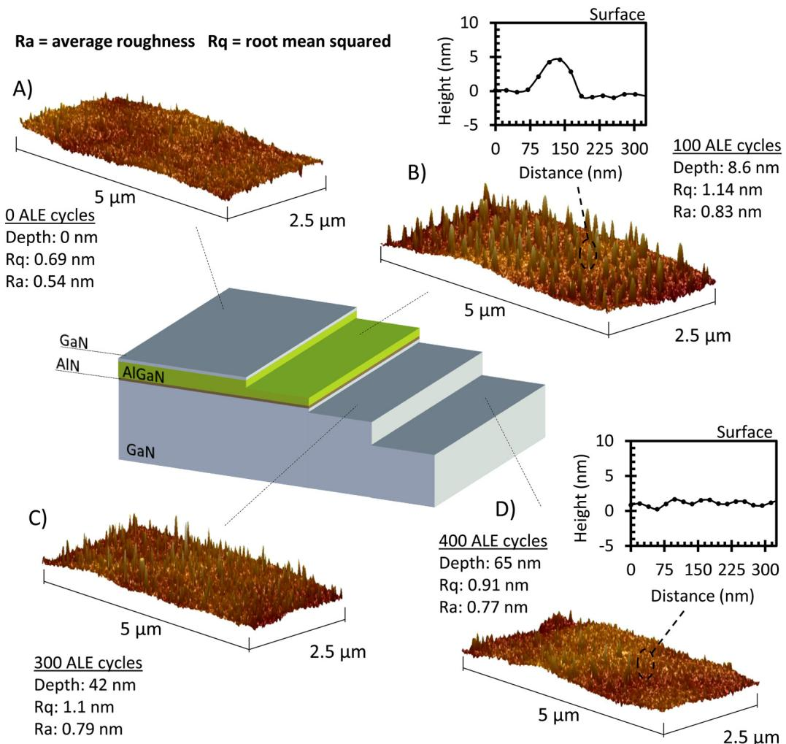

# High synergy atomic layer etching of AlGaN/GaN with HBr and Ar

Special Collection: Atomic Layer Etching (ALE) Kevin G. Crawford  $\oplus$  ; James Grant  $\oplus$  ; Dilini Tania Hemakumara; Xu Li; Iain Thayne; David A. J. Moran

Check for updates J.Vac.Sci.Technol.A 40,042601 2022) https://doi.org/10.1116/6.0001862

# Articles You May Be Interested In

Predicting synergy in atomic layer etching

J.Vac.Sci.Technol.A (March 2017)

Atomic layer etching of indium tin oxide

J.Vac.Sci.Technol.A (January 2024)

Plasma enhanced atomic layer etching of high- k layers on  $\mathsf{WS}_2$

J.Vac.Sci.Technol.A (May 2022)

# High synergy atomic layer etching of AlGaN/GaN with HBr and Ar

Cite as: J. Vac. Sci. Technol. A 40, 042601 (2022); doi: 10.1116/6.0001862  Submitted: 16 March 2022 - Accepted: 29 April 2022 - Published Online: 25 May 2022

Kevin G. Crawford, $^{1,a)}$  James Grant, $^{1}$  Dilini Tania Hemakumara, $^{1,2}$  Xu Li, $^{1}$  Iain Thayne, $^{1}$  and David A. J. Moran $^{1}$

# AFFILIATIONS

$^{1}$ School of Engineering, University of Glasgow, Glasgow G12 8LT, United Kingdom   $^{2}$ Oxford Instruments Plasma Technology, North End, Yatton, Bristol BS49 4AP, United Kingdom

Note: This paper is part of the 2023 Special Topic Collection on Atomic Layer Etching (ALE).   $^{a)}$ Electronic mail: kevin.crawford@glasgow.ac.uk

# ABSTRACT

Here, we show a process of AlGaN/GaN atomic layer etching with a high synergy of  $>91\%$ . Achieved by means of a cyclical HBr and Ar process, highly controllable layer removal was observed within the atomic layer etching window and is attributed to careful parameter calibration plus lower reactivity of the HBr chemistry. Such etching is a valuable component in the production of high- performance enhancement- mode GaN field effect transistor devices.

$\mathfrak{G}$  2022 Author(s). All article content, except where otherwise noted, is licensed under a Creative Commons Attribution (CC BY) license (http://creativecommons.org/licenses/by/4.0/). https://doi.org/10.1116/6.0001862

# I. INTRODUCTION

Atomic layer etching (ALE) is an iterative process by which monolayers of material can be removed sequentially by combining separate, self- limiting, reaction steps. This is achieved via a multistep process in which two key phases, surface modification followed by surface removal, limit the etching of material to individual atomic layers per cycle. ALE is of great interest for traditional semiconductors and has seen an influx in development over recent years. $^{1 - 6}$  As technology nodes increasingly demand sub- 10 nm fidelity restraints, atomic- scale precision becomes a necessity. $^{6,7}$  The reactant of choice for directional ALE of Si has primarily been  $\mathrm{Cl}_2$  followed by Ar bombardment, with high directionality and minimal damage demonstrated. $^{6 - 11}$  Compound III- V materials present a more complex challenge to ALE development, compared to single element materials. Again,  $\mathrm{Cl}_2$  has been the reactant of choice in most directional ALE studies on materials such as  $\mathrm{GaAs}^{12,13}$  and  $\mathrm{GaN}^{3,4}$  Based on the electrical characterization of surfaces exposed to ALE, several studies have shown minimal damage for both Si and III- V materials when compared to reactive ion etching. $^{5,14}$  More recently, HBr has been reported as a suitable reactant in directional ALE of both GaN and Ge, $^{5,15}$  demonstrating a less volatile response in comparison to  $\mathrm{Cl}_2$ . Here, HBr was speculated to produce a thinner reaction layer than  $\mathrm{Cl}_2$  due to the larger diameter of HBr atoms while also producing less volatile etch products such as  $\mathrm{GaBr}_3$ . $^{5}$  A particular advantage of this lower volatility is reduced sidewall etching, observed for a HBr process when compared with  $\mathrm{Cl}_2$ . $^{5}$

A nondirectional ALE approach, sometimes referred to as "digital etching," involves self- limiting surface modification via oxidation to form a reactive layer. $^{2,6,16}$  The oxidized layer is then removed, usually by a wet acid process such as HCl. This method is, thus, isotropic in nature and has seen significant development for use on III- V materials such as GaN and GaAs. $^{16,17}$  Compared to continuous wet etching, digital etching allows greater control of material removal by separating the process into two self- limiting steps. The process is usually labor intensive, however, and not in situ.

For field effect transistor devices based on AlGaN/GaN heterostructures, enhancement- mode operation is generally achieved by recessing the device gate closer to the 2DEG channel. A well calibrated directional ALE process with consistent and repeatable etch rate per cycle is well suited to achieving a gate recess with precise depth and minimal additional surface defects. $^{18}$  Similarly, low resistance ohmic contacts can also be achieved by recessing them closer to the channel. $^{19}$  In this work, we show experimental verification of an ALE process based on HBr + Ar gases for use on a commercially available AlGaN/GaN heterostructure.

<table><tr><td>An-situ SiN</td><td>10 nm</td></tr><tr><td>GaN</td><td>2 nm</td></tr><tr><td>AlGaN</td><td>20 nm</td></tr><tr><td>AlN</td><td>1 nm</td></tr><tr><td>GaN</td><td>300 nm</td></tr><tr><td>Buffer (C-doped)</td><td>3900 nm</td></tr><tr><td>Si Substrate</td><td></td></tr></table>

# II. EXPERIMENT

Epitaxial AlGaN/GaN grown on a six- inch low resistivity Si wafer was purchased from NNT- AT Corp. Figure 1 shows the wafer heterostructure. The wafer was diced into  $15\times 15\mathrm{mm}$  substrates and solvent cleaned in an ultrasonic bath using acetone and isopropyl. Immediately prior to patterning with photolithography, substrates were exposed to a HF solution for removal of the SiN top layer.

Substrates were then mounted to the center of individual Si carrier wafers with Santovac, to aid in thermal dissipation during processing. All etch work was carried out in an Oxford Instruments PlasmaPro System 100 ICP300 Cobra. At the start of each etch, prior to beginning the ALE cycle, a short  $10~\mathrm{s}$  45W Ar plasma breakthrough step was used to prepare the surface and remove any residual SiN or native oxide. Postetch, the patterned resist was removed leaving a measurable etched step.

Figure 2 shows a complete ALE cycle consisting of an initial Reaction A, in which the surface is modified by HBr gas exposure (no plasma), followed by a purge step, and then Reaction B, in which the modified surface is removed by a low- power Ar plasma. This second reaction is intended to be self- limiting, stripping away only a monolayer of material exposed to HBr in Reaction A. HBr has been reported to form a thinner reaction layer on GaN, compared to other common ALE chemistries such as  $\mathrm{Cl}_2^5$  while also producing the less volatile etch product,  $\mathrm{GaBr}_3$  20,21 Thus, it was chosen for these experiments.

  
FIG. 3. Etch depth as a function of RF power for a fixed Reaction B step time of 5 s, 120 cycles.

To achieve a self- limiting etch process, the "ALE window," a low- power regime prior to sputtering, is established. This is determined by the sputtering energy threshold of the semiconductor surface22 and experimentally is observed by gradually increasing the RF platen bias power of Reaction B (Ar plasma) during ALE cycles. We determined the ALE window for our process, as shown in Fig. 3, to be between 15 and  $30\mathrm{W}$  Here, a relatively consistent etch rate is observed prior to sputtering. As such, an RF platen bias power of  $20W_{i}$  corresponding to a bias on the substrate of  $120\mathrm{V}_{\cdot}$  was used in Reaction B step of our ALE experiments. It should be noted that for the initial trial data shown in Fig. 3, we did not mount the samples with Santovac. However, the data point at  $20W$  RF matches closely with our process results shown in Sec. III.

All measurements of depth postetch were measured by atomic force microscopy (AFM), using a Bruker Dimension Icon System. Step height was collected and averaged from four different locations

  
FIG. 2. Process flow diagram of a complete ALE cycle. Reaction A exposes the substrate surface to HBr gas, followed by a purge of the chamber and Reaction B, which utilizes Ar plasma to strip away a monolayer of the HBr modified surface.

on each sample, with an average standard deviation of  $3.4\%$  across measurements from each substrate. Surface roughness postetch was also measured by AFM, using a  $5\mu \mathrm{m}$  scan size to ensure a good representation of each sample. Scans were taken from the center of etched regions, with average roughness (Ra) and the route mean squared (Rq) captured.

# III. RESULTS AND DISCUSSION

Etch depth as a function of ALE cycle is shown in Fig. 4(a), while Figs. 4(b)- 4(e) show AFM scans of measured steps. Within the first  $\sim 22 \mathrm{nm}$  of material, good ALE behavior was observed with a etch rate of  $0.81 \mathrm{\AA / cycle}$  for the AlGaN layer. However, the low etch rate suggests incomplete removal of monolayers per cycle and is potentially due to the Al content of the layer suppressing etch uniformity. Etching beyond the GaN layer transition depth, a sharp increase in etch rate can be seen, increasing to  $2.64 \mathrm{\AA / cycle}$ . This removal rate for the GaN layer is close to the  $3.1 \mathrm{\AA}$  lattice parameter of GaN (Ref. 23) and suggests good uniformity. Similar to ALE of SiN using  $\mathrm{H}_2 / \mathrm{Ar}$  (where H serves to remove N), in GaN/AlGaN, we suspect N reacts to form  $\mathrm{NH}_3$ . For GaN exposed to HBr, the etch product  $\mathrm{GaBr}_3$  has been observed. The etch product  $\mathrm{GaBr}_3$  has been reported to possess a higher sublimation point compared to  $\mathrm{GaCl}_3$ .

  
FIG.4. (a) Plted etch depth vs ALE cycle. Dashed line marks the transition between AlGaN and GaN layers. AFM scans of various steps (b) 25, (c) 100, (d) 300, and (e) 400 cycles.

At the transition, the interface between AlGaN and GaN is also a thin,  $1\mathrm{nm}$  AlN layer included for enhanced charge mobility in the GaN channel.25 Etch rates extracted for both AlGaN and GaN layers appear linear and largely unaffected by this thin AlN layer, though its presence should still be considered when interpreting the presented results.

Also plotted in Fig. 4(a) is the etch depth for 240 and 400 cycles of Ar only exposure. This was done by way of a modified version of the ALE recipe shown in Fig. 2, with the HBr component of Reaction A removed. Isolated, the Ar plasma step of Reaction B showed a very low etch depth of  $\sim 3\mathrm{nm}$  after 400 cycles. In addition, 240 cycles of the ALE process with only HBr exposure (Reaction A only, Ar plasma removed) showed no measurable etching of the surface. This result is comparable to that observed elsewhere.1

For the steps plotted in Figs. 4(b)- 4(e), it should be noted that the AFM technique, while highly accurate at measuring height, is not capable of accurately representing sidewall slope. This is due to the pyramidal shape of the AFM tip, resulting in the apex of the tip being unable to physically contact the sidewall of vertical features. This effect becomes more pronounced as the step height increases.

The ALE synergy test is a measure of efficiency for the process and quantifies the contribution of individual steps. It is often used in determining the degree to which an ALE process approaches ideal behavior, calculated by the following:

$$
S y n e r g y = \frac{A L E_{R a t e} - (A d s o p t i o n_{R a t e} + A c t i v a t i o n_{R a t e})}{A L E_{R a t e}}
$$

where Adsorption  $\mathrm{Rat e}$  is the etch rate per cycle for the HBr exposure step (Reaction A), Activation  $\mathrm{Rat e}$  is the etch rate per cycle for the Ar plasma exposure step (Reaction B), and  $\mathrm{ALE}_{\mathrm{rate}}$  is the etch rate per cycle for both reactions combined. Achieving  $100\%$  ALE synergy would mean both Reactions A and B, in isolation, result in no surface material removed. In practice, the active plasma exposure of Reaction B typically results in some small degree of etching. Synergy results for the etch per cycle data plotted in Fig. 4 are shown in Fig. 5. Both AlGaN and GaN ALE processes showed very high synergy of  $91\% - 97\%$  largely due to the low parasitic impact of Reaction B alone. This synergy result is similar to that reported by Kauppinen et al., and significantly higher than some reported elsewhere,1,4 though many published ALE papers do not discuss synergy results.

Roughness analysis of the surface after successive etch cycles is shown in Fig. 6 up to 400 cycles. To ensure a representative measure of roughness, a  $5\mu \mathrm{m}$  AFM scan was taken from the center of each etch region. Results showed an increase in surface Rq while etching into the AlGaN layer (from 0.7 to  $1.1\mathrm{nm}$  caused by what appears to be micromasking effects. These surface peaks measured around  $5\mathrm{nm}$  in height and dissipate gradually as the etch moves into the GaN layer, suggesting the effect to be AlGaN specific. The same micromasking of AlGaN was also observed by Ohba et al. for a  $\mathrm{Cl}_2$  based ALE process on GaN/AlGaN. Based on XPS analysis of surfaces after etching, they proposed that the micromasking was caused by the formation of nonvolatile ALO. A solution was found through the introduction of  $\mathrm{BCl}_3$  to the chamber, acting as a scavenger to form BClO.26 After this modification, the surface Rq of their AlGaN layers returned to pre- etch levels. We, therefore, expect that similar optimization of our process, with the inclusion of  $\mathrm{BCl}_3$  to Reaction A (HBr surface modification step), would remedy the increased AlGaN roughness. Without this modification, the observed surface roughness for our process shown here resulted in a Rq increase of  $0.4\mathrm{nm}$  after 100 cycles (AlGaN layer) and  $0.2\mathrm{nm}$  after 400 cycles (GaN layer) when compared to initial starting values. While fair comparisons of roughness data between reported literature are difficult, due to variations in substrates, etch processes, and measurement procedures such as scan size, an increase in surface Rq of  $0.6\mathrm{nm}$  was reported for ALE of GaN after 200 cycles using  $\mathrm{Cl}_2$ .3

  
FIG.5. ALE synergy results for both a) AlGaN and (b) GaN.

  
FIG. 6. AFM analysis of surface roughness after (a) 0, (b) 100, (c) 300, and (d) 400 ALE cycles. Ra (roughness average) and Rq (root mean squared) were captured from  $5\mu \mathrm{m}$  scans.

# IV. CONCLUSION

In summary, a process of atomic layer etching of AlGaN/GaN heterostructures is detailed. Precise control of the etch process was achieved using HBr and Ar, with process synergy over  $91\%$ . Analysis of surfaces postetch showed increased roughness of AlGaN layers, potentially caused by nonvolatile AlO formation. However, roughness decreased to values similar to starting levels after etching into the GaN layer. We expect the adoption of atomic layer etching using less volatile gases, such as HBr, to be highly successful in the production of high- performance GaN field effect devices.

# ACKNOWLEDGMENTS

This work was supported by Grant No. EP/V026127/1. The authors wish to acknowledge discussions with Igic and Faramehr as well as the staff and facilities of the James Watt Nanofabrication Centre.

# AUTHOR DECLARATIONS

# Conflict of Interest

The authors have no conflicts to disclose.

# DATA AVAILABILITY

The data that support the findings of this study are available from the corresponding author upon reasonable request.

# REFERENCES

1T. Ohba, W. Yang, S. Tan, K. J. Kanarik, and K. Nojiri, Jpn. J. Appl. Phys. 56, 06HB06 (2017). 2I.- H. Hwang, H.- Y. Cha, and K.- S. Seo, Coatings 11, 268 (2021).  $^3\mathrm{C}$  Kauppinen, S. A. Khan, J. Sundqvist, D. B. Suyatin, S. Suihkonen, E. I. Kauppinen, and M. Sopanen, J. Vac. Sci. Technol. A 35, 060603 (2017).

$^{4}$ C. Mannequin, C. Vallée, K. Akimoto, T. Chevolleau, C. Durand, C. Dussarrat, T. Teramoto, E. Gheeraert, and H. Mariette, J. Vac. Sci. Technol. A 38, 032602 (2020).  $^{5}$ D. Ohori, T. Sawada, K. Sugawara, M. Okada, K. Nakata, K. Inoue, D. Sato, H. Kurihara, and S. Samukawa, J. Vac. Sci. Technol. A 38, 032603 (2020).  $^{6}$ K. J. Kanarika, T. Lill, E. A. Hudson, S. Sriraman, S. Tan, J. Marks, V. Vahedi, and R. A. Gottscho, J. Vac. Sci. Technol. A 33, 020802 (2015).  $^{7}$ K. J. Kuhn, M. D. Giles, D. Becher, P. Kolar, A. Kornfeld, R. Kotlyar, S. T. Ma, A. Maheshwari, and S. Mudana, IEEE Trans. Electron Devices 58, 2197 (2011).  $^{8}$ J. K. Kim, S. I. Cho, S. H. Lee, C. K. Kim, K. S. Min, and G. Y. Yeom, J. Vac. Sci. Technol. A 31, 061302 (2013).  $^{9}$ T. Matsuura, J. Murota, Y. Sawada, and T. Ohmi, Appl. Phys. Lett. 63, 2803 (1993).  $^{10}$ S. D. Athavale and D. J. Economou, J. Vac. Sci. Technol. B 14, 3702 (1996).  $^{11}$ S. Imai, T. Haga, O. Matsuzuki, T. Hattori, and M. Matsumura, Jpn. J. Appl. Phys. 34, 5049 (1995).  $^{12}$ Y. Aoyagi, K. Shinmura, K. Kawasaki, T. Tanaka, K. Gamo, S. Namba, and I. Nakamoto, Appl. Phys. Lett. 60, 968 (1992).  $^{13}$ K. K. Ko and S. W. Pang, J. Vac. Sci. Technol. B 11, 2275 (1993).

$^{14}$ T.- W. Kim et al., IEEE Trans. Electron Devices 55, 1577 (2008).  $^{15}$ T. Fujii et al., J. Vac. Sci. Technol. A 37, 051001 (2019).  $^{16}$ K. Hennessy, A. Badolato, A. Tamboli, P. M. Petroff, E. Hu, M. Atature, J. Dreiser, and A. Imamoglu, Appl. Phys. Lett. 87, 021108 (2005).  $^{17}$ G. C. DeSalvo et al., J. Electrochem. Soc. 143, 3652 (1996).  $^{18}$ Y. Zhang et al., IEEE Electron Device Lett. 41, 701 (2020).  $^{19}$ B. Benakaprasad, A. M. Eblabla, X. Li, K. G. Crawford, and K. Elgaid, IEEE Trans. Electron Devices 67, 863 (2020).  $^{20}$ B. Brunetti, V. Piacente, and P. Scardala, J. Chem. Eng. Data 54, 2273 (2009).  $^{21}$ R. Panetti, V. Piacente, and P. Scardala, J. Chem. Eng. Data 55, 98 (2009).  $^{22}$ S. J. Pearton, C. R. Abernathy, F. Ren, and J. R. Lothian, J. Appl. Phys. 76, 1210 (1994).  $^{23}$ C. Kim, I. K. Robinson, J. Myoung, K. Shim, M.- C. Yoo, and K. Kim, Appl. Phys. Lett. 69, 2358 (1996).  $^{24}$ S. D. Sherpa and A. Ranjan, J. Vac. Sci. Technol. A 35, 01A102 (2017).  $^{25}$ L. Shen et al., IEEE Electron Device Lett. 22, 457 (2001).  $^{26}$ T. Banjo, M. Tsuchihashi, M. Hanazaki, M. Tuda, and K. Ono, Jpn. J. Appl. Phys. 36, 4824 (1997).